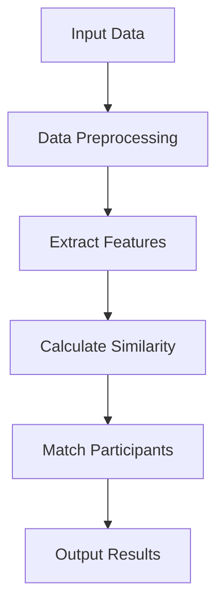
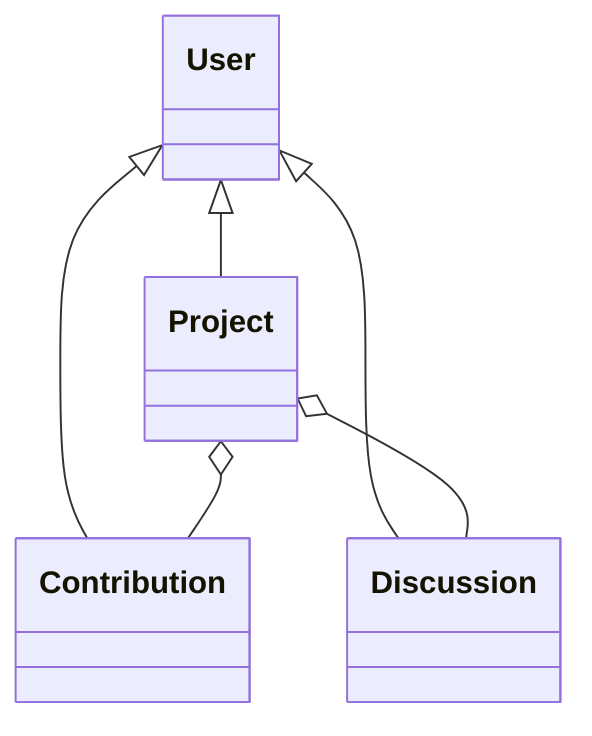
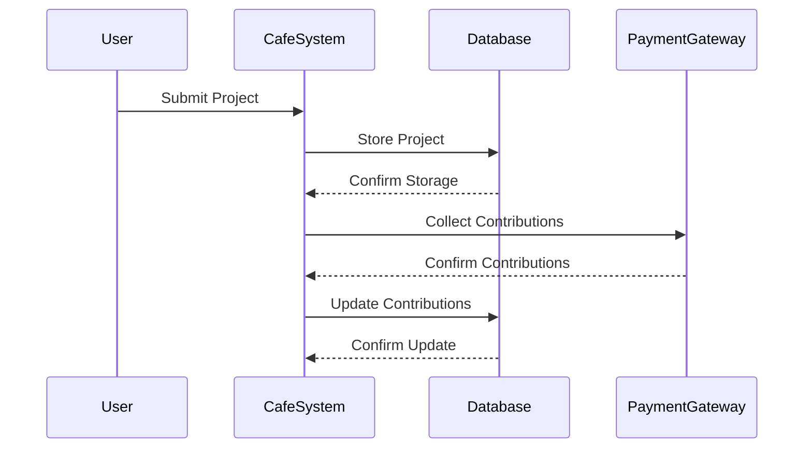
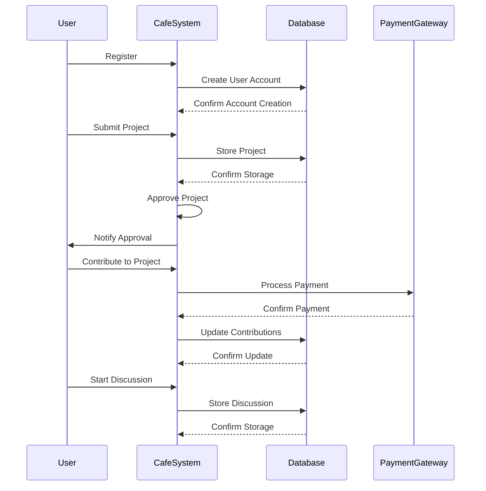

                 


## Meaningful Crowdfunding Cafes: A Global Physical Space for Value Exchange

### Keywords: Crowdfunding, Cafes, Value Exchange, Community, Technology

> Abstract: This article delves into the concept of meaningful crowdfunding cafes, which serve as global physical spaces for value exchange. We explore the background, core concepts, algorithm principles, system architecture, and practical applications of such cafes, emphasizing their role in fostering a community driven by shared values.

## Introduction to the Background

### 1.1 Problem Background

#### 1.1.1 Social Issues and Challenges

In today's fast-paced world, society faces numerous challenges such as increasing loneliness, lack of meaningful connections, and a growing sense of isolation. These issues are often exacerbated by the digital age, where physical interactions are replaced by online communications. The need for spaces that foster real human connections and allow for the exchange of values has never been more crucial.

#### 1.1.2 The Concept and Rise of Crowdfunding Cafes

Crowdfunding cafes are a unique concept that combines the traditional social hub of a café with the modern approach of crowdfunding. They provide a physical space where people can come together, share ideas, and support each other's projects and initiatives. This model has gained popularity in recent years due to its ability to create a sense of community and promote social responsibility.

#### 1.1.3 The Importance of Value Exchange

Value exchange is the process by which individuals contribute to and receive benefits from a shared system. In the context of crowdfunding cafes, value exchange happens through the donation of money, time, or resources. This exchange fosters a sense of belonging and purpose, which is essential for building strong communities.

### 1.2 Problem Statement

#### 1.2.1 Current State of Crowdfunding Cafes

While crowdfunding cafes have gained traction, they still face several challenges. Many cafes struggle with funding, operational sustainability, and a lack of engagement from both patrons and contributors. This hinders their ability to create a meaningful impact and sustain long-term growth.

#### 1.2.2 Existing Issues and Challenges

Some of the key challenges faced by crowdfunding cafes include:

- Limited resources for marketing and promotion
- Difficulty in attracting a diverse range of patrons and contributors
- Ineffective strategies for value exchange and community engagement

#### 1.2.3 The Need for Solutions

To overcome these challenges, there is a need for innovative solutions that can help crowdfunding cafes become more sustainable, engaging, and impactful. This involves not only addressing the operational and financial aspects but also fostering a strong sense of community and shared values among patrons and contributors.

### 1.3 Problem Solving

#### 1.3.1 The Concept of Meaningful Crowdfunding Cafes

Meaningful crowdfunding cafes are designed to address the challenges faced by traditional crowdfunding cafes. They focus on creating a physical space that promotes value exchange, community building, and social impact. These cafes are built around a set of core values that guide their operations and decision-making processes.

#### 1.3.2 Innovative Value Exchange Models

Meaningful crowdfunding cafes introduce innovative value exchange models that go beyond traditional crowdfunding. They incorporate elements such as social tokens, community governance, and reward-based participation to create a more engaging and sustainable system.

#### 1.3.3 Strategic Planning for Sustainability

To ensure long-term sustainability, meaningful crowdfunding cafes need to develop strategic plans that address financial viability, operational efficiency, and community engagement. This involves a combination of innovative business models, effective marketing strategies, and community-driven initiatives.

### 1.4 Boundaries and Extensions

#### 1.4.1 Classification of Crowdfunding Cafes

Crowdfunding cafes can be classified based on their focus areas, such as environmental sustainability, social impact, or cultural exchange. This classification helps in understanding the diverse range of approaches and objectives within the sector.

#### 1.4.2 Target Audience and Positioning

Meaningful crowdfunding cafes need to define their target audience and positioning to effectively attract and engage patrons and contributors. This involves understanding the needs and preferences of different user segments and tailoring the offerings accordingly.

#### 1.4.3 Market Opportunities and Competitive Analysis

By analyzing the market landscape and understanding the competitive dynamics, meaningful crowdfunding cafes can identify opportunities for differentiation and growth. This involves assessing the strengths and weaknesses of competitors and developing strategies to capitalize on market gaps.

### 1.5 Concept Structure and Core Elements

#### 1.5.1 Core Concept Introduction

The core concept of meaningful crowdfunding cafes revolves around creating a physical space that fosters value exchange and community building. This concept is underpinned by a set of core values and principles that guide the operations and decision-making processes.

#### 1.5.2 Analysis of Core Elements

The key elements of meaningful crowdfunding cafes include the physical space, the community, the value exchange mechanism, and the strategic planning. Each element plays a crucial role in creating a sustainable and impactful ecosystem.

#### 1.5.3 Interconnections Between Concepts

The interconnections between the core concepts of meaningful crowdfunding cafes form a cohesive framework that ensures the seamless functioning of the ecosystem. Understanding these interconnections is essential for developing a comprehensive understanding of the concept.

### 1.6 Conclusion

In conclusion, meaningful crowdfunding cafes offer a promising solution to the challenges faced by traditional crowdfunding cafes. By focusing on value exchange, community building, and strategic planning, these cafes can create a sustainable and impactful model for the future. The next sections of this article will delve deeper into the core concepts, algorithm principles, system architecture, and practical applications of meaningful crowdfunding cafes.

## Core Concepts and Relationships

### 2.1 The Principles of Value Exchange

#### 2.1.1 Definition of Value Exchange

Value exchange refers to the process by which individuals or entities exchange goods, services, or resources in order to meet their needs or achieve their goals. In the context of crowdfunding cafes, value exchange involves the donation of money, time, or resources in return for a tangible or intangible benefit.

#### 2.1.2 Importance of Value Exchange

Value exchange is a fundamental aspect of human society and plays a crucial role in fostering social cohesion and economic development. In the context of crowdfunding cafes, value exchange is essential for creating a sense of community, promoting social responsibility, and driving social impact.

#### 2.1.3 Basic Models of Value Exchange

There are several basic models of value exchange, including direct exchange, indirect exchange, and social exchange. Each model has its own advantages and disadvantages and can be applied in different contexts. Understanding these models is important for designing effective value exchange systems in crowdfunding cafes.

### 2.2 Characteristics of Meaningful Crowdfunding Cafes

#### 2.2.1 The Concept of Meaningful Crowdfunding

Meaningful crowdfunding is a concept that goes beyond traditional crowdfunding by emphasizing the importance of value exchange and community engagement. It focuses on creating a physical space that promotes social impact, sustainable development, and cultural exchange.

#### 2.2.2 Building a Value-Driven Café

A meaningful crowdfunding café is designed to build a value-driven community by fostering a shared sense of purpose and promoting social responsibility. This involves creating a physical space that reflects the core values of the café and encouraging patrons to engage in value-creating activities.

#### 2.2.3 Community Participation and Interaction

Community participation and interaction are key elements of meaningful crowdfunding cafes. By encouraging patrons to participate in the decision-making process and contribute to the café's initiatives, these cafes create a sense of ownership and belonging among their members.

### 2.3 Comparative Analysis of Core Concepts

#### 2.3.1 Traditional Cafes vs. Meaningful Crowdfunding Cafes

A comparative analysis of traditional cafes and meaningful crowdfunding cafes highlights the key differences in their value propositions, operational models, and community dynamics. While traditional cafes focus on providing a comfortable space for socializing, meaningful crowdfunding cafes emphasize value exchange, community engagement, and social impact.

#### 2.3.2 Crowdfunding vs. Traditional Crowdfunding

Meaningful crowdfunding is different from traditional crowdfunding in terms of its focus on value exchange, community building, and social impact. While traditional crowdfunding platforms primarily aim to raise funds for specific projects, meaningful crowdfunding cafes seek to create a sustainable and impactful model for social change.

### 2.4 ER Entity Relationship Diagram

#### 2.4.1 Identification of Entities and Relationships

The ER entity relationship diagram provides a visual representation of the key entities and relationships involved in meaningful crowdfunding cafes. This diagram helps in understanding the structure of the system and the interactions between its components.

#### 2.4.2 Drawing and Explanation of the ER Diagram

The ER diagram for meaningful crowdfunding cafes includes entities such as patrons, contributors, projects, and the café itself. Relationships between these entities, such as donation, participation, and support, are also depicted in the diagram.

### 2.5 Interconnections Between Concepts

#### 2.5.1 Integration of Crowdfunding and Value Exchange

The integration of crowdfunding and value exchange is at the heart of meaningful crowdfunding cafes. By combining the principles of crowdfunding with a focus on value exchange, these cafes create a unique ecosystem that fosters social impact and community building.

#### 2.5.2 Multidimensional Value Creation

Meaningful crowdfunding cafes offer multidimensional value creation by promoting social impact, economic development, and cultural exchange. This multifaceted approach ensures that the cafes not only meet the financial needs of patrons and contributors but also address broader societal issues.

### 2.6 Conclusion

In conclusion, meaningful crowdfunding cafes represent a promising model for creating a sustainable and impactful social ecosystem. By focusing on value exchange, community engagement, and strategic planning, these cafes can address the challenges faced by traditional crowdfunding models and contribute to the broader goal of fostering social cohesion and development. The next sections of this article will delve deeper into the algorithm principles and system architecture that enable the functioning of meaningful crowdfunding cafes.

## Explanation of Algorithm Principles

### 3.1 Value Assessment Algorithm

#### 3.1.1 Overview of the Algorithm

The value assessment algorithm is designed to evaluate the value contributed by patrons and contributors in meaningful crowdfunding cafes. It provides a quantitative measure of the value created through their participation, which is essential for determining rewards, incentives, and other benefits.

#### 3.1.2 Algorithm Workflow

The algorithm workflow consists of several key steps:

1. **Data Collection**: Gather data on contributions, participation levels, and other relevant metrics from patrons and contributors.
2. **Data Preprocessing**: Clean and preprocess the collected data to remove any inconsistencies or errors.
3. **Value Calculation**: Use a set of predefined formulas and metrics to calculate the value contributed by each participant.
4. **Ranking and Classification**: Rank participants based on their value contributions and classify them into different categories for rewards and incentives.

#### 3.1.3 Python Source Code Implementation

Here's a high-level Python code snippet illustrating the implementation of the value assessment algorithm:

```python
# Import required libraries
import pandas as pd
from sklearn.preprocessing import MinMaxScaler

# Load and preprocess data
data = pd.read_csv('contributions.csv')
data = data.dropna()

# Calculate value contributions
data['value'] = data['donations'] * data['time_spent']

# Scale the value contributions
scaler = MinMaxScaler()
data['scaled_value'] = scaler.fit_transform(data[['value']])

# Rank participants
data_sorted = data.sort_values(by='scaled_value', ascending=False)

# Define reward categories
reward_categories = {
    'High Value': data_sorted.head(10),
    'Medium Value': data_sorted.tail(20).iloc[10:30],
    'Low Value': data_sorted.tail(30).iloc[30:]
}

# Assign rewards based on categories
for category, participants in reward_categories.items():
    print(f"{category}:")
    for participant in participants:
        print(f"- {participant['name']}")
```

### 3.2 Meaningful Matching Algorithm

#### 3.2.1 Algorithm Principles

The meaningful matching algorithm is designed to match patrons and contributors based on their values, interests, and goals. It aims to create a harmonious and engaging community where individuals can collaborate and support each other's projects.

#### 3.2.2 Mermaid Flowchart

Here's a Mermaid flowchart illustrating the workflow of the meaningful matching algorithm:



### 3.2.3 Python Source Code Implementation

Below is a Python code snippet demonstrating the implementation of the meaningful matching algorithm:

```python
# Import required libraries
import pandas as pd
from sklearn.metrics.pairwise import cosine_similarity
from sklearn.feature_extraction.text import TfidfVectorizer

# Load and preprocess data
data = pd.read_csv('user_data.csv')
data = data.dropna()

# Extract features using TF-IDF
vectorizer = TfidfVectorizer()
X = vectorizer.fit_transform(data[['interests', 'goals', 'values']])

# Calculate similarity scores
similarity_matrix = cosine_similarity(X)

# Match participants
matches = {}
for i in range(len(data)):
    matches[i] = []
    for j in range(len(data)):
        if i != j:
            similarity_score = similarity_matrix[i][j]
            if similarity_score > 0.8:
                matches[i].append(j)

# Output matches
for user_id, match_list in matches.items():
    print(f"User {user_id} matches:")
    for match_id in match_list:
        print(f"- {data.loc[match_id, 'name']}")
```

### 3.3 User Participation Analysis Algorithm

#### 3.3.1 Algorithm Design

The user participation analysis algorithm is designed to analyze the participation levels of patrons and contributors in meaningful crowdfunding cafes. It provides insights into user engagement, activity patterns, and the overall health of the community.

#### 3.3.2 Mathematical Model and Formulas

The algorithm uses the following mathematical model to analyze user participation:

$$
P = \frac{C + T + D}{3}
$$

Where:
- \(P\) is the participation score.
- \(C\) is the number of contributions made by the user.
- \(T\) is the total time spent by the user in the café.
- \(D\) is the number of discussions initiated by the user.

#### 3.3.3 Python Source Code Implementation and Example

Here's a Python code snippet illustrating the implementation of the user participation analysis algorithm:

```python
# Import required libraries
import pandas as pd

# Load and preprocess data
data = pd.read_csv('user_participation.csv')
data = data.dropna()

# Calculate participation scores
data['participation_score'] = (data['contributions'] + data['time_spent'] + data['discussions']) / 3

# Sort users by participation score
data_sorted = data.sort_values(by='participation_score', ascending=False)

# Output top 10 participants
print("Top 10 participants by participation score:")
print(data_sorted.head(10))
```

### 3.4 Data Analysis and Feedback Optimization

#### 3.4.1 Data Collection and Preprocessing

Data collection involves gathering various metrics related to user participation, contributions, and engagement. The collected data needs to be preprocessed to remove any inconsistencies, errors, or missing values.

#### 3.4.2 Analysis Methods and Tools

Data analysis methods and tools used in this section include:

- **Descriptive Statistics**: To summarize and describe the main characteristics of the data.
- **Correlation Analysis**: To identify relationships between different variables.
- **Regression Analysis**: To predict user behavior based on historical data.

#### 3.4.3 Feedback Optimization Strategies

Based on the analysis results, feedback optimization strategies can be implemented to improve user engagement and participation. This may involve:

- **Personalized Recommendations**: To suggest relevant projects or discussions based on user preferences and behavior.
- **Incentive Programs**: To motivate users to participate more actively by offering rewards or recognition.
- **Community Management**: To foster a positive and engaging community environment through effective communication and moderation.

### 3.5 Conclusion

In conclusion, the algorithm principles discussed in this section provide a foundation for understanding the technical aspects of meaningful crowdfunding cafes. By implementing these algorithms, crowdfunding cafes can create a more engaging, sustainable, and impactful community. The next sections will delve into the system architecture and practical applications of meaningful crowdfunding cafes.

## System Analysis and Architectural Design

### 4.1 Introduction to the Problem Scenario

#### 4.1.1 Operational Workflow of Crowdfunding Cafes

The operational workflow of crowdfunding cafes involves several key steps, including:

1. **Project Submission**: Users submit their project proposals to the café, detailing their goals, objectives, and funding requirements.
2. **Project Review**: The café staff review the submitted projects to ensure they align with the café's values and objectives.
3. **Project Promotion**: The café promotes the approved projects to its community members, encouraging participation and contribution.
4. **Funding Collection**: Funds are collected from patrons and contributors, who can choose to donate money, time, or resources.
5. **Project Implementation**: Approved projects are implemented with the support of the café's community members.
6. **Project Evaluation**: The success of the projects is evaluated based on predefined criteria, and the results are shared with the community.

#### 4.1.2 System Requirements Analysis

To effectively support the operational workflow of crowdfunding cafes, the system needs to meet the following requirements:

- **Scalability**: The system should be able to handle a growing number of users, projects, and contributions.
- **Security**: The system should ensure the confidentiality, integrity, and availability of user data and transactions.
- **Usability**: The system should provide a user-friendly interface that is easy to navigate and understand.
- **Flexibility**: The system should allow for customization and adaptation to different types of crowdfunding projects and values.

### 4.2 System Function Design

#### 4.2.1 Domain Model Introduction

The domain model for crowdfunding cafes includes several key entities and their relationships:

- **User**: Represents a patron or contributor to the café.
- **Project**: Represents a project submitted by a user seeking funding and support.
- **Contribution**: Represents the financial or non-financial support provided by a user to a project.
- **Discussion**: Represents the discussions and interactions among users related to a specific project.

#### 4.2.2 Mermaid Class Diagram

Below is a Mermaid class diagram illustrating the domain model for crowdfunding cafes:



### 4.3 System Architectural Design

#### 4.3.1 Architectural Design Principles

The architectural design of the crowdfunding café system follows several key principles:

- **Modularity**: The system is designed to be modular, with each component responsible for a specific function.
- **Decentralization**: The system is decentralized, with no single point of failure.
- **Scalability**: The system can scale horizontally and vertically to accommodate growing demand.
- **Security**: The system incorporates robust security measures to protect user data and transactions.

#### 4.3.2 Mermaid Architecture Diagram

Here's a Mermaid architecture diagram illustrating the overall system architecture for crowdfunding cafes:



### 4.4 System Interface Design

#### 4.4.1 Interface Definition

The system interfaces for crowdfunding cafes include:

- **User Interface (UI)**: Provides a user-friendly interface for users to submit projects, make contributions, and participate in discussions.
- **Application Programming Interface (API)**: Allows external systems and services to interact with the crowdfunding café system.
- **Payment Interface**: Handles the processing and verification of payments made by users.

#### 4.4.2 RESTful API Design

Below is an example of a RESTful API design for the crowdfunding café system:

```
GET /projects - Retrieve a list of projects
POST /projects - Submit a new project
GET /projects/{project_id} - Retrieve details of a specific project
PUT /projects/{project_id} - Update details of a specific project
DELETE /projects/{project_id} - Delete a specific project
GET /contributions - Retrieve a list of contributions
POST /contributions - Make a new contribution
GET /contributions/{contribution_id} - Retrieve details of a specific contribution
PUT /contributions/{contribution_id} - Update details of a specific contribution
DELETE /contributions/{contribution_id} - Delete a specific contribution
GET /discussions - Retrieve a list of discussions
POST /discussions - Start a new discussion
GET /discussions/{discussion_id} - Retrieve details of a specific discussion
PUT /discussions/{discussion_id} - Update details of a specific discussion
DELETE /discussions/{discussion_id} - Delete a specific discussion
```

### 4.5 System Interaction Design

#### 4.5.1 User Interaction Workflow

The user interaction workflow for crowdfunding cafes involves the following steps:

1. **User Registration**: Users register on the café platform using their email address or social media accounts.
2. **Project Submission**: Users submit their project proposals, including details such as project name, description, funding goal, and timeline.
3. **Project Approval**: Café staff review the submitted projects and approve or reject them based on predefined criteria.
4. **Project Promotion**: Approved projects are promoted to the café community through various channels, including email notifications and social media posts.
5. **User Participation**: Users can choose to contribute to the projects they are interested in, either financially or through other means such as time or resources.
6. **Discussion and Collaboration**: Users can engage in discussions and collaborate on the projects they are contributing to, fostering a sense of community and shared purpose.
7. **Project Implementation and Evaluation**: Projects are implemented with the support of the café community, and their progress and success are evaluated based on predefined criteria.

#### 4.5.2 Mermaid Sequence Diagram

Below is a Mermaid sequence diagram illustrating the user interaction workflow for crowdfunding cafes:



### 4.6 Conclusion

In conclusion, the system analysis and architectural design for meaningful crowdfunding cafes provide a comprehensive framework for developing a sustainable and impactful social ecosystem. By following the principles of modularity, decentralization, scalability, and security, the system can effectively support the operational workflow, user interaction, and community engagement aspects of crowdfunding cafes. The next section will delve into the practical implementation and application of these concepts in real-world scenarios.

