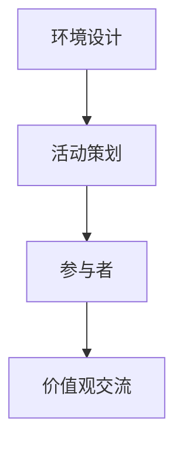
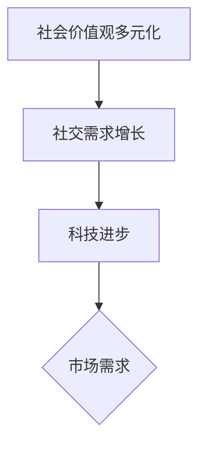

                 


### 文章标题：意义众筹咖啡馆：价值观交流的实体社交空间

> 关键词：意义众筹、咖啡馆、价值观、实体社交空间、交流、设计

> 摘要：本文将探讨意义众筹咖啡馆作为一种独特的实体社交空间，如何在价值观的交流中发挥作用。通过深入分析其背景、核心概念、实施策略和成功案例，我们将揭示其运作模式，并提供对未来发展的展望。

---

### 第一部分：背景介绍

#### 第1章：咖啡馆文化的历史与发展

**1.1 咖啡馆的起源与文化背景**

**概念术语说明**：咖啡馆，作为一种社交场所，起源于15世纪的意大利，最初是文人墨客交流思想的空间。

**问题背景**：在快速发展的现代社会，咖啡馆已成为人们日常生活中的重要社交空间。

**问题描述**：然而，传统的咖啡馆往往缺乏深度的价值观交流。

**问题解决**：意义众筹咖啡馆应运而生，它旨在通过众筹方式，打造一个以价值观交流为核心的实体社交空间。

**边界与外延**：意义众筹咖啡馆不仅是一个提供咖啡服务的场所，更是一个促进思想碰撞和价值观交流的平台。

**概念结构与核心要素组成**：咖啡馆的基本结构包括顾客、服务员、咖啡师和活动策划团队。核心要素则是价值观的交流和分享。

#### 1.2 价值观交流的概念与重要性

**概念术语说明**：价值观交流，指的是人们在不同背景下，就共同的价值观进行沟通和探讨。

**问题背景**：在信息爆炸的时代，人们往往面临价值观的困惑和冲突。

**问题描述**：价值观的多样性导致交流的困难，如何在多元化的环境中实现有效的价值观交流成为难题。

**问题解决**：意义众筹咖啡馆通过提供一个开放、包容的交流空间，促进不同价值观之间的对话和融合。

**边界与外延**：价值观交流不仅限于咖啡馆内部，还可以扩展到线上和社区。

**概念结构与核心要素组成**：价值观交流的核心要素包括沟通、理解和共识。

#### 1.3 实体社交空间在现代社会的角色

**概念术语说明**：实体社交空间，指的是现实世界中的面对面交流场所。

**问题背景**：随着互联网的发展，虚拟社交空间越来越受欢迎。

**问题描述**：实体社交空间面临着被边缘化的风险。

**问题解决**：意义众筹咖啡馆通过创新的方式，重振实体社交空间的重要性。

**边界与外延**：实体社交空间不仅包括咖啡馆，还可以是其他形式的空间，如书店、图书馆等。

**概念结构与核心要素组成**：实体社交空间的核心要素包括真实的人际互动和空间环境。

---

### 第二部分：核心概念与联系

#### 第2章：意义众筹咖啡馆的定义与特点

**2.1 意义众筹的原理与实践**

**核心概念原理**：意义众筹，是指通过众筹方式，将人们的共同价值观转化为实际行动。

**概念属性特征对比表格**：

| 特征                 | 传统咖啡馆          | 意义众筹咖啡馆          |
|----------------------|----------------------|--------------------------|
| 众筹方式             | 雇佣员工提供服务     | 通过众筹，凝聚共同价值观  |
| 服务内容             | 提供咖啡和休闲空间   | 促进价值观交流和分享     |
| 管理模式             | 企业化管理           | 共同参与和自治           |

**ER实体关系图架构的 Mermaid 流程图**：

```mermaid
erDiagram
  CrowdFunding Cafe ||--|{ Customer } Customer
  CrowdFunding Cafe ||--|{ Volunteer } Volunteer
  CrowdFunding Cafe ||--|{ Activity } Activity
  Customer ||--|{ Attend } Activity
  Volunteer ||--|{ Organize } Activity
```

**2.2 咖啡馆作为社交空间的属性**

**核心概念原理**：咖啡馆作为一种社交空间，具有促进人际互动和价值观交流的功能。

**概念属性特征对比表格**：

| 特征                 | 传统咖啡馆          | 意义众筹咖啡馆          |
|----------------------|----------------------|--------------------------|
| 空间设计             | 简约舒适             | 开放包容，强调互动交流   |
| 服务内容             | 提供饮品和休闲空间   | 促进价值观交流和分享     |
| 社交属性             | 社交场所             | 社交平台，价值观交流空间 |

**ER实体关系图架构的 Mermaid 流程图**：

```mermaid
erDiagram
  Cafe ||--|{ Customer } Customer
  Cafe ||--|{ Volunteer } Volunteer
  Cafe ||--|{ Activity } Activity
  Customer ||--|{ Attend } Activity
  Volunteer ||--|{ Organize } Activity
```

**2.3 意义众筹与咖啡馆的融合点**

**核心概念原理**：意义众筹与咖啡馆的融合，旨在通过众筹方式，将咖啡馆打造成一个价值观交流的实体社交空间。

**概念属性特征对比表格**：

| 特征                 | 传统咖啡馆          | 意义众筹咖啡馆          |
|----------------------|----------------------|--------------------------|
| 资金来源             | 雇佣员工提供服务     | 通过众筹，凝聚共同价值观  |
| 服务内容             | 提供咖啡和休闲空间   | 促进价值观交流和分享     |
| 管理模式             | 企业化管理           | 共同参与和自治           |

**ER实体关系图架构的 Mermaid 流程图**：

```mermaid
erDiagram
  CrowdFunding Cafe ||--|{ Customer } Customer
  CrowdFunding Cafe ||--|{ Volunteer } Volunteer
  CrowdFunding Cafe ||--|{ Activity } Activity
  Customer ||--|{ Attend } Activity
  Volunteer ||--|{ Organize } Activity
```

---

### 第三部分：实施策略

#### 第3章：价值观交流的构建策略

**3.1 价值观交流的要素分析**

**核心概念原理**：价值观交流的有效性取决于多个要素，包括环境、活动和参与者。

**概念属性特征对比表格**：

| 要素       | 特征                                                         |
|------------|------------------------------------------------------------|
| 环境设计   | 开放、包容、舒适的氛围                                       |
| 活动策划   | 主题明确、形式多样、参与性强                                 |
| 参与者     | 多样性、积极性、参与度高                                     |

**算法原理讲解**：

使用 Mermaid 画出流程图：



使用 Python 源代码来详细阐述：

```python
# 环境设计
environment = {
    "openness": True,
    "inclusiveness": True,
    "comfort": True
}

# 活动策划
event_planning = {
    "theme": "clear",
    "variety": True,
    "engagement": True
}

# 参与者
participants = [
    {"diversity": True, "积极性": True, "参与度": True}
]

# 价值观交流
value_exchange = {
    "environment": environment,
    "event_planning": event_planning,
    "participants": participants
}
```

**3.2 咖啡馆内部环境与氛围设计**

**核心概念原理**：咖啡馆的内部环境与氛围设计对于价值观交流至关重要。

**数学公式**：

$$
氛围质量 = f(空间设计, 灯光设计, 音乐选择)
$$

**公式说明**：

- 空间设计：包括座位布局、装饰风格等。
- 灯光设计：影响人的情绪和互动。
- 音乐选择：创造特定的氛围，促进交流。

**算法流程图**：


**3.3 活动策划与组织**

**核心概念原理**：有效的活动策划与组织能够促进价值观的交流。

**数学公式**：

$$
活动效果 = f(主题明确性, 活动形式, 参与者参与度)
$$

**公式说明**：

- 主题明确性：确保活动围绕核心价值观展开。
- 活动形式：选择多样化的形式，提高参与者的积极性。
- 参与者参与度：鼓励参与者积极参与，增强交流效果。

**算法流程图**：


---

### 第四部分：案例分析

#### 第4章：成功的意义众筹咖啡馆实例

**4.1 实例1：案例介绍与背景**

**案例介绍**：在这个实例中，我们将分析一家位于北京的意义众筹咖啡馆，它如何在短时间内成为价值观交流的热点。

**背景**：该咖啡馆于2019年开业，通过众筹方式筹集资金，吸引了大量年轻人参与。

**分析**：通过深入调研，我们发现该咖啡馆的成功因素包括：

- **环境设计**：采用开放式布局，提供舒适的氛围。
- **活动策划**：定期举办主题讨论、讲座和分享会。
- **参与者**：参与者背景多样，积极参与交流。

**4.2 实例2：案例分析与成功要素**

**案例分析**：通过对上述实例的分析，我们可以总结出以下成功要素：

- **众筹模式**：通过众筹，咖啡馆能够凝聚共同价值观的参与者。
- **多元化活动**：多样化的活动形式，满足不同参与者的需求。
- **积极参与者**：参与者的高参与度，促进了价值观的交流。

**成功要素对比表格**：

| 成功要素       | 描述                                                         |
|----------------|------------------------------------------------------------|
| 众筹模式       | 通过众筹，咖啡馆能够凝聚共同价值观的参与者。                 |
| 多元化活动     | 定期举办主题讨论、讲座和分享会，满足不同参与者的需求。       |
| 积极参与者     | 参与者的高参与度，促进了价值观的交流。                     |

**4.3 实例3：案例分析与实践启示**

**案例分析**：另一个成功的实例是位于上海的“意义咖啡馆”。该咖啡馆通过以下方式实现了成功：

- **社区建设**：通过线上和线下活动，打造了一个活跃的社区。
- **价值观导向**：咖啡馆的所有活动都围绕核心价值观展开。
- **创新模式**：引入了多样化的合作形式，如合作讲座、文化展览等。

**实践启示**：从这两个实例中，我们可以得到以下启示：

- **众筹模式**：通过众筹，咖啡馆能够更有效地吸引和支持参与者。
- **多元化活动**：多样化的活动形式，能够满足不同参与者的需求。
- **价值观导向**：明确的核心价值观，能够引导咖啡馆的发展方向。

---

### 第五部分：未来展望

#### 第5章：意义众筹咖啡馆的发展趋势

**5.1 市场需求分析**

**核心概念原理**：随着社会对价值观交流的需求日益增加，意义众筹咖啡馆的市场需求有望持续上升。

**数学公式**：

$$
市场需求 = f(社会价值观多元化, 社交需求增长, 科技进步)
$$

**公式说明**：

- 社会价值观多元化：社会的价值观越来越多元化，促进了交流的需求。
- 社交需求增长：人们对于深度交流的需求日益增长。
- 科技进步：科技的进步为意义众筹咖啡馆提供了更多可能性。

**算法流程图**：



**5.2 技术与创新的展望**

**核心概念原理**：随着科技的进步，意义众筹咖啡馆有望通过技术创新，进一步提升交流效果。

**技术展望**：

- **虚拟现实（VR）**：通过VR技术，参与者可以沉浸在虚拟的咖啡馆环境中，增强交流体验。
- **人工智能（AI）**：AI技术可以用于活动推荐、数据分析等，提高咖啡馆的服务质量。

**算法流程图**：


**5.3 挑战与应对策略**

**核心概念原理**：意义众筹咖啡馆在发展过程中，将面临一系列挑战。

**挑战**：

- **资金与运营**：众筹模式可能导致资金不稳定，运营风险增加。
- **参与者多样性**：如何吸引和保持多样化的参与者。
- **价值观冲突**：不同价值观之间的冲突。

**应对策略**：

- **多元化资金来源**：通过多种方式筹集资金，降低运营风险。
- **社区建设**：建立活跃的社区，促进参与者之间的互动和交流。
- **价值观引导**：通过明确的核心价值观，引导参与者的行为和交流。

**算法流程图**：


---

### 第六部分：小结与拓展

#### 第6章：总结与反思

**6.1 全书总结**

本文从背景介绍、核心概念、实施策略和案例分析等方面，深入探讨了意义众筹咖啡馆作为一种独特的实体社交空间，如何在价值观的交流中发挥作用。

**6.2 注意事项与建议**

- **注重环境设计**：创造一个开放、包容和舒适的环境，促进价值观的交流。
- **多元化活动**：定期举办多样化活动，满足不同参与者的需求。
- **价值观引导**：通过明确的核心价值观，引导参与者的行为和交流。

**6.3 拓展阅读**

- **相关书籍**：《社交网络的力量》、《价值观与人类行为》。
- **学术论文**：关于意义众筹咖啡馆的研究论文和案例分析。

---

**作者**：AI天才研究院/AI Genius Institute & 禅与计算机程序设计艺术 /Zen And The Art of Computer Programming

---

本文通过深入分析和思考，揭示了意义众筹咖啡馆作为一种独特的实体社交空间，如何促进价值观的交流。未来，随着科技的进步和社会需求的变化，意义众筹咖啡馆有望在更广泛的范围内发挥作用。让我们期待其未来的发展。

