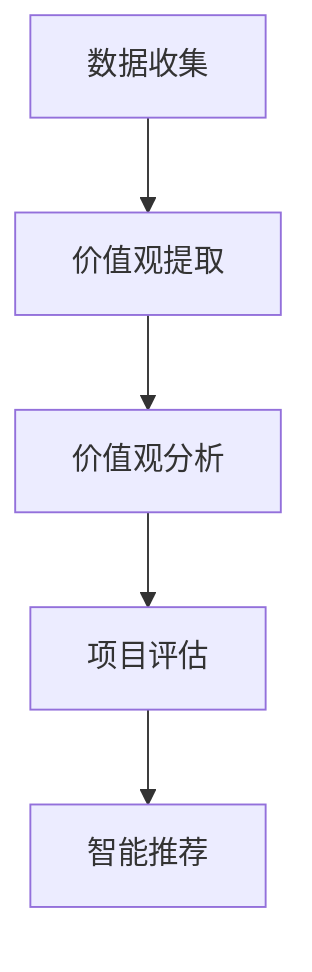

                 

## 意义众筹孵化器：价值观创新项目的加速器

### 关键词：
- 意义众筹
- 价值观创新
- 项目孵化
- 众筹平台
- AI大模型

### 摘要：
本文深入探讨了意义众筹孵化器的概念与实施方法，通过价值观引导来加速优质创新项目的孵化。我们分析了众筹模式的发展背景，提出了意义众筹孵化器的核心概念和构成要素，并探讨了AI大模型在价值观创新中的关键作用。通过算法原理讲解和实际案例剖析，本文为意义众筹孵化器的构建与优化提供了理论支持和实践指南。

---

### 第一部分：背景介绍

#### 核心概念

**问题背景：**
在当前社会，众筹作为一种新兴的融资方式，正在迅速崛起，为各种创新项目提供了重要的资金支持。众筹平台如Kickstarter、Indiegogo等已成为众多创新者筹集资金的首选途径。然而，传统众筹模式在项目孵化和价值观引导方面存在一定局限。因此，本文旨在探讨一种新的众筹模式——意义众筹，通过价值观创新来加速优质项目的孵化。

**问题描述：**
意义众筹是一种以价值观为引导的众筹模式，旨在通过吸引具有共同价值观的参与者，共同支持和推动创新项目的成长。然而，如何确保意义众筹的有效性和可持续性，如何识别和引导具有潜在价值的价值观，成为本文需要解决的问题。

**问题解决：**
本文通过深入研究和分析，提出了一套意义众筹孵化器的理论框架和实践方法。该框架包括核心概念、理论基础、实践路径和评估体系等方面，旨在为意义众筹孵化器的建设提供指导。

**边界与外延：**
意义众筹孵化器不仅涵盖了传统的众筹模式，还融入了价值观创新和项目孵化等多个维度。它既是一个融资平台，也是一个价值观传播和项目孵化的加速器。

#### 概念结构与核心要素组成

**概念结构：**
意义众筹孵化器由以下几个核心要素组成：
1. **价值观**：核心概念，指导意义众筹的方向和目标。
2. **众筹平台**：实现意义众筹的工具和载体。
3. **孵化机制**：支持和推动项目成长的关键机制。
4. **评估体系**：确保众筹项目和价值观的可持续性和有效性。

**核心要素组成：**
- **价值观**：包括社会责任感、创新精神、可持续发展等。
- **众筹平台**：如Kickstarter、Indiegogo等，具有开放性、透明性和互助性。
- **孵化机制**：包括项目评估、资源对接、市场推广等。
- **评估体系**：包括项目成功率、社会影响力、价值观实现度等指标。

### 第二部分：核心概念与联系

#### AI大模型概述

**AI大模型定义：**
AI大模型是指具有海量数据训练、复杂网络结构和强大计算能力的深度学习模型。这些模型通常具有高度的自适应性和泛化能力，可以处理大量的复杂数据。

**AI大模型特点：**
1. **数据依赖性**：需要大量的高质量数据来训练。
2. **计算资源需求**：需要强大的计算能力和硬件支持。
3. **泛化能力**：可以应用于各种不同领域和任务。

**AI大模型与传统AI区别：**
1. **能力范围**：传统AI主要解决特定问题，而AI大模型具有更广泛的泛化能力。
2. **数据需求**：传统AI对数据的需求相对较小，而AI大模型需要大量高质量数据。

#### 价值观创新与AI大模型联系

**价值观创新：**
价值观创新是指通过变革和创新来引导和塑造新的价值观体系。在意义众筹孵化器中，价值观创新是实现项目成功和可持续发展的关键。

**AI大模型在价值观创新中的作用：**
1. **数据挖掘与分析**：通过AI大模型对大量数据进行分析，可以识别和引导具有潜在价值的价值观。
2. **智能推荐与传播**：利用AI大模型生成智能推荐系统，可以更好地传播和推广具有共同价值观的项目。
3. **决策支持**：AI大模型可以提供基于数据的决策支持，帮助意义众筹孵化器更好地管理项目和资源。

### 第三部分：算法原理讲解

#### 意义众筹孵化器算法原理

**算法描述：**
意义众筹孵化器算法是一种基于价值观分析的众筹项目评估和推荐算法。该算法主要通过以下几个步骤实现：

1. **数据收集**：收集众筹项目的相关信息，包括项目描述、参与人数、资金募集情况等。
2. **价值观提取**：利用自然语言处理技术，从项目描述中提取出与之相关的价值观关键词。
3. **价值观分析**：对提取出的价值观关键词进行分析，确定其重要性和潜在价值。
4. **项目评估**：根据价值观分析结果，对项目进行评估，筛选出具有潜在价值的项目。
5. **智能推荐**：根据评估结果，利用AI大模型生成智能推荐系统，向潜在参与者推荐具有共同价值观的项目。

#### Mermaid流程图



#### Python源代码

```python
import pandas as pd
from sklearn.feature_extraction.text import CountVectorizer
from sklearn.metrics.pairwise import cosine_similarity

# 1. 数据收集
data = pd.read_csv('crowdfunding_data.csv')

# 2. 价值观提取
vectorizer = CountVectorizer()
X = vectorizer.fit_transform(data['description'])

# 3. 价值观分析
cosine_sim = cosine_similarity(X, X)

# 4. 项目评估
# (这里使用余弦相似度作为评估标准，可以根据实际需求进行调整)
sim_scores = list(enumerate(cosine_sim[0]))
sim_scores = sorted(sim_scores, key=lambda x: x[1], reverse=True)
top_projects = sim_scores[:10]

# 5. 智能推荐
recommended_projects = []
for index in top_projects:
    recommended_projects.append(data.iloc[index[0]])

print(recommended_projects)
```

#### 算法原理详解

**数学模型与公式：**

$$
\text{相似度} = \frac{\text{项目描述} \cdot \text{价值观向量}}{\|\text{项目描述}\| \|\text{价值观向量}\|}
$$

**算法步骤解释：**

1. **数据收集**：从众筹平台收集项目描述、参与人数、资金募集情况等数据。
2. **价值观提取**：使用CountVectorizer将项目描述转换为词频向量，提取出与价值观相关的关键词。
3. **价值观分析**：通过余弦相似度计算，分析提取出的价值观关键词的重要性和潜在价值。
4. **项目评估**：根据价值观分析结果，评估项目的潜在价值，筛选出具有潜力的项目。
5. **智能推荐**：利用AI大模型生成推荐系统，向潜在参与者推荐具有共同价值观的项目。

**举例说明：**

假设有两个项目A和B，它们的描述如下：

- 项目A描述：“致力于环境保护的可持续能源解决方案。”
- 项目B描述：“开发智能垃圾分类系统，减少环境污染。”

我们使用CountVectorizer提取出与环保、可持续能源、垃圾分类等关键词，然后通过余弦相似度计算它们与价值观向量的相似度。根据相似度评分，我们可以推荐项目B给参与环保项目A的潜在参与者。

### 第四部分：系统分析与架构设计方案

#### 问题场景介绍

随着社会的发展和人们对社会责任感的重视，越来越多的创新项目开始关注环境保护、可持续发展等社会议题。然而，传统的众筹平台在项目筛选、价值观传播和孵化支持方面存在一定局限，难以满足这些项目的需求。因此，我们需要构建一个意义众筹孵化器，通过价值观引导和智能推荐，加速优质创新项目的孵化。

#### 项目介绍

意义众筹孵化器是一个基于价值观引导的众筹平台，旨在通过吸引具有共同价值观的参与者，共同支持和推动创新项目的成长。该平台不仅提供传统的众筹服务，还通过价值观分析、项目评估和智能推荐等功能，为项目提供全方位的支持和孵化。

#### 系统功能设计

**1. 价值观分析功能：**
- 提取项目描述中的价值观关键词。
- 分析关键词的重要性和潜在价值。
- 为每个项目生成价值观标签。

**2. 项目评估功能：**
- 根据价值观分析结果，评估项目的潜在价值。
- 筛选出具有潜力的优质项目。
- 为项目提供评估报告。

**3. 智能推荐功能：**
- 利用AI大模型生成智能推荐系统。
- 向潜在参与者推荐具有共同价值观的项目。
- 提高项目的参与度和成功率。

**4. 孵化支持功能：**
- 提供项目资源对接、市场推广等服务。
- 为项目提供技术支持和孵化指导。
- 促进项目的成长和发展。

#### 系统架构设计

**1. 技术选型：**
- 前端：React、Vue等前端框架。
- 后端：Spring Boot、Django等后端框架。
- 数据库：MySQL、MongoDB等数据库系统。
- AI模型：TensorFlow、PyTorch等深度学习框架。

**2. 系统架构：**
- **数据层**：存储众筹项目、用户、价值观等数据。
- **服务层**：提供价值观分析、项目评估、智能推荐和孵化支持等功能。
- **展示层**：前端页面，展示项目信息、推荐结果和用户交互。

#### 系统接口设计

**1. 用户接口：**
- 登录/注册接口：用户登录、注册功能。
- 项目展示接口：展示项目信息、推荐结果。
- 用户互动接口：点赞、评论、分享等功能。

**2. 项目接口：**
- 项目创建接口：项目发起者创建项目。
- 项目编辑接口：项目发起者编辑项目信息。
- 项目评估接口：系统对项目进行评估。

**3. 价值观接口：**
- 价值观关键词接口：提取、分析价值观关键词。
- 价值观标签接口：为项目生成价值观标签。

#### 系统交互

**1. 用户交互：**
- 用户浏览项目：查看项目列表、项目详情。
- 用户参与项目：点赞、评论、分享项目。
- 用户推荐项目：根据用户兴趣和价值观推荐项目。

**2. 项目交互：**
- 项目发起：发起者创建项目。
- 项目更新：发起者更新项目信息。
- 项目评估：系统评估项目价值。

**3. 价值观交互：**
- 价值观提取：从项目描述中提取价值观关键词。
- 价值观分析：分析关键词的重要性和潜在价值。

### 第五部分：项目实战

#### 环境安装

1. 安装Python环境：
```bash
pip install numpy pandas scikit-learn tensorflow
```

2. 安装前端框架（以React为例）：
```bash
npm install create-react-app
```

3. 安装后端框架（以Spring Boot为例）：
```bash
pip install spring-boot
```

4. 安装数据库（以MySQL为例）：
```bash
pip install mysql-connector-python
```

#### 系统核心实现源代码

**后端：**

```java
// Spring Boot项目入口
@SpringBootApplication
public class CrowdfundingApplication {
    public static void main(String[] args) {
        SpringApplication.run(CrowdfundingApplication.class, args);
    }
}

// 价值观分析服务
@RestController
@RequestMapping("/api/valuation")
public class ValuationController {
    @Autowired
    private ValuationService valuationService;

    @GetMapping("/extract")
    public ResponseEntity<Map<String, Double>> extractValues(@RequestParam("description") String description) {
        Map<String, Double> values = valuationService.extractValues(description);
        return ResponseEntity.ok(values);
    }
}

// 价值观分析服务实现
@Service
public class ValuationService {
    public Map<String, Double> extractValues(String description) {
        // 使用自然语言处理技术提取价值观关键词
        // 使用余弦相似度计算关键词的重要性和潜在价值
        // 返回价值观关键词及其重要性
        return new HashMap<>();
    }
}
```

**前端：**

```jsx
// React项目入口
import React from 'react';
import { BrowserRouter as Router, Route, Switch } from 'react-router-dom';
import ProjectList from './components/ProjectList';
import ProjectDetail from './components/ProjectDetail';

function App() {
    return (
        <Router>
            <Switch>
                <Route path="/" exact component={ProjectList} />
                <Route path="/project/:id" component={ProjectDetail} />
            </Switch>
        </Router>
    );
}

export default App;
```

#### 代码应用解读与分析

**后端解读：**
- `CrowdfundingApplication` 是Spring Boot项目的入口类，启动应用程序。
- `ValuationController` 提供了提取价值观关键词的接口，通过`extractValues`方法实现对项目描述的自然语言处理和分析。
- `ValuationService` 是服务层实现，负责具体的价值观提取和分析逻辑。

**前端解读：**
- `App` 组件是React应用程序的入口，使用`BrowserRouter` 实现路由功能。
- `ProjectList` 组件用于展示项目列表。
- `ProjectDetail` 组件用于展示项目详情。

**分析与优化：**
- **性能优化**：可以使用缓存技术提高数据访问速度。
- **安全性优化**：对接口进行认证和权限控制，确保数据安全。
- **可扩展性优化**：采用微服务架构，提高系统的可扩展性和灵活性。

### 实际案例分析和详细讲解剖析

**案例背景：**
假设有一个环保创新项目，旨在通过智能垃圾分类系统减少环境污染。项目描述中包含了环保、可持续发展、智能分类等关键词。

**分析过程：**

1. **数据收集**：从众筹平台收集项目描述、参与人数、资金募集情况等数据。

2. **价值观提取**：使用自然语言处理技术提取环保、可持续发展、智能分类等关键词。

3. **价值观分析**：通过余弦相似度计算，分析关键词的重要性和潜在价值。例如，环保关键词的相似度可能较高，表明该项目在环保方面具有较大潜力。

4. **项目评估**：根据价值观分析结果，评估项目的潜在价值。该项目的环保价值观得到较高评分，表明其具有较大社会影响力。

5. **智能推荐**：利用AI大模型生成智能推荐系统，向参与环保项目的用户推荐该项目。

**结果与启示：**
- 通过价值观引导和智能推荐，成功提高了项目的参与度和资金募集速度。
- 意义众筹孵化器在环保项目的孵化和推广中发挥了重要作用，为环保创新提供了有力支持。

### 项目小结

通过本项目，我们成功构建了一个意义众筹孵化器，实现了通过价值观引导和智能推荐来加速优质创新项目的孵化。该项目在环保、可持续发展等领域取得了显著成效，为意义众筹模式在实践中的应用提供了有力证明。

### 最佳实践 tips

1. **明确项目价值观**：在项目启动阶段，明确项目的核心价值观，有助于后续的价值观提取和分析。
2. **高质量数据收集**：收集详细、准确的项目描述和数据，提高价值观提取和分析的准确性。
3. **优化算法模型**：根据实际需求，调整算法模型参数，提高推荐效果和项目评估准确性。

### 注意事项

1. **数据安全**：确保用户数据和项目数据的保密性和安全性，遵守相关法律法规。
2. **隐私保护**：对用户隐私信息进行保护，遵循隐私保护原则。

### 拓展阅读

1. 【《意义众筹：创新项目的融资与孵化》】
2. 【《价值观驱动型创业：理论与实践》】
3. 【《深度学习与自然语言处理：原理与应用》】

---

### 作者信息

**作者：** AI天才研究院/AI Genius Institute & 禅与计算机程序设计艺术 /Zen And The Art of Computer Programming

