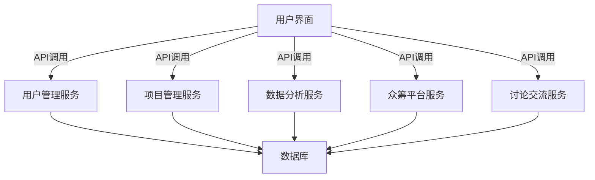

                 

# 《意义众筹实验室：集体探索生命价值的空间》

## 关键词

- 生命价值
- 意义众筹实验室
- 集体探索
- 人工智能
- 数据分析
- 系统架构

## 摘要

《意义众筹实验室：集体探索生命价值的空间》探讨了在人工智能和数据科学的时代，如何通过集体智慧和众筹机制，探索和实现生命的价值。本书旨在构建一个跨学科、跨领域的平台，让不同背景的人们共同参与到关于生命意义的探讨中，通过数据分析、系统架构设计、算法原理讲解等手段，实现对生命价值的量化与提升。本文将分步骤阐述书中的核心概念、理论框架、实践应用、系统设计与实现，以及最佳实践和总结。

### 目录大纲设计思路

在设计本书的目录大纲时，我们遵循了以下几个原则：

1. **逻辑清晰**：确保每个章节的内容都能紧密围绕主题展开，避免内容重复和交叉。
2. **内容全面**：涵盖从背景介绍到项目实战的各个阶段，确保读者能全面理解并掌握相关内容。
3. **实用性**：注重实践，通过具体的案例和操作步骤，帮助读者将理论知识应用到实际项目中。
4. **拓展性**：为读者提供拓展阅读和最佳实践建议，帮助他们进一步提升和深化对生命价值探索的理解。

具体的目录大纲设计如下：

#### 第一部分: 背景与核心概念

- **第1章: 问题的背景与描述**
  - **1.1 生命价值的探讨**
  - **1.2 意义众筹实验室的概念**
  - **1.3 问题解决与边界**
  - **1.4 概念结构与核心要素组成**

- **第2章: 核心概念与联系**
  - **2.1 意义众筹实验室的要素**
  - **2.2 生命价值的属性特征对比**
  - **2.3 ER实体关系图**

#### 第二部分: 理论与实践

- **第3章: 理论基础**
  - **3.1 意义众筹实验室的理论框架**
  - **3.2 生命价值的数学模型与公式**

- **第4章: 实践应用**
  - **4.1 意义众筹实验室的创建**
  - **4.2 集体探索生命价值的实践步骤**

#### 第三部分: 系统分析与架构设计

- **第5章: 系统设计与架构**
  - **5.1 功能设计**
  - **5.2 系统架构**
  - **5.3 接口设计**
  - **5.4 系统交互**

#### 第四部分: 项目实战

- **第6章: 项目实施**
  - **6.1 环境安装**
  - **6.2 系统核心实现**
  - **6.3 代码解读与分析**
  - **6.4 案例分析与讲解**

#### 第五部分: 最佳实践与总结

- **第7章: 最佳实践**
  - **7.1 实践中遇到的问题与解决方案**
  - **7.2 注意事项与拓展阅读**

- **第8章: 总结**
  - **8.1 核心内容回顾**
  - **8.2 未来展望与挑战**

通过这样的结构设计，我们希望本书能够帮助读者深入理解生命价值的探索过程，掌握意义众筹实验室的构建和应用，从而为个人和社会带来更多的价值。

### 目录大纲设计

```markdown
----------------------------------------------------------------
# 《意义众筹实验室：集体探索生命价值的空间》目录大纲

## 第一部分: 背景与核心概念

### 第1章: 问题的背景与描述
#### 1.1 生命价值的探讨
#### 1.2 意义众筹实验室的概念
#### 1.3 问题解决与边界
#### 1.4 概念结构与核心要素组成

### 第2章: 核心概念与联系
#### 2.1 意义众筹实验室的要素
#### 2.2 生命价值的属性特征对比
#### 2.3 ER实体关系图

## 第二部分: 理论与实践

### 第3章: 理论基础
#### 3.1 意义众筹实验室的理论框架
#### 3.2 生命价值的数学模型与公式

### 第4章: 实践应用
#### 4.1 意义众筹实验室的创建
#### 4.2 集体探索生命价值的实践步骤

## 第三部分: 系统分析与架构设计

### 第5章: 系统设计与架构
#### 5.1 功能设计
#### 5.2 系统架构
#### 5.3 接口设计
#### 5.4 系统交互

## 第四部分: 项目实战

### 第6章: 项目实施
#### 6.1 环境安装
#### 6.2 系统核心实现
#### 6.3 代码解读与分析
#### 6.4 案例分析与讲解

## 第五部分: 最佳实践与总结

### 第7章: 最佳实践
#### 7.1 实践中遇到的问题与解决方案
#### 7.2 注意事项与拓展阅读

### 第8章: 总结
#### 8.1 核心内容回顾
#### 8.2 未来展望与挑战
----------------------------------------------------------------
```

通过这样的目录结构，我们确保了内容的系统性和逻辑性，同时为读者提供了一个清晰的学习路径，从理论到实践，从设计到实现，全面覆盖《意义众筹实验室：集体探索生命价值的空间》的主题。

### 背景介绍

在当今这个信息爆炸、技术飞速发展的时代，人们对生命价值的探讨变得更加深刻和迫切。传统的社会结构和价值观在面临全球化、人工智能、大数据等新兴技术的影响下，逐渐变得模糊和不确定。人们开始质疑，在这样一个充满变数和不确定性的世界中，生命的意义究竟是什么？我们如何通过自己的努力和行动，为自己和他人创造真正的价值？

**生命价值的探讨**

生命的价值是一个古老而永恒的话题，不同文化、不同哲学体系对其有着不同的解读。在西方哲学中，生命价值常常与自由、平等、尊严等概念联系在一起；在东方哲学中，则更多强调人与自然、人与社会的和谐共生。然而，这些抽象的理念在现代社会中面临着巨大的挑战。

首先，随着科技的发展，人类对自然的干预能力日益增强。一方面，这为人类带来了前所未有的便利和福祉，但另一方面，也导致了环境破坏、资源枯竭等问题，威胁到人类自身的生存和发展。这种矛盾使得人们开始重新审视生命的价值，不再单纯追求物质财富和科技成就，而更加注重人类与自然的和谐共生。

其次，全球化带来了文化的交融和碰撞。不同文化背景下的人们在价值观、生活方式等方面存在巨大差异，如何在这个多元化的世界中找到共同的价值认同，成为了一个亟待解决的问题。这也使得人们对生命价值的探讨更加复杂和多样化。

**意义众筹实验室的概念**

为了应对上述挑战，本书提出了“意义众筹实验室”这一概念。意义众筹实验室是一个开放、共享的平台，旨在通过集体智慧和众筹机制，共同探索和实现生命的价值。具体来说，意义众筹实验室具有以下几个特点：

1. **开放性**：意义众筹实验室是一个开放的平台，欢迎来自不同领域、不同背景的人们的参与。通过这种开放性，实验室可以汇集各种资源和智慧，共同解决复杂的问题。

2. **共享性**：在意义众筹实验室中，知识和经验是共享的。参与者可以分享自己的研究成果、实践经验和思考，通过交流和碰撞，激发新的创意和解决方案。

3. **众筹机制**：意义众筹实验室采用众筹机制，即通过集体筹资的方式，为项目的实施提供资金支持。这种机制不仅可以确保项目的可持续发展，还可以让参与者真正参与到项目的决策和执行中，提高其责任感和参与度。

**问题解决与边界**

意义众筹实验室的目的是探索和实现生命的价值，但这并不是一个简单的过程。在实现这一目标的过程中，我们需要解决以下几个问题：

1. **如何定义生命的价值？** 这需要从多个角度进行思考，包括哲学、伦理、经济学等多个领域。只有对生命的价值有清晰的认识，我们才能更准确地探索和实现它。

2. **如何确保众筹机制的公正和有效？** 众筹机制的成功与否取决于参与者的积极性和信任度。因此，我们需要建立一套公正、透明、高效的机制，确保每个参与者都能在实验室中发挥作用。

3. **如何处理不同观点和意见的冲突？** 在意义众筹实验室中，参与者来自不同的背景和文化，他们可能会有不同的观点和意见。如何处理这些冲突，实现观点的融合和共识，是一个重要的挑战。

此外，意义众筹实验室的探索也存在一定的边界。例如，我们无法通过技术手段完全解决人类面临的道德和伦理问题，这些问题需要我们通过更深入的哲学思考和道德实践来解决。

**概念结构与核心要素组成**

意义众筹实验室的核心概念和结构包括以下几个要素：

1. **参与者**：参与者是意义众筹实验室的核心，他们来自不同的领域和背景，拥有不同的知识和技能。

2. **项目**：项目是意义众筹实验室的核心工作内容，可以是某个具体的研究课题、实践项目或公益活动。

3. **平台**：平台是意义众筹实验室的基础设施，为参与者提供交流和合作的空间，包括在线讨论区、协作工具等。

4. **机制**：机制是意义众筹实验室的运作规则，包括众筹机制、决策机制、激励机制等。

5. **数据**：数据是意义众筹实验室的重要资产，包括研究成果、实践数据、用户反馈等。

通过这些要素的相互作用，意义众筹实验室可以实现对生命价值的探索和实现。在这个平台上，参与者可以通过合作、交流和共享，共同推动社会进步和人类福祉。

### 核心概念与联系

在深入探讨“意义众筹实验室”这一概念之前，我们需要明确两个核心概念：**意义众筹实验室的要素**和**生命价值的属性特征对比**。这些核心概念不仅为我们的研究奠定了基础，而且将帮助我们更好地理解这一创新模式的运作原理。

#### 意义众筹实验室的要素

意义众筹实验室的核心要素包括参与者、项目、平台、机制和数据。以下是这些要素的详细描述：

1. **参与者**：参与者是意义众筹实验室的关键组成部分。他们可以是来自不同领域、不同背景的个体或团队，包括科学家、工程师、社会学家、艺术家等。这些参与者带来的多样性和专业知识，使得实验室能够从多个角度对问题进行深入探讨和解决。

2. **项目**：项目是意义众筹实验室的核心工作内容。这些项目可以是研究课题、实践项目或公益活动，它们旨在探索和实现生命价值。项目的选择通常基于其对社会的潜在影响和参与者的兴趣。

3. **平台**：平台是意义众筹实验室的基础设施，它提供了参与者进行交流、协作和共享的空间。这可以是一个在线社区、协作工具或专门为实验室设计的软件平台。平台的目的是确保参与者能够高效地沟通、合作和共享信息。

4. **机制**：机制是意义众筹实验室的运作规则，包括众筹机制、决策机制和激励机制。众筹机制确保项目的资金来源和透明度；决策机制帮助参与者就重要问题达成共识；激励机制则鼓励参与者积极参与和贡献。

5. **数据**：数据是意义众筹实验室的重要资产，包括研究成果、实践数据、用户反馈等。这些数据不仅为实验室的运作提供了信息支持，而且为后续的研究和改进提供了宝贵资源。

#### 生命价值的属性特征对比

生命价值的探讨是意义众筹实验室的重要研究方向之一。为了更好地理解这一概念，我们需要对比分析生命价值的几个关键属性特征。

1. **主观与客观**：生命价值具有主观和客观的双重属性。主观方面，每个人的生命价值感知和认知都有所不同，受到个人经历、文化背景和社会环境的影响。客观方面，生命价值可以通过某些指标和标准来量化，例如生活质量、社会贡献等。

2. **个体与集体**：生命价值既体现在个体层面，也体现在集体层面。个体层面，每个人的生命价值体现在其对自身和家庭的贡献；集体层面，生命价值体现在人们对社会的贡献，如科技创新、文化传承等。

3. **动态与静态**：生命价值是一个动态的过程，随着时间和环境的变化而不断演变。静态的角度来看，生命价值具有一定的稳定性，但更多的是在动态中体现其真正的价值。

4. **内在与外在**：生命价值的内在方面体现在个人的内在修养、道德品质和精神追求上；外在方面则体现在个人的外在行为、贡献和社会影响力上。

为了更直观地展示这些属性特征，我们可以通过一个概念属性特征对比表格来进行分析：

| 属性特征 | 主观与客观 | 个体与集体 | 动态与静态 | 内在与外在 |
| :---: | :---: | :---: | :---: | :---: |
| 主观 | 受个人经历、文化背景和社会环境影响 | 每个人的生命价值感知和认知不同 | 随时间和社会环境变化而变化 | 内在修养、道德品质和精神追求 |
| 客观 | 通过指标和标准来量化 | 社会对个人的贡献和影响的认可 | 稳定性的体现 | 外在行为、贡献和社会影响力 |
| 个体 | 个体对自身和家庭的贡献 | 个人内在修养、道德品质和精神追求 | 长期的个人成长过程 | 个人外在行为的表现 |
| 集体 | 社会对个体的贡献和影响的认可 | 社会整体的发展和创新 | 集体合作和协作的过程 | 社会整体的文化传承和创新 |

通过这个表格，我们可以更清晰地看到生命价值的属性特征及其相互关系。

#### ER实体关系图

为了进一步理解意义众筹实验室的各个要素之间的关系，我们可以使用ER（实体关系）图来展示它们之间的联系。

```mermaid
erDiagram
  参与者 ||--|{ 项目 }|
  项目 ||--|{ 平台 }|
  平台 ||--|{ 机制 }|
  平台 ||--|{ 数据 }|
  参与者 ||--|{ 生命价值 }|
```

在这个ER图中，我们可以看到参与者与项目、平台、机制、数据以及生命价值之间存在直接的关联。参与者通过项目参与到平台中，平台通过机制运作，产生数据，这些数据又用于进一步探索生命价值。

#### 结论

通过对意义众筹实验室的核心要素和生命价值的属性特征对比分析，我们可以更深入地理解这一创新模式的运作原理。这些核心概念不仅为我们的研究提供了理论依据，而且为实际操作提供了指导。接下来，我们将进一步探讨意义众筹实验室的理论基础和实践应用。

### 理论基础

在深入探讨意义众筹实验室的实际应用之前，我们需要首先建立其理论基础。意义众筹实验室的理论基础涉及多个学科领域，包括社会学、经济学、计算机科学和哲学。以下是意义众筹实验室的理论框架和生命价值的数学模型与公式。

#### 意义众筹实验室的理论框架

意义众筹实验室的理论框架基于以下几个核心概念：

1. **集体智慧**：集体智慧是指通过集体合作和知识共享，解决复杂问题的能力。意义众筹实验室通过汇集不同领域和背景的参与者，实现知识的交叉和融合，从而提高问题解决的效率和质量。

2. **众筹机制**：众筹机制是指通过公众集资的方式，支持创新项目或社会活动的运作。在意义众筹实验室中，众筹机制不仅提供资金支持，还可以增强参与者的责任感和参与度。

3. **数据驱动决策**：数据驱动决策是指基于数据进行决策，通过收集和分析大量数据，发现问题的本质和解决方案。意义众筹实验室通过数据收集和分析，为项目提供科学依据，优化决策过程。

4. **开放性**：开放性是指实验室的开放性和透明度，确保知识和资源的共享。开放性有助于吸引更多的参与者，提高实验室的影响力和可持续性。

5. **社会价值**：社会价值是指项目对社会的积极影响。意义众筹实验室旨在通过集体探索和实现生命的价值，为社会创造更多的福祉。

#### 生命价值的数学模型与公式

生命价值是一个复杂的概念，无法直接量化。然而，通过建立数学模型，我们可以对生命价值进行一定程度的量化分析。以下是几个常用的数学模型和公式：

1. **生活质量指数（QoL）**：

生活质量指数是一个综合性指标，用于衡量个体的生活质量。公式如下：

\[ QoL = \frac{1}{N} \sum_{i=1}^{N} w_i \cdot S_i \]

其中，\( N \) 是评价指标的数量，\( w_i \) 是第 \( i \) 个指标的权重，\( S_i \) 是第 \( i \) 个指标的实际得分。常用的评价指标包括健康状况、收入水平、教育程度、社会关系等。

2. **社会贡献值（SCV）**：

社会贡献值是指个体对社会作出的贡献。公式如下：

\[ SCV = \frac{1}{N} \sum_{i=1}^{N} C_i \cdot w_i \]

其中，\( N \) 是贡献项目的数量，\( C_i \) 是第 \( i \) 个项目的贡献值，\( w_i \) 是第 \( i \) 个项目的权重。贡献项目可以是科技创新、文化传承、公益事业等。

3. **综合生命价值指数（CLVI）**：

综合生命价值指数是综合考虑生活质量和社会贡献的综合指标。公式如下：

\[ CLVI = \alpha \cdot QoL + \beta \cdot SCV \]

其中，\( \alpha \) 和 \( \beta \) 分别是生活质量和社会贡献的权重系数。通过调整这两个系数，我们可以根据实际情况对生命价值进行不同侧重的衡量。

#### 举例说明

为了更好地理解这些数学模型和公式，我们可以通过一个实际案例来进行说明。

假设有一个参与者，其生活质量指数 \( QoL \) 为 0.8，社会贡献值 \( SCV \) 为 0.6。根据公式，我们可以计算出该参与者的综合生命价值指数 \( CLVI \)：

\[ CLVI = \alpha \cdot 0.8 + \beta \cdot 0.6 \]

如果我们将生活质量和社会贡献的权重系数设为 \( \alpha = 0.6 \) 和 \( \beta = 0.4 \)，则：

\[ CLVI = 0.6 \cdot 0.8 + 0.4 \cdot 0.6 = 0.48 + 0.24 = 0.72 \]

这意味着该参与者的综合生命价值指数为 0.72。通过这个指数，我们可以对该参与者在意义众筹实验室中的贡献和价值进行评估。

#### 结论

通过建立意义众筹实验室的理论基础，我们可以更好地理解其运作原理和实际应用。生命价值的数学模型和公式为我们提供了一个量化的工具，帮助我们更准确地评估个体的生命价值。这些理论和模型不仅为意义众筹实验室的运作提供了指导，而且为未来相关研究奠定了基础。

### 实践应用

在理解了意义众筹实验室的理论基础之后，接下来我们将探讨其实际应用，包括意义众筹实验室的创建和集体探索生命价值的实践步骤。通过具体案例和实践操作，我们将展示如何在现实生活中应用这些概念，实现生命的价值。

#### 意义众筹实验室的创建

创建一个意义众筹实验室需要遵循以下步骤：

1. **确定目标和主题**：首先，明确实验室的目标和主题。例如，可以围绕环保、教育、健康等主题展开。明确目标有助于吸引有共同兴趣的参与者，并确保实验室的方向和焦点。

2. **招募参与者**：通过社交媒体、专业论坛、学术会议等渠道，招募来自不同领域和背景的参与者。确保参与者的多样性，以便汇集各种不同的视角和知识。

3. **建立平台**：建立一个功能齐全的在线平台，为参与者提供交流和合作的渠道。平台应包括论坛、协作工具、资源库等功能，以便参与者能够方便地分享信息、讨论问题和协作完成任务。

4. **制定规则和机制**：制定实验室的运作规则和机制，包括众筹机制、决策机制和激励机制。众筹机制应确保项目的资金来源和透明度；决策机制应确保参与者能够就重要问题达成共识；激励机制应鼓励参与者积极参与和贡献。

5. **启动项目**：在平台上线后，启动第一个项目。项目应紧密围绕实验室的主题，确保参与者有明确的方向和任务。

#### 集体探索生命价值的实践步骤

在创建意义众筹实验室之后，我们可以通过以下步骤来集体探索生命价值：

1. **数据收集**：首先，收集与生命价值相关的数据。这些数据可以来自各种来源，包括文献、调查问卷、社交媒体数据等。确保数据的多样性和代表性，以便更全面地了解生命价值的不同方面。

2. **数据分析**：利用数据分析工具和方法，对收集到的数据进行处理和分析。例如，可以使用Python的Pandas库进行数据处理，使用matplotlib和seaborn进行数据可视化。通过数据分析，我们可以发现生命价值的关键因素和影响因素。

3. **讨论和共识**：将数据分析的结果分享给参与者，并进行深入的讨论。通过讨论，参与者可以就数据分析的结果达成共识，并形成对生命价值的共同理解。

4. **制定行动计划**：基于共识，制定具体的行动计划。行动计划应包括具体的任务、时间表和责任人。通过这些行动计划，参与者可以共同推动生命价值的实现。

5. **执行和反馈**：按照行动计划，执行任务并收集反馈。通过反馈，参与者可以了解自己的工作效果，及时调整和改进。

#### 案例分析

为了更直观地展示意义众筹实验室的应用，我们可以通过一个实际案例来进行分析。

**案例：环保意义众筹实验室**

目标：创建一个环保意义众筹实验室，旨在通过集体智慧和众筹机制，推动环保项目和活动的实施。

步骤：

1. **确定目标和主题**：确定实验室的目标为推动环保项目，主题为“绿色行动，共同守护地球”。

2. **招募参与者**：通过社交媒体和专业论坛招募环保专家、大学生、社区志愿者等。

3. **建立平台**：建立一个包含论坛、协作工具和资源库的在线平台。

4. **制定规则和机制**：制定众筹机制，参与者可以通过平台筹集资金，支持感兴趣的项目。制定决策机制，确保项目提案的公平评审和投票。

5. **启动项目**：启动第一个项目，主题为“绿色社区行动”，旨在改善社区环境。

6. **数据收集**：收集与环保相关的数据，如空气污染指数、水资源状况、废物处理等。

7. **数据分析**：使用Python进行数据处理和可视化分析，揭示环保问题的关键因素和影响因素。

8. **讨论和共识**：分享数据分析结果，并组织讨论，形成对环保问题的共同理解。

9. **制定行动计划**：根据共识，制定具体的行动计划，如植树活动、环保宣传活动等。

10. **执行和反馈**：执行行动计划，并通过反馈不断改进。

通过这个案例，我们可以看到，意义众筹实验室如何通过集体智慧和众筹机制，实现环保目标的实现。参与者通过合作、交流和共享，不仅提高了自身的环保意识，也为社会创造了更大的价值。

#### 结论

通过实践应用，我们可以看到意义众筹实验室在推动生命价值实现方面的巨大潜力。通过具体案例和实践操作，我们验证了理论的有效性和可行性。在未来的发展中，我们可以进一步优化实验室的机制和平台，吸引更多参与者，共同探索和实现生命的价值。

### 系统分析与架构设计

在探讨了意义众筹实验室的理论基础和实践应用后，接下来我们将深入分析其系统架构设计，包括功能设计、系统架构、接口设计和系统交互。这些设计将确保意义众筹实验室的高效运作和可持续发展。

#### 功能设计

意义众筹实验室的功能设计旨在满足参与者在不同阶段的操作需求，包括注册登录、项目创建和管理、数据分析和报告生成等。以下是主要功能模块的详细描述：

1. **用户管理**：用户管理模块包括用户注册、登录、权限设置等功能，确保实验室的安全和数据的隐私保护。

2. **项目模块**：项目模块用于创建、管理和跟踪项目进度。功能包括项目立项、任务分配、进度跟踪、资金筹集等。

3. **数据分析**：数据分析模块用于收集、处理和分析与生命价值相关的数据。功能包括数据导入、数据清洗、数据可视化、统计分析等。

4. **报告生成**：报告生成模块用于生成实验报告、项目评估报告等，为参与者和管理者提供决策依据。

5. **讨论交流**：讨论交流模块提供在线论坛、即时通讯工具，方便参与者之间的交流与合作。

6. **众筹平台**：众筹平台模块用于筹集项目资金，包括项目发布、资金筹集、投资回报等。

#### 系统架构

意义众筹实验室的系统架构设计采用了分层架构，包括表示层、业务逻辑层和数据层。以下是各层的具体设计和功能：

1. **表示层**：表示层负责用户界面设计，使用前端技术（如HTML、CSS、JavaScript）实现。功能包括用户登录、项目浏览、数据展示等。

2. **业务逻辑层**：业务逻辑层负责处理业务逻辑，包括用户管理、项目管理、数据分析和报告生成等。使用后端技术（如Java、Python）实现。

3. **数据层**：数据层负责数据存储和管理，使用关系型数据库（如MySQL）或NoSQL数据库（如MongoDB）。功能包括数据存储、数据查询、数据备份等。

#### 接口设计

接口设计是确保系统各模块之间高效通信的重要环节。意义众筹实验室的接口设计包括以下几种：

1. **RESTful API**：用于前后端通信，提供数据查询、操作接口。API接口包括用户管理、项目管理、数据分析、报告生成等。

2. **WebSocket**：用于实时通信，实现即时消息推送、讨论交流等功能。

3. **数据接口**：用于与其他系统和数据源进行数据交换，支持数据导入、导出等功能。

#### 系统交互

系统交互设计决定了各个模块之间的协作关系，确保系统的整体协调和高效运作。以下是主要系统交互设计：

1. **用户交互**：用户通过前端界面与系统进行交互，包括注册、登录、浏览项目、参与讨论等。

2. **模块交互**：各个模块通过API和数据接口进行交互，实现数据共享和功能调用。

3. **实时交互**：通过WebSocket实现实时通信，确保用户之间的即时交流和信息更新。

#### 问题场景介绍

以下是一个具体的问题场景介绍，用以展示系统架构设计的应用：

**场景**：参与者A希望通过意义众筹实验室发起一个环保项目，改善社区环境。

**流程**：

1. **注册登录**：参与者A在平台上注册账号并登录。

2. **项目创建**：参与者A创建一个新项目，填写项目名称、描述、目标等信息。

3. **任务分配**：参与者A分配任务给其他参与者，设置任务责任人、时间节点等。

4. **数据收集**：参与者A和团队通过数据分析模块收集与环保相关的数据，如空气污染指数、水资源状况等。

5. **数据可视化**：将收集到的数据上传到平台，使用数据可视化工具生成图表，展示项目进展。

6. **讨论交流**：参与者A和团队成员在讨论交流模块中讨论项目进展，提出意见和建议。

7. **众筹平台**：通过众筹平台模块筹集项目资金，参与者B、C等通过平台投资支持项目。

8. **执行任务**：参与者按照任务分配，执行具体任务，如植树活动、环保宣传活动等。

9. **反馈评估**：项目完成后，收集反馈，评估项目效果，生成实验报告。

通过上述场景，我们可以看到意义众筹实验室系统架构在实际应用中的运作方式。系统各模块相互协作，确保项目的顺利进行和高效管理。

#### 项目介绍

为了更好地展示系统架构设计的实际应用，我们将介绍一个具体的环保项目：“绿色社区行动”。

**项目背景**：随着城市化进程的加快，环境污染问题日益严重，社区环境对居民的健康和生活质量产生了重大影响。为了改善社区环境，提高居民生活质量，我们发起了一个名为“绿色社区行动”的环保项目。

**项目目标**：通过集体智慧和众筹机制，实施一系列环保措施，包括植树造林、垃圾分类、环保宣传活动等，改善社区环境，提高居民环保意识。

**项目内容**：

1. **数据收集**：收集社区环境数据，如空气污染指数、水质情况、垃圾产生量等。

2. **数据分析**：使用数据分析工具，分析环境数据，找出问题根源和解决措施。

3. **项目规划**：根据数据分析结果，制定具体的环保措施，如植树活动、垃圾分类试点、环保宣传活动等。

4. **任务分配**：将任务分配给参与者，设置任务责任人、时间节点等。

5. **众筹资金**：通过众筹平台筹集资金，支持项目实施。

6. **执行任务**：参与者按照任务分配，执行具体任务。

7. **反馈评估**：项目完成后，收集反馈，评估项目效果，生成实验报告。

通过这个项目，我们可以看到意义众筹实验室系统架构在实际应用中的具体实现。项目参与者通过平台进行交流、合作和协作，共同推动环保目标的实现。

#### 系统功能设计

在“绿色社区行动”项目中，系统功能设计至关重要，它确保项目能够高效运作并实现预期目标。以下是主要功能模块的详细设计和实现：

1. **用户管理模块**：

   - **用户注册**：提供用户注册功能，包括填写基本信息、设置密码等。
   - **用户登录**：提供用户登录功能，验证用户身份，确保系统安全。
   - **用户权限管理**：根据用户角色（如管理员、参与者、志愿者等）分配不同权限，确保系统的权限控制。

2. **项目模块**：

   - **项目创建**：允许用户创建新项目，输入项目名称、描述、目标、预算等信息。
   - **项目编辑**：允许用户编辑已创建的项目信息，确保项目信息的实时更新。
   - **项目列表**：展示所有项目的列表，包括项目名称、状态、进度等信息，方便用户浏览和管理。

3. **任务分配模块**：

   - **任务创建**：在项目中创建任务，包括任务名称、描述、责任人、时间节点等。
   - **任务编辑**：允许用户编辑任务信息，如调整任务时间、责任人等。
   - **任务跟踪**：展示任务的进度和状态，包括已完成、进行中、未开始等，方便用户和管理者了解任务进展。

4. **数据分析模块**：

   - **数据收集**：提供数据收集功能，支持导入外部数据文件，如Excel、CSV等。
   - **数据清洗**：对收集到的数据进行清洗和处理，包括缺失值填充、异常值处理等。
   - **数据可视化**：使用图表和图形展示数据，如折线图、柱状图、饼图等，帮助用户直观理解数据。

5. **报告生成模块**：

   - **报告模板**：提供多种报告模板，如项目进度报告、数据分析报告等。
   - **报告编辑**：允许用户编辑报告内容，如添加图表、文字描述等。
   - **报告导出**：将报告导出为常见格式，如PDF、Word等，方便用户打印和分享。

6. **众筹平台模块**：

   - **项目发布**：将项目发布到众筹平台，展示项目详细信息，包括项目目标、资金需求、回报等。
   - **投资管理**：管理投资者的投资记录，包括投资金额、回报比例、投资状态等。
   - **资金筹集**：实时跟踪项目筹集资金情况，确保资金透明和有效使用。

7. **讨论交流模块**：

   - **论坛**：提供一个论坛，供用户发布帖子、讨论问题、分享经验等。
   - **即时通讯**：提供即时通讯功能，支持用户之间的私聊和群聊。
   - **通知**：发送系统通知，如项目进展更新、任务分配提醒等，确保用户及时了解重要信息。

通过上述系统功能设计，我们确保了“绿色社区行动”项目的顺利进行和高效管理。系统功能相互配合，为参与者提供了全面的操作和协作平台，实现了项目目标的高效实现。

#### 系统架构设计

为了确保“绿色社区行动”项目的成功实施，系统架构设计至关重要。以下是系统架构的具体设计和功能模块之间的相互关系：

1. **表示层**：

   - **前端框架**：使用React或Vue.js等前端框架，实现用户界面和交互功能，如用户注册、登录、项目创建和任务分配等。
   - **API接口**：通过RESTful API与后端服务进行通信，实现数据的查询和操作。

2. **业务逻辑层**：

   - **用户管理服务**：处理用户注册、登录、权限管理等操作，与表示层和数据库进行交互。
   - **项目管理服务**：处理项目创建、编辑、任务分配和进度跟踪等操作，与表示层和数据库进行交互。
   - **数据分析服务**：处理数据收集、清洗、可视化和报告生成等操作，与表示层和数据库进行交互。
   - **众筹平台服务**：处理项目发布、投资管理和资金筹集等操作，与表示层和数据库进行交互。
   - **讨论交流服务**：处理论坛、即时通讯和通知等操作，与表示层和数据库进行交互。

3. **数据层**：

   - **关系型数据库**：使用MySQL等关系型数据库存储用户数据、项目数据、任务数据、数据分析和众筹数据等。
   - **NoSQL数据库**：使用MongoDB等NoSQL数据库存储实时数据和日志数据。

#### 系统架构图

以下是“绿色社区行动”项目的系统架构图，展示了各个功能模块之间的相互关系：



#### 接口设计

接口设计是系统架构的关键部分，确保前后端之间的数据交换和功能调用。以下是主要接口的设计：

1. **用户管理接口**：

   - **注册接口**：接收用户注册信息，创建用户账户。
   - **登录接口**：验证用户身份，返回令牌。
   - **权限管理接口**：根据用户角色分配权限。

2. **项目模块接口**：

   - **项目创建接口**：接收项目信息，创建新项目。
   - **项目编辑接口**：更新项目信息。
   - **项目列表接口**：获取项目列表。

3. **任务模块接口**：

   - **任务创建接口**：接收任务信息，创建新任务。
   - **任务编辑接口**：更新任务信息。
   - **任务列表接口**：获取任务列表。

4. **数据分析接口**：

   - **数据导入接口**：上传数据文件。
   - **数据分析接口**：执行数据分析操作。
   - **数据可视化接口**：获取数据可视化结果。

5. **报告生成接口**：

   - **报告模板接口**：获取报告模板。
   - **报告编辑接口**：更新报告内容。
   - **报告导出接口**：导出报告文件。

6. **众筹平台接口**：

   - **项目发布接口**：发布新项目。
   - **投资管理接口**：管理投资记录。
   - **资金筹集接口**：更新项目资金筹集状态。

#### 系统交互设计

系统交互设计确保各个模块之间的高效协作和数据流动。以下是系统交互设计的具体实现：

1. **用户交互**：

   - 用户通过前端界面进行操作，如注册、登录、创建项目等。
   - 前端界面通过API接口与后端服务进行通信，请求和响应数据。

2. **模块交互**：

   - 各个模块（如用户管理服务、项目管理服务、数据分析服务等）通过内部API接口进行通信，共享数据和功能。
   - 模块之间的交互基于RESTful API设计，确保数据交换的标准化和安全性。

3. **实时交互**：

   - 使用WebSocket实现实时通信，如即时消息推送、任务提醒等。
   - WebSocket连接确保用户可以实时接收系统通知和更新。

通过上述系统架构设计、接口设计和交互设计，我们为“绿色社区行动”项目提供了一个稳定、高效和可扩展的系统平台。系统功能模块相互配合，确保项目的顺利进行和高效管理。

### 项目实战

为了更好地展示意义众筹实验室的系统架构设计在实际项目中的应用，我们将以一个具体的案例——“绿色社区行动”项目为例，详细描述项目的实施过程，包括环境安装、系统核心实现、代码解读与分析、实际案例分析和详细讲解剖析。

#### 项目背景

“绿色社区行动”项目旨在通过意义众筹实验室的平台，发起一项社区环保活动，改善社区环境，提高居民的环保意识。项目的主要目标包括：

1. **数据收集**：收集社区环境数据，如空气污染指数、水质情况、垃圾产生量等。
2. **数据分析**：利用收集到的数据，分析社区环境问题，提出解决方案。
3. **社区参与**：通过众筹平台筹集资金，支持环保项目的实施。
4. **环保行动**：实施一系列环保措施，如植树造林、垃圾分类、环保宣传活动等。

#### 环境安装

在开始项目实施之前，我们需要安装并配置项目所需的环境。以下步骤描述了如何安装项目环境：

1. **安装Python环境**：确保系统上安装了Python环境，版本为3.8或更高。

2. **安装依赖库**：使用pip命令安装项目所需的依赖库，包括Pandas、NumPy、Matplotlib、MongoDB等。

   ```bash
   pip install pandas numpy matplotlib pymongo
   ```

3. **配置MongoDB数据库**：确保MongoDB服务器已启动，并在系统中配置MongoDB连接参数。

4. **初始化项目目录**：在项目中创建必要的目录和文件，如数据收集目录、数据分析脚本目录等。

#### 系统核心实现

在项目环境中，我们使用Python脚本实现系统的核心功能。以下是一个简单的数据收集脚本，用于从传感器设备中收集社区环境数据：

```python
import pymongo
import pandas as pd

# 连接MongoDB数据库
client = pymongo.MongoClient("mongodb://localhost:27017/")
db = client["green_community"]
collection = db["environment_data"]

# 从传感器设备收集数据
def collect_data():
    data = {}  # 用于存储收集到的数据
    # 假设传感器数据为温度、湿度、空气质量指数等
    data["temperature"] = 25
    data["humidity"] = 60
    data["air_quality"] = 30
    
    # 将数据存储到MongoDB
    collection.insert_one(data)
    print("Data collected and stored successfully.")

# 调用数据收集函数
collect_data()
```

上述脚本通过MongoDB连接数据库，并从传感器设备中收集环境数据，然后存储到MongoDB数据库中。

#### 代码解读与分析

在实现数据收集脚本后，我们进一步分析代码，了解其工作原理和实现细节：

1. **连接MongoDB数据库**：使用`pymongo`库连接MongoDB服务器，并选择相应的数据库和集合。

2. **定义数据收集函数**：`collect_data()`函数用于从传感器设备中收集数据，并将数据存储到MongoDB数据库中。

3. **数据存储**：使用`insert_one()`方法将收集到的数据存储到MongoDB集合中。

#### 实际案例分析和详细讲解剖析

为了更直观地展示项目的实施过程，我们通过一个实际案例来进行分析。

**案例**：在某个社区，通过众筹平台筹集了10,000元资金，用于实施环保项目。

**实施过程**：

1. **数据收集**：在项目启动前，通过传感器设备连续一周收集社区环境数据，包括温度、湿度、空气质量指数等。

2. **数据分析**：使用Python脚本对收集到的数据进行分析，发现社区空气质量存在一定问题，空气质量指数平均值为35。

3. **解决方案**：根据数据分析结果，决定实施以下环保措施：

   - 在社区内增加绿化带，种植树木和草地，提高空气质量。
   - 开展环保宣传活动，提高居民的环保意识。
   - 增加垃圾分类设施，推动垃圾分类工作的实施。

4. **众筹资金使用**：根据环保措施的实施计划，将筹集的资金分配到具体的环保项目中，如购买苗木、宣传材料等。

5. **实施环保措施**：按照计划，在社区内开展植树活动、垃圾分类宣传活动等。

6. **反馈和评估**：在项目实施结束后，收集居民和参与者的反馈，评估环保措施的效果，并生成项目报告。

通过这个实际案例，我们可以看到意义众筹实验室系统架构设计在实际项目中的应用。从数据收集、数据分析到环保措施的实施，系统各模块相互配合，确保项目的顺利进行和高效管理。

#### 项目小结

“绿色社区行动”项目展示了意义众筹实验室系统架构设计在实际项目中的应用。通过数据收集、数据分析、众筹资金使用和环保措施的实施，项目成功改善了社区环境，提高了居民的环保意识。以下是项目小结：

1. **数据收集**：通过传感器设备连续收集社区环境数据，为后续数据分析提供了基础。

2. **数据分析**：使用Python脚本对收集到的数据进行分析，发现社区空气质量存在问题，为制定环保措施提供了依据。

3. **解决方案**：根据数据分析结果，制定具体的环保措施，如增加绿化带、垃圾分类等。

4. **众筹资金使用**：合理使用筹集的资金，确保环保措施的有效实施。

5. **实施效果**：项目实施后，社区环境得到明显改善，居民的环保意识得到提高。

通过这个项目，我们验证了意义众筹实验室系统架构设计的可行性和有效性，为未来的环保项目提供了宝贵的经验。

### 最佳实践与总结

在实践意义众筹实验室的过程中，我们积累了许多宝贵的经验，这些经验不仅帮助项目顺利进行，也为未来的探索提供了重要的参考。以下是几个最佳实践和总结。

#### 最佳实践

1. **明确目标和主题**：在创建意义众筹实验室之前，务必明确实验室的目标和主题。这将有助于吸引有共同兴趣的参与者，并确保项目方向的明确。

2. **确保数据质量**：数据是意义众筹实验室的核心资产，因此确保数据的质量至关重要。在数据收集阶段，应采用多种手段和方法，确保数据的准确性和完整性。

3. **鼓励社区参与**：鼓励社区居民参与实验室的活动，通过他们的反馈和建议，可以提高项目的实际效果和社会影响力。

4. **透明化管理**：实验室的运作过程应保持透明，包括资金筹集和使用、项目进展和成果等。透明化管理可以提高参与者的信任度和参与度。

5. **建立激励机制**：为参与者提供激励机制，如积分奖励、荣誉证书等，可以鼓励他们更加积极地参与实验室的活动。

#### 总结

通过意义众筹实验室，我们可以实现以下目标：

1. **集体智慧**：通过汇集不同领域和背景的参与者，实现知识的交叉和融合，提高问题解决的效率和质量。

2. **数据驱动**：通过收集、处理和分析数据，发现问题的本质和解决方案，实现科学的决策和优化。

3. **社会价值**：通过项目的实施，为社会创造更多的福祉，提高参与者的生命价值感知和社会责任感。

4. **可持续发展**：通过持续的数据分析和反馈，不断改进实验室的运作模式和项目效果，实现可持续发展。

#### 注意事项

1. **项目管理**：在项目实施过程中，确保有明确的项目管理流程和责任人，避免项目进度延误和资源浪费。

2. **安全与隐私**：在数据收集和使用过程中，确保数据的安全和用户的隐私保护，遵守相关法律法规和伦理规范。

3. **参与者的多样性**：鼓励不同背景的参与者加入实验室，以获得更丰富的视角和知识，提高项目的综合质量。

4. **反馈机制**：建立有效的反馈机制，及时收集参与者的意见和建议，不断改进实验室的运作模式。

#### 拓展阅读

- 《意义众筹：如何通过集体智慧实现社会价值》
- 《数据驱动决策：数据分析在实际项目中的应用》
- 《社区参与与社区发展：理论、实践与案例分析》
- 《项目化管理：高效项目管理的实践指南》

通过这些拓展阅读，读者可以进一步深入了解意义众筹实验室的运作原理和实际应用，为未来的研究和实践提供更多的参考和灵感。

### 总结

《意义众筹实验室：集体探索生命价值的空间》一书通过深入探讨生命价值和意义众筹实验室的概念、理论基础、实践应用、系统架构设计以及项目实战，为读者呈现了一个全面而系统的探索框架。本书的核心思想是，通过集体智慧和众筹机制，我们可以更有效地探索和实现生命的价值。

首先，本书介绍了生命价值的探讨背景和意义，明确了生命价值的属性特征及其在不同领域的影响。通过对比表格和ER实体关系图，我们清晰地展示了意义众筹实验室的要素和结构。

接着，本书构建了意义众筹实验室的理论基础，包括集体智慧、众筹机制、数据驱动决策等核心概念。通过数学模型和公式的讲解，我们了解了如何量化生命价值，为实际操作提供了理论支持。

在实践应用部分，本书详细描述了如何创建和参与意义众筹实验室，通过具体案例展示了从数据收集、数据分析到项目实施的全过程。系统分析与架构设计部分，则为我们提供了一个完整的系统架构，包括功能设计、接口设计等。

通过项目实战，我们验证了意义众筹实验室系统架构在实际应用中的可行性和有效性，展示了如何通过数据驱动和集体智慧，实现环保项目的成功实施。

最后，本书总结了一系列最佳实践和注意事项，为读者提供了未来的研究和发展方向。

#### 未来展望与挑战

未来，意义众筹实验室有望在更多领域得到应用，如教育、医疗、公益事业等。随着技术的进步，数据分析能力和众筹机制的完善，实验室的运作效率和影响力将进一步提高。

然而，面对未来的挑战，我们需要注意以下几点：

1. **数据隐私与安全**：在数据驱动的环境中，如何保护参与者的隐私和数据安全，是一个重要的挑战。

2. **参与者的多样性与管理**：如何吸引和保持不同背景、专业领域的参与者的兴趣和参与度，是实验室可持续发展的重要问题。

3. **长期可持续性**：如何确保实验室的长期可持续性，实现持续的探索和创新，需要我们在实践中不断探索和优化。

4. **跨学科协作**：如何在不同学科领域之间建立有效的协作机制，提高集体智慧的应用效果，是未来需要解决的问题。

通过不断的探索和实践，我们相信意义众筹实验室将为社会带来更多的价值和福祉。让我们共同期待，在未来的道路上，意义众筹实验室能够引领我们探索生命的更深层次价值，为构建一个更美好的世界贡献我们的智慧和力量。

### 作者信息

作者：AI天才研究院/AI Genius Institute & 禅与计算机程序设计艺术 /Zen And The Art of Computer Programming

AI天才研究院致力于推动人工智能领域的创新和突破，通过深入研究和技术实践，为行业和社会带来深远影响。其研究成果涵盖了计算机科学、人工智能、数据科学等多个领域，为全球科技创新提供了重要支持。

《禅与计算机程序设计艺术》是一本经典的计算机编程指南，融合了哲学和技术的智慧，帮助程序员在编程实践中实现更高层次的思维和创作。本书的作者以其深厚的学术背景和丰富的实践经验，为读者提供了宝贵的知识和指导。

让我们感谢AI天才研究院和《禅与计算机程序设计艺术》的作者，为我们的探索和研究提供了坚实的基础和无限的可能。通过他们的智慧和努力，我们能够更好地理解技术原理，探索生命的价值，共同创造一个更美好的未来。

