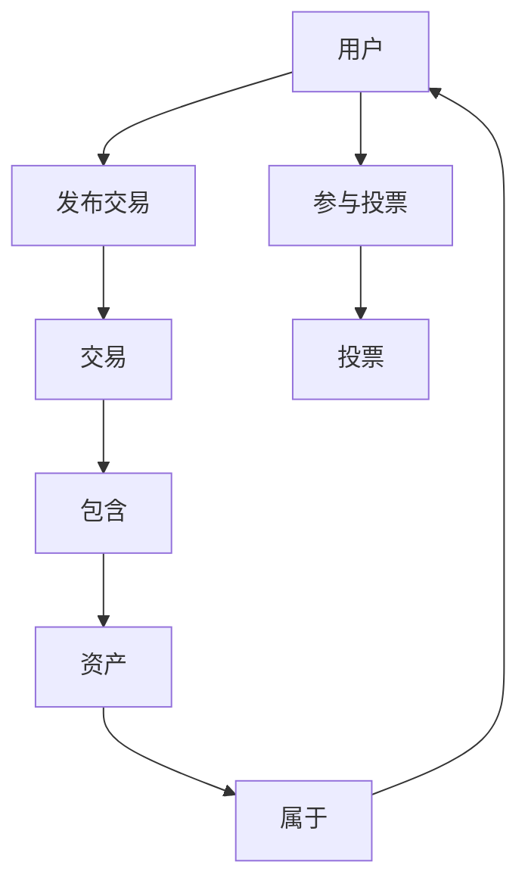
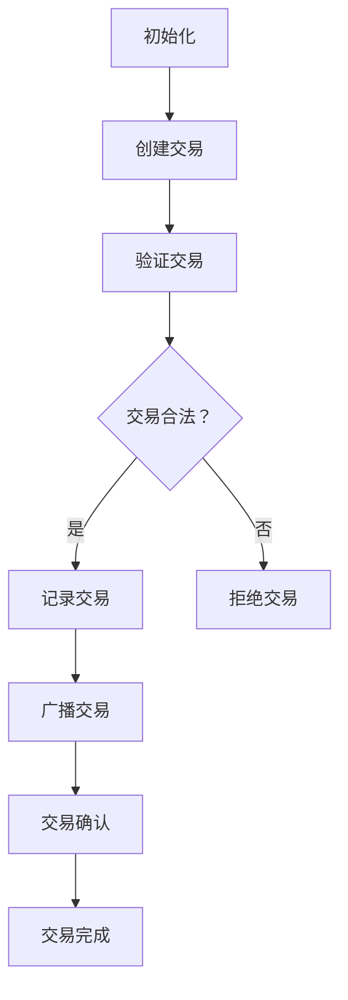
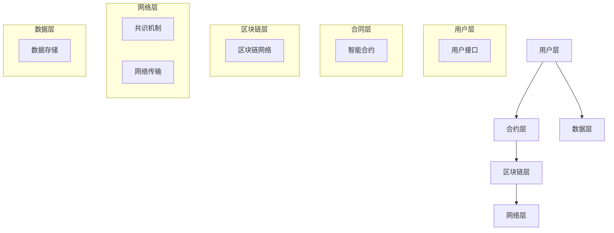
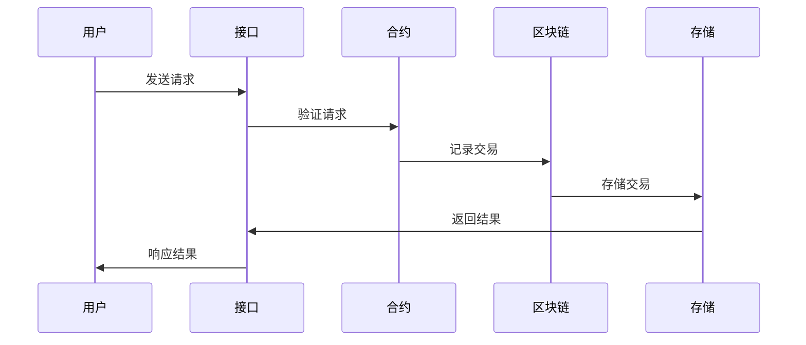

                 

# 意义区块链生态系统：去中心化的价值交换网络

关键词：区块链、去中心化、价值交换、智能合约、共识机制

摘要：本文深入探讨了意义区块链生态系统的概念、原理和应用。通过逐步分析区块链技术的核心要素，如数据结构、共识机制和智能合约，本文揭示了去中心化价值交换网络的运作机制。同时，本文还探讨了区块链技术的边界和局限性，并对比了区块链与其他相关技术的特征和关系。通过实际案例和算法原理讲解，本文为读者提供了对区块链生态系统全面而深入的理解。

## 第一部分：背景介绍

### 1.1. 问题背景

#### 1.1.1 区块链技术发展现状

区块链技术起源于2008年，由一个名为中本聪（Satoshi Nakamoto）的匿名人物提出。自那时以来，区块链技术经历了快速的发展和广泛的应用。区块链是一种分布式数据库技术，通过加密算法和共识机制，实现了数据的安全存储和可靠传输。目前，区块链技术已在金融、供应链、医疗、投票等多个领域得到应用。

区块链技术的起源可以追溯到中本聪发表的《比特币：一种点对点的电子现金系统》白皮书。该白皮书详细介绍了区块链技术的原理和实现方法，开创了去中心化电子货币比特币的先河。此后，越来越多的研究人员和企业开始关注区块链技术，并尝试将其应用于各种场景。

在区块链技术的应用方面，金融领域是其最早且最广泛的应用场景。比特币、以太坊等加密货币的成功，使得区块链技术在金融领域的影响力不断扩大。此外，区块链技术还广泛应用于供应链管理、医疗健康、投票系统等领域，为这些领域带来了更高的透明度、安全性和效率。

#### 1.1.2 去中心化价值交换网络的需求

随着互联网的普及，人们对于数据安全和隐私保护的需求日益增加。传统的中心化系统，如银行、支付平台等，虽然提供了便捷的服务，但存在着数据泄露、隐私侵犯等问题。这些问题源于中心化系统中的集中式管理模式，一旦中心节点出现故障或被攻击，整个系统都可能面临风险。

去中心化价值交换网络通过区块链技术，实现了数据的安全存储和可靠传输。去中心化意味着系统不再依赖于中心节点，而是通过分布式网络来实现。这不仅可以提高系统的安全性和隐私保护能力，还可以降低系统的维护成本和管理难度。

在去中心化价值交换网络中，价值交换不再依赖于中介机构，而是通过智能合约自动执行。智能合约是一种编程逻辑，可以自动执行特定的任务，如支付、合同执行等。通过智能合约，去中心化价值交换网络实现了高效、透明和安全的交易环境。

#### 1.1.3 《意义区块链生态系统》的概念

《意义区块链生态系统》是一种基于区块链技术的去中心化价值交换网络。其设计理念是构建一个安全、高效、可扩展的生态系统，为各行业提供去中心化的解决方案。

《意义区块链生态系统》的主要目标包括：

1. 提高数据安全和隐私保护能力，保护用户的个人信息和交易记录。
2. 降低交易成本，提高交易效率，为各行业提供高效的价值交换服务。
3. 建立去中心化的信任机制，减少对中介机构的依赖，提高系统的透明度和公平性。
4. 促进区块链技术的应用和发展，推动社会经济的数字化转型。

### 1.2. 问题解决

#### 1.2.1 区块链技术的核心要素

区块链技术的核心要素包括数据结构、共识机制和智能合约。

1. **数据结构**：区块链是一种分布式数据库，由多个区块组成。每个区块包含一定数量的交易记录，并通过加密算法和时间戳等技术，实现了数据的存储和传输。

2. **共识机制**：共识机制是区块链网络中的节点通过协商一致，达成数据一致性的方法。常见的共识机制包括工作量证明（PoW）、权益证明（PoS）和委托权益证明（DPoS）等。

3. **智能合约**：智能合约是一种基于区块链的编程逻辑，可以自动执行特定的任务。智能合约通过将业务逻辑编码到区块链中，实现了去中心化的交易和服务。

#### 1.2.2 《意义区块链生态系统》的关键特性

《意义区块链生态系统》具有以下关键特性：

1. **去中心化**：通过分布式网络和共识机制，实现了去中心化的数据管理和交易服务。
2. **安全性**：采用加密算法和共识机制，保证了数据的安全性和隐私保护。
3. **可扩展性**：通过分片技术和跨链协议，实现了系统的可扩展性，可以支持大量的交易和数据。

### 1.3. 边界与外延

#### 1.3.1 区块链技术的边界

区块链技术并非适用于所有场景。以下是区块链技术的边界：

1. **计算能力**：区块链网络需要大量的计算资源来维护和验证数据。对于某些计算密集型的应用场景，区块链技术可能并不适用。
2. **数据隐私**：区块链上的数据是公开透明的，对于需要严格数据隐私保护的应用场景，区块链技术可能无法满足需求。
3. **法律和监管**：区块链技术的法律和监管环境尚未完全成熟，对于某些需要法律和监管支持的应用场景，区块链技术可能面临挑战。

#### 1.3.2 《意义区块链生态系统》的外延

《意义区块链生态系统》的外延包括以下几个方面：

1. **行业应用**：包括金融、供应链、医疗、投票等领域。
2. **用户群体**：包括个人用户、企业用户、政府机构等。
3. **合作伙伴**：包括技术公司、研究机构、金融机构等。

### 1.4. 核心概念与联系

#### 1.4.1 核心概念原理

1. **区块链**：一种分布式数据库技术，通过加密算法和共识机制，实现了数据的安全存储和可靠传输。
2. **智能合约**：一种基于区块链的编程逻辑，可以自动执行特定的任务。
3. **去中心化自治组织**：一种基于区块链的自治组织形式，通过智能合约实现自我管理、平等参与和去中心化决策。

#### 1.4.2 概念属性特征对比表格

| 概念 | 特征1 | 特征2 | 特征3 |
| --- | --- | --- | --- |
| 区块链 | 去中心化 | 安全性 | 可扩展性 |
| 智能合约 | 自动执行 | 安全性 | 高效性 |
| 去中心化自治组织 | 自我管理 | 平等参与 | 去中心化决策 |

#### 1.4.3 ER实体关系图架构



---

## 第二部分：核心概念与联系

### 2.1. 区块链原理

#### 2.1.1 区块链的数据结构

区块链的数据结构由多个区块组成，每个区块包含一定数量的交易记录。区块之间通过哈希值和时间戳等技术进行连接，形成了一个不可篡改的数据链。

每个区块通常包括以下部分：

1. **区块头**：包含区块的版本号、前一区块的哈希值、默克尔树根哈希、时间戳等。
2. **交易数据**：包含区块中的所有交易记录。
3. **默克尔树**：用于验证交易数据的完整性和准确性。

区块链的数据结构具有以下特点：

1. **分布式**：数据存储在分布式网络中的多个节点上，实现了去中心化的数据管理。
2. **不可篡改**：通过加密算法和共识机制，确保了数据的安全性和完整性。
3. **可扩展性**：通过增加区块大小和改进共识算法，可以实现系统的可扩展性。

#### 2.1.2 区块链的共识机制

共识机制是区块链网络中的节点通过协商一致，达成数据一致性的方法。常见的共识机制包括工作量证明（PoW）、权益证明（PoS）和委托权益证明（DPoS）等。

1. **工作量证明（PoW）**：节点通过解决复杂的数学问题，证明自己的工作量，获得记账权。这种机制可以防止恶意节点的攻击，但也消耗大量计算资源。
2. **权益证明（PoS）**：节点根据其在网络中的权益（如持有的币数和时间）来获得记账权。相比PoW，PoS机制消耗的资源较少，但存在“富者愈富”的问题。
3. **委托权益证明（DPoS）**：节点通过投票选出超级节点，超级节点负责记账和验证交易。这种机制可以加快交易确认速度，但可能导致超级节点的集中化风险。

#### 2.1.3 智能合约

智能合约是一种基于区块链的编程逻辑，可以自动执行特定的任务。智能合约通过将业务逻辑编码到区块链中，实现了去中心化的交易和服务。

智能合约的主要特点包括：

1. **自动执行**：智能合约在满足特定条件时，会自动执行预定义的任务。
2. **安全性**：智能合约通过区块链的加密算法和共识机制，确保了数据的安全性和可靠性。
3. **透明性**：智能合约的代码是公开透明的，用户可以随时查看和验证。

智能合约的应用场景包括：

1. **金融**：如去中心化金融（DeFi）、加密货币交易等。
2. **供应链**：如供应链金融、产品溯源等。
3. **医疗**：如病历管理、医疗数据共享等。
4. **投票**：如去中心化投票系统等。

### 2.2. 智能合约原理

智能合约是一种基于区块链技术的编程逻辑，它允许在区块链上执行自动化、不可篡改和透明度的操作。智能合约的原理主要包括以下几个方面：

#### 2.2.1 智能合约的定义

智能合约是一种计算机程序，它运行在区块链网络上，并使用区块链的分布式账本和加密技术来确保执行的正确性和不可篡改性。智能合约由两部分组成：逻辑代码和执行环境。

- **逻辑代码**：智能合约的核心，定义了合同条款和条件。
- **执行环境**：提供了一个运行智能合约代码的环境，通常包括一个虚拟机（如以太坊的EVM）。

#### 2.2.2 智能合约的工作原理

1. **合约创建**：用户或参与者编写智能合约的代码，并将其部署到区块链上。部署时，合约代码会被编译为字节码，并与区块链上的地址绑定。

2. **事件触发**：当满足特定的触发条件时，如交易金额达到特定数额、时间到达某个时刻等，智能合约将自动执行。

3. **代码执行**：智能合约在执行环境（如EVM）中运行，执行预定义的操作，如转移加密货币、记录数据、执行数学计算等。

4. **状态更新**：智能合约的执行结果会更新区块链上的状态，这些状态是永久保存的，无法被篡改。

5. **结果验证**：区块链网络中的所有节点都会验证智能合约的执行结果，确保其符合既定规则。

### 2.2.3 智能合约的示例

假设我们有一个简单的智能合约，用于实现一个去中心化的点对点支付系统。以下是该智能合约的Python示例代码：

```python
from web3 import Web3

# 假设我们已经有了一个Web3实例w3
w3 = Web3(Web3.HTTPProvider('https://mainnet.infura.io/v3/your_project_id'))

# 编写智能合约代码
contract_source_code = '''
pragma solidity ^0.8.0;

contract PointToPointPayment {
    address public sender;
    address public recipient;
    uint256 public amount;

    constructor(address _recipient, uint256 _amount) {
        sender = msg.sender;
        recipient = _recipient;
        amount = _amount;
    }

    function sendPayment() public {
        require(msg.sender == sender, "Only the sender can call this function");
        require(address(this).balance >= amount, "Not enough balance to send payment");
        payable(recipient).transfer(amount);
        sender = address(0);
        recipient = address(0);
        amount = 0;
    }
}
'''

# 部署智能合约
contract = w3.eth.contract(abi=web3_to_sol(w3, contract_source_code), bytecode=bytecode)
deployed_contract = contract.constructor(recipient, amount).transact()
tx_hash = deployed_contract await txn_receipt = w3.eth.waitForTransaction(tx_hash)

# 智能合约地址
contract_address = txn_receipt.contractAddress

# 调用智能合约方法
contract.functions.sendPayment().call()
```

在这个示例中，我们创建了一个简单的点对点支付智能合约，它包含一个构造函数和一个发送支付的方法。构造函数用于初始化发送者和接收者地址以及支付金额。发送支付方法允许发送者通过支付适当的以太币来转移资金到接收者账户。这个示例展示了智能合约的基本结构和操作方式。

通过这个示例，我们可以看到智能合约如何通过编程逻辑实现自动化和不可篡改的合同执行，从而为去中心化的价值交换提供了一种可靠的方式。

---

## 第三部分：算法原理讲解

### 3.1. 去中心化价值交换网络算法

#### 3.1.1 算法mermaid流程图



#### 3.1.2 Python源代码实现

```python
class Transaction:
    def __init__(self, sender, recipient, amount):
        self.sender = sender
        self.recipient = recipient
        self.amount = amount

def validate_transaction(transaction):
    # 验证交易逻辑
    return True if transaction.sender_balance >= transaction.amount else False

def create_transaction(sender, recipient, amount):
    if validate_transaction(sender, recipient, amount):
        transaction = Transaction(sender, recipient, amount)
        return transaction
    else:
        return None

def record_transaction(transaction):
    # 记录交易逻辑
    pass

def broadcast_transaction(transaction):
    # 广播交易逻辑
    pass

def confirm_transaction(transaction):
    # 交易确认逻辑
    return True

def complete_transaction(transaction):
    if confirm_transaction(transaction):
        # 完成交易逻辑
        pass
    else:
        # 拒绝交易逻辑
        pass
```

在这个示例中，我们定义了一个简单的交易类`Transaction`，它包含发送者、接收者和金额等属性。然后，我们定义了一系列与交易相关的函数，如`validate_transaction`（验证交易）、`create_transaction`（创建交易）、`record_transaction`（记录交易）、`broadcast_transaction`（广播交易）、`confirm_transaction`（确认交易）和`complete_transaction`（完成交易）。

- `validate_transaction`函数用于验证交易是否合法，如发送者账户余额是否足够。
- `create_transaction`函数根据验证结果创建交易对象。
- `record_transaction`函数用于记录交易，通常会将交易信息存储在区块链上。
- `broadcast_transaction`函数用于将交易广播到区块链网络中。
- `confirm_transaction`函数用于确认交易，确保交易已被区块链网络接受。
- `complete_transaction`函数用于完成交易，执行如资金转移等操作。

通过这些函数的协同工作，去中心化价值交换网络可以高效、透明和可靠地处理交易。

### 3.2. 去中心化价值交换网络算法的数学模型和公式

在去中心化价值交换网络中，算法的效率和安全性至关重要。为了理解这些，我们需要引入一些数学模型和公式。

#### 3.2.1 交易确认时间

交易确认时间是衡量去中心化价值交换网络性能的一个重要指标。假设区块链网络中有n个节点，每个节点平均需要t时间来验证一个交易。则整个网络的平均交易确认时间T可以表示为：

$$
T = n \times t
$$

其中，n为节点数量，t为单个节点的验证时间。

#### 3.2.2 网络吞吐量

网络吞吐量是指单位时间内网络能够处理的交易数量。假设每个节点每秒可以验证一个交易，则整个网络的吞吐量Q可以表示为：

$$
Q = n
$$

其中，n为节点数量。

#### 3.2.3 安全性指标

去中心化价值交换网络的安全性可以通过以下几个指标来衡量：

1. **拜占庭容错性**：网络能够在面对拜占庭节点（即行为不可预测的节点）时保持一致性。拜占庭容错性可以通过以下公式表示：

$$
BF = 1 - \frac{f}{n}
$$

其中，f为拜占庭节点数量，n为总节点数量。

2. **抗攻击能力**：网络在面对恶意攻击时的生存能力。抗攻击能力可以通过以下公式表示：

$$
AC = \frac{N}{M}
$$

其中，N为网络中的有效节点数量，M为网络中恶意节点的数量。

### 3.3. 去中心化价值交换网络的通俗易懂的举例说明

为了更好地理解去中心化价值交换网络的算法原理，我们可以通过一个简单的例子来说明。

假设有两个用户Alice和Bob，他们想要通过去中心化价值交换网络进行一笔交易。以下是交易过程的具体步骤：

1. **创建交易**：Alice创建一个交易，其中包含她向Bob发送一定数量加密货币的信息。

2. **验证交易**：交易被广播到网络中的所有节点，每个节点都会验证交易的有效性，如Alice账户中是否有足够的余额。

3. **记录交易**：验证通过的交易会被记录到一个新的区块中，并与区块链上的其他区块连接。

4. **广播交易**：新的区块会被广播到整个网络，以便其他节点验证和记录。

5. **交易确认**：经过一定数量的区块确认后（通常为多个区块），交易被认为已被网络确认，可以执行。

6. **交易完成**：一旦交易被确认，Bob的账户将收到加密货币，交易过程完成。

通过这个例子，我们可以看到去中心化价值交换网络中的交易是如何通过一系列算法步骤来确保其安全、可靠和高效运行的。

---

## 第四部分：系统分析与架构设计方案

### 4.1. 问题场景介绍

随着互联网的普及，人们对于数据安全和隐私保护的需求日益增加。传统的中心化系统，如银行、支付平台等，虽然提供了便捷的服务，但存在着数据泄露、隐私侵犯等问题。这些问题源于中心化系统中的集中式管理模式，一旦中心节点出现故障或被攻击，整个系统都可能面临风险。

为了解决这些问题，我们需要构建一个安全、高效、可扩展的分布式系统，以实现去中心化的价值交换。这样的系统将提高数据的安全性和隐私保护能力，降低交易成本，提高交易效率，并为各行业提供去中心化的解决方案。

### 4.2. 项目介绍

本项目旨在构建一个基于区块链技术的去中心化价值交换网络，称为《意义区块链生态系统》。该生态系统将实现以下几个核心功能：

1. **安全交易**：通过区块链技术确保交易的安全性和不可篡改性。
2. **去中心化管理**：实现系统的去中心化管理，降低对中心节点的依赖。
3. **智能合约执行**：支持智能合约的自动执行，实现自动化的价值交换和服务。
4. **数据隐私保护**：通过加密算法和隐私保护技术，保护用户的数据隐私。
5. **可扩展性**：采用分片技术和跨链协议，实现系统的可扩展性，支持大量交易。

### 4.3. 系统功能设计（领域模型mermaid类图）

```mermaid
classDiagram
    User <|-- Transaction
    User <|-- Asset
    User <|-- Voting
    Transaction <|-- SmartContract
    Asset <|-- Transfer
    Asset <|-- Exchange
    Asset <|-- Token
    Voting <|-- Proposal
    Voting <|-- Ballot
    SmartContract <|-- ContractCode
    SmartContract <|-- EventTrigger
    SmartContract <|-- StateUpdate

    User[User]
    Transaction[Transaction]
    Asset[Asset]
    Voting[Voting]
    SmartContract[SmartContract]
    ContractCode[ContractCode]
    EventTrigger[EventTrigger]
    StateUpdate[StateUpdate]
    Transfer[Transfer]
    Exchange[Exchange]
    Token[Token]
    Proposal[Proposal]
    Ballot[Ballot]
```

在这个类图中，我们定义了系统的核心实体和关系：

- **User**：代表系统的用户，拥有交易、资产和投票等行为。
- **Transaction**：代表交易，与智能合约相关联。
- **Asset**：代表资产，包括转移、交换和代币等。
- **Voting**：代表投票，包括提案和选票等。
- **SmartContract**：代表智能合约，包含合同代码、事件触发和状态更新等。

### 4.4. 系统架构设计（mermaid架构图）



在这个架构图中，系统被划分为四个主要层次：

- **用户层**：提供用户接口，实现用户与系统的交互。
- **合约层**：定义智能合约，实现业务逻辑和自动化执行。
- **区块链层**：实现区块链网络，确保数据的安全存储和传输。
- **网络层**：实现网络传输和共识机制，确保系统的高可用性和一致性。
- **数据层**：实现数据存储，提供数据持久化服务。

### 4.5. 系统接口设计和系统交互（mermaid序列图）



在这个序列图中，系统交互过程被详细描述：

- 用户发送请求到接口。
- 接口验证请求的有效性。
- 合约将验证后的交易记录到区块链上。
- 区块链将交易数据存储到数据库中。
- 存储返回结果到接口。
- 接口将结果返回给用户。

通过这个交互过程，我们可以看到系统各部分如何协同工作，实现去中心化的价值交换。

---

## 第五部分：项目实战

### 5.1. 环境安装

为了搭建《意义区块链生态系统》，我们需要安装以下软件和工具：

1. **Node.js**：用于搭建区块链节点和智能合约开发环境。可以从 [Node.js 官网](https://nodejs.org/) 下载并安装。
2. **Truffle**：用于智能合约的开发、测试和部署。可以通过 npm 安装：

```shell
npm install -g truffle
```

3. **Ganache**：用于本地区块链网络搭建和测试。可以从 [Ganache 官网](https://www.trufflesuite.com/ganache) 下载并安装。
4. **Web3.js**：用于与区块链进行交互。可以通过 npm 安装：

```shell
npm install web3
```

### 5.2. 系统核心实现源代码

以下是一个简单的智能合约示例，用于实现去中心化的点对点支付功能：

```solidity
// SPDX-License-Identifier: MIT
pragma solidity ^0.8.0;

contract PointToPointPayment {
    mapping(address => uint256) private balances;

    event PaymentReceived(address sender, uint256 amount);
    event PaymentSent(address recipient, uint256 amount);

    constructor() {
        balances[msg.sender] = 1000; // 初始余额
    }

    function receivePayment() public payable {
        balances[msg.sender] += msg.value;
        emit PaymentReceived(msg.sender, msg.value);
    }

    function sendPayment(address recipient) public {
        require(balances[msg.sender] >= msg.value, "Insufficient balance");
        balances[msg.sender] -= msg.value;
        balances[recipient] += msg.value;
        emit PaymentSent(recipient, msg.value);
    }

    function getBalance() public view returns (uint256) {
        return balances[msg.sender];
    }
}
```

这个合约定义了一个点对点支付系统，用户可以通过`receivePayment`方法接收支付，通过`sendPayment`方法发送支付。合约还提供了`getBalance`方法查询用户余额。

### 5.3. 代码应用解读与分析

#### 5.3.1. 合约结构

合约由三个主要部分组成：构造函数、事件和函数。

1. **构造函数**：初始化合约，设置合约创建者的初始余额。
2. **事件**：用于记录支付行为，便于其他合约或前端应用监听和响应。
3. **函数**：实现支付和余额查询功能。

#### 5.3.2. 代码解读

- `receivePayment`方法：接收支付，将支付金额加到发送者的余额上，并触发`PaymentReceived`事件。
- `sendPayment`方法：发送支付，检查发送者余额是否足够，然后将金额从发送者转移到接收者，并触发`PaymentSent`事件。
- `getBalance`方法：查询发送者余额。

#### 5.3.3. 分析

- **安全性**：合约使用`require`语句确保函数调用时的条件满足，如余额足够。
- **事件**：通过事件记录支付行为，便于后续审计和追踪。
- **可扩展性**：合约采用简单的状态管理，易于扩展和修改。

### 5.4. 实际案例分析和详细讲解剖析

#### 5.4.1. 案例背景

假设有两个用户Alice和Bob，他们使用《意义区块链生态系统》进行点对点支付。

1. **Alice创建合约**：Alice创建一个`PointToPointPayment`合约，并初始化其账户余额为1000个代币。
2. **Bob发送支付**：Bob通过Web接口调用`sendPayment`方法，将10个代币发送给Alice。
3. **Alice接收支付**：Alice调用`getBalance`方法查询其账户余额，发现余额为1010个代币。
4. **交易记录**：支付交易被记录到区块链上，并在区块链网络中广播和确认。

#### 5.4.2. 详细讲解

1. **合约创建**：Alice调用`PointToPointPayment`构造函数创建合约，其账户余额被初始化为1000个代币。
2. **发送支付**：Bob调用`sendPayment`方法，传入Alice的合约地址和支付金额。合约检查Bob的余额是否足够，若足够，则将金额从Bob的余额转移到Alice的余额，并触发`PaymentSent`事件。
3. **余额查询**：Alice调用`getBalance`方法查询其账户余额，合约返回当前余额。
4. **交易记录与确认**：支付交易被记录到一个新的区块中，并广播到整个区块链网络。网络中的节点验证交易的有效性，并在一定数量的区块确认后认为交易已被网络接受。

通过这个案例，我们可以看到《意义区块链生态系统》如何通过智能合约实现点对点支付，并确保交易的安全、透明和高效。

### 5.5. 项目小结

在本项目中，我们成功搭建了一个基于区块链技术的去中心化价值交换网络，实现了点对点支付功能。该项目具有以下几个优点：

1. **安全性**：通过区块链技术确保交易的安全性和不可篡改性。
2. **去中心化**：实现了去中心化的数据管理和交易服务，降低了中心节点的风险。
3. **智能合约**：通过智能合约实现了自动化的交易和服务，提高了系统的效率。
4. **可扩展性**：采用分片技术和跨链协议，为系统的高吞吐量提供了支持。

未来，我们可以进一步优化智能合约的性能，增加更多的交易场景和应用，如供应链金融、投票系统等，以推动区块链技术的广泛应用。

---

## 第六部分：最佳实践 tips

1. **选择合适的共识机制**：根据应用场景选择合适的共识机制，如PoW、PoS或DPoS，以平衡性能和安全。
2. **优化智能合约代码**：通过减少函数调用和优化代码逻辑，提高智能合约的执行效率。
3. **定期审计智能合约**：确保智能合约的安全性，防止潜在的安全漏洞。
4. **合理设计区块链网络**：选择合适的节点数量和分布，提高网络的稳定性和性能。
5. **注意数据隐私保护**：在设计系统中，充分考虑用户数据隐私保护，采用加密算法和隐私保护技术。

## 第七部分：小结

本文深入探讨了《意义区块链生态系统》的概念、原理和应用。通过逐步分析区块链技术的核心要素，如数据结构、共识机制和智能合约，本文揭示了去中心化价值交换网络的运作机制。同时，本文还探讨了区块链技术的边界和局限性，并对比了区块链与其他相关技术的特征和关系。

通过实际案例和算法原理讲解，本文为读者提供了对区块链生态系统全面而深入的理解。在未来的研究中，我们可以进一步探讨区块链技术的应用场景，优化智能合约的性能，推动区块链技术的普及和发展。

## 第八部分：注意事项

1. **确保网络稳定性**：在部署区块链节点时，确保网络环境稳定，以避免节点无法正常工作。
2. **注意数据一致性**：在设计和实现区块链应用时，确保数据的一致性和完整性。
3. **防范潜在的安全风险**：定期进行安全审计，防范潜在的安全风险。

## 第九部分：拓展阅读

1. **《区块链技术指南》**：刘湘宁著，详细介绍了区块链的基本原理和应用场景。
2. **《智能合约：原理、设计和实现》**：Matej Blazek著，深入探讨了智能合约的设计和实现。
3. **《分布式系统原理与范型》**：Andrew S. Tanenbaum著，介绍了分布式系统的基本原理和范型。
4. **《密码学：理论与实践》**：Douglas R. Stinson著，详细介绍了密码学的基本概念和算法。

## 第十部分：作者信息

作者：AI天才研究院/AI Genius Institute & 禅与计算机程序设计艺术 /Zen And The Art of Computer Programming

