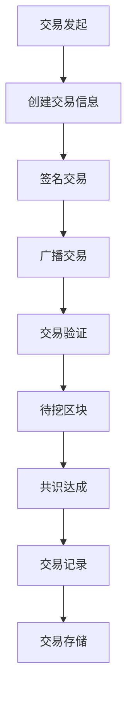

                 

### 引言与背景

在现代信息技术飞速发展的背景下，区块链技术作为一种去中心化的分布式数据库系统，正逐渐改变着传统的数据处理和信息交换模式。区块链技术的核心优势在于其不可篡改和透明度，这使得它在金融、物流、医疗等多个领域展现出巨大的潜力。然而，随着区块链技术的不断演进，如何构建一个高效、稳定、可扩展的区块链社区成为了一个亟待解决的问题。

《意义区块链社区：去中心化的价值交换网络》一书旨在深入探讨区块链技术在社区构建中的应用，以及如何通过去中心化的价值交换网络实现真正的价值共享与传递。本书的撰写旨在为广大开发者、研究人员和区块链爱好者提供一本全面、系统、易懂的技术指南，帮助他们更好地理解区块链技术，并能在实际项目中有效地应用这些技术。

本文将按照书籍的目录结构，逐步分析区块链技术的基础知识、意义区块链社区的核心模块设计、技术实现与优化策略，以及成功案例和未来展望。希望通过这篇文章，读者能够对区块链社区的去中心化价值交换网络有一个全面而深刻的理解。

### 关键词

- **区块链技术**
- **去中心化**
- **价值交换网络**
- **社区构建**
- **技术实现与优化**
- **案例分析**
- **未来展望**

### 摘要

本文旨在深入探讨区块链技术在社区构建中的应用，特别是如何通过去中心化的价值交换网络实现高效、稳定和可扩展的社区运营。首先，文章介绍了区块链技术的基本概念、发展历程和应用场景，并分析了其优势与挑战。接着，详细阐述了意义区块链社区的基础构建，包括社区生态的构建、区块链技术在社区中的应用以及去中心化价值交换网络的原理。随后，文章聚焦于核心模块设计，包括身份认证与权限管理、价值交换机制、社区治理与决策，并详细讲解了技术实现与优化策略。最后，通过成功案例分析和未来展望，总结了意义区块链社区的发展方向和潜在挑战，为读者提供了一个全面的技术指南和思考框架。

## 第一部分：引言与背景

### 1.1 区块链技术概述

#### 区块链的定义

区块链技术是一种去中心化的分布式数据库系统，通过区块链网络中的多个节点共同维护一个共享的账本，实现了数据的透明、安全和不可篡改。每个区块都包含一定数量的交易记录，这些区块通过加密算法按时间顺序链接成一个链条，从而形成了区块链。

#### 区块链的基本组成

区块链的基本组成主要包括以下几个部分：

1. **区块（Block）**：每个区块包含了若干笔交易记录、一个时间戳、一个哈希值以及前一个区块的哈希值。
2. **链（Chain）**：由一系列按时间顺序排列的区块组成，形成了一条不可篡改的区块链。
3. **节点（Node）**：网络中的每个参与者都是一个节点，它们负责维护区块链的一致性和完整性。
4. **共识算法（Consensus Algorithm）**：节点之间通过共识算法来达成共识，确保区块链的更新和扩展是安全可靠的。
5. **智能合约（Smart Contract）**：一种自动执行合约条款的计算机程序，用于在区块链上实现自动化交易和合约管理。

### 1.2 区块链技术的发展历程

#### 区块链的起源

区块链的起源可以追溯到2008年，当时一个名为中本聪（Satoshi Nakamoto）的匿名人物发布了比特币白皮书，首次提出了区块链的概念。比特币作为第一个基于区块链技术的数字货币，成功实现了去中心化的价值交换，引起了广泛关注。

#### 区块链的关键技术演变

1. **比特币（Bitcoin）**：作为区块链技术的首个应用，比特币通过区块链实现了点对点的电子现金系统，展示了区块链技术的潜力。
2. **以太坊（Ethereum）**：以太坊在比特币的基础上引入了智能合约功能，使得区块链不仅能够处理价值交换，还能够执行复杂的计算机程序，应用范围进一步扩展。
3. **其他公链**：除比特币和以太坊之外，还有许多其他公链如EOS、Ripple等，它们在性能、可扩展性、安全性等方面进行了优化和改进。
4. **联盟链（Consortium Blockchain）**：为解决公链性能和可扩展性问题，联盟链通过限制参与节点数量和权限，提高了网络的效率和安全性。

### 1.3 区块链的应用场景

区块链技术的独特优势使其在多个领域具有广泛的应用潜力：

#### 金融领域

区块链技术在金融领域的主要应用包括：

1. **数字货币**：如比特币、以太坊等，实现去中心化的价值交换。
2. **跨境支付**：通过区块链网络实现快速、低成本的跨境支付。
3. **证券交易**：利用智能合约实现自动化、透明的证券交易。
4. **反洗钱**：区块链的透明性和不可篡改性有助于打击洗钱等非法活动。

#### 物流领域

区块链技术在物流领域的应用主要包括：

1. **供应链管理**：通过区块链实现供应链的透明化和可追溯性。
2. **物流跟踪**：利用区块链技术记录和跟踪物流信息，提高物流效率。
3. **智能合约应用**：通过智能合约实现物流过程中的自动化支付和结算。

#### 社交领域

区块链在社交领域的应用潜力包括：

1. **去中心化社交网络**：利用区块链技术实现用户数据的自主控制和隐私保护。
2. **数字身份认证**：通过区块链实现身份信息的可信验证和管理。
3. **内容激励**：利用区块链实现内容创作者和读者之间的直接价值交换。

#### 其他应用场景

除了上述领域，区块链技术还可以应用于医疗记录管理、投票系统、版权保护、法律合同管理等，为各行各业带来革命性的变化。

### 1.4 区块链的优势与挑战

#### 优势

区块链技术的优势主要包括：

1. **去中心化**：去中心化架构使得区块链网络无需中心化的机构或服务器，降低了系统故障的风险。
2. **安全性**：区块链的数据存储和加密技术确保了数据的安全性和不可篡改性。
3. **透明性**：区块链的数据是公开透明的，所有参与者都可以查看和验证。
4. **高效率**：区块链通过分布式账本技术实现了数据的快速同步和更新，提高了系统的效率。

#### 挑战

尽管区块链技术具有诸多优势，但在实际应用中仍面临一些挑战：

1. **性能瓶颈**：目前的区块链技术在大规模应用中存在性能瓶颈，难以满足高并发交易需求。
2. **隐私保护**：区块链的公开透明特性可能导致用户的隐私泄露，需要进一步优化隐私保护机制。
3. **监管合规**：区块链技术涉及跨境交易和虚拟货币等，监管政策尚不明确，需要解决监管合规问题。
4. **技术成熟度**：区块链技术尚处于发展初期，技术成熟度和稳定性有待提高。

通过深入理解区块链技术的基本概念、发展历程、应用场景以及优势与挑战，可以为后续章节中意义区块链社区的设计和实现奠定坚实的基础。

### 2.1 社区生态的构建

区块链技术的核心优势在于其去中心化的特性，这种特性为构建一个健康的社区生态系统提供了可能。社区生态的构建不仅仅是技术的实现，更是一个复杂的系统工程，涉及社区成员的角色与职责、社区自治机制的建立等多方面内容。

#### 社区成员的角色与职责

在一个区块链社区中，不同的成员扮演着不同的角色，各自承担着特定的职责。以下是一些关键角色的介绍：

1. **用户（User）**：用户是社区的基本组成部分，他们通过区块链网络参与社交互动、经济交易和治理决策等。用户的角色是多样化的，可以是消费者、创作者、投资者等。
   
2. **节点（Node）**：节点是区块链网络中的计算节点，负责维护区块链的完整性和一致性。节点可以是个人的计算机，也可以是组织的服务器。节点通过参与共识算法来验证交易和更新区块链。

3. **矿工（Miner）**：在区块链系统中，矿工是负责挖掘新区块并验证交易的重要角色。矿工通过计算复杂的数学难题，获得区块链系统中的奖励，从而激励他们维护区块链网络的安全和稳定。

4. **开发者（Developer）**：开发者是区块链社区的技术骨干，负责设计和实现区块链系统的各个模块，包括区块链网络、智能合约、钱包等。开发者还负责持续优化和维护社区的技术基础设施。

5. **治理参与者（Governance Participant）**：治理参与者是社区中的决策者，他们通过投票、提案等方式参与社区治理。治理参与者负责制定社区规则、决策重大项目等，确保社区的健康和可持续发展。

6. **审计员（Auditor）**：审计员负责对区块链社区的运行进行审计，确保系统遵守既定规则和标准。审计员的工作有助于提升社区的透明度和信任度。

#### 社区自治机制

社区自治是区块链社区的核心原则之一，它旨在通过民主、透明的方式管理社区事务，确保社区成员的权益得到保障。以下是一些社区自治机制的关键内容：

1. **投票机制**：社区成员通过投票机制参与决策。投票可以是简单的在线投票，也可以是基于区块链的智能合约执行。投票机制确保了决策过程的透明性和公正性。

2. **提案机制**：社区成员可以提出各种提案，包括社区规则的修改、项目投资、新功能开发等。提案通过社区成员的投票来决定是否被采纳。

3. **治理代币**：治理代币是社区自治的重要工具。持有治理代币的成员可以在投票、提案等环节中拥有更多的发言权和影响力。治理代币通常与社区的权益挂钩，如分红、投票权重等。

4. **社区共识**：社区共识是通过集体讨论和决策来达成一致意见的过程。社区共识机制确保了社区成员在面临分歧和挑战时能够协同合作，共同应对。

5. **智能合约**：智能合约在社区自治中扮演了关键角色。智能合约通过代码实现社区的规则和协议，确保了决策和执行的自动化、透明化。

#### 社区生态的构建意义

社区生态的构建不仅有助于提升区块链社区的健康和可持续发展，还有以下几方面的重要意义：

1. **提高社区活力**：通过多样化的角色和自治机制，社区成员能够更加积极地参与社区建设，提升社区的整体活力。
   
2. **保障用户权益**：社区自治机制确保了用户的权益得到保障，用户在社区中的参与度和满意度将得到提高。

3. **促进技术进步**：社区成员的积极参与和自治机制能够推动技术的不断优化和进步，提高区块链社区的技术水平。

4. **增强信任与透明度**：社区自治机制和透明化的治理过程有助于增强社区成员之间的信任，提高社区的透明度和可信度。

5. **创新与变革**：社区生态的构建为区块链技术带来了新的应用场景和创新机会，推动了区块链技术和社区治理模式的变革。

通过社区生态的构建，区块链社区能够实现真正的去中心化和自主治理，为用户和开发者提供更安全、高效和透明的服务。这不仅有助于区块链技术的广泛应用，也为构建一个更加公平、开放和可持续的数字社会奠定了基础。

### 2.2 区块链技术在社区中的应用

区块链技术在社区中的应用涵盖了社交互动、经济交易和治理机制等多个方面，为构建一个去中心化的社区生态系统提供了强大的技术支撑。以下将详细探讨区块链技术在这三个方面的应用，并解释其在去中心化价值交换网络中的作用。

#### 社交互动

区块链技术在社交互动中的应用主要表现在以下几个方面：

1. **用户身份验证**：区块链通过加密算法和分布式账本技术，实现用户身份的可靠验证。每个用户在区块链上都有一个独特的身份标识，确保用户身份的不可篡改性和唯一性。

2. **去中心化社交平台**：传统的社交平台往往由中心化的公司控制，用户的数据和隐私容易受到侵犯。区块链的去中心化特性使得用户可以在不依赖中心化机构的情况下进行社交互动。例如，用户可以创建自己的去中心化社交媒体账户，通过区块链网络分享内容和互动，确保内容的安全和隐私。

3. **内容激励**：区块链技术可以通过智能合约实现内容创作者的激励，激励创作者产生高质量的内容。例如，用户可以为喜欢的创作者打赏，这些打赏会通过智能合约直接发放给创作者，无需第三方平台参与，从而提高创作者的积极性和创作质量。

#### 经济交易

区块链技术在经济交易中的应用极大地改变了传统的交易模式，特别是在去中心化的价值交换网络中：

1. **点对点交易**：区块链技术使得点对点交易成为可能，用户可以直接在区块链网络上进行资产转移和支付，无需通过中心化的金融机构。这降低了交易成本，提高了交易效率。

2. **数字货币**：区块链技术为数字货币的发展提供了基础设施支持。例如，比特币、以太坊等数字货币通过区块链网络实现价值传递，为用户提供了新的支付方式和投资渠道。

3. **智能合约**：智能合约在区块链网络中起到了关键作用，它是一种自动执行合约条款的计算机程序。通过智能合约，用户可以自动执行各种经济交易，如商品购买、租赁合同、工资发放等，确保交易的安全和透明。

4. **去中心化金融（DeFi）**：DeFi利用区块链技术提供金融服务，如去中心化借贷、去中心化交易所（DEX）、稳定币等，打破了传统金融体系的垄断，让用户能够直接参与金融服务。

#### 治理机制

区块链技术在社区治理中的应用为社区的自主管理和决策提供了新的工具：

1. **投票机制**：区块链技术通过加密算法和分布式账本技术，确保投票过程的透明和不可篡改。社区成员可以通过区块链进行投票，决定社区的重大事务，如规则修改、项目投资等。

2. **治理代币**：治理代币是区块链社区治理的重要工具，它不仅代表了用户的权益，还在投票、提案等环节中起到了关键作用。持有治理代币的用户可以在投票中拥有更大的影响力，确保决策的公正性和公平性。

3. **智能合约治理**：智能合约在社区治理中起到了自动执行和监控的作用。例如，智能合约可以自动执行社区规则的修改、预算分配等操作，确保治理过程的自动化和透明。

#### 区块链技术在去中心化价值交换网络中的作用

去中心化价值交换网络是区块链技术在社区中的核心应用，它通过去中心化的方式实现了价值的高效、安全、透明交换。以下是区块链技术在去中心化价值交换网络中的作用：

1. **去中心化**：区块链技术通过分布式账本和去中心化共识算法，实现了价值的去中心化交换。用户无需依赖中心化机构，可以直接在区块链网络中进行交易，降低了交易成本和风险。

2. **安全性**：区块链的加密技术和分布式存储机制确保了交易记录的安全和不可篡改。每个交易记录都被多个节点验证和存储，任何篡改行为都会被发现并阻止。

3. **透明性**：区块链上的所有交易记录都是公开透明的，用户可以随时查看和验证。这种透明性提高了信任度，确保了交易过程的公正和公开。

4. **高效性**：区块链技术通过分布式网络和共识算法，实现了交易的高效处理。交易记录在多个节点上同时更新，确保了交易速度的快速和稳定。

5. **去信任**：区块链技术通过去中心化的方式，实现了无信任交易。用户不需要信任中心化机构，因为区块链网络本身具有自我验证和自我管理的能力。

通过区块链技术在社交互动、经济交易和治理机制中的应用，去中心化的价值交换网络不仅提高了社区的透明度和安全性，还促进了社区成员之间的信任和协作。这种去中心化的价值交换网络为构建一个更加公平、开放和可持续的数字社区提供了强有力的支持。

### 2.3 去中心化价值交换网络的原理

去中心化价值交换网络（Decentralized Value Exchange Network，简称DVXN）是区块链技术的重要组成部分，其核心在于通过去中心化的方式实现价值的交换，从而打破传统金融和商业体系的中心化垄断，提升系统的透明度和安全性。以下将详细解析去中心化价值交换网络的定义、工作原理以及其实现机制。

#### 去中心化的定义

去中心化是指系统或网络中没有单一的中心控制点，而是通过分布式的方式运行和管理。在去中心化的系统中，所有的决策和数据处理都分散在网络的多个节点上，每个节点都拥有相同的权限和责任。这与传统的中心化系统（如传统的银行和金融机构）形成了鲜明对比，后者通常依赖于单一的中心实体进行操作和管理。

去中心化的主要优势包括：

1. **去信任**：去中心化系统通过数学和密码学手段确保系统的安全性和可信性，无需依赖中心化的第三方机构。
2. **透明性**：所有交易记录都是公开透明的，用户可以随时查看和验证。
3. **去信任**：去中心化系统通过分布式的方式运作，降低了单点故障的风险。
4. **去垄断**：去中心化系统打破了传统的中心化垄断，用户可以自由参与和操作。

#### 去中心化价值交换网络的工作原理

去中心化价值交换网络通过以下步骤实现价值的高效、安全和透明交换：

1. **节点参与**：在网络中，每个节点都作为独立的参与者加入，节点可以是个人、组织或服务器。节点通过运行特定的软件参与区块链网络，维护区块链的一致性和完整性。
   
2. **交易发起**：当用户需要交换价值时，例如货币或数据，他们将发起一笔交易。交易包含交易双方的信息、交易的金额或数据以及交易的附加信息。

3. **交易验证**：交易发起后，将被广播到网络中的其他节点。这些节点将对交易进行验证，确保交易符合网络规则和逻辑。验证过程通常依赖于共识算法，例如工作量证明（PoW）或权益证明（PoS）。

4. **共识达成**：在验证过程中，节点通过共识算法达成一致意见，确认交易的有效性。一旦共识达成，交易将被记录在一个新区块中。

5. **区块添加**：新区块包含多个交易记录，按照时间顺序链接到现有的区块链上。新区块一旦被添加到区块链中，交易即被永久记录和验证。

6. **交易确认**：交易记录被记录在区块链上后，即被视为已确认。用户可以查询区块链来验证交易的完成情况。

#### 去中心化价值交换网络的实现机制

去中心化价值交换网络的实现涉及多个关键组件和机制：

1. **区块链**：区块链是去中心化价值交换网络的底层架构，由一系列按时间顺序排列的区块组成。每个区块包含一定数量的交易记录和一个时间戳。区块链确保了交易记录的永久性和不可篡改性。

2. **共识算法**：共识算法是节点之间达成共识的机制，确保区块链的更新和扩展是安全可靠的。常见的共识算法包括工作量证明（PoW）、权益证明（PoS）和拜占庭容错（BFT）等。

3. **加密技术**：加密技术用于保护交易数据和用户隐私。通过哈希函数、数字签名等技术，确保交易记录的安全性和隐私性。

4. **智能合约**：智能合约是自动化执行合约条款的计算机程序。智能合约在区块链上运行，确保交易和合约条款的执行是自动化和透明化的。

5. **分布式网络**：分布式网络由多个节点组成，每个节点都参与区块链的维护和扩展。分布式网络确保了去中心化价值交换网络的高可用性和去信任特性。

通过这些组件和机制，去中心化价值交换网络实现了价值的高效、安全和透明交换，为用户提供了全新的价值交换体验。这不仅打破了传统的中心化模式，也为构建一个更加开放、公平和可持续的数字社会奠定了基础。

### 3.1 身份认证机制

在区块链社区中，身份认证是保障系统安全和用户隐私的关键环节。有效的身份认证机制不仅能够防止未授权用户访问系统资源，还能确保用户的身份信息不会被篡改。以下将详细讨论区块链社区中身份认证机制的设计，包括用户身份的验证和身份信息的存储与管理。

#### 用户身份的验证

用户身份的验证是确保只有授权用户能够访问系统资源的第一步。在区块链社区中，身份验证通常通过以下几种方法实现：

1. **数字签名**：数字签名是一种基于公钥加密技术的身份验证方法。用户在注册时生成一对密钥（公钥和私钥），私钥保密，公钥公开。当用户需要验证身份时，可以使用私钥生成数字签名，并将签名与公钥一起发送给系统。系统通过公钥验证签名，确保请求确实来自持有相应私钥的用户。这种方法不仅验证了用户的身份，还确保了消息的完整性和不可否认性。

2. **多因素认证（MFA）**：多因素认证是一种结合多种认证手段的方法，以提高安全性。除了数字签名外，用户还需要提供其他验证手段，如密码、指纹、短信验证码等。多因素认证增加了攻击者破解系统的难度，从而提高了身份验证的安全性。

3. **零知识证明（ZKP）**：零知识证明是一种允许证明某个陈述为真的方法，而不透露任何有关陈述的信息。在区块链社区中，零知识证明可以用于验证用户的身份，而无需透露任何个人信息。这种方法在保护用户隐私的同时，仍能确保身份验证的可靠性。

#### 身份信息的存储与管理

身份信息的存储和管理是确保用户数据安全和隐私的重要环节。在区块链社区中，身份信息的存储和管理通常遵循以下原则：

1. **分布式存储**：为了提高数据的安全性和可用性，身份信息通常分散存储在区块链网络的多个节点上。每个节点只存储部分数据，从而避免了单点故障和数据丢失的风险。

2. **加密存储**：身份信息在存储前进行加密处理，确保即使数据被泄露，攻击者也无法读取和理解。常见的加密算法包括AES、RSA等。

3. **去中心化管理**：身份信息的创建、更新和删除过程由多个节点共同参与，确保了系统的去中心化和去信任特性。例如，身份信息的修改需要多个节点的共识，从而防止单点控制和数据篡改。

4. **智能合约管理**：智能合约在身份信息的存储和管理中起到了关键作用。通过智能合约，可以自动化地执行身份认证、授权和访问控制等操作，确保过程的安全和透明。

5. **隐私保护**：为了保护用户隐私，身份信息通常不与用户的其他数据（如交易记录）直接关联。例如，可以使用匿名化技术将身份信息与交易记录分离，从而防止用户隐私泄露。

通过设计有效的身份认证机制和科学的管理方法，区块链社区能够确保用户身份的安全和隐私，为整个系统的稳定运行奠定了坚实基础。这不仅提升了用户体验，也为去中心化价值交换网络的实现提供了有力保障。

#### 3.2 权限管理

在区块链社区中，权限管理是确保系统安全和数据隐私的关键环节。有效的权限管理可以防止未授权用户访问敏感信息和资源，确保系统的安全性和稳定性。以下将详细讨论权限管理的分类与设置、权限的分配与变更过程，以及如何通过权限管理保障系统的安全性和数据完整性。

##### 权限的分类与设置

权限管理首先需要对权限进行分类与设置。根据不同的角色和功能，权限可以分为以下几类：

1. **基本权限**：基本权限是用户在区块链社区中的基本操作权限，如账户访问、信息查看和交易执行等。基本权限通常由系统管理员根据用户角色预先设置。

2. **高级权限**：高级权限包括对社区重要资源的访问和操作权限，如系统配置修改、权限分配和监控管理等。高级权限通常只授予具有特定职责的用户，如系统管理员和社区治理参与者。

3. **特殊权限**：特殊权限是针对特定场景和任务的临时权限，如数据导入、批量操作等。特殊权限通常在任务完成后立即收回，以防止滥用和风险。

权限的设置过程通常包括以下步骤：

1. **权限定义**：根据社区的业务需求和安全性要求，定义各种权限的具体内容和操作范围。

2. **权限分类**：将权限分为基本权限、高级权限和特殊权限，并明确各类权限的授权条件和使用场景。

3. **权限分配**：系统管理员根据用户的角色和职责，为用户分配相应的权限。权限分配可以通过角色权限模板进行批量设置，提高管理效率。

##### 权限的分配与变更

权限的分配与变更过程是确保系统安全性和数据完整性的关键环节。以下将介绍权限分配与变更的具体步骤和注意事项：

1. **权限分配**：在权限分配过程中，系统管理员应根据用户的角色和职责，将相应权限分配给用户。分配权限时，需要考虑以下几个方面：

   - 用户角色：根据用户的角色（如普通用户、管理员、开发者等），为其分配相应的权限。
   - 权限范围：明确用户可访问和操作的具体资源范围，防止权限滥用。
   - 有效期限：为临时权限设置有效期限，确保权限在任务完成后自动收回。

2. **权限变更**：随着社区业务的发展，权限分配和设置可能需要调整。权限变更过程包括以下步骤：

   - 权限评估：定期评估用户权限的合理性和适用性，确保权限设置与用户角色和职责相符。
   - 权限调整：根据评估结果，对权限进行相应的调整，包括增加、删除或修改权限。
   - 权限通知：在权限变更后，及时通知相关用户，确保用户了解新的权限设置和变更内容。

##### 权限管理保障系统安全性和数据完整性

有效的权限管理可以大大提升区块链社区的安全性和数据完整性，以下为几种常见的方法：

1. **权限审计**：定期进行权限审计，检查权限设置是否符合实际需求和安全性要求。审计结果可以用于发现潜在的安全隐患和改进权限管理策略。

2. **访问控制**：在权限管理中，采用基于角色的访问控制（RBAC）或基于属性的访问控制（ABAC）模型，确保用户只能访问和操作其有权访问的资源。

3. **日志记录**：记录用户访问和操作日志，包括登录时间、访问资源、操作结果等。日志记录有助于追踪问题和分析安全事件，提高系统的可追溯性和透明度。

4. **异常检测**：利用机器学习和数据分析技术，对用户行为进行分析，发现异常行为并及时采取措施。例如，检测频繁的登录失败、数据访问异常等。

5. **加密存储**：对敏感数据进行加密存储，防止数据泄露。加密算法和密钥管理是保障数据安全的关键。

通过合理的权限分类与设置、严格的权限分配与变更管理，以及有效的权限审计和访问控制，区块链社区可以确保系统安全性和数据完整性，为用户和系统提供可靠的保护。这不仅提升了用户体验，也为去中心化价值交换网络的稳定运行提供了有力保障。

#### 4.1 价值单位的定义与发行

在区块链社区中，价值单位（Value Units，简称VUs）是用于交换和存储价值的通用单位。定义与发行价值单位是构建去中心化价值交换网络的关键步骤，它决定了社区的货币体系和经济运行模式。

##### 价值单位的类型

根据应用场景和需求，价值单位可以分为以下几种类型：

1. **原生代币（Native Token）**：原生代币是区块链社区自带的货币，如比特币（BTC）和以太坊（ETH）等。原生代币通常在区块链上原生创建，并具有独立的货币属性，如价值存储、交换和支付功能。

2. **平台代币（Platform Token）**：平台代币是特定区块链平台或社区发行的代币，用于激励社区成员参与生态系统建设和价值交换。例如，以太坊的ERC-20和ERC-721代币都是平台代币，用于各种去中心化应用（DApps）和智能合约的支付和激励。

3. **稳定币（Stablecoin）**：稳定币是一种价值稳定的代币，通常与法定货币或其他资产挂钩，以保持其价值稳定性。稳定币在跨境支付、流动性提供和DeFi应用中具有重要地位。

4. **治理代币（Governance Token）**：治理代币是用于社区治理和决策的代币，持有者可以在社区投票、提案和治理过程中行使权利。治理代币不仅代表了经济权益，还体现了社区的参与权和话语权。

##### 价值单位的发行方式

价值单位的发行方式有多种，以下是一些常见的方法：

1. **初始代币发行（Initial Coin Offering，简称ICO）**：ICO是一种通过向公众出售代币来筹集资金的方法。社区可以通过ICO向投资者发行原生代币或平台代币，从而获得启动资金。

2. **挖矿奖励（Mining Rewards）**：挖矿是区块链网络中验证交易和创建新区块的过程。矿工通过计算复杂的数学问题获得挖矿奖励，这些奖励通常以原生代币或平台代币的形式发放。

3. **燃烧机制（Burning Mechanism）**：燃烧机制是通过销毁代币来减少流通中的代币数量，从而增加代币的价值。社区可以通过定期燃烧代币来控制供应量，保持代币的价值稳定性。

4. **增发与减发（Inflation and Deflation）**：社区可以根据需求和协议规则调整代币的发行速度。增发机制可以刺激市场需求，减发机制可以减少供应量，提高代币的价值。

##### 价值单位的发行流程

价值单位的发行通常包括以下步骤：

1. **需求分析**：社区首先需要分析市场需求和生态系统需求，确定需要发行的价值单位类型和总量。

2. **设计代币属性**：根据需求分析结果，设计代币的属性，如总量、发行速度、燃烧机制、治理功能等。

3. **发布白皮书**：编写代币的白皮书，详细描述代币的用途、技术实现、发行计划和团队背景等信息。

4. **初始发行**：通过ICO、挖矿或其他方式发行代币，筹集启动资金和创建代币供应。

5. **生态建设**：在代币发行后，社区需要推动生态系统的发展，包括开发去中心化应用（DApps）、激励机制和治理机制等。

6. **持续优化**：随着社区的发展，持续优化代币发行和治理机制，确保代币的经济价值和社区活力。

通过科学合理地定义与发行价值单位，区块链社区可以建立稳定、健康的货币体系，为去中心化的价值交换网络提供坚实的基础。

#### 4.2 交易流程

在区块链社区中，交易流程是价值交换的核心环节，涉及交易的发起与确认、记录与存储，以及确保交易的安全性和高效性。以下将详细解析区块链社区中的交易流程，包括交易的发起与确认、记录与存储，以及交易流程的完整流程图。

##### 交易的发起与确认

1. **交易发起**：用户在区块链社区中发起交易，通常包括以下步骤：

   - **创建交易信息**：用户创建交易信息，包括交易金额、交易双方地址、交易类型（如支付、转移等）以及附加信息（如备注）。
   - **签名交易**：用户使用私钥对交易信息进行签名，生成一个签名交易。签名确保了交易确实由用户发起，并且未被篡改。
   - **广播交易**：用户将签名交易广播到区块链网络中的所有节点。节点接收到交易后，将交易信息存储在本地内存池中，等待进一步处理。

2. **交易确认**：交易确认是指节点对交易的有效性进行验证，并确保交易被记录在区块链上的过程。具体步骤如下：

   - **验证签名**：节点使用公钥验证交易签名，确保交易确实由正确的用户发起。
   - **检查交易规则**：节点检查交易是否符合区块链网络的规则和协议，如交易金额是否超过用户余额、交易是否重复等。
   - **添加到区块**：如果交易通过验证，节点将交易添加到待挖区块中。待挖区块包含多个交易，节点需要对这些交易进行打包和验证。

3. **共识达成**：在区块链网络中，多个节点通过共识算法（如PoW、PoS等）达成共识，确认交易的合法性和有效性。共识达成后，交易即被添加到区块链上的一个新区块中。

##### 交易的记录与存储

1. **交易记录**：交易被确认并记录在区块链上后，即成为永久性的记录。每个区块包含一定数量的交易记录，按照时间顺序链接成区块链。交易记录通常包括以下信息：

   - **交易哈希**：每个交易都有一个唯一的哈希值，用于标识交易。
   - **交易金额**：交易涉及的金额。
   - **交易双方地址**：交易双方的公钥地址。
   - **交易类型**：交易的类型和附加信息。

2. **交易存储**：区块链上的交易记录由多个节点分布式存储，确保数据的冗余和可靠性。交易记录存储在节点的本地数据库中，节点之间通过P2P网络同步交易数据。

##### 完整的交易流程图

以下是一个简化的交易流程图，展示了交易从发起到确认和记录的完整过程：

通过以上详细的交易流程分析，区块链社区可以确保交易的安全、高效和透明，为去中心化的价值交换网络提供了坚实的技术保障。

#### 4.3 安全与隐私保障

在区块链社区中，交易的安全性和用户隐私保护是至关重要的。区块链技术的透明性和不可篡改性虽然提供了安全保障，但也带来了一定的隐私风险。以下将讨论区块链社区中交易的安全性保障和用户隐私保护策略，以及相关技术手段。

##### 交易的安全性

1. **加密算法**：区块链社区使用多种加密算法来保障交易的安全性。常见的加密算法包括公钥加密（如RSA和ECC）、哈希算法（如SHA-256）和数字签名算法（如ECDSA）。公钥加密用于保护交易信息的机密性，哈希算法用于确保数据的完整性和唯一性，数字签名则用于验证交易的合法性和不可篡改性。

2. **共识算法**：共识算法是区块链网络中节点之间达成共识的机制。通过共识算法，如工作量证明（PoW）和权益证明（PoS），区块链能够确保交易的有效性和安全性。这些算法通过数学难题的解决来防止恶意节点篡改交易记录，从而保障系统的安全性。

3. **防双花攻击**：双花攻击是指攻击者在区块链网络中同时发起两笔不同的交易，试图将同一笔资金花费两次。通过使用区块链的分布式账本和共识算法，可以有效地防止双花攻击。交易确认过程确保了每笔交易的唯一性，防止了资金被重复使用。

4. **智能合约安全性**：智能合约在区块链社区中用于自动化执行交易和合约条款。智能合约的安全性至关重要，任何漏洞或错误都可能导致资金损失。为了保障智能合约的安全性，社区通常采用以下措施：

   - **形式化验证**：通过形式化验证方法，如模型检查和证明逻辑，验证智能合约的正确性和安全性。
   - **代码审计**：聘请专业的安全团队对智能合约代码进行审计，发现潜在的安全隐患。
   - **上线前测试**：在智能合约上线前进行充分的测试，确保其在不同场景下的行为符合预期。

##### 用户隐私保护

1. **零知识证明（ZKP）**：零知识证明是一种密码学技术，允许用户证明某个陈述为真，而无需透露任何相关信息。在区块链社区中，零知识证明可用于证明用户的身份或交易金额，而不泄露具体的身份信息和交易细节。

2. **匿名币**：匿名币（如Monero和Zcash）通过特殊的加密技术提供匿名交易，保护用户的隐私。匿名币使用混合交易和隐私保护协议，使得交易信息在区块链上难以追踪。

3. **同态加密**：同态加密是一种加密形式，允许对加密数据执行计算，而无需解密数据。同态加密在区块链社区中可用于保护交易金额和用户信息的隐私，确保交易过程和结果都是加密的。

4. **交易遮蔽**：交易遮蔽技术通过将多个交易合并，使交易信息在区块链上难以追踪。例如，混合网络（如Grin和Beam）通过混合交易来保护用户的交易隐私。

5. **混合网络**：混合网络通过将区块链与其他网络（如Tor网络）结合，提供匿名交易通道。混合网络使交易在多个网络节点间传输，增加了追踪的难度。

通过上述安全与隐私保障措施，区块链社区可以确保交易的安全性和用户隐私，为去中心化的价值交换网络提供可靠的保护。这不仅提升了用户体验，也为区块链技术的广泛应用奠定了基础。

### 5.1 治理机制的建立

区块链社区的有效治理是确保社区健康发展和可持续运营的关键。治理机制通过明确治理机构的设置和治理流程的设计，实现了社区自治和民主决策。以下将详细讨论区块链社区治理机制的建立过程，包括治理机构的设置、角色分工以及治理流程的设计。

#### 治理机构的设置

在一个健康的区块链社区中，治理机构是负责制定社区规则、决策重大事项和监督执行的核心。常见的治理机构设置如下：

1. **社区委员会（Community Council）**：社区委员会是最高治理机构，负责制定社区战略、监督社区发展以及处理重大决策。社区委员会通常由多名成员组成，成员通过选举产生，代表不同利益群体，确保决策的公平性和代表性。

2. **执行委员会（Executive Committee）**：执行委员会是社区委员会的执行机构，负责实施社区决策、管理日常运营以及协调各项工作。执行委员会通常由社区委员会指定，成员具备丰富的行业经验和领导能力。

3. **治理代币持有者（Governance Token Holders）**：治理代币持有者是社区的重要参与者，通过持有社区代币参与投票和决策。治理代币持有者有权投票决定社区的重大事项，如预算分配、项目投资等。

4. **审计委员会（Audit Committee）**：审计委员会负责对社区财务、运营和技术进行独立审计，确保社区治理的透明度和合规性。审计委员会成员通常由社区选举产生，具有专业的审计和财务知识。

5. **技术委员会（Technical Committee）**：技术委员会负责社区技术发展的规划和实施，包括技术路线图、技术研发和系统优化等。技术委员会成员由具有专业技术的开发者组成，确保社区技术的前沿性和稳定性。

#### 角色分工

在区块链社区治理中，不同角色分工明确，各自承担不同的职责：

1. **社区委员会**：负责制定社区的战略目标和长期规划，监督社区发展的总体方向，以及审批社区的重大决策。

2. **执行委员会**：负责将社区决策具体化，管理社区的日常运营，协调各部门的工作，确保社区目标的实现。

3. **治理代币持有者**：通过投票参与社区决策，确保社区的民主性和透明度，代表社区成员的利益。

4. **审计委员会**：负责对社区财务、运营和技术进行独立审计，确保社区治理的透明性和合规性，及时发现和纠正问题。

5. **技术委员会**：负责社区的技术规划和研发，确保社区技术的前沿性和稳定性，推动社区的技术创新和升级。

#### 治理流程的设计

区块链社区治理流程的设计旨在确保决策的民主性、透明性和高效性。以下是一个典型的治理流程设计：

1. **提案阶段**：社区成员提出治理提案，包括社区规则修改、预算分配、项目投资等。提案可以通过社区网站、论坛或其他渠道提交。

2. **评估阶段**：社区委员会对提案进行初步评估，确定提案的合法性和可行性。评估过程包括对提案内容的审查、技术可行性分析以及社区成员的意见征集。

3. **投票阶段**：评估通过的提案进入投票阶段，治理代币持有者通过区块链网络进行投票。投票可以是简单的赞成或反对，也可以是基于代币权重进行投票，确保投票结果的公平性和代表性。

4. **决策阶段**：根据投票结果，执行委员会确定最终决策。决策结果将在社区公告板上公示，并进行详细解释。

5. **执行阶段**：执行委员会负责将决策结果具体化，并协调各部门实施。审计委员会和技术委员会对执行过程进行监督和评估，确保决策的顺利实施。

6. **反馈阶段**：社区成员对决策执行情况进行反馈，审计委员会和技术委员会对执行效果进行评估，为下一次治理流程提供改进建议。

通过建立完善的治理机制和明确的治理流程，区块链社区能够实现有效的自治和民主决策，确保社区的健康发展和可持续发展。这不仅提升了社区的信任度和透明度，也为去中心化的价值交换网络提供了坚实的治理基础。

### 5.2 决策过程的实现

在区块链社区中，决策过程是实现社区自治和民主治理的重要环节。决策过程的有效性和透明性直接影响社区的稳定和发展。以下将详细探讨区块链社区中的决策过程，包括投票机制的引入、决策过程的实现步骤以及投票结果的执行过程。

#### 投票机制的引入

投票机制是区块链社区决策过程中不可或缺的部分。通过引入投票机制，社区成员可以在平等和公正的基础上参与决策，确保决策的合法性和代表性。以下是一些常见的投票机制：

1. **简单投票**：简单投票是最基础的投票机制，社区成员通过投票选择赞成或反对某一提案。简单投票通常用于表决简单的事项，如预算分配或规则修改。

2. **加权投票**：加权投票是一种基于治理代币权重的投票机制。社区成员持有的治理代币数量决定了其投票权重，持有更多治理代币的成员在投票中拥有更大的影响力。加权投票确保了决策更加公平，能够更好地代表社区成员的利益。

3. **委员会投票**：委员会投票是由社区委员会成员进行的投票，通常用于处理复杂的决策事项。委员会成员通过讨论和辩论，达成共识，然后进行投票。委员会投票通常具有较高的决策效率和合法性。

4. **多重投票**：多重投票允许社区成员对多个提案进行投票。这种投票机制通常用于同时处理多个决策事项，提高投票的效率和灵活性。

#### 决策过程的实现步骤

区块链社区决策过程的实现通常包括以下几个步骤：

1. **提案提交**：社区成员或治理机构提交治理提案。提案通常包括决策事项、实施计划、预期效果等详细信息。

2. **提案公示**：提案提交后，在社区公告板上进行公示。公示期间，社区成员可以查阅提案详情，提出意见和建议。

3. **评估与讨论**：社区委员会对提案进行初步评估，包括技术可行性、法律合规性、社区需求等。评估通过后，社区委员会组织讨论，听取各方意见，确保决策的全面性和合理性。

4. **投票环节**：评估和讨论通过后，进入投票环节。社区成员通过区块链网络进行投票。投票可以采用简单投票、加权投票或其他投票机制，确保投票的公正性和透明性。

5. **结果公示**：投票结束后，投票结果将在社区公告板上公示。公示内容包括投票结果、投票比例等详细信息，确保决策结果的公开和透明。

6. **决策确定**：根据投票结果，执行委员会确定最终决策。决策结果将在社区公告板上公告，并通知所有社区成员。

#### 投票结果的执行过程

投票结果的执行过程是实现社区决策的关键环节。以下为投票结果执行的步骤：

1. **决策公告**：决策结果公告后，执行委员会开始具体的执行工作。执行委员会根据决策内容，制定详细的执行计划。

2. **任务分配**：执行委员会将任务分配给相关部门和社区成员，确保每个任务都有明确的负责人。

3. **进度跟踪**：执行过程中，执行委员会定期跟踪任务的进度，确保决策的顺利实施。社区成员可以通过区块链网络查看任务进度和执行情况。

4. **反馈与调整**：执行过程中，社区成员可以提供反馈意见，执行委员会根据反馈调整执行策略，确保决策的灵活性和适应性。

5. **结果评估**：决策执行完成后，审计委员会对决策效果进行评估，包括决策目标的实现情况、资源利用效率等。评估结果用于改进未来的决策过程。

通过引入科学合理的投票机制，并严格按照决策过程的实现步骤执行，区块链社区能够实现高效的决策和民主治理，确保社区的健康发展和可持续发展。

### 6.1 技术架构的设计

在设计和实现区块链社区技术架构时，需要综合考虑系统的模块划分、技术选型等多个方面，确保系统的高效性、稳定性和可扩展性。以下将详细探讨区块链社区技术架构的设计思路，包括系统模块划分、技术选型考量、架构优势及优化策略。

#### 系统模块划分

区块链社区技术架构通常划分为多个模块，以实现功能的解耦和系统的灵活部署。以下是常见的系统模块划分：

1. **身份认证模块**：负责用户身份的验证和管理，包括用户注册、登录、权限管理等。该模块通常采用分布式身份认证协议，如OAuth2、OpenID Connect等，确保用户身份的安全和隐私。

2. **交易模块**：处理区块链社区中的所有交易，包括交易的发起、验证、确认和记录。交易模块需要实现高并发处理能力，支持多种交易类型，如支付、转移、智能合约调用等。

3. **治理模块**：负责社区的治理决策，包括提案的提交、投票、决策的执行和审计。治理模块需要实现高效的投票机制，确保决策的透明性和公正性。

4. **数据存储模块**：负责存储和管理区块链社区中的数据，包括交易记录、用户信息、治理数据等。数据存储模块需要支持分布式存储，确保数据的安全性和可用性。

5. **智能合约模块**：提供智能合约的开发和执行环境，支持多种编程语言，如Solidity、Vyper等。智能合约模块需要确保智能合约的安全性、高效性和易用性。

6. **网络通信模块**：负责节点之间的通信和数据交换，包括P2P网络、消息队列、分布式数据库等。网络通信模块需要实现高可用性和低延迟，确保系统的稳定运行。

7. **监控与审计模块**：实时监控系统的运行状态，收集性能数据和安全日志，提供故障预警和故障恢复机制。审计模块负责对系统操作和交易记录进行审计，确保系统的透明性和合规性。

#### 技术选型考量

在技术选型过程中，需要综合考虑技术的性能、安全性、社区需求等多方面因素，以下是一些关键考量：

1. **区块链底层平台**：选择合适的区块链底层平台，如以太坊、Hyperledger Fabric、EOS等。底层平台的技术成熟度、性能和可扩展性是重要考量因素。

2. **加密算法**：选择安全可靠的加密算法，如RSA、ECC、AES等，确保交易和用户身份信息的安全。

3. **编程语言**：选择适合智能合约开发的编程语言，如Solidity、Vyper等。编程语言的易用性、性能和生态支持是重要考量因素。

4. **分布式存储方案**：选择适合分布式存储的方案，如IPFS、Cassandra等。存储方案需要具备高可用性、可靠性和数据去重功能。

5. **共识算法**：选择适合共识算法，如PoW、PoS、PBFT等。共识算法需要确保系统的安全性、去中心化和可扩展性。

6. **网络通信协议**：选择适合网络通信的协议，如HTTP/2、WebSocket等。通信协议需要具备高并发处理能力和低延迟。

7. **监控与日志系统**：选择适合的监控与日志系统，如Prometheus、ELK Stack等。监控和日志系统需要提供实时监控、故障预警和日志分析功能。

#### 架构优势及优化策略

区块链社区技术架构的设计优势主要体现在以下几个方面：

1. **高可用性**：通过分布式架构和冗余设计，系统具备高可用性，确保在节点故障或网络异常情况下，系统仍能正常运行。

2. **安全性**：通过加密算法和共识算法，确保交易和用户信息的安全，防止恶意攻击和数据篡改。

3. **可扩展性**：通过模块化和分布式架构，系统可以灵活扩展，支持大规模用户和交易量的需求。

4. **去中心化**：通过去中心化设计，系统摆脱了中心化节点的依赖，确保了系统的透明性和公正性。

为了进一步提升系统的性能和稳定性，以下是一些优化策略：

1. **性能优化**：通过优化共识算法、数据库查询和网络传输，提升系统的整体性能。

2. **数据缓存**：引入数据缓存机制，减少数据库查询次数，提高数据访问速度。

3. **负载均衡**：通过负载均衡技术，实现节点之间的流量分配，降低单个节点的负载，提高系统稳定性。

4. **容错设计**：通过冗余设计和故障恢复机制，确保在节点故障时，系统能够自动切换和恢复。

5. **安全审计**：定期进行安全审计和漏洞修复，确保系统的安全性。

通过科学合理的技术架构设计，区块链社区技术架构能够实现高效、稳定和可扩展的目标，为去中心化的价值交换网络提供坚实的基础。

### 6.2 性能优化策略

在区块链社区的技术实现过程中，性能优化是一个关键问题，特别是在处理高并发交易和大数据量时。以下将详细探讨几种常见的性能优化策略，包括如何降低网络延迟、优化数据处理速度、提升系统响应能力，以及提高整体系统的性能。

#### 降低网络延迟

网络延迟是影响区块链社区性能的一个重要因素。以下是一些降低网络延迟的策略：

1. **节点优化**：通过优化节点配置和选择合适的网络设备，提高节点之间的数据传输速度。选择低延迟、高带宽的网络连接，如光纤网络。

2. **网络拓扑优化**：优化网络拓扑结构，减少节点之间的跳数，降低数据传输路径的延迟。例如，通过使用对等网络（P2P）拓扑结构，使节点之间直接通信，减少中间节点的传输延迟。

3. **地理位置优化**：根据用户的地理位置分布，优化节点的部署位置。将节点部署在用户分布较集中的地区，减少跨区域的网络延迟。

4. **缓存机制**：引入缓存机制，将常用数据或交易结果缓存到内存中，减少对数据库的访问次数，从而降低网络延迟。

#### 优化数据处理速度

优化数据处理速度是提高区块链社区性能的重要手段。以下是一些优化数据处理速度的策略：

1. **并行处理**：利用多核处理器和并行计算技术，实现数据的并行处理。通过将数据处理任务分解为多个子任务，同时处理这些子任务，可以显著提高数据处理速度。

2. **数据库优化**：对数据库进行优化，包括索引优化、查询优化和存储优化。通过创建适当的索引，优化数据库查询速度；通过分析查询模式，优化查询语句；通过使用高速存储设备，提高数据读写速度。

3. **内存管理**：优化内存管理，减少内存占用和垃圾回收次数。通过合理分配内存，减少内存碎片，提高内存利用率。

4. **异步处理**：引入异步处理机制，将耗时较长的数据处理任务异步执行，避免阻塞主线程。例如，在处理交易验证和确认时，可以先将交易信息暂存到内存池中，再异步进行验证和确认。

#### 提高系统响应能力

提高系统响应能力是确保区块链社区用户满意度的关键。以下是一些提高系统响应能力的策略：

1. **负载均衡**：通过负载均衡技术，实现分布式节点的负载分配，避免单点过载。负载均衡可以将请求均匀地分发到多个节点，提高系统的整体响应能力。

2. **缓存层设计**：引入缓存层，将频繁访问的数据缓存到内存或SSD中，减少对数据库的访问次数，提高系统响应速度。

3. **异步通信**：采用异步通信机制，减少同步通信的等待时间。例如，在节点之间的数据同步过程中，可以采用异步传输，避免阻塞主线程。

4. **服务优化**：优化系统内部的服务设计，减少不必要的中间件和库依赖。通过精简服务架构，减少系统内部的数据传输和处理时间。

#### 提高整体系统性能

提高整体系统性能是确保区块链社区高效运行的基础。以下是一些提高整体系统性能的策略：

1. **系统监控与调优**：通过实时监控系统性能，发现瓶颈和性能问题，并针对性地进行调优。使用性能监控工具，如Prometheus、Grafana等，实时监控系统的CPU、内存、磁盘IO和网络带宽等关键指标。

2. **代码优化**：优化系统代码，提高代码的执行效率和可维护性。通过代码审查、静态分析和动态测试，发现和修复潜在的性能问题。

3. **资源分配**：合理分配系统资源，确保关键任务得到充足的资源支持。通过资源监控和调度策略，优化系统资源的利用效率。

4. **分布式架构**：采用分布式架构，将系统拆分为多个独立的模块和节点，实现负载均衡和高可用性。分布式架构可以提高系统的可扩展性和容错能力。

通过实施上述性能优化策略，区块链社区可以实现高效、稳定和可扩展的目标，为用户提供优质的服务体验。

### 6.3 可扩展性设计

在区块链社区的技术实现过程中，可扩展性设计至关重要。随着用户数量的增加和交易量的提升，系统需要具备良好的可扩展性，以确保其性能和稳定性。以下将详细探讨区块链社区可扩展性设计的关键要素，包括系统容量的扩展、功能模块的灵活部署，以及如何实现系统的高效扩展。

#### 系统容量的扩展

系统容量的扩展是确保区块链社区能够应对不断增长的用户和交易量的重要措施。以下是一些实现系统容量扩展的方法：

1. **水平扩展**：通过增加节点数量实现系统容量的扩展。水平扩展可以通过增加新节点到现有网络中，使系统能够处理更多的交易请求。在区块链网络中，每个新节点的加入都可以分担网络负载，提高整体处理能力。

2. **垂直扩展**：通过提高单个节点的处理能力实现系统容量的扩展。垂直扩展可以通过升级节点的硬件配置，如增加CPU、内存和存储容量，提高单个节点的处理速度和处理能力。

3. **分片技术**：分片技术是将区块链数据分片存储在多个节点上，每个节点只存储部分数据。通过分片技术，可以大幅提高系统的处理能力和扩展性。分片技术还可以提高数据的可用性和可靠性，降低单点故障的风险。

4. **状态通道**：状态通道是一种在链下处理交易的机制，可以显著减少链上交易的负载。通过在链下处理高频交易，状态通道可以将链上交易的数量减少到链下交易的数量，从而提高系统的扩展性。

#### 功能模块的灵活部署

功能模块的灵活部署是确保区块链社区能够快速适应变化和需求的重要手段。以下是一些实现功能模块灵活部署的方法：

1. **模块化设计**：采用模块化设计，将系统划分为多个独立的功能模块。每个模块可以独立开发和部署，从而提高系统的灵活性和可维护性。模块化设计使得开发者可以针对不同需求快速调整和部署模块，而不影响整个系统的运行。

2. **微服务架构**：采用微服务架构，将系统分解为多个小型、独立的微服务。每个微服务负责特定的功能，可以独立部署和管理。微服务架构提高了系统的灵活性和可扩展性，使得开发者可以根据需求单独调整或扩展某个微服务。

3. **容器化技术**：通过容器化技术，如Docker和Kubernetes，实现功能模块的灵活部署。容器化技术可以将应用程序及其依赖打包到一个独立的容器中，实现快速部署和扩展。通过Kubernetes等容器编排工具，可以自动化管理容器的部署、扩展和资源调度，提高系统的灵活性和可靠性。

#### 高效扩展策略

为了实现区块链社区的高效扩展，以下是一些关键策略：

1. **动态扩容**：通过动态扩容策略，系统可以根据负载自动调整节点数量和资源分配。例如，在交易高峰期，系统可以自动增加节点数量和计算资源，确保系统能够应对突发流量；在负载较低时，系统可以减少节点数量，降低成本。

2. **弹性计算**：采用弹性计算服务，如AWS、Azure和Google Cloud等，可以根据需求动态调整计算资源。这些云服务提供了弹性的节点扩展和自动化的资源管理，使得系统可以快速响应负载变化。

3. **分布式存储**：通过分布式存储技术，如Cassandra、MongoDB等，实现数据的高效存储和扩展。分布式存储可以横向扩展，增加存储容量和性能，同时提高数据的可靠性和可用性。

4. **跨链技术**：通过跨链技术，实现不同区块链之间的互操作和扩展。跨链技术可以将多个区块链连接在一起，形成一个更大的区块链网络，从而提高整体的扩展性和性能。

通过上述可扩展性设计策略，区块链社区可以更好地应对不断增长的用户和交易量，确保系统的稳定运行和高效扩展。这不仅提升了用户体验，也为区块链技术的广泛应用奠定了坚实基础。

### 7.1 案例介绍

#### 项目背景

意义区块链社区项目的初衷是为了构建一个去中心化的价值交换网络，实现社区成员之间的安全、透明和价值传递。项目背景包括以下几个方面：

1. **市场需求**：随着区块链技术的逐渐成熟，越来越多的用户和开发者希望通过去中心化的方式实现价值交换和共享。然而，现有的区块链平台存在诸多问题，如高成本、低效率、中心化风险等，难以满足市场需求。

2. **技术创新**：意义区块链社区项目结合了多种区块链技术，如智能合约、分布式存储、隐私保护等，旨在构建一个高效、安全、可扩展的区块链平台，为用户提供优质的服务体验。

3. **社区参与**：项目从启动之初就强调社区参与和自治，通过治理代币和投票机制，确保社区成员能够参与到社区决策和治理中，共同推动社区的发展。

#### 项目目标

意义区块链社区项目的目标包括以下几个方面：

1. **构建去中心化的价值交换网络**：实现社区成员之间的点对点价值交换，降低交易成本，提高交易效率。

2. **提升用户隐私保护**：通过零知识证明、匿名币等技术手段，保护用户隐私，确保交易信息的安全和隐私。

3. **增强社区自治能力**：通过治理代币和投票机制，实现社区自治，确保社区决策的透明性和公正性。

4. **提升系统性能和可扩展性**：优化区块链技术，提高系统的处理能力和扩展性，确保系统能够应对大规模用户和交易量的需求。

5. **促进区块链技术的发展和应用**：通过项目的实践和推广，推动区块链技术在各行业中的应用和普及。

### 7.2 项目实施

意义区块链社区项目的实施过程可以分为以下几个阶段：

1. **需求分析与规划**：项目团队进行了深入的市场调研和需求分析，明确了项目目标和技术路线，制定了详细的开发计划。

2. **技术选型**：根据项目目标，项目团队选择了适合的技术方案，包括区块链底层平台、加密算法、智能合约编程语言等。技术选型考虑了性能、安全性、可扩展性等多方面因素。

3. **系统架构设计**：项目团队进行了系统架构设计，包括身份认证模块、交易模块、治理模块、数据存储模块等。系统架构设计确保了系统的模块化、高可用性和可扩展性。

4. **核心模块开发**：项目团队按照系统架构设计，逐步开发各个核心模块，包括身份认证、交易验证、智能合约执行、投票机制等。每个模块都经过严格的测试和优化，确保其性能和安全性。

5. **集成与测试**：将各个核心模块集成到一起，进行系统级测试，确保系统在各个模块之间的高效协同和整体性能。

6. **部署上线**：项目团队将系统部署到生产环境中，进行了全面的性能测试和压力测试，确保系统在实际运行中的稳定性和可靠性。

7. **社区推广与运营**：项目上线后，通过社区推广、用户培训、技术支持等多种方式，吸引了大量用户加入意义区块链社区，形成了良好的社区氛围和用户基础。

### 7.3 项目成果与影响

#### 成果展示

意义区块链社区项目取得了显著的成果，主要包括以下几个方面：

1. **去中心化的价值交换网络**：项目成功构建了一个去中心化的价值交换网络，实现了社区成员之间的点对点价值交换。通过智能合约和分布式存储技术，项目确保了交易的安全性和透明性。

2. **用户隐私保护**：项目采用了多种隐私保护技术，如零知识证明和匿名币，确保用户交易信息的安全和隐私。用户可以放心地在社区中进行交易，无需担心隐私泄露。

3. **社区自治能力提升**：项目通过治理代币和投票机制，实现了社区自治，社区成员积极参与决策和治理，确保了社区决策的透明性和公正性。

4. **系统性能优化**：项目团队通过多种性能优化策略，显著提高了系统的处理能力和响应速度，确保了系统在实际运行中的高效性和稳定性。

#### 社会影响分析

意义区块链社区项目在社会上产生了广泛的影响，主要包括以下几个方面：

1. **区块链技术的普及**：项目推动了区块链技术的普及和应用，吸引了大量用户和开发者关注和参与，为区块链技术的发展和应用奠定了坚实基础。

2. **去中心化经济的探索**：项目为去中心化经济模式提供了实践范例，激发了更多企业和机构探索去中心化商业模式的兴趣，推动了区块链技术在社会经济中的应用。

3. **社区自治的示范**：项目通过社区自治机制的实践，为其他社区和项目提供了有益的借鉴，推动了社区自治和民主治理的普及。

4. **隐私保护技术的推广**：项目采用了先进的隐私保护技术，提高了用户对区块链技术隐私保护的认识，推动了隐私保护技术的发展和应用。

总之，意义区块链社区项目不仅实现了其既定目标，还为区块链技术的发展和应用提供了新的思路和解决方案，具有重要的社会价值和示范意义。

### 8.1 行业趋势分析

随着区块链技术的不断发展和成熟，区块链社区在全球范围内呈现出蓬勃发展的态势。以下将分析区块链技术未来的发展潜力、社区经济新模式以及这些趋势对意义区块链社区的影响。

#### 区块链技术未来的发展潜力

1. **性能提升**：当前区块链技术面临的主要挑战之一是性能瓶颈。未来，随着共识算法、网络传输技术、数据处理技术的不断创新和优化，区块链系统将具备更高的性能，能够支持大规模交易和数据处理需求。

2. **隐私保护技术**：隐私保护是区块链社区的重要需求。未来，随着零知识证明、同态加密、多方计算等隐私保护技术的不断发展，区块链社区将能够提供更加全面和有效的隐私保护解决方案。

3. **跨链互操作**：随着区块链网络的不断增多，跨链互操作将成为未来区块链技术的重要发展方向。通过跨链技术，不同区块链之间可以互相调用和交换信息，实现更广泛的应用和生态整合。

4. **智能合约的进步**：智能合约技术的发展将继续推动区块链社区的进步。未来，更加高级和多样化的智能合约语言和工具将出现，使得开发者可以更轻松地创建和部署智能合约，实现更复杂的业务逻辑。

#### 社区经济新模式

1. **去中心化金融（DeFi）**：DeFi是区块链社区经济新模式的一个典型代表。通过去中心化金融协议，用户可以直接在区块链上借贷、交易和投资，打破了传统金融体系的垄断，提高了金融服务的可及性和效率。

2. **非同质化代币（NFT）**：NFT作为区块链技术的一种新应用，正逐渐成为数字资产的重要形式。通过NFT，用户可以创建和交易独特的数字资产，如数字艺术品、虚拟房地产等，为区块链社区带来新的经济活力。

3. **社区治理与投票**：社区治理和投票是区块链社区经济的新模式。通过治理代币和投票机制，社区成员可以参与社区决策，共同管理和治理社区，实现更加民主和透明的治理模式。

4. **激励与激励机制**：区块链技术可以创建各种激励机制，激励社区成员积极参与社区建设和维护。通过代币奖励、积分系统等激励机制，社区可以鼓励用户贡献内容、提升服务质量，推动社区的长期发展。

#### 对意义区块链社区的影响

1. **技术创新**：区块链技术的不断发展将为意义区块链社区提供更多的技术支持，如高性能共识算法、隐私保护技术等，帮助社区实现更高效、安全和可扩展的运营。

2. **社区经济活力**：随着社区经济新模式的普及，意义区块链社区将能够探索更多经济模式，如DeFi、NFT等，为社区成员提供更多的经济机会和收益渠道，提升社区的经济活力。

3. **治理优化**：区块链技术的进步和社区治理新模式的探索，将有助于优化意义区块链社区的治理结构，提高治理效率和公正性，增强社区成员的参与感和满意度。

4. **国际化扩展**：随着区块链技术的国际化发展，意义区块链社区将有机会扩展到全球市场，吸引更多国际用户和合作伙伴，实现社区的全球化运营。

总之，区块链技术的发展和社区经济新模式的探索，为意义区块链社区提供了广阔的发展空间和机遇。通过积极应对这些趋势，意义区块链社区有望在未来的区块链生态系统中占据重要地位，为用户和开发者提供更加优质的服务和体验。

### 8.2 未来发展的挑战与机遇

尽管区块链技术在全球范围内呈现出快速发展态势，意义区块链社区在未来的发展中仍面临诸多挑战和机遇。以下将分析区块链技术革新带来的挑战、社区建设过程中可能遇到的问题，以及如何在挑战中寻找机遇，推动社区发展。

#### 技术革新带来的挑战

1. **性能瓶颈**：当前区块链技术在大规模应用中仍存在性能瓶颈，特别是在高并发交易场景下，系统可能面临处理速度和响应时间的挑战。未来的技术创新需要解决如何提升区块链系统性能，以满足大规模用户和交易量的需求。

2. **隐私保护**：随着用户对隐私保护要求的不断提高，如何实现高效、安全的隐私保护技术成为一大挑战。现有的隐私保护技术如零知识证明和同态加密在性能上仍有待提升，未来需要探索更高效的隐私保护方案。

3. **跨链互操作**：虽然跨链技术是区块链发展的一个重要方向，但不同区块链之间的互操作性和兼容性问题仍需解决。跨链技术的标准化和互操作性的提升将是一个长期的过程，需要行业内的共同努力。

4. **智能合约安全性**：智能合约的安全性问题一直备受关注。智能合约的漏洞可能导致重大资金损失，因此如何提高智能合约的安全性、减少潜在风险是未来需要持续解决的问题。

#### 社区建设过程中可能遇到的问题

1. **用户参与度**：社区建设的核心在于用户的积极参与，但如何激发用户的参与热情是一个挑战。社区需要设计吸引人的激励机制和互动机制，提高用户的粘性和活跃度。

2. **治理难题**：社区治理涉及复杂的决策过程和利益平衡，如何确保治理机制的高效性和公正性是一个难题。治理机制的优化和创新需要不断的尝试和调整。

3. **监管合规**：随着区块链技术的发展，监管政策也在不断变化。如何在遵守监管政策的同时，实现区块链社区的自主发展是一个挑战。社区需要密切关注政策动态，确保合规运营。

4. **生态系统建设**：构建一个繁荣的区块链社区需要丰富的生态系统支持，包括开发者、用户、投资者等。如何吸引和培养这些生态角色，推动社区生态的健康发展是一个重要问题。

#### 在挑战中寻找机遇

1. **技术创新**：面对性能瓶颈和隐私保护等挑战，社区可以积极拥抱技术创新，如采用更高效的共识算法、探索新型加密技术等，不断提升系统的性能和安全。

2. **用户激励机制**：通过设计多样化的用户激励机制，如代币奖励、积分系统、社区投票等，激发用户的参与热情，提高社区活力。

3. **治理优化**：社区可以积极探索创新的治理模式，如基于区块链的投票机制、智能合约治理等，提高治理效率，增强社区的透明性和公正性。

4. **合规建设**：社区需要密切关注政策动态，提前布局合规策略，确保在监管环境中保持灵活性。同时，通过积极参与政策讨论和标准制定，为社区发展争取更多政策支持。

5. **生态系统建设**：社区可以通过举办开发者活动、建立开发者社区、提供技术支持和资源等方式，吸引和培养开发者，构建一个繁荣的生态系统。

总之，在未来的发展中，意义区块链社区需要在技术创新、用户参与、治理优化和合规建设等方面不断努力，积极应对挑战，抓住机遇，推动社区的可持续发展。通过科学合理的策略和持续的改进，意义区块链社区有望在区块链生态系统中发挥更大的作用，为用户和开发者提供更加优质的服务和体验。

### 8.3 社区发展的最佳实践

在意义区块链社区的建设过程中，积累了丰富的经验和最佳实践。以下将总结一些关键经验，并提供具体的指导建议，帮助其他社区更好地构建和发展。

#### 经验总结

1. **用户参与优先**：用户是社区的核心，社区的健康发展离不开用户的积极参与。社区需要设计多样化的用户激励机制，如代币奖励、社区投票、活动参与等，激发用户的活跃度。同时，通过定期举办线上活动、开发者大会等方式，增强用户与社区之间的互动。

2. **透明治理机制**：透明、公正的治理机制是社区健康发展的基础。社区应建立基于区块链的投票和提案机制，确保治理过程公开透明，用户的意见能够得到充分表达和采纳。此外，定期进行社区审计，提升社区的透明度和信任度。

3. **技术创新驱动**：社区需要持续关注技术创新，不断提升系统的性能和安全性。定期进行技术迭代和优化，确保社区技术保持前沿，能够应对不断变化的市场需求。同时，积极拥抱新的区块链技术，如跨链、智能合约优化等，为社区发展提供技术支持。

4. **合规与政策配合**：在社区发展过程中，合规性和政策配合至关重要。社区需要密切关注相关法律法规的变化，确保社区运营符合监管要求。同时，通过积极参与政策讨论和标准制定，为社区发展争取更多政策支持。

5. **生态系统建设**：一个繁荣的生态系统是社区长期发展的保障。社区应积极吸引和培养开发者、投资者等生态角色，提供技术支持和资源，促进生态系统的健康发展。通过举办开发者活动、技术分享会等，提升社区的生态活力。

#### 指导建议

1. **用户参与策略**：制定明确的用户参与计划，设计多样化的激励机制，如代币奖励、积分系统等，鼓励用户积极参与社区建设和治理。同时，定期举办线上和线下活动，增强用户与社区之间的互动。

2. **治理机制优化**：建立基于区块链的投票和提案机制，确保治理过程公开透明。引入多方参与和监督机制，如社区委员会、审计委员会等，提升治理的公正性和效率。

3. **技术创新路线**：定期评估技术需求和市场趋势，制定清晰的技术创新路线图。积极引入和整合新的区块链技术，如跨链、智能合约优化等，提升系统性能和安全性。

4. **合规与政策配合**：建立合规团队，负责跟进政策动态和法律法规的变化。在社区运营过程中，严格遵守相关法律法规，确保合规运营。同时，积极参与政策讨论和标准制定，为社区发展争取更多政策支持。

5. **生态系统建设**：制定明确的生态系统发展策略，积极吸引和培养开发者、投资者等生态角色。提供技术支持和资源，如开发者工具、资金支持等，促进生态系统的健康发展。定期举办开发者活动、技术分享会等，提升社区的生态活力。

通过以上最佳实践和指导建议，意义区块链社区的建设经验可以为其他社区提供参考，助力社区健康发展和可持续发展。

## 小结

本文从多个角度详细探讨了意义区块链社区的去中心化价值交换网络，包括区块链技术概述、社区生态构建、核心模块设计、技术实现与优化、案例分析以及未来展望。通过深入分析，我们认识到区块链技术不仅提供了去中心化的价值交换网络，还为社区建设带来了新的机遇和挑战。意义区块链社区通过构建一个高效、安全、透明的价值交换网络，实现了社区成员之间的价值共享和传递，为用户和开发者提供了一个全新的应用场景和生态系统。

在未来的发展中，意义区块链社区需要不断拥抱技术创新，优化治理机制，提升用户体验，确保社区健康和可持续发展。面对性能瓶颈、隐私保护、跨链互操作等挑战，社区需要积极寻求解决方案，如引入高性能共识算法、新型加密技术、跨链协议等，以应对不断变化的市场需求。

同时，社区建设过程中，需要注重用户参与和社区自治，通过建立透明、公正的治理机制，提升社区的信任度和透明度。此外，加强生态系统建设，吸引和培养开发者、投资者等生态角色，构建一个繁荣的社区生态系统，为社区的长期发展提供坚实保障。

总之，意义区块链社区的去中心化价值交换网络为区块链技术应用开辟了新的方向，展现了巨大的发展潜力。通过不断创新和优化，意义区块链社区有望在未来区块链生态系统中发挥更加重要的作用，为用户和开发者提供更加优质的服务和体验。

### 注意事项

1. **技术迭代与优化**：区块链社区的技术迭代速度较快，需要持续关注新技术的发展，及时优化和更新系统，确保系统性能和安全性。

2. **隐私保护**：在设计和实现过程中，要高度重视用户隐私保护，采用先进的加密技术和隐私保护机制，确保用户数据的安全和隐私。

3. **合规与监管**：密切关注相关法律法规的变化，确保社区运营符合监管要求，积极参与政策讨论和标准制定，为社区发展争取更多政策支持。

4. **社区参与**：重视用户的参与和反馈，通过多样化的激励机制和互动机制，增强用户的活跃度和归属感，促进社区发展。

5. **生态系统建设**：积极吸引和培养开发者、投资者等生态角色，提供技术支持和资源，构建一个繁荣的社区生态系统，为社区长期发展提供保障。

### 拓展阅读

1. **《区块链技术指南》**：详细介绍了区块链的基本概念、技术架构、应用场景等，为区块链社区开发者提供了全面的参考。

2. **《智能合约设计与开发》**：深入讲解了智能合约的基本原理、编程语言和开发工具，有助于理解智能合约在区块链社区中的应用。

3. **《区块链安全指南》**：介绍了区块链技术的安全风险和安全措施，为社区开发者提供了安全防护的建议。

4. **《区块链社区治理与自治》**：探讨了区块链社区治理的机制和模式，为社区运营者提供了实践指导。

5. **《去中心化金融（DeFi）手册》**：详细介绍了DeFi的基本概念、技术和应用场景，为区块链社区提供了新的经济模式探索方向。

通过阅读这些拓展资料，读者可以进一步了解区块链社区的技术和应用，为构建和运营意义区块链社区提供更多启示和帮助。

