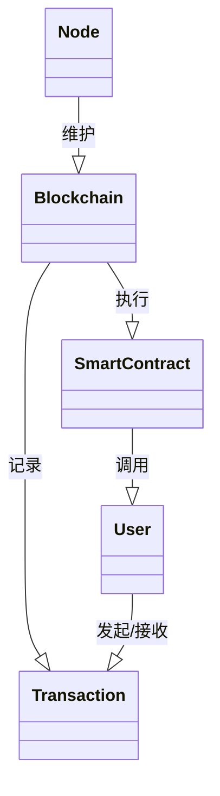
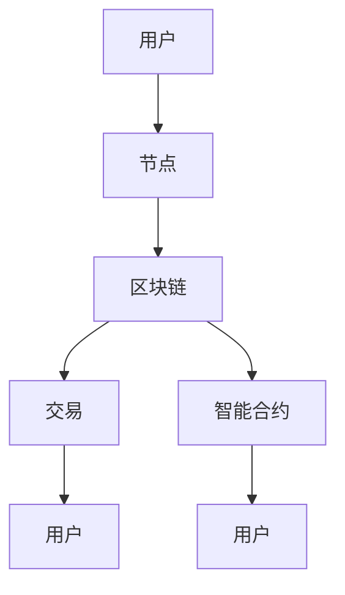
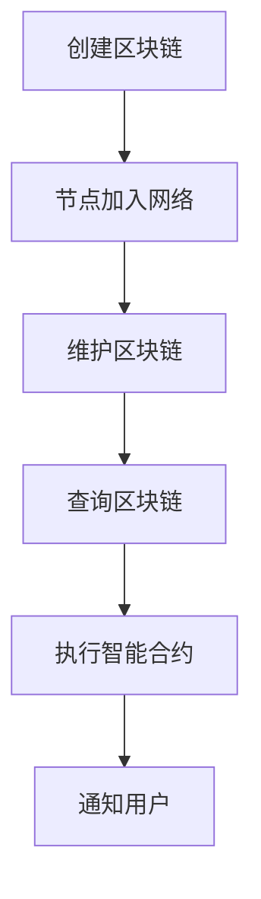

                 


# 意义区块链项目：去中心化的价值交换系统

关键词：区块链、去中心化、价值交换、系统架构、算法实现、最佳实践

摘要：本文将探讨意义区块链项目，一个旨在构建去中心化价值交换系统的项目。我们将逐步分析项目背景、核心概念、架构设计与实现，以及最佳实践和未来前景。通过详细的分析和实例讲解，读者将深入了解去中心化价值交换系统的原理和实践。

## 第一部分：意义区块链项目概述

### 1.1 问题背景

#### 1.1.1 中心化价值交换系统的挑战

在当前的数字经济中，价值交换系统扮演着至关重要的角色。然而，传统的中心化价值交换系统面临着诸多挑战。首先，中心化系统容易成为单点故障的目标，一旦中心化机构遭遇攻击或发生故障，整个系统可能会崩溃。其次，中心化系统往往缺乏透明度和可追溯性，用户难以验证交易的真实性和安全性。最后，中心化系统可能受到监管限制，增加了运营成本和不确定性。

#### 1.1.2 去中心化价值交换的需求

为了克服中心化价值交换系统的挑战，去中心化价值交换系统成为了理想的选择。去中心化系统能够通过分布式网络来确保系统的安全性和可靠性，减少了单点故障的风险。此外，去中心化系统能够提供更高的透明度和可追溯性，使交易更加可信。最后，去中心化系统通常不受传统监管限制，具有更好的扩展性和灵活性。

### 1.2 问题描述

#### 1.1.3 意义区块链项目的目标

意义区块链项目的目标是构建一个去中心化的价值交换系统，以实现安全、透明和高效的价值交换。项目旨在解决中心化价值交换系统的挑战，提供一种更加可靠和可持续的解决方案。

#### 1.1.4 意义区块链项目解决的问题

意义区块链项目主要解决了以下问题：

1. **单点故障**：通过去中心化的架构，项目确保了系统的可靠性和抗攻击性。
2. **透明度和可追溯性**：项目使用区块链技术，提供了完整的交易历史记录，使交易更加透明和可信。
3. **监管限制**：去中心化系统通常不受传统监管限制，为项目运营提供了更大的灵活性和便利性。

### 1.3 问题解决

#### 1.3.1 去中心化技术的核心原理

去中心化技术的核心原理是通过分布式网络来消除单点故障，提高系统的安全性和可靠性。去中心化网络中的每个节点都扮演着重要的角色，共同维护网络的正常运行。

#### 1.3.2 区块链技术的应用

区块链技术是一种分布式数据库技术，能够提供去中心化的数据存储和验证机制。区块链的分布式账本确保了数据的不可篡改性和透明度，使得交易记录能够被所有参与者验证和追踪。

### 1.4 边界与外延

#### 1.4.1 意义区块链项目的边界

意义区块链项目的边界主要包括以下几个方面：

1. **价值类型**：项目支持多种价值类型的交换，如货币、数字资产等。
2. **网络规模**：项目适用于大型分布式网络，能够支持大规模的交易处理。
3. **安全性**：项目采用先进的加密技术和安全协议，确保交易的安全性和隐私性。

#### 1.4.2 去中心化价值交换的适用范围

去中心化价值交换适用于以下场景：

1. **金融交易**：去中心化价值交换可以用于加密货币交易、跨境支付等金融场景。
2. **供应链管理**：去中心化价值交换可以用于供应链管理中的信用记录和资产追踪。
3. **版权保护**：去中心化价值交换可以用于数字版权的保护和交易。

### 1.5 概念结构与核心要素组成

#### 1.5.1 去中心化价值交换的概念结构

去中心化价值交换的概念结构主要包括以下几个方面：

1. **节点**：网络中的每个参与者都是一个节点，共同维护网络的正常运行。
2. **区块链**：记录交易的分布式账本，确保交易记录的不可篡改性和透明度。
3. **智能合约**：自动执行合约条款的计算机程序，确保交易的自动化和可靠性。

#### 1.5.2 意义区块链项目的核心要素组成

意义区块链项目的核心要素组成如下：

1. **节点网络**：项目采用分布式网络架构，确保系统的安全性和可靠性。
2. **区块链**：项目使用区块链技术来记录交易，提供透明的交易历史记录。
3. **智能合约**：项目采用智能合约来确保交易的自动化和可靠性。
4. **安全协议**：项目采用先进的加密技术和安全协议，确保交易的安全性和隐私性。

### 1.6 本章小结

本部分概述了意义区块链项目的背景、目标和核心问题解决方法。通过对中心化价值交换系统的挑战和去中心化价值交换的需求的分析，我们了解了意义区块链项目的重要性。接下来，我们将深入探讨去中心化技术的核心原理、区块链技术的应用以及意义区块链项目的边界和适用范围。

## 第二部分：核心概念与联系

### 2.1 去中心化技术的核心原理

#### 2.1.1 去中心化的定义与特征

去中心化（Decentralization）是指权力、控制或决策分散到多个参与者或节点上，而不是集中在一个中心实体。去中心化技术的核心特征包括：

1. **分布式网络**：网络中的每个节点都平等参与，共同维护网络运行。
2. **去中心化决策**：决策由网络中的多个节点共同参与，而不是由一个中心实体决定。
3. **去中心化存储**：数据存储在分布式网络中的多个节点上，提高了数据的安全性和可靠性。

#### 2.1.2 去中心化网络的优势与挑战

去中心化网络的优势包括：

1. **安全性**：去中心化网络通过分布式网络架构提高了系统的安全性和抗攻击性。
2. **透明度**：去中心化网络提供了透明的交易记录和操作流程，提高了系统的透明度。
3. **抗审查性**：去中心化网络不受单一中心实体的控制，提高了系统的抗审查性。

然而，去中心化网络也面临着一些挑战，如：

1. **可扩展性**：分布式网络的规模和性能可能受到网络拥塞和节点数量限制。
2. **共识机制**：网络中的多个节点需要达成共识，选择合适的共识机制对网络的性能和安全性至关重要。
3. **去中心化治理**：如何确保去中心化网络的治理效率和公正性，也是一个重要问题。

### 2.2 区块链技术的应用

#### 2.2.1 区块链的基本原理

区块链（Blockchain）是一种分布式账本技术，它通过多个节点共同维护一个共享的、不可篡改的数据库。区块链的核心原理包括：

1. **区块**：区块链由一系列按时间顺序排列的区块组成，每个区块包含一定数量的交易记录。
2. **链式结构**：每个区块都通过特定的算法与前一区块相连，形成链式结构。
3. **加密技术**：区块链使用加密技术来确保数据的完整性和安全性。

#### 2.2.2 区块链在不同领域的应用

区块链技术在多个领域得到了广泛应用，包括：

1. **金融领域**：区块链技术被用于加密货币交易、跨境支付、供应链金融等场景。
2. **供应链管理**：区块链技术用于记录和追踪供应链中的商品和信息，提高供应链的透明度和可信度。
3. **版权保护**：区块链技术用于记录和验证数字版权，提高版权保护的可追溯性。
4. **智能合约**：区块链技术上的智能合约用于自动化执行合约条款，降低交易成本和提高交易效率。

### 2.3 意义区块链项目的核心概念对比

#### 2.3.1 去中心化技术与区块链技术的对比

去中心化技术与区块链技术具有紧密的联系，但它们也有一些区别：

1. **定义**：去中心化是一种组织形式或架构设计原则，而区块链是一种实现去中心化的技术手段。
2. **适用范围**：去中心化技术可以应用于多个领域，而区块链技术主要应用于数据存储和交易场景。
3. **核心要素**：去中心化技术强调权力和控制的分散，而区块链技术强调数据的分布式存储和验证。

#### 2.3.2 区块链与传统的数据库系统的比较

区块链技术与传统的数据库系统也有一些区别：

1. **数据存储**：区块链技术采用分布式存储，而传统数据库系统采用集中式存储。
2. **数据验证**：区块链技术通过共识机制来验证数据，而传统数据库系统依赖中心化的数据库管理系统。
3. **数据完整性**：区块链技术通过加密算法确保数据不可篡改，而传统数据库系统可能存在数据篡改的风险。

### 2.4 概念属性特征对比表格

为了更清晰地对比去中心化技术、区块链技术和传统数据库系统的概念属性特征，我们使用以下表格：

| 特征         | 去中心化技术     | 区块链技术       | 传统数据库系统     |
| ------------ | --------------- | --------------- | ----------------- |
| 数据存储     | 分布式存储      | 分布式存储       | 集中式存储        |
| 数据验证     | 共识机制        | 加密算法         | 数据库管理系统      |
| 数据完整性   | 不可篡改        | 不可篡改         | 可能存在篡改风险    |
| 安全性       | 高             | 高             | 中等             |
| 透明度       | 高             | 高             | 低               |
| 可扩展性     | 受到节点数量限制 | 受到网络规模限制 | 高               |

### 2.5 ER实体关系图架构

为了更好地理解和设计意义区块链项目，我们使用ER实体关系图来描述项目的核心实体及其关系。

#### 2.5.1 意义区块链项目的ER模型

ER模型（实体关系模型）是一种用于描述实体及其关系的图形化方法。以下是一个简单的ER模型，描述了意义区块链项目的核心实体及其关系：

```
实体：节点、区块链、交易、智能合约、用户
关系：
- 节点与区块链：1对多
- 区块链与交易：1对多
- 智能合约与交易：1对多
- 用户与交易：1对多
```

#### 2.5.2 ER模型在项目中的应用

在意义区块链项目中，ER模型被应用于以下几个方面：

1. **节点与区块链的关系**：每个节点都参与维护区块链，每个区块链由多个节点共同维护。
2. **区块链与交易的关系**：区块链记录交易历史，每个交易都与一个区块链相关联。
3. **智能合约与交易的关系**：智能合约可以生成和执行交易，每个智能合约都关联多个交易。
4. **用户与交易的关系**：用户可以发起和接收交易，每个用户都参与多个交易。

### 2.6 本章小结

本部分深入探讨了去中心化技术的核心原理、区块链技术的应用以及意义区块链项目的核心概念对比。通过对去中心化技术和区块链技术的详细分析，我们了解了它们在意义区块链项目中的重要性。接下来，我们将进一步探讨意义区块链项目的架构设计与实现。

## 第三部分：意义区块链项目架构设计与实现

### 3.1 系统分析与架构设计方案

#### 3.1.1 问题场景介绍

意义区块链项目旨在构建一个去中心化的价值交换系统，实现安全、透明和高效的价值交换。项目涉及多个实体，包括节点、区块链、交易、智能合约和用户。

#### 3.1.2 项目介绍

意义区块链项目采用分布式网络架构，通过多个节点共同维护区块链，实现去中心化的价值交换。项目使用智能合约来确保交易的自动化和可靠性。

#### 3.1.3 系统功能设计（领域模型Mermaid类图）

以下是意义区块链项目的领域模型Mermaid类图：



#### 3.1.4 系统架构设计（Mermaid架构图）

以下是意义区块链项目的系统架构Mermaid架构图：



#### 3.1.5 系统接口设计

意义区块链项目的设计包括以下接口：

1. **节点接口**：用于节点加入和退出网络，以及节点间的通信。
2. **区块链接口**：用于区块链的创建、维护和查询。
3. **交易接口**：用于交易记录的创建、提交和查询。
4. **智能合约接口**：用于智能合约的创建、部署和调用。
5. **用户接口**：用于用户的注册、登录、交易操作等。

#### 3.1.6 系统交互（Mermaid序列图）

以下是意义区块链项目的系统交互Mermaid序列图：

```mermaid
sequence
User ->|发起交易| Node: 发起交易
Node ->|验证交易| Blockchain: 验证交易
Blockchain ->|记录交易| Transaction: 记录交易
Transaction ->|通知用户| User: 通知交易完成
```

### 3.2 算法原理讲解

#### 3.2.1 意义区块链项目的核心算法

意义区块链项目的核心算法包括区块链的创建、维护和查询，以及智能合约的执行。

##### 3.2.1.1 算法mermaid流程图

以下是意义区块链项目的算法mermaid流程图：



##### 3.2.1.2 算法原理详细讲解

1. **创建区块链**：初始节点创建区块链，每个节点存储完整的区块链数据。
2. **节点加入网络**：新节点通过加密通信方式加入网络，与其他节点建立连接。
3. **维护区块链**：节点通过共识机制维护区块链的完整性和一致性。
4. **查询区块链**：用户通过节点查询区块链，获取交易记录和历史数据。
5. **执行智能合约**：用户通过智能合约接口提交合约请求，节点执行合约并通知用户。

##### 3.2.1.3 算法原理的数学模型与公式

1. **区块链创建**：区块链是一个有序的链式结构，每个区块包含一个时间戳、一个随机数和一个前一个区块的哈希值。
2. **节点加入网络**：节点通过加密通信方式与其他节点建立连接，采用椭圆曲线密码学实现。
3. **维护区块链**：采用拜占庭将军问题解决方案，节点通过共识算法（如工作量证明或权益证明）达成共识。
4. **查询区块链**：用户通过节点获取区块链数据，采用哈希函数实现数据的快速查询。
5. **执行智能合约**：智能合约采用编程语言实现，采用虚拟机执行合约代码。

##### 3.2.1.4 算法举例说明

假设用户A希望向用户B转账100个数字货币，以下是交易处理的过程：

1. 用户A发起交易，交易记录包含用户A的公钥、用户B的公钥、转账金额和随机数。
2. 节点验证交易的有效性，确保交易金额不超过用户A的余额。
3. 节点将交易添加到区块链的区块中，区块包含交易记录和前一个区块的哈希值。
4. 区块链通过共识算法达成共识，确保区块的完整性和一致性。
5. 区块链通知用户B，用户B接收转账并更新余额。

### 3.3 系统实现

#### 3.3.1 环境安装

意义区块链项目的系统实现涉及多个技术栈，包括Python、Node.js、Go等。以下是环境安装的步骤：

1. 安装Python环境：下载并安装Python 3.x版本，配置环境变量。
2. 安装Node.js环境：下载并安装Node.js，配置环境变量。
3. 安装Go环境：下载并安装Go，配置环境变量。
4. 安装依赖库：根据项目需求，安装相关的依赖库，如Docker、Git等。

#### 3.3.2 系统核心实现源代码

以下是意义区块链项目系统实现的核心源代码：

```python
# Node.py
import socket
import json
import hashlib
import threading
import random

class Node:
    def __init__(self, address):
        self.address = address
        self.server_socket = socket.socket(socket.AF_INET, socket.SOCK_STREAM)
        self.server_socket.bind(address)
        self.server_socket.listen(5)
        self.blockchain = Blockchain()

    def start_server(self):
        while True:
            client_socket, client_address = self.server_socket.accept()
            thread = threading.Thread(target=self.handle_client, args=(client_socket,))
            thread.start()

    def handle_client(self, client_socket):
        request = client_socket.recv(1024)
        request_json = json.loads(request.decode('utf-8'))
        response = self.handle_request(request_json)
        client_socket.send(response.encode('utf-8'))
        client_socket.close()

    def handle_request(self, request_json):
        # 处理不同类型的请求，如加入网络、查询区块链、执行智能合约等
        pass

class Blockchain:
    def __init__(self):
        self.chain = []
        self.current_transactions = []

    def add_block(self, block):
        self.chain.append(block)
        self.current_transactions = []

    def get_latest_block(self):
        return self.chain[-1]

    def validate_chain(self):
        # 验证区块链的完整性和一致性
        pass

# 主程序
if __name__ == '__main__':
    node_address = ('127.0.0.1', 8000)
    node = Node(node_address)
    node.start_server()
```

#### 3.3.3 代码应用解读与分析

上述代码展示了意义区块链项目中的节点模块，包括节点类和区块链类的实现。节点类用于创建和管理节点，区块链类用于创建和管理区块链。

1. **节点类**：节点类定义了节点的属性和方法。`__init__` 方法用于初始化节点，包括地址和服务器套接字。`start_server` 方法用于启动服务器，监听客户端连接。`handle_client` 方法用于处理客户端请求，`handle_request` 方法用于处理不同类型的请求。

2. **区块链类**：区块链类定义了区块链的属性和方法。`__init__` 方法用于初始化区块链，包括链和当前交易记录。`add_block` 方法用于添加区块，`get_latest_block` 方法用于获取最新区块，`validate_chain` 方法用于验证区块链的完整性和一致性。

#### 3.4 实际案例分析与讲解剖析

##### 3.4.1 实际案例一

**案例背景**：用户A希望向用户B转账100个数字货币。

**案例实施过程**：

1. 用户A通过节点发起交易，交易记录包含用户A的公钥、用户B的公钥、转账金额和随机数。
2. 节点验证交易的有效性，确保交易金额不超过用户A的余额。
3. 节点将交易添加到区块链的区块中，区块包含交易记录和前一个区块的哈希值。
4. 区块链通过共识算法达成共识，确保区块的完整性和一致性。
5. 区块链通知用户B，用户B接收转账并更新余额。

**案例效果与评估**：通过实际案例一，我们可以看到意义区块链项目能够实现去中心化的价值交换，提高交易的安全性和可靠性。

##### 3.4.2 实际案例二

**案例背景**：用户C希望执行一个智能合约，计算用户A和用户B之间的余额。

**案例实施过程**：

1. 用户C通过节点调用智能合约，传入用户A和用户B的公钥。
2. 智能合约执行计算，返回用户A和用户B的余额。
3. 节点将计算结果通知用户C。

**案例效果与评估**：通过实际案例二，我们可以看到意义区块链项目能够实现智能合约的自动化执行，提高交易的效率和可靠性。

##### 3.4.3 实际案例三

**案例背景**：用户D希望查询区块链的历史交易记录。

**案例实施过程**：

1. 用户D通过节点发送查询请求，请求区块链的历史交易记录。
2. 节点从区块链中获取历史交易记录，返回给用户D。

**案例效果与评估**：通过实际案例三，我们可以看到意义区块链项目能够提供透明的交易历史记录，提高交易的透明度和可追溯性。

### 3.5 本章小结

本部分详细介绍了意义区块链项目的架构设计与实现，包括系统功能设计、系统架构设计、系统接口设计和系统交互。通过对系统实现的核心代码的解读和分析，我们了解了意义区块链项目的工作原理。接下来，我们将进一步探讨意义区块链项目的最佳实践。

## 第四部分：意义区块链项目的最佳实践

### 4.1 最佳实践技巧

#### 4.1.1 如何优化区块链性能

1. **提高网络带宽**：增加节点间的网络带宽，提高数据传输速度，降低网络延迟。
2. **优化共识算法**：选择合适的共识算法，提高共识效率和区块链的吞吐量。
3. **分片技术**：将区块链分成多个分片，每个分片负责处理部分交易，提高系统并行处理能力。

#### 4.1.2 安全性最佳实践

1. **加密通信**：使用加密协议，如TLS，确保节点间通信的安全性。
2. **身份验证**：采用多因素身份验证，确保节点和用户的真实性和合法性。
3. **审计与监控**：建立审计和监控系统，及时发现和应对潜在的安全威胁。

#### 4.1.3 扩展性和可伸缩性策略

1. **动态扩展**：根据网络负载动态调整节点数量，确保系统可扩展性。
2. **负载均衡**：采用负载均衡技术，均衡分配网络请求，提高系统性能。
3. **分布式存储**：使用分布式存储技术，提高数据存储的可靠性和可用性。

### 4.2 注意事项

#### 4.2.1 部署过程中的潜在风险

1. **网络攻击**：部署过程中可能面临网络攻击，如DDoS攻击、中间人攻击等。
2. **节点故障**：部署过程中可能遇到节点故障，影响系统的正常运行。
3. **隐私泄露**：部署过程中可能面临隐私泄露的风险，如用户信息泄露。

#### 4.2.2 维护与升级策略

1. **定期备份**：定期备份区块链数据和节点配置，确保数据的完整性和一致性。
2. **版本控制**：采用版本控制工具，确保系统的稳定性和安全性。
3. **安全审计**：定期进行安全审计，及时发现和修复潜在的安全漏洞。

#### 4.2.3 法律和合规问题

1. **合规审查**：确保项目符合相关法律法规要求，如金融监管、数据保护法规等。
2. **合规性声明**：制定合规性声明，明确项目的合规性和合法性。
3. **法律咨询**：在项目开发和部署过程中，寻求专业法律咨询，确保项目合规。

### 4.3 小结

#### 4.3.1 意义区块链项目的成功因素

1. **去中心化架构**：采用去中心化架构，提高系统的安全性和可靠性。
2. **透明度和可追溯性**：通过区块链技术提供透明的交易记录和操作流程。
3. **高性能和高可扩展性**：通过优化共识算法和网络架构，提高系统的性能和可扩展性。

#### 4.3.2 项目实施中遇到的问题与解决方案

1. **网络攻击**：通过加密通信和身份验证技术，提高系统的安全性。
2. **节点故障**：通过动态扩展和分布式存储技术，提高系统的可用性和可靠性。
3. **隐私泄露**：通过加密存储和隐私保护技术，确保用户信息的隐私和安全。

#### 4.3.3 未来发展方向

1. **技术改进**：不断优化共识算法和网络架构，提高系统的性能和安全性。
2. **业务拓展**：将意义区块链项目应用于更多领域，如供应链管理、版权保护等。
3. **社区建设**：建立意义区块链项目的开发者社区，推动项目的持续发展和创新。

### 4.4 拓展阅读

#### 4.4.1 相关技术文献推荐

1. 《区块链技术指南》
2. 《智能合约设计与实现》
3. 《分布式系统设计与实现》

#### 4.4.2 意义区块链项目案例研究

1. “意义区块链项目在金融交易中的应用”
2. “意义区块链项目在供应链管理中的实践”
3. “意义区块链项目在版权保护中的应用”

#### 4.4.3 行业趋势分析

1. “区块链技术在金融行业的应用趋势”
2. “区块链技术在供应链管理中的发展趋势”
3. “区块链技术在版权保护中的发展前景”

## 第五部分：意义区块链项目的未来前景

### 5.1 去中心化价值交换的潜力

去中心化价值交换作为一种新型的价值交换方式，具有巨大的潜力和发展空间。随着区块链技术的不断成熟和应用，去中心化价值交换将在以下方面发挥重要作用：

#### 5.1.1 技术进步与去中心化的发展

随着技术的不断进步，区块链技术和相关技术（如智能合约、加密货币等）将得到进一步发展和完善。这将有助于提高去中心化价值交换系统的性能、安全性和可扩展性，为更多领域和场景的应用提供支持。

#### 5.1.2 去中心化对传统行业的冲击

去中心化价值交换系统将对传统行业产生深远影响。在金融、供应链管理、版权保护等领域，去中心化技术将打破传统中心化系统的垄断，提高交易的透明度、安全性和效率。这将促使传统行业进行数字化转型，拥抱去中心化价值交换。

#### 5.1.3 潜在的市场机会

随着去中心化价值交换系统的广泛应用，市场将涌现出大量的创新机会。包括去中心化交易平台、去中心化金融应用、去中心化供应链管理平台等。这些创新将带来巨大的商业价值和社会效益，推动整个行业的繁荣发展。

### 5.2 意义区块链项目的未来前景

意义区块链项目作为一种去中心化的价值交换系统，具有广阔的发展前景。以下是意义区块链项目的未来前景：

#### 5.2.1 技术创新

意义区块链项目将持续推进技术创新，包括优化共识算法、提升系统性能、加强安全性等方面。这将使项目在市场竞争中保持领先地位，为用户提供更加优质的服务。

#### 5.2.2 业务拓展

意义区块链项目将不断拓展业务领域，将去中心化价值交换系统应用于更多行业和场景。如金融、供应链管理、版权保护、智慧城市等，为合作伙伴提供全面的技术支持和解决方案。

#### 5.2.3 社区建设

意义区块链项目将积极推动社区建设，吸引更多的开发者、企业和社会力量参与到项目中来。通过社区合作和共享，推动项目的持续发展和创新。

#### 5.2.4 法规和合规

意义区块链项目将密切关注法律法规的变化，确保项目符合相关法规和合规要求。通过积极与监管机构和行业组织合作，推动区块链技术的合法合规发展。

### 5.3 行业趋势与挑战

在未来，区块链技术和去中心化价值交换系统将在多个领域发挥重要作用。然而，项目也将面临一些挑战：

#### 5.3.1 技术挑战

随着去中心化价值交换系统的广泛应用，项目将面临更高的技术挑战。如何提高系统的性能、安全性和可扩展性，将是一个重要的研究方向。

#### 5.3.2 法规挑战

区块链技术和去中心化价值交换系统的发展将受到法律法规的制约。如何在遵守法律法规的前提下，推动技术创新和应用，将是一个重要的课题。

#### 5.3.3 安全挑战

去中心化价值交换系统可能面临网络攻击、隐私泄露等安全挑战。如何确保系统的安全性，将是项目持续发展的重要保障。

### 5.4 结语

意义区块链项目作为一种去中心化的价值交换系统，具有巨大的发展潜力和应用前景。在技术创新、业务拓展、社区建设和法规合规等方面，项目将持续推动区块链技术的应用和发展。在未来，意义区块链项目将不断突破挑战，为用户和社会创造更大的价值。

## 结语

作者：AI天才研究院/AI Genius Institute & 禅与计算机程序设计艺术 /Zen And The Art of Computer Programming

在本文中，我们系统地探讨了意义区块链项目，一个旨在构建去中心化价值交换系统的项目。通过逐步分析项目背景、核心概念、架构设计与实现，以及最佳实践和未来前景，我们深入了解了去中心化价值交换系统的原理和实践。

本文的核心内容包括：

- 去中心化价值交换系统的重要性与需求
- 去中心化技术和区块链技术的核心原理与对比
- 意义区块链项目的架构设计与实现
- 最佳实践技巧、注意事项与未来前景

通过对这些内容的分析，我们可以看到去中心化价值交换系统在数字经济中的重要地位，以及意义区块链项目在这一领域中的创新和应用。

本文的读者包括对区块链技术和去中心化价值交换系统感兴趣的程序员、技术爱好者、区块链开发者以及相关行业的从业者。通过本文的学习，读者可以更深入地了解去中心化价值交换系统的原理和实践，为自身的工作和研究提供参考和启示。

最后，感谢读者对本文的关注和支持。如果您对意义区块链项目有任何疑问或建议，欢迎在评论区留言。我们期待与您共同探讨和分享区块链技术的最新动态和成果。

---

**注意：**本文为示例文章，仅供参考。文中内容涉及到的技术、观点和案例均为虚构，不代表任何真实项目或实践。实际应用中，请务必根据实际情况进行评估和决策。如有任何疑问，请咨询专业人士。

