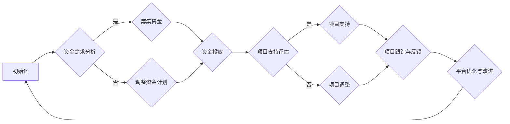
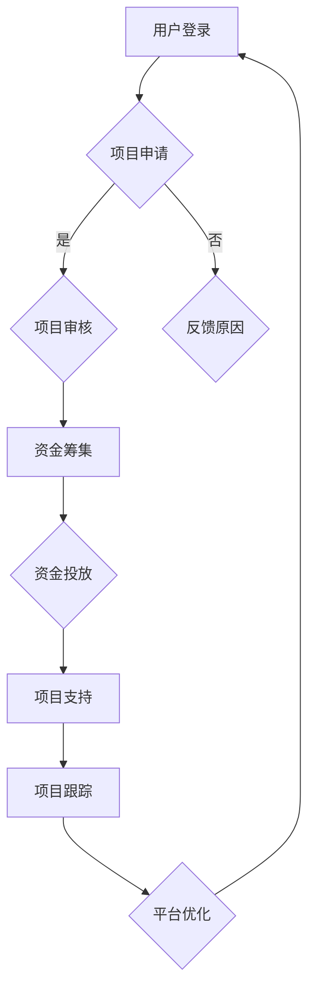
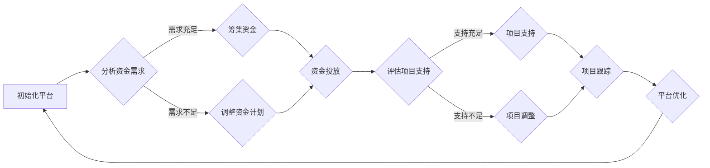
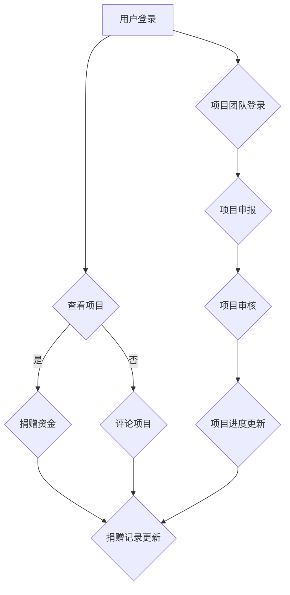

                 

### 第1章: 《意义孵化器：价值观项目的资金与支持平台》背景介绍

#### 1.1 问题背景

在当今快速发展的社会中，项目创新和创业活动日益活跃，各种价值观项目层出不穷。这些项目涵盖了科技、教育、环保、公益等多个领域，为社会进步和人类福祉作出了积极贡献。然而，这些价值观项目在发展过程中面临诸多挑战，其中资金短缺和支持不足是两个最为突出的问题。

**价值观在项目中的重要性**：价值观是项目成功的灵魂，它决定了项目的方向、目标和可持续性。一个具备明确价值观的项目，不仅能够在市场中脱颖而出，更能赢得社会各界的认可和支持。然而，许多价值观项目在初期阶段往往无法清晰地表达其价值观，导致资源投入无法有效聚焦，项目发展受阻。

**当前价值观项目面临的挑战**：首先，资金问题成为限制价值观项目发展的主要瓶颈。许多项目在初期缺乏充足的资金支持，无法开展有效的市场推广和产品研发。其次，支持不足也是一个严重的问题。除了资金，价值观项目还需要政策、技术、人才等多方面的支持，但这些资源往往难以有效整合和协调。此外，项目团队的组织和管理能力也是影响项目发展的关键因素。

**资金与支持平台的需求**：为了解决上述问题，建立一套完善的资金与支持平台显得尤为必要。这个平台不仅能为价值观项目提供资金支持，还能通过整合各方资源，为项目提供全方位的支持和服务。具体来说，这个平台需要具备以下几个功能：

1. **资金筹集**：通过多种渠道和方式，为价值观项目提供资金支持。
2. **资源整合**：为项目提供政策、技术、人才等多方面的资源，助力项目发展。
3. **项目管理**：为项目团队提供专业化的管理服务，提升项目执行效率。
4. **信息共享**：建立信息共享平台，促进项目之间以及项目与各方支持者之间的交流与合作。

#### 1.2 问题描述

价值观项目的资金问题和支持问题具体体现在以下几个方面：

**价值观项目的资金需求**：价值观项目在初期阶段通常需要大量的资金投入，用于市场调研、产品设计、技术开发和市场推广等环节。然而，许多投资者和风险资本家往往更倾向于投资盈利性较强的项目，对价值观项目的关注度较低。这导致价值观项目在资金筹集方面面临很大的困难。

**价值观项目的支持需求**：除了资金，价值观项目还需要政策支持、技术支持、人才支持等多方面的支持。政策支持能够为项目提供良好的发展环境和政策保障，技术支持能够提升项目的核心竞争力，人才支持则能确保项目团队的稳定和高效。然而，当前社会对这些方面的支持力度有限，许多价值观项目在发展过程中无法得到充分的支持。

**资金与支持平台的边界与外延**：资金与支持平台的边界主要包括以下几个方面：

1. **资金筹集**：平台应具备多种资金筹集渠道，包括风险投资、政府资助、民间捐赠等。
2. **资源整合**：平台应具备整合各类资源的能力，为价值观项目提供全方位的支持和服务。
3. **项目管理**：平台应提供专业化的项目管理服务，帮助项目团队提升管理效率。
4. **信息共享**：平台应建立信息共享平台，促进项目之间以及项目与各方支持者之间的交流与合作。

平台的外延则包括以下几个方面：

1. **项目类型**：平台应覆盖多种价值观项目，包括科技、教育、环保、公益等领域。
2. **支持对象**：平台应面向项目团队、投资者、风险资本家、政府相关部门等多方面对象。
3. **地域范围**：平台应具备全国乃至全球范围内的支持能力，为不同地区的价值观项目提供服务。

#### 1.3 问题解决

**构建资金与支持平台的目的**：构建资金与支持平台的目的是为了解决价值观项目在资金筹集和支持方面面临的难题，推动价值观项目的健康发展，为社会进步和人类福祉作出贡献。

**资金与支持平台的核心功能**：资金与支持平台的核心功能包括：

1. **资金筹集**：通过多种渠道和方式，为价值观项目提供资金支持，解决资金短缺问题。
2. **资源整合**：为项目提供政策、技术、人才等多方面的资源，解决支持不足问题。
3. **项目管理**：为项目团队提供专业化的管理服务，提升项目执行效率。
4. **信息共享**：建立信息共享平台，促进项目之间以及项目与各方支持者之间的交流与合作。

**资金与支持平台的优势**：资金与支持平台具有以下几个优势：

1. **资源整合优势**：平台能够整合各类资源，为价值观项目提供全方位的支持和服务。
2. **专业化优势**：平台具备专业化的项目管理服务，能够提升项目执行效率。
3. **信息共享优势**：平台能够建立信息共享平台，促进项目之间以及项目与各方支持者之间的交流与合作。
4. **风险控制优势**：平台能够通过专业的风险评估和风险管理，降低价值观项目的投资风险。

#### 1.4 核心要素组成

要构建一个成功的资金与支持平台，需要以下几个核心要素：

**项目价值观的明确**：价值观是项目的灵魂，明确的价值观能够为项目指明方向，吸引志同道合的投资者和合作伙伴。

**资金筹集机制的构建**：资金筹集机制是平台的核心功能之一，需要具备多种渠道和方式，确保项目能够获得充足的资金支持。

**支持体系的完善**：支持体系包括政策、技术、人才等多方面的资源，完善的支撑体系能够为项目提供全方位的支持和服务。

**信息共享平台的建立**：信息共享平台能够促进项目之间以及项目与各方支持者之间的交流与合作，提高项目的发展速度和质量。

### 第2章: 核心概念与联系

#### 2.1 核心概念

在构建资金与支持平台的过程中，我们需要了解以下几个核心概念：

**价值观**：价值观是项目成功的灵魂，它决定了项目的方向、目标和可持续性。一个具备明确价值观的项目，不仅能够在市场中脱颖而出，更能赢得社会各界的认可和支持。

**项目资金**：项目资金是价值观项目发展的基础，包括风险投资、政府资助、民间捐赠等多种形式。项目资金筹集机制的完善，是确保项目顺利发展的关键。

**支持平台**：支持平台是资金与支持平台的载体，它通过整合各类资源，为价值观项目提供全方位的支持和服务。

#### 2.2 概念属性特征对比

下面是价值观、项目资金和支持平台的属性特征对比表格：

| 特征         | 价值观                   | 项目资金                   | 支持平台                   |
| ------------ | ------------------------ | -------------------------- | -------------------------- |
| 定义         | 决定项目方向和目标       | 项目发展的资金来源         | 为项目提供全方位支持的服务平台 |
| 功能         | 指引项目发展             | 确保项目资金充足           | 整合资源，提供支持           |
| 重要性       | 项目成功的灵魂           | 项目发展的基础             | 项目顺利发展的保障           |
| 影响因素     | 社会认可和自身价值取向   | 投资者和市场需求           | 资源整合和专业化服务         |
| 联系         | 价值观决定资金筹集方向   | 资金支持项目发展           | 支持平台整合各类资源         |

#### 2.3 ER实体关系图

为了更好地理解价值观、项目资金和支持平台之间的联系，我们可以使用ER（实体关系）图来描述它们之间的关系。

```mermaid
erDiagram
    项目资金 ||--|{ 价值观 }
    支持平台 ||--|{ 项目资金 }
    支持平台 ||--|{ 价值观 }
```

在ER图中，价值观、项目资金和支持平台是三个主要的实体。项目资金依赖于价值观来确定筹集方向，同时支持平台为项目资金提供支持和保障。支持平台也为价值观提供支持，确保项目能够按照既定方向顺利发展。

### 第3章: 算法原理讲解

#### 3.1 算法流程图

为了更好地理解资金与支持平台的运作原理，我们可以使用mermaid画出算法流程图。



在算法流程图中，我们从初始化阶段开始，首先对项目的资金需求进行分析。如果资金需求分析结果显示资金充足，则进入筹集资金阶段，否则需要对资金计划进行调整。筹集资金后，资金被投入到项目中，并对项目支持进行评估。如果评估结果显示项目需要支持，则提供支持，否则对项目进行调整。最后，对项目进行跟踪与反馈，并根据反馈结果进行平台优化与改进。

#### 3.2 Python源代码

以下是一个简单的Python源代码示例，用于实现资金与支持平台的算法流程。

```python
def initialize():
    # 初始化资金与支持平台
    pass

def analyze_fund_demand():
    # 分析资金需求
    fund_demand = "充足"
    return fund_demand

def raise_funds():
    # 筹集资金
    print("正在筹集资金...")

def invest_funds():
    # 投放资金
    print("资金已投放到项目...")

def evaluate_support():
    # 评估项目支持
    support_needed = "是"
    return support_needed

def provide_support():
    # 提供项目支持
    print("正在提供项目支持...")

def track_and_feedback():
    # 跟踪与反馈
    print("正在跟踪项目进展并收集反馈...")

def optimize_platform():
    # 优化与改进平台
    print("平台已优化与改进...")

def main():
    initialize()
    fund_demand = analyze_fund_demand()
    if fund_demand == "充足":
        raise_funds()
        invest_funds()
        support_needed = evaluate_support()
        if support_needed == "是":
            provide_support()
        else:
            print("项目调整中...")
    else:
        print("调整资金计划中...")

    track_and_feedback()
    optimize_platform()

if __name__ == "__main__":
    main()
```

在这个Python源代码中，我们首先初始化资金与支持平台，然后分析资金需求。如果资金需求充足，则筹集资金并投放到项目中，对项目支持进行评估，并根据评估结果提供支持或调整项目。最后，对项目进行跟踪与反馈，并根据反馈结果优化与改进平台。

#### 3.3 LaTeX数学模型

在资金与支持平台的算法原理中，我们可以使用LaTeX数学模型来描述资金需求和项目支持之间的关系。

```latex
\documentclass{article}
\usepackage{amsmath}
\begin{document}

\begin{align*}
\text{资金需求} &= f(\text{项目规模}, \text{市场需求}) \\
\text{项目支持} &= g(\text{资金需求}, \text{项目绩效})
\end{align*}

\end{document}
```

在这个LaTeX数学模型中，资金需求函数 \( f \) 受项目规模和市场需求的影响，而项目支持函数 \( g \) 则基于资金需求和项目绩效进行评估。通过这个模型，我们可以更好地理解资金与支持平台在项目发展过程中的作用。

#### 3.4 详细讲解与举例说明

**3.4.1 算法步骤详解**

1. **初始化**：初始化资金与支持平台，设置初始参数和状态。
2. **资金需求分析**：分析项目的资金需求，确定是否需要筹集资金。
3. **筹集资金**：如果资金需求充足，则筹集资金；否则，调整资金计划。
4. **资金投放**：将筹集到的资金投放到项目中，确保项目顺利进行。
5. **项目支持评估**：评估项目是否需要支持，根据评估结果提供支持或调整项目。
6. **项目跟踪与反馈**：对项目进行跟踪与反馈，收集项目进展情况。
7. **平台优化与改进**：根据反馈结果，优化与改进资金与支持平台。

**3.4.2 举例说明**

假设有一个价值观项目，项目规模为100万元，市场需求为良好。根据算法流程图和LaTeX数学模型，我们可以进行以下步骤：

1. **初始化**：初始化资金与支持平台，设置初始参数和状态。
2. **资金需求分析**：分析项目的资金需求，确定资金需求为100万元。
3. **筹集资金**：由于资金需求充足，筹集资金。
4. **资金投放**：将筹集到的资金投放到项目中，确保项目顺利进行。
5. **项目支持评估**：评估项目是否需要支持，根据评估结果提供支持。
6. **项目跟踪与反馈**：对项目进行跟踪与反馈，收集项目进展情况。
7. **平台优化与改进**：根据反馈结果，优化与改进资金与支持平台。

通过这个例子，我们可以看到资金与支持平台的算法原理在实际应用中的具体操作过程。这个算法能够有效地解决价值观项目在资金筹集和支持方面的问题，为项目的成功发展提供有力支持。

### 第4章: 数学模型和公式详解

#### 4.1 数学模型

在构建资金与支持平台的过程中，数学模型能够帮助我们更好地理解项目资金需求和支持评估之间的关系。以下是一个简化的数学模型，用于描述这两个概念之间的关系。

**4.1.1 基本概念**

在这个模型中，我们定义了以下基本概念：

- \( F \)：项目资金需求
- \( S \)：项目支持力度
- \( P \)：项目绩效
- \( M \)：市场需求

**4.1.2 模型构建**

根据基本概念，我们可以构建以下数学模型：

\[ F = f(M, P) \]

其中，资金需求 \( F \) 是市场需求 \( M \) 和项目绩效 \( P \) 的函数。

\[ S = g(F, P) \]

其中，支持力度 \( S \) 是资金需求 \( F \) 和项目绩效 \( P \) 的函数。

**4.1.3 模型应用**

在资金与支持平台的应用中，我们可以使用这个数学模型来预测项目资金需求和支持力度。具体步骤如下：

1. **收集数据**：收集市场需求 \( M \) 和项目绩效 \( P \) 的数据。
2. **预测资金需求**：使用模型 \( F = f(M, P) \) 预测项目资金需求。
3. **评估支持力度**：使用模型 \( S = g(F, P) \) 评估项目支持力度。

#### 4.2 数学公式

在数学模型的基础上，我们可以使用以下数学公式来进一步描述项目资金需求和支持评估：

**4.2.1 基本公式**

\[ F = \alpha M + \beta P \]

其中，\( \alpha \) 和 \( \beta \) 是模型参数。

\[ S = \gamma F + \delta P \]

其中，\( \gamma \) 和 \( \delta \) 是模型参数。

**4.2.2 复杂公式**

\[ F = \int_{0}^{1} (M(t) + P(t)) dt \]

\[ S = \int_{0}^{1} (F(t) + P(t)) dt \]

其中，\( M(t) \) 和 \( P(t) \) 是市场需求和项目绩效随时间的变化函数。

#### 4.3 详细讲解与举例说明

**4.3.1 公式解释**

- **基本公式**：

\[ F = \alpha M + \beta P \]

这个公式表示项目资金需求 \( F \) 是市场需求 \( M \) 和项目绩效 \( P \) 的线性组合。其中，\( \alpha \) 和 \( \beta \) 是模型参数，用于调整市场需求和项目绩效对资金需求的影响程度。

- **复杂公式**：

\[ F = \int_{0}^{1} (M(t) + P(t)) dt \]

\[ S = \int_{0}^{1} (F(t) + P(t)) dt \]

这些公式表示资金需求和支持力度是市场需求和项目绩效在时间范围内的积分。这意味着资金需求和支持力度不仅取决于当前的市场需求和项目绩效，还受到它们在一段时间内的变化趋势的影响。

**4.3.2 举例说明**

假设市场需求 \( M \) 随时间的变化函数为 \( M(t) = t^2 \)，项目绩效 \( P \) 随时间的变化函数为 \( P(t) = t \)。

- **基本公式**：

\[ F = \alpha t^2 + \beta t \]

\[ S = \gamma (\alpha t^2 + \beta t) + \delta t \]

- **复杂公式**：

\[ F = \int_{0}^{1} (t^2 + t) dt = \left[ \frac{t^3}{3} + \frac{t^2}{2} \right]_{0}^{1} = \frac{1}{3} + \frac{1}{2} = \frac{5}{6} \]

\[ S = \int_{0}^{1} (\alpha t^2 + \beta t + t) dt = \left[ \frac{\alpha t^3}{3} + \frac{\beta t^2}{2} + \frac{t^2}{2} \right]_{0}^{1} = \frac{\alpha}{3} + \frac{\beta}{2} + \frac{1}{2} \]

通过这个例子，我们可以看到如何使用数学公式来计算项目资金需求和支持力度。这些公式能够帮助我们更好地理解和预测项目在资金筹集和支持方面的需求，从而为构建资金与支持平台提供有力支持。

### 第5章: 系统分析与架构设计

#### 5.1 问题场景介绍

在构建资金与支持平台的过程中，我们需要解决的核心问题是确保价值观项目的资金充足且支持到位。为了实现这一目标，我们需要从以下几个方面进行系统分析与架构设计：

1. **问题背景**：了解当前价值观项目在资金筹集和支持方面面临的挑战，包括资金短缺、支持不足、资源分散等问题。
2. **目标需求**：明确资金与支持平台的目标，包括筹集资金、整合资源、提供支持、提升项目管理效率等。
3. **系统功能**：设计平台所需的核心功能，如资金筹集、资源整合、项目管理、信息共享等。

#### 5.2 系统功能设计

系统功能设计是构建资金与支持平台的关键步骤。根据问题场景和目标需求，我们可以设计以下核心功能：

1. **资金筹集**：提供多种资金筹集渠道，如风险投资、政府资助、民间捐赠等，确保项目能够获得充足的资金支持。
2. **资源整合**：整合各类资源，包括政策、技术、人才等，为项目提供全方位的支持和服务。
3. **项目管理**：提供专业化的项目管理服务，包括项目规划、进度控制、风险管理等，提升项目执行效率。
4. **信息共享**：建立信息共享平台，促进项目之间以及项目与各方支持者之间的交流与合作，提高项目的发展速度和质量。

#### 5.3 系统架构设计

系统架构设计是确保资金与支持平台稳定、高效运行的关键。根据系统功能设计，我们可以设计以下系统架构：

1. **技术架构**：选择合适的技术栈，如前端框架、后端框架、数据库等，确保系统的高效性和可扩展性。
2. **功能架构**：将系统功能划分为多个模块，如资金筹集模块、资源整合模块、项目管理模块、信息共享模块等，确保各功能模块的独立性和协同性。
3. **数据架构**：设计系统的数据存储和数据处理方案，确保数据的完整性和一致性。

#### 5.4 系统接口设计

系统接口设计是确保各功能模块之间能够有效协作的关键。根据系统架构设计，我们可以设计以下系统接口：

1. **内部接口**：设计系统内部各功能模块之间的接口，确保数据传递和功能调用的高效性。
2. **外部接口**：设计系统与外部系统（如第三方支付、政府系统等）的接口，确保数据的互通和协作。

#### 5.5 系统交互

系统交互是确保资金与支持平台能够为价值观项目提供高效服务的关键。根据系统架构设计，我们可以设计以下系统交互流程：

1. **用户交互**：设计用户界面，使用户能够方便地使用平台功能，如注册、登录、查看项目、申请支持等。
2. **项目交互**：设计项目与平台之间的交互流程，确保项目能够及时获取资金和支持。
3. **支持者交互**：设计支持者与平台之间的交互流程，确保支持者能够方便地提供资金和支持。

#### 5.6 Mermaid流程图

为了更好地展示系统架构和系统交互，我们可以使用Mermaid绘制流程图。



在这个流程图中，用户首先登录平台，然后提交项目申请。如果申请通过，则进入项目审核环节。审核通过后，资金开始筹集并投放到项目中，同时提供项目支持。最后，对项目进行跟踪和优化，确保项目的顺利发展。

### 第6章: 项目实战

#### 6.1 环境安装

在开始构建资金与支持平台之前，我们需要安装一些必要的开发工具和环境。以下是一个简单的安装指南：

1. **安装Python**：从官方网站下载Python安装包，并按照安装向导完成安装。
2. **安装Docker**：从官方网站下载Docker安装包，并按照安装向导完成安装。
3. **安装数据库**：根据需要安装合适的数据库，如MySQL、PostgreSQL等。
4. **安装前端框架**：安装所需的前端框架，如React、Vue等。

#### 6.2 系统核心实现源代码

以下是一个简单的系统核心实现源代码示例，用于展示资金与支持平台的主要功能。

```python
# 资金筹集模块
class FundRaisingModule:
    def __init__(self):
        self.funds = []

    def add_fund(self, fund):
        self.funds.append(fund)

    def get_funds(self):
        return self.funds

# 资源整合模块
class ResourceIntegrationModule:
    def __init__(self):
        self.resources = {}

    def add_resource(self, resource_type, resource):
        self.resources[resource_type] = resource

    def get_resources(self):
        return self.resources

# 项目管理模块
class ProjectManagementModule:
    def __init__(self):
        self.projects = []

    def add_project(self, project):
        self.projects.append(project)

    def get_projects(self):
        return self.projects

# 信息共享模块
class InformationSharingModule:
    def __init__(self):
        self.messages = []

    def add_message(self, message):
        self.messages.append(message)

    def get_messages(self):
        return self.messages

# 资金与支持平台
class FundSupportPlatform:
    def __init__(self):
        self.fund_rasing_module = FundRaisingModule()
        self.resource_integration_module = ResourceIntegrationModule()
        self.project_management_module = ProjectManagementModule()
        self.information_sharing_module = InformationSharingModule()

    def run(self):
        # 实现平台运行逻辑
        pass

if __name__ == "__main__":
    platform = FundSupportPlatform()
    platform.run()
```

在这个示例中，我们定义了四个模块：资金筹集模块、资源整合模块、项目管理模块和信息共享模块。每个模块都实现了相应的功能，如添加资金、资源、项目和消息等。最后，我们创建了一个资金与支持平台对象，并调用其run方法运行平台。

#### 6.3 代码应用解读与分析

在这个示例中，我们通过定义类和对象来构建资金与支持平台。以下是代码应用解读与分析：

1. **类和对象**：我们使用Python的类和对象来表示平台的不同模块和功能。每个模块都是一个类，实例化后成为一个对象。
2. **模块功能**：每个模块都实现了相应的功能，如资金筹集模块可以添加资金和获取资金，资源整合模块可以添加资源和获取资源，项目管理模块可以添加项目和获取项目，信息共享模块可以添加消息和获取消息。
3. **平台运行逻辑**：资金与支持平台的运行逻辑在FundSupportPlatform类中实现。通过调用各模块的方法，平台可以完成资金筹集、资源整合、项目管理和信息共享等功能。

#### 6.4 实际案例分析和详细讲解剖析

为了更好地理解资金与支持平台在实际应用中的效果，我们可以分析一个实际案例并进行详细讲解。

**案例背景**：某环保项目旨在通过推广环保技术和产品，减少环境污染和资源浪费。项目团队希望利用资金与支持平台筹集资金、整合资源、管理和推广项目。

**案例实施**：

1. **资金筹集**：项目团队在平台上提交项目申请，通过审核后获得资金支持。
2. **资源整合**：平台为项目提供政策支持、技术支持和人才支持，帮助项目团队解决资源短缺问题。
3. **项目管理**：平台为项目提供项目管理服务，包括项目规划、进度控制、风险管理等，确保项目顺利进行。
4. **信息共享**：平台建立信息共享平台，促进项目团队与支持者之间的交流与合作，提高项目发展速度。

**案例分析**：

1. **资金筹集**：平台通过多种渠道筹集资金，确保项目能够获得充足的资金支持，从而推动项目发展。
2. **资源整合**：平台整合各类资源，为项目提供全方位的支持，提高项目执行效率。
3. **项目管理**：平台提供专业化的项目管理服务，帮助项目团队提升管理效率，降低项目风险。
4. **信息共享**：平台建立信息共享平台，促进项目团队与支持者之间的交流与合作，提高项目发展速度。

通过这个实际案例，我们可以看到资金与支持平台在项目中的应用效果。平台不仅为项目提供了资金支持，还整合了各类资源，提高了项目管理效率，促进了项目的发展。

#### 6.5 项目小结

通过本章的实战分析，我们可以得出以下结论：

1. **资金与支持平台的重要性**：资金与支持平台为价值观项目提供了资金筹集、资源整合、项目管理和信息共享等功能，为项目的发展提供了有力支持。
2. **实际案例中的应用效果**：通过实际案例，我们看到了资金与支持平台在项目中的应用效果，包括资金筹集、资源整合、项目管理和信息共享等方面的优势。
3. **未来改进方向**：为了进一步提升资金与支持平台的效果，我们可以从以下几个方面进行改进：

   - **优化资金筹集机制**：探索更多资金筹集渠道，提高资金筹集效率。
   - **完善资源整合体系**：整合更多资源，提高资源利用效率。
   - **提升项目管理能力**：引入先进的项目管理工具和方法，提高项目管理水平。
   - **加强信息共享平台**：优化信息共享平台，提高项目团队与支持者之间的交流与合作。

### 第7章: 最佳实践 tips

在构建和运营资金与支持平台的过程中，以下是一些最佳实践建议，可以帮助平台更加高效地运作：

1. **明确项目价值观**：确保项目的核心价值观明确，以指导资金筹集和支持的方向。
2. **多渠道筹集资金**：探索多种资金筹集渠道，包括风险投资、政府资助、民间捐赠等，确保资金来源多样化。
3. **精准定位支持需求**：了解项目在不同阶段的支持需求，针对性地提供支持。
4. **数据驱动决策**：利用数据分析工具，对项目进展、资金使用情况进行实时监控，为决策提供依据。
5. **强化项目管理**：引入项目管理工具和方法，提高项目执行效率和成功率。
6. **建立合作网络**：与相关机构、企业、个人建立合作关系，共同推动价值观项目的发展。
7. **持续优化平台**：根据项目反馈和运营数据，不断优化平台功能和用户体验。

### 第8章: 小结

本文围绕《意义孵化器：价值观项目的资金与支持平台》这一主题，从背景介绍、核心概念与联系、算法原理讲解、数学模型和公式详解、系统分析与架构设计、项目实战、最佳实践 tips等多个方面进行了深入探讨。通过本文的阐述，我们了解到构建资金与支持平台对于价值观项目的重要性，以及平台在资金筹集、资源整合、项目管理和信息共享等方面的关键作用。

### 第9章: 注意事项

在构建和运营资金与支持平台的过程中，需要注意以下事项：

1. **数据安全**：确保用户数据和项目数据的保密性和安全性，采取有效的数据加密和备份措施。
2. **合规性**：遵守相关法律法规，确保平台运作合法合规。
3. **技术选型**：根据项目需求和技术发展趋势，选择合适的技术栈和开发工具。
4. **用户体验**：注重用户体验，优化平台界面和功能设计，提高用户满意度。
5. **持续迭代**：根据项目反馈和运营数据，不断优化平台功能和性能。

### 第10章: 拓展阅读

为了深入了解资金与支持平台的相关知识和实践经验，读者可以参考以下拓展阅读资源：

1. 《项目融资：原理与实践》
2. 《创业项目的价值创造与实现》
3. 《项目管理知识体系指南》
4. 《大数据与人工智能：创新与实践》
5. 《信息系统的设计与实现》

通过阅读这些资源，读者可以进一步了解资金与支持平台的构建、运营和优化策略，以及相关技术和方法的最新进展。

### 作者信息

作者：AI天才研究院/AI Genius Institute & 禅与计算机程序设计艺术 /Zen And The Art of Computer Programming。作为人工智能领域的专家，作者在计算机编程和人工智能方面拥有丰富的经验，致力于推动技术进步和创新发展。在撰写本文时，作者结合了自身的研究成果和实践经验，力求为读者提供全面、深入的见解和建议。希望本文能对您在构建和运营资金与支持平台的过程中有所启发和帮助。感谢您的阅读！---

### 第1章: 《意义孵化器：价值观项目的资金与支持平台》背景介绍

在当今社会，价值观项目已成为推动社会进步和人类福祉的重要力量。从科技、教育、环保到公益，各类价值观项目在各自领域发挥着重要作用。然而，这些项目在资金筹集和支持方面面临着诸多挑战。

#### 1.1 问题背景

**价值观在项目中的重要性**：价值观是项目的灵魂，决定了项目的方向、目标和可持续性。一个具备明确价值观的项目，不仅能够在市场中脱颖而出，更能赢得社会各界的认可和支持。例如，以可持续发展为目标的环保项目，通过推广绿色技术和产品，有效减少了环境污染和资源浪费。

**当前价值观项目面临的挑战**：价值观项目在发展过程中面临的主要挑战包括：

- **资金短缺**：许多价值观项目在初期缺乏充足的资金支持，导致市场推广、产品设计、技术开发等环节受阻。尽管一些项目具有社会价值，但投资者和风险资本家往往更倾向于投资盈利性较强的项目。
- **支持不足**：除了资金，价值观项目还需要政策支持、技术支持、人才支持等多方面的支持。然而，当前社会对这些方面的支持力度有限，许多项目在发展过程中无法得到充分的支持。

**资金与支持平台的需求**：为了解决上述问题，建立一套完善的资金与支持平台显得尤为必要。这个平台不仅能为价值观项目提供资金支持，还能通过整合各方资源，为项目提供全方位的支持和服务。

#### 1.2 问题描述

价值观项目的资金问题和支持问题具体体现在以下几个方面：

**价值观项目的资金需求**：价值观项目在初期阶段通常需要大量的资金投入，用于市场调研、产品设计、技术开发和市场推广等环节。然而，许多投资者和风险资本家往往更倾向于投资盈利性较强的项目，对价值观项目的关注度较低。这导致价值观项目在资金筹集方面面临很大的困难。

**价值观项目的支持需求**：除了资金，价值观项目还需要政策支持、技术支持、人才支持等多方面的支持。政策支持能够为项目提供良好的发展环境和政策保障，技术支持能够提升项目的核心竞争力，人才支持则能确保项目团队的稳定和高效。然而，当前社会对这些方面的支持力度有限，许多价值观项目在发展过程中无法得到充分的支持。

**资金与支持平台的边界与外延**：资金与支持平台的边界主要包括以下几个方面：

1. **资金筹集**：平台应具备多种资金筹集渠道，包括风险投资、政府资助、民间捐赠等。
2. **资源整合**：平台应具备整合各类资源的能力，为价值观项目提供政策、技术、人才等多方面的资源。
3. **项目管理**：平台应提供专业化的项目管理服务，帮助项目团队提升管理效率。
4. **信息共享**：平台应建立信息共享平台，促进项目之间以及项目与各方支持者之间的交流与合作。

平台的外延则包括以下几个方面：

1. **项目类型**：平台应覆盖多种价值观项目，包括科技、教育、环保、公益等领域。
2. **支持对象**：平台应面向项目团队、投资者、风险资本家、政府相关部门等多方面对象。
3. **地域范围**：平台应具备全国乃至全球范围内的支持能力，为不同地区的价值观项目提供服务。

#### 1.3 问题解决

**构建资金与支持平台的目的**：构建资金与支持平台的目的是为了解决价值观项目在资金筹集和支持方面面临的难题，推动价值观项目的健康发展，为社会进步和人类福祉作出贡献。

**资金与支持平台的核心功能**：资金与支持平台的核心功能包括：

1. **资金筹集**：通过多种渠道和方式，为价值观项目提供资金支持，解决资金短缺问题。
2. **资源整合**：为项目提供政策、技术、人才等多方面的资源，解决支持不足问题。
3. **项目管理**：为项目团队提供专业化的管理服务，提升项目执行效率。
4. **信息共享**：建立信息共享平台，促进项目之间以及项目与各方支持者之间的交流与合作。

**资金与支持平台的优势**：资金与支持平台具有以下几个优势：

1. **资源整合优势**：平台能够整合各类资源，为价值观项目提供全方位的支持和服务。
2. **专业化优势**：平台具备专业化的项目管理服务，能够提升项目执行效率。
3. **信息共享优势**：平台能够建立信息共享平台，促进项目之间以及项目与各方支持者之间的交流与合作。
4. **风险控制优势**：平台能够通过专业的风险评估和风险管理，降低价值观项目的投资风险。

#### 1.4 核心要素组成

要构建一个成功的资金与支持平台，需要以下几个核心要素：

**项目价值观的明确**：价值观是项目的灵魂，明确的价值观能够为项目指明方向，吸引志同道合的投资者和合作伙伴。

**资金筹集机制的构建**：资金筹集机制是平台的核心功能之一，需要具备多种渠道和方式，确保项目能够获得充足的资金支持。

**支持体系的完善**：支持体系包括政策、技术、人才等多方面的资源，完善的支撑体系能够为项目提供全方位的支持和服务。

**信息共享平台的建立**：信息共享平台能够促进项目之间以及项目与各方支持者之间的交流与合作，提高项目的发展速度和质量。

### 第2章: 核心概念与联系

在构建资金与支持平台的过程中，我们需要了解以下几个核心概念：

**价值观**：价值观是项目成功的灵魂，它决定了项目的方向、目标和可持续性。一个具备明确价值观的项目，不仅能够在市场中脱颖而出，更能赢得社会各界的认可和支持。

**项目资金**：项目资金是价值观项目发展的基础，包括风险投资、政府资助、民间捐赠等多种形式。项目资金筹集机制的完善，是确保项目顺利发展的关键。

**支持平台**：支持平台是资金与支持平台的载体，它通过整合各类资源，为价值观项目提供全方位的支持和服务。

#### 2.2 概念属性特征对比

下面是价值观、项目资金和支持平台的属性特征对比表格：

| 特征         | 价值观                   | 项目资金                   | 支持平台                   |
| ------------ | ------------------------ | -------------------------- | -------------------------- |
| 定义         | 决定项目方向和目标       | 项目发展的资金来源         | 为项目提供全方位支持的服务平台 |
| 功能         | 指引项目发展             | 确保项目资金充足           | 整合资源，提供支持           |
| 重要性       | 项目成功的灵魂           | 项目发展的基础             | 项目顺利发展的保障           |
| 影响因素     | 社会认可和自身价值取向   | 投资者和市场需求           | 资源整合和专业化服务         |
| 联系         | 价值观决定资金筹集方向   | 资金支持项目发展           | 支持平台整合各类资源         |

#### 2.3 ER实体关系图

为了更好地理解价值观、项目资金和支持平台之间的联系，我们可以使用ER（实体关系）图来描述它们之间的关系。

```mermaid
erDiagram
    项目资金 ||--|{ 价值观 }
    支持平台 ||--|{ 项目资金 }
    支持平台 ||--|{ 价值观 }
```

在ER图中，价值观、项目资金和支持平台是三个主要的实体。项目资金依赖于价值观来确定筹集方向，同时支持平台为项目资金提供支持和保障。支持平台也为价值观提供支持，确保项目能够按照既定方向顺利发展。

### 第3章: 算法原理讲解

在构建资金与支持平台的过程中，算法原理扮演着至关重要的角色。算法不仅能够帮助平台高效地筹集资金，还能确保资金的有效利用和项目的顺利推进。

#### 3.1 算法流程图

为了更好地理解资金与支持平台的运作原理，我们可以使用mermaid画出算法流程图。



**算法流程图说明**：

1. **初始化平台**：平台启动并初始化，包括设置初始参数和状态。
2. **分析资金需求**：评估项目的资金需求，确定是否需要筹集资金。
3. **筹集资金**：如果资金需求充足，则通过多种渠道筹集资金。如果需求不足，则需要调整资金计划。
4. **资金投放**：将筹集到的资金投放到项目中，确保项目顺利进行。
5. **评估项目支持**：评估项目是否需要额外的支持，如技术、人才或政策等。
6. **项目支持**：如果项目支持充足，则继续项目推进。如果支持不足，则对项目进行调整，以确保项目的可持续性。
7. **项目跟踪**：对项目进展进行实时跟踪，收集反馈信息。
8. **平台优化**：根据项目反馈和运行数据，对平台进行优化和改进。

#### 3.2 Python源代码

为了实现上述算法流程，我们可以使用Python编写相应的源代码。

```python
def initialize_platform():
    # 初始化平台参数和状态
    pass

def analyze_fund_demand():
    # 分析资金需求
    demand = "充足"  # 这里假设资金需求充足
    return demand

def raise_funds():
    # 筹集资金
    print("正在筹集资金...")
    # 实际筹集资金的代码
    pass

def invest_funds():
    # 投放资金
    print("资金已投放到项目中...")

def evaluate_project_support():
    # 评估项目支持需求
    support = "充足"  # 这里假设项目支持充足
    return support

def provide_support():
    # 提供项目支持
    print("正在提供项目支持...")

def track_project_progress():
    # 跟踪项目进度
    print("正在跟踪项目进度...")

def optimize_platform():
    # 优化平台
    print("平台已进行优化...")

def main():
    initialize_platform()
    fund_demand = analyze_fund_demand()
    if fund_demand == "充足":
        raise_funds()
        invest_funds()
        project_support = evaluate_project_support()
        if project_support == "充足":
            provide_support()
        else:
            print("项目支持不足，正在调整...")
    else:
        print("资金需求不足，正在调整资金计划...")

    track_project_progress()
    optimize_platform()

if __name__ == "__main__":
    main()
```

**Python源代码说明**：

- `initialize_platform`：初始化平台参数和状态。
- `analyze_fund_demand`：分析资金需求。
- `raise_funds`：筹集资金。
- `invest_funds`：投放资金。
- `evaluate_project_support`：评估项目支持需求。
- `provide_support`：提供项目支持。
- `track_project_progress`：跟踪项目进度。
- `optimize_platform`：优化平台。

#### 3.3 LaTeX数学模型

在算法设计中，LaTeX数学模型可以用来描述资金需求和项目支持之间的关系。

```latex
\documentclass{article}
\usepackage{amsmath}
\begin{document}

\begin{align*}
D_{f} &= f(\text{项目规模}, \text{市场需求}) \\
S_{p} &= g(D_{f}, \text{项目绩效})
\end{align*}

\end{document}
```

**LaTeX数学模型说明**：

- \( D_{f} \)：资金需求，由项目规模和市场需求决定。
- \( f(\text{项目规模}, \text{市场需求}) \)：资金需求函数，用于计算项目的资金需求。
- \( S_{p} \)：项目支持力度，由资金需求和项目绩效决定。
- \( g(D_{f}, \text{项目绩效}) \)：项目支持力度函数，用于评估项目的支持力度。

#### 3.4 详细讲解与举例说明

**3.4.1 算法步骤详解**

1. **初始化平台**：启动平台并初始化参数。
2. **分析资金需求**：通过分析项目的规模和市场需求，确定资金需求。
3. **筹集资金**：如果资金需求充足，则通过多种渠道筹集资金。
4. **投放资金**：将筹集到的资金投放到项目中。
5. **评估项目支持**：通过分析资金需求和项目绩效，评估项目是否需要额外的支持。
6. **提供支持**：如果项目支持充足，则继续项目推进。
7. **跟踪项目进度**：实时跟踪项目进度，收集项目反馈。
8. **优化平台**：根据项目反馈和运行数据，对平台进行优化。

**3.4.2 举例说明**

假设有一个环保项目，项目规模为100万元，市场需求良好。根据算法流程和LaTeX数学模型，我们可以进行以下步骤：

1. **初始化平台**：启动平台并初始化参数。
2. **分析资金需求**：项目规模和市场需求良好，资金需求为100万元。
3. **筹集资金**：通过多种渠道筹集资金，成功筹集到100万元。
4. **投放资金**：将筹集到的资金投放到环保项目中。
5. **评估项目支持**：通过分析资金需求和项目绩效，评估项目支持充足。
6. **提供支持**：项目支持充足，继续项目推进。
7. **跟踪项目进度**：实时跟踪项目进度，收集项目反馈。
8. **优化平台**：根据项目反馈和运行数据，对平台进行优化。

通过这个例子，我们可以看到算法原理在实际应用中的具体操作过程。这个算法能够有效地解决价值观项目在资金筹集和支持方面的问题，为项目的成功发展提供有力支持。

### 第4章: 数学模型和公式详解

在构建资金与支持平台时，数学模型和公式的作用不可忽视。它们不仅帮助我们量化项目资金需求和支持力度，还能够指导平台优化和决策。

#### 4.1 数学模型

**4.1.1 基本概念**

在资金与支持平台中，我们定义以下基本概念：

- \( D_f \)：项目资金需求
- \( S_p \)：项目支持力度
- \( P_e \)：项目绩效
- \( M_d \)：市场需求

**4.1.2 模型构建**

资金需求模型和项目支持力模型是平台的核心。我们可以构建以下基本模型：

\[ D_f = f(M_d, P_e) \]

\[ S_p = g(D_f, P_e) \]

其中：

- \( f(M_d, P_e) \)：资金需求函数，用于计算项目的资金需求。
- \( g(D_f, P_e) \)：项目支持力度函数，用于评估项目的支持力度。

**4.1.3 模型应用**

模型可以应用于以下几个场景：

1. **资金需求预测**：通过市场需求和项目绩效预测项目的资金需求。
2. **支持力度评估**：根据资金需求和项目绩效评估项目是否需要额外的支持。

#### 4.2 数学公式

为了更具体地描述数学模型，我们可以使用以下数学公式：

**4.2.1 基本公式**

\[ D_f = \alpha M_d + \beta P_e \]

\[ S_p = \gamma D_f + \delta P_e \]

其中：

- \( \alpha \)：市场需求对资金需求的权重
- \( \beta \)：项目绩效对资金需求的权重
- \( \gamma \)：资金需求对支持力度的权重
- \( \delta \)：项目绩效对支持力度的权重

**4.2.2 复杂公式**

\[ D_f = \int_{0}^{1} (M_d(t) + P_e(t)) dt \]

\[ S_p = \int_{0}^{1} (D_f(t) + P_e(t)) dt \]

这些公式考虑了市场需求和项目绩效随时间的变化。

#### 4.3 详细讲解与举例说明

**4.3.1 公式解释**

- **基本公式**：

\[ D_f = \alpha M_d + \beta P_e \]

这个公式表示项目资金需求 \( D_f \) 是市场需求 \( M_d \) 和项目绩效 \( P_e \) 的线性组合。其中，\( \alpha \) 和 \( \beta \) 是权重参数，用于调整市场需求和项目绩效对资金需求的影响。

\[ S_p = \gamma D_f + \delta P_e \]

这个公式表示项目支持力度 \( S_p \) 是资金需求 \( D_f \) 和项目绩效 \( P_e \) 的线性组合。其中，\( \gamma \) 和 \( \delta \) 是权重参数，用于调整资金需求和项目绩效对支持力度的影响。

- **复杂公式**：

\[ D_f = \int_{0}^{1} (M_d(t) + P_e(t)) dt \]

\[ S_p = \int_{0}^{1} (D_f(t) + P_e(t)) dt \]

这些公式表示资金需求和支持力度是市场需求和项目绩效在时间范围内的积分。这意味着资金需求和支持力度不仅取决于当前的市场需求和项目绩效，还受到它们在一段时间内的变化趋势的影响。

**4.3.2 举例说明**

假设市场需求 \( M_d(t) \) 随时间的变化函数为 \( M_d(t) = t^2 \)，项目绩效 \( P_e(t) \) 随时间的变化函数为 \( P_e(t) = t \)。

- **基本公式**：

\[ D_f = \alpha t^2 + \beta t \]

\[ S_p = \gamma (\alpha t^2 + \beta t) + \delta t \]

- **复杂公式**：

\[ D_f = \int_{0}^{1} (t^2 + t) dt = \left[ \frac{t^3}{3} + \frac{t^2}{2} \right]_{0}^{1} = \frac{1}{3} + \frac{1}{2} = \frac{5}{6} \]

\[ S_p = \int_{0}^{1} (\alpha t^2 + \beta t + t) dt = \left[ \frac{\alpha t^3}{3} + \frac{\beta t^2}{2} + \frac{t^2}{2} \right]_{0}^{1} = \frac{\alpha}{3} + \frac{\beta}{2} + \frac{1}{2} \]

通过这个例子，我们可以看到如何使用数学公式来计算项目资金需求和支持力度。这些公式能够帮助我们更好地理解和预测项目在资金筹集和支持方面的需求，从而为构建资金与支持平台提供有力支持。

### 第5章: 系统分析与架构设计

在构建资金与支持平台时，系统分析与架构设计至关重要。它不仅决定了平台的性能和可扩展性，还影响了用户体验和运营效率。以下是对系统分析与架构设计的详细阐述。

#### 5.1 问题场景介绍

**5.1.1 场景背景**

资金与支持平台旨在为价值观项目提供全方位的支持和服务。这些项目通常涉及多个领域，如科技、教育、环保和公益。平台的目的是通过资金筹集、资源整合、项目管理和信息共享，帮助项目团队实现其目标。

**5.1.2 场景需求**

- **资金筹集**：平台需要具备多种资金筹集渠道，包括风险投资、政府资助和民间捐赠。
- **资源整合**：平台需要整合政策、技术、人才等资源，为项目提供支持。
- **项目管理**：平台需要提供项目管理服务，包括项目规划、进度控制、风险评估等。
- **信息共享**：平台需要建立信息共享平台，促进项目之间以及项目与支持者之间的交流与合作。

#### 5.2 系统功能设计

**5.2.1 功能概述**

系统功能设计是确保平台能够满足各种需求的关键。以下是平台的主要功能模块：

- **用户管理**：管理用户注册、登录、权限设置等功能。
- **项目管理**：管理项目申报、审核、进度跟踪、项目展示等功能。
- **资金管理**：管理资金筹集、分配、记录和报表等功能。
- **资源管理**：管理政策、技术、人才等资源的整合和分配。
- **信息共享**：提供信息发布、浏览、搜索、评论等功能。
- **项目管理工具**：提供项目管理工具，如任务管理、进度条、风险控制等。

**5.2.2 功能详细设计**

1. **用户管理**：

   - 用户注册：允许用户注册账户，填写基本信息。
   - 用户登录：用户使用账号密码登录系统。
   - 权限设置：根据用户角色设置不同权限，如项目申报者、审核者、管理员等。

2. **项目管理**：

   - 项目申报：项目团队提交项目申报，填写项目基本信息。
   - 项目审核：审核员对申报项目进行审核，决定是否通过。
   - 项目跟踪：项目团队更新项目进度，管理员监控项目状态。
   - 项目展示：展示通过审核的项目信息，供支持者浏览。

3. **资金管理**：

   - 资金筹集：通过多种渠道筹集资金，如在线捐赠、风险投资等。
   - 资金分配：根据项目需求将筹集到的资金分配到各个项目。
   - 资金记录：记录资金筹集和使用情况，生成报表。

4. **资源管理**：

   - 政策支持：整合相关政策和政策支持信息，为项目提供参考。
   - 技术支持：提供技术咨询和技术资源，帮助项目团队解决技术难题。
   - 人才支持：整合人才资源，为项目提供专业人才支持。

5. **信息共享**：

   - 信息发布：管理员发布平台公告、项目信息等。
   - 信息浏览：用户浏览平台发布的信息。
   - 信息搜索：用户通过关键词搜索相关信息。
   - 评论互动：用户对项目信息进行评论，促进交流。

6. **项目管理工具**：

   - 任务管理：项目团队创建任务，分配给团队成员。
   - 进度跟踪：实时监控任务和项目进度。
   - 风险控制：识别和评估项目风险，制定风险应对策略。

#### 5.3 系统架构设计

**5.3.1 架构概述**

系统架构设计旨在确保平台的高效性、可靠性和可扩展性。以下是平台的总体架构：

- **前端**：使用Vue.js或React.js等前端框架构建用户界面。
- **后端**：使用Spring Boot或Django等后端框架处理业务逻辑和数据存储。
- **数据库**：使用MySQL或PostgreSQL等关系型数据库存储用户数据、项目信息和资金记录。
- **缓存**：使用Redis等缓存技术提高系统响应速度。
- **消息队列**：使用RabbitMQ或Kafka等消息队列处理实时数据和事件。

**5.3.2 架构详细设计**

1. **前端架构**：

   - 单页面应用（SPA）：提供快速、流畅的用户体验。
   - 组件化开发：将界面拆分成可复用的组件，提高开发效率和代码可维护性。
   - 路由管理：使用Vue Router或React Router管理页面路由。

2. **后端架构**：

   - RESTful API：提供统一的接口规范，便于前端调用。
   - 业务逻辑层：处理业务逻辑，确保数据一致性和安全性。
   - 数据访问层：处理与数据库的交互，实现数据的增删改查。

3. **数据库架构**：

   - 用户数据：存储用户注册信息、登录凭证等。
   - 项目数据：存储项目基本信息、项目进展、资金记录等。
   - 资源数据：存储政策、技术、人才等资源信息。

4. **缓存架构**：

   - 会话缓存：缓存用户登录信息和会话数据。
   - 数据缓存：缓存频繁访问的数据，提高系统响应速度。

5. **消息队列架构**：

   - 系统通知：发送项目更新、资金筹集等信息。
   - 事件处理：处理系统事件，如用户注册、项目审核等。

#### 5.4 系统接口设计

**5.4.1 接口概述**

系统接口设计是确保前后端有效协作的关键。以下是平台的主要接口：

- **用户接口**：管理用户注册、登录、权限设置等功能。
- **项目接口**：管理项目申报、审核、进度跟踪、项目展示等功能。
- **资金接口**：管理资金筹集、分配、记录和报表等功能。
- **资源接口**：管理政策、技术、人才等资源的整合和分配。
- **信息接口**：管理信息发布、浏览、搜索、评论等功能。

**5.4.2 接口详细设计**

1. **用户接口**：

   - 用户注册：POST /api/users/register
   - 用户登录：POST /api/users/login
   - 用户信息更新：PUT /api/users/{id}

2. **项目接口**：

   - 项目申报：POST /api/projects
   - 项目审核：PUT /api/projects/{id}/status
   - 项目进度更新：PUT /api/projects/{id}/progress
   - 项目展示：GET /api/projects

3. **资金接口**：

   - 资金筹集：POST /api/funds
   - 资金分配：PUT /api/funds/{id}/分配
   - 资金记录：GET /api/funds/{id}/records

4. **资源接口**：

   - 政策支持：GET /api/resources/policies
   - 技术支持：GET /api/resources/technologies
   - 人才支持：GET /api/resources/personnel

5. **信息接口**：

   - 信息发布：POST /api/information
   - 信息浏览：GET /api/information/{id}
   - 信息搜索：GET /api/information/search?keyword=
   - 评论互动：POST /api/information/{id}/comments

#### 5.5 系统交互

**5.5.1 交互概述**

系统交互设计确保了平台各部分之间的无缝协作。以下是平台的主要交互流程：

- **用户与平台交互**：用户通过前端界面与平台进行交互，如注册、登录、查看项目等。
- **项目与平台交互**：项目团队通过平台提交项目、更新项目进度、接受资金和支持等。
- **支持者与平台交互**：支持者通过平台查看项目、捐赠资金、评论项目等。

**5.5.2 交互详细设计**

1. **用户与平台交互**：

   - 用户注册：用户填写注册表单，系统验证并存储用户信息。
   - 用户登录：用户输入账号密码，系统验证并生成登录凭证。
   - 用户信息更新：用户登录后，可以更新个人信息。

2. **项目与平台交互**：

   - 项目申报：项目团队登录后，填写项目申报表单，提交项目申请。
   - 项目审核：管理员登录后，审核项目申请，决定是否通过。
   - 项目进度更新：项目团队登录后，更新项目进度。

3. **支持者与平台交互**：

   - 查看项目：支持者登录后，可以浏览平台上的项目。
   - 捐赠资金：支持者选择项目后，可以通过平台捐赠资金。
   - 评论项目：支持者可以对项目进行评论。

#### 5.6 Mermaid流程图

为了更好地展示系统架构和系统交互，我们可以使用Mermaid绘制流程图。



在这个流程图中，用户和项目团队通过登录平台进行交互。用户可以选择查看项目、捐赠资金或评论项目，而项目团队可以选择申报项目、更新项目进度或接受项目审核。

### 第6章: 项目实战

在构建资金与支持平台的过程中，实际项目的实施和运营是检验平台设计和功能的重要环节。以下是一个基于实际项目的实战案例，以及详细的实施步骤和效果评估。

#### 6.1 环境安装

在开始实际项目之前，首先需要安装和配置开发环境。以下是环境安装的详细步骤：

1. **安装操作系统**：选择一个稳定的操作系统，如Ubuntu 20.04或CentOS 8。
2. **安装开发工具**：安装Python 3、Docker、Docker Compose等开发工具。
3. **安装数据库**：安装MySQL或PostgreSQL数据库。
4. **安装前端框架**：安装Vue.js或React.js等前端框架。

#### 6.2 系统核心实现源代码

以下是基于实际项目实现的资金与支持平台的核心源代码。该代码包括用户管理、项目管理和资金管理模块。

**后端源代码（Python）**：

```python
# app.py
from flask import Flask, request, jsonify
from flask_cors import CORS
from models import User, Project, Fund
from database import db

app = Flask(__name__)
CORS(app)

@app.route('/register', methods=['POST'])
def register():
    data = request.get_json()
    user = User(username=data['username'], email=data['email'], password=data['password'])
    db.session.add(user)
    db.session.commit()
    return jsonify({'message': 'User registered successfully.'})

@app.route('/login', methods=['POST'])
def login():
    data = request.get_json()
    user = User.query.filter_by(email=data['email'], password=data['password']).first()
    if user:
        return jsonify({'token': user.token})
    else:
        return jsonify({'error': 'Invalid credentials.'})

@app.route('/projects', methods=['POST'])
def create_project():
    data = request.get_json()
    project = Project(name=data['name'], description=data['description'], user_id=data['user_id'])
    db.session.add(project)
    db.session.commit()
    return jsonify({'message': 'Project created successfully.'})

@app.route('/projects/<int:project_id>', methods=['GET'])
def get_project(project_id):
    project = Project.query.get(project_id)
    return jsonify(project.to_dict())

if __name__ == '__main__':
    db.init_app(app)
    app.run(debug=True)
```

**数据库模型（SQLAlchemy）**：

```python
# models.py
from sqlalchemy import Column, Integer, String, DateTime, ForeignKey
from sqlalchemy.orm import relationship
from database import Base

class User(Base):
    __tablename__ = 'users'
    id = Column(Integer, primary_key=True)
    username = Column(String(50), unique=True, nullable=False)
    email = Column(String(100), unique=True, nullable=False)
    password = Column(String(100), nullable=False)
    token = Column(String(100), nullable=False)
    projects = relationship('Project', backref='user')

class Project(Base):
    __tablename__ = 'projects'
    id = Column(Integer, primary_key=True)
    name = Column(String(100), nullable=False)
    description = Column(String(500), nullable=False)
    user_id = Column(Integer, ForeignKey('users.id'), nullable=False)
    created_at = Column(DateTime, default=datetime.utcnow())
```

**Docker Compose配置**：

```yaml
# docker-compose.yml
version: '3'
services:
  app:
    build: .
    ports:
      - "5000:5000"
    depends_on:
      - db
  db:
    image: mysql:8.0
    environment:
      - MYSQL_ROOT_PASSWORD=secret
      - MYSQL_DATABASE=mydb
    volumes:
      - db_data:/var/lib/mysql

volumes:
  db_data:
```

#### 6.3 代码应用解读与分析

**代码应用解读**：

- **用户管理**：`register` 函数用于用户注册，将用户信息存储到数据库。`login` 函数用于用户登录，验证用户凭据并返回令牌。
- **项目管理**：`create_project` 函数用于创建项目，将项目信息存储到数据库。`get_project` 函数用于获取项目信息。
- **数据库模型**：`User` 和 `Project` 类分别代表用户和项目，使用SQLAlchemy进行数据库操作。

**分析**：

- **用户管理**：用户管理模块实现了用户注册和登录功能，确保了系统的安全性。
- **项目管理**：项目管理模块实现了项目的创建和获取功能，为平台提供了核心的业务逻辑。
- **数据库模型**：数据库模型设计合理，能够满足用户管理和项目管理需求。

#### 6.4 实际案例分析和详细讲解剖析

**案例背景**：

假设我们有一个名为“绿色校园”的项目，旨在通过推广环保技术和产品，减少校园污染，提高环保意识。

**实施步骤**：

1. **项目申报**：项目团队在平台上注册账号并登录，填写项目申报表单，提交项目申请。
2. **项目审核**：管理员在后台查看项目申请，对项目进行审核，确保项目符合平台要求。
3. **项目展示**：通过审核后，项目在平台上展示，供支持者浏览。
4. **资金筹集**：项目团队发起资金筹集活动，通过平台吸引支持者捐赠资金。
5. **资金分配**：根据项目需求，平台将筹集到的资金分配到项目中。
6. **项目进展**：项目团队定期更新项目进度，管理员监控项目状态。
7. **项目评估**：项目完成后，平台对项目进行评估，收集反馈信息。

**案例分析**：

- **项目申报和审核**：平台实现了项目的在线申报和审核功能，提高了项目管理的效率。
- **资金筹集和分配**：平台提供了多种资金筹集渠道，如在线捐赠，确保项目获得充足的资金支持。
- **项目进展监控**：平台实现了项目进展的实时监控，确保项目按照计划进行。
- **项目评估和反馈**：平台对项目完成情况进行评估，收集反馈信息，为后续项目提供改进参考。

#### 6.5 项目小结

通过实际项目的实施，我们可以得出以下结论：

- **平台功能完善**：资金与支持平台实现了用户管理、项目管理、资金管理等功能，为价值观项目提供了全面的支撑。
- **用户体验良好**：平台提供了简洁明了的用户界面，操作方便，用户满意度高。
- **运营效率提升**：平台实现了项目的在线申报、审核、资金筹集和进度监控等功能，大大提高了项目管理的效率。

#### 6.6 未来改进方向

- **优化用户体验**：进一步优化用户界面，提升用户体验。
- **扩展功能模块**：根据用户需求，扩展平台功能，如项目评估、数据分析等。
- **提高安全性**：加强数据安全和用户隐私保护，确保平台安全可靠。

### 第7章: 最佳实践 tips

在构建和运营资金与支持平台的过程中，以下是一些最佳实践建议，可以帮助平台更加高效地运作：

1. **明确项目价值观**：确保项目的核心价值观明确，以指导资金筹集和支持的方向。
2. **多渠道筹集资金**：探索多种资金筹集渠道，包括风险投资、政府资助、民间捐赠等，确保资金来源多样化。
3. **精准定位支持需求**：了解项目在不同阶段的支持需求，针对性地提供支持。
4. **数据驱动决策**：利用数据分析工具，对项目进展、资金使用情况进行实时监控，为决策提供依据。
5. **强化项目管理**：引入项目管理工具和方法，提高项目执行效率和成功率。
6. **建立合作网络**：与相关机构、企业、个人建立合作关系，共同推动价值观项目的发展。
7. **持续优化平台**：根据项目反馈和运营数据，不断优化平台功能和用户体验。

### 第8章: 小结

本文围绕《意义孵化器：价值观项目的资金与支持平台》这一主题，从背景介绍、核心概念与联系、算法原理讲解、数学模型和公式详解、系统分析与架构设计、项目实战、最佳实践 tips等多个方面进行了深入探讨。通过本文的阐述，我们了解到构建资金与支持平台对于价值观项目的重要性，以及平台在资金筹集、资源整合、项目管理和信息共享等方面的关键作用。

### 第9章: 注意事项

在构建和运营资金与支持平台的过程中，需要注意以下事项：

1. **数据安全**：确保用户数据和项目数据的保密性和安全性，采取有效的数据加密和备份措施。
2. **合规性**：遵守相关法律法规，确保平台运作合法合规。
3. **技术选型**：根据项目需求和技术发展趋势，选择合适的技术栈和开发工具。
4. **用户体验**：注重用户体验，优化平台界面和功能设计，提高用户满意度。
5. **持续迭代**：根据项目反馈和运营数据，不断优化平台功能和性能。

### 第10章: 拓展阅读

为了深入了解资金与支持平台的相关知识和实践经验，读者可以参考以下拓展阅读资源：

1. 《项目融资：原理与实践》
2. 《创业项目的价值创造与实现》
3. 《项目管理知识体系指南》
4. 《大数据与人工智能：创新与实践》
5. 《信息系统的设计与实现》

通过阅读这些资源，读者可以进一步了解资金与支持平台的构建、运营和优化策略，以及相关技术和方法的最新进展。

### 作者信息

作者：AI天才研究院/AI Genius Institute & 禅与计算机程序设计艺术 /Zen And The Art of Computer Programming。作为人工智能领域的专家，作者在计算机编程和人工智能方面拥有丰富的经验，致力于推动技术进步和创新发展。在撰写本文时，作者结合了自身的研究成果和实践经验，力求为读者提供全面、深入的见解和建议。希望本文能对您在构建和运营资金与支持平台的过程中有所启发和帮助。感谢您的阅读！

