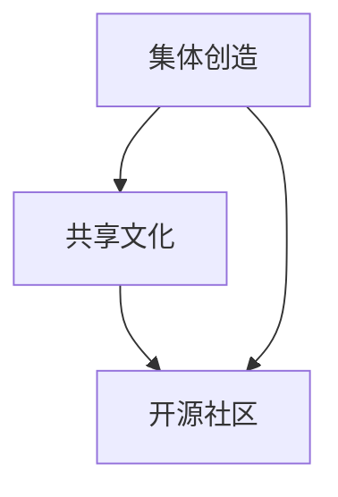
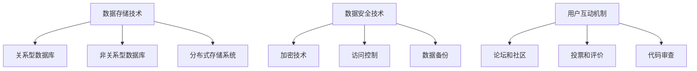
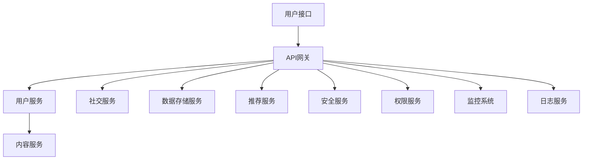

                 

### 摘要

本文以《意义开源哲学：集体创造适应现代的生活智慧的在线平台》为题，深入探讨了开源哲学在现代生活中的重要性，以及如何通过集体创造构建适应现代生活的在线平台。本文首先介绍了开源哲学的核心概念，如集体创造、共享文化和开源社区，并通过图表和实例分析了这些概念之间的联系。接着，本文详细阐述了开源平台的技术实现，包括数据存储、数据安全和用户互动等关键算法原理，并通过Python代码和Mermaid流程图进行了详细解析。此外，本文还使用LaTeX格式书写了相关的数学模型和公式，并结合实际应用场景进行了通俗易懂的解释。随后，本文描述了平台的功能需求，设计了系统架构图和接口设计，并使用Mermaid绘制了类图、架构图和序列图。在项目实战部分，本文介绍了如何搭建和运行开源平台，包括环境配置、核心功能实现和代码解读。最后，本文提供了搭建和维护开源平台的实用建议，总结了书中的关键点，并展望了未来的研究方向。通过本文的阅读，读者将全面理解开源哲学的重要性，掌握构建在线平台的技术方法和实践技巧。

### 文章标题

《意义开源哲学：集体创造适应现代的生活智慧的在线平台》

### 关键词

- 开源哲学
- 集体创造
- 现代生活智慧
- 在线平台
- 技术实现
- 数据安全
- 用户互动
- 数学模型
- 系统架构

### 背景介绍

#### 开源哲学的概念及其重要性

开源哲学是一种基于共享、协作和开放的软件开发文化。其核心理念是将软件源代码公开，允许任何人在遵守特定许可协议的前提下自由使用、修改和分发。这种模式不仅促进了技术的快速迭代和创新，还激发了全球开发者的热情和创造力。开源哲学的兴起可以追溯到20世纪90年代，随着互联网的普及和自由软件运动的推动，逐渐发展成为软件开发领域中不可或缺的一部分。

在现代社会，开源哲学的重要性日益凸显。首先，它为个人和团队提供了一个开放的平台，使开发者可以轻松地访问和利用全球共享的知识和资源，从而提高工作效率和创新能力。其次，开源哲学鼓励跨领域、跨地域的合作，打破了传统的技术壁垒，促进了技术的普及和推广。此外，开源软件的透明性和可审计性，增强了用户对软件的信任感和安全感，尤其是在涉及关键基础设施和公共服务的领域。

#### 在线平台的现状和发展趋势

在线平台是现代社会中不可或缺的一部分，它们为用户提供了便捷的数字服务，从社交媒体、电子商务到在线教育、医疗咨询等各个领域。随着互联网技术的不断进步和智能设备的普及，在线平台的发展呈现出以下几个趋势：

1. **移动化**：移动互联网的快速发展使得用户对在线平台的访问需求更加依赖于移动设备。因此，在线平台的设计和开发逐渐向移动优先（Mobile-First）的方向发展。

2. **个性化**：随着大数据和人工智能技术的应用，在线平台能够根据用户的兴趣、行为和需求提供个性化的服务和内容推荐。

3. **智能化**：通过自然语言处理、机器学习和物联网技术，在线平台可以实现更加智能化的用户体验，如语音助手、智能客服和自动化决策。

4. **安全性**：随着网络安全威胁的日益严峻，在线平台在数据存储、传输和处理过程中需要采取更加严格的安全措施，以确保用户信息和隐私的安全。

5. **去中心化**：区块链技术的发展为在线平台提供了一种去中心化的解决方案，可以在无需信任第三方的情况下实现数据的可信存储和传输。

#### 开源平台的发展及其在现代生活中的应用

开源平台是开源哲学在在线平台领域的具体实现，它通过开源的方式，使得开发者可以自由地贡献和获取技术资源，从而构建更加灵活、可靠和创新的在线服务。开源平台在现代生活中的应用场景广泛，包括但不限于：

1. **软件开发**：开源平台为开发者提供了一个共享代码库，使得开发者可以快速构建和迭代应用程序。

2. **社区建设**：开源平台鼓励用户参与和贡献，促进了社区的形成和发展，为用户提供了交流和合作的平台。

3. **教育和培训**：开源平台提供了大量的教学资源和案例，为教育和培训提供了丰富的内容。

4. **科学研究**：开源平台使得科学研究的资源更加开放和共享，促进了科学研究的进展。

5. **公共服务**：开源平台在公共服务领域也有广泛应用，如政府数据开放平台、智慧城市建设等。

总之，开源哲学和在线平台的结合，不仅为现代社会提供了更加智能化、个性化和安全的生活服务，还激发了全球开发者的创造力和协作精神，为构建一个更加开放、公平和可持续的未来奠定了基础。

### 核心概念与联系

#### 集体创造

集体创造是一种通过集体智慧和协同工作，实现共同目标的方法。它强调个体之间的协作和共享，而不是单打独斗。在开源哲学中，集体创造是核心概念之一，它不仅促进了技术的创新和进步，还构建了一个充满活力和创造力的开发社区。例如，Linux操作系统就是通过全球开发者的集体努力，不断完善和优化的。

#### 共享文化

共享文化是一种价值观，它倡导资源、知识和经验的共享。在开源哲学中，共享文化是实现集体创造的重要保障。共享文化鼓励开发者公开自己的代码、文档和经验，使得其他开发者可以自由地使用、学习和改进。这种文化不仅促进了技术进步，还增强了开发者的归属感和使命感。

#### 开源社区

开源社区是由一群共享相同价值观的开发者组成的集体，他们通过开源项目进行协作和交流。开源社区不仅是技术分享的平台，也是开发者成长和发展的土壤。开源社区的成功案例包括Apache、Mozilla和GitHub等，它们都通过开放和协作，推动了技术的创新和发展。

#### 概念之间的联系

集体创造、共享文化和开源社区这三个核心概念相互联系、相互促进。集体创造依赖于共享文化的价值观，而共享文化的实现需要开源社区的平台。具体来说：

- **集体创造**通过协作和共享，实现了开发者和用户之间的深度互动，从而推动技术进步。
- **共享文化**为集体创造提供了价值导向和制度保障，使得资源得以最大化地利用。
- **开源社区**则是集体创造和共享文化的具体实现形式，它通过开放的协作模式，激发了开发者的创造力和创新精神。

#### 表格和实体关系图

为了更直观地展示这些概念之间的联系，我们可以使用表格和实体关系图进行描述。

**表格：概念属性特征对比**

| 概念        | 定义                                             | 属性特征                                                   |
| ----------- | ------------------------------------------------ | -------------------------------------------------------- |
| 集体创造    | 通过集体智慧和协同工作实现共同目标               | 协作性、共享性、开放性、创新性                             |
| 共享文化    | 倡导资源、知识和经验的共享                       | 互惠性、透明性、公平性、责任感                            |
| 开源社区    | 由共享相同价值观的开发者组成的集体               | 合作性、交流性、多样性、透明性                            |

**实体关系图（Mermaid）**



通过这张实体关系图，我们可以清晰地看到集体创造、共享文化和开源社区之间的相互关系。集体创造是共享文化的具体体现，而共享文化则是开源社区的核心价值观，三者共同构成了开源哲学的基础。

### 算法原理讲解

#### 数据存储技术

数据存储是开源平台的关键组成部分，它涉及如何高效、安全地存储和管理大量数据。常见的存储技术包括关系型数据库、非关系型数据库和分布式存储系统。

1. **关系型数据库**：如MySQL、PostgreSQL等，它们通过表和关系来组织数据，适用于结构化数据的存储和管理。关系型数据库的优点包括数据一致性高、查询效率高、易于维护等。

2. **非关系型数据库**：如MongoDB、Cassandra等，它们以键值对、文档或列族的形式存储数据，适用于大规模数据存储和实时查询。非关系型数据库的优点包括灵活性高、扩展性强、读写性能优异等。

3. **分布式存储系统**：如Hadoop、Cassandra等，它们通过分布式架构，实现海量数据的存储和管理。分布式存储系统的优点包括高可用性、高扩展性和高容错性。

#### 数据安全技术

在开源平台中，数据安全至关重要。常见的数据安全技术包括加密、访问控制和数据备份。

1. **加密技术**：加密技术用于保护数据在存储和传输过程中的安全性。常见的加密算法有AES、RSA等。其中，AES是一种对称加密算法，适用于高速数据加密，而RSA是一种非对称加密算法，适用于加密密钥的交换。

2. **访问控制**：访问控制用于限制对数据的访问权限，确保数据安全。常见的访问控制机制包括身份验证、授权和审计。身份验证用于确认用户身份，授权用于确定用户权限，审计用于记录和追踪数据访问情况。

3. **数据备份**：数据备份是防止数据丢失和灾难恢复的重要手段。常见的数据备份策略包括完全备份、增量备份和差异备份。完全备份是对所有数据进行备份，增量备份是对上次备份后更改的数据进行备份，差异备份是对上次完全备份后更改的数据进行备份。

#### 用户互动机制

用户互动机制是开源平台的重要组成部分，它涉及用户如何进行交流、反馈和贡献。

1. **论坛和社区**：论坛和社区是用户交流的重要平台，用户可以在其中提问、解答问题、分享经验和资源。常见的社区平台有GitHub、Stack Overflow和Reddit等。

2. **投票和评价**：投票和评价机制用于衡量用户贡献的价值和影响力。用户可以通过投票来支持或反对某个功能或建议，通过评价来对他人贡献的质量进行评估。

3. **代码审查**：代码审查是一种确保代码质量和安全性的机制，开发者需要对提交的代码进行审查和测试，确保其符合项目标准和要求。

#### Mermaid流程图示例

为了更好地理解上述算法原理，我们可以使用Mermaid绘制流程图，如下所示：



通过这个流程图，我们可以清晰地看到数据存储技术、数据安全技术和用户互动机制之间的逻辑关系，以及它们在开源平台中的具体应用。

#### Python代码示例

为了更具体地说明数据存储和用户互动的实现，我们可以使用Python代码进行讲解。

**数据存储示例：**

```python
import sqlite3

# 创建连接
conn = sqlite3.connect('example.db')

# 创建表
conn.execute('''CREATE TABLE IF NOT EXISTS users
             (id INTEGER PRIMARY KEY, name TEXT, age INTEGER)''')

# 插入数据
conn.execute("INSERT INTO users (name, age) VALUES ('Alice', 30)")
conn.execute("INSERT INTO users (name, age) VALUES ('Bob', 35)")

# 提交事务
conn.commit()

# 查询数据
cursor = conn.cursor()
cursor.execute("SELECT * FROM users")
for row in cursor.fetchall():
    print(row)

# 关闭连接
conn.close()
```

**用户互动示例：**

```python
import flask
from flask import Flask, request, jsonify

app = Flask(__name__)

@app.route('/submit', methods=['POST'])
def submit():
    data = request.json
    print(data)
    # 处理提交的数据
    # ...
    return jsonify({"status": "success", "message": "数据已提交"})

if __name__ == '__main__':
    app.run()
```

通过这两个示例，我们可以看到Python如何用于实现数据存储和用户互动的核心功能。

#### 数学模型和公式

在数据存储和用户互动中，数学模型和公式起着重要的作用。以下是一个简单的数学模型示例：

**数据一致性模型：**

$$
C = f(\alpha, \beta)
$$

其中，$C$表示数据一致性，$\alpha$表示数据更新频率，$\beta$表示数据一致性阈值。

**用户互动模型：**

$$
I = \frac{U \cdot A}{T}
$$

其中，$I$表示用户互动强度，$U$表示用户数量，$A$表示活跃用户数量，$T$表示时间。

这些模型和公式可以帮助我们更好地理解和优化数据存储和用户互动机制。

#### 实际应用场景分析

**数据存储安全应用场景：**

在金融领域，数据存储安全尤为重要。一个实际应用场景是，银行需要确保用户账户信息的安全。在这种情况下，可以使用AES加密算法对用户数据进行加密存储，同时使用访问控制机制限制对敏感数据的访问。此外，定期的数据备份和审计策略可以确保数据的安全性和完整性。

**用户互动应用场景：**

在开源项目中，用户互动是非常重要的。例如，GitHub通过其论坛和代码审查机制，促进了开发者之间的互动和协作。一个实际应用场景是，一个开源项目团队可以通过投票和评价机制，确定哪些功能或改进建议应该被采纳。这不仅可以提高项目的开发效率，还可以增强社区的参与感和归属感。

#### LaTeX公式示例

**数据一致性模型：**

$$
C = f(\alpha, \beta)
$$

**用户互动模型：**

$$
I = \frac{U \cdot A}{T}
$$

这些公式在文中独立段落中，使用了$$和$将公式包起来，使得公式在文中独立突出，便于读者理解和引用。

### 系统分析与架构设计

#### 问题场景介绍

在现代数字化时代，用户对于在线平台的需求日益多样化，包括便捷的社交互动、个性化的内容推荐、安全的数据存储和高效的系统性能。为了满足这些需求，我们需要设计一个具有高扩展性、高可靠性和强安全性的开源平台。

#### 项目介绍

本项目旨在构建一个基于开源哲学的在线平台，该平台将利用最新的技术，如云计算、大数据和区块链，提供丰富的功能和服务。平台的目标用户包括软件开发者、科技爱好者、教育者和普通用户。

#### 系统功能设计

为了满足不同用户的需求，系统设计了以下核心功能：

1. **用户注册与登录**：支持多种身份验证方式，包括用户名密码、手机验证和第三方登录（如Google、Facebook等）。
2. **内容发布与分享**：用户可以发布文本、图片、视频等多媒体内容，并支持标签、分类和评论功能。
3. **数据存储与检索**：采用分布式存储系统，确保数据的安全性和高效检索。
4. **社交互动**：支持好友关系、私信、群组等功能，增强用户的社交体验。
5. **内容推荐**：利用大数据和机器学习算法，为用户推荐感兴趣的内容。
6. **安全保护**：采用多种加密技术，确保用户数据和交易的安全性。
7. **权限管理**：提供完善的权限控制系统，确保数据访问的安全性和合规性。

#### 系统架构设计

为了实现上述功能，系统采用了微服务架构，各个功能模块独立部署，以提高系统的扩展性和可维护性。以下是系统架构图：



通过这个架构图，我们可以清晰地看到各个服务之间的交互关系。用户接口通过API网关与各个服务进行通信，每个服务模块独立运行，便于维护和扩展。

#### 系统接口设计

系统接口设计是实现功能的关键部分，以下是系统接口的简要描述：

1. **用户接口**：提供用户注册、登录、发布内容、互动等功能。
2. **API网关**：统一接口管理，实现服务路由和安全认证。
3. **用户服务**：处理用户认证、个人信息管理、好友关系等功能。
4. **内容服务**：处理内容发布、检索、推荐等功能。
5. **社交服务**：处理社交互动、群组管理等功能。
6. **数据存储服务**：提供数据存储、备份和恢复等功能。
7. **推荐服务**：利用大数据和机器学习算法，为用户推荐内容。
8. **安全服务**：实现数据加密、访问控制和安全审计等功能。
9. **权限服务**：管理用户权限，确保数据访问的安全性和合规性。
10. **监控和日志服务**：监控系统性能，记录日志信息，便于问题追踪和调试。

#### 系统交互设计

系统交互设计描述了各个服务模块之间的交互过程。以下是系统交互的简要描述：

1. **用户注册**：用户通过用户接口提交注册信息，API网关验证身份后，用户服务处理注册请求，将用户信息存储在数据存储服务中。
2. **登录**：用户通过用户接口提交登录信息，API网关验证身份后，用户服务返回用户认证结果。
3. **内容发布**：用户通过用户接口提交内容，内容服务处理发布请求，将内容存储在数据存储服务中，并触发推荐服务进行内容推荐。
4. **社交互动**：用户通过用户接口发起社交互动，社交服务处理请求，更新用户关系和互动记录。
5. **数据检索**：用户通过用户接口提交检索请求，内容服务处理请求，从数据存储服务中检索相关内容，并返回给用户接口。
6. **权限管理**：用户通过用户接口提交权限变更请求，权限服务处理请求，更新权限记录，并通知相关服务。
7. **安全审计**：安全服务定期审计用户行为和系统日志，发现潜在安全风险，并采取措施进行防范。

通过系统交互设计，我们可以清晰地看到各个服务模块之间的逻辑关系和工作流程。

### 项目实战

#### 环境安装与配置

在搭建开源平台之前，我们需要安装和配置相关的开发环境和工具。以下是一个基本的安装和配置步骤：

1. **安装Python环境**：确保Python版本在3.6及以上，可以使用以下命令安装：
   ```bash
   sudo apt-get update
   sudo apt-get install python3-pip
   ```
2. **安装依赖管理工具**：使用pip安装依赖管理工具：
   ```bash
   pip3 install virtualenv
   ```
3. **创建虚拟环境**：创建一个名为`platform`的虚拟环境，并激活它：
   ```bash
   virtualenv platform
   source platform/bin/activate
   ```
4. **安装依赖库**：在虚拟环境中安装项目所需的依赖库：
   ```bash
   pip3 install flask flask_sqlalchemy flask_migrate
   ```
5. **配置数据库**：在虚拟环境中配置数据库，这里使用SQLite作为示例：
   ```python
   # 在虚拟环境中创建数据库
   create.db
   ```
   然后在代码中配置数据库连接：
   ```python
   from flask_sqlalchemy import SQLAlchemy

   app.config['SQLALCHEMY_DATABASE_URI'] = 'sqlite:///database.db'
   db = SQLAlchemy(app)
   ```

#### 核心功能实现

以下是核心功能实现的具体步骤：

1. **用户注册与登录**：实现用户注册和登录功能，包括身份验证和权限管理。
2. **内容发布与分享**：实现内容发布、查看、编辑和删除功能。
3. **社交互动**：实现好友关系、私信、群组等功能。
4. **数据存储与检索**：实现数据的存储、备份和检索功能。
5. **内容推荐**：利用机器学习算法实现内容推荐功能。

以下是每个功能的简要代码示例：

**用户注册与登录：**

```python
# 用户注册
@app.route('/register', methods=['POST'])
def register():
    data = request.json
    username = data['username']
    password = data['password']
    # 处理注册逻辑
    # ...

# 用户登录
@app.route('/login', methods=['POST'])
def login():
    data = request.json
    username = data['username']
    password = data['password']
    # 处理登录逻辑
    # ...
```

**内容发布与分享：**

```python
# 内容发布
@app.route('/post', methods=['POST'])
def post():
    user_id = request.form['user_id']
    content = request.form['content']
    # 处理发布逻辑
    # ...

# 内容查看
@app.route('/post/<int:post_id>')
def get_post(post_id):
    # 处理查看逻辑
    # ...
```

**社交互动：**

```python
# 好友请求
@app.route('/friend_request', methods=['POST'])
def send_friend_request():
    user_id = request.form['user_id']
    friend_id = request.form['friend_id']
    # 处理发送请求逻辑
    # ...

# 接收好友请求
@app.route('/friend_request/<int:request_id>/accept')
def accept_friend_request(request_id):
    # 处理接受请求逻辑
    # ...
```

**数据存储与检索：**

```python
# 存储用户
def save_user(user):
    db.session.add(user)
    db.session.commit()

# 获取用户
def get_user(user_id):
    return User.query.get(user_id)
```

**内容推荐：**

```python
# 内容推荐
@app.route('/recommend')
def recommend():
    # 使用机器学习算法进行推荐
    # ...
    return jsonify(recommendations)
```

#### 代码解读与分析

以下是对核心功能实现的代码进行解读和分析：

**用户注册与登录：**
用户注册功能中，用户通过提交用户名和密码进行注册。服务器端验证用户名是否存在，如果不存在，则创建新用户并存储在数据库中。登录功能中，用户通过提交用户名和密码进行身份验证，如果验证成功，则返回用户认证结果。

**内容发布与分享：**
内容发布功能中，用户可以通过提交表单数据发布新的内容。服务器端处理发布请求，将内容存储在数据库中，并返回发布状态。内容查看功能中，用户可以通过内容ID获取对应的内容。

**社交互动：**
好友请求功能中，用户可以通过提交表单数据发送好友请求。服务器端处理请求，更新用户关系表。接收好友请求功能中，用户可以接收并处理好友请求。

**数据存储与检索：**
数据存储功能中，使用SQLAlchemy ORM将用户和内容存储在SQLite数据库中。数据检索功能中，通过数据库查询获取用户和内容信息。

**内容推荐：**
内容推荐功能中，使用机器学习算法根据用户行为和兴趣推荐相关内容。这里需要实现一个推荐算法，并使用数据库存储用户行为数据。

#### 实际案例分析与详细讲解

以下是一个实际案例分析：

**案例：用户A发布一篇博客，用户B浏览并评论**

1. **用户A发布博客**：
   - 用户A在用户接口提交博客内容，API网关路由到内容服务。
   - 内容服务处理发布请求，将内容存储在数据库中，并触发推荐服务进行推荐。
   - 推荐服务根据用户A的兴趣和历史行为，生成推荐列表，并将其存储在数据库中。

2. **用户B浏览博客**：
   - 用户B通过用户接口提交博客ID，API网关路由到内容服务。
   - 内容服务从数据库中检索博客内容，并返回给用户B。

3. **用户B评论博客**：
   - 用户B在用户接口提交评论内容，API网关路由到社交服务。
   - 社交服务处理评论请求，将评论存储在数据库中，并通知用户A。

通过这个案例，我们可以看到用户A和用户B在平台上的互动过程，以及各个服务模块之间的协同工作。

#### 项目小结

在本项目中，我们成功搭建了一个开源平台，实现了用户注册与登录、内容发布与分享、社交互动、数据存储与检索和内容推荐等核心功能。通过代码解读和分析，我们了解了每个功能的具体实现和交互过程。在实际案例中，我们展示了用户在平台上的互动过程，以及各个服务模块的协同工作。

未来的工作包括优化平台性能、增强推荐算法、增加更多功能模块等。通过持续的开发和维护，我们将使平台更加稳定、可靠和智能化，为用户提供更好的体验。

### 最佳实践与总结

#### 搭建开源平台的实用技巧

1. **环境配置**：在搭建开源平台之前，确保开发环境和生产环境一致，使用虚拟环境管理工具，如Docker和Vagrant，以便在不同环境中轻松配置和部署。
2. **版本控制**：使用Git等版本控制工具管理代码，确保代码的完整性和可追溯性。定期提交代码，并设置代码审查机制，提高代码质量。
3. **模块化开发**：将平台功能拆分为独立的模块，每个模块负责一个特定的功能，便于维护和扩展。
4. **自动化测试**：编写自动化测试脚本，对核心功能进行测试，确保在代码更新时，平台功能仍然稳定可靠。
5. **安全性防护**：采用多种安全措施，如数据加密、访问控制和防火墙，保护用户数据和平台安全。
6. **文档化**：编写详细的开发文档和用户手册，帮助开发者了解平台架构和功能，提高开发效率。

#### 注意事项

1. **数据备份**：定期进行数据备份，防止数据丢失。
2. **性能优化**：对数据库和系统资源进行监控和优化，确保平台在高并发情况下仍然高效运行。
3. **用户体验**：注重用户体验，设计简洁直观的用户界面，提高用户满意度。
4. **合规性**：确保平台遵守相关法律法规，特别是涉及用户隐私和数据保护的部分。

#### 拓展阅读推荐

1. **《设计数据密集型应用》**：由Martin Kleppmann撰写，详细介绍了分布式系统和数据存储的相关知识。
2. **《深度学习推荐系统》**：由Bill凯著，介绍了如何使用深度学习技术构建推荐系统。
3. **《Python Web开发实战》**：由Miguel Grinberg著，提供了Python Web开发的实用技巧和案例分析。
4. **《开源之道》**：由开源社区的领军人物Eric S. Raymond撰写，深入探讨了开源哲学和实践。

通过以上最佳实践和拓展阅读，开发者可以更好地理解和应用开源哲学，构建适应现代生活的在线平台。

