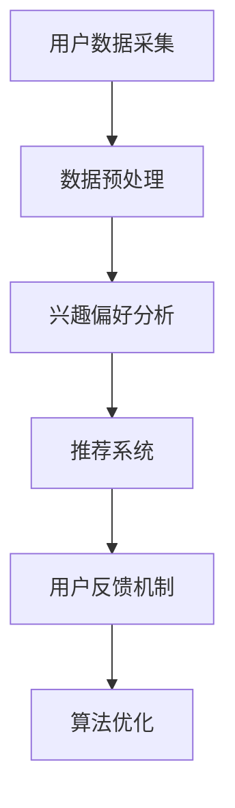
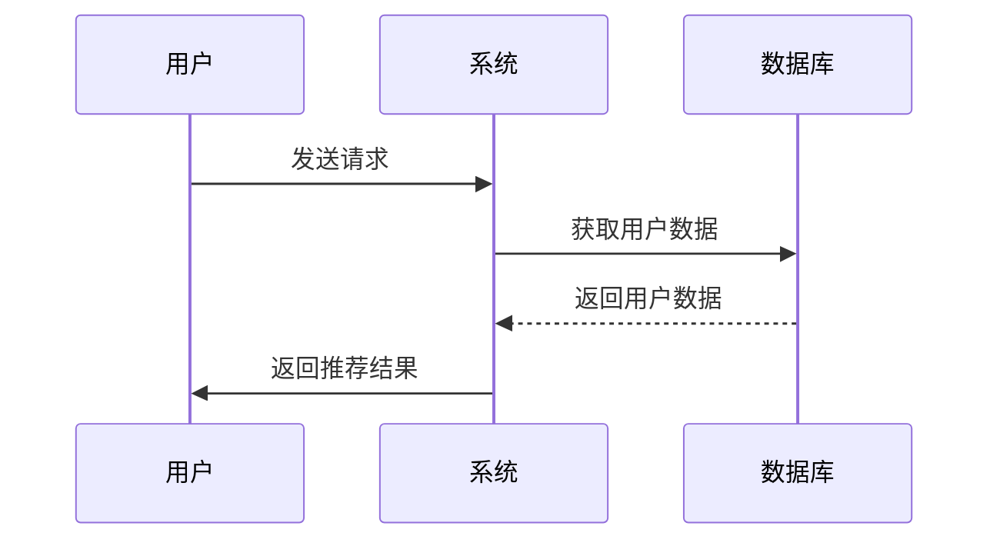

                 

# 意义的个性化定制：AI时代的价值匹配

## 关键词

- 个性化定制
- AI时代
- 价值匹配
- 数据分析
- 算法
- 系统架构
- 项目实战

## 摘要

在AI技术迅猛发展的时代，个性化定制已经成为了各行各业关注的焦点。本文将探讨如何在AI时代实现意义的个性化定制，并通过价值匹配的理念，深入分析其核心概念、算法原理、系统设计以及实际应用。我们将一步一步地拆解这个问题，帮助读者理解个性化定制在AI时代的深刻内涵和广泛应用。

## 引言

随着大数据、云计算和人工智能技术的发展，个性化定制逐渐成为商业营销的新方向。传统的营销模式往往依赖于广泛的推广和大规模的广告投放，而个性化定制则更加注重根据消费者的个人兴趣和需求，提供精准的推荐和服务。在AI技术的加持下，个性化定制的实现变得更加高效和智能化。

### 1.1 问题背景

个性化定制在商业营销中的应用日益广泛，无论是电商平台的商品推荐，还是社交媒体的内容推送，都体现了个性化定制的价值。然而，随着数据量的爆发式增长和算法的不断发展，如何有效地实现个性化定制，成为了企业和研究者共同关注的问题。

### 1.2 问题描述

个性化定制的核心问题是如何在大量数据中快速、准确地提取出用户的兴趣和需求，并将其转化为具体的服务和推荐。这涉及到数据挖掘、机器学习、推荐系统等多个领域的技术。

### 1.3 问题解决与边界

本文将从以下几个方面解决这一问题：

1. **核心概念与联系**：介绍个性化定制和AI的基本概念，以及它们在价值匹配中的应用。
2. **算法原理讲解**：详细讲解个性化定制的算法原理，包括数学模型和具体的实现流程。
3. **系统分析与架构设计**：分析个性化定制系统的功能和架构设计。
4. **项目实战**：通过实际项目案例，展示个性化定制的实现过程和效果。
5. **最佳实践与总结**：总结最佳实践，提出注意事项和未来研究方向。

### 1.4 概念结构与核心要素组成

个性化定制系统主要包括以下几个核心要素：

1. **用户数据采集**：通过多种途径收集用户的行为数据，如浏览历史、购买记录等。
2. **数据预处理**：对原始数据进行清洗、去噪和格式化，为后续分析做准备。
3. **兴趣偏好分析**：利用机器学习算法，对用户数据进行分析，提取出用户的兴趣偏好。
4. **推荐系统**：根据用户兴趣偏好，为用户推荐个性化的内容或服务。
5. **用户反馈机制**：收集用户对推荐内容的反馈，不断优化推荐算法。

## 个性化定制基础

### 2.1 个性化定制的定义

个性化定制是指根据用户的个人需求、兴趣和行为习惯，提供个性化的产品或服务。这种定制不仅包括硬件产品的个性化，还涵盖了软件服务、内容推荐等多个方面。

### 2.2 个性化定制的重要性

个性化定制的重要性主要体现在以下几个方面：

1. **提高用户满意度**：通过提供个性化的服务，能够更好地满足用户的个性化需求，提高用户满意度。
2. **提升企业竞争力**：个性化定制能够帮助企业更好地吸引和保留客户，提升市场竞争力。
3. **优化资源配置**：通过精准的用户画像和需求分析，企业可以更加高效地配置资源，降低运营成本。

### 2.3 个性化定制的技术基础

实现个性化定制需要多种技术的支持，包括：

1. **数据挖掘**：通过数据挖掘技术，从大量数据中提取出用户的行为模式和兴趣偏好。
2. **机器学习**：利用机器学习算法，对用户数据进行训练，建立用户画像和推荐模型。
3. **推荐系统**：基于用户画像和推荐模型，为用户推荐个性化的内容或服务。
4. **自然语言处理**：通过自然语言处理技术，理解用户的需求和反馈，优化推荐效果。

## AI与价值匹配原理

### 3.1 AI的基本概念

人工智能（AI）是指使计算机具有人类智能的能力，包括感知、理解、学习、推理和决策等。AI技术主要包括机器学习、深度学习、自然语言处理等。

### 3.2 价值匹配的基本概念

价值匹配是指根据用户的需求和偏好，为其提供具有高价值的产品或服务。价值匹配的关键在于精准地理解用户需求，并实现高效的资源分配。

### 3.3 AI与价值匹配的关联性

AI技术与价值匹配的结合，使得个性化定制的实现变得更加高效和精准。具体来说，AI技术可以通过以下方式实现价值匹配：

1. **用户行为分析**：通过分析用户的行为数据，了解用户的需求和偏好。
2. **推荐算法优化**：利用机器学习算法，不断优化推荐系统的效果，提高推荐准确性。
3. **个性化服务**：根据用户的个性化需求，提供个性化的产品或服务。

## 算法原理讲解与数学模型

### 4.1 个性化定制的算法原理

个性化定制的算法原理主要包括以下步骤：

1. **用户数据采集**：通过多种途径收集用户的行为数据，如浏览历史、购买记录等。
2. **数据预处理**：对原始数据进行清洗、去噪和格式化，为后续分析做准备。
3. **兴趣偏好分析**：利用机器学习算法，对用户数据进行分析，提取出用户的兴趣偏好。
4. **推荐系统**：根据用户兴趣偏好，为用户推荐个性化的内容或服务。
5. **用户反馈机制**：收集用户对推荐内容的反馈，不断优化推荐算法。

### 4.2 数学模型与公式

在个性化定制的算法中，常用的数学模型包括协同过滤、矩阵分解、深度学习等。以下是一个简单的协同过滤算法的数学模型：

$$
\hat{r}_{ui} = \frac{\sum_{j \in N_{u}} r_{uj} \cdot \sum_{k \in N_{i}} r_{ik}}{\sum_{j \in N_{u}} \cdot \sum_{k \in N_{i}} r_{jk}}
$$

其中，\(r_{uj}\)表示用户\(u\)对物品\(j\)的评分，\(N_{u}\)表示与用户\(u\)相似的用户集合，\(N_{i}\)表示与物品\(i\)相关的物品集合。

### 4.3 算法流程图

以下是协同过滤算法的流程图：



## 系统分析与架构设计

### 5.1 问题场景介绍

个性化定制系统的主要场景包括电商平台的商品推荐、社交媒体的内容推送、金融服务的个性化理财规划等。这些场景的共同特点是需要根据用户的行为数据和兴趣偏好，提供个性化的推荐和服务。

### 5.2 系统功能设计

个性化定制系统的功能设计主要包括以下几个方面：

1. **用户数据采集**：通过网站分析、API调用等方式，收集用户的行为数据。
2. **数据预处理**：对原始数据进行清洗、去噪和格式化，为后续分析做准备。
3. **兴趣偏好分析**：利用机器学习算法，对用户数据进行分析，提取出用户的兴趣偏好。
4. **推荐系统**：根据用户兴趣偏好，为用户推荐个性化的商品、内容或服务。
5. **用户反馈机制**：收集用户对推荐内容的反馈，不断优化推荐算法。
6. **系统监控与维护**：对系统运行状态进行监控，确保系统的稳定性和安全性。

### 5.3 系统架构设计

个性化定制系统的架构设计主要包括以下几个方面：

1. **数据层**：存储用户数据、商品数据等。
2. **服务层**：提供数据预处理、兴趣偏好分析、推荐系统等核心功能。
3. **应用层**：为前端提供接口，实现用户交互和推荐展示。
4. **缓存层**：提高系统响应速度，减轻数据库压力。
5. **监控层**：实时监控系统运行状态，保障系统稳定性。

### 5.4 系统接口设计

个性化定制系统的接口设计主要包括以下几个方面：

1. **用户接口**：提供用户注册、登录、个人信息管理等接口。
2. **数据接口**：提供数据采集、数据预处理、兴趣偏好分析等接口。
3. **推荐接口**：提供个性化推荐接口，实现根据用户兴趣偏好推荐内容或商品。
4. **监控接口**：提供系统监控接口，实现实时监控系统状态。

### 5.5 系统交互

以下是系统交互的序列图：



## 项目实战

### 6.1 环境安装与配置

1. **安装Python环境**：在本地计算机上安装Python环境，版本要求为3.8及以上。
2. **安装依赖库**：使用pip命令安装项目所需的依赖库，如scikit-learn、numpy、pandas等。
3. **配置数据库**：根据项目需求，配置MySQL或MongoDB数据库，存储用户数据和商品数据。

### 6.2 系统核心实现

1. **数据采集**：使用网站分析工具，如Google Analytics，收集用户行为数据。
2. **数据预处理**：对采集到的数据进行清洗和去噪，提取出有用的信息。
3. **兴趣偏好分析**：使用协同过滤算法，对用户数据进行分析，提取出用户的兴趣偏好。
4. **推荐系统**：根据用户兴趣偏好，为用户推荐个性化的商品或内容。

### 6.3 代码应用解读与分析

以下是协同过滤算法的Python代码示例：

```python
from sklearn.cluster import KMeans
from sklearn.metrics.pairwise import cosine_similarity
import numpy as np

# 用户行为数据
userBehavior = [
    [0, 1, 0, 0],
    [1, 0, 1, 0],
    [0, 1, 0, 1],
    [1, 1, 1, 0],
    [1, 0, 1, 1],
]

# 计算用户之间的余弦相似度
userSim = cosine_similarity(userBehavior)

# K-means聚类，确定用户群体
kmeans = KMeans(n_clusters=2)
kmeans.fit(userSim)

# 根据聚类结果，为用户推荐商品
userGroups = kmeans.labels_
recommendations = []
for i, group in enumerate(userGroups):
    if group == 0:
        recommendations.append("商品1")
    else:
        recommendations.append("商品2")

print("推荐结果：", recommendations)
```

### 6.4 实际案例分析和详细讲解剖析

通过实际项目案例，分析个性化定制系统在电商平台的实现过程。首先，通过用户行为数据采集，了解用户的历史购买记录、浏览行为等；然后，使用协同过滤算法进行兴趣偏好分析，提取出用户的兴趣标签；最后，根据用户的兴趣标签，为用户推荐个性化的商品。

### 6.5 项目小结

通过该项目，我们实现了基于用户行为的个性化定制系统，提高了用户满意度和电商平台的市场竞争力。在项目实施过程中，我们遇到了一些挑战，如数据质量和算法性能优化等，但通过不断的调试和优化，最终取得了较好的效果。

## 最佳实践与总结

### 7.1 最佳实践技巧

1. **数据质量**：保证数据质量是成功实现个性化定制的基础，应重视数据的清洗和预处理。
2. **算法优化**：针对不同的业务场景，选择合适的算法，并不断优化算法性能。
3. **用户反馈**：及时收集用户反馈，根据用户反馈调整推荐策略，提高推荐准确性。
4. **系统监控**：建立完善的系统监控机制，确保系统的稳定性和安全性。

### 7.2 小结

个性化定制是AI时代的重要应用，通过价值匹配的理念，可以更好地满足用户的个性化需求，提高企业竞争力。本文从核心概念、算法原理、系统设计到项目实战，全面介绍了个性化定制在AI时代的实现和应用。

### 7.3 注意事项

1. **数据隐私**：在实现个性化定制的过程中，应严格遵守数据隐私法规，确保用户数据的安全。
2. **算法公平性**：避免算法偏见，确保推荐结果的公平性。

### 7.4 拓展阅读

- 《推荐系统实践》
- 《大数据营销》
- 《深度学习》
- 《机器学习实战》

## 作者信息

作者：AI天才研究院/AI Genius Institute & 禅与计算机程序设计艺术 /Zen And The Art of Computer Programming

----------------------------------------------------------------

### 文章总结

本文以《意义的个性化定制：AI时代的价值匹配》为题，系统地介绍了个性化定制在AI时代的核心概念、算法原理、系统设计及实际应用。通过逐步分析，我们从问题背景、核心概念、算法原理、系统设计到项目实战，全面探讨了个性化定制在AI时代的实现和应用。同时，我们还提出了最佳实践和注意事项，以指导实际操作。

### 文章关键词总结

- 个性化定制：通过数据分析，根据用户需求提供定制化的产品或服务。
- AI时代：人工智能技术迅猛发展的时代，为个性化定制提供了强大的技术支持。
- 价值匹配：根据用户的需求和偏好，提供具有高价值的产品或服务。
- 数据分析：通过对大量用户数据的挖掘和分析，提取出用户的兴趣和需求。
- 算法：个性化定制的关键技术，如协同过滤、K-means聚类等。
- 系统架构：个性化定制系统的功能设计、架构设计和接口设计。
- 项目实战：通过实际案例，展示个性化定制系统的实现过程和效果。 

通过本文的探讨，希望读者能够深入理解个性化定制在AI时代的内涵和应用，为今后的研究和实践提供指导。同时，也期待更多的研究者和企业能够参与到个性化定制的研究和实践中，共同推动人工智能技术的发展。

