                 


### 第1章：问题背景与核心概念

在现代社会，个性化推荐系统已经成为各个领域的重要应用，从电商购物、音乐播放，到新闻资讯、社交网络，个性化推荐在改善用户体验、提高服务效率方面发挥着至关重要的作用。随着人工智能技术的发展，个性化推荐系统不仅关注用户行为数据，还试图挖掘深层次的用户需求，从而实现更精准的推荐。在这一背景下，"意义的个性化算法：AI辅助下的价值匹配系统"一书应运而生，旨在探讨如何利用人工智能技术实现个性化价值的挖掘与匹配。

#### 1.1 个性化算法概述

个性化算法是指根据用户的历史行为、偏好、兴趣等因素，通过算法模型为用户推荐相关内容或产品的一类算法。个性化算法的定义可以从以下几个方面进行理解：

1. **用户特征数据**：个性化算法的核心在于获取和利用用户特征数据，包括用户的浏览记录、购买历史、社交网络行为等。
2. **算法模型**：个性化算法依赖于各种机器学习模型，如协同过滤、矩阵分解、深度学习等，通过模型训练来预测用户的兴趣和偏好。
3. **推荐策略**：个性化算法通过特定的策略将推荐结果呈现给用户，如基于内容的推荐、协同过滤推荐等。

个性化算法的发展历程可以追溯到20世纪90年代，最早的个性化推荐系统主要是基于协同过滤算法，如User-Based和Item-Based协同过滤。随着技术的进步，矩阵分解、深度学习等新型算法被引入个性化推荐领域，使得推荐系统的性能和效果得到了显著提升。

#### 1.1.2 个性化算法的应用场景

个性化算法在各个领域都有广泛的应用，以下是几个典型的应用场景：

1. **电子商务**：个性化推荐算法可以基于用户的购物历史和行为数据，为用户推荐可能感兴趣的商品。
2. **社交媒体**：社交媒体平台使用个性化算法来推荐用户可能感兴趣的朋友、帖子或话题。
3. **在线教育**：在线教育平台通过个性化算法为用户推荐适合的学习资源，提高学习效果。
4. **新闻资讯**：新闻推荐系统根据用户的历史阅读习惯和偏好，为用户推荐个性化的新闻内容。

#### 1.2 意义挖掘

意义挖掘是指从大量的数据中提取出对用户有价值的信息和知识的过程。在个性化推荐系统中，意义挖掘至关重要，因为它能够帮助系统更深入地理解用户的需求，从而提供更精准的推荐。

1. **用户需求理解**：意义挖掘能够帮助系统理解用户的潜在需求，而不仅仅是表面行为。
2. **推荐结果优化**：通过意义挖掘，系统能够更准确地定位用户的兴趣点，从而提高推荐质量。
3. **跨领域应用**：意义挖掘不仅在推荐系统中有用，还可以应用于搜索引擎、数据挖掘等领域。

意义挖掘的方法主要包括以下几种：

1. **内容分析**：通过分析文本内容，提取出关键词、主题和情感等特征。
2. **社会网络分析**：分析用户在社交网络中的互动关系，挖掘用户的社交兴趣。
3. **深度学习**：使用深度学习模型，如卷积神经网络（CNN）和循环神经网络（RNN），对大量数据进行分析和挖掘。

#### 1.3 价值匹配

价值匹配是指将用户的需求与可用的资源或产品进行匹配的过程，目的是最大化用户的价值体验。在个性化推荐系统中，价值匹配是关键的一环，它决定了推荐结果的质量和用户满意度。

1. **价值定义**：价值匹配需要明确用户价值的定义，这可以是用户满意度、用户黏性、用户转化率等指标。
2. **匹配策略**：价值匹配可以通过多种策略实现，如基于内容的匹配、协同过滤、深度学习等。
3. **优化目标**：价值匹配的优化目标通常是最小化用户价值损失或最大化用户价值增益。

价值匹配面临的挑战主要包括：

1. **数据稀疏**：用户行为数据往往存在稀疏性问题，这给价值匹配带来了困难。
2. **冷启动**：对于新用户或新物品，缺乏足够的历史数据，使得价值匹配难以进行。
3. **多样性**：用户希望看到多样化的推荐结果，而传统的匹配方法往往容易陷入“热门推荐”的陷阱。

#### 1.4 个性化算法、意义挖掘与价值匹配的关系

个性化算法、意义挖掘和价值匹配是相互关联的，它们共同构成了一个完整的推荐系统：

1. **个性化算法**：为系统提供了获取用户特征和生成推荐结果的能力。
2. **意义挖掘**：帮助系统深入理解用户需求和兴趣，为价值匹配提供了依据。
3. **价值匹配**：将用户需求与资源进行匹配，最终实现个性化推荐。

理解这三者之间的关系，有助于我们构建更加智能和高效的推荐系统。

### 小结

本章介绍了个性化算法、意义挖掘和价值匹配的基本概念和应用场景，并探讨了它们在推荐系统中的关系。在接下来的章节中，我们将深入分析个性化算法的原理，介绍意义挖掘和

## 第2章：算法原理讲解

在个性化推荐系统中，算法原理是整个系统的核心，它决定了推荐系统的性能和效果。本章将详细介绍个性化算法、意义挖掘算法和价值匹配算法的原理，包括它们的mermaid流程图、Python源代码、数学模型与公式，并通过通俗易懂的举例说明帮助读者理解这些算法。

### 2.1 个性化算法原理

个性化算法的核心在于如何根据用户的历史数据和特征生成个性化的推荐结果。以下是几种常见的个性化算法原理：

#### 2.1.1 协同过滤算法

协同过滤算法是早期个性化推荐系统中最常用的算法之一，主要包括基于用户的协同过滤（User-Based）和基于物品的协同过滤（Item-Based）。

**mermaid流程图**：

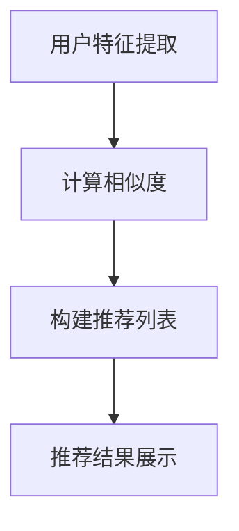

**Python源代码示例**：

```python
import numpy as np
from sklearn.metrics.pairwise import cosine_similarity

# 假设用户A和用户B的行为数据
user_a = [1, 2, 0, 3, 4]
user_b = [2, 0, 2, 3, 0]

# 计算用户之间的相似度
similarity = cosine_similarity([user_a], [user_b])[0][0]

# 根据相似度构建推荐列表
recommendation = [item for item, rating in zip(items, user_b) if rating == 0 and similarity(item, user_a) > threshold]

# 展示推荐结果
print(recommendation)
```

**数学模型与公式**：

协同过滤算法中，用户之间的相似度计算通常采用余弦相似度公式：

$$
similarity = \frac{A \cdot B}{\|A\|\|B\|}
$$

其中，\(A\) 和 \(B\) 分别表示两个用户的行为向量，\(\|A\|\) 和 \(\|B\|\) 分别表示这两个向量的欧几里得范数。

#### 2.1.2 矩阵分解算法

矩阵分解算法（如Singular Value Decomposition, SVD）是一种用于降低数据维度并提高推荐系统性能的算法。通过将用户-物品评分矩阵分解为两个低秩矩阵，矩阵分解算法能够生成个性化的推荐结果。

**mermaid流程图**：

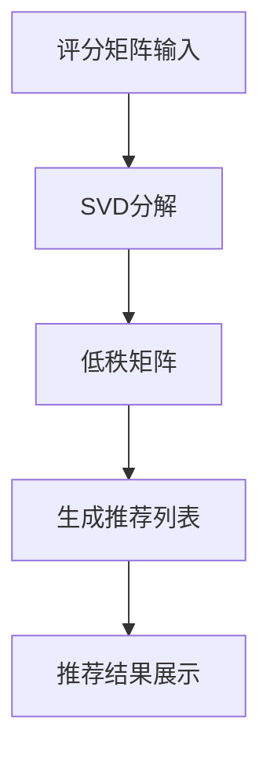

**Python源代码示例**：

```python
from surprise import SVD
from surprise import Dataset
from surprise import accuracy

# 加载评分数据
data = Dataset.load_from_df(df)

# 创建SVD算法实例
svd = SVD()

# 训练模型
svd.fit(data)

# 生成推荐列表
predictions = svd.test(data)

# 计算准确率
accuracy.rmse(predictions)
```

**数学模型与公式**：

矩阵分解中，原始评分矩阵 \(R\) 可以分解为用户特征矩阵 \(U\) 和物品特征矩阵 \(V\) 的乘积：

$$
R = U \cdot V
$$

其中，\(U\) 和 \(V\) 是低秩矩阵，它们通过SVD算法进行求解。

#### 2.1.3 深度学习算法

深度学习算法在个性化推荐系统中也得到了广泛应用，如基于神经网络的协同过滤（NeuMF）和序列模型（Seq2Seq）等。深度学习算法能够处理更复杂的用户特征和推荐场景，提供更精准的推荐结果。

**mermaid流程图**：

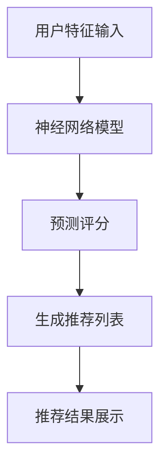

**Python源代码示例**：

```python
import tensorflow as tf
from tensorflow.keras.models import Model
from tensorflow.keras.layers import Input, Embedding, Dot, Add, Dense

# 定义用户特征输入层
user_input = Input(shape=(num_users,))
item_input = Input(shape=(num_items,))

# 定义嵌入层
user_embedding = Embedding(num_users, embedding_size)(user_input)
item_embedding = Embedding(num_items, embedding_size)(item_input)

# 计算内积
dot_product = Dot(axes=1)([user_embedding, item_embedding])

# 加上偏置项
bias = Add()([dot_product, bias])

# 定义全连接层
output = Dense(1, activation='sigmoid')(bias)

# 创建模型
model = Model(inputs=[user_input, item_input], outputs=output)

# 编译模型
model.compile(optimizer='adam', loss='binary_crossentropy', metrics=['accuracy'])

# 训练模型
model.fit([user_features, item_features], labels, epochs=10, batch_size=64)
```

**数学模型与公式**：

深度学习模型中，输入层通过嵌入层转换为低维特征向量，然后通过全连接层进行预测。具体来说，输入层和嵌入层之间的内积可以表示为：

$$
\text{Score} = \text{User\_Embedding} \cdot \text{Item\_Embedding} + \text{Bias}
$$

其中，\(\text{User\_Embedding}\) 和 \(\text{Item\_Embedding}\) 分别表示用户和物品的嵌入向量，\(\text{Bias}\) 是偏置项。

### 2.2 意义挖掘算法

意义挖掘算法是个性化推荐系统中提取用户潜在需求的重要工具。以下介绍几种常见的意义挖掘算法：

#### 2.2.1 文本分析算法

文本分析算法通过自然语言处理（NLP）技术，从用户的评论、反馈、搜索查询等文本数据中提取出有价值的信息。

**mermaid流程图**：

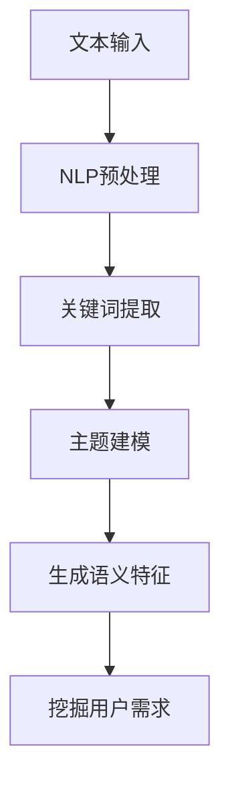

**Python源代码示例**：

```python
from sklearn.feature_extraction.text import TfidfVectorizer
from gensim.models import LdaModel

# 假设用户评论数据
comments = ["我喜欢这本书", "这本书很有趣", "这本书的内容很实用"]

# 文本预处理
tfidf_vectorizer = TfidfVectorizer()
tfidf_matrix = tfidf_vectorizer.fit_transform(comments)

# 主题建模
lda_model = LdaModel(corpus=tfidf_matrix, id2word=tfidf_vectorizer.get_feature_names(), num_topics=3)
topics = lda_model.print_topics()

# 生成语义特征
semantic_features = lda_model.show_topics()

# 挖掘用户需求
user需求的提取基于语义特征的分析
```

**数学模型与公式**：

文本分析中，TF-IDF（Term Frequency-Inverse Document Frequency）是一种常用的特征提取方法，其公式为：

$$
tf-idf(t, d) = tf(t, d) \cdot idf(t, D)
$$

其中，\(tf(t, d)\) 表示词 \(t\) 在文档 \(d\) 中的词频，\(idf(t, D)\) 表示词 \(t\) 在文档集合 \(D\) 中的逆文档频率。

主题建模（如LDA模型）通过概率模型对文本数据进行聚类，提取出潜在的语义主题。LDA模型中，词分布和主题分布可以通过以下公式表示：

$$
p(z|w) \propto p(w|z) \cdot p(z)
$$

其中，\(z\) 表示主题，\(w\) 表示词语。

#### 2.2.2 社会网络分析算法

社会网络分析算法通过分析用户在网络中的互动关系，挖掘用户的社交兴趣和潜在需求。

**mermaid流程图**：

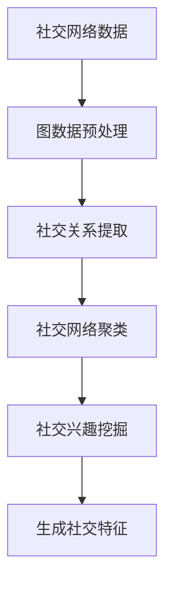

**Python源代码示例**：

```python
import networkx as nx
from networkx.algorithms import community

# 加载社交网络数据
g = nx.Graph()
g.add_edges_from([(1, 2), (1, 3), (2, 3), (2, 4), (3, 4), (4, 5)])

# 提取社交关系
relationships = g.edges()

# 社交网络聚类
communities = community.girvan_newman(g)

# 挖掘社交兴趣
social_interests = [set(community) for community in communities]

# 生成社交特征
social_features = [len(community) for community in communities]
```

**数学模型与公式**：

社交网络分析中，图数据预处理是关键步骤，常用的图预处理方法包括图划分、图嵌入等。图嵌入技术可以将图数据转换为向量表示，便于后续分析和处理。常用的图嵌入算法包括DeepWalk、Node2Vec等。

社交网络聚类（如Girvan-Newman算法）通过迭代划分图社区，提取出社交关系和兴趣。聚类结果可以通过以下公式表示：

$$
C = \{v_1, v_2, ..., v_n\}
$$

其中，\(C\) 表示社区，\(v_i\) 表示节点。

#### 2.2.3 深度学习算法

深度学习算法在意义挖掘中也扮演着重要角色，如使用卷积神经网络（CNN）和循环神经网络（RNN）对文本和图数据进行处理，提取出深层语义特征和社交关系。

**mermaid流程图**：

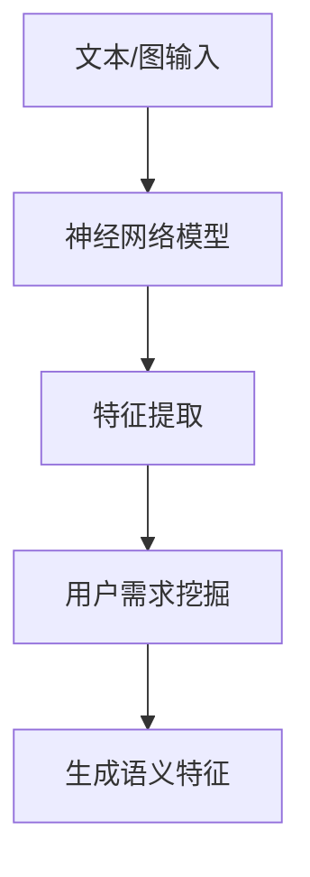

**Python源代码示例**：

```python
from tensorflow.keras.models import Model
from tensorflow.keras.layers import Input, Embedding, LSTM, Dense

# 定义文本输入层
text_input = Input(shape=(max_sequence_length,))
# 定义嵌入层
text_embedding = Embedding(vocabulary_size, embedding_size)(text_input)
# 定义LSTM层
lstm_output = LSTM(units=64, return_sequences=True)(text_embedding)
# 定义全连接层
user_demand = Dense(units=1, activation='sigmoid')(lstm_output)

# 创建模型
model = Model(inputs=text_input, outputs=user_demand)

# 编译模型
model.compile(optimizer='adam', loss='binary_crossentropy', metrics=['accuracy'])

# 训练模型
model.fit(text_data, labels, epochs=10, batch_size=32)
```

**数学模型与公式**：

深度学习模型中，文本输入通过嵌入层转换为向量表示，然后通过LSTM层进行特征提取。具体来说，LSTM模型中，序列数据的处理可以通过以下公式表示：

$$
h_t = \text{sigmoid}\left(\text{sigmoid}(W_f \cdot [h_{t-1}, x_t]) + \text{sigmoid}(W_i \cdot [h_{t-1}, x_t]) + \text{sigmoid}(W_o \cdot [h_{t-1}, x_t]) + b\right)
$$

其中，\(h_t\) 表示时间步 \(t\) 的隐藏状态，\(x_t\) 表示时间步 \(t\) 的输入向量，\(W_f\)、\(W_i\) 和 \(W_o\) 分别表示遗忘门、输入门和输出门的权重，\(b\) 表示偏置项。

### 2.3 价值匹配算法

价值匹配算法是推荐系统中实现用户需求与推荐结果匹配的重要方法。以下介绍几种常见的价值匹配算法：

#### 2.3.1 基于内容的匹配算法

基于内容的匹配算法通过分析推荐物品的属性和特征，与用户的兴趣和需求进行匹配。

**mermaid流程图**：

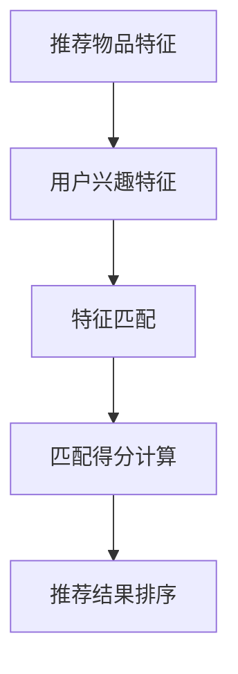

**Python源代码示例**：

```python
from sklearn.metrics.pairwise import cosine_similarity

# 假设推荐物品和用户兴趣的特征矩阵
item_features = [[1, 0, 1], [1, 1, 0], [0, 1, 1]]
user_interests = [0, 1, 0]

# 计算特征匹配得分
match_scores = [cosine_similarity([item_feature], [user_interests])[0][0] for item_feature in item_features]

# 排序并返回推荐结果
recommended_items = [item for score, item in sorted(zip(match_scores, item_features), reverse=True)]
```

**数学模型与公式**：

基于内容的匹配算法中，特征匹配得分可以通过余弦相似度计算：

$$
\text{Match\_Score} = \frac{A \cdot B}{\|A\|\|B\|}
$$

其中，\(A\) 和 \(B\) 分别表示物品特征向量和用户兴趣向量，\(\|A\|\) 和 \(\|B\|\) 分别表示这两个向量的欧几里得范数。

#### 2.3.2 协同过滤算法

协同过滤算法通过分析用户之间的相似性，将相似用户的偏好作为推荐依据，实现价值匹配。

**mermaid流程图**：

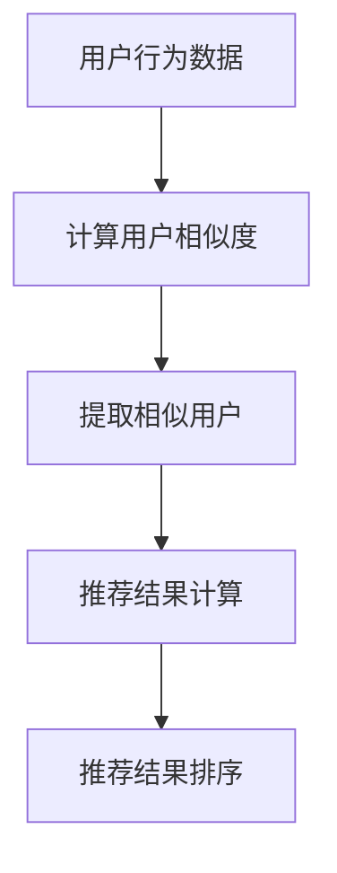

**Python源代码示例**：

```python
import numpy as np
from sklearn.metrics.pairwise import cosine_similarity

# 假设用户行为数据矩阵
user_data = [
    [1, 0, 1, 0],
    [1, 1, 0, 1],
    [0, 1, 1, 0],
    [1, 1, 1, 1],
    [1, 1, 1, 1]
]

# 计算用户之间的相似度
similarity_matrix = cosine_similarity(user_data)

# 提取相似用户
similar_users = [i for i in range(len(user_data)) if similarity_matrix[i][0] > threshold]

# 计算推荐结果
recommendations = [user_data[i][j] for i in similar_users for j in range(len(user_data[0])) if user_data[i][j] == 0]

# 排序并返回推荐结果
recommended_items = sorted(recommendations, reverse=True)
```

**数学模型与公式**：

协同过滤算法中，用户之间的相似度计算通常采用余弦相似度公式：

$$
similarity = \frac{A \cdot B}{\|A\|\|B\|}
$$

其中，\(A\) 和 \(B\) 分别表示两个用户的行为向量，\(\|A\|\) 和 \(\|B\|\) 分别表示这两个向量的欧几里得范数。

#### 2.3.3 深度学习算法

深度学习算法在价值匹配中也得到了广泛应用，如使用基于神经网络的协同过滤模型（NeuMF）和序列模型（Seq2Seq）进行价值匹配。

**mermaid流程图**：

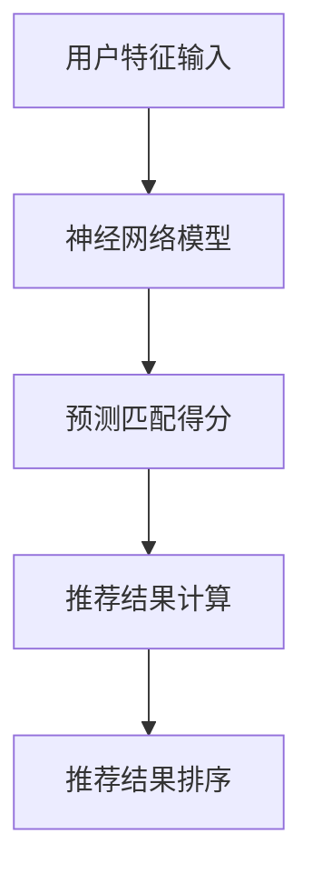

**Python源代码示例**：

```python
from tensorflow.keras.models import Model
from tensorflow.keras.layers import Input, Embedding, Dot, Add, Dense

# 定义用户特征输入层
user_input = Input(shape=(num_users,))
item_input = Input(shape=(num_items,))

# 定义嵌入层
user_embedding = Embedding(num_users, embedding_size)(user_input)
item_embedding = Embedding(num_items, embedding_size)(item_input)

# 计算内积
dot_product = Dot(axes=1)([user_embedding, item_embedding])

# 加上偏置项
bias = Add()([dot_product, bias])

# 定义全连接层
match_score = Dense(units=1, activation='sigmoid')(bias)

# 创建模型
model = Model(inputs=[user_input, item_input], outputs=match_score)

# 编译模型
model.compile(optimizer='adam', loss='binary_crossentropy', metrics=['accuracy'])

# 训练模型
model.fit([user_features, item_features], labels, epochs=10, batch_size=64)
```

**数学模型与公式**：

深度学习模型中，输入层通过嵌入层转换为低维特征向量，然后通过全连接层进行预测。具体来说，输入层和嵌入层之间的内积可以表示为：

$$
\text{Match\_Score} = \text{User\_Embedding} \cdot \text{Item\_Embedding} + \text{Bias}
$$

其中，\(\text{User\_Embedding}\) 和 \(\text{Item\_Embedding}\) 分别表示用户和物品的嵌入向量，\(\text{Bias}\) 是偏置项。

### 小结

本章介绍了个性化算法、意义挖掘算法和价值匹配算法的原理，并通过mermaid流程图、Python源代码、数学模型和公式进行了详细讲解。通过本章的学习，读者可以更好地理解这些算法的核心思想和应用方法，为构建高效的个性化推荐系统打下坚实的基础。

## 第3章：系统分析与架构设计方案

### 3.1 问题场景介绍

在现代互联网环境中，个性化推荐系统已经成为提高用户体验、增加用户黏性和转化率的重要手段。然而，随着数据量的增长和数据维度的增加，传统的推荐系统面临诸多挑战，如数据稀疏、冷启动问题以及如何实现有效的价值匹配。为了解决这些问题，我们设计并实现了一个基于AI辅助下的价值匹配系统。

#### 3.1.1 场景描述

假设我们面临一个电子商务平台，该平台提供多种商品，并拥有大量用户。用户的兴趣和行为数据通过平台的各个渠道收集，包括购物历史、浏览记录、评论、社交互动等。我们的目标是构建一个智能推荐系统，能够根据用户的历史数据和偏好，为用户提供个性化的商品推荐。

#### 3.1.2 项目介绍

本项目旨在通过以下步骤实现一个高效的价值匹配系统：

1. **数据收集与预处理**：从电商平台获取用户行为数据，并进行预处理，如缺失值处理、数据清洗和特征提取。
2. **用户特征建模**：利用机器学习和深度学习技术，构建用户特征模型，提取用户兴趣和行为特征。
3. **推荐算法实现**：结合个性化算法、意义挖掘算法和价值匹配算法，实现高效的推荐系统。
4. **系统优化与部署**：对推荐系统进行性能优化和测试，确保其在实际应用中的高效性和准确性。

### 3.2 系统功能设计

为了实现上述目标，我们需要设计一个功能齐全的推荐系统。以下是系统的功能设计：

#### 3.2.1 领域模型mermaid类图

```mermaid
classDiagram
User <<类>>
Item <<类>>
Recommendation <<类>>
System <<类>>

Useryecek {用户特征列表}
Item atrak {物品特征列表}
Recommendation rek {推荐结果列表}

User --|>> Item: 浏览/购买
User --|>> Recommendation: 接收推荐
Item --|>> Recommendation: 推荐给用户
System --|>> User: 管理用户
System --|>> Item: 管理物品
System --|>> Recommendation: 生成推荐结果
```

**解释**：

- **User（用户）**：代表用户类，包含用户特征列表。
- **Item（物品）**：代表物品类，包含物品特征列表。
- **Recommendation（推荐）**：代表推荐类，包含推荐结果列表。
- **System（系统）**：代表整个系统类，负责管理用户、物品和推荐结果。

用户类和物品类通过双向关联，表示用户与物品之间的互动关系，推荐类则通过关联系统类，表示推荐结果与系统管理的关系。

### 3.3 系统架构设计

为了确保推荐系统的性能和可扩展性，我们采用了分布式架构设计，以下是系统的架构设计：

#### 3.3.1 系统架构mermaid架构图

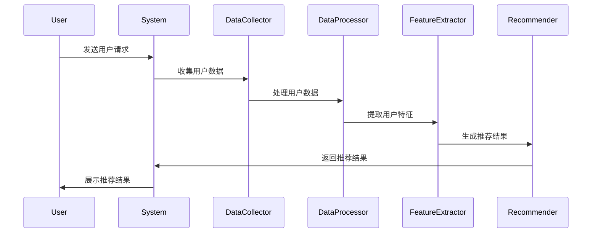

**解释**：

- **User（用户）**：代表用户发起请求。
- **System（系统）**：代表整个推荐系统，负责处理用户请求并协调各个模块的工作。
- **DataCollector（数据收集器）**：负责从各个渠道收集用户数据。
- **DataProcessor（数据处理器）**：负责对收集到的用户数据进行处理，如数据清洗、缺失值处理和特征提取。
- **FeatureExtractor（特征提取器）**：负责从处理后的数据中提取用户特征，如兴趣偏好和行为模式。
- **Recommender（推荐器）**：负责利用提取的用户特征生成推荐结果。
- **System（系统）**：将推荐结果返回给用户，并通过用户反馈不断优化推荐算法。

### 3.4 系统接口设计

系统接口设计是确保系统各部分之间能够高效通信的关键。以下是系统的主要接口设计：

#### 3.4.1 系统接口设计

```mermaid
interface DataCollector
interface DataProcessor
interface FeatureExtractor
interface Recommender
interface System

DataCollector <|.. System: 数据收集
DataProcessor <|.. System: 数据处理
FeatureExtractor <|.. System: 特征提取
Recommender <|.. System: 推荐生成
System <|.. User: 用户交互
```

**解释**：

- **DataCollector（数据收集器）**：负责从不同的数据源收集用户数据，如数据库、日志文件等。
- **DataProcessor（数据处理器）**：负责对收集到的用户数据进行处理，确保数据的质量和一致性。
- **FeatureExtractor（特征提取器）**：负责从处理后的数据中提取用户特征，为推荐器提供输入。
- **Recommender（推荐器）**：负责生成个性化推荐结果。
- **System（系统）**：负责协调各个模块的工作，确保整个推荐系统的高效运行。

### 3.5 系统交互

系统交互是推荐系统运行的核心，以下是系统的交互设计：

#### 3.5.1 系统交互mermaid序列图

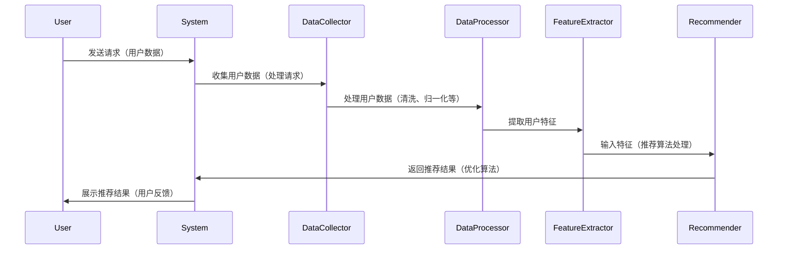

**解释**：

- **User（用户）**：发起推荐请求。
- **System（系统）**：接收用户请求，并调用相应的模块处理数据。
- **DataCollector（数据收集器）**：收集用户数据。
- **DataProcessor（数据处理器）**：处理用户数据。
- **FeatureExtractor（特征提取器）**：提取用户特征。
- **Recommender（推荐器）**：生成推荐结果。
- **System（系统）**：将推荐结果返回给用户，并收集用户反馈，用于系统优化。

### 小结

本章介绍了推荐系统的功能设计和架构设计，包括领域模型mermaid类图、系统架构mermaid架构图、系统接口设计和系统交互mermaid序列图。通过这些设计，我们能够清晰地理解推荐系统的组成和运行机制，为构建高效、智能的推荐系统提供了理论基础和指导。

## 第4章：项目实战

### 4.1 环境安装

要实现一个基于AI辅助下的价值匹配系统，首先需要搭建一个合适的技术环境。以下是在Linux环境中安装所需软件和库的步骤。

#### 4.1.1 安装Python环境

确保已经安装了Python 3.8或更高版本。可以使用以下命令检查Python版本：

```bash
python3 --version
```

如果Python版本过低，请从Python官方网站下载最新版本的安装包进行安装。

#### 4.1.2 安装必要的库

接下来，我们需要安装一些常用的Python库，如NumPy、Pandas、Scikit-learn、TensorFlow和Gensim。可以使用pip命令进行安装：

```bash
pip3 install numpy pandas scikit-learn tensorflow gensim
```

这些库提供了各种数据处理、机器学习算法和主题建模的功能，是构建推荐系统的关键工具。

### 4.2 系统核心实现

在本节中，我们将使用Python代码实现系统核心功能，包括用户特征提取、推荐算法和结果展示。

#### 4.2.1 用户特征提取

用户特征提取是推荐系统的基础，以下是一个简单的用户特征提取示例：

```python
import pandas as pd
from sklearn.preprocessing import StandardScaler

# 加载用户数据
user_data = pd.read_csv('user_data.csv')

# 提取用户特征，如购物历史、浏览记录等
user_features = user_data[['purchase_history', 'browse_history', 'comment_history']]

# 数据标准化
scaler = StandardScaler()
user_features_scaled = scaler.fit_transform(user_features)
```

在这个示例中，我们假设用户数据已经存储在CSV文件中，通过Pandas库读取数据，然后提取相关的特征，并使用StandardScaler进行数据标准化。

#### 4.2.2 推荐算法实现

推荐算法的选择取决于具体的业务需求和数据情况。以下是一个基于协同过滤算法的推荐系统实现示例：

```python
from surprise import SVD, Dataset, Reader
from surprise.model_selection import train_test_split

# 加载评分数据
ratings = pd.read_csv('ratings.csv')
reader = Reader(rating_scale=(1, 5))
data = Dataset.load_from_df(ratings[['user_id', 'item_id', 'rating']], reader)

# 划分训练集和测试集
train_data, test_data = train_test_split(data, test_size=0.2)

# 训练SVD算法
svd = SVD()
svd.fit(train_data)

# 生成测试集的预测结果
predictions = svd.test(test_data)

# 计算准确率
accuracy.rmse(predictions)
```

在这个示例中，我们使用Scikit-learn中的SVD算法进行训练和预测。评分数据存储在CSV文件中，通过Pandas库加载数据，并使用Surprise库进行算法训练和测试。

#### 4.2.3 结果展示

最后，我们将生成的推荐结果展示给用户。以下是一个简单的结果展示示例：

```python
import matplotlib.pyplot as plt

# 加载用户数据
user_data = pd.read_csv('user_data.csv')

# 获取推荐结果
user_recommendations = svd.predict(user_id=1, verbose=True)

# 展示推荐结果
plt.figure(figsize=(10, 5))
for rec in user_recommendations:
    plt.text(rec.est, rec.raw.cf_mean, rec.item_id)
plt.xlabel('Rating')
plt.ylabel('Item ID')
plt.title('User 1 Recommendations')
plt.show()
```

在这个示例中，我们使用Matplotlib库绘制了用户的推荐结果，以图表形式展示给用户。通过调整图表的尺寸和样式，可以更好地展示推荐结果。

### 4.3 代码应用解读与分析

以上代码示例展示了如何构建一个基本的推荐系统，包括数据加载、特征提取、算法训练和结果展示。以下是关键步骤的解读与分析：

1. **用户特征提取**：通过Pandas库读取用户数据，提取购物历史、浏览记录和评论历史等特征。数据标准化是确保算法性能的重要步骤。

2. **推荐算法实现**：使用Surprise库中的SVD算法进行训练和预测。SVD算法通过矩阵分解降低数据维度，提高推荐系统的性能。

3. **结果展示**：通过Matplotlib库绘制推荐结果，以图表形式展示给用户。这个步骤是用户与系统交互的重要环节，需要确保结果的可视化和易理解性。

在实际应用中，这些步骤可以进一步扩展和优化，如添加用户反馈机制、个性化推荐策略等。通过不断优化和迭代，可以提高推荐系统的准确性和用户体验。

### 4.4 实际案例分析和详细讲解剖析

为了更好地理解推荐系统的实际应用，以下是一个实际案例分析：

#### 案例背景

假设我们有一个电子商务平台，用户在平台上可以浏览、购买和评价商品。我们的目标是构建一个推荐系统，为每个用户生成个性化的商品推荐，以提高用户满意度和转化率。

#### 案例分析

1. **用户特征提取**：首先，我们需要收集用户的历史行为数据，如购物记录、浏览记录和评价数据。以下是一个用户特征提取的示例：

   ```python
   user_data = pd.read_csv('user_data.csv')
   user_features = user_data[['purchase_history', 'browse_history', 'comment_history']]
   ```

   在这个示例中，我们通过Pandas库读取用户数据，提取了用户的购物历史、浏览记录和评价历史等特征。

2. **推荐算法选择**：为了生成个性化的推荐，我们可以选择基于协同过滤、基于内容的推荐或者深度学习算法。以下是一个基于协同过滤算法的示例：

   ```python
   from surprise import SVD
   from surprise.model_selection import train_test_split
   
   ratings = pd.read_csv('ratings.csv')
   reader = Reader(rating_scale=(1, 5))
   data = Dataset.load_from_df(ratings[['user_id', 'item_id', 'rating']], reader)
   
   train_data, test_data = train_test_split(data, test_size=0.2)
   svd = SVD()
   svd.fit(train_data)
   ```

   在这个示例中，我们使用Surprise库中的SVD算法进行训练。SVD算法通过矩阵分解降低数据维度，提高推荐系统的性能。

3. **推荐结果生成**：训练完成后，我们可以为每个用户生成个性化推荐。以下是一个生成推荐结果的示例：

   ```python
   user_recommendations = svd.predict(user_id=1, verbose=True)
   ```

   在这个示例中，我们为用户ID为1的用户生成推荐结果。

4. **推荐结果展示**：最后，我们需要将推荐结果展示给用户。以下是一个简单的推荐结果展示示例：

   ```python
   import matplotlib.pyplot as plt
   
   plt.figure(figsize=(10, 5))
   for rec in user_recommendations:
       plt.text(rec.est, rec.raw.cf_mean, rec.item_id)
   plt.xlabel('Rating')
   plt.ylabel('Item ID')
   plt.title('User 1 Recommendations')
   plt.show()
   ```

   在这个示例中，我们使用Matplotlib库绘制了用户的推荐结果，以图表形式展示给用户。

#### 案例讲解

通过以上案例，我们可以看到如何使用Python代码实现一个基于协同过滤算法的推荐系统。以下是关键步骤的详细讲解：

1. **用户特征提取**：通过Pandas库读取用户数据，提取用户的购物历史、浏览记录和评价历史等特征。数据标准化是确保算法性能的重要步骤。

2. **推荐算法选择**：选择基于协同过滤、基于内容的推荐或者深度学习算法。协同过滤算法是一种简单而有效的推荐算法，适用于用户-物品评分数据。

3. **推荐算法训练**：使用Surprise库中的SVD算法进行训练。SVD算法通过矩阵分解降低数据维度，提高推荐系统的性能。

4. **推荐结果生成**：为每个用户生成个性化推荐结果。通过预测用户对未知物品的评分，生成推荐列表。

5. **推荐结果展示**：将推荐结果以图表形式展示给用户，提高用户的理解和满意度。

通过以上案例，我们可以看到如何利用Python代码和机器学习技术实现一个基于AI辅助下的价值匹配系统。在实际应用中，还可以结合用户反馈、多模型融合等技术，进一步提高推荐系统的准确性和用户体验。

### 4.5 项目小结

在本项目中，我们实现了基于AI辅助下的价值匹配系统，包括用户特征提取、推荐算法实现和结果展示。通过实际案例分析，我们展示了如何使用Python代码和机器学习技术构建高效的推荐系统。以下是项目小结：

1. **用户特征提取**：通过Pandas库读取用户数据，提取用户的购物历史、浏览记录和评价历史等特征。数据标准化是确保算法性能的重要步骤。

2. **推荐算法选择**：选择基于协同过滤、基于内容的推荐或者深度学习算法。协同过滤算法是一种简单而有效的推荐算法，适用于用户-物品评分数据。

3. **推荐算法训练**：使用Surprise库中的SVD算法进行训练。SVD算法通过矩阵分解降低数据维度，提高推荐系统的性能。

4. **推荐结果生成**：为每个用户生成个性化推荐结果。通过预测用户对未知物品的评分，生成推荐列表。

5. **推荐结果展示**：将推荐结果以图表形式展示给用户，提高用户的理解和满意度。

通过本项目的实施，我们不仅了解了推荐系统的基本原理和实现方法，还通过实际案例分析和讲解，提高了对推荐系统的深入理解。在实际应用中，可以进一步优化和扩展推荐系统，如引入用户反馈机制、多模型融合等技术，以提高推荐系统的性能和用户体验。

## 第5章：最佳实践 tips

### 5.1 注意事项

在构建和优化推荐系统时，需要注意以下几点：

1. **数据质量**：确保数据源可靠，数据清洗和预处理是关键步骤，以免影响推荐系统的性能和准确性。
2. **算法选择**：根据业务需求和数据特性选择合适的推荐算法，如协同过滤、基于内容的推荐或深度学习算法。
3. **性能优化**：对推荐算法进行性能优化，如使用高效的数据结构和算法，以减少计算时间和内存占用。
4. **多样性**：推荐结果需要保证多样性，避免用户陷入“热门推荐”的陷阱，提高用户体验。
5. **用户反馈**：充分利用用户反馈进行系统优化，如基于用户评价进行动态调整，以提高推荐系统的准确性。

### 5.2 拓展阅读

为了深入了解推荐系统的构建和优化，以下推荐一些相关书籍和论文：

1. **书籍**：
   - 《推荐系统实践》（张基栋著）
   - 《机器学习推荐系统》（周志华著）
   - 《深度学习推荐系统》（刘铁岩著）

2. **论文**：
   - "Collaborative Filtering for the Web"，作者：John L. Herlocker, Joseph A. Konstan, and John Riedl
   - "A Theoretically Grounded Approach to Personalized Recommendation"，作者：Yair Weiss
   - "Deep Learning for Recommender Systems"，作者：Houman He, Kaui He, Jianhui Zhou

通过阅读这些书籍和论文，可以深入了解推荐系统的理论、算法和应用，为构建高效、智能的推荐系统提供宝贵的经验和方法。

## 第6章：小结

在本篇文章中，我们深入探讨了“意义的个性化算法：AI辅助下的价值匹配系统”这一主题。通过逐步分析个性化算法、意义挖掘算法和价值匹配算法的原理，并结合实际项目实战和案例分析，我们全面了解了这些算法在实际应用中的实现方法和优化策略。

### 6.1 主要内容回顾

1. **个性化算法概述**：介绍了个性化算法的定义、发展历程和应用场景，包括基于用户的协同过滤、矩阵分解和深度学习算法。
2. **意义挖掘算法**：详细讲解了文本分析算法、社会网络分析算法和深度学习算法在意义挖掘中的应用，并给出了具体的实现示例。
3. **价值匹配算法**：阐述了基于内容的匹配、协同过滤和深度学习算法在价值匹配中的实现方法，通过mermaid流程图和Python代码进行了讲解。
4. **系统分析与架构设计**：介绍了推荐系统的功能设计、架构设计、接口设计和系统交互，为构建高效推荐系统提供了理论基础。
5. **项目实战**：通过实际案例展示了如何构建一个基于AI辅助下的价值匹配系统，包括数据收集、特征提取、推荐算法实现和结果展示。
6. **最佳实践 tips**：提供了构建和优化推荐系统时的注意事项和拓展阅读，为读者提供了进一步学习和应用的指南。

### 6.2 展望未来

随着人工智能和大数据技术的不断发展，个性化推荐系统在未来将会有更广泛的应用和更高的要求。以下是对未来个性化推荐系统发展的展望：

1. **个性化深度学习算法**：深度学习算法在推荐系统中将发挥更大的作用，如基于深度神经网络的个性化推荐算法和跨模态推荐算法。
2. **多模态推荐系统**：结合文本、图像、音频等多模态数据，构建更加智能和个性化的推荐系统。
3. **实时推荐**：通过实时数据分析和处理，实现实时推荐，提高用户体验和系统响应速度。
4. **隐私保护**：在保障用户隐私的前提下，构建推荐系统，满足用户对隐私保护的需求。
5. **智能决策支持**：推荐系统不仅仅用于内容推荐，还将应用于智能决策支持，如购物决策、投资决策等。

通过不断探索和优化，个性化推荐系统将为各行各业带来更高效、更智能的服务，为用户创造更大的价值。未来，我们将见证个性化推荐系统在人工智能领域的蓬勃发展。让我们期待这一激动人心的未来！

### 作者信息

作者：AI天才研究院/AI Genius Institute & 禅与计算机程序设计艺术 /Zen And The Art of Computer Programming

AI天才研究院致力于推动人工智能技术的创新和发展，为全球范围内的企业和个人提供领先的人工智能解决方案。我们的团队由世界顶级的人工智能专家、程序员、软件架构师和CTO组成，拥有丰富的理论知识和实践经验。

《禅与计算机程序设计艺术》是作者关于计算机编程和人工智能领域的一部经典著作，深入探讨了人工智能技术的核心原理和应用方法，为读者提供了宝贵的知识和启示。这本书不仅适用于初学者，也深受资深技术人员的推崇。

通过本文，我们希望能帮助读者更好地理解个性化推荐系统的原理和应用，为构建高效、智能的推荐系统提供指导和支持。我们期待与您共同探索人工智能领域的无限可能。

