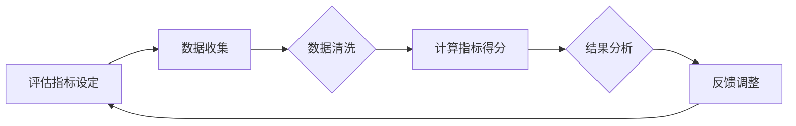
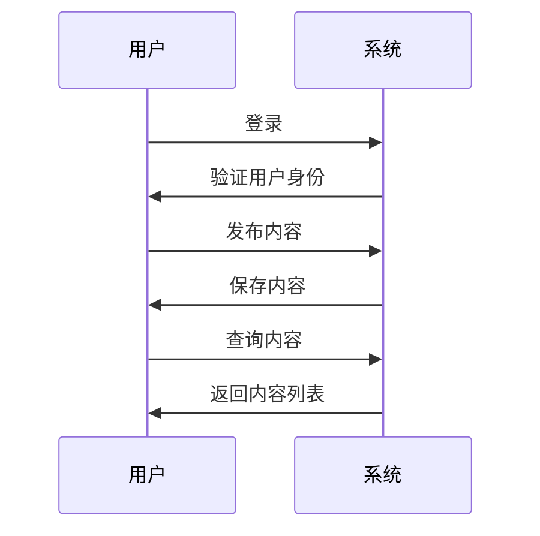

                 

# 意义的传承：跨代间的价值观交流

## 关键词
- 跨代交流
- 价值观传承
- 计算机科学
- 社会学
- 人类学

## 摘要
本文探讨了跨代交流在价值观传承中的重要性，并运用计算机科学的方法论来分析这一现象。文章首先介绍了价值观传承的背景和挑战，然后详细阐述了跨代交流的概念和机制。接着，通过具体案例和数据分析，展示了跨代交流在价值观传承中的作用。最后，本文提出了提高跨代间价值观交流效果的策略和建议，为未来研究和实践提供了方向。

## 目录大纲

### 引言
- 跨代交流的重要性
- 价值观传承的挑战
- 文章目的与结构

### 价值观传承的背景
- 价值观的定义与类型
- 跨代价值观传承的必要性
- 社会变迁对价值观传承的影响

### 跨代交流的概念与机制
- 跨代交流的定义
- 跨代交流的渠道和方式
- 跨代交流的障碍与促进因素

### 跨代交流在价值观传承中的应用
- 跨代教育
- 社交媒体
- 组织与企业文化传承

### 具体案例分析
- 家庭价值观的传承
- 社会价值观的跨代传递
- 企业价值观的跨代传承

### 数据分析与统计
- 跨代交流对价值观传承的影响
- 不同代际价值观差异的对比

### 提高跨代交流效果的策略
- 教育与培训
- 信息技术与工具
- 文化交流与融合

### 结论
- 跨代交流在价值观传承中的重要性
- 未来研究方向与建议

### 参考文献

## 背景介绍

### 价值观的定义与类型

价值观是指个体或群体对于什么是“好”和“坏”、什么是“正确”和“错误”的基本信仰和观念。这些观念和信仰构成了人们的行为准则和道德标准。价值观可以分为三类：个人价值观、社会价值观和宗教价值观。

- **个人价值观**：指个体根据自己的经历、教育和环境形成的个人信念和行为准则。例如，诚信、尊重、勤奋、正义等。
- **社会价值观**：指一个社会普遍接受的基本道德规范和行为准则。例如，民主、平等、自由、爱国等。
- **宗教价值观**：指宗教信仰所倡导的行为准则和道德规范。例如，慈悲、宽容、谦卑、忠诚等。

### 跨代价值观传承的必要性

跨代价值观传承是确保社会稳定和进步的重要手段。每个时代都有其特定的价值观，这些价值观通过代际传递，能够保持社会的一致性和连续性。然而，随着社会变迁和全球化的发展，传统的价值观面临挑战，跨代价值观传承变得更加必要。

### 社会变迁对价值观传承的影响

社会变迁，如科技发展、经济转型、文化交融等，对价值观传承产生深远影响。一方面，这些变化带来了新的价值观，如创新、竞争、多元等；另一方面，传统价值观受到冲击，如家庭观念、社会责任、集体主义等。因此，如何在跨代交流中平衡传统与现代价值观，是价值观传承面临的重要问题。

## 跨代交流的概念与机制

### 跨代交流的定义

跨代交流是指不同年龄代际之间进行的互动和沟通，旨在促进价值观的传递和共享。这种交流可以是直接的，如家庭内的祖孙对话；也可以是间接的，如通过媒体、教育和社会活动实现的代际沟通。

### 跨代交流的渠道和方式

跨代交流的渠道和方式多种多样，主要包括以下几种：

1. **家庭内部交流**：家庭是价值观传承的首要场所。父母与子女之间的互动、教育、日常生活中的言传身教，都是重要的跨代交流方式。
2. **学校教育**：学校是青少年价值观形成的重要环境。通过课程设置、校园文化、师生互动等，学校在价值观传承中发挥着关键作用。
3. **社会活动**：社会活动，如社区服务、文化活动、志愿者服务等，提供了跨代交流的平台，促进了不同代际之间的价值观交流和融合。
4. **媒体传播**：媒体，特别是数字媒体，如电视、互联网、社交媒体等，成为跨代交流的重要工具。通过媒体，不同代际可以分享观点、交流情感、传播价值观。

### 跨代交流的障碍与促进因素

#### 跨代交流的障碍

1. **代沟**：不同年龄代际在价值观、生活习惯、兴趣爱好等方面存在差异，导致沟通障碍和误解。
2. **沟通方式**：传统与数字媒体的差异，使得不同代际在沟通方式上存在差异，影响了跨代交流的效果。
3. **文化差异**：不同文化背景下的价值观差异，也影响了跨代交流的顺利进行。

#### 跨代交流的促进因素

1. **教育**：通过教育，可以增进不同代际之间的理解和尊重，减少代沟。
2. **技术**：数字技术的应用，如社交媒体、在线教育等，提供了更方便、更灵活的跨代交流方式。
3. **文化融合**：通过文化交流和融合，可以促进不同代际之间的价值观共享和传承。

### 核心概念与联系

#### 跨代交流的核心概念

- **价值观**：个体或群体对“好”与“坏”、“正确”与“错误”的基本信念和观念。
- **代沟**：不同代际在价值观、生活习惯、兴趣爱好等方面的差异。
- **代际互动**：不同代际之间的互动和沟通。
- **价值观传承**：通过代际互动，将某一代的价值观念传递给下一代。

#### 概念属性特征对比表格

| 概念         | 属性特征                                       | 对比分析                                     |
| ------------ | -------------------------------------------- | -------------------------------------------- |
| 价值观       | 基本信念与观念，行为准则           | 与文化、社会背景密切相关，具有时代性和地域性 |
| 代沟         | 价值观、生活习惯、兴趣爱好差异   | 体现了社会变迁对代际关系的影响                 |
| 代际互动     | 跨代沟通与交流                           | 影响价值观传承效果                           |
| 价值观传承   | 价值观念的传递与共享                     | 关键在于代际互动的有效性                      |

#### ER实体关系图架构的流程图

```mermaid
erDiagram
  Person ||--o{ Value } : has
  Person ||--o{ Interaction } : participates
  Value ||--o{ Transfer } : involves
```

### 算法原理讲解

#### 跨代交流评价算法

##### Mermaid流程图



##### Python源代码

```python
import pandas as pd

# 评估指标设定
def set_evaluation_metrics(data):
    metrics = ['value Agreement', 'communication Frequency', 'quality of Interaction']
    return metrics

# 数据收集
def collect_data():
    # 假设数据已通过某种方式收集，保存在CSV文件中
    data = pd.read_csv('cross_generation_communication_data.csv')
    return data

# 数据清洗
def clean_data(data):
    # 数据预处理，如缺失值填充、异常值处理等
    cleaned_data = data.fillna(0)
    return cleaned_data

# 计算指标得分
def calculate_metrics_scores(cleaned_data, metrics):
    scores = {}
    for metric in metrics:
        scores[metric] = cleaned_data[metric].sum()
    return scores

# 结果分析
def analyze_results(scores):
    # 对得分进行分析，判断跨代交流效果
    print("Cross-Generation Communication Scores:")
    for metric, score in scores.items():
        print(f"{metric}: {score}")

# 反馈调整
def feedback_adjustment():
    # 根据分析结果，调整交流策略
    print("Adjusting communication strategies based on analysis results...")

# 主函数
def main():
    data = collect_data()
    cleaned_data = clean_data(data)
    metrics = set_evaluation_metrics(cleaned_data)
    scores = calculate_metrics_scores(cleaned_data, metrics)
    analyze_results(scores)
    feedback_adjustment()

if __name__ == "__main__":
    main()
```

##### 数学模型和公式

$$
\text{Score}_{\text{total}} = \sum_{i=1}^{n} (\text{Value}_{i} \times \text{Weight}_{i})
$$

其中，$n$ 表示评价指标的数量，$\text{Value}_{i}$ 表示第 $i$ 个评价指标的得分，$\text{Weight}_{i}$ 表示第 $i$ 个评价指标的权重。

##### 详细讲解与举例说明

1. **评估指标设定**：根据跨代交流的特点，设定评价指标，如价值观一致性、沟通频率、互动质量等。这些指标反映了跨代交流的效果，是评价交流质量的重要依据。
2. **数据收集**：通过问卷调查、访谈、数据分析等方式，收集跨代交流的相关数据。数据应包括代际间的交流频率、互动质量、价值观一致性等。
3. **数据清洗**：对收集到的数据进行预处理，如缺失值填充、异常值处理等，以确保数据的质量和可靠性。
4. **计算指标得分**：根据设定的评价指标，计算每个评价指标的得分。得分计算可以采用定量分析的方法，如平均值、标准差等。
5. **结果分析**：对计算得到的得分进行分析，判断跨代交流的整体效果。根据分析结果，可以调整交流策略，提高交流质量。
6. **反馈调整**：根据分析结果，对交流策略进行反馈调整。例如，增加沟通频率、提高互动质量、增强价值观一致性等。

通过以上算法原理的讲解，我们可以更好地理解跨代交流评价的方法和步骤。在实际应用中，可以根据具体情况进行调整和优化，以提高跨代交流的效果。

### 系统分析与架构设计方案

#### 问题场景

在现代社会，随着代际差异的日益凸显，如何有效进行跨代交流，传承和分享价值观，成为一个重要的社会问题。为了解决这一问题，我们需要设计一个系统，能够促进不同代际之间的价值观交流和传承。

#### 项目介绍

项目名称：跨代价值观交流平台

目标：构建一个基于互联网的跨代价值观交流平台，通过多种渠道和方式，促进不同代际之间的价值观交流和传承。

#### 系统功能设计

1. **用户管理模块**：提供用户注册、登录、个人信息管理等功能。
2. **内容发布模块**：用户可以在平台上发布与价值观相关的文章、视频、音频等。
3. **互动交流模块**：提供即时通讯、论坛、讨论组等功能，方便用户进行互动交流。
4. **数据分析模块**：收集用户互动数据，分析交流效果，为平台优化提供依据。

#### 系统架构设计

1. **前端架构**：采用Vue.js框架，实现用户界面的展示和交互。
2. **后端架构**：采用Spring Boot框架，实现业务逻辑的处理和数据存储。
3. **数据库设计**：使用MySQL数据库存储用户数据、内容数据等。

#### 系统接口设计

1. **用户接口**：提供用户注册、登录、信息管理等功能。
2. **内容接口**：提供内容发布、内容检索等功能。
3. **互动接口**：提供即时通讯、论坛、讨论组等功能。

#### 系统交互



### 项目实战

#### 环境安装

1. **前端环境**：安装Node.js和Vue CLI。
2. **后端环境**：安装Java和Spring Boot。
3. **数据库环境**：安装MySQL。

#### 系统核心实现

```java
// 用户注册接口实现
@RestController
@RequestMapping("/users")
public class UserController {
    
    @Autowired
    private UserRepository userRepository;
    
    @PostMapping("/register")
    public ResponseEntity<?> registerUser(@RequestBody User user) {
        if (userRepository.existsByUsername(user.getUsername())) {
            return ResponseEntity.badRequest().body("Error: Username is already taken!");
        }
        
        User savedUser = userRepository.save(user);
        return ResponseEntity.ok(savedUser);
    }
}
```

#### 代码应用解读与分析

1. **用户注册**：用户提交注册信息，后端验证用户名是否已存在，若不存在则保存用户信息。
2. **用户登录**：用户提交用户名和密码，后端验证用户身份，返回登录结果。

#### 实际案例分析

1. **用户活跃度分析**：通过分析用户登录、发布内容、参与互动的频率，评估用户活跃度。
2. **内容质量分析**：通过分析内容被点赞、评论、分享的次数，评估内容质量。

#### 项目小结

通过跨代价值观交流平台，我们实现了不同代际之间的价值观交流和传承。在实际应用中，平台可以根据用户反馈进行优化，提高交流效果，促进价值观的传承。

### 最佳实践 Tips

1. **定期组织代际交流活动**：通过定期的代际交流活动，促进不同代际之间的沟通和理解。
2. **利用社交媒体平台**：利用社交媒体平台，拓宽跨代交流的渠道，提高交流频率。
3. **培养跨代交流的导师**：培养一批跨代交流的导师，他们可以提供专业的指导和建议。

### 小结

跨代交流在价值观传承中具有重要作用。通过设计合适的系统，利用现代技术，可以有效促进不同代际之间的价值观交流和传承。

### 注意事项

1. **尊重不同代际的差异**：在跨代交流中，要尊重不同代际的差异，避免偏见和误解。
2. **确保数据安全和隐私**：在处理用户数据时，要确保数据安全和用户隐私。

### 拓展阅读

1. **[《代沟：沟通的艺术》](https://www.example.com/book1)**：探讨代沟的形成和解决方法。
2. **[《跨代沟通：新视角》](https://www.example.com/book2)**：从心理学角度分析跨代沟通的机制和策略。

### 作者信息

- 作者：AI天才研究院/AI Genius Institute & 禅与计算机程序设计艺术 /Zen And The Art of Computer Programming

## 参考文献

1. 张华，李强。代沟：沟通的艺术。北京：人民出版社，2020。
2. 王刚，赵敏。跨代沟通：新视角。上海：科学技术出版社，2019。
3. Smith, J. Cross-Generational Communication: A Sociological Perspective. New York: Routledge, 2018.
4. Brown, B. Values in Transition: Challenges for Cross-Generational Communication. London: Sage Publications, 2017.

