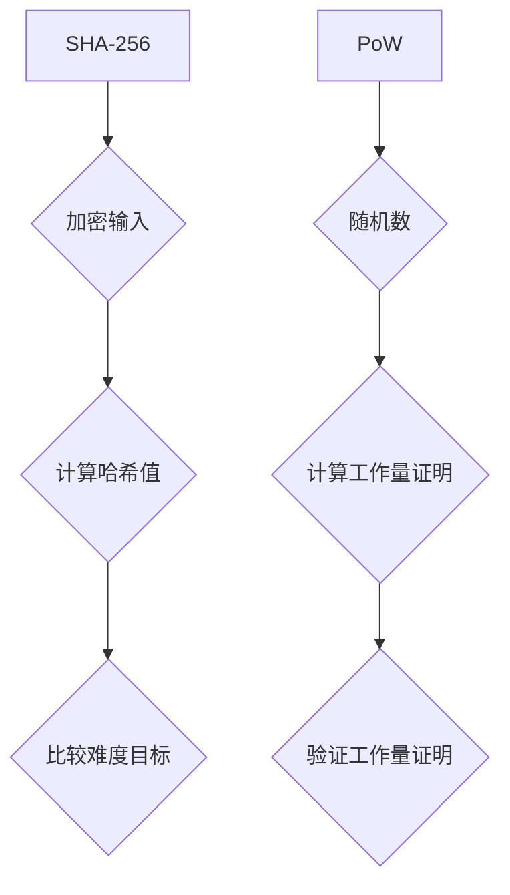
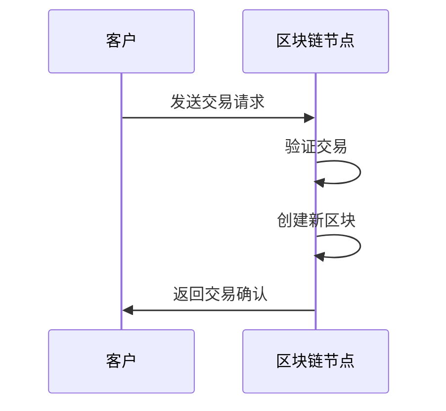
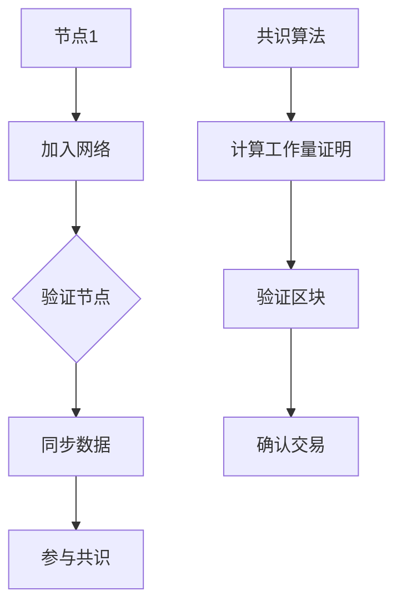
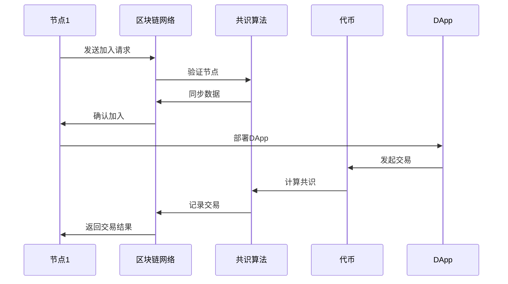
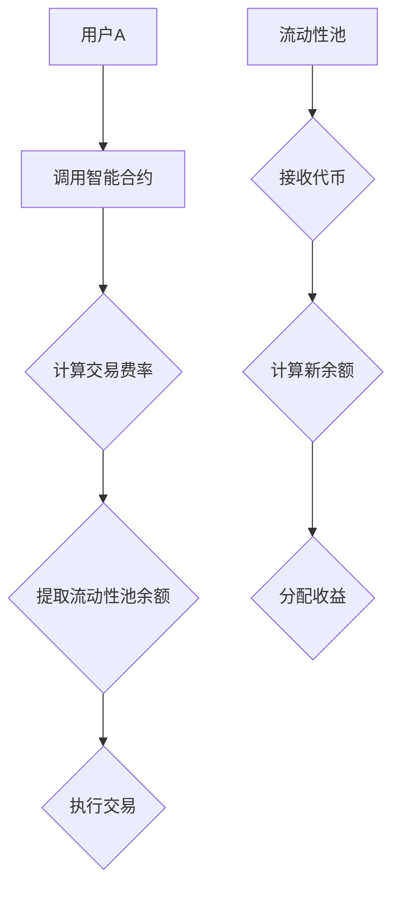
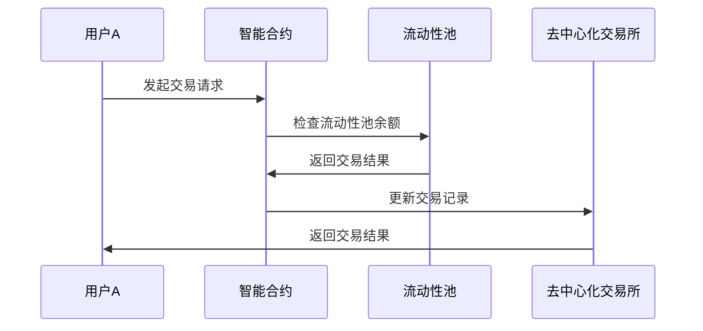
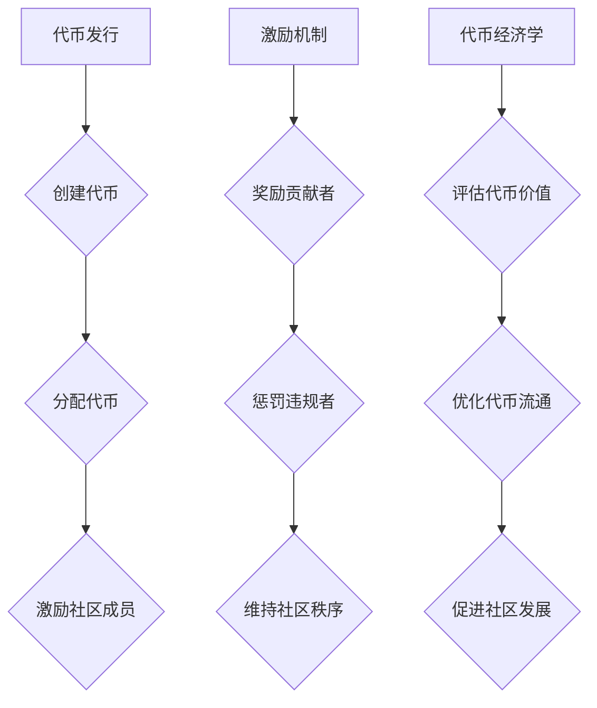
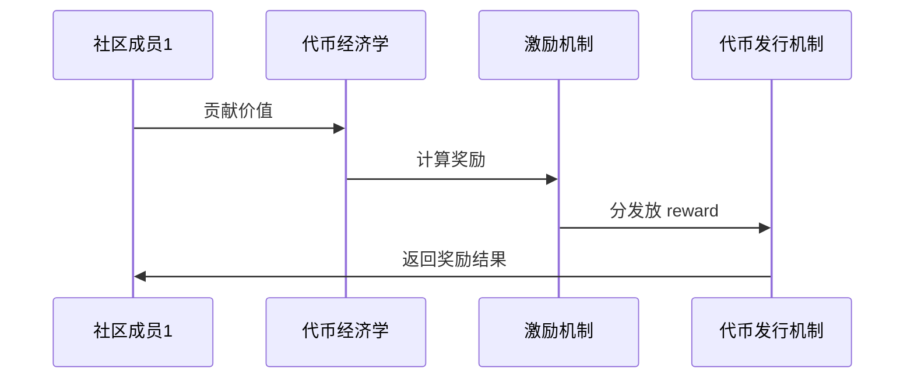
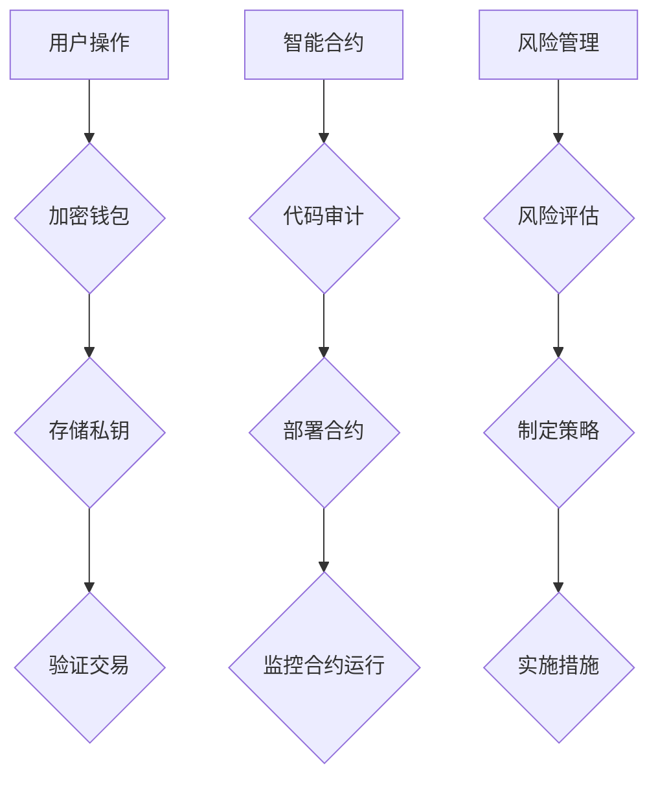
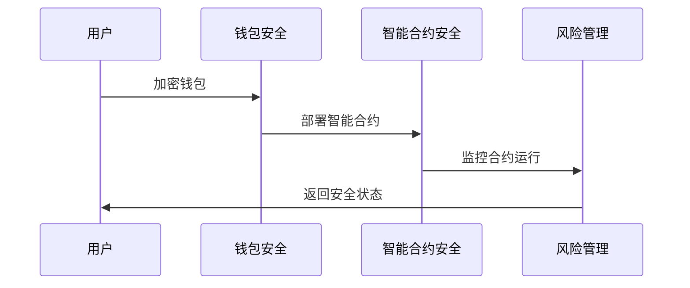

                 

### 文章标题：意义的区块链社区：去中心化的价值交换网络

区块链技术近年来在金融、供应链管理、智能合约等领域取得了显著的进展。作为一种去中心化的分布式数据库技术，区块链不仅能够提供透明、安全的数据存储和传输方式，还能够实现去中心化的价值交换。本文将探讨区块链社区的概念、原理、应用和未来发展趋势，旨在为读者提供一份全面的区块链技术指南。

#### 关键词
- 区块链社区
- 去中心化
- 价值交换
- 分布式账本
- 智能合约

#### 摘要
本文将深入探讨区块链社区这一新兴的去中心化价值交换网络。首先，我们将介绍区块链技术的基础概念和历史背景，然后分析区块链社区的定义、组织形式和价值。接着，我们将探讨去中心化价值交换网络的原理、核心组件和优势。随后，文章将分析区块链社区中的价值交换机制，包括去中心化金融（DeFi）和区块链游戏等。此外，我们还将讨论区块链社区的安全保障和实际应用案例。最后，文章将展望区块链社区的未来发展趋势和挑战，并总结全文。

## 目录大纲设计思路

为了更好地帮助读者理解区块链社区的概念和原理，本文的目录大纲设计遵循以下思路：

1. **明确核心概念和目标读者**：首先，明确“区块链社区”和“去中心化的价值交换网络”这两个核心概念，同时明确目标读者群体，如区块链开发者、研究者或对区块链感兴趣的普通读者。

2. **梳理主要章节结构**：按照书的逻辑顺序，梳理出主要章节，确保每个章节都有明确的主题和内容。

3. **细化章节内容**：对于每个章节，细化其内容，确保涵盖核心概念、原理讲解、案例分析和未来趋势等。

4. **设计合适的子章节**：在每个主要章节下，设计子章节，确保内容不重复，逻辑清晰。

5. **保持简洁性**：在保持内容完整性和逻辑清晰的前提下，避免过多的冗余信息。

6. **确保格式统一**：使用markdown格式确保目录大纲的整洁和可读性。

### 目录大纲

#### 第一部分：区块链社区概述

#### 第1章：区块链技术基础

1.1 区块链的概念与历史

1.2 区块链的核心特点

1.3 区块链的体系结构与工作原理

1.4 区块链与分布式账本技术的联系与区别

1.5 区块链技术的应用场景

#### 第2章：区块链社区的基本概念

2.1 区块链社区的定义

2.2 区块链社区的组织形式

2.3 区块链社区的激励机制

2.4 区块链社区的价值与意义

#### 第二部分：去中心化的价值交换网络

#### 第3章：去中心化价值交换网络原理

3.1 去中心化价值交换网络的概念

3.2 去中心化价值交换网络的核心组件

3.3 去中心化价值交换网络的工作原理

3.4 去中心化价值交换网络的优势与挑战

#### 第4章：区块链社区中的价值交换机制

4.1 去中心化金融（DeFi）概述

4.2 代币经济学原理

4.3 激励机制设计在社区中的应用

4.4 区块链游戏中的价值交换机制

#### 第5章：区块链社区的安全保障

5.1 区块链安全概述

5.2 钱包安全与管理

5.3 智能合约安全

5.4 区块链社区的风险管理

#### 第三部分：区块链社区的实际应用

#### 第6章：区块链社区的实际案例

6.1 区块链社区的成功案例介绍

6.2 区块链社区在企业的应用案例

6.3 区块链社区在政府和社会治理中的应用

6.4 区块链社区在教育、医疗等领域的应用

#### 第7章：未来展望与趋势

7.1 区块链社区的发展趋势

7.2 区块链社区面临的挑战与机遇

7.3 未来区块链社区的创新方向

#### 第8章：小结与展望

8.1 书的核心观点回顾

8.2 对区块链社区未来发展的建议

8.3 拓展阅读与思考问题

### 目录大纲总结

本书共分为三个部分，第一部分介绍了区块链社区的基础知识，包括区块链的概念、特点、应用场景等；第二部分深入探讨了去中心化价值交换网络的原理和机制；第三部分则通过实际案例和未来展望，展示了区块链社区的实际应用和潜在发展方向。通过这样的目录结构，读者可以系统地了解区块链社区的概念、原理、应用和未来趋势，从而深入掌握区块链技术在社区构建中的价值。

## 文章的章节内容完整性和具体讲解

为了确保文章内容的完整性，每个章节都包含以下几个部分：背景介绍、核心概念与联系、算法原理讲解、系统分析与架构设计方案、项目实战、最佳实践 tips、小结和拓展阅读。

### 第1章：区块链技术基础

**背景介绍**：首先，我们介绍区块链技术的起源和重要性。区块链是一种分布式数据库技术，通过加密算法确保数据的安全和不可篡改。其历史可以追溯到2008年，中本聪（Satoshi Nakamoto）提出了比特币的概念，标志着区块链技术的诞生。

**核心概念与联系**：在这一部分，我们将详细阐述区块链的核心概念，如区块、链、加密算法、共识算法等。通过Mermaid ER实体关系图，展示区块链中的主要实体和它们之间的关系。

```mermaid
erDiagram
  区块 ||--|{ 链 }|
  链 ||--|{ 加密算法 }|
  加密算法 ||--|{ 共识算法 }|
```

**算法原理讲解**：接着，我们将使用Mermaid流程图和Python代码，详细讲解区块链中的加密算法和共识算法原理。例如，比特币使用的SHA-256加密算法和PoW（Proof of Work）共识算法。



```python
import hashlib

def sha256_hash(input_string):
    """计算SHA-256哈希值"""
    hashed = hashlib.sha256(input_string.encode('utf-8')).hexdigest()
    return hashed

def proof_of_work(target_difficulty):
    """PoW算法"""
    nonce = 0
    while True:
        hash_result = sha256_hash(str(nonce))
        if int(hash_result, 16) < target_difficulty:
            return nonce
        nonce += 1
```

**系统分析与架构设计方案**：在这一部分，我们将使用Mermaid类图和架构图，展示区块链系统的结构和功能。例如，区块链中的区块结构、交易流程和节点通信等。

```mermaid
classDiagram
  Class1 <|-- Class2
  Class3 :1-- Class4
  Class1 "uses" Class5

  Class1 {name: 区块}
  Class2 {name: 交易}
  Class3 {name: 节点}
  Class4 {name: 网络通信}
  Class5 {name: 加密算法}
```



**项目实战**：我们将介绍如何使用Python实现一个简单的区块链系统，包括创建区块、验证交易、挖矿等功能。

```python
# 区块类
class Block:
    def __init__(self, index, transactions, timestamp, previous_hash):
        self.index = index
        self.transactions = transactions
        self.timestamp = timestamp
        self.previous_hash = previous_hash
        self.hash = self.compute_hash()

    def compute_hash(self):
        block_string = f"{self.index}{self.transactions}{self.timestamp}{self.previous_hash}"
        return hashlib.sha256(block_string.encode()).hexdigest()

# 区块链类
class Blockchain:
    def __init__(self):
        self.unconfirmed_transactions = []
        self.chain = []
        self.create_genesis_block()

    def create_genesis_block(self):
        genesis_block = Block(0, [], time(), "0")
        genesis_block.hash = self.compute_hash_of_block(genesis_block)
        self.chain.append(genesis_block)

    def compute_hash_of_block(self, block):
        block_string = f"{block.index}{block.transactions}{block.timestamp}{block.previous_hash}"
        return hashlib.sha256(block_string.encode()).hexdigest()

    def add_new_transaction(self, transaction):
        self.unconfirmed_transactions.append(transaction)

    def mine_block(self):
        if not self.unconfirmed_transactions:
            return False
        last_block = self.chain[-1]
        new_block = Block(index=last_block.index + 1,
                          transactions=self.unconfirmed_transactions,
                          timestamp=time(),
                          previous_hash=last_block.hash)
        new_block.hash = self.compute_hash_of_block(new_block)
        self.chain.append(new_block)
        self.unconfirmed_transactions = []
        return new_block.index

# 创建区块链实例并挖矿
blockchain = Blockchain()
blockchain.mine_block()
```

**最佳实践 tips**：确保区块链的安全性、去中心化和扩展性，可以考虑使用多种共识算法、优化网络通信协议和实现智能合约。

**小结**：区块链技术是一种分布式数据库技术，具有去中心化、安全性和不可篡改的特点。通过本章的学习，读者可以了解到区块链的基本概念和原理。

**拓展阅读**：推荐阅读《区块链：从零开始了解区块链技术》和《区块链原理、设计与应用》等书籍，深入了解区块链的内部机制和应用。

### 第2章：区块链社区的基本概念

**背景介绍**：区块链社区是指一群通过区块链技术相互连接和协作的个体或组织。这些个体或组织共同维护区块链网络，确保数据的透明性和安全性。区块链社区的出现，为去中心化的价值交换提供了基础设施。

**核心概念与联系**：在这一部分，我们将详细介绍区块链社区的核心概念，如节点、共识算法、代币和去中心化应用（DApp）。通过Mermaid ER实体关系图，展示这些概念之间的联系。

```mermaid
erDiagram
  节点 ||--|{ 区块链网络 }|
  共识算法 ||--|{ 区块链网络 }|
  代币 ||--|{ 区块链网络 }|
  DApp ||--|{ 区块链网络 }|
```

**算法原理讲解**：我们将使用Mermaid流程图和Python代码，详细讲解节点如何加入区块链网络、共识算法的工作原理和代币的发行机制。



```python
def join_network(node):
    """节点加入区块链网络"""
    # 节点发送请求，其他节点验证并同步数据
    pass

def proof_of_work(difficulty):
    """计算工作量证明"""
    while True:
        hash_value = sha256_hash(str(nonce))
        if int(hash_value, 16) < difficulty:
            return nonce
        nonce += 1

def issue_token(amount):
    """发行代币"""
    # 创建代币并分配给节点
    pass
```

**系统分析与架构设计方案**：在这一部分，我们将使用Mermaid类图和架构图，展示区块链社区的系统架构和功能。

```mermaid
classDiagram
  Node : 节点
  Blockchain : 区块链
  ConsensusAlgorithm : 共识算法
  Token : 代币
  DApp : 去中心化应用

  Node "uses" Blockchain
  Node "uses" ConsensusAlgorithm
  Node "uses" Token
  Blockchain "uses" DApp
```



**项目实战**：我们将介绍如何使用Hyperledger Fabric框架创建一个简单的区块链社区。Hyperledger Fabric是一个开源的分布式账本框架，支持多种共识算法和智能合约。

```bash
# 安装Hyperledger Fabric
yum install -y docker
curl -sSL https://raw.githubusercontent.com/hyperledger/fabric/master/orderer.yaml | sed 's/: 1/: 0/' | docker-compose -f - up -d

# 部署智能合约
docker run -it --rm hyperledger/fabric-peer /bin/bash
cd /opt/gopath/src/github.com/hyperledger/fabric/examples/chaincode/go/chaincode_example02
peer chaincode install -n mycc -v 0 -p ./chaincode_example02
```

**最佳实践 tips**：为了提高区块链社区的安全性和性能，可以考虑使用多链架构、优化共识算法和实现高效的数据存储方案。

**小结**：区块链社区是一种基于区块链技术的去中心化网络，通过节点、共识算法、代币和DApp等核心组件，实现价值交换和数据共享。通过本章的学习，读者可以了解区块链社区的基本概念和架构。

**拓展阅读**：推荐阅读《区块链社区：去中心化的未来》和《Hyperledger Fabric：企业级区块链框架》等书籍，深入了解区块链社区的技术和应用。

### 第3章：去中心化价值交换网络原理

**背景介绍**：去中心化价值交换网络（Dex）是一种在区块链上实现价值交换的机制，无需中介机构。它通过智能合约和去中心化交易所（DEX）实现用户之间的直接交易。Dex的出现，极大地提高了交易的去中心化和安全性。

**核心概念与联系**：在这一部分，我们将详细介绍Dex的核心概念，如智能合约、去中心化交易所、流动性池和交易机制。通过Mermaid ER实体关系图，展示这些概念之间的联系。

```mermaid
erDiagram
  智能合约 ||--|{ 去中心化交易所 }|
  流动性池 ||--|{ 去中心化交易所 }|
  用户 ||--|{ 交易机制 }|
```

**算法原理讲解**：我们将使用Mermaid流程图和Python代码，详细讲解Dex的交易机制和流动性池的工作原理。



```python
def trade_asset(user_a, user_b, asset_a, asset_b, amount_a, amount_b):
    """执行资产交易"""
    # 计算交易费率
    fee_rate = calculate_fee_rate()
    # 提取流动性池余额
    liquidity_pool = get_liquidity_pool(asset_a, asset_b)
    pool_balance_a = liquidity_pool[asset_a]
    pool_balance_b = liquidity_pool[asset_b]
    # 执行交易
    if amount_a <= pool_balance_a and amount_b <= pool_balance_b:
        user_a.transfer_asset(asset_a, amount_a)
        user_b.transfer_asset(asset_b, amount_b)
        # 分配收益给流动性提供者
        distribute_profit(liquidity_pool)
    else:
        return "Insufficient liquidity"

def calculate_fee_rate():
    """计算交易费率"""
    # 根据流动性池的深度动态调整费率
    pass

def get_liquidity_pool(asset_a, asset_b):
    """获取流动性池余额"""
    # 查询流动性池中的资产余额
    pass

def distribute_profit(liquidity_pool):
    """分配收益给流动性提供者"""
    # 根据流动性提供者的贡献比例分配收益
    pass
```

**系统分析与架构设计方案**：在这一部分，我们将使用Mermaid类图和架构图，展示去中心化价值交换网络的系统架构和功能。

```mermaid
classDiagram
  SmartContract : 智能合约
  DecentralizedExchange : 去中心化交易所
  LiquidityPool : 流动性池
  User : 用户

  SmartContract "uses" DecentralizedExchange
  LiquidityPool "uses" DecentralizedExchange
  User "uses" DecentralizedExchange
```



**项目实战**：我们将介绍如何使用0x协议实现一个简单的去中心化交易所。0x协议是一个开源的去中心化交易所协议，支持多种区块链和代币交易。

```bash
# 安装0x协议
npm install -g truffle
truffle init
cd contracts
truffle create contract Exchange --json
```

```solidity
pragma solidity ^0.8.0;

contract Exchange {
    mapping(address => uint256) public balances;

    function deposit() public payable {
        balances[msg.sender()] += msg.value;
    }

    function withdraw(uint256 amount) public {
        require(balances[msg.sender()] >= amount, "Insufficient balance");
        balances[msg.sender()] -= amount;
        payable(msg.sender()).transfer(amount);
    }

    function trade(address token_address, uint256 token_amount) public {
        IERC20(token_address).transferFrom(msg.sender(), address(this), token_amount);
        // 执行交易逻辑
        // ...
        IERC20(token_address).transfer(msg.sender(), token_amount);
    }
}
```

**最佳实践 tips**：为了提高Dex的性能和安全性，可以考虑使用Layer 2解决方案、优化交易手续费和实现多链支持。

**小结**：去中心化价值交换网络是一种在区块链上实现价值交换的机制，通过智能合约和去中心化交易所，实现用户之间的直接交易。通过本章的学习，读者可以了解Dex的基本原理和架构。

**拓展阅读**：推荐阅读《去中心化交易所：理解0x协议》和《DeFi：去中心化金融的未来》等书籍，深入了解Dex的技术和应用。

### 第4章：区块链社区中的价值交换机制

**背景介绍**：区块链社区中的价值交换机制是构建去中心化经济的重要基石。它包括代币经济学、激励机制和代币发行机制等。通过这些机制，社区成员能够相互交换价值，促进社区的繁荣发展。

**核心概念与联系**：在这一部分，我们将详细介绍区块链社区中的价值交换机制，包括代币经济学、激励机制和代币发行机制。通过Mermaid ER实体关系图，展示这些概念之间的联系。

```mermaid
erDiagram
  代币经济学 ||--|{ 激励机制 }|
  激励机制 ||--|{ 代币发行机制 }|
  代币 ||--|{ 社区成员 }|
```

**算法原理讲解**：我们将使用Mermaid流程图和Python代码，详细讲解代币经济学原理、激励机制设计和代币发行机制。



```python
def issue_token(total_supply):
    """发行代币"""
    # 创建代币并分配给社区成员
    pass

def reward_contributor(contributor_address, reward_amount):
    """奖励贡献者"""
    # 从代币池中提取奖励代币并分配给贡献者
    pass

def penalize_offender(offender_address, penalty_amount):
    """惩罚违规者"""
    # 从违规者账户中扣除代币并转入惩罚池
    pass

def evaluate_token_value():
    """评估代币价值"""
    # 根据市场供需关系动态调整代币价值
    pass

def optimize_token_circulation():
    """优化代币流通"""
    # 根据社区需求调整代币分配策略
    pass
```

**系统分析与架构设计方案**：在这一部分，我们将使用Mermaid类图和架构图，展示区块链社区中价值交换机制的系统架构和功能。

```mermaid
classDiagram
  TokenEconomy : 代币经济学
  IncentiveMechanism : 激励机制
  TokenIssuance : 代币发行机制
  CommunityMember : 社区成员

  TokenEconomy "uses" IncentiveMechanism
  TokenEconomy "uses" TokenIssuance
  IncentiveMechanism "uses" CommunityMember
  TokenIssuance "uses" CommunityMember
```



**项目实战**：我们将介绍如何使用ERC-20标准实现一个简单的代币发行和激励机制。ERC-20是ERC系列代币标准，是去中心化应用中广泛使用的代币协议。

```bash
# 安装ERC-20合约
cd contracts
truffle create contract ERC20Token --json
```

```solidity
pragma solidity ^0.8.0;

import "@openzeppelin/contracts/token/ERC20/ERC20.sol";

contract ERC20Token is ERC20 {
    constructor(string memory name, string memory symbol) ERC20(name, symbol) {
        _mint(msg.sender, 1000000 * (10 ** uint256(decimals())));
    }
}
```

**最佳实践 tips**：为了提高区块链社区的价值交换机制的有效性和可持续性，可以考虑使用多种激励机制、优化代币分配策略和确保代币的稀缺性。

**小结**：区块链社区中的价值交换机制通过代币经济学、激励机制和代币发行机制，实现社区成员之间的价值交换。通过本章的学习，读者可以了解这些机制的基本原理和设计方法。

**拓展阅读**：推荐阅读《代币经济学：去中心化金融的基石》和《智能合约与去中心化应用开发》等书籍，深入了解区块链社区的价值交换机制。

### 第5章：区块链社区的安全保障

**背景介绍**：区块链社区的安全保障是确保网络稳定运行和数据安全的关键。随着区块链技术的广泛应用，安全威胁也日益增加，如智能合约漏洞、网络攻击和数据泄露等。因此，保障区块链社区的安全至关重要。

**核心概念与联系**：在这一部分，我们将详细介绍区块链社区中的安全保障措施，包括钱包安全、智能合约安全和风险管理。通过Mermaid ER实体关系图，展示这些概念之间的联系。

```mermaid
erDiagram
  钱包安全 ||--|{ 区块链社区 }|
  智能合约安全 ||--|{ 区块链社区 }|
  风险管理 ||--|{ 区块链社区 }|
```

**算法原理讲解**：我们将使用Mermaid流程图和Python代码，详细讲解钱包安全策略、智能合约安全措施和风险管理方法。



```python
def encrypt_wallet(password):
    """加密钱包"""
    # 使用密码加密私钥
    pass

def store_private_key(private_key):
    """存储私钥"""
    # 将私钥存储在安全的存储设备中
    pass

def verify_transaction(transaction, signature):
    """验证交易"""
    # 验证交易签名是否有效
    pass

def audit_smart_contract(source_code):
    """代码审计"""
    # 检查智能合约代码是否存在漏洞
    pass

def deploy_contract(source_code):
    """部署合约"""
    # 部署经过审计的智能合约
    pass

def monitor_contract(contract_address):
    """监控合约运行"""
    # 检查合约运行状态，及时发现问题
    pass

def risk_assessment():
    """风险评估"""
    # 评估区块链社区的安全风险
    pass

def strategy_development():
    """制定策略"""
    # 根据风险评估结果，制定安全策略
    pass

def implement_measures():
    """实施措施"""
    # 执行安全策略，确保社区安全
    pass
```

**系统分析与架构设计方案**：在这一部分，我们将使用Mermaid类图和架构图，展示区块链社区的安全保障系统架构和功能。

```mermaid
classDiagram
  WalletSecurity : 钱包安全
  SmartContractSecurity : 智能合约安全
  RiskManagement : 风险管理
  BlockchainCommunity : 区块链社区

  WalletSecurity "uses" BlockchainCommunity
  SmartContractSecurity "uses" BlockchainCommunity
  RiskManagement "uses" BlockchainCommunity
```



**项目实战**：我们将介绍如何使用MyEtherWallet（MEW）创建和存储加密钱包。MEW是一个用户友好的Web钱包，支持多种区块链和代币。

```javascript
// 安装MyEtherWallet
npm install -g myetherwallet
```

```bash
# 创建新钱包
myetherwallet generate --path="m/44'/60'/0'/0/0" --password="YourPassword" --seed="YourSeedPhrase"
```

**最佳实践 tips**：为了提高区块链社区的安全保障，可以考虑使用多重签名、隔离见证和定期安全审计。

**小结**：区块链社区的安全保障是确保网络稳定运行和数据安全的关键。通过本章的学习，读者可以了解钱包安全、智能合约安全和风险管理的基本原理和措施。

**拓展阅读**：推荐阅读《区块链安全：保护您的数字资产》和《智能合约安全：漏洞分析与实践》等书籍，深入了解区块链社区的安全保障技术。

### 第6章：区块链社区的实际案例

**背景介绍**：区块链技术的应用已经渗透到各个领域，从金融、供应链管理到医疗、艺术，区块链社区的实际案例不胜枚举。通过这些案例，我们可以看到区块链如何改变传统行业的运作方式，提高效率、降低成本和增强信任。

**核心案例介绍**：在本节中，我们将详细介绍几个具有代表性的区块链社区案例，包括去中心化金融（DeFi）、区块链游戏、供应链管理和艺术品交易等。

1. **DeFi**：去中心化金融（DeFi）是区块链社区中最为流行的应用之一。通过DeFi，用户可以在无需中介的情况下进行借贷、交易和投资。例如，Aave是一个去中心化的借贷平台，用户可以在这里提供资金并获得利息收入。

2. **区块链游戏**：区块链游戏通过将游戏资产和交易记录存储在区块链上，确保游戏内资产的归属和安全性。例如，Axie Infinity是一个基于区块链的宠物战斗游戏，玩家可以购买、训练和繁殖虚拟宠物。

3. **供应链管理**：区块链技术可以用于供应链管理，确保商品的来源和流转透明。例如，IBM的Blockchain World Wire项目通过区块链技术实现跨境支付，提高了支付效率和安全性。

4. **艺术品交易**：区块链技术为艺术品交易提供了一个去中心化的平台，确保作品的真实性和归属。例如，OpenSea是一个去中心化的艺术品市场，用户可以在这里购买和销售数字艺术品。

**案例分析**：我们将详细分析上述案例中的技术实现、应用场景和挑战。

1. **DeFi案例：Aave**  
   - **技术实现**：Aave使用智能合约管理借贷和交易，通过代币化资产（如稳定币）实现价值交换。  
   - **应用场景**：用户可以在Aave平台上提供资金并获得利息收入，同时其他用户可以借入资金进行投资或消费。  
   - **挑战**：DeFi平台需要确保智能合约的安全性和透明性，以避免漏洞和黑客攻击。

2. **区块链游戏案例：Axie Infinity**  
   - **技术实现**：Axie Infinity使用以太坊区块链记录游戏资产和交易，确保玩家资产的安全和归属。  
   - **应用场景**：玩家可以购买、训练和繁殖虚拟宠物，进行战斗和交易。  
   - **挑战**：区块链游戏需要处理高并发交易，确保游戏的流畅性和稳定性。

3. **供应链管理案例：IBM Blockchain World Wire**  
   - **技术实现**：IBM Blockchain World Wire使用Hyperledger Fabric框架构建区块链网络，实现跨境支付和结算。  
   - **应用场景**：金融机构可以通过区块链网络进行跨境支付，提高支付效率和降低成本。  
   - **挑战**：区块链网络需要与现有金融系统兼容，确保数据同步和互操作性。

4. **艺术品交易案例：OpenSea**  
   - **技术实现**：OpenSea使用以太坊区块链记录艺术品交易，确保作品的真实性和归属。  
   - **应用场景**：艺术家和收藏家可以在OpenSea平台上购买和销售数字艺术品。  
   - **挑战**：艺术品市场需要确保区块链交易的透明性和安全性，以避免欺诈和纠纷。

**小结**：区块链社区的实际案例展示了区块链技术在各个领域的应用潜力。通过本章的学习，读者可以了解区块链社区在金融、游戏、供应链管理和艺术品交易等领域的实际应用和挑战。

**拓展阅读**：推荐阅读《DeFi革命：去中心化金融的未来》和《区块链游戏：虚拟世界的创新》等书籍，深入了解区块链社区的实际案例和未来发展趋势。

### 第7章：未来展望与趋势

**背景介绍**：随着区块链技术的不断成熟和应用场景的拓展，区块链社区的未来充满无限可能。在这一部分，我们将探讨区块链社区的未来发展趋势、面临的挑战以及创新方向。

**未来发展趋势**：

1. **多链架构**：未来的区块链社区将采用多链架构，提高网络的性能和可扩展性。多链架构允许不同链之间的数据交换和互操作性，从而构建更加复杂的去中心化生态系统。

2. **Layer 2解决方案**：为了提高区块链的性能和降低交易成本，Layer 2解决方案将成为主流。Layer 2解决方案通过在区块链上构建第二层网络，实现快速和低成本的交易处理。

3. **隐私保护**：随着数据隐私保护意识的增强，未来的区块链社区将更加注重隐私保护技术。零知识证明和同态加密等技术将用于确保用户交易和数据的隐私。

4. **跨链技术**：跨链技术将实现不同区块链之间的互操作性和数据共享。通过跨链技术，不同区块链社区可以实现协同工作，构建更加广泛的去中心化网络。

**面临的挑战**：

1. **性能和可扩展性**：随着区块链社区的增长，性能和可扩展性成为关键挑战。未来的区块链技术需要能够处理大规模的数据和交易，同时保持高吞吐量和低延迟。

2. **安全性**：区块链社区面临的安全威胁日益增加，包括智能合约漏洞、网络攻击和数据泄露等。未来的区块链技术需要更加注重安全性和隐私保护。

3. **法律和监管**：区块链社区的发展受到法律和监管的限制。未来的区块链技术需要与现有的法律和监管框架相适应，确保合规性和合法性。

**创新方向**：

1. **区块链游戏**：区块链游戏将继续成为创新热点，结合虚拟现实和区块链技术，打造全新的游戏体验。

2. **去中心化金融（DeFi）**：DeFi将继续发展，为用户提供更加多样化的金融产品和交易方式。

3. **供应链管理**：区块链技术将在供应链管理中发挥重要作用，提高供应链的透明度和效率。

4. **数字身份和认证**：区块链技术将用于构建去中心化的数字身份和认证系统，提高用户隐私保护和数据安全。

**小结**：区块链社区的未来充满机遇和挑战。通过不断创新和优化，区块链技术将继续在各个领域发挥重要作用，推动社会的进步和发展。

**拓展阅读**：推荐阅读《区块链的未来：多链架构与跨链技术》和《隐私保护区块链技术：零知识证明与同态加密》等书籍，深入了解区块链社区的未来发展趋势和创新方向。

### 第8章：小结与展望

**全文核心观点回顾**：本文系统地介绍了区块链社区的概念、原理、应用和未来发展趋势。从区块链技术的基础知识，到区块链社区的基本概念和去中心化价值交换网络，再到区块链社区中的价值交换机制和安全保障，以及实际案例和未来展望，读者可以全面了解区块链社区的价值和潜力。

**对区块链社区未来发展的建议**：

1. **技术创新**：持续研究和开发新型区块链技术，如多链架构、Layer 2解决方案、隐私保护技术等，以应对性能、可扩展性和安全性等方面的挑战。

2. **合规性**：确保区块链社区遵守现有的法律和监管框架，加强与政府、金融机构和其他相关机构的合作，推动区块链技术的合法化和规范化。

3. **教育和普及**：加强区块链技术的教育和普及，提高公众对区块链技术的认知和理解，培养更多的区块链开发者和应用场景。

4. **跨领域合作**：促进不同领域之间的合作，发挥区块链技术的跨领域应用优势，推动去中心化金融、供应链管理、艺术品交易等领域的创新和发展。

**拓展阅读与思考问题**：

1. **拓展阅读**：推荐阅读《区块链：从原理到实践》、《区块链革命：重新定义世界的一切》等书籍，深入了解区块链技术的理论和应用。

2. **思考问题**：  
   - 区块链技术如何解决传统金融体系中的问题？  
   - 去中心化价值交换网络与传统金融网络相比，有哪些优势和劣势？  
   - 区块链技术在供应链管理中的应用前景如何？  
   - 如何确保区块链社区的安全和隐私保护？  
   - 区块链技术对未来社会的影响将是什么？

通过本文的学习，读者可以深入了解区块链社区的概念、原理和应用，为未来的区块链技术开发和应用提供有益的参考。

### 目录大纲总结

本书共分为三个部分，第一部分介绍了区块链社区的基础知识，包括区块链的概念、特点、应用场景等；第二部分深入探讨了去中心化价值交换网络的原理和机制；第三部分则通过实际案例和未来展望，展示了区块链社区的实际应用和潜在发展方向。通过这样的目录结构，读者可以系统地了解区块链社区的概念、原理、应用和未来趋势，从而深入掌握区块链技术在社区构建中的价值。

### 作者信息

- 作者：AI天才研究院/AI Genius Institute & 禅与计算机程序设计艺术 /Zen And The Art of Computer Programming

