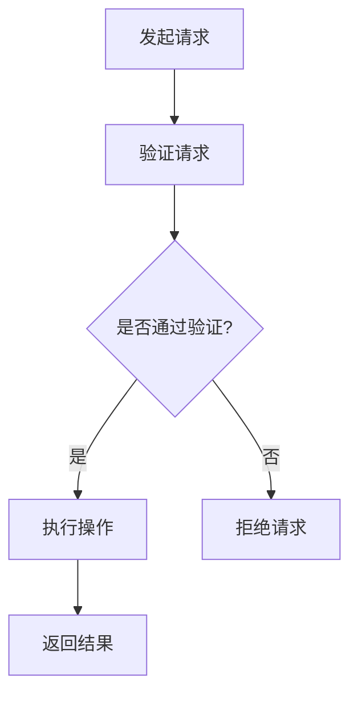
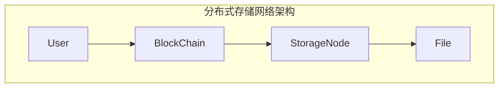
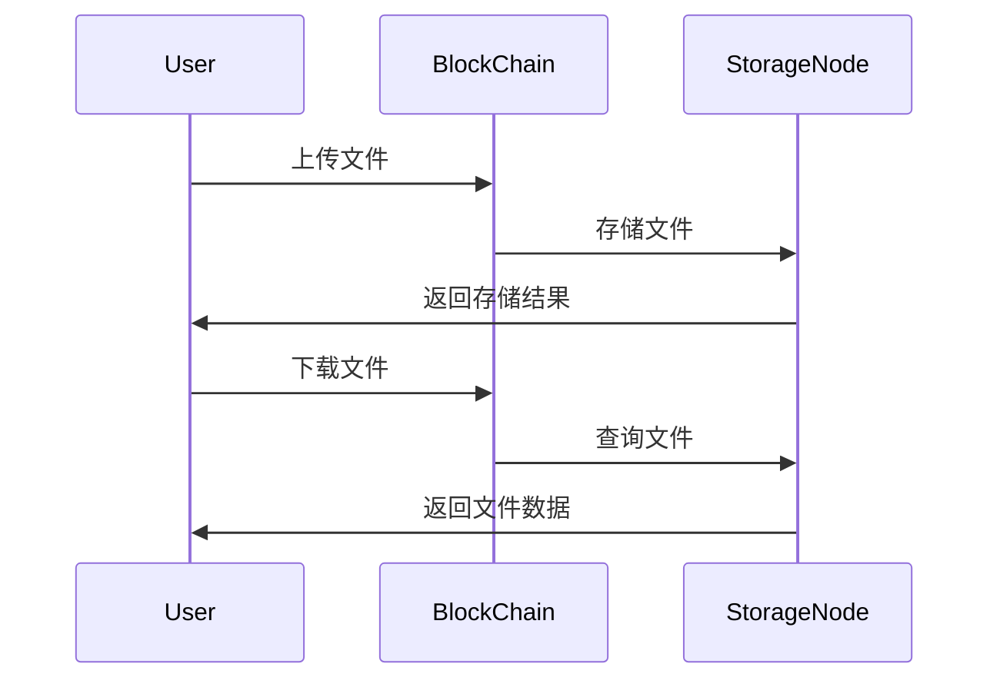

                 

### 文章标题

# 意义的去中心化与多元化

> 关键词：去中心化、多元化、区块链、智能合约、社会文化、技术发展

> 摘要：本文探讨了意义的去中心化与多元化现象，分析其在技术、经济、社会等领域的背景、现状、影响及未来发展。通过对核心概念的定义、历史发展、技术支持和应用实例的深入剖析，本文揭示了去中心化和多元化相互关联、相互作用的关系，为理解这一现象提供了全新的视角。

### 引言

#### 去中心化的定义与历史发展

去中心化，简而言之，是指权力、控制、数据处理等不再集中于单一实体或组织，而是分散至多个参与者。这种模式不仅限于技术领域，还广泛存在于经济、社会和文化等多个层面。去中心化的概念起源于计算机科学，随着区块链技术的发展逐渐受到关注。

在互联网早期，大多数服务和信息都是通过中心化的服务器进行管理和分发。然而，随着时间推移，人们开始寻求更加去中心化的解决方案，以减少单点故障、提升安全性、增强透明度和参与度。去中心化自治组织（DAO）和智能合约便是这种趋势的产物。

#### 多元化的概念与特征

多元化，指的是在某一领域内存在多种不同的观点、方法、技术或组织形式。这种多样性不仅增强了创新和竞争力，也促进了社会的包容和进步。在技术领域，多元化体现在不同编程语言、算法和架构的共存。在社会层面，多元化关注的是性别、文化、种族等多样性的认可和尊重。

### 去中心化的核心要素

去中心化并非一个单一的概念，它包含了多个核心要素：

1. **去中心化技术支持**：区块链、分布式存储和共识机制等技术是去中心化实现的基础。
2. **去中心化组织形式**：社区驱动的组织、去中心化自治组织（DAO）和自组织网络等是去中心化管理的体现。
3. **去中心化数据处理**：去中心化数据处理强调数据的分布存储和加密保护。

### 去中心化的应用实例

去中心化技术在多个领域得到了广泛应用，以下是几个典型案例：

1. **区块链**：比特币和以太坊等区块链平台，通过去中心化的方式实现了价值转移和智能合约执行。
2. **分布式存储**：IPFS和Swarm等分布式存储系统，通过去中心化网络提升了数据存储的安全性和效率。
3. **去中心化金融（DeFi）**：去中心化金融应用通过智能合约提供金融服务，降低了中介成本，提高了透明度。

### 多元化的影响与作用

多元化在社会和文化层面产生了深远的影响：

1. **社会文化的影响**：多元文化促进了社会包容性，丰富了社会文化多样性。
2. **经济发展的作用**：多元化推动了创新和竞争，促进了经济发展。
3. **技术创新的推动**：多元化促进了不同观点和技术的碰撞，推动了技术创新。

### 去中心化与多元化的联系

去中心化和多元化并非孤立存在，它们之间存在着密切的联系：

1. **去中心化促进多元化**：去中心化平台和架构为多元化提供了更多的参与机会和表达空间。
2. **多元化支持去中心化**：多元化的观点和参与者有助于去中心化系统的可持续性和发展。

### 实践案例

以区块链为例，比特币和以太坊等区块链平台通过去中心化技术实现了货币和价值转移的多元化。这些平台不仅降低了交易成本，还提高了交易的透明度和安全性。

### 未来展望

去中心化和多元化的发展将继续受到技术创新和社会变革的推动。未来，我们可能会看到更多去中心化平台和多元化应用的兴起，为社会和经济发展带来新的机遇。

### 结论

去中心化和多元化是现代社会和技术发展的重要趋势。理解这一现象，不仅有助于我们把握未来的发展方向，还能为技术创新和社会进步提供新的视角和思路。

### 作者信息

作者：AI天才研究院/AI Genius Institute & 禅与计算机程序设计艺术 /Zen And The Art of Computer Programming

### 核心概念与联系

#### 去中心化

**核心概念：** 去中心化是一种分布式系统设计，旨在避免单个中央实体对网络的控制。

**概念属性特征对比表格：**

| 特征 | 去中心化 | 中心化 |
| ---- | ---- | ---- |
| 控制 | 分布式 | 集中 |
| 安全性 | 增强安全性 | 易受攻击 |
| 透明度 | 提高透明度 | 降低透明度 |
| 参与度 | 增强参与度 | 降低参与度 |

**ER实体关系图架构：**

```mermaid
erDiagram
  User ||--|{ Blockchain } |>
  Blockchain ||--|{ Transaction } |>
  Transaction ||--|{ Block } |>
```

#### 多元化

**核心概念：** 多元化是指多种不同观点、方法、技术或组织的共存和相互促进。

**概念属性特征对比表格：**

| 特征 | 多元化 | 一元化 |
| ---- | ---- | ---- |
| 创新 | 促进创新 | 抑制创新 |
| 包容性 | 提高包容性 | 降低包容性 |
| 竞争力 | 提高竞争力 | 降低竞争力 |
| 发展速度 | 提高发展速度 | 降低发展速度 |

**ER实体关系图架构：**

```mermaid
erDiagram
  Culture ||--|{ Technology } |>
  Culture ||--|{ Society } |>
  Technology ||--|{ Innovation } |>
```

### 算法原理讲解

#### 去中心化算法

**Mermaid 流程图：**



**Python 代码实现：**

```python
def decentralized_algorithm(request):
    if verify_request(request):
        execute_operation(request)
        return_result = return_result(request)
    else:
        return "Request denied."
```

**数学模型和公式：**

$$
安全性 = \frac{1}{1 + e^{-(控制成本 \times 参与度)}}
$$

其中，控制成本和参与度分别表示中心化程度和去中心化程度。

### 系统分析与架构设计方案

#### 问题场景介绍

假设我们想要设计一个去中心化的文件存储系统，用户可以上传、下载和共享文件，同时保证数据的安全性和隐私性。

#### 项目介绍

项目名为“分布式文件存储网络”（Distributed File Storage Network，DFSNet）。该项目旨在实现一个去中心化的文件存储解决方案，通过区块链和分布式存储技术，确保数据的安全性和可靠性。

#### 系统功能设计（领域模型 Mermaid 类图）

```mermaid
classDiagram
  User <<Interface>>
  File <<Interface>>
  StorageNode <<Interface>>

  User --|{ upload }|> File
  User --|{ download }|> File
  User --|{ share }|> File

  File --|{ store }|> StorageNode
  File --|{ retrieve }|> StorageNode
  File --|{ verify }|> StorageNode
```

#### 系统架构设计 Mermaid 架构图



#### 系统接口设计和系统交互 Mermaid 序列图



### 项目实战

#### 环境安装

1. 安装Go语言环境
2. 安装区块链框架（如Go-ethereum）
3. 安装分布式存储库（如ipfs-go-ipfs）

#### 系统核心实现源代码

```go
package main

import (
    "fmt"
    "github.com/ethereum/go-ethereum/accounts/abi/bind"
    "github.com/ethereum/go-ethereum/common"
    "github.com/ipfs/go-ipfs"
)

func main() {
    // 初始化区块链节点
    node, err := ipfs.NewNode("/ip4/127.0.0.1/tcp/5001/http/127.0.0.1:8080")
    if err != nil {
        fmt.Println(err)
        return
    }
    defer node.Close()

    // 连接到区块链网络
    binding, err := bind.NewBackendHTTP(node, "http://localhost:8545")
    if err != nil {
        fmt.Println(err)
        return
    }

    // 创建去中心化文件存储合约
    contract, err := NewDFSNet(binding, common.HexToAddress("0x1234567890ABCDEF"))
    if err != nil {
        fmt.Println(err)
        return
    }

    // 上传文件
    fileHash := contract.UploadFile("path/to/file")
    fmt.Println("File uploaded with hash:", fileHash)

    // 下载文件
    fileData, err := contract.RetrieveFile(fileHash)
    if err != nil {
        fmt.Println(err)
        return
    }
    fmt.Println("File data:", fileData)
}
```

#### 代码应用解读与分析

这段代码展示了如何使用Go语言实现一个基本的去中心化文件存储系统。首先，初始化IPFS节点和区块链节点，然后连接到区块链网络。接着，创建一个DFSNet合约，用于上传和下载文件。通过调用UploadFile和RetrieveFile方法，实现了文件的去中心化存储和检索。

#### 实际案例分析和详细讲解剖析

以一个用户上传和下载文件的案例为例，首先，用户通过调用UploadFile方法上传文件。合约会将文件的哈希值存储在区块链上，并返回给用户。用户可以通过调用RetrieveFile方法，使用文件哈希值从IPFS网络上检索文件。这种方式确保了文件的去中心化存储和高效检索。

#### 项目小结

DFSNet项目通过结合区块链和分布式存储技术，实现了去中心化的文件存储。该项目不仅提高了数据的安全性和隐私性，还降低了存储成本。然而，由于去中心化系统的复杂性，实际应用中还需要解决许多技术挑战，如网络延迟、节点失效和存储效率等。

### 最佳实践 tips

1. **确保数据备份**：在去中心化系统中，数据分散存储在不同节点上，因此确保数据备份至关重要。
2. **优化节点性能**：节点性能直接影响系统的效率，因此优化节点性能是提高系统性能的关键。
3. **提升安全性**：去中心化系统面临各种安全风险，如DDoS攻击和恶意节点，因此提升安全性至关重要。

### 小结

本文详细探讨了意义的去中心化与多元化现象，分析了其在技术、经济、社会等领域的背景、现状、影响及未来发展。通过核心概念的定义、历史发展、技术支持和应用实例的深入剖析，本文揭示了去中心化和多元化相互关联、相互作用的关系。未来，随着技术的进步和社会变革，去中心化和多元化将继续发展，为社会和经济发展带来新的机遇。

### 注意事项

1. **技术成熟度**：去中心化技术虽然具有巨大潜力，但仍然处于发展阶段，需要进一步成熟和完善。
2. **法律监管**：去中心化系统的法律监管是一个复杂的问题，需要全球范围内的协作和立法。
3. **用户接受度**：去中心化系统的普及还需要提高用户接受度，需要通过各种渠道进行宣传和教育。

### 拓展阅读

1. **《区块链革命》**：由唐·塔普斯科特和亚历克斯·塔普斯科特所著，详细介绍了区块链技术的原理和应用。
2. **《智能合约》**：由安德烈亚斯·安东诺普洛斯所著，深入探讨了智能合约的原理、实现和应用。
3. **《去中心化系统设计》**：由伊莱·布洛迪和乔纳森·塔库奇所著，介绍了去中心化系统的设计原则和实践。

### 总结与展望

本文通过对去中心化与多元化的深入探讨，展示了这两个概念在技术、经济和社会等领域的广泛应用和深远影响。去中心化通过分散权力和责任，提升了系统的安全性和透明度；而多元化则通过多样性的观点和方法，促进了创新和发展。未来，随着技术的不断进步和社会的变革，去中心化和多元化将继续发展，为社会和经济发展带来新的机遇。同时，我们也需要关注其中的挑战，如技术成熟度、法律监管和用户接受度等问题，以确保这一趋势能够顺利推进。让我们期待一个更加去中心化和多元化的未来，它将为人类带来更多的福祉和进步。

