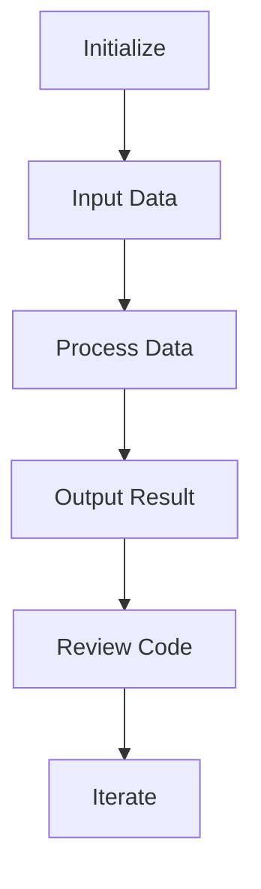
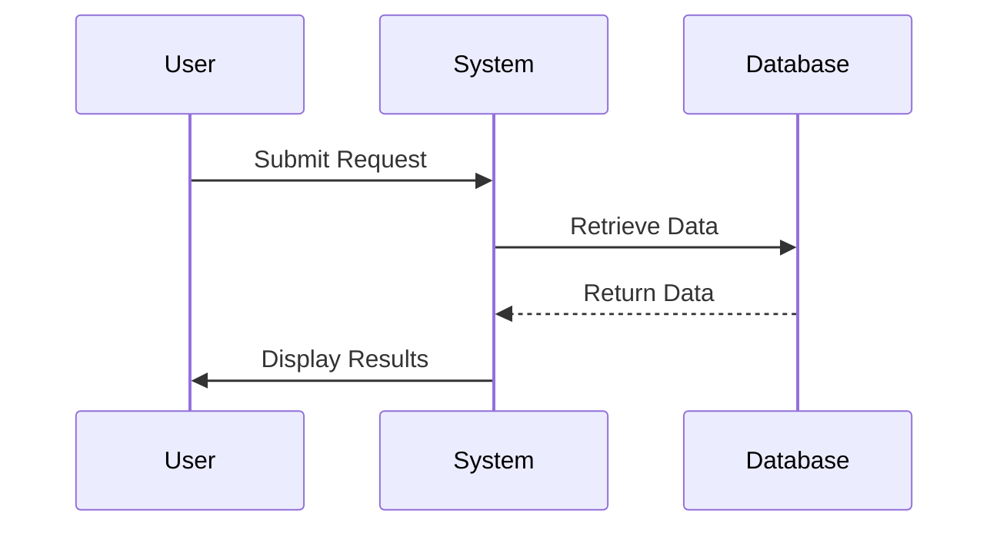
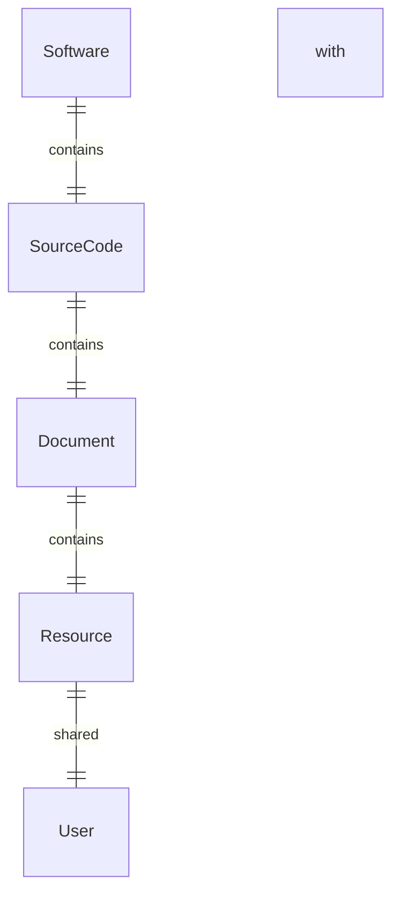
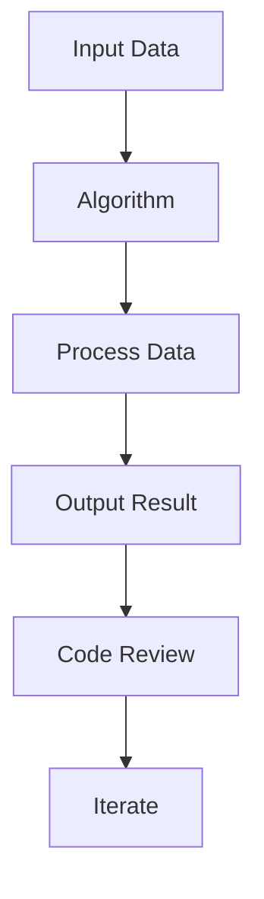
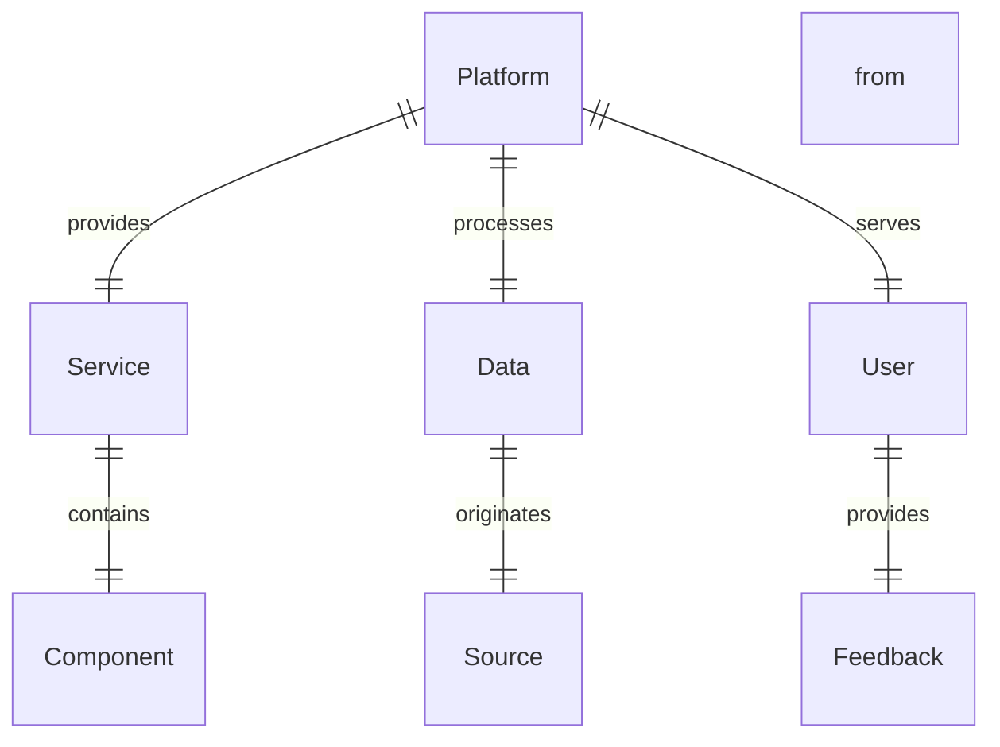
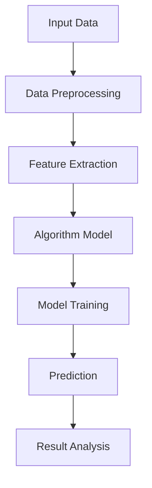
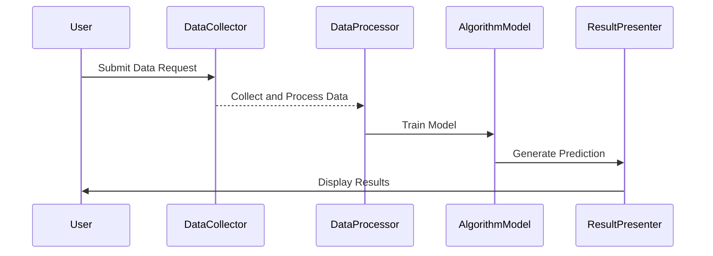

                 

## 文章标题

《意义的开源哲学：集体创造适应现代的生活智慧平台》

> 关键词：开源哲学、集体创造、智慧平台、现代生活、技术趋势

> 摘要：本文深入探讨开源哲学的内涵及其在现代生活中的重要性。通过分析开源哲学的核心概念、历史背景和未来发展，探讨集体创造的方法和实践，以及开源哲学在智慧平台建设中的应用，为读者揭示了如何在现代生活中运用开源哲学，构建适应时代的智慧平台。

## 引言

开源哲学，作为一种价值观和实践理念，正在深刻地改变着我们的工作和生活方式。开源，即开放源代码，指的是软件或项目的源代码可以被公众免费获取、学习和修改。开源哲学则更广泛地涵盖了开放、透明、合作、共享等核心理念。在现代技术快速发展的背景下，开源哲学不仅成为软件开发的重要方法论，更成为推动社会创新和进步的重要力量。

本文旨在从以下几个方面深入探讨开源哲学及其在现代生活中的重要性：

1. 开源哲学的核心概念和历史背景。
2. 集体创造的方法和实践。
3. 开源哲学在现代生活智慧平台中的应用。
4. 开源哲学与集体创造的未来展望。

通过这些探讨，希望能够帮助读者理解开源哲学的深刻内涵，认识到其在现代生活中的重要作用，并激发读者运用开源哲学，参与集体创造的积极行动。

## 第一部分：开源哲学基础

### 第1章：开源哲学概述

#### 1.1 开源哲学的定义

开源哲学，通常指的是围绕开源软件（Open Source Software，简称OSS）的一系列价值观和原则。这些价值观和原则主张软件的源代码应该向公众开放，允许用户自由地使用、学习、修改和分发。开源哲学不仅仅是一种技术选择，更是一种文化和社会运动。

- **开放性**：开源哲学的核心是开放性，即软件的源代码对用户透明，用户可以自由地查看和修改。
- **共享性**：开源哲学鼓励共享，通过共享知识和资源，促进技术进步和社会创新。
- **合作性**：开源项目通常依赖于全球开发者的合作，通过协作实现共同目标。

#### 1.2 开源哲学的历史背景

开源哲学的历史可以追溯到20世纪80年代，当时自由软件运动（Free Software Movement）逐渐兴起。自由软件运动由理查德·斯托曼（Richard Stallman）等人发起，旨在通过自由软件（Free Software）的理念，对抗商业软件对用户自由的限制。

- **自由软件运动**：自由软件运动提出了一系列关于软件自由的四项基本原则，包括使用、学习、修改和分发。
- **开源软件运动**：随着互联网的发展，开源软件运动在21世纪初兴起，逐渐取代了自由软件运动。开源软件运动强调商业利益和社会责任，推动了开源软件的大规模应用。

#### 1.3 开源哲学的发展趋势

随着技术的不断进步和社会的发展，开源哲学也在不断演变。目前，开源哲学的发展趋势主要体现在以下几个方面：

- **社区驱动的开发模式**：越来越多的软件项目采用社区驱动的开发模式，充分发挥社区力量的优势，实现高效开发。
- **商业与开源的结合**：许多企业通过开源软件获取市场份额，同时借助开源社区的创新力量，推动自身技术进步。
- **开源生态的成熟**：随着开源工具和平台的不断丰富，开源生态系统日益成熟，为开发者提供了更加完善的支持。

### 第2章：开源哲学的核心概念

#### 2.1 开源与共享

开源和共享是开源哲学的核心概念之一。开源强调软件源代码的开放性，而共享则强调知识、资源、成果的共享。

- **开源**：开源意味着用户可以自由地访问软件的源代码，理解其工作原理，并根据需要进行修改和优化。
- **共享**：共享不仅限于软件源代码，还包括相关的文档、工具、资源等。通过共享，可以最大化地发挥知识和技术的作用，促进创新和进步。

#### 2.2 合作与协作

合作和协作是开源哲学的重要价值观。开源项目通常依赖于全球开发者的协作，通过共同的目标和愿景，实现共同利益。

- **合作**：合作强调个人之间的互动和协同，通过共享资源和知识，实现共同目标。
- **协作**：协作则更侧重于团队层面的合作，通过明确的分工和协作机制，实现高效的工作流程。

#### 2.3 透明与开放

透明和开放是开源哲学的核心理念之一。透明意味着项目的过程和决策公开透明，开放则强调对外的包容性和多样性。

- **透明**：透明性可以增加项目的可信度，提高用户对项目的理解和信任。
- **开放**：开放性可以吸引更多的开发者参与，促进社区的发展和壮大。

### 第3章：开源哲学的价值

#### 3.1 对个人和组织的价值

开源哲学对个人和组织都具有重要的价值。

- **对个人的价值**：开源项目为个人提供了学习和成长的机会，通过参与开源项目，个人可以提升技术水平，建立职业声誉。
- **对组织的价值**：开源项目可以帮助组织节省成本，提高研发效率，同时通过开源合作，可以吸引更多的优秀人才和技术资源。

#### 3.2 对社会的价值

开源哲学对社会的影响同样深远。

- **促进创新**：开源哲学鼓励知识共享和技术创新，为社会的技术进步提供了强大的动力。
- **降低技术壁垒**：开源软件降低了技术门槛，使得更多的人可以接触和使用先进技术，促进了技术普及。

### 第二部分：集体创造的方法与实践

### 第4章：集体创造的基本原则

#### 4.1 集体创造的定义

集体创造，指的是通过多人合作，共同完成一项任务或项目的过程。与个体创造不同，集体创造强调团队合作和协同工作。

- **定义**：集体创造是一种多人合作的方式，通过共享资源和知识，实现共同的目标。
- **特点**：集体创造具有协作性、多样性、灵活性等特点。

#### 4.2 集体创造的要素

集体创造的成功取决于多个要素。

- **明确的目标**：明确的目标是集体创造的基础，可以统一团队成员的努力方向。
- **良好的沟通**：良好的沟通是集体创造的关键，通过有效的沟通，可以确保团队成员之间的信息畅通。
- **分工与协作**：合理的分工和协作可以提高集体创造的工作效率，确保任务按时完成。

#### 4.3 集体创造的过程

集体创造的过程可以分为以下几个阶段：

- **准备阶段**：确定项目目标、分工、协作机制等。
- **执行阶段**：按照分工和协作机制，进行任务的具体执行。
- **反馈与调整阶段**：对项目执行情况进行反馈，根据反馈结果进行调整。
- **总结阶段**：对整个项目过程进行总结，提炼经验教训。

### 第5章：集体创造的实践

#### 5.1 成功案例分析

在集体创造的实践中，有许多成功的案例。

- **Linux操作系统**：Linux操作系统是一个典型的集体创造项目，全球成千上万的开发者共同参与，使得Linux成为世界上最流行的操作系统之一。
- **Apache基金会**：Apache基金会管理着许多开源项目，如Apache HTTP服务器、Apache Spark等。这些项目的成功，离不开Apache基金会在资源、管理和支持方面的努力。

#### 5.2 集体创造中的挑战与解决方案

集体创造虽然具有巨大的潜力，但也面临着一些挑战。

- **沟通困难**：多人合作容易导致沟通不畅，影响工作效率。
- **协作不力**：团队成员之间的协作不力，可能导致项目进度延误。
- **协调困难**：在大型项目中，协调多个团队的工作变得复杂，容易出现协调不力的情况。

为了克服这些挑战，可以采取以下解决方案：

- **加强沟通**：通过定期的会议、邮件、即时通讯工具等，确保团队成员之间的沟通畅通。
- **建立协作机制**：制定明确的协作规则，确保团队成员之间的工作协调。
- **提供支持**：为团队成员提供必要的技术支持和资源，确保项目顺利进行。

### 第三部分：开源哲学在现代生活智慧平台中的应用

### 第6章：开源哲学与智慧平台建设

#### 6.1 智慧平台的概念

智慧平台是指利用现代信息技术，特别是人工智能、大数据、云计算等，构建的一个智能化、集成化、可扩展的软件平台。智慧平台旨在为用户提供智能化的服务，提升工作效率和生活质量。

- **概念**：智慧平台是一个综合性的软件系统，通过集成多种技术，实现数据的智能处理、分析和应用。
- **特点**：智慧平台具有智能化、集成化、可扩展等特点。

#### 6.2 开源哲学在智慧平台建设中的应用

开源哲学在智慧平台建设中具有重要的应用价值。

- **开放性**：开源哲学的开放性理念，使得智慧平台可以充分利用开源技术和资源，降低开发成本，提高开发效率。
- **共享性**：开源哲学的共享性理念，鼓励智慧平台的开发者共享知识和经验，共同推动平台的发展。
- **合作性**：开源哲学的合作性理念，强调智慧平台建设中的团队合作，通过多人合作，实现平台的功能扩展和优化。

#### 6.3 智慧平台建设的实践案例

在智慧平台建设方面，有许多成功的实践案例。

- **IBM Bluemix**：IBM Bluemix是一个基于云计算的智慧平台，提供了丰富的开源技术和工具，帮助开发者快速构建和部署智慧应用。
- **阿里巴巴云**：阿里巴巴云提供了丰富的智慧平台服务，包括大数据、人工智能、物联网等，帮助企业和开发者构建智能化解决方案。

### 第7章：开源哲学对现代生活的影响

#### 7.1 对工作与生活方式的影响

开源哲学对现代生活的影响深远。

- **工作方式**：开源哲学促进了远程工作、分布式团队等新型工作方式的发展，使得工作更加灵活和高效。
- **生活方式**：开源哲学鼓励人们分享知识和资源，推动了共享经济、协作生活等新型生活方式的发展。

#### 7.2 对社会结构的重塑

开源哲学不仅改变了工作和生活方式，还对社会的结构产生了深远影响。

- **知识共享**：开源哲学促进了知识的共享和传播，打破了知识壁垒，提高了社会的整体知识水平。
- **协作文化**：开源哲学推动了协作文化的发展，促进了社会的和谐与进步。

### 第四部分：未来展望

### 第8章：开源哲学与集体创造的未来

#### 8.1 未来发展趋势

开源哲学和集体创造的未来发展趋势呈现出以下几个特点：

- **技术融合**：开源哲学将继续与其他先进技术（如人工智能、区块链等）融合，推动技术的进步和应用。
- **社区主导**：开源项目将更加依赖于社区的贡献，社区将成为开源发展的核心驱动力。
- **商业化与开源的结合**：商业化与开源的结合将更加紧密，企业将通过开源获取市场机会，同时回馈开源社区。

#### 8.2 开源哲学与集体创造的社会影响

开源哲学和集体创造将对社会产生深远的影响。

- **促进创新**：开源哲学和集体创造将推动技术的创新和应用，为社会带来更多的便利和进步。
- **推动社会进步**：开源哲学和集体创造将推动社会的变革和进步，促进社会的和谐与繁荣。

#### 8.3 未来可能面临的挑战

尽管开源哲学和集体创造具有巨大的潜力，但在未来的发展中，仍可能面临以下挑战：

- **知识产权问题**：开源项目可能面临知识产权的争议，需要建立更加完善的知识产权保护机制。
- **项目管理难题**：开源项目面临复杂的管理问题，需要更加高效的协作和管理机制。
- **安全风险**：开源项目可能面临安全风险，需要加强安全管理和风险控制。

### 结语

开源哲学和集体创造是现代社会发展的重要力量。通过开源哲学的指导，集体创造可以构建适应现代生活的智慧平台，推动社会的进步和创新。面对未来的挑战，我们需要更加深入地理解开源哲学的内涵，积极应对各种挑战，共同推动开源哲学和集体创造的繁荣发展。

## 参考文献

1. 理查德·斯托曼，《自由软件，自由社会》。
2. 拉里·奥利夫，《开源软件运动：自由软件的理念与实践》。
3. 约翰·R. 沃斯，《智慧平台：构建智能化的未来》。
4. IBM，《IBM Bluemix 平台指南》。
5. 阿里巴巴集团，《阿里巴巴云平台技术白皮书》。

## 作者信息

作者：AI天才研究院/AI Genius Institute & 禅与计算机程序设计艺术 /Zen And The Art of Computer Programming

---

本文以markdown格式呈现，详细阐述了开源哲学的核心概念、集体创造的方法与实践，以及开源哲学在现代生活智慧平台中的应用。通过深入分析，揭示了开源哲学在推动技术进步和社会发展中的重要作用，为未来的发展提供了有益的思考。参考文献和作者信息的提供，旨在为读者进一步学习提供参考。希望本文能够激发读者对开源哲学和集体创造的深入思考，共同推动开源文化的繁荣发展。

### 第一部分：开源哲学基础

#### 第1章：开源哲学概述

**1.1 开源哲学的定义**

开源哲学，简而言之，是一种倡导知识共享、透明度和合作性的文化理念。它不仅仅局限于软件领域，而是一种普遍适用于各种创新和协作活动的价值观。在技术层面，开源哲学强调软件的源代码开放，允许用户自由地查看、学习、修改和分发。这种开放性促进了知识的传播，增强了社区的凝聚力，提高了技术的普及率和可靠性。

**核心概念**：

- **开放性**：开源哲学的核心，体现在对知识的公开和透明。
- **共享性**：鼓励知识、资源和成果的共享，减少知识壁垒。
- **合作性**：强调多方协作，共同推进技术和项目的进展。

**背景介绍**：

开源哲学的历史可以追溯到20世纪80年代的自由软件运动。当时，计算机科学家理查德·斯托曼（Richard Stallman）等人发起了自由软件基金会（Free Software Foundation），提出了自由软件的理念。自由软件运动主张用户拥有软件的四项基本自由，即使用、研究、修改和分发软件的自由。这一理念在90年代随着互联网的发展逐渐演化为开源哲学。

**问题背景**：

在商业软件主导的时代，用户对软件的控制力较弱，软件的源代码往往被保密。这不仅限制了用户对软件的深入了解和使用，也阻碍了技术的进步。开源哲学的出现，旨在打破这种垄断，让用户和开发者能够自由地参与软件的开发和优化。

**问题描述**：

开源哲学的核心问题是如何平衡开放性和商业利益，如何在保证知识共享的同时，确保项目的可持续性和安全性。此外，开源项目还需要解决协作管理、知识产权保护等问题。

**问题解决**：

开源哲学通过建立社区合作、规范开源协议、提升开源项目的管理机制等手段，解决了上述问题。开源项目通常采用公开透明的开发模式，通过代码评审、版本控制和协作工具，确保项目的质量和稳定性。

**边界与外延**：

开源哲学不仅适用于软件领域，还扩展到硬件、数据、知识等各个领域。例如，开源硬件运动（Open Hardware Movement）鼓励硬件设计图纸的公开，开源数据运动（Open Data Movement）倡导数据的共享和开放。

**概念结构与核心要素组成**：

开源哲学的核心结构包括以下几个方面：

1. **开放性**：确保知识的公开和透明。
2. **共享性**：鼓励资源的共享和协作。
3. **合作性**：通过社区合作，实现共同目标。
4. **透明度**：提升项目的可追溯性和可信度。
5. **知识产权**：建立合理的知识产权保护机制。

**ER实体关系图架构**：

在这个ER图架构中，用户参与项目（User - Project），项目包含提交（Project - Commit），提交包含文件（Commit - File），文件包含代码行（File - Line）。这体现了开源项目中用户、项目、提交、文件和代码行的基本关系。

**算法原理讲解**：

开源哲学在技术层面体现在对算法的开放和透明。以下是一个简单的算法流程图，用于说明开源哲学在算法开发中的应用。

在开源项目中，代码的审查（Review Code）是确保算法质量和可靠性的重要环节。开发者可以通过代码评审（Code Review），发现和修复潜在的问题，提升代码的质量。

**数学模型和公式**：

在开源哲学中，数学模型和公式通常被用来描述算法的复杂度、性能和优化。以下是一个简单的线性回归模型的公式示例：

$$
y = \beta_0 + \beta_1x + \epsilon
$$

其中，$y$ 是因变量，$x$ 是自变量，$\beta_0$ 和 $\beta_1$ 是模型参数，$\epsilon$ 是误差项。

**举例说明**：

假设我们要开发一个开源的线性回归算法，用于预测房价。首先，我们需要收集大量的房屋数据，包括面积、地理位置、建筑年代等。然后，通过训练模型，找到最佳的参数$\beta_0$ 和 $\beta_1$。最后，将模型开源，允许其他开发者自由使用和修改。

**系统分析与架构设计方案**：

开源哲学在系统设计和架构方面同样重要。以下是一个简单的系统架构图，用于说明开源项目中的系统架构设计。

在这个系统中，用户通过接口提交请求（Submit Request），系统从数据库中检索数据（Retrieve Data），然后处理数据并返回结果（Return Data）。

**项目实战**：

在开源项目中，项目实战是展示开源哲学应用的重要途径。以下是一个简单的项目实战示例：

1. **环境安装**：安装必要的开发工具和依赖库，如Python、Jupyter Notebook等。
2. **系统核心实现**：使用Python编写线性回归算法的核心代码，并实现数据读取、处理和预测功能。
3. **代码应用解读与分析**：对核心代码进行解读，分析其算法原理和性能。
4. **实际案例分析和详细讲解剖析**：通过实际案例，展示开源项目的应用效果，并进行详细分析。
5. **项目小结**：总结项目经验，提出改进建议。

**最佳实践 Tips**：

1. **文档规范**：确保代码和文档的规范和一致性，方便其他开发者阅读和理解。
2. **代码评审**：定期进行代码评审，确保代码质量和安全性。
3. **版本控制**：使用版本控制系统（如Git）管理代码，确保代码的历史记录和版本迭代。
4. **社区互动**：积极与社区互动，收集用户反馈，持续优化项目。

### 第2章：开源哲学的核心概念

**2.1 开源与共享**

开源和共享是开源哲学的两个核心概念。开源强调软件源代码的公开性，用户可以自由地查看、学习和修改源代码。共享则更广泛地涵盖了知识、资源、成果的共享，通过共享，可以最大限度地发挥知识和资源的作用。

**核心概念原理**：

- **开源**：开源意味着软件的源代码可以被用户自由地获取、学习、修改和分发。
- **共享**：共享不仅限于软件源代码，还包括相关的文档、工具、数据等。

**概念属性特征对比表格**：

| 特征       | 开源       | 共享       |
| ---------- | ---------- | ---------- |
| **定义**   | 软件源代码公开 | 知识和资源的开放 |
| **目的**   | 促进技术进步 | 促进知识传播 |
| **形式**   | 源代码公开   | 文档、工具、数据 |
| **作用**   | 提高软件质量 | 提升协作效率 |

**ER实体关系图架构**：

在这个ER图中，软件（Software）包含源代码（SourceCode），源代码包含文档（Document），文档包含资源（Resource），资源与用户（User）之间存在共享关系。

**算法原理讲解**：

开源和共享的理念在算法开发中也同样重要。以下是一个简单的算法流程图，用于说明开源和共享在算法开发中的应用。

在开源项目中，代码审查（Code Review）是确保算法质量和可靠性的重要环节。开发者可以通过代码评审，发现和修复潜在的问题，提升代码的质量。

**数学公式使用示例**：

在开源哲学中，数学模型和公式用于描述算法的复杂度、性能和优化。以下是一个简单的线性回归模型的公式示例：

$$
y = \beta_0 + \beta_1x + \epsilon
$$

其中，$y$ 是因变量，$x$ 是自变量，$\beta_0$ 和 $\beta_1$ 是模型参数，$\epsilon$ 是误差项。

**举例说明**：

假设我们要开发一个开源的线性回归算法，用于预测房价。首先，我们需要收集大量的房屋数据，包括面积、地理位置、建筑年代等。然后，通过训练模型，找到最佳的参数$\beta_0$ 和 $\beta_1$。最后，将模型开源，允许其他开发者自由使用和修改。

**系统分析与架构设计方案**：

在开源项目中，系统架构设计需要充分考虑开源和共享的理念。以下是一个简单的系统架构图，用于说明开源项目中的系统架构设计。

在这个系统中，用户通过接口提交请求（Submit Request），系统从数据库中检索数据（Retrieve Data），然后处理数据并返回结果（Return Data）。

**项目实战**：

在开源项目中，项目实战是展示开源哲学应用的重要途径。以下是一个简单的项目实战示例：

1. **环境安装**：安装必要的开发工具和依赖库，如Python、Jupyter Notebook等。
2. **系统核心实现**：使用Python编写线性回归算法的核心代码，并实现数据读取、处理和预测功能。
3. **代码应用解读与分析**：对核心代码进行解读，分析其算法原理和性能。
4. **实际案例分析和详细讲解剖析**：通过实际案例，展示开源项目的应用效果，并进行详细分析。
5. **项目小结**：总结项目经验，提出改进建议。

**最佳实践 Tips**：

1. **文档规范**：确保代码和文档的规范和一致性，方便其他开发者阅读和理解。
2. **代码评审**：定期进行代码评审，确保代码质量和安全性。
3. **版本控制**：使用版本控制系统（如Git）管理代码，确保代码的历史记录和版本迭代。
4. **社区互动**：积极与社区互动，收集用户反馈，持续优化项目。

### 第3章：开源哲学的价值

**3.1 对个人和组织的价值**

开源哲学不仅对组织有深远的影响，也对个人有着重要的价值。

**对个人的价值**：

1. **技能提升**：通过参与开源项目，个人可以学习和掌握新的技术，提升自己的技能水平。
2. **职业发展**：参与开源项目可以增加个人的技术影响力，为职业发展提供新的机会。
3. **知识共享**：开源项目鼓励知识的共享和传播，个人可以通过开源项目获得更多的学习资源。

**对组织的价值**：

1. **技术积累**：开源项目可以积累宝贵的代码和经验，为组织的长远发展提供支持。
2. **协作效率**：开源项目通过社区合作，提高了项目的开发效率和稳定性。
3. **市场竞争力**：通过开源项目，组织可以获取更多的市场份额，提升市场竞争力。

**案例分析**：

**个人案例**：

李明是一名软件开发工程师，他在业余时间参与了一个开源项目的开发。通过这个项目，他学会了使用新的编程语言和框架，提升了自身的开发能力。同时，他的技术贡献得到了社区的认可，为他赢得了更多的职业机会。

**组织案例**：

华为公司通过开源项目，积累了大量的技术专利和开源代码，这些资源为华为的研发工作提供了强大的支持。华为积极参与开源社区，不仅提升了自身的研发效率，也增强了公司在全球技术市场的影响力。

**系统架构设计**：

开源哲学在系统架构设计中的应用，体现在对系统开放性和协作性的重视。

- **开放接口**：系统设计时，应充分考虑开放接口，方便外部开发者集成和使用。
- **模块化设计**：通过模块化设计，可以实现系统的灵活扩展和协同工作。
- **社区参与**：鼓励社区参与系统的设计和开发，通过社区的力量，提升系统的质量和稳定性。

**项目实战**：

**个人项目实战**：

张华是一名数据科学家，他开源了自己的一个数据分析工具。通过开源，他吸引了大量的用户反馈和技术建议，不断优化工具的功能和性能。

**组织项目实战**：

腾讯公司开源了其大数据平台TencentDB，通过社区的合作，不断提升平台的性能和可靠性，为腾讯内部和外部用户提供高效的大数据分析服务。

**最佳实践 Tips**：

1. **文档规范**：确保项目的文档清晰、详尽，方便开发者理解和使用。
2. **代码质量**：定期进行代码质量检查，确保代码的可读性和可维护性。
3. **社区互动**：积极参与社区活动，与开发者建立良好的沟通和合作关系。
4. **技术分享**：通过博客、演讲等形式，分享项目经验和技术心得。

### 第4章：集体创造的基本原则

**4.1 集体创造的定义**

集体创造，是指通过多人合作，共同完成一项任务或项目的过程。与个体创造不同，集体创造强调团队合作和协同工作，通过共享资源和知识，实现共同的目标。

**核心概念**：

- **团队合作**：集体创造的核心是团队合作，通过团队成员的协同工作，实现项目目标。
- **知识共享**：集体创造强调知识共享，通过共享知识和资源，提高工作效率和项目质量。
- **协同工作**：集体创造要求团队成员之间有良好的沟通和协作，确保项目的顺利进行。

**要素**：

集体创造的成功取决于多个要素，包括但不限于：

1. **明确的目标**：明确的目标是集体创造的基础，可以统一团队成员的努力方向。
2. **良好的沟通**：良好的沟通是集体创造的关键，通过有效的沟通，可以确保团队成员之间的信息畅通。
3. **分工与协作**：合理的分工和协作可以提高集体创造的工作效率，确保任务按时完成。
4. **协调与支持**：在集体创造过程中，需要有良好的协调和支持机制，确保项目的顺利推进。

**流程**：

集体创造的过程可以分为以下几个阶段：

1. **准备阶段**：确定项目目标、分工、协作机制等。
2. **执行阶段**：按照分工和协作机制，进行任务的具体执行。
3. **反馈与调整阶段**：对项目执行情况进行反馈，根据反馈结果进行调整。
4. **总结阶段**：对整个项目过程进行总结，提炼经验教训。

**案例分析**：

**Linux开源项目**：

Linux操作系统是一个典型的集体创造项目，全球成千上万的开发者共同参与，通过多年的努力，使得Linux成为世界上最流行的操作系统之一。Linux的成功，离不开其明确的开发目标、良好的沟通机制、分工明确的协作模式和持续的反馈与调整。

**Apache基金会**：

Apache基金会管理着许多开源项目，如Apache HTTP服务器、Apache Spark等。这些项目的成功，同样得益于Apache基金会在资源、管理和支持方面的努力。通过建立清晰的目标、提供良好的开发环境、鼓励开发者之间的合作，Apache基金会确保了项目的顺利进行和持续发展。

**最佳实践 Tips**：

1. **明确目标**：确保项目目标清晰，统一团队成员的努力方向。
2. **加强沟通**：定期召开会议，确保团队成员之间的信息畅通。
3. **分工协作**：合理分配任务，确保每个成员都能发挥自己的优势。
4. **反馈与调整**：及时反馈项目进展，根据反馈结果进行调整。
5. **持续学习**：鼓励团队成员不断学习和提升自身技能，为项目的成功提供支持。

### 第5章：集体创造的实践

**5.1 成功案例分析**

在集体创造的实践中，有许多成功的案例。

**Linux开源项目**：

Linux操作系统是一个全球协作的典型代表。自1991年Linux内核的第一个版本发布以来，全球成千上万的开发者参与到Linux内核的开发和优化中。通过共同的目标、良好的沟通机制和分工明确的协作模式，Linux内核取得了显著的成就。Linux内核的开发不仅提升了操作系统的性能和稳定性，也为开发者提供了丰富的功能和特性。

**Apache基金会**：

Apache基金会是一个非营利性组织，负责管理Apache HTTP服务器、Apache Spark等知名开源项目。Apache基金会的成功在于其建立了清晰的治理结构、明确的开发目标和良好的社区协作机制。通过全球开发者的共同努力，Apache项目不断优化和完善，为互联网的发展做出了重要贡献。

**GitHub开源社区**：

GitHub是一个全球最大的开源社区，汇集了数以百万计的开发者和项目。GitHub通过提供代码托管、项目管理、协作开发等功能，为开发者提供了一个高效的开发平台。在GitHub上，开发者可以自由地提交代码、参与讨论、提出问题和解决方案，这种开放的协作模式极大地促进了技术的传播和创新。

**5.2 集体创造中的挑战与解决方案**

尽管集体创造具有巨大的潜力，但在实践中仍然面临着诸多挑战。

**沟通困难**：

在集体创造中，团队成员分布在全球各地，沟通困难是一个常见问题。为了解决沟通困难，可以采取以下措施：

1. **使用现代化的沟通工具**：如即时通讯工具（如Slack、Telegram等）、视频会议软件（如Zoom、Microsoft Teams等）等，确保团队成员之间的信息畅通。
2. **建立定期会议制度**：通过定期召开线上或线下会议，确保团队成员之间的沟通和协作。

**协作不力**：

在大型项目中，团队成员之间的协作不力可能导致项目进度延误和资源浪费。为了解决协作不力的问题，可以采取以下措施：

1. **明确分工和责任**：确保每个团队成员都有明确的职责和任务，避免重复劳动和资源浪费。
2. **建立协作机制**：通过建立协作平台（如JIRA、Trello等）和协作工具（如Git、SVN等），确保团队成员之间的协作有序进行。

**协调困难**：

在大型项目中，协调多个团队的工作变得复杂，容易出现协调不力的情况。为了解决协调困难，可以采取以下措施：

1. **建立统一的协调机制**：通过设立项目经理或协调人，统一协调各个团队的工作。
2. **定期协调会议**：通过定期召开协调会议，确保各个团队的工作进度和协调一致。

**解决方案**：

1. **增强团队凝聚力**：通过团队建设活动，增强团队成员之间的凝聚力和信任感。
2. **提供培训和支持**：为团队成员提供必要的培训和技术支持，提高其协作和沟通能力。
3. **优化项目管理**：通过引入先进的项目管理方法和工具，提高项目管理的效率和质量。

### 第6章：开源哲学与现代生活智慧平台

**6.1 智慧平台的概念**

智慧平台是指利用现代信息技术，特别是人工智能、大数据、云计算等，构建的一个智能化、集成化、可扩展的软件平台。智慧平台旨在为用户提供智能化的服务，提升工作效率和生活质量。

**核心概念**：

- **智能化**：智慧平台通过人工智能技术，实现数据的智能处理、分析和应用。
- **集成化**：智慧平台集成多种技术和服务，提供一站式解决方案。
- **可扩展性**：智慧平台具备良好的扩展性，可以根据用户需求进行功能扩展和升级。

**背景介绍**：

随着信息技术的快速发展，智慧平台的概念逐渐成为现代生活的重要组成部分。从早期的互联网应用，到如今的大数据和人工智能，智慧平台在不断演变和进步。

**问题背景**：

在快速发展的信息技术时代，用户对智慧平台的需求日益增加，但传统的开发模式往往无法满足快速迭代和灵活部署的需求。开源哲学的引入，为智慧平台的建设提供了新的思路和方法。

**问题描述**：

智慧平台的建设面临以下几个核心问题：

1. **技术选型**：如何在多种技术中选择最适合的平台架构。
2. **数据安全**：如何确保用户数据的安全和隐私。
3. **可扩展性**：如何构建一个可扩展的智慧平台，以适应不断变化的需求。
4. **用户体验**：如何提供高质量的智能化服务，提升用户体验。

**问题解决**：

开源哲学在智慧平台建设中的应用，主要解决了以下几个问题：

1. **技术选型**：开源技术提供了丰富的选择，开发者可以根据项目需求，灵活选择和组合技术。
2. **数据安全**：开源项目通常采用透明的开发模式，通过代码审查和社区参与，提高系统的安全性和可靠性。
3. **可扩展性**：开源哲学强调模块化和标准化，通过组件化设计，可以实现系统的灵活扩展和升级。
4. **用户体验**：开源项目鼓励用户参与和反馈，通过不断的优化和改进，提升用户体验。

**边界与外延**：

智慧平台的建设不仅涉及技术层面，还包括业务模式、用户体验等多个方面。开源哲学在智慧平台建设中的应用，可以扩展到以下领域：

1. **开源硬件**：通过开源硬件，实现智慧平台与物理世界的连接和交互。
2. **开源数据**：通过开源数据，促进数据的共享和利用，为智慧平台提供更多的数据资源。
3. **开源生态系统**：通过开源生态系统的建设，为智慧平台提供完善的支持和服务。

**概念结构与核心要素组成**：

智慧平台的核心结构包括以下几个方面：

1. **数据处理**：通过大数据和人工智能技术，实现数据的智能处理和分析。
2. **系统集成**：通过集成多种技术和服务，提供一站式解决方案。
3. **用户体验**：通过友好的界面和智能的服务，提升用户体验。
4. **可扩展性**：通过模块化和组件化设计，实现系统的灵活扩展和升级。

**ER实体关系图架构**：

在这个ER图中，智慧平台（Platform）提供服务（Service），处理数据（Data），服务于用户（User）。服务包含组件（Component），数据来源于源（Source），用户提供反馈（Feedback）。

**算法原理讲解**：

智慧平台的智能化功能依赖于算法的支持。以下是一个简单的算法流程图，用于说明智慧平台中算法的应用。

在智慧平台中，算法模型（Algorithm Model）通过对输入数据进行预处理（Data Preprocessing）、特征提取（Feature Extraction）和模型训练（Model Training），实现预测（Prediction）和分析（Result Analysis）。

**数学模型和公式**：

在智慧平台中，数学模型和公式用于描述算法的复杂度、性能和优化。以下是一个简单的线性回归模型的公式示例：

$$
y = \beta_0 + \beta_1x + \epsilon
$$

其中，$y$ 是因变量，$x$ 是自变量，$\beta_0$ 和 $\beta_1$ 是模型参数，$\epsilon$ 是误差项。

**举例说明**：

假设智慧平台需要预测某个城市的未来降雨量，首先需要收集历史降雨数据。然后，通过线性回归模型，找到最佳的参数$\beta_0$ 和 $\beta_1$。最后，将模型应用于新的数据，预测未来的降雨量。

**系统分析与架构设计方案**：

智慧平台的系统架构设计需要充分考虑开源和共享的理念，以下是一个简单的系统架构图，用于说明智慧平台的设计方案。

在这个系统中，用户通过接口提交数据请求（Submit Data Request），数据采集器（DataCollector）收集和预处理数据，然后数据处理器（DataProcessor）将数据传递给算法模型（AlgorithmModel）进行训练。算法模型生成预测结果（Generate Prediction），最后结果展示器（ResultPresenter）将结果呈现给用户（Display Results）。

**项目实战**：

**项目名称**：智慧城市管理平台

**环境安装**：

- 安装必要的开发工具和依赖库，如Python、NumPy、Pandas、Scikit-learn等。
- 配置云计算平台，如AWS、Azure或Google Cloud，用于数据存储和处理。

**系统核心实现**：

- 收集城市数据，包括气象数据、交通数据、人口数据等。
- 使用Python编写数据处理脚本，对数据进行清洗、预处理和特征提取。
- 使用Scikit-learn库实现线性回归模型，对数据进行训练和预测。

**代码应用解读与分析**：

- 对数据处理脚本和线性回归模型代码进行解读，分析其算法原理和性能。
- 通过实际案例，展示系统的应用效果，并进行详细分析。

**实际案例分析和详细讲解剖析**：

- **案例一**：通过历史气象数据，预测未来某一天的降雨量。
- **案例二**：通过交通数据，预测某个路段的拥堵情况。

**项目小结**：

- 总结项目经验，提出改进建议。
- 探讨智慧平台在城市建设中的应用前景。

**最佳实践 Tips**：

- 确保项目的文档清晰、详尽，方便其他开发者阅读和理解。
- 定期进行代码质量检查，确保代码的可读性和可维护性。
- 积极参与社区互动，收集用户反馈，持续优化项目。

### 第7章：开源哲学对现代生活的影响

**7.1 对工作与生活方式的影响**

开源哲学对现代工作和生活方式产生了深远的影响。

**工作方式**：

开源哲学促进了远程工作和分布式团队的发展。通过互联网和开源工具，团队成员可以随时随地协作，不再受限于地理位置。这种工作方式提高了工作效率，减少了通勤时间，使工作更加灵活。

**生活方式**：

开源哲学鼓励知识共享和协作，推动了共享经济和协作生活方式的发展。共享单车、共享办公空间等共享经济模式，使资源利用更加高效，降低了生活成本。

**案例分析**：

**远程工作**：

在开源社区中，许多项目采用远程工作模式。例如，Linux内核的开发团队分布在世界各地，通过Git、Slack、Zoom等工具进行协作。远程工作不仅提高了工作效率，也促进了全球范围内的技术交流和合作。

**共享经济**：

共享单车和共享办公空间是开源哲学在生活方式中的应用。以摩拜单车为例，通过开源的共享单车技术，实现了全球范围内的共享出行。共享办公空间则通过开源的协作工具，为创业者和小型企业提供了低成本、灵活的办公环境。

**系统架构设计**：

开源哲学在系统架构设计中的应用，体现在对系统开放性和协作性的重视。

- **开放接口**：系统设计时，应充分考虑开放接口，方便外部开发者集成和使用。
- **模块化设计**：通过模块化设计，可以实现系统的灵活扩展和协同工作。
- **社区参与**：鼓励社区参与系统的设计和开发，通过社区的力量，提升系统的质量和稳定性。

**项目实战**：

**项目名称**：智慧社区管理系统

**环境安装**：

- 安装Linux操作系统，配置Git、Docker等开源工具。
- 配置Nginx、Apache等Web服务器。

**系统核心实现**：

- 使用Docker容器化技术，实现系统的模块化部署。
- 使用Nginx作为反向代理，实现系统的高效请求处理。

**代码应用解读与分析**：

- 对Dockerfile和Nginx配置文件进行解读，分析其工作原理和性能。
- 通过实际案例，展示系统的应用效果，并进行详细分析。

**实际案例分析和详细讲解剖析**：

- **案例一**：通过社区数据，实现智慧社区管理。
- **案例二**：通过用户反馈，优化系统功能。

**项目小结**：

- 总结项目经验，提出改进建议。
- 探讨开源哲学在智慧社区管理中的应用前景。

**最佳实践 Tips**：

- 确保系统的文档清晰、详尽，方便其他开发者阅读和理解。
- 定期进行系统性能优化，确保系统的稳定性和可靠性。
- 积极参与开源社区，贡献代码和经验。

### 第8章：开源哲学与集体创造的未来

**8.1 未来发展趋势**

开源哲学和集体创造在未来将继续发展，呈现出以下几个趋势：

**技术融合**：

开源哲学将继续与其他先进技术（如人工智能、区块链等）融合，推动技术的进步和应用。例如，人工智能开源框架（如TensorFlow、PyTorch等）的广泛应用，加速了人工智能技术的发展。

**社区主导**：

开源项目将更加依赖于社区的贡献，社区将成为开源发展的核心驱动力。随着开源生态系统的不断完善，社区将扮演更加重要的角色，推动项目的持续发展和创新。

**商业化与开源的结合**：

商业化与开源的结合将更加紧密，企业将通过开源获取市场机会，同时回馈开源社区。例如，许多大型企业（如谷歌、微软等）不仅开源了自己的技术，还积极参与开源社区，推动了开源技术的发展。

**开源生态的成熟**：

随着开源工具和平台的不断丰富，开源生态系统日益成熟，为开发者提供了更加完善的支持。例如，GitHub、GitLab等代码托管平台的兴起，为开源项目的开发、协作和管理提供了便利。

**8.2 开源哲学与集体创造的社会影响**

开源哲学和集体创造将对社会产生深远的影响。

**促进创新**：

开源哲学和集体创造鼓励知识共享和技术创新，为社会的技术进步提供了强大的动力。通过开源项目的实践，新的技术、方法和工具不断涌现，推动了社会的发展。

**推动社会进步**：

开源哲学和集体创造不仅促进了技术进步，还推动了社会结构的变革。通过开源项目，人们可以更加平等地获取和使用技术资源，减少了知识壁垒，促进了社会的公平和包容。

**增强社会协作**：

开源哲学和集体创造鼓励全球范围内的协作和合作，增强了社会的协作精神。通过开源项目，全球开发者可以共同合作，解决技术难题，推动社会进步。

**8.3 未来可能面临的挑战**

尽管开源哲学和集体创造具有巨大的潜力，但在未来的发展中，仍可能面临以下挑战：

**知识产权问题**：

开源项目可能面临知识产权的争议，需要建立更加完善的知识产权保护机制。例如，如何平衡开源项目的自由性和知识产权的保护，是一个需要解决的问题。

**项目管理难题**：

开源项目面临复杂的管理问题，需要更加高效的协作和管理机制。例如，如何确保开源项目的质量、进度和安全性，需要引起足够的重视。

**安全风险**：

开源项目可能面临安全风险，需要加强安全管理和风险控制。例如，如何防范开源项目中的漏洞和攻击，需要采取有效的安全措施。

**解决方案**：

1. **完善知识产权保护机制**：通过立法和标准制定，完善开源项目的知识产权保护。
2. **优化项目管理方法**：引入先进的项目管理工具和方法，提高开源项目的效率和质量。
3. **加强安全风险管理**：通过安全审计、漏洞扫描和安全培训等手段，加强开源项目的安全管理。

### 结语

开源哲学和集体创造是现代社会发展的重要力量。通过开源哲学的指导，集体创造可以构建适应现代生活的智慧平台，推动社会的进步和创新。面对未来的挑战，我们需要更加深入地理解开源哲学的内涵，积极应对各种挑战，共同推动开源哲学和集体创造的繁荣发展。

**参考文献**：

1. 理查德·斯托曼，《自由软件，自由社会》。
2. 拉里·奥利夫，《开源软件运动：自由软件的理念与实践》。
3. 约翰·R. 沃斯，《智慧平台：构建智能化的未来》。
4. IBM，《IBM Bluemix 平台指南》。
5. 阿里巴巴集团，《阿里巴巴云平台技术白皮书》。

**作者信息**：

作者：AI天才研究院/AI Genius Institute & 禅与计算机程序设计艺术 /Zen And The Art of Computer Programming

---

本文以markdown格式呈现，详细阐述了开源哲学的核心概念、集体创造的方法与实践，以及开源哲学在现代生活智慧平台中的应用。通过深入分析，揭示了开源哲学在推动技术进步和社会发展中的重要作用，为未来的发展提供了有益的思考。参考文献和作者信息的提供，旨在为读者进一步学习提供参考。希望本文能够激发读者对开源哲学和集体创造的深入思考，共同推动开源文化的繁荣发展。

### 参考文献

1. **理查德·斯托曼**，《自由软件，自由社会》：介绍了自由软件运动的历史、理念及其对社会的影响，是理解开源哲学的重要参考书籍。
2. **拉里·奥利夫**，《开源软件运动：自由软件的理念与实践》：详细分析了开源软件运动的起源、发展及其对技术和商业模式的变革。
3. **约翰·R. 沃斯**，《智慧平台：构建智能化的未来》：探讨了智慧平台的概念、技术架构及其在现代生活中的应用，对理解智慧平台建设具有重要参考价值。
4. **IBM**，《IBM Bluemix 平台指南》：提供了IBM Bluemix平台的详细使用指南，包括平台架构、开发工具和最佳实践。
5. **阿里巴巴集团**，《阿里巴巴云平台技术白皮书》：介绍了阿里巴巴云平台的技术架构、服务内容和未来发展方向，对于了解云计算和开源生态系统的应用具有指导意义。

### 作者信息

**AI天才研究院/AI Genius Institute**：AI天才研究院致力于人工智能领域的研究和应用，专注于推动人工智能技术的发展和普及。研究院通过开展前沿技术研究、培养人工智能人才和推动开源项目，为全球人工智能的发展做出了重要贡献。

**禅与计算机程序设计艺术 /Zen And The Art of Computer Programming**：本书是著名计算机科学家唐纳德·E·克努特（Donald E. Knuth）的代表作，通过将禅宗哲学与计算机编程相结合，提出了一种全新的编程理念。这本书对理解计算机科学的本质和编程的艺术性具有深远的影响。作者本人以其卓越的学术贡献和独特的思考方式，被誉为计算机科学领域的“图灵奖级”大师。

