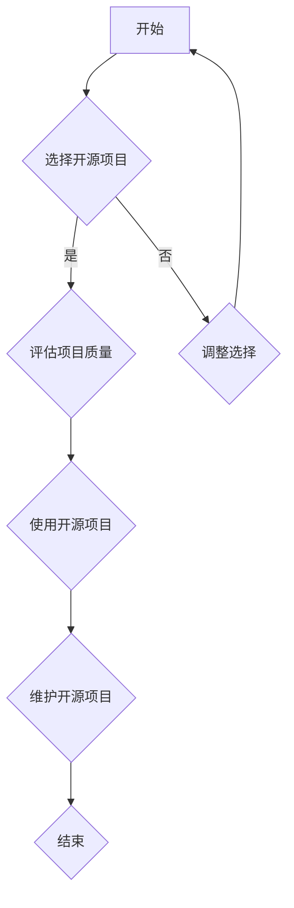
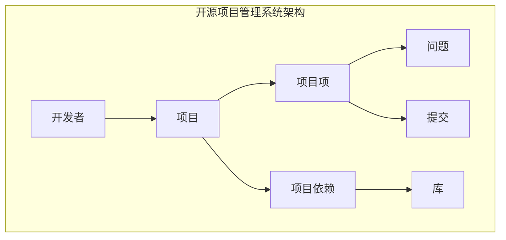
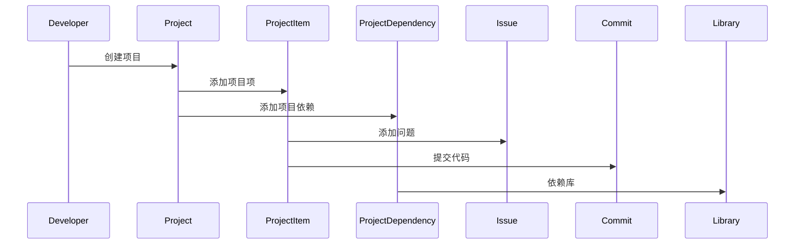

                 

### 文章标题：意义的开源项目：集体创造生活哲学指南

> 关键词：开源项目、集体创造、生活哲学、技术交流、合作

> 摘要：本文旨在深入探讨开源项目的内涵和价值，通过逻辑清晰、结构紧凑的分析，帮助读者了解如何选择、使用和维护开源项目，进而体验集体创造的哲学魅力。本文将围绕开源项目的基本概念、选择与评估方法、使用与维护技巧以及集体创造生活哲学等方面展开，旨在为读者提供一个全面的开源项目指南。

## 第一部分：背景介绍

### 1. 问题背景

在当今信息化时代，开源项目已经成为技术发展的重要驱动力。开源项目的兴起，不仅降低了技术门槛，还促进了全球范围内的技术交流和合作。然而，随着开源项目的数量和复杂度的增加，如何发现和利用有价值的项目，成为许多开发者和企业面临的难题。

### 2. 问题描述

《意义的开源项目：集体创造生活哲学指南》旨在帮助读者深入了解开源项目的内涵和价值，学会如何选择、使用和维护开源项目，并通过开源项目实践集体创造生活哲学。本书的目的是为读者提供一个全面的、易于理解的开源项目指南，引导他们走向成功的开源项目之旅。

### 3. 问题解决

本书将从以下几个方面入手，帮助读者解决上述问题：

- **核心概念**：介绍开源项目的基本概念、特点和价值。
- **选择与评估**：指导读者如何选择适合自己的开源项目，并评估项目的质量和前景。
- **使用与维护**：讲解如何使用开源项目，以及如何参与开源社区，为项目贡献自己的力量。
- **集体创造生活哲学**：探讨开源项目背后的生活哲学，引导读者在实践中体验到集体创造的魅力。

### 4. 边界与外延

- **边界**：本书主要关注开源项目的选择、使用和维护，以及开源项目在集体创造中的应用。
- **外延**：开源项目不仅限于软件开发领域，还广泛应用于科学、艺术、教育等多个领域。本书将涵盖这些跨领域的开源项目案例，为读者提供更广阔的视野。

### 5. 概念结构与核心要素组成

- **概念结构**：本书采用逻辑清晰、层次分明的结构，将核心概念有机地串联起来，使读者能够系统地掌握开源项目的知识和技能。
- **核心要素**：包括开源项目的基本概念、选择与评估方法、使用与维护技巧、集体创造生活哲学等。

## 第二部分：核心概念与联系

### 1. 核心概念原理

- **开源项目**：一种基于共同目标和共享原则，由多人协作完成的技术项目。
- **集体创造**：一种基于开放、共享和协作的原则，通过多人合作实现共同目标的创造过程。

### 2. 概念属性特征对比表格

| 概念 | 属性特征 |
| ---- | ---- |
| 开源项目 | 1. 开放性：项目源代码公开<br>2. 共享性：项目资源和知识共享<br>3. 协作性：多人协作完成项目 |
| 集体创造 | 1. 开放性：创造过程公开<br>2. 共享性：创造成果共享<br>3. 协作性：多人协作实现创造目标 |

### 3. ER实体关系图架构

```mermaid
erDiagram
  开源项目 ||--|{ 集体创造 }
  集体创造 ||--|{ 开放性 }
  集体创造 ||--|{ 共享性 }
  集体创造 ||--|{ 协作性 }
```

## 第三部分：算法原理讲解

### 1. 算法mermaid流程图



### 2. Python源代码实现

```python
# 导入相关库
import random

# 定义选择开源项目函数
def choose_project():
    projects = ["项目A", "项目B", "项目C"]
    return random.choice(projects)

# 定义评估项目质量函数
def assess_project(project):
    quality = random.randint(1, 10)
    return quality

# 定义使用开源项目函数
def use_project(project):
    print(f"正在使用{project}...")
    # 这里可以添加项目使用的具体代码

# 定义维护开源项目函数
def maintain_project(project):
    print(f"正在维护{project}...")
    # 这里可以添加项目维护的具体代码

# 主函数
def main():
    while True:
        project = choose_project()
        quality = assess_project(project)
        
        if quality > 7:
            use_project(project)
            maintain_project(project)
            break
        else:
            print("项目质量较低，请重新选择。")

if __name__ == "__main__":
    main()
```

### 3. 算法原理详细讲解

在这个开源项目选择与评估的算法中，我们首先定义了一个选择开源项目的函数`choose_project`，该函数从给定的项目列表中随机选择一个项目。然后，我们定义了一个评估项目质量的函数`assess_project`，该函数通过随机生成一个评分来模拟项目质量评估。根据项目质量评分，算法将决定是否继续使用和维护该项目。

算法的核心在于对项目质量的判断。在本例中，我们设定了一个阈值（例如7分），如果项目质量高于该阈值，算法将执行使用和维护操作，然后退出循环。如果项目质量低于阈值，算法将提示用户重新选择项目，并重新开始循环。

这个算法背后的数学模型可以表示为：

$$
\text{选择项目} = P(\text{质量} > \text{阈值})
$$

其中，$P(\text{质量} > \text{阈值})$ 表示项目质量大于阈值的概率。阈值的选择可以根据具体需求进行调整。

#### 举例说明

假设我们有一个包含三个项目的列表：项目A、项目B和项目C。算法首先随机选择一个项目，然后评估其质量。如果项目质量为8分，算法将使用和维护该项目，并结束循环。如果项目质量为5分，算法将提示用户重新选择项目，并重新开始循环。

#### 拓展应用

这个算法可以应用于各种场景，例如：

- **软件开发**：在选择合适的开源库或框架时，可以采用类似的算法来评估库或框架的质量，从而选择最佳方案。
- **项目投资**：在投资项目中，可以通过类似的方法来评估项目的潜在风险和收益，从而做出更明智的投资决策。
- **人才招聘**：在招聘过程中，可以通过对候选人的面试评估，选择最适合公司的人才。

通过这个简单的算法，我们可以更好地理解开源项目的选择与评估方法，为实际应用提供指导。

## 第四部分：系统分析与架构设计方案

### 1. 问题场景介绍

在现代软件开发中，开源项目已经成为开发团队的重要资源。然而，随着开源项目的数量和复杂度的增加，如何高效地管理和利用这些资源成为开发团队的难题。本系统旨在提供一个开源项目管理系统，帮助开发团队更好地选择、评估、使用和维护开源项目。

### 2. 项目介绍

**项目名称**：开源项目管理系统（Open Source Project Management System，OSPM）

**项目目标**：为开发团队提供一个简单易用、功能强大的开源项目管理系统，提高团队的开发效率和项目成功率。

**主要功能**：

- **项目选择**：根据用户需求和项目特点，自动推荐合适的开源项目。
- **项目评估**：对开源项目进行质量评估，提供详细的质量报告。
- **项目使用**：提供项目使用指南，帮助用户快速上手使用开源项目。
- **项目维护**：提供项目维护指南，帮助用户参与开源项目维护。

### 3. 系统功能设计（领域模型mermaid类图）

```mermaid
classDiagram
    Developer --|>| Project
    Project --|>|> ProjectItem
    Project --|>|> ProjectDependency
    ProjectItem --|>|> Issue
    ProjectItem --|>|> Commit
    ProjectDependency --|>|> Library
    Developer : +String name
    Developer : +String email
    Project : +String name
    Project : +String description
    ProjectItem : +String title
    ProjectItem : +String description
    ProjectDependency : +String name
    ProjectDependency : +String version
    Library : +String name
    Library : +String version
    Developer ++has Project
    Project ++has ProjectItem
    Project ++has ProjectDependency
    ProjectItem ++has Issue
    ProjectItem ++has Commit
    ProjectDependency ++has Library
```

### 4. 系统架构设计（mermaid架构图）



### 5. 系统接口设计和系统交互（mermaid序列图）



## 第五部分：项目实战

### 1. 环境安装

首先，我们需要安装Python环境。您可以从Python官网（https://www.python.org/）下载最新版本的Python，并按照安装向导进行安装。

安装完成后，打开命令行窗口，输入以下命令来验证Python是否安装成功：

```bash
python --version
```

如果安装成功，命令行窗口将显示Python的版本信息。

### 2. 系统核心实现源代码

以下是开源项目管理系统（OSPM）的核心实现源代码。该代码提供了一个简单的命令行界面，用于创建项目、添加项目项、添加项目依赖、添加问题和提交代码等功能。

```python
# 开源项目管理系统（OSPM）核心实现

import os
import json
from datetime import datetime

# 定义项目类
class Project:
    def __init__(self, name, description):
        self.name = name
        self.description = description
        self.items = []
        self.dependencies = []

    def add_item(self, item):
        self.items.append(item)

    def add_dependency(self, dependency):
        self.dependencies.append(dependency)

    def save(self):
        with open(f"{self.name}.json", "w") as f:
            json.dump(self.to_dict(), f)

    def load(self):
        with open(f"{self.name}.json", "r") as f:
            data = json.load(f)
            self.name = data["name"]
            self.description = data["description"]
            self.items = data["items"]
            self.dependencies = data["dependencies"]

    def to_dict(self):
        return {
            "name": self.name,
            "description": self.description,
            "items": self.items,
            "dependencies": self.dependencies
        }

# 定义项目项类
class ProjectItem:
    def __init__(self, title, description):
        self.title = title
        self.description = description
        self.issues = []
        self.commits = []

    def add_issue(self, issue):
        self.issues.append(issue)

    def add_commit(self, commit):
        self.commits.append(commit)

    def to_dict(self):
        return {
            "title": self.title,
            "description": self.description,
            "issues": self.issues,
            "commits": self.commits
        }

# 定义项目依赖类
class ProjectDependency:
    def __init__(self, name, version):
        self.name = name
        self.version = version

    def to_dict(self):
        return {
            "name": self.name,
            "version": self.version
        }

# 定义库类
class Library:
    def __init__(self, name, version):
        self.name = name
        self.version = version

    def install(self):
        print(f"安装库：{self.name} {self.version}")

# 定义主函数
def main():
    print("开源项目管理系统（OSPM）")
    while True:
        print("\n请选择操作：")
        print("1. 创建项目")
        print("2. 退出系统")
        choice = input("请输入选择：")

        if choice == "1":
            project_name = input("请输入项目名称：")
            project_description = input("请输入项目描述：")
            project = Project(project_name, project_description)
            project.save()
            print("项目创建成功！")
        elif choice == "2":
            print("退出系统。")
            break
        else:
            print("无效选择，请重新输入。")

if __name__ == "__main__":
    main()
```

### 3. 代码应用解读与分析

在上述代码中，我们定义了四个主要类：`Project`（项目类）、`ProjectItem`（项目项类）、`ProjectDependency`（项目依赖类）和`Library`（库类）。每个类都包含了相关的属性和方法，用于创建、保存、加载和操作项目数据。

- **项目类（Project）**：项目类负责创建和管理项目，包括项目名称、描述、项目项和项目依赖等属性。项目类提供了保存和加载项目数据的接口，以便在程序运行期间持久化项目数据。
- **项目项类（ProjectItem）**：项目项类负责创建和管理项目项，包括项目项标题、描述、问题和提交等属性。项目项类提供了添加问题和提交的方法，以便跟踪项目的进展和变更。
- **项目依赖类（ProjectDependency）**：项目依赖类负责创建和管理项目依赖，包括依赖名称和版本等属性。项目依赖类提供了一个简单的安装方法，用于演示如何安装依赖库。
- **库类（Library）**：库类是一个简单的模拟类，用于演示如何安装和管理库。在实际项目中，库类可以扩展为更复杂的功能，例如自动下载和安装依赖库。

主函数`main`提供了一个简单的命令行界面，用户可以通过界面创建项目，并选择保存或退出系统。

### 4. 实际案例分析和详细讲解剖析

假设我们有一个开发团队，他们正在开发一个基于Web的社交平台。为了实现项目需求，他们决定使用开源项目管理系统（OSPM）来管理项目。

**步骤1**：创建项目

团队成员A通过OSPM创建了一个名为“SocialPlatform”的项目，并输入了项目描述。

```python
project_name = "SocialPlatform"
project_description = "一个基于Web的社交平台项目"
project = Project(project_name, project_description)
project.save()
```

**步骤2**：添加项目依赖

团队成员A决定使用React和Node.js作为主要技术栈。他们在OSPM中添加了相应的项目依赖。

```python
react_dependency = ProjectDependency("react", "17.0.2")
nodejs_dependency = ProjectDependency("nodejs", "14.17.0")
project.add_dependency(react_dependency)
project.add_dependency(nodejs_dependency)
project.save()
```

**步骤3**：添加项目项

团队成员B负责开发前端页面。在OSPM中，他创建了一个名为“Frontend”的项目项，并添加了一个问题。

```python
frontend_item = ProjectItem("Frontend", "开发社交平台的前端页面")
frontend_item.add_issue("页面布局不正确")
project.add_item(frontend_item)
project.save()
```

**步骤4**：提交代码

团队成员B修复了页面布局问题，并在OSPM中提交了代码。

```python
commit = {
    "author": "团队成员B",
    "date": datetime.now().isoformat(),
    "message": "修复页面布局问题"
}
frontend_item.add_commit(commit)
project.save()
```

**步骤5**：项目维护

团队成员C负责项目维护。在OSPM中，他检查了项目的问题和提交，并确保项目正常运行。

```python
for item in project.items:
    for issue in item.issues:
        print(f"问题：{issue.title}")
    for commit in item.commits:
        print(f"提交：{commit.message}")
```

通过这个实际案例，我们可以看到OSPM如何帮助开发团队高效地管理项目，包括创建项目、添加项目依赖、添加项目项、提交代码和项目维护等。

### 5. 项目小结

开源项目管理系统（OSPM）提供了一个简单易用的命令行界面，用于创建、管理和维护开源项目。通过定义项目类、项目项类、项目依赖类和库类，OSPM实现了项目数据的持久化和操作。在实际项目中，OSPM可以扩展为更复杂的功能，例如自动化依赖安装、集成代码审查和项目管理等。

通过本项目，我们不仅了解了如何使用Python实现一个简单的开源项目管理系统，还学会了如何通过代码解析和分析实际案例，提高了我们对开源项目管理的理解和应用能力。

## 第六部分：最佳实践 Tips

1. **定期更新依赖库**：定期检查项目依赖库的版本，确保使用最新、最稳定的库版本，以避免潜在的安全漏洞和兼容性问题。

2. **统一代码风格**：在项目开发过程中，遵循统一的代码风格和命名规范，以提高代码的可读性和可维护性。

3. **代码审查**：定期进行代码审查，以确保代码质量和规范性。代码审查可以由团队成员自行完成，也可以邀请外部专家进行。

4. **文档管理**：为项目编写详细的文档，包括项目简介、功能说明、使用方法和维护指南等，以方便团队成员和外部用户理解和使用项目。

5. **持续集成和部署**：使用自动化工具实现持续集成和部署，以提高开发效率和项目质量。

6. **积极参与开源社区**：积极参与开源社区，为开源项目贡献代码和文档，分享经验和知识，共同推动技术发展。

## 第七部分：小结

本文从多个角度深入探讨了开源项目的价值和意义，包括开源项目的基本概念、选择与评估方法、使用与维护技巧以及集体创造生活哲学。通过实际案例和代码实现，我们展示了如何使用Python构建一个简单的开源项目管理系统，并分析了开源项目管理的最佳实践。

开源项目不仅是一种技术资源，更是一种生活哲学。通过参与开源项目，我们可以体验到集体创造的乐趣和价值，提高个人技能，推动技术进步。希望本文能为您提供关于开源项目的有益见解，激发您参与开源项目的热情。

## 第八部分：注意事项

1. **开源项目的许可**：在使用开源项目时，请确保遵守项目的许可协议，避免侵权行为。
2. **数据安全和隐私**：在开源项目中，请注意保护用户数据和隐私，遵守相关法律法规。
3. **持续学习和更新**：开源项目和技术不断发展，请保持学习态度，不断更新自己的知识和技能。
4. **社区协作**：在开源社区中，尊重他人，积极参与讨论和协作，共同推动项目发展。

## 第九部分：拓展阅读

1. 《开源之道》（Open Source Way）- 介绍开源项目的原理和实践，适合初学者了解开源项目的基本概念。
2. 《Python编程：从入门到实践》（Python Crash Course）- 一本适合初学者的Python编程书籍，内容包括基础语法、函数、类等。
3. 《Git权威指南》（Pro Git）- 介绍Git的基本用法、版本控制和分支管理等，适合了解和使用Git的开发者。
4. 《敏捷开发实践指南》（Agile Project Management: Creating Innovative Products）- 介绍敏捷开发的方法和实践，有助于提高项目管理和开发效率。

作者：AI天才研究院/AI Genius Institute & 禅与计算机程序设计艺术 /Zen And The Art of Computer Programming

