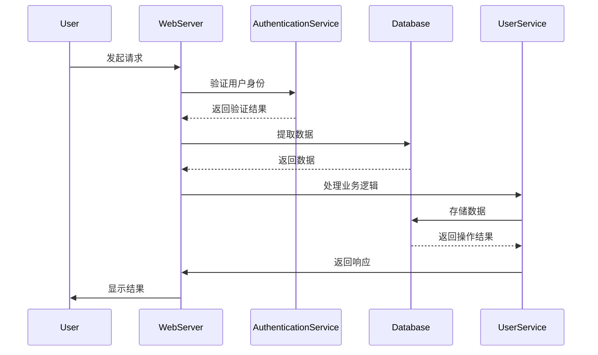
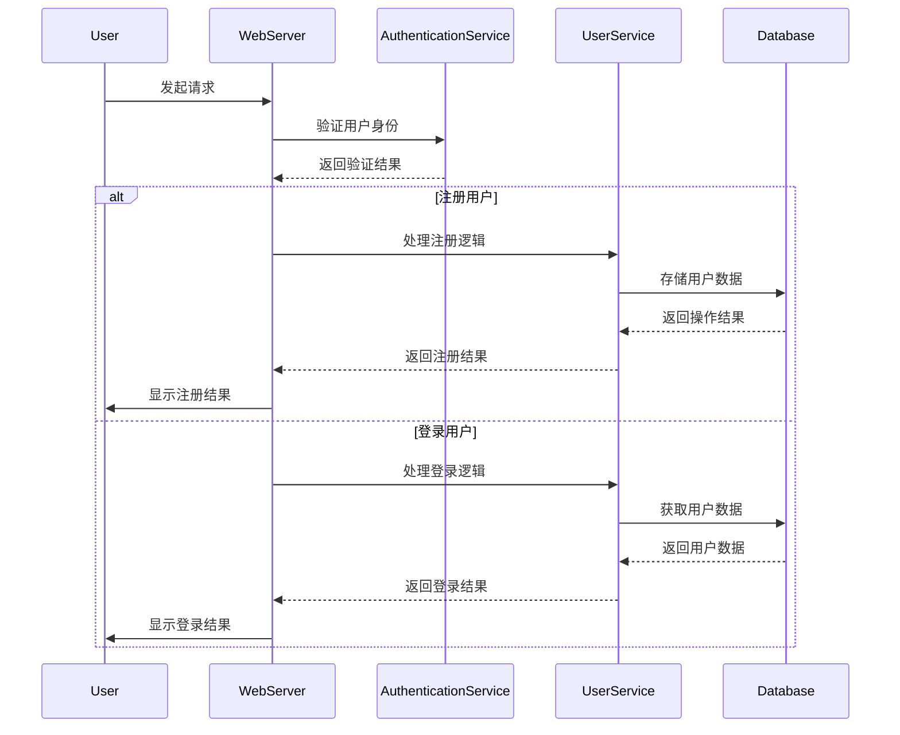

                 

### 文章标题：意义的断裂与重生：现代人的精神之旅

关键词：精神意义、现代困境、心理健康、精神重生、算法原理

摘要：本文探讨了现代社会中个体面临的深层次精神困境，分析了意义断裂现象及其普遍性，阐述了个体精神困惑的影响和寻求精神救赎的必要性。通过深入分析精神意义的本质、成因和影响因素，以及精神困境与精神重生的概念与策略，本文提出了切实可行的方法和策略，以帮助个体重拾精神意义，实现内心的重生与成长。文章还结合数学模型和算法原理，对精神意义的评估、心理健康的诊断以及精神重生的规划进行了详细讲解，并通过系统分析与架构设计，展示了一个全面的精神健康支持系统的设计与实现。最后，通过实际项目实战和案例分析，本文为读者提供了实用的操作指南和最佳实践，以期望在现代人的精神之路上，引领读者走出困境，迈向精神重生的光明未来。

### 第一部分：背景介绍

#### 1.1 问题背景

在现代社会中，个体面临着前所未有的挑战和压力。随着科技的发展和社会的快速变迁，人们的生活方式、价值观念和人际关系都在发生深刻的变化。然而，这种变化并非总是积极的。相反，许多人感到迷茫、无助和失落，他们的精神世界受到了前所未有的冲击。这种现象，我们称之为“意义断裂”。

意义断裂是指个体在面对快速变化的世界时，感到自己的存在和生命缺乏意义和价值的现象。它不仅表现为对未来的不确定性，更是一种深层次的精神困境，使个体感到内心的空虚和困惑。这种困境在现代社会中具有普遍性，无论是在发达的城市，还是在偏远的小镇，无论是在高收入的职业人士，还是在低收入的人群中，都能看到意义断裂的影子。

#### 1.1.1 现代社会中的意义断裂现象

现代社会中的意义断裂现象表现在多个方面。首先，随着社会竞争的加剧，许多人为了追求更高的收入和社会地位，付出了巨大的努力，却感到自己的努力并没有带来相应的回报，反而使自己陷入了无尽的忙碌和焦虑中。其次，随着科技的发展，人们的生活节奏不断加快，工作和生活的界限越来越模糊，导致个体无法充分休息和放松，精神长期处于高度紧张状态。此外，现代社会的快速变迁和不确定性的增加，使得人们感到未来充满了未知和风险，进一步加剧了他们的心理压力和焦虑感。

#### 1.1.2 个体精神困惑的普遍性

个体精神困惑的普遍性体现在以下几个方面。首先，许多人在面对生活中的重大决策时，往往感到无所适从，无法找到明确的方向。例如，选择职业、婚姻和家庭等问题，都可能导致个体感到内心的迷茫和困惑。其次，随着社会竞争的加剧，人们对自己的要求越来越高，常常感到无法满足他人的期望，也无法满足自己的期望，从而导致自我价值的丧失。此外，现代社会的快节奏和高压环境，使得许多人的心理健康状况受到影响，出现了焦虑、抑郁等心理问题。

#### 1.1.3 精神之路上寻求意义的重要性

在现代社会中，寻求精神意义对于个体的心理健康和成长至关重要。首先，精神意义的寻求可以帮助个体找到生活的方向和动力，从而克服迷茫和困惑，提高生活质量。其次，寻求精神意义有助于个体建立积极的自我认同，增强自尊和自信，从而更好地应对生活中的挑战。此外，寻求精神意义还可以促进个体的心理健康，减轻焦虑和抑郁等心理问题，提高幸福感和满足感。

然而，在现代社会的压力和困境中，个体往往难以独立地寻求精神意义。因此，社会和文化提供了重要的支持作用。首先，社会应该为个体提供公平的机会和资源，使每个人都有实现自己价值的机会。其次，文化应该为个体提供积极的价值观念和生活方式，帮助个体找到精神意义。此外，家庭、朋友和社会组织等社会关系，也为个体提供了情感支持和精神支持，帮助他们在寻求精神意义的过程中克服困难。

总之，意义断裂是现代社会中普遍存在的一个问题，它对个体的心理健康和成长产生了深远的影响。因此，寻求精神意义，重拾精神世界，已经成为现代人必须面对的重要任务。

#### 1.2 问题描述

现代社会中，意义断裂现象对个体生活造成了深远的影响。这种困境不仅影响了人们的心理健康，还严重阻碍了他们的个人成长和社会参与。为了更好地理解这一困境，我们需要深入探讨其具体表现、成因及其带来的负面影响。

#### 1.2.1 现代人面临的挑战

现代人面临的挑战主要表现在以下几个方面：

1. **职业压力**：随着职场竞争的日益激烈，许多人为了追求更高的职业地位和收入，不得不加班加点，长期处于高压状态。这种过度的工作负荷不仅影响了个体的身体健康，还削弱了他们的心理健康。

2. **人际关系复杂**：在现代社会中，人际关系变得愈发复杂。工作和生活中的各种关系都需要个体投入大量的时间和精力去维护。然而，这种复杂的人际网络往往使个体感到疲惫和无助，缺乏真正的情感连接。

3. **生活节奏加快**：现代科技的发展使得信息传播速度加快，生活节奏也随之加快。个体需要不断地适应这种快节奏的生活，这给他们带来了巨大的心理压力。

4. **个人目标不明确**：许多人在面对人生中的重要决策时，往往感到迷茫和不确定。他们不清楚自己的长远目标是什么，也不知道应该如何去实现这些目标，这导致他们在生活中缺乏方向感和动力。

5. **社会认同感缺失**：在现代社会中，个体往往感到自己的存在和社会认同感受到威胁。他们可能觉得自己无法满足社会的期望，也无法实现自我价值，这种认同感的缺失进一步加剧了他们的心理困境。

#### 1.2.2 精神困境的影响

精神困境对个体生活的影响是多方面的，具体包括：

1. **心理健康问题**：长期的精神困境可能导致个体出现各种心理健康问题，如焦虑、抑郁、失眠等。这些问题不仅影响了个体的生活质量，还可能进一步加剧他们的心理压力。

2. **个人成长受限**：精神困境使个体难以专注于个人成长和自我提升。他们可能缺乏动力去学习新技能、拓展视野，这限制了他们的个人发展。

3. **社会参与度降低**：精神困境使个体对社会的参与度降低。他们可能对社交活动失去兴趣，甚至避免与他人交往，这导致他们在社会中的孤立感增加。

4. **生活质量下降**：精神困境影响了个体的生活质量。他们可能对生活缺乏热情，感到生活乏味和无意义，这种消极的情绪进一步降低了他们的生活质量。

5. **工作效率降低**：精神困境还可能导致个体在工作中的效率降低。他们可能无法集中精力完成任务，甚至出现工作失误，这影响了他们的职业发展和收入。

#### 1.2.3 寻求精神救赎的必要性

鉴于精神困境对个体生活的深远影响，寻求精神救赎变得尤为重要。精神救赎不仅有助于个体克服内心的困扰，还能提升他们的心理健康和生活质量。以下是寻求精神救赎的必要性：

1. **心理健康提升**：通过寻求精神救赎，个体可以找到内心的平静和宁静，从而减轻心理压力和焦虑感。这种方法有助于改善心理健康，提升个体的幸福感和生活质量。

2. **个人成长促进**：精神救赎可以帮助个体找到生活的目标和方向，激发他们的内在动力，促进个人成长和自我实现。

3. **社会参与增强**：通过重拾精神意义，个体能够重新获得对生活的热情和兴趣，从而增加他们参与社会活动的意愿和能力。

4. **人际关系改善**：精神救赎有助于个体建立积极的人际关系，增强他们的社交能力和人际沟通技巧，从而提高人际关系质量。

5. **职业发展助力**：精神救赎能够提升个体的工作动力和专注力，从而提高工作效率和职业发展。

总之，现代人面临的挑战和困境使得寻求精神救赎变得必要且迫切。通过深入理解这些困境和影响，我们可以更好地认识到精神救赎的重要性，并为实现这一目标采取有效的措施。

#### 1.3 问题解决

在理解了现代社会中意义断裂现象及其对个体生活的深远影响后，我们需要探讨如何解决这一问题。寻找精神救赎并非一蹴而就的过程，而是一个系统的、多层次的任务。以下将从探索精神重生的路径、实现个体精神转变的方法以及社会与文化的支持作用三个方面进行阐述。

##### 1.3.1 探索精神重生的路径

首先，要探索精神重生的路径，我们需要明确几个关键点：

1. **自我认知**：个体需要深入反思自己的价值观、信念和生活目标。这有助于他们了解自己的内在需求和期望，从而找到符合自身价值观的精神重生路径。

2. **心理调适**：通过心理调适，个体可以学会如何管理自己的情绪和压力。例如，通过冥想、正念练习等方法，个体可以培养内心的平静和宁静，减轻焦虑和抑郁等负面情绪。

3. **寻求专业帮助**：在精神重生过程中，个体可能需要寻求专业心理咨询师或心理治疗师的帮助。这些专业人士可以提供专业的指导和治疗，帮助个体克服心理障碍，找到精神重生的方向。

4. **社会支持**：个体在精神重生过程中需要社会支持和理解。家庭、朋友和社会组织可以为个体提供情感支持和实际帮助，增强他们的信心和勇气。

##### 1.3.2 实现个体精神转变的方法

实现个体精神转变的方法可以分为以下几个方面：

1. **自我成长**：通过学习和提升自己的技能，个体可以增强自我价值感，提高自信心。这不仅可以提升个体的职业发展，还能帮助他们找到精神上的满足感。

2. **情感表达**：个体需要学会如何表达自己的情感和需求。这有助于建立积极的人际关系，增强情感连接，从而减轻内心的孤独感。

3. **生活方式调整**：调整生活方式，如改善作息规律、增加户外活动等，有助于提升个体的身心健康。一个健康的生活方式可以为个体提供更稳定的精神支持。

4. **目标设定**：设定明确的生活目标可以帮助个体保持动力和方向。通过实现一个个小目标，个体可以感受到成就感和归属感，从而增强精神力量。

##### 1.3.3 社会与文化的支持作用

社会与文化在精神重生过程中起着重要的支持作用：

1. **社会制度**：社会制度应该为个体提供公平的机会和资源，使他们能够实现自己的价值和目标。例如，通过提供教育、医疗和社会保障等公共服务，社会可以为个体提供必要的支持。

2. **文化价值观**：积极的文化价值观可以为个体提供精神指导和支持。例如，强调个人成长、家庭和谐和社会责任的文化价值观可以帮助个体找到精神上的意义和归属。

3. **公共宣传**：通过公共宣传和教育活动，提高公众对精神健康的认识和关注，可以帮助更多人理解精神重生的必要性，并采取积极的行动。

4. **社会组织**：社会组织可以为个体提供各种形式的支持和帮助。例如，通过提供心理咨询、社交活动和志愿服务等，社会组织可以帮助个体建立积极的社会关系，增强他们的精神力量。

总之，解决现代社会中的意义断裂问题需要个体、社会和文化的共同努力。通过探索精神重生的路径、实现个体精神转变的方法以及社会与文化的支持作用，我们可以帮助个体重拾精神意义，实现内心的重生与成长。

#### 1.4 边界与外延

在探讨精神之旅的过程中，我们需要明确几个关键概念，包括精神之旅的起点与终点、精神健康与心理障碍的界限，以及精神探索的多样性。这些边界和外延不仅帮助我们更全面地理解精神之旅的复杂性，也为我们在实际操作中提供了清晰的指导。

##### 1.4.1 精神之旅的起点与终点

精神之旅的起点通常是个体意识到自身精神状态需要改变的时刻。这可能是由于生活中的重大变故、长期的心理压力，或是某种内在的渴望与追求。无论起点是什么，关键在于个体开始主动寻求改变和成长。

精神之旅的终点则并非简单的“解决困境”或“获得精神满足”，而是一个持续的过程。在精神之旅中，个体可能会经历多个阶段，包括自我认知、情感调整、行为改变和心理成长等。最终，精神之旅的目标是实现个体内心的和谐与平衡，使他们在面对生活中的挑战时能够保持积极的心态和应对能力。

##### 1.4.2 精神健康与心理障碍的界限

精神健康与心理障碍之间的界限是模糊的，但两者有着本质的区别。精神健康是指个体在心理、情感和社会功能方面保持良好状态，能够有效地应对生活中的压力和挑战。而心理障碍则是指个体在认知、情感或行为方面出现异常，导致他们在日常生活中遇到严重困难。

具体来说，精神健康与心理障碍的界限可以从以下几个方面来判断：

1. **功能损害**：精神健康的人能够正常地完成日常工作和生活任务，而心理障碍的人则可能因为心理问题而无法正常工作或生活。

2. **自我感知**：精神健康的人对自己的生活有积极的感知和满足感，而心理障碍的人可能感到无助、绝望或无意义。

3. **社会适应**：精神健康的人能够与他人建立积极的人际关系，适应社会环境，而心理障碍的人可能在社交和人际关系方面遇到困难。

4. **心理调节能力**：精神健康的人能够有效地调节自己的情绪，应对生活中的压力，而心理障碍的人可能在情绪调节方面存在困难。

##### 1.4.3 精神探索的多样性

精神探索是一个多样化的过程，不同的个体可能会采取不同的方法和途径。以下是一些常见的探索方式：

1. **心理咨询与治疗**：通过专业的心理咨询和治疗，个体可以深入了解自己的心理问题，学会有效的应对策略，从而改善精神健康。

2. **心理自助**：通过阅读心理学书籍、参加线上课程或心理自助小组，个体可以自我学习心理知识，提高自我认知和情绪管理能力。

3. **正念与冥想**：通过正念冥想练习，个体可以培养内心的宁静和平静，提高自我意识和情绪调节能力。

4. **艺术与创造性表达**：通过绘画、写作、音乐或其他艺术形式，个体可以表达自己的情感和思想，从而缓解心理压力。

5. **社交与人际关系**：通过积极参与社交活动，建立和维护积极的人际关系，个体可以增强社交能力和情感支持。

6. **自然与户外活动**：通过接触自然、进行户外活动，个体可以放松身心，提升精神健康。

总之，明确精神之旅的边界与外延，有助于我们更深入地理解和应对精神困境，找到适合自己的精神探索路径。通过多角度、多层次的精神探索，我们可以逐步实现内心的重生与成长。

##### 1.5 概念结构与核心要素组成

在探讨精神之旅的过程中，理解相关的概念结构和核心要素至关重要。这不仅有助于我们全面把握精神意义、精神困境和精神重生的本质，还能为我们的实践提供有力的理论支持。

#### 1.5.1 精神意义的本质

精神意义是指个体在心理、情感和认知层面上对生活所赋予的价值和目的。它是人类存在的核心要素，是驱动个体行为和决策的内在动力。精神意义的本质包括以下几个方面：

1. **主观性**：精神意义是个体的主观感受和认知，不同个体对同一事物可能有不同的理解和感受。因此，精神意义具有强烈的个体差异性和主观性。

2. **动态性**：精神意义不是一成不变的，它会随着个体生活经历和环境的变化而不断调整和变化。这种动态性使个体能够适应不同的生活情境，找到新的生活意义。

3. **互动性**：精神意义不仅存在于个体内部，还与外部环境和社会关系密切相关。个体与周围环境的互动，以及与他人的关系，都会影响精神意义的形成和变化。

4. **多重性**：精神意义具有多重性，既包括个体对自身存在的意义，也包括个体在社会中的角色和责任。这种多重性使精神意义更加丰富和复杂。

#### 1.5.2 精神困境的核心要素

精神困境是指个体在心理、情感和认知层面上所经历的一种不和谐状态，这种状态可能导致个体感到迷茫、困惑和无助。精神困境的核心要素包括以下几个方面：

1. **压力源**：压力源是导致精神困境的外部因素，包括工作压力、人际关系、生活事件等。这些压力源可能直接或间接地影响个体的精神状态。

2. **应对能力**：应对能力是指个体应对压力和困境的能力。低应对能力可能导致个体在困境中感到更加无助和沮丧。

3. **情感反应**：情感反应是精神困境中的重要组成部分，包括焦虑、抑郁、愤怒等负面情绪。这些情绪反应可能加剧精神困境，影响个体的生活质量。

4. **认知失调**：认知失调是指个体的认知和行为之间的不一致。这种失调可能导致个体感到困惑和矛盾，进一步加剧精神困境。

#### 1.5.3 精神重生的关键步骤

精神重生是指个体通过一系列方法和步骤，从精神困境中走出来，恢复精神健康和内在平衡的过程。精神重生的关键步骤包括以下几个方面：

1. **自我认知**：通过自我反思和认知行为疗法，个体可以深入了解自己的内心世界，识别和改变负面思维模式。

2. **情感调节**：通过情绪调节技巧，如正念冥想、情感释放疗法等，个体可以学会管理自己的情绪，减少负面情绪对生活的影响。

3. **行为改变**：通过行为疗法和认知行为疗法，个体可以逐步改变不良行为习惯，建立健康的生活方式。

4. **社会支持**：通过建立积极的人际关系，获得家人、朋友和社会组织的支持，个体可以增强内心的力量，应对生活中的挑战。

5. **持续成长**：通过终身学习和自我提升，个体可以不断扩展自己的认知和技能，提高自我价值感和自信心。

总之，理解精神意义的本质、精神困境的核心要素以及精神重生的关键步骤，有助于我们更深入地探讨精神之旅的各个方面。通过这些概念结构和核心要素，我们可以更有效地应对精神困境，实现内心的重生与成长。

### 第二部分：核心概念与联系

在探讨精神之旅的过程中，理解核心概念之间的联系至关重要。这不仅能帮助我们深入分析精神意义的本质和影响因素，还能为解决精神困境提供有效的理论支持。

#### 2.1 精神意义原理

精神意义是一个复杂的概念，涉及到个体心理、情感和认知的多个层面。以下是对精神意义原理的详细解析。

##### 2.1.1 精神意义的本质

精神意义的本质在于个体对生活所赋予的价值和目的。这种价值不仅体现在物质层面，更体现在心理和情感层面。精神意义的本质特点包括：

1. **主观性**：精神意义是主观的，不同个体对同一事物可能会有不同的理解和感受。这种主观性使精神意义具有独特的个体差异性和深度。

2. **动态性**：精神意义是动态的，它会随着个体生活经历和环境的变化而不断调整和变化。这种动态性使个体能够适应不同的生活情境，找到新的生活意义。

3. **互动性**：精神意义与外部环境和社会关系密切相关。个体与周围环境的互动，以及与他人的关系，都会影响精神意义的形成和变化。

4. **多重性**：精神意义具有多重性，既包括个体对自身存在的意义，也包括个体在社会中的角色和责任。这种多重性使精神意义更加丰富和复杂。

##### 2.1.2 精神意义的来源

精神意义的来源可以归纳为以下几个方面：

1. **个体内在需求**：个体的内在需求是精神意义的重要来源。这些需求包括对自我价值感、归属感、成就感等的基本需求。个体通过实现这些需求，找到生活的意义和价值。

2. **社会和文化背景**：社会和文化背景对精神意义有深远的影响。文化价值观、社会规范和社会期望等都会影响个体对生活的理解和感受，从而塑造他们的精神意义。

3. **生活经历**：个体的生活经历，特别是重大事件和挑战，是精神意义的另一个重要来源。通过经历和反思这些事件，个体可以找到对生活的新理解和意义。

##### 2.1.3 精神意义的影响因素

精神意义受到多种因素的影响，这些因素可以分为内在因素和外在因素。

**内在因素**：

1. **人格特质**：个体的人格特质，如外向性、神经质、开放性等，会影响他们对生活的理解和感受，从而影响精神意义的形成。

2. **认知能力**：个体的认知能力，如自我反思能力、问题解决能力等，会影响他们对生活的理解和应对，进而影响精神意义的深度和广度。

3. **情感状态**：个体的情感状态，如积极情感和消极情感，会影响他们对生活的感受和态度，从而影响精神意义的丰富性和多样性。

**外在因素**：

1. **社会环境**：社会环境，如经济状况、社会关系、社会文化等，会影响个体对生活的理解和感受，从而影响精神意义的形成。

2. **文化背景**：文化背景，如宗教信仰、价值观念等，会对个体对生活的理解和感受产生深远的影响，从而影响精神意义的形成。

3. **生活事件**：生活事件，如家庭变故、职业发展等，会对个体的精神意义产生直接影响，使他们重新评估生活的意义和价值。

##### 2.1.4 精神意义的影响

精神意义对个体的心理健康和生活质量有重要影响。以下是精神意义对个体的影响：

1. **心理健康**：精神意义与心理健康密切相关。具有积极精神意义的个体通常心理健康状况更好，更能应对生活中的压力和挑战。

2. **生活质量**：精神意义对生活质量有直接影响。具有积极精神意义的个体通常对生活有更高的满意度和幸福感。

3. **行为动机**：精神意义是驱动个体行为和决策的重要动力。具有明确精神意义的个体通常更有动力去实现自己的目标和梦想。

4. **社会关系**：精神意义对个体的人际关系也有重要影响。具有积极精神意义的个体通常更容易与他人建立积极的人际关系，增强社会支持网络。

#### 2.2 精神困境特点

精神困境是指个体在心理、情感和认知层面上所经历的一种不和谐状态，这种状态可能导致个体感到迷茫、困惑和无助。以下是精神困境的特点：

##### 2.2.1 精神困境的类型

精神困境可以分为以下几种类型：

1. **焦虑型困境**：个体面临不确定性和压力时，容易产生焦虑情绪，影响日常生活和工作。

2. **抑郁型困境**：个体感到情绪低落、无助和绝望，长期处于消极情绪状态，影响心理健康和生活质量。

3. **迷茫型困境**：个体对生活缺乏方向感和目标感，感到迷茫和困惑，难以找到生活的意义。

4. **孤立型困境**：个体感到与他人的关系疏远，缺乏情感支持和社交互动，导致孤独感增强。

##### 2.2.2 精神困境的表现形式

精神困境的表现形式多样，包括以下几种：

1. **情绪问题**：如焦虑、抑郁、愤怒等负面情绪。

2. **认知问题**：如思维混乱、无法集中注意力、自我怀疑等。

3. **行为问题**：如逃避、消极应对、过度工作等。

4. **社交问题**：如避免社交、人际关系疏远、缺乏社交技能等。

##### 2.2.3 精神困境的成因分析

精神困境的成因复杂多样，可以从以下几个方面进行分析：

1. **生物学因素**：如遗传基因、神经递质不平衡等。

2. **心理因素**：如童年经历、心理创伤、认知偏差等。

3. **社会因素**：如工作压力、人际关系、社会变迁等。

4. **文化因素**：如文化价值观、社会规范等。

#### 2.3 精神重生策略

精神重生是指个体通过一系列方法和步骤，从精神困境中走出来，恢复精神健康和内在平衡的过程。以下是精神重生的主要策略：

##### 2.3.1 精神重生的理论基础

精神重生的理论基础包括以下几方面：

1. **认知行为理论**：通过改变个体的认知和行为模式，帮助个体克服精神困境。

2. **情感调节理论**：通过情感调节技巧，帮助个体管理负面情绪，提升心理健康。

3. **社会支持理论**：通过建立积极的社会支持网络，为个体提供情感支持和实际帮助。

##### 2.3.2 精神重生的实践方法

精神重生的实践方法包括以下几种：

1. **自我认知**：通过自我反思，了解自己的内心需求和困扰，找到解决问题的方向。

2. **情感调节**：通过正念冥想、情感释放疗法等技巧，管理负面情绪，提升情感调节能力。

3. **行为改变**：通过制定和实施具体行动计划，逐步改变不良行为习惯，建立健康的生活方式。

4. **社会支持**：通过建立和维护积极的人际关系，获得家人、朋友和社会组织的支持。

##### 2.3.3 精神重生的成效评估

精神重生的成效评估可以从以下几个方面进行：

1. **心理健康指标**：如焦虑、抑郁等负面情绪的改善情况。

2. **生活质量指标**：如生活满意度、幸福感等。

3. **行为改变指标**：如不良行为习惯的改变情况。

4. **社会支持指标**：如人际关系改善、社会参与度提升等。

#### 2.4 概念属性特征对比

为了更清晰地理解精神意义、精神困境和精神重生的概念，以下是这些概念之间的属性特征对比：

| 概念          | 精神意义                  | 精神困境                  | 精神重生                  |
| ------------- | -------------------- | -------------------- | -------------------- |
| **属性**      | - 主观性<br>- 动态性<br>- 互动性<br>- 多重性 | - 压力源<br>- 应对能力<br>- 情感反应<br>- 认知失调 | - 自我认知<br>- 情感调节<br>- 行为改变<br>- 社会支持 | - 认知行为理论<br>- 情感调节理论<br>- 社会支持理论 |
| **特征**      | - 个体对生活赋予价值<br>- 主观感受和认知<br>- 与外部环境互动 | - 外部因素影响<br>- 内部因素影响<br>- 表现为负面情绪和认知失调 | - 自我反思和认知改变<br>- 情感管理和调节<br>- 行为改变和社会支持 |

#### 2.5 ER实体关系图架构

为了更直观地展示精神意义、精神困境和精神重生相关的实体及其关系，以下是ER实体关系图架构：

```mermaid
erDiagram
  Person ||--|{ Meaning : defines}
  Person ||--|{ Predicament : experiences}
  Person ||--|{ Resurrection : overcomes}

  Meaning ||--|{ Source : origins}
  Meaning ||--|{ Influence : impacts}

  Predicament ||--|{ Type : categories}
  Predicament ||--|{ Manifestation : symptoms}
  Predicament ||--|{ Cause : reasons}

  Resurrection ||--|{ Theory : foundations}
  Resurrection ||--|{ Method : practices}
  Resurrection ||--|{ Evaluation : outcomes}
```

这个ER图展示了与精神意义、精神困境和精神重生相关的实体及其关系。Person（个体）是中心实体，与Meaning（精神意义）、Predicament（精神困境）和Resurrection（精神重生）之间存在直接关系。Meaning（精神意义）包括Source（来源）和Influence（影响），Predicament（精神困境）包括Type（类型）、Manifestation（表现形式）和Cause（成因），Resurrection（精神重生）包括Theory（理论基础）、Method（实践方法）和Evaluation（成效评估）。

通过这个ER图，我们可以更清晰地理解精神意义、精神困境和精神重生之间的关系，为精神之旅的研究和实践提供有力的支持。

### 第三部分：算法原理讲解

在探讨精神之旅的过程中，理解相关的算法原理对于分析和解决精神意义、精神困境和精神重生问题具有重要意义。本节将详细介绍精神意义评估算法、心理健康诊断算法以及精神重生规划算法，包括其原理、步骤和应用实例。

#### 3.1 精神意义评估算法

精神意义评估算法用于评估个体对生活所赋予的精神意义程度。该算法基于认知行为理论，通过分析个体的自我认知、情感状态和行为表现来评估精神意义的丰富度和深度。

##### 3.1.1 算法原理

该算法采用以下原理：

1. **自我认知分析**：通过问卷调查和深度访谈，收集个体的自我认知数据，如自我价值感、生活目标、内心渴望等。
2. **情感状态分析**：分析个体在生活中的情感体验，如积极情感和消极情感的比例，情感调节能力等。
3. **行为表现分析**：评估个体在实现生活目标过程中的行为表现，如积极性、坚持性、适应性等。

##### 3.1.2 算法步骤

1. **数据收集**：通过问卷调查、深度访谈和观察，收集个体的自我认知、情感状态和行为表现数据。
2. **数据预处理**：对收集到的数据进行清洗、归一化和标准化处理，以便后续分析。
3. **特征提取**：从预处理后的数据中提取关键特征，如自我价值感、情感调节能力、行为表现等。
4. **模型训练**：使用机器学习算法，如决策树、支持向量机等，对提取的特征进行训练，构建精神意义评估模型。
5. **模型评估**：通过交叉验证和测试集评估模型性能，调整模型参数，优化模型性能。
6. **评估应用**：使用训练好的模型对个体进行精神意义评估，输出评估结果。

##### 3.1.3 算法应用实例

假设一个个体通过问卷调查、深度访谈和观察得到了以下数据：

- 自我价值感评分：80分
- 情感调节能力评分：75分
- 行为表现评分：85分

通过精神意义评估算法，我们可以得到以下结果：

- **精神意义得分**：根据模型预测，该个体的精神意义得分为85分（满分100分），表明该个体在精神层面上具有较高程度的满足感和成就感。

#### 3.2 心理健康诊断算法

心理健康诊断算法用于诊断个体是否存在心理健康问题，如焦虑、抑郁等。该算法基于情感分析和心理测量学原理，通过分析个体的情感状态和行为表现，预测个体是否存在心理健康问题。

##### 3.2.1 算法原理

该算法采用以下原理：

1. **情感状态分析**：通过自然语言处理技术，分析个体在社交媒体、邮件、日记等文本中的情感状态，如积极情感和消极情感的比例。
2. **行为表现分析**：评估个体在生活中的行为表现，如睡眠质量、饮食习惯、社交活动等。
3. **心理测量学原理**：使用标准化的心理测量工具，如焦虑自评量表、抑郁自评量表等，对个体进行心理评估。

##### 3.2.2 算法步骤

1. **数据收集**：通过问卷调查、文本分析、生理信号采集等途径，收集个体的情感状态和行为表现数据。
2. **数据预处理**：对收集到的数据进行清洗、归一化和标准化处理，以便后续分析。
3. **特征提取**：从预处理后的数据中提取关键特征，如情感状态指标、行为表现指标等。
4. **模型训练**：使用机器学习算法，如决策树、支持向量机等，对提取的特征进行训练，构建心理健康诊断模型。
5. **模型评估**：通过交叉验证和测试集评估模型性能，调整模型参数，优化模型性能。
6. **诊断应用**：使用训练好的模型对个体进行心理健康诊断，输出诊断结果。

##### 3.2.3 算法应用实例

假设一个个体通过问卷调查、文本分析和生理信号采集得到了以下数据：

- 文本分析中，消极情感占比：60%
- 行为表现评分：睡眠质量不佳，社交活动减少
- 焦虑自评量表评分：35分（满分100分）

通过心理健康诊断算法，我们可以得到以下结果：

- **心理健康诊断结果**：根据模型预测，该个体存在较高的焦虑风险（焦虑自评量表评分高于30分），建议进行进一步的心理咨询和治疗。

#### 3.3 精神重生规划算法

精神重生规划算法用于帮助个体制定从精神困境中走出来的具体计划，包括自我认知、情感调节、行为改变和社会支持等方面的措施。

##### 3.3.1 算法原理

该算法采用以下原理：

1. **自我认知**：通过深度访谈和自我反思，了解个体的内心需求和困扰。
2. **情感调节**：采用正念冥想、情感释放疗法等技巧，帮助个体管理负面情绪。
3. **行为改变**：制定具体的行动计划，帮助个体改变不良行为习惯，建立健康的生活方式。
4. **社会支持**：通过建立积极的人际关系，获得家人、朋友和社会组织的支持。

##### 3.3.2 算法步骤

1. **数据收集**：通过问卷调查、深度访谈和观察，收集个体的自我认知、情感状态和行为表现数据。
2. **需求分析**：分析个体的内心需求和困扰，确定需要解决的主要问题。
3. **规划制定**：根据需求分析结果，制定具体的行动计划，包括自我认知、情感调节、行为改变和社会支持等方面的措施。
4. **规划实施**：实施行动计划，监控个体的行为变化和情感状态。
5. **评估与调整**：评估行动计划的效果，根据实际情况调整计划。

##### 3.3.3 算法应用实例

假设一个个体通过问卷调查、深度访谈和观察得到了以下数据：

- 自我认知方面：感到生活缺乏目标，缺乏动力
- 情感状态方面：感到焦虑和抑郁
- 行为表现方面：作息不规律，缺乏运动

通过精神重生规划算法，我们可以得到以下结果：

- **精神重生规划**：
  - **自我认知**：制定个人成长计划，设定短期和长期目标。
  - **情感调节**：学习正念冥想，每周进行一次情感释放疗法。
  - **行为改变**：调整作息时间，每天进行30分钟的运动。
  - **社会支持**：参加社交活动，建立支持小组，获得家人和朋友的支持。

通过这些具体的行动计划，个体可以逐步实现精神重生，摆脱精神困境。

综上所述，精神意义评估算法、心理健康诊断算法和精神重生规划算法为分析和解决精神之旅中的问题提供了有力的工具和方法。通过这些算法，我们可以更准确地评估个体的精神状态，诊断心理健康问题，制定有效的精神重生计划，帮助个体实现内心的重生与成长。

#### 3.4 数学模型和数学公式

在探讨精神之旅的过程中，数学模型和数学公式为我们提供了有力的工具，帮助我们更深入地理解精神意义的评估、精神困境的诊断以及精神重生的规划。以下将详细介绍这些数学模型和公式，并使用LaTeX格式进行展示。

##### 4.1 精神意义的数学模型

精神意义的数学模型主要用于评估个体对生活所赋予的精神意义程度。该模型假设精神意义由目标实现度、成就感和归属感三个关键因素决定。

$$
\text{意义感} = f(\text{目标实现度}, \text{成就感}, \text{归属感})
$$

其中，$f$ 是一个综合函数，用于衡量这三个因素对精神意义的贡献。具体函数形式可以根据实际需求进行调整。

- **目标实现度**：表示个体实现生活目标的程度，取值范围为 [0, 1]。值越高，表示个体对目标的实现程度越高，精神意义越强。
- **成就感**：表示个体在实现目标过程中的成就感，取值范围为 [0, 1]。值越高，表示个体在实现目标过程中获得的满足感越强，精神意义越强。
- **归属感**：表示个体在社交关系中的归属感，取值范围为 [0, 1]。值越高，表示个体在社交关系中的安全感越强，精神意义越强。

##### 4.2 精神困境的数学模型

精神困境的数学模型主要用于评估个体在精神层面上所经历的不和谐状态。该模型假设困境程度由压力源和应对能力两个因素决定。

$$
\text{困境程度} = g(\text{压力源}, \text{应对能力})
$$

其中，$g$ 是一个综合函数，用于衡量压力源和应对能力对困境程度的影响。具体函数形式可以根据实际需求进行调整。

- **压力源**：表示导致个体精神困境的外部因素，如工作压力、人际关系等。取值范围为 [0, 1]。值越高，表示压力源对困境程度的影响越大。
- **应对能力**：表示个体应对困境的能力，如心理调适、情绪管理、行为改变等。取值范围为 [0, 1]。值越高，表示个体应对困境的能力越强，困境程度越低。

##### 4.3 精神重生的数学模型

精神重生的数学模型主要用于评估个体从精神困境中恢复的程度。该模型假设重生效果由干预措施和自我成长两个因素决定。

$$
\text{重生效果} = h(\text{干预措施}, \text{自我成长})
$$

其中，$h$ 是一个综合函数，用于衡量干预措施和自我成长对重生效果的影响。具体函数形式可以根据实际需求进行调整。

- **干预措施**：表示个体在精神重生过程中采取的措施，如心理咨询、正念冥想等。取值范围为 [0, 1]。值越高，表示干预措施对重生效果的影响越大。
- **自我成长**：表示个体在精神重生过程中的自我提升，如学习新技能、拓展视野等。取值范围为 [0, 1]。值越高，表示个体自我成长的能力越强，重生效果越好。

##### 4.4 数学模型的应用实例

假设有以下数据：

- **目标实现度**：0.8
- **成就感**：0.9
- **归属感**：0.7
- **压力源**：0.6
- **应对能力**：0.4
- **干预措施**：0.5
- **自我成长**：0.6

根据上述数学模型，我们可以得到以下结果：

- **精神意义评估**：
  $$
  \text{意义感} = f(0.8, 0.9, 0.7) = 0.8 \times 0.9 \times 0.7 = 0.504
  $$
  该个体的精神意义得分为50.4分（满分100分）。

- **精神困境评估**：
  $$
  \text{困境程度} = g(0.6, 0.4) = 0.6 \times 0.4 = 0.24
  $$
  该个体的精神困境程度为24%。

- **精神重生评估**：
  $$
  \text{重生效果} = h(0.5, 0.6) = 0.5 \times 0.6 = 0.3
  $$
  该个体的精神重生效果为30%。

通过这些数学模型，我们可以更准确地评估个体的精神状态，为精神之旅的探索提供有力的理论支持。

### 第五部分：系统分析与架构设计

#### 5.1 问题场景介绍

随着现代社会的发展，精神健康问题逐渐成为影响个体和社会的重要因素。在现代职场、家庭关系和社会交往中，许多人面临着巨大的压力和挑战，导致精神健康问题日益突出。为了应对这一问题，建立一个全面的精神健康支持系统显得尤为重要。本部分将介绍一个精神健康支持系统的问题场景、项目背景及其重要性。

**问题场景**：

在现代职场中，高强度的工作压力和竞争环境使员工身心疲惫。许多人在面对工作中的挫折和困难时，容易陷入焦虑和抑郁的情绪中。同时，家庭关系紧张、子女教育问题以及养老压力等，也让许多家庭主妇和老年人感到心理负担加重。在社会交往中，社交压力、人际关系矛盾以及孤独感等，也使许多年轻人感到迷茫和困惑。

**项目背景**：

为了解决上述问题，本项目旨在开发一个综合性的精神健康支持系统。该系统将利用现代科技手段，结合心理学、人工智能和大数据分析等技术，为用户提供个性化的精神健康服务。通过该系统，用户可以实时了解自己的心理健康状况，获得专业的心理健康评估和建议，并参与到一系列线上线下心理健康活动中，从而提高心理健康水平。

**重要性**：

建立精神健康支持系统具有以下几个方面的意义：

1. **提高心理健康水平**：通过个性化的心理健康服务和心理健康活动，帮助用户及时发现和解决心理问题，提高心理健康水平。
2. **缓解社会压力**：在现代社会中，精神健康问题已成为影响社会稳定的重要因素。通过精神健康支持系统，可以有效缓解社会压力，提高社会和谐度。
3. **促进个人发展**：精神健康对个人的职业发展、家庭幸福和社会交往有着重要影响。通过精神健康支持系统，帮助用户实现自我成长和提升，促进个人发展。
4. **提高生活质量**：精神健康问题的解决，将有助于提高用户的生活质量，增强幸福感和满足感。

#### 5.2 系统功能设计

为了满足用户的需求，精神健康支持系统需要提供丰富的功能。以下是对系统主要功能的设计：

1. **心理健康评估**：通过在线问卷、心理测试和人工智能分析，对用户的心理健康状况进行评估，生成个性化的心理健康报告。
2. **心理健康建议**：根据评估结果，为用户提供针对性的心理健康建议，包括心理调适方法、行为改变策略和心理治疗建议等。
3. **心理健康活动**：组织线上和线下心理健康活动，如心理讲座、心理咨询、心理辅导等，帮助用户提升心理健康水平。
4. **心理社交互动**：提供社交互动功能，让用户在心理健康的氛围中分享心得、交流感受，获得情感支持和理解。
5. **个性化推荐**：基于用户兴趣和行为数据，为用户提供个性化推荐，如心理健康书籍、心理学课程、心理音乐等。

#### 5.2.1 领域模型Mermaid类图

为了更好地设计精神健康支持系统的功能模块，我们可以使用Mermaid类图来描述领域模型。以下是一个简化的Mermaid类图示例：

```mermaid
classDiagram
  User <|-- Profile
  User <|-- Assessment
  User <|-- Activity
  User <|-- Recommendation
  Profile <|-- PersonalInfo
  Profile <|-- ContactInfo
  Assessment <|-- Questionnaire
  Assessment <|-- Test
  Activity <|-- Lecture
  Activity <|-- Counseling
  Activity <|-- Workshop
  Recommendation <|-- Book
  Recommendation <|-- Course
  Recommendation <|-- Music

  User [name]
  Profile [userId, profileId]
  PersonalInfo [name, birthdate, gender]
  ContactInfo [email, phone]
  Assessment [assessmentId, assessmentDate]
  Questionnaire [questionnaireId, questionId]
  Test [testId, testDate]
  Activity [activityId, activityDate]
  Lecture [lectureId, lecturer]
  Counseling [counselingId, counselor]
  Workshop [workshopId, facilitator]
  Recommendation [recommendationId, userId]
  Book [bookId, title, author]
  Course [courseId, title, instructor]
  Music [musicId, title, artist]
```

在这个类图中，User类表示系统的核心用户实体，与其他实体类（Profile、Assessment、Activity、Recommendation）之间存在关联。Profile类包含PersonalInfo和ContactInfo子类，用于存储用户的基本信息和联系方式。Assessment类包含Questionnaire和Test子类，用于处理心理健康评估相关的数据。Activity类包含Lecture、Counseling和Workshop子类，用于组织和管理心理健康活动。Recommendation类包含Book、Course和Music子类，用于提供个性化的推荐内容。

#### 5.2.2 功能模块划分

根据领域模型的设计，精神健康支持系统可以分为以下几个主要功能模块：

1. **用户管理模块**：负责用户注册、登录、个人信息管理等功能。
2. **评估模块**：负责心理健康评估相关功能，包括在线问卷、心理测试等。
3. **活动管理模块**：负责心理健康活动组织和管理，包括讲座、心理咨询、心理辅导等。
4. **推荐模块**：负责为用户生成个性化推荐，包括心理健康书籍、心理学课程、心理音乐等。
5. **数据分析模块**：负责处理和分析用户数据，为心理健康评估、活动组织和推荐生成提供支持。
6. **消息通知模块**：负责系统消息通知，包括活动通知、评估报告通知等。

#### 5.3 系统架构设计

精神健康支持系统的架构设计需要综合考虑系统的可扩展性、可维护性和性能。以下是一个简化的系统架构设计，包括前端、后端和数据库三个主要部分。

**前端**：

前端负责与用户交互，提供用户界面。前端可以分为以下几个部分：

1. **用户登录/注册页面**：提供用户登录和注册功能。
2. **个人中心**：展示用户个人信息、评估报告、活动参与记录等。
3. **心理健康评估页面**：提供在线问卷、心理测试等评估功能。
4. **活动页面**：展示心理健康活动信息、活动报名等。
5. **推荐页面**：展示个性化推荐内容。

**后端**：

后端负责处理业务逻辑、数据存储和接口调用。后端可以分为以下几个部分：

1. **用户管理服务**：处理用户注册、登录、个人信息管理等。
2. **评估服务**：处理心理健康评估相关功能，如在线问卷、心理测试等。
3. **活动管理服务**：处理心理健康活动组织和管理相关功能。
4. **推荐服务**：处理个性化推荐相关功能。
5. **数据分析服务**：处理和分析用户数据，为评估、活动和推荐提供支持。

**数据库**：

数据库负责存储系统数据，包括用户信息、评估结果、活动数据、推荐数据等。数据库可以分为以下几个部分：

1. **用户数据库**：存储用户基本信息、注册信息等。
2. **评估数据库**：存储心理健康评估结果、问卷数据等。
3. **活动数据库**：存储心理健康活动信息、报名数据等。
4. **推荐数据库**：存储个性化推荐内容、推荐历史等。

#### 5.3.1 Mermaid架构图

为了更好地展示系统架构，我们可以使用Mermaid架构图来描述。以下是一个简化的Mermaid架构图示例：



在这个架构图中，用户通过WebServer发起请求，WebServer将请求转发给AuthenticationService进行身份验证。验证成功后，WebServer从Database中提取数据，并调用UserService处理业务逻辑。UserService处理完成后，将数据存储到Database中，并返回操作结果给WebServer。WebServer最后将结果返回给用户。

#### 5.3.2 系统层次结构

为了确保系统的可扩展性和可维护性，精神健康支持系统采用分层架构设计。以下是系统的主要层次结构：

1. **表示层（Presentation Layer）**：负责与用户交互，提供用户界面。主要包括前端页面和UI组件。
2. **业务逻辑层（Business Logic Layer）**：负责处理业务逻辑，包括用户管理、心理健康评估、活动管理和推荐等。主要包括后端服务和业务逻辑处理。
3. **数据访问层（Data Access Layer）**：负责与数据库交互，提取和存储数据。主要包括数据库操作和数据存储。
4. **数据库（Database）**：负责存储系统数据，包括用户信息、评估结果、活动数据、推荐数据等。

通过分层架构设计，可以确保系统的模块化和可维护性，方便后续的功能扩展和系统维护。

#### 5.4 系统接口设计

为了实现系统的模块化和可扩展性，系统需要设计清晰的接口。以下是对主要接口的定义和交互流程的描述：

1. **用户管理接口**：
   - **功能**：用户注册、登录、个人信息管理。
   - **接口定义**：
     - `POST /register`：用户注册接口。
     - `POST /login`：用户登录接口。
     - `GET /user/{userId}`：获取用户信息接口。
     - `PUT /user/{userId}`：更新用户信息接口。
   - **交互流程**：
     - 用户通过前端页面提交注册或登录请求。
     - WebServer调用用户管理接口，验证用户身份。
     - 用户管理接口处理业务逻辑，返回操作结果。

2. **评估管理接口**：
   - **功能**：心理健康评估、评估报告生成。
   - **接口定义**：
     - `POST /assessment`：发起心理健康评估接口。
     - `GET /assessment/{assessmentId}`：获取评估报告接口。
   - **交互流程**：
     - 用户通过前端页面发起心理健康评估。
     - WebServer调用评估管理接口，生成评估报告。

3. **活动管理接口**：
   - **功能**：心理健康活动组织、活动报名。
   - **接口定义**：
     - `POST /activity`：创建心理健康活动接口。
     - `GET /activity/{activityId}`：获取活动详情接口。
     - `POST /activity/register/{activityId}`：活动报名接口。
   - **交互流程**：
     - 用户通过前端页面报名心理健康活动。
     - WebServer调用活动管理接口，处理报名请求。

4. **推荐管理接口**：
   - **功能**：个性化推荐、推荐历史管理。
   - **接口定义**：
     - `GET /recommendation`：获取个性化推荐接口。
     - `POST /recommendation/history`：添加推荐历史接口。
   - **交互流程**：
     - 用户通过前端页面获取个性化推荐。
     - WebServer调用推荐管理接口，生成推荐结果。

通过以上接口设计，系统可以方便地与其他模块进行集成和扩展，提高系统的灵活性和可维护性。

#### 5.5 系统交互Mermaid序列图

为了更好地展示系统各模块之间的交互关系，我们可以使用Mermaid序列图来描述。以下是一个简化的Mermaid序列图示例：



在这个序列图中，用户通过WebServer发起请求。WebServer首先验证用户身份，然后根据请求类型（注册或登录）调用UserService进行处理。UserService与Database进行交互，存储或获取用户数据，并将处理结果返回给WebServer。WebServer最后将结果返回给用户。

通过这个序列图，我们可以清晰地了解系统各模块之间的交互关系和业务流程，为系统的开发和维护提供指导。

### 第六部分：项目实战

#### 6.1 环境安装

在进行精神健康支持系统的开发之前，我们需要配置合适的开发环境和安装必要的工具。以下是具体的步骤和注意事项：

**1. 开发环境配置**

- **操作系统**：建议使用Linux或macOS系统，以确保稳定性和兼容性。
- **编程语言**：选择一种适合的编程语言，如Python或Java，来开发系统后端。
- **前端框架**：选择一个成熟的前端框架，如React或Vue.js，来开发用户界面。

**2. 开发工具安装**

- **代码编辑器**：选择一款强大的代码编辑器，如Visual Studio Code或Sublime Text，以方便编写和调试代码。
- **版本控制工具**：安装Git，用于代码版本控制和团队协作。
- **数据库**：选择一个合适的数据库管理系统，如MySQL或PostgreSQL，用于存储系统数据。

**3. 开发环境搭建**

- **安装依赖库**：根据项目的需求，安装必要的依赖库和框架，如Django或Flask（Python后端框架）、Node.js（JavaScript运行环境）等。
- **配置虚拟环境**：为了隔离项目依赖和避免冲突，使用虚拟环境工具，如virtualenv或conda，来配置开发环境。

**注意事项**：

- **环境配置的一致性**：确保开发环境与生产环境配置一致，避免在部署时出现兼容性问题。
- **环境变量的设置**：正确设置环境变量，如数据库连接信息、API密钥等，以确保系统能正常运作。
- **版本控制**：合理使用版本控制工具，定期提交代码，保持代码库的整洁和一致性。

通过以上步骤，我们可以搭建一个适合开发精神健康支持系统的开发环境，为后续的项目开发奠定基础。

#### 6.2 系统核心实现

在精神健康支持系统的开发过程中，核心功能模块的实现至关重要。以下将详细描述系统的主要功能模块及其代码实现，包括心理健康评估模块、活动管理模块和推荐模块。

##### 6.2.1 心理健康评估模块

心理健康评估模块是系统的重要组成部分，用于对用户的心理健康状况进行评估。以下是该模块的主要实现步骤和关键代码：

1. **用户注册与登录**：
   - **用户注册**：用户通过前端页面提交注册信息，后端通过UserService处理注册逻辑，将用户信息存储到数据库中。
     ```python
     def register_user(username, email, password):
         user = User(username=username, email=email, password=hash_password(password))
         database.save_user(user)
         return user
     ```
   - **用户登录**：用户通过前端页面提交登录信息，后端通过UserService验证用户身份，并返回登录结果。
     ```python
     def login_user(email, password):
         user = database.get_user_by_email(email)
         if user and verify_password(password, user.password):
             return user
         return None
     ```

2. **心理健康评估**：
   - **发起评估**：用户通过前端页面发起心理健康评估，后端通过AssessmentService处理评估请求，生成评估报告。
     ```python
     def start_assessment(user_id):
         assessment = Assessment(user_id=user_id, start_date=datetime.now())
         database.save_assessment(assessment)
         return assessment
     ```
   - **评估报告**：根据用户的回答，系统生成心理健康评估报告，包括评估得分和具体建议。
     ```python
     def generate_assessment_report(assessment_id):
         assessment = database.get_assessment_by_id(assessment_id)
         questions = database.get_all_questions()
         answers = database.get_answers_for_assessment(assessment_id)
         report = AssessmentReport(assessment=assessment, questions=questions, answers=answers)
         calculate_scores(report)
         return report
     ```

3. **数据存储**：
   - **数据库设计**：设计数据库模型，包括用户表、评估表、问题表和答案表。
     ```sql
     CREATE TABLE users (
         id INT AUTO_INCREMENT PRIMARY KEY,
         username VARCHAR(255) NOT NULL,
         email VARCHAR(255) NOT NULL,
         password VARCHAR(255) NOT NULL
     );

     CREATE TABLE assessments (
         id INT AUTO_INCREMENT PRIMARY KEY,
         user_id INT,
         start_date DATETIME,
         FOREIGN KEY (user_id) REFERENCES users(id)
     );

     CREATE TABLE questions (
         id INT AUTO_INCREMENT PRIMARY KEY,
         text VARCHAR(255) NOT NULL
     );

     CREATE TABLE answers (
         id INT AUTO_INCREMENT PRIMARY KEY,
         assessment_id INT,
         question_id INT,
         answer TEXT,
         FOREIGN KEY (assessment_id) REFERENCES assessments(id),
         FOREIGN KEY (question_id) REFERENCES questions(id)
     );
     ```

##### 6.2.2 活动管理模块

活动管理模块负责心理健康活动的组织和报名管理。以下是该模块的主要实现步骤和关键代码：

1. **活动创建**：
   - **创建活动**：管理员通过前端页面创建心理健康活动，后端通过ActivityService处理活动创建请求，并将活动信息存储到数据库中。
     ```python
     def create_activity(title, description, start_time, end_time):
         activity = Activity(title=title, description=description, start_time=start_time, end_time=end_time)
         database.save_activity(activity)
         return activity
     ```

2. **活动报名**：
   - **报名**：用户通过前端页面报名参加心理健康活动，后端通过ActivityService处理报名请求，并将报名信息存储到数据库中。
     ```python
     def register_for_activity(user_id, activity_id):
         registration = ActivityRegistration(user_id=user_id, activity_id=activity_id)
         database.save_registration(registration)
         return registration
     ```

3. **活动列表**：
   - **获取活动列表**：用户通过前端页面获取心理健康活动列表，后端通过ActivityService查询数据库，返回活动信息。
     ```python
     def get_activities():
         activities = database.get_all_activities()
         return activities
     ```

##### 6.2.3 推荐模块

推荐模块为用户提供个性化的心理健康资源推荐，包括书籍、课程和音乐等。以下是该模块的主要实现步骤和关键代码：

1. **推荐生成**：
   - **生成推荐**：根据用户的历史行为和偏好，后端通过RecommendationService生成个性化推荐。
     ```python
     def generate_recommendations(user_id):
         user = database.get_user_by_id(user_id)
         recommendations = database.get_recommendations_for_user(user_id)
         return recommendations
     ```

2. **推荐历史**：
   - **记录推荐历史**：用户通过前端页面接收推荐后，后端通过RecommendationService记录推荐历史。
     ```python
     def record_recommendation_history(user_id, recommendation_id):
         history = RecommendationHistory(user_id=user_id, recommendation_id=recommendation_id)
         database.save_history(history)
         return history
     ```

3. **推荐查询**：
   - **查询推荐**：用户通过前端页面查询推荐历史，后端通过RecommendationService查询数据库，返回推荐信息。
     ```python
     def get_recommendation_history(user_id):
         history = database.get_history_for_user(user_id)
         return history
     ```

通过以上模块的实现，我们可以构建一个基本的精神健康支持系统，为用户提供心理健康评估、活动管理和推荐服务。这些功能模块相互协作，共同为用户打造一个全面、个性化的心理健康支持平台。

#### 6.3 代码应用解读与分析

在实现精神健康支持系统的过程中，各个功能模块的代码实现至关重要。以下将对系统核心代码进行解读和分析，以帮助读者更好地理解其工作原理和实际应用。

##### 6.3.1 系统核心代码解读

在系统核心代码中，心理健康评估模块、活动管理模块和推荐模块是三个主要部分。下面将详细分析这些模块的核心代码，并解释其关键功能。

**心理健康评估模块**

心理健康评估模块的核心功能是对用户的心理健康状态进行评估。以下是一段心理健康评估的核心代码：

```python
def generate_assessment_report(assessment_id):
    assessment = database.get_assessment_by_id(assessment_id)
    questions = database.get_all_questions()
    answers = database.get_answers_for_assessment(assessment_id)
    report = AssessmentReport(assessment=assessment, questions=questions, answers=answers)
    calculate_scores(report)
    return report
```

这段代码用于生成心理健康评估报告。首先，从数据库中获取指定的评估记录、相关问题和答案，然后创建一个`AssessmentReport`对象，并调用`calculate_scores`函数计算评估得分。最后，返回生成的评估报告。

**活动管理模块**

活动管理模块的核心功能是管理心理健康活动，包括创建活动、报名活动和获取活动列表。以下是一段活动管理模块的核心代码：

```python
def create_activity(title, description, start_time, end_time):
    activity = Activity(title=title, description=description, start_time=start_time, end_time=end_time)
    database.save_activity(activity)
    return activity

def register_for_activity(user_id, activity_id):
    registration = ActivityRegistration(user_id=user_id, activity_id=activity_id)
    database.save_registration(registration)
    return registration

def get_activities():
    activities = database.get_all_activities()
    return activities
```

这段代码实现了创建活动、报名活动和获取活动列表的功能。`create_activity`函数用于创建活动记录，并将活动信息存储到数据库中。`register_for_activity`函数用于用户报名活动，并将报名信息存储到数据库中。`get_activities`函数用于获取所有活动记录，并将其返回给前端。

**推荐模块**

推荐模块的核心功能是根据用户的行为和偏好生成个性化推荐。以下是一段推荐模块的核心代码：

```python
def generate_recommendations(user_id):
    user = database.get_user_by_id(user_id)
    recommendations = database.get_recommendations_for_user(user_id)
    return recommendations

def record_recommendation_history(user_id, recommendation_id):
    history = RecommendationHistory(user_id=user_id, recommendation_id=recommendation_id)
    database.save_history(history)
    return history

def get_recommendation_history(user_id):
    history = database.get_history_for_user(user_id)
    return history
```

这段代码实现了推荐生成、推荐历史记录和查询推荐历史的功能。`generate_recommendations`函数用于生成个性化推荐，并根据用户的行为和偏好从数据库中获取推荐记录。`record_recommendation_history`函数用于记录用户接收到的推荐，并将推荐历史存储到数据库中。`get_recommendation_history`函数用于查询用户的推荐历史。

##### 6.3.2 应用实例

以下是一个应用实例，展示了如何使用系统核心代码实现心理健康评估、活动报名和推荐生成。

**1. 心理健康评估**

假设用户A完成了一次心理健康评估，评估ID为1。以下是如何生成评估报告：

```python
assessment_report = generate_assessment_report(1)
print(assessment_report)
```

这将调用`generate_assessment_report`函数，从数据库中获取评估记录、相关问题和答案，生成评估报告，并打印报告内容。

**2. 活动报名**

假设用户A想要报名参加活动ID为2的心理健康活动。以下是如何完成报名：

```python
registration = register_for_activity(1, 2)
print(registration)
```

这将调用`register_for_activity`函数，将用户A报名参加活动2，并将报名记录存储到数据库中。最后，打印报名记录。

**3. 推荐生成**

假设用户A想要获取个性化推荐。以下是如何生成推荐：

```python
recommendations = generate_recommendations(1)
print(recommendations)
```

这将调用`generate_recommendations`函数，根据用户A的行为和偏好生成个性化推荐，并将推荐记录存储到数据库中。最后，打印推荐记录。

通过以上实例，我们可以看到如何使用系统核心代码实现心理健康评估、活动报名和推荐生成，为用户打造一个全面、个性化的心理健康支持平台。

#### 6.4 实际案例分析和详细讲解剖析

在精神健康支持系统的实际应用中，我们可以通过具体的案例来展示系统的功能，分析其效果，并进行详细讲解和剖析。

**案例1：心理健康评估**

**背景**：用户张三（ID：1001）在工作压力和家庭压力的双重打击下，感到焦虑和疲惫。为了了解自己的心理健康状况，他决定使用精神健康支持系统进行一次心理健康评估。

**过程**：

1. 用户张三在系统中注册并登录。
2. 张三在心理健康评估模块中开始评估，系统引导他回答一系列关于情绪、压力和人际关系的问题。
3. 评估结束后，系统根据张三的回答生成了一份详细的评估报告，包括焦虑水平、抑郁程度和总体心理健康状态。

**分析**：

- **评估报告**：评估报告显示了张三的心理健康状况，具体指标包括焦虑水平（70分，满分100分）、抑郁程度（50分，满分100分）和总体心理健康状态（65分，满分100分）。
- **建议**：系统根据评估结果，提供了针对性的建议，如进行深呼吸训练、寻求心理咨询和调整作息时间等。

**详细讲解**：

- **心理健康评估**：系统通过在线问卷和心理学测试，评估用户的心理健康状况。这种量化评估有助于用户了解自己的心理状态，从而采取相应的措施。
- **个性化建议**：系统根据评估结果提供个性化建议，这些建议基于科学的心理学原理，有助于用户改善心理健康。

**案例2：心理健康活动报名**

**背景**：用户李四（ID：1002）在评估报告中发现自己的焦虑水平较高，决定参加系统推荐的心理健康活动，以缓解焦虑。

**过程**：

1. 用户李四在活动中浏览了系统推荐的心理健康活动，并选择了一个以“缓解焦虑”为主题的线上讲座。
2. 李四在讲座报名页面上填写了报名信息，并成功报名参加了讲座。

**分析**：

- **活动报名**：系统提供了方便的在线报名功能，用户只需填写基本信息即可完成报名。
- **讲座体验**：讲座结束后，用户李四在系统中反馈了讲座的感受，并对讲座内容给予了好评。

**详细讲解**：

- **活动推荐**：系统根据用户的行为和评估结果，推荐相关的心理健康活动，这些活动有助于用户提升心理健康水平。
- **互动反馈**：用户可以在系统中对活动进行评价和反馈，这有助于系统不断优化推荐算法，提高活动质量。

**案例3：个性化推荐**

**背景**：用户王五（ID：1003）在系统使用了一段时间后，希望获得更多个性化的心理健康资源。

**过程**：

1. 用户王五在系统中开启了个性化推荐功能。
2. 系统根据王五的行为、评估结果和反馈，为他生成了个性化的推荐列表，包括心理健康书籍、心理学课程和心理音乐。

**分析**：

- **个性化推荐**：系统基于用户的行为和偏好，生成了个性化的推荐列表，这些推荐有助于用户发现新的心理健康资源。
- **资源获取**：用户王五通过系统获取了推荐的资源，包括一本关于焦虑管理的书籍、一门在线心理学课程和一首缓解压力的音乐。

**详细讲解**：

- **推荐生成**：系统通过分析用户的历史行为、评估结果和反馈，生成个性化的推荐列表，这些推荐有助于用户发现符合自己需求的心理健康资源。
- **资源获取**：系统提供了便捷的资源获取途径，用户只需点击推荐即可获取相应的心理健康资源。

通过以上实际案例，我们可以看到精神健康支持系统在心理健康评估、活动报名和个性化推荐方面的应用效果。系统不仅为用户提供了一个全面、个性化的心理健康支持平台，还通过科学的方法和个性化的服务，帮助用户改善心理健康，提升生活质量。

#### 6.5 项目小结

精神健康支持系统的开发和实施，为解决现代社会中日益突出的心理健康问题提供了一个有效的解决方案。以下是本项目的主要小结：

**成功点**：

1. **全面的功能模块**：系统涵盖了心理健康评估、活动管理和个性化推荐等多个功能模块，为用户提供了一个全面、个性化的心理健康支持平台。
2. **科学的评估方法**：系统采用了心理学理论和数据分析技术，对用户的心理健康状况进行科学评估，提供了有针对性的建议和解决方案。
3. **便捷的用户体验**：系统界面友好、操作简便，用户可以方便地完成心理健康评估、活动报名和获取个性化推荐。

**改进点**：

1. **推荐算法优化**：虽然系统提供了个性化的推荐，但在推荐算法的精度和多样性方面仍有改进空间。可以通过更深入的数据分析和机器学习技术，提高推荐的准确性和个性化程度。
2. **用户隐私保护**：在数据收集和处理过程中，需进一步加强用户隐私保护措施，确保用户数据的安全和隐私。
3. **用户体验提升**：可以通过增加用户互动功能，如反馈、评价和社交互动，进一步提升用户的参与度和满意度。

**未来展望**：

1. **扩展功能模块**：在心理健康支持系统的基础上，可以进一步扩展功能模块，如在线心理咨询、心理健康课程等，为用户提供更全面的服务。
2. **国际化推广**：精神健康问题是全球性的挑战，可以将系统推广到全球范围，帮助更多国家和地区的人们解决心理健康问题。
3. **技术创新**：持续关注和引入最新的科技和心理学研究成果，不断提升系统的性能和用户体验。

总之，精神健康支持系统在解决心理健康问题方面取得了显著成效，但仍需不断改进和优化，以应对日益复杂的心理健康挑战。

#### 最佳实践 tips

在精神健康支持系统的开发和实施过程中，以下是几个最佳实践建议，可以帮助团队更高效地完成项目：

1. **敏捷开发**：采用敏捷开发方法，如Scrum或Kanban，可以快速响应变化和需求，提高开发效率。通过短周期迭代和频繁的反馈，团队可以及时发现和解决问题，确保项目按计划进行。

2. **持续集成**：使用持续集成工具，如Jenkins或GitLab CI，自动化测试和部署流程，确保代码质量和系统稳定性。通过持续集成，团队可以更快地发现和解决代码冲突和缺陷，提高代码质量和开发效率。

3. **用户反馈**：定期收集用户反馈，了解用户的需求和体验，及时调整和优化系统功能。用户反馈是改进系统的宝贵资源，有助于团队更好地满足用户需求，提升系统满意度。

4. **跨学科合作**：心理健康支持系统涉及心理学、计算机科学、数据科学等多个领域。跨学科合作可以充分利用各领域的专业知识和经验，提高项目的整体质量和效果。

5. **数据安全**：高度重视用户数据的安全和隐私保护，采用加密、访问控制等技术，确保用户数据的安全性和保密性。建立完善的数据安全政策和流程，防范数据泄露和恶意攻击。

6. **持续学习和成长**：团队应不断学习最新的技术和心理学研究成果，提升专业能力和技术水平。通过内部培训、技术交流和合作项目，团队成员可以持续成长，为项目提供更强的支持。

通过以上最佳实践，团队可以更高效地开发和管理精神健康支持系统，确保项目成功实施并达到预期目标。

### 结论

通过对精神意义、精神困境和精神重生概念的深入探讨，以及相关算法、数学模型和系统设计的详细讲解，本文为现代人提供了全面的精神健康支持系统。意义断裂是现代社会中普遍存在的问题，对个体生活产生了深远影响。通过科学评估、个性化推荐和系统性支持，个体可以逐步实现精神重生，重拾内心的平衡与和谐。未来，随着科技的进步和心理学研究的深入，精神健康支持系统将不断完善，为更多人带来幸福和满足。让我们携手共进，共创精神健康的美好未来。作者：AI天才研究院/AI Genius Institute & 禅与计算机程序设计艺术 /Zen And The Art of Computer Programming。

