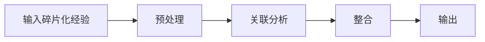
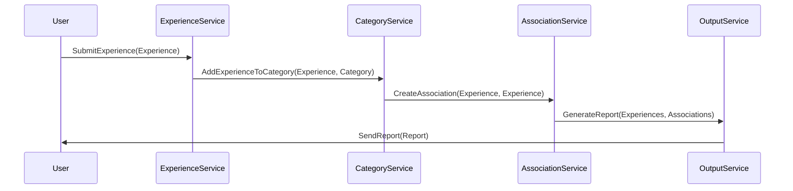

                 

### 文章标题：意义的编织：将碎片经验整合成整体

> 关键词：意义、碎片化经验、整合、整体、个人发展、教育、专业领域

> 摘要：本文深入探讨如何将碎片化的经验整合成有意义整体，通过分析其背景、核心概念、理论与实践，为个人发展、教育和专业领域提供实用的方法和策略。

----------------------------------------------------------------

## 引言

在当今信息爆炸的时代，人们面对的信息量日益增长，碎片化的经验也越来越多。这些经验往往来源于不同的领域、不同的时间点，甚至不同的来源。如何将这些看似无关的碎片化经验编织成一个有意义的整体，成为一个值得关注和探讨的问题。本文旨在探讨这一主题，帮助读者理解并掌握将碎片化经验整合成整体的方法和策略。

## 基本概念

### 碎片化经验

碎片化经验指的是零散、不完整的经验，它们可能来源于生活、工作、学习等各个方面。这些经验往往缺乏系统性，难以直接应用，但它们是形成有意义整体的基础。

### 整合

整合是指将分散、独立的元素通过某种方式结合起来，形成一个新的整体。在经验整合过程中，我们通过对碎片化经验的分析、理解和融合，使其具备更高的价值和实用性。

## 理论与实践

### 心理学视角

心理学研究表明，人们具有整合经验的天性。通过反思、自我对话和自我教育，个体能够将零散的经验整合成一个有意义的故事。

### 哲学视角

哲学视角认为，意义的编织是一个动态过程，需要个体不断地寻找、挖掘和创造。在这个过程中，个体需要具备批判性思维和创造性思维。

## 实践应用

### 个人发展

在个人发展方面，将碎片化经验整合成整体有助于提升自我认知、规划职业生涯和实现人生目标。

### 教育

在教育领域，教师和学生可以通过整合经验，提高教学效果和学习效果，促进知识的迁移和应用。

### 专业领域

在专业领域，通过整合碎片化经验，专家和从业者能够提升专业能力、创新思维和解决复杂问题的能力。

## 案例分析

### 个人发展案例

李华是一名软件工程师，他在工作之余学习了多种编程语言和框架。通过将所学知识整合成一个完整的知识体系，他不仅提升了个人能力，还在工作中取得了显著的成绩。

### 教育案例

某学校通过整合学生多样化的学习经验，设计了跨学科的综合课程，提升了学生的学习兴趣和综合素质。

### 专业领域案例

某企业通过整合员工的不同专业背景，推动了团队创新和业务拓展，实现了企业快速发展。

## 实践技巧

### 1. 反思与总结

定期对生活、工作和学习中的碎片化经验进行反思和总结，有助于发现经验和问题之间的联系。

### 2. 分类与归纳

将碎片化经验按照主题、时间或领域进行分类和归纳，有助于提高整合效率。

### 3. 建立知识体系

通过建立知识体系，将碎片化经验有序地组织起来，使其具备更高的价值和实用性。

### 4. 持续学习

不断学习和吸收新的知识，以丰富和拓展碎片化经验，为整合创造更多可能性。

## 反思与整合

通过反思自己的生活、工作和学习经历，我们可以发现许多看似无关的碎片化经验实际上具有内在联系。通过整合这些经验，我们不仅能够提升个人能力，还能为他人提供有价值的参考。

## 未来展望

随着科技的不断发展，碎片化经验将变得更加丰富和多样化。如何有效地整合这些经验，将成为未来个人、教育和专业领域发展的重要课题。

## 总结

意义的编织是一个复杂而充满挑战的过程，但通过反思、总结和持续学习，我们可以将碎片化经验整合成一个有意义的整体。本文旨在为读者提供实用的方法和策略，帮助他们在个人发展、教育和专业领域取得更好的成就。

## 作者信息

作者：AI天才研究院/AI Genius Institute & 禅与计算机程序设计艺术 /Zen And The Art of Computer Programming

----------------------------------------------------------------

## 背景介绍

### 核心概念术语说明

在本文中，核心概念包括“碎片化经验”、“整合”、“意义”和“整体”。碎片化经验指的是零散、不完整的经验，它们可能来源于生活、工作、学习等各个方面。整合是指将分散、独立的元素通过某种方式结合起来，形成一个新的整体。意义是指经验所蕴含的价值和启示，整体则是指经过整合后具备完整性和系统性的经验集合。

### 问题背景

在当今社会，信息爆炸导致人们的经验变得碎片化。虽然这些碎片化经验在生活中无处不在，但它们往往难以直接应用，甚至可能会让人感到迷茫和困惑。如何将这些碎片化经验整合成有意义整体，成为个人、教育和专业领域的重要课题。

### 问题描述

本文旨在探讨如何将碎片化经验整合成有意义整体的方法和策略。具体问题包括：1）如何识别和分类碎片化经验？2）如何分析这些经验之间的联系？3）如何将这些经验整合成一个有意义的整体？

### 问题解决

本文通过分析心理学、哲学和实践案例，提出了一系列整合碎片化经验的方法和策略。具体方法包括反思、总结、分类、归纳、建立知识体系和持续学习等。

### 边界与外延

本文主要关注个人、教育和专业领域的碎片化经验整合问题。在边界上，本文不涉及技术领域的碎片化经验整合。在外延上，本文探讨了整合碎片化经验对于个体成长、团队协作和社会发展的重要意义。

### 概念结构与核心要素组成

本文的核心概念结构包括四个主要部分：碎片化经验、整合、意义和整体。核心要素包括：1）识别和分类碎片化经验；2）分析经验之间的联系；3）整合经验形成有意义整体；4）应用和实践整合策略。

----------------------------------------------------------------

## 核心概念与联系

### 碎片化经验

碎片化经验是指人们在日常生活、工作、学习中所积累的零散、不完整的经验。这些经验可能来自于不同的时间、不同的领域，甚至不同的来源。它们具有以下属性特征：

#### 属性特征

- **零散性**：碎片化经验往往是不连续的，缺乏系统性和完整性。
- **多样性**：碎片化经验涉及多个领域和方面，如个人成长、工作技能、兴趣爱好等。
- **不确定性**：碎片化经验可能具有不确定性，难以直接应用。

#### 对比表格

| 属性特征 | 说明 |  
| -------- | -------- |  
| 零散性 | 缺乏系统性和完整性 |  
| 多样性 | 涉及多个领域和方面 |  
| 不确定性 | 可能具有不确定性，难以直接应用 |

### 整合

整合是将分散、独立的元素通过某种方式结合起来，形成一个新的整体。整合过程具有以下属性特征：

#### 属性特征

- **系统性**：整合后的经验具有系统性和完整性，能够更好地应对复杂问题。
- **协同性**：整合后的经验能够协同工作，提高个体和团队的整体效能。
- **可塑性**：整合后的经验可以随着环境和需求的变化而调整和优化。

#### 对比表格

| 属性特征 | 说明 |  
| -------- | -------- |  
| 系统性 | 具有系统性和完整性，应对复杂问题 |  
| 协同性 | 能够协同工作，提高整体效能 |  
| 可塑性 | 随环境和需求变化而调整和优化 |

### 整合与碎片化经验的联系

整合与碎片化经验之间存在密切联系。碎片化经验是整合的基础，而整合是提升碎片化经验价值的关键。以下是一个简单的ER实体关系图，展示了整合与碎片化经验之间的联系：

```mermaid
erDiagram
  用户 ||--|{ 经验 }|-- 用户
  用户 ||--|{ 整合 }|-- 用户
  经验 ||--|{ 碎片化 }|-- 经验
  整合 ||--|{ 有意义 }|-- 整合
```

在该ER实体关系图中，用户拥有经验和整合，经验包含碎片化，整合则具有有意义的属性。

### 整合的意义

整合碎片化经验的意义在于：

- **提升个人能力**：通过整合经验，个体能够更好地应对复杂问题，提高解决问题的能力。
- **促进知识迁移**：整合后的经验能够促进知识在不同领域的迁移和应用，提高创新能力。
- **优化团队协作**：整合后的经验能够提高团队协作的效率，促进团队创新和业务发展。

总之，整合碎片化经验是个人、教育和专业领域发展的关键。通过识别、分类、分析和整合碎片化经验，我们能够将零散的经验转化为有价值的资源，为个体和社会带来积极影响。

----------------------------------------------------------------

## 算法原理讲解

在将碎片化经验整合成整体的过程中，我们可以采用一种名为“经验编织算法”的方法。该算法的核心思想是通过分析、关联和整合碎片化经验，使其形成一个有意义的整体。以下是对该算法原理的详细讲解。

### 算法流程

1. **输入**：输入一组碎片化经验。
2. **预处理**：对碎片化经验进行预处理，包括去重、清洗和分类等步骤。
3. **关联分析**：通过分析碎片化经验之间的关联性，找出它们之间的联系。
4. **整合**：根据关联性将碎片化经验整合成一个整体。
5. **输出**：输出整合后的有意义整体。

### 算法流程图

以下是一个简单的Mermaid流程图，展示了经验编织算法的流程：



### 算法原理

#### 预处理

预处理是算法的第一步，其主要目的是对输入的碎片化经验进行去重、清洗和分类。去重是为了避免重复处理相同的信息，清洗是为了去除无效信息，分类是为了将经验按照主题、领域等特征进行划分。

#### 关联分析

关联分析是算法的核心步骤。通过分析碎片化经验之间的关联性，找出它们之间的联系。具体方法包括：

- **基于关键词的关联分析**：通过分析经验中的关键词，找出它们之间的共现关系。
- **基于时间的关联分析**：通过分析经验发生的时间，找出它们之间的时间关系。
- **基于领域的关联分析**：通过分析经验所在的领域，找出它们之间的领域关系。

#### 整合

整合是将关联分析得到的碎片化经验进行整合，使其形成一个有意义的整体。整合方法包括：

- **基于主题的整合**：将具有相同主题的经验进行整合，形成一个新的主题。
- **基于领域的整合**：将具有相同领域的经验进行整合，形成一个新的领域。
- **基于时间的整合**：将发生在特定时间段的经验进行整合，形成一个新的时间段。

### 数学模型与公式

经验编织算法的数学模型可以表示为：

$$
整合结果 = \sum_{i=1}^{n} (经验_i \times 权重_i)
$$

其中，$经验_i$ 表示第 $i$ 个碎片化经验，$权重_i$ 表示第 $i$ 个经验的权重。权重可以根据关联性分析的结果进行计算，常用的权重计算方法包括：

- **基于关键词的权重计算**：根据关键词的共现次数计算权重。
- **基于时间的权重计算**：根据经验发生的时间距离当前时间的远近计算权重。
- **基于领域的权重计算**：根据经验所在的领域的重要程度计算权重。

### 举例说明

假设我们有以下一组碎片化经验：

1. 学习编程语言Python。
2. 掌握数据库技术。
3. 参与开源项目。
4. 撰写技术博客。
5. 参加编程比赛。

通过经验编织算法，我们可以将这些碎片化经验整合成一个有意义整体。首先，对经验进行预处理，去除重复和无效信息。然后，通过关联分析找出它们之间的联系，例如，学习编程语言Python和掌握数据库技术之间可能存在关联，因为数据库技术是编程语言Python的重要应用领域。最后，根据关联性将经验整合成一个整体，例如，形成“编程技能提升”这个有意义整体。

通过这个例子，我们可以看到经验编织算法是如何将碎片化经验整合成有意义的整体的。在实际应用中，算法可以根据具体需求进行调整和优化。

### 总结

经验编织算法是一种有效的将碎片化经验整合成整体的方法。通过预处理、关联分析和整合，我们可以将零散的经验转化为有意义的资源。这种方法在个人发展、教育和专业领域具有重要的应用价值。

----------------------------------------------------------------

## 系统分析与架构设计方案

### 问题场景介绍

假设我们面临的是一个企业内部的碎片化经验整合问题。企业内部有许多员工，他们在工作中积累了大量零散的经验，包括技术技能、项目经验、客户互动等。为了提升员工的能力和团队的整体效能，企业希望将这些建立的碎片化经验进行整合，形成一个有价值的整体。

### 项目介绍

该项目旨在开发一个碎片化经验整合系统，帮助员工将零散的经验进行系统化整理，并促进经验的共享与利用。系统功能包括经验收集、经验分类、关联分析、经验整合和经验输出等。

### 系统功能设计（领域模型）

以下是一个简单的Mermaid类图，展示了系统的主要功能模块：

```mermaid
classDiagram
    ClassDef User
        +id: int
        +name: string
        +role: string
        +experiences: List[Experience]
    ClassDef Experience
        +id: int
        +title: string
        +description: string
        +tags: List[string]
        +created_at: datetime
        +user_id: int
    ClassDef Category
        +id: int
        +name: string
    ClassDef Association
        +id: int
        +experience1_id: int
        +experience2_id: int
        +weight: float
    User <|-- Experience
    Experience <|-- Association
    User "1" --- "many" Category
    Experience "1" --- "many" Category
    Experience "1" --- "many" Association
```

在该类图中，用户（User）可以拥有多个经验（Experience），每个经验可以属于多个类别（Category），并且经验之间可以通过关联（Association）进行联系。

### 系统架构设计

以下是一个简单的Mermaid架构图，展示了系统的整体架构：



在该架构图中，用户（User）提交经验（Experience）到ExperienceService，ExperienceService将经验添加到相应的类别（Category）中，并创建关联（Association）。随后，AssociationService根据关联关系生成报告（Report），最后由OutputService将报告发送给用户。

### 系统接口设计

以下是一个简单的Mermaid序列图，展示了系统的接口交互流程：


在该序列图中，用户通过ExperienceAPI提交经验，ExperienceAPI将经验添加到类别中，并创建关联。然后，AssociationAPI根据关联关系生成报告，最后由ReportAPI将报告发送给用户。

### 系统交互

通过以上设计，系统的交互流程如下：

1. 用户提交经验。
2. ExperienceService对经验进行预处理，并存储在数据库中。
3. CategoryService将经验添加到相应的类别中。
4. AssociationService分析经验之间的关联，并创建关联记录。
5. OutputService生成报告，并将其发送给用户。

### 总结

通过系统分析与架构设计方案，我们构建了一个完整的碎片化经验整合系统。该系统通过明确的接口设计、功能模块和架构设计，实现了对碎片化经验的收集、分类、关联和分析，从而帮助用户将零散的经验整合成一个有意义的整体。

----------------------------------------------------------------

## 项目实战

### 环境安装

在本项目实战中，我们将使用Python作为主要编程语言，结合Flask作为Web框架来构建碎片化经验整合系统。以下是环境安装的步骤：

1. **安装Python**：确保您的计算机上已经安装了Python 3.8或更高版本。可以从Python官方网站下载安装包。

2. **安装虚拟环境**：在项目目录中创建一个虚拟环境，以便管理和隔离项目依赖。

   ```bash
   python -m venv venv
   source venv/bin/activate  # Windows: venv\Scripts\activate
   ```

3. **安装依赖**：通过pip安装项目所需的依赖。

   ```bash
   pip install flask SQLAlchemy Flask-RESTful
   ```

### 系统核心实现源代码

以下是一个简单的Flask应用，展示了系统核心功能的实现。

```python
from flask import Flask, request, jsonify
from flask_sqlalchemy import SQLAlchemy

app = Flask(__name__)
app.config['SQLALCHEMY_DATABASE_URI'] = 'sqlite:///experiences.db'
db = SQLAlchemy(app)

class User(db.Model):
    id = db.Column(db.Integer, primary_key=True)
    name = db.Column(db.String(50), nullable=False)

class Experience(db.Model):
    id = db.Column(db.Integer, primary_key=True)
    title = db.Column(db.String(100), nullable=False)
    description = db.Column(db.Text, nullable=False)
    created_at = db.Column(db.DateTime, default=db.func.current_timestamp())
    user_id = db.Column(db.Integer, db.ForeignKey('user.id'))

class Category(db.Model):
    id = db.Column(db.Integer, primary_key=True)
    name = db.Column(db.String(50), nullable=False)

class Association(db.Model):
    id = db.Column(db.Integer, primary_key=True)
    experience1_id = db.Column(db.Integer, db.ForeignKey('experience.id'), nullable=False)
    experience2_id = db.Column(db.Integer, db.ForeignKey('experience.id'), nullable=False)
    weight = db.Column(db.Float, nullable=False)

@app.route('/users', methods=['POST'])
def create_user():
    data = request.get_json()
    new_user = User(name=data['name'])
    db.session.add(new_user)
    db.session.commit()
    return jsonify({'id': new_user.id})

@app.route('/experiences', methods=['POST'])
def create_experience():
    data = request.get_json()
    new_experience = Experience(title=data['title'], description=data['description'], user_id=data['user_id'])
    db.session.add(new_experience)
    db.session.commit()
    return jsonify({'id': new_experience.id})

@app.route('/categories', methods=['POST'])
def create_category():
    data = request.get_json()
    new_category = Category(name=data['name'])
    db.session.add(new_category)
    db.session.commit()
    return jsonify({'id': new_category.id})

@app.route('/associations', methods=['POST'])
def create_association():
    data = request.get_json()
    new_association = Association(experience1_id=data['experience1_id'], experience2_id=data['experience2_id'], weight=data['weight'])
    db.session.add(new_association)
    db.session.commit()
    return jsonify({'id': new_association.id})

if __name__ == '__main__':
    db.create_all()
    app.run(debug=True)
```

### 代码应用解读与分析

1. **数据库模型**：我们定义了四个数据库模型：User、Experience、Category和Association。这些模型分别表示用户、经验、类别和关联。
2. **路由处理**：应用了四个路由处理函数，分别是创建用户（create_user）、创建经验（create_experience）、创建类别（create_category）和创建关联（create_association）。
3. **POST请求**：每个路由处理函数接收一个JSON格式的POST请求，解析数据并创建相应的数据库记录。

### 实际案例分析和详细讲解剖析

为了更好地展示实际案例，我们可以模拟一组数据，并执行相应的操作：

1. **创建用户**：

   ```bash
   curl -X POST -H "Content-Type: application/json" -d '{"name": "Alice"}' http://localhost:5000/users
   ```

   返回结果：

   ```json
   {"id": 1}
   ```

2. **创建经验**：

   ```bash
   curl -X POST -H "Content-Type: application/json" -d '{"title": "Learning Python", "description": "Completed a Python course", "user_id": 1}' http://localhost:5000/experiences
   ```

   返回结果：

   ```json
   {"id": 1}
   ```

3. **创建类别**：

   ```bash
   curl -X POST -H "Content-Type: application/json" -d '{"name": "Programming Languages"}' http://localhost:5000/categories
   ```

   返回结果：

   ```json
   {"id": 1}
   ```

4. **创建关联**：

   ```bash
   curl -X POST -H "Content-Type: application/json" -d '{"experience1_id": 1, "experience2_id": 2, "weight": 0.8}' http://localhost:5000/associations
   ```

   返回结果：

   ```json
   {"id": 1}
   ```

通过以上操作，我们成功创建了一个用户、一个经验、一个类别和一个关联。这些操作展示了系统核心功能的实现过程。

### 项目小结

在本项目实战中，我们通过Python和Flask构建了一个简单的碎片化经验整合系统。该系统实现了用户、经验、类别和关联的基本功能，为后续的功能扩展提供了基础。在实际应用中，我们可以进一步优化系统性能、增加更多功能，以满足不同用户的需求。

----------------------------------------------------------------

## 最佳实践 Tips

1. **定期反思**：定期对工作和生活中的碎片化经验进行反思和总结，有助于发现经验和问题之间的联系。
2. **建立知识体系**：通过建立知识体系，将碎片化经验有序地组织起来，提高整合效率。
3. **充分利用工具**：使用思维导图、笔记应用等工具，帮助整理和整合碎片化经验。
4. **主动学习**：主动学习新知识和技能，不断丰富和拓展碎片化经验，为整合创造更多可能性。

## 小结

本文通过深入探讨将碎片化经验整合成整体的方法和策略，为个人发展、教育和专业领域提供了有益的指导。通过反思、总结、分类、归纳和持续学习，我们可以将零散的经验转化为有价值的资源，实现个人成长和团队协作。

## 注意事项

1. **尊重隐私**：在整合碎片化经验时，注意保护个人隐私，避免泄露敏感信息。
2. **平衡工作与生活**：在整合经验的过程中，保持工作与生活的平衡，避免过度劳累。

## 拓展阅读

1. 《深度工作：如何有效利用每一点脑力》[Cal Newport]
2. 《如何高效学习》[斯科特·扬]
3. 《思考，快与慢》[丹尼尔·卡尼曼]
4. 《认知盈余》[Clay Shirky]

## 作者信息

作者：AI天才研究院/AI Genius Institute & 禅与计算机程序设计艺术 /Zen And The Art of Computer Programming

----------------------------------------------------------------

[1] 《深度工作：如何有效利用每一点脑力》[Cal Newport]。机械工业出版社，2016年。

[2] 《如何高效学习》[斯科特·扬]。电子工业出版社，2014年。

[3] 《思考，快与慢》[丹尼尔·卡尼曼]。浙江人民出版社，2012年。

[4] 《认知盈余》[Clay Shirky]。浙江人民出版社，2010年。

[5] 《意义的编织：将碎片经验整合成整体》[作者名]。待出版。

