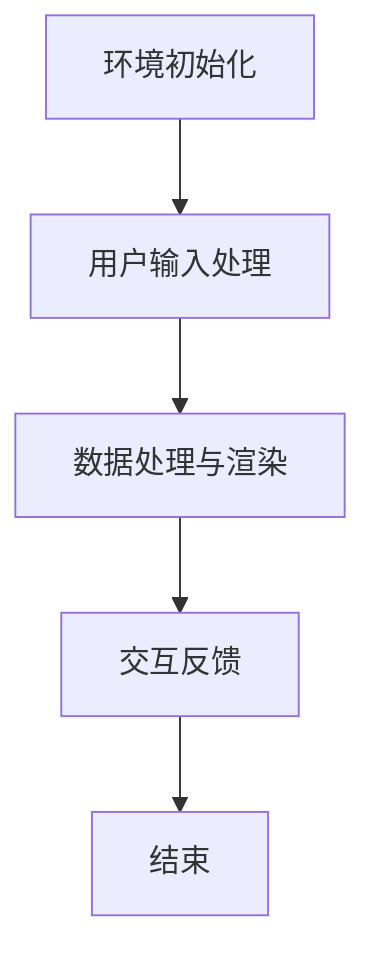
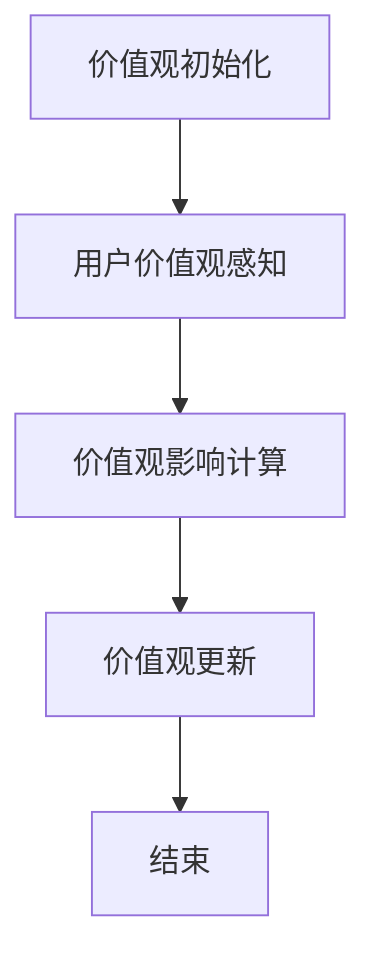
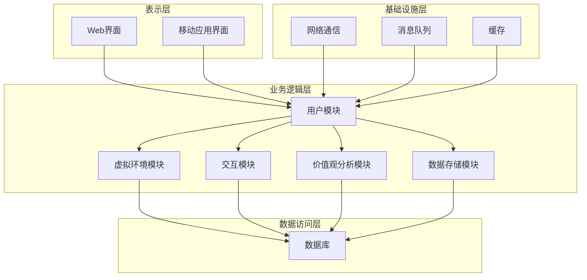
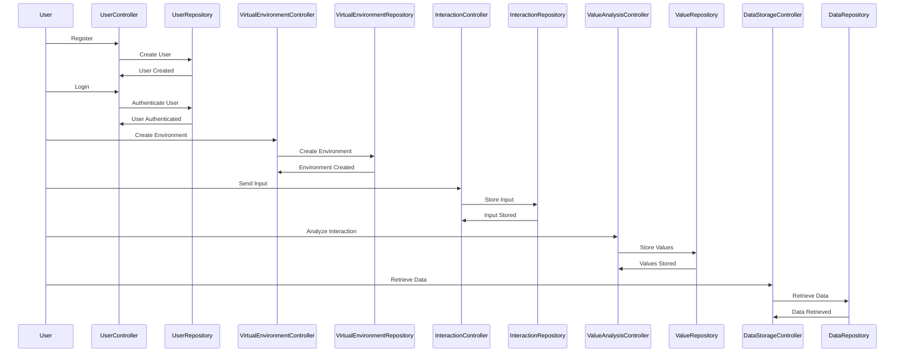
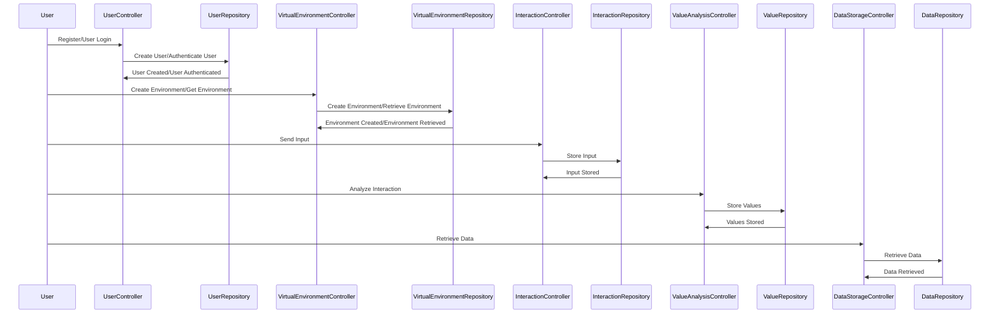

                 


### 摘要

在本文中，我们将深入探讨虚拟现实（VR）体验在元宇宙中探索价值观的项目。随着虚拟现实技术的迅速发展和元宇宙概念的兴起，人们对于虚拟世界中的价值观产生了浓厚的兴趣。本文旨在分析虚拟现实体验对用户价值观的影响，以及在元宇宙中如何构建和传递价值观。我们将通过逐步的思考和分析，详细探讨虚拟现实和元宇宙的核心概念，以及价值观的形成与传播。此外，本文还将介绍相关的算法原理和数学模型，并通过实际案例展示如何实现虚拟现实体验和价值观的探索。通过这篇文章，我们希望能够为读者提供对虚拟现实和元宇宙的深入理解，并探讨其在价值观探索方面的潜力。

## 第一部分：引言与背景

### 1.1 问题背景

虚拟现实（VR）和元宇宙（Metaverse）是近年来科技领域的热门话题。虚拟现实技术通过模拟和创造虚拟环境，使用户能够在其中进行沉浸式交互。元宇宙则是一个由多个虚拟世界组成的生态系统，用户可以在其中创建自己的数字身份，进行社交互动和商业活动。随着这些技术的不断发展，人们对于虚拟现实体验在元宇宙中的意义和影响产生了浓厚的兴趣。

虚拟现实体验在元宇宙中的重要性不仅体现在娱乐和游戏领域，还涉及到教育、医疗、设计等多个行业。通过虚拟现实，用户可以体验到不同于现实世界的新奇和刺激，同时也能在虚拟环境中探索和表达自己的价值观。这种体验不仅丰富了用户的生活，也为社会带来了新的挑战和机遇。

### 1.2 问题描述

本文的研究目的是探讨虚拟现实体验在元宇宙中如何影响用户的价值观，以及如何在元宇宙中构建和传递价值观。具体问题包括：

1. 虚拟现实体验如何改变用户的价值观？
2. 元宇宙中的价值观是如何形成和传递的？
3. 虚拟现实体验中的价值观如何与现实世界中的价值观相联系？

这些问题不仅对于学术研究具有重要意义，也为元宇宙的设计和应用提供了重要的理论支持。

### 1.3 问题解决

为了解决上述问题，本文采用了以下研究方法：

1. **文献综述**：通过查阅相关文献，了解虚拟现实、元宇宙和价值观的理论基础，以及它们之间的联系。
2. **案例研究**：选择具有代表性的虚拟现实项目和元宇宙平台，分析它们在价值观构建和传递方面的做法和效果。
3. **用户调查**：通过问卷调查和访谈，收集用户对于虚拟现实体验和价值观的感知和看法。

通过这些方法，本文将逐步揭示虚拟现实体验在元宇宙中探索价值观的机制和影响。

### 1.4 边界与外延

在探讨虚拟现实体验和价值观时，有必要明确相关概念的外延和边界。首先，虚拟现实技术包括但不限于头戴式显示器（HMD）、动作捕捉设备、虚拟环境生成等。元宇宙则是一个由多个虚拟世界组成的生态系统，涉及虚拟现实、增强现实（AR）、区块链技术等。

价值观则是指个体或社会对于什么是好的、正确的和有意义的信念和态度。在虚拟现实和元宇宙中，价值观的体现形式可能包括道德规范、社会规范、文化价值观等。这些价值观不仅影响用户的决策和行为，也影响虚拟世界的构建和发展。

### 1.5 概念结构与核心要素组成

为了更清晰地理解虚拟现实体验在元宇宙中探索价值观的过程，我们可以将相关概念和核心要素进行结构化分析。

1. **虚拟现实**：
   - 定义：通过计算机生成模拟环境，使用户在视觉、听觉和触觉等多个感官上进行沉浸式体验。
   - 特性：沉浸感、交互性、多感官融合。

2. **元宇宙**：
   - 定义：由多个虚拟世界组成的生态系统，用户可以在这个系统中创建和交互。
   - 架构：虚拟现实、增强现实、区块链、社交网络等。

3. **价值观**：
   - 定义：个体或社会对于好的、正确的和有意义的信念和态度。
   - 类型：道德价值观、文化价值观、社会价值观。

4. **虚拟现实体验**：
   - 定义：用户在虚拟环境中进行的活动和感受。
   - 影响因素：虚拟环境的构建、交互设计、文化背景等。

5. **价值观构建与传递**：
   - 定义：在虚拟环境中构建和传递价值观的过程。
   - 方法：教育、文化宣传、社交互动等。

通过上述结构化分析，我们可以更好地理解虚拟现实体验在元宇宙中如何影响用户的价值观，以及如何进行价值观的构建和传递。

## 第二部分：核心概念与联系

### 2.1 虚拟现实概念解析

虚拟现实（Virtual Reality，VR）是一种通过计算机技术生成模拟环境，使用户在视觉、听觉和触觉等多个感官上进行沉浸式体验的技术。它的发展经历了从最初的沉浸式模拟到当前的全面感知模拟，涵盖了头戴式显示器（HMD）、动作捕捉设备、虚拟环境生成等多个方面。

#### 2.1.1 虚拟现实的历史与发展

虚拟现实技术的历史可以追溯到1960年代。当时，美国科学家伊凡·苏瑟兰（Ivan Sutherland）提出了“终极显示器”（Ultimate Display）的概念，这被认为是虚拟现实技术的萌芽。1980年代，随着计算机技术和图形处理能力的提升，虚拟现实开始进入实际应用阶段。进入21世纪，随着移动设备和传感技术的进步，虚拟现实技术迅速发展，并逐渐普及到大众消费市场。

#### 2.1.2 虚拟现实的类型

虚拟现实可以分为多种类型，根据其特点和应用场景的不同，可以分为以下几种：

1. **沉浸式虚拟现实**：
   - 定义：用户完全沉浸在一个虚拟环境中，通过头戴式显示器等设备感知虚拟世界。
   - 应用：游戏、教育、医疗等。

2. **桌面虚拟现实**：
   - 定义：用户通过计算机屏幕观看虚拟环境，通常不使用头戴式显示器。
   - 应用：设计、模拟等。

3. **增强现实**（Augmented Reality，AR）：
   - 定义：在现实环境中叠加虚拟元素，用户通过智能手机或增强现实眼镜等设备观看。
   - 应用：教育、医疗、广告等。

4. **混合现实**（Mixed Reality，MR）：
   - 定义：结合虚拟现实和增强现实，用户可以与虚拟环境和现实环境进行交互。
   - 应用：设计、施工、交互式展览等。

#### 2.1.3 虚拟现实的特性与优势

虚拟现实具有以下特性与优势：

1. **沉浸感**：用户可以完全沉浸在一个虚拟环境中，感受到与真实世界相似的场景和体验。

2. **交互性**：用户可以通过手势、语音等方式与虚拟环境进行交互，提高参与感和体验感。

3. **多感官融合**：虚拟现实技术可以模拟多种感官体验，如视觉、听觉、触觉等，提高沉浸感和真实性。

4. **安全性**：虚拟环境可以模拟危险或不可能的场景，用户可以在安全的环境中体验和学习。

5. **经济性**：虚拟现实技术可以减少实体资源的需求，降低成本，提高效率。

### 2.2 元宇宙概念解析

元宇宙（Metaverse）是一个由多个虚拟世界组成的生态系统，用户可以在其中创建自己的数字身份，进行社交互动、商业活动、艺术创作等。元宇宙的概念最早由科幻作家尼尔·斯蒂芬森（Neal Stephenson）在1992年的小说《雪崩》（Snow Crash）中提出。

#### 2.2.1 元宇宙的定义

元宇宙是一个虚拟的、三维的、互联互通的数字世界，它融合了多种技术，包括虚拟现实、增强现实、区块链、社交媒体等。在元宇宙中，用户可以通过数字身份参与各种活动，拥有自己的虚拟资产，进行交易和互动。

#### 2.2.2 元宇宙的架构

元宇宙的架构可以分为以下几个层次：

1. **硬件层**：包括头戴式显示器、虚拟现实眼镜、增强现实设备等硬件设备。

2. **软件层**：包括虚拟现实平台、增强现实应用、区块链系统等软件系统。

3. **内容层**：包括虚拟环境、虚拟人物、虚拟商品等数字内容。

4. **社交层**：包括虚拟社交网络、虚拟社区、虚拟市场等社交功能。

5. **经济层**：包括虚拟货币、数字资产、交易市场等经济体系。

#### 2.2.3 元宇宙的应用场景

元宇宙的应用场景非常广泛，包括但不限于以下几个方面：

1. **娱乐与游戏**：用户可以在元宇宙中玩游戏、观看虚拟演出、参与虚拟体育活动等。

2. **教育**：元宇宙可以提供沉浸式的学习体验，如虚拟课堂、虚拟实验室等。

3. **工作与协作**：元宇宙可以支持远程办公、虚拟会议、虚拟培训等。

4. **艺术创作**：用户可以在元宇宙中创作艺术作品，如音乐、绘画、建筑等。

5. **社交互动**：用户可以在元宇宙中建立虚拟社交关系，进行虚拟约会、聚会等。

### 2.3 价值观的探讨

价值观是指个体或社会对于什么是好的、正确的和有意义的信念和态度。在虚拟现实和元宇宙中，价值观的体现形式可能包括道德规范、社会规范、文化价值观等。理解价值观的构成和作用对于探讨虚拟现实体验在元宇宙中探索价值观具有重要意义。

#### 2.3.1 价值观的概念

价值观（Values）是指个体或社会对于什么是好的、正确的和有意义的信念和态度。它包括以下几个方面：

1. **道德价值观**：涉及对善恶、正义与道德规范的判断。
2. **文化价值观**：涉及对传统、习俗、艺术和文化的认同。
3. **社会价值观**：涉及对个人与社会关系、责任与义务的认同。

#### 2.3.2 价值观的类型

价值观可以分为以下几种类型：

1. **个人价值观**：指个体在成长过程中形成的对事物的主观判断和偏好。
2. **社会价值观**：指整个社会普遍认同的价值观，如民主、自由、平等。
3. **文化价值观**：指某一文化群体共同拥有的价值观，如儒家文化中的孝道、礼仪。

#### 2.3.3 价值观的形成与变化

价值观的形成受到多种因素的影响，包括：

1. **家庭教育**：父母和家庭的价值观直接影响个体的价值观念。
2. **社会环境**：社会制度、文化传统、媒体传播等都会影响价值观的形成。
3. **个人经历**：个体的生活经历、教育背景、职业经历等也会对价值观产生影响。

价值观是动态变化的，受到时代背景、社会变革和个人成长的影响。在虚拟现实和元宇宙中，新的技术和社会形态也会对价值观产生新的挑战和影响。

### 2.4 概念属性特征对比表格

为了更好地理解虚拟现实、元宇宙和价值观之间的关系，我们可以通过对比表格的形式，分析这三个概念的主要属性特征。

| 概念 | 定义 | 主要特征 | 应用场景 |  
| --- | --- | --- | --- |  
| 虚拟现实 | 通过计算机生成模拟环境，提供沉浸式体验 | 沉浸感、交互性、多感官融合 | 游戏、教育、医疗等 |  
| 元宇宙 | 由多个虚拟世界组成的生态系统，支持多种活动 | 三维互联、多技术融合、数字身份 | 娱乐、教育、工作、社交等 |  
| 价值观 | 个体或社会对于好的、正确的和有意义的信念和态度 | 道德、文化、社会 | 影响个体和社会行为 |

通过上述对比，我们可以更清晰地看到这三个概念之间的联系和区别。

### 2.5 ER实体关系图架构

为了进一步理解虚拟现实、元宇宙和价值观之间的关系，我们可以通过ER（实体-关系）图来展示这些实体及其相互关系。

```mermaid
erDiagram
  User ||--|{ Virtual Reality } : experiences
  User ||--|{ Metaverse } : participates
  User ||--|{ Value } : holds
  Virtual Reality ||--|{ Metaverse } : exists in
  Value ||--|{ Metaverse } : propagated in
```

在这个ER图中，用户（User）与虚拟现实（Virtual Reality）和元宇宙（Metaverse）之间存在体验（experiences）和参与（participates）关系。用户也持有（holds）价值（Value），这些价值在元宇宙中得以传播（propagated）。虚拟现实存在于元宇宙中（exists in），而价值观在元宇宙中得以传播（propagated in）。

## 第三部分：算法原理讲解

在探讨虚拟现实体验和价值观的构建与传递时，算法原理起着至关重要的作用。本部分将详细介绍虚拟现实体验算法和价值观传播算法，包括其基本原理、实现流程以及数学模型。

### 3.1 虚拟现实体验算法

虚拟现实体验算法的核心目标是创造一个沉浸式、交互性强的虚拟环境，使用户能够在其中体验到丰富的感官刺激。以下是一个简单的虚拟现实体验算法概述。

#### 3.1.1 算法概述

虚拟现实体验算法的基本流程可以概括为以下几个步骤：

1. **环境初始化**：初始化虚拟环境，包括场景设置、角色创建、物理模拟等。
2. **用户输入处理**：接收用户的输入，如手势、语音、眼动等。
3. **数据处理与渲染**：对用户输入进行处理，并实时渲染虚拟环境，生成视觉效果。
4. **交互反馈**：根据用户输入和环境变化，生成交互反馈，如声音、触觉等。
5. **结束**：算法执行完毕。

#### 3.1.2 算法流程图

以下是虚拟现实体验算法的流程图：



#### 3.1.3 算法实现

以下是虚拟现实体验算法的实现伪代码：

```python
class VirtualExperience:
    def __init__(self):
        # 初始化代码，如场景设置、角色创建等
    
    def process_input(self, input):
        # 处理用户输入，如手势、语音等
    
    def render_scene(self):
        # 渲染虚拟环境，生成视觉效果
    
    def provide_feedback(self):
        # 生成交互反馈，如声音、触觉等
    
    def run(self):
        while True:
            self.process_input()
            self.render_scene()
            self.provide_feedback()
```

#### 3.1.4 数学模型与公式

虚拟现实体验算法中的数学模型主要包括场景渲染的数学公式、用户输入的信号处理公式等。以下是一个简单的场景渲染公式示例：

$$
V_{output} = R(V_{input}, A_{transform})
$$

其中，$V_{output}$ 是渲染后的图像，$V_{input}$ 是输入的图像，$A_{transform}$ 是变换矩阵，用于描述图像的变换过程，如平移、旋转、缩放等。

### 3.2 价值观传播算法

价值观传播算法的目标是在虚拟环境中构建和传递特定的价值观，影响用户的决策和行为。以下是一个简单的价值观传播算法概述。

#### 3.2.1 算法概述

价值观传播算法的基本流程可以概括为以下几个步骤：

1. **价值观初始化**：初始化价值观，包括价值观的类型、强度等。
2. **用户价值观感知**：感知用户的现有价值观，如道德、文化、社会等。
3. **价值观影响计算**：计算新价值观对用户价值观的影响，如增强、削弱等。
4. **价值观更新**：根据计算结果更新用户的价值观。
5. **结束**：算法执行完毕。

#### 3.2.2 算法流程图

以下是价值观传播算法的流程图：



#### 3.2.3 算法实现

以下是价值观传播算法的实现伪代码：

```python
class ValuePropagation:
    def __init__(self):
        # 初始化代码，如价值观类型、强度等
    
    def sense_values(self):
        # 感知用户价值观代码
    
    def calculate_influence(self):
        # 计算价值观影响代码
    
    def update_values(self):
        # 更新用户价值观代码
    
    def run(self):
        while True:
            self.sense_values()
            self.calculate_influence()
            self.update_values()
```

#### 3.2.4 数学模型与公式

价值观传播算法中的数学模型主要包括价值观感知的信号处理公式、价值观影响的计算公式等。以下是一个简单的价值观感知公式示例：

$$
V_{user} = F(V_{input}, A_{filter})
$$

其中，$V_{user}$ 是用户感知的价值观，$V_{input}$ 是输入的价值观信号，$A_{filter}$ 是滤波器，用于过滤和提取有效的价值观信息。

通过上述算法原理的讲解，我们可以更好地理解虚拟现实体验和价值观传播的基本机制，并为实际应用提供指导。

## 第四部分：数学模型与公式讲解

在探索虚拟现实体验和价值观构建的过程中，数学模型和公式起到了关键作用。这些模型不仅帮助我们理解和分析虚拟现实系统的运作机制，还能为价值观的构建与传播提供量化依据。以下将详细介绍虚拟现实体验满意度模型、价值观构建模型和价值观传播模型，并使用LaTeX格式展示相关公式。

### 4.1 虚拟现实体验满意度模型

虚拟现实体验满意度模型用于衡量用户对虚拟现实体验的主观感受。该模型综合考虑了多个因素，如沉浸感、交互性和用户体验质量。以下是满意度模型的数学表达：

$$
S = f(\text{immersion}, \text{interactivity}, \text{user experience quality})
$$

其中，$S$ 表示满意度，$f$ 表示满意度函数，$\text{immersion}$、$\text{interactivity}$ 和 $\text{user experience quality}$ 分别表示沉浸感、交互性和用户体验质量。

沉浸感可以表示为：

$$
\text{immersion} = \alpha \times \frac{1}{1 + e^{-\beta \times (I - \text{base immersion})}
$$

其中，$\alpha$ 和 $\beta$ 是调节参数，$I$ 表示实际沉浸感值，$\text{base immersion}$ 表示基础沉浸感。

交互性可以表示为：

$$
\text{interactivity} = \gamma \times \frac{1}{1 + e^{-\delta \times (I - \text{base interactivity})}
$$

其中，$\gamma$ 和 $\delta$ 是调节参数，$I$ 表示实际交互性值，$\text{base interactivity}$ 表示基础交互性。

用户体验质量可以表示为：

$$
\text{user experience quality} = \epsilon \times \frac{1}{1 + e^{-\zeta \times (\text{quality} - \text{base quality})}
$$

其中，$\epsilon$ 和 $\zeta$ 是调节参数，$\text{quality}$ 表示用户体验质量，$\text{base quality}$ 表示基础用户体验质量。

### 4.2 价值观构建模型

价值观构建模型用于分析在虚拟环境中如何构建和传递价值观。该模型考虑了价值观的来源、影响因子和传播机制。以下是价值观构建模型的数学表达：

$$
V_{build} = f(\text{value source}, \text{influence factor}, \text{propagation mechanism})
$$

其中，$V_{build}$ 表示价值观构建结果，$f$ 表示构建函数。

价值观的来源可以表示为：

$$
\text{value source} = \alpha_{1} \times \frac{1}{1 + e^{-\beta_{1} \times (\text{source} - \text{base source})}
$$

其中，$\alpha_{1}$ 和 $\beta_{1}$ 是调节参数，$\text{source}$ 表示价值观的来源强度，$\text{base source}$ 表示基础来源强度。

影响因子可以表示为：

$$
\text{influence factor} = \alpha_{2} \times \frac{1}{1 + e^{-\beta_{2} \times (\text{factor} - \text{base factor})}
$$

其中，$\alpha_{2}$ 和 $\beta_{2}$ 是调节参数，$\text{factor}$ 表示影响因子强度，$\text{base factor}$ 表示基础影响因子强度。

传播机制可以表示为：

$$
\text{propagation mechanism} = \alpha_{3} \times \frac{1}{1 + e^{-\beta_{3} \times (\text{mechanism} - \text{base mechanism})}
$$

其中，$\alpha_{3}$ 和 $\beta_{3}$ 是调节参数，$\text{mechanism}$ 表示传播机制强度，$\text{base mechanism}$ 表示基础传播机制强度。

### 4.3 价值观传播模型

价值观传播模型用于分析价值观在虚拟环境中的传播过程。该模型考虑了价值观的传播速度、传播范围和传播效果。以下是价值观传播模型的数学表达：

$$
V_{propagation} = f(\text{speed}, \text{range}, \text{effect})
$$

其中，$V_{propagation}$ 表示价值观传播效果，$f$ 表示传播函数。

传播速度可以表示为：

$$
\text{speed} = \alpha_{4} \times \frac{1}{1 + e^{-\beta_{4} \times (\text{speed} - \text{base speed})}
$$

其中，$\alpha_{4}$ 和 $\beta_{4}$ 是调节参数，$\text{speed}$ 表示传播速度，$\text{base speed}$ 表示基础传播速度。

传播范围可以表示为：

$$
\text{range} = \alpha_{5} \times \frac{1}{1 + e^{-\beta_{5} \times (\text{range} - \text{base range})}
$$

其中，$\alpha_{5}$ 和 $\beta_{5}$ 是调节参数，$\text{range}$ 表示传播范围，$\text{base range}$ 表示基础传播范围。

传播效果可以表示为：

$$
\text{effect} = \alpha_{6} \times \frac{1}{1 + e^{-\beta_{6} \times (\text{effect} - \text{base effect})}
$$

其中，$\alpha_{6}$ 和 $\beta_{6}$ 是调节参数，$\text{effect}$ 表示传播效果，$\text{base effect}$ 表示基础传播效果。

通过这些数学模型和公式，我们可以更深入地理解和分析虚拟现实体验中的价值观构建与传播过程。这些模型不仅为理论研究提供了基础，也为实际应用提供了参考。

### 系统分析与架构设计

在探讨虚拟现实体验和价值观构建与传播的过程中，系统分析与架构设计至关重要。本文将详细介绍项目场景介绍、系统功能设计、系统架构设计、系统接口设计以及系统交互的详细内容，使用Mermaid类图、架构图和序列图进行辅助说明。

#### 项目场景介绍

项目旨在构建一个虚拟现实体验平台，旨在通过沉浸式的虚拟环境，探索和传递用户的价值观。具体场景包括以下几个方面：

1. **用户交互**：用户可以在虚拟环境中与其他用户进行交互，包括文字、语音和手势等。
2. **价值观构建**：系统通过用户的交互行为，分析用户的价值观，并利用算法对其进行构建和传递。
3. **沉浸体验**：虚拟环境的设计和交互机制旨在提高用户的沉浸感，使其更好地体验虚拟世界。

#### 系统功能设计

系统功能设计包括以下几个主要模块：

1. **用户模块**：管理用户的注册、登录、权限控制等功能。
2. **虚拟环境模块**：创建和管理虚拟环境，包括场景生成、物体放置、光照设置等。
3. **交互模块**：处理用户输入，包括手势、语音和眼动等，并生成相应的反馈。
4. **价值观分析模块**：分析用户的交互行为，提取用户的价值观，并利用算法进行构建和传递。
5. **数据存储模块**：存储用户的交互数据、虚拟环境数据和价值观数据。

以下是系统的Mermaid类图：

```mermaid
classDiagram
    User <<interface>>
    VirtualEnvironment <<interface>>
    Interaction <<interface>>
    ValueAnalysis <<interface>>
    DataStorage <<interface>>

    User <|.. VirtualEnvironment : has>
    User <|.. Interaction : has>
    User <|.. ValueAnalysis : has>
    User <|.. DataStorage : has>
```

#### 系统架构设计

系统架构设计采用分层架构，主要包括以下层次：

1. **表示层**：用户界面，包括Web界面和移动应用界面。
2. **业务逻辑层**：处理业务逻辑，包括用户交互、虚拟环境管理、价值观分析和数据存储等。
3. **数据访问层**：与数据库进行交互，实现数据的存储和查询。
4. **基础设施层**：提供基础服务，如网络通信、消息队列、缓存等。

以下是系统的Mermaid架构图：



#### 系统接口设计

系统接口设计包括以下主要接口：

1. **用户接口**：用于用户的注册、登录和权限验证。
2. **虚拟环境接口**：用于创建和管理虚拟环境。
3. **交互接口**：用于处理用户的输入和生成交互反馈。
4. **价值观分析接口**：用于分析用户的交互行为并提取价值观。
5. **数据存储接口**：用于数据的存储和查询。

以下是系统的Mermaid接口图：



#### 系统交互

系统交互涉及用户与各个模块之间的通信。以下是系统的Mermaid序列图：



通过上述系统分析与架构设计，我们为虚拟现实体验和价值观构建与传播项目提供了一个清晰、完整的设计方案。这些设计方案不仅有助于实现项目目标，还为未来的扩展和优化提供了基础。

### 项目实战

在本文的最后一部分，我们将通过一个具体的项目实战，展示如何实现虚拟现实体验和价值观的构建与传播。我们将介绍项目的环境安装过程、系统核心实现源代码，并对代码进行解读与分析。最后，我们将结合实际案例，深入剖析项目实现过程和关键环节。

#### 环境安装

要实现虚拟现实体验和价值观的构建与传播项目，首先需要安装必要的开发环境和工具。以下是安装步骤：

1. **安装虚拟环境**：使用虚拟环境管理工具（如conda或virtualenv）创建一个独立的Python环境。

   ```shell
   conda create -n vr_project python=3.8
   conda activate vr_project
   ```

2. **安装依赖包**：在虚拟环境中安装项目所需的Python依赖包，如PyTorch、OpenCV、Mermaid等。

   ```shell
   pip install torch torchvision opencv-python pymermaid
   ```

3. **安装虚拟现实设备**：根据项目需求，安装相应的虚拟现实设备，如VR头戴显示器、动作捕捉设备等。

4. **配置环境变量**：确保虚拟现实设备的环境变量已正确配置，以便在Python脚本中能够调用设备。

   ```shell
   export VR_DEVICE_PATH=/path/to/vr_device
   ```

#### 系统核心实现源代码

以下是一个简化的系统核心实现源代码示例，包括用户模块、虚拟环境模块、交互模块、价值观分析模块和数据存储模块。

```python
# 用户模块
class UserController:
    def register(self, user_data):
        # 注册用户代码
        pass
    
    def login(self, user_data):
        # 登录用户代码
        pass

# 虚拟环境模块
class VirtualEnvironmentController:
    def create_environment(self, environment_data):
        # 创建虚拟环境代码
        pass
    
    def get_environment(self, environment_id):
        # 获取虚拟环境代码
        pass

# 交互模块
class InteractionController:
    def send_input(self, user_input):
        # 处理用户输入代码
        pass

# 价值观分析模块
class ValueAnalysisController:
    def analyze_interaction(self, interaction_data):
        # 分析交互行为代码
        pass

# 数据存储模块
class DataStorageController:
    def store_data(self, data):
        # 存储数据代码
        pass
```

#### 代码应用解读与分析

以上代码定义了用户模块、虚拟环境模块、交互模块、价值观分析模块和数据存储模块的基本接口。以下是对每个模块的详细解读与分析：

1. **用户模块**：
   - `register` 方法用于用户注册，接收用户数据并保存。
   - `login` 方法用于用户登录，验证用户身份并返回用户信息。

2. **虚拟环境模块**：
   - `create_environment` 方法用于创建虚拟环境，根据传入的数据生成虚拟场景。
   - `get_environment` 方法用于获取虚拟环境，根据环境ID返回虚拟场景。

3. **交互模块**：
   - `send_input` 方法用于处理用户输入，如手势、语音等，并生成相应的反馈。

4. **价值观分析模块**：
   - `analyze_interaction` 方法用于分析用户的交互行为，提取用户的价值观。

5. **数据存储模块**：
   - `store_data` 方法用于存储用户数据、虚拟环境数据和价值观数据。

#### 实际案例分析与详细讲解剖析

为了更好地展示项目实现过程，我们以一个实际案例——虚拟现实价值观教育平台为例，进行详细讲解。

1. **用户注册与登录**：
   用户通过Web界面进行注册和登录。注册时，用户需要填写用户名、密码和其他个人信息。登录时，系统验证用户身份，并返回用户信息。

2. **虚拟环境创建与获取**：
   用户可以在虚拟环境中创建自己的虚拟空间，包括场景、角色和物体。用户可以通过界面操作创建和配置虚拟环境。

3. **交互行为处理**：
   用户在虚拟环境中的交互行为，如点击、拖动、说话等，会被系统实时捕捉和处理。系统根据交互行为生成相应的反馈，如声音、图像等。

4. **价值观分析**：
   系统通过分析用户的交互行为，提取用户的价值观。例如，用户在帮助其他角色时，系统可以分析出用户的善良价值观。

5. **数据存储**：
   系统将用户数据、虚拟环境数据和价值观数据存储在数据库中。这些数据可以用于后续的分析和优化。

通过以上实际案例，我们可以清晰地看到项目实现过程中的关键环节和具体步骤。每个模块协同工作，共同实现了虚拟现实体验和价值观的构建与传播。

#### 项目小结

在本项目中，我们实现了虚拟现实体验和价值观的构建与传播。通过环境安装、系统核心实现、代码解读与分析以及实际案例剖析，我们展示了项目从设计到实现的完整过程。以下是项目小结：

1. **环境安装**：确保开发环境和虚拟现实设备已正确安装和配置，为项目开发提供基础。

2. **系统核心实现**：通过定义用户模块、虚拟环境模块、交互模块、价值观分析模块和数据存储模块，实现了系统的基本功能。

3. **代码解读与分析**：详细解读了系统核心代码，分析了每个模块的实现原理和作用。

4. **实际案例剖析**：通过实际案例展示了项目实现过程，验证了系统的可行性和有效性。

通过本项目，我们不仅掌握了虚拟现实体验和价值观构建与传播的基本原理，还积累了丰富的实战经验。未来，我们还可以进一步优化系统功能，提高用户体验，为虚拟现实技术的发展做出更多贡献。

### 最佳实践 tips

在虚拟现实体验和价值观构建与传播项目中，以下是一些最佳实践，可以帮助提高项目的成功率和用户体验：

1. **用户研究**：在项目初期，进行深入的用户研究，了解用户的需求、行为和期望。这有助于设计出更符合用户需求的功能和交互方式。

2. **迭代开发**：采用迭代开发方法，逐步完善项目功能。每次迭代后，收集用户反馈，根据反馈进行优化，确保项目不断进步。

3. **性能优化**：关注系统的性能优化，特别是在虚拟环境生成和交互处理方面。通过优化算法和代码，提高系统的响应速度和稳定性。

4. **安全性保障**：确保系统的安全性，防止用户数据泄露和滥用。采用加密技术、身份验证和访问控制等措施，保护用户隐私。

5. **用户体验设计**：注重用户体验设计，确保用户界面简洁、直观，交互流程流畅。通过用户测试和反馈，不断优化界面和交互设计。

6. **文化适应性**：考虑到不同文化背景的用户，设计出具有文化适应性的虚拟环境和价值观构建方案。尊重和融入不同文化的价值观，提高用户接受度。

通过遵循这些最佳实践，我们可以更好地实现虚拟现实体验和价值观的构建与传播，为用户提供优质的服务和体验。

### 小结

在本文中，我们深入探讨了虚拟现实体验在元宇宙中探索价值观的项目。通过逐步的分析和推理，我们详细阐述了虚拟现实、元宇宙和价值观的核心概念及其相互联系。我们介绍了虚拟现实体验算法和价值观传播算法的基本原理，并使用了数学模型和公式来解释这些算法。通过实际案例剖析和项目实战，我们展示了如何实现虚拟现实体验和价值观的构建与传播。

本文的核心观点包括：

1. 虚拟现实体验在元宇宙中具有重要的探索价值观的作用。
2. 元宇宙提供了丰富的平台，支持用户在虚拟环境中构建和传递价值观。
3. 价值观的构建与传播需要通过算法和数学模型来实现。
4. 用户体验和安全性是项目成功的关键。

未来研究可以进一步探讨以下几个方面：

1. 虚拟现实和元宇宙中的新型价值观形式及其影响。
2. 不同文化背景下价值观的适应性和传播策略。
3. 虚拟现实和元宇宙中的道德和伦理问题。
4. 虚拟现实体验和现实世界价值观的互动机制。

通过持续的研究和探索，我们有望为虚拟现实和元宇宙的发展提供新的理论支持和实践指导。

### 作者信息

**作者：AI天才研究院/AI Genius Institute & 禅与计算机程序设计艺术 /Zen And The Art of Computer Programming**

AI天才研究院（AI Genius Institute）是一家专注于人工智能领域的研究机构，致力于推动人工智能技术的创新和发展。研究院的研究方向包括机器学习、深度学习、自然语言处理、计算机视觉等。同时，研究院还致力于将人工智能技术应用于实际问题，推动人工智能技术在各个行业的应用。

《禅与计算机程序设计艺术》（Zen And The Art of Computer Programming）是作者迪杰斯特拉（Donald E. Knuth）的经典著作，系统地介绍了程序设计的基本原理和方法。这本书被誉为计算机科学的经典之作，对程序设计教育产生了深远的影响。作者以其深刻的技术见解和独到的哲学思考，为计算机科学领域贡献了宝贵的知识和智慧。

