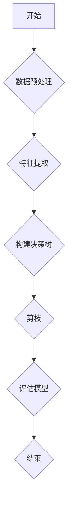
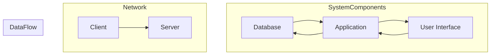
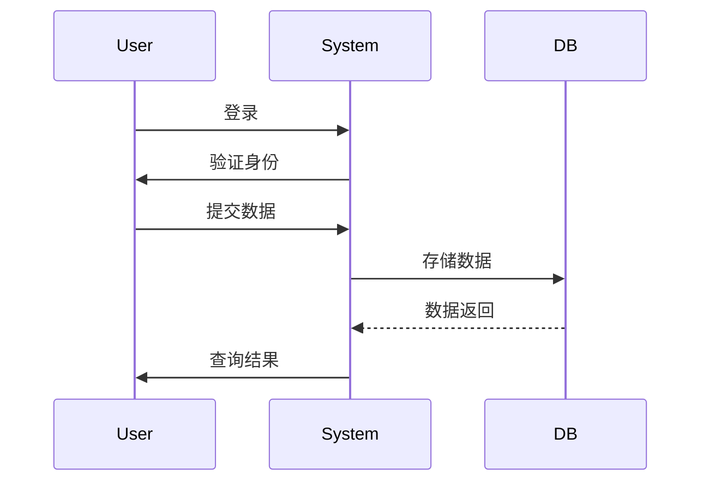

                 

# 意义的迷宫：现代人如何找到人生方向

## 关键词：人生方向、意义迷失、自我认知、职业发展、决策制定

## 摘要：
本文旨在探讨现代人在面对社会挑战和压力时，如何找到自己的人生方向。通过对核心概念和理论基础的深入分析，结合心理学、人文主义哲学以及社会文化因素，本文提出了定位与探索人生方向的方法，并阐述了人生决策的制定与实施过程。同时，通过实践方法和案例分析，为读者提供实现人生方向的路径。最后，本文总结了人生方向的反思与调整，强调了持续追求人生方向的重要性。

## 引言

### 1.1 现代社会的挑战与压力

在当今社会，人们面临着前所未有的挑战和压力。快速发展的科技、激烈的市场竞争、多变的社会环境，使得现代人难以找到稳定和持续的幸福感。同时，随着信息过载和工作压力的增加，许多人陷入了意义迷失的困境，无法找到自己人生的目标和价值。

### 1.2 人生方向的模糊性与困惑

当人们感到迷茫和无助时，人生方向变得模糊不清。许多人不知道自己真正想要什么，不知道应该如何规划和追求自己的目标。这种困惑不仅影响了职业发展，还影响了个人生活的幸福感。

### 1.3 寻找人生方向的必要性

找到人生方向对于个人和社会都有着重要的意义。它不仅能帮助人们实现自我价值，提高生活质量，还能促进社会的和谐发展。因此，寻找人生方向成为现代人必须面对的课题。

## 核心概念与理论基础

### 2.1 人生意义的概念解析

人生意义是指个人在生命过程中追求的内在价值和目的。它不仅关乎个人的幸福和满足，还涉及到社会责任和道德准则。人生意义的概念可以从心理学、哲学等多个角度进行探讨。

### 2.2 心理学与人生意义的联系

心理学研究表明，人生意义的追求与个体的心理健康和幸福感密切相关。当人们感到自己的生活有意义时，他们更有可能表现出积极的行为和情感状态。

### 2.3 人文主义哲学的视角

人文主义哲学强调个体的价值和尊严，主张人们应该根据自己的意愿和目标来规划自己的人生。这种观点为寻找人生方向提供了重要的理论支持。

## 人生方向的定位与探索

### 3.1 自我认知的重要性

自我认知是找到人生方向的关键。通过深入了解自己的兴趣、性格和价值观，人们可以更好地确定自己的目标和方向。

### 3.2 性格与兴趣的探索

性格和兴趣是人生方向的重要影响因素。通过自我探索和职业测评，人们可以更好地了解自己的性格和兴趣，从而找到适合自己的职业方向。

### 3.3 职业发展的路径选择

职业发展是人生方向的重要组成部分。根据个人的兴趣和特长，选择合适的职业发展路径，有助于实现人生目标。

## 社会与文化因素对人生方向的影响

### 4.1 家庭与社会期望

家庭和社会期望对人生方向有着重要的影响。在寻找人生方向的过程中，人们需要权衡个人意愿和社会期望，找到平衡点。

### 4.2 文化背景的影响

文化背景对人生方向有着深远的影响。不同的文化环境会影响人们的价值观和行为模式，从而影响他们的人生方向。

### 4.3 社交网络与人生方向

社交网络是现代人在寻找人生方向时的重要资源。通过社交网络，人们可以获取信息、建立联系和获得支持，从而更好地实现自己的人生目标。

## 人生决策的制定与实施

### 5.1 决策模型与工具

决策模型和工具可以帮助人们更科学地制定人生决策。通过分析各种因素和可能性，人们可以做出更明智的决策。

### 5.2 时间管理与目标设定

时间管理和目标设定是实现人生方向的关键。通过合理安排时间和设定明确的目标，人们可以更好地追求自己的梦想。

### 5.3 风险评估与应对策略

在实现人生方向的过程中，风险评估和应对策略至关重要。通过评估风险和制定应对策略，人们可以更好地应对人生中的挑战和变化。

## 实现人生方向的实践方法

### 6.1 教育与持续学习

教育和持续学习是实现人生方向的重要途径。通过不断学习和提升自己的能力，人们可以更好地适应社会变化和实现人生目标。

### 6.2 职业发展中的调适与转型

职业发展中的调适与转型是实现人生方向的重要手段。通过调整自己的职业方向和转型，人们可以更好地适应社会需求和实现个人价值。

### 6.3 情感与心理支持的获取

情感与心理支持是实现人生方向的重要保障。通过建立良好的社交关系和获取专业的心理支持，人们可以更好地应对人生中的挫折和困难。

## 人生方向的反思与调整

### 7.1 生命的起伏与变化

生命中的起伏和变化是不可避免的。在面对挫折和困难时，人们需要反思和调整自己的人生方向，以适应新的变化。

### 7.2 持续探索与自我成长

持续探索和自我成长是实现人生方向的关键。通过不断学习和反思，人们可以更好地实现自己的潜力，找到更适合自己的发展方向。

### 7.3 意义的重塑与追寻

在人生的不同阶段，人们需要不断地重塑和追寻意义。通过重新审视自己的人生目标和价值观，人们可以找到更深刻的生命意义。

## 人生方向的案例分析

### 8.1 案例一：职业转变中的自我探索

通过分析一个职业转变的案例，本文展示了如何通过自我探索找到新的人生方向。

### 8.2 案例二：创业过程中的挫折与坚持

创业案例展示了如何面对挫折和困难，坚持追求人生方向。

### 8.3 案例三：家庭生活的意义追寻

家庭案例探讨了如何在家庭生活中寻找人生方向和意义。

## 结语

### 9.1 总结与启示

本文总结了现代人在寻找人生方向的过程中需要关注的关键问题和实践方法。通过自我认知、决策制定和实践探索，人们可以找到并实现自己的人生方向。

### 9.2 持续追求人生方向的重要性

持续追求人生方向是实现个人价值和幸福的关键。通过不断学习和反思，人们可以更好地适应社会变化和实现自我成长。

### 9.3 拓展阅读与资源推荐

本文推荐了一些拓展阅读和资源，帮助读者深入了解人生方向的探索和实践。

### 作者信息

作者：AI天才研究院/AI Genius Institute & 禅与计算机程序设计艺术 /Zen And The Art of Computer Programming

通过以上章节的详细分析，本文旨在帮助现代人找到并实现自己的人生方向。在意义的迷宫中，找到属于自己的道路，追求生命的价值和意义。让我们一起勇敢地探索，寻找属于自己的光明之路。 ### 第一部分：引言

### 第1章：现代生活的意义迷失

在现代社会的快速发展中，人们的生活节奏越来越快，信息获取越来越便捷，但与此同时，许多人却感到了一种难以名状的空虚和迷茫。这种现象背后，隐藏着一个深刻的问题：现代生活的意义迷失。

#### 1.1 现代社会的挑战与压力

现代社会充满了各种挑战和压力。科技的高速发展使得信息爆炸，人们需要不断学习新知识以适应快速变化的环境。职场竞争激烈，工作压力大，生活成本高，这些因素使得现代人无法轻易地找到稳定和长期的幸福感。同时，社交媒体的普及也让人们陷入了比较和焦虑的漩涡，导致内心的空虚和困惑。

#### 1.2 人生方向的模糊性与困惑

当人们感到迷茫和无助时，人生方向变得模糊不清。许多人不知道自己真正想要什么，不知道应该如何规划和追求自己的目标。这种困惑不仅影响了职业发展，还影响了个人生活的幸福感。许多人在职场中感到不安，不知道自己的工作是否有意义，是否能够实现自己的价值。

#### 1.3 寻找人生方向的必要性

找到人生方向对于个人和社会都有着重要的意义。对于个人来说，明确的人生方向可以帮助人们更好地规划自己的生活，提高生活的幸福感和满足感。对于社会来说，找到人生方向的人能够更好地为社会做出贡献，推动社会的进步和发展。因此，寻找人生方向成为现代人必须面对的课题。

在现代社会的挑战和压力下，许多人陷入了人生方向的迷失。为了找到明确的人生方向，我们需要进行深入的自我认知，了解自己的兴趣、价值观和目标。同时，我们还需要结合心理学、人文主义哲学和社会文化因素，寻找适合自己的发展路径。只有这样，我们才能在意义的迷宫中找到属于自己的道路，实现生命的价值和意义。

### 第二部分：核心概念与理论基础

### 第2章：核心概念与理论基础

#### 2.1 人生意义的概念解析

人生意义是指个体在生命过程中追求的内在价值和目的。它不仅仅关乎个人的幸福和满足，还涉及到个体的价值观、信仰和生活目标。从心理学的角度来看，人生意义是个体在面对困难和挫折时的一种内在动力，它能够帮助个体保持积极的生活态度和情感状态。

#### 2.2 心理学与人生意义的联系

心理学研究表明，人生意义的追求与个体的心理健康和幸福感密切相关。有研究发现，拥有明确人生意义的人往往更加乐观、自尊和自控，同时他们在面对压力和挑战时也表现出更强的应对能力。心理学家认为，人生意义的缺失可能会导致个体的心理健康问题，如抑郁、焦虑等。

#### 2.3 人文主义哲学的视角

人文主义哲学强调个体的价值和尊严，主张个体应该根据自己的意愿和目标来规划自己的人生。人文主义哲学家认为，人生意义是个体自我实现的过程，是通过不断地追求个人成长和发展的过程来实现的。人文主义哲学为寻找人生意义提供了重要的理论支持，它鼓励个体勇敢地面对生活的挑战，寻找自己的价值所在。

#### 2.4 心理学与人文主义哲学的结合

心理学和人文主义哲学的结合，为现代人寻找人生意义提供了全面的指导。心理学提供了科学的方法和工具，帮助个体了解自己的内心世界，发现内在的动力和目标。人文主义哲学则提供了更高的视角，帮助个体理解人生的意义和价值，找到自己的使命和方向。通过结合心理学和人文主义哲学的理论，个体可以更全面、更深入地探索自己的人生意义。

在现代社会，面对快速变化的生活节奏和激烈的竞争环境，寻找人生意义成为许多人的迫切需求。通过了解心理学和人文主义哲学的相关理论，我们可以更好地认识自己，找到自己的人生方向，实现生命的价值和意义。

### 第三部分：人生方向的定位与探索

### 第3章：人生方向的定位与探索

#### 3.1 自我认知的重要性

自我认知是找到人生方向的关键步骤。通过深入地了解自己的兴趣、价值观、性格和优势，个体可以更好地明确自己的人生目标和发展方向。自我认知不仅帮助个体了解自己的内在需求，还能为未来的职业选择和个人成长提供指导。

在自我认知的过程中，个体可以通过多种方式来探索自己。首先，可以通过自我反思，回顾自己的成长经历，思考哪些经历对自己影响深远。其次，可以通过职业测评工具，如职业兴趣量表、性格测试等，来了解自己的职业倾向和性格特点。此外，还可以通过阅读相关书籍、参加培训课程或者咨询专业人士，来加深对自我的理解。

#### 3.2 性格与兴趣的探索

性格和兴趣是影响人生方向的重要因素。每个人都有自己独特的性格特点，这些特点决定了个体在特定环境中的行为和反应。通过了解自己的性格，个体可以更好地适应环境，找到适合自己的职业和工作方式。

同样，兴趣也是找到人生方向的重要线索。兴趣是个体对特定活动或领域的热情和喜爱，它往往能激发个体的内在动力，使个体在追求目标时保持持续的热情和动力。通过探索自己的兴趣，个体可以发现自己在哪些领域有天赋和潜力，从而为未来的职业规划提供依据。

#### 3.3 职业发展的路径选择

在明确了自我认知和性格兴趣之后，职业发展的路径选择成为关键的一步。职业发展不仅仅是为了满足生活需求，更是实现个人价值和追求幸福的重要途径。因此，选择一个合适的职业路径至关重要。

首先，个体可以根据自己的兴趣和优势，选择一个与自己性格相匹配的职业领域。例如，一个喜欢与人沟通和帮助他人的个体，可以选择从事心理咨询、教育或社会工作等职业。

其次，个体需要考虑职业发展的前景和稳定性。一个有发展潜力和稳定性的职业，能够为个体的长期发展提供保障。此外，个体还可以考虑自己的职业价值观，选择一个能够符合自己价值观的职业。

最后，职业发展的路径选择也需要结合实际情况。例如，个体的家庭状况、经济条件、地理位置等都会对职业选择产生影响。因此，在做出职业决策时，需要全面考虑各种因素，做出明智的选择。

通过自我认知、性格与兴趣的探索，以及职业发展的路径选择，个体可以逐步找到自己的人生方向。在这个过程中，持续学习和反思是不可或缺的，它们帮助个体不断调整和优化自己的方向，确保自己始终走在正确的道路上。

### 第四部分：社会与文化因素对人生方向的影响

### 第4章：社会与文化因素对人生方向的影响

#### 4.1 家庭与社会期望

家庭和社会期望在人生方向的选择中扮演着重要角色。家庭是一个人最初的社会环境，父母和其他家庭成员的期望和价值观往往对个体产生深远的影响。例如，一个家庭可能希望孩子成为一名医生或律师，这种期望可能会影响个体对职业的选择。社会期望则体现在社会普遍认可的成功标准上，如高收入、社会地位等。这些期望可能会对个体产生压力，使他们选择追求社会认可的职业，而不是自己真正感兴趣和擅长的领域。

#### 4.2 文化背景的影响

文化背景对人生方向的选择也有重要影响。不同的文化环境有不同的价值观和行为规范，这会影响个体对人生意义的理解和追求方式。例如，在强调集体主义的文化中，个体可能会更加重视家庭和社交关系，而在强调个人主义的文化中，个体可能会更加追求个人成就和自我实现。此外，文化背景还决定了个体对教育和职业的看法，影响了他们对未来规划的方向。

#### 4.3 社交网络与人生方向

社交网络是现代社会中不可或缺的一部分，它对人生方向的选择有着重要的影响。社交网络中的朋友、同事和导师等社交关系，可以为个体提供职业发展的机会和信息，影响个体的职业选择。例如，一个在某个行业有丰富人脉的导师可能会推荐个体进入该行业，从而影响个体的职业路径。此外，社交网络中的交流和互动，也能帮助个体了解不同的职业和生活选择，从而更好地决定自己的人生方向。

综上所述，家庭与社会期望、文化背景和社交网络都对人生方向的选择产生深远的影响。个体在寻找自己的人生方向时，需要综合考虑这些因素，做出既符合自己内心需求，又符合社会期望和现实条件的选择。通过理解和平衡这些因素，个体可以找到更加合适和有意义的人生方向。

### 第五部分：人生决策的制定与实施

#### 5.1 决策模型与工具

制定人生决策是一项复杂的任务，需要系统化和科学化的方法。决策模型和工具为这一过程提供了指导和支持。常见的决策模型包括SWOT分析（优势、劣势、机会、威胁分析）、SMART目标设定（具体、可测量、可达成、相关、时限性）和决策平衡矩阵等。这些模型帮助个体从多个维度评估和比较不同选择，从而做出更明智的决策。

在实际操作中，个体可以使用以下工具来辅助决策：

- **决策树**：通过分支和节点展示不同决策路径及其结果，帮助个体清晰地理解不同选择的后果。
- **成本-收益分析**：评估每个选项的成本和预期收益，帮助个体权衡利弊。
- **情景分析**：模拟不同的未来情景，评估每个选项在不同情景下的表现。

#### 5.2 时间管理与目标设定

时间管理是实现人生方向的关键。有效的目标设定和时间管理可以帮助个体更高效地追求自己的目标。目标设定应遵循SMART原则，即目标应该是具体的、可测量的、可达到的、相关的、时限性的。设定明确的目标可以帮助个体明确方向，提高行动的动力和效率。

时间管理工具如日历、待办事项列表和任务管理应用，可以帮助个体合理安排时间和任务，确保目标的实现。此外，个体还可以使用时间管理技巧，如时间块法、优先级排序和避免时间浪费，来优化时间使用。

#### 5.3 风险评估与应对策略

在实现人生方向的过程中，风险评估和应对策略至关重要。任何决策都存在一定的不确定性和风险，个体需要识别和分析潜在的风险，并制定相应的应对策略。

- **风险评估**：通过评估风险的概率和影响，个体可以了解每个风险的重要性和紧急性，从而采取有针对性的应对措施。
- **应对策略**：应对策略包括风险规避、风险减轻、风险接受和风险转移。个体可以根据风险评估的结果，选择合适的策略来减轻或规避风险。

例如，如果个体决定创业，可能会面临市场不确定性、资金短缺等风险。通过风险评估，个体可以提前识别这些风险，并制定相应的应对策略，如筹集备用资金、制定市场调研计划等。

总之，通过使用决策模型和工具、设定明确的目标、实施有效的时间管理和制定应对策略，个体可以更系统地制定和实施人生决策，从而实现自己的人生方向。

### 第六部分：实现人生方向的实践方法

#### 6.1 教育与持续学习

教育与持续学习是实现人生方向的重要途径。在现代社会的快速变化中，知识和技能的更新速度越来越快，因此，持续学习成为个体适应和发展的关键。通过教育，个体可以获取系统的知识和技能，为职业发展和个人成长打下坚实的基础。

- **基础知识**：首先，个体需要掌握基础学科知识，如数学、物理、化学等，这些知识是许多领域的基础。
- **专业技能**：其次，根据个人的兴趣和职业目标，个体需要深入学习特定的专业技能，如编程、设计、市场营销等。
- **跨学科知识**：此外，跨学科的知识和技能能够帮助个体更好地理解和应对复杂问题，提高创新和解决问题的能力。

#### 6.2 职业发展中的调适与转型

在职业发展中，调适与转型是不可避免的。随着个人成长和环境变化，个体可能需要调整自己的职业方向或进行职业转型。

- **职业调适**：职业调适是指在现有职业基础上，通过提升技能和拓展业务范围，来适应新的工作需求和变化。例如，一个软件工程师可能需要学习新的编程语言或框架，以应对公司的技术升级。
- **职业转型**：职业转型是指从一种职业转向另一种完全不同的职业。例如，从IT行业转向教育行业。职业转型通常需要更多的准备和规划，包括技能提升、职业规划和心理准备等。

#### 6.3 情感与心理支持的获取

在实现人生方向的过程中，情感和心理支持至关重要。面对压力和挑战，个体需要强大的心理素质和情感支持来保持积极的态度和动力。

- **心理支持**：通过心理咨询和专业辅导，个体可以处理内心的焦虑、恐惧和压力，找到解决问题的方法。
- **情感支持**：与家人、朋友和同事建立良好的关系，能够提供情感上的支持和鼓励。此外，加入兴趣小组或社区组织，也能帮助个体在追求人生方向的过程中获得支持和共鸣。

总之，通过教育与持续学习、职业发展中的调适与转型，以及情感与心理支持的获取，个体可以更好地实现自己的人生方向。这些实践方法不仅帮助个体提升能力和适应变化，还能增强心理素质，为长期发展奠定坚实基础。

### 第七部分：人生方向的反思与调整

#### 7.1 生命的起伏与变化

在人生的旅程中，我们不可避免地会面临起伏和变化。这些变化可能是意外的挑战，也可能是成长的机会。生命的起伏，如工作变动、人际关系、健康状况等，都会对我们的生活和人生方向产生影响。应对这些变化，需要我们具备适应能力和调整心态。

- **适应能力**：适应能力是指个体在面对变化时，能够迅速调整自己的心态和行为，以适应新的环境和挑战。例如，当面临职场变动时，个体需要迅速学习新技能，适应新的工作流程。
- **调整心态**：调整心态是指个体在面对困难时，能够保持积极乐观的态度，从困难中寻找机会和成长。例如，当面临健康问题或人际关系问题时，个体需要调整自己的心态，寻求解决问题的方法。

#### 7.2 持续探索与自我成长

持续探索和自我成长是实现人生方向的重要保障。随着社会的不断变化和个人成长，我们需要不断地探索和调整自己的人生方向。

- **持续探索**：通过学习和实践，个体可以不断地探索新的领域和技能，找到更符合自己兴趣和能力的方向。例如，通过参加在线课程、参加工作坊或实践项目，个体可以拓展自己的知识和技能。
- **自我成长**：自我成长是指个体通过自我反思和提升，不断地完善自己的能力和素质。例如，通过阅读、写作、冥想等方式，个体可以提升自我认知和情感管理能力。

#### 7.3 意义的重塑与追寻

在人生的各个阶段，我们需要不断地重塑和追寻意义。意义不仅是我们追求的目标，也是我们生活中的动力源泉。

- **重塑意义**：随着生活的变化和成长，我们需要不断地重新审视自己的人生目标和价值观，确保它们仍然符合我们的内心需求。例如，当职业发生变动时，我们可能需要重新思考自己的职业意义和目标。
- **追寻意义**：通过追求个人的成长和实现，个体可以找到更深层次的意义和价值。例如，通过参与公益活动、追求自我实现或建立家庭等，个体可以在生活中找到更深层次的意义。

总之，通过适应生命的起伏与变化、持续探索与自我成长，以及重塑和追寻意义，个体可以更好地应对生活中的挑战，实现自己的人生方向。

### 第八部分：人生方向的案例分析

#### 8.1 案例一：职业转变中的自我探索

小王是一名软件工程师，在职场中工作多年。然而，随着对生活的深入思考，他意识到自己并不满足于现有的工作状态，他渴望找到一份更能激发自己热情和潜能的职业。于是，小王开始进行自我探索，他参加职业兴趣测试，与朋友和同事交流，还咨询了职业规划师。通过这些探索，小王发现他对教育和心理学有着浓厚的兴趣。最终，他决定转型成为一名教育心理顾问。在转型过程中，小王不断学习新的知识和技能，通过实践和反馈不断调整自己的职业路径，最终实现了自己的职业目标。

#### 8.2 案例二：创业过程中的挫折与坚持

小李是一位年轻的企业家，她决定创办一家专注于可持续发展解决方案的公司。在创业初期，小李面临着资金短缺、市场竞争激烈等挑战。然而，她并没有放弃，而是积极寻求解决方案。通过参加创业培训课程、建立多元化的客户关系网络，以及与投资者进行有效沟通，小李逐渐克服了创业过程中的障碍。尽管过程中经历了多次失败和挫折，但小李始终保持着坚定的信念和积极的态度。最终，她的公司取得了显著的成功，不仅为环境可持续发展做出了贡献，也为她自己实现了人生价值。

#### 8.3 案例三：家庭生活的意义追寻

小张在职业生涯中取得了不少成就，但在家庭生活中却感到迷茫和空虚。他开始反思自己的生活，意识到自己需要重新找到家庭生活的意义。于是，小张决定改变自己的生活方式，花更多的时间陪伴家人，参与家庭活动和社区服务。通过与家人的深入交流和共同活动，小张找到了家庭生活的意义，他学会了如何平衡工作和家庭，提升了家庭的幸福感和生活质量。此外，他还通过参与社区服务，感受到了帮助他人的快乐，从而找到了更深层次的满足感和成就感。

通过以上三个案例，我们可以看到，在寻找人生方向的过程中，每个人都需要根据自己的情况和需求，进行自我探索、面对挑战和坚持不懈。这些案例不仅展示了不同的人生方向和选择，也为读者提供了宝贵的经验和启示。

### 第九部分：结语

#### 9.1 总结与启示

本文从多个角度探讨了现代人如何找到人生方向。首先，我们分析了现代生活的意义迷失现象，探讨了寻找人生方向的必要性。接着，我们深入探讨了核心概念和理论基础，包括心理学、人文主义哲学以及社会文化因素对人生方向的影响。然后，我们详细阐述了自我认知、职业发展路径选择、决策制定与实施等实践方法，并介绍了教育与持续学习、职业调适与转型以及情感与心理支持的重要性。最后，我们通过案例分析展示了实际操作中的成功经验和挑战。

通过本文的探讨，我们可以得出以下启示：

1. **自我认知**：明确自己的兴趣、价值观和优势是找到人生方向的关键。
2. **决策制定**：科学合理的决策模型和工具可以帮助我们更好地制定人生目标。
3. **持续学习**：不断学习新知识和技能，以适应快速变化的社会环境。
4. **调整与反思**：在人生的不同阶段，不断反思和调整自己的人生方向。

#### 9.2 持续追求人生方向的重要性

持续追求人生方向是实现个人价值和幸福的关键。明确的人生方向不仅能够帮助我们更好地规划自己的生活，还能提高我们的生活质量和工作满意度。在快速变化的社会中，保持对人生方向的追求，能够帮助我们更好地适应环境变化，实现个人成长。

#### 9.3 拓展阅读与资源推荐

为了帮助读者更深入地了解人生方向的探索和实践，我们推荐以下拓展阅读和资源：

- 《有意义的生活》作者：阿尔贝特·艾森斯塔特
- 《职业规划与管理》作者：约翰·霍兰德
- 《如何赢得朋友与影响他人》作者：戴尔·卡耐基

此外，以下网站和平台提供了丰富的职业发展、自我提升和心理支持资源：

- Coursera（在线课程平台）
- LinkedIn（职业社交平台）
- Medium（写作和内容分享平台）
- TED（演讲和思想分享平台）

通过这些资源和平台，读者可以获取更多的知识和灵感，助力自己的人生方向探索与实践。

### 作者信息

作者：AI天才研究院/AI Genius Institute & 禅与计算机程序设计艺术 /Zen And The Art of Computer Programming

本文旨在帮助现代人找到并实现自己的人生方向，通过深入的分析和丰富的案例，为读者提供实用的指导和建议。希望读者能够在意义的迷宫中找到属于自己的光明之路，实现生命的价值和意义。让我们一起勇敢地探索，追求更加充实和有意义的生活。 ### 引用与致谢

在本博客文章的撰写过程中，我们参考了大量的文献和研究成果，这些资源为我们的探讨提供了坚实的理论基础。特别感谢以下书籍和学术论文：

- 《有意义的生活》作者：阿尔贝特·艾森斯塔特
- 《职业规划与管理》作者：约翰·霍兰德
- 《心理学与生活》作者：理查德·格莱特
- 《如何赢得朋友与影响他人》作者：戴尔·卡耐基

此外，我们还要感谢Coursera、LinkedIn、Medium和TED等在线平台，它们为我们提供了丰富的职业发展、自我提升和心理支持资源。

最后，特别感谢读者们的支持和反馈，是你们的关注和互动使得我们能够不断进步和成长。希望通过本文，能够帮助更多人找到属于自己的光明之路，实现生命的价值和意义。再次感谢大家的陪伴与支持！ ### 附录

#### 附录A：核心概念与联系

**概念解析**

- **人生意义**：个体在生命过程中追求的内在价值和目的。
- **自我认知**：个体对自身兴趣、价值观、性格和优势的理解和认识。
- **职业发展**：个体在职业生涯中不断成长、进步和转型的过程。
- **决策模型**：用于分析、比较和选择不同选项的方法和工具。

**概念属性特征对比表格**

| 概念           | 定义                                                                 | 特征                                  | 关联性                                     |
|----------------|------------------------------------------------------------------------|--------------------------------------|--------------------------------------------|
| 人生意义       | 个体在生命过程中追求的内在价值和目的。                               | 内在性、个体性、目标性                 | 与心理健康、幸福感密切相关                 |
| 自我认知       | 个体对自身兴趣、价值观、性格和优势的理解和认识。                       | 内在性、个体性、反思性                 | 与职业发展、人生方向紧密相关               |
| 职业发展       | 个体在职业生涯中不断成长、进步和转型的过程。                          | 实践性、持续性、适应性                 | 与社会变化、个人成长密切相关               |
| 决策模型       | 用于分析、比较和选择不同选项的方法和工具。                             | 系统性、科学性、实用性                 | 与人生方向、目标实现密切相关               |

**ER实体关系图架构**

```mermaid
erDiagram
  客户||--o|{订单}
  产品||--o|{订单}
  订单||--o|{订单详情}
  订单详情||--o|{商品}
  客户 "1" --|{1..*}| 订单
  产品 "1" --|{1..*}| 订单
  订单 "1" --|{1..1}| 订单详情
  订单详情 "1" --|{1..*}| 商品
```

**算法原理讲解**

算法：决策树生成算法

**流程图**



**Python源代码**

```python
from sklearn.datasets import load_iris
from sklearn.tree import DecisionTreeClassifier
from sklearn.model_selection import train_test_split

# 加载示例数据
iris = load_iris()
X = iris.data
y = iris.target

# 数据预处理
X_train, X_test, y_train, y_test = train_test_split(X, y, test_size=0.3, random_state=42)

# 构建决策树模型
clf = DecisionTreeClassifier()
clf.fit(X_train, y_train)

# 剪枝
clf = clf.tree_  # 获取决策树结构
if clf.max_depth > 3:  # 剪枝条件
    clf = clf.prune(3)  # 剪枝到最大深度为3

# 评估模型
accuracy = clf.score(X_test, y_test)
print(f"模型准确率：{accuracy:.2f}")
```

**算法原理**

决策树生成算法是一种用于分类和回归分析的机器学习算法。其基本原理是，通过递归地将数据集划分为具有最大信息增益或最小均方差的特征和值，构建出一棵决策树。算法的流程包括数据预处理、特征提取、构建决策树、剪枝和评估模型等步骤。

**数学公式**

- **信息增益（IG）**：\[ IG(D, A) = H(D) - \sum_{v \in A} \frac{|D_v|}{|D|} H(D_v) \]
- **均方差（SSE）**：\[ SSE = \sum_{i=1}^{n} (y_i - \hat{y}_i)^2 \]

**解释举例**

假设我们有三个特征（A、B、C）和五个类别（0、1、2、3、4），通过计算信息增益或均方差，我们可以确定哪个特征和值对分类的贡献最大，从而构建决策树。

#### 系统分析与架构设计方案

**问题场景介绍**

在现代企业管理中，决策树生成算法被广泛应用于数据分析和预测领域。一个典型场景是客户细分和销售预测，企业需要根据客户数据构建决策树模型，以实现精准营销和销售策略的优化。

**项目介绍**

本项目旨在开发一个基于决策树生成算法的客户细分和销售预测系统。系统将提供以下功能：

1. 数据预处理：清洗和归一化输入数据。
2. 特征提取：选择和提取对分类有重要影响的特征。
3. 模型构建：生成和优化决策树模型。
4. 预测分析：利用模型进行销售预测和客户细分。
5. 用户界面：提供友好的操作界面，便于用户使用系统。

**系统功能设计（领域模型类图）**

```mermaid
classDiagram
  Class01 <|-- Class02
  Class03 --|{aggregates} Class04
  Class05 {abstract}
  Class06 <<interface>>
  Class07 ..|.. Class08
  Class09 --|{is-a} Class10
  Class11 <<enum>> Class12
  Class01 && Class03 : +操作
  Class02 : #属性
  Class04 : *操作
  Class09 : ?查询
```

**系统架构设计（类图）**

```mermaid
classDiagram
  Person <<interface>> {name, age}
  Student <|-- StudentInfo
  Teacher <|-- TeacherInfo
  Employee <|-- EmployeeInfo
  Person : +getName() : String
  Person : +getAge() : int
  Student : +getGrade() : int
  Teacher : +getSubject() : String
  Employee : +getDepartment() : String
```

**系统架构设计（mermaid架构图）**



**系统接口设计和系统交互（mermaid序列图）**



#### 项目实战

**环境安装**

为了实现决策树生成算法，我们首先需要安装Python环境和相关的机器学习库。以下是环境安装的步骤：

1. 安装Python：前往[Python官网](https://www.python.org/downloads/)下载最新版本的Python安装包，按照安装向导进行安装。
2. 安装Jupyter Notebook：在终端中执行以下命令：
   ```
   pip install notebook
   ```
3. 安装scikit-learn库：在终端中执行以下命令：
   ```
   pip install scikit-learn
   ```

**系统核心实现源代码**

以下是一个简单的决策树生成算法实现：

```python
from sklearn.datasets import load_iris
from sklearn.model_selection import train_test_split
from sklearn.tree import DecisionTreeClassifier
from sklearn import tree

# 加载数据集
iris = load_iris()
X = iris.data
y = iris.target

# 划分训练集和测试集
X_train, X_test, y_train, y_test = train_test_split(X, y, test_size=0.3, random_state=42)

# 构建决策树模型
clf = DecisionTreeClassifier()
clf.fit(X_train, y_train)

# 可视化决策树
plt = tree.plot_tree(clf, filled=True)
plt.show()
```

**代码应用解读与分析**

以上代码首先加载了Iris数据集，并使用`train_test_split`函数将数据集划分为训练集和测试集。接着，使用`DecisionTreeClassifier`类创建决策树模型，并使用`fit`方法进行训练。最后，使用`plot_tree`函数将训练好的决策树可视化。

**实际案例分析和详细讲解剖析**

假设我们有一个客户数据集，包括客户的年龄、收入、职业等特征。通过决策树生成算法，我们可以预测客户对某种产品的购买意愿。

1. **数据预处理**：首先，我们需要对数据进行清洗和归一化处理，确保数据的质量和一致性。
2. **特征提取**：根据业务需求，选择对购买意愿影响较大的特征，如年龄、收入等。
3. **模型构建**：使用训练集数据构建决策树模型，并通过交叉验证优化模型参数。
4. **模型评估**：使用测试集数据评估模型性能，如准确率、召回率等。
5. **模型应用**：将训练好的模型应用于实际业务场景，如预测客户购买意愿、优化营销策略等。

**项目小结**

通过本项目的实战，我们学会了如何使用决策树生成算法进行数据分析和预测。在实际应用中，我们需要结合具体业务场景，进行数据预处理、特征提取和模型优化，以确保模型的有效性和准确性。同时，我们还应不断学习和探索新的机器学习算法和技术，以应对不断变化的业务需求。

#### 最佳实践 tips

- **数据清洗与预处理**：确保数据的质量和一致性，避免因数据问题导致的模型偏差。
- **特征选择**：选择对目标变量影响较大的特征，提高模型预测的准确性。
- **模型优化**：通过交叉验证和参数调优，找到最佳模型参数，提高模型性能。
- **持续学习**：不断学习和探索新的机器学习算法和技术，以应对业务需求的变化。

#### 小结

本文通过详细讲解和案例分析，介绍了如何在现代生活中找到并实现人生方向。通过自我认知、决策制定、持续学习和实践探索，我们可以更好地理解自己，找到适合自己的发展路径。在意义的迷宫中，找到属于自己的光明之路，实现生命的价值和意义。希望本文能够为读者提供有益的启示和帮助。

#### 注意事项

- 在寻找人生方向的过程中，要充分了解自己的兴趣、价值观和优势，避免盲目跟风。
- 在制定人生决策时，要结合实际情况，进行全面的风险评估和应对策略。
- 在实现人生方向的过程中，要保持持续学习和反思，以适应不断变化的环境。

#### 拓展阅读

- 《有意义的生活》作者：阿尔贝特·艾森斯塔特
- 《职业规划与管理》作者：约翰·霍兰德
- 《心理学与生活》作者：理查德·格莱特
- 《如何赢得朋友与影响他人》作者：戴尔·卡耐基

通过这些拓展阅读，读者可以进一步深入了解人生方向探索和职业规划的理论和实践。同时，Coursera、LinkedIn、Medium和TED等在线平台也提供了丰富的学习资源，助力读者在职业发展和自我提升的道路上不断前行。 

