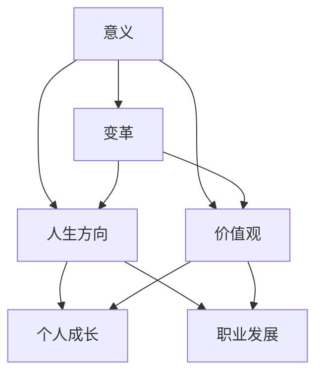

                 

**文章标题：意义的重塑：如何在变革中找到人生方向**

关键词：意义重塑、人生方向、变革、自我探索、职业生涯规划

摘要：本文从多个角度探讨了在快速变革的社会中如何找到人生方向。通过分析核心概念、方法论与实践，以及实际案例分析，为读者提供了一步一步找到人生方向的方法和策略。

---

### **第一部分：引言与背景**

#### **1.1 问题的提出与背景**

在当今这个快速变革的时代，人们面临着前所未有的挑战。社会、经济、科技等各个领域都在经历着巨大的变化，这些变化对个人的生活和工作产生了深远的影响。许多人感到迷茫和不安，不知道如何在这样的变革中找到自己的方向。

**1.1.1 社会变革的挑战**

随着全球化和技术的快速发展，社会结构、文化观念、生活方式等都在发生着深刻的变化。这些变革带来了新的机遇，但同时也带来了许多挑战。例如，就业市场的变化使得许多人需要不断学习新技能以适应新的工作需求；社会的快速变化使得人们的价值观和生活方式发生了变化，许多人开始质疑自己的价值和意义。

**1.1.2 人生方向的迷失**

在这样的背景下，许多人开始感到迷茫，不知道自己的人生方向在哪里。他们可能感到自己的工作不再有意义，或者对自己的未来感到不确定。这种迷失感可能导致心理压力、焦虑和抑郁等问题。

**1.1.3 重新定义意义的必要性**

为了应对这些挑战，重新定义自己的意义变得尤为重要。通过重新审视自己的价值观、目标和生活，人们可以找到新的方向，为自己的生活注入新的动力。这个过程不仅可以帮助个人找到自己的方向，还可以提高生活质量，增强幸福感。

#### **1.2 问题描述**

**1.2.1 个人成长与发展的障碍**

在追求人生方向的过程中，许多人会遇到各种障碍。这些障碍可能来自外部环境，也可能来自个人内部。例如，经济压力、家庭责任、社会期望等外部因素可能会影响个人的决策和行动；而自我怀疑、缺乏自信、恐惧失败等内部因素也可能阻碍个人的成长和发展。

**1.2.2 职业生涯规划的问题**

职业生涯规划也是许多人在追求人生方向时面临的一个重大问题。在快速变化的社会中，职业发展路径变得不再明确，许多人不知道自己的职业前景和未来方向。这可能导致职业倦怠、工作满意度下降等问题。

**1.2.3 心理健康与生活质量**

人生方向的迷失不仅影响个人的心理健康，还会影响生活质量。缺乏明确的人生方向可能导致人们感到无所事事、迷茫和焦虑，影响他们的生活满意度。因此，找到人生方向对于保持心理健康和提高生活质量具有重要意义。

#### **1.3 问题解决**

**1.3.1 重建个人价值观**

在寻找人生方向的过程中，重建个人价值观是非常重要的。个人价值观是人们行为和决策的指导原则，它们决定了人们如何看待自己和世界。通过重新审视和重构自己的价值观，人们可以更好地理解自己的需求、目标和生活方式。

**1.3.2 明确个人目标与使命**

明确个人目标与使命是找到人生方向的关键步骤。个人目标是指个人希望实现的具体目标，而个人使命则是个人存在的更深层次的意义和目标。通过明确自己的目标和使命，人们可以更好地规划自己的生活和职业生涯。

**1.3.3 提高适应能力与灵活性**

在快速变革的时代，提高适应能力与灵活性变得尤为重要。这意味着人们需要学会接受变化，灵活调整自己的思维和行为，以适应不断变化的环境。通过提高适应能力与灵活性，人们可以更好地应对变革带来的挑战。

#### **1.4 边界与外延**

**1.4.1 变革的类型与影响**

变革可以来自多个方面，包括技术变革、社会变革、个人变革等。不同类型的变革会对人们的生活和职业生涯产生不同的影响。例如，技术变革可能会改变工作方式和工作内容，而社会变革可能会改变价值观和生活方式。

**1.4.2 不同文化背景下的意义重塑**

文化背景对个人的意义重塑过程有着重要影响。在不同的文化背景下，人们对意义的理解和追求可能有所不同。例如，在一些文化中，家庭和社交关系可能被视为最重要的意义来源，而在其他文化中，个人的成就和自我实现可能更为重要。

**1.4.3 个体差异在意义重塑中的作用**

个体差异在意义重塑过程中起着重要作用。不同的人在价值观、兴趣爱好、生活经历等方面存在差异，这些差异会影响他们对意义的理解和追求。了解和尊重个体差异有助于人们更好地找到自己的人生方向。

#### **1.5 概念结构与核心要素组成**

**1.5.1 核心概念解释**

在讨论意义的重塑时，需要明确几个核心概念，包括意义、变革、人生方向、价值观等。这些概念是理解本文主题的基础。

**1.5.2 要素关系图**

为了更好地理解意义重塑的过程，我们可以通过要素关系图来展示各个核心概念之间的相互关系。

**1.5.3 案例分析**

通过案例分析，我们可以更深入地理解意义重塑的过程。以下是几个实际的案例，展示了不同个体在面临变革时如何找到自己的人生方向。

---

### **第二部分：核心概念与理论**

#### **2.1 意义的界定**

**2.1.1 意义的多维度理解**

意义是一个复杂的概念，可以从多个维度进行理解。从个人层面来看，意义可以是个人的价值观、信仰、兴趣和目标。从社会层面来看，意义可以是对社会、文化、环境和人类进步的贡献。

**2.1.2 个人与社会意义**

个人意义和社会意义相互关联。个人意义是指个体对自己的理解和价值认同，而社会意义则是指个体对社会和他人的价值和贡献。通过实现个人意义，个体可以同时实现社会意义。

**2.1.3 意义与价值观的关系**

意义与价值观密切相关。价值观是人们行为和决策的指导原则，它们决定了人们如何看待世界和自身。意义则是价值观在个人生活中的具体体现，它反映了人们的价值观和行为目标。

#### **2.2 变革的心理学理论**

**2.2.1 变革的心理过程**

变革是一个心理过程，涉及到认知、情感和行为的变化。在变革过程中，人们可能会经历适应、抵触、接受和整合等阶段。理解这些阶段有助于更好地应对变革带来的挑战。

**2.2.2 变革中的心理挑战**

变革中的心理挑战包括焦虑、压力、不确定性和失落感等。通过认识和理解这些挑战，人们可以更好地应对并克服它们。

**2.2.3 心理适应策略**

心理适应策略包括自我反思、积极心态、有效沟通和灵活应对等。这些策略有助于人们更好地适应变革，找到新的平衡点。

#### **2.3 人生方向的原理与模型**

**2.3.1 人生方向的理论基础**

人生方向的理论基础包括自我认知、目标设定、价值观整合和生涯规划等。这些理论为人们提供了找到人生方向的框架和指导。

**2.3.2 人生方向评估模型**

人生方向评估模型是一种帮助人们评估自己当前人生方向的方法。通过这个模型，人们可以了解自己在不同方面的发展状况，并找到改进的方向。

**2.3.3 人生方向制定与调整**

制定和调整人生方向是一个持续的过程。人们需要不断地审视自己的价值观、目标和环境，以适应新的变化和挑战。

---

### **第三部分：方法论与实践**

#### **3.1 自我探索与反思**

**3.1.1 自我探索的步骤**

自我探索是一个深入理解自己的过程。以下是自我探索的几个关键步骤：

1. **自我认知**：了解自己的性格、兴趣、优势和弱点。
2. **价值观评估**：审视自己的价值观，了解它们如何影响行为和决策。
3. **目标设定**：明确自己的短期和长期目标。
4. **生活方式评估**：了解自己的生活方式是否与目标相匹配。
5. **反思与调整**：定期反思自己的行为和决策，并根据实际情况进行调整。

**3.1.2 反思技巧与工具**

反思技巧和工具可以帮助人们更好地进行自我探索。以下是一些常用的反思技巧和工具：

1. **日记**：通过写日记记录自己的想法、感受和行为。
2. **冥想**：通过冥想深入思考自己的内心世界。
3. **心理测试**：通过心理测试了解自己的性格、优势和弱点。
4. **咨询**：寻求专业人士的帮助，进行深入的自我探索。

**3.1.3 个人成长案例分享**

以下是几个个人成长案例，展示了如何通过自我探索找到人生方向。

---

#### **3.2 目标设定与行动计划**

**3.2.1 目标设定的SMART原则**

目标设定是一个重要的步骤，需要遵循SMART原则：

1. **具体（Specific）**：目标要明确、具体，以便衡量和实现。
2. **可衡量（Measurable）**：目标要有可衡量的指标，以便评估进展。
3. **可实现（Achievable）**：目标要现实、可行，避免设定过高或过低的目标。
4. **相关（Relevant）**：目标要与个人价值观和人生方向相关。
5. **时限（Time-bound）**：目标要有明确的时间限制，以便有计划地实现。

**3.2.2 行动计划的制定与执行**

制定行动计划是实现目标的关键步骤。以下是制定和执行行动计划的几个关键步骤：

1. **分解目标**：将大目标分解为小目标，以便更容易实现。
2. **制定行动计划**：为每个小目标制定具体的行动计划。
3. **执行行动计划**：按照计划执行行动，并及时调整。
4. **监控与评估**：定期监控行动进展，并根据实际情况进行调整。

**3.2.3 时间管理与优先级设定**

时间管理和优先级设定是实现目标的重要工具。以下是几个关键步骤：

1. **时间规划**：制定时间表，合理安排时间。
2. **优先级设定**：根据目标的紧急程度和重要性设定优先级。
3. **避免拖延**：设定明确的时间限制，避免拖延。
4. **专注与效率**：专注于重要任务，提高工作效率。

---

#### **3.3 职业生涯规划与调整**

**3.3.1 职业生涯规划的步骤**

职业生涯规划是一个长期的过程，需要以下几个关键步骤：

1. **自我评估**：了解自己的职业兴趣、能力和价值观。
2. **市场分析**：了解行业趋势、就业市场和职业前景。
3. **目标设定**：设定明确的职业目标和规划。
4. **技能提升**：根据目标提升自己的技能和知识。
5. **行动计划**：制定详细的行动计划，并严格执行。

**3.3.2 职业适应性评估**

职业适应性评估是一个重要的步骤，可以帮助人们了解自己在不同职业领域的适应性。以下是几个关键步骤：

1. **自我评估**：了解自己的职业兴趣、能力和价值观。
2. **能力测试**：通过能力测试了解自己的优势和弱点。
3. **职业咨询**：寻求专业人士的帮助，进行职业适应性评估。
4. **反馈与调整**：根据评估结果调整自己的职业规划。

**3.3.3 职业发展路径的选择**

职业发展路径的选择是一个复杂的过程，需要考虑多个因素。以下是几个关键步骤：

1. **目标设定**：明确自己的职业目标和发展方向。
2. **市场分析**：了解行业趋势、就业市场和职业前景。
3. **技能提升**：根据目标提升自己的技能和知识。
4. **行动计划**：制定详细的行动计划，并严格执行。
5. **持续评估与调整**：定期评估职业发展路径，并根据实际情况进行调整。

---

### **第四部分：意义重塑的案例分析**

#### **4.1 案例背景介绍**

**4.1.1 案例一：从迷茫到清晰**

张三，一个年轻的职场新人，毕业后进入了一家知名企业。然而，在工作了一段时间后，他开始感到迷茫和不安。他发现自己对工作没有热情，不知道自己的未来在哪里。

**4.1.2 案例二：在变革中找到自我**

李四，一个中年职场人士，由于公司裁员，他失去了一份稳定的工作。面对失业的困境，他决定重新审视自己的人生方向，寻找新的机会。

**4.1.3 案例三：意义重塑与心理健康**

王五，一个年轻的企业家，在经历了公司破产和个人债务后，陷入了深深的抑郁。通过自我探索和心理咨询，他找到了新的意义，重新振作起来。

#### **4.2 案例分析与讨论**

**4.2.1 案例一分析**

张三在寻找人生方向的过程中，经历了迷茫、焦虑和困惑。通过自我探索和职业咨询，他找到了自己的兴趣和热情，重新找到了人生的方向。

**4.2.2 案例二分析**

李四在失业后，面临着巨大的压力和不确定性。通过职业规划和心理支持，他找到了新的职业机会，实现了职业转型，找到了新的自我价值。

**4.2.3 案例三分析**

王五在经历破产和抑郁后，通过自我探索和心理治疗，找到了新的意义。他开始关注心理健康和公益事业，为社会做出了贡献，重新找到了生活的动力。

#### **4.3 案例启示与反思**

**4.3.1 启示与收获**

通过这些案例，我们可以得出以下几点启示和收获：

1. **自我探索的重要性**：通过自我探索，人们可以更好地了解自己，找到自己的兴趣和热情。
2. **职业规划的重要性**：职业规划可以帮助人们找到适合自己的职业道路，实现个人价值。
3. **心理支持的重要性**：在面对困难和挑战时，心理支持可以帮助人们保持积极的心态，找到新的方向。

**4.3.2 反思与展望**

在快速变革的时代，意义重塑变得尤为重要。我们需要不断地反思自己的价值观、目标和生活方式，以适应新的变化和挑战。同时，我们也需要关注心理健康，为自我探索和职业规划提供支持。

---

### **第五部分：结论与展望**

#### **5.1 主要发现与结论**

通过本文的研究，我们得出以下主要发现和结论：

1. **意义重塑的重要性**：在快速变革的时代，重新定义自己的意义变得尤为重要。它不仅可以帮助个人找到自己的方向，还可以提高生活质量，增强幸福感。

2. **核心概念与理论的重要性**：理解核心概念和理论，如意义、变革、人生方向等，是找到人生方向的基础。

3. **方法论与实践的重要性**：方法论与实践是找到人生方向的关键步骤，包括自我探索、目标设定、职业规划等。

#### **5.2 反思与展望**

在快速变革的时代，意义重塑不仅对个人具有重要意义，也对社会有着深远的影响。以下是一些反思与展望：

1. **社会层面的意义重塑**：社会需要为个人提供更多的支持和资源，帮助他们进行意义重塑。例如，提供职业咨询、心理健康服务和培训等。

2. **个体层面的意义重塑**：每个人都需要不断地反思自己的价值观、目标和生活方式，以适应新的变化和挑战。通过自我探索和职业规划，个体可以找到新的方向和意义。

3. **持续的研究与探索**：意义重塑是一个复杂的过程，需要不断地研究和探索。未来的研究可以关注意义重塑的理论、实践和社会影响，以期为人们提供更有效的指导。

---

**作者：AI天才研究院/AI Genius Institute & 禅与计算机程序设计艺术 /Zen And The Art of Computer Programming**

