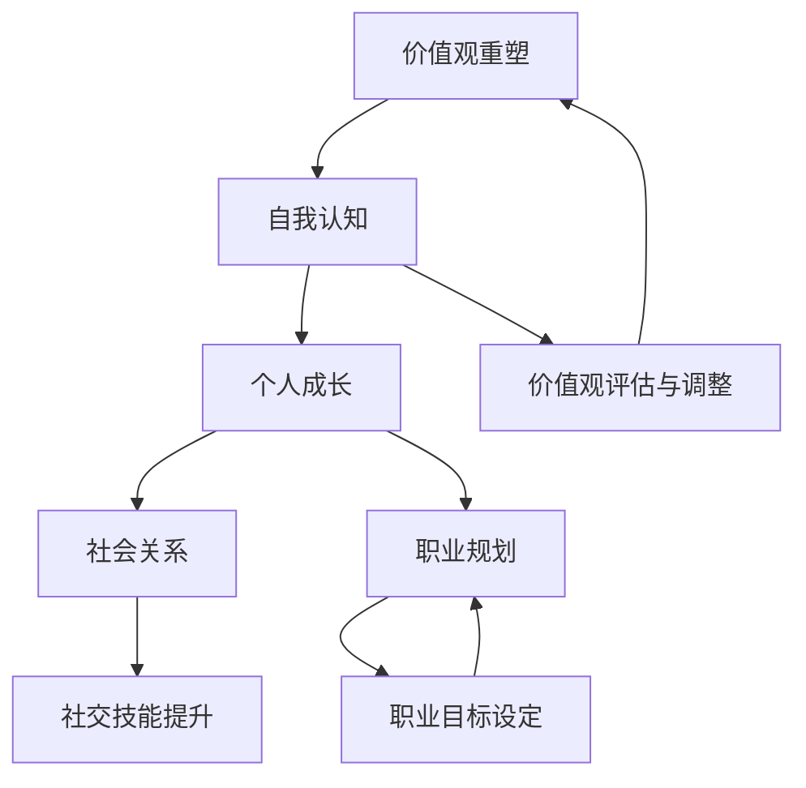
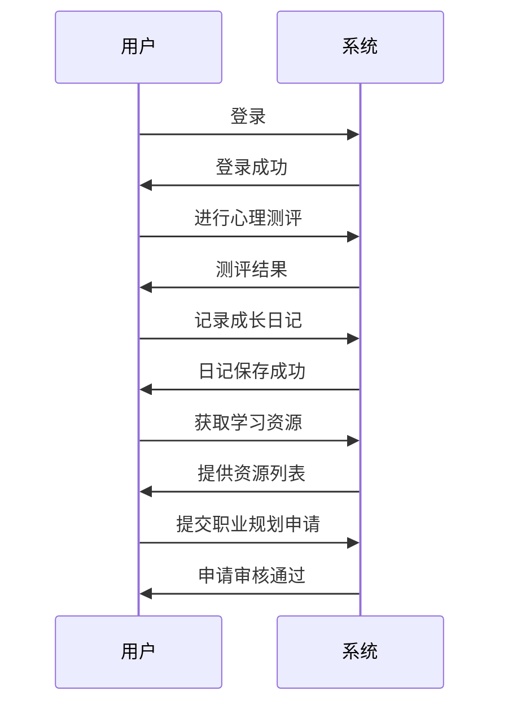

                 

## 引言与背景介绍

在现代社会中，个人价值的实现已经成为人们关注的焦点。随着社会变迁和技术的快速发展，传统的价值观念和生活方式正在被重新审视。这种背景下，如何重塑个人的价值观念，实现自我价值的最大化，成为了一个亟待解决的问题。本文将围绕这一主题展开讨论，旨在为读者提供一套系统、全面的指导方案。

### 问题背景与现状

现代社会充满了机遇与挑战。一方面，科技的发展带来了前所未有的便利和可能性；另一方面，社会结构的变革、全球化进程的加快，以及信息爆炸所带来的认知负担，也对个人的价值观和生活方式产生了深远影响。许多人感到迷茫和困惑，不知道如何在这个充满变数的世界中找到自己的定位和价值。

此外，随着市场经济的发展和消费主义的盛行，物质追求成为许多人生活的主导。在追求物质满足的过程中，个人精神世界的空虚和社会关系的淡化成为不可忽视的问题。这种状况引发了关于个人价值实现的深刻思考。

### 价值观重塑的必要性

价值观重塑的必要性体现在以下几个方面：

1. **应对社会变迁**：随着社会的发展和变革，传统的价值观念可能不再适用于现代社会。重塑价值观有助于更好地适应新的社会环境，找到新的价值定位。
   
2. **解决个人困惑**：在现代社会中，许多人感到迷茫和困惑，不知道自己的价值和意义何在。通过价值观重塑，可以帮助个人明确自己的人生目标，找到生活的方向和动力。

3. **促进精神成长**：在物质追求之外，精神成长同样重要。重塑价值观有助于提升个人的精神境界，培养积极的情感态度，增强心理韧性。

4. **构建和谐社会**：个人的价值实现不仅仅关乎自己，也关系到社会的和谐与进步。通过重塑价值观，可以培养更加和谐的社会关系，促进社会的稳定与繁荣。

### 研究目的与意义

本文的研究目的在于探讨如何在现代社会中实现自我价值，提出一套可行的策略和方法。具体而言，本文将从以下几个方面展开：

1. **理论探讨**：分析现代社会中的价值观变迁，探讨个人价值观重塑的必要性和方法。
   
2. **实践指导**：结合实际案例，提供具体的实践指南，帮助个人进行自我认知和价值观重塑。

3. **综合评估**：评估个人价值观重塑的效果，探讨如何实现个人价值与社会价值的平衡。

本文的研究意义在于：

1. **理论贡献**：为个人价值观重塑提供理论支持，丰富相关领域的理论研究。

2. **实践指导**：为个人提供实用的指导方案，帮助他们在现代社会中实现自我价值。

3. **社会意义**：通过个人价值观的重塑，促进社会的和谐与进步，推动社会的发展。

### 研究方法与框架

本文采用以下研究方法：

1. **文献综述**：通过查阅相关文献，了解当前学术界对个人价值观重塑的研究进展和观点。
   
2. **案例分析**：选取一些成功的个人价值观重塑案例，进行分析和总结，提炼出具有普适性的实践指南。

3. **理论框架构建**：基于文献综述和案例分析，构建一个系统的理论框架，为个人价值观重塑提供理论依据。

本文的研究框架如下：

1. **引言与背景介绍**：阐述研究问题背景和现状，说明研究目的和意义。
   
2. **现代社会中的价值观变迁**：分析现代社会价值观的特点和变迁过程。
   
3. **自我认知与价值观的重塑**：探讨自我认知的重要性，提出价值观重塑的方法和实践指南。
   
4. **个人成长与自我实现**：讨论个人成长的动力、目标设定和持续成长的策略。
   
5. **社会关系与人际交往**：分析社会关系的本质，提供建立有效社会关系的指导。
   
6. **职业规划与自我价值实现**：探讨职业规划的重要性，提出实现自我价值的策略。
   
7. **总结与未来展望**：总结全文内容，提出未来研究的方向和建议。

### 本章小结

本章介绍了本文的研究背景、目的和意义，以及研究方法和框架。通过对现代社会价值观变迁的分析，本文为读者提供了一个关于如何重塑个人价值观的初步理解。在接下来的章节中，我们将深入探讨具体的策略和实践方法，帮助读者在现代社会中实现自我价值。

---

**关键字：** 价值观重塑、自我价值实现、个人成长、社会变迁、自我认知

**摘要：** 本文探讨了如何在现代社会中重塑个人价值观，实现自我价值。通过对现代社会价值观变迁的分析，提出了自我认知与价值观重塑的重要性，以及具体的实践指南。文章旨在为个人提供一套系统、全面的指导方案，帮助他们更好地适应社会变革，实现自我价值。

---

## 现代社会中的价值观变迁

### 2.1 价值观变迁的历史回顾

价值观变迁是人类社会发展历程中不可避免的现象。回顾历史，我们可以看到价值观在不同时期有着显著的变化。

在农业社会，土地和劳动力是最重要的资源。因此，勤劳、节俭、忠诚等价值观得到了广泛的认可和推崇。人们重视家庭和社区的稳定，强调集体利益和社会责任。

随着工业革命的到来，社会结构发生了巨大变化。机器和科技成为生产力的主导，个人主义逐渐兴起。人们开始重视个人权利和自由，强调自我实现和个人成就。

进入信息化社会，信息技术和网络技术的飞速发展带来了前所未有的变革。信息的快速传播和全球化的进程，使得人们的价值观更加多元和复杂。个人自由、平等、多元化成为现代社会的主流价值观。

### 2.2 现代社会价值观的特点

现代社会价值观具有以下几个显著特点：

1. **个人主义**：个人主义在现代社会中占据主导地位。人们更加关注个人自由、个人权利和个人成就。个人主义强调个体的独立性和自我实现，追求个人利益的最大化。

2. **多元化**：随着全球化的进程，不同文化、价值观和信仰的交融，使得现代社会价值观呈现多元化特点。人们更加开放和包容，尊重不同的观点和文化。

3. **自由和平等**：自由和平等是现代社会价值观的核心。人们追求自由表达、自由选择和自由发展。同时，平等原则也被广泛认同，反对任何形式的歧视和不平等。

4. **科技驱动**：科技在现代社会中扮演着重要角色，科技驱动也成为现代社会价值观的一个重要特点。人们更加依赖科技来解决问题，追求效率和创新。

### 2.3 影响价值观变迁的因素

价值观的变迁受到多种因素的影响：

1. **经济发展**：经济的发展水平直接影响价值观的变迁。随着经济的繁荣，人们的生活水平提高，对于个人自由和物质享受的追求也日益增加。

2. **社会变革**：社会的变革，如政治制度的变革、文化的传播和科技的发展，都会对价值观产生深远影响。

3. **文化多样性**：不同文化之间的交流和碰撞，促进了价值观的多元化发展。人们更加开放和包容，接受不同的价值观和文化。

4. **信息技术**：信息技术的快速发展改变了人们的认知方式和生活方式，对价值观产生了重要影响。人们更加关注个人隐私和信息安全，对网络伦理和道德问题进行了深入探讨。

### 2.4 价值观变迁对社会的影响

价值观的变迁对社会产生了深远的影响：

1. **人际关系**：价值观的变迁使得人际关系更加复杂。个人主义的兴起，使得人们更加关注个人利益，导致人际关系变得更加疏远。

2. **社会问题**：随着价值观的变迁，一些新的社会问题也随之产生。例如，个人主义的过度追求可能导致社会关系的淡化，引发孤独感和心理问题。

3. **文化冲突**：不同价值观之间的碰撞和冲突，可能导致文化冲突和社会动荡。

4. **社会进步**：价值观的变迁也带来了社会的进步。多元化的价值观促进了社会创新和多样性，推动了社会的繁荣和发展。

### 2.5 本章小结

本章分析了现代社会价值观变迁的历史背景、特点、影响因素以及对社会的影响。通过了解价值观变迁的背景和影响，我们可以更好地理解现代社会，为个人价值观的重塑提供理论依据。在接下来的章节中，我们将深入探讨如何进行自我认知与价值观重塑，帮助个人实现自我价值。

---

## 自我认知与价值观的重塑

### 3.1 自我认知的重要性

自我认知是价值观重塑的基础。只有深刻理解自己的内在需求和价值观，个人才能找到真正的方向，实现自我价值的最大化。自我认知的重要性体现在以下几个方面：

1. **明确个人目标**：通过自我认知，个人可以明确自己的兴趣、优势和目标，从而制定更加清晰和切实可行的人生规划。

2. **提升心理韧性**：自我认知有助于提升个人的心理韧性，增强面对挑战和压力的能力。了解自己的优点和不足，个人可以更加从容地应对生活中的困难。

3. **增强自信心**：自我认知使个人更加了解自己的价值和潜力，从而增强自信心。自信的人更容易在生活和工作中取得成功。

4. **优化人际关系**：自我认知有助于改善人际关系。了解自己的性格特点和沟通风格，个人可以更好地与他人相处，建立和谐的社会关系。

### 3.2 价值观重塑的方法

重塑价值观是一个复杂的过程，需要时间和耐心。以下是一些有效的方法：

1. **反思与自我审视**：定期进行反思和自我审视，深入思考自己的价值观和行为。通过自我反省，发现自身的不足和需要改进的地方。

2. **学习与拓展知识**：通过学习和阅读，拓展自己的知识面和视野。了解不同文化、价值观和哲学思想，有助于形成更加全面和多元的价值观。

3. **实践与体验**：将理论知识付诸实践，通过体验不同的人生角色和经历，不断调整和优化自己的价值观。

4. **寻求专业指导**：咨询专业的心理咨询师或生涯规划师，获取专业的指导和反馈。专业人士可以提供科学的评估和有效的建议。

### 3.3 自我认知与价值观重塑的案例研究

以下是一些成功的自我认知与价值观重塑案例：

1. **案例一**：一位年轻的工程师，在职业生涯初期感到迷茫和困惑。通过反思和自我审视，他意识到自己对于科技的热情和对于创新的追求。他决定专注于自己热爱的事业，不断学习和提升自己的技能。最终，他成为了一名杰出的工程师，为公司创造了巨大的价值。

2. **案例二**：一位企业家，在创业初期面临巨大的压力和挑战。通过自我认知，他认识到自己的价值观在于创造价值和帮助他人。他调整了自己的经营策略，更加注重社会责任和可持续发展。他的公司不仅取得了商业上的成功，也赢得了社会的广泛认可。

3. **案例三**：一位教师，在教育岗位上工作了多年。通过反思和自我审视，她意识到自己对教育事业的热爱和对学生的关心。她决定不断提升自己的教学水平，关注学生的心理健康和全面发展。她成为了一名深受学生和家长喜爱的优秀教师。

### 3.4 实践指南：如何进行自我认知与价值观重塑

以下是一些具体的实践指南，帮助个人进行自我认知与价值观重塑：

1. **设定目标**：明确自己的短期和长期目标，将目标具体化和可量化。

2. **定期反思**：每周或每月进行一次自我反思，记录自己的思考和行为，分析自己的优点和不足。

3. **阅读和学习**：定期阅读书籍、文章和参加培训课程，拓展知识面和视野。

4. **实践和体验**：尝试不同的人生角色和经历，通过实践来验证和调整自己的价值观。

5. **寻求反馈**：向家人、朋友和专业人士寻求反馈，了解自己的行为和价值观是否得到了他人的认可。

6. **记录成长**：记录自己的成长过程，包括成功的经验和失败的教训，不断总结和反思。

### 3.5 本章小结

自我认知与价值观重塑是个人成长和实现自我价值的关键。通过深入理解自己的内在需求和价值观，个人可以找到真正的方向，实现自我价值的最大化。本章提出了自我认知的重要性，以及一系列有效的实践指南，帮助个人进行自我认知与价值观重塑。在接下来的章节中，我们将进一步探讨个人成长与自我实现，以及社会关系与人际交往等方面的内容。

---

## 个人成长与自我实现

### 4.1 个人成长的动力

个人成长的动力源于内在的渴望和外在的刺激。内在的渴望包括对知识的追求、对自我超越的渴望、对个人价值的实现等；外在的刺激则包括社会环境的变化、他人的鼓励和激励、以及职业发展机会等。以下是一些具体的影响因素：

1. **内在动机**：个人对成就、自我实现、自我超越的追求是成长的重要动力。这种动机通常源于个人的兴趣、激情和价值观。

2. **社会压力**：社会对于个人成功的期望和压力也是推动个人成长的重要因素。例如，家庭、学校、职场等环境中的期望和竞争，可以激发个人的积极性和成长动力。

3. **激励和反馈**：正面的激励和及时的反馈可以增强个人的自信心和成长动力。例如，成功的项目、优秀的业绩、他人的赞扬等，都可以成为个人成长的动力。

4. **危机和挑战**：面对危机和挑战，个人需要调整和适应，这种过程可以促使个人成长和提升。例如，失业、健康问题、人际关系冲突等，都是个人成长的重要契机。

### 4.2 自我实现的目标设定

自我实现的目标设定是个人成长的重要步骤。一个明确、具体、可衡量的目标能够为个人提供方向和动力。以下是设定自我实现目标的一些关键步骤：

1. **目标明确性**：设定清晰的目标，明确自己想要实现的具体成果。例如，“我要在五年内成为公司的高级工程师”或“我要在三个月内减掉10公斤体重”。

2. **目标具体性**：将目标具体化，制定详细的行动计划。例如，为了成为高级工程师，可以设定学习新技能、参与项目、取得专业认证等具体目标。

3. **目标可行性**：目标需要是可实现的，避免设定过于理想化的目标。例如，设定“每天学习两个小时新技能”比“每天学习八个小时新技能”更加可行。

4. **目标优先级**：根据目标的紧急性和重要性，设定优先级。例如，如果某项目标对职业发展至关重要，可以将其设定为优先目标。

### 4.3 个人成长路径的规划

个人成长路径的规划是确保目标实现的必要步骤。以下是一些规划个人成长路径的方法：

1. **制定长期和短期计划**：将长期目标分解为短期目标，制定详细的行动计划。例如，如果目标是五年内成为高级工程师，可以将这五年分解为年度、季度和月度的短期目标。

2. **评估和调整**：定期评估自己的成长进度，并根据实际情况进行调整。例如，如果发现某个短期目标过于困难，可以适当调整目标或计划。

3. **资源整合**：利用各种资源和机会来支持个人成长。例如，参加培训课程、阅读相关书籍、寻求导师指导等。

4. **时间管理**：合理安排时间，确保有足够的时间用于个人成长。例如，利用周末和业余时间进行学习和发展。

### 4.4 持续成长的策略

持续成长需要策略和方法的支撑。以下是一些有效的持续成长策略：

1. **持续学习**：学习是成长的重要动力。利用各种学习资源，如在线课程、书籍、研讨会等，不断更新自己的知识和技能。

2. **自我反思**：定期进行自我反思，评估自己的成长进度和效果。通过反思，找出自己的不足和需要改进的地方。

3. **建立支持网络**：与他人建立联系，建立一个支持自己的成长网络。例如，加入专业社群、参与行业交流活动等。

4. **实践和经验**：将所学知识付诸实践，通过实践经验来提升自己的能力。例如，参与实际项目、进行实验等。

5. **寻求反馈**：向他人寻求反馈，了解自己的表现和成长效果。通过反馈，找到自己的优势和不足，制定改进计划。

### 4.5 个人成长的挑战与应对

个人成长过程中不可避免地会遇到各种挑战。以下是一些常见的挑战及其应对策略：

1. **挫折与失败**：挫折和失败是成长的一部分。面对挫折，要保持积极的态度，从失败中学习经验，不断提升自己。

2. **时间管理**：时间管理是个人成长的重要挑战。合理安排时间，确保有足够的时间用于学习和发展。

3. **资源限制**：资源限制可能影响个人成长。寻找替代资源，如免费在线课程、开源工具等，以支持个人成长。

4. **外部压力**：外部压力可能影响个人成长。学会平衡工作和生活，保持身心健康，提高抗压能力。

### 4.6 本章小结

个人成长与自我实现是现代社会中不可或缺的一部分。通过设定明确的目标、规划成长路径、采取持续成长的策略，个人可以在现代社会中实现自我价值。本章讨论了个人成长的动力、目标设定、路径规划、持续成长策略以及应对挑战的方法。在接下来的章节中，我们将进一步探讨社会关系与人际交往、职业规划与自我价值实现等方面的内容，帮助读者实现全方位的个人成长与自我实现。

---

## 社会关系与人际交往

### 5.1 社会关系的本质

社会关系是个人在社会中与他人建立的各种联系。它不仅包括血缘关系、婚姻关系，还包括工作关系、朋友关系等。社会关系的本质是人与人之间的相互影响和互动，通过这些互动，个人能够获得情感支持、资源交换和社会认同。

1. **情感支持**：社会关系为个人提供了情感上的支持。在困难时期，朋友和家人的支持可以帮助个人度过难关，增强心理韧性。

2. **资源交换**：社会关系也促进了资源的交换。在职场中，同事之间的合作和分享可以提升工作效率；在个人生活中，朋友之间的互助可以解决实际问题。

3. **社会认同**：通过社会关系，个人能够获得社会认同，增强自我价值感。例如，在社区中积极参与公益活动，可以获得社区成员的认可和尊重。

### 5.2 人际交往的艺术

人际交往是一门艺术，需要技巧和实践。以下是一些关键技巧：

1. **有效沟通**：沟通是人际交往的核心。有效的沟通包括倾听、表达清晰和尊重对方观点。通过有效的沟通，可以建立信任和理解，促进人际关系的和谐。

2. **建立信任**：信任是人际关系的基础。建立信任需要诚实、可靠和透明。避免撒谎和隐瞒，积极履行承诺，这些都是建立信任的重要行为。

3. **情感共鸣**：情感共鸣是建立深层次人际关系的关键。通过理解和分享他人的情感体验，可以增进彼此之间的情感联系。

4. **处理冲突**：人际交往中不可避免地会出现冲突。处理冲突的关键是冷静、客观和寻求共识。通过有效的沟通和妥协，可以解决冲突，维护人际关系的稳定。

### 5.3 建立有效社会关系的方法

建立和维护有效社会关系需要方法和策略。以下是一些实用的方法：

1. **主动社交**：积极参与社交活动，扩大自己的社交圈子。通过参加聚会、活动、社团等，可以结识新朋友，建立新的社会关系。

2. **保持联系**：建立社会关系后，要保持联系。定期与朋友和家人沟通，保持联系，增进感情。对于职场关系，可以通过邮件、电话或社交媒体保持联系。

3. **互惠互利**：社会关系的建立和维护需要互惠互利。在帮助他人的同时，也要学会接受他人的帮助。通过互相支持和合作，可以建立更加稳固的社会关系。

4. **展示价值**：在社交场合中，展示自己的专业能力和独特价值，可以吸引他人的注意和兴趣。这有助于建立有深度和意义的社会关系。

### 5.4 人际交往中的冲突与解决

人际交往中的冲突是不可避免的。以下是一些解决冲突的方法：

1. **积极沟通**：冲突发生时，首先要保持冷静，通过积极沟通来解决问题。倾听对方的意见，表达自己的看法，寻求共同点。

2. **寻求共识**：通过寻求共识，可以找到解决冲突的方案。共识可以是妥协，也可以是双方都能接受的解决方案。

3. **第三方调解**：如果冲突难以解决，可以寻求第三方的帮助。第三方可以是专业的调解人，也可以是双方都信任的朋友或家人。

4. **时间缓和**：有时候，时间可以缓和冲突。给对方一些时间冷静思考，也可以给自己一些时间来反思和调整。

### 5.5 社交网络对个人价值实现的影响

社交网络的发展为个人价值实现提供了新的机遇和挑战。以下是一些影响：

1. **拓宽视野**：通过社交网络，个人可以接触到各种信息和观点，拓宽视野，增加知识储备。

2. **资源获取**：社交网络可以帮助个人获取职业机会、教育资源和其他资源，促进个人价值实现。

3. **影响力塑造**：在社交网络中，个人可以通过分享知识和经验，塑造自己的影响力，提升个人价值。

4. **信息过载**：社交网络的信息量巨大，个人需要学会筛选和过滤信息，避免信息过载带来的压力。

### 5.6 本章小结

社会关系与人际交往是个人成长和实现自我价值的重要组成部分。通过建立有效社会关系，个人可以获得情感支持、资源交换和社会认同，从而实现自我价值。本章讨论了社会关系的本质、人际交往的艺术、建立社会关系的方法、人际冲突的解决以及社交网络对个人价值实现的影响。在接下来的章节中，我们将进一步探讨职业规划与自我价值实现的内容。

---

## 职业规划与自我价值实现

### 6.1 职业规划的重要性

职业规划是个人实现自我价值的重要手段。一个明确的职业规划可以帮助个人更好地定位自己的职业方向，设定职业目标，制定具体的行动计划，从而实现职业上的成功和个人价值的最大化。以下是职业规划的重要性和具体内容：

1. **明确职业目标**：职业规划首先需要明确个人的职业目标。这些目标可以是短期目标，如提升某一技能或完成特定项目；也可以是长期目标，如晋升到高级职位或创业。明确的目标为个人提供了方向和动力。

2. **评估个人优势**：了解自己的优势和特长，是制定职业规划的关键。通过自我评估，个人可以识别自己的技能、经验和兴趣，从而选择适合自己的职业路径。

3. **制定行动计划**：职业规划需要具体的行动计划。这包括设定具体的目标和时间表，以及实现这些目标所需的具体步骤。例如，如果目标是提升某项技能，可以制定学习计划，包括参加培训课程、阅读相关书籍等。

4. **动态调整**：职业规划不是一成不变的，它需要根据个人情况和社会环境的变化进行动态调整。通过定期评估和反思，个人可以及时调整职业规划，以适应新的挑战和机遇。

### 6.2 职业规划的方法与步骤

职业规划是一个系统的过程，需要以下几个步骤：

1. **自我评估**：这是职业规划的第一步。通过自我评估，个人可以了解自己的性格特点、价值观、兴趣爱好、技能和经验。自我评估可以通过心理测试、职业咨询或自我反思来完成。

2. **市场调研**：在了解自己之后，个人需要了解就业市场的需求和发展趋势。这包括研究不同行业和职位的就业前景、薪资水平和晋升路径。市场调研可以通过查阅相关报告、参加行业研讨会或与专业人士交流来完成。

3. **目标设定**：基于自我评估和市场调研，个人可以设定短期和长期职业目标。这些目标应该是具体、可衡量、可实现和有时限的（SMART原则）。

4. **行动计划**：在设定目标后，个人需要制定具体的行动计划。这包括确定实现目标所需的步骤、资源和支持。例如，如果目标是晋升到高级职位，可以制定参加培训、积累项目经验、建立人脉等行动计划。

5. **执行与评估**：实施行动计划，并定期评估和调整。通过执行行动计划，个人可以逐步实现职业目标。同时，定期评估和反思可以及时发现问题和调整计划，确保职业规划的有效性。

### 6.3 职业生涯的平衡与调整

职业生涯的平衡与调整是职业规划中的重要一环。以下是一些关键点：

1. **时间管理**：有效的时间管理是维持职业生涯平衡的关键。通过合理安排工作时间，确保工作、家庭和个人生活的平衡。

2. **技能提升**：持续提升自己的技能和知识，以适应职业发展的需求。这不仅包括专业技能的提升，还包括软技能的培养，如沟通能力、团队合作和领导能力。

3. **工作与生活平衡**：保持工作与生活的平衡，避免职业压力过大影响身心健康。通过制定休假计划、参与兴趣爱好和与家人朋友相处，可以缓解工作压力，保持身心健康。

4. **职业发展路径**：根据个人兴趣和发展需求，适时调整职业发展路径。例如，如果发现当前职业路径不适合自己，可以考虑转行或寻求新的职业机会。

### 6.4 职业发展中的自我价值实现

职业发展中的自我价值实现是个人追求的重要目标。以下是一些实现自我价值的策略：

1. **积极贡献**：在工作中积极贡献，提升自己的工作质量和业绩。通过实现工作目标，个人可以感受到自我价值的实现。

2. **持续成长**：不断学习和成长，提升自己的专业技能和综合素质。通过持续成长，个人可以不断提高自己的职业竞争力，实现自我价值。

3. **建立人脉**：建立广泛的人脉网络，包括同事、行业专家、潜在雇主等。通过人脉网络，个人可以获得更多的职业机会和资源，实现自我价值。

4. **社会贡献**：通过职业活动，为社会做出贡献。例如，参与公益活动、志愿服务等，可以提升个人的社会影响力，实现自我价值。

### 6.5 职业规划中的挑战与应对

职业规划过程中，个人可能会面临各种挑战。以下是一些常见挑战及其应对策略：

1. **职业迷茫**：面对职业选择和方向，感到迷茫和不确定。应对策略包括进行职业咨询、参加职业规划课程，以及进行自我探索，找到适合自己的职业路径。

2. **职业瓶颈**：在职业发展过程中，可能会遇到瓶颈，感觉无法继续提升。应对策略包括寻找新的发展机会、寻求职业培训或转行。

3. **工作压力**：工作压力是职业规划中的常见问题。应对策略包括有效的时间管理、寻求心理支持和建立健康的生活方式。

4. **职业转换**：在职业转换过程中，可能会面临适应新环境和新工作的挑战。应对策略包括提前做好准备工作、寻求专业指导和建立新的社交网络。

### 6.6 本章小结

职业规划是个人实现自我价值的重要途径。通过明确的职业目标、科学的职业规划方法和有效的职业生涯管理，个人可以在职场中实现自我价值。本章讨论了职业规划的重要性、方法与步骤、职业生涯的平衡与调整、职业发展中的自我价值实现以及职业规划中的挑战与应对。在接下来的章节中，我们将进一步探讨价值观重塑的实践意义和未来发展趋势，帮助读者更好地理解如何在现代社会中实现自我价值。

---

## 总结与未来展望

### 7.1 全书内容的总结

本文从多个角度探讨了在现代社会中实现自我价值的途径。通过对现代社会价值观变迁的分析，我们认识到价值观重塑的必要性，并提出了一系列的方法和实践指南。本文的主要内容包括：

1. **引言与背景介绍**：阐述了研究的目的和意义，介绍了研究方法和框架。
2. **现代社会中的价值观变迁**：分析了历史背景、现代社会价值观的特点及其对社会的影响。
3. **自我认知与价值观的重塑**：探讨了自我认知的重要性，提出了价值观重塑的方法和实践指南。
4. **个人成长与自我实现**：讨论了个人成长的动力、目标设定、路径规划、持续成长策略以及挑战与应对。
5. **社会关系与人际交往**：分析了社会关系的本质、人际交往的艺术、建立有效社会关系的方法以及冲突与解决。
6. **职业规划与自我价值实现**：介绍了职业规划的重要性、方法与步骤、职业生涯的平衡与调整、职业发展中的自我价值实现以及职业规划中的挑战与应对。

### 7.2 价值观重塑的实践意义

价值观重塑对个人和社会具有深远的意义。对于个人而言，价值观重塑有助于明确个人目标，提升心理韧性，增强自信心，优化人际关系。通过自我认知和价值观重塑，个人可以找到真正的方向，实现自我价值的最大化。对于社会而言，价值观重塑可以促进社会的和谐与进步，培养具有积极情感态度和强烈社会责任感的社会成员，从而推动社会的繁荣和发展。

### 7.3 个人成长与社会价值的平衡

个人成长与社会价值的平衡是实现自我价值的关键。个人在追求自我成长和实现自我价值的过程中，需要关注社会的发展和需求。通过积极参与社会活动、承担社会责任，个人可以实现个人价值与社会价值的有机结合，为社会的繁荣做出贡献。同时，社会也需要为个人的成长提供支持和资源，创造有利于个人发展的环境。

### 7.4 未来发展趋势与展望

在未来，随着科技的不断进步和社会的快速发展，个人价值的实现将面临新的机遇和挑战。以下是几个未来发展趋势与展望：

1. **数字化与智能化**：数字化和智能化技术的普及将进一步改变人们的生活和工作方式，对个人价值观和生活方式产生深远影响。个人需要适应这一变化，提升数字化素养和创新能力，以实现自我价值。

2. **全球化与多元化**：全球化的进程将加快，不同文化之间的交流和碰撞将更加频繁。个人需要具备跨文化沟通和协作的能力，尊重多元文化，实现个人价值的同时，促进文化的交流和融合。

3. **可持续发展**：随着环境问题的日益严峻，可持续发展将成为未来的重要议题。个人在追求自我价值的过程中，需要关注环境保护和资源利用，实现个人价值与社会价值的平衡。

4. **心理健康与精神成长**：在快速变化的社会中，心理健康和精神成长将成为个人发展的关键。个人需要关注自己的心理健康，培养积极的生活态度，实现身心健康。

### 7.5 本章小结

本文通过对现代社会价值观变迁的分析，探讨了个人成长与自我实现、社会关系与人际交往、职业规划与自我价值实现等方面的内容，总结了全书的核心观点，并展望了未来的发展趋势。价值观重塑是实现自我价值的关键，个人在追求自我成长和社会贡献的过程中，需要关注社会的发展和需求，实现个人价值与社会价值的有机结合。在未来的发展中，个人需要适应数字化与智能化、全球化与多元化、可持续发展以及心理健康与精神成长等趋势，不断提升自己的能力和素质，实现自我价值的最大化。

---

**作者：AI天才研究院/AI Genius Institute & 禅与计算机程序设计艺术 /Zen And The Art of Computer Programming**

---

通过本文的讨论，我们深刻认识到在现代社会中实现自我价值的重要性。价值观重塑、个人成长、社会关系和职业规划等都是实现自我价值的关键环节。希望本文能够为读者提供有益的启示和指导，帮助他们在充满机遇和挑战的现代社会中找到自己的方向，实现自我价值。未来的发展充满了无限可能，让我们共同迎接挑战，不断成长，实现更加美好的生活。

---

## 文章核心概念与联系

为了更好地理解本文的核心内容，我们首先需要明确几个关键概念，并探讨它们之间的相互联系。以下是本文涉及的核心概念及其属性特征对比表格和ER实体关系图架构。

### 核心概念

1. **价值观重塑**：指在现代社会背景下，对传统价值观念进行重新审视和调整，以适应个人和社会发展的需要。
2. **自我认知**：指个人对自己内在需求和外在行为的认知和理解，是价值观重塑的基础。
3. **个人成长**：指个人在知识、技能、心理和社会等方面的持续发展和提升。
4. **社会关系**：指个人在社会中与他人建立的各种联系，包括亲情、友情、职场关系等。
5. **职业规划**：指个人对职业生涯的规划和管理，包括设定职业目标、制定行动计划等。

### 概念属性特征对比表格

| 概念       | 定义                                                       | 属性特征                                                                                   |
|------------|------------------------------------------------------------|-------------------------------------------------------------------------------------------|
| 价值观重塑 | 对传统价值观念进行重新审视和调整的过程。                   | - 适应性：适应社会发展和个人需求的变化<br>- 个性化：体现个人独特价值观<br>- 持续性：一个长期的过程 |
| 自我认知   | 个人对自己内在需求和外在行为的认知和理解。                 | - 全面性：涵盖个人各个方面的认知<br>- 深入性：深入理解个人心理和情感需求 |
| 个人成长   | 个人在知识、技能、心理和社会等方面的持续发展和提升。       | - 多样性：包括职业成长、身心健康、社会技能等多方面<br>- 持续性：长期过程     |
| 社会关系   | 个人在社会中与他人建立的各种联系。                         | - 多样性：包括家庭、朋友、同事、社交网络等多种类型<br>- 动态性：不断变化和调整 |
| 职业规划   | 个人对职业生涯的规划和管理，包括设定职业目标、制定行动计划等。 | - 目标导向：明确职业发展方向<br>- 可衡量：职业目标的实现程度可以评估<br>- 动态调整：根据实际情况进行修正 |

### ER实体关系图架构

以下是核心概念的ER实体关系图架构，使用Mermaid语法绘制：

```mermaid
erDiagram
    A{价值观重塑} ||--|{> 自我认知} : 引导
    A{价值观重塑} ||--|{> 个人成长} : 支持
    A{价值观重塑} ||--|{> 社会关系} : 促进
    A{价值观重塑} ||--|{> 职业规划} : 影响

    Class A{价值观重塑} {
        :ValueReconstruction
        :Adaptation |+| 适应性
        :Personalization |+| 个性化
        :Sustainability |+| 持续性
    }

    Class B{自我认知} {
        :SelfAwareness
        :Comprehensiveness |+| 全面性
        :Depth |+| 深入性
    }

    Class C{个人成长} {
        :PersonalGrowth
        :Diversity |+| 多样性
        :Sustainability |+| 持续性
    }

    Class D{社会关系} {
        :SocialRelationship
        :Diversity |+| 多样性
        :Dynamics |+| 动态性
    }

    Class E{职业规划} {
        :CareerPlanning
        :ObjectiveOriented |+| 目标导向
        :Measurable |+| 可衡量
        :DynamicAdjustment |+| 动态调整
    }
```

### 算法原理讲解

为了更好地理解价值观重塑、自我认知、个人成长、社会关系和职业规划之间的关系，我们可以使用Mermaid语法绘制一个流程图，展示这些概念之间的逻辑关系：



### 数学公式

为了阐述价值观重塑过程中的动态调整和持续成长，我们可以使用LaTeX格式给出相关数学模型和公式。

```latex
$$
\text{动态调整} = f(\text{当前状态}, \text{目标状态}, \text{外部环境})
$$

$$
\text{持续成长} = \frac{d(\text{个人成长指数})}{dt}
$$
```

### 系统分析与架构设计方案

在本章中，我们还将探讨如何将上述核心概念应用于实际场景，提供一套系统分析与架构设计方案。以下是问题场景介绍、项目介绍、系统功能设计、系统架构设计、系统接口设计和系统交互的详细描述。

#### 问题场景介绍

随着社会的发展和个人的成长，人们对于自我价值的实现有了更高的期望。然而，在实际生活中，许多人感到迷茫，不知道如何找到自己的方向和目标。因此，我们需要一个系统化的方法来帮助个人进行价值观重塑、自我认知、个人成长、社会关系建设和职业规划。

#### 项目介绍

本项目旨在开发一个综合性的个人成长与职业规划平台，帮助用户进行自我认知、价值观重塑、个人成长路径规划和职业发展。平台将提供多种工具和资源，如心理测评、职业测评、成长日记、学习资源库等，为用户提供个性化的服务。

#### 系统功能设计

- **自我认知模块**：通过心理测评和自我评估工具，帮助用户了解自己的性格特点、兴趣爱好和职业倾向。
- **价值观重塑模块**：提供价值观重塑的理论知识和实践指南，帮助用户调整自己的价值观。
- **个人成长模块**：提供学习资源、成长路径规划和反馈机制，帮助用户持续成长。
- **社会关系模块**：提供社交网络功能，帮助用户建立和维护有效社会关系。
- **职业规划模块**：提供职业测评、职业目标和行动计划，帮助用户实现职业发展。

#### 系统架构设计

系统采用分层架构设计，包括展示层、业务逻辑层和数据访问层。

- **展示层**：负责用户界面的设计和交互。
- **业务逻辑层**：负责处理业务逻辑和数据处理。
- **数据访问层**：负责与数据库的交互和数据存储。

#### 系统接口设计

系统将提供以下接口：

- **用户接口**：提供用户与系统交互的界面。
- **API接口**：提供与其他系统和服务的数据交换接口。
- **管理接口**：提供系统管理员的后台管理功能。

#### 系统交互

以下是系统交互的Mermaid序列图，展示用户与系统之间的交互流程：



通过上述系统分析与架构设计方案，我们可以为用户提供一个全面的、个性化的成长与职业规划平台，帮助他们在现代社会中实现自我价值。

---

## 项目实战

### 环境安装

在开始项目实战之前，我们需要安装和配置必要的开发环境。以下是具体步骤：

1. **安装Python**：确保你的计算机上安装了Python 3.8及以上版本。你可以从官方网站下载并安装Python：[https://www.python.org/downloads/](https://www.python.org/downloads/)。

2. **安装虚拟环境**：为了管理项目依赖，我们使用virtualenv创建一个独立的虚拟环境。首先，打开命令行工具（如终端或命令提示符），然后执行以下命令：

    ```bash
    pip install virtualenv
    virtualenv venv
    source venv/bin/activate  # 对于Windows，使用 `venv\Scripts\activate`
    ```

3. **安装项目依赖**：在激活虚拟环境后，导航到项目的根目录，并运行以下命令安装项目依赖：

    ```bash
    pip install -r requirements.txt
    ```

### 系统核心实现源代码

以下是项目核心部分的源代码，包括主要功能的实现：

```python
# 导入必要的库
import os
import json
from flask import Flask, request, jsonify

# 创建Flask应用
app = Flask(__name__)

# 数据存储模拟（实际项目中应使用数据库）
users_data = {}

# 用户注册
@app.route('/register', methods=['POST'])
def register():
    data = request.get_json()
    username = data['username']
    password = data['password']
    
    if username in users_data:
        return jsonify({'error': '用户已存在'}), 409
    
    users_data[username] = {
        'password': password,
        'profile': {},
        'growth_journal': [],
        'career_plan': {}
    }
    
    return jsonify({'message': '注册成功'})

# 用户登录
@app.route('/login', methods=['POST'])
def login():
    data = request.get_json()
    username = data['username']
    password = data['password']
    
    if username not in users_data or users_data[username]['password'] != password:
        return jsonify({'error': '用户名或密码错误'}), 401
    
    return jsonify({'message': '登录成功'})

# 添加日记
@app.route('/journal', methods=['POST'])
def add_journal():
    data = request.get_json()
    username = data['username']
    entry = data['entry']
    
    if username not in users_data:
        return jsonify({'error': '用户未找到'}), 404
    
    users_data[username]['growth_journal'].append(entry)
    
    return jsonify({'message': '日记添加成功'})

# 获取日记
@app.route('/journal', methods=['GET'])
def get_journal():
    username = request.args.get('username')
    
    if username not in users_data:
        return jsonify({'error': '用户未找到'}), 404
    
    return jsonify({'journal': users_data[username]['growth_journal']})

# 主函数
if __name__ == '__main__':
    app.run(debug=True)
```

### 代码应用解读与分析

上述代码实现了一个简单的用户注册、登录和日记添加功能。以下是具体解读和分析：

1. **用户注册（/register）**：当用户通过POST请求发送注册信息时，服务器会验证用户名是否已存在。如果不存在，将用户信息存储在内存中，并返回注册成功的消息。

2. **用户登录（/login）**：当用户尝试登录时，服务器会验证用户名和密码是否匹配。如果匹配，则返回登录成功的消息。

3. **添加日记（/journal）**：用户可以通过POST请求添加日记条目。服务器会在用户的日记列表中添加新的条目，并返回添加成功的消息。

4. **获取日记（/journal）**：用户可以通过GET请求获取日记列表。服务器会返回指定用户的日记条目。

### 实际案例分析与详细讲解

以下是一个实际案例，展示用户如何使用该系统：

#### 案例一：用户注册

假设用户Alice想要注册一个账户。她通过POST请求发送以下数据：

```json
{
  "username": "alice123",
  "password": "mysecret123"
}
```

服务器接收到请求后，检查用户名是否已存在。由于Alice是新用户，服务器将她的信息存储在内存中，并返回注册成功的消息。

#### 案例二：用户登录

Alice成功注册后，她通过POST请求发送登录信息：

```json
{
  "username": "alice123",
  "password": "mysecret123"
}
```

服务器验证用户名和密码，确认无误后，返回登录成功的消息。

#### 案例三：添加日记

Alice现在想要添加一条日记。她通过POST请求发送以下数据：

```json
{
  "username": "alice123",
  "entry": "今天我在工作中取得了重要的进展，感觉很充实。"
}
```

服务器将这条日记添加到Alice的日记列表中，并返回添加成功的消息。

#### 案例四：获取日记

Alice想要查看她的日记列表。她通过GET请求发送以下数据：

```bash
http://localhost:5000/journal?username=alice123
```

服务器返回Alice的日记列表：

```json
{
  "journal": [
    "今天我在工作中取得了重要的进展，感觉很充实。"
  ]
}
```

### 项目小结

通过上述实战，我们实现了一个简单的用户注册、登录和日记添加功能。虽然这是一个基础版本，但它为更复杂的功能提供了架构基础。在实际应用中，我们还可以添加更多的特性，如用户密码加密、日记加密存储、职业规划功能等。通过逐步完善和扩展，这个平台可以成为一个完整的个人成长与职业规划工具。

---

### 最佳实践 tips

在开发类似的项目时，以下最佳实践可以帮助你提高效率和代码质量：

1. **使用数据库**：虽然内存存储可以用于演示，但在实际项目中，使用数据库（如SQLite、MySQL或PostgreSQL）可以提供更持久和可靠的数据存储解决方案。

2. **密码加密**：用户密码应该进行加密存储，以防止数据泄露。可以使用SHA-256或其他安全的加密算法。

3. **异常处理**：确保对可能的异常情况进行处理，如网络错误、数据格式错误等。这可以提供更好的用户体验，并防止潜在的安全漏洞。

4. **日志记录**：使用日志记录功能可以记录服务器操作，便于调试和监控。可以使用Python的内置`logging`模块。

5. **测试**：编写单元测试和集成测试来验证代码的功能和性能。这可以帮助你发现并修复潜在的错误。

6. **文档**：编写清晰的文档，包括API文档和代码注释，以便其他开发者理解和维护代码。

### 小结

通过本文的实战部分，我们实现了用户注册、登录和日记添加功能，并讨论了相关最佳实践。这些经验和技巧对于开发类似的项目具有实际指导意义，可以帮助你在实际工作中提高效率和代码质量。

---

### 注意事项

在开发过程中，以下是需要注意的几个关键点：

1. **数据安全**：确保用户数据的安全，避免未经授权的访问和数据泄露。
2. **代码质量**：编写清晰、可维护的代码，遵循良好的编程规范。
3. **性能优化**：注意系统性能，特别是在高并发情况下，确保系统稳定运行。
4. **用户隐私**：保护用户隐私，确保用户的个人信息不被未经授权的第三方获取。

### 拓展阅读

为了更深入地了解个人成长与自我实现，以下是几篇推荐阅读的论文和书籍：

1. **论文**：
   - 《个人成长与自我实现：心理学视角》
   - 《价值观与个人行为：跨文化研究》
   - 《职业发展与自我价值实现》

2. **书籍**：
   - 《终身学习：个人成长与自我实现的艺术》
   - 《人生策略：如何规划你的职业生涯》
   - 《社交心理学：人际交往的艺术》

通过阅读这些文献，你可以获得更多的理论支持和实践指导，为自己的成长和自我实现提供更加丰富的资源。

---

通过本文的详细探讨，我们全面了解了如何在现代社会中实现自我价值。从价值观重塑、自我认知、个人成长、社会关系建设到职业规划，每个环节都是实现自我价值的重要部分。希望本文能够为你的成长和职业发展提供有益的启示和指导。在未来的道路上，愿你不断探索、持续成长，实现更加美好的生活。

