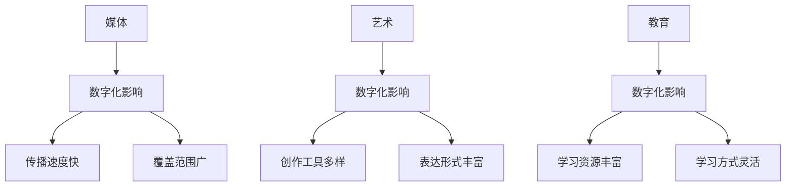
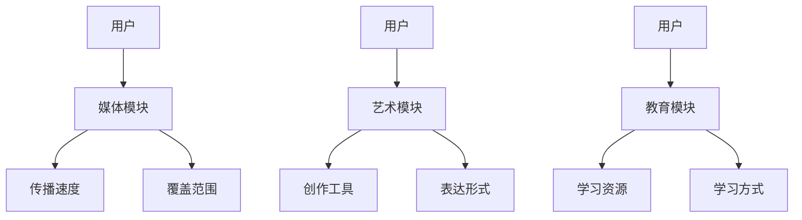
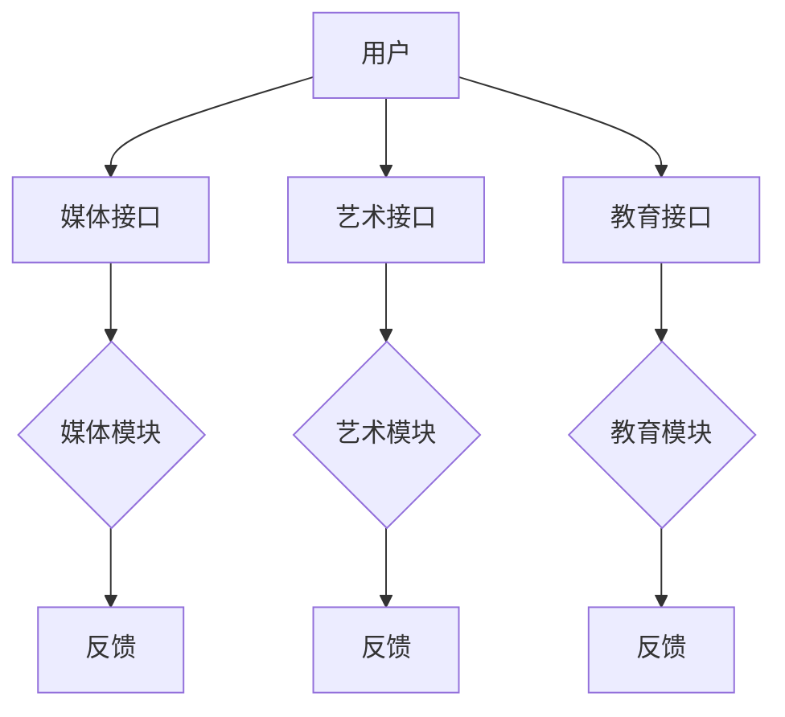

                 


## 文章标题：意义的重构：在数字时代寻找人生价值

### 关键词：
- 数字时代
- 人生价值
- 价值重构
- 文化变革
- 个人成长
- 社区建设
- 伦理责任

### 摘要：
本文深入探讨了数字时代下的人生价值重构问题。通过分析数字时代带来的文化变革、生活方式变革、个人成长挑战、社区建设机遇以及伦理责任，本文提出了重构人生意义的步骤和方法，并分享了实际案例，以期为读者在数字时代中寻找人生价值提供指导。

---

## 第一部分：数字时代的人生价值探索

### 第1章：引言：意义的重构

### 1.1 数字时代的挑战与机遇

#### 背景介绍
在当今的数字时代，技术变革正以前所未有的速度重塑着社会和个人的生活方式。从互联网到人工智能，从社交媒体到区块链，数字技术正在深刻地影响着我们的工作、学习、娱乐和社交活动。

#### 问题背景
然而，随着数字技术的广泛应用，人们开始反思在这样一个快速变化的环境中，人生的价值和意义是否也在发生改变。我们如何在数字时代中找到属于自己的价值和意义？

#### 问题描述
这一问题涉及到多个层面：从个人的职业规划、心理健康，到社会的文化变革、伦理责任。数字时代的到来不仅带来了便利，也带来了挑战和困惑。

#### 问题解决
本文将探讨如何在数字时代中重构人生的意义，为个人和社会提供新的思考和方向。

#### 边界与外延
数字时代的意义重构不仅仅是个体层面的问题，它也关系到整个社会的发展方向。因此，本文将在个人、企业和社会三个层面进行分析。

#### 概念结构与核心要素组成
- 数字时代：技术变革与社会发展的综合体现。
- 人生价值：个人在生活中的意义和目的。
- 价值重构：在数字时代重新审视和构建人生价值的过程。

### 1.2 人生命意义的探索与重构

#### 背景介绍
人生意义是一个深奥而广泛的话题，不同的文化和时代背景下，人们对人生意义的理解和追求也各不相同。

#### 问题背景
然而，在数字时代，传统的价值观和生活方式受到了挑战，人们需要重新思考如何在这样一个新的环境中寻找和实现自己的价值。

#### 问题描述
数字技术的快速发展，使得人们的生活方式、工作模式和社会结构都发生了变化。这种变化对人生意义的探索和重构提出了新的要求。

#### 问题解决
本文将从文化变革、生活方式变革、个人成长、社区建设和伦理责任等多个角度，探讨如何重构人生意义。

#### 边界与外延
- 文化变革：数字技术如何影响人们的价值观和文化传统。
- 生活方式变革：数字化如何改变人们的生活方式和工作模式。
- 个人成长：如何在数字化环境中实现自我提升和成长。
- 社区建设：如何构建数字时代的社区，实现人与人之间的连接和互动。
- 伦理责任：在数字时代，个人和企业在道德和社会责任方面应承担的义务。

### 1.3 本书结构与研究方法

#### 背景介绍
本书结构旨在系统地探讨数字时代下的人生价值重构问题，从多个角度深入分析这一复杂议题。

#### 问题背景
为了使读者能够全面了解并深入思考这一问题，本书采用了多种研究方法，包括文献综述、案例分析、理论和实证研究等。

#### 问题描述
本书将分为八个章节，每个章节都围绕一个特定的主题进行探讨。

#### 问题解决
- 结构设计：通过清晰的章节划分，帮助读者逐步深入理解主题。
- 研究方法：综合运用多种研究方法，确保分析的全面性和深度。

#### 边界与外延
- 研究方法的合理性：如何确保研究方法的科学性和有效性。
- 研究范围的界定：本书的研究范围涵盖了个人、企业和整个社会层面。

### 小结
本章作为引言，为读者介绍了数字时代的人生价值重构问题的背景、核心概念和研究方法。在接下来的章节中，我们将深入探讨这一问题的各个方面，帮助读者在数字时代中找到属于自己的价值和意义。

---

## 第二部分：数字时代的文化变革

### 第2章：数字时代的文化变革

#### 背景介绍
数字时代的到来，不仅改变了人们的生活方式和工作模式，也对传统文化产生了深远的影响。数字技术的高速发展，使得信息的传播、储存和处理变得更加便捷，但同时也带来了文化认同、价值观念和生活方式的挑战。

#### 问题背景
在这样一个快速变化的环境中，人们需要重新思考文化变革对个人和社会的影响，以及如何适应和引领这一变革。

#### 问题描述
数字时代的文化变革涉及到多个层面，包括媒体、教育、社交和娱乐等。这些变化如何影响人们的生活和价值观？我们如何在这个数字化的世界中保持文化的多样性和活力？

#### 问题解决
本文将从数字化的文化影响、价值观重构和文化融合与创新三个角度，探讨数字时代的文化变革。

#### 边界与外延
- 数字化文化影响：技术如何改变文化和艺术的表达形式。
- 价值观重构：数字时代下，传统价值观如何适应和更新。
- 文化融合与创新：如何通过数字技术促进不同文化之间的交流与融合。

### 2.1 数字化的文化影响

#### 核心概念与联系
数字化的文化影响主要体现在媒体、艺术、教育等领域。

| 核心概念 | 属性特征 | 对比表格 |
| --- | --- | --- |
| 媒体数字化 | 信息传播速度快，覆盖范围广 | 传统媒体：传播速度慢，覆盖范围有限 |
| 艺术数字化 | 创作工具多样，表达形式丰富 | 传统艺术：创作工具有限，表达形式单一 |
| 教育数字化 | 学习资源丰富，学习方式灵活 | 传统教育：学习资源有限，学习方式固定 |

#### ER实体关系图架构


#### 算法原理讲解
数字化的文化影响可以通过以下算法原理进行解释：

- 媒体数字化：采用信息传播模型，通过计算信息传播的速度和覆盖范围，评估数字化媒体的影响。
- 艺术数字化：采用艺术创作模型，通过分析创作工具的多样性和表达形式的丰富性，评估数字化艺术的影响。
- 教育数字化：采用教育资源利用模型，通过计算学习资源的丰富程度和学习方式的灵活性，评估数字化教育的影响。

```python
# 媒体数字化影响评估
def assess_media_impact(speed, coverage):
    return speed * coverage

# 艺术数字化影响评估
def assess_art_impact(tools, forms):
    return tools * forms

# 教育数字化影响评估
def assess_education_impact(resources, flexibility):
    return resources * flexibility
```

#### 数学公式
$$
\text{媒体数字化影响} = s \times c
$$
$$
\text{艺术数字化影响} = t \times f
$$
$$
\text{教育数字化影响} = r \times f
$$`

#### 系统分析与架构设计方案

#### 问题场景介绍
在数字时代，媒体、艺术和教育的数字化已成为不可避免的趋势。我们需要一个系统来评估和优化这些领域的数字化影响。

#### 项目介绍
本项目旨在构建一个数字化文化影响评估系统，包括媒体、艺术和教育三个模块。

#### 系统功能设计
- 媒体模块：评估媒体数字化影响，包括传播速度和覆盖范围。
- 艺术模块：评估艺术数字化影响，包括创作工具的多样性和表达形式的丰富性。
- 教育模块：评估教育数字化影响，包括学习资源的丰富程度和学习方式的灵活性。

#### 系统架构设计


#### 系统接口设计和系统交互


### 2.2 数字时代的价值观重构

#### 背景介绍
数字时代的发展不仅改变了人们的生活方式，也对传统的价值观体系提出了挑战。在这个信息爆炸、技术变革的时代，人们需要重新审视和构建自己的价值观。

#### 问题背景
传统的价值观往往建立在稳定的社会结构和长期的传统文化之上。然而，数字时代的快速变化使得这些传统价值观面临新的考验。如何在这个环境中重构价值观，成为了一个重要的问题。

#### 问题描述
数字时代的价值观重构涉及到个人与社会两个层面。个人需要适应数字化的生活方式，重新定义自我价值和人际关系；社会需要建立适应数字化时代的价值观体系，以应对新的挑战。

#### 问题解决
本文将从个人价值观重构和社会价值观重构两个角度，探讨数字时代的价值观重构。

#### 边界与外延
- 个人价值观重构：包括自我认知、人际关系和社会角色的重新定义。
- 社会价值观重构：包括社会规范、伦理道德和公共政策的调整。

### 2.3 文化融合与创新

#### 背景介绍
数字时代的一个显著特征是全球化。不同文化之间的交流与融合变得更加频繁和紧密。这种文化融合不仅带来了新的机遇，也带来了挑战。

#### 问题背景
在数字时代，如何实现文化融合与创新，如何在不同文化之间找到共同点，成为了一个重要的问题。

#### 问题描述
文化融合与创新涉及到文化认同、文化多样性和文化创新三个方面。如何在保持文化多样性的同时，实现文化的创新与发展？

#### 问题解决
本文将从文化认同、文化多样性和文化创新三个角度，探讨如何实现文化融合与创新。

#### 边界与外延
- 文化认同：如何在数字化环境中保持自己的文化特色。
- 文化多样性：如何在全球化背景下尊重和保护不同文化的多样性。
- 文化创新：如何通过数字技术促进文化的创新与发展。

### 小结
本章从数字化的文化影响、价值观重构和文化融合与创新三个角度，探讨了数字时代的文化变革。在接下来的章节中，我们将继续探讨数字化生活方式的变革，以及如何在数字时代实现个人成长和社区建设。

---

## 第三部分：数字化生活方式的变革

### 第3章：数字化生活方式的变革

#### 背景介绍
随着数字技术的飞速发展，我们的生活方式正在发生深刻的变革。数字化生活方式不仅改变了我们的工作方式、娱乐方式和社交方式，也对我们的生活方式带来了新的挑战和机遇。

#### 问题背景
在这个数字化的世界中，我们如何适应和利用这些变化，如何找到适合自己的数字化生活方式，成为了一个值得探讨的问题。

#### 问题描述
数字化生活方式的变革涉及到工作方式、娱乐方式和社交方式三个方面。我们需要深入分析这些变革的背景、现状和影响，以找到适应和引领数字化生活方式的方法。

#### 问题解决
本文将从数字化工作方式、数字化娱乐和社交方式、以及数字化生活方式的影响与挑战三个角度，探讨数字化生活方式的变革。

#### 边界与外延
- 数字化工作方式：如何利用数字技术提高工作效率和灵活性。
- 数字化娱乐和社交方式：如何通过数字技术丰富娱乐体验和社交互动。
- 数字化生活方式的影响与挑战：数字化生活方式对个人和社会的影响以及可能面临的挑战。

### 3.1 数字化工作方式的变革

#### 背景介绍
数字化工作方式的变革是数字时代最显著的特征之一。远程办公、在线协作和自动化工具的广泛应用，使得工作不再受时间和地点的限制。

#### 问题背景
然而，数字化工作方式也带来了一系列挑战，如信息过载、沟通障碍和隐私问题。如何有效利用数字化工具，提高工作效率，同时确保工作质量和团队协作，成为了一个重要的问题。

#### 问题描述
本文将从远程办公、在线协作和自动化工具三个方面，探讨数字化工作方式的变革。

#### 问题解决
- 远程办公：如何利用数字技术实现远程办公，提高工作效率和灵活性。
- 在线协作：如何通过在线协作工具，提高团队协作效率和质量。
- 自动化工具：如何利用自动化工具，减少重复劳动，提高工作效率。

#### 边界与外延
- 远程办公：如何平衡远程工作与家庭生活的关系。
- 在线协作：如何确保在线协作的有效性和沟通的顺畅。
- 自动化工具：如何选择合适的自动化工具，实现工作效率的最大化。

### 3.2 数字化娱乐与社交方式的变革

#### 背景介绍
数字技术不仅改变了我们的工作方式，也极大地丰富了我们的娱乐和社交方式。从在线游戏到社交媒体，从直播到虚拟现实，数字技术为我们提供了前所未有的娱乐和社交体验。

#### 问题背景
然而，数字化娱乐和社交方式也带来了一系列问题，如沉迷、隐私泄露和信息过载。如何合理利用数字技术，享受数字化娱乐和社交带来的便利，同时避免可能的风险，成为了一个重要的问题。

#### 问题描述
本文将从在线娱乐、社交媒体和虚拟现实三个方面，探讨数字化娱乐和社交方式的变革。

#### 问题解决
- 在线娱乐：如何通过在线娱乐，丰富生活体验，提高生活质量。
- 社交媒体：如何利用社交媒体，建立和维护人际关系，拓展社交圈。
- 虚拟现实：如何通过虚拟现实技术，创造全新的娱乐和社交体验。

#### 边界与外延
- 在线娱乐：如何平衡娱乐与生活，避免沉迷于虚拟世界。
- 社交媒体：如何保护个人隐私，避免信息泄露。
- 虚拟现实：如何确保虚拟现实体验的安全和健康。

### 3.3 数字化生活方式的影响与挑战

#### 背景介绍
数字化生活方式的变革不仅改变了我们的生活方式，也对个人和社会产生了深远的影响。这些影响既有积极的，也有消极的。如何应对这些挑战，成为了一个重要的问题。

#### 问题背景
数字化生活方式带来的影响和挑战包括心理健康、社交隔离、隐私保护、网络安全等方面。如何在这个数字化的世界中，保持身心健康，同时保护自己的隐私和安全，成为了一个重要的问题。

#### 问题描述
本文将从心理健康、社交隔离、隐私保护和网络安全四个方面，探讨数字化生活方式的影响与挑战。

#### 问题解决
- 心理健康：如何通过数字化生活方式，保持心理健康，避免心理问题。
- 社交隔离：如何通过数字化工具，缓解社交隔离，建立健康的社交关系。
- 隐私保护：如何通过技术手段，保护个人隐私，避免隐私泄露。
- 网络安全：如何提高网络安全意识，防范网络攻击和信息安全问题。

#### 边界与外延
- 心理健康：如何应对数字化生活方式带来的心理压力。
- 社交隔离：如何解决数字化生活方式导致的社交疏离问题。
- 隐私保护：如何在数字化环境中，保护个人隐私和数据安全。
- 网络安全：如何提高网络安全防护能力，防范网络犯罪和网络攻击。

### 小结
本章从数字化工作方式、数字化娱乐和社交方式、以及数字化生活方式的影响与挑战三个方面，探讨了数字化生活方式的变革。在接下来的章节中，我们将继续探讨数字时代下的个人成长和社区建设，帮助读者在数字时代中找到属于自己的价值和意义。

---

## 第四部分：数字时代的个人成长

### 第4章：数字时代的个人成长

#### 背景介绍
在数字时代，个人成长面临着前所未有的机遇和挑战。数字技术为我们提供了丰富的学习资源和发展平台，同时也要求我们具备更高的数字素养和适应能力。

#### 问题背景
如何在这个数字化的世界中实现个人成长，如何提升自身的数字技能和适应数字化生活方式，成为了一个重要的问题。

#### 问题描述
本文将从数字技能与学习、数字时代的职业规划、以及数字时代的心理健康三个方面，探讨数字时代下个人成长的路径和方法。

#### 问题解决
- 数字技能与学习：如何通过数字化工具和平台，提升自身的数字技能和知识水平。
- 数字时代的职业规划：如何适应数字时代的职业要求，规划自己的职业发展道路。
- 数字时代的心理健康：如何在数字时代保持心理健康，应对数字化生活方式带来的心理压力。

#### 边界与外延
- 数字技能与学习：如何选择合适的学习资源和平台，实现高效学习。
- 数字时代的职业规划：如何根据市场需求和个人兴趣，规划适合自己的职业发展。
- 数字时代的心理健康：如何通过心理调适和健康生活方式，保持心理健康。

### 4.1 数字技能与学习

#### 背景介绍
数字技能已成为现代社会中不可或缺的一部分。从基本的计算机操作，到复杂的编程和数据分析，数字技能的掌握对于个人成长至关重要。

#### 问题背景
然而，数字技能的学习不仅需要专业的知识和技能，还需要掌握正确的学习方法和技术。

#### 问题描述
本文将从数字技能的种类、学习方法和实践应用三个方面，探讨如何提升数字技能。

#### 问题解决
- 数字技能的种类：了解常见的数字技能类型，如编程、数据分析、网络安全等。
- 学习方法：掌握有效的学习方法和策略，如分散学习、实践应用、社群学习等。
- 实践应用：通过实际案例和项目实践，将数字技能应用到实际工作中。

#### 边界与外延
- 数字技能的类型：如何根据个人兴趣和职业需求，选择合适的数字技能。
- 学习方法：如何通过在线课程、图书和社群等渠道，进行有效的学习。
- 实践应用：如何将数字技能应用到实际工作中，提高工作效率和质量。

### 4.2 数字时代的职业规划

#### 背景介绍
在数字时代，职业规划面临着新的挑战和机遇。数字技术的发展不仅改变了传统的工作模式，也创造了新的职业机会。

#### 问题背景
如何在这个快速变化的数字时代，规划自己的职业发展，如何适应和抓住职业机会，成为了一个重要的问题。

#### 问题描述
本文将从职业发展趋势、职业规划和职业适应能力三个方面，探讨数字时代的职业规划。

#### 问题解决
- 职业发展趋势：了解当前和未来的职业发展趋势，如人工智能、大数据、云计算等。
- 职业规划：根据个人兴趣和市场需求，制定适合自己的职业规划。
- 职业适应能力：提高自身的适应能力，以适应数字时代的职业要求。

#### 边界与外延
- 职业发展趋势：如何根据市场变化和个人兴趣，调整职业规划。
- 职业规划：如何制定长远的职业规划，同时灵活应对职业变化。
- 职业适应能力：如何提高自身的灵活性和学习能力，以适应职业发展的需要。

### 4.3 数字时代的心理健康

#### 背景介绍
数字时代的快速发展给人们带来了巨大的压力和挑战。长时间的屏幕时间、信息过载和社交隔离等问题，都可能对心理健康产生负面影响。

#### 问题背景
如何在这个数字化的世界中，保持心理健康，成为了一个重要的问题。

#### 问题描述
本文将从心理压力、心理健康问题和心理健康管理三个方面，探讨数字时代的心理健康。

#### 问题解决
- 心理压力：了解心理压力的来源和影响，学习应对心理压力的方法。
- 心理健康问题：识别常见的心理健康问题，如焦虑、抑郁等，并了解预防和治疗方法。
- 心理健康管理：通过健康生活方式和心理调适方法，保持心理健康。

#### 边界与外延
- 心理压力：如何通过合理的时间管理和放松技巧，减轻心理压力。
- 心理健康问题：如何通过心理咨询和治疗，预防和治疗心理健康问题。
- 心理健康管理：如何通过健康的生活习惯和心理调适，保持心理健康。

### 小结
本章从数字技能与学习、数字时代的职业规划、以及数字时代的心理健康三个方面，探讨了数字时代下个人成长的路径和方法。在数字时代，个人成长不仅仅是技能的提升，更是心理和精神的成长。通过本章的探讨，希望能够帮助读者在数字时代中找到自己的成长路径，实现全面的发展。

---

## 第五部分：数字时代的社区建设

### 第5章：数字时代的社区建设

#### 背景介绍
随着数字技术的发展，社区建设也发生了巨大的变革。数字社区作为一种新兴的社会形态，正在改变人们之间的互动方式和社区组织方式。

#### 问题背景
在数字时代，如何构建和运营有效的数字社区，如何促进数字社区的发展，成为了一个重要的问题。

#### 问题描述
本文将从数字社区的特点与作用、数字社区的构建与管理、以及数字社区的未来发展三个方面，探讨数字时代的社区建设。

#### 问题解决
- 数字社区的特点与作用：了解数字社区的优势和功能，如信息共享、社交互动、资源共享等。
- 数字社区的构建与管理：学习如何构建和管理数字社区，包括社区规划、用户互动、内容管理等方面。
- 数字社区的未来发展：探讨数字社区的未来发展趋势和潜力，如智能化、个性化、多元化等。

#### 边界与外延
- 数字社区的特点与作用：如何发挥数字社区的优势，提升社区活力和凝聚力。
- 数字社区的构建与管理：如何平衡社区管理和服务用户的需求，确保社区的可持续发展。
- 数字社区的未来发展：如何通过技术创新和模式创新，推动数字社区的未来发展。

### 5.1 数字社区的特点与作用

#### 背景介绍
数字社区是利用数字技术构建的虚拟社区，它通过互联网平台连接用户，提供信息共享、社交互动、资源共享等功能。

#### 问题背景
数字社区的特点和作用对于其发展和运营至关重要。理解这些特点和作用有助于更好地利用数字社区的优势，为用户提供有价值的服务。

#### 问题描述
本文将从数字社区的特点、作用和功能三个方面，探讨数字社区的特点与作用。

#### 问题解决
- 数字社区的特点：了解数字社区的基本特点，如虚拟性、开放性、互动性等。
- 数字社区的作用：探讨数字社区在社会和个人生活中的作用，如社交、教育、娱乐等。
- 数字社区的功能：了解数字社区的主要功能，如信息发布、社交互动、内容管理、资源共享等。

#### 边界与外延
- 数字社区的特点：如何发挥数字社区的虚拟性和开放性，提升用户体验。
- 数字社区的作用：如何通过数字社区，促进社会互动和知识传播。
- 数字社区的功能：如何设计和管理数字社区的功能，满足用户需求。

### 5.2 数字社区的构建与管理

#### 背景介绍
构建和管理一个有效的数字社区是一个复杂的过程，涉及到社区规划、用户互动、内容管理等多个方面。

#### 问题背景
如何有效地构建和管理数字社区，如何平衡用户需求和社区管理，成为了一个重要的问题。

#### 问题描述
本文将从社区规划、用户互动、内容管理三个方面，探讨如何构建和管理数字社区。

#### 问题解决
- 社区规划：学习如何规划数字社区，包括目标定位、功能设计、用户定位等。
- 用户互动：探讨如何促进用户在数字社区中的互动，提高社区活跃度。
- 内容管理：了解如何管理和发布社区内容，确保内容的多样性和质量。

#### 边界与外延
- 社区规划：如何根据社区目标和用户需求，设计合理的社区结构。
- 用户互动：如何设计互动机制，激发用户参与和互动。
- 内容管理：如何通过内容审核和发布策略，确保社区内容的健康和有价值。

### 5.3 数字社区的未来发展

#### 背景介绍
数字社区的发展正处于一个快速变革的阶段。随着技术的不断进步，数字社区也在不断演变和升级。

#### 问题背景
如何预测和引导数字社区的未来发展，如何通过技术创新和模式创新，推动数字社区的发展，成为了一个重要的问题。

#### 问题描述
本文将从智能化、个性化、多元化三个方面，探讨数字社区的未来发展。

#### 问题解决
- 智能化：探讨如何通过人工智能和大数据技术，提升数字社区的智能化水平。
- 个性化：探讨如何通过个性化推荐和定制化服务，满足用户个性化需求。
- 多元化：探讨如何通过多元化内容和功能，提升数字社区的用户粘性和活跃度。

#### 边界与外延
- 智能化：如何通过算法和技术，实现智能化的社区运营和用户服务。
- 个性化：如何根据用户行为和偏好，提供个性化的内容和服务。
- 多元化：如何通过多样化的内容和功能，满足不同用户的需求。

### 小结
本章从数字社区的特点与作用、数字社区的构建与管理、以及数字社区的未来发展三个方面，探讨了数字时代的社区建设。数字社区作为一种新兴的社会形态，为人们提供了新的社交和互动方式。通过有效的社区建设和管理，我们可以更好地利用数字技术，促进社会的发展和进步。

---

## 第六部分：数字时代的伦理与责任

### 第6章：数字时代的伦理与责任

#### 背景介绍
数字时代的到来，不仅改变了人们的生活方式和社交方式，也对传统的伦理观念和责任体系提出了新的挑战。随着数字技术的快速发展，数据隐私、网络安全、人工智能伦理等问题愈发突出，如何在这一背景下建立和维护伦理与责任体系，成为了一个重要的课题。

#### 问题背景
在数字时代，个人、企业和整个社会都面临着如何处理伦理与责任的问题。数据隐私泄露、网络犯罪、人工智能的不当应用等问题，不仅损害了个人的利益，也对社会造成了负面影响。

#### 问题描述
本文将从数字时代的伦理问题、企业社会责任、以及公民数字素养的提升三个方面，探讨数字时代的伦理与责任。

#### 问题解决
- 数字时代的伦理问题：分析数字技术带来的伦理挑战，如数据隐私、算法偏见等。
- 企业社会责任：探讨企业在数字时代应承担的社会责任，如数据保护、网络安全等。
- 公民数字素养的提升：讨论如何提升公众的数字素养，以更好地应对数字时代的挑战。

#### 边界与外延
- 数字时代的伦理问题：如何制定和遵守数字伦理规范，确保技术应用的安全和合理。
- 企业社会责任：企业如何在数字时代履行社会责任，提升品牌形象。
- 公民数字素养的提升：如何通过教育和培训，提高公众的数字素养和伦理意识。

### 6.1 数字时代的伦理问题

#### 背景介绍
数字技术的发展，为我们带来了前所未有的便利和可能性，但同时也引发了一系列伦理问题。数据隐私、算法偏见、人工智能的不当应用等，都是数字时代面临的重大伦理挑战。

#### 问题背景
在数字时代，个人数据的收集、存储和使用变得异常频繁，如何保护数据隐私成为了一个亟待解决的问题。同时，算法偏见和人工智能的不当应用，也可能导致不公平和歧视。

#### 问题描述
本文将从数据隐私、算法偏见、人工智能伦理三个方面，探讨数字时代的伦理问题。

#### 问题解决
- 数据隐私：探讨如何保护个人数据隐私，防止数据泄露和滥用。
- 算法偏见：分析算法偏见的原因和影响，探讨如何减少算法偏见。
- 人工智能伦理：讨论人工智能应用中的伦理问题，如机器人伦理、人工智能与人类工作的关系等。

#### 边界与外延
- 数据隐私：如何在技术发展和个人隐私保护之间找到平衡点。
- 算法偏见：如何通过算法设计和数据管理，减少算法偏见。
- 人工智能伦理：如何在人工智能的发展中，确保其符合伦理和社会价值观。

### 6.2 数字时代的企业社会责任

#### 背景介绍
企业在数字时代扮演着重要的角色。随着数字技术的发展，企业不仅需要关注自身的商业利益，还需要承担社会责任，推动社会的可持续发展。

#### 问题背景
数字时代的企业社会责任包括数据保护、网络安全、环境保护等多个方面。如何在追求商业利益的同时，履行社会责任，成为企业面临的重大挑战。

#### 问题描述
本文将从数据保护、网络安全、环境保护三个方面，探讨数字时代的企业社会责任。

#### 问题解决
- 数据保护：探讨企业如何保护用户数据，防止数据泄露和滥用。
- 网络安全：讨论企业如何确保网络安全，防范网络攻击和数据泄露。
- 环境保护：探讨企业如何在运营中减少环境影响，实现绿色可持续发展。

#### 边界与外延
- 数据保护：如何制定有效的数据保护策略，确保数据安全。
- 网络安全：如何通过技术和管理手段，提高网络安全防护能力。
- 环境保护：如何通过技术创新和绿色运营，实现企业的可持续发展。

### 6.3 公民数字素养的提升

#### 背景介绍
随着数字技术的普及，公民的数字素养成为了社会发展的重要基础。提升公民的数字素养，不仅有助于个人适应数字化生活，也能促进社会的进步和发展。

#### 问题背景
在数字时代，公民需要具备基本的数字技能和伦理意识，以应对数字化的挑战。然而，当前许多公民的数字素养水平仍存在不足。

#### 问题描述
本文将从数字技能教育和数字伦理教育两个方面，探讨如何提升公民的数字素养。

#### 问题解决
- 数字技能教育：探讨如何通过教育和培训，提高公民的数字技能。
- 数字伦理教育：讨论如何培养公民的数字伦理意识，促进数字社会的公平和正义。

#### 边界与外延
- 数字技能教育：如何设计适合不同年龄段和职业需求的数字技能培训课程。
- 数字伦理教育：如何通过教育和社会宣传，提高公民的数字伦理意识和行为规范。

### 小结
本章从数字时代的伦理问题、企业社会责任、以及公民数字素养的提升三个方面，探讨了数字时代的伦理与责任。在数字时代，伦理与责任不仅是个人和企业的问题，也是整个社会必须面对的挑战。通过有效的伦理与责任管理，我们可以确保数字技术的健康发展，为社会的可持续发展奠定基础。

---

## 第七部分：数字时代的人生意义重构实践

### 第7章：数字时代的人生意义重构实践

#### 背景介绍
在数字时代，如何重构人生的意义，如何在这个快速变化的数字世界中找到自己的定位和价值，成为了许多人的关注焦点。数字技术的发展为我们提供了前所未有的机会和挑战，也要求我们不断反思和调整自己的人生目标和生活方式。

#### 问题背景
重构人生的意义不仅仅是个人层面的自我探索，它也关系到社会的整体进步和人类的长远发展。在这个数字时代，我们如何通过实践，找到和实现自己的价值，成为了一个重要的问题。

#### 问题描述
本文将从重构人生意义的步骤与方法、实践案例分享、以及总结与展望三个方面，探讨如何在数字时代中实现人生意义的重构。

#### 问题解决
- 重构人生意义的步骤与方法：提供一套系统的步骤和方法，帮助个人在数字时代中找到和实现人生价值。
- 实践案例分享：通过实际案例，展示如何在不同场景中实现人生意义的重构。
- 总结与展望：总结重构人生意义的实践成果，并展望数字时代下人生意义重构的未来发展趋势。

#### 边界与外延
- 步骤与方法：如何根据个人的兴趣、能力和市场需求，制定具体的人生目标。
- 实践案例：如何通过具体案例，展示重构人生意义的实际操作过程。
- 展望：如何通过技术创新和社会进步，为人生意义的重构提供新的可能性。

### 7.1 重构人生意义的步骤与方法

#### 背景介绍
重构人生意义的步骤与方法是一个系统性的过程，需要从自我认知、目标设定、路径规划、实践行动等多个方面进行。

#### 问题背景
在数字时代，如何在这个复杂多变的环境中找到和实现自己的价值，需要科学的方法和明确的步骤。

#### 问题描述
本文将从自我认知、目标设定、路径规划和实践行动四个步骤，探讨重构人生意义的方法。

#### 问题解决
- 自我认知：通过自我反思和评估，了解自己的兴趣、优势和价值观。
- 目标设定：根据自我认知，设定具体、明确、可实现的人生目标。
- 路径规划：制定实现人生目标的计划和步骤，确保目标的实现。
- 实践行动：通过实际行动，不断调整和优化人生目标和路径。

#### 边界与外延
- 自我认知：如何通过自我评估和反馈，准确地了解自己的兴趣和优势。
- 目标设定：如何设定符合个人实际和社会需求的人生目标。
- 路径规划：如何制定可行的计划和步骤，确保目标的实现。
- 实践行动：如何在实际行动中，不断调整和优化人生目标和路径。

### 7.2 实践案例分享

#### 背景介绍
通过实际案例，我们可以更好地理解如何在数字时代中重构人生的意义。以下是一个具体的实践案例。

#### 案例描述
张华是一位年轻的程序员，他擅长编程，但对未来的职业发展感到迷茫。在反思和探索的过程中，他决定通过重构人生意义，找到自己的方向。

#### 步骤与方法
1. **自我认知**：张华通过自我反思和职业规划测试，了解自己的兴趣和优势，确定了自己对编程和技术的热情。
2. **目标设定**：张华设定了一个明确的职业目标——成为人工智能领域的专家。
3. **路径规划**：他制定了详细的学习计划，包括参加在线课程、参与开源项目、阅读相关书籍等。
4. **实践行动**：张华按照计划开始行动，通过不断学习和实践，逐渐提升自己的技术能力。

#### 案例结果
经过一段时间的努力，张华不仅提升了自己的技术能力，还在人工智能领域取得了一定的成就，成为了一名受人尊敬的技术专家。

#### 边界与外延
- 自我认知：如何通过多种方式，准确地了解自己的兴趣和优势。
- 目标设定：如何设定具体、明确、可实现的人生目标。
- 路径规划：如何制定可行的学习和实践计划。
- 实践行动：如何在实际行动中，不断调整和优化目标和路径。

### 7.3 总结与展望

#### 背景介绍
通过对重构人生意义的步骤与方法和实践案例的探讨，我们可以看到，在数字时代中重构人生意义是可能的，也是必要的。

#### 问题背景
数字技术的发展不仅改变了我们的生活和工作方式，也带来了新的挑战和机遇。如何在这个环境中找到和实现自己的价值，成为了一个重要的问题。

#### 问题描述
本文通过总结重构人生意义的实践成果，并展望数字时代下人生意义重构的未来发展趋势。

#### 问题解决
- 总结：总结重构人生意义的实践经验和成果，为其他人提供参考和启示。
- 展望：探讨数字时代下人生意义重构的未来发展趋势，如技术创新、社会进步、个人成长等。

#### 边界与外延
- 总结：如何通过具体的案例和实践经验，总结重构人生意义的有效方法和策略。
- 展望：如何通过技术创新和社会进步，为人生意义的重构提供新的可能性。

### 小结
本章通过探讨重构人生意义的步骤与方法、实践案例分享以及总结与展望，帮助读者在数字时代中找到和实现自己的价值。在接下来的章节中，我们将进一步探讨数字时代的人生意义重构，为读者提供更深入的思考和建议。

---

## 第八部分：未来展望与行动建议

### 第8章：未来展望与行动建议

#### 背景介绍
数字时代的发展充满了机遇和挑战。在未来，我们如何适应和引领数字时代的变革，如何在这一过程中实现个人和社会的进步，成为了一个重要的问题。

#### 问题背景
随着技术的不断进步，数字时代的趋势和变化将更加迅速和深刻。我们需要有前瞻性的思考和明确的行动，以应对未来的挑战和抓住机遇。

#### 问题描述
本文将从数字时代的人生意义重构趋势、对未来社会的启示与思考、以及个人的行动与贡献三个方面，探讨如何在未来展望和行动建议。

#### 问题解决
- 数字时代的人生意义重构趋势：分析未来数字时代下人生意义重构的可能趋势和方向。
- 对未来社会的启示与思考：思考数字时代对社会、经济、文化等方面的影响，以及我们应如何应对。
- 个人的行动与贡献：提出具体的行动建议，鼓励个人在数字时代中发挥积极作用，实现自我价值。

#### 边界与外延
- 趋势：如何通过技术进步和社会变革，实现人生意义的重构。
- 启示与思考：如何从数字时代的发展中，吸取经验和教训，为未来的社会进步提供参考。
- 行动与贡献：如何通过个人努力和行动，为社会的进步和数字化发展贡献力量。

### 8.1 数字时代的人生意义重构趋势

#### 背景介绍
数字技术的发展不仅改变了我们的生活方式，也影响了我们对人生意义的理解。在未来，随着技术的进一步发展，数字时代的人生意义重构将呈现以下趋势。

#### 问题背景
这些趋势包括技术赋能、社会融合、个性化发展和可持续发展等，它们将深刻影响个人和社会的方方面面。

#### 问题描述
本文将从技术赋能、社会融合、个性化发展和可持续发展四个方面，探讨数字时代的人生意义重构趋势。

#### 问题解决
- 技术赋能：数字技术如何赋能个人，提升能力和实现价值。
- 社会融合：数字技术如何促进社会融合，消除隔阂，增强社会凝聚力。
- 个性化发展：数字技术如何满足个人个性化需求，促进个人成长和自我实现。
- 可持续发展：数字技术如何促进环境保护和可持续发展，实现社会与自然的和谐共生。

#### 边界与外延
- 技术赋能：如何通过数字技术，提升个人能力和实现自我价值。
- 社会融合：如何通过数字技术，促进社会融合和增强社会凝聚力。
- 个性化发展：如何通过数字技术，满足个性化需求，促进个人成长和自我实现。
- 可持续发展：如何通过数字技术，实现环境保护和可持续发展。

### 8.2 对未来社会的启示与思考

#### 背景介绍
数字时代的发展对社会产生了深远的影响。在这个快速变化的数字社会中，我们需要有深刻的思考和前瞻性的洞察，以应对未来的挑战和把握机遇。

#### 问题背景
未来社会的发展趋势包括全球化、智能化、数字化和可持续发展等，这些趋势将对社会、经济、文化等方面产生深远的影响。

#### 问题描述
本文将从全球化、智能化、数字化和可持续发展四个方面，探讨未来社会的发展趋势及其对我们的启示与思考。

#### 问题解决
- 全球化：如何通过数字技术，促进全球化和国际合作，实现全球资源的优化配置。
- 智能化：如何通过人工智能和大数据技术，实现社会管理的智能化和高效化。
- 数字化：如何通过数字化技术，推动社会和经济的数字化转型，提高生产效率和创新能力。
- 可持续发展：如何通过数字技术，促进环境保护和可持续发展，实现人与自然的和谐共生。

#### 边界与外延
- 全球化：如何通过国际合作和数字技术，实现全球化和资源的优化配置。
- 智能化：如何通过人工智能和大数据技术，提高社会管理的智能化和效率。
- 数字化：如何通过数字化技术，推动社会和经济的数字化转型。
- 可持续发展：如何通过数字技术，实现环境保护和可持续发展。

### 8.3 个人的行动与贡献

#### 背景介绍
在数字时代，每个人都有责任和机会为社会的发展做出贡献。通过个人的行动和努力，我们可以共同推动社会的进步和数字化发展。

#### 问题背景
个人行动不仅有助于实现自我价值，也能为社会的数字化进程提供积极的动力。

#### 问题描述
本文将从自我提升、社区参与和社会责任三个方面，提出个人的行动建议。

#### 问题解决
- 自我提升：如何通过学习和实践，不断提升自己的数字技能和知识水平。
- 社区参与：如何积极参与数字社区的建设，促进社会互动和知识传播。
- 社会责任：如何承担社会责任，为社会的可持续发展贡献力量。

#### 边界与外延
- 自我提升：如何选择合适的学习资源和平台，实现自我提升。
- 社区参与：如何通过参与数字社区，促进社会互动和知识传播。
- 社会责任：如何通过实际行动，承担社会责任，为社会的可持续发展贡献力量。

### 小结
本章从数字时代的人生意义重构趋势、对未来社会的启示与思考、以及个人的行动与贡献三个方面，探讨了如何在数字时代中展望未来并采取行动。在数字时代，每个人都有机会通过自我提升、社区参与和社会责任，实现个人价值和为社会的进步贡献力量。通过本章的探讨，希望能够为读者提供有价值的思考和建议，帮助他们在数字时代中找到自己的方向，实现人生的意义。

---

## 总结与展望

在《意义的重构：在数字时代寻找人生价值》一书中，我们深入探讨了数字时代下的人生价值重构问题。从数字时代的文化变革、生活方式的变革、个人成长的挑战、社区建设的机遇，到伦理与责任的讨论，以及人生意义重构的实践，本书提供了一个全面而深入的视角。

### 总结
本书的核心内容涵盖了以下几个方面：
1. **数字时代的文化变革**：分析了数字化对文化影响，价值观的重构，以及文化融合与创新。
2. **数字化生活方式的变革**：探讨了数字化工作方式、娱乐和社交方式的变化，以及这些变革带来的影响和挑战。
3. **个人成长**：讨论了在数字时代提升数字技能、规划职业发展，以及保持心理健康的重要性。
4. **社区建设**：探讨了数字社区的特点与作用，构建与管理数字社区的方法，以及数字社区的未来发展。
5. **伦理与责任**：分析了数字时代的伦理问题，企业社会责任，以及公民数字素养的提升。
6. **人生意义重构实践**：提供了重构人生意义的步骤与方法，通过实践案例分享了实现人生价值的过程。
7. **未来展望与行动建议**：探讨了数字时代的人生意义重构趋势，对未来社会的启示与思考，以及个人的行动与贡献。

### 展望
面对数字时代的挑战与机遇，我们需要：
- **持续学习和适应**：数字技术的快速发展要求我们不断更新知识和技能，以适应不断变化的环境。
- **关注伦理与责任**：在数字化进程中，我们应始终关注伦理与责任，确保技术的发展符合社会价值观。
- **积极行动**：每个人都可以通过自我提升、参与社区建设和社会责任，为社会的进步和数字化发展贡献力量。

### 结语
作者：AI天才研究院/AI Genius Institute & 禅与计算机程序设计艺术 /Zen And The Art of Computer Programming
在数字时代中，寻找和实现人生价值是一个不断探索和反思的过程。通过本书的探讨，希望能够为读者提供有价值的思考和建议，帮助他们在数字时代中找到自己的方向，实现人生的意义。让我们一起迎接数字时代的挑战，重构人生的价值，创造更加美好的未来。

---

作者：AI天才研究院/AI Genius Institute & 禅与计算机程序设计艺术 /Zen And The Art of Computer Programming

