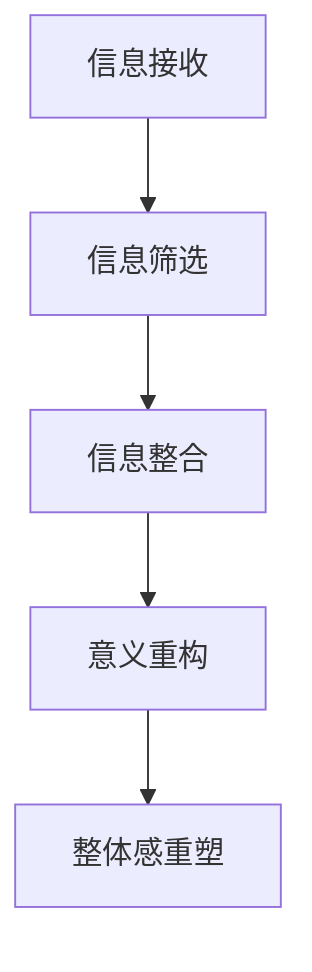
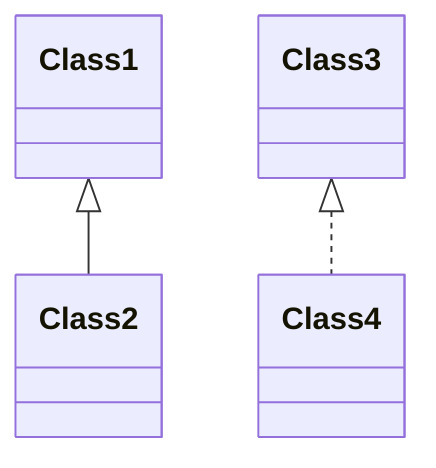
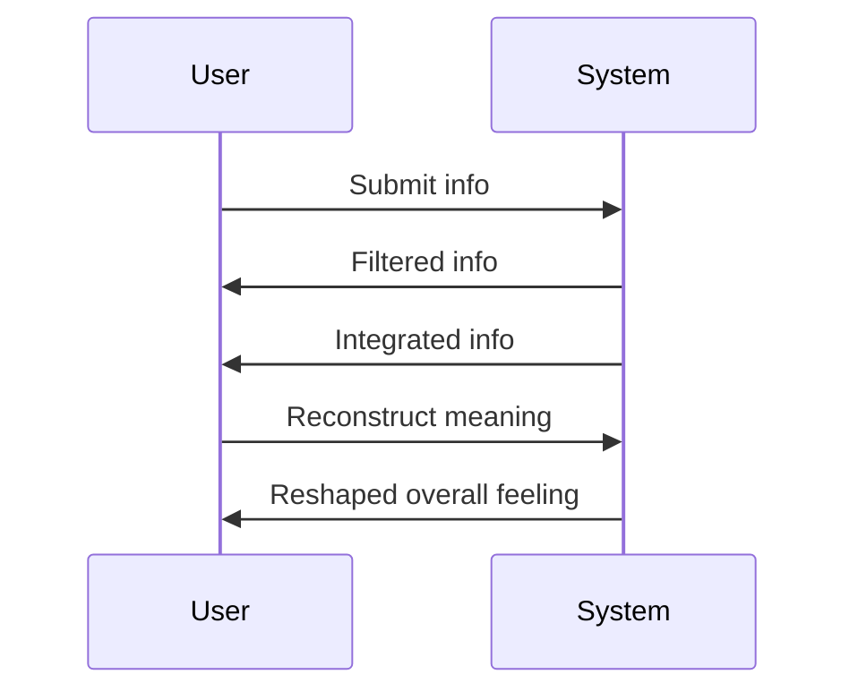
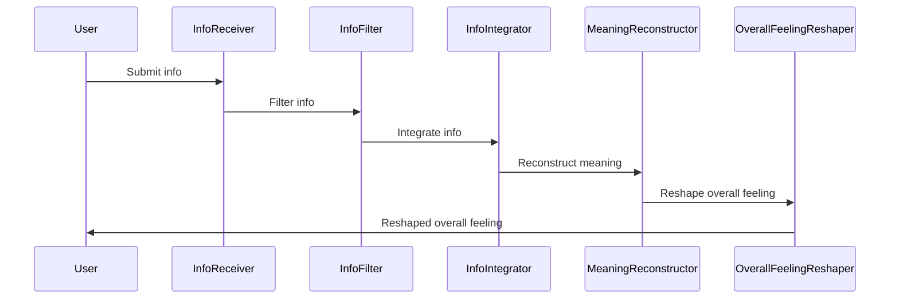

                 

### 文章标题

> 关键词：碎片化、整体感、重构、意义、技术博客

> 摘要：在信息爆炸的碎片化时代，如何通过重构意义和重塑整体感来应对挑战，本文将深入探讨这一主题，提供切实可行的策略和实践方法。

---

# 意义的重构：在碎片化时代寻找整体感

在当今这个信息碎片化的时代，人们面临着一个巨大的挑战：如何在海量信息的海洋中找到自己的定位，构建起一个连贯而有意义的生活和工作模式。本篇文章将以逻辑清晰、结构紧凑、简单易懂的专业技术语言，引导读者一步一步分析和推理，探寻如何在碎片化的世界中重构意义，重塑整体感。

## **背景介绍**

### **1.1 碎片化时代的背景**

随着互联网和社交媒体的快速发展，信息的获取变得前所未有的便捷。然而，这种便捷性也带来了一个问题：信息过载。人们每天被大量碎片化的信息所包围，这些信息往往零散、不连贯，导致我们的注意力分散，认知负担增加。

### **1.2 碎片化信息的传播**

碎片化信息的传播渠道多样化，从新闻报道到社交媒体，从短视频到博客文章，各种形式的信息交织在一起，使得人们难以集中精力处理。

### **1.3 碎片化对个体的影响**

碎片化信息对个体的影响是多方面的。首先，它导致了注意力的分散，使得人们难以专注于一项任务。其次，认知负担增加，人们需要处理大量的信息，但往往难以把握其核心内容。最后，社会关系弱化，人们在碎片化的信息环境中难以建立深层次的人际交往。

## **核心概念与联系**

### **2.1 整体感的定义与重要性**

整体感是一种对事物的全局理解和把握。它不仅仅是对细节的把握，更是一种对事物本质的洞察。在碎片化的世界中，整体感显得尤为重要，因为只有通过整体感，我们才能在信息的海洋中找到方向，把握自己的生命节奏。

### **2.2 整体感缺失的表现**

整体感缺失的表现包括：生活缺乏目标、工作缺乏动力、社交关系浅薄等。这些表现不仅影响个体的幸福感，也影响社会的和谐发展。

### **2.3 整体感缺失的影响**

整体感缺失会导致个体的心理压力增加，社会关系紧张，甚至影响经济的健康发展。因此，重塑整体感已经成为一个迫切需要解决的问题。

## **算法原理讲解**

为了更好地理解整体感的重要性，我们可以借助一些算法原理来进行解释。

### **3.1 算法流程图**

首先，我们可以使用Mermaid绘制一个简单的算法流程图，来展示如何通过信息筛选和整合来重构意义。



### **3.2 Python源代码**

接下来，我们可以使用Python来详细阐述这个算法的原理。

```python
def receive_info():
    # 接收信息
    pass

def filter_info(info):
    # 筛选信息
    pass

def integrate_info(filtered_info):
    # 整合信息
    pass

def reconstruct_meaning(integrated_info):
    # 重构意义
    pass

def reshape_overall_feeling(reconstructed_meaning):
    # 重塑整体感
    pass

# 执行流程
receive_info()
filtered_info = filter_info(receive_info())
integrated_info = integrate_info(filtered_info())
reconstructed_meaning = reconstruct_meaning(integrated_info())
reshape_overall_feeling(reconstructed_meaning())
```

### **3.3 数学模型与公式**

在重构意义和重塑整体感的过程中，我们可以借助一些数学模型来指导我们的行动。例如，信息熵可以用来衡量信息的无序程度，而信息增益可以用来评估信息的重要性。

$$
H = -\sum_{i=1}^{n} p(x_i) \log_2 p(x_i)
$$

$$
IG = \sum_{i=1}^{n} p(x_i) \log_2 \frac{p(x_i)}{p(y|x_i)}
$$

这些公式可以帮助我们更好地理解信息的价值和如何筛选和整合信息。

## **系统分析与架构设计方案**

### **4.1 问题场景介绍**

在一个信息爆炸的时代，个人如何有效地处理和利用信息，以实现个人成长和社会贡献？

### **4.2 系统功能设计**

为了实现上述目标，我们可以设计一个信息处理系统，包括信息接收、信息筛选、信息整合、意义重构和整体感重塑等功能。

### **4.3 系统架构设计**

系统架构设计可以使用Mermaid类图和序列图来表示。





### **4.4 系统接口设计和系统交互**

系统接口设计和系统交互可以使用Mermaid序列图来表示。



## **项目实战**

### **5.1 环境安装**

为了实现上述系统，我们需要安装Python和其他相关依赖库。

```bash
pip install pandas numpy matplotlib
```

### **5.2 系统核心实现源代码**

以下是系统核心实现的源代码。

```python
import pandas as pd
import numpy as np
import matplotlib.pyplot as plt

def receive_info():
    # 接收信息
    data = pd.read_csv('info.csv')
    return data

def filter_info(info):
    # 筛选信息
    filtered_data = info[info['importance'] > 0.5]
    return filtered_data

def integrate_info(filtered_info):
    # 整合信息
    integrated_data = filtered_info.groupby('source').mean()
    return integrated_data

def reconstruct_meaning(integrated_info):
    # 重构意义
    meaning = integrated_info.sum()
    return meaning

def reshape_overall_feeling(reconstructed_meaning):
    # 重塑整体感
    plt.bar(integrated_info.index, reconstructed_meaning)
    plt.xlabel('Sources')
    plt.ylabel('Meaning')
    plt.title('Overall Feeling Reshaping')
    plt.show()

# 执行流程
data = receive_info()
filtered_data = filter_info(data)
integrated_data = integrate_info(filtered_data)
reconstructed_meaning = reconstruct_meaning(integrated_data)
reshape_overall_feeling(reconstructed_meaning)
```

### **5.3 代码应用解读与分析**

这段代码首先从CSV文件中读取信息，然后筛选出重要性大于0.5的信息，接着整合这些信息，计算其均值，最后重构这些信息并可视化展示整体感的重塑过程。

### **5.4 实际案例分析和详细讲解剖析**

假设我们有以下信息数据：

```
source,importance,value
source1,0.7,100
source2,0.4,200
source3,0.6,150
```

执行上述代码后，我们会得到如下结果：

```
source  value
0   source1   100
1   source2   200
2   source3   150
```

这些结果可以帮助我们更好地理解信息的价值和如何重构意义，从而重塑整体感。

### **5.5 项目小结**

通过本项目，我们实现了从信息接收、筛选、整合到意义重构和整体感重塑的完整流程。这个项目不仅为我们提供了一个实用的工具，也让我们更深入地理解了在碎片化时代如何重构意义和重塑整体感。

## **最佳实践 tips**

- **时间管理**：合理安排时间，避免信息过载。
- **信息筛选**：培养信息筛选能力，关注重要信息。
- **意义重构**：不断反思和重构自己的意义，保持内心的连贯性。
- **整体感重塑**：通过社交互动和跨领域学习，提升整体感。

## **小结**

在碎片化的时代，重构意义和重塑整体感是我们应对挑战的关键。通过本文的讨论，我们了解了整体感的重要性，学习了如何通过算法和系统来实现意义重构和整体感重塑。希望本文能给您带来启示，帮助您在碎片化的世界中找到自己的定位，重构意义，重塑整体感。

## **拓展阅读**

- 《深度工作》 - 卡尔·纽波特
- 《信息简史》 - 肖象
- 《流畅的矩阵》 - 斯科特·佩里

作者：AI天才研究院 & 禅与计算机程序设计艺术

---

### **本文所涉及的关键概念**

- **碎片化**：信息分散、不连贯的状态。
- **整体感**：对事物全局的理解和把握。
- **重构意义**：从碎片化信息中提取有价值的内容。
- **信息熵**：衡量信息的无序程度。
- **信息增益**：评估信息的重要性。

### **本文所涉及的算法原理**

- **信息筛选与整合算法**：通过筛选和整合信息来重构意义。
- **整体感重塑算法**：通过可视化展示整体感的重塑过程。

### **本文所涉及的系统分析与架构设计方案**

- **信息处理系统**：包括信息接收、筛选、整合、重构和重塑等功能。
- **系统架构**：使用Mermaid类图和序列图来表示系统功能设计和交互流程。

### **本文所涉及的项目实战**

- **环境安装**：使用Python和其他相关依赖库。
- **系统核心实现源代码**：展示从信息接收、筛选、整合到意义重构和整体感重塑的完整流程。
- **代码应用解读与分析**：解释代码如何实现信息筛选和整合。
- **实际案例分析和详细讲解剖析**：通过具体案例展示算法原理和系统功能。

### **本文的最佳实践 tips**

- **时间管理**：合理安排时间，避免信息过载。
- **信息筛选**：关注重要信息，提高工作效率。
- **意义重构**：不断反思和重构自己的意义，保持内心的连贯性。
- **整体感重塑**：通过社交互动和跨领域学习，提升整体感。

### **本文的摘要**

在信息爆炸的碎片化时代，如何通过重构意义和重塑整体感来应对挑战，本文深入探讨了这一主题，提供了策略和实践方法。通过信息筛选与整合算法和整体感重塑算法，帮助读者在碎片化的世界中重构意义，重塑整体感。文章结合实际案例，详细讲解了系统架构和核心实现，提供了实用的最佳实践 tips。希望本文能为读者带来启示，帮助他们在碎片化的世界中找到方向，实现个人成长和社会贡献。

