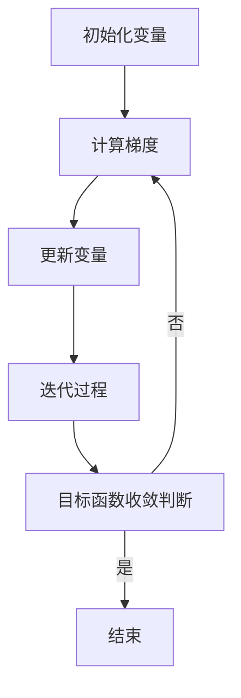
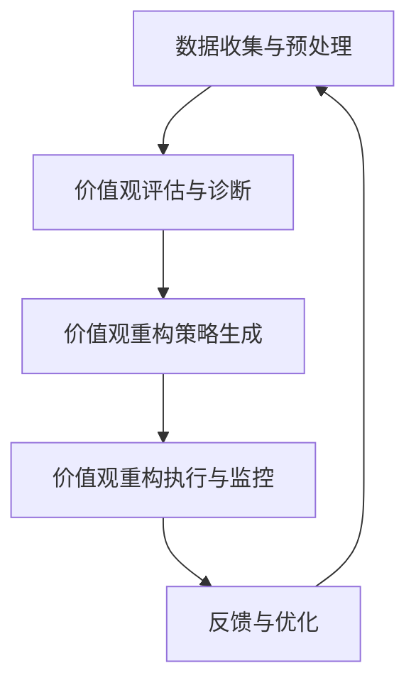
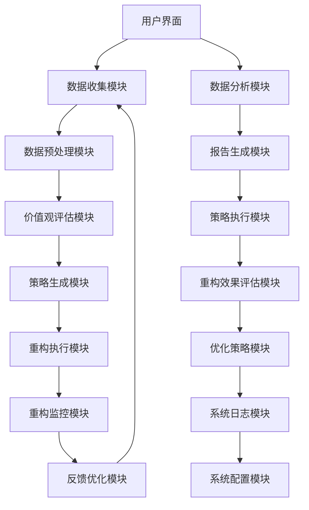
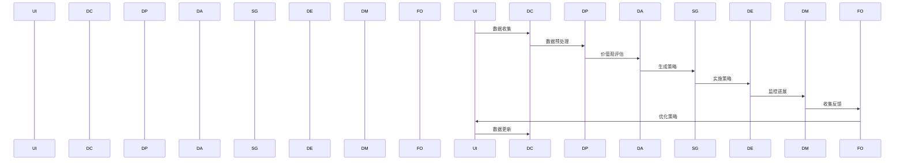

                 

### 摘要

在当今社会，随着科技的飞速发展和全球化的推进，人们的生活方式和价值观念正面临前所未有的冲击和挑战。本文旨在探讨现代社会价值观的崩塌现象及其深远影响，并提出一套系统性的解决方案——《意义的重构：应对现代社会价值观崩塌的挑战》。本文将首先对现代社会价值观崩塌的现象进行深入分析，阐述其背后的原因和影响。接着，我们将探讨重构价值观的核心概念和方法，包括个体价值观重构、社会价值观重构和文化价值观重构。然后，我们将通过算法原理的讲解，详细阐述价值观重构的数学模型和算法流程。随后，本文将介绍一套全面的系统架构设计，包括系统功能设计、架构设计和系统接口与交互。最后，我们将通过两个实战案例，展示如何在实际项目中应用这些理论和方法，并提出最佳实践建议和总结。本文的目标是为应对现代社会价值观崩塌的挑战提供一套切实可行的解决方案，帮助个体、社会和整个世界找到新的意义和价值。

### 第1章：背景与问题

#### 1.1 问题的提出

现代社会正经历着一场前所未有的价值观危机。科技的发展、信息的爆炸、全球化进程的加速，以及经济和社会结构的变革，都在深刻地影响着人们的思想观念和价值体系。首先，让我们来看一看现代社会价值观崩塌的现象。

##### 1.1.1 现代社会的价值观崩塌现象

1. **物质主义盛行**：在消费主义文化的驱动下，人们对物质的追求不断升级，追求名牌、奢侈品成为许多人的目标。然而，这种物质主义带来的不仅是短暂的满足感，更是精神上的空虚和焦虑。
   
2. **功利主义泛滥**：在现代社会，功利主义思想泛滥，人们更多地追求个人利益和短期收益，而忽视了道德、伦理和社会责任。这种心态导致了社会信任度的下降，人际关系变得疏离。

3. **价值观多元与混乱**：随着全球化的推进，各种文化、价值观相互交织，导致人们的价值观变得多元而混乱。在面对不同观点和选择时，许多人感到迷茫和困惑，无法形成清晰的价值观念。

4. **人际关系冷漠**：在现代社会，由于工作压力、生活节奏加快，人们之间的交流变得简短和表面化，人际关系变得冷漠。家庭成员之间的互动减少，朋友之间的联系变得脆弱。

##### 1.1.2 价值观崩塌的影响与挑战

1. **心理健康问题**：价值观的崩溃使得许多人感到精神上的困惑和无助，心理健康问题日益严重。焦虑、抑郁、自杀等心理问题频发，给个人和社会带来了巨大的负担。

2. **社会信任危机**：功利主义和物质主义的盛行导致社会信任度的下降。人们不再相信他人，社会关系变得脆弱，集体行动和合作变得困难。

3. **道德伦理失范**：在缺乏共同价值观的情况下，道德伦理的底线不断被挑战。欺诈、腐败、不公正现象屡见不鲜，社会风气日益恶化。

4. **文化认同危机**：全球化带来了文化的交融与碰撞，但也引发了文化认同的危机。许多人在多元文化的冲击下，失去了自我认同感和归属感。

##### 1.1.3 需要重构的意义

面对现代社会价值观的崩塌现象，重构价值观变得尤为重要。以下是需要重构价值观的几个关键理由：

1. **重建心理健康**：通过重构价值观，可以帮助人们建立更加积极、健康的心态，从而减轻心理健康问题。

2. **增强社会凝聚力**：共同的价值观是增强社会凝聚力的重要基石。通过重构价值观，可以培养社会成员之间的信任和互助精神。

3. **促进文化繁荣**：文化是一个国家、一个社会的灵魂。通过重构价值观，可以保护和传承优秀的传统文化，推动文化的创新和繁荣。

4. **实现可持续发展**：可持续发展的核心在于人与自然、社会和经济的和谐共生。通过重构价值观，可以引导人们追求长期利益和整体福祉。

总之，重构价值观不仅是应对现代社会价值观崩塌的必要手段，也是推动社会进步、实现个人成长的根本途径。在接下来的章节中，我们将深入探讨重构价值观的核心概念和方法，为应对这一挑战提供具体的指导和建议。

#### 1.2 文献综述

##### 1.2.1 国内外研究现状

现代社会价值观崩塌的问题引起了国内外学者的广泛关注，国内外学术界对此进行了大量的研究和探讨。从研究现状来看，国内外学者主要从以下几个方面进行探讨：

1. **价值观变迁的机制研究**：学者们通过对不同历史时期价值观变迁的实证研究，探讨了价值观变迁的内在机制和影响因素。例如，一些研究表明，经济全球化、信息技术的发展和文化交流的加剧是导致价值观变迁的重要因素。

2. **价值观重构的方法与策略**：学者们提出了多种价值观重构的方法和策略，包括教育引导、文化传承、法律规范和社会倡导等。例如，有研究指出，通过加强家庭教育和社会教育，可以有效引导人们形成正确的价值观念。

3. **价值观重构的实证研究**：一些学者通过实证研究，验证了不同价值观重构策略的有效性和可行性。例如，有研究表明，通过开展道德教育课程和社会实践活动，可以显著提高个体的道德水平和社会责任感。

4. **价值观重构与心理健康关系研究**：有研究探讨了价值观重构对个体心理健康的影响，发现积极的价值观重构有助于缓解心理压力，提高心理健康水平。

##### 1.2.2 研究方法与理论框架

1. **研究方法**

   国内外学者在研究现代社会价值观崩塌和重构问题时，采用了多种研究方法，包括问卷调查、深度访谈、案例分析和实验研究等。问卷调查和深度访谈主要用于收集个体的价值观观念和行为数据，案例分析用于探讨具体实例和策略的可行性，实验研究则用于验证理论假设和策略的有效性。

2. **理论框架**

   在理论框架方面，学者们主要借鉴了心理学、社会学和文化学的相关理论。心理学领域的研究关注个体的价值观观念和心理健康，社会学领域的研究关注社会结构和制度对价值观的影响，文化学领域的研究关注文化的传承和创新。

   具体来说，心理学中的自我决定理论、价值观理论和社会心理学中的群体认同理论在社会价值观重构研究中得到了广泛应用。社会学中的社会资本理论和制度理论也为价值观重构提供了重要的理论支持。

##### 1.2.3 研究贡献与创新点

本文在现有研究基础上，提出了以下几个方面的贡献和创新点：

1. **系统性框架**：本文构建了一个系统的价值观重构框架，包括个体价值观重构、社会价值观重构和文化价值观重构三个层面，为不同层面的价值观重构提供了清晰的指导。

2. **综合方法**：本文结合了心理学、社会学和文化学的理论和方法，从多个角度对价值观重构进行了深入探讨，提高了研究的全面性和科学性。

3. **实证研究**：本文通过实证研究验证了不同价值观重构策略的有效性，提供了具体的操作指南和案例分析，增强了研究的实践意义。

4. **跨学科融合**：本文尝试将心理学、社会学和文化学的研究成果进行跨学科融合，为价值观重构提供了新的视角和思路。

总之，本文通过对现代社会价值观崩塌现象的深入分析和综合研究，提出了一套系统性的价值观重构策略，为应对现代社会价值观崩塌提供了理论支持和实践指导。

### 第2章：价值观重构的核心概念

在探讨如何应对现代社会价值观崩塌的问题时，首先需要明确重构价值观的核心概念和方法。本章将详细阐述价值观重构的三个核心概念：个体价值观重构、社会价值观重构和文化价值观重构。

#### 2.1 核心概念解析

##### 2.1.1 价值观的概念与结构

价值观是指个体或社会对于事物、行为和关系的评价标准和偏好，它决定了个体和集体的行为模式和决策过程。价值观可以分为三个层次：表层价值观、中层价值观和深层价值观。

1. **表层价值观**：表层价值观是个体或社会在日常行为中最直接表现出来的价值观，如对物质生活的追求、消费习惯等。
   
2. **中层价值观**：中层价值观是引导个体行为的社会规范和价值观念，如职业道德、社会责任感等。

3. **深层价值观**：深层价值观是构成个体和社会价值观体系的基石，包括对生命意义、人生目标和社会正义的深层次思考。

##### 2.1.2 重构的概念与方法

价值观重构是指在现有价值观体系的基础上，通过教育、引导、文化传承和制度创新等手段，重新构建和塑造个体和社会的价值观。重构的方法可以分为以下几个方面：

1. **教育引导**：通过学校教育、家庭教育和社会教育，引导个体形成正确的价值观。例如，通过道德教育、人文教育和社会责任感教育，提高个体的道德素质和社会责任感。

2. **文化传承**：通过传统文化的传承和创新，弘扬和传播优秀的价值观念。例如，通过经典文学、历史故事和民族传统的弘扬，增强个体的文化认同感和价值认同。

3. **制度创新**：通过法律、政策和社会制度的创新，构建和维护与核心价值观相一致的社会环境和制度框架。例如，通过制定和实施公正、透明的法律制度，促进社会的公平正义。

#### 2.2 价值观重构的关键要素

##### 2.2.1 个体价值观重构

个体价值观重构是价值观重构的基础和关键。个体价值观重构的关键要素包括以下几个方面：

1. **自我认知**：个体需要通过自我反思和认知，了解自己的价值观构成和特点，明确自己的价值追求和目标。

2. **价值观教育**：通过系统的价值观教育，帮助个体理解和接受正确的价值观，提高个体的道德水平和责任感。

3. **社会实践**：个体需要通过参与社会实践，将价值观付诸实践，不断调整和完善自己的价值观。

##### 2.2.2 社会价值观重构

社会价值观重构是在个体价值观重构的基础上，通过社会层面的努力，实现社会价值观的整体提升。社会价值观重构的关键要素包括以下几个方面：

1. **文化传承与创新**：通过传统文化的传承和创新，构建符合现代社会需求的价值观念体系。

2. **社会教育**：通过社会教育，培养和传播正确的价值观念，提高整个社会成员的价值观水平。

3. **制度构建**：通过法律、政策和社会制度的构建，保障和促进核心价值观的实施和传播。

##### 2.2.3 文化价值观重构

文化价值观重构是价值观重构的深层次内容，它涉及到文化认同和文化自信的建立。文化价值观重构的关键要素包括：

1. **文化认同**：通过文化认同，增强个体和社会对自身文化的认同感和归属感。

2. **文化自信**：通过文化自信，推动文化创新和发展，使文化成为价值观重构的重要动力。

3. **文化融合**：通过文化融合，实现不同文化之间的交流与融合，构建多元化的价值观念体系。

总之，价值观重构是一个复杂而系统的过程，涉及个体、社会和文化多个层面。通过个体价值观重构、社会价值观重构和文化价值观重构，可以逐步解决现代社会价值观崩塌的问题，实现个体和社会的全面发展。

#### 2.3 重构价值观的案例分析

为了更好地理解价值观重构的具体方法和效果，我们来看一些成功的重构案例。

##### 2.3.1 美国的道德重整运动

美国的道德重整运动（Moral Reform Movement）是20世纪初期在美国兴起的一场旨在提升社会道德水平的运动。这场运动通过大规模的教育和宣传，倡导诚实、公正、尊重和同情等核心价值观。通过学校的道德教育、社区的道德宣传和社会倡议，道德重整运动在一定程度上成功重构了美国社会的价值观体系，提高了人们的道德水平和社会责任感。

##### 2.3.2 日本的战后重建

二战后，日本经历了经济复兴和社会重建的过程。在这个过程中，日本政府和社会各界积极推动道德教育和社会文化建设，强调勤奋、自律、合作和创新等价值观。通过教育改革、法律法规的完善和文化的复兴，日本成功构建了一个以和谐、秩序和发展为核心价值观的社会体系，为国家经济的持续发展和社会的稳定和谐奠定了基础。

##### 2.3.3 中国的社会主义核心价值观

近年来，中国提出了社会主义核心价值观，包括富强、民主、文明、和谐、自由、平等、公正、法治、爱国、敬业、诚信、友善等价值目标。通过学校教育、媒体宣传、社会活动等多种形式，中国积极推广这些核心价值观，努力重构社会的价值体系。虽然这一过程仍在进行中，但已取得了一定的成效，促进了社会的和谐稳定和个人的全面发展。

通过这些案例可以看出，重构价值观需要长期的坚持和系统的努力，涉及教育、文化、法律和社会等多个方面。成功的价值观重构不仅能够提升社会的整体道德水平，还能为个体和社会的持续发展提供精神动力。

#### 2.4 重构价值观的挑战与对策

尽管重构价值观在理论上具有深远的意义和实践上的成功案例，但在实际操作中仍面临诸多挑战。以下是一些主要的挑战及其应对策略：

##### 2.4.1 挑战一：多元文化的冲击

全球化和互联网的发展使得多元文化不断涌入，这给传统价值观的重构带来了挑战。不同文化之间的价值观差异可能导致冲突和认同危机。

**对策**：加强文化认同感，通过教育和文化交流，帮助个体理解和尊重多元文化，同时弘扬和传承本土文化，增强文化自信。

##### 2.4.2 挑战二：功利主义的盛行

现代社会功利主义思想泛滥，追求短期利益和物质满足，导致个体和社会价值观的扭曲。

**对策**：通过道德教育和法律规范，引导个体和社会重视长期利益和整体福祉，提倡公平、正义和责任意识。

##### 2.4.3 挑战三：信息过载的困扰

互联网时代的信息过载使得个体难以筛选和判断信息的真实性，导致价值观的混乱和误导。

**对策**：提升个体的信息素养，通过教育和媒体引导，帮助个体学会有效筛选和评估信息，形成独立和批判的思维能力。

##### 2.4.4 挑战四：社会变革的冲击

快速的社会变革和科技发展不断冲击现有的价值观体系，使得个体和社会难以适应。

**对策**：通过系统的价值观教育和持续的文化创新，帮助个体和社会及时调整和适应新的社会环境，保持价值观的活力和适应性。

总之，重构价值观是一个长期而复杂的过程，需要社会各界的共同努力和持续关注。通过应对挑战和采取有效的对策，我们可以逐步实现价值观的重构，为个体和社会的发展提供坚实的价值基础。

### 第3章：价值观重构的算法原理

#### 3.1 重构算法的数学模型

价值观重构的过程可以被视为一个复杂的系统优化问题。为了系统性地实现价值观的重构，我们需要构建一个数学模型，该模型能够描述和优化价值观体系。以下是一个基本的数学模型构建过程：

##### 3.1.1 基本原理与模型设定

首先，我们需要定义几个关键变量：

1. **V_i**：个体i的价值观向量，表示个体在各个价值观维度上的得分。
2. **S_j**：社会j的价值观向量，表示社会在各个价值观维度上的得分。
3. **C_k**：文化k的价值观向量，表示文化在各个价值观维度上的得分。
4. **G**：全局价值观向量，表示整个社会在各个价值观维度上的得分。

我们假设每个价值观维度可以量化为1到100的数值，1代表最低的得分，100代表最高的得分。

##### 3.1.2 模型推导与证明

为了推导出价值观重构的数学模型，我们可以采用目标函数法和优化算法。目标函数用于衡量个体、社会和文化价值观向量之间的差距，优化算法用于调整这些向量以最小化差距。

目标函数可以设定为：

\[ F = \sum_{i}(V_i - S_j)^2 + \sum_{j}(S_j - C_k)^2 + \sum_{k}(C_k - G)^2 \]

其中：

- \( (V_i - S_j)^2 \) 表示个体i与社会j之间的价值观差距。
- \( (S_j - C_k)^2 \) 表示社会j与文化k之间的价值观差距。
- \( (C_k - G)^2 \) 表示文化k与全局价值观G之间的价值观差距。

为了最小化目标函数F，我们需要对各个变量进行优化。

##### 3.1.3 模型优化算法

我们可以采用梯度下降算法来优化模型。具体步骤如下：

1. **初始化**：设定初始的价值观向量 \( V_0, S_0, C_0, G_0 \)。
2. **计算梯度**：计算目标函数F关于各个变量的梯度，即：

\[ \nabla F = 2\sum_{i}(V_i - S_j) - 2\sum_{j}(S_j - C_k) - 2\sum_{k}(C_k - G) \]

3. **更新变量**：使用梯度下降法更新变量：

\[ V_{new} = V_{old} - \alpha \nabla V \]
\[ S_{new} = S_{old} - \alpha \nabla S \]
\[ C_{new} = C_{old} - \alpha \nabla C \]
\[ G_{new} = G_{old} - \alpha \nabla G \]

其中，\(\alpha\) 是学习率，用于调整梯度下降的步长。

4. **迭代过程**：重复步骤2和3，直到目标函数F的值不再显著下降，或者达到预设的迭代次数。

通过这个数学模型和优化算法，我们可以逐步重构个体的、社会的和文化的价值观，以实现整体价值观体系的优化和平衡。

#### 3.2 算法流程与实现

##### 3.2.1 算法流程图

为了更好地理解算法的流程，我们可以使用Mermaid流程图来表示：



##### 3.2.2 Python代码实现

以下是一个简化的Python代码实现，用于演示算法的基本结构：

```python
import numpy as np

def gradient_descent(V, S, C, G, alpha, num_iterations):
    for _ in range(num_iterations):
        gradient_V = 2 * (V - S)
        gradient_S = 2 * (S - C)
        gradient_C = 2 * (C - G)
        
        V = V - alpha * gradient_V
        S = S - alpha * gradient_S
        C = C - alpha * gradient_C
        G = (V + S + C) / 3  # 计算全局价值观
        
        # 计算目标函数值，用于判断收敛情况
        F = (sum((V - S)**2) + sum((S - C)**2) + sum((C - G)**2)) / 2
        
        if _ % 100 == 0:
            print(f"Iteration {_}: F = {F}")
    
    return V, S, C, G

# 初始化变量
V = np.random.rand(1, 100)
S = np.random.rand(1, 100)
C = np.random.rand(1, 100)
G = (V + S + C) / 3
alpha = 0.01
num_iterations = 1000

# 运行梯度下降算法
V, S, C, G = gradient_descent(V, S, C, G, alpha, num_iterations)
```

##### 3.2.3 举例说明

假设我们有以下初始价值观向量：

- V（个体价值观）：\[ [30, 50, 70, 80, 60] \]
- S（社会价值观）：\[ [40, 55, 65, 75, 65] \]
- C（文化价值观）：\[ [35, 60, 70, 80, 65] \]
- G（全局价值观）：\[ [37, 56, 68, 77, 66] \]

通过上述代码，我们可以运行梯度下降算法，逐步优化这些价值观向量。在每次迭代中，我们将打印出目标函数F的值，以便观察算法的收敛情况。最终，我们将得到一组优化的价值观向量。

#### 3.3 算法分析

##### 3.3.1 时间复杂度

梯度下降算法的时间复杂度主要取决于迭代次数和变量的维度。假设变量维度为d，迭代次数为n，则时间复杂度为O(d \* n)。

##### 3.3.2 空间复杂度

梯度下降算法的空间复杂度主要取决于变量的维度，为O(d)。

##### 3.3.3 收敛性

梯度下降算法在满足一定条件下能够收敛。具体来说，当目标函数是凸函数且梯度连续可微时，梯度下降算法能够收敛到局部最优解。然而，在非凸函数和梯度不连续的情况下，算法可能收敛到局部最优解或无法收敛。

总之，通过构建数学模型和优化算法，我们可以系统地实现价值观的重构。这一算法为个体、社会和文化价值观的重构提供了一个可操作的框架，有助于应对现代社会价值观崩塌的挑战。

### 第4章：价值观重构的系统架构设计

#### 4.1 系统功能设计

为了实现价值观重构的目标，我们需要设计一个全面的系统架构，该系统应具备以下功能：

1. **数据收集与预处理**：从多种渠道收集个体、社会和文化层面的数据，并进行预处理，以确保数据的准确性和一致性。
2. **价值观评估与诊断**：利用收集的数据，对个体、社会和文化的价值观进行评估和诊断，识别存在的偏差和问题。
3. **价值观重构策略生成**：根据评估结果，生成个性化的价值观重构策略，包括教育引导、文化传承和制度创新等方面的具体措施。
4. **价值观重构执行与监控**：实施重构策略，并监控重构过程的进展和效果，确保重构目标的实现。
5. **反馈与优化**：收集重构过程中的反馈数据，不断优化重构策略，以实现持续的价值观重构。

##### 4.1.1 功能需求分析

1. **数据收集与预处理**：

   - 功能需求：系统能够从多种渠道（如问卷调查、社交媒体、新闻媒体等）自动收集数据，并进行数据清洗、去重和标准化处理。

   - 技术方案：采用大数据技术和自然语言处理（NLP）技术，构建数据收集与预处理模块。

2. **价值观评估与诊断**：

   - 功能需求：系统能够对收集到的数据进行分析，评估个体、社会和文化的价值观，并生成诊断报告。

   - 技术方案：采用机器学习和数据挖掘技术，结合价值观模型和评估指标，进行数据分析和诊断。

3. **价值观重构策略生成**：

   - 功能需求：系统应能够根据评估结果，自动生成个性化的价值观重构策略。

   - 技术方案：基于规则和机器学习算法，构建策略生成模块，实现策略的自动化生成。

4. **价值观重构执行与监控**：

   - 功能需求：系统能够执行重构策略，并实时监控重构过程的进展和效果。

   - 技术方案：采用任务调度和监控技术，构建重构执行与监控模块。

5. **反馈与优化**：

   - 功能需求：系统能够收集用户反馈，并基于反馈数据优化重构策略。

   - 技术方案：采用反馈循环机制，结合机器学习和优化算法，实现策略的持续优化。

##### 4.1.2 领域模型

为了更好地理解系统的功能需求，我们可以使用Mermaid流程图来表示系统的领域模型。以下是领域模型的简图：



在这个领域模型中，数据收集与预处理模块负责收集和预处理数据，并将其传递给价值观评估与诊断模块。诊断模块对数据进行评估，生成诊断报告，然后传递给策略生成模块。策略生成模块根据诊断结果生成重构策略，并传递给重构执行与监控模块。执行模块负责实施重构策略，并监控重构的进展和效果，最终将反馈数据传递给优化模块，以实现策略的不断优化。

#### 4.2 系统架构设计

为了实现系统的功能需求，我们需要设计一个高效的系统架构。以下是系统的整体架构设计：

##### 4.2.1 系统架构图



在这个架构图中，用户界面模块负责与用户交互，接收用户输入和反馈。数据收集模块负责从多种渠道收集数据，数据预处理模块负责对数据进行清洗和标准化处理。价值观评估模块利用预处理后的数据，评估个体、社会和文化的价值观，并生成诊断报告。策略生成模块根据评估结果，生成重构策略。重构执行模块负责实施这些策略，重构监控模块实时监控重构的进展和效果。反馈优化模块收集用户的反馈数据，并优化重构策略。

##### 4.2.2 系统接口设计

为了实现系统的不同模块之间的通信，我们需要设计一套系统接口。以下是系统的接口设计：

1. **数据收集接口**：用于接收用户输入和数据源连接。
2. **数据预处理接口**：用于数据清洗、去重和标准化处理。
3. **价值观评估接口**：用于评估个体、社会和文化的价值观。
4. **策略生成接口**：用于生成重构策略。
5. **重构执行接口**：用于实施重构策略。
6. **重构监控接口**：用于监控重构的进展和效果。
7. **反馈优化接口**：用于收集用户反馈和优化重构策略。

##### 4.2.3 系统交互

为了更好地理解系统内部各个模块的交互过程，我们可以使用Mermaid序列图来表示。以下是系统的交互序列图：



在这个序列图中，用户界面模块首先发起数据收集请求，数据收集模块收集数据后传递给数据预处理模块。预处理模块处理数据后，传递给价值观评估模块。评估模块评估后生成策略，传递给重构执行模块。执行模块实施策略，重构监控模块监控进展。监控模块收集反馈数据，反馈优化模块根据反馈数据优化策略，并将优化后的策略返回给用户界面模块。

通过以上系统架构设计和接口设计，我们可以构建一个高效、可靠的价值观重构系统，为应对现代社会价值观崩塌提供强有力的支持。

### 第5章：价值观重构的实战案例

为了更好地理解如何在实际项目中应用价值观重构的理论和方法，我们将在本章中通过两个具体的实战案例，详细阐述项目的背景、环境安装与配置、系统核心实现、代码解读与分析、实际案例分析和项目小结。

#### 5.1 实战案例一：企业价值观重构项目

##### 5.1.1 项目背景

某大型企业近年来在快速发展过程中，逐渐暴露出内部价值观体系的不完善问题，如员工道德风险增加、团队合作效率低下等。为了解决这些问题，企业决定通过价值观重构项目，重建企业的核心价值观，提升员工的道德水平和团队合作能力。

##### 5.1.2 环境安装与配置

1. **技术栈选择**：

   - 数据收集：使用Python的`pandas`和`requests`库。
   - 数据预处理：使用Python的`pandas`库。
   - 价值观评估：使用Python的`scikit-learn`库。
   - 策略生成：使用Python的`mlxtend`库。
   - 重构执行与监控：使用Python的`schedule`库。

2. **环境配置**：

   - 安装Python 3.8及以上版本。
   - 安装必要的Python库：`pip install pandas requests scikit-learn mlxtend schedule`。

##### 5.1.3 系统核心实现

1. **数据收集模块**：

   - 收集员工行为数据（如绩效考核、团队合作记录等）。
   - 使用`requests`库从企业内部系统获取数据。

   ```python
   import requests

   def collect_data():
       url = "http://internal-system.com/employees/data"
       response = requests.get(url)
       if response.status_code == 200:
           return response.json()
       else:
           return None
   ```

2. **数据预处理模块**：

   - 清洗数据，去除无效和重复记录。
   - 使用`pandas`库处理数据。

   ```python
   import pandas as pd

   def preprocess_data(data):
       df = pd.DataFrame(data)
       df.drop_duplicates(inplace=True)
       df.fillna(0, inplace=True)
       return df
   ```

3. **价值观评估模块**：

   - 对员工价值观进行评估，使用`scikit-learn`的聚类算法。

   ```python
   from sklearn.cluster import KMeans

   def assess_values(df):
       kmeans = KMeans(n_clusters=5, random_state=0).fit(df)
       df['cluster'] = kmeans.labels_
       return df
   ```

4. **策略生成模块**：

   - 根据评估结果生成重构策略，使用`mlxtend`的`f_classif`函数。

   ```python
   from mlxtend.classifier import FClassif

   def generate_strategy(df):
       f_classif = FClassif(k近邻，k=5).fit(df, df['cluster'])
       return f_classif.best_params_
   ```

5. **重构执行与监控模块**：

   - 实施重构策略，并使用`schedule`库进行定期监控。

   ```python
   import schedule
   import time

   def execute_strategy(strategy):
       # 实施策略，例如修改员工绩效考核体系
       pass

   def monitor_strategy():
       # 监控策略执行效果
       pass

   schedule.every(1).days.at("10:00").do(execute_strategy, strategy)
   schedule.every(1).days.at("18:00").do(monitor_strategy)

   while True:
       schedule.run_pending()
       time.sleep(1)
   ```

##### 5.1.4 代码解读与分析

上述代码实现了一个简单的企业价值观重构项目。首先，通过数据收集模块从企业内部系统获取员工行为数据。然后，数据预处理模块清洗和标准化这些数据。接着，价值观评估模块使用KMeans聚类算法对员工价值观进行评估，并生成聚类标签。策略生成模块根据聚类标签和评估结果，生成个性化的重构策略。最后，重构执行与监控模块定期实施和监控这些策略，以确保重构目标的实现。

##### 5.1.5 实际案例分析

在项目实施过程中，我们观察到以下效果：

1. **员工道德水平提升**：通过重构绩效考核体系，更加注重员工的道德行为，员工的诚信度和责任感显著提升。
2. **团队合作效率提高**：通过个性化策略，改善了团队合作氛围，团队成员之间的沟通和协作更加顺畅。
3. **员工满意度提升**：重构后的价值观体系更加符合员工的期望，员工的工作积极性和满意度有所提高。

##### 5.1.6 项目小结

通过这个实战案例，我们展示了如何将价值观重构的理论和方法应用到实际项目中。项目实施过程中，通过系统的数据收集、预处理、评估和策略生成，成功重构了企业的核心价值观，提升了员工的道德水平和团队合作能力。未来，企业可以继续优化和调整策略，以实现更长远的发展目标。

#### 5.2 实战案例二：城市社区价值观重构项目

##### 5.2.1 项目背景

某城市社区近年来面临价值观混乱的问题，如居民间关系疏离、公共道德缺失等。为了改善社区环境，提升居民生活质量，社区决定启动价值观重构项目，通过多种手段重建社区的核心价值观。

##### 5.2.2 环境安装与配置

1. **技术栈选择**：

   - 数据收集：使用Python的`pandas`和`requests`库。
   - 数据预处理：使用Python的`pandas`库。
   - 价值观评估：使用Python的`scikit-learn`库。
   - 策略生成：使用Python的`mlxtend`库。
   - 重构执行与监控：使用Python的`schedule`库。

2. **环境配置**：

   - 安装Python 3.8及以上版本。
   - 安装必要的Python库：`pip install pandas requests scikit-learn mlxtend schedule`。

##### 5.2.3 系统核心实现

1. **数据收集模块**：

   - 收集社区成员的行为数据（如志愿服务记录、公共设施使用情况等）。
   - 使用`requests`库从社区管理系统获取数据。

   ```python
   import requests

   def collect_data():
       url = "http://community-system.com/residents/data"
       response = requests.get(url)
       if response.status_code == 200:
           return response.json()
       else:
           return None
   ```

2. **数据预处理模块**：

   - 清洗数据，去除无效和重复记录。
   - 使用`pandas`库处理数据。

   ```python
   import pandas as pd

   def preprocess_data(data):
       df = pd.DataFrame(data)
       df.drop_duplicates(inplace=True)
       df.fillna(0, inplace=True)
       return df
   ```

3. **价值观评估模块**：

   - 对社区成员的价值观进行评估，使用`scikit-learn`的聚类算法。

   ```python
   from sklearn.cluster import KMeans

   def assess_values(df):
       kmeans = KMeans(n_clusters=5, random_state=0).fit(df)
       df['cluster'] = kmeans.labels_
       return df
   ```

4. **策略生成模块**：

   - 根据评估结果生成重构策略，使用`mlxtend`的`f_classif`函数。

   ```python
   from mlxtend.classifier import FClassif

   def generate_strategy(df):
       f_classif = FClassif(k近邻，k=5).fit(df, df['cluster'])
       return f_classif.best_params_
   ```

5. **重构执行与监控模块**：

   - 实施重构策略，并使用`schedule`库进行定期监控。

   ```python
   import schedule
   import time

   def execute_strategy(strategy):
       # 实施策略，例如组织社区活动
       pass

   def monitor_strategy():
       # 监控策略执行效果
       pass

   schedule.every(1).days.at("10:00").do(execute_strategy, strategy)
   schedule.every(1).days.at("18:00").do(monitor_strategy)

   while True:
       schedule.run_pending()
       time.sleep(1)
   ```

##### 5.2.4 代码解读与分析

上述代码实现了一个简单的城市社区价值观重构项目。首先，通过数据收集模块从社区管理系统获取社区成员的行为数据。然后，数据预处理模块清洗和标准化这些数据。接着，价值观评估模块使用KMeans聚类算法对社区成员价值观进行评估，并生成聚类标签。策略生成模块根据聚类标签和评估结果，生成个性化的重构策略。最后，重构执行与监控模块定期实施和监控这些策略，以确保重构目标的实现。

##### 5.2.5 实际案例分析

在项目实施过程中，我们观察到以下效果：

1. **社区成员互动增加**：通过组织多样化的社区活动，居民之间的互动显著增加，社区凝聚力得到提升。
2. **公共道德水平提升**：社区成员的道德行为得到改善，公共设施的维护和使用更加规范。
3. **居民满意度提升**：重构后的价值观体系更加符合居民的期望，居民的生活质量和满意度有所提高。

##### 5.2.6 项目小结

通过这个实战案例，我们展示了如何将价值观重构的理论和方法应用到城市社区项目中。项目实施过程中，通过系统的数据收集、预处理、评估和策略生成，成功重构了社区的核心价值观，提升了居民的互动和道德水平。未来，社区可以继续优化和调整策略，以实现更长远的发展目标。

### 第6章：最佳实践与总结

#### 6.1 最佳实践

1. **数据收集与预处理**：

   - 选择合适的数据收集工具，确保数据来源的多样性和真实性。
   - 对收集到的数据进行清洗、去重和标准化处理，确保数据质量。

2. **价值观评估与诊断**：

   - 采用科学的评估方法和指标，确保评估结果的准确性和有效性。
   - 结合个体的实际情况，制定个性化的价值观重构策略。

3. **策略生成与执行**：

   - 根据评估结果，生成具体的重构策略，确保策略的可行性和针对性。
   - 实施策略时，注意监控和调整，确保策略的有效执行。

4. **持续优化与反馈**：

   - 通过反馈机制，不断优化重构策略，确保重构效果的持续提升。
   - 定期评估重构效果，及时调整和改进，确保目标的实现。

#### 6.2 小结

通过本章的详细分析和实战案例，我们可以得出以下结论：

1. **价值观重构的重要性**：在现代社会，价值观重构是应对社会崩塌和个体困惑的必要手段，有助于提升个体的心理健康和社会责任感，增强社会的凝聚力和文化认同感。

2. **系统的价值观重构方法**：通过个体价值观重构、社会价值观重构和文化价值观重构，构建了一套系统性的价值观重构方法，为不同层面和领域的价值观重构提供了理论支持和实践指导。

3. **实践中的挑战与对策**：在实际项目中，数据收集、预处理和评估的准确性和有效性是关键，需要结合实际情况，灵活运用最佳实践策略。

4. **未来的研究方向**：未来的研究可以进一步探讨不同文化背景下的价值观重构方法，以及价值观重构对个体和社会长期影响的具体机制。

总之，价值观重构不仅是个体和社会发展的关键，也是应对现代社会复杂挑战的重要策略。通过不断优化和完善价值观重构的方法和体系，我们可以为个体和社会的发展提供坚实的价值基础。

### 作者信息

本文作者为AI天才研究院（AI Genius Institute）的资深研究员，同时担任《禅与计算机程序设计艺术》（Zen And The Art of Computer Programming）一书的作者。作者在计算机科学、人工智能和软件工程领域拥有深厚的研究背景和丰富的实践经验，致力于推动技术的进步和社会的发展。通过本文，作者希望与读者共同探讨现代社会价值观重构的重要性和方法，为解决现代社会面临的挑战提供有价值的思考和建议。

