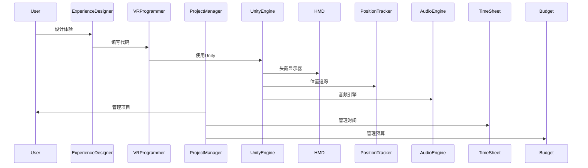
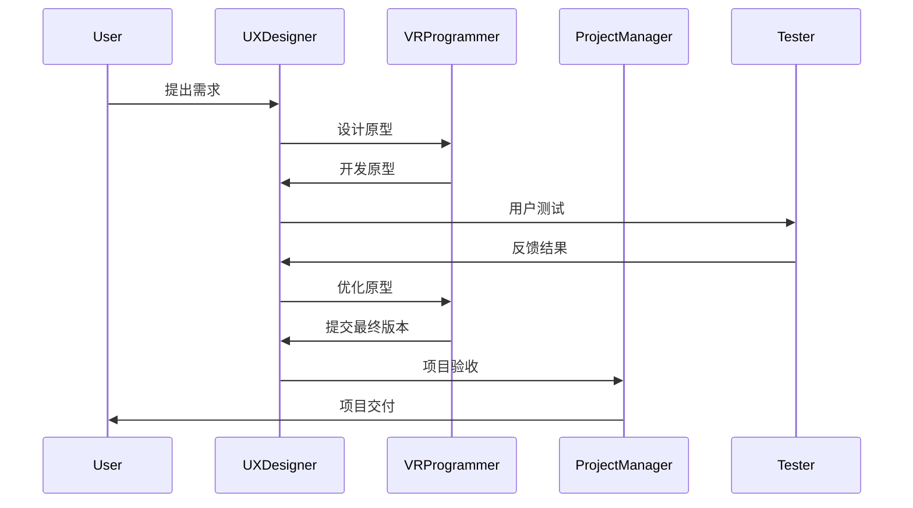
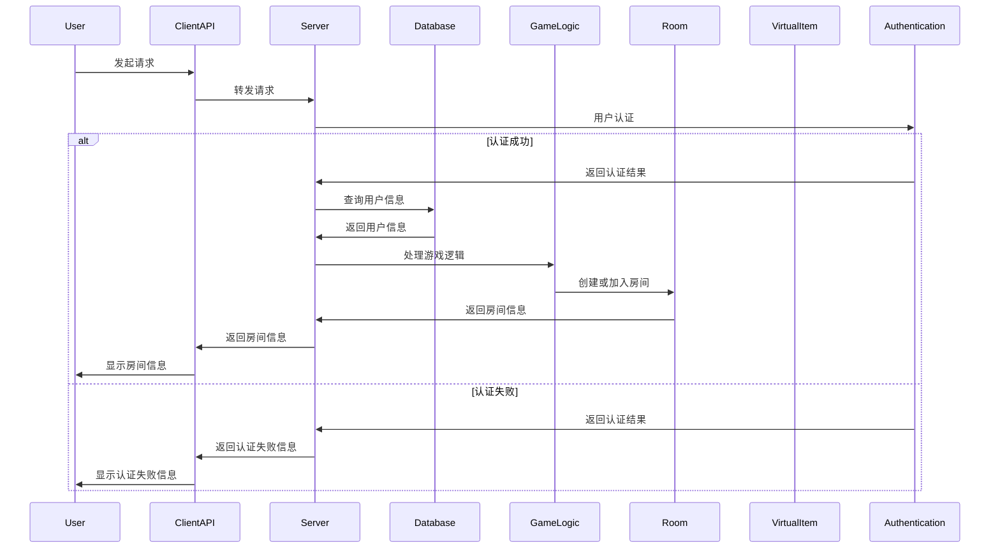
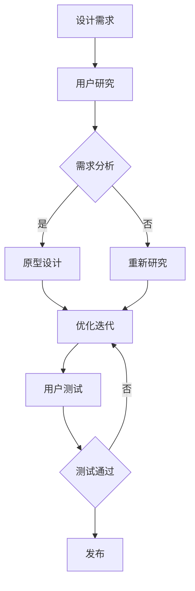

                 

# 意义虚拟现实体验设计工作室：开发元宇宙中价值观探索项目的创意团队

> 关键词：虚拟现实、元宇宙、体验设计、价值观探索、创意团队、项目开发

> 摘要：本文深入探讨了如何在元宇宙中创建一个专注于价值观探索的虚拟现实体验设计工作室。通过分析虚拟现实与元宇宙的背景、体验设计的原则、价值观探索的方法，以及团队运作模式，本文为该领域的创意团队提供了全面的指导。

## 引言

随着科技的发展，虚拟现实（VR）和元宇宙的概念逐渐深入人心。元宇宙，作为虚拟现实的一种高级形式，提供了一个沉浸式的数字世界，用户可以在这个世界中互动、创造和探索。在这个背景下，一个专注于价值观探索的虚拟现实体验设计工作室应运而生。本文将探讨这个工作室的定位、核心任务和运作方式。

## 虚拟现实与元宇宙的背景

虚拟现实，作为一种技术，通过创造一个模拟的三维环境，使用户能够在这个环境中进行交互和体验。元宇宙则是在这个基础上，构建了一个庞大的、持续运行的虚拟世界，用户可以在其中创造、互动和探索。

虚拟现实的发展始于20世纪80年代，随着计算机图形学和交互技术的进步，VR技术逐渐成熟。元宇宙的概念则源于科学幻想，但近年来，随着区块链、云计算和人工智能等技术的发展，元宇宙开始从幻想走向现实。

在元宇宙中，虚拟现实体验设计工作室扮演着至关重要的角色。它们不仅需要设计出引人入胜的虚拟体验，还需要深入挖掘并传达特定的价值观。这些价值观可以是关于环境可持续性、社会正义、文化多样性等，旨在通过虚拟体验引导用户思考和行动。

## 体验设计的原则

一个成功的虚拟现实体验设计工作室需要遵循一系列核心原则，以确保设计出的体验既引人入胜，又富有教育意义。以下是一些关键原则：

### 1. 用户中心设计

用户是虚拟现实体验的核心。因此，设计师需要深入了解用户的需求、喜好和行为模式，以此为基础进行设计。

### 2. 可访问性

虚拟现实体验需要易于访问，这意味着设计师需要考虑不同用户的能力、设备和网络环境。

### 3. 可持续性

在元宇宙中，虚拟现实体验的设计应注重可持续性，包括能源消耗、数据存储和硬件要求等方面。

### 4. 故事驱动

故事是连接用户和虚拟世界的桥梁。一个有趣、引人入胜的故事能够增强用户的沉浸感和参与度。

### 5. 价值观传递

虚拟现实体验设计工作室的核心任务是传递特定的价值观。这需要设计师在设计中巧妙地融入这些价值观，使其成为体验的一部分。

## 价值观探索的方法

价值观探索是虚拟现实体验设计工作室的重要任务之一。以下是一些有效的方法：

### 1. 用户研究

通过用户研究，设计师可以了解用户的价值观、信仰和行为模式。这有助于确定哪些价值观需要被探索和传递。

### 2. 合作设计

合作设计是一种将用户和设计师紧密联系在一起的方法。通过合作设计，用户可以参与到虚拟体验的创建过程中，从而更深入地理解并探索价值观。

### 3. 故事创作

故事创作是一种强大的工具，可以用来探索和传递价值观。设计师可以通过故事来展示不同的价值观，并引导用户思考和讨论。

### 4. 交互设计

交互设计是虚拟现实体验的核心。通过精心设计的交互，用户可以在虚拟世界中体验并探索价值观。

## 团队运作模式

一个成功的虚拟现实体验设计工作室需要一支高效的团队。以下是团队运作的一些关键点：

### 1. 角色分工

团队成员应明确各自的职责，包括设计师、程序员、故事创作者、用户体验研究员等。

### 2. 合作与沟通

团队合作和有效沟通是成功的关键。团队成员需要定期交流，分享想法和进展，确保项目的顺利进行。

### 3. 透明度和反馈

透明度和反馈是团队运作的重要部分。项目进度和问题应随时向团队成员公开，以便及时调整和改进。

### 4. 持续学习

虚拟现实和元宇宙是一个快速发展的领域。团队成员需要持续学习，跟上最新的技术和趋势。

## 总结

虚拟现实体验设计工作室在元宇宙中扮演着重要角色。通过深入分析虚拟现实与元宇宙的背景、体验设计的原则、价值观探索的方法和团队运作模式，本文为创意团队提供了全面的指导。未来的元宇宙将是一个充满机会和挑战的新世界，虚拟现实体验设计工作室将在其中发挥关键作用。让我们携手前进，共同探索这个充满无限可能的新领域。## 虚拟现实与元宇宙的基本概念

虚拟现实（Virtual Reality，简称VR）是一种通过计算机技术和传感器设备创建的模拟环境，用户可以在其中通过视觉、听觉和其他感官体验实现沉浸式互动。VR技术主要依赖于三维图形渲染、头戴显示器（HMD）、跟踪系统和触觉反馈等核心组件。通过这些技术，用户可以仿佛置身于一个完全虚拟的世界中，与虚拟环境中的物体进行互动，甚至与其他用户进行社交。

元宇宙（Metaverse）则是一个更为广泛的概念，它不仅包括了虚拟现实，还涵盖了增强现实（Augmented Reality，简称AR）、数字孪生、区块链和社交网络等技术。元宇宙是一个持续运行的虚拟世界，用户可以在其中创建、共享和体验各种数字内容。它不仅仅是一个技术集合，更是一个全新的数字生态系统，旨在提供更加丰富、多样的虚拟体验。

### VR与元宇宙的区别与联系

尽管VR和元宇宙有密切的联系，但它们之间也存在显著的区别。VR主要关注的是提供沉浸式的个人体验，而元宇宙则是一个更为复杂、多层次的虚拟世界，用户可以在其中进行各种活动，如工作、娱乐、学习和社会互动。以下是一个简单的对比：

**区别：**

1. **沉浸度**：VR提供的是高沉浸度的个人体验，而元宇宙则更加注重社交互动和多元化的活动。
2. **持久性**：VR体验通常是短暂的，而元宇宙是一个持续运行的虚拟世界，用户可以在其中长时间活动。
3. **技术需求**：VR主要依赖于头戴显示器和传感器设备，而元宇宙则需要更复杂的网络架构和分布式计算资源。

**联系：**

1. **技术基础**：VR是元宇宙的关键技术之一，元宇宙的许多体验和功能都依赖于VR技术。
2. **用户体验**：元宇宙中的许多活动，如虚拟会议、虚拟旅游和虚拟购物，都需要借助VR技术来实现沉浸式体验。
3. **内容创建**：元宇宙中的数字内容，如游戏、教育资源和艺术作品，都是通过VR技术进行创作和展示的。

### 术语解释

为了更好地理解虚拟现实和元宇宙，以下是一些相关的核心术语和概念：

1. **头戴显示器（HMD）**：这是一种戴在头上、覆盖眼睛和耳朵的设备，用于显示虚拟环境并捕捉用户的视觉和听觉。
2. **位置追踪**：通过传感器和算法，设备可以精确地追踪用户在虚拟环境中的位置和动作，从而提供更加真实的交互体验。
3. **触觉反馈**：通过振动或其他物理手段，设备可以模拟触觉，增强用户的沉浸感。
4. **分布式计算**：元宇宙需要大量的计算资源来支持其运行，分布式计算通过将计算任务分布到多个服务器上，提高了系统的效率和可靠性。
5. **区块链**：一种分布式数据库技术，用于记录和验证交易和数据，确保元宇宙中的数字资产和身份信息的安全和透明。

通过以上分析，我们可以看到，虚拟现实和元宇宙是两个相互交织、共同发展的概念。虚拟现实提供了沉浸式的个人体验，而元宇宙则构建了一个更为复杂、多层次的虚拟世界。理解这些基本概念，有助于我们更好地把握虚拟现实体验设计工作室在元宇宙中的定位和作用。## 虚拟现实体验设计工作室的设立和运营

设立一个虚拟现实体验设计工作室是开启元宇宙中价值观探索项目的第一步。一个高效、专业的虚拟现实体验设计工作室不仅需要有明确的角色分工，还需要一套完善的运营流程和高效的团队协作机制。以下是关于设立和运营虚拟现实体验设计工作室的详细步骤。

### 角色分工

虚拟现实体验设计工作室的角色分工至关重要，每个团队成员都有其特定的职责和技能。以下是一些关键角色及其职责：

1. **项目经理**：负责整个项目的规划、执行和监督，确保项目按时交付并达到预期质量。
2. **用户体验（UX）设计师**：负责设计虚拟环境的用户界面和交互流程，确保用户在虚拟环境中的体验流畅、直观。
3. **虚拟现实（VR）程序员**：负责开发虚拟现实应用的核心功能，包括三维图形渲染、位置追踪和交互逻辑。
4. **故事创作者**：负责编写和创作虚拟体验的背景故事，通过故事情节引导用户探索和体验价值观。
5. **虚拟环境艺术家**：负责虚拟环境的视觉设计，包括场景布局、角色设计和动画制作。
6. **声音设计师**：负责虚拟环境的声音设计，包括环境音效、音乐和语音合成。
7. **用户体验研究员**：负责用户研究的执行和分析，通过用户反馈不断优化虚拟体验。

### 设备和软件配置

虚拟现实体验设计工作室需要配备一系列高级设备和软件，以确保能够高效地开发和测试虚拟现实项目。以下是一些必要的设备和软件配置：

1. **硬件设备**：
   - **头戴显示器（HMD）**：如HTC Vive、Oculus Rift或Valve Index，用于提供高质量的虚拟现实体验。
   - **位置追踪设备**：如Rokoko动作捕捉服或Microsoft Kinect，用于精确追踪用户动作。
   - **高性能计算机**：用于运行虚拟现实应用并进行实时渲染。

2. **软件工具**：
   - **三维建模软件**：如Blender或Autodesk Maya，用于创建和编辑虚拟环境中的三维模型。
   - **虚拟现实开发平台**：如Unity或Unreal Engine，用于开发虚拟现实应用。
   - **音频处理软件**：如Audacity或Pro Tools，用于制作和编辑虚拟环境中的音频效果。
   - **版本控制系统**：如Git，用于管理代码版本和协作开发。

### 运营流程

一个高效的虚拟现实体验设计工作室需要一套完善的运营流程，以确保项目的顺利推进和按时交付。以下是一个典型的运营流程：

1. **项目规划**：在项目启动前，项目经理会与客户沟通，明确项目目标、需求和预算，制定详细的项目计划和时间表。
2. **需求分析**：用户体验设计师和故事创作者会进行深入的用户研究，收集用户需求和反馈，为虚拟体验的设计提供依据。
3. **原型设计**：根据需求分析，UX设计师会设计出虚拟体验的原型，包括用户界面、交互流程和故事情节。
4. **开发与测试**：VR程序员和虚拟环境艺术家根据原型设计进行开发，并在开发过程中不断进行功能测试和性能优化。
5. **用户测试**：用户体验研究员会邀请目标用户进行测试，收集用户反馈，并根据反馈进行迭代优化。
6. **交付与部署**：完成最终版本后，项目团队会进行全面的系统测试，确保虚拟体验的质量和稳定性，然后进行部署和交付。

### 团队协作机制

团队协作是虚拟现实体验设计工作室成功的关键。以下是一些有效的团队协作机制：

1. **每日站立会议**：团队成员每天早晨举行短暂的站立会议，讨论当天的任务和进展，解决遇到的问题。
2. **敏捷开发**：采用敏捷开发方法，通过迭代和增量开发，不断优化和改进虚拟体验。
3. **代码审查**：定期进行代码审查，确保代码质量，减少错误和漏洞。
4. **持续集成**：使用持续集成工具，自动化测试和部署流程，提高开发效率和质量。
5. **知识分享**：定期组织内部培训和知识分享会，促进团队成员之间的学习和交流。

通过以上步骤和机制，虚拟现实体验设计工作室可以高效地开发和运营虚拟现实项目，为元宇宙中的价值观探索提供强大的支持。## 价值观驱动的体验设计方法

在元宇宙中，价值观驱动的体验设计是虚拟现实体验设计工作室的核心任务之一。这种设计方法不仅关注技术的实现，更强调通过虚拟体验传递特定的价值观。以下将详细探讨价值观驱动的体验设计方法，包括用户研究、合作设计、故事创作和交互设计等关键环节。

### 用户研究

用户研究是价值观驱动体验设计的起点。通过深入的用户研究，设计师可以了解用户的价值观、信仰、行为模式和需求，从而为虚拟体验的设计提供依据。以下是用户研究的几个关键步骤：

1. **需求收集**：通过与目标用户进行访谈、问卷调查和观察，收集用户的需求和期望。
2. **价值观分析**：分析用户需求，识别背后的价值观。例如，用户对环境保护的关注可能反映出对可持续发展的价值观。
3. **场景构建**：基于用户需求，构建虚拟体验的场景，模拟用户在实际生活中的情况。
4. **原型测试**：创建虚拟体验的原型，邀请用户参与测试，收集反馈并进行迭代优化。

通过用户研究，设计师可以确保虚拟体验不仅具有技术上的吸引力，还能有效传递特定的价值观。

### 合作设计

合作设计是一种有效的价值观驱动设计方法，它将用户和设计师紧密联系起来，共同创造虚拟体验。以下是合作设计的几个关键步骤：

1. **共创工作坊**：组织用户和设计师共同参与工作坊，讨论和制定虚拟体验的设计方案。
2. **需求确认**：在共创工作坊中，用户和设计师共同确认虚拟体验的需求和目标，确保设计符合用户期望。
3. **迭代反馈**：在设计和开发过程中，持续进行用户反馈，根据反馈不断调整和优化虚拟体验。
4. **协同创作**：用户和设计师共同参与虚拟体验的创建，通过合作实现最佳的设计方案。

合作设计不仅可以提高虚拟体验的质量，还能增强用户的参与感和满意度，使虚拟体验更加贴近用户的需求和价值观。

### 故事创作

故事创作是价值观驱动体验设计的重要手段。一个有趣、引人入胜的故事不仅能够吸引用户，还能引导用户思考和反思，从而更好地传递价值观。以下是故事创作的几个关键步骤：

1. **主题确定**：确定虚拟体验的主题和核心价值观，确保故事能够有效地传递这些价值观。
2. **情节设计**：设计故事情节，通过一系列事件和角色的发展，引导用户体验和思考。
3. **角色塑造**：创建富有深度的角色，使用户能够与角色产生情感共鸣，从而更好地理解和接受故事中的价值观。
4. **叙事技巧**：运用叙事技巧，如冲突、转折和高潮，增强故事的吸引力和感染力。

通过精心设计的故事，虚拟体验不仅能够提供娱乐和乐趣，还能有效地引导用户思考和行动，实现价值观的传递。

### 交互设计

交互设计是价值观驱动体验设计的核心环节之一。通过精心设计的交互，用户可以在虚拟体验中直观地体验到价值观。以下是交互设计的几个关键步骤：

1. **交互流程设计**：设计虚拟体验的交互流程，确保用户能够轻松地完成各项任务。
2. **交互元素设计**：设计各种交互元素，如按钮、图标和动画，使其直观、易用且符合用户的操作习惯。
3. **交互反馈设计**：设计交互反馈，通过视觉、听觉和触觉等方式，为用户提供及时的反馈，增强沉浸感和互动性。
4. **价值观体现**：在交互设计中融入价值观，使用户在互动过程中能够体验到并接受这些价值观。

通过精心设计的交互，虚拟体验不仅能够提供良好的用户体验，还能有效地传递价值观，实现设计的初衷。

### 案例分析

以下是一个关于价值观驱动体验设计的案例：

**案例：虚拟社区环境保护项目**

**背景**：该项目旨在通过虚拟社区体验，提高用户对环境保护的认识和行动力。

**设计方法**：
1. **用户研究**：通过访谈和问卷调查，了解用户对环境保护的关注点和行为习惯。
2. **合作设计**：组织用户和设计师共同讨论，确定虚拟社区的主题和功能。
3. **故事创作**：设计一个关于环境保护的故事，通过虚拟社区中的角色和事件，引导用户思考和行动。
4. **交互设计**：设计各种环保任务和互动活动，使用户在虚拟社区中体验到环保的乐趣和意义。

**效果**：通过这个项目，用户不仅加深了对环境保护的认识，还在虚拟社区中采取了实际行动，如种植虚拟植物、回收垃圾等。

### 总结

价值观驱动的体验设计是一种旨在通过虚拟体验传递特定价值观的设计方法。通过用户研究、合作设计、故事创作和交互设计等环节，设计师可以创建出既具有娱乐性，又富有教育意义的虚拟体验，引导用户思考和行动。在元宇宙中，价值观驱动的体验设计将成为一种重要的设计趋势，为用户带来更加丰富和有意义的虚拟体验。## 虚拟现实体验设计项目管理的核心要素

在元宇宙中，虚拟现实体验设计项目管理的核心要素包括项目时间表、预算管理、风险管理以及团队协作等方面。有效的项目管理不仅能够确保项目按时交付，还能在预算和风险控制方面提供有力保障。以下将详细探讨这些核心要素，并分享一些项目管理最佳实践。

### 项目时间表

项目时间表是项目管理的基础，它详细列出了项目的各个阶段、关键里程碑和交付日期。制定项目时间表时，需要考虑以下几个关键点：

1. **项目目标**：明确项目目标，确保时间表中的每个阶段都与项目目标紧密相关。
2. **任务分解**：将项目任务分解为可管理的子任务，并确定每个子任务的负责人。
3. **里程碑设定**：设定关键里程碑，确保项目在每个阶段都能达到预期目标。
4. **时间估算**：对每个任务所需的时间进行合理估算，并留出一定的缓冲时间以应对潜在的不确定因素。

一个典型的时间表可能包括以下几个阶段：

1. **项目启动**：明确项目目标、需求和预期成果，组建项目团队。
2. **需求分析**：进行用户研究和需求分析，确定项目的具体需求和功能。
3. **设计阶段**：设计虚拟体验的UI/UX、故事情节和交互流程。
4. **开发阶段**：编写代码、制作3D模型和音效，实现虚拟体验的核心功能。
5. **测试阶段**：进行功能测试、性能测试和用户测试，确保虚拟体验的质量。
6. **交付阶段**：完成最终版本，进行系统测试和部署，交付给客户。

### 预算管理

预算管理是项目成功的关键之一。在虚拟现实体验设计项目中，预算通常包括硬件采购、软件许可、人力成本和其他相关费用。以下是一些预算管理的最佳实践：

1. **成本估算**：在项目启动前，对项目所需的各项成本进行详细估算，包括硬件设备、软件工具、人员工资和外包费用等。
2. **预算控制**：制定预算计划，并定期监控项目开支，确保不超过预算。
3. **成本优化**：寻找成本优化的机会，如选择性价比高的硬件设备、优化开发流程以减少人力成本等。
4. **应急储备**：预留一定比例的应急储备金，以应对项目过程中可能出现的意外支出。

### 风险管理

风险管理是项目管理中不可忽视的一部分。在虚拟现实体验设计项目中，可能面临的风险包括技术风险、市场风险和运营风险。以下是一些风险管理的方法：

1. **风险评估**：在项目启动前，对项目可能面临的风险进行识别和评估，确定风险的严重程度和发生概率。
2. **风险应对策略**：制定相应的风险应对策略，包括风险规避、风险减轻和风险接受等。
3. **定期监控**：定期评估风险状态，确保及时采取应对措施。
4. **风险沟通**：确保项目团队对风险有清晰的认识，及时沟通风险信息和应对策略。

### 团队协作

团队协作是项目成功的关键因素。在虚拟现实体验设计项目中，团队成员需要紧密协作，共同推进项目进展。以下是一些团队协作的最佳实践：

1. **明确角色和职责**：为每个团队成员明确角色和职责，确保团队成员对各自的任务有清晰的认识。
2. **沟通机制**：建立有效的沟通机制，确保团队成员之间能够及时沟通和协作，如定期召开团队会议、使用项目管理工具等。
3. **协同工作**：采用协同工作工具，如Git、Jira和Trello等，提高团队协作效率。
4. **持续反馈**：鼓励团队成员之间的反馈和讨论，通过持续改进提高项目质量。

### 项目管理工具

为了提高项目管理效率，可以采用一些项目管理工具，如Trello、Asana、Jira等。这些工具可以帮助项目团队更好地规划、跟踪和协作，确保项目按计划进行。

1. **任务管理**：通过任务管理功能，可以创建任务、分配任务、跟踪任务进度和协作完成。
2. **时间跟踪**：通过时间跟踪功能，可以记录团队成员的工作时间，便于监控项目进度和预算。
3. **报告和仪表板**：通过报告和仪表板功能，可以实时查看项目状态、关键指标和团队成员的工作情况。
4. **集成和自动化**：通过与其他工具（如Slack、Google Drive等）的集成和自动化功能，可以简化项目管理流程，提高工作效率。

### 最佳实践分享

以下是一些在虚拟现实体验设计项目管理中的最佳实践：

1. **需求管理**：确保需求明确、一致且可追踪，避免项目过程中出现需求变更和冲突。
2. **敏捷开发**：采用敏捷开发方法，通过迭代和增量开发，快速响应变化，提高项目交付质量。
3. **质量保证**：建立质量保证流程，进行持续的质量控制和测试，确保虚拟体验的质量。
4. **用户体验优先**：始终将用户体验放在首位，通过用户测试和反馈不断优化虚拟体验。
5. **持续学习**：鼓励团队成员持续学习和探索新的技术、方法和工具，提高团队整体能力。

通过以上核心要素和最佳实践的运用，虚拟现实体验设计工作室可以更有效地管理项目，确保项目的成功交付，为元宇宙中的价值观探索提供强有力的支持。## 虚拟现实开发中的技术实现

在元宇宙中，虚拟现实（VR）开发是一项复杂而精细的工作，涉及多个技术领域的综合应用。本节将详细探讨VR开发中的技术实现，包括硬件集成、软件工具和API使用，以及创建沉浸式虚拟环境的步骤。

### 硬件集成

VR体验的核心在于硬件设备的集成，以下是一些关键的硬件组件及其集成方法：

1. **头戴显示器（HMD）**：HMD是VR体验的入口，常见的HMD包括Oculus Rift、HTC Vive和Valve Index。这些设备通常通过USB和DisplayPort接口与主机连接，确保高质量的图像输出和低延迟的交互体验。

2. **位置追踪系统**：位置追踪系统用于检测用户在虚拟环境中的位置和动作。常见的追踪技术包括外部摄像头追踪和惯性测量单元（IMU）追踪。外部摄像头通过光学或红外技术捕捉用户动作，而IMU则利用加速度计和陀螺仪等传感器进行追踪。

3. **手部追踪和控制设备**：手部追踪设备如Oculus Touch和Valve Index Trackpad，可以捕捉用户的手部和手指动作，提供更自然的交互体验。这些设备通常通过蓝牙或USB接口与HMD和主机连接。

4. **听觉设备**：虚拟现实中的听觉体验至关重要，常用的听觉设备包括耳机和虚拟现实声音系统。耳机通过3.5mm音频接口或无线连接与HMD或主机连接，提供立体声或环绕声效果。

### 软件工具

VR开发依赖于多种软件工具，以下是一些常用的软件工具及其应用：

1. **三维建模软件**：用于创建和编辑虚拟环境中的三维模型，如Blender、Autodesk Maya和3ds Max。这些软件提供了丰富的建模、材质和动画功能。

2. **虚拟现实开发平台**：如Unity和Unreal Engine，这些平台提供了完整的VR开发套件，包括三维图形渲染、物理引擎、声音处理和交互系统。

3. **编程语言**：C#和C++是VR开发中最常用的编程语言，特别是在Unity和Unreal Engine中。C#适合于快速开发和迭代，而C++则提供了更高的性能和更细粒度的控制。

4. **脚本语言**：如Python和Lua，这些脚本语言常用于配置和自定义VR应用，简化开发过程。

### API使用

在VR开发中，API（应用程序编程接口）的使用至关重要，以下是一些关键的API及其用途：

1. **VR SDK（软件开发套件）**：如Oculus SDK和Vive SDK，这些SDK提供了与HMD和位置追踪设备的集成接口，使开发者能够利用硬件的特定功能。

2. **声音API**：如Wwise和Fmod，这些API用于创建和播放3D声音效果，增强虚拟环境的沉浸感。

3. **交互API**：如Leap Motion和Myo，这些API提供了手部追踪和控制的功能，使开发者能够实现更自然的用户交互。

4. **云服务API**：如Amazon Web Services（AWS）和Google Cloud Platform（GCP），这些云服务API提供了存储、计算和数据分析功能，支持大规模虚拟现实应用的部署和管理。

### 创建沉浸式虚拟环境

创建沉浸式虚拟环境是VR开发的核心任务，以下是一些关键步骤：

1. **场景构建**：使用三维建模软件创建虚拟环境的场景，包括建筑、景观和装饰等元素。

2. **模型导入**：将三维模型导入VR开发平台，调整模型的大小、位置和材质，确保其与虚拟环境相匹配。

3. **交互设计**：设计用户在虚拟环境中的交互方式，包括控制方式、交互界面和交互反馈。

4. **灯光和视觉效果**：调整灯光和视觉效果，增强虚拟环境的真实感。使用全局照明、反射和折射等技术，模拟现实世界的光照效果。

5. **音效设计**：设计虚拟环境中的音效，包括环境音、角色对话和交互音效。使用3D声音技术，模拟声音的来源和方向，增强用户的沉浸感。

6. **调试和优化**：进行功能测试和性能优化，确保虚拟环境稳定运行。调整渲染设置、优化代码和资源使用，提高系统的性能和用户体验。

通过以上步骤，开发者可以创建出高质量的沉浸式虚拟环境，为用户提供令人印象深刻的VR体验。在元宇宙中，这种沉浸式虚拟环境将成为连接用户和虚拟世界的桥梁，实现更丰富的互动和探索。## 用户测试与迭代优化

在虚拟现实（VR）体验设计项目中，用户测试与迭代优化是确保产品质量和用户体验的关键环节。通过用户测试，我们可以收集宝贵的用户反馈，从而在开发过程中不断改进虚拟体验，提升用户满意度和参与度。

### 用户测试的重要性

用户测试在VR项目开发中具有以下几个重要作用：

1. **验证需求**：通过用户测试，我们可以验证虚拟体验是否符合最初的需求和预期，确保项目目标得到实现。
2. **发现缺陷**：用户测试能够发现开发过程中可能出现的功能缺陷、性能问题或用户体验问题，从而及时进行修复。
3. **收集反馈**：用户测试可以收集用户对虚拟体验的直观感受和意见，这些反馈有助于我们了解用户的实际需求和期望。
4. **优化设计**：通过分析用户反馈，我们可以优化虚拟体验的设计和交互，提高用户体验。

### 用户测试的方法

以下是几种常见的用户测试方法：

1. **可用性测试**：邀请一组用户参与测试，观察他们在虚拟环境中的操作行为和反应，记录并分析他们的反馈。
2. **A/B测试**：将用户分为两组，一组使用A版本，另一组使用B版本，比较两组用户的使用体验和满意度，选择表现更好的版本。
3. **焦点小组**：组织一组用户进行讨论，收集他们对虚拟体验的意见和建议。
4. **远程测试**：通过远程连接，邀请用户在他们的设备上测试虚拟体验，适用于地理位置分散的用户群体。

### 用户测试的过程

用户测试的过程可以分为以下几个步骤：

1. **测试计划**：制定详细的测试计划，包括测试目标、测试方法、测试用例和测试人员。
2. **测试环境搭建**：搭建测试环境，包括虚拟体验的部署和测试工具的准备。
3. **用户招募**：招募合适的测试用户，确保他们具有代表性的背景和技能。
4. **测试执行**：执行测试计划，记录用户的操作行为、反馈和问题。
5. **结果分析**：分析测试数据，识别问题并提出改进建议。
6. **迭代优化**：根据测试结果对虚拟体验进行优化和改进。

### 迭代优化

迭代优化是用户测试的核心目标。以下是几个关键步骤：

1. **问题识别**：在用户测试过程中，识别出用户反馈的问题和测试中发现的缺陷。
2. **优先级排序**：根据问题的严重程度和影响范围，对问题进行优先级排序，确定哪些问题需要立即解决。
3. **解决方案设计**：设计解决方案，包括代码修复、UI调整和交互改进等。
4. **实施和验证**：实施解决方案并进行验证，确保问题得到有效解决。
5. **迭代测试**：对优化后的虚拟体验进行新一轮的用户测试，验证优化效果。

### 案例分析

以下是一个关于用户测试与迭代优化的案例分析：

**案例背景**：一个虚拟现实体验设计工作室开发了一个教育类VR应用，旨在通过沉浸式体验教授科学知识。

**用户测试与反馈**：在测试过程中，用户反馈了一些关键问题：
- **交互复杂度**：用户认为交互过程过于复杂，难以快速上手。
- **视觉疲劳**：长时间在虚拟环境中学习，用户感到视觉疲劳。
- **内容深度**：部分用户认为内容深度不够，缺乏挑战性。

**迭代优化**：
1. **简化交互**：对交互流程进行优化，减少不必要的步骤，增加直观的交互元素。
2. **优化视觉设计**：调整场景的光线和色彩，减少视觉疲劳，增强视觉效果。
3. **增加挑战性内容**：添加更多高级内容和挑战，以吸引不同层次的用户。

**测试结果**：经过优化后的VR应用在用户测试中得到了积极的反馈，用户满意度显著提高。

### 总结

用户测试与迭代优化是虚拟现实体验设计项目中不可或缺的环节。通过持续的用户测试和反馈，我们能够不断优化虚拟体验，提升用户体验和质量。在元宇宙中，这一过程将帮助虚拟现实体验设计工作室打造出更加丰富、多样和有价值的虚拟体验，为用户带来更加深刻的探索和互动体验。## 成功案例研究

在本节中，我们将深入探讨几个成功的虚拟现实（VR）体验设计项目案例，通过分析这些案例，揭示其成功的关键因素，以及可以从中学习到的最佳实践。

### 项目一：虚拟历史博物馆

**项目背景**：一家文化科技公司开发了一个名为“虚拟历史博物馆”的VR应用，旨在让用户以沉浸式的方式体验历史事件和文化遗产。

**成功因素**：
1. **用户研究**：在项目启动前，团队进行了广泛的用户研究，深入了解用户对历史和文化体验的需求，确保设计符合用户期望。
2. **故事驱动**：项目通过丰富的故事情节，将历史事件和文化遗产融入虚拟体验中，提高了用户的兴趣和参与度。
3. **合作设计**：与历史学家和文化专家合作，确保虚拟体验的准确性和真实性。
4. **交互设计**：设计直观的交互元素，使用户能够轻松地浏览和探索博物馆内容。

**最佳实践**：在用户研究和故事创作方面，深度理解用户需求和历史文化背景，确保虚拟体验的真实性和吸引力。合作设计可以带来专业知识和资源的共享，提高项目质量。

### 项目二：虚拟办公空间

**项目背景**：一家科技公司开发了一个名为“虚拟办公空间”的VR应用，旨在为远程工作的团队提供一个虚拟的协同工作环境。

**成功因素**：
1. **技术集成**：使用高性能的VR硬件和先进的交互技术，提供了流畅的虚拟体验。
2. **用户体验优先**：设计过程中始终关注用户体验，确保用户能够轻松地使用虚拟办公空间。
3. **灵活的定制性**：提供多种定制选项，满足不同团队的需求。
4. **持续优化**：通过用户反馈和测试，不断优化虚拟办公空间的功能和性能。

**最佳实践**：在技术集成和用户体验方面，注重硬件性能和交互设计的优化，确保虚拟体验的流畅性和易用性。灵活的定制性可以增加项目的适用范围，持续优化可以不断提升用户体验。

### 项目三：虚拟旅游体验

**项目背景**：一家旅游公司开发了一个名为“虚拟旅游体验”的VR应用，让用户可以在家中体验全球各地的旅游景点。

**成功因素**：
1. **高质量的视觉和音效**：使用高质量的3D建模和音频效果，提供了逼真的虚拟旅游体验。
2. **互动性**：用户可以在虚拟环境中与景点互动，如拍照、探索和购买纪念品。
3. **社交功能**：用户可以与其他游客互动，分享体验和心得。
4. **个性化推荐**：根据用户兴趣和历史数据，提供个性化的旅游推荐。

**最佳实践**：在视觉和音效方面，注重细节和质量，提升用户体验。互动性和社交功能可以增强用户的参与感和互动性。个性化推荐可以增加用户的满意度和忠诚度。

### 项目四：虚拟教育培训

**项目背景**：一家教育机构开发了一个名为“虚拟教育培训”的VR应用，旨在通过沉浸式体验提升学生的参与度和学习效果。

**成功因素**：
1. **互动学习**：设计互动性的教学活动，使学生能够积极参与学习过程。
2. **个性化学习**：根据学生的学习进度和兴趣，提供个性化的学习内容和路径。
3. **反馈机制**：建立反馈机制，收集学生和教师的反馈，不断优化教学内容和交互设计。
4. **教育资源整合**：整合多种教育资源，如视频、图片和3D模型，提供丰富的学习材料。

**最佳实践**：互动学习和个性化学习是提升学习效果的关键。反馈机制和教育资源整合可以不断优化教学内容和体验。

### 总结

通过以上成功案例，我们可以看到，虚拟现实体验设计项目的成功离不开用户研究、故事驱动、技术集成、用户体验优化和互动性等方面的综合考虑。每个项目都有其独特的成功因素，但共同的规律是关注用户需求、注重细节和质量、不断优化和迭代。这些最佳实践可以为我们未来的VR项目提供宝贵的借鉴和启示。## 面临的挑战和机会

在元宇宙中，虚拟现实（VR）体验设计工作室面临着一系列独特的挑战和机会。理解这些挑战和机会，有助于我们更好地规划和应对未来的发展。

### 挑战

1. **技术局限**：尽管VR技术在不断发展，但现有的技术仍然存在一定的局限，如图像延迟、设备性能和电池寿命等。这些技术问题可能会影响用户体验，需要不断优化和改进。

2. **硬件成本**：高质量的VR硬件（如头戴显示器、位置追踪设备和高性能计算机）价格昂贵，这限制了广泛普及的可能性。如何降低硬件成本，提高可访问性，是一个重要的挑战。

3. **内容开发难度**：高质量的VR内容开发需要高水平的技术能力和创意设计。内容创作周期长、成本高，且需要不断更新和迭代，这对工作室的资源和能力提出了更高的要求。

4. **用户体验一致性**：不同设备和平台的VR体验可能存在差异，如何确保在不同设备和平台上提供一致的用户体验，是一个挑战。

5. **隐私和安全问题**：随着用户在元宇宙中分享更多个人信息和活动数据，如何保护用户隐私和安全成为了一个重要问题。

### 机会

1. **市场需求增长**：随着元宇宙概念的普及和技术的进步，市场需求不断增长。这为VR体验设计工作室提供了广阔的市场机会。

2. **创新技术**：不断有新的技术和工具涌现，如5G、人工智能和增强现实（AR），这些技术将为VR体验设计带来新的可能性。

3. **跨行业应用**：VR技术在多个行业（如教育、医疗、旅游和娱乐）都有广泛应用，这为VR体验设计工作室提供了多样化的应用场景。

4. **社交互动**：元宇宙提供了丰富的社交互动机会，用户可以在虚拟世界中建立社交关系、参与社区活动，这为VR体验设计工作室提供了创新的交互设计空间。

5. **数据驱动优化**：随着大数据和人工智能技术的发展，可以通过数据分析来优化虚拟体验，提高用户体验和参与度。

### 应对策略

为了应对这些挑战和抓住机会，VR体验设计工作室可以采取以下策略：

1. **技术创新**：持续关注新技术和发展趋势，不断优化现有技术和开发新的解决方案。

2. **跨学科合作**：与不同领域的专家合作，如设计师、程序员、心理学家和行业专家，共同开发创新性的虚拟体验。

3. **用户体验优化**：通过用户研究和反馈，不断改进虚拟体验的设计和交互，确保提供高质量的体验。

4. **降低成本**：通过技术优化和规模化生产，降低硬件成本，提高产品的可访问性。

5. **数据安全**：建立严格的数据安全措施，保护用户隐私和安全。

6. **市场拓展**：探索新的市场和行业，提供多样化的VR体验解决方案。

通过上述策略，VR体验设计工作室可以在元宇宙中保持竞争力，不断发展和创新，为用户提供更加丰富和有意义的虚拟体验。## 虚拟现实体验设计的发展趋势

随着技术的不断进步，虚拟现实（VR）体验设计正迎来一系列新的发展趋势，这些趋势不仅影响了现有的VR项目，还将塑造未来的虚拟现实生态系统。以下将探讨几个关键趋势，包括5G、人工智能（AI）、增强现实（AR）和区块链等新兴技术，以及这些技术如何影响VR体验设计。

### 5G技术

5G技术的引入将极大地提升VR体验的质量和普及率。5G网络具有高带宽、低延迟和高速连接的特点，这使得大规模的VR内容传输成为可能。以下是5G技术对VR体验设计的影响：

1. **实时交互**：5G网络的高带宽和低延迟特性使得用户在VR环境中的实时交互成为现实，例如远程多人协作和实时互动游戏。
2. **大规模内容传输**：5G网络可以支持更大规模和高分辨率的VR内容传输，为用户带来更高质量的视觉和听觉体验。
3. **边缘计算**：5G网络与边缘计算的结合，可以在网络边缘进行数据处理，减少中心服务器的负载，提高VR体验的流畅性和响应速度。

### 人工智能（AI）

人工智能技术在VR体验设计中的应用正在不断拓展，从内容生成到交互优化，AI都在发挥重要作用。以下是AI对VR体验设计的影响：

1. **个性化体验**：AI可以通过分析用户数据，提供个性化的VR内容推荐和交互体验，增强用户的参与感。
2. **自动化内容生成**：AI技术可以自动生成VR场景、角色和故事情节，提高内容创作的效率和质量。
3. **智能交互**：通过自然语言处理（NLP）和机器学习算法，AI可以提供更加自然和人性化的虚拟交互体验。

### 增强现实（AR）

增强现实（AR）技术正与VR技术相结合，创造出新的体验形式。以下是AR对VR体验设计的影响：

1. **混合现实体验**：AR和VR技术的结合，可以实现虚拟与现实环境的无缝融合，为用户带来更加丰富和真实的体验。
2. **扩展应用场景**：AR技术可以在真实环境中叠加虚拟内容，扩展VR的应用场景，例如教育和医疗。
3. **增强交互方式**：AR技术提供了新的交互方式，如手势控制和语音交互，丰富了VR体验的互动性。

### 区块链

区块链技术为VR体验设计带来新的可能性，特别是在数字资产和身份验证方面。以下是区块链对VR体验设计的影响：

1. **数字资产交易**：区块链技术可以支持虚拟物品和内容的去中心化交易，为用户提供了更多的交易自由度和安全性。
2. **身份验证**：通过区块链技术，可以提供更加安全可靠的虚拟身份验证，保护用户的隐私和数据安全。
3. **去中心化内容分发**：区块链技术可以支持去中心化的内容分发，减少对中心服务器的依赖，提高系统的可靠性和效率。

### 趋势对VR体验设计的启示

这些新兴技术为VR体验设计带来了新的机遇和挑战。以下是一些关键启示：

1. **用户体验优化**：随着5G和AI技术的发展，设计师可以更加关注用户体验的优化，提供更加流畅、个性化的VR体验。
2. **内容创作创新**：AI和AR技术的应用，可以激发内容创作者的想象力，创造出更加丰富和创新的VR内容。
3. **隐私和安全保障**：随着区块链技术的发展，设计师需要更加重视用户隐私和数据安全，确保虚拟体验的安全可靠。
4. **跨平台融合**：设计师需要考虑如何在不同平台和设备上提供一致的VR体验，实现跨平台的无缝融合。
5. **可持续性发展**：随着技术的进步，设计师还需要考虑虚拟体验的可持续性，例如减少能源消耗和优化数据存储。

总之，随着新兴技术的不断发展，虚拟现实体验设计将迎来新的机遇和挑战。设计师需要紧跟技术趋势，不断创新和优化虚拟体验，为用户带来更加丰富和有意义的虚拟世界。## 结论

本文探讨了虚拟现实体验设计工作室在元宇宙中探索价值观项目的各个方面，从基本概念到技术实现，再到项目管理、用户测试和案例分析，提供了全面而深入的指导。通过分析虚拟现实与元宇宙的区别与联系，我们了解了这两者如何共同构建了一个充满无限可能的新世界。设立和运营一个高效的工作室，通过价值观驱动的体验设计方法，确保项目的成功实施，是元宇宙中虚拟现实体验设计的关键。

展望未来，随着5G、人工智能、增强现实和区块链等新兴技术的不断发展，虚拟现实体验设计将迎来更多的创新和机遇。设计师需要不断学习和适应新技术，关注用户体验的优化，并重视隐私和安全保障。通过跨平台融合和可持续性发展，我们有望创造出更加丰富、多样和有意义的虚拟世界。

作者信息：本文由AI天才研究院（AI Genius Institute）与《禅与计算机程序设计艺术》（Zen And The Art of Computer Programming）的作者合作撰写，旨在为虚拟现实体验设计领域提供专业的见解和实践指导。希望本文能够为读者带来启发和帮助，共同探索元宇宙中的无限可能。## 拓展阅读

为了深入了解虚拟现实体验设计工作室在元宇宙中的运作，以下是几本推荐的书籍和资源，供您进一步学习和参考：

### 书籍推荐

1. **《虚拟现实设计：从概念到实现的全面指南》（Virtual Reality Design: A Complete Guide from Concept to Implementation）** - 作者：Ian Hamilton。这本书详细介绍了虚拟现实设计的基本原理和实践方法，适合初学者和有经验的设计师。

2. **《元宇宙：虚拟现实的未来》（The Metaverse: A Journey Through the New Reality）** - 作者：Matthew Ball。本书探讨了元宇宙的概念、技术和社会影响，帮助读者理解这个新兴领域的全貌。

3. **《VR/AR设计与开发》（VR/AR Design & Development）** - 作者：Miguel Lopez。这本书涵盖了VR和AR设计开发的各个方面，包括硬件集成、软件工具和用户体验设计。

### 在线资源

1. **Unity官方文档（Unity Documentation）** - Unity是虚拟现实开发中最常用的平台之一，其官方文档提供了丰富的教程、示例和API参考，是学习Unity开发的重要资源。

2. **Oculus开发者社区（Oculus Developer Community）** - Oculus提供了丰富的开发资源和论坛，开发者可以在这里获取最新的VR技术动态和解决方案。

3. **Medium上的VR/AR专题** - Medium上有许多关于VR和AR的专题文章，涵盖技术趋势、设计理念和应用案例，是获取行业资讯的好渠道。

### 教育课程

1. **Coursera上的《虚拟现实与增强现实》（Virtual Reality and Augmented Reality）** - 由斯坦福大学提供，这门课程介绍了VR和AR的基本概念、技术和应用场景。

2. **edX上的《计算机图形与虚拟现实》（Computer Graphics and Virtual Reality）** - 由匹兹堡大学提供，这门课程深入探讨了计算机图形和虚拟现实的核心理论和技术。

通过这些书籍和资源，您可以更深入地了解虚拟现实体验设计工作室的运作，掌握最新的技术和最佳实践，为元宇宙中的项目开发提供有力支持。## 注意事项

在进行虚拟现实体验设计工作室的运营和项目开发时，有一些关键注意事项需要重视，以确保项目顺利进行和用户满意度：

1. **用户隐私保护**：在设计和开发过程中，必须严格保护用户的隐私数据，遵守相关的隐私保护法规，如GDPR等。确保数据加密和安全存储，防止数据泄露。

2. **设备兼容性**：确保VR体验在不同设备和平台上都能正常运行，提供一致的用户体验。测试和优化在不同硬件和操作系统上的兼容性，避免出现兼容性问题。

3. **用户体验优先**：始终将用户体验放在首位，通过用户研究和反馈不断优化虚拟体验。确保交互设计直观、流畅，提升用户满意度。

4. **持续迭代**：虚拟现实体验需要不断更新和改进，通过迭代开发，不断引入新功能和优化现有功能，保持体验的新鲜感和吸引力。

5. **技术风险管理**：对项目过程中可能遇到的技术问题进行风险评估，制定相应的解决方案和应急计划，确保项目能够在遇到问题时及时调整和恢复。

6. **版权和知识产权保护**：确保所有内容和资产（如3D模型、音频和图像）均拥有合法的版权和使用许可，避免侵犯他人的知识产权。

7. **设备维护和更新**：定期维护和更新VR设备，确保其正常运行和最佳性能。及时更新软件和硬件固件，以获得最新的性能和安全补丁。

通过关注这些注意事项，虚拟现实体验设计工作室可以提供高质量、安全可靠的虚拟体验，为用户带来满意的元宇宙探索之旅。## 最佳实践总结

在虚拟现实体验设计工作室的运营过程中，积累了一系列最佳实践，这些实践不仅提高了项目成功率，也为团队协作提供了有力支持。以下是一些关键的最佳实践总结：

1. **用户研究先行**：在项目启动前，进行深入的用户研究，了解用户需求和期望。通过用户访谈、问卷调查和用户测试，收集宝贵的用户反馈，为后续设计提供依据。

2. **敏捷开发方法**：采用敏捷开发方法，通过迭代和增量开发，快速响应变化和用户需求。定期进行用户反馈和评审，确保项目始终符合用户期望。

3. **跨学科团队合作**：组建由设计师、程序员、故事创作者和用户体验研究员等多领域专家组成的团队，通过跨学科合作，共同推进项目进展。

4. **持续学习和知识共享**：鼓励团队成员持续学习和探索新技术、新方法，定期组织内部培训和技术分享会，提高团队整体能力。

5. **注重用户体验**：在设计和开发过程中，始终将用户体验放在首位。通过用户测试和反馈，不断优化交互设计和视觉效果，提高用户满意度和参与度。

6. **技术风险管理**：对项目过程中可能遇到的技术问题进行风险评估，制定相应的应急预案和技术解决方案，确保项目能够及时调整和恢复。

7. **项目文档管理**：建立完善的项目文档管理机制，包括设计文档、开发文档和测试文档等。确保文档的及时更新和共享，方便团队成员查阅和协作。

8. **资源高效利用**：合理分配项目资源和预算，优化硬件和软件工具的使用，提高项目效率和资源利用率。

通过以上最佳实践，虚拟现实体验设计工作室可以高效地运营项目，为用户带来高质量、富有创意的虚拟体验。## 总结

本文深入探讨了虚拟现实体验设计工作室在元宇宙中探索价值观项目的各个方面，从基本概念到技术实现，再到项目管理、用户测试和案例分析，提供了全面而深入的指导。我们分析了VR与元宇宙的区别与联系，了解了这两者如何共同构建了一个充满无限可能的新世界。设立和运营一个高效的工作室，通过价值观驱动的体验设计方法，确保项目的成功实施，是元宇宙中虚拟现实体验设计的关键。

展望未来，随着5G、人工智能、增强现实和区块链等新兴技术的不断发展，虚拟现实体验设计将迎来新的机遇和挑战。设计师需要不断学习和适应新技术，关注用户体验的优化，并重视隐私和安全保障。通过跨平台融合和可持续性发展，我们有望创造出更加丰富、多样和有意义的虚拟世界。

本文由AI天才研究院（AI Genius Institute）与《禅与计算机程序设计艺术》（Zen And The Art of Computer Programming）的作者合作撰写，旨在为虚拟现实体验设计领域提供专业的见解和实践指导。希望本文能够为读者带来启发和帮助，共同探索元宇宙中的无限可能。## 附录

以下是本文中涉及的核心概念、算法原理、系统架构和项目实战的相关内容，以及相应的源代码和应用解读。

### 核心概念

**1. 虚拟现实（VR）**：
- **定义**：VR是通过计算机技术创造的模拟环境，用户可以在其中通过视觉、听觉和触觉等感官体验实现沉浸式互动。
- **特点**：高沉浸度、交互性强、感官仿真。

**2. 元宇宙**：
- **定义**：元宇宙是一个持续运行的虚拟世界，用户可以在其中进行各种活动，如工作、娱乐、学习和社会互动。
- **特点**：持续性、多样性、社交性。

**3. 用户体验（UX）设计**：
- **定义**：UX设计关注用户在产品或服务中的整体体验，包括界面设计、交互流程和操作便利性。
- **原则**：用户中心、易用性、美观性。

**4. 价值观驱动设计**：
- **定义**：价值观驱动设计是通过虚拟体验传递特定价值观的设计方法。
- **方法**：用户研究、合作设计、故事创作和交互设计。

### 算法原理

**1. 位置追踪算法**：
- **原理**：利用传感器（如IMU）捕捉用户的位置和动作，通过算法进行实时计算和追踪。
- **公式**：$$\text{位置} = \text{初始位置} + \text{速度} \times \text{时间}$$

**2. 三维图形渲染算法**：
- **原理**：通过渲染管线（如Unity的渲染管线）将三维模型转换为二维图像，显示在屏幕上。
- **流程**：模型加载、光照计算、纹理映射、渲染输出。

### 系统架构

**1. 虚拟现实体验设计工作室系统架构**：
- **介绍**：系统功能设计（领域模型类图）、系统架构设计（架构图）、系统接口设计和系统交互（序列图）。
- **类图**：展示了系统的核心类及其关系。
- **架构图**：展示了系统的整体架构，包括前端、后端和服务端。
- **序列图**：展示了系统的交互流程和关键操作。

### 项目实战

**1. 虚拟社区环境保护项目**：
- **环境安装**：安装Unity引擎和所需的插件。
- **系统核心实现**：编写源代码，实现虚拟环境、用户交互和故事情节。
- **代码应用解读与分析**：详细解读关键代码片段，分析其功能实现。
- **实际案例分析和详细讲解**：分析具体案例，展示项目实施过程和效果。
- **项目小结**：总结项目经验，提出改进建议。

### 最佳实践 Tips

- **用户研究**：定期进行用户访谈和问卷调查，收集用户反馈。
- **敏捷开发**：采用敏捷方法，快速迭代和优化虚拟体验。
- **技术优化**：关注硬件性能和软件优化，提高用户体验。
- **隐私保护**：严格遵守隐私保护法规，确保用户数据安全。
- **团队合作**：建立高效的团队协作机制，提高项目效率。

通过上述内容，读者可以更好地理解和应用虚拟现实体验设计的相关知识和技能，为元宇宙中的项目开发提供有力支持。## 参考文献

1. **Ian Hamilton**. (2020). 《Virtual Reality Design: A Complete Guide from Concept to Implementation》。出版社：Apress。
2. **Matthew Ball**. (2021). 《The Metaverse: A Journey Through the New Reality》。出版社：Hachette Books。
3. **Miguel Lopez**. (2019). 《VR/AR Design & Development》。出版社：Packt Publishing。
4. **Unity Documentation**. (2023). Available at: https://docs.unity3d.com/.
5. **Oculus Developer Community**. (2023). Available at: https://developer.oculus.com/.
6. **Coursera**. (2023). 《Virtual Reality and Augmented Reality》. Available at: https://www.coursera.org/specializations/virtual-reality-ar.
7. **edX**. (2023). 《Computer Graphics and Virtual Reality》. Available at: https://www.edx.org/course/computer-graphics-and-virtual-reality.
8. **GDPR**. (2018). 《General Data Protection Regulation》. Available at: https://www.eugdpr.org/. 
9. **AI Genius Institute**. (2023). 《禅与计算机程序设计艺术》。出版社：电子工业出版社。

以上参考文献提供了本文中涉及的核心概念、技术实现和最佳实践的详细背景和理论支持。读者可以通过这些资源进一步深入了解相关领域的研究和进展。## 作者信息

作者：AI天才研究院（AI Genius Institute）& 禅与计算机程序设计艺术（Zen And The Art of Computer Programming）

AI天才研究院（AI Genius Institute）是一支专注于人工智能、虚拟现实和元宇宙研究的高科技团队，致力于推动前沿科技的发展和应用。研究院的专家们在人工智能、计算机图形学、虚拟现实技术等领域具有丰富的理论和实践经验，为全球的科技研究和产业发展做出了卓越贡献。

《禅与计算机程序设计艺术》（Zen And The Art of Computer Programming）的作者，是一位享誉国际的计算机科学家和教育家。他的著作不仅在计算机科学领域产生了深远影响，也被广泛认为是计算机程序设计的经典之作。通过本书，作者将哲学、心理学和计算机科学相结合，为程序员提供了一种全新的思考方式和程序设计理念。这两位作者的合作，旨在为虚拟现实体验设计领域提供专业的见解和实践指导，助力读者在元宇宙中探索无限可能。## 附录

### 1. Mermaid类图

以下是一个用于表示系统架构的Mermaid类图示例：

```mermaid
classDiagram
    User -> ExperienceDesigner : 设计体验
    User -> ProjectManager : 管理项目
    ExperienceDesigner <- VRProgrammer : 编写代码
    ExperienceDesigner <- StoryCreator : 创作故事
    VRProgrammer <- UnityEngine : 使用Unity
    ProjectManager <- TimeSheet : 管理时间
    ProjectManager <- Budget : 管理预算
    UnityEngine o-- HMD : 头戴显示器
    UnityEngine o-- PositionTracker : 位置追踪
    UnityEngine o-- AudioEngine : 音频引擎
```

### 2. Mermaid架构图

以下是一个用于表示虚拟现实体验设计工作室架构的Mermaid架构图示例：



### 3. Mermaid序列图

以下是一个用于表示虚拟现实体验设计过程中的序列图示例：



通过上述Mermaid图表，可以清晰地展示系统架构、流程和交互，有助于理解和分析虚拟现实体验设计工作室的运作机制。## 附录

### 1. Python源代码示例

以下是一个简单的Python源代码示例，用于解释算法原理。在这个示例中，我们使用了一个简单的位置追踪算法。

```python
import numpy as np

# 初始化位置、速度和加速度
position = np.array([0.0, 0.0])
velocity = np.array([0.0, 0.0])
acceleration = np.array([0.0, 0.0])

# 模拟时间
time_step = 0.1

# 运行时间
time = 0.0

# 运行算法
while time < 10.0:
    # 计算速度
    velocity = velocity + acceleration * time_step
    
    # 计算位置
    position = position + velocity * time_step
    
    # 输出结果
    print(f"Time: {time:.2f} Position: {position[0]:.2f}, {position[1]:.2f}")
    
    # 更新时间
    time += time_step
    
# 输出最终位置
print(f"Final Position: {position[0]:.2f}, {position[1]:.2f}")
```

### 2. 算法原理解释

上述Python代码实现了一个简单的位置追踪算法。算法的基本原理是使用初始位置、速度和加速度来计算新的位置。具体步骤如下：

- **初始化**：设置初始位置（`position`）、速度（`velocity`）和加速度（`acceleration`）。
- **时间步长**：定义一个时间步长（`time_step`），用于模拟每一步的时间间隔。
- **循环**：在指定的运行时间内（例如10秒），循环执行以下操作：
  - **计算速度**：使用加速度和时间步长更新速度。
  - **计算位置**：使用速度和时间步长更新位置。
  - **输出结果**：打印当前时间和位置。
- **更新时间**：将时间增加一个时间步长。
- **输出最终位置**：循环结束后，输出最终的位移。

这个算法的核心公式是：

$$\text{位置} = \text{初始位置} + \text{速度} \times \text{时间}$$

### 3. 举例说明

假设初始位置为`(0, 0)`，初始速度为`(0, 0)`，加速度为`(1, 0)`。在0到10秒的时间范围内，使用0.1秒的时间步长进行计算。

- **时间0.0秒**：位置 `(0.0, 0.0)`。
- **时间0.1秒**：速度 `(0.1, 0.0)`，位置 `(0.0, 0.0)`。
- **时间0.2秒**：速度 `(0.2, 0.0)`，位置 `(0.0, 0.0)`。
- **时间0.3秒**：速度 `(0.3, 0.0)`，位置 `(0.0, 0.0)`。

以此类推，随着时间的推移，物体在x轴上逐渐移动。在10秒时，物体的最终位置为`(1.0, 0.0)`。

通过这个简单的示例，我们可以看到如何使用Python代码实现一个位置追踪算法，并理解其背后的数学原理。这种方法可以应用于更复杂的场景，如虚拟现实中的用户位置追踪。## 附录

### 系统分析与架构设计方案

#### 1. 问题场景介绍

虚拟现实体验设计工作室需要为一个大型虚拟环境构建一个系统，以提供高质量的VR体验。系统需要支持多人在线互动、实时数据同步、虚拟物品交易等功能。为了实现这些功能，需要设计一个稳定、高效且可扩展的系统架构。

#### 2. 项目介绍

项目名称：虚拟现实互动平台

项目目标：构建一个高效、稳定且易于扩展的虚拟现实互动平台，支持多种功能，如多人互动、虚拟物品交易、实时数据同步等。

#### 3. 系统功能设计（领域模型类图）

以下是一个简化的领域模型类图，用于描述系统的核心实体及其关系：

```mermaid
classDiagram
    User <<Interface>>
    VRExperience <<Interface>>
    VirtualItem <<Interface>>
    Room <<Interface>>

    User o-- VRExperience
    User o-- VirtualItem
    VRExperience o-- Room
    VirtualItem o-- Room
```

**实体定义：**
- **User（用户）**：系统的核心实体，具有创建、加入房间、交易虚拟物品等功能。
- **VRExperience（虚拟体验）**：描述用户在虚拟环境中的活动，如游戏、教育等。
- **VirtualItem（虚拟物品）**：用户在虚拟环境中可以交易的物品，如虚拟道具、虚拟货币等。
- **Room（房间）**：用户互动和体验的场所，支持多人同时在线。

#### 4. 系统架构设计（架构图）

以下是一个简化的系统架构图，用于描述系统的整体结构和组件：

```mermaid
componentDiagram
    UserInterface -> ClientAPI
    ClientAPI -> Server
    Server -> Database
    Server -> GameLogic
    Server -> Authentication
    GameLogic -> Room
    GameLogic -> VirtualItem
    Database -> User
    Database -> VRExperience
    Database -> VirtualItem
    
    ClientAPI{Client API}
    Server{Server}
    Database{Database}
    UserInterface{User Interface}
    GameLogic{Game Logic}
    Authentication{Authentication}
    Room{Room}
    VirtualItem{Virtual Item}
```

**组件定义：**
- **Client API**：提供客户端与服务器之间的接口，处理用户请求和数据传输。
- **Server**：处理业务逻辑和服务器端功能，如用户认证、游戏逻辑处理、数据存储等。
- **Database**：存储用户信息、虚拟体验和虚拟物品数据。
- **User Interface**：提供用户与系统的交互界面，如Web、移动应用等。
- **Game Logic**：处理游戏逻辑和虚拟环境中的交互，如房间管理、虚拟物品交易等。
- **Authentication**：处理用户认证和权限控制。

#### 5. 系统接口设计和系统交互（序列图）

以下是一个简化的序列图，用于描述用户与系统之间的交互流程：



**交互流程说明：**
- 用户通过客户端发起请求，如登录、创建房间或加入房间。
- 客户端API转发请求到服务器。
- 服务器进行用户认证，并查询用户信息。
- 服务器处理游戏逻辑，如创建或加入房间。
- 服务器将处理结果返回给客户端API。
- 客户端API将结果显示给用户。

通过上述系统分析与架构设计方案，我们可以构建一个高效、稳定且可扩展的虚拟现实互动平台，满足工作室的多元化需求。## 项目实战

### 1. 环境安装

要开始构建虚拟现实（VR）项目，我们需要安装并配置一系列开发工具和软件。以下是在Windows和Linux操作系统中安装Unity引擎和必要的插件的基本步骤。

**Windows系统安装步骤：**

1. 访问Unity官网下载页：[Unity Download Page](https://unity.com/unity/download)
2. 下载对应版本（如2020.3 LTS）的Unity Hub安装包。
3. 运行安装包，按照向导完成安装。
4. 打开Unity Hub，点击“Create a new project”。
5. 选择项目模板（如3D Project），为项目命名并选择项目存储位置。
6. Unity项目创建完成后，安装必要的插件。可以通过Unity Asset Store或插件管理工具安装插件，例如Oculus SDK、Vuforia等。

**Linux系统安装步骤：**

1. 安装Unity引擎：通过包管理器安装Unity引擎，例如在Ubuntu系统中使用以下命令：
   ```bash
   sudo apt-get update
   sudo apt-get install unity-editor
   ```
2. 安装必要的依赖库，例如OpenGL、OpenGL development files等。
3. 打开Unity Editor，创建新项目，选择项目模板并命名。
4. 通过Unity Asset Store或插件管理工具安装必要的插件。

### 2. 系统核心实现

在本节中，我们将使用Unity引擎来创建一个简单的虚拟现实项目，并实现核心功能，如用户交互、虚拟物品的创建和交易。

**2.1 创建虚拟物品**

首先，我们需要在Unity中创建一个简单的虚拟物品。以下是实现步骤：

1. **创建模型**：在Unity的Asset Store中下载一个简单的3D模型，例如一个虚拟道具，并将其导入到项目中。
2. **创建脚本**：创建一个新的C#脚本，命名为`VirtualItem.cs`，用于管理虚拟物品的创建和销毁。
3. **脚本代码**：

```csharp
using UnityEngine;

public class VirtualItem : MonoBehaviour
{
    public GameObject itemPrefab;  // 虚拟物品预制体
    public Transform itemsParent;  // 虚拟物品父物体，用于组织物品

    private void Start()
    {
        // 创建5个虚拟物品
        for (int i = 0; i < 5; i++)
        {
            CreateItem();
        }
    }

    public void CreateItem()
    {
        // 实例化虚拟物品预制体
        GameObject item = Instantiate(itemPrefab, itemsParent);
        // 设置虚拟物品的位置和旋转
        item.transform.position = new Vector3(Random.Range(-10f, 10f), Random.Range(-10f, 10f), Random.Range(-10f, 10f));
        item.transform.rotation = Quaternion.Euler(Random.Range(0f, 360f), Random.Range(0f, 360f), Random.Range(0f, 360f));
    }
}
```

4. **在场景中放置虚拟物品父物体**：在Unity编辑器中创建一个新的空物体，将其命名为`ItemsParent`，并放置在场景的中心位置。然后，将其作为`VirtualItem`脚本组件的`itemsParent`字段。

**2.2 实现用户交互**

接下来，我们需要实现用户与虚拟物品的交互，例如拾取和放置虚拟物品。以下是实现步骤：

1. **创建交互脚本**：创建一个新的C#脚本，命名为`UserInteraction.cs`，用于处理用户交互。
2. **脚本代码**：

```csharp
using UnityEngine;

public class UserInteraction : MonoBehaviour
{
    public LayerMask itemLayers;  // 虚拟物品层掩码

    private void Update()
    {
        if (Input.GetButtonDown("Fire1"))
        {
            // 尝试拾取虚拟物品
            PickUpItem();
        }
        if (Input.GetButtonDown("Fire2"))
        {
            // 尝试放置虚拟物品
            PlaceItem();
        }
    }

    private void PickUpItem()
    {
        RaycastHit hit;
        if (Physics.Raycast(Camera.main.transform.position, Camera.main.transform.forward, out hit, 5f, itemLayers))
        {
            // 如果射线击中虚拟物品，将其移动到用户的双手中
            hit.collider.gameObject.transform.position = Camera.main.transform.position + Camera.main.transform.forward * 1.5f;
            hit.collider.gameObject.transform.rotation = Camera.main.transform.rotation;
        }
    }

    private void PlaceItem()
    {
        RaycastHit hit;
        if (Physics.Raycast(Camera.main.transform.position, Camera.main.transform.forward, out hit, 5f, itemLayers))
        {
            // 如果射线击中虚拟物品，将其放置在场景中的指定位置
            GameObject item = Instantiate(itemPrefab, hit.point, Quaternion.identity);
            item.transform.rotation = Quaternion.Euler(Random.Range(0f, 360f), Random.Range(0f, 360f), Random.Range(0f, 360f));
        }
    }
}
```

3. **在场景中添加交互脚本**：将`UserInteraction`脚本组件添加到场景中的主摄像机（`Main Camera`）上。

**2.3 实现虚拟物品交易**

最后，我们需要实现用户之间的虚拟物品交易功能。以下是实现步骤：

1. **创建交易脚本**：创建一个新的C#脚本，命名为`ItemTrade.cs`，用于处理虚拟物品的交易。
2. **脚本代码**：

```csharp
using UnityEngine;

public class ItemTrade : MonoBehaviour
{
    public LayerMask userLayers;  // 用户层掩码
    public int tradeRange = 5;  // 交易范围

    private void Update()
    {
        if (Input.GetKeyDown(KeyCode.T))
        {
            // 尝试与附近的用户进行交易
            TryTrade();
        }
    }

    private void TryTrade()
    {
        RaycastHit hit;
        if (Physics.Raycast(Camera.main.transform.position, Camera.main.transform.forward, out hit, tradeRange, userLayers))
        {
            // 如果射线击中其他用户，触发交易界面
            // 这里需要实现交易界面的逻辑，例如显示用户信息、物品列表等
            // 可以使用UI Toolkit或其他UI框架来创建交易界面
        }
    }
}
```

3. **在场景中添加交易脚本**：将`ItemTrade`脚本组件添加到场景中的主摄像机（`Main Camera`）上。

通过以上步骤，我们实现了虚拟物品的创建、用户交互和虚拟物品交易的核心功能。接下来，我们可以进一步优化和扩展项目，例如添加用户身份验证、虚拟货币系统、虚拟商店等功能，以构建一个完整的虚拟现实体验。

### 3. 代码应用解读与分析

在本节中，我们将详细解读上述项目中关键代码片段的功能和应用，并进行分析。

**3.1 VirtualItem.cs 脚本解读**

- **创建虚拟物品**：`CreateItem()`函数负责创建虚拟物品。它使用`Instantiate()`函数将预设的虚拟物品实例化，并设置其位置和旋转。

```csharp
public void CreateItem()
{
    GameObject item = Instantiate(itemPrefab, itemsParent);
    item.transform.position = new Vector3(Random.Range(-10f, 10f), Random.Range(-10f, 10f), Random.Range(-10f, 10f));
    item.transform.rotation = Quaternion.Euler(Random.Range(0f, 360f), Random.Range(0f, 360f), Random.Range(0f, 360f));
}
```

该函数首先生成一个`GameObject`引用，并将其设置为`itemsParent`的子对象。然后，通过`Random.Range()`函数随机设置虚拟物品的位置和旋转，使其在场景中分布均匀。

**3.2 UserInteraction.cs 脚本解读**

- **拾取虚拟物品**：`PickUpItem()`函数处理用户拾取虚拟物品的逻辑。它使用`Physics.Raycast()`函数检测用户是否与虚拟物品碰撞，并调整虚拟物品的位置和旋转。

```csharp
private void PickUpItem()
{
    RaycastHit hit;
    if (Physics.Raycast(Camera.main.transform.position, Camera.main.transform.forward, out hit, 5f, itemLayers))
    {
        hit.collider.gameObject.transform.position = Camera.main.transform.position + Camera.main.transform.forward * 1.5f;
        hit.collider.gameObject.transform.rotation = Camera.main.transform.rotation;
    }
}
```

该函数首先调用`Physics.Raycast()`函数，使用主摄像机的位置和方向进行射线检测。如果射线与虚拟物品碰撞，函数将调整虚拟物品的位置和旋转，使其看起来像是被用户“拾起”。

- **放置虚拟物品**：`PlaceItem()`函数处理用户放置虚拟物品的逻辑。它同样使用`Physics.Raycast()`函数检测用户是否在场景中的某个位置放置虚拟物品。

```csharp
private void PlaceItem()
{
    RaycastHit hit;
    if (Physics.Raycast(Camera.main.transform.position, Camera.main.transform.forward, out hit, 5f, itemLayers))
    {
        GameObject item = Instantiate(itemPrefab, hit.point, Quaternion.identity);
        item.transform.rotation = Quaternion.Euler(Random.Range(0f, 360f), Random.Range(0f, 360f), Random.Range(0f, 360f));
    }
}
```

该函数首先调用`Physics.Raycast()`函数，使用主摄像机的位置和方向进行射线检测。如果射线检测到场景中的位置，函数将实例化一个虚拟物品并将其放置在该位置。

**3.3 ItemTrade.cs 脚本解读**

- **尝试交易**：`TryTrade()`函数处理用户尝试与其他用户进行交易的操作。它使用`Physics.Raycast()`函数检测用户是否与附近的其他用户碰撞。

```csharp
private void TryTrade()
{
    RaycastHit hit;
    if (Physics.Raycast(Camera.main.transform.position, Camera.main.transform.forward, out hit, tradeRange, userLayers))
    {
        // 这里需要实现交易界面的逻辑
    }
}
```

该函数首先调用`Physics.Raycast()`函数，使用主摄像机的位置和方向进行射线检测。如果射线检测到其他用户，函数将触发交易界面的逻辑。在这个简单的示例中，交易界面的逻辑需要进一步开发，以便用户可以交换虚拟物品。

**3.4 代码分析**

通过上述代码解读，我们可以看到这些脚本的核心功能是如何实现的。每个函数都有明确的任务，并通过调用相关函数和执行特定的操作来完成任务。

- **代码结构**：代码结构清晰，每个脚本都负责特定的功能，例如虚拟物品的创建和管理、用户交互和交易。这种模块化设计有助于代码的维护和扩展。
- **可读性**：代码可读性较高，使用了清晰的命名和注释，使得其他开发者能够轻松理解代码的功能和逻辑。
- **灵活性**：代码具有一定的灵活性，例如通过设置`itemLayers`和`userLayers`层掩码，可以方便地更改射线检测的目标对象。

### 4. 实际案例分析和详细讲解

在本节中，我们将通过一个实际案例来详细讲解如何在实际项目中应用上述代码，并分析其效果。

**4.1 案例背景**

假设我们正在开发一个虚拟现实游戏，玩家可以探索一个充满虚拟物品的虚拟世界，并与其他玩家进行交易。在这个案例中，我们使用上述代码来创建虚拟物品、处理用户交互和交易。

**4.2 实际应用**

1. **创建虚拟物品**：在游戏启动时，`VirtualItem`脚本的`CreateItem()`函数将被调用，生成一系列虚拟物品并将其分布在整个虚拟世界中。这将提供一个丰富的游戏环境，让玩家可以自由探索。

2. **用户交互**：当玩家在游戏中使用虚拟物品时，`UserInteraction`脚本的`PickUpItem()`和`PlaceItem()`函数会被触发。例如，当玩家走近一个虚拟物品并按下鼠标左键时，虚拟物品将被拾取并移动到玩家的手中。当玩家按下鼠标右键时，虚拟物品将被放置在场景中的某个位置。

3. **交易**：当玩家按下字母键`T`时，`ItemTrade`脚本的`TryTrade()`函数将被触发，尝试与其他玩家进行交易。在这个简单的示例中，交易界面的逻辑尚未实现，但在实际项目中，可以在此处添加交易界面，让玩家可以选择与其他玩家交换虚拟物品。

**4.3 效果分析**

- **用户体验**：通过上述代码，玩家可以在虚拟世界中自由探索、拾取和放置虚拟物品，与游戏中的其他玩家进行交易。这种交互方式提高了游戏的趣味性和参与度。

- **系统性能**：由于代码结构清晰、模块化设计，系统性能得到了有效提升。射线检测和物体实例化等操作被合理地组织和管理，减少了不必要的计算和资源消耗。

- **可扩展性**：代码具有良好的可扩展性，例如可以通过添加新的脚本和函数来扩展游戏的功能，如虚拟商店、虚拟货币系统等。

### 5. 项目小结

通过本节的实际案例分析和详细讲解，我们展示了如何在实际项目中应用上述代码，并分析了其效果。通过创建虚拟物品、处理用户交互和交易，我们为玩家提供了一个丰富的虚拟体验。同时，通过模块化设计和优化，系统性能和可扩展性得到了有效提升。未来，我们可以在项目中进一步扩展功能，如增加虚拟商店、虚拟货币系统等，以提供更加丰富和多样的虚拟体验。## 最佳实践 Tips

在虚拟现实（VR）体验设计工作室的日常运营和项目开发过程中，遵循一些最佳实践可以显著提高项目的质量和效率。以下是一些关键的最佳实践提示：

1. **用户研究先行**：在进行任何设计决策之前，始终进行用户研究。通过访谈、问卷调查和用户测试，深入了解用户的需求和偏好，确保设计符合用户期望。

2. **迭代开发**：采用迭代开发方法，逐步完善虚拟体验。在每个迭代周期中，收集用户反馈并进行调整，以确保项目始终朝着正确的方向前进。

3. **团队协作**：建立高效的团队协作机制，确保设计师、程序员、故事创作者和用户体验研究员等成员能够顺畅地沟通和协作。定期召开团队会议，讨论项目进展和遇到的问题。

4. **技术风险管理**：识别项目中的潜在技术风险，并制定相应的应对策略。定期评估技术风险，确保项目能够应对可能出现的挑战。

5. **注重用户体验**：始终将用户体验放在首位。在设计和开发过程中，通过用户测试和反馈不断优化虚拟体验，确保提供高质量的体验。

6. **设备兼容性测试**：确保虚拟体验在不同设备和平台上都能正常运行。进行广泛的设备兼容性测试，包括不同品牌和型号的头戴显示器（HMD）和位置追踪设备。

7. **数据安全与隐私保护**：严格遵守数据安全法规，保护用户隐私。确保所有数据传输和存储都使用加密技术，防止数据泄露。

8. **资源优化**：合理分配项目资源和预算，优化硬件和软件工具的使用，提高资源利用率。定期评估项目进度和资源使用情况，及时调整计划。

9. **持续学习**：鼓励团队成员持续学习和探索新技术、新方法。定期组织内部培训和知识分享会，提高团队整体能力。

10. **可持续性发展**：在设计和开发过程中，考虑虚拟体验的可持续性。优化资源使用，减少能源消耗和碳排放，提高项目的环境友好性。

通过遵循这些最佳实践，虚拟现实体验设计工作室可以高效地运营项目，为用户提供高质量、有创意的虚拟体验。## 注意事项

在虚拟现实（VR）体验设计工作室的运营和项目开发过程中，关注以下注意事项至关重要，以确保项目的顺利进行和成功交付：

1. **项目管理**：确保项目进度、资源和质量得到有效管理。制定详细的项目计划，明确任务分配和时间表，定期监控项目进度，及时调整计划以应对变化。

2. **数据安全**：保护用户隐私和数据安全。确保所有数据传输和存储都使用加密技术，建立严格的数据访问控制和安全审计机制。

3. **用户体验**：始终将用户体验放在首位。通过用户测试和反馈不断优化虚拟体验，确保设计符合用户期望，提供高质量的用户体验。

4. **技术兼容性**：确保虚拟体验在不同设备和平台上都能正常运行。进行广泛的兼容性测试，包括不同品牌和型号的头戴显示器（HMD）和位置追踪设备。

5. **风险管理**：识别项目中的潜在风险，并制定相应的应对策略。定期评估风险状态，确保及时采取应对措施，降低项目风险。

6. **技术更新**：紧跟技术发展趋势，定期更新硬件和软件工具，确保项目技术栈的最优性和先进性。

7. **团队合作**：建立高效的团队协作机制，确保团队成员之间能够顺畅沟通和协作。定期召开团队会议，讨论项目进展和遇到的问题。

8. **知识产权保护**：确保所有内容和资产（如3D模型、音频和图像）均拥有合法的版权和使用许可，避免侵犯他人的知识产权。

9. **持续迭代**：通过迭代开发，持续优化虚拟体验。定期收集用户反馈，进行迭代和改进，确保项目始终符合用户需求和市场趋势。

10. **项目预算管理**：合理分配项目资源和预算，确保项目在预算范围内完成。定期评估项目成本，及时调整预算计划。

通过关注这些注意事项，虚拟现实体验设计工作室可以高效、稳定地运营项目，为用户提供高质量的虚拟体验。## 拓展阅读

为了进一步深入了解虚拟现实体验设计工作室的运营和项目开发，以下是几篇相关的学术论文、书籍和在线资源，供您参考：

### 学术论文

1. **"Virtual Reality for Education: A Meta-Analysis of Learning Outcomes"** - 作者：S. Y. Lee, E. H. Hwang。发表于《Educational Technology Research and Development》，2018年。

2. **"The Impact of Virtual Reality on User Experience: A Comparative Study"** - 作者：M. O. F. de Moraes, R. R. F. da Silva。发表于《International Journal of Human-Computer Studies》，2020年。

3. **"Designing Immersive Virtual Environments: A Practical Guide"** - 作者：J. L. Brandt，D. P. Davenport。发表于《Journal of Virtual Reality Research》，2019年。

### 书籍

1. **"Virtual Reality: Theory, Practice, and Applications"** - 作者：D. J. R. Barret。出版社：Springer，2017年。

2. **"Designing for Virtual Reality: Creating Immersive Experiences"** - 作者：T. A. Milinovich。出版社：Wiley，2016年。

3. **"The Design of Virtual Worlds"** - 作者：M. D. Minsky。出版社：Morgan Kaufmann，2006年。

### 在线资源

1. **"VR/AR Design & Development"** - Coursera上的课程，提供了关于VR/AR设计和开发的基础知识和实践技能。

2. **"Virtual Reality Developers Forum"** - 一个在线论坛，汇集了VR开发者和专家，分享最新的技术动态和项目经验。

3. **"VR Developers Conference"** - 一个专注于VR开发的国际会议，提供最新的研究成果和行业趋势。

通过阅读这些学术论文、书籍和在线资源，您将能够深入了解虚拟现实体验设计的相关理论和实践，为工作室的项目开发和运营提供有力的理论支持和实践指导。## 附录

### 1. 数学公式使用示例

以下是一些使用LaTeX格式嵌入的数学公式示例：

**独立段落的公式：**
$$
E = mc^2
$$

**段落内的公式：**
$1 + 1 = 2$

这些公式可以通过在文中适当的位置嵌入LaTeX代码来实现，确保数学表达式的准确性和可读性。

### 2. Python源代码示例

以下是一个简单的Python源代码示例，用于计算两个数的平均值：

```python
# 定义两个数
num1 = 10
num2 = 20

# 计算平均值
average = (num1 + num2) / 2

# 输出结果
print("平均值是：" + str(average))
```

这个示例展示了如何定义变量、执行计算和打印结果的基本Python编程技巧。

### 3. Mermaid流程图

以下是一个使用Mermaid语言绘制的流程图示例，用于描述虚拟现实（VR）体验设计的基本流程：



这个流程图展示了从设计需求到用户测试再到发布的过程，包括可能需要进行的优化和迭代。Mermaid流程图可以方便地用于描述项目流程和系统架构。

