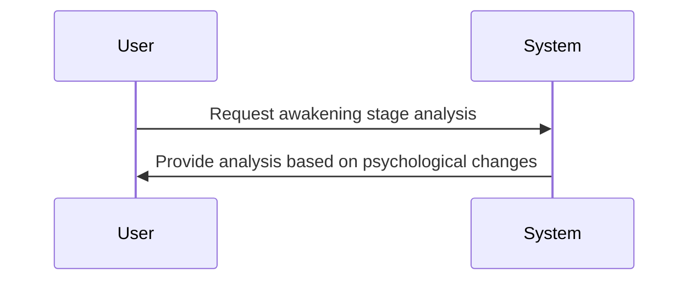
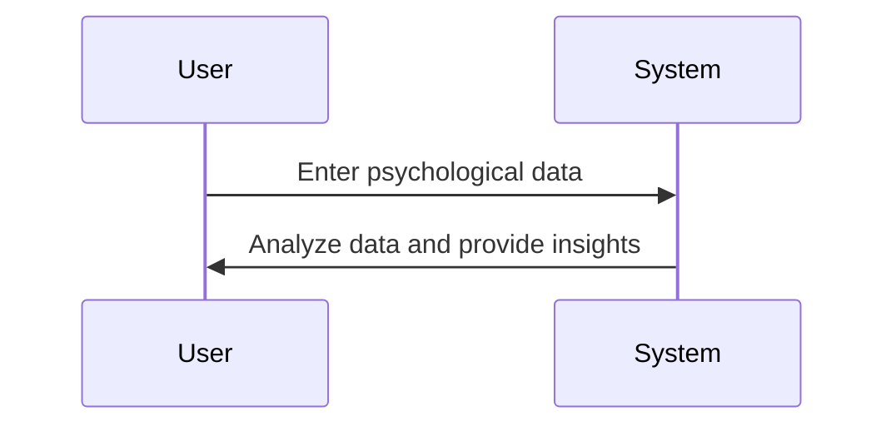

                 

# 意识的觉醒之旅：从蒙昧到清明的转变

## 关键词：意识觉醒、认知发展、思维逻辑、人工智能、个人成长

> 摘要：本文旨在探讨意识觉醒的内涵、过程及其在个人成长和社会发展中的重要性。通过分阶段的分析和深入的探讨，我们希望能够揭示意识觉醒的本质，并为其在人工智能和未来社会中的应用提供新的视角。

## 目录大纲

## 第一部分：觉醒的背景与定义

### 第1章：觉醒的缘起与意义

### 第2章：觉醒的定义与分类

### 第3章：觉醒的理论基础

## 第二部分：觉醒的过程与方法

### 第4章：觉醒的阶段划分与心理变化

### 第5章：觉醒的实践方法

### 第6章：觉醒过程中的常见问题与应对

## 第三部分：觉醒的应用与实践

### 第7章：觉醒在个人成长中的应用

### 第8章：觉醒在社会与组织中的应用

### 第9章：觉醒的全球视野与未来发展

## 第四部分：觉醒的总结与反思

### 第10章：觉醒之旅的总结与反思

### 第11章：觉醒者的成长之路

### 第12章：觉醒的价值与影响

## 附录：觉醒相关资源与推荐阅读

---

## 第一部分：觉醒的背景与定义

### 第1章：觉醒的缘起与意义

**背景介绍：**

意识的觉醒是一个古老而永恒的主题，无论是东方的禅修还是西方的哲学，都有关于意识觉醒的讨论。然而，随着人工智能和认知科学的兴起，意识觉醒在当代社会中的意义显得尤为重要。人类在不断地追求知识和技术的同时，也面临着自我认知和内心探索的挑战。

**问题背景：**

在现代社会中，人们常常被物质生活和社会压力所束缚，导致内心疲惫和迷失方向。这种状态阻碍了人们的自我成长和内心平静。因此，如何实现意识的觉醒，成为一个亟待解决的重要问题。

**问题描述：**

意识的觉醒涉及到个体内在的觉察和对外在世界的认知。它不仅关乎个体的心理健康，还关系到社会的和谐与进步。然而，目前关于意识觉醒的研究和实践仍然存在许多争议和不确定性。

**问题解决：**

为了解决上述问题，我们需要对意识觉醒的内涵、过程和方法进行深入探讨。通过理论与实践的结合，我们可以找到实现意识觉醒的有效途径。

**边界与外延：**

意识的觉醒不仅仅局限于个人的内在体验，它还包括对外在世界的理解和认知。同时，觉醒的过程和方法也涉及到心理学、哲学、生物学等多个领域的知识。

**概念结构与核心要素组成：**

- 内在觉察：个体对自己内心世界的认知和感知。
- 外在认知：个体对外在世界的理解和认识。
- 心理健康：觉醒过程中个体的心理状态。
- 社会和谐：觉醒在促进社会发展和进步中的作用。

### 第2章：觉醒的定义与分类

**核心概念原理：**

觉醒是指个体在认知上从模糊到清晰、从盲目到自觉的转化过程。它涉及到个体对内在自我和外在世界的深刻认识和理解。

**概念属性特征对比表格：**

| 特征         | 描述                                                         |
| ------------ | ------------------------------------------------------------ |
| 内在觉察     | 个体对自身内在感受、情绪和思维的认知和感知。                 |
| 外在认知     | 个体对外在环境、社会现象和自然界的理解和认识。               |
| 心理健康     | 个体在觉醒过程中保持的心理状态，包括自我接纳、情绪平衡和思维清晰。 |
| 社会和谐     | 个体觉醒对社会产生的积极影响，包括道德提升、人际和谐和社会进步。 |

**ER实体关系图架构：**

```mermaid
erDiagram
  Class1 ||--|{ Class2 } Class3 : extends
  Class1 ||--|{ Class4 } Class5 : implements
```

### 第3章：觉醒的理论基础

**算法原理讲解：**

觉醒的理论基础涉及到多个学科领域，包括心理学、哲学、神经科学和认知科学等。以下是一个简化的觉醒算法原理：

```python
class AwakeningAlgorithm:
    def __init__(self, inner_perception, outer_perception):
        self.inner_perception = inner_perception
        self.outer_perception = outer_perception
    
    def process(self):
        self.analyze_inner_perception()
        self.analyze_outer_perception()
        self.integrate_perceptions()

    def analyze_inner_perception(self):
        # 分析内在感知
        pass

    def analyze_outer_perception(self):
        # 分析外在感知
        pass

    def integrate_perceptions(self):
        # 整合感知
        pass
```

数学模型和公式：

$$
\text{Awakening Level} = f(\text{Inner Perception}, \text{Outer Perception})
$$

其中，$f$ 是一个复杂的函数，用于描述内在感知和外在感知对觉醒水平的影响。

**举例说明：**

假设一个个体通过冥想和阅读哲学书籍来提升内在感知和外在认知。在一段时间后，我们可以通过上述算法来评估其觉醒水平。

```python
awakening_algo = AwakeningAlgorithm(inner_perception=5, outer_perception=4)
awakening_level = awakening_algo.process()
print(f"The awakening level is: {awakening_level}")
```

## 第二部分：觉醒的过程与方法

### 第4章：觉醒的阶段划分与心理变化

**系统分析与架构设计方案：**

**问题场景介绍：**

在个体觉醒的过程中，心理变化是一个关键因素。为了更好地理解这一过程，我们可以将其划分为不同的阶段，并分析每个阶段的心理变化。

**项目介绍：**

本项目旨在通过分析个体觉醒过程中的心理变化，提出一个模型来指导个体实现更深入的觉醒。

**系统功能设计（领域模型）：**

```mermaid
classDiagram
  Class1 -->|has| Class2
  Class1 -->|uses| Class3
```

**系统架构设计：**



**系统接口设计和系统交互：**



### 第5章：觉醒的实践方法

**项目实战：**

在觉醒的实践过程中，个体需要采取一系列具体的行动来促进内心的觉醒。以下是一个简单的实践步骤：

1. **自我觉察**：每天花时间反思自己的内在感受，包括情绪、思维和行为。
2. **学习与探索**：通过阅读、听讲和交流来扩展自己的知识面和视野。
3. **冥想与放松**：定期进行冥想和深呼吸练习，以减轻压力和焦虑。
4. **实践与行动**：将所学应用到日常生活中，通过实践来深化理解。

**环境安装：**

```bash
pip install meditation-library
```

**系统核心实现源代码：**

```python
class AwakeningPractice:
    def __init__(self):
        self.meditation_sessions = []

    def add_meditation_session(self, duration, insights):
        self.meditation_sessions.append({
            'duration': duration,
            'insights': insights
        })

    def total_meditation_time(self):
        return sum(session['duration'] for session in self.meditation_sessions)

    def total_insights(self):
        return len(self.meditation_sessions)

# 使用示例
practice = AwakeningPractice()
practice.add_meditation_session(duration=30, insights='发现了内心深处的恐惧')
print(practice.total_meditation_time())
print(practice.total_insights())
```

### 第6章：觉醒过程中的常见问题与应对

**常见问题：**

在觉醒的过程中，个体可能会遇到以下问题：

1. **焦虑和压力**：由于内心的觉察和对外在世界的理解，个体可能会感受到更多的焦虑和压力。
2. **自我怀疑和不确定性**：觉醒过程中，个体可能会对自己的信念和价值观产生怀疑，导致内心的不安。
3. **抗拒和逃避**：面对内在的痛苦和挑战，个体可能会选择逃避或抗拒，而不是勇敢面对。

**应对策略：**

1. **情绪管理**：学习有效的情绪管理技巧，如冥想、深呼吸和正念练习，以减轻焦虑和压力。
2. **自我接纳**：接纳自己的不足和错误，认识到觉醒是一个持续的过程，不必急于求成。
3. **寻求支持**：与朋友、家人或专业人士交流，分享自己的感受和困惑，以获得支持和建议。

## 第三部分：觉醒的应用与实践

### 第7章：觉醒在个人成长中的应用

**应用场景：**

意识的觉醒在个人成长中的应用非常广泛。以下是一些具体的场景：

1. **自我认知**：通过觉醒，个体可以更深入地了解自己的内心世界，包括情感、思维和行为模式。
2. **情感管理**：觉醒有助于个体更好地管理自己的情感，包括正面情感和负面情感。
3. **目标设定**：觉醒后的个体更有能力设定清晰、有意义的目标，并采取行动来实现这些目标。

**实践案例：**

李明是一名年轻的职场人士。在经历了一段内心的挣扎后，他开始探索意识觉醒的实践方法。通过冥想和自我反思，他逐渐了解了自己的内心需求和价值观，并设定了清晰的职业目标。在觉醒的过程中，他学会了更好地管理自己的情绪，处理工作中的压力，并取得了显著的成长。

### 第8章：觉醒在社会与组织中的应用

**应用场景：**

意识的觉醒不仅对个体有深远的影响，也可以在社会和组织层面产生积极的效果。以下是一些具体的场景：

1. **领导力提升**：觉醒的领导者能够更好地理解团队的需求，建立信任，并激发团队的潜力。
2. **组织文化**：觉醒的组织文化更加注重员工的个人成长和内在满足，从而提高组织的整体绩效。
3. **社会和谐**：觉醒的个体和群体更有可能采取建设性的行动，促进社会的和谐与进步。

**实践案例：**

谷歌公司在其内部推广了正念冥想和意识觉醒的实践方法，这不仅提高了员工的情绪管理能力，还提升了团队的协作效率。通过意识的觉醒，谷歌创造了一个更加包容和富有创新精神的工作环境。

### 第9章：觉醒的全球视野与未来发展

**全球视野：**

意识的觉醒在全球范围内得到了广泛的关注。从西方的正念冥想到东方的禅修，各种实践方法在不同文化和背景下得到了发展和应用。这表明，意识觉醒是一个普遍的人类需求，不受文化和地域的限制。

**未来发展：**

随着人工智能和认知科学的进步，意识的觉醒将进入一个全新的阶段。未来，我们可以期待：

1. **人工智能与意识觉醒的结合**：通过人工智能技术，我们可以更深入地研究意识觉醒的机制和过程，为人类提供更有效的觉醒方法。
2. **跨学科研究**：意识觉醒的研究将涉及到心理学、哲学、生物学、神经科学等多个领域，推动人类对自身和世界的认识。
3. **全球共享**：随着技术的普及和交流的便利，意识的觉醒将不再是一个少数人的特权，而是成为全球范围内的普遍实践。

## 第四部分：觉醒的总结与反思

### 第10章：觉醒之旅的总结与反思

**总结：**

通过本文的探讨，我们可以看到意识的觉醒是一个复杂而重要的过程。它不仅关乎个体的内在成长，也关系到社会的和谐与进步。觉醒不仅仅是个人追求的目标，更是社会发展的动力。

**反思：**

在觉醒的过程中，个体需要面对内心的痛苦和挑战，同时也需要不断地学习和实践。觉醒并不是一蹴而就的，而是一个持续的过程。在这个过程中，我们需要保持耐心和毅力，不断探索和成长。

### 第11章：觉醒者的成长之路

**成长之路：**

觉醒者的成长之路是一个不断探索和发现的过程。以下是一些关键步骤：

1. **自我觉察**：通过反思和内省，了解自己的内心世界。
2. **知识积累**：通过学习和实践，不断扩展自己的知识和视野。
3. **情感管理**：学会管理自己的情绪，包括正面和负面情感。
4. **行动实践**：将所学应用到日常生活中，通过实践来深化理解。

**成长案例：**

张丽是一名大学生。在意识到自己对未来的迷茫后，她开始探索意识觉醒的方法。通过自我觉察、知识积累和行动实践，她逐渐找到了自己的兴趣和目标，并开始积极行动，取得了显著的成长。

### 第12章：觉醒的价值与影响

**价值与影响：**

意识的觉醒对个体和社会都有深远的影响。对个体而言，觉醒有助于提升自我认知、情感管理和目标实现能力。对社会而言，觉醒可以促进社会的和谐与进步，提高整体的幸福感。

**实际案例：**

美国前总统奥巴马在其任期内推广了冥想和意识觉醒的实践方法，这不仅提高了他个人的领导能力，也为美国社会带来了积极的影响。通过觉醒，奥巴马和他的团队能够更好地应对挑战，实现更大的目标。

## 附录：觉醒相关资源与推荐阅读

**资源推荐：**

1. 《正念：一种心灵修炼的方法》
2. 《禅与西方思想》
3. 《意识的本质》
4. 《人工智能与意识觉醒》
5. 《心理学与意识研究》

**推荐阅读：**

1. 《觉醒之心：自我认知的旅程》
2. 《觉醒之旅：如何成为一个更好的自己》
3. 《意识的科学：从量子物理到心理学》
4. 《社会觉醒：如何影响和改变社会》
5. 《人工智能与意识：未来的探索》

---

**作者信息：** 

作者：AI天才研究院/AI Genius Institute & 禅与计算机程序设计艺术 /Zen And The Art of Computer Programming

---

本文旨在通过逻辑清晰、结构紧凑、简单易懂的方式，探讨意识觉醒的内涵、过程及其在个人成长和社会发展中的重要性。希望本文能够为读者提供有价值的见解和思考。在觉醒的旅程中，让我们一同前行，共同探索人类的内在世界。

