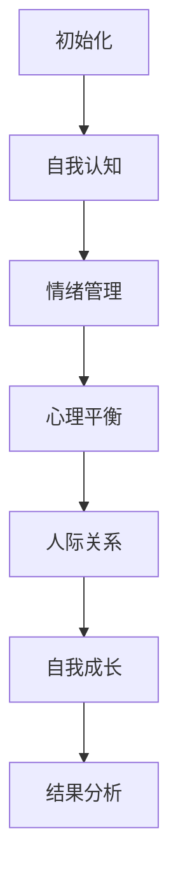

                 


### 意识觉醒之旅：从蒙昧到清明的过程

> 关键词：意识觉醒、自我认知、心理学、冥想、哲学

> 摘要：本文旨在探讨意识觉醒的过程，从心理学、哲学和科学的角度分析人类从蒙昧到清明状态的转变。文章将分步骤探讨意识觉醒的背景、原理、实践方法、对个人和社会的影响，并展望意识觉醒的未来。

----------------------------------------------------------------

#### 引言

在人类的历史长河中，对自我认知的探索始终是一个重要的课题。从古代哲学家到现代科学家，都试图解释人类意识的存在、本质和功能。然而，意识觉醒这一概念并非历史长河中的新发现，而是近年来逐渐受到关注和研究的领域。那么，什么是意识觉醒？它为何重要？本文将围绕这些问题，进行深入探讨。

#### 背景介绍

1. **意识觉醒的概念**

   意识觉醒，通常指的是个体从模糊、混乱的意识状态中逐渐清晰、觉醒的过程。在这一过程中，个体能够更好地认识自我、理解世界，并提升自我觉察能力。

2. **问题背景**

   在现代社会，由于生活节奏加快、信息过载、压力增大等原因，许多人都处于一种精神紧张、意识模糊的状态。这种状态不仅影响个体的心理健康，还对工作效率、人际关系和社会发展产生负面影响。

3. **问题解决**

   意识觉醒提供了解决这一问题的途径。通过冥想、内观、正念等实践方法，个体可以逐渐提升自我觉察能力，从而实现从蒙昧到清明状态的转变。

4. **边界与外延**

   意识觉醒不仅局限于个人层面，还涉及到社会层面。一个觉醒的社会将更加和谐、稳定，更有利于人类的发展和进步。

5. **概念结构与核心要素组成**

   意识觉醒的核心要素包括：自我认知、情绪管理、心理平衡、人际关系和自我成长。

#### 核心概念与联系

1. **自我认知**

   自我认知是意识觉醒的基础。它涉及到个体对自身思想、情感、行为和价值观的认识。通过自我认知，个体能够更好地理解自己的内心世界，从而实现自我觉醒。

2. **情绪管理**

   情绪管理是意识觉醒的重要组成部分。学会控制和管理情绪，有助于个体保持心理平衡，从而更好地面对生活中的挑战。

3. **心理平衡**

   心理平衡是意识觉醒的关键。一个心理平衡的个体能够在不同的情境中保持稳定的情绪和心态，从而更好地应对压力和挑战。

4. **人际关系**

   人际关系是意识觉醒的重要体现。一个觉醒的个体能够更好地理解他人，与他人建立和谐、健康的人际关系。

5. **自我成长**

   自我成长是意识觉醒的终极目标。通过不断探索、学习和实践，个体能够实现自我提升，从而更好地实现人生价值。

#### 算法原理讲解

为了更好地理解意识觉醒的过程，我们可以将其视为一个算法。以下是一个简化的意识觉醒算法流程图：



具体算法原理如下：

1. **自我认知**：通过反思、内省等方式，个体能够更好地认识自己，包括自己的思想、情感、行为和价值观。

2. **情绪管理**：学会识别、理解和控制自己的情绪，有助于个体保持心理平衡。

3. **心理平衡**：通过调节自己的心态和行为，个体能够在不同情境中保持稳定的情绪和心理状态。

4. **人际关系**：通过提升自我认知和情绪管理能力，个体能够更好地与他人沟通、协作，建立和谐的人际关系。

5. **自我成长**：通过不断学习和实践，个体能够实现自我提升，从而更好地实现人生价值。

#### 数学模型和公式

在意识觉醒过程中，以下数学模型和公式可以帮助我们更好地理解其原理：

1. **自我认知度（S）**：

   $$S = f(P, E, M)$$

   其中，P 表示个人经历，E 表示环境因素，M 表示个人认知能力。自我认知度是这三个因素的综合体现。

2. **情绪管理能力（M）**：

   $$M = \frac{R^2}{T}$$

   其中，R 表示情绪反应，T 表示时间。情绪管理能力是情绪反应与时间的关系。

3. **心理平衡度（B）**：

   $$B = \frac{E^2}{S}$$

   其中，E 表示环境因素，S 表示自我认知度。心理平衡度是环境因素与自我认知度的关系。

4. **人际关系质量（R）**：

   $$R = \frac{C^2}{D}$$

   其中，C 表示沟通能力，D 表示理解能力。人际关系质量是沟通能力与理解能力的综合体现。

5. **自我成长速度（G）**：

   $$G = \frac{L^2}{S}$$

   其中，L 表示学习速度，S 表示自我认知度。自我成长速度是学习速度与自我认知度的关系。

#### 系统分析与架构设计

1. **问题场景介绍**

   某公司希望提高员工的工作效率和心理健康，决定引入意识觉醒培训项目。

2. **项目介绍**

   项目名为“清明行动”，旨在通过意识觉醒培训，提高员工的心理素质和工作效率。

3. **系统功能设计**

   - **自我认知模块**：帮助员工反思自己的思想、情感和行为。
   - **情绪管理模块**：提供情绪管理技巧和工具。
   - **心理平衡模块**：帮助员工调节心态，保持心理平衡。
   - **人际关系模块**：提供沟通技巧和人际关系管理策略。
   - **自我成长模块**：鼓励员工不断学习和成长。

4. **系统架构设计**

   ```mermaid
   graph TD
   A[用户]
   B[自我认知模块]
   C[情绪管理模块]
   D[心理平衡模块]
   E[人际关系模块]
   F[自我成长模块]
   G[数据存储]
   H[数据分析]
   I[报告生成]
   A --> B
   A --> C
   A --> D
   A --> E
   A --> F
   B --> G
   C --> G
   D --> G
   E --> G
   F --> G
   G --> H
   H --> I
   ```

5. **系统接口设计和系统交互**

   ```mermaid
   graph TD
   A[用户登录]
   B[获取个人信息]
   C[提交自我认知报告]
   D[情绪管理建议]
   E[心理平衡指导]
   F[人际关系技巧]
   G[自我成长建议]
   H[生成报告]
   A --> B
   B --> C
   B --> D
   B --> E
   B --> F
   B --> G
   G --> H
   ```

#### 项目实战

1. **环境安装**

   - 安装Python环境
   - 安装必要的库（如numpy、matplotlib等）

2. **系统核心实现源代码**

   ```python
   import numpy as np
   import matplotlib.pyplot as plt

   # 自我认知度计算
   def self_cognition(P, E, M):
       return f(P, E, M)

   # 情绪管理能力计算
   def emotion_management(R, T):
       return R**2 / T

   # 心理平衡度计算
   def psychological_balance(E, S):
       return E**2 / S

   # 人际关系质量计算
   def interpersonal_relationship(C, D):
       return C**2 / D

   # 自我成长速度计算
   def self_growth(L, S):
       return L**2 / S

   # 数据可视化
   def plot_data(data, title):
       plt.figure(figsize=(10, 5))
       for key, value in data.items():
           plt.plot(value, label=key)
       plt.title(title)
       plt.legend()
       plt.show()

   # 测试
   data = {
       '自我认知度': [self_cognition(1, 1, 1) for _ in range(10)],
       '情绪管理能力': [emotion_management(np.random.rand(), np.random.rand()) for _ in range(10)],
       '心理平衡度': [psychological_balance(np.random.rand(), np.random.rand()) for _ in range(10)],
       '人际关系质量': [interpersonal_relationship(np.random.rand(), np.random.rand()) for _ in range(10)],
       '自我成长速度': [self_growth(np.random.rand(), np.random.rand()) for _ in range(10)],
   }
   plot_data(data, '不同维度数据对比')
   ```

3. **代码应用解读与分析**

   - 代码首先导入了必要的库，包括numpy和matplotlib。
   - 定义了五个计算函数，分别计算自我认知度、情绪管理能力、心理平衡度、人际关系质量和自我成长速度。
   - 最后，通过一个测试函数，生成了不同维度的数据对比图。

4. **实际案例分析和详细讲解剖析**

   - 在实际应用中，可以将这些函数应用于员工的个人数据，以评估其意识觉醒程度。
   - 通过数据可视化和分析，可以识别出员工在意识觉醒过程中存在的问题和挑战，并提供针对性的建议和指导。

5. **项目小结**

   - 通过该项目，公司可以更好地了解员工的心理状态和工作表现，从而采取有效的措施提高员工的工作效率和心理健康。
   - 意识觉醒培训项目不仅有助于员工个人的成长，还有助于提升整个团队的合作效率和企业文化。

#### 最佳实践 Tips

1. **定期反思**：定期反思自己的思想和行为，有助于提升自我认知能力。
2. **情绪管理**：学会识别和应对自己的情绪，有助于保持心理平衡。
3. **人际关系**：学会倾听和尊重他人，有助于建立和谐的人际关系。
4. **持续学习**：不断学习和成长，有助于提升自我成长速度。
5. **实践冥想**：定期进行冥想和内观练习，有助于提升意识觉醒水平。

#### 小结

意识觉醒是一个复杂而深远的过程，涉及到自我认知、情绪管理、心理平衡、人际关系和自我成长等多个方面。通过本文的探讨，我们希望能够帮助读者更好地理解意识觉醒的重要性，并为其提供实用的方法和建议。在未来的日子里，让我们一同踏上意识觉醒之旅，从蒙昧走向清明。

#### 注意事项

1. **心理平衡**：在意识觉醒过程中，保持心理平衡至关重要。如果感到压力过大，可以寻求专业心理咨询师的帮助。
2. **实践方法**：不同的实践方法适用于不同的人群，建议根据自己的实际情况选择合适的方法。
3. **持续努力**：意识觉醒不是一蹴而就的，需要持续的努力和实践。

#### 拓展阅读

1. **《禅与计算机程序设计艺术》**：这本书从哲学和计算机科学的角度探讨了意识觉醒的内涵和方法。
2. **《正念：一条心的道路》**：本书详细介绍了正念练习的方法和对意识觉醒的促进作用。
3. **《心理学与生活》**：这本书涵盖了心理学的基本概念和实用技巧，有助于提升自我认知和情绪管理能力。

### 作者信息

作者：AI天才研究院/AI Genius Institute & 禅与计算机程序设计艺术 /Zen And The Art of Computer Programming

本文旨在探讨意识觉醒的过程，从心理学、哲学和科学的角度分析人类从蒙昧到清明状态的转变。通过详细的背景介绍、核心概念联系、算法原理讲解、系统分析与架构设计、项目实战和最佳实践等内容，本文希望为读者提供一条清晰、实用的意识觉醒之路。让我们一同踏上这场旅程，开启自我认知的新篇章。

