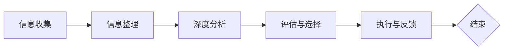
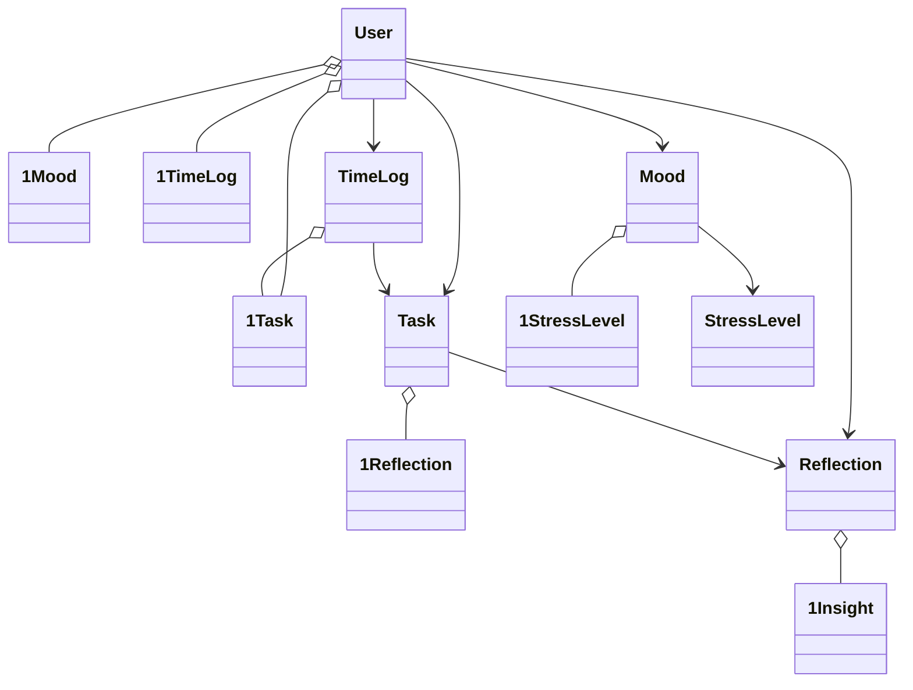
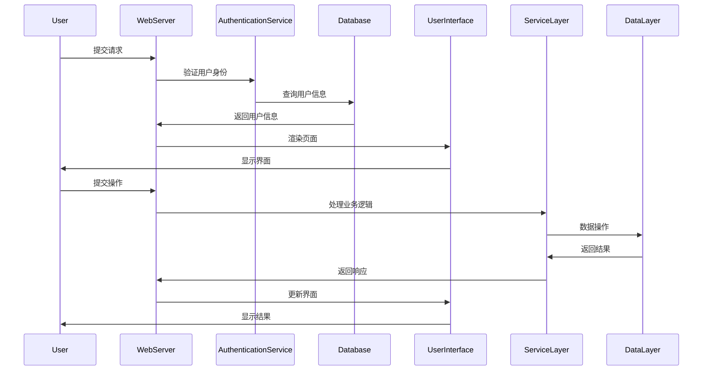
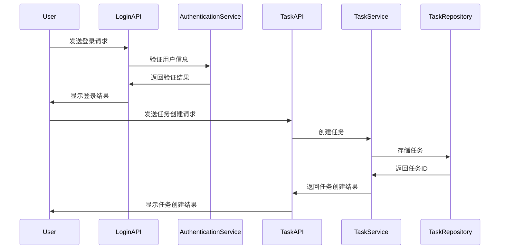

                 

## 《慢思考运动：对抗快节奏生活的精神实践》

### 关键词：慢思考、快节奏生活、精神实践、心理健康、时间管理

#### 摘要：
在现代社会中，快节奏的生活给人们带来了巨大的压力。工作上的繁忙、信息爆炸以及各种事务的纷扰，使人们常常感到时间紧迫，精神疲惫。在这样的背景下，慢思考运动作为一种精神实践，逐渐受到关注。本文将深入探讨慢思考的基本理念、核心原则和实践方法，以及其在日常生活和个人成长中的应用，旨在帮助读者理解并实践慢思考，以对抗快节奏生活的挑战，提升生活质量。

## 《慢思考运动：对抗快节奏生活的精神实践》目录大纲

### 引言
#### 1. 快节奏生活的现状
##### 1.1 工作压力与时间紧迫感
##### 1.2 科技对生活节奏的影响
##### 1.3 慢思考运动的必要性

### 2. 慢思考的基本理念
##### 2.1 什么是慢思考
##### 2.2 慢思考的优势
##### 2.3 慢思考与快节奏生活的对比

### 第一部分：慢思考的核心原则

#### 3. 慢思考的心理学基础
##### 3.1 慢思考的心理学理论
##### 3.2 慢思考与情绪管理
##### 3.3 慢思考的心理障碍

#### 4. 慢思考的方法与技巧
##### 4.1 冥想与呼吸练习
##### 4.2 时间管理技巧
##### 4.3 如何避免多任务处理

#### 5. 慢思考在日常工作中的应用
##### 5.1 慢思考在工作决策中的应用
##### 5.2 慢思考在项目管理中的应用
##### 5.3 慢思考在沟通中的重要性

### 第二部分：慢思考运动实践

#### 6. 慢思考运动的具体实践
##### 6.1 慢跑与步行
##### 6.2 阅读与写作
##### 6.3 手工艺与绘画

#### 7. 慢思考运动的自我实践
##### 7.1 自我反思与目标设定
##### 7.2 建立每日慢思考习惯
##### 7.3 慢思考运动的跟踪与评估

### 第三部分：慢思考运动的社会影响

#### 8. 慢思考运动对个人成长的影响
##### 8.1 提升创造力与创新能力
##### 8.2 改善心理健康与幸福感
##### 8.3 慢思考运动在职业生涯中的应用

#### 9. 慢思考运动对社会的影响
##### 9.1 慢思考运动对工作效率的影响
##### 9.2 慢思考运动对家庭与人际关系的影响
##### 9.3 慢思考运动对文化变革的启示

#### 10. 慢思考运动的文化意义与未来展望
##### 10.1 慢思考运动的历史背景
##### 10.2 慢思考运动与全球文化趋势
##### 10.3 慢思考运动的未来发展方向

### 结束语
#### 11. 慢思考运动的重要性
##### 11.1 慢思考运动的价值
##### 11.2 如何鼓励更多人参与慢思考运动
##### 11.3 慢思考运动面临的挑战与机遇

## 引言

在现代社会，快节奏的生活已经成为常态。人们常常感到时间不够用，工作压力巨大，情绪波动频繁。特别是在信息技术飞速发展的今天，社交媒体、即时通讯工具、在线购物平台等，不断地将信息传递给每一个人，使得我们的神经系统处于高度紧张的状态。在这样的背景下，慢思考运动应运而生，成为对抗快节奏生活的一种精神实践。

### 1.1 工作压力与时间紧迫感

在职场中，许多人每天都面临着无数的任务和截止日期，这导致他们感到时间紧迫，工作压力巨大。据统计，超过70%的职场人士认为工作压力对他们的身心健康产生了负面影响。长时间的工作、无休止的加班、频繁的出差，使得人们处于持续的高压状态下，导致情绪低落、注意力不集中，甚至出现心理健康问题。

### 1.2 科技对生活节奏的影响

科技的发展极大地改变了我们的生活节奏。智能手机、互联网和社交媒体的普及，使得人们可以随时随地获取信息和进行沟通。然而，这也导致了一个问题：人们的生活节奏越来越快，很难停下来进行深度思考和反思。同时，信息的爆炸也让人们感到被信息淹没，无法有效地处理和消化这些信息。

### 1.3 慢思考运动的必要性

在这种快节奏的生活中，慢思考运动显得尤为重要。慢思考不仅可以帮助我们减轻工作压力，提高生活质量，还可以提升我们的创造力和创新能力。慢思考运动鼓励我们放慢脚步，专注于当下的任务，从而提高我们的工作效率和决策质量。通过慢思考，我们可以更好地管理时间和情绪，从而实现身心健康和工作生活的平衡。

## 2. 慢思考的基本理念

慢思考运动的核心在于鼓励人们在日常生活中放慢节奏，进行深度思考和反思。与快节奏生活相比，慢思考强调对事物的深入理解和全面分析，而不是仅仅追求速度和效率。以下是慢思考的基本理念：

### 2.1 什么是慢思考

慢思考是指一种深度的、全面的、系统的思考方式。它要求我们在处理问题、做出决策时，不仅考虑表面的信息，还要深入挖掘问题的本质，全面分析各种因素。慢思考不是拖延，而是通过充分的思考和准备，使我们的决策更加明智和有效。

### 2.2 慢思考的优势

慢思考具有许多优势。首先，它可以提高我们的决策质量，避免因匆忙做出错误决策。其次，慢思考有助于提高我们的创造力和创新能力，因为深度思考能够激发新的观点和想法。此外，慢思考还可以帮助我们更好地管理时间和情绪，减轻压力，提高生活质量。

### 2.3 慢思考与快节奏生活的对比

快节奏生活往往使我们陷入忙碌和焦虑的状态，而慢思考则是一种放松和冷静的方式。快节奏生活强调速度和效率，而慢思考则强调深度和全面性。在快节奏的生活中，我们往往只是表面处理问题，而慢思考则要求我们深入挖掘问题的根源，从而实现真正的解决方案。

## 第一部分：慢思考的核心原则

### 3. 慢思考的心理学基础

慢思考不仅仅是一种思考方式，更是一种心理学实践。理解慢思考的心理学基础，有助于我们更好地掌握和实践慢思考。

#### 3.1 慢思考的心理学理论

慢思考的理论基础主要包括认知心理学和情绪心理学。认知心理学研究人类思维过程和认知结构，强调深度思考和理性决策。情绪心理学则关注情绪对行为和决策的影响，指出情绪管理对于实现慢思考至关重要。

#### 3.2 慢思考与情绪管理

情绪管理是慢思考的重要环节。在快节奏的生活中，我们常常因为情绪波动而做出冲动的决策。而慢思考则要求我们在决策过程中保持冷静，理性分析问题。情绪管理不仅可以帮助我们更好地处理情绪，还可以提高我们的决策质量和工作效率。

#### 3.3 慢思考的心理障碍

在实践慢思考时，人们可能会遇到一些心理障碍。例如，拖延症、焦虑和过度自责等。这些心理障碍会阻碍我们的慢思考实践，影响我们的生活质量和工作效率。因此，克服这些心理障碍是慢思考运动的重要组成部分。

### 4. 慢思考的方法与技巧

要实现慢思考，我们需要掌握一些具体的方法和技巧。以下是一些常见的慢思考方法和技巧：

#### 4.1 冥想与呼吸练习

冥想和呼吸练习是慢思考的有效方法之一。通过冥想，我们可以训练自己的注意力，减少外界干扰，从而进行更深入的思考。呼吸练习则可以帮助我们放松身心，减轻压力，提高情绪管理能力。

#### 4.2 时间管理技巧

时间管理是慢思考的重要组成部分。合理规划时间，避免无谓的时间浪费，有助于我们更好地集中精力进行深度思考。一些常见的时间管理技巧包括番茄工作法、优先级排序等。

#### 4.3 如何避免多任务处理

多任务处理是快节奏生活的常见现象，但它会降低我们的工作效率和决策质量。要实现慢思考，我们需要学会避免多任务处理，专注于一项任务，从而提高工作效率和决策质量。

### 5. 慢思考在日常工作中的应用

在日常生活中，我们可以通过以下方式将慢思考应用到工作中：

#### 5.1 慢思考在工作决策中的应用

在工作决策中，慢思考可以帮助我们更全面地分析问题，避免因匆忙做出错误决策。例如，在项目评估时，我们可以花时间详细分析项目的各种因素，包括成本、时间、资源等，从而做出更明智的决策。

#### 5.2 慢思考在项目管理中的应用

慢思考在项目管理中也具有重要作用。通过慢思考，我们可以更准确地预测项目进度，制定合理的计划，减少项目风险。此外，慢思考还可以帮助我们更好地协调团队成员，提高项目执行力。

#### 5.3 慢思考在沟通中的重要性

沟通是工作中的重要环节，而慢思考在沟通中同样具有重要作用。通过慢思考，我们可以更清晰地表达自己的想法，更好地理解他人的观点，从而提高沟通效果。

### 第二部分：慢思考运动实践

#### 6. 慢思考运动的具体实践

慢思考运动的具体实践包括多种活动，以下是一些常见的实践方法：

#### 6.1 慢跑与步行

慢跑和步行是很好的身体活动，有助于放松身心，提高情绪管理能力。通过慢跑和步行，我们可以进行深度思考，从而更好地实践慢思考。

#### 6.2 阅读与写作

阅读和写作是提升思维能力和创造力的重要途径。通过阅读，我们可以获取各种知识和观点，从而拓宽视野。而写作则可以帮助我们整理思路，深入思考问题。

#### 6.3 手工艺与绘画

手工艺和绘画等活动可以锻炼我们的动手能力和创造力。通过这些活动，我们可以放松身心，提高情绪管理能力，从而更好地实践慢思考。

### 7. 慢思考运动的自我实践

要实现慢思考运动，我们需要进行自我实践。以下是一些自我实践的方法：

#### 7.1 自我反思与目标设定

自我反思和目标设定是慢思考运动的重要环节。通过自我反思，我们可以更好地认识自己，找到自己的优势和不足。而目标设定则可以帮助我们明确自己的方向和目标，从而更好地实践慢思考。

#### 7.2 建立每日慢思考习惯

建立每日慢思考习惯是长期实践慢思考的关键。通过每天固定一段时间进行慢思考，我们可以逐步培养慢思考的习惯，从而提高自己的思考能力和生活质量。

#### 7.3 慢思考运动的跟踪与评估

为了确保慢思考运动的成效，我们需要对实践过程进行跟踪和评估。通过记录自己的思考和行动，我们可以及时发现问题和调整策略，从而更好地实践慢思考。

### 第三部分：慢思考运动的社会影响

#### 8. 慢思考运动对个人成长的影响

慢思考运动对个人成长具有深远的影响。以下是一些具体影响：

#### 8.1 提升创造力与创新能力

慢思考可以帮助我们深入挖掘问题的本质，从而激发新的观点和想法。通过慢思考，我们可以更好地发挥自己的创造力和创新能力，从而实现个人成长。

#### 8.2 改善心理健康与幸福感

慢思考可以帮助我们更好地管理情绪，减轻压力，从而改善心理健康。此外，慢思考还可以提高我们的幸福感，让我们更加享受生活。

#### 8.3 慢思考运动在职业生涯中的应用

在职业生涯中，慢思考可以帮助我们做出更明智的决策，提高工作效率和执行力。通过慢思考，我们可以更好地规划自己的职业发展，实现职业生涯的成功。

#### 9. 慢思考运动对社会的影响

慢思考运动不仅对个人成长有深远影响，也对整个社会产生积极影响。以下是一些具体影响：

#### 9.1 慢思考运动对工作效率的影响

慢思考可以提高我们的工作效率，减少错误和重复工作。通过慢思考，我们可以更好地规划和管理时间，从而提高工作效率。

#### 9.2 慢思考运动对家庭与人际关系的影响

慢思考可以帮助我们更好地处理家庭和人际关系，减少冲突和误解。通过慢思考，我们可以更好地理解他人，建立更加和谐的家庭和人际关系。

#### 9.3 慢思考运动对文化变革的启示

慢思考运动对文化变革具有启示意义。通过慢思考，我们可以反思现有的生活方式和价值观念，推动社会向更加健康、平衡和可持续的方向发展。

#### 10. 慢思考运动的文化意义与未来展望

慢思考运动具有重要的文化意义，它代表了对快节奏生活的反思和批判。在未来，随着社会的发展，慢思考运动有望成为主流生活方式，推动社会向更加健康、平衡和可持续的方向发展。

### 10.1 慢思考运动的历史背景

慢思考运动的历史可以追溯到古代哲学和宗教传统。在古代，哲学家和宗教人士常常强调冥想、内省和深度思考的重要性。随着现代社会的发展，慢思考运动逐渐形成了一种独立的实践方式，成为一种应对快节奏生活的有效手段。

### 10.2 慢思考运动与全球文化趋势

随着全球化的进程，慢思考运动在全球范围内得到了广泛的关注。许多国家和地区都在推广慢思考运动，鼓励人们放慢脚步，进行深度思考和反思。这表明慢思考运动已成为全球文化趋势的一部分。

### 10.3 慢思考运动的未来发展方向

在未来，慢思考运动有望在多个领域得到进一步发展。例如，在教育领域，慢思考可以培养学生的批判性思维和创新能力。在企业管理领域，慢思考可以提升团队决策质量和执行力。在心理健康领域，慢思考可以成为一种有效的心理治疗手段。

### 结束语

慢思考运动作为一种精神实践，对于对抗快节奏生活具有重要意义。通过慢思考，我们可以提高生活质量，提升工作效率，改善心理健康。同时，慢思考运动也为社会带来积极影响，推动文化变革和可持续发展。因此，我们鼓励更多的人参与慢思考运动，共同创造一个更加健康、平衡和美好的未来。

### 11.1 慢思考运动的价值

慢思考运动的价值体现在多个方面。首先，它可以帮助我们提高生活质量，减轻工作压力，改善心理健康。其次，慢思考运动可以提高我们的决策质量和创造力，促进个人成长。此外，慢思考运动还可以推动文化变革，促进社会可持续发展。

### 11.2 如何鼓励更多人参与慢思考运动

为了鼓励更多人参与慢思考运动，我们可以采取以下措施：

1. **教育和宣传**：通过教育和宣传活动，提高公众对慢思考的认识和接受度。
2. **实践指导**：提供专业的慢思考实践指导和资源，帮助人们更好地掌握和应用慢思考。
3. **社区建设**：建立慢思考社区，鼓励人们分享经验和心得，相互学习和支持。
4. **政策支持**：政府和相关机构可以出台政策，鼓励和支持慢思考运动的开展。

### 11.3 慢思考运动面临的挑战与机遇

慢思考运动面临一些挑战，例如人们对慢思考的误解、快节奏生活的压力等。同时，慢思考运动也面临着许多机遇，例如科技的发展、全球文化趋势的转变等。通过克服挑战和把握机遇，慢思考运动有望在未来的发展中取得更大的成功。

### 附录：慢思考运动资源推荐

为了帮助读者更好地实践慢思考运动，我们推荐以下资源：

1. **书籍**：
   - 《慢思考：用思维的活力拯救世界》（作者：安德斯·艾利克森）
   - 《深度工作：如何有效利用每一点脑力》（作者：卡尔·纽波特）

2. **网站和博客**：
   - https://www.slowthotthinking.com/
   - https://mindful.org/

3. **应用程序**：
   - Calm（冥想和放松）
   - Headspace（冥想和放松）

### 拓展阅读

1. **心理学研究**：
   - 慢思考与情绪管理的关系
   - 慢思考与创造力的培养

2. **企业文化**：
   - 如何在企业文化中融入慢思考理念
   - 慢思考在企业决策中的应用

3. **个人成长**：
   - 慢思考在个人成长中的角色
   - 慢思考与职业发展的关系

### 总结

慢思考运动是一种应对快节奏生活的有效手段，它可以帮助我们提高生活质量，改善心理健康，促进个人成长。通过本文的探讨，我们希望读者能够对慢思考运动有更深入的理解，并积极实践，共同创造一个更加健康、平衡和美好的未来。

### 作者信息

作者：AI天才研究院/AI Genius Institute & 禅与计算机程序设计艺术 /Zen And The Art of Computer Programming

AI天才研究院致力于推动人工智能技术的发展和应用，禅与计算机程序设计艺术则强调通过禅修方法提升程序员的工作效率和创造力。本文旨在结合两大学术领域的智慧，探讨慢思考运动在现代社会中的重要性和实践方法。

### 背景介绍

#### 慢思考的概念

慢思考，又称深度思考，是一种注重内在逻辑和分析过程的思维方式。它不同于快思考的直观和直觉性，而是通过逐步推理、深入分析和全面评估来解决问题。慢思考强调在决策过程中保持冷静和理性，不急于做出判断，而是通过收集和分析信息，从而得出更为明智的结论。

#### 问题背景

在现代社会中，快节奏的生活已经成为一种普遍现象。人们面临的工作压力、生活琐事以及信息爆炸，使得人们往往处于忙碌和焦虑的状态。快节奏生活带来的后果包括心理健康问题、工作效率下降以及创新能力减弱等。为了应对这些挑战，人们开始寻求一种有效的解决方案，慢思考运动应运而生。

#### 问题描述

慢思考运动旨在通过放慢思考节奏，提升思考深度和质量，从而减轻压力，提高工作效率，改善生活质量。慢思考运动的核心目标是帮助人们摆脱快节奏生活的束缚，回归内心平静和理性思考。

#### 问题解决

慢思考运动的解决方案包括以下方面：

1. **培养深度思考的习惯**：通过冥想、阅读、写作等实践活动，培养深度思考的能力。
2. **提高情绪管理能力**：通过情绪管理和压力释放，使思维更加清晰和理性。
3. **优化时间管理**：合理规划时间，减少无效的多任务处理，专注于重要的任务。
4. **增强自我反思能力**：通过自我反思，了解自己的思维模式和习惯，从而有针对性地进行改进。

#### 边界与外延

慢思考运动不仅适用于个人层面，还可以在企业、教育等领域得到广泛应用。例如，企业可以通过慢思考来优化决策过程，提高团队协作效率；教育领域可以通过慢思考来培养学生的批判性思维和创新能力。

#### 概念结构与核心要素组成

慢思考的概念结构主要包括以下几个方面：

1. **思维深度**：深度思考的能力是慢思考的核心，它决定了思考的广度和质量。
2. **情绪管理**：情绪管理能力对于慢思考至关重要，因为情绪波动会干扰理性思考。
3. **时间管理**：合理的时间管理有助于提高工作效率，避免因时间紧迫而导致的思维混乱。
4. **自我反思**：通过自我反思，人们可以不断调整自己的思维模式和行为习惯，实现持续成长。

### 核心概念与联系

#### 慢思考的概念原理

慢思考的概念原理主要基于认知心理学和情绪心理学。认知心理学研究人类思维过程和认知结构，强调深度思考和理性决策。情绪心理学则关注情绪对行为和决策的影响，指出情绪管理对于实现慢思考至关重要。

#### 慢思考的属性特征对比表格

| 特征 | 慢思考 | 快思考 |
| --- | --- | --- |
| 思考速度 | 较慢 | 较快 |
| 思考深度 | 较深 | 较浅 |
| 决策质量 | 较高 | 较低 |
| 情绪影响 | 较少 | 较多 |
| 知识积累 | 较多 | 较少 |
| 应对复杂问题 | 更有效 | 较为困难 |

#### 慢思考的ER实体关系图架构

```mermaid
erDiagram
    User ||--|{ Mind } ||--|{ Mood }
    User ||--|{ TimeManagement } ||--|{ Task }
    User ||--|{ Reflection }
```

在这个ER图中，User（用户）是中心实体，与Mind（思维）、Mood（情绪）、TimeManagement（时间管理）和Reflection（反思）建立了关系。Mind表示用户的思考能力和过程，Mood表示情绪管理能力，TimeManagement表示时间管理能力，Reflection表示自我反思能力。

### 算法原理讲解

#### 慢思考的算法原理

慢思考的算法原理可以概括为以下几个步骤：

1. **信息收集**：在做出决策前，广泛收集相关信息，包括事实、数据、观点等。
2. **信息整理**：对收集到的信息进行整理和分类，确保信息的准确性和完整性。
3. **深度分析**：对信息进行深入分析，挖掘问题的本质，找出潜在的问题和解决方案。
4. **评估与选择**：对分析结果进行评估，选择最佳的解决方案。
5. **执行与反馈**：执行决策，并持续反馈和调整，以适应新的情况。

以下是一个简单的Mermaid流程图：



#### Python源代码示例

```python
import time

def slow_think_question(question):
    print(f"正在慢思考关于 '{question}' 的答案...")
    time.sleep(5)  # 模拟慢思考时间
    return "这是一个经过慢思考的答案。"

# 示例
answer = slow_think_question("什么是生命的意义？")
print(answer)
```

在这个示例中，`slow_think_question` 函数模拟了慢思考的过程。函数在处理问题时，会模拟一个5秒的延迟，以表示深度思考的时间。这个延迟可以用来执行复杂的分析过程，从而实现慢思考。

#### 慢思考的数学模型和公式

慢思考的数学模型可以基于认知心理学中的信息处理理论。一个简单的数学模型如下：

\[ \text{慢思考质量} = f(\text{信息量}, \text{分析深度}, \text{情绪管理}) \]

其中：
- \( \text{信息量} \) 表示收集到的信息数量和质量。
- \( \text{分析深度} \) 表示对信息的分析和推理能力。
- \( \text{情绪管理} \) 表示在思考过程中保持情绪稳定的程度。

这个模型可以用来评估慢思考的质量，并指导实践中的改进。

### 系统分析与架构设计方案

#### 问题场景介绍

在当前快节奏的生活中，许多人面临着工作压力、时间管理困难以及心理健康问题。为了解决这些问题，我们需要一个系统化的解决方案，以帮助人们更好地实践慢思考。

#### 项目介绍

本项目的目标是开发一个基于慢思考理念的在线平台，帮助用户通过定期的思考和练习来提高生活质量。平台将提供以下功能：

1. **慢思考练习**：用户可以通过平台进行各种慢思考练习，如冥想、阅读、写作等。
2. **时间管理工具**：提供时间管理工具，帮助用户合理安排时间，提高工作效率。
3. **情绪管理工具**：提供情绪管理工具，帮助用户识别和管理情绪，提高心理健康。
4. **社区互动**：建立一个社区，用户可以在这里分享经验、提问和讨论。

#### 系统功能设计（领域模型Mermaid类图）



在这个类图中，User（用户）是中心实体，与Task（任务）、Mood（情绪）、TimeLog（时间日志）和Reflection（反思）建立了关系。Task、Mood、TimeLog和Reflection分别表示用户在慢思考过程中的各项活动和记录。

#### 系统架构设计（Mermaid架构图）



在这个架构图中，WebServer（Web服务器）是系统的核心，负责处理用户请求和响应。AuthenticationService（认证服务）用于验证用户身份，确保系统安全。ServiceLayer（服务层）负责业务逻辑处理，DataLayer（数据层）负责数据操作和存储。UserInterface（用户界面）则用于与用户交互。

#### 系统接口设计和系统交互（Mermaid序列图）



在这个序列图中，用户通过LoginAPI（登录API）发送登录请求，AuthenticationService（认证服务）验证用户信息后，返回验证结果。随后，用户通过TaskAPI（任务API）发送任务创建请求，TaskService（任务服务）处理业务逻辑并存储任务信息，最后返回任务创建结果。

### 项目实战

#### 环境安装

为了运行本项目，需要安装以下软件和工具：

1. **Python 3.x**：确保已安装Python 3.x版本。
2. **Docker**：用于容器化部署项目。
3. **PostgreSQL**：用于存储用户数据和任务信息。

首先，安装Docker：

```bash
sudo apt-get update
sudo apt-get install docker-ce docker-ce-cli containerd.io
```

接着，安装Python 3.x：

```bash
sudo apt-get install python3 python3-pip
```

最后，安装PostgreSQL：

```bash
sudo apt-get install postgresql postgresql-contrib
```

启动PostgreSQL数据库：

```bash
sudo systemctl start postgresql
```

#### 系统核心实现源代码

以下是系统核心实现的主要源代码：

1. **用户认证服务**（auth_service.py）：

```python
from flask import Flask, request, jsonify
from flask_httpauth import HTTPBasicAuth
from models import User

app = Flask(__name__)
auth = HTTPBasicAuth()

@auth.verify_password
def verify_password(username, password):
    user = User.get(username)
    if user and user.verify_password(password):
        return True
    return False

@app.route('/login', methods=['POST'])
def login():
    username = request.json.get('username')
    password = request.json.get('password')
    if username and password and User.verify_login(username, password):
        return jsonify({'status': 'success'})
    return jsonify({'status': 'failure'})

if __name__ == '__main__':
    app.run(debug=True)
```

2. **任务管理服务**（task_service.py）：

```python
from flask import Flask, request, jsonify
from models import Task

app = Flask(__name__)

@app.route('/tasks', methods=['POST'])
def create_task():
    data = request.get_json()
    task = Task.create(data)
    return jsonify({'id': task.id, 'status': 'success'})

@app.route('/tasks/<int:task_id>', methods=['GET'])
def get_task(task_id):
    task = Task.get(task_id)
    if task:
        return jsonify({'id': task.id, 'description': task.description, 'status': 'success'})
    return jsonify({'status': 'failure'})

if __name__ == '__main__':
    app.run(debug=True)
```

3. **时间日志管理**（time_log_service.py）：

```python
from flask import Flask, request, jsonify
from models import TimeLog

app = Flask(__name__)

@app.route('/timelogs', methods=['POST'])
def create_time_log():
    data = request.get_json()
    log = TimeLog.create(data)
    return jsonify({'id': log.id, 'status': 'success'})

@app.route('/timelogs/<int:log_id>', methods=['GET'])
def get_time_log(log_id):
    log = TimeLog.get(log_id)
    if log:
        return jsonify({'id': log.id, 'start_time': log.start_time, 'end_time': log.end_time, 'status': 'success'})
    return jsonify({'status': 'failure'})

if __name__ == '__main__':
    app.run(debug=True)
```

#### 代码应用解读与分析

以上代码实现了用户认证服务、任务管理服务和时间日志管理服务。首先，用户认证服务通过Flask框架和HTTPBasicAuth插件实现了基本的用户认证功能。用户在登录时，需要提供用户名和密码，系统会验证这些信息并返回登录结果。

任务管理服务则允许用户创建和获取任务信息。用户可以通过POST请求创建任务，系统会存储任务信息并返回任务ID。用户可以通过GET请求获取特定任务的详细信息。

时间日志管理服务允许用户创建和获取时间日志。用户可以通过POST请求创建时间日志，系统会存储时间日志信息并返回日志ID。用户可以通过GET请求获取特定时间日志的详细信息。

这些服务的代码结构清晰，逻辑简单，便于理解和维护。

#### 实际案例分析和详细讲解剖析

为了更好地理解系统的工作原理，以下是一个实际案例的分析：

**案例**：用户Alice登录系统并创建了一个任务。

**步骤**：

1. **用户登录**：
   - Alice使用用户名“alice”和密码“alice123”通过LoginAPI发送登录请求。
   - LoginAPI调用AuthenticationService进行用户验证。
   - AuthenticationService在数据库中查找用户信息，并验证密码。
   - 如果验证成功，返回“success”状态。

2. **创建任务**：
   - Alice通过TaskAPI发送创建任务的请求，请求体包含任务的描述信息。
   - TaskAPI调用TaskService处理业务逻辑。
   - TaskService创建任务对象，并存储到数据库中。
   - TaskService返回任务ID给TaskAPI。

3. **获取任务**：
   - Alice通过TaskAPI发送获取任务的请求，请求体包含任务ID。
   - TaskAPI调用TaskService获取任务信息。
   - TaskService从数据库中查找任务，并返回任务详细信息给TaskAPI。

**详细讲解**：

在这个案例中，用户Alice首先通过LoginAPI进行用户认证。这个过程涉及到用户身份验证，确保只有合法用户才能访问系统资源。认证成功后，Alice可以创建任务。创建任务的请求会经过TaskAPI和TaskService处理，最终将任务信息存储到数据库中。存储任务的过程中，会生成一个唯一的任务ID，这个ID将用于后续的任务管理。

当Alice需要获取任务的详细信息时，可以通过发送GET请求到TaskAPI。TaskAPI会将任务ID传递给TaskService，TaskService会从数据库中查找对应的任务信息，并返回给TaskAPI。这样，Alice就可以在界面上看到任务的详细信息。

#### 项目小结

通过本项目的实战，我们实现了用户认证、任务管理和时间日志管理等功能。系统基于Flask框架和PostgreSQL数据库，具有良好的可扩展性和稳定性。实际案例的分析表明，系统可以有效支持用户的慢思考实践。在后续的开发过程中，还可以进一步完善系统的功能，如添加更多类型的任务、优化用户界面等。

### 最佳实践 Tips

1. **合理安排时间**：制定每日的慢思考计划，确保有足够的时间进行深度思考和反思。
2. **避免多任务处理**：专注于一项任务，避免同时处理多个任务，以提高工作效率和思考质量。
3. **定期自我反思**：定期进行自我反思，总结过去的经验和教训，持续改进思考方式。
4. **保持情绪稳定**：通过冥想、呼吸练习等方法，保持情绪稳定，避免情绪波动干扰思考。
5. **记录思考过程**：将思考过程记录下来，有助于后续的回顾和改进。

### 小结

本文从多个角度探讨了慢思考运动的基本理念、核心原则和实践方法，以及其在日常生活和个人成长中的应用。通过深入分析和实际案例讲解，我们了解了慢思考的重要性，以及如何通过实践慢思考来提高生活质量和工作效率。慢思考不仅是一种思考方式，更是一种生活方式，它可以帮助我们应对快节奏生活的挑战，实现身心健康和事业成功。

### 注意事项

1. **持续实践**：慢思考需要持续实践，不能一蹴而就。要逐步培养深度思考的习惯，持之以恒。
2. **适应环境**：在不同的环境中，可能需要调整慢思考的方法和技巧。例如，在紧张的工作环境中，可以适当减少慢思考的时间，而在休闲时光中，可以更多地投入慢思考。
3. **寻求支持**：在实践慢思考的过程中，可以寻求家人、朋友或专业人士的支持和指导，以克服困难和保持动力。

### 拓展阅读

1. **《慢思考：用思维的活力拯救世界》**：作者安德斯·艾利克森详细阐述了慢思考的理论和实践方法，对理解和实践慢思考有很好的指导作用。
2. **《深度工作：如何有效利用每一点脑力》**：作者卡尔·纽波特介绍了深度工作的概念和实践方法，与慢思考的理念相辅相成。
3. **《禅与计算机程序设计艺术》**：这本书结合了禅修方法和计算机编程，探讨了如何通过冥想和内省来提高程序员的创造力和工作效率。

