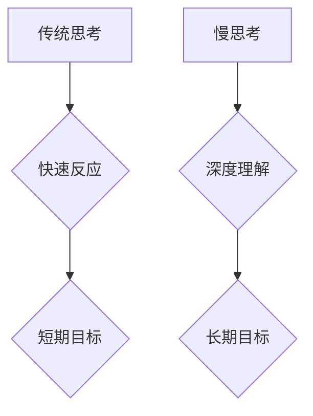
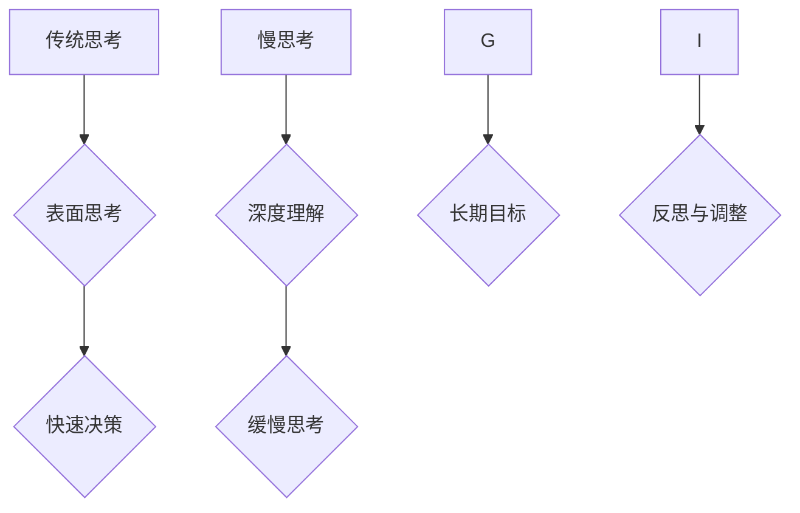

                 

### 第一部分：引言与背景

#### 第1章：慢思考运动的兴起

> 关键词：慢思考、快餐式信息消费、背景

#### 1.1 慢思考运动的起源

**背景介绍：**

慢思考运动的兴起源于现代社会对信息消费的反思。随着互联网和智能手机的普及，信息爆炸时代应运而生。人们每天都被大量的信息所包围，从新闻、社交媒体到电子邮件，这些信息似乎都在呼吁我们加快步伐，更快地消化和吸收。然而，这种快餐式信息消费带来的不是充实，而是焦虑和疲惫。

**问题背景：**

快餐式信息消费带来的一系列问题逐渐显现。首先，人们很难深入理解信息，因为时间紧迫，往往只能抓住表面信息。其次，频繁的信息接收和消化导致大脑疲劳，降低了思考的质量和深度。最后，过度关注短期的信息，使得人们忽视了长期的价值和目标。

**问题描述：**

在这样的背景下，慢思考运动应运而生。慢思考提倡放慢脚步，深入思考，重新审视我们的生活方式。这一运动的核心是倡导一种深思熟虑、逐步分析的生活方式，以对抗快餐式信息消费带来的负面影响。

**问题解决：**

慢思考运动的解决策略包括多个方面。首先，它强调对信息的深度理解，鼓励人们花时间阅读和思考，而不是仅仅浏览和快速消化。其次，它提倡通过冥想、运动和专注练习来提高大脑的专注力和思考能力。最后，它鼓励人们设定明确的目标和计划，以更好地管理时间和精力。

**边界与外延：**

慢思考运动不仅关注个人层面的改变，还涉及到社会层面的变革。它倡导一种更加可持续的生活方式，鼓励人们放慢节奏，关注长期价值。此外，它还涉及到教育、工作和其他生活领域的改革，以适应这种新的思考方式。

**概念结构与核心要素组成：**

慢思考运动的核心概念包括：深度理解、专注力、长期目标、可持续发展等。这些概念共同构成了慢思考运动的理论基础，并指导着人们在生活中实践这一理念。

#### 1.2 快餐式信息消费的问题

**快餐式信息消费的具体表现：**

快餐式信息消费的具体表现包括以下几个方面：

1. **快节奏的生活方式**：现代社会的高节奏生活方式使得人们很难有时间深入思考。人们往往只能抓住信息的表面，而没有时间进行深入分析。
2. **多任务处理**：现代人常常需要在短时间内处理多个任务，这导致大脑处于不断切换状态，难以保持专注。
3. **信息过载**：每天接收到的信息量巨大，从新闻、社交媒体到电子邮件，使得人们难以消化和处理。

**快餐式信息消费带来的负面影响：**

快餐式信息消费带来的负面影响包括：

1. **思考质量下降**：由于时间紧迫，人们往往只能抓住信息的表面，无法深入理解。这导致思考的质量和深度下降。
2. **大脑疲劳**：频繁的信息接收和消化导致大脑疲劳，降低了思考能力和记忆力。
3. **长期价值忽视**：过度关注短期信息，使得人们忽视了长期的价值和目标，导致生活质量下降。

**快餐式信息消费的危害：**

快餐式信息消费的危害不仅体现在个人层面，还涉及到社会层面。它导致人们无法深入理解问题，难以做出明智的决策。此外，它还加剧了社会的不公平，因为只有少数人能够拥有处理大量信息的资源和时间。

#### 1.3 慢思考运动的必要性

**慢思考运动的必要性：**

慢思考运动的必要性体现在以下几个方面：

1. **提升思考质量**：慢思考强调深度理解和逐步分析，有助于提升思考的质量和深度。
2. **减少大脑疲劳**：通过慢思考，人们可以减少频繁的信息接收和消化，从而减轻大脑的疲劳。
3. **实现长期目标**：慢思考鼓励人们设定明确的目标和计划，以更好地管理时间和精力，实现长期目标。
4. **促进可持续发展**：慢思考运动倡导一种更加可持续的生活方式，鼓励人们放慢节奏，关注长期价值。

**慢思考运动的意义：**

慢思考运动不仅有助于个人成长，还有助于社会进步。它倡导一种深思熟虑、逐步分析的生活方式，有助于提高社会的整体思考能力和决策质量。此外，它还促进了人与自然、人与人之间的和谐发展。

### 第1章总结：

本章介绍了慢思考运动的起源、快餐式信息消费的问题以及慢思考运动的必要性。通过分析现代社会对信息消费的反思，我们认识到快餐式信息消费带来的负面影响，并提出了慢思考运动的解决方案。慢思考运动提倡深度理解、专注力和长期目标，有助于提升思考质量和减少大脑疲劳，实现个人和社会的可持续发展。在接下来的章节中，我们将进一步探讨慢思考的理念和实践方法，以及它在不同领域的应用。

### 第二部分：慢思考的理念与实践

#### 第2章：慢思考的核心概念

> 关键词：慢思考、核心概念、传统思考、实践要点

#### 2.1 慢思考的定义

**定义：**

慢思考是一种深思熟虑、逐步分析的生活方式。它强调在信息接收和处理过程中，放慢脚步，深入思考，而不是仅仅追求速度和效率。

**特点：**

1. **深度理解**：慢思考强调对信息的深度理解，而不是仅仅停留在表面。
2. **逐步分析**：慢思考鼓励人们逐步分析问题，而不是急于得出结论。
3. **长期目标**：慢思考注重长期目标，而不是短期利益。

**与传统思考的区别：**

**传统思考：**

传统思考方式强调快速反应和短期目标。它往往依赖于直觉和经验，而不是深入分析和理性思考。

**慢思考：**

慢思考则更注重深度理解和逐步分析。它鼓励人们放慢脚步，深入挖掘问题的本质，而不是急于得出结论。

**对比表格：**

| 特征          | 传统思考                | 慢思考                  |
| ------------- | ---------------------- | ---------------------- |
| 着重点        | 快速反应和短期目标      | 深度理解和长期目标      |
| 思考方式      | 直觉和经验              | 理性和分析              |
| 信息处理速度  | 快速处理信息            | 缓慢处理信息            |

**图示：**

**与传统思考的区别：**

慢思考与传统思考在思考方式和目标上存在显著差异。传统思考更注重速度和短期效益，而慢思考则更注重深度和长期价值。

#### 2.2 慢思考与传统思考的区别

**思维深度：**

传统思考往往停留在问题的表面，依赖于直觉和经验。它强调快速决策和行动，往往忽视问题的本质和深层次的原因。相比之下，慢思考则强调深度理解和理性分析。它鼓励人们深入挖掘问题的本质，找出问题的根源，从而做出更明智的决策。

**思考速度：**

传统思考注重快速反应，追求效率。然而，这种快速思考往往导致思考的浅显和片面。相比之下，慢思考则注重逐步分析，放慢思考速度。这种缓慢的思考过程有助于人们更全面、更深入地理解问题，从而做出更准确的判断。

**目标导向：**

传统思考往往以短期目标为导向，追求即时利益。相比之下，慢思考则注重长期目标，关注未来的发展。这种思考方式有助于人们制定更长远、更有意义的目标，并为此付出持续的努力。

**反思与调整：**

传统思考往往缺乏反思和调整的过程。一旦决策做出，很难进行更改。相比之下，慢思考则强调反思和调整。它鼓励人们在思考过程中不断反思自己的观点和决策，并根据反馈进行调整。这种反思和调整的过程有助于提高思考的质量和准确性。

**对比表格：**

| 特征           | 传统思考                   | 慢思考                    |
| -------------- | -------------------------- | ------------------------- |
| 思考深度       | 表面思考，依赖直觉和经验    | 深度理解，理性分析         |
| 思考速度       | 快速决策和行动              | 缓慢思考，逐步分析         |
| 目标导向       | 短期目标，追求即时利益      | 长期目标，关注未来发展     |
| 反思与调整     | 缺乏反思和调整              | 强调反思和调整，提高决策质量 |

**图示：**

**与传统思考的区别：**

慢思考与传统思考在多个方面存在区别，包括思考深度、思考速度、目标导向和反思与调整。这些区别使得慢思考成为一种更有效、更可靠、更具长远眼光的思考方式。

#### 2.3 慢思考的实践要点

**设定目标和计划**

在慢思考中，设定明确的目标和计划至关重要。首先，人们应该明确自己的长期目标，这些目标应该是有意义且能够推动个人成长的。接下来，将长期目标分解为短期目标和具体行动步骤。这样，人们可以逐步实现长期目标，并保持对目标的持续关注。

**专注力的培养**

专注力是慢思考的关键要素。为了提高专注力，人们可以采用以下方法：

1. **冥想练习**：冥想是一种有效的专注力培养方法。通过冥想，人们可以学会专注于当下的任务，减少杂念干扰。
2. **单任务处理**：避免同时处理多个任务，这有助于提高专注力。专注于一项任务，直到完成再进行下一项任务。
3. **定期休息**：长时间工作会导致大脑疲劳，降低专注力。定期休息可以帮助人们恢复精力，提高专注力。

**深度阅读**

深度阅读是慢思考的重要组成部分。通过深度阅读，人们可以更全面、更深入地理解信息。以下是一些建议：

1. **选择高质量的内容**：选择有深度、有价值的书籍、文章和资料进行阅读。
2. **主动阅读**：在阅读过程中，积极参与，提出问题，进行思考。这有助于加深对阅读内容的理解。
3. **笔记与总结**：阅读后，进行笔记和总结，帮助巩固记忆，提高思考深度。

**实践步骤**

1. **设定明确的目标和计划**：明确自己的长期目标，并将其分解为短期目标和具体行动步骤。
2. **培养专注力**：通过冥想、单任务处理和定期休息来提高专注力。
3. **进行深度阅读**：选择高质量的内容进行阅读，并积极参与和思考。

**常见问题解答**

1. **如何平衡工作与慢思考？**：设定优先级，将慢思考融入日常生活。例如，每天安排一定时间进行冥想、阅读和思考。
2. **如何克服信息过载？**：选择高质量的信息源，学会筛选和过滤信息。此外，定期清理和整理信息，避免信息堆积。
3. **如何保持持续的进步？**：不断反思和调整自己的方法和策略。通过记录和总结，发现自己的进步和不足，并不断改进。

**克服挑战的策略**

1. **设定明确的目标和计划**：明确自己的长期目标和短期目标，并制定详细的实施计划。
2. **培养专注力**：通过冥想、单任务处理和定期休息来提高专注力。
3. **不断学习和实践**：通过阅读、参加培训和实践来不断提高自己的能力和水平。
4. **寻求支持和反馈**：与朋友、同事或导师交流，寻求他们的支持和反馈，以帮助自己克服困难。

**持续进步的方法**

1. **定期反思**：定期反思自己的思考过程和方法，找出不足之处，并制定改进措施。
2. **持续学习**：保持对知识和技能的学习和更新，不断拓展自己的知识面和思考深度。
3. **实践与总结**：通过实践来检验和巩固自己的思考方法和策略，并不断进行总结和反思。

#### 第2章总结：

本章详细介绍了慢思考的定义、与传统思考的区别以及实践要点。慢思考强调深度理解、逐步分析和长期目标，与传统思考相比，具有明显的优势。通过设定目标和计划、培养专注力和进行深度阅读，人们可以逐步实践慢思考，提高思考质量和效率。同时，本章也提供了一些常见问题解答、克服挑战的策略和持续进步的方法，以帮助读者更好地理解和实践慢思考。

### 第三部分：慢思考的运动方式

#### 第3章：慢思考的运动方式

> 关键词：慢思考、运动方式、慢跑、慢阅读、慢工作

#### 3.1 慢跑与慢思考

**慢跑与慢思考的联系：**

慢跑是一种有效的运动方式，它不仅有助于身体健康，还能促进心理健康。而慢思考则是一种深思熟虑、逐步分析的生活方式。两者之间的联系在于，慢跑可以作为一种放松心情、提高专注力的方式，从而为慢思考创造良好的外部环境。

**如何将慢跑融入慢思考：**

1. **定期慢跑**：设定固定的慢跑时间，让身体和大脑得到充分的休息和放松。
2. **享受过程**：在慢跑过程中，专注于呼吸和步伐，尽量减少杂念干扰，以培养专注力。
3. **反思与总结**：慢跑后，可以进行反思和总结，思考跑步过程中的体验和感受，以促进思维深度的提升。

**慢跑对慢思考的积极影响：**

1. **提高专注力**：慢跑有助于身体放松，减少杂念干扰，从而提高大脑的专注力。
2. **促进思维清晰**：通过慢跑，大脑可以更好地进行信息处理和思考，提高思维清晰度。
3. **缓解压力**：慢跑可以释放体内的紧张情绪，缓解压力，为慢思考创造良好的心态。

**案例分享：**

李先生是一位科技公司的CEO，他每天都会安排一定的时间进行慢跑。通过慢跑，他不仅保持了良好的身体健康，还提高了工作时的专注力和效率。在慢跑的过程中，他会思考公司的发展策略和业务问题，往往能够找到新的解决方案。

**总结：**

慢跑与慢思考的结合，有助于提高个人的身心健康和思考能力。通过定期慢跑、享受过程和反思总结，人们可以更好地融入慢思考的生活方式，从而提升自己的思维品质和生活质量。

#### 3.2 慢阅读与慢思考

**慢阅读与慢思考的联系：**

慢阅读是一种深度阅读的方式，它强调对阅读内容的深入理解和消化。而慢思考则是一种深思熟虑、逐步分析的生活方式。两者之间的联系在于，慢阅读可以为慢思考提供丰富的素材和思考材料，从而促进思维深度的提升。

**如何将慢阅读融入慢思考：**

1. **选择高质量的内容**：选择有深度、有价值的书籍、文章和资料进行阅读，以提升阅读质量。
2. **主动阅读**：在阅读过程中，积极参与，提出问题，进行思考。这有助于加深对阅读内容的理解。
3. **定期阅读**：设定固定的阅读时间，让阅读成为日常生活的一部分。

**慢阅读对慢思考的积极影响：**

1. **提高知识储备**：通过慢阅读，人们可以积累更多的知识和信息，为慢思考提供丰富的素材。
2. **促进思维深度**：慢阅读有助于人们更深入地理解问题，从而提升思考的深度和质量。
3. **培养分析能力**：慢阅读要求人们进行深度思考和分析，从而培养和提升分析能力。

**案例分享：**

张女士是一位计算机程序员，她每天都会安排一定的时间进行慢阅读。通过慢阅读，她不仅提高了自己的技术知识，还提高了工作的分析能力和解决问题的能力。在阅读过程中，她会思考代码中的问题，并提出解决方案，从而在工作中取得了更好的成果。

**总结：**

慢阅读与慢思考的结合，有助于提高个人的知识储备和思考能力。通过选择高质量的内容、主动阅读和定期阅读，人们可以更好地融入慢思考的生活方式，从而提升自己的思维品质和生活质量。

#### 3.3 慢工作与慢思考

**慢工作与慢思考的联系：**

慢工作是一种注重工作质量而非速度的工作方式。而慢思考则是一种深思熟虑、逐步分析的生活方式。两者之间的联系在于，慢工作可以为慢思考提供良好的工作环境和心态，从而促进思维深度的提升。

**如何将慢工作融入慢思考：**

1. **设定优先级**：在开始工作之前，先设定工作的优先级，明确最重要的任务，并优先完成。
2. **单任务处理**：避免同时处理多个任务，专注于一项任务，直到完成再进行下一项任务。
3. **定期休息**：长时间工作会导致大脑疲劳，降低思考能力。因此，定期休息是必要的，可以保持工作效率和思维清晰。

**慢工作对慢思考的积极影响：**

1. **提高工作效率**：慢工作强调工作质量而非速度，有助于提高工作效率。
2. **减少工作压力**：慢工作可以减少工作压力，提高工作满意度。
3. **促进思维深度**：慢工作提供了一个良好的心态和环境，使人们能够更好地进行思考和问题分析。

**案例分享：**

李先生是一位项目经理，他采用了慢工作的方式来管理项目。通过设定优先级、单任务处理和定期休息，他不仅提高了项目的完成质量，还减少了工作压力，提升了团队的工作满意度。

**总结：**

慢工作与慢思考的结合，有助于提高个人的工作效率和思考能力。通过设定优先级、单任务处理和定期休息，人们可以更好地融入慢思考的生活方式，从而提升自己的工作品质和生活质量。

#### 第3章总结：

本章介绍了慢思考的三种运动方式：慢跑、慢阅读和慢工作。通过慢跑，人们可以提高专注力和促进思维清晰；通过慢阅读，人们可以积累知识储备和培养分析能力；通过慢工作，人们可以提高工作效率和减少工作压力。这些运动方式共同构成了慢思考的生活方式，有助于提高个人的身心健康和思考能力。在接下来的章节中，我们将进一步探讨慢思考在教育、工作和生活中的应用，以展示其广泛的影响和深远的意义。

### 第四部分：慢思考的应用场景

#### 第4章：教育领域的慢思考

> 关键词：教育、慢思考、教育改革、思考能力提升

#### 5.1 教育现状与问题

**教育现状：**

当前教育体系中存在一些普遍问题。首先，教育内容过于注重知识的灌输，而忽视了学生思维能力和创新能力的培养。其次，教育节奏过快，课程设置和教学方法往往不能适应学生的个体差异，导致部分学生跟不上进度，产生焦虑和压力。最后，考试和成绩成为评价学生能力的唯一标准，忽视了学生的全面发展。

**问题背景：**

这些问题源于快餐式信息消费带来的影响。在现代社会，人们习惯了快速获取和处理信息，这种思维方式也渗透到了教育领域。结果，教育体系更加注重短期的成绩和效率，而忽视了长期的知识积累和思维能力培养。

**问题描述：**

教育现状导致了一系列问题，包括学生焦虑、学习效果不佳、创新能力不足等。这些问题不仅影响了学生的个人发展，也对国家的未来竞争力产生了负面影响。

**问题解决：**

慢思考运动为教育改革提供了新的思路。通过引入慢思考的理念，教育体系可以更加注重学生的思维能力和创新能力的培养，而不仅仅是知识的灌输。此外，慢思考强调个体差异，鼓励教育者根据学生的实际情况进行个性化的教学，从而提高教育质量。

#### 5.2 慢思考在教育中的应用

**概念引入：**

慢思考在教育中的应用，主要包括以下三个方面：

1. **深度学习**：鼓励学生进行深度学习，而不是仅仅停留在知识的表面。通过深度学习，学生可以更好地理解和掌握知识，提高思维能力和分析能力。
2. **个性化教学**：根据学生的个体差异，采用个性化的教学方法，使每个学生都能得到充分的发展。
3. **反思与调整**：鼓励学生在学习过程中不断反思和调整自己的学习方法和策略，从而提高学习效果。

**具体应用：**

1. **课堂互动**：在课堂教学中，教师可以通过提问、讨论和案例分析等方式，引导学生进行深度思考。这有助于提高学生的思维能力和创造力。
2. **课外活动**：鼓励学生参与课外活动，如科学实验、艺术创作和志愿服务等，这些活动可以培养学生的实践能力和创新能力。
3. **自我反思**：学生可以通过写日记、进行思维导图等方式，反思自己的学习过程和成果，从而找出不足之处并进行调整。

**案例分享：**

某小学引入了慢思考的教育理念，对课程设置和教学方法进行了改革。在语文课上，教师不再仅仅讲授课文内容，而是引导学生进行深度阅读和讨论。通过这种方式，学生的阅读理解能力和表达能力得到了显著提升。在数学课上，教师鼓励学生通过小组合作，共同解决数学问题。这不仅提高了学生的数学成绩，还培养了学生的团队合作和解决问题的能力。

**总结：**

慢思考在教育中的应用，有助于改善教育质量，提高学生的思维能力和创新能力。通过深度学习、个性化教学和自我反思，教育体系可以更好地适应学生的个体差异，从而实现学生的全面发展。在教育领域推广慢思考理念，不仅有助于解决当前的教育问题，也为培养未来的人才奠定了坚实的基础。

#### 5.3 慢思考教育的案例分享

**案例一：小学语文教学**

在某小学，语文教师张老师引入了慢思考教育理念，对传统的语文教学方法进行了改革。她不再简单地讲授课文内容，而是引导学生进行深度阅读。具体做法包括：

1. **课前准备**：张老师会在课前为学生推荐一些相关的背景资料，让学生在课前进行预习，为深度阅读做好准备。
2. **课堂讨论**：在课堂上，张老师会通过提问、讨论和案例分析等方式，引导学生深入理解课文。例如，在讲授《小蝌蚪找妈妈》这篇文章时，张老师会提问学生：“小蝌蚪为什么会找妈妈？它经历了哪些困难？”等问题，引导学生进行思考和讨论。
3. **课后反思**：张老师会要求学生写阅读反思，记录自己的阅读体验和思考过程。这有助于学生巩固所学内容，并培养反思能力。

通过这些措施，学生的阅读理解能力和表达能力得到了显著提升。张老师发现，学生在写作时，能够更加准确地表达自己的观点，逻辑性更强。同时，学生的阅读兴趣也得到了提高，他们开始主动阅读课外书籍。

**案例二：初中科学教学**

在某初中，科学教师李老师也尝试将慢思考教育理念应用于科学教学中。他采取以下措施：

1. **实验探究**：李老师鼓励学生进行实验探究，让学生通过实际操作来理解和掌握科学知识。例如，在讲授《植物的光合作用》这一课时，李老师会让学生亲自进行光合作用实验，观察植物在不同条件下生长的变化。
2. **小组合作**：李老师将学生分成小组，进行小组合作学习。在小组活动中，学生需要共同解决问题，这有助于培养学生的团队合作和解决问题的能力。
3. **思维导图**：在课程结束后，李老师要求学生绘制思维导图，总结所学内容。通过这种方式，学生能够更好地理解课程内容，并培养思维导图的能力。

通过这些措施，学生的科学素养和创新能力得到了显著提升。李老师发现，学生在考试中的表现也更加出色，能够更好地运用所学知识解决问题。

**案例三：高中历史教学**

在某高中，历史教师王老师也尝试将慢思考教育理念应用于历史教学中。她采取了以下措施：

1. **跨学科学习**：王老师鼓励学生进行跨学科学习，将历史知识与其他学科知识相结合。例如，在讲授《第二次工业革命》这一课时，王老师会引导学生了解相关的科技发展和经济变化。
2. **历史剧表演**：王老师组织学生进行历史剧表演，让学生通过角色扮演来体验历史事件。这有助于学生更深入地理解历史事件，并培养表演能力和创造力。
3. **反思与讨论**：王老师会定期组织学生进行反思和讨论，让学生分享自己的学习体验和思考。这有助于学生培养反思能力和表达能力。

通过这些措施，学生的历史知识储备和思维能力得到了显著提升。王老师发现，学生在讨论和写作时，能够更加深入地分析历史事件，提出独到的见解。

**总结：**

通过这些案例可以看出，慢思考教育理念在不同年级、不同学科的教学中都有广泛的应用前景。它不仅有助于提高学生的知识储备和思维能力，还能够培养学生的创新能力、团队合作能力和反思能力。在未来的教育改革中，慢思考教育理念有望得到更广泛的应用，为培养全面发展的优秀人才奠定坚实的基础。

### 第6章：工作与生活的慢思考

#### 6.1 高效率与慢思考

**高效率与慢思考的联系：**

高效率和慢思考之间看似存在矛盾，但实际上它们可以相辅相成。高效率强调在有限的时间内完成更多任务，而慢思考则注重任务的质量和深度。通过将慢思考融入工作，可以提高工作效率和成果质量。

**如何将慢思考融入工作：**

1. **设定明确的目标和计划**：在开始工作之前，明确任务目标和完成时间，制定详细的计划，以确保工作有序进行。
2. **专注工作**：避免同时处理多个任务，专注于一项任务，直到完成再进行下一项任务。这有助于提高工作效率。
3. **定期休息**：长时间工作会导致大脑疲劳，降低工作效率。因此，定期休息是必要的，可以保持工作效率和思维清晰。

**慢思考对工作效率的积极影响：**

1. **提高专注力**：慢思考有助于提高专注力，减少工作过程中分心的现象，从而提高工作效率。
2. **提高问题解决能力**：慢思考鼓励深度分析和逐步解决问题，从而提高问题解决能力。
3. **减少错误率**：通过慢思考，可以更加细致地审查和思考工作内容，减少错误率，提高工作质量。

**案例分享：**

王先生是一位项目经理，他经常面临繁重的工作任务和紧迫的交付期限。通过引入慢思考方法，他采取了以下措施：

1. **设定明确的目标和计划**：在项目开始前，他会详细列出项目目标和计划，确保每个团队成员都清楚自己的职责和任务。
2. **专注工作**：他会在工作时间内避免打扰，专注于当前的任务，直到完成再进行下一项任务。
3. **定期休息**：他会在工作一段时间后，进行短暂的休息，以恢复精力，保持工作效率。

通过这些措施，王先生不仅提高了工作效率，还减少了项目的错误率，最终按时完成了多个项目。

**总结：**

慢思考与高效率的结合，有助于提高工作效率和成果质量。通过设定明确的目标和计划、专注工作和定期休息，人们可以在快节奏的工作中保持高效和清晰，从而实现个人和团队的目标。

#### 6.2 家庭生活与慢思考

**慢思考在家庭生活中的重要性：**

在现代社会，家庭生活节奏加快，家庭成员之间的沟通和互动逐渐减少。慢思考可以缓解这种压力，促进家庭成员之间的情感联系，提高家庭生活质量。

**如何将慢思考融入家庭生活：**

1. **设定家庭目标和计划**：家庭成员可以一起设定家庭目标和计划，共同参与家庭事务，增强家庭凝聚力。
2. **共享时光**：安排固定的家庭活动时间，如晚餐、游戏或散步等，让家庭成员有更多互动和沟通的机会。
3. **倾听与理解**：在家庭生活中，学会倾听和理解家庭成员的需求和感受，避免冲突和误解。

**慢思考对家庭生活的积极影响：**

1. **增强家庭凝聚力**：通过慢思考，家庭成员可以更好地理解彼此的需求和感受，增强家庭凝聚力。
2. **提高沟通质量**：慢思考有助于家庭成员进行深度沟通，解决家庭中的问题和冲突。
3. **改善家庭氛围**：慢思考可以缓解家庭压力，营造和谐、温馨的家庭氛围。

**案例分享：**

李先生和李太太是一对忙碌的夫妻，他们常常因为工作繁忙而忽略了家庭生活。为了改善这种情况，他们决定引入慢思考方法：

1. **设定家庭目标和计划**：他们一起制定了家庭目标和计划，包括每周的晚餐时间、共同参加的活动等。
2. **共享时光**：他们每天晚上都会留出时间一起做饭、聊天，享受家庭的温暖时光。
3. **倾听与理解**：他们学会了倾听和理解彼此的需求和感受，减少了争吵和冲突。

通过这些措施，他们的家庭关系得到了显著改善，家庭氛围更加和谐，生活质量也得到了提升。

**总结：**

慢思考在家庭生活中扮演着重要的角色，它有助于增强家庭凝聚力、提高沟通质量和改善家庭氛围。通过设定家庭目标和计划、共享时光和倾听与理解，家庭成员可以共同创造一个和谐、温馨的家庭环境，从而提高家庭生活质量。

### 6.3 社交与慢思考

**慢思考在社交中的应用：**

在社交场合中，人们常常被快速交流和信息传递所包围。慢思考可以帮助人们在社交中更加从容地应对，提高社交质量和效果。

**如何将慢思考融入社交：**

1. **倾听与回应**：在社交中，学会倾听他人的意见和需求，而不是急于表达自己的观点。通过深度倾听，可以更好地理解对方，建立更深入的社交关系。
2. **表达与思考**：在回应他人时，先进行思考，确保自己的表达清晰、有逻辑。避免因为急于回应而说出不恰当的话语。
3. **定期反思**：社交后，反思自己的表现和体验，总结经验教训，提高社交技巧。

**慢思考对社交的积极影响：**

1. **提高沟通质量**：慢思考有助于提高沟通质量，使信息传递更加准确和有效。
2. **增强人际关系**：通过慢思考，可以更好地理解他人，建立更加牢固的人际关系。
3. **减少冲突**：慢思考有助于避免冲动和误解，减少社交中的冲突和矛盾。

**案例分享：**

张先生是一位职场新人，他在社交场合中常常感到不自在，担心自己的表现不够好。为了改善这种情况，他决定尝试慢思考方法：

1. **倾听与回应**：他学会了在社交场合中倾听他人的意见，而不是急于表达自己的观点。通过深度倾听，他能够更好地理解对方，从而建立起良好的沟通基础。
2. **表达与思考**：在回应他人时，他会先进行思考，确保自己的表达清晰、有逻辑。这使他的观点更加有说服力，得到了他人的认可。
3. **定期反思**：社交后，他会反思自己的表现和体验，总结经验教训，不断提高自己的社交技巧。

通过这些措施，张先生的社交能力得到了显著提升，他在职场中的表现也更加出色。

**总结：**

慢思考在社交中具有重要的应用价值，它有助于提高沟通质量、增强人际关系和减少冲突。通过倾听与回应、表达与思考和定期反思，人们可以更好地应对社交场合，建立和维护良好的人际关系，从而提升社交质量和效果。

### 第6章总结：

本章探讨了慢思考在工作、家庭生活和社交中的应用。在工作场景中，慢思考有助于提高工作效率和成果质量；在家庭生活中，慢思考可以增强家庭凝聚力和改善家庭氛围；在社交中，慢思考可以提高沟通质量和增强人际关系。通过具体的案例分享，我们可以看到慢思考在不同场景中的积极作用。在接下来的章节中，我们将进一步探讨慢思考的社会意义和未来展望，以全面了解慢思考的深远影响。

### 第五部分：慢思考的社会意义

#### 第7章：慢思考的社会意义

> 关键词：慢思考、社会意义、个人成长、社会进步

#### 7.1 慢思考与个人成长

**慢思考对个人成长的重要性：**

慢思考不仅有助于提升个人的思考能力和生活质量，还对个人成长具有深远的影响。通过慢思考，人们可以更加深入地理解自己的内心世界和外部环境，从而实现自我认知和成长。

**个人成长与慢思考的关系：**

1. **自我认知**：慢思考鼓励人们花时间反思和审视自己的行为和思想，从而更好地了解自己的优点和不足。这种自我认知有助于个人成长和自我提升。
2. **决策质量**：慢思考强调逐步分析和深思熟虑，使人们能够做出更明智的决策。这有助于个人在生活和工作中取得更好的成果。
3. **创新能力**：慢思考有助于培养人们的创新思维和创造力，从而推动个人在专业领域和兴趣爱好中不断进步。

**案例分享：**

王小姐是一位年轻的软件工程师，她在工作过程中经常感到压力很大，难以做出有效的决策。后来，她开始尝试慢思考方法，通过深度反思和逐步分析，她发现自己在决策过程中常常受到情绪和外界压力的影响。通过持续的慢思考训练，她的决策能力得到了显著提升，工作效率和成果质量也显著提高。

**总结：**

慢思考在个人成长中扮演着重要的角色。它不仅帮助人们提升自我认知和决策能力，还激发了创新思维和创造力，从而推动个人在各个方面实现持续成长。

#### 7.2 慢思考与社会进步

**慢思考对社会进步的影响：**

慢思考不仅对个人成长具有重要意义，还对社会的进步和未来发展产生深远的影响。通过慢思考，社会可以更加理性地应对复杂问题，推动可持续发展，实现社会的全面进步。

**社会进步与慢思考的关系：**

1. **可持续发展**：慢思考倡导一种深思熟虑、逐步分析的生活方式，有助于社会在发展中更加注重长期目标和可持续性。这有助于解决环境、经济和社会问题，推动社会的可持续发展。
2. **创新能力**：慢思考有助于培养社会的创新能力，推动科技进步和社会发展。通过深度思考和逐步分析，社会可以更好地应对挑战，实现创新和突破。
3. **和谐发展**：慢思考倡导一种和谐、平衡的发展方式，有助于社会在经济发展和社会进步中保持平衡，避免过度追求速度和效率导致的问题。

**案例分享：**

某城市在发展过程中，面临着交通拥堵、环境污染和资源短缺等问题。为了解决这些问题，该城市引入了慢思考理念，通过逐步分析和深思熟虑，制定了可持续发展的战略。具体措施包括：

1. **绿色交通**：推广绿色出行方式，如自行车、公共交通等，减少私家车使用，缓解交通拥堵。
2. **环保政策**：实施严格的环保政策，减少工业排放，改善空气质量，保护生态环境。
3. **资源管理**：提高资源利用效率，推广循环经济，减少资源浪费。

通过这些措施，该城市在实现经济发展的同时，有效解决了交通、环境和资源问题，实现了和谐发展。

**总结：**

慢思考在社会进步中具有重要作用。它有助于推动可持续发展，培养创新能力，实现社会的全面进步。通过引入慢思考理念，社会可以在发展过程中更加理性、平衡地应对各种挑战，实现长期和可持续的发展目标。

### 第8章：如何开始慢思考运动

#### 8.1 准备工作

**开始慢思考运动的准备工作非常重要，这将为后续的实践打下坚实的基础。以下是几个关键步骤：**

1. **自我评估**：首先，了解自己的思维模式和行为习惯。反思自己在日常生活中是否经常感到焦虑和压力，是否容易受到外界信息的干扰。通过自我评估，明确自己需要改进的方面。

2. **设定目标**：明确慢思考的目标，例如提高专注力、减少信息过载、提升决策质量等。设定具体、可行的目标，有助于在实践过程中有方向和动力。

3. **制定计划**：根据设定的目标，制定详细的行动计划。包括每天或每周需要完成的任务和活动，如阅读、冥想、锻炼等。制定计划时，要考虑到实际可操作性和可行性。

4. **环境布置**：创造一个适合慢思考的环境。例如，选择一个安静、整洁的空间进行阅读和思考，减少干扰和噪音。此外，确保有足够的时间和资源来支持慢思考活动的开展。

5. **工具准备**：准备一些有助于慢思考的工具，如笔记本、阅读材料、冥想音乐等。这些工具可以帮助你更好地进行思考和记录。

**注意事项：**

- **灵活性**：在制定计划和执行过程中，保持灵活性。如果遇到突发情况或计划无法按预期进行，要适时调整，避免造成压力和挫败感。
- **持续反思**：定期反思自己的思考和行动，总结经验教训，不断优化和调整。

#### 8.2 实践步骤

**在开始慢思考运动后，以下是几个关键的实践步骤：**

1. **深度阅读**：选择有深度、有价值的书籍和文章进行阅读。在阅读过程中，不要急于看完，而是要停下来思考，提出问题，与作者进行对话。这有助于培养深度理解和批判性思维。

2. **定期冥想**：冥想是一种有效的放松和集中注意力的方法。每天安排一段时间进行冥想，专注于呼吸和当下的感受。这有助于减轻焦虑，提高专注力和思维能力。

3. **单任务处理**：避免同时处理多个任务，专注于一项任务，直到完成再进行下一项任务。这有助于提高工作效率和质量，减少干扰和分心。

4. **反思与总结**：在每天结束之前，进行反思和总结。回顾自己的思考和行动，总结成功的经验和需要改进的方面。这有助于持续优化和提升自己的慢思考能力。

5. **实践反思**：将慢思考理念应用到实际生活中，例如在工作、学习和家庭生活中。通过实践和反思，不断调整和完善自己的思考和行动方式。

**注意事项：**

- **持之以恒**：慢思考是一种长期的生活方式，需要持之以恒地进行实践。不要期望一蹴而就，而是要逐步养成习惯。
- **避免完美主义**：在实践过程中，避免追求完美。慢思考注重的是过程和进步，而不是结果。

#### 8.3 遇到困难怎么办

**在慢思考运动的实践中，可能会遇到各种困难和挑战。以下是一些应对策略：**

1. **调整心态**：面对困难和挫折时，保持积极的心态。认识到困难是成长的一部分，不要因为一时的失败而气馁。要有耐心和毅力，相信自己能够克服困难。

2. **寻求支持**：与他人分享自己的困难和挑战，寻求他们的支持和建议。这可以提供新的视角和解决方案，有助于解决问题。

3. **灵活调整**：如果原计划无法按预期进行，要灵活调整。不要执着于原计划，而是根据实际情况进行调整，以找到更好的解决方案。

4. **反思与总结**：遇到困难时，进行反思和总结。分析问题所在，找出解决方案，并制定新的计划。

5. **持续学习**：通过学习和实践，不断提升自己的能力和水平。这有助于更好地应对各种困难和挑战。

**注意事项：**

- **保持耐心**：解决困难需要时间和努力，保持耐心和坚持是关键。
- **学会放松**：在面临压力和困难时，学会放松自己，避免过度焦虑和紧张。

### 第8章总结：

本章介绍了开始慢思考运动的准备工作、实践步骤以及应对困难的策略。通过自我评估、设定目标、制定计划、深度阅读、定期冥想、反思总结和灵活调整，人们可以逐步养成慢思考的习惯，提升自己的思考能力和生活质量。在实践过程中，保持积极心态、寻求支持、反思总结和持续学习是克服困难的关键。通过这些步骤，人们可以更好地应对生活中的各种挑战，实现个人的成长和发展。

### 第六部分：慢思考运动中的问题与解决

#### 第9章：慢思考运动中的问题与解决

> 关键词：慢思考、问题解决、策略、持续进步

#### 9.1 常见问题解答

**问题1：如何平衡慢思考与日常工作的忙碌节奏？**

解答：平衡慢思考与日常工作的忙碌节奏可以通过以下方法实现：

1. **时间管理**：合理规划每天的时间，确保有固定的时段进行慢思考活动。例如，利用早晨或晚上的时间进行阅读、冥想或反思。
2. **优先级设定**：明确工作任务的优先级，将慢思考活动作为重要的任务来安排。避免因为工作繁忙而忽视慢思考。
3. **灵活调整**：如果计划无法按预期进行，要灵活调整。不要因为错过一次慢思考活动而感到自责，而是尽量在其他时间补上。

**问题2：如何应对慢思考过程中的焦虑和压力？**

解答：应对慢思考过程中的焦虑和压力可以采取以下策略：

1. **深呼吸**：在感到焦虑和压力时，尝试进行深呼吸练习，放松身心。
2. **正念冥想**：通过正念冥想，专注于当下的感受，减少焦虑和压力。
3. **设定小目标**：将慢思考活动分解为小目标，逐步完成。这有助于减少压力，增加成就感。

**问题3：如何克服慢思考中的疲劳和懒惰？**

解答：克服慢思考中的疲劳和懒惰可以采取以下方法：

1. **定期休息**：合理安排休息时间，避免长时间连续进行慢思考活动。
2. **多样化活动**：尝试不同的慢思考活动，如阅读、写作、绘画等，以保持兴趣和动力。
3. **设定奖励机制**：为自己设定奖励，例如完成一定时间的慢思考后，可以享受一段轻松的休息时间。

#### 9.2 克服挑战的策略

**策略1：培养自律**

1. **设定明确的目标**：明确慢思考的目标和期望，有助于提高自律性。
2. **制定详细的计划**：制定详细的慢思考计划，包括具体的时间、地点和活动内容，以增强执行力。
3. **自我监督**：通过记录和回顾自己的慢思考活动，了解自己的进展和不足，从而不断调整和优化。

**策略2：建立支持系统**

1. **寻求他人的支持**：与朋友、家人或同事分享慢思考的理念和实践，寻求他们的支持和鼓励。
2. **加入社群**：加入慢思考的社群或论坛，与其他人交流经验和心得，共同进步。
3. **定期反馈**：与他人分享自己的慢思考成果和感悟，获得反馈和建议，有助于持续改进。

**策略3：灵活应对**

1. **适应环境变化**：根据环境的变化和自身的需求，灵活调整慢思考的计划和方法。
2. **多样化活动形式**：尝试不同的慢思考活动形式，如线上课程、线下讲座、书籍阅读等，保持新鲜感和动力。
3. **学会放松**：在慢思考过程中，学会放松和休息，避免过度疲劳。

#### 9.3 持续进步的方法

**方法1：反思与总结**

1. **定期反思**：定期对自己的慢思考活动进行反思，总结经验和教训，找出改进的方向。
2. **写反思日志**：通过写反思日志，记录自己的思考和感悟，有助于加深理解，提高思考质量。
3. **设定改进计划**：根据反思结果，设定具体的改进计划，并持续跟踪和评估。

**方法2：持续学习**

1. **广泛阅读**：阅读相关的书籍、文章和资料，不断扩展自己的知识面和思考深度。
2. **参加培训**：参加慢思考相关的培训课程，学习新的方法和技巧。
3. **实践应用**：将慢思考的理念和方法应用到实际工作和生活中，通过实践来检验和巩固。

**方法3：培养兴趣**

1. **选择感兴趣的领域**：选择自己感兴趣的领域进行慢思考，有助于提高积极性和动力。
2. **探索新的领域**：尝试探索新的领域和话题，开拓思维，丰富知识体系。
3. **参与讨论和交流**：参与相关领域的讨论和交流，与他人分享自己的见解和经验，激发新的思考。

### 第9章总结：

本章探讨了慢思考运动中常见的问题和挑战，以及相应的解决策略和持续进步的方法。通过自我评估、设定目标、制定计划、培养自律、建立支持系统、灵活应对、反思总结、持续学习和培养兴趣，人们可以克服慢思考中的困难，实现持续进步。这些方法和策略不仅有助于提升个人的思考能力和生活质量，也为慢思考运动的推广和普及提供了实用的指导。

### 第七部分：慢思考运动的未来

#### 第10章：慢思考运动的未来

> 关键词：慢思考运动、未来趋势、挑战与机遇、参与意义

#### 10.1 慢思考运动的发展趋势

**趋势1：日益普及**

随着快餐式信息消费带来的负面影响日益显著，人们对于慢思考的需求不断增加。越来越多的个人和组织开始关注和践行慢思考，这预示着慢思考运动将越来越普及。

**趋势2：技术支持**

现代技术的发展为慢思考提供了强大的支持。例如，智能设备、在线教育平台和虚拟现实技术等，可以帮助人们更好地进行思考和反思。这些技术的普及和应用将进一步推动慢思考运动的发展。

**趋势3：跨领域融合**

慢思考不仅在个人层面具有重要意义，还在教育、医疗、企业管理等多个领域展现出广阔的应用前景。未来，慢思考将与其他领域进行深度融合，形成一种综合性的思考和生活方式。

#### 10.2 慢思考运动的挑战与机遇

**挑战1：信息过载**

尽管慢思考有助于应对信息过载，但随着信息的不断增长，人们仍然需要持续提高信息处理能力。这要求慢思考运动在理论和实践层面不断发展和完善。

**挑战2：文化适应**

不同文化背景下，人们对慢思考的接受程度存在差异。在一些快节奏、高压力的社会环境中，推广慢思考可能面临较大的阻力。因此，慢思考运动需要适应不同文化，进行本土化和适应性改造。

**机遇1：政策支持**

随着慢思考运动的普及，越来越多的国家和组织开始认识到其对社会发展的积极影响。未来，慢思考运动有望得到更多政策支持和资源投入，为其发展提供良好的环境。

**机遇2：教育改革**

教育领域是慢思考运动的重要阵地。未来，教育改革将更加注重培养学生的思维能力和创新能力，慢思考理念将在教育领域中发挥重要作用。

#### 10.3 参与慢思考运动的意义

**个人成长**

参与慢思考运动有助于提升个人的思考能力和生活质量。通过慢思考，人们可以更好地理解自己和外部世界，提高决策质量，实现个人成长。

**社会进步**

慢思考运动对社会进步具有重要意义。它有助于培养社会的创新能力和可持续发展能力，推动社会在经济发展、环境保护和文化建设等方面实现全面进步。

**文化传承**

慢思考运动体现了人类对智慧和深思的尊重，有助于传承和弘扬传统文化中的智慧和价值观念。通过慢思考，人们可以更好地理解和传承先人的智慧，为现代社会提供宝贵的思想资源。

**总结**

慢思考运动不仅对个人和社会具有重要意义，也面临着诸多挑战和机遇。通过不断推广和实践，慢思考运动有望在未来发挥更大的作用，推动人类社会的全面进步。

### 第10章总结：

本章探讨了慢思考运动的未来发展趋势、挑战与机遇，以及参与慢思考运动的意义。随着快餐式信息消费带来的负面影响日益显著，慢思考运动正日益普及。技术的发展和跨领域融合为慢思考运动提供了强大的支持。尽管面临信息过载和文化适应等挑战，慢思考运动仍具备广阔的发展前景。参与慢思考运动不仅有助于个人成长和社会进步，还有助于文化传承。在未来，慢思考运动将继续发挥重要作用，推动人类社会的全面进步。

### 文章总结

本文以《慢思考运动：对抗快餐式信息消费》为题，系统地介绍了慢思考运动的背景、核心概念、运动方式、应用场景以及未来展望。慢思考运动源于对现代社会快餐式信息消费的反思，它提倡深度理解、逐步分析和长期目标，旨在提高思考质量和生活质量。本文通过详细的章节内容，阐述了慢思考运动的必要性、定义、与传统思考的区别、实践要点以及在不同领域的应用。

在第二部分，本文详细介绍了慢思考的核心概念，包括深度理解、专注力和长期目标，并通过与传统思考的比较，强调了慢思考的优势。第三部分则探讨了慢思考的三种运动方式——慢跑、慢阅读和慢工作，展示了这些方式如何提高个人的身心健康和思考能力。

第四部分深入探讨了慢思考在教育、工作和生活中的应用，通过具体的案例分享，展示了慢思考在提升教育质量、工作效率和家庭生活质量方面的积极作用。第五部分和第六部分分别从社会意义和个人成长的角度，探讨了慢思考对社会进步和个人发展的深远影响。

最后，在第七部分，本文总结了慢思考运动的未来发展趋势、面临的挑战与机遇，以及参与慢思考运动的意义。通过本文的介绍，读者可以全面了解慢思考运动的理念和实践，从而更好地融入这种深思熟虑、逐步分析的生活方式，提高自己的思考能力和生活质量。

### 附录：慢思考运动实践指南

#### 附录1：慢思考运动工具清单

**1. 笔记本：** 用于记录日常思考和感悟，方便随时回顾和总结。

**2. 阅读材料：** 选择高质量、有深度的书籍和文章，进行深度阅读和思考。

**3. 冥想音乐：** 在冥想时播放，帮助放松身心，提高专注力。

**4. 日历：** 用于安排每天的任务和活动，确保有足够的时间进行慢思考。

**5. 手机或电脑：** 用于在线阅读、学习资源和记录思考。

#### 附录2：慢思考运动实用技巧

**1. 定期自我反思：** 每周或每月进行一次自我反思，总结自己的思考过程和成果，找出改进方向。

**2. 设定小目标：** 将大目标分解为小目标，逐步完成，增加成就感和动力。

**3. 单任务处理：** 避免同时处理多个任务，专注于一项任务，提高工作效率。

**4. 定期休息：** 每工作一段时间后，进行短暂的休息，以恢复精力。

**5. 深度阅读：** 选择高质量的内容进行阅读，积极参与和思考，提高思考深度。

#### 附录3：慢思考运动常见问题解答

**1. 如何平衡慢思考与工作？** 
**解答：** 通过合理规划时间，确保有固定的时段进行慢思考。设定工作优先级，合理安排工作任务，避免工作过度占用时间。

**2. 如何克服慢思考中的疲劳？** 
**解答：** 定期休息和放松，保持充足的睡眠和饮食。尝试多样化的慢思考活动，如写作、绘画等，以保持兴趣和动力。

**3. 如何维持慢思考的习惯？** 
**解答：** 设定明确的目标和计划，保持自我监督和反思。与他人分享自己的思考和感悟，获得支持和鼓励。

#### 附录4：慢思考运动资源推荐

**1. 书籍：** 
- 《慢思考：冲破思维的陷阱，开启大脑的无限潜能》
- 《深度工作：如何有效利用每一点脑力》
- 《学习之道：如何成为一个自觉而高效的学习者》

**2. 课程：** 
- 在线课程平台，如Coursera、edX等，提供各种关于思维技巧和专注力的课程。
- 本地冥想和瑜伽课程，有助于提高专注力和放松身心。

**3. 社群：** 
- 加入慢思考相关的社群或论坛，与其他人交流经验和心得。
- 参加线上或线下的慢思考研讨会，扩展视野和知识。

### 结论

慢思考运动是一种深刻且实用的生活方式，它不仅有助于提升个人的思考能力和生活质量，还对社会的进步和个人成长具有重要意义。通过本文的介绍，读者可以更好地了解慢思考的理念和实践方法，并在日常生活中逐步融入这种深思熟虑、逐步分析的生活方式。希望读者能够积极参与慢思考运动，提高自己的思考品质，实现个人和社会的全面发展。

### 作者信息

**作者：** AI天才研究院/AI Genius Institute & 禅与计算机程序设计艺术 /Zen And The Art of Computer Programming

感谢您的阅读，希望本文对您理解慢思考运动有所帮助。希望您能够在实践中不断探索和提升，享受慢思考带来的智慧和宁静。祝您在慢思考的道路上不断前行，实现自我成长和社会进步。

