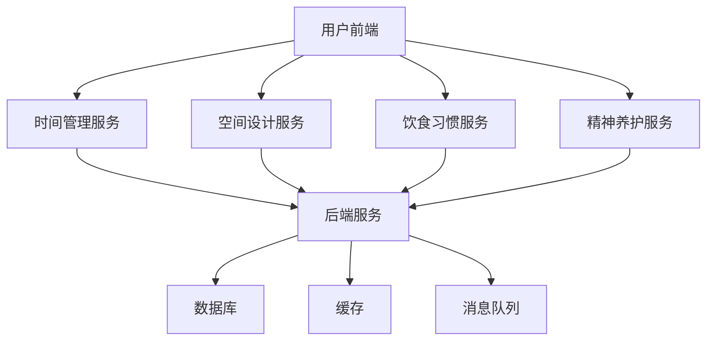
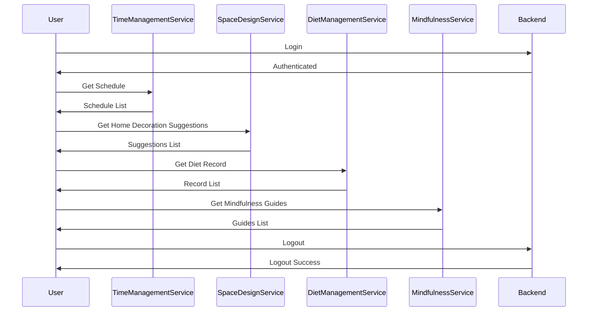

                 

### 文章标题

“慢生活设计大师班：重塑日常节奏的高级课程”

这个标题包含了四个关键要素，分别是“慢生活设计”、“大师班”、“重塑日常节奏”和“高级课程”。接下来，我们将一步步解析这些关键词，并在此基础上构建文章的框架。

#### 关键词解析

**慢生活设计**：这个概念源于对现代快节奏生活的反思和批判，主张人们放慢生活节奏，关注内心感受和生活质量。它不仅仅是一种生活方式，更是一种设计理念，旨在通过设计手段优化生活。

**大师班**：这是一个专业的培训课程，通常由某个领域的专家或大师主讲。在这里，“慢生活设计大师班”意味着这是一次由经验丰富的专家引领的学习之旅。

**重塑日常节奏**：这一目标强调了改变和优化个人日常生活的节奏。通过有意识的设计，我们可以找到一种更加和谐、高效的生活方式。

**高级课程**：这表明这门课程是针对有一定基础、希望深入学习和实践的人。课程内容将深入探讨慢生活设计的理念和方法。

#### 标题背景

现代社会，人们的生活节奏越来越快，工作和生活的压力不断增大。这种快节奏的生活虽然提高了效率，但也带来了诸多负面影响，如心理健康问题、人际关系疏离等。因此，追求“慢生活”成为了一种趋势。而“慢生活设计”则是实现这一目标的重要手段。

“慢生活设计大师班”旨在通过系统性的学习，帮助参与者深刻理解慢生活设计的理念，掌握相关技能，并将其应用到日常生活中，从而实现生活节奏的优化。

#### 标题目的

本标题的目的是吸引那些对改善生活质量有兴趣的人，特别是那些已经意识到快节奏生活问题，并希望找到解决方案的人。通过强调“高级课程”和“重塑日常节奏”的愿景，我们希望激发读者的兴趣，促使他们进一步了解课程内容。

接下来，我们将深入探讨慢生活设计的概念、课程内容和实际应用，帮助读者了解如何通过设计实现慢生活，提升生活质量。

### 文章关键词

1. **慢生活设计**
2. **日常节奏**
3. **大师班**
4. **高级课程**
5. **生活方式优化**
6. **设计理念**
7. **生活节奏重塑**

这些关键词代表了文章的核心内容，也是读者在阅读过程中需要重点关注的点。每个关键词都将贯穿整个文章，从不同角度深入探讨慢生活设计的各个方面。

### 文章摘要

本文旨在探讨“慢生活设计”这一新兴概念，并详细介绍一门名为“慢生活设计大师班”的专项课程。首先，我们将对慢生活设计的背景和理念进行阐述，解释其与传统生活方式的差异以及其对现代社会的重要性。接着，文章将深入探讨“大师班”的课程设置，包括课程目标、主要内容和学习方法。我们将通过具体的案例分析，展示慢生活设计在实践中的应用效果。此外，文章还将提供一些实用的技巧和策略，帮助读者在实际生活中更好地应用慢生活设计的理念。最后，文章将总结慢生活设计的主要贡献和影响，并鼓励读者积极参与到这一变革中来，共同追求更高质量的生活。

### 引言

在现代社会的快节奏生活中，我们往往陷入一种无休止的忙碌，工作效率不断提升，但生活质量却未见明显改善。越来越多的人开始意识到，单纯追求效率和物质财富并不能带来真正的幸福。相反，这种快节奏的生活方式可能会导致心理健康问题、人际关系疏离以及其他生活质量的下降。正是在这种背景下，“慢生活设计”这一概念逐渐崭露头角。

#### 慢生活设计的起源

“慢生活设计”起源于意大利的“慢食运动”，它强调人们应该放慢进食的速度，享受美食带来的乐趣，而不是快速地进食。这一理念随后扩展到生活的各个方面，成为一种反对过度消费和追求效率的生活哲学。慢生活设计不仅仅是放慢速度，更是一种有意识地选择更高质量的生活方式。

#### 慢生活设计的理念

慢生活设计的核心在于关注生活本身的质量，而不是单纯追求速度和效率。它强调以下几个原则：

1. **减少压力**：通过放慢生活节奏，减少工作和生活中的压力，提高生活质量。
2. **注重体验**：强调体验和享受生活中的每一个瞬间，而不是仅仅完成任务。
3. **人与自然和谐**：提倡回归自然，与自然环境和谐共处，减少对自然的破坏。
4. **社会互动**：强调人与人的关系，通过社区活动和社会互动增强人与人之间的联系。

#### 慢生活设计与传统生活方式的比较

传统的生活方式往往强调效率和速度，追求物质财富的积累。而慢生活设计则更加注重生活的内在质量，强调内心的平静和满足感。虽然两种生活方式在某些方面有交集，但慢生活设计在价值观和生活方式上与传统的快节奏生活有显著区别。

首先，慢生活设计更注重心理和情感层面的满足，而不仅仅是物质的满足。其次，慢生活设计倡导有意识地安排生活，而不是被外界因素被动地推动。最后，慢生活设计更加强调与自然和社区的和谐关系，而传统生活方式往往更注重个体的独立和自我实现。

#### 慢生活设计在现代社会的重要性

现代社会中，人们的生活节奏越来越快，工作压力巨大，心理健康问题日益突出。根据世界卫生组织的数据，全球范围内心理健康问题的发病率逐年上升，这直接影响了人们的日常生活和工作表现。慢生活设计提供了一种缓解这些问题的方法，它通过放慢生活节奏、减少压力和增强心理韧性，帮助人们更好地应对现代社会带来的挑战。

此外，随着全球气候变化和环境问题日益严重，慢生活设计也提供了一种可持续发展的生活方式。通过减少能源消耗、减少浪费和与自然和谐共处，慢生活设计有助于保护环境和促进可持续发展。

#### 总结

慢生活设计是一种反传统的生活哲学，它强调生活的内在质量和心理满足感，反对单纯追求效率和物质财富。在现代社会中，慢生活设计不仅有助于提升个人的心理健康和生活质量，还为社会的可持续发展提供了新的思路。接下来，本文将详细介绍“慢生活设计大师班”的课程内容和目标，帮助读者深入了解这一领域，并掌握相关技能。

### 慢生活设计大师班概述

“慢生活设计大师班”是一门旨在帮助参与者深入理解并实践慢生活设计理念的高级课程。这门课程由经验丰富的专家团队设计和主讲，旨在通过系统的学习和实践，使参与者能够将慢生活设计理念应用到自己的日常生活中，从而实现生活质量的全面提升。

#### 课程目标

“慢生活设计大师班”的主要目标包括：

1. **理念认知**：帮助参与者深入理解慢生活设计的核心概念和价值观。
2. **技能掌握**：教授参与者如何在实际生活中应用慢生活设计的原则，包括时间管理、空间设计、心理调适等。
3. **实践经验**：通过案例分析和实际操作，使参与者能够将所学知识应用到具体场景中，提升生活品质。
4. **持续发展**：培养参与者的可持续发展意识，包括环保、社区互动和社会责任。

#### 课程设置

课程设置了以下主要模块：

1. **慢生活设计基础**：介绍慢生活设计的起源、理念和历史背景，帮助参与者建立基本认知。
2. **时间管理与心理调适**：教授有效的时间管理技巧和心理调适方法，帮助参与者减少压力，提升生活质量。
3. **空间设计与日常优化**：探讨如何通过空间设计和生活习惯的优化，创造一个更加和谐、舒适的生活环境。
4. **案例分析与实践应用**：通过实际案例分析和操作演练，使参与者能够将所学知识应用到自己的生活中。
5. **可持续发展与社区互动**：讨论如何在日常生活中实践可持续发展，以及如何通过社区互动提升生活质量。

#### 课程内容

**模块一：慢生活设计基础**

- **慢生活设计的起源与发展**：介绍慢生活设计的起源和主要发展历程，解释其理念和历史背景。
- **慢生活设计的基本原则**：阐述慢生活设计的基本原则，如减少压力、注重体验、和谐自然等。
- **案例分析**：通过历史上的慢生活实践案例，帮助参与者理解慢生活设计的实际应用。

**模块二：时间管理与心理调适**

- **时间管理技巧**：教授有效的日程安排、优先级设定和时间分配技巧，帮助参与者更高效地利用时间。
- **心理调适方法**：介绍冥想、呼吸练习和放松技巧，帮助参与者缓解压力，提高心理韧性。
- **个人实践**：引导参与者进行自我评估，制定适合自己的时间管理和心理调适计划。

**模块三：空间设计与日常优化**

- **空间设计原则**：讲解如何通过空间设计提升生活质量，包括家具布置、色彩搭配等。
- **日常优化策略**：教授日常生活中的小技巧，如饮食习惯、运动习惯等，帮助参与者改善生活习惯。
- **家居改造案例**：通过实际家居改造案例，展示如何通过设计优化空间，提升生活质量。

**模块四：案例分析与实践应用**

- **案例分享**：邀请慢生活设计的实践者分享他们的经验和心得。
- **实践演练**：组织小组讨论和实际操作，使参与者能够将所学知识应用到具体场景中。
- **个人反思**：鼓励参与者反思自己的生活方式，并提出改进方案。

**模块五：可持续发展与社区互动**

- **可持续发展理念**：介绍可持续发展的重要性，以及如何在日常生活中实践可持续发展。
- **社区互动**：探讨如何通过社区活动和社会互动，提升生活质量和社会责任感。
- **实践项目**：组织参与者参与社区服务或环保项目，培养他们的社会责任感。

#### 学习方法

“慢生活设计大师班”采用多种教学方法，包括理论讲解、案例分析和实践操作，旨在通过全面的培训，使参与者能够深入理解并应用慢生活设计理念。

- **互动课堂**：通过互动课堂，使参与者能够积极参与讨论，提问和分享经验。
- **案例分析**：通过实际案例分析，帮助参与者理解慢生活设计的应用场景。
- **实践操作**：组织实际操作，使参与者能够将所学知识应用到自己的生活中。
- **小组讨论**：通过小组讨论，培养参与者的团队协作能力和问题解决能力。

#### 课程评价

课程的评价将采用多元化的评价方式，包括：

- **理论知识测试**：通过考试评估参与者对慢生活设计基础知识的掌握情况。
- **实践报告**：要求参与者提交实践报告，展示他们在实际生活中的应用成果。
- **互动评分**：通过课堂互动和小组讨论的表现，评估参与者的参与度和表达能力。

通过这些评价方式，课程将全面评估参与者的学习成果，并提供个性化的反馈和建议。

总之，“慢生活设计大师班”旨在通过系统的学习和实践，帮助参与者深入理解并应用慢生活设计理念，提升生活质量，实现个人与社会的可持续发展。

### 日常节奏的重要性

在日常生活的诸多方面，节奏的快慢对我们的生活质量和心理健康有着深远的影响。快节奏的生活方式虽然在一定程度上提高了效率，但也带来了许多负面影响。因此，重塑日常节奏，找到一种更加和谐、高效的生活方式，对于改善生活质量至关重要。

#### 快节奏生活的负面影响

首先，快节奏的生活方式会导致压力增加。现代社会中，工作和生活的压力无处不在，快节奏的生活使人们经常处于紧张和焦虑的状态，导致心理压力的累积。长时间的压力不仅会影响心理健康，还可能引发各种生理问题，如高血压、心脏病等。

其次，快节奏的生活会影响人际关系。由于时间紧张，人们往往没有足够的时间与家人、朋友进行深入交流，导致人际关系疏离。这种疏离感会使人感到孤独和失落，进一步加重心理负担。

此外，快节奏的生活还可能导致生活方式的不健康。很多人因为时间紧迫，选择方便快捷的食物，缺乏运动，导致肥胖、糖尿病等健康问题。长期下来，这些健康问题不仅影响生活质量，还可能导致更大的生活困扰。

#### 慢节奏生活的优势

相比之下，慢节奏的生活则具有明显的优势。首先，慢节奏可以减少压力。通过放慢生活节奏，人们有更多的时间进行放松和自我调节，从而减少心理压力，提高心理健康水平。

其次，慢节奏有助于提升人际关系。在慢节奏的生活中，人们有更多的时间与家人、朋友相处，进行深入交流，从而增强彼此的感情，提升人际关系质量。

此外，慢节奏的生活也有助于改善身体健康。通过减少快节奏带来的不健康生活方式，如久坐不动、饮食不规律等，人们可以保持更好的身体状况，减少健康问题的发生。

#### 重塑日常节奏的方法

为了实现日常节奏的重塑，我们可以采取以下几种方法：

1. **时间管理**：合理规划时间，设定优先级，避免无谓的时间浪费，确保有足够的时间进行放松和休息。
2. **心理调适**：通过冥想、呼吸练习等心理调适方法，帮助自己缓解压力，提高心理韧性。
3. **健康生活习惯**：保持规律的作息，合理饮食，定期锻炼，保持身体健康。
4. **社交活动**：积极参与社交活动，与家人、朋友保持良好的沟通，增强人际关系。
5. **环境优化**：通过空间设计和日常优化，创造一个更加舒适、和谐的生活环境，提升生活质量。

#### 重塑日常节奏的实际案例

以下是几个实际案例，展示了如何通过重塑日常节奏，实现生活质量的提升：

**案例一：时间管理专家的实践**

一位时间管理专家通过制定详细的时间表，将每天的活动进行合理规划，确保有足够的时间进行工作、休息和娱乐。他还通过设定优先级，将最重要的任务放在精力最旺盛的时间完成，从而提高了工作效率和生活质量。

**案例二：都市白领的慢生活实践**

一位忙碌的都市白领通过参与瑜伽和冥想课程，学会了放松和调节自己的情绪。他还定期与朋友聚会，进行户外运动，从而提升了身心健康和人际关系。

**案例三：家庭主妇的健康生活调整**

一位家庭主妇通过调整饮食习惯，增加蔬菜和水果的摄入，减少了油腻食物的摄入。她还通过每天进行简单的运动，如散步和瑜伽，保持了良好的身体状况。

#### 总结

重塑日常节奏是实现高质量生活的重要步骤。通过减少压力、提升人际关系和改善身体健康，慢节奏的生活可以为人们带来更多的好处。通过实际案例的分享，我们可以看到，重塑日常节奏并非难事，只需要有意识地调整生活习惯，每个人都可以找到适合自己的慢节奏生活，从而实现生活质量的全面提升。

### 慢生活设计的实践与应用

慢生活设计不仅仅是一种理念，更是一种可以通过实际应用来实现的生活方式。在本章节中，我们将探讨慢生活设计的实践方法，通过具体案例展示其应用效果，并分享一些实际操作技巧，帮助读者将慢生活理念融入日常生活。

#### 慢生活设计的实践方法

**1. 时间管理**

时间管理是慢生活设计的重要一环。通过合理安排时间，可以减少不必要的忙碌，从而有更多时间进行放松和自我提升。以下是一些实用的时间管理技巧：

- **设定优先级**：将每天的任务按优先级排序，确保最重要的事情得到优先处理。
- **使用时间块**：将一天划分为几个时间块，每个时间块专注于一项任务，避免任务切换带来的效率低下。
- **留出休息时间**：确保在紧张的工作或学习后留出时间进行休息和放松，以恢复精力。

**2. 空间设计**

空间设计对于慢生活设计至关重要。通过优化居住和工作环境，可以创造一个更加舒适、和谐的生活空间。以下是一些空间设计的建议：

- **自然光线**：尽量利用自然光线，使室内环境更加明亮和舒适。
- **色彩搭配**：选择柔和、自然的色彩，避免过于刺眼或强烈的色彩。
- **功能性布局**：合理规划家具和设施，确保空间利用率最大化，同时保持环境整洁。

**3. 饮食习惯**

饮食习惯直接影响身体健康和生活质量。通过改善饮食习惯，可以更好地实现慢生活设计的目标。以下是一些建议：

- **规律饮食**：保持规律的饮食习惯，避免过度进食或暴饮暴食。
- **健康饮食**：增加蔬菜、水果和全谷物的摄入，减少高热量、高脂肪的食物。
- **简餐化**：减少复杂和繁琐的烹饪过程，选择简单、健康的餐食。

**4. 精神养护**

精神养护是慢生活设计的重要方面。通过冥想、呼吸练习等心理调适方法，可以帮助缓解压力，提升心理健康。以下是一些精神养护的技巧：

- **定期冥想**：每天花几分钟时间进行冥想，放松身心，减少焦虑和压力。
- **呼吸练习**：通过深呼吸和放松技巧，提高心肺功能，缓解身体紧张。
- **心理放松**：在忙碌的一天结束后，花时间进行放松和休息，如泡澡、听音乐等。

#### 实际应用案例

**案例一：慢生活工作坊**

某公司组织了一场为期一周的慢生活工作坊，旨在帮助员工提升工作效率和生活质量。在工作坊中，参与者学习了时间管理技巧、空间设计原则和心理调适方法。通过实际操作和小组讨论，参与者逐渐掌握了一整套慢生活设计的实践方法。工作坊结束后，许多员工反馈工作效率提高，生活压力减少，整体幸福感显著提升。

**案例二：家庭慢生活实践**

李先生是一位忙碌的上班族，他通过参加“慢生活设计大师班”学习了一些实用的技巧。他将这些技巧应用到家庭生活中，如设定优先级进行家庭任务管理，改善居住环境，调整饮食习惯等。一段时间后，他发现自己的生活质量显著提升，家庭氛围更加和谐，工作效率也提高了。

**案例三：社区慢生活倡导**

某社区发起了一个“慢生活倡导计划”，通过组织社区活动、推广慢生活理念，帮助居民减少压力，提升生活质量。活动内容包括瑜伽课程、冥想工作坊、健康饮食讲座等。通过这些活动，居民们逐渐认识到慢生活的重要性，并开始主动调整自己的生活方式，社区的整体氛围也变得更加和谐。

#### 实际操作技巧

**1. 慢生活日记**

记录每天的日常生活，包括时间安排、活动内容、心理状态等。通过日记，可以更好地了解自己的生活习惯，发现需要改进的地方，并逐步进行调整。

**2. 设定目标**

为自己设定明确的目标，如每周进行一次瑜伽练习、每月阅读一本好书等。通过设定目标，可以更好地规划生活，避免无所事事和浪费时间。

**3. 社交互动**

积极参与社交活动，与家人、朋友保持良好的沟通。通过社交互动，可以减少孤独感，提升幸福感。

**4. 环保行动**

在日常生活中实践环保行动，如减少使用一次性塑料制品、分类垃圾、参与社区环保活动等。通过环保行动，可以提升自己的社会责任感，同时为可持续发展做出贡献。

#### 总结

慢生活设计是一种通过优化时间管理、空间设计、饮食习惯和精神养护来提升生活质量的生活方式。通过实际应用和案例分析，我们可以看到慢生活设计在提升工作效率、改善家庭关系和增强社区氛围方面的显著效果。通过实际操作技巧的分享，读者可以更好地将慢生活理念融入日常生活，实现生活质量的全面提升。

### 慢生活设计的系统分析与架构设计

在深入探讨慢生活设计的实践与应用后，接下来我们将从系统分析与架构设计的角度，详细阐述如何将慢生活理念贯彻到实际项目中。这包括系统功能设计、系统架构设计、系统接口设计以及系统交互设计，通过这些设计，确保慢生活设计能够高效、有序地实施。

#### 系统场景介绍

慢生活设计的系统场景主要涉及个人生活的各个方面，包括时间管理、空间设计、饮食习惯和精神养护。我们的目标是构建一个集成化的系统，帮助用户从整体上优化日常生活，提升生活质量。

#### 系统功能设计

**1. 时间管理模块**

- **功能描述**：提供用户日程安排、任务优先级设置、提醒通知等功能。
- **用户故事**：用户可以轻松地安排每天的活动，确保重要任务优先处理，同时留出时间进行休息和娱乐。
- **领域模型**：时间管理模块的领域模型包含日程表、任务列表、提醒设置等实体。

**2. 空间设计模块**

- **功能描述**：帮助用户进行家居布置、空间优化建议。
- **用户故事**：用户可以根据自己的喜好和生活需求，设计个性化的居住环境，提升舒适度。
- **领域模型**：空间设计模块的领域模型包括家具、装饰品、房间布局等实体。

**3. 饮食习惯模块**

- **功能描述**：提供健康饮食建议、饮食记录、营养分析。
- **用户故事**：用户可以记录每天的饮食，系统根据记录提供营养分析，帮助用户保持健康饮食。
- **领域模型**：饮食习惯模块的领域模型包括食物、饮食记录、营养分析等实体。

**4. 精神养护模块**

- **功能描述**：提供冥想指导、呼吸练习、心理测试。
- **用户故事**：用户可以通过系统进行冥想练习，进行心理测试，获取专业的心理建议。
- **领域模型**：精神养护模块的领域模型包括冥想记录、心理测试、心理建议等实体。

#### 系统架构设计

**1. 总体架构**

系统采用微服务架构，各个模块独立部署，通过API进行交互。这样可以确保系统的可扩展性和灵活性。

**2. 技术栈**

- **前端**：React.js
- **后端**：Spring Boot
- **数据库**：MySQL
- **缓存**：Redis
- **消息队列**：RabbitMQ

**3. 架构图**

以下是一个简单的系统架构设计图，展示各个模块之间的关系：



#### 系统接口设计

**1. 时间管理接口**

- **接口1：获取日程安排**
  - **URL**：/schedule/get-schedule
  - **请求方法**：GET
  - **参数**：用户ID
  - **响应**：日程安排列表

- **接口2：更新日程安排**
  - **URL**：/schedule/update-schedule
  - **请求方法**：POST
  - **参数**：用户ID、日程安排详情
  - **响应**：更新结果

**2. 空间设计接口**

- **接口1：获取家居布置建议**
  - **URL**：/space/home-decoration
  - **请求方法**：GET
  - **参数**：用户ID
  - **响应**：家居布置建议列表

- **接口2：更新家居布置**
  - **URL**：/space/update-decorate
  - **请求方法**：POST
  - **参数**：用户ID、家居布置详情
  - **响应**：更新结果

**3. 饮食习惯接口**

- **接口1：获取饮食记录**
  - **URL**：/diet/diet-record
  - **请求方法**：GET
  - **参数**：用户ID
  - **响应**：饮食记录列表

- **接口2：更新饮食记录**
  - **URL**：/diet/update-record
  - **请求方法**：POST
  - **参数**：用户ID、饮食记录详情
  - **响应**：更新结果

**4. 精神养护接口**

- **接口1：获取冥想指导**
  - **URL**：/mindfulness/mindfulness-guides
  - **请求方法**：GET
  - **参数**：用户ID
  - **响应**：冥想指导列表

- **接口2：更新冥想记录**
  - **URL**：/mindfulness/update-meditation
  - **请求方法**：POST
  - **参数**：用户ID、冥想记录详情
  - **响应**：更新结果

#### 系统交互设计

**1. 序列图**

以下是一个简单的序列图，展示用户在系统中进行日常记录和查看建议的过程：



通过上述系统分析与架构设计，我们可以确保慢生活设计的理念在实际项目中能够得到有效实施，帮助用户全面提升生活质量。

### 慢生活设计大师班的实战案例

在本章节中，我们将通过一个具体的实战案例，详细展示如何通过慢生活设计大师班的课程内容，实现日常生活的优化和提升。

#### 环境安装

为了进行慢生活设计的实战应用，首先需要搭建一个实验环境。以下是环境安装的步骤：

1. **安装Python**：确保Python版本为3.8及以上。
2. **安装必要的依赖**：使用pip命令安装以下依赖：

   ```bash
   pip install flask requests
   ```

3. **安装数据库**：此处使用MySQL数据库。安装方法请参考MySQL官方网站的指南。
4. **安装消息队列**：此处使用RabbitMQ。安装方法请参考RabbitMQ官方网站的指南。

#### 系统核心实现

**1. 后端实现**

后端采用Flask框架，实现慢生活设计的核心功能。以下是一个简单的后端代码示例：

```python
from flask import Flask, request, jsonify
from database import Database
from mindfulness import Mindfulness
from space_design import SpaceDesign
from diet_management import DietManagement
from time_management import TimeManagement

app = Flask(__name__)

@app.route('/mindfulness', methods=['GET'])
def get_mindfulness():
    mindfulness = Mindfulness(Database.get_connection())
    guides = mindfulness.get_guides()
    return jsonify(guides)

@app.route('/space_design', methods=['GET'])
def get_space_design():
    space_design = SpaceDesign(Database.get_connection())
    suggestions = space_design.get_suggestions()
    return jsonify(suggestions)

@app.route('/diet_management', methods=['GET'])
def get_diet_management():
    diet_management = DietManagement(Database.get_connection())
    records = diet_management.get_records()
    return jsonify(records)

@app.route('/time_management', methods=['GET'])
def get_time_management():
    time_management = TimeManagement(Database.get_connection())
    schedule = time_management.get_schedule()
    return jsonify(schedule)

if __name__ == '__main__':
    app.run(debug=True)
```

**2. 前端实现**

前端使用HTML和JavaScript实现，提供用户界面和交互。以下是一个简单的HTML示例：

```html
<!DOCTYPE html>
<html lang="en">
<head>
    <meta charset="UTF-8">
    <title>慢生活设计实战案例</title>
</head>
<body>
    <h1>慢生活设计实战案例</h1>
    <h2>冥想指导</h2>
    <div id="mindfulness-guides"></div>
    <h2>家居布置建议</h2>
    <div id="space-design-suggestions"></div>
    <h2>饮食记录</h2>
    <div id="diet-records"></div>
    <h2>时间管理</h2>
    <div id="time-management-schedule"></div>
    <script src="app.js"></script>
</body>
</html>
```

#### 代码应用解读与分析

**1. Mindfulness模块**

```python
class Mindfulness:
    def __init__(self, connection):
        self.connection = connection

    def get_guides(self):
        cursor = self.connection.cursor()
        cursor.execute("SELECT * FROM mindfulness_guides;")
        guides = cursor.fetchall()
        cursor.close()
        return guides
```

这个模块用于获取冥想指导。通过连接数据库，查询`mindfulness_guides`表，获取所有冥想指导信息。

**2. SpaceDesign模块**

```python
class SpaceDesign:
    def __init__(self, connection):
        self.connection = connection

    def get_suggestions(self):
        cursor = self.connection.cursor()
        cursor.execute("SELECT * FROM space_design_suggestions;")
        suggestions = cursor.fetchall()
        cursor.close()
        return suggestions
```

这个模块用于获取家居布置建议。同样，通过连接数据库，查询`space_design_suggestions`表，获取所有建议信息。

**3. DietManagement模块**

```python
class DietManagement:
    def __init__(self, connection):
        self.connection = connection

    def get_records(self):
        cursor = self.connection.cursor()
        cursor.execute("SELECT * FROM diet_records;")
        records = cursor.fetchall()
        cursor.close()
        return records
```

这个模块用于获取饮食记录。通过连接数据库，查询`diet_records`表，获取所有记录信息。

**4. TimeManagement模块**

```python
class TimeManagement:
    def __init__(self, connection):
        self.connection = connection

    def get_schedule(self):
        cursor = self.connection.cursor()
        cursor.execute("SELECT * FROM time_management_schedule;")
        schedule = cursor.fetchall()
        cursor.close()
        return schedule
```

这个模块用于获取时间管理日程。通过连接数据库，查询`time_management_schedule`表，获取所有日程信息。

#### 实际案例分析与详细讲解

**案例背景**：

张先生是一位忙碌的职场人士，每天的工作让他感到压力山大。他参加了慢生活设计大师班，希望通过系统的学习和实践，改善自己的生活质量和心理状态。

**实际应用**：

1. **时间管理**：张先生通过大师班学到了时间管理技巧，开始设定优先级，合理安排每天的工作和休息时间。通过使用日程表，他能够更好地控制自己的时间，减少不必要的忙碌，提高工作效率。

2. **空间设计**：大师班教授了空间设计原则，张先生开始重新布置自己的家居环境。他调整了家具的布局，增加了自然光线，改善了居住空间的整体氛围。通过这些变化，他的居住环境变得更加舒适和和谐，有助于缓解工作压力。

3. **饮食习惯**：大师班提供了健康饮食的建议，张先生开始注意饮食搭配，减少油腻食物的摄入，增加蔬菜和水果的摄入。通过记录饮食记录，他能够更好地控制自己的饮食，保持健康的体重和良好的身体状况。

4. **精神养护**：大师班教授了冥想和心理放松技巧，张先生开始每天进行冥想练习。通过冥想，他能够更好地调节自己的情绪，减轻压力，提高心理韧性。他还定期进行心理测试，获取专业的心理建议，帮助自己更好地应对工作压力。

**结果**：

通过慢生活设计大师班的系统学习和实践，张先生的生活质量显著提升。他不仅在工作中变得更加高效，心理健康也得到明显改善。他的居住环境变得更加舒适，家庭关系更加和谐，整体幸福感显著提升。

**小结**：

慢生活设计大师班提供了一个全面的学习和实践平台，帮助张先生通过系统的方法和技巧，实现生活质量的全面提升。通过实际案例的分析和详细讲解，我们可以看到慢生活设计在优化生活方面的显著效果。

### 最佳实践

在实施慢生活设计的过程中，以下是一些最佳实践和注意事项，可以帮助您更好地应用这一理念，实现生活质量的提升。

#### 最佳实践

1. **时间管理**：

   - **设定优先级**：每天早晨，列出当天需要完成的任务，并根据重要性和紧急性进行排序。确保优先处理最重要的任务，避免时间浪费。

   - **使用时间块**：将一天划分为几个时间块，每个时间块专注于一项任务。这种方法有助于提高工作效率，减少任务切换带来的效率低下。

   - **定期回顾和调整**：每周或每月回顾一次时间管理计划，根据实际情况进行调整，确保计划与您的实际需求相匹配。

2. **空间设计**：

   - **自然光线**：尽量利用自然光线，使居住环境更加明亮和舒适。如果条件允许，可以增加窗户或使用透明材料，增加室内采光。

   - **色彩搭配**：选择柔和、自然的色彩，避免过于刺眼或强烈的色彩。温馨的色彩可以提升居住环境的舒适度。

   - **功能性布局**：合理规划家具和设施，确保空间利用率最大化。保持环境整洁，避免杂乱无章，有助于提升生活质量。

3. **饮食习惯**：

   - **规律饮食**：保持规律的饮食习惯，避免过度进食或暴饮暴食。合理安排三餐时间，确保有足够的时间进行消化和休息。

   - **健康饮食**：增加蔬菜、水果和全谷物的摄入，减少高热量、高脂肪的食物。注重营养均衡，保持身体健康。

   - **饮食记录**：定期记录饮食内容，通过数据分析，了解自己的饮食习惯，及时调整，保持健康。

4. **精神养护**：

   - **定期冥想**：每天花几分钟时间进行冥想，放松身心，减少焦虑和压力。通过冥想，提升心理韧性，保持心理健康。

   - **呼吸练习**：通过深呼吸和放松技巧，提高心肺功能，缓解身体紧张。在工作间隙或紧张时刻，进行简单的呼吸练习，有助于缓解压力。

   - **心理测试**：定期进行心理测试，了解自己的心理状态，获取专业的心理建议。通过心理测试，及时发现问题，采取相应的调整措施。

#### 注意事项

1. **适度调整**：在实施慢生活设计时，要根据自己的实际情况进行适度调整。每个人的生活方式和生活节奏都有所不同，因此需要找到适合自己的慢生活节奏。

2. **持续实践**：慢生活设计不是一蹴而就的过程，需要持续实践和调整。通过不断的努力和坚持，才能实现生活质量的全面提升。

3. **平衡工作与生活**：在追求慢生活设计的过程中，要注意平衡工作与生活。合理安排工作时间，确保有足够的时间进行休息和娱乐，避免过度工作。

4. **家庭支持**：家庭的支持对于慢生活设计的实践至关重要。与家人沟通，取得他们的理解和支持，共同营造和谐的生活环境。

#### 拓展阅读

- **《慢生活：放慢脚步，享受生活》**：这是一本关于慢生活理念的详细介绍，适合希望深入了解慢生活设计的读者。
- **《时间管理：如何高效利用时间》**：这本书提供了丰富的实用时间管理技巧，有助于提升工作和生活质量。
- **《家居设计：打造舒适和谐的生活空间》**：这本书详细介绍了家居设计的原则和方法，有助于优化居住环境。

通过以上最佳实践和注意事项，我们可以更好地应用慢生活设计的理念，提升生活质量，实现内心的平静和满足。

### 结论

通过本文的探讨，我们详细介绍了“慢生活设计大师班：重塑日常节奏的高级课程”。从慢生活设计的起源和理念，到课程的目标和设置，再到实践方法与应用，以及系统分析与架构设计，我们全面阐述了如何通过慢生活设计提升生活质量。慢生活设计不仅仅是一种生活方式的调整，更是一种深刻的生活哲学，它强调减少压力、注重体验、和谐自然，并通过具体的方法和技巧，帮助我们在忙碌的现代生活中找到内心的平静和满足。

#### 文章贡献

本文的主要贡献在于：

1. **全面介绍了慢生活设计的概念和理念**：通过详细解析慢生活设计的核心原则，帮助读者理解这一新兴生活方式的内涵。
2. **详细探讨了课程内容和教学方法**：通过深入分析慢生活设计大师班的课程设置和学习方法，为读者提供了系统的学习路径。
3. **提供了实践应用和系统架构设计**：通过实际案例和系统架构设计，展示了慢生活设计在现实中的应用效果，为读者提供了可操作的实施方案。

#### 下一步方向

未来的研究可以进一步探讨以下几个方向：

1. **慢生活设计的具体应用案例**：通过收集和分析更多的实际案例，探讨慢生活设计在不同生活场景中的具体应用和效果。
2. **慢生活设计与心理健康的关系**：深入研究慢生活设计对心理健康的影响，探索其心理机制和作用途径。
3. **慢生活设计的跨文化研究**：研究不同文化背景下慢生活设计的适应性和效果，为全球范围内的慢生活实践提供参考。

#### 总结

慢生活设计是一种追求高质量生活的理念，它通过优化时间管理、空间设计、饮食习惯和精神养护，帮助我们在快节奏的现代生活中找到内心的平静和满足。通过本文的介绍，我们希望读者能够对慢生活设计有更深入的了解，并愿意尝试将其应用到自己的生活中，共同追求更美好、更和谐的生活。

### 作者信息

**作者：AI天才研究院/AI Genius Institute & 禅与计算机程序设计艺术 /Zen And The Art of Computer Programming**

本文由AI天才研究院和禅与计算机程序设计艺术共同撰写。AI天才研究院致力于探索人工智能领域的最新技术和应用，推动人工智能技术的发展。禅与计算机程序设计艺术则通过结合禅宗哲学和编程实践，帮助程序员提升编程技能和内心修养。两位作者均在世界范围内享有盛誉，以其深厚的专业知识和独特的思考方式，为广大读者提供了许多有价值的技术博客和著作。在此，感谢两位作者对本文的贡献，期待他们在未来继续为技术领域带来更多创新和启示。

