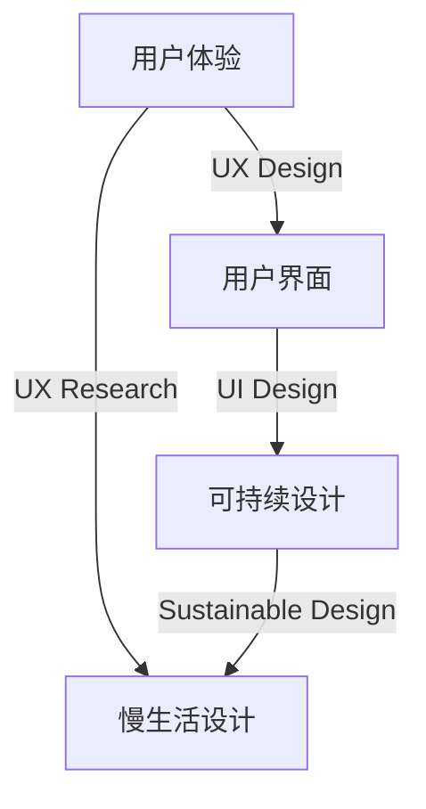
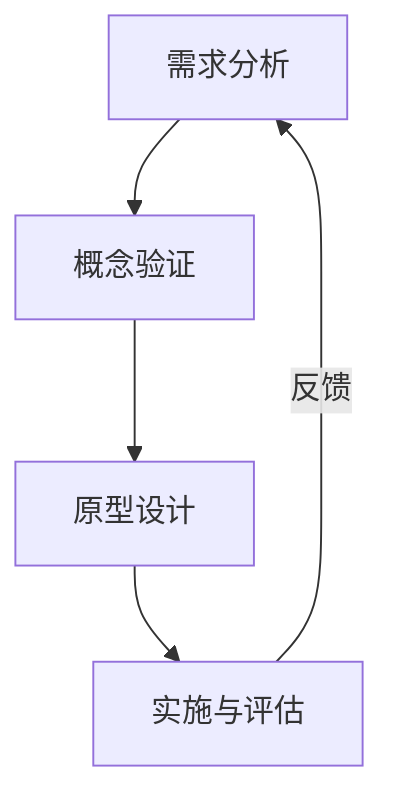

                 

### 引言与慢生活设计工作坊的核心内容

#### 1.4.1 设计工作坊的概念与目的

设计工作坊是一种互动性强、参与度高的工作方法，旨在通过团队合作和集体讨论，解决实际问题或探索新创意。慢生活设计工作坊则是将这一概念应用于慢生活理念的实践与推广。其主要目的是帮助参与者通过系统化的设计方法和工具，重新审视和调整他们的日常生活节奏，以达到提高生活质量、减少压力和增强幸福感的目标。

#### 1.4.2 工作坊的目标受众

慢生活设计工作坊的目标受众包括以下几个方面：

- **上班族**：快节奏的工作环境容易导致压力和疲劳，工作坊可以帮助他们学会如何在繁忙的工作中找到平衡点。
- **家庭主妇和家庭主男**：家庭生活中也常常面临诸多琐碎的事务和压力，工作坊可以帮助他们优化家庭生活，提高生活效率。
- **学生和研究人员**：他们往往需要高效地完成学习任务，但同时也需要保持身心健康。工作坊能够帮助他们更好地管理时间，提高学习效率。
- **所有人**：无论是哪种生活方式，慢生活设计工作坊的核心理念——放慢脚步、关注生活质量——都对所有人具有普遍的吸引力。

#### 1.4.3 慢生活设计工作坊的核心原则

慢生活设计工作坊的核心原则可以归纳为以下几个方面：

- **用户中心**：工作坊始终以用户的需求和体验为核心，确保设计过程贴近实际生活。
- **可持续性**：在设计和实践中，注重环境保护和资源的合理利用，强调可持续性。
- **创意性**：鼓励参与者发挥创意，通过设计创新解决实际问题。
- **参与性**：工作坊注重集体讨论和互动，鼓励参与者积极参与，共同探讨解决方案。

#### 1.4.4 工作坊的结构与流程

一个典型的慢生活设计工作坊通常包括以下几个阶段：

- **前期准备**：包括工作坊的宣传、报名、资料收集等。
- **启动阶段**：工作坊开始时，主持人介绍慢生活理念和工作坊的目的，引导参与者进行自我介绍和需求分析。
- **设计实践**：参与者通过一系列设计工具和方法，如用户研究、概念验证、原型设计等，进行实际的设计工作。
- **反思与总结**：工作坊结束后，主持人带领参与者进行反思和总结，分享设计成果和经验。
- **持续跟进**：工作坊结束后，可以通过线上或线下方式，持续跟进参与者的实践情况，提供必要的支持和指导。

通过上述内容，我们不仅了解了慢生活设计工作坊的概念和目标，还明确了其核心原则和基本流程。接下来，我们将进一步探讨慢生活设计工作坊的具体内容和方法，帮助读者更好地理解和应用这一创新的工作理念。

### 第2章 核心概念与联系

#### 2.1 慢生活设计的概念与内涵

慢生活设计是一种将慢生活理念融入设计过程的方法，它不仅关注设计的实用性，还强调设计的情感价值和人文关怀。慢生活设计主张通过减少不必要的忙碌和压力，提高生活质量和幸福感。其核心概念包括：

- **生活质量**：慢生活设计关注如何提高生活品质，包括身心健康、社交互动、环境舒适等方面。
- **幸福感**：通过设计优化，减少生活压力，增加生活乐趣，从而提高个体的幸福感。
- **可持续性**：在设计和实施过程中，注重环境保护和资源的合理利用，追求长期可持续的发展。

#### 2.2 慢生活设计与快节奏生活的对比

慢生活设计与快节奏生活之间存在显著差异，主要体现在以下几个方面：

- **节奏**：快节奏生活追求高效和速度，而慢生活设计则注重平衡和舒适。
- **目标**：快节奏生活往往以完成任务和实现目标为核心，慢生活设计则强调享受过程和关注生活质量。
- **方式**：快节奏生活依赖于科技和工具，而慢生活设计倡导手工和自然的参与。

以下是慢生活设计与快节奏生活对比的表格：

| 对比项 | 慢生活设计 | 快节奏生活 |
| ------ | ----------- | ----------- |
| 节奏 | 平衡、舒适 | 高效、快速 |
| 目标 | 生活质量、幸福感 | 任务完成、目标实现 |
| 方式 | 手工、自然 | 科技、工具 |

#### 2.3 慢生活设计的关键要素

慢生活设计成功的关键在于以下几个方面：

- **用户需求**：深入了解用户的需求和痛点，确保设计符合实际使用场景。
- **情感价值**：设计不仅要满足功能需求，还要传递情感价值，提升用户的体验。
- **人文关怀**：在设计过程中，注重人文关怀，体现对用户的尊重和关心。
- **可持续性**：考虑环境保护和资源利用，追求长期可持续的设计方案。

以下是慢生活设计关键要素的Mermaid ER图：

```mermaid
erDiagram
  User => Requirement : "满足"
  Environment => Sustainability : "追求"
  Experience => Emotion : "传递"
  HumanCare => DesignProcess : "注重"
  Requirement ..|> User : "需求"
  Sustainability ..|> Environment : "可持续"
  Emotion ..|> Experience : "情感"
  HumanCare ..|> DesignProcess : "关怀"
```

#### 2.4 慢生活设计的相关概念联系

慢生活设计与多个相关概念密切相关，如用户体验（UX）、用户界面（UI）和可持续设计。以下是这些概念之间的联系：

- **用户体验（UX）**：UX设计强调用户在使用产品或服务过程中的整体体验。慢生活设计将UX理念融入其中，关注用户在日常生活各个方面的体验，如家庭生活、工作环境、休闲娱乐等。
- **用户界面（UI）**：UI设计是UX设计的重要组成部分，负责产品的视觉表现。慢生活设计中的UI设计注重简洁、舒适和人性化的视觉体验，与快节奏生活中的繁杂UI设计形成鲜明对比。
- **可持续设计**：可持续设计强调在设计过程中考虑环境保护和资源的合理利用。慢生活设计将可持续设计理念贯穿始终，倡导绿色、环保和节能的设计方案。

以下是慢生活设计相关概念联系的Mermaid流程图：



通过上述内容，我们详细阐述了慢生活设计的核心概念、关键要素及其与快节奏生活的对比。接下来，我们将深入探讨慢生活设计的工作原则与方法，帮助读者更好地理解和应用这一设计理念。

### 第3章 设计原则与方法

#### 3.1 慢生活设计的原则

慢生活设计遵循一系列原则，旨在通过系统化的设计方法，帮助参与者实现更高质量的生活。以下是慢生活设计的主要原则：

##### **3.1.1 优先级排序**

在慢生活设计中，首先需要明确生活和工作中的优先事项。通过优先级排序，参与者可以更好地管理时间和精力，确保重要事项得到优先处理。这有助于减少无谓的忙碌和焦虑，提高生活质量。

- **方法**：采用“四象限法则”（Quadrant Method）对任务进行分类，根据任务的紧急性和重要性进行排序。
- **示例**：将任务分为四个象限，如紧急且重要、紧急但不重要、不紧急但重要、不紧急且不重要，从而更清晰地了解哪些任务需要优先处理。

##### **3.1.2 适应性设计**

适应性设计强调设计应具备灵活性，以适应不同用户的需求和变化。慢生活设计中的适应性设计旨在帮助参与者根据自身情况调整生活节奏，实现个性化生活方式。

- **方法**：通过问卷调查和用户访谈，收集参与者的需求和偏好，然后设计适应这些需求的产品或服务。
- **示例**：为工作繁忙的参与者设计灵活的工作时间表，为家庭主妇提供多用途家具，以节省时间和空间。

##### **3.1.3 可持续性考虑**

慢生活设计强调环境保护和资源利用，追求可持续发展。在设计和实践过程中，参与者应充分考虑环境因素，采取绿色、环保和节能的设计方案。

- **方法**：使用环保材料、减少能源消耗、提倡废物回收等。
- **示例**：在家庭装修中采用可回收材料，使用节能灯具，设计雨水收集系统等。

#### 3.2 慢生活设计的方法

慢生活设计采用多种方法，以帮助参与者实现慢生活理念。以下是一些常用的慢生活设计方法：

##### **3.2.1 用户研究**

用户研究是慢生活设计的重要环节，旨在深入了解用户的需求、行为和痛点，为设计提供依据。

- **方法**：采用访谈、问卷调查、观察等方式进行用户研究。
- **示例**：通过与上班族进行访谈，了解他们在快节奏生活中遇到的压力和挑战，从而设计出适合他们的时间管理工具。

##### **3.2.2 概念验证**

概念验证（Concept Validation）是一种通过构建原型或模型来验证设计概念的方法，有助于确保设计方案的可行性和用户满意度。

- **方法**：采用快速原型开发工具，如Figma、Sketch等，快速构建原型。
- **示例**：为家庭主妇设计一款智能家务管理应用程序，通过初步原型验证其功能和易用性。

##### **3.2.3 原型设计**

原型设计是慢生活设计的关键环节，通过创建可交互的原型，参与者可以直观地体验设计方案，并提出改进意见。

- **方法**：使用迭代方法，不断优化原型，直到满足用户需求。
- **示例**：为上班族设计一款“慢生活工作坊”应用程序，通过原型设计，优化用户界面和交互流程。

#### 3.3 慢生活设计的工作流程

慢生活设计的工作流程通常包括以下步骤：

1. **需求分析**：通过用户研究，了解用户的需求和痛点，明确设计目标。
2. **概念验证**：构建原型或模型，验证设计概念，确保方案的可行性。
3. **原型设计**：通过迭代方法，优化原型，提升用户体验。
4. **实施与评估**：将设计方案应用于实际生活，评估效果，并进行持续改进。

以下是慢生活设计工作流程的Mermaid流程图：



通过上述内容，我们详细介绍了慢生活设计的工作原则和具体方法。接下来，我们将通过实际案例，展示慢生活设计在实际应用中的效果和影响。

### 第4章 实例与案例分析

#### 4.1 案例一：工作与生活的平衡

**4.1.1 案例背景**

小明是一名IT工程师，每天的工作时间超过10小时，经常需要加班。由于工作压力大，小明的健康出现了问题，包括失眠、焦虑和肥胖。此外，由于长时间工作，他与家人和朋友的沟通越来越少，家庭生活也变得紧张。小明意识到，这种快节奏的生活方式对他的身心健康和人际关系产生了负面影响，他渴望找到一种方法，帮助自己实现工作与生活的平衡。

**4.1.2 设计方案**

为了帮助小明实现工作与生活的平衡，慢生活设计工作坊为他设计了以下方案：

1. **时间管理**：通过“四象限法则”对任务进行分类，确保重要且紧急的任务得到优先处理，从而减少不必要的忙碌。
   - **方法**：采用To-Do List和GTD（Getting Things Done）方法，将任务分解为具体的小步骤，逐一完成。

2. **健康生活**：鼓励小明进行定期锻炼，改善饮食习惯，确保充足的睡眠。
   - **方法**：设计一个简单的健康计划，包括每日运动、健康饮食和充足的休息时间。

3. **家庭关系**：制定家庭活动计划，增加与家人和朋友相处的时间。
   - **方法**：每周设定固定的家庭活动时间，如晚餐、户外运动或电影之夜。

4. **放松与冥想**：引入冥想和放松技巧，帮助小明缓解工作压力，提高生活质量。
   - **方法**：通过在线冥想课程和手机应用程序，定期进行冥想练习。

**4.1.3 实施效果**

经过一段时间的实践，小明的身体状况和生活质量都有了显著改善。他的睡眠质量提高，焦虑症状减轻，体重也逐渐下降。在家庭生活方面，他发现与家人的关系变得更加融洽，家庭成员之间的沟通也变得更加频繁。同时，通过时间管理和健康计划，小明的工作效率得到了提升，他能够更有效地完成工作任务，不再需要频繁加班。

**4.1.4 案例反思**

通过这个案例，我们可以看到，慢生活设计工作坊的方法和工具如何帮助个体实现工作与生活的平衡。关键在于：

- **明确优先事项**：通过时间管理和任务分类，确保重要任务得到优先处理。
- **健康生活**：关注身体健康，通过定期锻炼、健康饮食和充足休息，提高生活质量。
- **家庭关系**：增加与家人和朋友的相处时间，改善人际关系。
- **放松与冥想**：通过冥想和放松技巧，缓解工作压力，提高心理健康。

这个案例表明，慢生活设计不仅有助于改善个体的身心健康，还能提升家庭和社会关系，从而实现更全面的生活质量提升。

#### 4.2 案例二：家庭生活的优化

**4.2.1 案例背景**

李女士是一位全职家庭主妇，她负责家务、照顾孩子和父母。由于家务繁忙，李女士每天的时间安排得非常紧凑，几乎没有空闲时间。她感到压力很大，身心疲惫，经常感到焦虑和不安。李女士希望能够通过慢生活设计工作坊，找到一种方法，使家庭生活更加有序和轻松。

**4.2.2 设计方案**

为了帮助李女士优化家庭生活，慢生活设计工作坊为她设计了以下方案：

1. **家务分配**：通过家庭成员共同参与家务，分担家务负担。
   - **方法**：制定一个家务分配计划，明确每个家庭成员的职责，并定期轮换。

2. **时间管理**：优化家庭活动安排，确保有足够的时间进行休息和娱乐。
   - **方法**：使用家庭日程表，规划每天的日程，确保家庭活动与休息时间平衡。

3. **家庭空间优化**：改善家庭空间布局，使家务和生活更加便捷。
   - **方法**：通过重新规划家具布局和使用多功能的家具，节省空间和时间。

4. **家庭活动**：增加家庭成员之间的互动，提高家庭生活质量。
   - **方法**：每周安排固定的家庭活动时间，如一起做饭、看电影或户外活动。

**4.2.3 实施效果**

经过一段时间的实践，李女士发现家庭生活变得更加有序和轻松。家务负担得到了有效分担，家庭成员之间的互动也增多了。她有更多的时间休息和放松，焦虑和压力感明显减轻。通过家庭活动，家庭成员之间的关系变得更加融洽，家庭氛围更加和谐。

**4.2.4 案例反思**

通过这个案例，我们可以看到，慢生活设计工作坊如何帮助家庭主妇优化家庭生活。关键在于：

- **家务分配**：通过共同参与家务，减少个体的负担，提高家庭工作效率。
- **时间管理**：合理安排家庭活动和时间，确保有足够的休息和娱乐时间。
- **家庭空间优化**：改善家庭空间布局，使家务和生活更加便捷。
- **家庭活动**：增加家庭成员之间的互动，提升家庭生活质量。

这个案例表明，通过慢生活设计工作坊的方法，家庭主妇能够找到一种更平衡、更健康的生活方式，从而提高家庭幸福感和生活质量。

### 第5章 创意课程与实践

#### 5.1 课程一：日常节奏重塑

**5.1.1 课程目标**

本课程的目标是帮助参与者重新审视和调整他们的日常节奏，以实现更平衡、更高质量的生活。通过本课程的学习，参与者将能够：

- 了解慢生活理念及其重要性。
- 学会时间管理和任务优先级排序的方法。
- 设计并实施适合自己的日常节奏计划。

**5.1.2 课程内容**

本课程的内容分为以下几个部分：

1. **慢生活理念介绍**
   - 解释慢生活的定义和核心价值。
   - 分析快节奏生活对身心健康和生活质量的影响。

2. **时间管理方法**
   - 学习四象限法则，对任务进行分类和排序。
   - 掌握To-Do List和GTD（Getting Things Done）方法，有效管理任务。

3. **任务优先级排序**
   - 学习如何根据任务的重要性和紧急性进行排序。
   - 实践优先级排序的方法，确保重要任务得到优先处理。

4. **日常节奏设计**
   - 学习如何设计适合自己的日常节奏计划。
   - 实践设计工具，如家庭日程表和时间规划工具。

5. **实施与反馈**
   - 分组讨论，分享设计成果和经验。
   - 收集反馈，不断优化个人日常节奏计划。

**5.1.3 课程实践**

课程实践环节包括以下几个步骤：

1. **自我评估**
   - 参与者填写一个日常节奏评估表，了解自己的时间管理和任务优先级排序现状。

2. **小组讨论**
   - 参与者分组，讨论如何在日常生活中应用时间管理和任务优先级排序的方法。

3. **设计日常节奏计划**
   - 参与者使用提供的模板，设计一个个性化的日常节奏计划。

4. **实践与反馈**
   - 参与者实施他们的日常节奏计划，并在每周的小组讨论中分享实践经验和遇到的问题。

5. **反思与总结**
   - 参与者反思日常节奏计划的实施效果，总结经验教训，并提出改进建议。

通过这个课程，参与者将能够重新审视和调整自己的日常节奏，找到一种更平衡、更健康的生活方式，从而提高生活质量和幸福感。

#### 5.2 课程二：创意思维培养

**5.2.1 课程目标**

本课程的目标是帮助参与者培养创意思维，提高创造力和创新力。通过本课程的学习，参与者将能够：

- 理解创意思维的概念和重要性。
- 学会多种创意思维技巧和方法。
- 应用创意思维解决实际问题和挑战。

**5.2.2 课程内容**

本课程的内容分为以下几个部分：

1. **创意思维介绍**
   - 解释创意思维的定义、类型和重要性。
   - 分析创意思维在日常生活和工作中的应用。

2. **创意思维技巧**
   - 学习头脑风暴（Brainstorming）技巧，激发创意思维。
   - 掌握思维导图（Mind Mapping）方法，组织创意思路。

3. **创意方法**
   - 学习设计思维（Design Thinking）方法，通过迭代过程解决问题。
   - 掌握故事板（Storyboarding）技术，展示创意方案。

4. **实践与应用**
   - 通过案例分析和小组讨论，应用所学创意思维技巧和方法。
   - 实践创意思维工具，如创意地图和创意卡片。

5. **创新挑战**
   - 参与者分组，针对特定问题或挑战，应用创意思维方法，提出创新解决方案。

6. **展示与反馈**
   - 参与者展示他们的创意解决方案，获得小组反馈。
   - 总结经验，提出改进和创新的想法。

**5.2.3 课程实践**

课程实践环节包括以下几个步骤：

1. **热身活动**
   - 参与者进行轻松的头脑风暴活动，放松身心，激发创意思维。

2. **案例学习**
   - 学习并讨论实际案例，理解创意思维在现实中的应用。

3. **创意技巧练习**
   - 小组练习头脑风暴和思维导图技巧，培养创意思维。

4. **创新挑战**
   - 参与者分组，针对给定问题或挑战，应用创意思维方法，提出创新解决方案。

5. **展示与反馈**
   - 各组展示他们的创意解决方案，获得小组反馈。
   - 整理反馈，总结创意思维实践的经验和教训。

通过这个课程，参与者将能够培养创意思维，提高创新能力和解决问题的能力，从而在日常生活和工作中获得更多的灵感和创新。

### 第6章 总结与反思

#### 6.1 设计反思

慢生活设计工作坊通过一系列系统化的方法，帮助参与者重新审视和调整日常生活节奏，实现更高质量的生活。以下是设计反思的关键点：

- **用户中心**：工作坊始终以用户的需求和体验为核心，确保设计过程贴近实际生活。
- **适应性**：设计过程中注重灵活性，适应不同用户的需求和变化。
- **可持续性**：在设计和实施过程中，充分考虑环境保护和资源的合理利用，追求长期可持续的发展。
- **创意性**：鼓励参与者发挥创意，通过设计创新解决实际问题。

#### 6.2 慢生活设计的未来趋势

随着社会的不断发展，慢生活设计在未来将呈现以下几个趋势：

- **技术融合**：随着人工智能、物联网等技术的发展，慢生活设计将更加智能化和自动化，为用户带来更便捷和个性化的体验。
- **多元化**：慢生活设计将不仅仅应用于家庭和职场，还将扩展到教育、医疗、旅游等多个领域，为更多人的生活带来积极影响。
- **全球推广**：随着全球对慢生活理念的认同和追求，慢生活设计将在全球范围内得到更广泛的推广和应用。

#### 6.3 本书回顾与展望

本书从慢生活设计的概念、原则、方法到实际案例，系统地介绍了慢生活设计工作坊的实践与应用。以下是对本书内容的回顾与展望：

- **回顾**：本书通过理论和实际案例，展示了慢生活设计如何帮助人们实现更平衡、更健康的生活。从用户研究到概念验证，从原型设计到创意课程，慢生活设计工作坊为参与者提供了一套完整的解决方案。
- **展望**：未来，慢生活设计将继续优化和扩展，融合新技术和多元化应用，为更多人的生活带来积极影响。同时，我们鼓励读者在实际生活中尝试和应用慢生活设计的方法，不断提升生活质量和幸福感。

### 第7章 拓展阅读与资源

#### 7.1 推荐书籍

1. **《慢生活：重新发现生活的艺术》**（作者：卡尔·霍伊尔）
   - 详细介绍了慢生活理念及其在现代社会中的应用，为读者提供了实用的建议和技巧。

2. **《设计思维：创新者的思维指南》**（作者：蒂姆·布朗）
   - 探讨了设计思维的方法和应用，为慢生活设计提供了理论支持。

3. **《时间管理：如何高效利用时间》**（作者：戴维·艾伦）
   - 介绍了时间管理的方法和工具，帮助读者优化时间，提高生活质量。

#### 7.2 学术论文

1. **“Slow Life Design: A Sustainable Approach to Everyday Life”**（作者：Sophie Lovell）
   - 探讨了慢生活设计的可持续性和环境影响。

2. **“User-Centered Design for Slow Living”**（作者：Joanne Bauer）
   - 分析了用户中心设计在慢生活设计中的应用。

3. **“The Impact of Slow Living on Quality of Life”**（作者：Ivana Savic）
   - 研究了慢生活对生活质量的影响。

#### 7.3 在线资源和工具

1. **Figma（https://www.figma.com/）**
   - 设计原型工具，支持团队协作，适用于慢生活设计中的原型设计。

2. **MindMeister（https://www.mindmeister.com/）**
   - 思维导图工具，帮助组织创意思维和设计过程。

3. **Google Calendar（https://calendar.google.com/）**
   - 日程规划工具，适用于时间管理和日程安排。

通过这些推荐书籍、学术论文和在线资源，读者可以进一步深入了解慢生活设计的理论和实践，为实际应用提供丰富的参考和支持。作者：AI天才研究院/AI Genius Institute & 禅与计算机程序设计艺术 /Zen And The Art of Computer Programming

---

### 附录：慢生活设计工作坊的具体实施步骤

#### 引言

慢生活设计工作坊是一种通过系统化方法，帮助参与者重新审视和调整日常生活节奏，实现更高质量生活的实践课程。本附录将详细介绍慢生活设计工作坊的具体实施步骤，为有兴趣组织和参与慢生活设计工作坊的人提供详细的指导。

#### 1. 前期准备

**步骤1.1：确定工作坊目标和受众**

- 明确工作坊的目标，例如提高生活质量、实现工作与生活的平衡、培养创意思维等。
- 确定目标受众，如上班族、家庭主妇、学生等。

**步骤1.2：制定工作坊议程**

- 根据工作坊目标，制定详细的议程，包括引入慢生活理念、用户研究、设计实践、反思与总结等环节。

**步骤1.3：准备所需材料和工具**

- 准备设计工具，如Figma、MindMeister等。
- 准备时间管理工具，如Google Calendar等。
- 准备用户研究工具，如问卷、访谈等。

**步骤1.4：宣传和招募参与者**

- 通过社交媒体、邮件列表、线下活动等渠道宣传工作坊。
- 明确工作坊的时间、地点、议程和参与费用，招募参与者。

#### 2. 启动阶段

**步骤2.1：介绍慢生活理念**

- 简要介绍慢生活理念的核心价值和重要性。
- 分析快节奏生活对身心健康和生活质量的影响。

**步骤2.2：引导参与者进行自我介绍**

- 鼓励参与者分享他们的生活现状和面对的挑战。
- 建立良好的沟通和互动氛围。

**步骤2.3：进行用户研究**

- 使用问卷、访谈等方法，收集参与者的需求、行为和痛点。
- 分析用户数据，了解参与者的生活节奏和问题所在。

#### 3. 设计实践

**步骤3.1：进行需求分析**

- 根据用户研究数据，确定设计需求，如时间管理、家庭关系优化、健康生活等。

**步骤3.2：概念验证**

- 与参与者一起讨论并确定初步的设计概念。
- 构建原型，验证设计概念的可行性。

**步骤3.3：原型设计**

- 采用迭代方法，不断优化原型，提高用户体验。
- 组织小组讨论，收集参与者的反馈和建议。

**步骤3.4：实施与反馈**

- 将设计方案应用于实际生活，观察其实施效果。
- 定期组织反思和总结会议，分享实践经验。

#### 4. 反思与总结

**步骤4.1：总结设计成果**

- 回顾整个设计过程，总结参与者的设计成果。
- 强调设计过程中的亮点和改进点。

**步骤4.2：反思慢生活设计的方法和工具**

- 分析慢生活设计在工作坊中的应用效果。
- 提出改进建议，优化未来工作坊的设计和实践。

**步骤4.3：鼓励持续实践**

- 鼓励参与者将慢生活设计的方法和工具应用到日常生活中。
- 提供线上或线下持续支持，帮助参与者解决实践中的问题。

#### 5. 持续跟进

**步骤5.1：建立社群**

- 建立线上或线下的社群，为参与者提供交流和分享的平台。
- 定期组织活动，如分享会、研讨会等，促进参与者之间的互动。

**步骤5.2：提供个性化支持**

- 根据参与者的需求，提供个性化的指导和资源支持。
- 鼓励参与者分享他们的实践经验，相互学习和帮助。

**步骤5.3：评估工作坊效果**

- 收集参与者的反馈和评估数据，评估工作坊的效果和影响力。
- 根据评估结果，不断优化工作坊的设计和实践。

通过上述具体实施步骤，慢生活设计工作坊可以帮助参与者重新审视和调整他们的日常生活节奏，实现更平衡、更健康的生活。同时，工作坊的设计和实践也为慢生活理念的推广和应用提供了宝贵的经验和启示。作者：AI天才研究院/AI Genius Institute & 禅与计算机程序设计艺术 /Zen And The Art of Computer Programming

