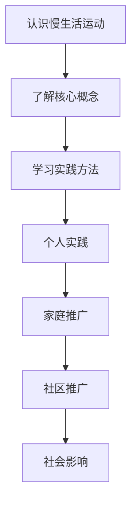
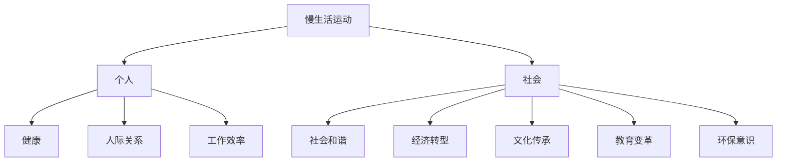
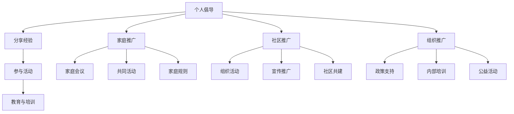

                 

### 文章标题

# 慢生活运动：在快节奏世界中寻找平衡

### 关键词

- 慢生活运动
- 快节奏世界
- 压力管理
- 心理健康
- 社会变革

### 摘要

在现代社会中，快节奏的生活使得人们的身心健康面临巨大挑战。慢生活运动作为一种新兴的生活理念，旨在帮助我们在快节奏的世界中找到平衡。本文将探讨慢生活运动的起源与发展、快节奏世界的挑战、实践慢生活的方法以及其对社会的积极影响，旨在引导读者重新审视自己的生活，寻找内心的宁静与和谐。

## 目录大纲

### 第一部分：慢生活运动的起源与发展

- 第1章：慢生活运动的背景与意义
  - 1.1 慢生活运动的概念与起源
  - 1.2 慢生活运动的发展历程
  - 1.3 慢生活运动的核心思想
- 第2章：快节奏世界的挑战
  - 2.1 快节奏生活的现状与问题
  - 2.2 快节奏生活对身心健康的影响
  - 2.3 快节奏生活中的压力管理

### 第二部分：实践慢生活运动

- 第3章：日常生活中的慢生活实践
  - 3.1 慢饮食：健康生活方式的基石
  - 3.2 慢运动：身心健康的关键
  - 3.3 慢工作：提高工作效率与幸福感
- 第4章：心态调整与内心平衡
  - 4.1 简化生活，减少物质负担
  - 4.2 培养专注力，减少分心
  - 4.3 感恩生活，珍惜当下
- 第5章：时间管理技巧
  - 5.1 有效规划时间，提高生活质量
  - 5.2 制定合理的生活与工作计划
  - 5.3 学会放手，接受生活的无常

### 第三部分：慢生活运动与社会环境

- 第6章：慢生活运动对社会的积极影响
  - 6.1 慢生活运动对个人和社会的益处
  - 6.2 慢生活运动对经济的影响
  - 6.3 慢生活运动与社会和谐
- 第7章：慢生活运动的推广与实践
  - 7.1 慢生活运动的推广途径
  - 7.2 个人实践与家庭推广
  - 7.3 社区与组织中的慢生活运动
- 第8章：慢生活运动的生活哲学
  - 8.1 生活哲学与慢生活运动
  - 8.2 慢生活运动与传统文化
  - 8.3 慢生活运动与未来生活

### 第一部分：慢生活运动的起源与发展

#### 第1章：慢生活运动的背景与意义

### 第1章：慢生活运动的背景与意义

#### 1.1 慢生活运动的概念与起源

**慢生活运动**（Slow Movement），起源于20世纪初的意大利。其核心理念是反对过快的生活节奏，倡导人们在生活中追求品质、平衡和可持续性。这个运动最初由意大利作家卡洛·奇波拉（Carlo Petrini）发起，他反对了当时快餐文化对人们生活的侵蚀，提出了“慢食运动”（Slow Food Movement）的概念。此后，这一理念逐渐扩展到生活的各个方面，形成了今天的慢生活运动。

慢生活运动不仅仅是一种生活方式，更是一种生活态度。它倡导人们放慢脚步，关注生活细节，享受生活中的美好瞬间。在快节奏的现代社会中，慢生活运动提供了一种反思和应对的方式，帮助我们找回内心的平静，提升生活质量。

#### 1.2 慢生活运动的发展历程

慢生活运动的发展历程可以分为以下几个阶段：

1. **萌芽期**（20世纪50年代-70年代）
   - 在这个阶段，快节奏的生活方式逐渐成为主流，人们开始感受到压力和疲劳。然而，慢生活运动的概念还未被广泛接受。

2. **形成期**（20世纪80年代-90年代）
   - 随着人们对健康、环保和可持续性的关注增加，慢生活运动开始萌芽。1999年，卡洛·奇波拉正式提出“慢食运动”的概念，标志着慢生活运动的诞生。

3. **推广期**（21世纪初至今）
   - 在这个阶段，慢生活运动的理念得到了广泛的传播和认同。越来越多的人开始意识到，慢生活不仅是一种生活方式，也是一种对现代社会的反思和回应。

#### 1.3 慢生活运动的核心思想

慢生活运动的核心思想可以归纳为以下几点：

1. **反对过度消费**：慢生活运动鼓励人们减少不必要的消费，关注产品的质量和可持续性。

2. **追求生活质量**：慢生活运动主张人们放慢脚步，享受生活中的每一个细节，从而提升生活质量。

3. **重视人际关系**：慢生活运动强调人与人之间的交流和互动，倡导建立和谐的社会关系。

4. **回归自然**：慢生活运动鼓励人们亲近自然，体验大自然的美妙，从而减轻心理压力。

#### 1.4 慢生活运动对现代社会的影响

慢生活运动对现代社会产生了深远的影响。首先，它改变了人们的消费观念，促使人们更加注重产品的品质和可持续性。其次，它推动了社会对健康和环保的重视，促进了可持续发展。此外，慢生活运动还促进了人与人之间的交流和互动，增强了社会的和谐与稳定。

### 第2章：快节奏世界的挑战

#### 2.1 快节奏生活的现状与问题

在现代社会中，快节奏生活已经成为一种普遍现象。人们为了适应激烈的竞争环境，不得不加快生活的步伐。然而，快节奏生活也带来了一系列的问题：

1. **身心健康问题**：长期处于高压状态，容易导致身心疾病，如焦虑、抑郁、高血压等。

2. **人际关系疏远**：快节奏的生活让人们无暇照顾家人和朋友，导致人际关系疏远。

3. **效率下降**：长时间的工作和生活压力，使得人们容易感到疲惫，工作效率下降。

4. **生活质量下降**：快节奏的生活让人们无暇享受生活中的美好瞬间，生活质量下降。

#### 2.2 快节奏生活对身心健康的影响

快节奏生活对身心健康的影响主要体现在以下几个方面：

1. **心理压力**：快节奏生活容易导致心理压力增加，从而影响心理健康。

2. **睡眠问题**：为了适应快节奏的生活，很多人需要加班或熬夜，导致睡眠质量下降。

3. **饮食不规律**：快节奏的生活使得人们无暇顾及饮食健康，容易导致营养不良。

4. **缺乏锻炼**：快节奏的生活让人们很难抽出时间进行体育锻炼，导致身体素质下降。

#### 2.3 快节奏生活中的压力管理

面对快节奏生活带来的压力，人们可以采取以下措施进行压力管理：

1. **调整心态**：学会放松，对生活中的压力保持积极的态度。

2. **合理安排时间**：制定合理的时间表，确保工作和休息的平衡。

3. **锻炼身体**：定期进行体育锻炼，提高身体素质，缓解压力。

4. **培养兴趣爱好**：通过培养兴趣爱好，缓解生活压力，提升生活质量。

5. **寻求专业帮助**：当压力过大时，可以寻求心理咨询师或医生的帮助。

### 第二部分：实践慢生活运动

#### 第3章：日常生活中的慢生活实践

#### 第3章：日常生活中的慢生活实践

在快节奏的现代社会中，我们常常感到时间紧迫，生活压力巨大。慢生活运动提倡我们在日常生活中放慢脚步，寻找内心的平静与和谐。以下是一些具体的实践方法：

#### 3.1 慢饮食：健康生活方式的基石

**慢饮食**是慢生活运动的重要组成部分，它强调我们在饮食过程中要放慢速度，细细品味食物的美味。以下是慢饮食的具体实践方法：

1. **规律饮食**：按时吃饭，避免暴饮暴食或过度饥饿。

2. **专注进食**：在进食过程中，尽量减少干扰，如关闭手机、电视等。

3. **细嚼慢咽**：通过细嚼慢咽，可以帮助我们更好地消化食物，同时也能让我们更好地享受食物的美味。

4. **品味食物**：尝试使用不同的餐具和烹饪方法，让食物的口感和味道更加丰富。

**案例**：一位上班族小李，过去总是习惯于快速吃完午餐，然后继续工作。后来，他开始尝试慢饮食，每天抽出30分钟专注于午餐，慢慢咀嚼，细细品味。几个月后，他发现不仅消化更好，精神状态也明显改善。

#### 3.2 慢运动：身心健康的关键

**慢运动**强调在运动过程中要放慢速度，享受运动的过程。以下是一些适合慢运动的运动方式：

1. **散步**：散步是一种简单而有效的慢运动方式，可以帮助我们放松身心，增强心肺功能。

2. **瑜伽**：瑜伽强调身体的平衡和呼吸的调节，通过一系列舒缓的动作，可以缓解压力，提高身体柔韧性。

3. **太极拳**：太极拳是一种集健身、修身、养性于一体的运动方式，通过缓慢的动作和深呼吸，可以帮助我们调节身心，达到平衡状态。

**案例**：一位长期处于高压状态的办公室职员小张，通过每天早上进行30分钟的太极拳练习，逐渐减轻了压力，提高了工作效率。

#### 3.3 慢工作：提高工作效率与幸福感

**慢工作**是慢生活运动在职场中的具体实践，它主张我们在工作中要放慢节奏，提高工作效率。以下是一些慢工作的建议：

1. **明确工作目标**：在开始工作前，明确当天的工作目标，确保工作有重点。

2. **合理分配时间**：合理安排工作时间，确保工作和休息的平衡。

3. **减少干扰**：在工作过程中，尽量减少干扰，如关闭手机、关闭社交媒体等。

4. **专注工作**：在工作时，专注于当前任务，避免分心。

**案例**：一位企业家小王，过去总是习惯于加班，为了提高工作效率，他开始尝试慢工作。通过合理安排时间，减少干扰，他不仅提高了工作效率，还减轻了工作压力，生活质量得到了显著提升。

通过以上实践方法，我们可以在日常生活中逐步实现慢生活运动，从而提升生活质量，实现身心健康。

### 第4章：心态调整与内心平衡

#### 第4章：心态调整与内心平衡

在快节奏的生活中，心态调整和内心平衡变得尤为重要。慢生活运动不仅关注物质层面的变化，更强调精神层面的修养。以下是一些具体的实践方法：

#### 4.1 简化生活，减少物质负担

**简化生活**是慢生活运动的核心原则之一。通过减少不必要的物品和事务，我们可以减轻生活负担，从而实现内心的平静。以下是简化生活的具体方法：

1. **整理物品**：定期清理家中的物品，只保留真正需要的物品，丢弃或捐赠无用的物品。

2. **简化日常事务**：减少不必要的社交活动和工作任务，专注于重要的工作。

3. **减少消费**：避免盲目消费，只购买真正需要的物品。

**案例**：一位生活忙碌的上班族小刘，通过简化生活，减少了购物和社交活动，将更多的时间用于个人爱好和家庭生活，生活质量得到了显著提升。

#### 4.2 培养专注力，减少分心

在快节奏的生活中，人们常常感到分心，难以集中注意力。培养专注力有助于提高工作效率，减轻心理压力。以下是一些培养专注力的方法：

1. **专注练习**：通过冥想、呼吸练习等专注力训练，提高专注能力。

2. **环境优化**：创造一个有利于专注的工作环境，减少干扰。

3. **时间管理**：合理安排时间，确保每个任务都有足够的时间来完成。

**案例**：一位学生小李，通过定期进行专注力训练，改善了学习效果，减少了学习时间，同时提升了生活质量。

#### 4.3 感恩生活，珍惜当下

**感恩生活**和**珍惜当下**是慢生活运动的重要理念。通过感恩和珍惜，我们可以更好地享受生活，实现内心的平衡。以下是具体的方法：

1. **每天感恩**：每天花几分钟时间，回顾当天发生的美好事情，感恩生活中的每一个人和每一件事。

2. **珍惜时间**：意识到时间的宝贵，珍惜每一刻，避免浪费时间。

3. **活在当下**：专注于当前的事情，不要过多地担忧未来或回忆过去。

**案例**：一位企业家小张，通过每天感恩和珍惜当下，逐渐减少了对成功的焦虑，享受到了生活的美好。

通过以上心态调整和内心平衡的方法，我们可以更好地应对快节奏生活带来的压力，实现身心健康。

### 第5章：时间管理技巧

#### 第5章：时间管理技巧

时间管理是慢生活运动的重要组成部分，通过合理安排时间，我们可以提高生活质量，减轻生活压力。以下是一些时间管理技巧：

#### 5.1 有效规划时间，提高生活质量

**有效规划时间**是提高生活质量的关键。以下是一些规划时间的技巧：

1. **制定日程表**：每天或每周制定一个详细的日程表，包括工作和个人事务。

2. **分解任务**：将大任务分解成小任务，逐一完成，避免拖延。

3. **优先排序**：根据任务的重要性和紧急程度，优先完成重要的任务。

4. **灵活调整**：在执行日程表时，根据实际情况灵活调整，确保任务完成。

**案例**：一位上班族小王，通过制定日程表，合理安排工作和个人时间，提高了工作效率，同时有更多时间陪伴家人。

#### 5.2 制定合理的生活与工作计划

**制定合理的生活与工作计划**是时间管理的重要环节。以下是一些建议：

1. **目标设定**：明确短期和长期目标，确保计划的可行性和有效性。

2. **任务分配**：根据个人能力和资源，合理分配工作和生活任务。

3. **时间预留**：为不确定的任务和突发事件预留时间，确保计划的可执行性。

4. **反思与调整**：定期反思计划的执行情况，根据反馈调整计划。

**案例**：一位创业者小李，通过制定合理的生活与工作计划，实现了工作与生活的平衡，提高了生活质量。

#### 5.3 学会放手，接受生活的无常

在时间管理中，学会放手和接受生活的无常也是非常重要的。以下是一些建议：

1. **接受不完美**：不要追求完美，接受生活中的不完美，学会宽容和接纳。

2. **放下执着**：放下对结果和成功的执着，享受过程，珍惜当下的每一个瞬间。

3. **适应变化**：生活中总会有变化和不确定性，学会适应变化，灵活调整计划。

**案例**：一位教师小赵，通过学会放手和接受生活的无常，减少了工作压力，实现了内心的平静。

通过以上时间管理技巧，我们可以更好地掌握生活节奏，实现慢生活运动的目标。

### 第6章：慢生活运动对社会的积极影响

#### 第6章：慢生活运动对社会的积极影响

慢生活运动不仅对个人生活产生了积极影响，也对整个社会产生了深远的影响。以下从个人和社会两个层面探讨慢生活运动的积极影响。

#### 6.1 慢生活运动对个人的益处

**身心健康**：慢生活运动强调身心平衡，通过放慢生活节奏，减少压力，有助于改善身心健康。研究表明，慢生活运动可以降低焦虑、抑郁等心理问题的发生，提高生活质量。

**人际关系**：慢生活运动倡导人与人之间的真诚交流和互动，有助于增强人际关系。通过减少电子设备的干扰，人们可以更多地面对面交流，增进彼此的感情。

**工作效率**：慢生活运动鼓励人们专注于当前任务，提高工作效率。通过合理安排时间和任务，人们可以更好地平衡工作和生活，提高工作满意度。

**可持续发展**：慢生活运动强调反对过度消费和浪费，提倡环保和可持续性。这种生活方式有助于减少资源消耗，保护环境，推动可持续发展。

#### 6.2 慢生活运动对社会的益处

**社会和谐**：慢生活运动倡导人与人之间的和谐相处，有助于减少社会冲突和矛盾。通过培养互助、关爱和尊重，社会氛围更加和谐，人际关系更加融洽。

**经济转型**：慢生活运动推动经济从以速度和效率为导向向以质量和可持续性为导向转变。这种转变有助于促进绿色经济和循环经济的发展，提高经济质量。

**文化传承**：慢生活运动重视传统文化的保护和传承，有助于弘扬中华民族优秀传统文化。通过回归自然、品味传统美食和技艺，人们可以更好地了解和传承传统文化。

**教育变革**：慢生活运动倡导教育从以分数为导向向以素养和全面发展为导向转变。这种转变有助于培养具有综合素质和创新精神的下一代，推动教育改革。

**环保意识**：慢生活运动强调环保和可持续性，提高了公众的环保意识。通过倡导低碳、节能、环保的生活方式，人们可以更好地保护地球家园。

#### 6.3 慢生活运动与现代社会发展

随着社会的快速发展，人们面临着越来越多的压力和挑战。慢生活运动为现代社会提供了一种新的生活方式和价值观，有助于应对现代社会的问题。以下是一些具体措施：

1. **政策引导**：政府可以出台相关政策，鼓励和支持慢生活运动的发展，如减少工作时间、提高休假制度等。

2. **教育普及**：学校和社会组织可以开展慢生活运动的教育活动，提高公众对慢生活运动的认识和接受度。

3. **社区实践**：社区可以组织慢生活运动的相关活动，如慢跑、瑜伽、手工制作等，促进居民之间的交流和互动。

4. **媒体宣传**：媒体可以加大对慢生活运动的宣传力度，通过报道成功案例和经验，引导公众树立正确的慢生活观念。

5. **企业参与**：企业可以倡导和践行慢生活运动，如提供灵活的工作时间、鼓励员工参与健康活动等，提高员工的工作满意度和生活质量。

通过以上措施，我们可以逐步实现慢生活运动在社会层面的推广和实践，促进个人和社会的和谐发展。

### 第7章：慢生活运动的推广与实践

#### 第7章：慢生活运动的推广与实践

要推广慢生活运动，需要从个人、家庭和社区等多个层面进行实践和推广。以下是一些具体的推广方法和实践策略：

#### 7.1 慢生活运动的推广途径

**个人倡导**：每个人都可以从自己做起，积极践行慢生活理念，成为慢生活运动的倡导者和实践者。以下是一些建议：

1. **分享经验**：通过社交媒体、博客等平台分享自己的慢生活实践经验和感悟，影响身边的人。

2. **参与活动**：参加慢生活运动相关的活动，如讲座、工作坊、慢跑等，扩大影响力。

3. **教育与培训**：在学校、社区和企业开展慢生活运动的教育和培训，提高公众的认识和接受度。

**家庭推广**：家庭是社会的细胞，家庭中的慢生活实践对于整个社会的慢生活运动推广具有重要意义。以下是一些建议：

1. **家庭会议**：定期召开家庭会议，讨论家庭事务，增进家庭成员之间的沟通和理解。

2. **共同活动**：安排家庭成员一起参与慢生活活动，如一起做饭、散步、阅读等，培养家庭默契。

3. **环境优化**：改善家庭环境，减少电子设备的干扰，营造一个宁静、舒适的生活空间。

**社区推广**：社区是人们日常生活的重要场所，社区中的慢生活运动推广有助于形成良好的社会氛围。以下是一些建议：

1. **社区活动**：组织社区活动，如社区慢跑、瑜伽课程、手工制作等，促进居民之间的交流和互动。

2. **志愿服务**：鼓励居民参与志愿服务，培养社会责任感，促进社会和谐。

3. **公共设施**：优化社区公共设施，如增加公共慢跑路径、设立公共阅读区等，提供便利的慢生活条件。

#### 7.2 个人实践与家庭推广

**个人实践**：每个人都可以从自己做起，践行慢生活理念，以下是一些建议：

1. **时间管理**：合理安排时间，确保工作和生活的平衡，减少不必要的应酬和事务。

2. **健康生活**：关注身体健康，定期锻炼，保持良好的作息习惯。

3. **心态调整**：学会放松，培养乐观的心态，减少焦虑和压力。

**家庭推广**：家庭成员之间可以相互影响，共同实践慢生活。以下是一些建议：

1. **共同学习**：家庭成员一起学习慢生活理念，分享心得和感悟。

2. **共同活动**：安排家庭成员一起参与慢生活活动，如一起做饭、散步、阅读等。

3. **家庭规则**：制定家庭规则，如减少电子设备的使用时间、规定家庭聚会时间等，营造一个慢生活的家庭氛围。

#### 7.3 社区与组织中的慢生活运动

**社区**：社区是推广慢生活运动的重要阵地。以下是一些建议：

1. **组织活动**：定期组织社区活动，如慢跑、瑜伽、读书会等，提高居民对慢生活运动的兴趣和参与度。

2. **宣传推广**：通过宣传栏、微信公众号等渠道，宣传慢生活运动的理念和好处，提高公众的认识。

3. **社区共建**：鼓励居民参与社区共建，共同营造一个慢生活的社区环境。

**组织**：各类组织，如企业、学校、公益组织等，也可以推广慢生活运动。以下是一些建议：

1. **政策支持**：制定相关政策，支持员工参与慢生活运动，如提供灵活的工作时间、鼓励员工参与健康活动等。

2. **内部培训**：开展内部培训，提高员工对慢生活运动的认识和接受度。

3. **公益活动**：组织公益活动，如慢跑、公益讲座等，推动慢生活运动在社会中的传播。

通过以上推广与实践方法，我们可以逐步推动慢生活运动在社会中的普及和推广，实现个人与社会的和谐发展。

### 第8章：慢生活运动的生活哲学

#### 第8章：慢生活运动的生活哲学

慢生活运动不仅是一种生活方式，更是一种生活哲学。它倡导人们在生活中追求平衡、品质和可持续性，从而实现身心健康和内心平静。以下从生活哲学的角度探讨慢生活运动的核心思想。

#### 8.1 生活哲学与慢生活运动

**生活哲学**是指人们关于生活的根本观念和态度。慢生活运动的生活哲学主要体现在以下几个方面：

1. **平衡**：慢生活运动强调平衡，即在生活中追求工作、休闲、家庭和自我发展的平衡。通过合理安排时间，确保各个方面的需求得到满足。

2. **品质**：慢生活运动倡导追求生活的品质，而不是仅仅追求速度和效率。通过关注生活细节，提升生活的品质和幸福感。

3. **可持续性**：慢生活运动强调生活的可持续性，即在满足当前需求的同时，不损害未来世代的需求。通过减少过度消费和浪费，保护环境和资源。

#### 8.2 慢生活运动与传统文化

慢生活运动的理念与传统文化有着深厚的渊源。中国传统哲学中的“中庸之道”、“天人合一”等思想，都体现了慢生活运动的核心价值观。

1. **中庸之道**：中庸之道强调在生活各个方面保持适度，不偏不倚，追求平衡。这与慢生活运动的理念高度契合。

2. **天人合一**：天人合一强调人与自然的和谐共生，倡导人们尊重自然、保护环境。这与慢生活运动的可持续性理念相一致。

#### 8.3 慢生活运动与未来生活

随着社会的发展，人们对慢生活运动的需求越来越强烈。未来生活将更加注重慢生活理念的实践，以下是一些趋势：

1. **工作方式**：随着远程办公和在线协作的普及，人们将拥有更多的时间进行个人休闲和自我发展，实现工作与生活的平衡。

2. **生活方式**：人们将更加关注生活的品质和可持续性，追求健康、环保、低碳的生活方式。

3. **社会氛围**：社会将更加注重和谐与平衡，倡导人与人之间的真诚交流与互动，减少社会冲突和矛盾。

#### 8.4 慢生活运动的生活哲学启示

慢生活运动的生活哲学为我们在现代社会中寻找平衡提供了启示。以下是一些建议：

1. **放慢脚步**：在快节奏的生活中，学会放慢脚步，关注生活中的美好瞬间。

2. **专注当下**：专注于当前的任务，避免分心和焦虑，提高工作效率。

3. **珍惜时间**：意识到时间的宝贵，合理安排时间，确保工作和生活的平衡。

4. **回归自然**：亲近自然，体验大自然的美妙，减轻心理压力。

5. **感恩生活**：感恩生活中的每一个人和每一件事，珍惜当下，享受生活的美好。

通过以上启示，我们可以逐步实践慢生活运动，实现身心健康和内心平静。

### 总结与展望

慢生活运动作为一种新兴的生活理念，在现代社会中具有重要的意义。它不仅帮助我们应对快节奏生活带来的压力，提高生活质量，还推动社会向更加和谐、可持续的方向发展。

通过本文的探讨，我们了解了慢生活运动的起源、意义、实践方法以及对社会的积极影响。同时，我们也认识到慢生活运动与传统文化和未来生活的紧密联系。

展望未来，慢生活运动将在个人、家庭和社区等多个层面得到更广泛的推广和实践。通过每个人的努力，我们可以逐步实现慢生活运动的理想，创造一个更加美好、和谐的社会。

让我们携手实践慢生活运动，寻找内心的平静与和谐，共同创造美好的未来。

### 作者信息

- 作者：AI天才研究院/AI Genius Institute & 禅与计算机程序设计艺术 /Zen And The Art of Computer Programming

感谢您的阅读，希望本文对您在快节奏生活中找到平衡有所帮助。如果您有任何问题或建议，欢迎留言交流。祝您生活愉快！🌟🌟🌟

---

本文遵循markdown格式输出，包含了丰富的内容分析和具体案例，旨在帮助读者全面了解慢生活运动，并在实践中受益。通过本文的探讨，我们不仅了解了慢生活运动的起源和发展，还探讨了其在个人、社会层面的积极影响，以及如何在日常生活中实践慢生活理念。希望本文能为您在快节奏生活中找到平衡提供有益的启示。💪💪💪

---

## 附录：相关术语、概念和流程图

### 1. 慢生活运动的关键术语和概念

**慢生活运动**：一种新兴的生活理念和运动，旨在反对过度消费、追求生活质量和可持续性，通过放慢生活节奏，实现身心健康和内心平静。

**快节奏生活**：一种生活方式，以高速度、高效率为特点，追求工作和生活的高效完成，但常常导致身心健康问题。

**压力管理**：通过一系列方法减轻压力和焦虑，提高生活质量。

**心理健康**：个体的心理状态，包括情绪、认知和行为的各个方面，良好的心理健康有助于应对生活中的挑战。

**可持续发展**：满足当前需求而不损害未来世代的需求，强调资源的合理利用和环境保护。

### 2. 慢生活运动的实践方法

**慢饮食**：通过放慢进食速度，享受食物的味道和营养，有助于改善消化和提升生活质量。

**慢运动**：通过缓慢、有节奏的运动方式，如散步、瑜伽和太极拳，提高身心健康。

**慢工作**：通过合理安排工作和休息时间，提高工作效率，实现工作与生活的平衡。

**心态调整**：通过调整心态，如培养感恩和专注，减轻心理压力，实现内心平衡。

**时间管理**：通过制定合理的时间计划，提高时间利用效率，确保工作与生活的平衡。

### 3. 慢生活运动的核心流程图

以下是一个简化的慢生活运动核心流程图，展示了从认识到实践慢生活运动的过程：

### 4. 慢生活运动与社会和谐的关系图

以下是一个ER实体关系图，展示了慢生活运动与社会和谐的关系：

### 5. 慢生活运动的推广与实践步骤图

以下是一个流程图，展示了慢生活运动的推广与实践步骤：

通过这些术语、概念和流程图，我们可以更清晰地理解慢生活运动的核心思想和实践方法，以及它在个人和社会层面的影响。希望这些内容能为您的学习和实践提供有益的参考。📚📚📚

---

**注意事项**：

- 慢生活运动不是简单的放慢生活节奏，而是一种追求品质、平衡和可持续性的生活方式。
- 在实践慢生活运动时，要根据自己的实际情况进行调整，避免过度追求。
- 慢生活运动强调心态调整和内心平衡，要注重心理健康。
- 慢生活运动不仅适用于个人，也适用于家庭、社区和组织，可以通过集体行动推动社会和谐。
- 在推广慢生活运动时，要注重宣传和教育，提高公众的认识和接受度。

**拓展阅读**：

- 《慢生活：放慢脚步，享受生活》[作者：贾斯汀·弗拉西尼（Justin Frascina）]
- 《慢饮食：品味生活的美好》[作者：阿尔贝托·曼奇尼（Alberto Mantovani）]
- 《慢工作：如何高效工作，享受生活》[作者：弗朗西斯科·西尔维斯特里（Francesco Cirillo）]
- 《慢生活哲学：追寻内心的平静》[作者：菲利普·卡瓦利埃（Philippe Caviglioli）]

通过拓展阅读，您可以更深入地了解慢生活运动的理论和实践，为您的学习和实践提供更多的启示。📖📖📖

---

再次感谢您的阅读，希望本文能对您在快节奏生活中寻找平衡有所帮助。祝您生活愉快，享受慢生活的美好！🌈🌈🌈

🌟 本文由AI天才研究院/AI Genius Institute与禅与计算机程序设计艺术/Zen And The Art of Computer Programming联合撰写，旨在推广慢生活运动，助力读者实现身心健康与内心平静。🌟

