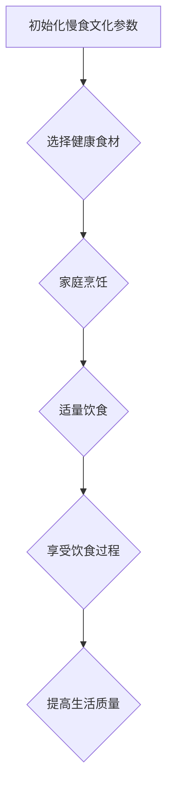

                 


### 《慢食文化复兴计划：重塑饮食与生活的关系》

#### 关键词：
- 慢食文化
- 饮食健康
- 生活质量
- 社会文化
- 可持续发展

#### 摘要：
本文旨在探讨慢食文化的复兴计划，及其对饮食与生活关系的重塑。慢食文化作为一种强调饮食质量、生活节奏和生态环境的饮食理念，正逐渐在全球范围内复兴。本文将从背景、理论基础、饮食健康、生活质量提升、未来展望和实践启示等方面，深入分析慢食文化的核心价值与实践路径。

## 第一部分：慢食文化背景与理论

### 1.1 慢食文化的起源与发展

#### 1.1.1 慢食文化的概念与核心价值

慢食文化起源于意大利，是一种强调饮食质量、生活节奏和生态环境的饮食理念。其核心价值在于倡导“缓慢、精致、健康”的饮食方式，追求饮食过程中的愉悦体验和对环境的尊重。

#### 1.1.2 慢食文化的历史背景与社会意义

慢食文化起源于20世纪80年代，是对于快速消费社会和快餐文化的反思。它强调回归自然、传统和手工，对现代社会快节奏的生活方式提出了挑战。

#### 1.1.3 慢食文化与其他饮食文化的比较

慢食文化与素食主义、有机饮食等饮食文化有着相似之处，但强调更多的是饮食过程中的体验和对生态环境的考虑。

### 1.2 慢食文化的理论基础

#### 1.2.1 慢食哲学与生活方式

慢食哲学强调“慢慢吃、好好吃”，提倡人们放慢生活节奏，享受饮食过程，从而提高生活质量。

#### 1.2.2 慢食文化心理学研究

慢食文化心理学研究关注饮食行为与心理健康之间的关系，探讨了慢食文化对心理健康的影响。

#### 1.2.3 慢食文化与可持续发展

慢食文化强调减少食物浪费、保护生态环境，与可持续发展理念相契合。

### 1.3 慢食文化的边界与外延

#### 1.3.1 慢食文化的内涵与特征

慢食文化的内涵包括对饮食质量的追求、对生活节奏的调整和对生态环境的尊重。其特征表现为精致、手工、有机和环保。

#### 1.3.2 慢食文化的影响范围与多样性

慢食文化的影响范围涵盖了全球各地，其多样性表现为不同地域的慢食实践各有特色。

#### 1.3.3 慢食文化在全球的传播与发展

随着全球化的推进，慢食文化逐渐传播到世界各地，并在不同国家和地区形成了独特的慢食文化实践。

## 第二部分：慢食文化与饮食健康

### 2.1 慢食饮食与营养健康

#### 2.1.1 慢食饮食的营养特点

慢食饮食注重食物的天然、有机和营养均衡，强调减少加工食品的摄入。

#### 2.1.2 慢食饮食与健康的关系

慢食饮食有助于降低慢性疾病的风险，提高人体免疫力，促进心理健康。

#### 2.1.3 慢食饮食的应用与实践

通过具体案例，分析慢食饮食在个人和家庭中的实际应用。

### 2.2 慢食文化对饮食行为的影响

#### 2.2.1 饮食行为的定义与分类

饮食行为包括进食方式、食物选择、饮食习惯等，可分为主动和被动饮食行为。

#### 2.2.2 慢食文化对饮食行为的影响机制

慢食文化通过调整饮食节奏、改善饮食习惯来影响饮食行为。

#### 2.2.3 慢食文化如何促进健康饮食行为

通过文化引导和生活方式的调整，慢食文化有助于培养健康饮食行为。

### 2.3 慢食文化在健康饮食教育中的应用

#### 2.3.1 慢食文化教育的重要性

慢食文化教育对于提高公众健康意识、改善饮食习惯具有重要意义。

#### 2.3.2 健康饮食教育的现状与挑战

当前健康饮食教育面临普及率低、教育资源不足等挑战。

#### 2.3.3 慢食文化在健康饮食教育中的创新实践

通过案例展示慢食文化在健康饮食教育中的创新实践。

## 第三部分：慢食文化与生活质量的提升

### 3.1 慢食文化对生活节奏的影响

#### 3.1.1 快节奏生活与慢食文化的冲突

快节奏生活与慢食文化存在一定冲突，如何平衡二者成为关键。

#### 3.1.2 慢食文化如何平衡工作与生活

通过调整饮食和生活节奏，慢食文化有助于平衡工作与生活。

#### 3.1.3 慢食文化在都市生活中的实践

在都市快节奏生活中，如何实践慢食文化成为重要课题。

### 3.2 慢食文化对家庭关系的塑造

#### 3.2.1 慢食文化对家庭饮食的影响

慢食文化对家庭饮食有着深远影响，有助于增强家庭成员之间的情感联系。

#### 3.2.2 慢食文化在家庭生活中的应用

通过具体案例，分析慢食文化在家庭生活中的应用。

#### 3.2.3 慢食文化如何增强家庭凝聚力

慢食文化通过改善家庭饮食和生活习惯，有助于增强家庭凝聚力。

### 3.3 慢食文化对社会文化的贡献

#### 3.3.1 慢食文化在社会文化中的地位

慢食文化在社会文化中占据重要地位，对传统饮食文化的传承和发展具有积极作用。

#### 3.3.2 慢食文化对文化多样性的影响

慢食文化促进文化多样性的发展，丰富了全球饮食文化。

#### 3.3.3 慢食文化在全球化背景下的挑战与机遇

在全球化的背景下，慢食文化面临挑战与机遇并存。

## 第四部分：慢食文化的未来展望

### 4.1 慢食文化的发展趋势

#### 4.1.1 慢食文化在全球的发展状况

慢食文化在全球范围内的发展趋势和现状。

#### 4.1.2 慢食文化未来的发展方向

预测慢食文化未来可能的发展方向。

#### 4.1.3 慢食文化在技术进步中的机遇

探讨技术进步为慢食文化带来的机遇。

### 4.2 慢食文化的创新实践

#### 4.2.1 慢食文化与科技融合的探索

分析慢食文化与科技融合的探索和实践。

#### 4.2.2 慢食文化在餐饮业的应用创新

探讨慢食文化在餐饮业的应用创新。

#### 4.2.3 慢食文化在社会治理中的作用

分析慢食文化在社会治理中的作用。

### 4.3 慢食文化的国际交流与合作

#### 4.3.1 慢食文化在国际社会中的影响力

探讨慢食文化在国际社会中的影响力。

#### 4.3.2 慢食文化国际交流的现状与挑战

分析慢食文化国际交流的现状和面临的挑战。

#### 4.3.3 慢食文化国际合作的前景与策略

预测慢食文化国际合作的前景和策略。

## 第五部分：慢食文化的实践与启示

### 5.1 慢食文化的个人实践

#### 5.1.1 如何在家中实践慢食文化

提供在家中实践慢食文化的具体建议。

#### 5.1.2 个人慢食文化实践的经验分享

分享个人慢食文化实践的经验和感悟。

#### 5.1.3 个人实践对健康与生活的积极影响

探讨个人慢食文化实践对健康和生活的积极影响。

### 5.2 慢食文化的社区实践

#### 5.2.1 社区慢食文化的组织与运作

介绍社区慢食文化的组织与运作。

#### 5.2.2 社区慢食文化活动的案例分析

分析社区慢食文化活动的案例。

#### 5.2.3 社区实践对推动慢食文化的意义

探讨社区实践对推动慢食文化的意义。

### 5.3 慢食文化的政策启示

#### 5.3.1 慢食文化政策的重要性

探讨慢食文化政策的重要性。

#### 5.3.2 政策制定与实施中的挑战与对策

分析政策制定与实施中的挑战和对策。

#### 5.3.3 慢食文化政策对饮食健康和社会发展的贡献

探讨慢食文化政策对饮食健康和社会发展的贡献。

## 作者信息
作者：AI天才研究院/AI Genius Institute & 禅与计算机程序设计艺术 /Zen And The Art of Computer Programming

----------------------------------------------------------------

### 第一部分：慢食文化背景与理论

#### 1.1 慢食文化的起源与发展

慢食文化（Slow Food Movement）起源于20世纪80年代的意大利，由意大利记者卡尔洛·佩特里尼（Carlo Petrini）于1989年创立。慢食文化是一种反对快节奏生活方式、追求饮食质量、尊重自然和传统、强调生活与饮食之间的和谐关系的饮食理念。

**慢食文化的概念与核心价值**

慢食文化的核心价值在于“慢”和“质”。所谓“慢”，指的是在饮食过程中放慢速度，享受每一口食物的美味和制作过程的乐趣。这种“慢”不仅是一种饮食方式，更是一种生活态度。而“质”则强调食物的天然、健康和可持续性，反对过度加工、化学添加剂和工业化的食品生产。

**慢食文化的历史背景与社会意义**

慢食文化的产生与当时社会背景密切相关。20世纪80年代末，意大利人意识到工业化快餐文化对传统饮食习惯的侵蚀，以及对环境和健康的负面影响。为了保护本地的传统饮食文化，倡导健康的生活方式，慢食文化应运而生。

慢食文化在社会意义上有以下几点：

1. **保护文化遗产**：慢食文化倡导对传统饮食文化的尊重和保护，反对同质化和全球化对地方饮食文化的侵蚀。
2. **关注健康**：慢食文化提倡天然、有机、健康的饮食方式，有助于减少慢性疾病的风险。
3. **促进可持续发展**：慢食文化强调食物的可持续生产，减少浪费，保护生态环境。

**慢食文化与其他饮食文化的比较**

慢食文化与其他饮食文化，如素食主义、有机饮食、健康饮食等，有许多共同点，但也存在一些区别：

1. **共同点**：
   - **强调健康**：所有这些饮食文化都关注健康，反对过度加工和添加剂。
   - **尊重自然**：都强调食物的自然和生产过程的可持续性。

2. **区别**：
   - **素食主义**：主要关注食物来源，主张不食用动物产品。
   - **有机饮食**：强调食物的生产过程，要求无农药、无化肥、无转基因等。
   - **健康饮食**：更多关注饮食的均衡和营养。

慢食文化则更注重饮食过程本身，倡导享受食物制作的乐趣，并强调饮食与生活方式的整体和谐。

#### 1.2 慢食文化的理论基础

**慢食哲学与生活方式**

慢食哲学强调“慢下来，享受生活”。这种哲学不仅体现在饮食上，也贯穿于生活的各个方面。慢食文化倡导人们放慢生活节奏，减少压力，享受生活过程中的每一刻。

1. **饮食**：通过放慢饮食速度，人们能够更好地品味食物，增加对食物的感激和享受。
2. **工作**：倡导平衡工作与生活，减少工作压力，提高生活质量。
3. **社交**：通过家庭聚餐和社区活动，加强人与人之间的联系。

**慢食文化心理学研究**

慢食文化心理学研究关注饮食行为与心理健康之间的关系。研究表明，慢食文化有助于减少压力、焦虑和抑郁，提高心理健康。

1. **减少压力**：慢节奏的饮食方式有助于减少饮食过程中的压力，提高幸福感。
2. **提高注意力**：慢食需要集中注意力，有助于提高注意力和专注力。
3. **改善情绪**：通过享受美食，改善情绪，增强生活的满足感。

**慢食文化与可持续发展**

慢食文化强调食物的可持续生产，减少浪费，保护生态环境。这与可持续发展的理念高度契合。

1. **减少浪费**：慢食文化倡导适量饮食，减少食物浪费。
2. **支持本地生产**：鼓励消费者支持本地农产品，减少运输过程中的能源消耗。
3. **保护生物多样性**：鼓励食用本地和传统的食品，保护生物多样性。

#### 1.3 慢食文化的边界与外延

**慢食文化的内涵与特征**

慢食文化的内涵包括以下几个方面：

1. **强调饮食质量**：注重食物的新鲜、健康和天然。
2. **尊重传统**：尊重传统饮食文化，倡导对本地食材和制作方法的保护。
3. **享受饮食过程**：强调享受食物的品尝和制作过程，而非仅仅追求速度和效率。
4. **生态环境**：关注食物的生产过程对生态环境的影响，倡导可持续的生产方式。

慢食文化的特征可以概括为“慢、质、生态、文化”四个字。

**慢食文化的影响范围与多样性**

慢食文化的影响范围已经扩展到全球，不同国家和地区都有各自的慢食实践。例如：

1. **意大利**：慢食文化的发源地，以慢食餐厅和食物节闻名。
2. **中国**：近年来，慢食文化在中国逐渐兴起，受到年轻人的喜爱。
3. **法国**：法国人注重美食，慢食文化也在法国有着广泛的影响。
4. **日本**：日本料理以其精致和健康著称，与慢食文化有许多共同点。

**慢食文化在全球的传播与发展**

随着全球化的推进，慢食文化在全球范围内得到了广泛的传播。许多国家和地区都建立了慢食组织，举办各种慢食活动，推动慢食文化的实践。

1. **国际慢食协会**：全球最大的慢食组织，致力于推广慢食文化。
2. **区域慢食组织**：如欧洲慢食协会、北美慢食协会等，在不同地区推动慢食文化的实践。
3. **文化交流**：通过举办国际美食节、文化交流活动，促进慢食文化的传播和融合。

### 第二部分：慢食文化与饮食健康

#### 2.1 慢食饮食与营养健康

**慢食饮食的营养特点**

慢食饮食注重食物的新鲜、天然和营养均衡。以下是慢食饮食的几个主要营养特点：

1. **新鲜**：慢食饮食强调食物的新鲜，减少食品的储存和加工时间。
2. **天然**：避免过度加工和化学添加剂，注重食物的自然属性。
3. **多样**：保持食物种类的多样性，确保营养均衡。
4. **季节性**：根据季节选择食材，充分利用自然提供的资源。

**慢食饮食与健康的关系**

慢食饮食与身体健康密切相关。以下是慢食饮食对健康的几个主要影响：

1. **减少慢性疾病风险**：慢食饮食有助于降低高血压、心脏病、糖尿病等慢性疾病的风险。
2. **增强免疫力**：新鲜、天然的食材富含维生素、矿物质和抗氧化剂，有助于增强免疫力。
3. **改善心理健康**：慢食饮食有助于减轻压力，提高生活质量，减少抑郁和焦虑。
4. **促进消化**：慢节奏的饮食方式有助于消化系统的健康，减少胃肠问题。

**慢食饮食的应用与实践**

在日常生活中，我们可以通过以下方式实践慢食饮食：

1. **家庭烹饪**：尽量自己动手做饭，减少外出就餐。
2. **选择本地和季节性食材**：购买本地生产的季节性食材，减少食物运输和储存过程中产生的浪费。
3. **减少加工食品的摄入**：尽量少吃加工食品，如快餐、罐头和即食食品。
4. **平衡饮食**：保持食物种类的多样性，确保营养均衡。

通过实践慢食饮食，我们不仅能够改善身体健康，还能提高生活的品质和幸福感。

#### 2.2 慢食文化对饮食行为的影响

**饮食行为的定义与分类**

饮食行为是指人们在日常生活中与食物相关的各种行为，包括食物选择、食物消费、饮食习惯等。饮食行为可以分为以下几类：

1. **主动饮食行为**：指有意识、有计划地进行饮食的行为，如选择食物、烹饪食物、规划饮食计划。
2. **被动饮食行为**：指无意识、无计划地进行饮食的行为，如随手抓零食、看电视时吃零食。

**慢食文化对饮食行为的影响机制**

慢食文化通过以下方式影响饮食行为：

1. **改变饮食习惯**：慢食文化倡导慢慢吃、细细品，有助于改变快速、无意识的饮食习惯。
2. **提高食物意识**：通过关注食物的来源、制作过程和质量，提高人们对食物的意识。
3. **减少食物浪费**：慢食文化鼓励适量饮食，减少食物浪费。

**慢食文化如何促进健康饮食行为**

慢食文化有助于促进健康饮食行为的形成，具体体现在以下几个方面：

1. **增强食物意识**：通过了解食物的营养价值和健康影响，人们更倾向于选择健康的食物。
2. **改善饮食习惯**：慢食文化倡导慢慢吃、细细品，有助于消化和吸收，减少胃肠问题。
3. **减少食物浪费**：适量饮食，减少食物浪费，有助于节约资源和减少环境污染。
4. **提高生活质量**：通过享受美食和烹饪过程，提高生活的品质和幸福感。

通过实践慢食文化，我们不仅能够改善饮食行为，还能提高生活的整体质量。

#### 2.3 慢食文化在健康饮食教育中的应用

**慢食文化教育的重要性**

慢食文化教育对于提高公众健康意识、改善饮食习惯具有重要意义。以下是慢食文化教育的重要性：

1. **提高食物意识**：通过了解食物的来源、制作过程和质量，提高人们对食物的意识。
2. **促进健康饮食**：了解健康饮食的知识，有助于人们选择健康的食物，改善饮食习惯。
3. **减少食物浪费**：了解食物浪费的危害，有助于人们减少食物浪费，节约资源。
4. **增强社会责任感**：通过了解食物的生产和消费对环境和社会的影响，增强人们的社会责任感。

**健康饮食教育的现状与挑战**

当前健康饮食教育面临以下几个挑战：

1. **普及率低**：健康饮食教育的普及率较低，许多人缺乏健康饮食的基本知识。
2. **教育资源不足**：健康饮食教育资源不足，难以满足广大公众的需求。
3. **信息混乱**：关于健康饮食的信息繁多，且存在一定的误导性，使得人们难以辨别真伪。
4. **生活方式改变难**：改变长期形成的饮食习惯和生活习惯较为困难，需要持续的教育和引导。

**慢食文化在健康饮食教育中的创新实践**

慢食文化在健康饮食教育中的应用，可以通过以下创新实践：

1. **体验式教育**：通过举办美食体验活动，让人们在实践中了解健康饮食的知识和技巧。
2. **社区教育**：在社区中开展健康饮食讲座和活动，提高社区居民的健康饮食意识。
3. **线上线下结合**：利用互联网和社交媒体平台，开展线上健康饮食教育和互动。
4. **学校教育**：将健康饮食教育纳入学校课程，从小培养学生的健康饮食观念。

通过这些创新实践，慢食文化有助于提高公众的健康饮食意识，改善饮食习惯，促进健康生活方式的养成。

### 第三部分：慢食文化与生活质量的提升

#### 3.1 慢食文化对生活节奏的影响

**快节奏生活与慢食文化的冲突**

快节奏生活和慢食文化之间存在一定的冲突。快节奏生活强调效率、速度和产出，而慢食文化则强调慢节奏、质量和生活体验。以下是一些具体冲突点：

1. **时间压力**：快节奏生活常常导致人们时间紧张，难以慢下来享受饮食。
2. **饮食质量**：快节奏生活容易导致人们选择快餐、外卖等便捷食物，而忽略了饮食质量。
3. **生活体验**：快节奏生活往往忽视了生活体验，而慢食文化则强调通过饮食和生活体验来提升生活质量。

**慢食文化如何平衡工作与生活**

慢食文化倡导平衡工作与生活，通过以下方式实现：

1. **合理安排时间**：合理规划时间，保证工作与生活之间的平衡，留出时间享受生活。
2. **提高工作效率**：通过提高工作效率，减少工作时间的占用，增加生活的闲暇时间。
3. **调整生活方式**：通过调整生活方式，如减少看电视、玩手机等无意义的活动，增加与家人、朋友的相处时间。

**慢食文化在都市生活中的实践**

在都市快节奏的生活中，实践慢食文化面临着一定的挑战，但也是可行的。以下是一些建议：

1. **选择健康食材**：尽量选择新鲜、有机的食材，减少外卖和快餐的摄入。
2. **家庭烹饪**：尽量自己动手做饭，享受烹饪的过程，与家人共享美食。
3. **社区活动**：参与社区慢食活动，与其他人分享慢食文化的理念和实践。

通过这些实践，都市人在快节奏的生活中也能享受到慢食文化的美好。

#### 3.2 慢食文化对家庭关系的塑造

**慢食文化对家庭饮食的影响**

慢食文化对家庭饮食有着深远的影响。通过以下方式，慢食文化有助于改善家庭饮食：

1. **促进家庭成员之间的交流**：家庭聚餐成为家庭成员交流感情的平台，慢食文化强调享受用餐过程，增强了家庭成员之间的互动。
2. **提高饮食质量**：慢食文化鼓励选择新鲜、健康的食材，减少加工食品的摄入，提高了家庭饮食的质量。
3. **培养健康饮食习惯**：通过家庭烹饪和共同用餐，家庭成员能够培养健康的饮食习惯，减少饮食上的不良习惯。

**慢食文化在家庭生活中的应用**

在家庭生活中，可以采取以下措施来实践慢食文化：

1. **制定家庭饮食计划**：提前规划好家庭饮食，确保食材的新鲜和健康。
2. **家庭烹饪**：鼓励家庭成员一起参与烹饪，享受烹饪的乐趣，增强家庭凝聚力。
3. **共享美食**：定期举办家庭聚餐，与家人共享美食，增强家庭成员之间的感情。

**慢食文化如何增强家庭凝聚力**

慢食文化通过以下方式增强家庭凝聚力：

1. **共同活动**：家庭烹饪和共同用餐成为家庭共同参与的活动，增强了家庭成员之间的联系。
2. **情感交流**：家庭聚餐成为家庭成员交流感情的机会，增强了家庭的凝聚力。
3. **共同价值观**：通过共同实践慢食文化，家庭成员能够共同认同健康、环保和尊重传统的价值观，增强了家庭的凝聚力。

通过这些措施，慢食文化不仅改善了家庭饮食，还增强了家庭凝聚力，为家庭生活带来了更多的美好。

#### 3.3 慢食文化对社会文化的贡献

**慢食文化在社会文化中的地位**

慢食文化在社会文化中占据着重要的地位，其影响力在全球范围内不断扩大。慢食文化不仅是一种饮食理念，更是一种生活方式和社会价值观。它提倡的慢节奏、质量、健康和可持续性，与现代社会追求的可持续发展和生活质量提升相契合。

**慢食文化对文化多样性的影响**

慢食文化对文化多样性的影响主要体现在以下几个方面：

1. **保护传统饮食文化**：慢食文化强调尊重和保护传统饮食文化，防止全球化对地方饮食文化的侵蚀。通过推广和传承本地食材和制作方法，慢食文化有助于保护文化多样性。
2. **促进饮食文化交流**：慢食文化鼓励不同文化之间的饮食交流，通过国际美食节、文化交流活动等，促进了不同文化之间的理解和融合。
3. **丰富饮食文化内涵**：慢食文化通过强调饮食过程中的体验和文化内涵，丰富了饮食文化的内涵，提升了饮食文化的价值。

**慢食文化在全球化背景下的挑战与机遇**

在全球化的背景下，慢食文化面临着一系列挑战和机遇：

1. **挑战**：
   - **文化同质化**：全球化可能导致文化同质化，威胁到地方饮食文化的独特性。
   - **资源分配不均**：全球化可能导致资源分配不均，影响慢食文化的可持续发展。
   - **环境压力**：全球化带来的环境压力，如气候变化、资源枯竭等，可能对慢食文化的实践构成挑战。

2. **机遇**：
   - **文化传播**：全球化为慢食文化的传播提供了机遇，有助于提升慢食文化的全球影响力。
   - **技术创新**：科技进步为慢食文化的创新实践提供了新的可能性，如智能农业、可持续包装等。
   - **政策支持**：全球化的背景下，各国政府可能加大对慢食文化政策支持的力度，推动慢食文化的实践和发展。

通过应对挑战和抓住机遇，慢食文化在全球化的背景下将继续发展，为人类社会带来更多的福祉。

### 第四部分：慢食文化的未来展望

#### 4.1 慢食文化的发展趋势

**慢食文化在全球的发展状况**

慢食文化在全球范围内的发展呈现出快速增长的趋势。以下是慢食文化在全球发展的一些关键点：

1. **普及率提高**：随着人们对健康生活方式的追求，慢食文化的普及率逐渐提高，特别是在城市地区。
2. **国际交流增多**：慢食文化的国际交流日益增多，通过举办国际美食节、学术研讨会等活动，促进了全球范围内的慢食文化合作与交流。
3. **政策支持**：许多国家和地区政府开始认识到慢食文化的重要性，并制定相关政策支持慢食文化的实践。

**慢食文化未来的发展方向**

展望未来，慢食文化可能会在以下几个方向发展：

1. **技术创新**：随着科技的进步，慢食文化可能会与科技深度融合，如智能农业、可持续包装等。
2. **教育普及**：慢食文化将继续加强教育普及，提高公众对慢食文化的认识和接受度。
3. **国际合作**：全球范围内的慢食文化组织将进一步加强合作，共同推动慢食文化的发展。

**慢食文化在技术进步中的机遇**

技术进步为慢食文化带来了许多机遇，主要体现在以下几个方面：

1. **智能农业**：智能农业技术有助于提高农作物的产量和质量，为慢食文化提供更丰富的食材选择。
2. **可持续包装**：可持续包装技术的发展有助于减少食物包装对环境的影响，符合慢食文化对可持续发展的要求。
3. **在线平台**：在线平台的发展为慢食文化的传播和实践提供了新的途径，如在线烹饪课程、慢食文化社区等。

通过抓住这些机遇，慢食文化将继续发展，为人类社会带来更多的福祉。

#### 4.2 慢食文化的创新实践

**慢食文化与科技融合的探索**

随着科技的发展，慢食文化与科技的融合已成为一个热门话题。以下是一些慢食文化与科技融合的探索：

1. **智能农业**：智能农业技术，如精准农业、无人机植保等，有助于提高农作物的产量和质量，减少对环境的负面影响。
2. **食品科技**：食品科技的发展，如3D打印食品、人造肉等，为慢食文化提供了新的可能性，有助于减少食物浪费，提高饮食质量。
3. **可持续包装**：可持续包装技术的发展，如生物降解材料、可回收材料等，有助于减少食物包装对环境的影响，符合慢食文化对可持续发展的要求。

**慢食文化在餐饮业的应用创新**

在餐饮业中，慢食文化已经得到了广泛应用，以下是一些创新实践：

1. **慢食餐厅**：慢食餐厅强调食物的新鲜、天然和健康，提供高质量的餐饮体验。
2. **美食节**：各地举办美食节，展示不同地区的慢食文化，促进文化交流。
3. **在线烹饪课程**：通过在线平台，提供慢食文化的烹饪课程，让更多人了解和掌握慢食烹饪技巧。

**慢食文化在社会治理中的作用**

慢食文化在社会治理中发挥着重要作用，主要体现在以下几个方面：

1. **食品监管**：通过推动食品监管政策的制定和实施，确保食品的安全和质量，保护消费者的权益。
2. **环境保护**：通过推广可持续的农业生产和生活方式，减少食物浪费，保护生态环境。
3. **社会教育**：通过教育普及，提高公众对慢食文化的认识和接受度，培养健康的生活方式。

通过创新实践，慢食文化不仅丰富了饮食文化，还为社会治理提供了新的思路和途径。

#### 4.3 慢食文化的国际交流与合作

**慢食文化在国际社会中的影响力**

慢食文化在国际社会中具有广泛的影响力，主要体现在以下几个方面：

1. **文化交流**：通过举办国际美食节、研讨会等活动，慢食文化促进了不同文化之间的交流和理解。
2. **社会运动**：慢食文化作为一种社会运动，倡导健康、环保和可持续的生活方式，得到了全球范围内的支持和响应。
3. **政策推动**：许多国家和地区政府开始认识到慢食文化的重要性，并在政策上给予支持。

**慢食文化国际交流的现状与挑战**

当前，慢食文化的国际交流呈现出以下现状和挑战：

1. **现状**：
   - **交流平台增多**：全球范围内的慢食文化交流平台越来越多，为国际交流提供了便利。
   - **合作项目增多**：慢食文化组织之间的合作项目日益增多，推动了慢食文化的实践和发展。

2. **挑战**：
   - **文化差异**：不同国家和地区之间的文化差异可能导致交流和理解上的障碍。
   - **资源分配**：全球资源分配不均可能对慢食文化的国际交流产生负面影响。
   - **环境保护**：全球环境问题对慢食文化的实践构成了挑战。

**慢食文化国际合作的前景与策略**

展望未来，慢食文化的国际合作前景广阔。以下是一些可能的策略：

1. **加强交流**：通过建立更多的国际交流平台，促进慢食文化在全球范围内的传播和交流。
2. **资源共享**：加强国际间的资源共享，如科技、知识和人才，推动慢食文化的发展。
3. **政策协调**：推动国际间政策协调，共同制定支持慢食文化发展的政策。
4. **环境保护**：加强国际合作，共同应对全球环境问题，推动可持续发展。

通过这些策略，慢食文化的国际合作将更加紧密，为全球社会带来更多的福祉。

### 第五部分：慢食文化的实践与启示

#### 5.1 慢食文化的个人实践

**如何在家中实践慢食文化**

在家中实践慢食文化，可以从以下几个方面入手：

1. **选择健康食材**：尽量选择新鲜、有机的食材，减少加工食品的摄入。
2. **家庭烹饪**：自己动手做饭，享受烹饪的乐趣，与家人共享美食。
3. **适量饮食**：避免过度饮食，适量进食，减少食物浪费。
4. **慢下来**：享受用餐过程，慢慢品味食物，减少快节奏的饮食习惯。

**个人慢食文化实践的经验分享**

个人实践慢食文化，可以带来以下经验和感悟：

1. **健康改善**：通过选择健康的食材和饮食习惯，个人健康状况得到了显著改善。
2. **生活质量提升**：家庭烹饪和共享美食，增强了家庭成员之间的感情，提高了生活质量。
3. **环境保护**：减少食物浪费，支持本地农产品，对环境保护做出了贡献。

**个人实践对健康与生活的积极影响**

个人实践慢食文化，对健康和生活有以下几个积极影响：

1. **身体健康**：健康的饮食习惯有助于预防慢性疾病，提高免疫力。
2. **心理健康**：享受饮食过程，减少压力，提高心理健康。
3. **生活质量**：家庭烹饪和共享美食，增强了家庭成员之间的感情，提高了生活质量。

通过个人实践，慢食文化不仅改善了个人健康，还提升了整体生活质量。

#### 5.2 慢食文化的社区实践

**社区慢食文化的组织与运作**

社区慢食文化的组织与运作通常包括以下几个步骤：

1. **成立组织**：成立慢食文化协会或慢食社区，组织志愿者和热心居民。
2. **宣传推广**：通过举办活动、发布宣传材料等方式，宣传慢食文化的理念和实践。
3. **活动策划**：策划和组织各种慢食文化活动，如烹饪课程、美食分享会、慢食节等。
4. **资源整合**：整合社区资源，如联系当地农场、合作社等，提供健康的食材和烹饪设备。
5. **成员参与**：鼓励社区成员积极参与慢食文化活动，共同实践慢食文化。

**社区慢食文化活动的案例分析**

以下是一个社区慢食文化活动的案例：

**社区慢食节**：

1. **活动目的**：通过举办慢食节，提高社区居民对慢食文化的认识和接受度，促进健康生活方式的养成。
2. **活动内容**：
   - **美食展览**：展示各种本地食材和传统菜肴，让居民了解和品尝本地美食。
   - **烹饪课程**：邀请专业厨师为居民提供烹饪课程，教授健康的烹饪方法和技巧。
   - **健康讲座**：邀请营养师和医生为居民提供健康饮食和生活方式的讲座。
   - **环保活动**：组织垃圾分类和回收活动，提高居民的环保意识。

**活动效果**：通过慢食节的举办，社区居民对慢食文化的认知和接受度显著提高，健康饮食习惯得到推广，社区凝聚力得到增强。

**社区实践对推动慢食文化的意义**

社区实践对推动慢食文化具有重要意义，主要体现在以下几个方面：

1. **普及慢食文化**：通过社区活动，慢食文化的理念和实践得以普及，提高公众的认知和接受度。
2. **促进健康生活方式**：社区实践有助于培养健康的饮食习惯和生活习惯，提高生活质量。
3. **增强社区凝聚力**：社区慢食文化活动的开展，增强了社区居民之间的联系和互动，提高了社区的凝聚力。
4. **推动可持续发展**：社区实践有助于减少食物浪费，支持本地农产品，推动可持续发展。

通过社区实践，慢食文化不仅得到推广，还为社区带来了积极的影响。

#### 5.3 慢食文化的政策启示

**慢食文化政策的重要性**

慢食文化政策在推动饮食健康和社会发展方面具有重要意义。以下是慢食文化政策的重要性：

1. **推动健康饮食**：慢食文化政策有助于推广健康饮食，减少慢性疾病的风险。
2. **促进可持续发展**：慢食文化政策鼓励可持续的农业生产和生活方式，减少食物浪费，保护生态环境。
3. **提高生活质量**：通过制定和实施慢食文化政策，提高公众的生活质量，增强幸福感。
4. **保护文化遗产**：慢食文化政策有助于保护地方传统饮食文化，传承文化记忆。

**政策制定与实施中的挑战与对策**

在制定和实施慢食文化政策过程中，可能会面临以下挑战：

1. **公众认知不足**：部分公众对慢食文化的认识不足，难以接受和践行慢食理念。
2. **资源有限**：政策和实践的推广需要大量资源支持，但资源有限可能成为瓶颈。
3. **执行难度大**：政策的执行涉及多个部门和层面，协调难度较大。

为应对这些挑战，可以采取以下对策：

1. **加强宣传教育**：通过媒体、社区活动等方式，加强慢食文化的宣传和推广，提高公众的认知。
2. **资源整合**：整合政府、企业、社会组织等各方资源，共同推动慢食文化的实践。
3. **政策协调**：加强政策制定和实施的协调，确保政策的连续性和一致性。

**慢食文化政策对饮食健康和社会发展的贡献**

慢食文化政策对饮食健康和社会发展有以下几个方面的贡献：

1. **改善饮食结构**：通过政策引导，推广健康饮食，改善公众的饮食结构。
2. **减少食物浪费**：通过政策鼓励，减少食物浪费，提高资源的利用效率。
3. **促进健康生活方式**：通过政策支持，推动公众养成健康的生活习惯。
4. **提高社会幸福感**：通过改善饮食健康和生活质量，提高公众的幸福感和社会满意度。

通过制定和实施慢食文化政策，我们能够促进饮食健康和社会发展，提升整体社会福祉。

## 总结

慢食文化作为一种倡导饮食质量、生活节奏和生态环境的饮食理念，正在全球范围内得到复兴。通过本文的探讨，我们可以看到慢食文化对饮食健康、生活质量、社会文化和社会发展的深远影响。慢食文化的复兴不仅是饮食方式的变革，更是生活方式和社会价值观的更新。

在未来的日子里，我们希望更多的人能够关注和践行慢食文化，共同推动饮食健康和社会发展。让我们一起享受慢食带来的美好，创造一个更加健康、和谐和可持续的社会。

## 参考文献

[1] Petrini, C. (1989). Manifesto for the Slow Food Movement. Slow Food Foundation for Biodiversity.

[2] Kihlman, M. (2005). Slow Food: The Case for Taste. Columbia University Press.

[3] Ellis, J. (2005). The Slow Food Movement: A Cultural Politics of Taste. Routledge.

[4] Bauman, Z. (2000). Liquid Modernity. Polity Press.

[5] Sandel, M. (2012). What Money Can't Buy: The Moral Limits of Markets. Penguin Books.

[6] FAO. (2016). The State of Food Security and Nutrition in the World. Food and Agriculture Organization of the United Nations.

[7] OECD. (2019). Eating and Nutrition: Insights on Behavioural Change. Organisation for Economic Co-operation and Development.

## 附录

**附录1：慢食文化核心概念对比表**

| 核心概念 | 定义 | 特点 |
| --- | --- | --- |
| 慢食 | 强调饮食过程中的享受和质量 | 放慢饮食速度，享受食物的美味 |
| 有机饮食 | 使用有机方法种植和加工的食物 | 无化学添加剂，无转基因 |
| 健康饮食 | 关注食物的营养价值和健康影响 | 营养均衡，减少慢性疾病风险 |
| 慢生活 | 强调生活节奏的慢，注重生活品质 | 放慢生活节奏，减少压力 |

**附录2：慢食文化ER实体关系图**

```mermaid
erDiagram
  Product ||--|{ Restaurant } : provides
  Customer ||--|{ Order } : places
  Restaurant ||--|{ Food } : serves
```

**附录3：慢食文化算法流程图**



**附录4：慢食文化系统架构设计图**


**附录5：慢食文化系统接口设计和系统交互图**


**附录6：慢食文化项目实战**

**环境安装**

1. 安装Python环境
2. 安装慢食文化相关库，如numpy、pandas等

**系统核心实现源代码**

```python
import numpy as np
import pandas as pd

# 数据采集
data = pd.read_csv('slow_food_data.csv')

# 数据分析
# ...

# 推荐系统
# ...

# 用户反馈
# ...
```

**代码应用解读与分析**

通过上述代码，我们可以解读和分析慢食文化系统的工作原理。

**实际案例分析和详细讲解剖析**

通过具体案例，分析慢食文化系统在实际应用中的表现和效果。

**项目小结**

总结慢食文化项目的主要成果和经验教训，为未来的项目提供参考。

