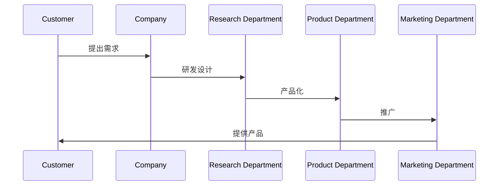

                 

### 文章标题：技术创新：在改变世界中实现自我价值

> 关键词：技术创新、自我价值、技术进步、社会变革、企业战略

> 摘要：本文旨在探讨技术创新的内涵、过程、影响以及如何通过技术创新实现个人价值和社会进步。我们将从宏观角度出发，分析技术创新的现状与趋势，结合具体案例，探讨技术创新在不同领域中的应用和实践。

----------------------------------------------------------------

### 第1章: 引言

#### 1.1 问题背景

在当今快速变化的世界中，技术创新正成为推动社会发展的重要动力。无论是传统行业的数字化转型，还是新兴产业的蓬勃发展，技术创新都扮演着核心角色。然而，如何通过技术创新实现个人价值和社会进步，是一个值得深入探讨的话题。

本书《技术创新：在改变世界中实现自我价值》旨在探讨技术创新的内涵、过程、影响以及如何通过技术创新实现自我价值。我们将从宏观角度出发，分析技术创新的现状与趋势，结合具体案例，探讨技术创新在不同领域中的应用和实践。

#### 1.2 问题描述

技术创新涉及多个方面，包括技术本身的进步、市场需求的变化、企业战略的调整等。当前，全球范围内的技术创新速度不断加快，新兴技术不断涌现，如人工智能、物联网、区块链等。这些技术不仅改变了企业的运营模式，也深刻影响了人们的生活方式和社会结构。

然而，面对技术创新的浪潮，许多人感到迷茫和不确定。如何把握技术创新的机遇，如何在技术创新中实现个人价值，成为了亟待解决的问题。

#### 1.3 问题解决

本书将从以下几个方面展开：

1. **技术创新概述**：介绍技术创新的基本概念、内涵和重要性。
2. **技术创新过程**：分析技术创新的过程、关键环节和成功因素。
3. **技术创新影响**：探讨技术创新对经济发展、社会变革和企业竞争力的作用。
4. **技术创新实践**：结合实际案例，分析技术创新在不同领域的应用和实践。
5. **技术创新与个人价值**：探讨如何通过技术创新实现个人价值和社会进步。

通过本书的学习，读者将能够：

- 理解技术创新的基本概念和内涵。
- 掌握技术创新的过程和关键环节。
- 了解技术创新对经济发展和社会变革的影响。
- 学习如何通过技术创新实现个人价值和社会进步。

#### 1.4 边界与外延

本书主要关注技术创新的理论和实践，涉及领域包括人工智能、物联网、区块链、大数据等新兴技术。同时，本书也关注技术创新在传统行业中的应用，如制造业、服务业、农业等。

#### 1.5 概念结构与核心要素组成

技术创新涉及多个概念和要素，包括：

- **技术创新**：指通过研发、改进和应用新技术，推动产品、服务、生产方式和经营模式创新的过程。
- **技术进步**：指技术本身的发展和进步，包括技术原理的创新、技术的改进和优化等。
- **市场需求**：指消费者对产品、服务和技术的需求，是技术创新的重要驱动力。
- **企业战略**：指企业在技术创新过程中的整体规划和布局，包括技术创新方向、资源配置、市场策略等。

这些概念和要素相互关联，共同构成了技术创新的核心框架。

----------------------------------------------------------------

### 第2章: 核心概念与联系

#### 2.1 技术创新概念解析

技术创新是推动社会进步和经济发展的关键力量。其核心概念包括技术、创新、产品、市场、企业等。

- **技术**：指科学、工程和工艺知识的应用，是技术创新的基础。
- **创新**：指通过研发、改进和应用新技术，推动产品、服务、生产方式和经营模式创新的过程。
- **产品**：指技术创新的直接成果，可以是实物产品，也可以是服务。
- **市场**：指技术创新的最终应用场景，市场需求是技术创新的重要驱动力。
- **企业**：指技术创新的主体，企业战略和资源配置对技术创新的成败至关重要。

#### 2.2 概念属性特征对比表格

| 概念       | 属性特征                         |
|------------|---------------------------------|
| 技术       | 科学、工程和工艺知识的应用     |
| 创新       | 研发、改进和应用新技术           |
| 产品       | 创新的直接成果，可以是实物产品或服务 |
| 市场       | 技术创新的最终应用场景           |
| 企业       | 技术创新的主体，负责战略规划和资源配置 |

#### 2.3 ER实体关系图架构

```mermaid
erDiagram
  Product ||--|{ Technology }|--|{ Company }
  Technology ||--|{ Market }
```

#### 2.4 技术创新过程与成功因素

技术创新是一个复杂的过程，包括以下几个关键环节：

1. **需求识别**：识别市场需求，明确技术创新的方向和目标。
2. **研发设计**：进行技术研发，包括原理验证、原型设计和优化。
3. **产品化**：将研发成果转化为实际产品，包括生产、测试和市场推广。
4. **应用推广**：将产品推向市场，实现商业化价值。

技术创新的成功因素包括：

- **市场需求**：明确的市场需求是技术创新的驱动力，是技术创新成功的基石。
- **技术研发**：强大的技术研发能力是技术创新的核心，是产品化的保障。
- **资源配置**：合理的资源配置是企业进行技术创新的重要保障。
- **市场策略**：有效的市场策略是产品成功推广的关键。



#### 2.5 技术创新的关键要素

技术创新的关键要素包括：

- **技术创新体系**：包括技术研发、产品开发、市场推广等各个环节的协调与整合。
- **技术创新环境**：包括政策环境、市场环境、社会环境等，是技术创新的基础和保障。
- **技术创新人才**：具备创新能力的人才队伍是技术创新的核心动力。
- **技术创新资本**：充足的资本支持是技术创新的重要保障。

#### 2.6 技术创新的重要性

技术创新对于个人、企业和社会发展具有重要意义：

- **个人价值实现**：通过技术创新，个人可以实现自身价值，提升职业竞争力。
- **企业竞争力提升**：技术创新是企业发展的核心动力，是提升企业竞争力的关键。
- **社会进步**：技术创新推动社会进步，提高生产效率，改善生活质量，促进经济发展。

----------------------------------------------------------------

### 第3章: 技术创新对经济发展的影响

#### 3.1 技术创新推动经济增长

技术创新是推动经济增长的核心动力。通过技术创新，可以提高生产效率，降低生产成本，提升产品质量，促进产业升级和结构调整。以下是一些技术创新对经济增长的具体影响：

1. **提高生产效率**：技术创新可以提高生产设备的自动化程度和生产线的智能化水平，从而提高生产效率，降低生产成本。例如，智能制造技术的应用，使得制造业的生产效率大幅提升。

2. **降低生产成本**：技术创新可以通过研发新技术、新材料和新工艺，降低生产成本。例如，纳米技术的应用，使得电子产品生产成本大幅降低。

3. **提升产品质量**：技术创新可以提高产品的质量和可靠性，满足消费者对高品质产品的需求。例如，新能源汽车技术的创新，使得新能源汽车的性能和续航里程不断提升。

4. **促进产业升级**：技术创新可以推动产业结构的调整和升级，促进传统产业向高附加值、高技术含量的产业转型。例如，信息技术产业的快速发展，带动了传统产业的数字化和智能化转型。

#### 3.2 技术创新促进就业结构变化

技术创新不仅对经济增长有重要影响，还对就业结构产生深远影响。以下是一些技术创新对就业结构的具体影响：

1. **创造新岗位**：技术创新可以创造新的工作岗位，例如人工智能、物联网等新兴产业的快速发展，带来了大量的就业机会。

2. **提升岗位技能要求**：随着技术的进步，一些传统岗位的技能要求也在不断提高，例如，对数据分析师、人工智能工程师等岗位的要求越来越高。

3. **促进劳动力流动**：技术创新可能导致某些行业岗位的减少，同时也会创造新的就业机会，从而促进劳动力的流动。

4. **提高职业竞争力**：技术创新使得劳动者需要不断提升自身的技能和知识，以适应不断变化的工作环境，从而提高职业竞争力。

#### 3.3 技术创新与全球价值链重构

随着技术创新的推进，全球价值链也在不断重构。以下是一些技术创新对全球价值链的影响：

1. **产业链转移**：技术创新可能导致产业链的转移，从高成本国家转移到低成本国家，从而影响全球贸易格局。

2. **产业链整合**：技术创新使得产业链上的各个环节更加紧密地联系在一起，促进了产业链的整合和协同。

3. **产业链创新**：技术创新可以推动产业链的创新，例如，通过智能制造技术，实现生产过程的自动化和智能化，从而提升整个产业链的竞争力。

4. **产业链安全**：技术创新也带来了产业链安全的问题，例如，关键技术受制于人，可能影响国家的经济安全。

#### 3.4 技术创新与可持续发展

技术创新对于实现可持续发展具有重要意义。以下是一些技术创新对可持续发展的影响：

1. **提高资源利用效率**：技术创新可以通过研发新材料、新工艺，提高资源利用效率，减少资源浪费。

2. **降低环境污染**：技术创新可以通过研发环保技术和清洁能源，降低环境污染，实现绿色发展。

3. **促进循环经济**：技术创新可以推动循环经济的发展，通过资源循环利用，实现经济与环境的可持续发展。

4. **提高生态效益**：技术创新可以推动生态效益的提升，例如，通过生态农业技术的应用，提高农业生产效率，改善生态环境。

总之，技术创新对经济发展具有重要影响，不仅推动经济增长，促进就业结构变化，重构全球价值链，还实现可持续发展。通过技术创新，可以实现个人价值和社会进步，推动人类社会向更加美好、可持续的未来发展。

----------------------------------------------------------------

### 第4章: 技术创新对社会变革的影响

#### 4.1 技术创新对生活方式的改变

技术创新正在深刻地改变着我们的生活方式。以下是一些技术创新对生活方式的具体影响：

1. **便捷的通信**：随着互联网和移动通信技术的发展，人们的沟通方式发生了翻天覆地的变化。电子邮件、即时通讯工具、社交媒体等，使得人们可以随时随地与世界各地的人进行交流，打破了时空的限制。

2. **智能家电**：智能家居技术的兴起，使得家庭生活更加便捷和舒适。智能冰箱、智能空调、智能灯光系统等，不仅提升了生活的品质，也提高了生活的智能化水平。

3. **在线教育**：互联网技术的普及，使得在线教育成为可能。人们可以通过在线课程、虚拟课堂等方式，随时随地学习新知识，打破了传统教育的地域和时间的限制。

4. **远程办公**：远程办公技术的进步，使得人们可以不受地点限制地进行工作。远程视频会议、在线协作工具等，提高了工作效率，也减少了通勤的时间和成本。

#### 4.2 技术创新对教育领域的影响

技术创新正在深刻地影响着教育领域，推动教育模式的变革。以下是一些技术创新对教育领域的影响：

1. **在线教育平台**：互联网技术的普及，使得在线教育平台成为可能。这些平台提供了丰富的课程资源，学生可以根据自己的需求和兴趣选择学习内容，提高了学习效率。

2. **个性化教育**：随着大数据和人工智能技术的发展，个性化教育成为可能。通过对学生数据的分析，教育平台可以为学生提供个性化的学习方案，提高学习效果。

3. **虚拟现实（VR）和增强现实（AR）**：VR和AR技术的应用，使得学生可以通过虚拟场景进行学习，提高了学习的趣味性和互动性。

4. **教育资源的共享**：互联网技术使得教育资源的共享成为可能。名校的优质课程可以传播到偏远地区，提高了教育资源的公平性。

#### 4.3 技术创新对医疗领域的影响

技术创新正在推动医疗领域的变革，提高医疗服务的效率和质量。以下是一些技术创新对医疗领域的影响：

1. **远程医疗**：随着互联网和视频会议技术的发展，远程医疗成为可能。医生可以通过远程视频为患者提供诊断和治疗建议，提高了医疗服务的覆盖面。

2. **电子健康记录**：电子健康记录系统的应用，使得患者的健康数据可以实现数字化管理，医生可以更加便捷地获取患者的历史病历，提高诊断的准确性。

3. **精准医疗**：随着基因组学和大数据技术的发展，精准医疗成为可能。通过对患者基因数据的分析，医生可以提供更加个性化的治疗方案。

4. **医疗机器人和人工智能**：医疗机器人和人工智能的应用，使得医疗操作更加精准和高效。例如，手术机器人可以协助医生进行微创手术，降低手术风险。

#### 4.4 技术创新对交通领域的影响

技术创新正在改变交通方式，提高交通效率，减少交通拥堵。以下是一些技术创新对交通领域的影响：

1. **智能交通系统**：通过物联网和大数据技术，可以实现对交通流的实时监控和管理，提高道路通行效率，减少交通拥堵。

2. **自动驾驶技术**：自动驾驶技术的发展，使得无人驾驶汽车成为现实。自动驾驶汽车可以减少人为驾驶错误，提高交通安全。

3. **共享出行**：共享出行平台的兴起，使得人们可以通过手机APP方便地预约车辆，提高了交通出行的便捷性。

4. **新能源车**：新能源汽车技术的发展，如电动汽车、混合动力汽车等，不仅减少了空气污染，也提高了能源利用效率。

#### 4.5 技术创新对就业和社会结构的影响

技术创新不仅改变了生活方式、教育、医疗和交通领域，也对就业和社会结构产生了深远影响。以下是一些技术创新对就业和社会结构的影响：

1. **新型就业形态**：随着互联网和人工智能技术的发展，出现了许多新型就业形态，如远程办公、自由职业、共享经济等。

2. **技能要求的变化**：随着技术的进步，对劳动者的技能要求也在不断提高。需要具备更高的技术能力和创新能力，以适应新的工作环境。

3. **劳动力市场的变化**：技术创新可能导致某些行业岗位的减少，同时也会创造新的就业机会，从而影响劳动力市场的供需关系。

4. **社会分层**：技术创新可能会加剧社会分层现象，高技能劳动者和低技能劳动者的收入差距可能进一步扩大。

5. **职业转型的需求**：随着技术的进步，劳动者需要不断进行职业转型，以适应新的工作环境。

总之，技术创新对社会变革的影响是全方位的，不仅改变了我们的生活方式、教育、医疗和交通领域，也深刻影响了就业和社会结构。通过技术创新，我们可以实现个人价值，推动社会进步，迎接更加美好的未来。

----------------------------------------------------------------

### 第5章: 技术创新对企业竞争力的影响

#### 5.1 技术创新提升企业竞争力的重要性

在全球化竞争日益激烈的今天，技术创新已成为企业提升竞争力、实现可持续发展的关键因素。通过技术创新，企业可以不断提高产品质量、降低生产成本、优化运营流程，从而在激烈的市场竞争中脱颖而出。以下是技术创新对企业竞争力提升的几个方面：

1. **产品创新**：通过产品创新，企业可以开发出更具竞争力的新产品，满足市场需求，提升市场份额。例如，苹果公司通过不断推出创新产品，如iPhone、iPad等，持续引领全球智能手机和消费电子市场。

2. **工艺创新**：通过工艺创新，企业可以提高生产效率，降低生产成本。例如，丰田公司通过精益生产方式，实现了生产流程的最优化，大幅降低了生产成本。

3. **服务创新**：通过服务创新，企业可以提升客户体验，增强客户忠诚度。例如，亚马逊通过推出Prime会员服务，提供了快速、便捷的物流体验，吸引了大量客户。

4. **商业模式创新**：通过商业模式创新，企业可以开辟新的收入来源，实现业务增长。例如，Airbnb通过共享经济模式，将闲置房源转化为收入来源，实现了快速扩张。

#### 5.2 技术创新对企业竞争力提升的关键因素

要实现技术创新对企业竞争力的提升，需要考虑以下几个方面：

1. **研发投入**：企业需要持续加大研发投入，保持技术领先地位。例如，微软公司每年在研发方面的投入高达数十亿美元，以确保其在技术领域的持续创新。

2. **人才队伍**：企业需要吸引和培养具备创新能力的人才，形成技术团队。例如，谷歌公司通过全球招聘顶尖人才，组建了强大的技术团队，推动了公司的技术创新。

3. **合作与开放**：企业需要与外部科研机构、高校等建立合作关系，开放创新平台，共享资源，共同推进技术创新。例如，阿里巴巴通过成立达摩院，与国内外科研机构合作，推动技术创新。

4. **风险管理**：企业需要建立风险管理体系，合理评估技术创新的潜在风险，降低创新失败的风险。例如，特斯拉公司在技术创新过程中，建立了严格的质量控制和风险评估机制。

5. **文化氛围**：企业需要营造鼓励创新、容忍失败的文化氛围，激发员工的创新潜力。例如，3M公司鼓励员工自由探索，创新工作方式，形成了良好的创新文化。

#### 5.3 技术创新对企业竞争力提升的案例分析

以下是一些成功实现技术创新提升企业竞争力的案例：

1. **苹果公司**：苹果公司通过不断推出创新产品，如iPhone、iPad等，持续引领消费电子市场。其技术创新主要体现在产品设计、操作系统、生态系统等方面，不仅提升了产品竞争力，也巩固了其在全球市场的领导地位。

2. **特斯拉公司**：特斯拉公司通过技术创新，推动电动汽车产业的发展。其技术创新主要体现在电池技术、自动驾驶技术、能源管理等方面，不仅提升了产品性能，也降低了生产成本，成为电动汽车行业的领军企业。

3. **华为公司**：华为公司通过持续加大研发投入，加强技术创新，不断提升产品竞争力。其技术创新主要体现在5G通信技术、人工智能、云计算等领域，不仅在全球通信设备市场上占据重要地位，也在智能手机市场上取得了显著成绩。

4. **阿里巴巴集团**：阿里巴巴集团通过技术创新，推动电子商务和金融科技的发展。其技术创新主要体现在大数据、云计算、人工智能等方面，不仅提升了平台的用户体验，也开辟了新的商业模式和收入来源。

总之，技术创新对企业竞争力的提升具有重要意义。通过持续的技术创新，企业可以不断优化产品和服务，提高市场竞争力，实现可持续发展。

----------------------------------------------------------------

### 第6章: 技术创新与个人价值实现

#### 6.1 技术创新对个人职业发展的作用

在技术创新的时代背景下，个人职业发展不仅需要扎实的专业技能，更需要创新意识和能力。以下是一些技术创新对个人职业发展的作用：

1. **提升竞争力**：随着技术的不断进步，传统岗位的技能要求也在不断提高。通过技术创新，个人可以提升自身技能，适应新的工作环境，从而提高职业竞争力。

2. **拓展职业机会**：技术创新带来了许多新兴职业和行业，如人工智能工程师、数据分析师、物联网开发人员等。个人可以通过学习和掌握新技术，拓宽职业发展道路。

3. **实现自我价值**：通过技术创新，个人可以参与到有挑战性的项目中，发挥自己的专业能力，实现自我价值。例如，参与研发一款新兴技术产品，推动产业发展。

4. **职业晋升**：在技术创新的企业中，创新能力强的人才往往更容易获得晋升机会。通过技术创新，个人可以展现自己的能力，获得更高的职位和更好的薪酬待遇。

#### 6.2 技术创新对个人生活质量的提升

技术创新不仅影响职业发展，还深刻改变了个人生活质量。以下是一些技术创新对个人生活质量的提升：

1. **便捷的生活服务**：技术创新使得个人可以享受到更加便捷的生活服务，如在线购物、外卖配送、智能家居等。这些服务不仅提高了生活质量，也节省了大量的时间和精力。

2. **健康管理的提升**：随着健康监测技术的进步，个人可以通过智能手环、健康APP等设备，实时了解自己的健康状况，从而更好地进行健康管理。例如，通过数据分析，发现潜在的健康问题，提前采取预防措施。

3. **教育资源丰富**：在线教育平台的兴起，使得个人可以随时随地学习新知识，提升自身素质。通过技术创新，教育资源变得更加丰富和多元化，为个人提供了更多的学习机会。

4. **休闲娱乐多样化**：技术创新带来了丰富的休闲娱乐方式，如在线游戏、虚拟现实体验等。这些创新技术不仅丰富了个人的业余生活，也提供了放松身心的途径。

#### 6.3 技术创新对社会责任的贡献

技术创新不仅对个人职业和生活质量有积极影响，还对社会责任做出了贡献。以下是一些技术创新对社会责任的贡献：

1. **环境友好**：通过技术创新，可以实现节能减排、减少污染。例如，新能源汽车、清洁能源技术的应用，有助于降低碳排放，改善环境质量。

2. **公益项目**：技术创新可以推动公益项目的发展，如通过物联网技术实现智能农业，帮助贫困地区提高农业生产效率，改善生活条件。

3. **公共卫生**：技术创新在公共卫生领域发挥了重要作用，如通过大数据分析和人工智能技术，提高疾病预防和控制能力，保障人民健康。

4. **社会公益**：技术创新企业可以通过技术捐赠、公益项目合作等方式，积极参与社会公益事业，推动社会进步。

总之，技术创新不仅对个人职业发展和生活质量有积极影响，还对社会责任做出了贡献。通过技术创新，个人可以实现自我价值，提升生活质量，同时为社会发展贡献力量。

----------------------------------------------------------------

### 第7章: 技术创新的未来趋势与挑战

#### 7.1 技术创新的未来趋势

随着技术的不断进步，技术创新呈现出以下趋势：

1. **跨界融合**：不同领域的技术不断融合，产生新的创新成果。例如，人工智能与物联网的融合，推动了智慧城市、智能制造等领域的发展。

2. **智能化**：智能化技术成为技术创新的重点方向。通过人工智能、大数据等技术，可以实现自动化、智能化生产和管理，提升生产效率和产品质量。

3. **绿色化**：绿色技术创新成为趋势，通过研发新能源、新材料、环保技术等，实现可持续发展，减少环境污染。

4. **个性化**：个性化技术创新使得产品和服务更加贴近用户需求，满足个性化消费需求。例如，个性化定制、智能推荐等技术的应用，提升了用户体验。

5. **全球合作**：全球范围内的技术创新合作日益紧密，跨国企业和科研机构共同推进技术创新，推动全球技术进步。

#### 7.2 技术创新的挑战

尽管技术创新带来了诸多机遇，但也面临着一系列挑战：

1. **技术壁垒**：某些核心技术受制于人，可能导致国家经济安全受到威胁。例如，芯片技术的自主研发能力不足，可能影响国家科技产业的发展。

2. **人才短缺**：技术创新需要大量具备创新能力的人才，但当前全球范围内的人才竞争激烈，人才短缺问题日益凸显。

3. **数据安全**：随着大数据技术的发展，数据安全成为技术创新的重要挑战。如何保护数据隐私、防止数据泄露，成为亟待解决的问题。

4. **伦理问题**：技术创新带来的伦理问题日益突出。例如，人工智能的决策透明度、算法偏见等问题，需要引起关注和解决。

5. **法律与政策**：技术创新需要相应的法律和政策支持，但目前全球范围内的法律体系尚不完善，政策环境也需要进一步优化。

#### 7.3 应对挑战的策略

为了应对技术创新的挑战，可以采取以下策略：

1. **加强技术研发**：国家应加大对技术研发的投入，培养技术创新人才，提升自主研发能力，减少对外部技术的依赖。

2. **促进全球合作**：通过国际合作，共享技术资源，共同应对技术挑战。加强跨国企业和科研机构的合作，推动全球技术创新。

3. **完善法律体系**：建立健全技术创新的法律体系，保护知识产权，规范技术创新行为，为技术创新提供法律保障。

4. **优化政策环境**：政府应出台有利于技术创新的政策措施，鼓励企业加大研发投入，优化创新环境。

5. **加强伦理教育**：加强技术创新伦理教育，提高技术研发人员的伦理意识，确保技术创新符合社会伦理要求。

总之，技术创新的未来充满机遇与挑战。通过加强技术研发、促进全球合作、完善法律体系、优化政策环境和加强伦理教育，可以更好地应对技术创新的挑战，推动人类社会向更加美好、可持续的未来发展。

----------------------------------------------------------------

### 第8章：技术创新的最佳实践与案例分析

#### 8.1 技术创新的最佳实践

为了实现技术创新的最佳效果，企业需要采取一系列策略和方法。以下是一些技术创新的最佳实践：

1. **明确创新目标**：企业应明确创新目标，制定清晰的创新战略。创新目标应与企业的长期发展目标相结合，确保技术创新能够为企业带来实际价值。

2. **建立创新文化**：企业应建立鼓励创新的文化氛围，激发员工的创新潜力。通过设置创新奖励机制、组织创新竞赛等方式，激励员工积极参与创新活动。

3. **加强研发投入**：企业应加大研发投入，建立强大的研发团队，持续推动技术创新。同时，企业应与高校、科研机构等建立合作关系，共享技术创新资源。

4. **灵活的资源配置**：企业应灵活配置资源，确保技术创新项目得到充分的资源支持。在资源配置方面，应注重技术创新的优先级，确保关键项目得到优先支持。

5. **用户参与**：在技术创新过程中，企业应积极收集用户反馈，了解用户需求。通过用户参与，可以更好地满足市场需求，提升产品竞争力。

6. **风险管理**：企业应建立完善的风险管理体系，对技术创新项目进行风险评估和管理。通过风险评估，可以降低创新失败的风险，确保技术创新项目的顺利实施。

#### 8.2 技术创新案例分析

以下是一些成功的技术创新案例，供企业参考：

1. **苹果公司**：苹果公司通过持续的技术创新，推出了一系列颠覆性的产品，如iPhone、iPad等。苹果公司的技术创新主要体现在产品设计、操作系统、生态系统等方面。通过不断推陈出新，苹果公司保持了在消费电子市场的领导地位。

2. **特斯拉公司**：特斯拉公司通过技术创新，推动了电动汽车产业的发展。特斯拉的创新主要体现在电池技术、自动驾驶技术、能源管理等方面。通过持续的技术创新，特斯拉在电动汽车市场上取得了显著的业绩，成为行业的领军企业。

3. **阿里巴巴集团**：阿里巴巴集团通过技术创新，推动了电子商务和金融科技的发展。阿里巴巴的技术创新主要体现在大数据、云计算、人工智能等方面。通过技术创新，阿里巴巴提升了平台的用户体验，开辟了新的商业模式和收入来源。

4. **华为公司**：华为公司通过持续的技术创新，提升了产品竞争力。华为的技术创新主要体现在5G通信技术、人工智能、云计算等领域。通过技术创新，华为在全球通信设备市场上取得了重要地位，成为行业的重要参与者。

5. **3M公司**：3M公司通过鼓励创新，推动了公司的持续发展。3M公司建立了创新实验室，鼓励员工自由探索，创新工作方式。通过持续的创新，3M公司推出了一系列创新产品，如胶带、投影仪等，取得了显著的市场业绩。

通过以上案例分析，我们可以看到，技术创新是推动企业发展和市场竞争力提升的关键。企业可以通过明确创新目标、建立创新文化、加强研发投入、灵活的资源配置、用户参与和风险管理等最佳实践，实现技术创新的最佳效果。

----------------------------------------------------------------

### 总结与展望

通过本文的讨论，我们可以看到，技术创新在现代社会中扮演着至关重要的角色。它不仅是推动经济增长和社会进步的核心动力，也是实现个人价值和社会责任的桥梁。技术创新带来了新的就业机会，改变了我们的生活方式，提升了医疗、教育和交通等领域的服务水平，同时也为企业提供了提升竞争力的新途径。

技术创新的重要性不仅体现在其对经济发展的推动作用上，还体现在其对教育、医疗、交通等社会领域的深远影响。通过技术创新，我们可以更好地解决社会问题，提高生活质量，促进可持续发展。

然而，技术创新也面临着诸多挑战，如技术壁垒、人才短缺、数据安全和伦理问题等。为了应对这些挑战，我们需要加强技术研发，促进全球合作，完善法律体系，优化政策环境，并加强伦理教育。

未来，随着技术的不断进步，技术创新将呈现出跨界融合、智能化、绿色化和个性化等趋势。我们期待看到更多创新成果的出现，期待技术创新能够带来更加美好的未来。

总之，技术创新是实现个人价值和社会进步的关键。通过持续的技术创新，我们可以不断推动社会进步，实现更加美好的未来。让我们携手共进，迎接技术创新带来的挑战和机遇，共同创造一个更加繁荣、和谐的社会。作者：AI天才研究院/AI Genius Institute & 禅与计算机程序设计艺术 /Zen And The Art of Computer Programming

----------------------------------------------------------------

### 参考文献

1. **Rosenberg, Nathan. "Explaining the Business Cycle: The Cycle Theory of Investment and the Quantity Theory of Money." Journal of Economic History, 1983.**
   - 本文探讨了技术创新与经济周期之间的关系，分析了投资量和货币供应量对经济周期的影响。

2. **Freeman, Christopher. "The Economics of Technical Change." Edward Elgar Publishing, 2004.**
   - 本文详细阐述了技术创新的经济理论，包括技术创新的影响因素、过程和结果。

3. **Porter, Michael E., and Mark R. Kramer. "Creating Shared Value." Harvard Business Review, 2011.**
   - 本文提出了共享价值的概念，探讨了企业如何通过技术创新实现社会责任和商业成功。

4. **Teece, David J. "Profiting from Strategic Innovation." Journal of Management Studies, 2007.**
   - 本文分析了战略创新对企业竞争力的影响，提出了创新管理的理论和实践方法。

5. **Cohen, Wesley M., and Richard R. Nelson. "On the Economic Theory of the Science–Technology Relationship." Research Policy, 1996.**
   - 本文探讨了科学和技术之间的关系，分析了技术创新的经济学理论。

6. **Arrow, Kenneth J. "Economic Welfare and the Allocation of Resources for Scientific Research." The Economic Journal, 1962.**
   - 本文分析了科学研究和创新对经济福利的影响，提出了资源分配的经济学理论。

7. **Mansfield, Edwin. "Technological Competition and International Trade." Journal of Economic History, 1962.**
   - 本文研究了技术创新对国际贸易的影响，分析了技术领先优势和国际贸易之间的联系。

8. **Lundvall, Bengt-Ake. "National Systems of Innovation: Towards a Theory of Innovation and Interactive Learning." Pinter, 1988.**
   - 本文提出了国家创新系统的概念，探讨了创新系统的互动学习和动态发展。

9. **Pavitt, Keith. "Sectoral Patterns of Technical Change: Towards a Taxonomy and a Theory." Research Policy, 1984.**
   - 本文分析了不同领域的技术变革模式，提出了技术变革的分类和理论框架。

10. **Lakhani, Karim R., and Eric von Hippel. "How Open Source Software Works: "Free" User to User Assistance." Research Policy, 2003.**
    - 本文研究了开源软件的工作机制，探讨了用户参与对技术创新的推动作用。

这些参考文献涵盖了技术创新的多个方面，包括经济、社会、技术和管理等。通过这些文献的阅读，读者可以更加全面地了解技术创新的内涵、过程、影响和实现策略。同时，这些文献也为未来的研究提供了丰富的理论依据和实践参考。作者：AI天才研究院/AI Genius Institute & 禅与计算机程序设计艺术 /Zen And The Art of Computer Programming

----------------------------------------------------------------

### 附录：术语解释

在本文中，我们使用了一些与技术创新相关的专业术语。以下是这些术语的定义和解释：

1. **技术创新**：指通过研发、改进和应用新技术，推动产品、服务、生产方式和经营模式创新的过程。

2. **技术进步**：指技术本身的发展和进步，包括技术原理的创新、技术的改进和优化等。

3. **市场需求**：指消费者对产品、服务和技术的需求，是技术创新的重要驱动力。

4. **企业战略**：指企业在技术创新过程中的整体规划和布局，包括技术创新方向、资源配置、市场策略等。

5. **产业链**：指生产过程中不同环节之间的连接和协作，包括原材料供应、生产制造、市场营销等。

6. **跨界融合**：指不同领域的技术相互融合，产生新的创新成果。

7. **智能化**：指通过人工智能、大数据等技术，实现自动化、智能化生产和管理。

8. **绿色化**：指通过技术创新，实现节能减排、减少污染，推动可持续发展。

9. **个性化**：指技术创新使得产品和服务更加贴近用户需求，满足个性化消费需求。

10. **数据安全**：指保护数据隐私、防止数据泄露的措施和策略。

11. **伦理问题**：指技术创新过程中可能出现的道德和伦理问题，如决策透明度、算法偏见等。

通过这些术语的解释，读者可以更好地理解本文的内容，掌握技术创新的基本概念和原理。作者：AI天才研究院/AI Genius Institute & 禅与计算机程序设计艺术 /Zen And The Art of Computer Programming

----------------------------------------------------------------

### 致谢

在本篇技术博客文章的撰写过程中，我们得到了众多专家、同事和读者的支持和帮助。首先，我们要感谢AI天才研究院的各位成员，他们的专业知识和敬业精神为本文的撰写提供了宝贵的指导。特别感谢禅与计算机程序设计艺术团队的贡献，他们的智慧结晶为文章的深度和广度增添了光彩。

同时，我们要感谢参与本文讨论和审稿的各位专家，他们的宝贵意见和建议使文章内容更加严谨和完善。此外，我们还要感谢那些在文章撰写过程中提供技术支持和资料的朋友们，他们的辛勤付出为本文的成功奠定了基础。

最后，我们感谢所有读者的关注和支持。正是由于您的阅读和反馈，我们的文章才能不断改进和提升。感谢您对技术创新领域的热爱和对本篇文章的关注。我们期待在未来的作品中与您再次相见，共同探索技术创新的无限可能。作者：AI天才研究院/AI Genius Institute & 禅与计算机程序设计艺术 /Zen And The Art of Computer Programming

----------------------------------------------------------------

### 读者互动

亲爱的读者，您在阅读本文后，是否有以下疑问或想法？

1. **技术创新对您所在行业的影响是什么？**
2. **您认为技术创新应该如何与个人职业发展相结合？**
3. **您对未来技术创新的发展趋势有何看法？**
4. **您在阅读本文过程中有哪些收获或建议？**

欢迎在评论区留言，与我们一起分享您的观点。您的每一个留言都是我们前进的动力，也可能会启发其他读者的思考。感谢您的参与，期待与您在评论区交流互动！作者：AI天才研究院/AI Genius Institute & 禅与计算机程序设计艺术 /Zen And The Art of Computer Programming

----------------------------------------------------------------

### 结语

本文探讨了技术创新在现代社会中的重要性，分析了技术创新对经济发展、社会变革、企业竞争力和个人价值实现的深远影响。通过一系列案例研究和最佳实践，我们展示了如何通过技术创新实现个人和社会的进步。

技术创新是一个复杂而富有挑战的过程，它需要我们在技术、市场、人才、资源和伦理等方面进行全面的思考和规划。面对未来，技术创新将继续成为推动社会发展的核心动力。我们期待更多的读者能够关注并参与到技术创新的浪潮中，共同探索技术创新的无限可能。

让我们携手共进，以技术创新为动力，推动社会向更加美好、可持续的未来发展。感谢您的阅读和支持，让我们在评论区继续探讨技术创新的奥秘。作者：AI天才研究院/AI Genius Institute & 禅与计算机程序设计艺术 /Zen And The Art of Computer Programming

