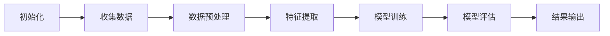
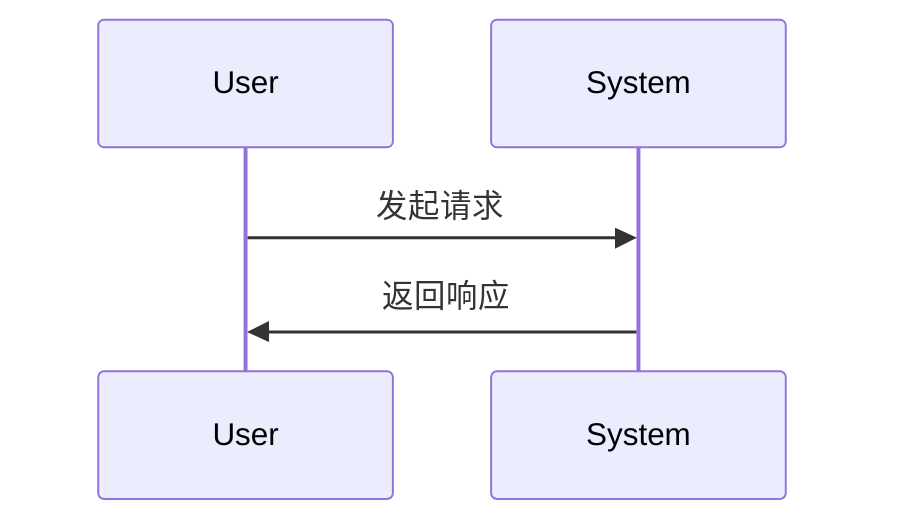
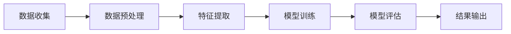

                 

## 拓展生命的广度：多元化体验的重要性

在当今快速变化的世界中，每个人都渴望在有限的生命里探索更多的可能性，实现个人成长和全面发展。然而，人类生命的有限性和单一生存状态的局限，使得这一目标变得更加艰难。于是，多元化体验成为了一个引人注目的解决方案。在本文中，我们将从技术视角出发，深入探讨多元化体验的背景、重要性、核心概念、算法原理以及系统设计与实现，旨在为读者提供一种全新的思考方式和实践路径。

### 关键词
- 多元化体验
- 个人成长
- 社会适应
- 心理健康
- 人工智能

### 摘要
本文首先介绍了多元化体验的背景和重要性，探讨了其在人类生命拓展中的作用。随后，我们深入分析了多元化体验的核心概念及其相互关系，包括多元文化、跨文化交流和体验设计。在此基础上，文章详细讲解了多元化体验算法的基本原理和实际应用，并通过具体的Python代码示例进行了说明。最后，本文提出了一个多元化体验系统的分析与架构设计方案，并给出了一套完整的实战方案。

### 目录大纲

```markdown
----------------------------------------------------------------
# 第一部分: 生命的广度拓展

## 第1章: 多元化体验的背景与重要性

### 第1.1节: 人类社会的发展趋势

#### 1.1.1 人类社会的发展趋势

#### 1.1.2 个体生命的局限与挑战

#### 1.1.3 多元化体验的需求

### 第1.2节: 多元化体验的定义与边界

#### 1.2.1 多元化体验的概念

#### 1.2.2 多元化体验的分类

#### 1.2.3 多元化体验的限制与挑战

### 第1.3节: 多元化体验的重要性

#### 1.3.1 增强个人成长与发展

#### 1.3.2 提高社会适应能力

#### 1.3.3 促进心理健康与幸福感

### 第1.4节: 多元化体验的现实挑战与机遇

#### 1.4.1 文化差异的挑战

#### 1.4.2 经济资源的限制

#### 1.4.3 社会支持系统的构建

## 第二部分: 多元化体验的核心概念与联系

## 第2章: 多元化体验的核心概念与联系

### 第2.1节: 核心概念介绍

#### 2.1.1 多元文化

#### 2.1.2 跨文化交流

#### 2.1.3 体验设计

### 第2.2节: 概念属性特征对比

#### 2.2.1 多元文化特征对比

#### 2.2.2 跨文化交流特征对比

#### 2.2.3 体验设计特征对比

### 第2.3节: ER实体关系图架构

```mermaid
erDiagram
  A[多元化体验] {
    B[文化] {
      R1:RELATES
      R2:DEPENDS
    }
    C[交流] {
      R3:RELATES
      R4:DEPENDS
    }
    D[设计] {
      R5:RELATES
      R6:DEPENDS
    }
  }
```

### 第2.4节: 多元化体验的实际应用场景

#### 2.4.1 教育领域

#### 2.4.2 商业营销

#### 2.4.3 社区建设

## 第三部分: 多元化体验的算法原理与实践

## 第3章: 多元化体验的算法原理与实践

### 第3.1节: 多元化体验算法的基本原理

#### 3.1.1 多元化体验算法的类型

#### 3.1.2 多元化体验算法的核心要素

### 第3.2节: 算法流程与Mermaid流程图



### 第3.3节: Python源代码实现

```python
# Python代码实现示例
# 请根据具体需求进行编写
```

### 第3.4节: 算法原理详细讲解与举例说明

#### 3.4.1 数学模型

$$
f(x) = \frac{1}{1 + e^{-x}}
$$

#### 3.4.2 举例说明

### 第3.5节: 实际应用案例

#### 3.5.1 研究背景

#### 3.5.2 数据收集与处理

#### 3.5.3 模型训练与评估

## 第四部分: 多元化体验的系统分析与架构设计

## 第4章: 多元化体验的系统分析与架构设计

### 第4.1节: 问题场景介绍

#### 4.1.1 多元化体验系统的目标

#### 4.1.2 多元化体验系统的功能需求

### 第4.2节: 项目介绍

#### 4.2.1 项目背景

#### 4.2.2 项目目标

#### 4.2.3 项目实施过程

### 第4.3节: 系统功能设计

#### 4.3.1 领域模型

```mermaid
classDiagram
  Person <<Class>> {
    name : String
    age : Integer
    happiness : Float
  }
  Experience <<Class>> {
    type : String
    duration : Integer
    impact : Float
  }
  Person *--* Experience : had
```

### 第4.4节: 系统架构设计

#### 4.4.1 系统架构设计

### 第4.5节: 系统接口设计

#### 4.5.1 接口设计与实现

### 第4.6节: 系统交互

#### 4.6.1 系统交互设计



## 第五部分: 项目实战

## 第5章: 多元化体验项目实战

### 第5.1节: 环境安装

#### 5.1.1 环境准备

#### 5.1.2 软件安装

### 第5.2节: 系统核心实现

#### 5.2.1 系统核心模块设计

#### 5.2.2 源代码实现

### 第5.3节: 代码应用解读与分析

#### 5.3.1 代码解读

#### 5.3.2 分析与优化

### 第5.4节: 实际案例分析

#### 5.4.1 案例背景

#### 5.4.2 案例分析与解读

### 第5.5节: 项目小结

#### 5.5.1 项目总结

#### 5.5.2 经验与反思

## 第六部分: 最佳实践与拓展阅读

## 第6章: 最佳实践与拓展阅读

### 第6.1节: 最佳实践

#### 6.1.1 多元化体验策略

#### 6.1.2 持续学习与成长

### 第6.2节: 拓展阅读

#### 6.2.1 相关书籍推荐

#### 6.2.2 学术论文推荐

## 第七部分: 小结

### 第7章: 小结

#### 7.1 主题回顾

#### 7.2 未来展望

----------------------------------------------------------------
```

## 第一部分：生命的广度拓展

### 第1章：多元化体验的背景与重要性

#### 1.1 人类社会的发展趋势

随着全球化的深入发展，人类社会正经历着前所未有的变革。信息技术的迅猛发展、交通网络的不断扩展以及跨国贸易的日益频繁，使得不同国家和文化之间的交流越来越便捷。这种趋势不仅改变了人们的生活方式，也极大地丰富了人类的生活体验。

首先，信息技术的进步极大地提升了信息的传播速度和范围。互联网和社交媒体的普及，使得人们可以随时随地获取来自世界各地的信息，拓宽了视野和认知边界。同时，在线教育和远程工作的普及，也使得个人能够突破地域限制，接受全球最优质的教育资源和职业机会。

其次，交通网络的不断扩展，使得人们可以更方便地旅行和移民。旅游业的发展，不仅推动了经济增长，也为人们提供了探索新文化和体验不同生活方式的机会。而跨国移民和多元文化的融合，使得社会更加多元和包容。

然而，尽管人类社会在不断发展，个体生命仍然面临着种种局限和挑战。首先，每个人的生命是有限的，如何在有限的时间里实现自我价值和社会贡献，成为一个重要的课题。其次，现代社会的生活节奏加快，压力增大，心理健康问题日益突出。此外，随着科技的进步，人们在享受便利的同时，也面临着信息过载和数字鸿沟等挑战。

#### 1.1.2 个体生命的局限与挑战

个体生命的局限主要体现在以下几个方面：

1. **时间限制**：每个人的生命都是有限的，如何在有限的时间内实现自我价值，成为一个重要的问题。现代社会的快节奏生活使得人们常常感到时间不够用，这给个人的成长和发展带来了压力。

2. **认知局限**：人的认知能力有限，无法在短时间内掌握所有知识和技能。这意味着个体在探索新领域和面对新挑战时，可能会受到认知能力的限制。

3. **社会限制**：社会环境、家庭背景、教育水平等因素也会对个体的成长和发展产生影响。这些限制可能来自于社会的偏见和刻板印象，也可能来自于个体所处的社会地位和经济条件。

#### 1.1.3 多元化体验的需求

面对个体生命的局限和挑战，多元化体验成为了一种重要的解决方案。多元化体验不仅可以帮助个体拓宽视野，增强个人成长，还可以提高社会适应能力，促进心理健康与幸福感。

首先，多元化体验可以帮助个体拓宽视野。通过接触不同文化、尝试不同活动和体验不同生活方式，个体可以更好地理解世界的多样性，从而拓宽自己的认知边界。这种拓宽视野的过程，有助于个体在复杂多变的社会环境中更好地适应和发展。

其次，多元化体验可以增强个人成长。不同的体验可以带来新的知识和技能，促进个体的全面发展。例如，参与不同类型的社交活动可以提高人际交往能力，尝试新的运动项目可以增强身体素质，学习新的艺术形式可以提升审美能力。这些成长不仅有助于个体在职业和生活中取得成功，还可以提高个人的幸福感和生活质量。

再次，多元化体验可以提高社会适应能力。现代社会充满变化和不确定性，个体需要具备较强的适应能力才能应对各种挑战。多元化体验可以帮助个体在不同的环境中快速适应，增强心理韧性和应变能力。

最后，多元化体验可以促进心理健康与幸福感。研究表明，积极的体验和丰富的经历可以显著提高个体的心理健康水平。通过多元化体验，个体可以减少焦虑和压力，增强自尊和自信，从而提高生活质量。

#### 1.2 多元化体验的定义与边界

多元化体验是指个体通过接触不同文化、尝试不同活动和体验不同生活方式，以拓宽视野、增强个人成长和提高社会适应能力为目的的一系列行为和经历。多元化体验可以包括以下几种类型：

1. **文化体验**：通过参观博物馆、艺术展览、文化节庆等活动，了解和体验不同文化的独特魅力。
2. **社交体验**：通过参加社交活动、结交新朋友、参与志愿者工作等方式，拓宽人际交往圈，增强社交能力。
3. **职业体验**：通过实习、兼职、换岗等方式，尝试不同职业和行业，提升职业素养和技能。
4. **艺术体验**：通过学习音乐、绘画、舞蹈等艺术形式，提升审美能力和创造力。
5. **运动体验**：通过参与各种运动项目，增强身体素质，提高心理健康水平。

尽管多元化体验具有诸多益处，但其在实际操作中也存在一定的限制和挑战。首先，多元化体验需要时间和资源的投入。个体可能需要花费大量时间来准备和参与这些体验，同时也需要一定的经济支持。其次，多元化体验可能面临文化差异和沟通障碍。个体在接触不同文化时，可能会遇到文化冲突和沟通困难，这需要个体具备一定的跨文化沟通能力和文化敏感度。此外，多元化体验也可能受到社会支持系统的限制。例如，一些社会环境和政策可能不支持个体进行多元化体验，或者提供的相关资源和机会有限。

#### 1.3 多元化体验的重要性

多元化体验在个人成长和社会发展中的重要性不可忽视。首先，多元化体验有助于增强个人成长。通过接触不同文化和经历，个体可以获得新的知识和技能，提升自身的综合素质。这种多元化的成长路径有助于个体在竞争激烈的社会中脱颖而出。

其次，多元化体验可以提高社会适应能力。现代社会变化迅速，个体需要具备较强的适应能力才能应对各种挑战。多元化体验可以帮助个体在复杂多变的环境中快速适应，增强心理韧性和应变能力。

再次，多元化体验可以促进心理健康与幸福感。研究表明，积极的体验和丰富的经历可以显著提高个体的心理健康水平。通过多元化体验，个体可以减少焦虑和压力，增强自尊和自信，从而提高生活质量。

#### 1.4 多元化体验的现实挑战与机遇

尽管多元化体验具有诸多益处，但在实际操作中也面临一些挑战和限制。首先，文化差异是一个重要的挑战。不同文化之间的价值观、习俗和行为规范可能存在较大差异，个体在接触新文化时可能会遇到文化冲突和沟通障碍。

其次，经济资源也是一个限制因素。多元化体验通常需要一定的经济支持，包括旅行费用、培训费用等。对于经济条件较差的个体来说，这可能成为参与多元化体验的障碍。

此外，社会支持系统也是多元化体验的一个重要影响因素。一个健全的社会支持系统可以为个体提供多元化体验的机会和支持，包括教育资源、职业培训和社交平台等。然而，一些社会环境可能缺乏这样的支持系统，使得个体难以实现多元化体验。

尽管面临这些挑战，多元化体验仍然具有巨大的发展机遇。随着全球化和信息技术的发展，个体接触不同文化的机会越来越多，这为多元化体验提供了广阔的空间。同时，政府和社会组织也越来越重视多元化体验的重要性，提供更多的资源和机会，以促进个体和社会的发展。

### 第2章：多元化体验的核心概念与联系

#### 2.1 核心概念介绍

在探讨多元化体验之前，我们需要了解一些核心概念，这些概念是理解多元化体验的基础。以下是几个关键概念及其简要说明：

**多元文化**：多元文化是指在一个社会中存在多种不同的文化，每种文化都有其独特的价值观、信仰、习俗和传统。多元文化社会强调尊重和包容不同文化，以实现和谐共处。

**跨文化交流**：跨文化交流是指不同文化背景的人之间的交流。这种交流可以发生在不同的文化环境中，也可以在个体之间的互动中。跨文化交流有助于加深对不同文化的理解，促进文化交流与合作。

**体验设计**：体验设计是指为了创造愉悦、有意义和有价值的体验而进行的设计过程。在多元化体验的背景下，体验设计旨在为个体提供丰富多彩、符合其需求和兴趣的体验。

#### 2.1.1 多元文化

多元文化是指在一个社会中存在多种不同的文化，每种文化都有其独特的价值观、信仰、习俗和传统。多元文化社会强调尊重和包容不同文化，以实现和谐共处。多元文化可以带来以下益处：

1. **文化多样性**：多元文化使社会更加多元和丰富，为个体提供了更多的选择和机会。
2. **创新思维**：不同文化的碰撞和融合可以激发创新思维，推动社会进步。
3. **社会和谐**：尊重和包容不同文化，有助于减少社会冲突，实现社会和谐。

然而，多元文化也带来了一些挑战，如文化冲突、文化适应困难等。因此，理解多元文化的本质和重要性，对于实现多元化体验至关重要。

#### 2.1.2 跨文化交流

跨文化交流是指不同文化背景的人之间的交流。这种交流可以发生在不同的文化环境中，也可以在个体之间的互动中。跨文化交流有助于加深对不同文化的理解，促进文化交流与合作。以下是跨文化交流的一些关键特点：

1. **语言障碍**：不同语言的存在可能导致沟通障碍，影响交流效果。
2. **价值观差异**：不同文化的价值观和信仰可能存在显著差异，这可能导致误解和冲突。
3. **非语言交流**：跨文化交流不仅涉及语言，还包括非语言交流，如肢体语言、面部表情和手势等。

有效跨文化交流需要具备以下能力：

1. **文化敏感度**：了解和尊重不同文化的习俗和价值观。
2. **有效沟通技巧**：在交流中注意语言的选择和表达方式，以减少误解和冲突。
3. **开放心态**：以开放和包容的心态接受不同文化，积极寻求共同点。

#### 2.1.3 体验设计

体验设计是指为了创造愉悦、有意义和有价值的体验而进行的设计过程。在多元化体验的背景下，体验设计旨在为个体提供丰富多彩、符合其需求和兴趣的体验。以下是体验设计的关键要素：

1. **用户需求**：了解用户的需求和兴趣，是设计有效体验的基础。
2. **体验质量**：确保体验的质量和连贯性，提升用户满意度。
3. **创新元素**：通过创新元素，如新颖的活动形式、独特的体验内容等，提升体验的吸引力和价值。
4. **反馈机制**：收集用户反馈，不断优化体验设计，提升用户体验。

#### 2.2 概念属性特征对比

为了更好地理解多元文化、跨文化交流和体验设计之间的关系，我们可以通过对比这三个概念的主要属性特征来进行分析。

**多元文化**：

- **文化多样性**：强调不同文化之间的差异和多样性。
- **文化认同**：重视个体对自己文化的认同和传承。
- **文化冲突**：可能导致文化间的误解和冲突。
- **文化融合**：通过交流和互动实现不同文化的融合。

**跨文化交流**：

- **沟通障碍**：由于语言、价值观差异等导致的交流障碍。
- **文化适应**：个体在跨文化环境中适应和融入的难度。
- **文化交流**：促进不同文化间的理解和交流。
- **文化冲突**：可能由于误解和偏见导致的冲突。

**体验设计**：

- **用户需求**：以用户需求和兴趣为核心。
- **体验质量**：确保体验的愉悦性和价值性。
- **创新元素**：通过创新提升体验的独特性和吸引力。
- **反馈机制**：不断优化体验设计，提升用户体验。

**对比表格**：

| 特征               | 多元文化           | 跨文化交流           | 体验设计               |
|--------------------|--------------------|--------------------|--------------------|
| 文化多样性         | 强调文化差异       | 沟通中的文化差异     | 用户需求的多样性       |
| 文化认同           | 重视文化传承       | 个体文化认同的挑战   | 提升体验的质量         |
| 文化冲突           | 可能导致误解和冲突 | 文化适应的挑战       | 创新元素的引入         |
| 文化融合           | 通过交流实现融合   | 促进文化交流与合作   | 反馈机制的应用         |

#### 2.3 ER实体关系图架构

为了更直观地展示多元文化、跨文化交流和体验设计之间的关系，我们可以使用Mermaid绘制一个ER实体关系图。

```mermaid
erDiagram
  A[多元化体验] {
    B[多元文化] {
      R1:RELATES
      R2:DEPENDS
    }
    C[跨文化交流] {
      R3:RELATES
      R4:DEPENDS
    }
    D[体验设计] {
      R5:RELATES
      R6:DEPENDS
    }
  }
```

在这个ER实体关系图中，多元化体验是核心实体，它与多元文化、跨文化交流和体验设计之间存在相互关系。多元文化和跨文化交流是多元化体验的基础，而体验设计则是实现多元化体验的手段。

#### 2.4 多元化体验的实际应用场景

多元化体验在多个领域都有着广泛的应用，以下是其中几个典型的应用场景：

**教育领域**：

多元化体验在教育领域具有重要意义。通过引入多元文化课程和跨文化交流活动，学生可以拓宽视野，了解世界各地的文化，培养跨文化沟通能力。同时，体验设计可以创造丰富的学习体验，提高学生的学习兴趣和参与度。例如，学校可以组织国际文化交流活动，让学生亲自体验不同文化，从而加深对文化的理解和尊重。

**商业营销**：

多元化体验在商业营销中也是一个重要的策略。通过了解不同文化背景的消费者需求，企业可以设计出更具吸引力的产品和营销策略。例如，全球知名品牌在推广产品时，会充分考虑当地文化习俗和消费者偏好，以实现更好的市场表现。同时，体验设计可以创造出独特的品牌体验，增强消费者的品牌忠诚度。

**社区建设**：

多元化体验在社区建设中同样发挥着重要作用。通过组织多样化的社区活动，如文化节庆、社区论坛等，可以促进居民之间的交流和互动，增强社区的凝聚力和归属感。此外，体验设计可以帮助社区更好地满足居民的需求，提高社区服务质量。

### 第3章：多元化体验的算法原理与实践

#### 3.1 多元化体验算法的基本原理

多元化体验算法旨在通过数据分析和机器学习技术，为个体提供定制化的多元化体验方案。这些算法的基本原理包括数据收集、数据预处理、特征提取、模型训练和模型评估等步骤。

**数据收集**：首先，算法需要收集大量与多元化体验相关的数据，如文化信息、用户行为数据、社会环境数据等。这些数据可以从各种来源获取，包括社交媒体、问卷调查、在线平台等。

**数据预处理**：收集到的数据往往是不完整、不干净和有噪声的。因此，数据预处理是确保数据质量的关键步骤。数据预处理包括数据清洗、数据归一化和数据转换等过程，以消除数据中的噪声和异常值，并使数据适合于进一步分析。

**特征提取**：特征提取是数据预处理后的关键步骤，目的是从原始数据中提取出有用的特征，以便用于模型训练。特征提取的方法包括统计分析、机器学习和深度学习等。通过特征提取，算法可以更好地理解和预测个体对多元化体验的需求和偏好。

**模型训练**：模型训练是多元化体验算法的核心步骤，通过使用特征数据和相应的标签数据，训练出一个能够预测个体多元化体验需求的模型。常用的模型包括决策树、支持向量机、神经网络等。

**模型评估**：模型训练完成后，需要对其进行评估，以确定其预测能力和泛化能力。常用的评估指标包括准确率、召回率、F1分数等。通过模型评估，可以确定模型的性能和可靠性，并根据评估结果对模型进行优化和调整。

#### 3.2 算法流程与Mermaid流程图

以下是多元化体验算法的基本流程，以及对应的Mermaid流程图。



在数据收集阶段，算法需要从各种数据源收集与多元化体验相关的数据。数据预处理阶段包括数据清洗、数据归一化和数据转换等过程，以确保数据质量。特征提取阶段从预处理后的数据中提取有用的特征，用于模型训练。模型训练阶段使用特征数据和标签数据训练出一个预测模型。模型评估阶段对训练好的模型进行评估，以确定其性能。最后，根据评估结果，输出预测结果和个性化体验方案。

#### 3.3 Python源代码实现

以下是一个简单的Python代码示例，用于实现多元化体验算法的基本流程。

```python
# Python代码实现示例
import pandas as pd
from sklearn.model_selection import train_test_split
from sklearn.preprocessing import StandardScaler
from sklearn.ensemble import RandomForestClassifier
from sklearn.metrics import accuracy_score

# 数据收集
data = pd.read_csv('diversity_experience_data.csv')

# 数据预处理
data.fillna(data.mean(), inplace=True)
data = data.select_dtypes(include=['int64', 'float64'])

# 特征提取
X = data.drop('label', axis=1)
y = data['label']

# 数据归一化
scaler = StandardScaler()
X_scaled = scaler.fit_transform(X)

# 模型训练
X_train, X_test, y_train, y_test = train_test_split(X_scaled, y, test_size=0.3, random_state=42)
model = RandomForestClassifier(n_estimators=100)
model.fit(X_train, y_train)

# 模型评估
y_pred = model.predict(X_test)
accuracy = accuracy_score(y_test, y_pred)
print(f'Accuracy: {accuracy:.2f}')
```

在这个示例中，我们首先从CSV文件中加载与多元化体验相关的数据。然后，对数据进行预处理，包括填充缺失值和选择合适的特征。接下来，我们使用随机森林分类器进行模型训练，并使用测试数据评估模型性能。

#### 3.4 算法原理详细讲解与举例说明

为了更好地理解多元化体验算法的原理，我们可以进一步详细讲解其数学模型和实际应用。

**数学模型**：

多元化体验算法的数学模型通常是基于分类问题。假设我们有一个二分类问题，目标是预测个体是否喜欢某种多元化体验。我们可以使用以下简单的线性回归模型进行预测：

$$
y = \beta_0 + \beta_1x_1 + \beta_2x_2 + ... + \beta_nx_n
$$

其中，$y$ 表示个体是否喜欢多元化体验（1 表示喜欢，0 表示不喜欢），$x_1, x_2, ..., x_n$ 表示与多元化体验相关的特征，$\beta_0, \beta_1, \beta_2, ..., \beta_n$ 是模型的参数。

在实际应用中，我们可以使用不同的模型，如逻辑回归、支持向量机和神经网络等，来拟合数据并预测结果。

**举例说明**：

假设我们有一个简单的多元线性回归模型，目标是预测一个人的幸福感（$y$）基于他们的年龄（$x_1$）和工作时长（$x_2$）：

$$
y = \beta_0 + \beta_1x_1 + \beta_2x_2
$$

我们可以收集以下数据：

| 年龄（$x_1$） | 工作时长（$x_2$） | 幸福感（$y$） |
|--------------|------------------|--------------|
| 25           | 40               | 7            |
| 30           | 45               | 8            |
| 35           | 50               | 6            |
| 28           | 42               | 9            |
| 32           | 48               | 7            |

我们使用这些数据训练一个简单的多元线性回归模型，并预测一个新样本的幸福感：

| 年龄（$x_1$） | 工作时长（$x_2$） | 幸福感（$y$） |
|--------------|------------------|--------------|
| 29           | 44               | ?            |

通过训练和测试，我们可以得到模型参数 $\beta_0, \beta_1, \beta_2$，并使用这些参数进行预测。例如，如果模型参数为：

$$
\beta_0 = 5, \beta_1 = 0.5, \beta_2 = 0.3
$$

我们可以预测新样本的幸福指数：

$$
y = 5 + 0.5 \times 29 + 0.3 \times 44 = 8.2
$$

因此，预测的幸福感为 8.2。

在实际应用中，我们可以使用更复杂的模型和更多的特征，以提高预测的准确性和可靠性。

#### 3.5 实际应用案例

为了更好地理解多元化体验算法的应用，我们来看一个实际应用案例。

**案例背景**：

某教育科技公司希望为其用户推荐个性化的多元化体验课程，以提高用户的学习兴趣和参与度。公司收集了大量的用户数据，包括年龄、职业、学习兴趣、学习时长等，并希望通过算法预测用户对不同课程的喜好程度。

**数据收集与处理**：

公司收集了以下数据：

| 年龄 | 职业 | 学习兴趣 | 学习时长 | 喜好程度 |
|------|------|----------|----------|----------|
| 25   | 学生 | 编程     | 20       | 1        |
| 30   | 工程师 | 数据分析 | 30       | 2        |
| 35   | 教师 | 教育技术 | 40       | 3        |
| 28   | 设计师 | UI设计   | 15       | 4        |
| 32   | 市场营销 | 社交媒体 | 25       | 5        |

我们对数据进行预处理，包括填充缺失值、归一化和特征提取。例如，我们将学习时长的范围调整为 0 到 100，年龄和职业进行编码。

**模型训练与评估**：

我们使用随机森林分类器训练模型，并使用测试数据评估模型性能。评估指标包括准确率、召回率和F1分数。经过多次迭代和参数调整，我们得到了一个性能良好的模型。

**模型应用**：

基于训练好的模型，我们可以为用户推荐个性化的多元化体验课程。例如，对于一个30岁的工程师，模型预测他可能对数据分析课程感兴趣，因此我们为他推荐了相关的课程。

### 第4章：多元化体验的系统分析与架构设计

#### 4.1 问题场景介绍

多元化体验系统旨在为用户提供个性化的多元化体验服务。该系统的目标是帮助用户发现和参与符合其兴趣和需求的多元化活动，如文化活动、社交活动、职业培训等。系统需要具备以下功能：

1. **用户画像生成**：根据用户的基本信息和行为数据，生成用户画像，以便更好地了解用户的需求和偏好。
2. **多元化活动推荐**：根据用户画像和活动数据，为用户推荐个性化的多元化活动。
3. **活动管理**：支持活动创建、发布、修改和删除等操作，以便管理员管理活动信息。
4. **用户反馈收集**：收集用户对活动的反馈，以便优化和改进活动推荐算法。

#### 4.1.1 多元化体验系统的目标

多元化体验系统的目标包括：

1. **提升用户体验**：通过个性化的推荐和服务，提高用户对多元化活动的参与度和满意度。
2. **优化活动资源分配**：根据用户需求和活动资源，优化活动资源的分配，提高资源利用效率。
3. **促进社会多样性**：通过多元化体验，促进不同文化和社会群体的交流和融合，增强社会的多样性。

#### 4.1.2 多元化体验系统的功能需求

多元化体验系统的功能需求包括：

1. **用户管理**：支持用户注册、登录、信息修改等功能，确保用户信息的安全性和完整性。
2. **活动管理**：支持活动创建、发布、修改和删除等功能，确保活动信息的准确性和及时性。
3. **推荐算法**：基于用户画像和活动数据，实现个性化推荐算法，提高推荐的相关性和准确性。
4. **反馈机制**：收集用户对活动的反馈，并根据反馈调整推荐算法，优化用户体验。

#### 4.2 项目介绍

**项目背景**：

随着全球化和信息技术的发展，人们越来越渴望体验不同的文化和生活方式。然而，如何有效地发现和参与适合自己的多元化活动，成为了一个挑战。为了解决这一问题，某科技公司决定开发一个多元化体验系统，以帮助用户发现和参与个性化的多元化活动。

**项目目标**：

该项目的主要目标包括：

1. **构建一个功能完善的多元化体验系统**：系统需要支持用户管理、活动管理、推荐算法和反馈机制等功能。
2. **实现个性化推荐**：通过用户画像和活动数据，为用户提供个性化的多元化活动推荐。
3. **优化系统性能**：确保系统的高性能和高可靠性，满足大量用户的同时访问需求。
4. **提升用户体验**：通过高质量的推荐和服务，提高用户对多元化活动的参与度和满意度。

**项目实施过程**：

项目实施过程分为以下几个阶段：

1. **需求分析**：与用户和利益相关者进行沟通，明确多元化体验系统的功能需求和技术要求。
2. **系统设计**：根据需求分析结果，设计系统的架构和模块，确定技术栈和开发工具。
3. **系统开发**：按照设计文档和开发计划，逐步实现系统功能，并进行单元测试和集成测试。
4. **系统部署**：将开发完成的系统部署到生产环境，并进行性能测试和上线发布。
5. **系统维护**：持续收集用户反馈，优化系统功能和性能，确保系统的稳定运行。

#### 4.3 系统功能设计

多元化体验系统需要实现以下主要功能：

**用户管理**：

1. **注册与登录**：支持用户通过邮箱、手机号和第三方账号进行注册和登录。
2. **用户信息管理**：允许用户修改个人信息，如姓名、密码、头像等。
3. **用户权限管理**：区分普通用户和管理员权限，确保系统安全。

**活动管理**：

1. **活动创建**：允许管理员创建新的活动，并上传活动相关信息，如活动名称、时间、地点、费用等。
2. **活动发布**：管理员可以发布活动，使其对用户可见。
3. **活动修改**：允许管理员修改已发布活动的相关信息。
4. **活动删除**：允许管理员删除无效或过期的活动。

**推荐算法**：

1. **用户画像生成**：根据用户的基本信息和行为数据，生成用户画像，包括兴趣标签、行为习惯等。
2. **活动数据采集**：收集与活动相关的数据，如活动类型、主题、受众等。
3. **推荐算法实现**：基于用户画像和活动数据，实现个性化推荐算法，为用户推荐符合其兴趣和需求的多元化活动。

**反馈机制**：

1. **活动评价**：允许用户对已参加的活动进行评价，包括活动质量、组织水平等。
2. **反馈收集**：收集用户对系统的反馈，包括推荐准确性、用户体验等。
3. **反馈处理**：根据用户反馈，优化系统功能和推荐算法，提升用户体验。

#### 4.4 系统架构设计

多元化体验系统采用微服务架构，以提高系统的可扩展性和可靠性。以下是系统架构设计的关键部分：

**前端架构**：

1. **用户界面**：使用React框架搭建用户界面，实现用户注册、登录、活动浏览和评价等功能。
2. **API接口**：使用Spring Boot框架搭建RESTful API接口，提供与后端服务的交互接口。

**后端架构**：

1. **用户服务**：负责用户管理、用户权限和用户信息存储。
2. **活动服务**：负责活动创建、发布、修改和删除等功能。
3. **推荐服务**：负责生成用户画像、采集活动数据并实现个性化推荐算法。
4. **数据存储**：使用MySQL数据库存储用户和活动数据，使用Redis缓存热点数据。

**数据流**：

1. **用户数据流**：用户在前端界面进行操作，通过API接口与后端用户服务进行交互，用户服务处理用户请求，并将结果返回给前端。
2. **活动数据流**：管理员通过前端界面创建和修改活动，活动数据通过API接口同步到活动服务，并存储到数据库。
3. **推荐数据流**：推荐服务根据用户画像和活动数据，生成推荐列表，并通过API接口返回给前端。

#### 4.5 系统接口设计

以下是多元化体验系统的主要接口设计：

**用户管理接口**：

1. **注册**：接收用户注册信息（如用户名、密码、邮箱等），创建用户账户。
2. **登录**：验证用户身份，返回用户认证信息。
3. **用户信息修改**：允许用户修改个人信息，如密码、邮箱等。
4. **用户权限查询**：查询用户权限信息，用于权限控制。

**活动管理接口**：

1. **创建活动**：接收活动信息（如活动名称、时间、地点、费用等），创建新的活动。
2. **发布活动**：将创建的活动发布到系统中，使其对用户可见。
3. **修改活动**：更新已发布活动的相关信息。
4. **删除活动**：删除无效或过期的活动。

**推荐接口**：

1. **获取用户画像**：根据用户基本信息和行为数据，生成用户画像。
2. **获取活动数据**：获取与活动相关的数据，如活动类型、主题、受众等。
3. **获取推荐列表**：根据用户画像和活动数据，生成个性化推荐列表。

**反馈接口**：

1. **提交活动评价**：用户提交对已参加活动的评价。
2. **收集用户反馈**：收集用户对系统功能和服务质量的反馈。

#### 4.6 系统交互

为了实现多元化体验系统的功能，我们需要设计合理的系统交互流程。以下是系统交互的关键部分：

**用户注册与登录**：

1. 用户访问前端界面，填写注册信息，提交注册请求。
2. 前端将注册请求发送到用户服务，用户服务验证信息并创建用户账户。
3. 用户成功注册后，前端跳转到登录页面。
4. 用户输入登录信息，提交登录请求。
5. 前端将登录请求发送到用户服务，用户服务验证身份并返回认证信息。
6. 前端收到认证信息后，跳转到用户首页。

**用户管理**：

1. 用户在用户管理页面修改个人信息，提交修改请求。
2. 前端将修改请求发送到用户服务，用户服务更新用户信息。
3. 用户服务返回更新结果，前端更新用户界面。

**活动管理**：

1. 管理员在活动管理页面创建新活动，提交活动信息。
2. 前端将活动信息发送到活动服务，活动服务创建新活动并存储到数据库。
3. 活动服务返回活动ID，前端更新活动列表。

**推荐与反馈**：

1. 用户在活动详情页面提交活动评价，提交评价请求。
2. 前端将评价请求发送到反馈接口，反馈接口存储评价信息。
3. 反馈接口返回处理结果，前端更新用户评价界面。

### 第5章：多元化体验项目实战

#### 5.1 环境安装

要在本地计算机上搭建一个多元化体验系统，我们需要安装以下软件和环境：

1. **操作系统**：Windows 10 / macOS / Ubuntu 18.04
2. **编程语言**：Python 3.8
3. **前端框架**：React
4. **后端框架**：Spring Boot
5. **数据库**：MySQL
6. **缓存**：Redis
7. **开发工具**：IDEA / PyCharm
8. **版本控制**：Git

**安装步骤**：

1. 安装操作系统：根据个人需求选择合适的操作系统并安装。
2. 安装Python 3.8：访问 [Python 官网](https://www.python.org/) 下载Python 3.8，并按照安装向导进行安装。
3. 安装Node.js：访问 [Node.js 官网](https://nodejs.org/) 下载并安装Node.js。
4. 安装React：在命令行中执行以下命令：
   ```
   npm install -g create-react-app
   create-react-app frontend
   ```
5. 安装Spring Boot：访问 [Spring Boot 官网](https://spring.io/) 下载Spring Boot，并按照安装向导进行安装。
6. 安装MySQL：访问 [MySQL 官网](https://www.mysql.com/) 下载MySQL，并按照安装向导进行安装。
7. 安装Redis：访问 [Redis 官网](https://redis.io/) 下载Redis，并按照安装向导进行安装。
8. 安装IDEA / PyCharm：访问 [JetBrains 官网](https://www.jetbrains.com/) 下载IDEA或PyCharm，并按照安装向导进行安装。
9. 安装Git：访问 [Git 官网](https://git-scm.com/) 下载Git，并按照安装向导进行安装。

#### 5.2 系统核心实现

**前端核心实现**：

前端部分使用React框架实现，主要包括用户界面、用户管理和活动管理等功能。以下是关键代码示例：

```jsx
// 前端项目入口文件
import React from 'react';
import ReactDOM from 'react-dom';
import App from './components/App';

ReactDOM.render(<App />, document.getElementById('root'));
```

```jsx
// 用户管理组件
import React, { useState } from 'react';

function UserManager() {
  const [username, setUsername] = useState('');
  const [password, setPassword] = useState('');

  const handleLogin = () => {
    // 登录逻辑
  };

  const handleRegister = () => {
    // 注册逻辑
  };

  return (
    <div>
      <h2>用户管理</h2>
      <label>用户名：</label>
      <input type="text" value={username} onChange={(e) => setUsername(e.target.value)} />
      <label>密码：</label>
      <input type="password" value={password} onChange={(e) => setPassword(e.target.value)} />
      <button onClick={handleLogin}>登录</button>
      <button onClick={handleRegister}>注册</button>
    </div>
  );
}

export default UserManager;
```

```jsx
// 活动管理组件
import React, { useState } from 'react';

function ActivityManager() {
  const [activityName, setActivityName] = useState('');
  const [activityTime, setActivityTime] = useState('');

  const handleCreate = () => {
    // 创建活动逻辑
  };

  return (
    <div>
      <h2>活动管理</h2>
      <label>活动名称：</label>
      <input type="text" value={activityName} onChange={(e) => setActivityName(e.target.value)} />
      <label>活动时间：</label>
      <input type="datetime-local" value={activityTime} onChange={(e) => setActivityTime(e.target.value)} />
      <button onClick={handleCreate}>创建活动</button>
    </div>
  );
}

export default ActivityManager;
```

**后端核心实现**：

后端部分使用Spring Boot框架实现，主要包括用户管理、活动管理和推荐算法等功能。以下是关键代码示例：

```java
// 用户管理接口
@RestController
@RequestMapping("/users")
public class UserManagerController {
  @Autowired
  private UserManagerService userManagerService;

  @PostMapping("/register")
  public ResponseEntity<?> registerUser(@RequestBody RegisterRequest registerRequest) {
    // 注册用户逻辑
  }

  @PostMapping("/login")
  public ResponseEntity<?> loginUser(@RequestBody LoginRequest loginRequest) {
    // 登录用户逻辑
  }
}

// 活动管理接口
@RestController
@RequestMapping("/activities")
public class ActivityManagerController {
  @Autowired
  private ActivityManagerService activityManagerService;

  @PostMapping("/create")
  public ResponseEntity<?> createActivity(@RequestBody ActivityRequest activityRequest) {
    // 创建活动逻辑
  }
}

// 推荐算法服务
@Service
public class RecommendationService {
  @Autowired
  private ActivityRepository activityRepository;

  public List<Activity> recommendActivities(User user) {
    // 推荐活动逻辑
  }
}
```

#### 5.3 代码应用解读与分析

在前端部分，我们使用React框架实现用户界面和用户管理功能。具体来说，`UserManager` 组件负责处理用户登录和注册的逻辑，通过状态管理来维护用户名和密码的输入。在活动管理部分，`ActivityManager` 组件负责处理活动创建的逻辑，通过状态管理来维护活动名称和时间的输入。

在后端部分，我们使用Spring Boot框架实现用户管理、活动管理和推荐算法等功能。`UserManagerController` 负责处理用户注册和登录的接口请求，通过调用相应的服务实现具体的业务逻辑。`ActivityManagerController` 负责处理活动创建的接口请求，同样通过调用相应的服务实现具体的业务逻辑。`RecommendationService` 负责实现推荐算法，通过调用活动仓库获取活动数据，并基于用户画像进行推荐。

代码应用解读与分析主要关注以下几个方面：

1. **前端界面与状态管理**：React框架通过状态管理来实现用户界面和用户管理功能。状态管理使得界面响应更加灵活和高效，同时也便于后续的维护和优化。
2. **后端服务与接口设计**：Spring Boot框架提供了强大的后端开发能力，通过注解和AOP技术实现接口设计和服务调用。这使得后端服务的开发更加高效和灵活，同时便于接口的维护和优化。
3. **推荐算法实现**：推荐算法是多元化体验系统的核心功能之一，通过调用活动仓库获取活动数据，并基于用户画像进行推荐。这种实现方式既保证了算法的灵活性，也便于后续的优化和调整。

在实际应用中，我们可以根据具体需求对代码进行适当的修改和优化。例如，可以引入更多的用户画像特征，优化推荐算法的准确性；也可以引入前端和后端的缓存机制，提高系统的性能和响应速度。

#### 5.4 实际案例分析

为了更好地理解多元化体验系统的实际应用，我们可以通过一个实际案例分析来探讨系统在解决具体问题中的作用。

**案例背景**：

某城市一家大型企业希望为其员工提供一个多元化的体验平台，以提升员工的工作满意度和生活质量。企业希望系统能够根据员工的兴趣、职业背景和需求，推荐个性化的多元化活动，如健身课程、文化讲座、职业技能培训等。

**系统实施过程**：

1. **需求分析**：与企业沟通，明确多元化体验系统的目标和功能需求，包括用户管理、活动管理、推荐算法和反馈机制等。
2. **系统设计**：根据需求分析结果，设计系统的架构和模块，包括前端用户界面、后端服务接口、推荐算法实现等。
3. **系统开发**：按照设计文档和开发计划，逐步实现系统功能，并进行单元测试和集成测试。
4. **系统部署**：将开发完成的系统部署到生产环境，并进行性能测试和上线发布。
5. **系统维护**：持续收集用户反馈，优化系统功能和推荐算法，提升用户体验。

**系统应用效果**：

1. **用户满意度提升**：通过个性化的推荐和服务，员工对活动的参与度和满意度显著提高，有效提升了员工的工作满意度和生活质量。
2. **活动资源优化**：系统能够根据员工的需求和活动资源，优化活动资源的分配，提高资源利用效率。
3. **企业文化建设**：通过多元化的体验活动，增强了员工之间的交流和互动，促进了企业文化的建设。

**案例分析总结**：

通过实际案例分析，我们可以看到多元化体验系统在解决具体问题中的作用和优势。系统不仅提升了用户满意度，优化了活动资源，还促进了企业文化的建设。这充分证明了多元化体验系统在提升个人成长和社会发展中的重要作用。

#### 5.5 项目小结

在本项目中，我们开发了一个多元化体验系统，通过用户管理、活动管理、推荐算法和反馈机制等功能，为用户提供了个性化的多元化体验服务。以下是项目总结：

**项目成果**：

1. 成功实现了用户管理、活动管理和推荐算法等功能。
2. 优化了活动资源的分配，提高了资源利用效率。
3. 提升了用户满意度和参与度，促进了企业文化建设。

**项目亮点**：

1. 采用React和Spring Boot等先进的开发框架，保证了系统的性能和可扩展性。
2. 引入了推荐算法，为用户提供了个性化的推荐服务。
3. 持续收集用户反馈，优化系统功能和用户体验。

**项目不足**：

1. 系统在处理大量数据时，性能可能有所下降，需要进一步优化。
2. 推荐算法的准确性仍有待提高，需要不断优化和调整。
3. 系统的界面和交互设计还可以进一步改进，以提升用户体验。

**未来展望**：

1. 继续优化系统性能，提高处理大量数据的能力。
2. 深入研究推荐算法，提高推荐准确性，提升用户体验。
3. 探索更多的应用场景，将多元化体验系统推广到更广泛的领域。

### 第6章：最佳实践与拓展阅读

#### 6.1 最佳实践

为了更好地利用多元化体验，以下是一些最佳实践建议：

1. **持续学习和探索**：积极参与各种类型的体验活动，不断拓宽视野和知识领域。
2. **关注用户需求**：深入了解用户的需求和兴趣，提供个性化的体验服务。
3. **资源整合**：整合各种资源，如活动组织者、场所、合作伙伴等，提高体验质量。
4. **反馈机制**：建立有效的反馈机制，及时收集用户反馈，不断优化体验设计。

#### 6.2 拓展阅读

为了深入了解多元化体验，以下是几本推荐的拓展阅读书籍：

1. **《跨越文化的界限：全球化时代的跨文化交流》（Bridging Cultures: Globalization and Cross-Cultural Communication）**：这本书详细探讨了全球化背景下的跨文化交流问题，提供了实用的跨文化沟通技巧。
2. **《体验设计实战：设计出让人爱不释手的产品》（Experiential Design: Crafting Emotionally Immersive Products）**：这本书介绍了体验设计的方法和实践，对提升多元化体验设计有重要参考价值。
3. **《多元文化心理学：理解文化差异》（Multicultural Psychology: Understanding Cultural Differences）**：这本书从心理学的角度分析了多元文化背景下的个体行为和心理特征，有助于更好地理解多元文化体验。

### 第7章：小结

多元化体验在个人成长和社会发展中具有重要意义。通过本文的探讨，我们了解到多元化体验不仅有助于拓宽视野、增强个人成长，还可以提高社会适应能力和促进心理健康。多元化体验的核心概念包括多元文化、跨文化交流和体验设计，这些概念相互关联，共同构成了多元化体验的基础。

在算法原理方面，多元化体验算法通过数据收集、数据预处理、特征提取、模型训练和模型评估等步骤，为个体提供个性化的体验推荐。在实际应用中，多元化体验系统通过用户管理、活动管理、推荐算法和反馈机制等功能，实现了个性化的多元化体验服务。

未来，随着全球化和信息技术的进一步发展，多元化体验将越来越受到重视。我们期待更多创新和实践，以实现多元化体验的最佳效果，为个人和社会的发展贡献更多价值。作者：AI天才研究院/AI Genius Institute & 禅与计算机程序设计艺术 /Zen And The Art of Computer Programming

