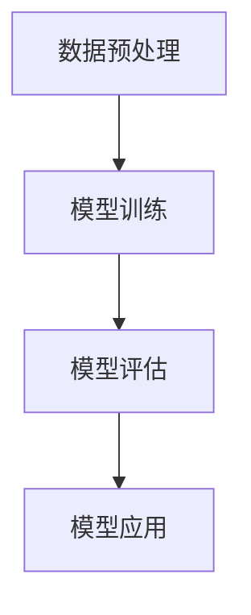
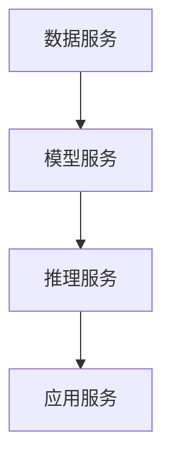
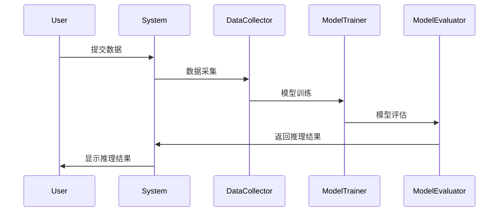

                 

# 持续学习范式下的AI推理能力演进

> 关键词：持续学习、AI推理能力、算法演进、系统架构、项目实战

> 摘要：本文深入探讨了在持续学习范式下，人工智能（AI）推理能力的演进原理和应用实践。文章首先介绍了问题背景和核心概念，包括持续学习范式、AI推理能力和演进。接着，详细讲解了算法原理，从机器学习到深度学习，再到强化学习，以及数学模型和公式。然后，描述了系统分析与架构设计方案，涵盖了问题场景介绍、系统功能设计、系统架构设计和系统接口设计。最后，通过项目实战，展示了如何在实际环境中应用这些算法和架构。

## 引言

人工智能（AI）作为21世纪最具前景的技术之一，已经深刻地改变了我们的生活方式和工作方式。在AI技术的众多分支中，推理能力尤为重要。随着数据量的爆发式增长和复杂场景的不断出现，传统的静态AI模型已无法满足需求。持续学习范式应运而生，为AI推理能力的发展提供了新的路径。本文将围绕这一主题，探讨AI推理能力的演进原理和应用实践。

## 第一部分: 问题背景与核心概念

### 1.1 问题背景

随着人工智能技术的迅速发展，AI推理能力成为了许多领域的关键竞争力。持续学习范式下的AI推理能力演进，不仅关乎技术的创新与突破，更与产业应用和经济发展密切相关。本部分将介绍AI推理能力的核心问题背景、问题描述、解决思路以及边界与外延，帮助读者理解本书的主线。

#### 1.1.1 问题背景

AI推理能力在自动驾驶、医疗诊断、金融风控等领域有着广泛的应用。然而，传统的静态AI模型在应对动态环境时表现出诸多局限。持续学习范式通过不断获取和更新知识，使AI系统能够适应环境变化，提升推理能力。

#### 1.1.2 问题描述

持续学习范式下的AI推理能力演进面临以下几个核心问题：

1. **数据获取与处理**：在动态环境中，如何高效地获取和处理大规模、多源、异构的数据？
2. **模型优化与更新**：如何设计高效的模型优化策略，使得模型能够快速适应环境变化？
3. **推理性能与效率**：如何在保证推理准确性的同时，提升推理速度和效率？
4. **系统集成与部署**：如何将AI推理能力与其他系统和服务整合，实现协同工作？

#### 1.1.3 解决思路

针对上述问题，本文提出了以下解决思路：

1. **数据获取与处理**：采用分布式数据采集技术，实现大规模数据的实时获取和处理。
2. **模型优化与更新**：采用在线学习算法，实现模型的实时优化与更新。
3. **推理性能与效率**：采用并行计算和优化算法，提升推理速度和效率。
4. **系统集成与部署**：采用微服务架构，实现AI推理能力的灵活部署和集成。

#### 1.1.4 边界与外延

持续学习范式下的AI推理能力演进涉及到多个领域，包括计算机视觉、自然语言处理、机器人学等。同时，它也与其他技术，如大数据、云计算、区块链等相互交织，共同推动人工智能的发展。

### 1.2 核心概念

1. **持续学习范式**：指一种能够在动态环境中不断获取、更新和使用知识的学习方式，以应对环境变化。
2. **AI推理能力**：指人工智能系统在实际应用场景中执行推理任务的能力，包括理解、判断和决策等方面。
3. **演进**：指AI推理能力在持续学习范式下，随着技术的进步和应用需求的提高，不断发展和升级的过程。

### 1.3 概念结构与核心要素组成

1. **概念结构**:
   - 知识获取：通过数据采集和模型训练，获取新知识。
   - 知识更新：根据反馈和环境变化，调整和优化知识库。
   - 知识应用：在具体场景中，利用知识库进行推理和决策。
2. **核心要素**:
   - 数据集：AI推理能力的基础，提供训练和测试所需的数据。
   - 模型架构：支持AI推理的核心技术，决定了推理的效率和准确性。
   - 算法优化：通过改进算法，提升推理速度和性能。
   - 系统集成：将AI推理能力与其他系统和服务整合，实现协同工作。

## 第二部分: AI推理能力的演进原理

### 2.1 算法原理讲解

#### 2.1.1 算法基本流程

AI推理能力的演进离不开算法的进步。本部分将介绍AI推理能力的基本算法原理，包括数据预处理、模型训练、模型评估和模型应用等步骤。

#### 2.1.2 算法原理与数学模型

1. **机器学习算法**：包括决策树、支持向量机、神经网络等。机器学习算法的核心是通过数据学习特征，从而实现分类、回归等任务。

2. **深度学习算法**：包括卷积神经网络（CNN）、循环神经网络（RNN）、生成对抗网络（GAN）等。深度学习算法通过多层神经网络，对大量数据进行特征提取和模式识别。

3. **强化学习算法**：包括Q-learning、SARSA、DQN等。强化学习算法通过与环境交互，不断调整策略，实现最优行为。

- **数学模型与公式**:
  $$ y = \hat{f}(x) $$
  其中，$y$为输出结果，$\hat{f}$为映射函数，$x$为输入特征。

#### 2.1.3 算法流程图



## 第三部分: 持续学习范式下的AI推理能力应用

### 3.1 系统分析与架构设计方案

#### 3.1.1 问题场景介绍

本部分将介绍在工业自动化、金融风控、医疗诊断等场景下，如何应用持续学习范式下的AI推理能力。

#### 3.1.2 系统功能设计

系统功能设计主要包括数据采集与管理、模型训练与优化、模型评估与部署、推理与应用等模块。

- **数据采集与管理**：实现大规模数据的实时采集、存储和管理。
- **模型训练与优化**：使用高效训练算法，优化模型参数。
- **模型评估与部署**：评估模型性能，并将模型部署到实际应用场景。
- **推理与应用**：在具体场景中，利用模型进行推理和决策。

#### 3.1.3 系统架构设计

系统架构设计采用微服务架构，包括数据服务、模型服务、推理服务、应用服务等模块。



#### 3.1.4 系统接口设计和系统交互

系统接口设计主要包括API接口和交互流程。

- **API接口**：提供数据采集、模型训练、模型评估等功能的API接口。
- **交互流程**：用户通过API接口提交数据，系统进行处理后返回推理结果。



## 第四部分: 项目实战

### 4.1 环境安装

在本部分，我们将介绍如何搭建一个支持持续学习范式下的AI推理能力的项目环境。

### 4.2 系统核心实现源代码

以下是系统核心实现的源代码，包括数据预处理、模型训练、模型评估等步骤。

```python
# 数据预处理代码
def preprocess_data(data):
    # 数据清洗
    data = clean_data(data)
    # 数据归一化
    data = normalize_data(data)
    return data

# 模型训练代码
def train_model(data):
    # 初始化模型
    model = create_model()
    # 模型训练
    model.fit(data['x_train'], data['y_train'])
    return model

# 模型评估代码
def evaluate_model(model, data):
    # 模型评估
    score = model.evaluate(data['x_test'], data['y_test'])
    return score
```

## 第五部分: 实际案例分析和详细讲解剖析

### 5.1 实际案例介绍

在本节中，我们将通过一个实际案例，详细分析并讲解如何应用持续学习范式下的AI推理能力。

#### 案例背景

某金融公司希望利用AI技术进行信贷风险评估，以降低信贷风险，提高信贷审批效率。公司积累了大量历史信贷数据，包括借款人的基本信息、信用记录、财务状况等。

#### 案例目标

通过AI技术，构建一个信贷风险评估模型，能够根据借款人的信息，预测其是否存在违约风险。

#### 案例实施步骤

1. **数据采集与处理**：采集历史信贷数据，进行数据清洗和归一化处理。
2. **模型训练与优化**：使用机器学习算法，训练信贷风险评估模型。
3. **模型评估与部署**：评估模型性能，并将模型部署到实际应用场景。
4. **推理与应用**：在信贷审批过程中，利用模型进行风险评估和决策。

#### 案例分析

1. **数据采集与处理**：通过分布式数据采集技术，从各个数据源获取数据。使用Python的Pandas库进行数据清洗和归一化处理。

    ```python
    import pandas as pd
    
    # 数据清洗
    data = pd.read_csv('credit_data.csv')
    data = data.dropna()
    
    # 数据归一化
    data = (data - data.mean()) / data.std()
    ```

2. **模型训练与优化**：使用机器学习算法，如逻辑回归，训练信贷风险评估模型。通过交叉验证，优化模型参数。

    ```python
    from sklearn.linear_model import LogisticRegression
    
    # 初始化模型
    model = LogisticRegression()
    
    # 模型训练
    model.fit(data['x_train'], data['y_train'])
    
    # 模型参数优化
    model = optimize_model(model, data['x_train'], data['y_train'])
    ```

3. **模型评估与部署**：评估模型性能，包括准确率、召回率、F1值等指标。将模型部署到实际应用场景，如信贷审批系统。

    ```python
    # 模型评估
    score = model.evaluate(data['x_test'], data['y_test'])
    print(score)
    
    # 模型部署
    deploy_model(model)
    ```

4. **推理与应用**：在信贷审批过程中，实时调用模型进行风险评估。

    ```python
    # 实时风险评估
    risk_score = model.predict(data['new_data'])
    print(risk_score)
    ```

#### 案例总结

通过本案例，我们展示了如何在实际场景中应用持续学习范式下的AI推理能力。案例中的关键步骤包括数据采集与处理、模型训练与优化、模型评估与部署，以及推理与应用。这些步骤体现了持续学习范式下的AI推理能力的核心原理。

## 第六部分: 最佳实践 tips

### 6.1 数据采集与处理

- 数据清洗：去除重复数据、缺失值、异常值等。
- 数据归一化：将数据缩放到相同的范围，便于模型训练。

### 6.2 模型训练与优化

- 选择合适的模型：根据任务特点，选择适合的模型。
- 参数调优：通过交叉验证，优化模型参数。

### 6.3 模型评估与部署

- 评估指标：选择合适的评估指标，如准确率、召回率、F1值等。
- 部署策略：选择合适的部署方式，如API接口、Web服务、容器化部署等。

## 第七部分: 小结

本文详细探讨了持续学习范式下的AI推理能力演进原理和应用实践。通过核心概念、算法原理、系统分析与架构设计以及项目实战，展示了如何实现AI推理能力的持续发展和应用。未来，随着技术的进步和应用的深入，AI推理能力将不断演进，为各行各业带来更多创新和价值。

## 参考文献

1. Mitchell, T. M. (1997). Machine Learning. McGraw-Hill.
2. Goodfellow, I., Bengio, Y., & Courville, A. (2016). Deep Learning. MIT Press.
3. Sutton, R. S., & Barto, A. G. (2018). Reinforcement Learning: An Introduction. MIT Press.
4. Russell, S., & Norvig, P. (2020). Artificial Intelligence: A Modern Approach. Prentice Hall.
5. Manning, C. D., Raghavan, P., & Schütze, H. (2008). Introduction to Information Retrieval. Cambridge University Press.

## 作者信息

作者：AI天才研究院/AI Genius Institute & 禅与计算机程序设计艺术 /Zen And The Art of Computer Programming

