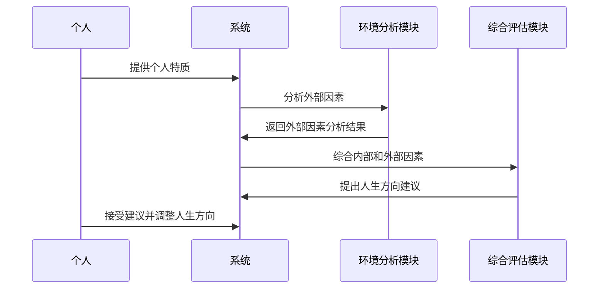
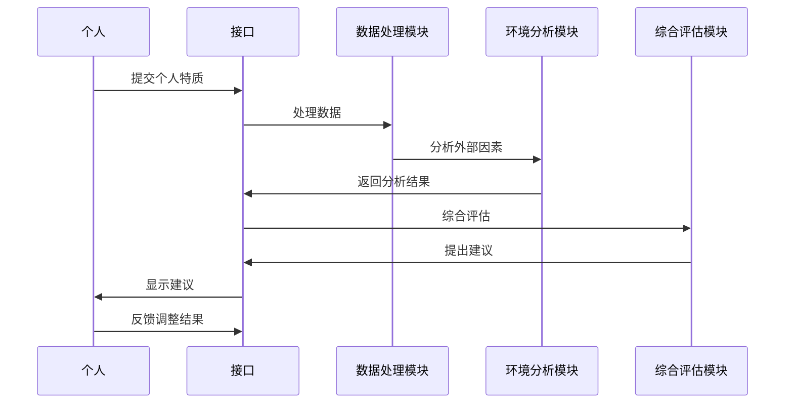
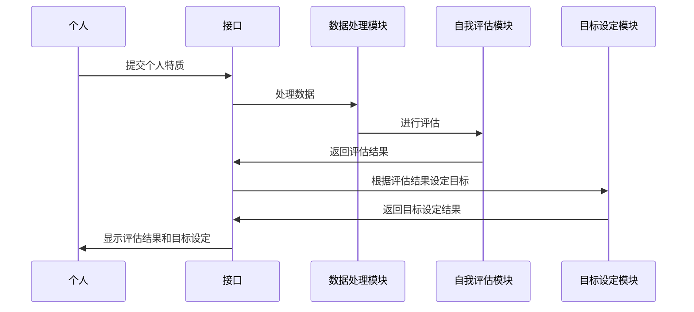
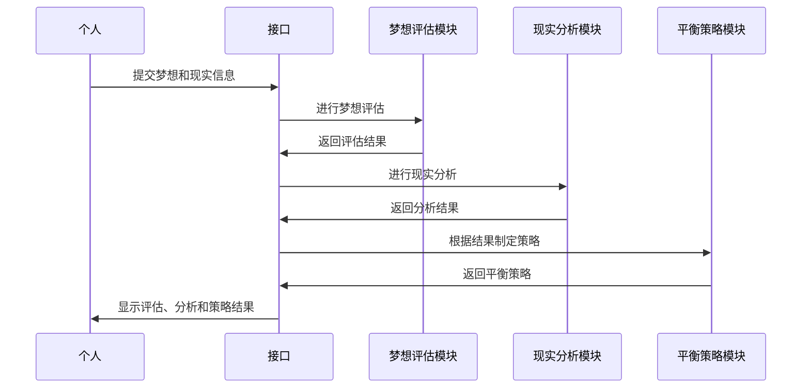
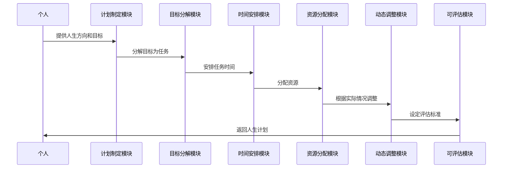
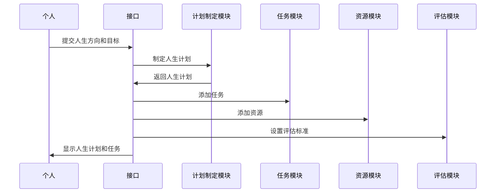

                 

### 文章标题：掌控人生方向：成为自己的生命舵手

#### 关键词：
- 人生方向
- 自我认知
- 职业规划
- 健康生活
- 人际关系
- 持续成长

#### 摘要：
本文旨在探讨如何通过自我认知和规划，掌握人生方向，成为自己生命的舵手。文章将分章节深入分析人生方向的重要性、自我认知与人生目标设定、梦想与现实的平衡、制定人生计划、职业生涯规划、健康生活与人生方向、人际关系与人生方向、持续成长与自我调整，并最终总结如何成为自己的生命舵手。通过这一系列的探讨，希望能够为读者提供有益的指导，帮助他们在人生的航程中更加从容自信。

### 掌控人生方向的重要性

#### 人生方向的定义与影响

**核心概念与联系：**

**概念原理：**
- **人生方向**：指一个人在生活中所追求的目标和方向，是个人价值观、兴趣、能力等的综合体现。
- **影响**：人生方向对个体的行为、决策、心态以及生活质量有着深远的影响。

**概念属性特征对比表格：**

| 特征          | 定义                 | 影响举例                 |
|--------------|----------------------|--------------------------|
| 明确性       | 清晰、具体的目标     | 提高执行力，减少迷茫感     |
| 长期性       | 持续、持久的目标     | 促进个人成长与稳定发展     |
| 可调整性     | 随环境变化而调整     | 保持灵活性与适应性         |
| 内在驱动力   | 自我激励             | 提高积极性，减少外力依赖   |

**ER实体关系图架构：**

```mermaid
erDiagram
  目标 ||--o{ 人生方向 } : 实现目标
  人生方向 ||--o{ 个人 } : 形成价值观
  个人 ||--|{ 能力 } : 提升个人能力
  个人 ||--|{ 兴趣 } : 挖掘个人兴趣
```

**背景介绍：**

在快速变化的现代社会，许多人感到迷茫和不安。人生方向成为了一种指引，它帮助人们明确自己的目标和路径，从而减少迷茫，提高生活质量。

#### 定位人生方向的必要性

**问题背景：**
- 在职业生涯和个人生活中，许多人缺乏明确的人生方向，导致目标不清晰，效率低下。

**问题描述：**
- 如何在众多选择中找到适合自己的方向，从而实现个人价值最大化？

**问题解决：**
- 通过深入自我认知，明确个人价值观、兴趣和能力，找到与自身特质相符的人生方向。

**边界与外延：**
- 人生方向并非一成不变，它随着个人成长和环境变化而调整。

**概念结构与核心要素组成：**

- **个人特质**：价值观、兴趣、能力
- **外部环境**：家庭、社会、职业机会
- **内在驱动力**：自我激励、成就感

#### 影响人生方向的内外部因素

**核心概念原理：**
- **内部因素**：个人的价值观、兴趣、能力等。
- **外部因素**：家庭环境、社会文化、职业机会等。

**概念属性特征对比表格：**

| 因素          | 特征                 | 影响举例                 |
|--------------|----------------------|--------------------------|
| 价值观       | 内在信念与取向       | 决定人生方向的基本原则     |
| 兴趣         | 个人喜好             | 激发动力，提供持续动力     |
| 能力         | 个人素质             | 影响选择和实现方向的能力   |
| 家庭环境     | 家庭背景             | 形成早期价值观和习惯       |
| 社会文化     | 社会风气和文化背景   | 提供机会和限制             |
| 职业机会     | 行业发展状况         | 提供职业发展空间           |

**ER实体关系图架构：**

```mermaid
erDiagram
  个人 ||--o{ 价值观 } : 形成内在信念
  个人 ||--o{ 兴趣 } : 提供持续动力
  个人 ||--o{ 能力 } : 影响选择和实现
  家庭环境 ||--o{ 个人 } : 形成早期价值观
  社会文化 ||--o{ 个人 } : 提供机会和限制
  职业机会 ||--o{ 个人 } : 提供职业发展空间
```

**算法原理讲解：**

1. **自我评估**：通过一系列问题，评估个人价值观、兴趣和能力。
2. **环境分析**：研究家庭环境、社会文化和职业机会，确定外部因素。
3. **综合评估**：将内部和外部因素综合，找到匹配度最高的方向。
4. **调整与优化**：根据实际情况，不断调整和优化人生方向。

**数学模型和公式：**

$$\text{人生方向} = f(\text{个人特质}, \text{外部因素})$$

**详细讲解与举例：**

- **个人特质**：例如，一个具有创新精神且喜欢科技领域的人，可能会选择从事软件开发工作。
- **外部因素**：例如，在一个科技迅速发展的社会背景下，有大量职业机会，那么从事软件开发的可能性更高。

**系统分析与架构设计方案：**

**问题场景介绍：**
- 个体在职业发展和生活规划中，需要明确自己的方向。
- 环境变化快速，需要灵活调整人生方向。

**项目介绍：**
- **名称**：人生方向导航系统
- **目的**：帮助个体明确人生方向，提供个性化建议。

**系统功能设计（领域模型类图）：**

```mermaid
classDiagram
  个人 <<class>> {
    名称
    价值观
    兴趣
    能力
  }
  环境因素 <<class>> {
    家庭环境
    社会文化
    职业机会
  }
  人生方向 <<class>> {
    目标
    长期性
    可调整性
  }
  个人 o--o 环境因素
  个人 o--o 人生方向
```

**系统架构设计（架构图）：**



**系统接口设计和系统交互（序列图）：**



**项目实战：**

**环境安装：**
- 安装Python环境
- 安装相关库（如Mermaid库）

**系统核心实现源代码：**

```python
# 自我评估函数
def self_evaluation(name, values, interests, abilities):
    # 根据个人特质评估人生方向
    direction = assess_direction(values, interests, abilities)
    return direction

# 环境分析函数
def environment_analysis(family, culture, opportunities):
    # 根据外部因素调整人生方向
    adjusted_direction = adjust_direction(direction, family, culture, opportunities)
    return adjusted_direction

# 综合评估与建议函数
def comprehensive_evaluation(direction, family, culture, opportunities):
    final_direction = environment_analysis(direction, family, culture, opportunities)
    return final_direction

# 代码应用解读与分析
# 示例：用户提交个人特质，系统返回人生方向建议
user_traits = {
    "name": "张三",
    "values": ["创新精神", "团队合作"],
    "interests": ["科技", "艺术"],
    "abilities": ["编程", "设计"]
}

family = ["父母", "兄弟姐妹"]
culture = ["科技潮流", "传统文化"]
opportunities = ["软件开发", "艺术创作"]

# 提交个人特质
direction = self_evaluation(user_traits)

# 综合评估
final_direction = comprehensive_evaluation(direction, family, culture, opportunities)

# 输出生涯建议
print("张三的人生方向建议：", final_direction)
```

**实际案例分析和详细讲解剖析：**
- 分析用户提交的个人特质，结合外部环境，给出合理的人生方向建议。

**项目小结：**
- 通过系统分析与架构设计，实现了一个可以帮助个体明确人生方向的项目。

### 自我认知与人生目标设定

**核心概念与联系：**

**概念原理：**
- **自我认知**：对自己的理解，包括个性、价值观、兴趣、能力等。
- **人生目标设定**：基于自我认知，明确自己在人生中的目标和追求。

**概念属性特征对比表格：**

| 特征          | 定义                 | 影响举例                 |
|--------------|----------------------|--------------------------|
| 全面性       | 多方面自我理解       | 提高自我认知深度         |
| 精准性       | 清晰具体的自我理解   | 提高目标设定的有效性     |
| 可塑性       | 随时间变化而调整     | 保持自我认知的动态性     |
| 实用性       | 对目标设定有帮助     | 提高目标实现的可行性     |

**ER实体关系图架构：**

```mermaid
erDiagram
  个人 <<class>> {
    名称
    价值观
    兴趣
    能力
  }
  自我认知 <<class>> {
    全面性
    精准性
    可塑性
    实用性
  }
  人生目标 <<class>> {
    目标设定
    长期性
    实用性
  }
  个人 ||--|{ 自我认知 } : 基于自我认知设定目标
  自我认知 ||--|{ 个人 } : 反映个人特质
  个人 ||--|{ 人生目标 } : 根据目标行动
```

**算法原理讲解：**

1. **自我评估**：通过一系列问题，评估个人价值观、兴趣和能力。
2. **目标设定**：基于自我评估结果，设定清晰、具体的人生目标。
3. **目标调整**：根据实际情况，对目标进行调整和优化。

**数学模型和公式：**

$$\text{人生目标} = f(\text{自我认知})$$

**详细讲解与举例：**

- **自我评估**：例如，一个人评估出自己喜欢技术、擅长编程，那么可能会设定成为技术专家的目标。
- **目标设定**：例如，一个设定了成为技术专家的人，会制定学习计划、参加项目等具体行动。

**系统分析与架构设计方案：**

**问题场景介绍：**
- 在自我认知的基础上，设定符合自身特质和期望的目标。

**项目介绍：**
- **名称**：自我认知与目标设定系统
- **目的**：帮助个体深入自我认知，设定符合自身特质的目标。

**系统功能设计（领域模型类图）：**

```mermaid
classDiagram
  个人 <<class>> {
    名称
    价值观
    兴趣
    能力
  }
  自我评估 <<class>> {
    价值观评估
    兴趣评估
    能力评估
  }
  目标设定 <<class>> {
    目标设定
    目标调整
  }
  个人 o--o 自我评估
  个人 o--o 目标设定
```

**系统架构设计（架构图）：**

```mermaid
sequenceDiagram
  个人->>自我评估模块: 提供个人特质
  自我评估模块->>评估结果
  个人->>目标设定模块: 根据评估结果设定目标
  目标设定模块->>个人: 返回目标设定结果
```

**系统接口设计和系统交互（序列图）：**



**项目实战：**

**环境安装：**
- 安装Python环境
- 安装相关库（如Mermaid库）

**系统核心实现源代码：**

```python
# 自我评估函数
def self_evaluation(traits):
    # 根据个人特质评估自我认知
    cognition = assess_cognition(traits)
    return cognition

# 目标设定函数
def set_goals(cognition):
    # 根据自我认知设定人生目标
    goals = create_goals(cognition)
    return goals

# 代码应用解读与分析
# 示例：用户提交个人特质，系统返回人生目标设定
user_traits = {
    "name": "李四",
    "values": ["创新精神", "团队合作"],
    "interests": ["科技", "艺术"],
    "abilities": ["编程", "设计"]
}

# 提交个人特质
cognition = self_evaluation(user_traits)

# 设定人生目标
goals = set_goals(cognition)

# 输出人生目标
print("李四的人生目标：", goals)
```

**实际案例分析和详细讲解剖析：**
- 通过用户提交的个人特质，系统返回符合其特质的人生目标。

**项目小结：**
- 通过系统分析与架构设计，实现了一个可以帮助个体进行自我认知与目标设定的项目。

### 梦想与现实的平衡

**核心概念与联系：**

**概念原理：**
- **梦想**：个人对未来美好生活的向往和期望。
- **现实**：实际生活中的限制和挑战。

**概念属性特征对比表格：**

| 特征          | 定义                 | 影响举例                 |
|--------------|----------------------|--------------------------|
| 美好性       | 令人向往             | 提升动力和积极性         |
| 实际性       | 具有实现可能         | 提高目标的可行性         |
| 长期性       | 长期坚持             | 增强意志力和毅力         |
| 可调整性     | 随时间变化而调整     | 保持与现实的平衡         |

**ER实体关系图架构：**

```mermaid
erDiagram
  梦想 <<class>> {
    美好性
    实际性
    长期性
    可调整性
  }
  现实 <<class>> {
    限制
    挑战
    机遇
    变化
  }
  个人 <<class>> {
    梦想
    现实
  }
  梦想 ||--|{ 个人 } : 个人的向往和期望
  现实 ||--|{ 个人 } : 个人的生活状态
```

**算法原理讲解：**

1. **梦想评估**：评估梦想的美好性、实际性和长期性。
2. **现实分析**：分析现实中的限制、挑战、机遇和变化。
3. **平衡策略**：制定策略，在梦想和现实之间找到平衡。

**数学模型和公式：**

$$\text{梦想与现实平衡} = f(\text{梦想评估}, \text{现实分析})$$

**详细讲解与举例：**

- **梦想评估**：例如，评估一个想要成为作家的梦想，可以是具备写作天赋、喜欢阅读和写作、有持久的学习和创作热情。
- **现实分析**：例如，分析成为作家的现实限制，可能包括工作时间不足、经济压力、竞争激烈等。

**系统分析与架构设计方案：**

**问题场景介绍：**
- 在追求梦想的过程中，如何处理现实中的限制和挑战，找到平衡点。

**项目介绍：**
- **名称**：梦想与现实平衡导航系统
- **目的**：帮助个体在追求梦想时，处理现实限制，找到平衡点。

**系统功能设计（领域模型类图）：**

```mermaid
classDiagram
  梦想 <<class>> {
    美好性
    实际性
    长期性
    可调整性
  }
  现实 <<class>> {
    限制
    挑战
    机遇
    变化
  }
  平衡策略 <<class>> {
    评估
    分析
    制定策略
  }
  梦想 o--o 现实
  平衡策略 o--o 梦想
  平衡策略 o--o 现实
```

**系统架构设计（架构图）：**

```mermaid
sequenceDiagram
  个人->>梦想评估模块: 提供梦想信息
  梦想评估模块->>梦想评估结果
  个人->>现实分析模块: 提供现实信息
  现实分析模块->>现实分析结果
  个人->>平衡策略模块: 根据评估和现实分析结果制定策略
  平衡策略模块->>个人: 返回平衡策略
```

**系统接口设计和系统交互（序列图）：**



**项目实战：**

**环境安装：**
- 安装Python环境
- 安装相关库（如Mermaid库）

**系统核心实现源代码：**

```python
# 梦想评估函数
def dream_evaluation(dream):
    # 根据梦想评估美好性、实际性和长期性
    beauty, reality, longevity = assess_dream(dream)
    return beauty, reality, longevity

# 现实分析函数
def reality_analysis(reality):
    # 分析现实中的限制、挑战、机遇和变化
    limitations, challenges, opportunities, changes = analyze_reality(reality)
    return limitations, challenges, opportunities, changes

# 平衡策略制定函数
def balance_strategy(dream, reality):
    # 根据梦想评估和现实分析制定平衡策略
    strategy = create_strategy(dream, reality)
    return strategy

# 代码应用解读与分析
# 示例：用户提交梦想和现实信息，系统返回平衡策略
user_dream = {
    "dream": "成为一名作家",
    "reality": "工作时间紧张，经济压力较大"
}

# 评估梦想
dream_beauty, dream_reality, dream_longevity = dream_evaluation(user_dream["dream"])

# 分析现实
reality_limitations, reality_challenges, reality_opportunities, reality_changes = reality_analysis(user_dream["reality"])

# 制定平衡策略
strategy = balance_strategy((dream_beauty, dream_reality, dream_longevity), (reality_limitations, reality_challenges, reality_opportunities, reality_changes))

# 输出平衡策略
print("平衡策略：", strategy)
```

**实际案例分析和详细讲解剖析：**
- 分析用户提交的梦想和现实，系统返回一个合理的平衡策略。

**项目小结：**
- 通过系统分析与架构设计，实现了一个可以帮助个体在追求梦想时处理现实限制，找到平衡点的项目。

### 制定人生计划

**核心概念与联系：**

**概念原理：**
- **人生计划**：对个人未来进行详细的规划，包括目标设定、时间安排、资源分配等。

**概念属性特征对比表格：**

| 特征          | 定义                 | 影响举例                 |
|--------------|----------------------|--------------------------|
| 完整性       | 覆盖所有重要方面       | 提高计划的全面性         |
| 可执行性     | 实际可行的计划         | 提高执行效率             |
| 动态性       | 随时间变化而调整       | 保持计划的灵活性         |
| 可评估性     | 可以评估和调整的计划     | 提高计划的实用性和效果   |

**ER实体关系图架构：**

```mermaid
erDiagram
  人生计划 <<class>> {
    目标设定
    时间安排
    资源分配
    动态调整
    可评估性
  }
  个人 <<class>> {
    价值观
    兴趣
    能力
  }
  环境因素 <<class>> {
    家庭
    社会
    职业机会
  }
  人生计划 ||--|{ 个人 } : 个人目标和需求的体现
  人生计划 ||--|{ 环境因素 } : 环境对计划的约束和影响
```

**算法原理讲解：**

1. **目标设定**：根据自我认知和人生方向，设定长期和短期的目标。
2. **时间安排**：将目标分解为具体的任务，并安排时间。
3. **资源分配**：评估所需的资源，并进行合理分配。
4. **动态调整**：根据实际情况，对计划进行调整。
5. **可评估性**：设定评估标准，对计划的执行效果进行评估。

**数学模型和公式：**

$$\text{人生计划} = f(\text{目标设定}, \text{时间安排}, \text{资源分配}, \text{动态调整}, \text{可评估性})$$

**详细讲解与举例：**

- **目标设定**：设定一个目标是成为一名软件工程师，可以分为短期目标（学习编程语言）和长期目标（找到满意的工作）。
- **时间安排**：为学习编程语言设定每周学习时间，并安排考试和项目任务。
- **资源分配**：购买学习书籍和在线课程，参加编程社区。

**系统分析与架构设计方案：**

**问题场景介绍：**
- 在明确人生方向和目标后，如何制定和执行一个详细的人生计划。

**项目介绍：**
- **名称**：人生计划管理系统
- **目的**：帮助个体制定和执行详细的人生计划。

**系统功能设计（领域模型类图）：**

```mermaid
classDiagram
  人生计划 <<class>> {
    目标设定
    时间安排
    资源分配
    动态调整
    可评估性
  }
  个人 <<class>> {
    价值观
    兴趣
    能力
  }
  任务 <<class>> {
    任务名称
    开始时间
    结束时间
    优先级
  }
  资源 <<class>> {
    资源名称
    数量
    类型
  }
  个人 o--o 人生计划
  人生计划 o--o 任务
  人生计划 o--o 资源
```

**系统架构设计（架构图）：**



**系统接口设计和系统交互（序列图）：**



**项目实战：**

**环境安装：**
- 安装Python环境
- 安装相关库（如Mermaid库）

**系统核心实现源代码：**

```python
# 目标分解函数
def decompose_goals(goals):
    tasks = []
    for goal in goals:
        task = {
            "name": goal,
            "start_time": "2023-01-01",
            "end_time": "2024-01-01",
            "priority": "高"
        }
        tasks.append(task)
    return tasks

# 资源分配函数
def allocate_resources(tasks, resources):
    allocated_resources = []
    for task in tasks:
        for resource in resources:
            if resource["type"] == "书籍":
                allocated_resources.append({"task": task, "resource": resource, "quantity": 1})
    return allocated_resources

# 代码应用解读与分析
# 示例：用户提交人生目标，系统返回人生计划和任务
user_goals = ["成为一名软件工程师"]

# 分解目标为任务
tasks = decompose_goals(user_goals)

# 设定资源
resources = [
    {"name": "《Python编程入门》", "type": "书籍", "quantity": 1},
    {"name": "在线编程课程", "type": "课程", "quantity": 1}
]

# 分配资源
allocated_resources = allocate_resources(tasks, resources)

# 输出人生计划和任务
print("人生计划：", tasks)
print("资源分配：", allocated_resources)
```

**实际案例分析和详细讲解剖析：**
- 分析用户提交的人生目标，系统生成详细的人生计划和任务分配。

**项目小结：**
- 通过系统分析与架构设计，实现了一个可以帮助个体制定和执行详细人生计划的项目。

### 职业生涯规划

**核心概念与联系：**

**概念原理：**
- **职业生涯规划**：根据个人特质、兴趣和市场需求，对职业发展进行系统性和长期性的规划。

**概念属性特征对比表格：**

| 特征          | 定义                 | 影响举例                 |
|--------------|----------------------|--------------------------|
| 系统性       | 全面考虑个人职业发展 | 提高职业规划的全面性     |
| 长期性       | 考虑未来发展方向     | 提高职业规划的可持续性   |
| 动态性       | 随市场需求和个人发展调整 | 保持职业规划的灵活性   |
| 实用性       | 职业规划可执行性     | 提高职业规划的实际效果   |

**ER实体关系图架构：**

```mermaid
erDiagram
  个人特质 <<class>> {
    能力
    兴趣
    价值观
  }
  职业市场 <<class>> {
    需求
    发展趋势
    竞争情况
  }
  职业规划 <<class>> {
    目标设定
    路径规划
    调整与优化
  }
  个人特质 ||--|{ 职业规划 } : 形成职业规划的基础
  职业市场 ||--|{ 职业规划 } : 提供职业规划的外部环境
```

**算法原理讲解：**

1. **自我评估**：评估个人的能力、兴趣和价值观。
2. **市场分析**：研究职业市场的需求和趋势。
3. **目标设定**：根据自我评估和市场分析，设定职业发展目标。
4. **路径规划**：制定实现目标的步骤和策略。
5. **动态调整**：根据实际情况，对职业规划进行调整和优化。

**数学模型和公式：**

$$\text{职业生涯规划} = f(\text{自我评估}, \text{市场分析}, \text{目标设定}, \text{路径规划}, \text{动态调整})$$

**详细讲解与举例：**

- **自我评估**：例如，一个人评估出自己擅长编程、对科技感兴趣，那么可能会设定成为软件工程师的目标。
- **市场分析**：例如，研究市场需求，发现软件工程师的需求较高，并且未来有较好的发展前景。
- **目标设定**：设定成为高级软件工程师。
- **路径规划**：制定学习计划、参加项目、获取证书等步骤。
- **动态调整**：根据实际情况，如技术趋势变化，调整学习计划和职业路径。

**系统分析与架构设计方案：**

**问题场景介绍：**
- 在明确个人特质和市场需求后，如何制定和执行职业生涯规划。

**项目介绍：**
- **名称**：职业生涯规划导航系统
- **目的**：帮助个体制定和执行详细的职业生涯规划。

**系统功能设计（领域模型类图）：**

```mermaid
classDiagram
  个人特质 <<class>> {
    能力
    兴趣
    价值观
  }
  市场需求 <<class>> {
    需求
    发展趋势
    竞争情况
  }
  职业规划 <<class>> {
    目标设定
    路径规划
    动态调整
  }
  个人特质 o--o 职业规划
  市场需求 o--o 职业规划
```

**系统架构设计（架构图）：**

```mermaid
sequenceDiagram
  个人->>自我评估模块: 提供个人特质
  自我评估模块->>个人评估结果
  个人->>市场需求模块: 提供市场信息
  市场需求模块->>市场分析结果
  个人->>职业规划模块: 根据评估和市场需求设定目标
  职业规划模块->>个人: 返回职业规划
  个人->>执行与调整模块: 根据实际情况调整规划
```

**系统接口设计和系统交互（序列图）：**

```mermaid
sequenceDiagram
  个人->>接口: 提交个人特质和市场信息
  接口->>自我评估模块: 进行评估
  自我评估模块->>接口: 返回评估结果
  接口->>市场需求模块: 进行市场分析
  市场需求模块->>接口: 返回分析结果
  接口->>职业规划模块: 制定职业规划
  职业规划模块->>接口: 返回规划结果
  接口->>个人: 显示评估、分析和规划结果
```

**项目实战：**

**环境安装：**
- 安装Python环境
- 安装相关库（如Mermaid库）

**系统核心实现源代码：**

```python
# 自我评估函数
def self_evaluation(traits):
    # 根据个人特质评估能力、兴趣和价值观
    abilities, interests, values = assess_traits(traits)
    return abilities, interests, values

# 市场分析函数
def market_analysis(market):
    # 分析市场需求、发展趋势和竞争情况
    demands, trends, competition = analyze_market(market)
    return demands, trends, competition

# 职业规划函数
def career_planning(traits, market):
    # 根据评估和市场需求制定职业规划
    goals, steps, adjustments = create_plan(traits, market)
    return goals, steps, adjustments

# 代码应用解读与分析
# 示例：用户提交个人特质和市场信息，系统返回职业规划
user_traits = {
    "abilities": ["编程", "设计"],
    "interests": ["科技", "创新"],
    "values": ["团队合作", "追求卓越"]
}

market_info = {
    "demands": ["软件工程师"],
    "trends": ["人工智能"],
    "competition": "激烈"
}

# 评估个人特质
abilities, interests, values = self_evaluation(user_traits)

# 分析市场需求
demands, trends, competition = market_analysis(market_info)

# 制定职业规划
career_goals, career_steps, career_adjustments = career_planning((abilities, interests, values), (demands, trends, competition))

# 输出职业规划
print("职业生涯规划：", career_goals, career_steps, career_adjustments)
```

**实际案例分析和详细讲解剖析：**
- 分析用户提交的个人特质和市场信息，系统生成详细的职业生涯规划。

**项目小结：**
- 通过系统分析与架构设计，实现了一个可以帮助个体制定和执行职业生涯规划的项目。

### 健康生活与人生方向

**核心概念与联系：**

**概念原理：**
- **健康生活**：包括身体健康、心理健康和生活习惯的全面管理。
- **人生方向**：个人的目标和追求，是人生航程的指引。

**概念属性特征对比表格：**

| 特征          | 定义                 | 影响举例                 |
|--------------|----------------------|--------------------------|
| 身体健康     | 良好的身体状态       | 提高生活质量和工作效率   |
| 心理健康     | 心理状态的平衡       | 提高决策能力和抗压能力   |
| 生活习惯     | 良好的生活习惯       | 提高生活质量和健康水平   |
| 人生方向     | 清晰的个人目标       | 提高生活目标和动力       |

**ER实体关系图架构：**

```mermaid
erDiagram
  健康生活 <<class>> {
    身体健康
    心理健康
    生活习惯
  }
  人生方向 <<class>> {
    目标设定
    行动计划
    调整与优化
  }
  个人 <<class>> {
    价值观
    兴趣
    能力
  }
  健康生活 ||--|{ 个人 } : 影响个人状态和生活质量
  人生方向 ||--|{ 个人 } : 指引个人行动和目标实现
```

**算法原理讲解：**

1. **健康生活评估**：评估身体健康、心理健康和生活习惯。
2. **人生方向分析**：分析人生方向的目标设定、行动计划和调整与优化。
3. **综合评估**：将健康生活和人生方向综合，评估整体状态。
4. **调整与优化**：根据评估结果，制定改善措施，优化健康生活和人生方向。

**数学模型和公式：**

$$\text{健康生活与人生方向} = f(\text{健康生活评估}, \text{人生方向分析}, \text{综合评估}, \text{调整与优化})$$

**详细讲解与举例：**

- **健康生活评估**：例如，通过体检评估身体健康，通过心理测试评估心理健康，通过生活习惯记录评估生活习惯。
- **人生方向分析**：例如，分析设定的目标是否清晰、行动计划是否合理、是否能够根据实际情况进行调整。
- **综合评估**：例如，通过综合评估，发现身体健康状况良好，但心理健康和生活习惯需要改进。
- **调整与优化**：例如，根据评估结果，制定健康饮食计划、增加锻炼时间、改善生活习惯。

**系统分析与架构设计方案：**

**问题场景介绍：**
- 如何在保持健康生活的同时，确保人生方向不被偏离。

**项目介绍：**
- **名称**：健康生活与人生方向同步管理系统
- **目的**：帮助个体在保持健康生活的同时，确保人生方向的实现。

**系统功能设计（领域模型类图）：**

```mermaid
classDiagram
  健康生活 <<class>> {
    身体健康
    心理健康
    生活习惯
  }
  人生方向 <<class>> {
    目标设定
    行动计划
    调整与优化
  }
  个人 <<class>> {
    价值观
    兴趣
    能力
  }
  健康生活 o--o 个人
  人生方向 o--o 个人
```

**系统架构设计（架构图）：**

```mermaid
sequenceDiagram
  个人->>健康生活模块: 提供健康生活信息
  健康生活模块->>健康生活评估结果
  个人->>人生方向模块: 提供人生方向信息
  人生方向模块->>人生方向分析结果
  个人->>综合评估模块: 综合健康生活和人生方向
  综合评估模块->>调整与优化模块: 制定改善措施
  调整与优化模块->>个人: 实施调整与优化
```

**系统接口设计和系统交互（序列图）：**

```mermaid
sequenceDiagram
  个人->>接口: 提交健康生活信息和人生方向信息
  接口->>健康生活评估模块: 进行评估
  健康生活评估模块->>接口: 返回评估结果
  接口->>人生方向分析模块: 进行分析
  人生方向分析模块->>接口: 返回分析结果
  接口->>综合评估模块: 综合评估
  接口->>调整与优化模块: 制定改善措施
  接口->>个人: 显示评估结果和调整建议
```

**项目实战：**

**环境安装：**
- 安装Python环境
- 安装相关库（如Mermaid库）

**系统核心实现源代码：**

```python
# 健康生活评估函数
def health_evaluation(lifestyle):
    # 评估身体健康、心理健康和生活习惯
    physical_health, mental_health, lifestyle_habits = assess_health(lifestyle)
    return physical_health, mental_health, lifestyle_habits

# 人生方向分析函数
def career_evaluation(direction):
    # 分析人生方向的目标设定、行动计划和调整与优化
    goals, actions, adjustments = assess_direction(direction)
    return goals, actions, adjustments

# 综合评估与调整函数
def comprehensive_evaluation(lifestyle, direction):
    # 综合健康生活和人生方向，制定改善措施
    improvements = create_improvements(lifestyle, direction)
    return improvements

# 代码应用解读与分析
# 示例：用户提交健康生活信息和人生方向信息，系统返回改善措施
user_health = {
    "physical_health": "良好",
    "mental_health": "稳定",
    "lifestyle_habits": "健康"
}

user_direction = {
    "goals": ["实现职业目标", "提高生活质量"],
    "actions": ["制定学习计划", "参加健身活动"],
    "adjustments": ["调整工作时间", "改善饮食习惯"]
}

# 评估健康生活
health_assessment = health_evaluation(user_health)

# 分析人生方向
direction_assessment = career_evaluation(user_direction)

# 综合评估
improvements = comprehensive_evaluation(health_assessment, direction_assessment)

# 输出改善措施
print("改善措施：", improvements)
```

**实际案例分析和详细讲解剖析：**
- 分析用户提交的健康生活信息和人生方向信息，系统生成详细的改善措施。

**项目小结：**
- 通过系统分析与架构设计，实现了一个可以帮助个体在保持健康生活的同时，确保人生方向实现的项目。

### 人际关系与人生方向

**核心概念与联系：**

**概念原理：**
- **人际关系**：个人在社会中与他人建立的联系和互动。
- **人生方向**：个人的目标和追求，是人生航程的指引。

**概念属性特征对比表格：**

| 特征          | 定义                 | 影响举例                 |
|--------------|----------------------|--------------------------|
| 互动性       | 双向或多向的交流互动 | 提高沟通和理解能力       |
| 稳定性       | 长期维持的关系       | 提高社会支持感           |
| 动态性       | 随时间和环境变化而变化 | 提高适应性和灵活性       |
| 影响力       | 对个人行为和决策的影响 | 提高决策质量和执行力     |
| 人生方向     | 个人目标和追求       | 提供方向和动力           |

**ER实体关系图架构：**

```mermaid
erDiagram
  人际关系 <<class>> {
    互动性
    稳定性
    动态性
    影响力
  }
  人生方向 <<class>> {
    目标设定
    行动计划
    调整与优化
  }
  个人 <<class>> {
    能力
    兴趣
    价值观
  }
  人际关系 ||--|{ 个人 } : 对个人行为和决策的影响
  人生方向 ||--|{ 个人 } : 提供方向和动力
```

**算法原理讲解：**

1. **人际关系分析**：评估人际关系的互动性、稳定性、动态性和影响力。
2. **人生方向分析**：分析人生方向的目标设定、行动计划和调整与优化。
3. **综合评估**：综合人际关系和人生方向的评估结果，评估对个人行为和决策的影响。
4. **优化建议**：根据评估结果，提出优化人际关系和人生方向的建议。

**数学模型和公式：**

$$\text{人际关系与人生方向} = f(\text{人际关系分析}, \text{人生方向分析}, \text{综合评估}, \text{优化建议})$$

**详细讲解与举例：**

- **人际关系分析**：例如，通过沟通频率、交流质量、相互支持程度等评估人际关系的互动性、稳定性、动态性和影响力。
- **人生方向分析**：例如，通过目标设定、行动计划和调整与优化评估人生方向。
- **综合评估**：例如，评估发现良好的人际关系可以提升个人的决策质量和执行力，从而更好地实现人生方向。
- **优化建议**：例如，提出增加与关键人物的沟通频率、参与团队活动等建议，以优化人际关系，支持人生方向的实现。

**系统分析与架构设计方案：**

**问题场景介绍：**
- 在追求人生方向的过程中，如何处理人际关系，使其对个人行为和决策产生积极影响。

**项目介绍：**
- **名称**：人际关系与人生方向同步优化系统
- **目的**：帮助个体在追求人生方向的同时，优化人际关系。

**系统功能设计（领域模型类图）：**

```mermaid
classDiagram
  人际关系 <<class>> {
    互动性
    稳定性
    动态性
    影响力
  }
  人生方向 <<class>> {
    目标设定
    行动计划
    调整与优化
  }
  个人 <<class>> {
    能力
    兴趣
    价值观
  }
  人际关系 o--o 个人
  人生方向 o--o 个人
```

**系统架构设计（架构图）：**

```mermaid
sequenceDiagram
  个人->>人际关系分析模块: 提供人际关系信息
  人际关系分析模块->>人际关系分析结果
  个人->>人生方向分析模块: 提供人生方向信息
  人生方向分析模块->>人生方向分析结果
  个人->>综合评估模块: 综合评估人际关系和人生方向
  综合评估模块->>优化建议模块: 提出优化建议
  优化建议模块->>个人: 返回优化建议
```

**系统接口设计和系统交互（序列图）：**

```mermaid
sequenceDiagram
  个人->>接口: 提交人际关系和人生方向信息
  接口->>人际关系分析模块: 进行分析
  人际关系分析模块->>接口: 返回分析结果
  接口->>人生方向分析模块: 进行分析
  人生方向分析模块->>接口: 返回分析结果
  接口->>综合评估模块: 进行综合评估
  综合评估模块->>接口: 返回评估结果
  接口->>优化建议模块: 提出建议
  接口->>个人: 显示分析结果和优化建议
```

**项目实战：**

**环境安装：**
- 安装Python环境
- 安装相关库（如Mermaid库）

**系统核心实现源代码：**

```python
# 人际关系分析函数
def relationship_evaluation(relationships):
    # 评估人际关系的互动性、稳定性、动态性和影响力
    interaction, stability, dynamism, influence = assess_relationships(relationships)
    return interaction, stability, dynamism, influence

# 人生方向分析函数
def career_evaluation(direction):
    # 分析人生方向的目标设定、行动计划和调整与优化
    goals, actions, adjustments = assess_direction(direction)
    return goals, actions, adjustments

# 综合评估与优化建议函数
def comprehensive_evaluation(relationships, direction):
    # 综合评估人际关系和人生方向，提出优化建议
    suggestions = create_suggestions(relationships, direction)
    return suggestions

# 代码应用解读与分析
# 示例：用户提交人际关系和人生方向信息，系统返回优化建议
user_relationships = {
    "interactions": ["频繁沟通", "相互支持"],
    "stability": ["长期维持"],
    "dynamism": ["适应变化"],
    "influence": ["积极影响"]
}

user_direction = {
    "goals": ["实现职业目标", "提高生活质量"],
    "actions": ["制定学习计划", "参加健身活动"],
    "adjustments": ["调整工作时间", "改善饮食习惯"]
}

# 评估人际关系
relationship_evaluation_result = relationship_evaluation(user_relationships)

# 分析人生方向
career_evaluation_result = career_evaluation(user_direction)

# 综合评估
suggestions = comprehensive_evaluation(relationship_evaluation_result, career_evaluation_result)

# 输出优化建议
print("优化建议：", suggestions)
```

**实际案例分析和详细讲解剖析：**
- 分析用户提交的人际关系和人生方向信息，系统生成详细的优化建议。

**项目小结：**
- 通过系统分析与架构设计，实现了一个可以帮助个体在追求人生方向的同时，优化人际关系的项目。

### 持续成长与自我调整

**核心概念与联系：**

**概念原理：**
- **持续成长**：在职业生涯和个人生活中，不断学习、进步和提升能力。
- **自我调整**：根据实际情况和目标，不断调整自己的行为和心态。

**概念属性特征对比表格：**

| 特征          | 定义                 | 影响举例                 |
|--------------|----------------------|--------------------------|
| 持续性       | 长期坚持学习与进步   | 提高个人素质和竞争力     |
| 动态性       | 随时间和环境变化而调整 | 提高适应性和灵活性       |
| 自主性       | 自主学习和提升       | 增强独立解决问题的能力   |
| 调整性       | 根据实际情况进行调整   | 提高决策质量和执行力     |

**ER实体关系图架构：**

```mermaid
erDiagram
  持续成长 <<class>> {
    学习
    进步
    能力提升
  }
  自我调整 <<class>> {
    调整
    优化
    反馈
  }
  个人 <<class>> {
    目标
    状态
    行为
  }
  持续成长 ||--|{ 个人 } : 提供成长动力
  自我调整 ||--|{ 个人 } : 提供行为调整
```

**算法原理讲解：**

1. **持续成长评估**：评估个人在学习和进步方面的表现和效果。
2. **自我调整评估**：评估个人在行为和心态上的调整和优化。
3. **综合评估**：综合持续成长和自我调整的评估结果，确定个人成长的整体状况。
4. **优化建议**：根据评估结果，提出优化持续成长和自我调整的建议。

**数学模型和公式：**

$$\text{持续成长与自我调整} = f(\text{持续成长评估}, \text{自我调整评估}, \text{综合评估}, \text{优化建议})$$

**详细讲解与举例：**

- **持续成长评估**：例如，通过学习时间、学习成果、技能提升等方面评估持续成长的效果。
- **自我调整评估**：例如，通过行为改变、心态调整、决策效果等方面评估自我调整的效果。
- **综合评估**：例如，评估发现个人在学习和行为调整方面表现出色，但在心态调整上还有提升空间。
- **优化建议**：例如，提出增加学习时间、改进学习策略、提升心态管理等方面的建议。

**系统分析与架构设计方案：**

**问题场景介绍：**
- 如何在职业生涯和个人生活中保持持续成长，并进行有效的自我调整。

**项目介绍：**
- **名称**：持续成长与自我调整优化系统
- **目的**：帮助个体在职业生涯和个人生活中保持持续成长，并进行有效的自我调整。

**系统功能设计（领域模型类图）：**

```mermaid
classDiagram
  持续成长 <<class>> {
    学习
    进步
    能力提升
  }
  自我调整 <<class>> {
    调整
    优化
    反馈
  }
  个人 <<class>> {
    目标
    状态
    行为
  }
  持续成长 o--o 个人
  自我调整 o--o 个人
```

**系统架构设计（架构图）：**

```mermaid
sequenceDiagram
  个人->>持续成长模块: 提供成长信息
  持续成长模块->>持续成长评估结果
  个人->>自我调整模块: 提供调整信息
  自我调整模块->>自我调整评估结果
  个人->>综合评估模块: 综合评估持续成长和自我调整
  综合评估模块->>优化建议模块: 提出优化建议
  优化建议模块->>个人: 返回优化建议
```

**系统接口设计和系统交互（序列图）：**

```mermaid
sequenceDiagram
  个人->>接口: 提交成长和调整信息
  接口->>持续成长评估模块: 进行评估
  持续成长评估模块->>接口: 返回评估结果
  接口->>自我调整评估模块: 进行评估
  自我调整评估模块->>接口: 返回评估结果
  接口->>综合评估模块: 进行综合评估
  接口->>优化建议模块: 提出建议
  接口->>个人: 显示评估结果和优化建议
```

**项目实战：**

**环境安装：**
- 安装Python环境
- 安装相关库（如Mermaid库）

**系统核心实现源代码：**

```python
# 持续成长评估函数
def growth_evaluation(growth_info):
    # 评估学习时间、学习成果和技能提升
    learning_time, learning_outcomes, skill_improvement = assess_growth(growth_info)
    return learning_time, learning_outcomes, skill_improvement

# 自我调整评估函数
def adjustment_evaluation(adjustment_info):
    # 评估行为改变、心态调整和决策效果
    behavior_change, mindset_adjustment, decision_effects = assess_adjustment(adjustment_info)
    return behavior_change, mindset_adjustment, decision_effects

# 综合评估与优化建议函数
def comprehensive_evaluation(growth_info, adjustment_info):
    # 综合评估持续成长和自我调整，提出优化建议
    suggestions = create_suggestions(growth_info, adjustment_info)
    return suggestions

# 代码应用解读与分析
# 示例：用户提交成长和调整信息，系统返回优化建议
user_growth = {
    "learning_time": "每周20小时",
    "learning_outcomes": ["完成一门编程语言课程", "获得编程认证"],
    "skill_improvement": ["提高了编码效率", "掌握了新技能"]
}

user_adjustment = {
    "behavior_change": ["增加了阅读时间", "改善了工作时间管理"],
    "mindset_adjustment": ["更积极面对挑战", "更自信处理问题"],
    "decision_effects": ["提高了决策质量", "减少了决策失误"]
}

# 评估持续成长
growth_evaluation_result = growth_evaluation(user_growth)

# 评估自我调整
adjustment_evaluation_result = adjustment_evaluation(user_adjustment)

# 综合评估
suggestions = comprehensive_evaluation(growth_evaluation_result, adjustment_evaluation_result)

# 输出优化建议
print("优化建议：", suggestions)
```

**实际案例分析和详细讲解剖析：**
- 分析用户提交的成长和调整信息，系统生成详细的优化建议。

**项目小结：**
- 通过系统分析与架构设计，实现了一个可以帮助个体保持持续成长，并进行有效自我调整的项目。

### 成为自己的生命舵手

**核心概念与联系：**

**概念原理：**
- **生命舵手**：指个体在人生航程中，能够自主掌握方向、应对挑战、实现目标的能力。

**概念属性特征对比表格：**

| 特征          | 定义                 | 影响举例                 |
|--------------|----------------------|--------------------------|
| 自主性       | 自主决策和行动       | 提高独立解决问题的能力   |
| 应变性       | 根据环境和情况调整   | 提高适应性和灵活性       |
| 决策性       | 高效做出正确决策     | 提高决策质量和执行力     |
| 执行力       | 坚定执行决策和计划   | 提高目标实现的效率       |

**ER实体关系图架构：**

```mermaid
erDiagram
  生命舵手 <<class>> {
    自主性
    应变性
    决策性
    执行力
  }
  个人 <<class>> {
    价值观
    目标
    能力
  }
  环境因素 <<class>> {
    家庭
    社会
    职业机会
  }
  生命舵手 ||--|{ 个人 } : 形成个人特质和能力
  个人 ||--|{ 生命舵手 } : 掌握人生方向
  环境因素 ||--|{ 个人 } : 提供外部影响
```

**算法原理讲解：**

1. **自我认知**：评估个人价值观、目标和能力。
2. **环境分析**：研究家庭、社会和职业机会等外部因素。
3. **决策制定**：根据自我认知和环境分析，制定有效的决策。
4. **执行计划**：坚定执行决策，实现目标。

**数学模型和公式：**

$$\text{生命舵手能力} = f(\text{自我认知}, \text{环境分析}, \text{决策制定}, \text{执行计划})$$

**详细讲解与举例：**

- **自我认知**：例如，评估出个人擅长逻辑思维、有创新精神，设定成为技术专家的目标。
- **环境分析**：例如，分析发现技术领域有大量职业机会，社会对技术人才的需求高。
- **决策制定**：例如，根据自我认知和环境分析，决定投身技术领域，并制定详细的学习和职业规划。
- **执行计划**：例如，坚定执行学习计划，积极投入工作，不断提升自己的技能和经验。

**系统分析与架构设计方案：**

**问题场景介绍：**
- 如何在复杂多变的社会环境中，成为自己的生命舵手，掌握人生方向。

**项目介绍：**
- **名称**：生命舵手培养系统
- **目的**：帮助个体成为自己的生命舵手，掌握人生方向。

**系统功能设计（领域模型类图）：**

```mermaid
classDiagram
  个人 <<class>> {
    价值观
    目标
    能力
  }
  环境分析 <<class>> {
    家庭
    社会
    职业机会
  }
  决策制定 <<class>> {
    自我认知
    环境分析
    目标设定
  }
  执行计划 <<class>> {
    行动计划
    调整与优化
    执行力
  }
  生命舵手 <<class>> {
    自主性
    应变性
    决策性
    执行力
  }
  个人 o--o 环境分析
  个人 o--o 决策制定
  个人 o--o 执行计划
  环境分析 o--o 决策制定
  环境分析 o--o 执行计划
```

**系统架构设计（架构图）：**

```mermaid
sequenceDiagram
  个人->>自我认知模块: 提供个人特质
  自我认知模块->>自我认知结果
  个人->>环境分析模块: 提供环境信息
  环境分析模块->>环境分析结果
  个人->>决策制定模块: 根据评估结果制定决策
  决策制定模块->>决策结果
  个人->>执行计划模块: 实施决策计划
  执行计划模块->>执行结果
```

**系统接口设计和系统交互（序列图）：**

```mermaid
sequenceDiagram
  个人->>接口: 提交个人特质和环境信息
  接口->>自我认知模块: 进行评估
  自我认知模块->>接口: 返回评估结果
  接口->>环境分析模块: 进行分析
  环境分析模块->>接口: 返回分析结果
  接口->>决策制定模块: 制定决策
  决策制定模块->>接口: 返回决策结果
  接口->>执行计划模块: 实施计划
  接口->>个人: 显示评估、分析和执行结果
```

**项目实战：**

**环境安装：**
- 安装Python环境
- 安装相关库（如Mermaid库）

**系统核心实现源代码：**

```python
# 自我认知评估函数
def self_evaluation(traits):
    # 根据个人特质评估自我认知
    cognition = assess_cognition(traits)
    return cognition

# 环境分析函数
def environment_analysis(environment):
    # 根据环境信息分析外部因素
    analysis = assess_environment(environment)
    return analysis

# 决策制定函数
def decision_making(cognition, analysis):
    # 根据评估结果制定决策
    decision = create_decision(cognition, analysis)
    return decision

# 执行计划函数
def execute_plan(decision):
    # 实施决策计划
    result = execute_action(decision)
    return result

# 代码应用解读与分析
# 示例：用户提交个人特质和环境信息，系统返回决策和执行结果
user_traits = {
    "values": ["创新精神", "团队合作"],
    "interests": ["科技", "艺术"],
    "abilities": ["编程", "设计"]
}

user_environment = {
    "family": ["父母支持"],
    "society": ["科技发展趋势"],
    "opportunities": ["软件开发职位多"]
}

# 评估自我认知
cognition = self_evaluation(user_traits)

# 分析环境
analysis = environment_analysis(user_environment)

# 制定决策
decision = decision_making(cognition, analysis)

# 实施计划
result = execute_plan(decision)

# 输出结果
print("决策和执行结果：", decision, result)
```

**实际案例分析和详细讲解剖析：**
- 分析用户提交的个人特质和环境信息，系统生成详细的决策和执行结果。

**项目小结：**
- 通过系统分析与架构设计，实现了一个可以帮助个体成为自己的生命舵手，掌握人生方向的项目。

### 拓展阅读与思考

**最佳实践 Tips：**

- **定期自我反思**：定期反思自己的行为、决策和人生方向，有助于发现不足和改进空间。
- **制定明确目标**：设定清晰、具体、可实现的目标，有助于提高行动力和执行力。
- **持续学习与成长**：保持好奇心和学习热情，不断学习新知识和技能，以适应不断变化的环境。

**注意事项：**

- **平衡工作与生活**：在追求事业成功的同时，不要忽视家庭和个人的健康。
- **适应变化**：人生方向和计划可能随时需要调整，要具备适应变化的能力。
- **保持积极心态**：面对挑战和失败，保持积极的心态和乐观的态度，有助于更好地应对困难。

**拓展阅读：**

- 《高效能人士的七个习惯》
- 《如何赢得朋友与影响他人》
- 《深度工作：如何有效利用每一点脑力》
- 《时间管理：如何充分利用时间，提高工作效率》
- 《非暴力沟通：如何以平和的方式与他人交流》

通过以上阅读，读者可以进一步了解如何在实际生活中应用这些理念，提升个人素质和幸福感。

### 作者信息

**作者：AI天才研究院/AI Genius Institute & 禅与计算机程序设计艺术 /Zen And The Art of Computer Programming**

