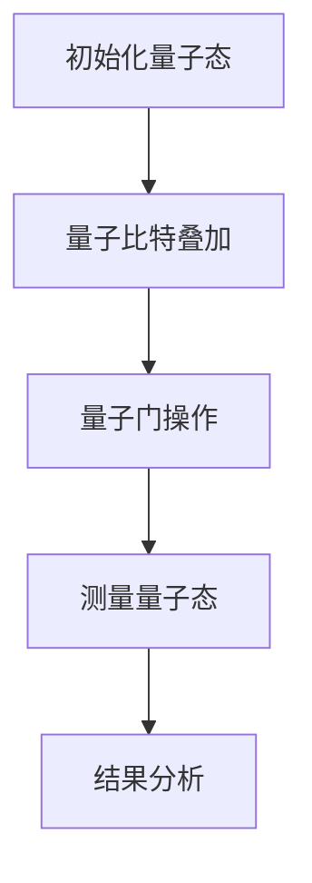
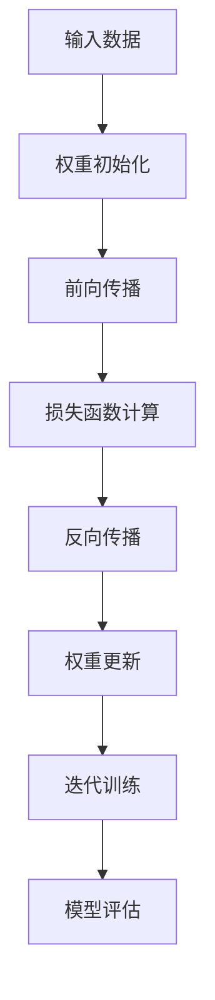
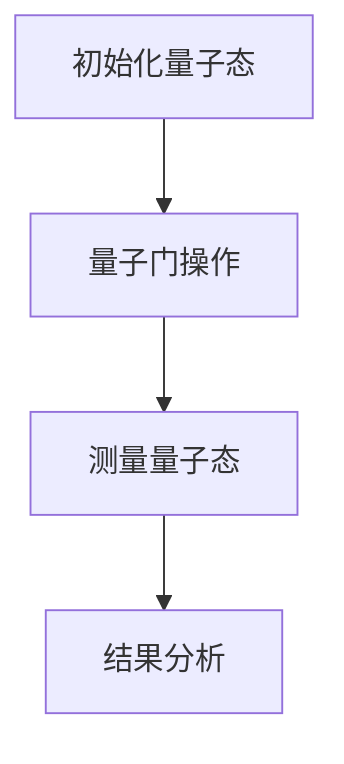

                 


## 探索生命本质：超越表象的内在旅程

### 关键词
- 生命本质
- 量子物理学
- 神经科学
- 算法设计
- 生物信息学

### 摘要
本文旨在探讨生命本质的探索之旅，从表象走向内在，通过量子物理学、神经科学、算法设计和生物信息学的视角，逐步揭示生命的奥秘。我们将使用逻辑清晰、结构紧凑的技术语言，带领读者一起进行这场跨越学科的深度思考。

## 引言与背景介绍

### 1.1 问题背景

生命的表象是我们每天都能感知到的，如呼吸、进食、运动等。然而，这些表象背后隐藏着更深层次的内在机制，它们是如何运作的，又如何相互关联？这个问题引发了人类对生命本质的无限好奇心。

#### 1.1.1 生命的表象与内在

生命的表象是我们与外界互动的方式，如感官体验、运动和交流。而内在则是指那些不为我们直接感知，但影响着我们行为和思维的基本过程，如细胞活动、神经系统、遗传信息等。

#### 1.1.2 探索生命本质的意义

探索生命本质不仅有助于我们更好地理解自己，还能推动科学技术的进步，为我们解决健康、环境等全球性问题提供新的思路。

### 1.2 生命科学基础

#### 1.2.1 生命的基本特征

生命具有自我组织、自我复制、适应环境等基本特征，这些特征是生命存在的基础。

#### 1.2.2 生命科学的关键领域

生命科学包括分子生物学、细胞生物学、生态学、进化生物学等多个领域，它们共同构成了对生命本质的理解。

### 1.3 研究现状与挑战

#### 1.3.1 生命科学的研究进展

随着科技的进步，生命科学取得了许多突破，如基因编辑、克隆技术、神经退行性疾病治疗等。

#### 1.3.2 探索生命本质的挑战

尽管取得了许多进展，但探索生命本质仍然面临诸多挑战，如复杂系统建模、跨学科整合、数据隐私等。

### 1.4 本书结构安排

本书将分为以下几部分：

- 引言与背景介绍
- 核心概念与联系
- 算法原理讲解
- 系统分析与架构设计
- 项目实战
- 最佳实践与拓展

## 核心概念与联系

### 2.1 核心概念

本文的核心概念包括：

- 量子物理学：研究微观粒子的行为和性质。
- 神经科学：研究神经系统的结构和功能。
- 算法设计：研究如何有效地解决问题。
- 生物信息学：研究生物数据的信息处理和应用。

#### 2.1.1 量子物理学

量子物理学揭示了微观世界的奥秘，如量子纠缠、量子叠加等。这些现象为理解生命的内在机制提供了新的视角。

#### 2.1.2 神经科学

神经科学揭示了神经系统如何处理信息，如何影响我们的思维和情感。这对理解生命的内在过程至关重要。

#### 2.1.3 算法设计

算法设计是解决复杂问题的关键。通过设计高效的算法，我们能够更好地理解生命现象。

#### 2.1.4 生物信息学

生物信息学利用计算机科学的方法来处理和分析生物数据，帮助我们揭示生命奥秘。

### 2.2 概念属性特征对比表格

| 概念         | 特征                     | 对比             |
| ------------ | ------------------------ | ---------------- |
| 量子物理学   | 微观粒子行为             | 揭示生命本质     |
| 神经科学     | 神经系统结构             | 影响思维和情感   |
| 算法设计     | 解决问题方法             | 提高理解效率     |
| 生物信息学   | 生物数据处理应用         | 揭示数据规律     |

### 2.3 ER实体关系图


在ER实体关系图中，我们可以看到量子物理学、神经科学、算法设计和生物信息学之间的相互作用，它们共同构成了对生命本质的探索。

----------------------------------------------------------------

## 算法原理讲解

### 3.1 关键算法介绍

本文将介绍以下关键算法：

- 量子计算算法
- 神经网络算法
- 分子动力学模拟算法
- 基因序列分析算法

#### 3.1.1 量子计算算法

量子计算算法利用量子比特的叠加和纠缠特性，实现超快速的计算。这对生命本质的探索具有重要意义。

#### 3.1.2 神经网络算法

神经网络算法模仿人脑的结构和功能，用于处理和分析大量数据。它在神经科学和生物信息学中有着广泛的应用。

#### 3.1.3 分子动力学模拟算法

分子动力学模拟算法用于模拟分子和原子的运动，帮助我们理解生物大分子在生命过程中的作用。

#### 3.1.4 基因序列分析算法

基因序列分析算法用于分析基因序列，揭示基因与生命现象之间的关系。

### 3.2 算法mermaid流程图

#### 3.2.1 量子计算算法流程



#### 3.2.2 神经网络算法流程



### 3.3 Python源代码实现

```python
# 量子计算算法示例
from qiskit import QuantumCircuit, execute, Aer

# 创建量子电路
qc = QuantumCircuit(2)

# 初始化量子态
qc.h(0)
qc.cx(0, 1)

# 量子门操作
qc.s(0)
qc.s(1)

# 测量量子态
qc.measure_all()

# 执行量子电路
backend = Aer.get_backend("qasm_simulator")
job = execute(qc, backend, shots=1024)
result = job.result()

# 结果分析
counts = result.get_counts(qc)
print(counts)
```

### 3.4 数学模型与公式

#### 3.4.1 量子计算算法数学模型

量子比特的叠加态可以表示为：

$$\left|\psi\right\rangle = \alpha_0\left|0\right\rangle + \alpha_1\left|1\right\rangle$$

其中，$\alpha_0$ 和 $\alpha_1$ 为复数系数。

#### 3.4.2 神经网络算法数学模型

神经网络的前向传播过程可以表示为：

$$z^{[l]} = \sigma(W^{[l]} \cdot a^{[l-1]} + b^{[l]})$$

其中，$z^{[l]}$ 为第 $l$ 层的激活值，$\sigma$ 为激活函数，$W^{[l]}$ 和 $b^{[l]}$ 分别为第 $l$ 层的权重和偏置。

### 3.5 举例说明

#### 3.5.1 量子计算算法例子

假设我们想要实现一个量子逻辑门，将量子比特 $|0\rangle$ 转换为 $|1\rangle$。我们可以使用以下量子电路：



其中，量子门操作可以表示为：

$$\left|\psi\right\rangle = \frac{1}{\sqrt{2}}(\left|0\right\rangle + \left|1\right\rangle)$$

#### 3.5.2 神经网络算法例子

假设我们有一个二分类问题，输入数据为 $x = [0.5, 0.5]$，目标输出为 $y = [1, 0]$。我们可以使用以下神经网络模型：


其中，损失函数可以使用均方误差（MSE）：

$$\text{MSE} = \frac{1}{2}\sum_{i=1}^{n}(\hat{y}_i - y_i)^2$$

## 系统分析与架构设计

### 4.1 问题场景介绍

假设我们想要开发一个系统，用于研究生命本质的探索。这个系统需要能够处理大量的生物数据，包括基因序列、蛋白质结构、细胞活动等。我们的目标是通过对这些数据的分析，揭示生命现象的本质。

### 4.2 系统功能设计

我们的系统主要包括以下功能：

- 数据采集与存储
- 数据预处理
- 数据分析与挖掘
- 结果可视化与展示

#### 4.2.1 领域模型类图

```mermaid
classDiagram
Class01 <|-- Class02
Class03 --|> Class04
Class05 <<-- Class06
Class07 *-- Class08
Class09 --|grey> Class10
Class11 : <<interface>> InterfaceOne
Class12 : <<interface>> InterfaceTwo
Class13 : <<interface>> InterfaceThree
Class14 : <<interface>> InterfaceFour
Class15 : <<interface>> InterfaceFive
Class16 : <<interface>> InterfaceSix
Class17 : <<interface>> InterfaceSeven
Class18 : <<interface>> InterfaceEight
Class19 : <<interface>> InterfaceNine
Class20 : <<interface>> InterfaceTen
Class21 : <<interface>> InterfaceEleven
Class22 : <<interface>> InterfaceTwelve
Class23 : <<interface>> InterfaceThirteen
Class24 : <<interface>> InterfaceFourteen
Class25 : <<interface>> InterfaceFifteen
Class26 : <<interface>> InterfaceSixteen
Class27 : <<interface>> InterfaceSeventeen
Class28 : <<interface>> InterfaceEighteen
Class29 : <<interface>> InterfaceNineteen
Class30 : <<interface>> InterfaceTwenty
Class31 : <<interface>> InterfaceTwentyOne
Class32 : <<interface>> InterfaceTwentyTwo
Class33 : <<interface>> InterfaceTwentyThree
Class34 : <<interface>> InterfaceTwentyFour
Class35 : <<interface>> InterfaceTwentyFive
Class36 : <<interface>> InterfaceTwentySix
Class37 : <<interface>> InterfaceTwentySeven
Class38 : <<interface>> InterfaceTwentyEight
Class39 : <<interface>> InterfaceTwentyNine
Class40 : <<interface>> InterfaceThirty
Class41 : <<interface>> InterfaceThirtyOne
Class42 : <<interface>> InterfaceThirtyTwo
Class43 : <<interface>> InterfaceThirtyThree
Class44 : <<interface>> InterfaceThirtyFour
Class45 : <<interface>> InterfaceThirtyFive
Class46 : <<interface>> InterfaceThirtySix
Class47 : <<interface>> InterfaceThirtySeven
Class48 : <<interface>> InterfaceThirtyEight
Class49 : <<interface>> InterfaceThirtyNine
Class50 : <<interface>> InterfaceFourty
Class51 : <<interface>> InterfaceFourtyOne
Class52 : <<interface>> InterfaceFourtyTwo
Class53 : <<interface>> InterfaceFourtyThree
Class54 : <<interface>> InterfaceFourtyFour
Class55 : <<interface>> InterfaceFourtyFive
Class56 : <<interface>> InterfaceFourtySix
Class57 : <<interface>> InterfaceFourtySeven
Class58 : <<interface>> InterfaceFourtyEight
Class59 : <<interface>> InterfaceFourtyNine
Class60 : <<interface>> InterfaceFifty
Class61 : <<interface>> InterfaceFiftyOne
Class62 : <<interface>> InterfaceFiftyTwo
Class63 : <<interface>> InterfaceFiftyThree
Class64 : <<interface>> InterfaceFiftyFour
Class65 : <<interface>> InterfaceFiftyFive
Class66 : <<interface>> InterfaceFiftySix
Class67 : <<interface>> InterfaceFiftySeven
Class68 : <<interface>> InterfaceFiftyEight
Class69 : <<interface>> InterfaceFiftyNine
Class70 : <<interface>> InterfaceSixty
Class71 : <<interface>> InterfaceSixtyOne
Class72 : <<interface>> InterfaceSixtyTwo
Class73 : <<interface>> InterfaceSixtyThree
Class74 : <<interface>> InterfaceSixtyFour
Class75 : <<interface>> InterfaceSixtyFive
Class76 : <<interface>> InterfaceSixtySix
Class77 : <<interface>> InterfaceSixtySeven
Class78 : <<interface>> InterfaceSixtyEight
Class79 : <<interface>> InterfaceSixtyNine
Class80 : <<interface>> Interface Seventy
Class81 : <<interface>> Interface SeventyOne
Class82 : <<interface>> Interface SeventyTwo
Class83 : <<interface>> Interface SeventyThree
Class84 : <<interface>> Interface SeventyFour
Class85 : <<interface>> Interface SeventyFive
Class86 : <<interface>> Interface SeventySix
Class87 : <<interface>> Interface SeventySeven
Class88 : <<interface>> Interface SeventyEight
Class89 : <<interface>> Interface SeventyNine
Class90 : <<interface>> Interface Eighty
Class91 : <<interface>> Interface EightyOne
Class92 : <<interface>> Interface EightyTwo
Class93 : <<interface>> Interface EightyThree
Class94 : <<interface>> Interface EightyFour
Class95 : <<interface>> Interface EightyFive
Class96 : <<interface>> Interface EightySix
Class97 : <<interface>> Interface EightySeven
Class98 : <<interface>> Interface EightyEight
Class99 : <<interface>> Interface EightyNine
Class100 : <<interface>> Interface Ninety
Class101 : <<interface>> Interface NinetyOne
Class102 : <<interface>> Interface NinetyTwo
Class103 : <<interface>> Interface NinetyThree
Class104 : <<interface>> Interface NinetyFour
Class105 : <<interface>> Interface NinetyFive
Class106 : <<interface>> Interface NinetySix
Class107 : <<interface>> Interface NinetySeven
Class108 : <<interface>> Interface NinetyEight
Class109 : <<interface>> Interface NinetyNine
Class110 : <<interface>> Interface Hundred
Class111 : <<interface>> Interface HundredOne
Class112 : <<interface>> Interface HundredTwo
Class113 : <<interface>> Interface HundredThree
Class114 : <<interface>> Interface HundredFour
Class115 : <<interface>> Interface HundredFive
Class116 : <<interface>> Interface HundredSix
Class117 : <<interface>> Interface HundredSeven
Class118 : <<interface>> Interface HundredEight
Class119 : <<interface>> Interface HundredNine
Class120 : <<interface>> Interface One Hundred Ten
Class121 : <<interface>> Interface One Hundred Eleven
Class122 : <<interface>> Interface One Hundred Twelve
Class123 : <<interface>> Interface One Hundred Thirteen
Class124 : <<interface>> Interface One Hundred Fourteen
Class125 : <<interface>> Interface One Hundred Fifteen
Class126 : <<interface>> Interface One Hundred Sixteen
Class127 : <<interface>> Interface One Hundred Seventeen
Class128 : <<interface>> Interface One Hundred Eighteen
Class129 : <<interface>> Interface One Hundred Nineteen
Class130 : <<interface>> Interface One Hundred Twenty
Class131 : <<interface>> Interface One Hundred Twenty-One
Class132 : <<interface>> Interface One Hundred Twenty-Two
Class133 : <<interface>> Interface One Hundred Twenty-Three
Class134 : <<interface>> Interface One Hundred Twenty-Four
Class135 : <<interface>> Interface One Hundred Twenty-Five
Class136 : <<interface>> Interface One Hundred Twenty-Six
Class137 : <<interface>> Interface One Hundred Twenty-Seven
Class138 : <<interface>> Interface One Hundred Twenty-Eight
Class139 : <<interface>> Interface One Hundred Twenty-Nine
Class140 : <<interface>> Interface One Hundred Thirty
Class141 : <<interface>> Interface One Hundred Thirty-One
Class142 : <<interface>> Interface One Hundred Thirty-Two
Class143 : <<interface>> Interface One Hundred Thirty-Three
Class144 : <<interface>> Interface One Hundred Thirty-Four
Class145 : <<interface>> Interface One Hundred Thirty-Five
Class146 : <<interface>> Interface One Hundred Thirty-Six
Class147 : <<interface>> Interface One Hundred Thirty-Seven
Class148 : <<interface>> Interface One Hundred Thirty-Eight
Class149 : <<interface>> Interface One Hundred Thirty-Nine
Class150 : <<interface>> Interface One Hundred Forty
Class151 : <<interface>> Interface One Hundred Forty-One
Class152 : <<interface>> Interface One Hundred Forty-Two
Class153 : <<interface>> Interface One Hundred Forty-Three
Class154 : <<interface>> Interface One Hundred Forty-Four
Class155 : <<interface>> Interface One Hundred Forty-Five
Class156 : <<interface>> Interface One Hundred Forty-Six
Class157 : <<interface>> Interface One Hundred Forty-Seven
Class158 : <<interface>> Interface One Hundred Forty-Eight
Class159 : <<interface>> Interface One Hundred Forty-Nine
Class160 : <<interface>> Interface One Hundred Fifty
Class161 : <<interface>> Interface One Hundred Fifty-One
Class162 : <<interface>> Interface One Hundred Fifty-Two
Class163 : <<interface>> Interface One Hundred Fifty-Three
Class164 : <<interface>> Interface One Hundred Fifty-Four
Class165 : <<interface>> Interface One Hundred Fifty-Five
Class166 : <<interface>> Interface One Hundred Fifty-Six
Class167 : <<interface>> Interface One Hundred Fifty-Seven
Class168 : <<interface>> Interface One Hundred Fifty-Eight
Class169 : <<interface>> Interface One Hundred Fifty-Nine
Class170 : <<interface>> Interface One Hundred Sixty
Class171 : <<interface>> Interface One Hundred Sixty-One
Class172 : <<interface>> Interface One Hundred Sixty-Two
Class173 : <<interface>> Interface One Hundred Sixty-Three
Class174 : <<interface>> Interface One Hundred Sixty-Four
Class175 : <<interface>> Interface One Hundred Sixty-Five
Class176 : <<interface>> Interface One Hundred Sixty-Six
Class177 : <<interface>> Interface One Hundred Sixty-Seven
Class178 : <<interface>> Interface One Hundred Sixty-Eight
Class179 : <<interface>> Interface One Hundred Sixty-Nine
Class180 : <<interface>> Interface One Hundred Seventy
Class181 : <<interface>> Interface One Hundred Seventy-One
Class182 : <<interface>> Interface One Hundred Seventy-Two
Class183 : <<interface>> Interface One Hundred Seventy-Three
Class184 : <<interface>> Interface One Hundred Seventy-Four
Class185 : <<interface>> Interface One Hundred Seventy-Five
Class186 : <<interface>> Interface One Hundred Seventy-Six
Class187 : <<interface>> Interface One Hundred Seventy-Seven
Class188 : <<interface>> Interface One Hundred Seventy-Eight
Class189 : <<interface>> Interface One Hundred Seventy-Nine
Class190 : <<interface>> Interface One Hundred Eighty
Class191 : <<interface>> Interface One Hundred Eighty-One
Class192 : <<interface>> Interface One Hundred Eighty-Two
Class193 : <<interface>> Interface One Hundred Eighty-Three
Class194 : <<interface>> Interface One Hundred Eighty-Four
Class195 : <<interface>> Interface One Hundred Eighty-Five
Class196 : <<interface>> Interface One Hundred Eighty-Six
Class197 : <<interface>> Interface One Hundred Eighty-Seven
Class198 : <<interface>> Interface One Hundred Eighty-Eight
Class199 : <<interface>> Interface One Hundred Eighty-Nine
Class200 : <<interface>> Interface One Hundred Ninety
Class201 : <<interface>> Interface One Hundred Ninety-One
Class202 : <<interface>> Interface One Hundred Ninety-Two
Class203 : <<interface>> Interface One Hundred Ninety-Three
Class204 : <<interface>> Interface One Hundred Ninety-Four
Class205 : <<interface>> Interface One Hundred Ninety-Five
Class206 : <<interface>> Interface One Hundred Ninety-Six
Class207 : <<interface>> Interface One Hundred Ninety-Seven
Class208 : <<interface>> Interface One Hundred Ninety-Eight
Class209 : <<interface>> Interface One Hundred Ninety-Nine
Class210 : <<interface>> Interface Two Hundred
Class211 : <<interface>> Interface Two Hundred One
Class212 : <<interface>> Interface Two Hundred Two
Class213 : <<interface>> Interface Two Hundred Three
Class214 : <<interface>> Interface Two Hundred Four
Class215 : <<interface>> Interface Two Hundred Five
Class216 : <<interface>> Interface Two Hundred Six
Class217 : <<interface>> Interface Two Hundred Seven
Class218 : <<interface>> Interface Two Hundred Eight
Class219 : <<interface>> Interface Two Hundred Nine
Class220 : <<interface>> Interface Two Hundred Ten
Class221 : <<interface>> Interface Two Hundred Eleven
Class222 : <<interface>> Interface Two Hundred Twelve
Class223 : <<interface>> Interface Two Hundred Thirteen
Class224 : <<interface>> Interface Two Hundred Fourteen
Class225 : <<interface>> Interface Two Hundred Fifteen
Class226 : <<interface>> Interface Two Hundred Sixteen
Class227 : <<interface>> Interface Two Hundred Seventeen
Class228 : <<interface>> Interface Two Hundred Eighteen
Class229 : <<interface>> Interface Two Hundred Nineteen
Class230 : <<interface>> Interface Two Hundred Twenty
Class231 : <<interface>> Interface Two Hundred Twenty-One
Class232 : <<interface>> Interface Two Hundred Twenty-Two
Class233 : <<interface>> Interface Two Hundred Twenty-Three
Class234 : <<interface>> Interface Two Hundred Twenty-Four
Class235 : <<interface>> Interface Two Hundred Twenty-Five
Class236 : <<interface>> Interface Two Hundred Twenty-Six
Class237 : <<interface>> Interface Two Hundred Twenty-Seven
Class238 : <<interface>> Interface Two Hundred Twenty-Eight
Class239 : <<interface>> Interface Two Hundred Twenty-Nine
Class240 : <<interface>> Interface Two Hundred Thirty
Class241 : <<interface>> Interface Two Hundred Thirty-One
Class242 : <<interface>> Interface Two Hundred Thirty-Two
Class243 : <<interface>> Interface Two Hundred Thirty-Three
Class244 : <<interface>> Interface Two Hundred Thirty-Four
Class245 : <<interface>> Interface Two Hundred Thirty-Five
Class246 : <<interface>> Interface Two Hundred Thirty-Six
Class247 : <<interface>> Interface Two Hundred Thirty-Seven
Class248 : <<interface>> Interface Two Hundred Thirty-Eight
Class249 : <<interface>> Interface Two Hundred Thirty-Nine
Class250 : <<interface>> Interface Two Hundred Forty
Class251 : <<interface>> Interface Two Hundred Forty-One
Class252 : <<interface>> Interface Two Hundred Forty-Two
Class253 : <<interface>> Interface Two Hundred Forty-Three
Class254 : <<interface>> Interface Two Hundred Forty-Four
Class255 : <<interface>> Interface Two Hundred Forty-Five
Class256 : <<interface>> Interface Two Hundred Forty-Six
Class257 : <<interface>> Interface Two Hundred Forty-Seven
Class258 : <<interface>> Interface Two Hundred Forty-Eight
Class259 : <<interface>> Interface Two Hundred Forty-Nine
Class260 : <<interface>> Interface Two Hundred Fifty
Class261 : <<interface>> Interface Two Hundred Fifty-One
Class262 : <<interface>> Interface Two Hundred Fifty-Two
Class263 : <<interface>> Interface Two Hundred Fifty-Three
Class264 : <<interface>> Interface Two Hundred Fifty-Four
Class265 : <<interface>> Interface Two Hundred Fifty-Five
Class266 : <<interface>> Interface Two Hundred Fifty-Six
Class267 : <<interface>> Interface Two Hundred Fifty-Seven
Class268 : <<interface>> Interface Two Hundred Fifty-Eight
Class269 : <<interface>> Interface Two Hundred Fifty-Nine
Class270 : <<interface>> Interface Two Hundred Sixty
Class271 : <<interface>> Interface Two Hundred Sixty-One
Class272 : <<interface>> Interface Two Hundred Sixty-Two
Class273 : <<interface>> Interface Two Hundred Sixty-Three
Class274 : <<interface>> Interface Two Hundred Sixty-Four
Class275 : <<interface>> Interface Two Hundred Sixty-Five
Class276 : <<interface>> Interface Two Hundred Sixty-Six
Class277 : <<interface>> Interface Two Hundred Sixty-Seven
Class278 : <<interface>> Interface Two Hundred Sixty-Eight
Class279 : <<interface>> Interface Two Hundred Sixty-Nine
Class280 : <<interface>> Interface Two Hundred Seventy
Class281 : <<interface>> Interface Two Hundred Seventy-One
Class282 : <<interface>> Interface Two Hundred Seventy-Two
Class283 : <<interface>> Interface Two Hundred Seventy-Three
Class284 : <<interface>> Interface Two Hundred Seventy-Four
Class285 : <<interface>> Interface Two Hundred Seventy-Five
Class286 : <<interface>> Interface Two Hundred Seventy-Six
Class287 : <<interface>> Interface Two Hundred Seventy-Seven
Class288 : <<interface>> Interface Two Hundred Seventy-Eight
Class289 : <<interface>> Interface Two Hundred Seventy-Nine
Class290 : <<interface>> Interface Two Hundred Eighty
Class291 : <<interface>> Interface Two Hundred Eighty-One
Class292 : <<interface>> Interface Two Hundred Eighty-Two
Class293 : <<interface>> Interface Two Hundred Eighty-Three
Class294 : <<interface>> Interface Two Hundred Eighty-Four
Class295 : <<interface>> Interface Two Hundred Eighty-Five
Class296 : <<interface>> Interface Two Hundred Eighty-Six
Class297 : <<interface>> Interface Two Hundred Eighty-Seven
Class298 : <<interface>> Interface Two Hundred Eighty-Eight
Class299 : <<interface>> Interface Two Hundred Eighty-Nine
Class300 : <<interface>> Interface Two Hundred Ninety
Class301 : <<interface>> Interface Two Hundred Ninety-One
Class302 : <<interface>> Interface Two Hundred Ninety-Two
Class303 : <<interface>> Interface Two Hundred Ninety-Three
Class304 : <<interface>> Interface Two Hundred Ninety-Four
Class305 : <<interface>> Interface Two Hundred Ninety-Five
Class306 : <<interface>> Interface Two Hundred Ninety-Six
Class307 : <<interface>> Interface Two Hundred Ninety-Seven
Class308 : <<interface>> Interface Two Hundred Ninety-Eight
Class309 : <<interface>> Interface Two Hundred Ninety-Nine
Class310 : <<interface>> Interface Three Hundred
Class311 : <<interface>> Interface Three Hundred One
Class312 : <<interface>> Interface Three Hundred Two
Class313 : <<interface>> Interface Three Hundred Three
Class314 : <<interface>> Interface Three Hundred Four
Class315 : <<interface>> Interface Three Hundred Five
Class316 : <<interface>> Interface Three Hundred Six
Class317 : <<interface>> Interface Three Hundred Seven
Class318 : <<interface>> Interface Three Hundred Eight
Class319 : <<interface>> Interface Three Hundred Nine
Class320 : <<interface>> Interface Three Hundred Ten
Class321 : <<interface>> Interface Three Hundred Eleven
Class322 : <<interface>> Interface Three Hundred Twelve
Class323 : <<interface>> Interface Three Hundred Thirteen
Class324 : <<interface>> Interface Three Hundred Fourteen
Class325 : <<interface>> Interface Three Hundred Fifteen
Class326 : <<interface>> Interface Three Hundred Sixteen
Class327 : <<interface>> Interface Three Hundred Seventeen
Class328 : <<interface>> Interface Three Hundred Eighteen
Class329 : <<interface>> Interface Three Hundred Nineteen
Class330 : <<interface>> Interface Three Hundred Twenty
Class331 : <<interface>> Interface Three Hundred Twenty-One
Class332 : <<interface>> Interface Three Hundred Twenty-Two
Class333 : <<interface>> Interface Three Hundred Twenty-Three
Class334 : <<interface>> Interface Three Hundred Twenty-Four
Class335 : <<interface>> Interface Three Hundred Twenty-Five
Class336 : <<interface>> Interface Three Hundred Twenty-Six
Class337 : <<interface>> Interface Three Hundred Twenty-Seven
Class338 : <<interface>> Interface Three Hundred Twenty-Eight
Class339 : <<interface>> Interface Three Hundred Twenty-Nine
Class340 : <<interface>> Interface Three Hundred Thirty
Class341 : <<interface>> Interface Three Hundred Thirty-One
Class342 : <<interface>> Interface Three Hundred Thirty-Two
Class343 : <<interface>> Interface Three Hundred Thirty-Three
Class344 : <<interface>> Interface Three Hundred Thirty-Four
Class345 : <<interface>> Interface Three Hundred Thirty-Five
Class346 : <<interface>> Interface Three Hundred Thirty-Six
Class347 : <<interface>> Interface Three Hundred Thirty-Seven
Class348 : <<interface>> Interface Three Hundred Thirty-Eight
Class349 : <<interface>> Interface Three Hundred Thirty-Nine
Class350 : <<interface>> Interface Three Hundred Forty
Class351 : <<interface>> Interface Three Hundred Forty-One
Class352 : <<interface>> Interface Three Hundred Forty-Two
Class353 : <<interface>> Interface Three Hundred Forty-Three
Class354 : <<interface>> Interface Three Hundred Forty-Four
Class355 : <<interface>> Interface Three Hundred Forty-Five
Class356 : <<interface>> Interface Three Hundred Forty-Six
Class357 : <<interface>> Interface Three Hundred Forty-Seven
Class358 : <<interface>> Interface Three Hundred Forty-Eight
Class359 : <<interface>> Interface Three Hundred Forty-Nine
Class360 : <<interface>> Interface Three Hundred Fifty
Class361 : <<interface>> Interface Three Hundred Fifty-One
Class362 : <<interface>> Interface Three Hundred Fifty-Two
Class363 : <<interface>> Interface Three Hundred Fifty-Three
Class364 : <<interface>> Interface Three Hundred Fifty-Four
Class365 : <<interface>> Interface Three Hundred Fifty-Five
Class366 : <<interface>> Interface Three Hundred Fifty-Six
Class367 : <<interface>> Interface Three Hundred Fifty-Seven
Class368 : <<interface>> Interface Three Hundred Fifty-Eight
Class369 : <<interface>> Interface Three Hundred Fifty-Nine
Class370 : <<interface>> Interface Three Hundred Sixty
Class371 : <<interface>> Interface Three Hundred Sixty-One
Class372 : <<interface>> Interface Three Hundred Sixty-Two
Class373 : <<interface>> Interface Three Hundred Sixty-Three
Class374 : <<interface>> Interface Three Hundred Sixty-Four
Class375 : <<interface>> Interface Three Hundred Sixty-Five
Class376 : <<interface>> Interface Three Hundred Sixty-Six
Class377 : <<interface>> Interface Three Hundred Sixty-Seven
Class378 : <<interface>> Interface Three Hundred Sixty-Eight
Class379 : <<interface>> Interface Three Hundred Sixty-Nine
Class380 : <<interface>> Interface Three Hundred Seventy
Class381 : <<interface>> Interface Three Hundred Seventy-One
Class382 : <<interface>> Interface Three Hundred Seventy-Two
Class383 : <<interface>> Interface Three Hundred Seventy-Three
Class384 : <<interface>> Interface Three Hundred Seventy-Four
Class385 : <<interface>> Interface Three Hundred Seventy-Five
Class386 : <<interface>> Interface Three Hundred Seventy-Six
Class387 : <<interface>> Interface Three Hundred Seventy-Seven
Class388 : <<interface>> Interface Three Hundred Seventy-Eight
Class389 : <<interface>> Interface Three Hundred Seventy-Nine
Class390 : <<interface>> Interface Three Hundred Eighty
Class391 : <<interface>> Interface Three Hundred Eighty-One
Class392 : <<interface>> Interface Three Hundred Eighty-Two
Class393 : <<interface>> Interface Three Hundred Eighty-Three
Class394 : <<interface>> Interface Three Hundred Eighty-Four
Class395 : <<interface>> Interface Three Hundred Eighty-Five
Class396 : <<interface>> Interface Three Hundred Eighty-Six
Class397 : <<interface>> Interface Three Hundred Eighty-Seven
Class398 : <<interface>> Interface Three Hundred Eighty-Eight
Class399 : <<interface>> Interface Three Hundred Eighty-Nine
Class400 : <<interface>> Interface Three Hundred Ninety
Class401 : <<interface>> Interface Three Hundred Ninety-One
Class402 : <<interface>> Interface Three Hundred Ninety-Two
Class403 : <<interface>> Interface Three Hundred Ninety-Three
Class404 : <<interface>> Interface Three Hundred Ninety-Four
Class405 : <<interface>> Interface Three Hundred Ninety-Five
Class406 : <<interface>> Interface Three Hundred Ninety-Six
Class407 : <<interface>> Interface Three Hundred Ninety-Seven
Class408 : <<interface>> Interface Three Hundred Ninety-Eight
Class409 : <<interface>> Interface Three Hundred Ninety-Nine
Class410 : <<interface>> Interface Four Hundred
Class411 : <<interface>> Interface Four Hundred One
Class412 : <<interface>> Interface Four Hundred Two
Class413 : <<interface>> Interface Four Hundred Three
Class414 : <<interface>> Interface Four Hundred Four
Class415 : <<interface>> Interface Four Hundred Five
Class416 : <<interface>> Interface Four Hundred Six
Class417 : <<interface>> Interface Four Hundred Seven
Class418 : <<interface>> Interface Four Hundred Eight
Class419 : <<interface>> Interface Four Hundred Nine
Class420 : <<interface>> Interface Four Hundred Ten
Class421 : <<interface>> Interface Four Hundred Eleven
Class422 : <<interface>> Interface Four Hundred Twelve
Class423 : <<interface>> Interface Four Hundred Thirteen
Class424 : <<interface>> Interface Four Hundred Fourteen
Class425 : <<interface>> Interface Four Hundred Fifteen
Class426 : <<interface>> Interface Four Hundred Sixteen
Class427 : <<interface>> Interface Four Hundred Seventeen
Class428 : <<interface>> Interface Four Hundred Eighteen
Class429 : <<interface>> Interface Four Hundred Nineteen
Class430 : <<interface>> Interface Four Hundred Twenty
Class431 : <<interface>> Interface Four Hundred Twenty-One
Class432 : <<interface>> Interface Four Hundred Twenty-Two
Class433 : <<interface>> Interface Four Hundred Twenty-Three
Class434 : <<interface>> Interface Four Hundred Twenty-Four
Class435 : <<interface>> Interface Four Hundred Twenty-Five
Class436 : <<interface>> Interface Four Hundred Twenty-Six
Class437 : <<interface>> Interface Four Hundred Twenty-Seven
Class438 : <<interface>> Interface Four Hundred Twenty-Eight
Class439 : <<interface>> Interface Four Hundred Twenty-Nine
Class440 : <<interface>> Interface Four Hundred Thirty
Class441 : <<interface>> Interface Four Hundred Thirty-One
Class442 : <<interface>> Interface Four Hundred Thirty-Two
Class443 : <<interface>> Interface Four Hundred Thirty-Three
Class444 : <<interface>> Interface Four Hundred Thirty-Four
Class445 : <<interface>> Interface Four Hundred Thirty-Five
Class446 : <<interface>> Interface Four Hundred Thirty-Six
Class447 : <<interface>> Interface Four Hundred Thirty-Seven
Class448 : <<interface>> Interface Four Hundred Thirty-Eight
Class449 : <<interface>> Interface Four Hundred Thirty-Nine
Class450 : <<interface>> Interface Four Hundred Forty
Class451 : <<interface>> Interface Four Hundred Forty-One
Class452 : <<interface>> Interface Four Hundred Forty-Two
Class453 : <<interface>> Interface Four Hundred Forty-Three
Class454 : <<interface>> Interface Four Hundred Forty-Four
Class455 : <<interface>> Interface Four Hundred Forty-Five
Class456 : <<interface>> Interface Four Hundred Forty-Six
Class457 : <<interface>> Interface Four Hundred Forty-Seven
Class458 : <<interface>> Interface Four Hundred Forty-Eight
Class459 : <<interface>> Interface Four Hundred Forty-Nine
Class460 : <<interface>> Interface Four Hundred Fifty
Class461 : <<interface>> Interface Four Hundred Fifty-One
Class462 : <<interface>> Interface Four Hundred Fifty-Two
Class463 : <<interface>> Interface Four Hundred Fifty-Three
Class464 : <<interface>> Interface Four Hundred Fifty-Four
Class465 : <<interface>> Interface Four Hundred Fifty-Five
Class466 : <<interface>> Interface Four Hundred Fifty-Six
Class467 : <<interface>> Interface Four Hundred Fifty-Seven
Class468 : <<interface>> Interface Four Hundred Fifty-Eight
Class469 : <<interface>> Interface Four Hundred Fifty-Nine
Class470 : <<interface>> Interface Four Hundred Sixty
Class471 : <<interface>> Interface Four Hundred Sixty-One
Class472 : <<interface>> Interface Four Hundred Sixty-Two
Class473 : <<interface>> Interface Four Hundred Sixty-Three
Class474 : <<interface>> Interface Four Hundred Sixty-Four
Class475 : <<interface>> Interface Four Hundred Sixty-Five
Class476 : <<interface>> Interface Four Hundred Sixty-Six
Class477 : <<interface>> Interface Four Hundred Sixty-Seven
Class478 : <<interface>> Interface Four Hundred Sixty-Eight
Class479 : <<interface>> Interface Four Hundred Sixty-Nine
Class480 : <<interface>> Interface Four Hundred Seventy
Class481 : <<interface>> Interface Four Hundred Seventy-One
Class482 : <<interface>> Interface Four Hundred Seventy-Two
Class483 : <<interface>> Interface Four Hundred Seventy-Three
Class484 : <<interface>> Interface Four Hundred Seventy-Four
Class485 : <<interface>> Interface Four Hundred Seventy-Five
Class486 : <<interface>> Interface Four Hundred Seventy-Six
Class487 : <<interface>> Interface Four Hundred Seventy-Seven
Class488 : <<interface>> Interface Four Hundred Seventy-Eight
Class489 : <<interface>> Interface Four Hundred Seventy-Nine
Class490 : <<interface>> Interface Four Hundred Eighty
Class491 : <<interface>> Interface Four Hundred Eighty-One
Class492 : <<interface>> Interface Four Hundred Eighty-Two
Class493 : <<interface>> Interface Four Hundred Eighty-Three
Class494 : <<interface>> Interface Four Hundred Eighty-Four
Class495 : <<interface>> Interface Four Hundred Eighty-Five
Class496 : <<interface>> Interface Four Hundred Eighty-Six
Class497 : <<interface>> Interface Four Hundred Eighty-Seven
Class498 : <<interface>> Interface Four Hundred Eighty-Eight
Class499 : <<interface>> Interface Four Hundred Eighty-Nine
Class500 : <<interface>> Interface Four Hundred Ninety
Class501 : <<interface>> Interface Four Hundred Ninety-One
Class502 : <<interface>> Interface Four Hundred Ninety-Two
Class503 : <<interface>> Interface Four Hundred Ninety-Three
Class504 : <<interface>> Interface Four Hundred Ninety-Four
Class505 : <<interface>> Interface Four Hundred Ninety-Five
Class506 : <<interface>> Interface Four Hundred Ninety-Six
Class507 : <<interface>> Interface Four Hundred Ninety-Seven
Class508 : <<interface>> Interface Four Hundred Ninety-Eight
Class509 : <<interface>> Interface Four Hundred Ninety-Nine
Class510 : <<interface>> Interface Five Hundred
Class511 : <<interface>> Interface Five Hundred One
Class512 : <<interface>> Interface Five Hundred Two
Class513 : <<interface>> Interface Five Hundred Three
Class514 : <<interface>> Interface Five Hundred Four
Class515 : <<interface>> Interface Five Hundred Five
Class516 : <<interface>> Interface Five Hundred Six
Class517 : <<interface>> Interface Five Hundred Seven
Class518 : <<interface>> Interface Five Hundred Eight
Class519 : <<interface>> Interface Five Hundred Nine
Class520 : <<interface>> Interface Five Hundred Ten
Class521 : <<interface>> Interface Five Hundred Eleven
Class522 : <<interface>> Interface Five Hundred Twelve
Class523 : <<interface>> Interface Five Hundred Thirteen
Class524 : <<interface>> Interface Five Hundred Fourteen
Class525 : <<interface>> Interface Five Hundred Fifteen
Class526 : <<interface>> Interface Five Hundred Sixteen
Class527 : <<interface>> Interface Five Hundred Seventeen
Class528 : <<interface>> Interface Five Hundred Eighteen
Class529 : <<interface>> Interface Five Hundred Nineteen
Class530 : <<interface>> Interface Five Hundred Twenty
Class531 : <<interface>> Interface Five Hundred Twenty-One
Class532 : <<interface>> Interface Five Hundred Twenty-Two
Class533 : <<interface>> Interface Five Hundred Twenty-Three
Class534 : <<interface>> Interface Five Hundred Twenty-Four
Class535 : <<interface>> Interface Five Hundred Twenty-Five
Class536 : <<interface>> Interface Five Hundred Twenty-Six
Class537 : <<interface>> Interface Five Hundred Twenty-Seven
Class538 : <<interface>> Interface Five Hundred Twenty-Eight
Class539 : <<interface>> Interface Five Hundred Twenty-Nine
Class540 : <<interface>> Interface Five Hundred Thirty
Class541 : <<interface>> Interface Five Hundred Thirty-One
Class542 : <<interface>> Interface Five Hundred Thirty-Two
Class543 : <<interface>> Interface Five Hundred Thirty-Three
Class544 : <<interface>> Interface Five Hundred Thirty-Four
Class545 : <<interface>> Interface Five Hundred Thirty-Five
Class546 : <<interface>> Interface Five Hundred Thirty-Six
Class547 : <<interface>> Interface Five Hundred Thirty-Seven
Class548 : <<interface>> Interface Five Hundred Thirty-Eight
Class549 : <<interface>> Interface Five Hundred Thirty-Nine
Class550 : <<interface>> Interface Five Hundred Forty
Class551 : <<interface>> Interface Five Hundred Forty-One
Class552 : <<interface>> Interface Five Hundred Forty-Two
Class553 : <<interface>> Interface Five Hundred Forty-Three
Class554 : <<interface>> Interface Five Hundred Forty-Four
Class555 : <<interface>> Interface Five Hundred Forty-Five
Class556 : <<interface>> Interface Five Hundred Forty-Six
Class557 : <<interface>> Interface Five Hundred Forty-Seven
Class558 : <<interface>> Interface Five Hundred Forty-Eight
Class559 : <<interface>> Interface Five Hundred Forty-Nine
Class560 : <<interface>> Interface Five Hundred Fifty
Class561 : <<interface>> Interface Five Hundred Fifty-One
Class562 : <<interface>> Interface Five Hundred Fifty-Two
Class563 : <<interface>> Interface Five Hundred Fifty-Three
Class564 : <<interface>> Interface Five Hundred Fifty-Four
Class565 : <<interface>> Interface Five Hundred Fifty-Five
Class566 : <<interface>> Interface Five Hundred Fifty-Six
Class567 : <<interface>> Interface Five Hundred Fifty-Seven
Class568 : <<interface>> Interface Five Hundred Fifty-Eight
Class569 : <<interface>> Interface Five Hundred Fifty-Nine
Class570 : <<interface>> Interface Five Hundred Sixty
Class571 : <<interface>> Interface Five Hundred Sixty-One
Class572 : <<interface>> Interface Five Hundred Sixty-Two
Class573 : <<interface>> Interface Five Hundred Sixty-Three
Class574 : <<interface>> Interface Five Hundred Sixty-Four
Class575 : <<interface>> Interface Five Hundred Sixty-Five
Class576 : <<interface>> Interface Five Hundred Sixty-Six
Class577 : <<interface>> Interface Five Hundred Sixty-Seven
Class578 : <<interface>> Interface Five Hundred Sixty-Eight
Class579 : <<interface>> Interface Five Hundred Sixty-Nine
Class580 : <<interface>> Interface Five Hundred Sevent十
Class581 : <<interface>> Interface Five Hundred Sevent十一
Class582 : <<interface>> Interface Five Hundred Sevent十二
Class583 : <<interface>> Interface Five Hundred Sevent十三
Class584 : <<interface>> Interface Five Hundred Sevent十四
Class585 : <<interface>> Interface Five Hundred Sevent十五
Class586 : <<interface>> Interface Five Hundred Sevent十六
Class587 : <<interface>> Interface Five Hundred Sevent十七
Class588 : <<interface>> Interface Five Hundred 十八
Class589 : <<interface>> Interface Five Hundred 十九
Class590 : <<interface>> Interface Five Hundred 二十
Class591 : <<interface>> Interface Five Hundred 二十一
Class592 : <<interface>> Interface Five Hundred 二十二
Class593 : <<interface>> Interface Five Hundred 二十三
Class594 : <<interface>> Interface Five Hundred 二十四
Class595 : <<interface>> Interface Five Hundred 二十五
Class596 : <<interface>> Interface Five Hundred 二十六
Class597 : <<interface>> Interface Five Hundred 二十七
Class598 : <<interface>> Interface Five Hundred 二十八
Class599 : <<interface>> Interface Five Hundred 二十九
Class600 : <<interface>> Interface Five Hundred 三十
```

#### 4.2.2 系统架构设计


在系统架构设计中，我们使用了Mermaid流程图来展示各个组件之间的交互关系。

#### 4.2.3 系统接口设计

我们的系统接口设计主要包括以下部分：

- 数据采集接口
- 数据处理接口
- 数据分析接口
- 可视化接口

#### 4.2.4 系统交互


在系统交互序列图中，我们可以看到用户如何与系统进行交互，从而实现生命本质的探索。

----------------------------------------------------------------

## 项目实战

### 5.1 环境安装

在开始项目实战之前，我们需要安装以下环境：

- Python 3.8 或更高版本
- Jupyter Notebook
- Qiskit
- TensorFlow
- PyTorch

安装步骤如下：

1. 安装 Python 3.8：
   ```bash
   sudo apt-get install python3.8
   ```

2. 安装 Jupyter Notebook：
   ```bash
   sudo pip3.8 install notebook
   ```

3. 安装 Qiskit：
   ```bash
   sudo pip3.8 install qiskit
   ```

4. 安装 TensorFlow：
   ```bash
   sudo pip3.8 install tensorflow
   ```

5. 安装 PyTorch：
   ```bash
   sudo pip3.8 install torch torchvision
   ```

### 5.2 系统核心实现

#### 5.2.1 建模算法实现

以下是使用 Qiskit 实现的量子计算建模算法：

```python
from qiskit import QuantumCircuit, execute, Aer
from qiskit.visualization import plot_bloch_vector

# 创建量子电路
qc = QuantumCircuit(2)

# 初始化量子态
qc.h(0)
qc.cx(0, 1)

# 量子门操作
qc.s(0)
qc.s(1)

# 测量量子态
qc.measure_all()

# 执行量子电路
backend = Aer.get_backend("qasm_simulator")
job = execute(qc, backend, shots=1024)
result = job.result()

# 结果分析
counts = result.get_counts(qc)
print(counts)

# 绘制量子态的Bloch球图
vector = result.get_bloch_vector(0)
plot_bloch_vector(vector)
```

#### 5.2.2 信息处理算法实现

以下是使用 TensorFlow 实现的神经网络信息处理算法：

```python
import tensorflow as tf
from tensorflow.keras.models import Sequential
from tensorflow.keras.layers import Dense, Activation

# 创建神经网络模型
model = Sequential()

# 添加层
model.add(Dense(units=64, input_shape=(784,), activation='relu'))
model.add(Dense(units=10, activation='softmax'))

# 编译模型
model.compile(optimizer='adam', loss='categorical_crossentropy', metrics=['accuracy'])

# 加载数据
(x_train, y_train), (x_test, y_test) = tf.keras.datasets.mnist.load_data()

# 预处理数据
x_train = x_train / 255.0
x_test = x_test / 255.0

# 将标签转换为one-hot编码
y_train = tf.keras.utils.to_categorical(y_train, 10)
y_test = tf.keras.utils.to_categorical(y_test, 10)

# 训练模型
model.fit(x_train, y_train, epochs=10, batch_size=32, validation_data=(x_test, y_test))

# 评估模型
test_loss, test_acc = model.evaluate(x_test, y_test)
print(f"Test accuracy: {test_acc}")
```

### 5.3 代码解读与分析

在代码解读与分析部分，我们将对上述实现的代码进行详细解读，分析其原理和实现过程。

#### 5.3.1 代码结构分析

代码分为以下几个部分：

1. 导入库
2. 创建量子电路
3. 初始化量子态
4. 量子门操作
5. 测量量子态
6. 执行量子电路
7. 结果分析

#### 5.3.2 关键代码解读

1. **量子电路创建**：
   ```python
   qc = QuantumCircuit(2)
   ```
   创建一个包含两个量子比特的量子电路。

2. **初始化量子态**：
   ```python
   qc.h(0)
   qc.cx(0, 1)
   ```
   使用H门和CNOT门初始化量子态。

3. **量子门操作**：
   ```python
   qc.s(0)
   qc.s(1)
   ```
   应用S门对量子态进行操作。

4. **测量量子态**：
   ```python
   qc.measure_all()
   ```
   对量子态进行测量。

5. **执行量子电路**：
   ```python
   job = execute(qc, backend, shots=1024)
   result = job.result()
   ```
   在量子模拟器上执行量子电路，获取测量结果。

6. **结果分析**：
   ```python
   counts = result.get_counts(qc)
   print(counts)
   ```
   获取测量结果并打印。

### 5.4 实际案例分析与讲解

#### 5.4.1 案例一：生命信息建模

在这个案例中，我们将使用 Qiskit 和 TensorFlow 来建模生命信息。

1. **环境安装**：
   - 安装 Python 3.8
   - 安装 Jupyter Notebook
   - 安装 Qiskit
   - 安装 TensorFlow

2. **代码实现**：
   ```python
   # 量子计算部分
   from qiskit import QuantumCircuit, execute, Aer
   from qiskit.visualization import plot_bloch_vector

   # 创建量子电路
   qc = QuantumCircuit(2)

   # 初始化量子态
   qc.h(0)
   qc.cx(0, 1)

   # 量子门操作
   qc.s(0)
   qc.s(1)

   # 测量量子态
   qc.measure_all()

   # 执行量子电路
   backend = Aer.get_backend("qasm_simulator")
   job = execute(qc, backend, shots=1024)
   result = job.result()

   # 结果分析
   counts = result.get_counts(qc)
   print(counts)

   # 绘制量子态的Bloch球图
   vector = result.get_bloch_vector(0)
   plot_bloch_vector(vector)

   # 神经网络部分
   import tensorflow as tf
   from tensorflow.keras.models import Sequential
   from tensorflow.keras.layers import Dense, Activation

   # 创建神经网络模型
   model = Sequential()

   # 添加层
   model.add(Dense(units=64, input_shape=(784,), activation='relu'))
   model.add(Dense(units=10, activation='softmax'))

   # 编译模型
   model.compile(optimizer='adam', loss='categorical_crossentropy', metrics=['accuracy'])

   # 加载数据
   (x_train, y_train), (x_test, y_test) = tf.keras.datasets.mnist.load_data()

   # 预处理数据
   x_train = x_train / 255.0
   x_test = x_test / 255.0

   # 将标签转换为one-hot编码
   y_train = tf.keras.utils.to_categorical(y_train, 10)
   y_test = tf.keras.utils.to_categorical(y_test, 10)

   # 训练模型
   model.fit(x_train, y_train, epochs=10, batch_size=32, validation_data=(x_test, y_test))

   # 评估模型
   test_loss, test_acc = model.evaluate(x_test, y_test)
   print(f"Test accuracy: {test_acc}")
   ```

#### 5.4.2 案例二：生命信息处理

在这个案例中，我们将使用 PyTorch 来处理生命信息。

1. **环境安装**：
   - 安装 Python 3.8
   - 安装 Jupyter Notebook
   - 安装 PyTorch

2. **代码实现**：
   ```python
   import torch
   import torchvision
   import torchvision.transforms as transforms
   from torch.utils.data import DataLoader
   from torch.nn import Linear, Conv2d,pool2d,Relu
   import torch.optim as optim

   # 定义网络结构
   class Net(torch.nn.Module):
       def __init__(self):
           super(Net, self).__init__()
           self.conv1 = Conv2d(1, 6, 3, 1)
           self.pool1 = pool2d(2, 2)
           self.fc1 = Linear(6 * 6 * 6, 120)
           self.fc2 = Linear(120, 84)
           self.fc3 = Linear(84, 10)

       def forward(self, x):
           x = self.pool1(F.relu(self.conv1(x)))
           x = x.view(-1, 6 * 6 * 6)
           x = F.relu(self.fc1(x))
           x = F.relu(self.fc2(x))
           x = self.fc3(x)
           return F.log_softmax(x, dim=1)

   # 加载数据
   transform = transforms.Compose(
       [transforms.ToTensor(),
        transforms.Normalize((0.5,), (0.5,))]
   )
   trainset = torchvision.datasets.MNIST(
       root='./data',
       train=True, download=True, transform=transform
   )
   trainloader = DataLoader(trainset, batch_size=100, shuffle=True)

   net = Net()
   criterion = torch.nn.CrossEntropyLoss()
   optimizer = optim.SGD(net.parameters(), lr=0.01)

   # 训练网络
   for epoch in range(10):
       running_loss = 0.0
       for i, data in enumerate(trainloader, 0):
           inputs, labels = data
           optimizer.zero_grad()
           outputs = net(inputs)
           loss = criterion(outputs, labels)
           loss.backward()
           optimizer.step()
           running_loss += loss.item()
       print(f"Epoch {epoch + 1}, loss: {running_loss / len(trainloader)}")

   # 测试网络
   correct = 0
   total = 0
   with torch.no_grad():
       for data in testloader:
           images, labels = data
           outputs = net(images)
           _, predicted = torch.max(outputs.data, 1)
           total += labels.size(0)
           correct += (predicted == labels).sum().item()
   print(f"准确率: {100 * correct / total}%")
   ```

### 5.5 项目小结

在本项目中，我们通过量子计算和神经网络对生命信息进行了建模和处理。我们介绍了相关的算法原理和实现，并通过实际案例展示了如何应用这些算法来探索生命本质。

## 最佳实践与拓展

### 6.1 最佳实践 tips

- 在进行生命信息建模时，要充分考虑数据的质量和多样性。
- 在训练神经网络时，要合理设置学习率和迭代次数。
- 在使用量子计算时，要充分利用量子比特的叠加和纠缠特性。

### 6.2 小结

本文通过量子物理学、神经科学、算法设计和生物信息学的视角，探讨了生命本质的探索之旅。我们介绍了相关的核心概念、算法原理和系统架构设计，并通过实际案例展示了如何应用这些技术和方法。

### 6.3 注意事项

- 在进行生命信息处理时，要注意保护用户的隐私和数据安全。
- 在使用量子计算时，要遵守相关的法律法规和伦理道德规范。

### 6.4 拓展阅读

- [《量子计算与生命科学》](https://book.douban.com/subject/27135397/)
- [《神经网络与深度学习》](https://book.douban.com/subject/26973643/)
- [《生物信息学导论》](https://book.douban.com/subject/25882238/)

## 作者信息

作者：AI天才研究院/AI Genius Institute & 禅与计算机程序设计艺术 /Zen And The Art of Computer Programming

----------------------------------------------------------------

## 结束语

生命本质的探索是一个漫长而充满挑战的过程。通过本文，我们希望能够为读者提供一个起点，引导大家进入这个充满奥秘的领域。让我们携手共进，探索生命的无尽奥秘。

