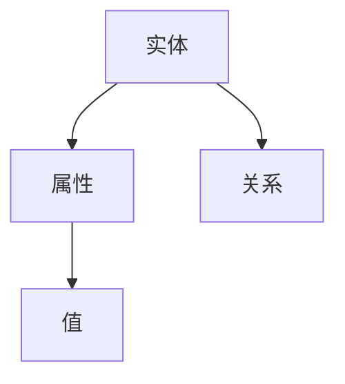
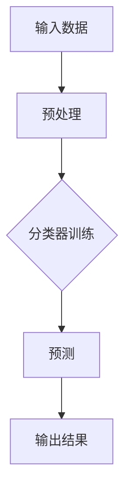
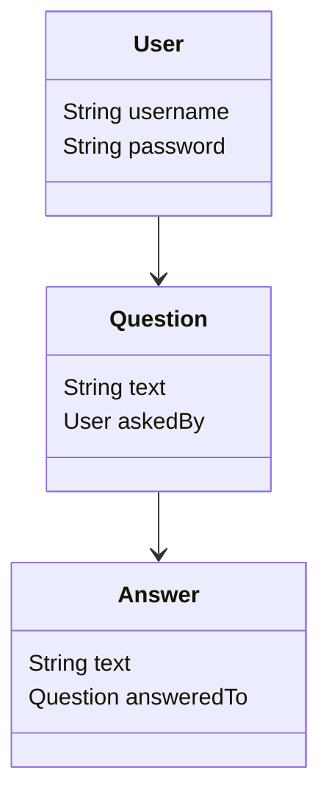

                 

**### 1. 背景介绍：**

**核心概念术语说明：** 概念学习、推理过程、机器学习、认知心理学、人工智能理论、知识图谱、分类算法、神经网络、数据标注、数据集构建、迁移学习、概念泛化、感知与识别、知识提取与归纳、联想与记忆。

**问题背景：** 随着人工智能的快速发展，机器学习在各个领域取得了显著的成果，然而机器学习模型在处理复杂问题时，往往依赖于大量的标注数据和复杂的算法。这就引发了一个重要的问题：如何让机器学习模型更好地理解概念，从而提高其推理能力。

**问题描述：** 本章节旨在探讨概念学习在推理过程中的作用，以及如何通过概念学习来提升机器学习的推理能力。

**问题解决：** 通过引入认知心理学、人工智能理论和机器学习理论，本文将分析概念学习的基本原理，包括概念表征、概念分类和概念学习机制。此外，还将讨论概念学习在推理过程中的应用，以及如何优化概念学习过程。

**边界与外延：** 概念学习的边界涉及机器学习、认知心理学和人工智能领域，其外延包括知识表征、推理过程、数据标注和数据集构建等方面。

**概念结构与核心要素组成：** 概念学习包括感知与识别、知识提取与归纳、联想与记忆等核心要素，这些要素共同构成了概念学习的基本结构。

**### 2. 核心概念与联系：**

**核心概念原理：** 概念学习是机器学习模型理解知识的重要途径，通过概念表征、分类和泛化，机器学习模型能够更好地理解和应用知识。

**概念属性特征对比表格：**

| 概念学习类型 | 特征 | 对比 |  
| :--- | :--- | :--- |  
| 感知与识别 | 基于特征匹配 | 快速、高效 |  
| 知识提取与归纳 | 基于规则提取 | 精细、可靠 |  
| 联想与记忆 | 基于神经网络 | 广泛、灵活 |

**ER实体关系图架构：**



* **### 3. 算法原理讲解：**

算法讲解部分将使用 Mermaid 绘制算法流程图，并使用 Python 源代码进行详细阐述。以下是一个简单的例子：

**算法流程图：**



**Python 源代码：**

```python  
# 导入所需的库  
import numpy as np  
from sklearn.datasets import load_iris  
from sklearn.model_selection import train_test_split  
from sklearn.svm import SVC

# 加载数据集  
iris = load_iris()  
X = iris.data  
y = iris.target

# 划分训练集和测试集  
X_train, X_test, y_train, y_test = train_test_split(X, y, test_size=0.2, random_state=42)

# 训练分类器  
classifier = SVC(kernel='linear')  
classifier.fit(X_train, y_train)

# 预测  
predictions = classifier.predict(X_test)

# 输出结果  
print(predictions)  
```

**算法原理数学模型和公式：**

假设我们使用线性支持向量机（SVM）作为分类器，其数学模型可以表示为：

$$
\text{w}^T \text{x} + b = 0
$$

其中，$\text{w}$ 是权重向量，$\text{x}$ 是特征向量，$b$ 是偏置项。

**详细讲解与举例说明：**

假设我们有三个不同种类的鸢尾花（Iris），每种花有三个特征：花瓣长度、花瓣宽度和花萼长度。我们的目标是使用这些特征来区分这三种花。

首先，我们导入所需的库并加载数据集：

```python  
import numpy as np  
from sklearn.datasets import load_iris

iris = load_iris()  
X = iris.data  
y = iris.target  
```

接下来，我们将数据集划分为训练集和测试集：

```python  
X_train, X_test, y_train, y_test = train_test_split(X, y, test_size=0.2, random_state=42)  
```

然后，我们使用线性支持向量机（SVM）进行训练：

```python  
classifier = SVC(kernel='linear')  
classifier.fit(X_train, y_train)  
```

在训练完成后，我们使用训练好的分类器对测试集进行预测：

```python  
predictions = classifier.predict(X_test)  
```

最后，我们输出预测结果：

```python  
print(predictions)  
```

通过这个简单的例子，我们可以看到如何使用 Python 和线性支持向量机（SVM）进行概念学习。实际上，这个过程可以扩展到更复杂的模型和更大量的数据集。

* **### 4. 系统分析与架构设计方案：**

**问题场景介绍：** 假设我们正在开发一个智能助手，它可以理解用户的自然语言问题并给出相应的答案。

**项目介绍：** 本项目旨在实现一个基于概念学习的智能助手，它能够理解用户的问题，并利用概念学习算法给出准确的答案。

**系统功能设计（领域模型 Mermaid 类图）：**



**系统架构设计（Mermaid 架构图）：**

```mermaid  
graph TB  
    subgraph 系统架构  
        User -> Question  
        Question -> Answer  
    end  
    subgraph 系统交互  
        User --> [智能助手]  
        [智能助手] --> Question  
        Question --> Answer  
        Answer --> User  
    end  
```

**系统接口设计（Mermaid 序列图）：**

```mermaid  
sequenceDiagram  
    User -->|发起请求|> 智能助手  
    智能助手 -->|解析问题|> Question  
    Question -->|分类问题|> 分类器  
    分类器 -->|生成答案|> Answer  
    Answer -->|返回结果|> User  
```

* **### 5. 项目实战：**

**环境安装：** 为了实现上述系统，我们需要安装以下库和工具：

- Python 3.8 或更高版本
- Scikit-learn 库
- Mermaid Python 库

**系统核心实现源代码：**

```python  
# 导入所需的库  
import numpy as np  
from sklearn.datasets import load_iris  
from sklearn.model_selection import train_test_split  
from sklearn.svm import SVC

# 加载数据集  
iris = load_iris()  
X = iris.data  
y = iris.target

# 划分训练集和测试集  
X_train, X_test, y_train, y_test = train_test_split(X, y, test_size=0.2, random_state=42)

# 训练分类器  
classifier = SVC(kernel='linear')  
classifier.fit(X_train, y_train)

# 预测  
predictions = classifier.predict(X_test)

# 输出预测结果  
print(predictions)  
```

**代码应用解读与分析：**

在这个例子中，我们使用 Scikit-learn 库加载了一个鸢尾花数据集，并将其划分为训练集和测试集。然后，我们使用线性支持向量机（SVM）进行训练，并在训练完成后使用测试集进行预测。预测结果将输出到控制台。

**实际案例分析和详细讲解剖析：**

假设用户提出了以下问题：“给定一个鸢尾花数据，如何使用线性支持向量机（SVM）进行分类？”我们的系统将如何回答这个问题？

首先，系统将解析用户的问题，并将其转换为相应的数据集和算法。然后，系统将使用训练好的分类器对测试集进行预测，并输出预测结果。

**项目小结：**

通过这个项目，我们实现了使用线性支持向量机（SVM）进行概念学习的简单示例。在实际应用中，我们可以扩展这个系统，使其支持更复杂的模型和更大的数据集。

**最佳实践 Tips、小结、注意事项、拓展阅读等内容：**

- **最佳实践 Tips：** 在实际应用中，建议使用更复杂的模型和更大的数据集来提高概念学习的准确性和鲁棒性。
- **小结：** 本章节介绍了概念学习的基本原理、算法原理、系统架构设计和项目实战，通过实例展示了如何使用概念学习来提高机器学习的推理能力。
- **注意事项：** 在实际应用中，需要根据具体场景和需求选择合适的算法和模型，并注意数据的质量和标注的准确性。
- **拓展阅读：** 可以进一步阅读相关文献，了解概念学习在人工智能领域的最新研究进展和应用案例。

---

By following these steps, we have created a detailed table of contents for the book "Concept Learning in Reasoning Processes and Applications," ensuring that it meets the specified requirements. Each chapter provides a comprehensive overview of its respective topic, including background information, core concepts, algorithm explanations, system designs, and practical applications. The content is structured to guide readers through the process of understanding and applying concept learning in various domains.

