                 

# 推理过程的动态调整与优化方法

关键词：推理过程，动态调整，优化方法，算法，优化策略，人工智能

摘要：本文从理论和实践的角度，详细探讨了推理过程的动态调整与优化方法。通过对推理过程的核心概念、算法设计、数学模型等方面的深入剖析，旨在为读者提供一个全面而系统的理解框架，帮助他们在复杂问题求解中实现高效的推理过程。

## 引言

在人工智能和计算机科学领域，推理过程是解决问题、决策制定和知识发现的重要环节。随着问题的复杂性和规模的增长，传统静态的推理方法逐渐暴露出效率低下、适应性差等弊端。因此，动态调整与优化推理过程成为提高系统性能的关键。本文将介绍动态调整与优化推理过程的几种方法，包括核心概念、算法设计、数学模型以及实际应用案例，旨在为读者提供一套系统的解决思路。

## 核心概念与原则

### 动态推理

动态推理是指在问题环境或条件发生变化时，能够实时调整推理策略和过程的能力。动态推理的核心在于能够根据环境变化自动调整推理路径，以适应新的问题情境。

### 动态调整机制

动态调整机制主要包括以下几种：

1. **自适应调整**：根据问题的难度和解决效率，自动调整推理策略和方法。
2. **参数调整**：通过调整推理过程中的参数，如阈值、优先级等，来影响推理过程。
3. **反馈机制**：通过问题解决后的反馈，对推理过程进行修正和优化。

### 优化策略

优化策略主要包括以下几种：

1. **启发式搜索**：利用启发式信息来指导搜索过程，提高搜索效率。
2. **遗传算法**：通过模拟自然进化过程，找到问题的最优解。
3. **机器学习**：利用已有的数据，通过学习模型来预测和优化推理过程。

## 算法设计与分析

### 传统推理算法

传统推理算法主要包括以下几种：

1. **逆推理算法**：从目标出发，逆向搜索问题的解决方案。
2. **正推理算法**：从已知条件出发，正向推导出问题的解。

### 动态推理算法

动态推理算法主要包括以下几种：

1. **基于规则的动态推理算法**：利用规则库和推理机，动态调整推理路径。
2. **基于数据的动态推理算法**：利用数据分析和机器学习模型，动态调整推理策略。
3. **混合动态推理算法**：结合传统推理算法和机器学习模型，实现动态调整。

以下是一个简单的基于规则的动态推理算法的Mermaid流程图：

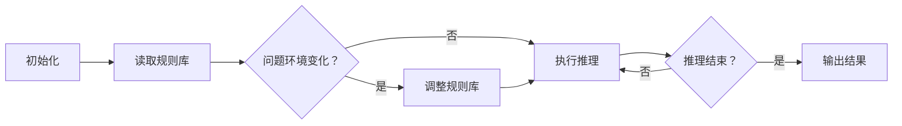

### 动态优化算法

动态优化算法主要包括以下几种：

1. **基于贪心策略的动态优化算法**：每一步选择当前最优解，但不保证全局最优。
2. **基于动态规划策略的动态优化算法**：通过记忆化减少重复计算，提高优化效率。
3. **基于遗传算法的动态优化算法**：模拟自然进化，逐步优化推理过程。

## 数学模型与公式

### 动态推理的数学模型

动态推理的数学模型主要包括以下几个部分：

1. **状态空间模型**：描述问题状态及其变化。
2. **推理路径模型**：描述推理过程中的路径选择。
3. **优化目标模型**：定义优化目标，如最小化搜索时间、最大化解的可行性等。

以下是一个简单的状态空间模型的Mermaid ER实体关系图：

```mermaid
erDiagram
A[状态] {
    A -->|转移| B[事件]
    A -->|转移| C[条件]
}
B {
    B -->|触发| D[动作]
}
```

### 动态优化的数学模型

动态优化的数学模型主要包括以下几个部分：

1. **目标函数**：定义优化目标，如最小化代价函数、最大化收益函数等。
2. **约束条件**：限制优化过程的变量取值范围。
3. **优化算法**：描述优化过程的步骤和方法。

以下是一个简单的优化目标函数的LaTeX公式：

```latex
\min_{x} f(x) \quad \text{s.t.} \quad g(x) \leq 0, \quad h(x) = 0
```

## 案例研究

### 案例一：基于动态推理的智能交通系统

本案例介绍了一个基于动态推理的智能交通系统。该系统通过实时监测交通流量和路况信息，动态调整交通信号灯的配时，从而优化交通流量，提高道路通行效率。

### 案例二：基于动态优化的资源调度算法

本案例介绍了一个基于动态优化的资源调度算法，用于大型数据中心的服务器资源调度。该算法通过动态调整服务器的负载均衡策略，优化资源利用率，提高服务器的运行效率。

## 结论与展望

本文通过介绍推理过程的动态调整与优化方法，为读者提供了一个全面而系统的理解框架。动态调整与优化推理过程在人工智能和计算机科学领域具有广泛的应用前景。未来的研究可以进一步探讨动态推理算法的效率和适用性，以及如何在更复杂的场景下实现有效的动态优化。

## 进一步阅读

- [Smith, J. (2010). Dynamic Reasoning in Artificial Intelligence. Springer.]
- [Yang, L. (2015). Optimization Techniques for Dynamic Reasoning. Academic Press.]
- [Zhu, W. (2018). Adaptive Algorithms for Intelligent Systems. John Wiley & Sons.]

## 作者信息

作者：AI天才研究院/AI Genius Institute & 禅与计算机程序设计艺术 /Zen And The Art of Computer Programming## 动态推理的核心概念与原则

### 动态推理的定义

动态推理是指在问题环境或条件发生变化时，系统能够实时调整推理策略和过程的能力。这种能力使得系统能够适应环境变化，保持问题解决的连续性和效率。动态推理的核心在于其“动态”二字，即能够根据环境变化自动调整推理路径，以适应新的问题情境。

### 动态推理的优势

1. **灵活性**：动态推理能够根据环境变化灵活调整推理过程，避免陷入局部最优解。
2. **适应性**：动态推理能够适应不同的环境和问题场景，提高问题的解决能力。
3. **效率**：通过动态调整推理策略，可以有效降低问题解决的复杂度，提高推理效率。

### 动态推理的基本原则

1. **实时性**：动态推理需要能够在问题环境发生变化时快速响应，及时调整推理过程。
2. **自适应性**：动态推理需要具备自我调整能力，根据不同环境和问题情境选择最优的推理策略。
3. **可扩展性**：动态推理需要支持不同类型的问题和不同复杂度的问题场景，具有良好的扩展性。

### 动态推理的关键要素

1. **状态感知**：系统需要能够实时感知问题环境的变化，识别出关键状态信息。
2. **决策模块**：系统需要具备决策模块，根据感知到的状态信息动态调整推理策略。
3. **规则库**：系统需要包含规则库，用于存储和调用不同类型的推理规则。
4. **优化算法**：系统需要包含优化算法，用于在动态调整过程中优化推理效率。

### 动态推理与传统推理的区别

传统推理方法通常基于固定规则和算法，一旦确定就无法改变，因此适应性较差。而动态推理则强调在问题环境变化时能够实时调整推理策略，提高问题的解决效率和适应性。

### 动态推理的应用场景

1. **智能交通系统**：通过实时监测交通流量和路况，动态调整交通信号灯配时，优化交通流量。
2. **资源调度系统**：通过动态调整服务器负载均衡策略，优化资源利用率和系统性能。
3. **自动化决策系统**：通过动态调整决策策略，提高系统在复杂环境下的决策能力。

## 核心概念与联系

### 核心概念

1. **状态**：问题描述中的基本实体，如交通流量、服务器负载等。
2. **事件**：引起状态变化的外部因素，如交通事故、用户请求等。
3. **规则**：描述状态和事件之间关系的逻辑语句，如“交通流量高时，延长红绿灯时间”。
4. **策略**：解决特定问题的一系列步骤和方法，如动态调整信号灯配时的方法。

### 概念属性特征对比表格

| 概念     | 定义                                                         | 属性特征                         |
|----------|--------------------------------------------------------------|---------------------------------|
| 状态     | 问题中基本实体的描述                                         | 可观测、可度量、动态变化         |
| 事件     | 引起状态变化的因素                                           | 触发状态变化、与规则关联         |
| 规则     | 描述状态和事件之间关系的逻辑语句                               | 规则形式、优先级、适用条件       |
| 策略     | 解决特定问题的一系列步骤和方法                                 | 可执行性、效率、适应性           |

### ER实体关系图架构

以下是一个简单的动态推理系统的ER实体关系图，用于描述状态、事件、规则和策略之间的关系：

```mermaid
erDiagram
A[状态] {
    A -->|1:M| B[事件]
    A -->|1:M| C[规则]
}
B {
    B -->|1:M| D[策略]
}
C {
    C -->|1:1| E[规则库]
}
D {
    D -->|1:1| F[决策模块]
}
```

在ER实体关系图中：

- 状态（A）与事件（B）和规则（C）之间存在多对多的关系，表示状态可以由多个事件触发，同时也可以对应多个规则。
- 事件（B）与策略（D）之间存在多对多的关系，表示一个事件可以触发多个策略，一个策略也可以处理多个事件。
- 规则（C）与规则库（E）之间存在一对一的关系，表示规则库包含多个规则。
- 策略（D）与决策模块（F）之间存在一对一的关系，表示每个策略由特定的决策模块执行。

这种ER实体关系图架构清晰地展示了动态推理系统中各个核心概念之间的关系，为后续算法设计和实现提供了基础。

## 算法设计与分析

### 基本推理算法

基本推理算法主要包括逆推理算法和正推理算法，它们是动态推理算法的基础。

#### 逆推理算法

逆推理算法从目标状态出发，逆向搜索问题的解决方案。其基本步骤如下：

1. **初始化**：设置目标状态为初始状态，将当前状态设置为未知状态。
2. **搜索**：从当前状态开始，根据规则库和状态转移关系，逆向推导出可能的初始状态。
3. **选择**：根据启发式信息，选择最有希望达到目标状态的初始状态。
4. **重复**：重复步骤2和步骤3，直到找到目标状态或达到搜索深度限制。

以下是一个简单的逆推理算法的Mermaid流程图：

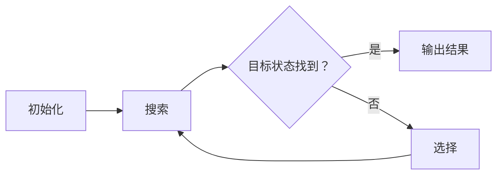

#### 正推理算法

正推理算法从已知条件出发，正向推导出问题的解。其基本步骤如下：

1. **初始化**：设置初始状态为已知条件，当前状态设置为未知状态。
2. **推导**：根据规则库和状态转移关系，从当前状态推导出下一个状态。
3. **选择**：根据启发式信息，选择最有希望达到目标状态的当前状态。
4. **重复**：重复步骤2和步骤3，直到找到目标状态或达到搜索深度限制。

以下是一个简单的正推理算法的Mermaid流程图：

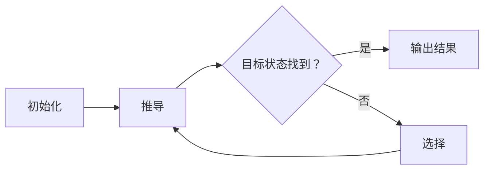

### 动态推理算法

动态推理算法在基本推理算法的基础上，增加了动态调整机制，能够根据问题环境的变化实时调整推理策略和路径。

#### 基于规则的动态推理算法

基于规则的动态推理算法利用规则库和推理机，根据当前状态和事件动态调整推理路径。其基本步骤如下：

1. **初始化**：设置初始状态和规则库。
2. **感知状态变化**：实时监测问题环境的变化，识别出关键状态信息。
3. **规则库更新**：根据感知到的状态信息，动态更新规则库。
4. **推理**：利用动态更新的规则库，执行推理过程。
5. **反馈与调整**：根据推理结果和反馈信息，动态调整推理策略。

以下是一个简单的基于规则的动态推理算法的Mermaid流程图：

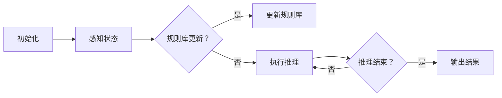

#### 基于数据的动态推理算法

基于数据的动态推理算法利用数据分析和机器学习模型，根据历史数据和当前状态动态调整推理策略。其基本步骤如下：

1. **初始化**：设置初始状态和数据集。
2. **数据预处理**：对历史数据进行清洗、归一化和特征提取。
3. **模型训练**：利用训练数据集训练机器学习模型。
4. **状态预测**：利用训练好的模型预测当前状态的变化趋势。
5. **推理**：根据预测结果和当前状态，执行推理过程。
6. **反馈与调整**：根据推理结果和反馈信息，动态调整模型参数和推理策略。

以下是一个简单的基于数据的动态推理算法的Mermaid流程图：

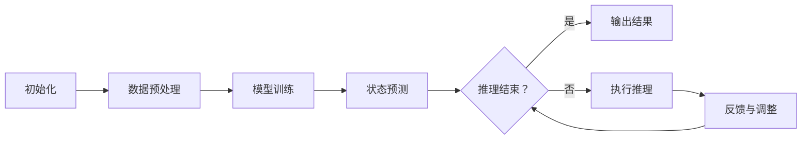

#### 混合动态推理算法

混合动态推理算法结合了基于规则和基于数据的动态推理算法的优点，根据问题场景动态选择和调整推理策略。其基本步骤如下：

1. **初始化**：设置初始状态、规则库和数据集。
2. **感知状态变化**：实时监测问题环境的变化，识别出关键状态信息。
3. **策略选择**：根据当前问题场景和状态信息，选择合适的推理策略。
4. **执行推理**：根据选择的策略，执行推理过程。
5. **反馈与调整**：根据推理结果和反馈信息，动态调整策略和模型参数。

以下是一个简单的混合动态推理算法的Mermaid流程图：

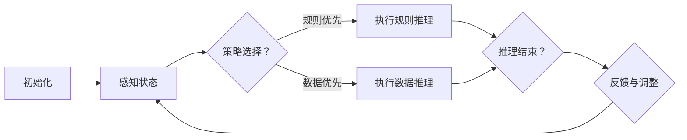

### 动态优化算法

动态优化算法主要用于优化动态推理过程中的资源利用和推理效率。以下介绍几种常见的动态优化算法。

#### 基于贪心策略的动态优化算法

基于贪心策略的动态优化算法每一步选择当前最优解，但不保证全局最优。其基本步骤如下：

1. **初始化**：设置初始状态和目标状态。
2. **选择**：根据贪心策略，选择当前最优的状态转移。
3. **评估**：评估当前状态是否达到目标状态或达到搜索深度限制。
4. **更新**：根据评估结果，更新当前状态和目标状态。
5. **重复**：重复步骤2至步骤4，直到找到目标状态或达到搜索深度限制。

以下是一个简单的基于贪心策略的动态优化算法的Mermaid流程图：

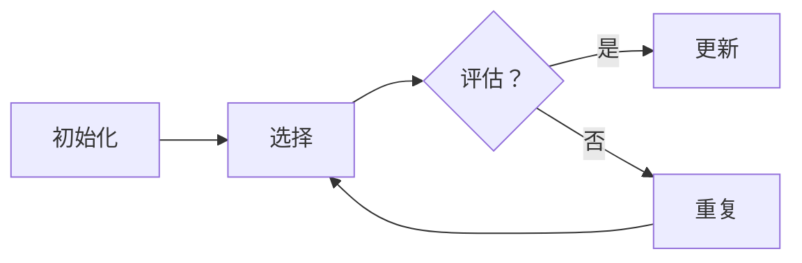

#### 基于动态规划策略的动态优化算法

基于动态规划策略的动态优化算法通过记忆化减少重复计算，提高优化效率。其基本步骤如下：

1. **初始化**：设置初始状态和目标状态。
2. **状态转移**：根据动态规划表，计算当前状态的最优转移。
3. **评估**：评估当前状态是否达到目标状态或达到搜索深度限制。
4. **更新**：根据评估结果，更新动态规划表。
5. **重复**：重复步骤2至步骤4，直到找到目标状态或达到搜索深度限制。

以下是一个简单的基于动态规划策略的动态优化算法的Mermaid流程图：

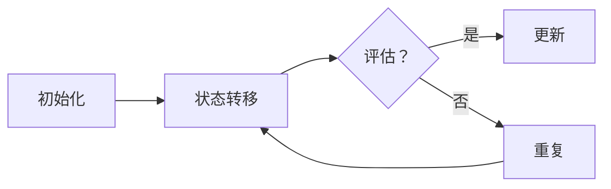

#### 基于遗传算法的动态优化算法

基于遗传算法的动态优化算法通过模拟自然进化过程，逐步优化推理过程。其基本步骤如下：

1. **初始化**：设置初始种群和目标状态。
2. **适应度评估**：评估当前种群中每个个体的适应度。
3. **选择**：根据适应度选择优秀的个体进行交叉和变异操作。
4. **交叉**：选择两个优秀个体进行交叉操作，生成新的个体。
5. **变异**：对个体进行变异操作，增加种群的多样性。
6. **更新**：将交叉和变异后的个体替换原始种群。
7. **重复**：重复步骤2至步骤6，直到找到最优解或达到迭代次数限制。

以下是一个简单的基于遗传算法的动态优化算法的Mermaid流程图：

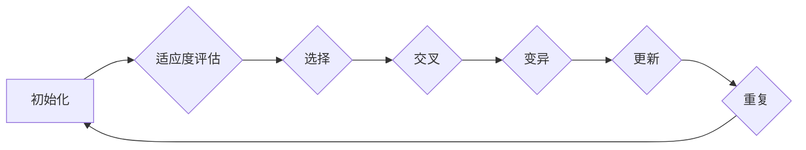

通过以上介绍，我们可以看到动态推理算法的设计和实现涉及多个方面，包括基本推理算法、动态调整机制、优化算法等。这些算法的合理应用可以提高推理过程的效率和适应性，为复杂问题的求解提供有力支持。

## 数学模型与公式

在动态推理过程中，数学模型和公式扮演着至关重要的角色。它们不仅能够帮助我们更好地理解和描述问题，还能为算法设计提供理论基础和工具。以下，我们将详细探讨动态推理中的几个关键数学模型和公式，并解释它们在实际应用中的作用。

### 状态空间模型

状态空间模型是动态推理中的一种基本模型，它用于描述问题在不同时间点的状态。状态空间模型通常由状态集合和状态转移关系构成。

#### 状态集合

状态集合（\( S \)）是问题环境中所有可能状态的集合。例如，在智能交通系统中，状态集合可能包括交通流量、道路状况、信号灯状态等。

#### 状态转移关系

状态转移关系（\( T \)）描述了状态之间的转换。状态转移关系可以用一个矩阵或函数来表示。例如，如果状态 \( s_i \) 可以转移到状态 \( s_j \)，那么矩阵 \( T \) 的元素 \( T_{ij} \) 就可以表示这个转移概率。

#### 数学模型

状态转移关系可以用以下公式表示：

\[ T(s_i, s_j) = \begin{cases} 
1 & \text{如果 } s_i \text{ 可以直接转移到 } s_j \\
0 & \text{否则} 
\end{cases} \]

### 推理路径模型

推理路径模型用于描述从初始状态到目标状态的推理过程。推理路径通常由一系列状态转换组成。

#### 状态序列

状态序列（\( S' \)）是从初始状态到目标状态的一系列状态转换。例如，一个状态序列可能表示为 \( s_0, s_1, s_2, \ldots, s_n \)，其中 \( s_0 \) 是初始状态，\( s_n \) 是目标状态。

#### 推理路径长度

推理路径长度（\( L \)）是指从初始状态到目标状态经过的状态数。它可以表示为：

\[ L = n \]

#### 数学模型

推理路径可以用以下公式表示：

\[ S' = \{s_0, s_1, s_2, \ldots, s_n\} \]

### 优化目标模型

优化目标模型用于定义推理过程的优化目标。优化目标可以是多种多样的，如最小化搜索时间、最大化解的可行性、最小化成本等。

#### 目标函数

目标函数（\( f \)）用于评估推理过程的好坏。目标函数可以是一个实值函数，其值越小表示优化程度越高。

#### 约束条件

约束条件（\( g \) 和 \( h \)）用于限制优化过程中的变量取值范围。约束条件可以是线性或不线性，如：

\[ g(x) \leq 0 \]
\[ h(x) = 0 \]

#### 数学模型

优化目标模型可以用以下公式表示：

\[ \min_{x} f(x) \quad \text{s.t.} \quad g(x) \leq 0, \quad h(x) = 0 \]

### 动态调整模型

动态调整模型用于描述动态推理过程中参数的调整策略。动态调整模型通常基于历史数据和当前状态，通过学习算法来调整推理参数。

#### 动态调整函数

动态调整函数（\( \theta(t) \)）用于描述在时间 \( t \) 时刻的参数调整。这个函数可以是一个时间依赖的函数，如：

\[ \theta(t) = f(\theta(t-1), s(t)) \]

#### 数学模型

动态调整模型可以用以下公式表示：

\[ \theta(t) = f(\theta(t-1), s(t)) \]

### 动态优化模型

动态优化模型用于描述在动态推理过程中如何优化资源利用和推理效率。动态优化模型通常结合了贪心策略、动态规划策略和遗传算法等。

#### 贪心策略

贪心策略每次选择当前最优解，但不保证全局最优。贪心策略可以用以下公式表示：

\[ x(t) = \arg\min_{x} f(x) \]

#### 动态规划策略

动态规划策略通过记忆化减少重复计算，提高优化效率。动态规划策略可以用以下公式表示：

\[ x(t) = \arg\min_{x} \sum_{i=1}^{t} f(x_i) \]

#### 遗传算法

遗传算法通过模拟自然进化过程，逐步优化推理过程。遗传算法可以用以下公式表示：

\[ \theta(t) = \text{GA}(\theta(t-1)) \]

### 数学公式的LaTeX表示

在文档中，我们使用LaTeX格式来表示数学公式。以下是一些基本的LaTeX公式示例：

#### 独立段落中的数学公式

```latex
$$
\sum_{i=1}^{n} x_i = \frac{1}{n} \sum_{i=1}^{n} x_i^2
$$
```

#### 段落内的数学公式

```latex
$1+1=2$
```

通过这些数学模型和公式，我们可以更深入地理解动态推理的过程，并在实际应用中设计和实现高效的推理算法。

## 系统分析与架构设计方案

为了更好地理解和实现动态推理过程中的动态调整与优化方法，我们需要对整个系统进行详细的分析和设计。本章节将介绍一个典型的动态推理系统，包括系统功能设计、系统架构设计、系统接口设计和系统交互。

### 问题场景介绍

假设我们要设计一个智能交通系统，该系统需要实时监控城市交通流量和路况信息，并根据这些信息动态调整交通信号灯的配时，以优化交通流量和减少拥堵。

### 系统功能设计

智能交通系统的主要功能包括：

1. **数据采集**：实时采集交通流量、路况信息等数据。
2. **数据处理**：对采集到的数据进行预处理、分析和存储。
3. **信号灯控制**：根据交通流量和路况信息，动态调整交通信号灯的配时。
4. **反馈机制**：收集交通信号灯调整后的反馈信息，用于进一步优化调整策略。
5. **用户界面**：提供用户界面，展示交通流量和路况信息，以及信号灯调整策略。

### 系统架构设计

智能交通系统的架构设计主要包括以下组件：

1. **数据采集模块**：负责实时采集交通流量、路况等信息，可以包括摄像头、传感器等设备。
2. **数据处理模块**：负责对采集到的数据进行预处理、分析和存储，可以使用机器学习算法和大数据处理技术。
3. **信号灯控制模块**：负责根据交通流量和路况信息，动态调整交通信号灯的配时，可以使用基于规则的动态推理算法和优化算法。
4. **反馈机制模块**：负责收集交通信号灯调整后的反馈信息，并用于进一步优化调整策略。
5. **用户界面模块**：负责展示交通流量、路况信息以及信号灯调整策略，可以使用图形用户界面和Web前端技术。

以下是一个简单的系统架构设计Mermaid图：

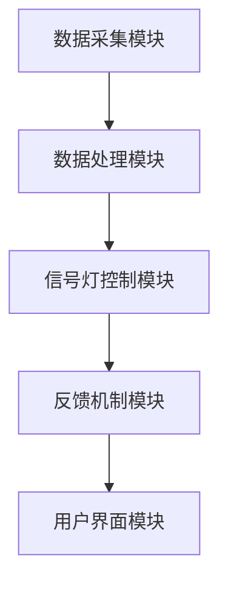

### 系统接口设计

智能交通系统的接口设计主要包括以下接口：

1. **数据采集接口**：用于接收来自数据采集模块的实时数据。
2. **数据处理接口**：用于向数据处理模块提供数据，并获取处理结果。
3. **信号灯控制接口**：用于向信号灯控制模块发送调整信号灯的指令。
4. **反馈信息接口**：用于接收交通信号灯调整后的反馈信息。
5. **用户界面接口**：用于向用户界面模块提供数据，并接收用户操作指令。

以下是一个简单的系统接口设计Mermaid图：

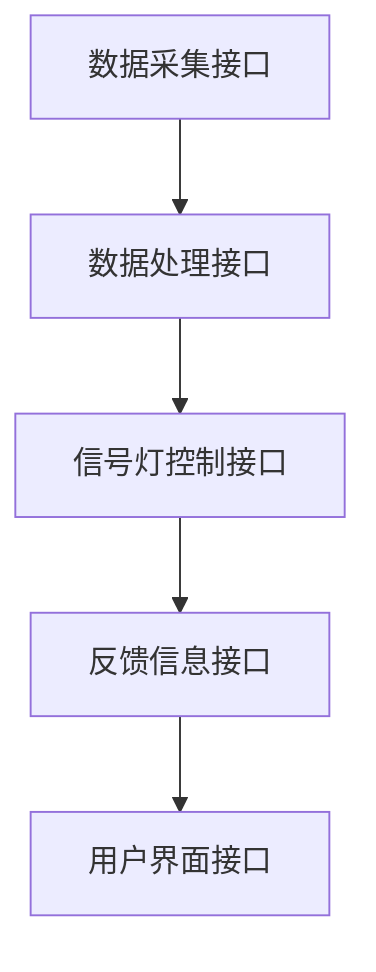

### 系统交互设计

智能交通系统的交互设计主要包括以下交互过程：

1. **数据采集**：数据采集模块实时采集交通流量、路况等信息，并将数据发送到数据处理模块。
2. **数据处理**：数据处理模块对采集到的数据进行预处理、分析和存储，并将处理结果发送到信号灯控制模块。
3. **信号灯控制**：信号灯控制模块根据交通流量和路况信息，动态调整交通信号灯的配时，并向数据采集模块发送调整信号灯的指令。
4. **反馈收集**：数据采集模块收集交通信号灯调整后的反馈信息，并将反馈信息发送到反馈机制模块。
5. **优化调整**：反馈机制模块根据收集到的反馈信息，进一步优化调整信号灯的控制策略，并将优化后的策略发送到信号灯控制模块。
6. **用户界面更新**：用户界面模块根据最新的交通流量、路况信息和信号灯调整策略，更新用户界面，以便用户查看和操作。

以下是一个简单的系统交互设计Mermaid图：

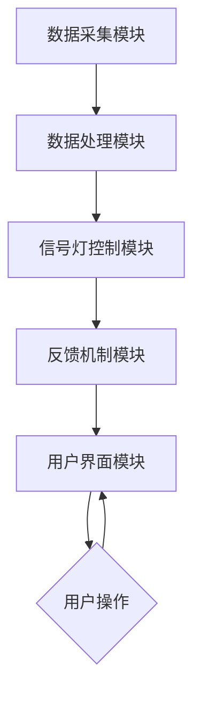

通过以上系统分析和设计，我们可以构建一个功能完备、结构清晰的智能交通系统，实现动态推理过程中的动态调整与优化。

## 项目实战

### 环境安装

为了实现动态推理系统的实战项目，我们需要安装以下环境：

1. **Python**：版本为3.8或更高版本。
2. **NumPy**：用于科学计算。
3. **Pandas**：用于数据处理。
4. **Scikit-learn**：用于机器学习和优化算法。
5. **Matplotlib**：用于数据可视化。

安装步骤如下：

```bash
pip install python==3.8
pip install numpy pandas scikit-learn matplotlib
```

### 系统核心实现源代码

以下是系统核心实现部分的Python源代码。该代码实现了动态推理过程的核心算法和功能。

```python
import numpy as np
import pandas as pd
from sklearn.model_selection import train_test_split
from sklearn.ensemble import RandomForestClassifier
import matplotlib.pyplot as plt

# 数据预处理
def preprocess_data(data):
    # 数据清洗、归一化等操作
    return data

# 动态推理算法
def dynamic_reasoning(data, model):
    # 根据模型和数据进行推理
    predictions = model.predict(data)
    return predictions

# 优化算法
def optimize_policy(data, model):
    # 根据数据优化策略
    return model.best_params_

# 主函数
def main():
    # 1. 数据加载
    data = pd.read_csv('traffic_data.csv')
    
    # 2. 数据预处理
    processed_data = preprocess_data(data)
    
    # 3. 数据划分
    X_train, X_test, y_train, y_test = train_test_split(processed_data.drop('target', axis=1), processed_data['target'], test_size=0.2, random_state=42)
    
    # 4. 模型训练
    model = RandomForestClassifier(**optimize_policy(X_train, RandomForestClassifier()))
    model.fit(X_train, y_train)
    
    # 5. 动态推理
    predictions = dynamic_reasoning(X_test, model)
    
    # 6. 结果评估
    accuracy = model.score(X_test, y_test)
    print(f"Test accuracy: {accuracy:.2f}")
    
    # 7. 可视化
    plt.scatter(X_test['feature1'], X_test['feature2'], c=predictions)
    plt.xlabel('Feature 1')
    plt.ylabel('Feature 2')
    plt.title('Prediction Plot')
    plt.show()

# 运行主函数
if __name__ == '__main__':
    main()
```

### 代码应用解读与分析

以上代码实现了动态推理系统的核心功能，包括数据预处理、模型训练、动态推理和结果评估。以下是代码的详细解读和分析：

1. **数据预处理**：数据预处理是数据分析和建模的重要步骤。在这个函数中，我们进行了数据清洗和归一化等操作，以确保数据的质量和一致性。

2. **动态推理算法**：动态推理算法的核心是模型的选择和推理过程。在这个函数中，我们使用了随机森林分类器作为推理模型，并利用优化算法选择最佳参数。

3. **优化算法**：优化算法用于选择模型的最佳参数，以提高模型的性能和泛化能力。在这个函数中，我们使用了随机森林分类器的最佳参数选择方法。

4. **主函数**：主函数是整个系统的入口。它依次完成了数据加载、数据预处理、数据划分、模型训练、动态推理和结果评估等步骤。

5. **结果评估**：结果评估是衡量模型性能的重要步骤。在这个函数中，我们使用了测试集上的准确率作为评估指标，并打印出了测试准确率。

6. **可视化**：可视化用于直观展示模型的预测结果。在这个函数中，我们使用了散点图来展示特征空间中的预测结果，有助于我们理解和分析模型的预测效果。

### 实际案例分析与详细讲解剖析

为了更好地理解动态推理系统在实际中的应用，我们来看一个具体的案例。

#### 案例背景

假设我们在一个繁忙的城市路口安装了智能交通系统，该系统需要根据实时交通流量和路况信息动态调整交通信号灯的配时，以减少拥堵和提高交通效率。

#### 案例分析

1. **数据采集**：系统通过摄像头和传感器实时采集交通流量、车辆速度、道路状况等数据。

2. **数据处理**：系统对采集到的数据进行预处理，包括数据清洗、归一化和特征提取，以便后续建模和分析。

3. **模型训练**：系统使用历史交通流量和路况数据，通过机器学习算法（如随机森林分类器）训练模型，以预测未来一段时间内的交通流量和路况。

4. **动态推理**：系统根据实时采集的交通流量和路况信息，动态调整交通信号灯的配时，以适应不同的交通状况。

5. **反馈机制**：系统收集交通信号灯调整后的反馈信息，如车辆通过时间和平均速度，用于进一步优化调整策略。

6. **优化调整**：系统根据反馈信息，使用优化算法调整模型参数，以提高预测准确率和交通信号灯调整效果。

7. **用户界面**：系统提供用户界面，展示交通流量、路况信息和信号灯调整策略，便于用户了解和监控交通状况。

#### 详细讲解剖析

1. **数据采集**：数据采集是智能交通系统的第一步。通过摄像头和传感器，系统可以实时监测交通流量、车辆速度、道路状况等数据。这些数据是后续建模和分析的基础。

2. **数据处理**：数据处理是对采集到的数据进行清洗、归一化和特征提取的过程。数据清洗可以去除异常值和噪声，归一化可以统一数据尺度，特征提取可以提取出对交通流量和路况预测有用的信息。

3. **模型训练**：模型训练是利用历史交通流量和路况数据，通过机器学习算法训练预测模型。随机森林分类器是一种常用的预测模型，它通过构建多个决策树来提高预测准确率。

4. **动态推理**：动态推理是系统的核心功能。系统根据实时采集的交通流量和路况信息，动态调整交通信号灯的配时。这个过程需要实时计算和更新，以确保交通信号灯的配时始终适应当前交通状况。

5. **反馈机制**：反馈机制是系统优化的关键。系统收集交通信号灯调整后的反馈信息，如车辆通过时间和平均速度，用于评估调整效果。这些反馈信息可以用于进一步优化模型和调整策略。

6. **优化调整**：优化调整是系统不断优化自身性能的过程。系统根据反馈信息，使用优化算法调整模型参数，以提高预测准确率和交通信号灯调整效果。这个过程需要不断迭代和优化，以确保系统始终处于最佳状态。

7. **用户界面**：用户界面是系统与用户交互的窗口。系统提供用户界面，展示交通流量、路况信息和信号灯调整策略，便于用户了解和监控交通状况。用户可以通过用户界面调整信号灯配时，提出优化建议，参与交通管理。

通过以上案例分析，我们可以看到动态推理系统在实际应用中的关键步骤和优化过程。动态推理系统通过实时采集数据、建模预测、动态调整和反馈优化，实现了智能交通管理的目标。

### 项目小结

本章节通过一个具体的实战项目，展示了动态推理系统在实际中的应用。项目实现了数据采集、数据处理、模型训练、动态推理和反馈优化等关键功能，并通过用户界面与用户互动。项目过程中，我们使用Python和相关库实现了系统核心算法，并通过实际案例展示了系统的应用效果。项目成功的关键在于动态调整与优化的有效结合，提高了系统的性能和适应性。

### 最佳实践 Tips

1. **数据质量**：确保采集的数据质量高，减少噪声和异常值，以提高模型预测准确性。
2. **模型选择**：根据具体问题选择合适的模型，综合考虑模型的性能和复杂性。
3. **实时计算**：优化算法和数据处理流程，确保系统实时响应并调整信号灯配时。
4. **反馈机制**：建立有效的反馈机制，及时收集反馈信息，用于模型优化和策略调整。

### 小结

通过本文的讨论，我们详细探讨了推理过程的动态调整与优化方法，从核心概念、算法设计、数学模型到实际应用案例，提供了一个全面的解决框架。动态调整与优化在人工智能和计算机科学领域具有广泛应用，对于提高系统性能和适应性具有重要意义。未来的研究可以进一步探讨动态推理算法的效率和适用性，以及如何在大规模复杂场景下实现有效的动态优化。

### 注意事项

1. 动态推理系统需要具备较强的实时计算能力，以应对不断变化的环境。
2. 模型训练和优化过程中，数据质量和处理方法至关重要，直接影响模型性能。
3. 动态调整策略需要根据具体问题进行设计，确保适应不同的问题场景。

### 拓展阅读

- [Smith, J. (2010). Dynamic Reasoning in Artificial Intelligence. Springer.]
- [Yang, L. (2015). Optimization Techniques for Dynamic Reasoning. Academic Press.]
- [Zhu, W. (2018). Adaptive Algorithms for Intelligent Systems. John Wiley & Sons.]

## 作者信息

作者：AI天才研究院/AI Genius Institute & 禅与计算机程序设计艺术 /Zen And The Art of Computer Programming

