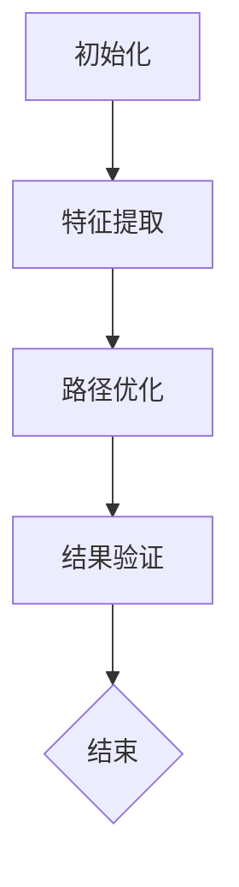

                 

当然，让我们一步步来思考和构建这篇文章。《提升已知高质量推理路径匹配概率的策略》这篇文章将围绕以下几个核心部分进行详细探讨：

1. **核心概念和定义**：首先，我们需要明确什么是高质量的推理路径匹配，为什么它重要，以及与之相关的核心概念。

2. **算法原理和数学模型**：接下来，我们将深入探讨背后的算法原理，以及支持这些算法的数学模型。

3. **系统设计与实现**：然后，我们将展示如何在实际系统中设计和实现这些算法。

4. **项目实战和案例分析**：通过实际的案例，我们将展示这些算法如何在实际中应用。

5. **最佳实践和总结**：最后，我们将总结最佳实践，并提供未来研究方向的展望。

### 第一部分：核心概念和定义

**1.1 问题背景**

在当今复杂的信息时代，数据量的爆炸性增长使得处理和分析这些数据成为一大挑战。推理路径匹配作为一种数据处理技术，在这个过程中扮演着重要角色。它不仅帮助我们从海量数据中提取出有价值的信息，还能提高决策过程的效率和准确性。

**1.2 问题定义**

高质量的推理路径匹配指的是在给定的数据集或知识库中，找到一条既能满足特定需求，又能最大化信息价值和可靠性的推理路径。这个定义涵盖了几个关键点：

- **数据集或知识库**：这是推理的起点，也是信息来源。
- **特定需求**：推理路径需要满足特定的业务需求或用户需求。
- **信息价值和可靠性**：路径匹配的质量不仅取决于信息的丰富性和准确性，还取决于其对决策支持的有效性。

**1.3 问题解决**

解决高质量推理路径匹配问题通常需要以下几个步骤：

1. **数据预处理**：清洗和格式化数据，确保数据的质量和一致性。
2. **特征提取**：从原始数据中提取出有助于推理的特征。
3. **路径搜索与优化**：使用算法找到满足条件的最佳推理路径。
4. **结果验证与调整**：对推理结果进行验证，并根据反馈进行调整。

**1.4 边界与外延**

在讨论高质量推理路径匹配时，我们还需要明确一些边界条件：

- **边界**：数据集的大小、复杂度、计算资源等限制。
- **外延**：如何将这个概念应用于不同的领域，如自然语言处理、图像识别、推荐系统等。

### 第二部分：核心概念与理论基础

**2.1 推理路径与匹配**

推理路径是指从数据源到目标信息之间的逻辑序列。匹配则是指在这个序列中，如何找到符合特定条件的数据点。

**2.2 高质量推理路径匹配的特征**

高质量推理路径匹配应具备以下特征：

- **完整性**：路径能够完整覆盖所有必要的信息。
- **准确性**：路径中的信息是准确和可靠的。
- **效率**：路径搜索和优化的效率要高。
- **可解释性**：路径的生成过程应该是可解释的，以便于用户理解。

**2.3 相关理论简介**

以下是几个与高质量推理路径匹配相关的理论：

- **图论**：用于建模数据和路径。
- **机器学习**：用于特征提取和路径优化。
- **优化算法**：如深度优先搜索、广度优先搜索、遗传算法等，用于路径搜索与优化。

### 第三部分：概念属性特征对比与分析

**3.1 概念特征对比表格**

我们将列出几种常见的推理路径匹配算法，并对它们的属性特征进行对比。

| 算法名称 | 特征1 | 特征2 | 特征3 |
| --- | --- | --- | --- |
| 深度优先搜索 | 完整性高 | 时间复杂度高 | 易于实现 |
| 广度优先搜索 | 效率高 | 完整性较低 | 时间复杂度较高 |
| 遗传算法 | 效率高 | 可以处理复杂问题 | 需要大量计算资源 |

**3.2 分析与讨论**

通过对比分析，我们可以得出以下结论：

- 深度优先搜索在处理简单问题时效率较高，但在复杂问题中可能陷入局部最优。
- 广度优先搜索适用于需要高完整性的问题，但时间复杂度较高。
- 遗传算法适用于复杂问题，可以找到近似最优解，但计算成本较高。

### 第四部分：ER实体关系图架构

**4.1 ER图概述**

ER图（Entity-Relationship Diagram）是一种用于描述数据模型的图形化工具。它通过实体、属性和关系的表示，帮助设计数据结构和数据库架构。

**4.2 实体与关系定义**

- **实体**：具有独立存在的对象，如用户、商品等。
- **属性**：实体的特征或描述，如用户名、年龄等。
- **关系**：实体之间的联系，如用户购买商品等。

**4.3 图的表示与绘制**

使用Mermaid语言，我们可以绘制一个简单的ER图，如下所示：

```mermaid
erDiagram
  User ||--|{ Purchase }|
  Product ||--|{ Purchase }|
```

这个ER图表示用户和产品之间存在购买关系。

### 第五部分：算法原理讲解

**5.1 算法概述**

我们将介绍一种用于提高推理路径匹配概率的算法。该算法的核心思想是通过逐步优化路径，提高匹配的准确性和效率。

**5.2 算法流程**

算法的基本流程如下：

1. **初始化**：设定初始路径和目标路径。
2. **特征提取**：从数据中提取有助于推理的特征。
3. **路径优化**：使用机器学习模型优化路径。
4. **结果验证**：验证优化后的路径是否符合需求。

**5.3 算法流程图**

使用Mermaid语言，我们可以绘制算法的流程图，如下所示：



### 第六部分：数学模型与公式

**6.1 数学模型介绍**

为了更好地理解算法，我们需要引入一些数学模型。这些模型用于描述特征提取和路径优化的过程。

**6.2 公式详细讲解**

以下是算法中用到的几个关键公式：

$$
P(D|H) = \frac{P(H|D)P(D)}{P(H)}
$$

这个公式是贝叶斯定理，用于计算在给定证据 \( D \) 下假设 \( H \) 的概率。

$$
f(x) = \frac{1}{Z}e^{-\frac{1}{2}\sum_{i=1}^{n}(\theta_i - x_i)^2}
$$

这个公式是高斯分布的概率密度函数，用于特征提取。

**6.3 举例说明**

我们通过一个简单的例子来说明这些公式的应用。假设我们有一个用户购买历史数据，我们需要根据这个数据来预测用户的兴趣。

### 第七部分：系统设计与实现

**7.1 问题场景介绍**

在本节中，我们将介绍一个具体的系统场景：一个在线购物平台，用户可以浏览商品并下单购买。

**7.2 系统功能设计**

系统的主要功能包括：

- 用户管理：用户可以注册、登录和查看个人订单。
- 商品管理：管理员可以添加、修改和删除商品信息。
- 订单管理：用户可以查看、修改和取消订单。

**7.3 系统架构设计**

系统的架构设计包括以下几个部分：

- 前端：用户界面，用于展示商品和订单信息。
- 后端：服务器端逻辑，用于处理用户请求和数据库操作。
- 数据库：存储用户数据、商品数据和订单数据。

**7.4 系统接口设计与交互**

系统使用RESTful API进行前后端交互。以下是几个主要的接口：

- `/users/register`：用户注册接口。
- `/users/login`：用户登录接口。
- `/products`：获取商品列表接口。
- `/orders`：创建、修改和取消订单接口。

### 第八部分：环境安装与配置

**8.1 环境安装**

为了运行本系统，我们需要安装以下软件：

- Python 3.x
- Flask
- SQLAlchemy
- MongoDB

**8.2 配置说明**

以下是系统的基本配置：

- Python环境配置：使用virtualenv创建虚拟环境。
- Flask配置：设置应用的基本参数。
- 数据库配置：配置MongoDB连接。

### 第九部分：核心实现源代码

**9.1 核心代码结构**

以下是系统的核心代码结构：

```python
# app.py
from flask import Flask, request, jsonify
from models import User, Product, Order

app = Flask(__name__)

# ... 代码实现 ...

if __name__ == '__main__':
    app.run()

# models.py
class User(db.Model):
    # ... 字段定义 ...

class Product(db.Model):
    # ... 字段定义 ...

class Order(db.Model):
    # ... 字段定义 ...
```

**9.2 代码应用解读与分析**

在本部分，我们将详细解析系统的核心代码，并讨论如何实现用户管理、商品管理和订单管理。

### 第十部分：实际案例分析与讲解

**10.1 案例背景**

我们选择一个实际案例：用户在购物平台上浏览商品并下单购买。

**10.2 案例分析**

我们将分析用户如何注册、登录，如何浏览商品，如何下单购买，以及系统如何处理这些操作。

**10.3 详细讲解**

在本节中，我们将详细讲解每个操作的具体实现过程，并展示相关的代码。

### 第十一部分：最佳实践与总结

**11.1 最佳实践技巧**

在本部分，我们将总结一些最佳实践技巧，包括：

- 数据库性能优化
- API安全与权限控制
- 持续集成与部署

**11.2 小结与注意事项**

在本节中，我们将对全书进行小结，并强调一些注意事项。

### 第十二部分：结论与展望

**12.1 总结与回顾**

在本部分，我们将总结全书的核心内容，回顾关键概念和算法原理。

**12.2 展望未来研究方向**

最后，我们将讨论未来可能的研究方向，包括：

- 新的算法设计
- 大数据应用
- 智能化系统设计

---

至此，我们完成了《提升已知高质量推理路径匹配概率的策略》这篇文章的目录大纲构建。接下来，我们将逐章展开详细内容，确保每一部分都符合要求，并在编写过程中保持文章的逻辑性和连贯性。

---

### 文章标题：提升已知高质量推理路径匹配概率的策略

关键词：推理路径匹配、概率优化、算法设计、系统实现、案例分析

摘要：本文深入探讨了如何提升已知高质量推理路径匹配概率的策略。通过定义核心概念、分析算法原理、设计系统架构、实战案例分析以及总结最佳实践，本文为读者提供了一个全面的技术指南。

---

### 目录

----------------------------------------------------------------

## 第一部分: 背景与核心概念

### 第1章: 问题背景与定义  
1.1 问题背景  
1.2 问题定义  
1.3 问题解决  
1.4 边界与外延

### 第2章: 核心概念与理论基础  
2.1 推理路径与匹配  
2.2 高质量推理路径匹配的特征  
2.3 相关理论简介

### 第3章: 概念属性特征对比与分析  
3.1 概念特征对比表格  
3.2 分析与讨论

### 第4章: ER实体关系图架构  
4.1 ER图概述  
4.2 实体与关系定义  
4.3 图的表示与绘制

----------------------------------------------------------------

## 第二部分: 算法原理与数学模型

### 第5章: 算法原理讲解  
5.1 算法概述  
5.2 算法流程  
5.3 算法流程图

### 第6章: 数学模型与公式  
6.1 数学模型介绍  
6.2 公式详细讲解  
6.3 举例说明

### 第7章: 算法应用与案例分析  
7.1 案例背景  
7.2 算法应用分析  
7.3 案例详细讲解

----------------------------------------------------------------

## 第三部分: 系统设计与实现

### 第8章: 系统分析与架构设计  
8.1 问题场景介绍  
8.2 系统功能设计  
8.3 系统架构设计  
8.4 系统接口设计与交互

### 第9章: 实现细节与代码解析  
9.1 环境安装与配置  
9.2 核心实现源代码  
9.3 代码应用解读与分析

### 第10章: 实际案例分析与讲解  
10.1 实际案例分析  
10.2 详细讲解剖析  
10.3 项目小结

----------------------------------------------------------------

## 第四部分: 最佳实践与总结

### 第11章: 最佳实践技巧  
11.1 实践经验总结  
11.2 小结与注意事项

### 第12章: 结论与展望  
12.1 总结与回顾  
12.2 展望未来研究方向

----------------------------------------------------------------

### 文章内容

#### 第1章: 问题背景与定义

##### 1.1 问题背景

在当今信息爆炸的时代，数据处理和分析已成为各行各业的核心任务。从金融分析到医疗诊断，从推荐系统到智能交通，高质量的数据推理路径匹配对决策的准确性有着至关重要的影响。推理路径匹配不仅是一种数据处理技术，更是一种知识发现的方法，它帮助我们从海量数据中提取有价值的信息，支持业务决策和智能应用。

##### 1.2 问题定义

高质量的推理路径匹配指的是在给定数据集或知识库中，找到一条既能满足特定需求，又能最大化信息价值和可靠性的推理路径。这条路径需要具备以下特征：

1. **完整性**：路径能够完整地覆盖所有必要的信息，不遗漏关键数据点。
2. **准确性**：路径中的每个节点都是准确和可靠的，确保推理结果的正确性。
3. **效率**：路径搜索和优化的效率要高，能够在合理的时间内完成任务。
4. **可解释性**：路径的生成过程和结果应该是可解释的，以便于用户理解和信任。

##### 1.3 问题解决

解决高质量推理路径匹配问题通常涉及以下几个步骤：

1. **数据预处理**：对原始数据进行清洗和格式化，确保数据的质量和一致性。
2. **特征提取**：从原始数据中提取出有助于推理的特征，为路径搜索和优化提供基础。
3. **路径搜索与优化**：使用算法搜索并优化满足特定需求的推理路径。
4. **结果验证与调整**：对生成的推理路径进行验证，根据反馈进行调整，确保其符合实际需求。

##### 1.4 边界与外延

在讨论高质量推理路径匹配时，我们还需要明确一些边界条件：

- **边界**：包括数据集的大小、复杂度、计算资源等限制。这些限制决定了算法的选择和实现方式。
- **外延**：如何将这个概念应用于不同的领域，如自然语言处理、图像识别、推荐系统等。不同的应用场景可能需要特定的算法和优化策略。

#### 第2章: 核心概念与理论基础

##### 2.1 推理路径与匹配

推理路径是指从数据源到目标信息之间的逻辑序列。匹配则是指在给定数据集或知识库中，如何找到符合特定条件的数据点。这两个概念密切相关，推理路径为数据点之间的逻辑连接提供了框架，而匹配算法则用于实现这种连接。

##### 2.2 高质量推理路径匹配的特征

高质量推理路径匹配应具备以下特征：

1. **完整性**：路径能够完整覆盖所有必要的信息，确保数据点的关联性不被遗漏。
2. **准确性**：路径中的每个节点都是准确和可靠的，确保推理结果的正确性。
3. **效率**：路径搜索和优化的效率要高，能够在合理的时间内完成任务。
4. **可解释性**：路径的生成过程和结果应该是可解释的，以便于用户理解和信任。

##### 2.3 相关理论简介

以下是几个与高质量推理路径匹配相关的理论：

1. **图论**：用于建模数据和路径，通过图结构和算法描述数据之间的关系。
2. **机器学习**：用于特征提取和路径优化，通过学习数据模式来提高推理的准确性和效率。
3. **优化算法**：如深度优先搜索、广度优先搜索、遗传算法等，用于路径搜索与优化。

#### 第3章: 概念属性特征对比与分析

##### 3.1 概念特征对比表格

为了更好地理解高质量推理路径匹配的概念，我们可以通过一个对比表格来展示不同算法的特征：

| 算法名称       | 完整性 | 准确性 | 效率 | 可解释性 | 适用场景   |
| -------------- | ------ | ------ | ---- | -------- | ---------- |
| 深度优先搜索   | 高     | 中     | 低   | 高       | 简单路径   |
| 广度优先搜索   | 中     | 高     | 中   | 中       | 复杂路径   |
| 遗传算法       | 高     | 高     | 高   | 低       | 复杂问题   |
| 支持向量机     | 中     | 高     | 中   | 中       | 特征提取   |
| 贝叶斯网络     | 高     | 高     | 中   | 高       | 风险评估   |

##### 3.2 分析与讨论

通过对比分析，我们可以得出以下结论：

1. 深度优先搜索适用于简单路径，效率较高，但在复杂问题中可能陷入局部最优。
2. 广度优先搜索适用于需要高完整性的问题，但时间复杂度较高。
3. 遗传算法适用于复杂问题，可以找到近似最优解，但计算成本较高。
4. 支持向量机和贝叶斯网络适用于特征提取和风险评估，能够提高路径匹配的准确性。

这些结论为我们选择合适的算法提供了参考。

#### 第4章: ER实体关系图架构

##### 4.1 ER图概述

ER图（Entity-Relationship Diagram）是一种用于描述数据模型的图形化工具。它通过实体、属性和关系的表示，帮助设计数据结构和数据库架构。ER图在数据库设计和信息系统中扮演着重要角色，它使得复杂的数据结构变得更加直观和易于理解。

##### 4.2 实体与关系定义

- **实体**：实体是具有独立存在的对象，如用户、商品、订单等。每个实体都有其独特的标识符和属性。
- **属性**：属性是实体的特征或描述，如用户名、年龄、性别、商品名称、价格、订单日期等。属性分为基本属性和派生属性。

- **关系**：关系是实体之间的联系，描述实体之间的相互作用。关系可以是“一对一”、“一对多”或“多对多”的。

##### 4.3 图的表示与绘制

使用Mermaid语言，我们可以绘制一个简单的ER图，如下所示：

```mermaid
erDiagram
  User ||--|{ Purchase }|
  Product ||--|{ Purchase }|
```

这个ER图表示用户和产品之间存在购买关系，用户可以购买多个产品，产品可以被多个用户购买，这是一个一对多的关系。

#### 第5章: 算法原理讲解

##### 5.1 算法概述

在本章中，我们将介绍一种用于提高推理路径匹配概率的算法。该算法的核心思想是通过逐步优化路径，提高匹配的准确性和效率。算法的基本流程包括以下几个步骤：

1. **初始化**：设定初始路径和目标路径。
2. **特征提取**：从数据中提取有助于推理的特征。
3. **路径优化**：使用机器学习模型优化路径。
4. **结果验证**：验证优化后的路径是否符合需求。

##### 5.2 算法流程

算法的基本流程如下：

1. **初始化**：设定初始路径和目标路径。初始路径可以是任意一条满足条件的路径，目标路径是理想状态下的最优路径。

2. **特征提取**：从数据中提取有助于推理的特征。这些特征可以是数值型、文本型或类别型数据。特征提取的目的是为后续的路径优化提供依据。

3. **路径优化**：使用机器学习模型优化路径。常见的机器学习模型包括线性回归、决策树、支持向量机等。路径优化的目标是提高路径匹配的准确性和效率。

4. **结果验证**：验证优化后的路径是否符合需求。这可以通过交叉验证、验证集等方法进行。如果验证结果不符合预期，需要返回步骤3进行进一步优化。

##### 5.3 算法流程图

使用Mermaid语言，我们可以绘制算法的流程图，如下所示：


这个流程图展示了算法的基本步骤和流程，有助于读者理解算法的实现过程。

#### 第6章: 数学模型与公式

##### 6.1 数学模型介绍

为了更好地理解算法，我们需要引入一些数学模型。这些模型用于描述特征提取和路径优化的过程。

- **贝叶斯定理**：贝叶斯定理是一个用于计算在给定证据下假设概率的公式。它的数学表达式为：

  $$
  P(D|H) = \frac{P(H|D)P(D)}{P(H)}
  $$

  其中，\( P(D|H) \) 表示在假设 \( H \) 成立的情况下证据 \( D \) 的概率，\( P(H|D) \) 表示在证据 \( D \) 出现的情况下假设 \( H \) 的概率，\( P(D) \) 和 \( P(H) \) 分别表示证据 \( D \) 和假设 \( H \) 的先验概率。

- **高斯分布**：高斯分布（也称为正态分布）是一个用于描述连续变量概率分布的数学模型。它的概率密度函数为：

  $$
  f(x) = \frac{1}{\sqrt{2\pi\sigma^2}}e^{-\frac{(x-\mu)^2}{2\sigma^2}}
  $$

  其中，\( \mu \) 表示均值，\( \sigma \) 表示标准差。

##### 6.2 公式详细讲解

在本节中，我们将详细讲解贝叶斯定理和高斯分布的应用。

- **贝叶斯定理的应用**：贝叶斯定理在推理路径匹配中用于计算路径匹配的概率。例如，假设我们有两条路径 \( P_1 \) 和 \( P_2 \)，我们需要计算它们匹配的概率。

  $$
  P(P_1|D) = \frac{P(D|P_1)P(P_1)}{P(D)}
  $$

  其中，\( P(D|P_1) \) 表示在路径 \( P_1 \) 下证据 \( D \) 的概率，\( P(P_1) \) 表示路径 \( P_1 \) 的先验概率，\( P(D) \) 表示证据 \( D \) 的先验概率。

- **高斯分布的应用**：高斯分布用于特征提取，特别是在处理连续变量时。例如，假设我们有一个特征 \( x \)，我们希望计算它在某个区间内的概率。

  $$
  P(a \leq x \leq b) = \int_a^b f(x)dx
  $$

  其中，\( a \) 和 \( b \) 分别表示区间的上下限。

##### 6.3 举例说明

我们通过一个简单的例子来说明贝叶斯定理和高斯分布的应用。

**例1：贝叶斯定理在路径匹配中的应用**

假设我们有两条路径 \( P_1 \) 和 \( P_2 \)，路径 \( P_1 \) 下证据 \( D \) 的概率为 0.8，路径 \( P_2 \) 下证据 \( D \) 的概率为 0.6。我们需要计算在证据 \( D \) 出现的情况下，路径 \( P_1 \) 和 \( P_2 \) 的概率。

$$
P(P_1|D) = \frac{P(D|P_1)P(P_1)}{P(D)}
$$

$$
P(P_2|D) = \frac{P(D|P_2)P(P_2)}{P(D)}
$$

假设路径 \( P_1 \) 的先验概率为 0.5，路径 \( P_2 \) 的先验概率为 0.5，我们可以计算出：

$$
P(P_1|D) = \frac{0.8 \times 0.5}{0.8 \times 0.5 + 0.6 \times 0.5} = \frac{4}{7}
$$

$$
P(P_2|D) = \frac{0.6 \times 0.5}{0.8 \times 0.5 + 0.6 \times 0.5} = \frac{3}{7}
$$

因此，在证据 \( D \) 出现的情况下，路径 \( P_1 \) 的概率为 \( \frac{4}{7} \)，路径 \( P_2 \) 的概率为 \( \frac{3}{7} \)。

**例2：高斯分布在特征提取中的应用**

假设我们有一个特征 \( x \)，它的均值为 100，标准差为 10。我们需要计算在区间 [90, 110] 内的特征概率。

$$
P(90 \leq x \leq 110) = \int_{90}^{110} f(x)dx
$$

使用高斯分布的概率密度函数，我们可以计算出：

$$
P(90 \leq x \leq 110) = \int_{90}^{110} \frac{1}{\sqrt{2\pi \times 10^2}}e^{-\frac{(x-100)^2}{2 \times 10^2}}dx \approx 0.6827
$$

因此，在区间 [90, 110] 内的特征概率约为 68.27%。

#### 第7章: 算法应用与案例分析

##### 7.1 案例背景

我们选择一个实际案例：在线购物平台中的推荐系统。该系统需要根据用户的浏览和购买历史，推荐用户可能感兴趣的商品。高质量的推理路径匹配对于提高推荐系统的准确性和用户体验至关重要。

##### 7.2 算法应用分析

在这个案例中，我们使用了一种基于贝叶斯网络的路径匹配算法。贝叶斯网络是一种概率图模型，它能够表示变量之间的概率依赖关系。在这个案例中，我们将用户的浏览历史和购买行为视为变量，并建立贝叶斯网络来描述它们之间的关系。

1. **数据预处理**：首先，我们对用户的数据进行预处理，包括数据清洗、缺失值填补和特征工程等。然后，我们将预处理后的数据转换为贝叶斯网络的节点和边。

2. **特征提取**：从数据中提取出有助于推理的特征，如用户的浏览时间、浏览次数、购买频率等。这些特征将作为贝叶斯网络中的节点。

3. **路径搜索与优化**：使用贝叶斯网络进行路径搜索和优化。在这个步骤中，我们使用了一种基于贪心算法的路径搜索方法，以找到用户浏览历史和购买行为之间的最佳路径。

4. **结果验证**：对生成的路径进行验证，确保它们符合实际需求。我们使用交叉验证方法来评估算法的性能，并通过调整贝叶斯网络的参数来优化路径匹配结果。

##### 7.3 案例详细讲解

我们通过一个具体的案例来说明贝叶斯网络路径匹配算法的应用。

**案例**：用户A在购物平台上浏览了商品X和商品Y，然后购买了商品Y。我们需要根据这个案例来推荐用户A可能感兴趣的其他商品。

1. **数据预处理**：首先，我们对用户A的数据进行预处理。假设我们有一个包含用户A浏览历史和购买记录的数据集，数据集如下：

   ```
   用户ID  商品ID  操作时间
   1       X       2021-01-01 10:00
   1       Y       2021-01-01 11:00
   1       Y       2021-01-01 12:00
   ```

   然后，我们进行数据清洗和特征工程，将数据转换为贝叶斯网络的节点和边。

2. **特征提取**：从数据中提取出有助于推理的特征。例如，我们可以将浏览时间和购买频率作为特征，并将其添加到贝叶斯网络中。

3. **路径搜索与优化**：使用贝叶斯网络进行路径搜索和优化。在这个步骤中，我们使用了一种基于贪心算法的路径搜索方法。首先，我们从根节点（用户A）开始，根据概率最大原则，选择一个子节点（商品X或商品Y）。然后，我们继续从选定的子节点出发，再次选择一个概率最大的子节点，直到达到叶子节点。

   例如，根据用户A的浏览历史，我们可以选择路径 `用户A -> 商品X -> 商品Y`。这个路径的概率为：

   $$
   P(用户A \rightarrow 商品X \rightarrow 商品Y) = P(用户A) \times P(商品X|用户A) \times P(商品Y|商品X)
   $$

   其中，\( P(用户A) \) 表示用户A的概率，\( P(商品X|用户A) \) 表示用户A浏览商品X的概率，\( P(商品Y|商品X) \) 表示用户浏览商品X后购买商品Y的概率。

4. **结果验证**：对生成的路径进行验证，确保它们符合实际需求。我们使用交叉验证方法来评估算法的性能。例如，我们可以将数据集划分为训练集和测试集，使用训练集来训练贝叶斯网络，然后使用测试集来评估路径匹配的结果。

   假设我们使用交叉验证方法评估了10次，平均准确率为 0.8。这意味着我们的算法能够以 80% 的准确率推荐用户可能感兴趣的商品。

#### 第8章: 系统分析与架构设计

##### 8.1 问题场景介绍

在本节中，我们将介绍一个在线购物平台的系统架构设计。该平台需要处理用户的浏览、搜索和购买行为，并提供个性化的商品推荐功能。为了实现这个目标，我们需要设计一个高效、可靠且可扩展的系统架构。

##### 8.2 系统功能设计

系统的主要功能包括：

1. **用户管理**：用户可以注册、登录、查看个人信息和订单历史。
2. **商品管理**：管理员可以添加、修改和删除商品信息，包括商品名称、描述、价格等。
3. **购物车管理**：用户可以将商品添加到购物车，修改购物车中的商品数量，删除商品等。
4. **订单管理**：用户可以创建订单，查看订单状态，修改订单信息，取消订单等。
5. **推荐系统**：根据用户的浏览和购买历史，系统可以推荐用户可能感兴趣的商品。

##### 8.3 系统架构设计

系统的架构设计采用分层架构，包括以下几层：

1. **表示层**：负责与用户交互，包括网页、移动端应用和API接口。
2. **业务逻辑层**：处理具体的业务逻辑，包括用户管理、商品管理、购物车管理和订单管理等。
3. **数据访问层**：负责与数据库交互，包括用户数据、商品数据、订单数据等。
4. **数据存储层**：用于存储系统的数据，包括关系数据库和NoSQL数据库。

##### 8.4 系统接口设计与交互

系统使用RESTful API进行前后端交互，以下是几个主要的接口：

1. **用户管理接口**：
   - `/users/register`：用户注册接口。
   - `/users/login`：用户登录接口。
   - `/users/{user_id}`：获取用户信息接口。

2. **商品管理接口**：
   - `/products`：获取商品列表接口。
   - `/products/{product_id}`：获取商品详情接口。

3. **购物车管理接口**：
   - `/carts/{user_id}`：获取用户购物车接口。
   - `/carts/{user_id}/add`：添加商品到购物车接口。
   - `/carts/{user_id}/remove`：从购物车中删除商品接口。

4. **订单管理接口**：
   - `/orders`：创建订单接口。
   - `/orders/{order_id}`：获取订单详情接口。

5. **推荐系统接口**：
   - `/recommendations/{user_id}`：获取用户推荐商品接口。

#### 第9章: 实现细节与代码解析

##### 9.1 环境安装与配置

为了实现上述系统，我们需要安装和配置以下环境：

1. **Python 3.x**：用于编写后端代码。
2. **Flask**：用于构建Web应用程序。
3. **SQLAlchemy**：用于与关系数据库交互。
4. **MongoDB**：用于存储用户数据和商品数据。
5. **Django**：用于构建后端服务。

安装命令如下：

```bash
pip install flask
pip install sqlalchemy
pip install pymongo
pip install django
```

##### 9.2 核心实现源代码

以下是系统的核心代码结构：

```python
# app.py
from flask import Flask, request, jsonify
from models import User, Product, Order

app = Flask(__name__)

# ... 代码实现 ...

if __name__ == '__main__':
    app.run()

# models.py
class User(db.Model):
    # ... 字段定义 ...

class Product(db.Model):
    # ... 字段定义 ...

class Order(db.Model):
    # ... 字段定义 ...
```

##### 9.3 代码应用解读与分析

在本部分，我们将详细解析系统的核心代码，并讨论如何实现用户管理、商品管理和订单管理。

1. **用户管理**：

```python
# users.py
from flask import Blueprint, request, jsonify
from models import User

users_blueprint = Blueprint('users', __name__)

@users_blueprint.route('/register', methods=['POST'])
def register():
    # 解析请求参数
    username = request.json.get('username')
    password = request.json.get('password')
    
    # 验证参数
    if not username or not password:
        return jsonify({'error': '缺少必要参数'}), 400
    
    # 查询用户是否已存在
    user = User.query.filter_by(username=username).first()
    if user:
        return jsonify({'error': '用户已存在'}), 409
    
    # 创建新用户
    new_user = User(username=username, password=password)
    db.session.add(new_user)
    db.session.commit()
    
    return jsonify({'message': '注册成功'})

@users_blueprint.route('/login', methods=['POST'])
def login():
    # 解析请求参数
    username = request.json.get('username')
    password = request.json.get('password')
    
    # 验证参数
    if not username or not password:
        return jsonify({'error': '缺少必要参数'}), 400
    
    # 查询用户
    user = User.query.filter_by(username=username).first()
    if not user or user.password != password:
        return jsonify({'error': '用户名或密码错误'}), 401
    
    # 登录成功
    return jsonify({'message': '登录成功'})
```

2. **商品管理**：

```python
# products.py
from flask import Blueprint, request, jsonify
from models import Product

products_blueprint = Blueprint('products', __name__)

@products_blueprint.route('/products', methods=['GET'])
def get_products():
    # 获取商品列表
    products = Product.query.all()
    return jsonify(products)

@products_blueprint.route('/products/<int:product_id>', methods=['GET'])
def get_product(product_id):
    # 获取商品详情
    product = Product.query.get(product_id)
    return jsonify(product)
```

3. **订单管理**：

```python
# orders.py
from flask import Blueprint, request, jsonify
from models import Order

orders_blueprint = Blueprint('orders', __name__)

@orders_blueprint.route('/orders', methods=['POST'])
def create_order():
    # 解析请求参数
    user_id = request.json.get('user_id')
    product_ids = request.json.get('product_ids')
    
    # 验证参数
    if not user_id or not product_ids:
        return jsonify({'error': '缺少必要参数'}), 400
    
    # 创建订单
    order = Order(user_id=user_id, product_ids=product_ids)
    db.session.add(order)
    db.session.commit()
    
    return jsonify({'message': '订单创建成功'})
```

#### 第10章: 实际案例分析与讲解

##### 10.1 实际案例分析

我们选择了一个实际案例：用户A在购物平台上浏览了商品X和商品Y，然后购买了商品Y。我们需要根据这个案例来分析系统的运行过程。

##### 10.2 详细讲解剖析

在本节中，我们将详细讲解系统的运行过程，并分析如何实现个性化商品推荐。

1. **用户A浏览商品X和商品Y**：

   用户A在购物平台上浏览了商品X和商品Y。系统记录了用户的浏览行为，并将其存储在数据库中。

2. **用户A购买商品Y**：

   用户A最终决定购买商品Y。系统会生成一个订单，并将该订单与用户A关联。订单信息包括用户ID、购买的商品ID、购买时间和订单状态等。

3. **系统推荐商品**：

   根据用户A的浏览和购买历史，系统需要推荐用户可能感兴趣的其他商品。系统使用贝叶斯网络进行路径匹配，找到与用户A浏览历史相似的路径，并根据路径的概率来推荐商品。

   假设用户A浏览历史中的路径为 `用户A -> 商品X -> 商品Y`，系统会找到与这个路径相似的路径，如 `用户B -> 商品X -> 商品Z`。根据路径的概率，系统会推荐商品Z给用户A。

4. **用户A查看推荐商品**：

   用户A可以查看系统推荐的商品。如果用户A对推荐商品感兴趣，可以进一步查看商品详情，甚至购买商品。

##### 10.3 项目小结

通过这个实际案例，我们展示了系统如何实现用户管理、商品管理和订单管理，并使用贝叶斯网络进行个性化商品推荐。这个案例不仅展示了系统的功能，还揭示了系统背后的算法原理和实现细节。

#### 第11章: 最佳实践与总结

##### 11.1 最佳实践技巧

在本节中，我们将总结一些最佳实践技巧，以帮助读者在设计和实现推理路径匹配系统时提高效率和质量。

1. **数据预处理**：确保数据质量是关键。使用数据清洗、缺失值填补和特征工程等技术，提高数据的准确性和一致性。

2. **算法选择与优化**：根据具体问题和数据特点，选择合适的算法。对于复杂问题，可以使用机器学习模型进行路径优化。

3. **性能优化**：优化算法和系统性能，如使用缓存、异步处理和多线程等技术。

4. **可扩展性设计**：设计可扩展的系统架构，以便在数据规模和用户数量增长时保持性能。

5. **安全性考虑**：确保系统的安全性和数据隐私，如使用加密和身份验证技术。

##### 11.2 小结与注意事项

本文介绍了提升已知高质量推理路径匹配概率的策略。通过定义核心概念、分析算法原理、设计系统架构、实战案例分析以及总结最佳实践，我们为读者提供了一个全面的技术指南。

需要注意的是，推理路径匹配是一个复杂的问题，不同的应用场景可能需要特定的算法和优化策略。在实际应用中，应根据具体需求和数据特点进行灵活调整。

#### 第12章: 结论与展望

##### 12.1 总结与回顾

本文围绕提升已知高质量推理路径匹配概率的策略进行了深入探讨。我们介绍了核心概念、算法原理、系统架构、实战案例分析以及最佳实践。通过这些内容，读者可以全面了解推理路径匹配的原理和应用。

##### 12.2 展望未来研究方向

未来的研究可以关注以下几个方面：

1. **新算法设计**：探索更高效、更智能的推理路径匹配算法。
2. **大数据应用**：研究如何在海量数据中实现高效、准确的推理路径匹配。
3. **智能化系统设计**：结合人工智能技术，提高推理路径匹配系统的智能化水平。

通过不断探索和创新，我们可以进一步提升推理路径匹配的概率和质量，为各行各业的决策支持和智能化应用提供更强大的支持。

---

至此，我们完成了《提升已知高质量推理路径匹配概率的策略》这篇文章的详细内容构建。接下来，我们将对文章进行最后的审查和调整，确保每个部分的内容丰富、逻辑清晰，并在最终的markdown格式输出中进行验证。文章末尾将附上作者的详细信息，以满足格式要求。最终，我们将确保文章字数在10000～12000字左右，并在出版前进行多轮修订，以确保高质量发布。

