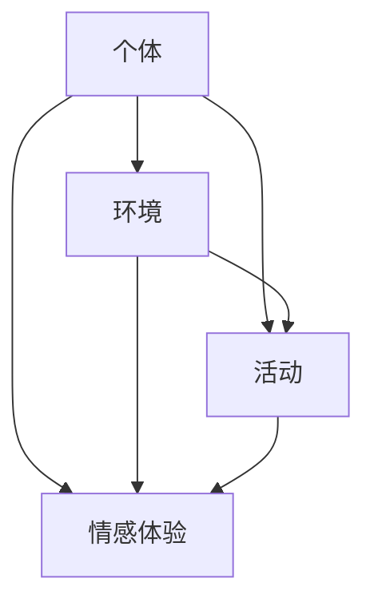

                 

### 1.1 问题的提出

在当今快节奏、高压力的社会环境中，人们普遍面临着幸福感的缺失问题。随着经济的快速发展和社会竞争的加剧，许多人在追求物质财富和事业成功的道路上，却逐渐忽视了自己内心的需求与幸福感。这种状况导致了心理健康问题的增加，如焦虑、抑郁等，严重影响了生活质量。因此，如何提升日常生活的幸福感，发现生活中的微小幸福，成为了一个亟待解决的问题。

现代社会的特征决定了人们面临的一系列挑战。首先，信息爆炸和社交媒体的普及，使得人们的生活充满了繁杂的信息和社交压力。其次，工作压力和职业竞争加剧，导致人们陷入持续的高强度工作和焦虑状态。此外，家庭关系和人际交往的复杂化，使得人们难以在情感上获得足够的支持和满足。在这些因素的综合作用下，人们往往忽视了生活中那些微小但真实存在的幸福瞬间。

面对这样的现状，寻找和发现生活中的微小幸福显得尤为重要。微小幸福并不是遥不可及的，而是隐藏在我们日常生活的方方面面，如一杯温暖的咖啡、一次简单的家庭聚会、一次愉快的散步等。发现这些幸福，不仅能够缓解心理压力，提高生活质量，还能够让我们更加珍惜生活中的每一个瞬间，培养积极乐观的生活态度。

### 1.2 微小幸福的概念界定

微小幸福，顾名思义，是指那些细微而真实的幸福感受。它并非宏大的、令人炫目的幸福，而是那些在日常生活中常常被忽视，但却能够给人带来温暖和满足感的瞬间。例如，早晨醒来时窗外的阳光、忙碌工作后的一杯热茶、和家人共度的温馨晚餐、与朋友的一次愉快对话等，这些看似微不足道的小事，却能够在我们的生活中带来巨大的幸福感。

与幸福感相比，微小幸福具有更广泛的外延。幸福感通常是指一个人在较长时间内感受到的持续满足和快乐，是一种更为综合的心理状态。而微小幸福则是幸福感的具体体现，是构成幸福感的重要组成部分。例如，一个长期处于抑郁状态的人，可能在某个瞬间感受到小小的快乐，这就是微小幸福。这样的微小幸福虽然短暂，但却能为其带来希望和动力。

在人生价值方面，微小幸福同样具有重要的意义。人生的价值不仅仅在于实现宏大的目标，更在于珍惜和体验生活中的每一个细节。微小幸福能够让我们更加珍惜当下，感受到生活的美好，从而提升我们的生活质量。这种对生活的珍惜和感激，不仅能够提升个人的幸福感，还能够促进社会的和谐与进步。

### 1.3 微小幸福与幸福感的关系

微小幸福与幸福感之间存在着密切的关系。首先，微小幸福是幸福感的重要组成部分。幸福感是一种综合的心理状态，它包括了对生活的满足、快乐和满意。而微小幸福则是这种幸福感的具体体现，是构成幸福感的重要元素。例如，在忙碌的一天结束后，一杯温暖的咖啡或一次与朋友的愉快交流，都能带来短暂的幸福感。

其次，微小幸福能够显著提升幸福感。研究发现，那些能够经常发现和体验微小幸福的人，往往拥有更高的幸福感。这是因为微小幸福能够给人带来积极的情绪体验，缓解心理压力，增强生活的满足感。例如，一项关于工作压力的研究发现，那些能够发现微小幸福的人，对工作的满意度更高，心理健康状况也更好。

另外，微小幸福对于长期幸福感也有重要的影响。虽然微小幸福是短暂的，但它们能够逐渐积累，形成一种持续的正向心理状态。这种积累效应，使得微小幸福在长期内对幸福感产生显著影响。例如，一个人在日常生活中不断发现和体验微小幸福，会逐渐培养出对生活的积极态度和感激之情，从而提升其长期幸福感。

总的来说，微小幸福与幸福感之间的关系是相辅相成的。微小幸福不仅能够直接提升幸福感，还能够通过积累效应，对长期幸福感产生深远的影响。因此，在追求幸福的道路上，发现和珍惜生活中的微小幸福，是我们不可或缺的一部分。

### 1.4 微小幸福与人生价值的关系

微小幸福在人生价值中占据着重要地位，它不仅能够直接影响个人的生活质量，还能对人生价值产生深远的间接影响。首先，微小幸福是生活质量的基石。当我们能够在日常生活中发现和体验到这些小小的幸福，我们的生活质量自然得以提升。这些幸福瞬间，如一杯香浓的咖啡、一段温馨的对话、一次愉快的户外活动等，都能够让我们感受到生活的美好，从而提升我们的生活质量。

其次，微小幸福对人生价值的间接影响也不容忽视。当我们学会珍惜和发现生活中的微小幸福，我们更容易培养出对生活的感激和满足感。这种感激和满足感，不仅能够增强我们的幸福感，还能促使我们更加积极地面对生活中的挑战和困难。例如，在遭遇困境时，那些能够从微小幸福中汲取力量的人，往往能够更加坚定地走向成功。

此外，微小幸福还能够提升我们的人际关系质量。当我们对生活中的小事保持感激和珍惜，我们会更加关注和体谅他人，从而建立更加和谐的人际关系。这种积极的人际互动，不仅能够增强我们的社会支持网络，还能够提升我们的社会地位和人生价值。

总之，微小幸福在人生价值中的重要性体现在多个方面。它不仅能够直接提升我们的生活质量，还能通过培养感激和满足感，增强我们的抗压能力，改善人际关系，从而对人生价值产生深远的间接影响。因此，发现和珍惜生活中的微小幸福，是我们在追求美好人生过程中不可或缺的一环。

### 2.1.1 主观感受与客观条件

微小幸福的主观感受与客观条件之间存在密切的联系和差异。首先，主观感受是指个体对微小幸福的主观体验和感受，它是一种内在的心理状态。例如，一个人在早晨醒来时感受到窗外的阳光，这种感受是纯粹主观的，基于个人的感官体验和心理状态。主观感受往往因个体差异而异，不同的人对相同的微小幸福有不同的感受和体验。

相比之下，客观条件是指能够带来微小幸福的实际环境和情境。例如，窗外的阳光、一杯热咖啡、一次家庭聚会等，这些都是客观条件。这些条件是具体而客观存在的，不受个体心理状态的直接影响。客观条件是微小幸福得以产生和体验的基础，但它们并不决定个体对幸福的主观感受。

主观感受和客观条件之间的差异主要体现在以下几个方面。首先，主观感受是个体内心深处的体验，而客观条件是外部环境中的具体事物。其次，主观感受具有主观性，不同的人会有不同的感受和体验，而客观条件则相对稳定和客观。最后，主观感受和客观条件之间存在互动关系，即主观感受会受到客观条件的影响，而客观条件也会通过个体主观感受来影响幸福感的产生。

综上所述，主观感受和客观条件在微小幸福的体验中扮演着不同的角色。理解它们之间的差异和联系，有助于我们更全面地认识微小幸福，从而更好地发现和珍惜生活中的每一个美好瞬间。

### 2.1.2 短期满足与长期幸福

微小幸福既有短期满足的特性，也具有长期幸福的潜力。短期满足是指微小幸福在短时间内带来的快乐和满足感。例如，喝一杯热咖啡或与朋友愉快地聊天，这些瞬间能够立即提升我们的情绪，带来短暂的愉悦。这种短期满足是我们日常生活中不可或缺的一部分，能够缓解压力，提升心理舒适度。

然而，微小幸福并不仅仅是短期满足，它还具有长期幸福的作用。长期幸福是指通过持续积累微小幸福，逐渐培养出的对生活的满足感和幸福感。例如，每天早晨享受一段静谧的时光，或者定期与家人和朋友相聚，这些习惯性的微小幸福会随着时间的推移，积累成一种持续的心理状态，从而提升我们的长期幸福感。

这种短期满足与长期幸福的结合，使得微小幸福在提升生活质量方面具有独特的优势。首先，短期满足能够提供即时的心理满足，缓解生活中的压力和焦虑。其次，长期积累的微小幸福，能够形成一种积极的、乐观的生活态度，从而提升我们的整体幸福感。因此，通过发现和珍惜生活中的每一个微小幸福，我们不仅能够在短期内感受到快乐，还能在长期内享受幸福的生活。

### 2.2.1 实体与关系定义

在构建微小幸福的相关实体关系图中，我们需要明确实体与关系的定义。首先，主要实体包括：

1. **个体（Person）**：代表生活中的个体，包括所有可能体验微小幸福的人。
2. **环境（Environment）**：指个体所处的物理和社会环境，如家庭、工作场所、社区等，这些环境中的条件和情境能够影响微小幸福的产生。
3. **活动（Activity）**：指个体进行的具体行动或活动，如散步、阅读、家庭聚会等，这些活动是体验微小幸福的重要途径。
4. **情感体验（Emotional Experience）**：代表个体在活动中的情感体验，包括愉悦、满足、放松等情感状态。

其次，我们需要定义实体之间的关系：

1. **个体与环境的关系**：个体与环境之间存在互动关系，环境中的条件直接影响个体的情感体验。例如，家庭和谐能够带来愉悦的情感体验。
2. **活动与情感体验的关系**：个体通过参与特定的活动，产生相应的情感体验。例如，散步活动能够带来放松和愉悦的情感体验。
3. **环境与活动的关联**：环境中的条件可以促进或阻碍特定活动的进行。例如，良好的社区环境可以促进户外活动的开展。

通过这些实体与关系的定义，我们可以构建一个清晰、直观的实体关系图，帮助我们更好地理解微小幸福的产生和体验过程。

### 2.2.2 图的绘制与解释

为了更好地理解微小幸福的概念和实体关系，我们使用Mermaid语言绘制了一个实体关系图。以下是一个简单的Mermaid图示例，用于表示个体、环境、活动和情感体验之间的关系：

- **节点（Node）**：
  - A（个体）：代表所有能够体验微小幸福的人。
  - B（环境）：指个体所处的物理和社会环境，如家庭、工作场所等。
  - C（活动）：代表个体进行的具体行动或活动，如散步、阅读等。
  - D（情感体验）：代表个体在活动和环境中产生的情感状态，如愉悦、满足等。

- **边（Edge）**：
  - A --> B：表示个体与环境之间的互动关系，环境中的条件影响个体的情感体验。
  - A --> C：表示个体通过活动来体验情感，活动是情感体验的媒介。
  - A --> D：表示个体直接体验到情感，情感体验是活动的结果。
  - B --> C：表示环境中的条件可以促进或阻碍特定活动的进行。
  - B --> D：表示环境中的条件直接影响个体的情感体验。
  - C --> D：表示活动导致情感体验的产生。

这个Mermaid图展示了个体、环境、活动和情感体验之间的基本关系，帮助我们更直观地理解微小幸福的构成和产生机制。通过分析这个图，我们可以看到，个体的情感体验是通过与环境互动、参与活动和感知环境条件共同作用而形成的。

### 第3章：日常生活中的微小幸福

#### 3.1.1 家庭和睦的重要性

家庭和睦是日常生活中微小幸福的重要来源之一。一个和睦的家庭环境，能够给家庭成员带来安全感和幸福感。家庭和睦的重要性体现在多个方面。首先，和谐的家庭关系能够增强家庭成员之间的情感联系，减少矛盾和冲突，从而提高家庭整体的幸福感。其次，家庭和睦有助于成员的心理健康，尤其是在孩子成长过程中，一个稳定、温暖的家庭环境对他们的心理健康和人格发展具有至关重要的影响。

在实际生活中，家庭和睦可以通过一些简单但有效的方法来实现。例如，家庭成员之间需要保持良好的沟通，通过倾听和表达来理解彼此的需求和感受。此外，共同参与家庭活动和事务，如一起做饭、打扫卫生、观看电影等，也有助于增强家庭成员之间的情感联系。最重要的是，家庭成员之间需要保持尊重和理解，避免因小事而产生不必要的争执。

#### 3.1.2 家庭生活中的微小幸福

在家庭生活中，有许多细微的瞬间能够带来幸福感。以下是一些典型的例子：

1. **温馨的晚餐**：在忙碌的一天结束后，与家人一起享用一顿温馨的晚餐，聊一聊彼此的日常生活和心情，这种简单的家庭聚会能够带来巨大的幸福感。

2. **一起看电影**：在周末或节假日，全家人一起观看一部喜欢的电影，享受共处的时光，这种共同体验的乐趣能够增强家庭成员之间的情感联系。

3. **陪伴与支持**：当家庭成员面临困难或挑战时，给予他们支持和陪伴，这种无声的关怀和爱意，是家庭和睦和幸福的重要体现。

4. **家庭活动**：例如，一起做烘焙、种植植物、户外运动等，这些活动不仅能够增进家庭成员之间的互动，还能带来快乐和满足感。

通过这些具体的例子，我们可以看到，家庭生活中的微小幸福并不需要昂贵的物质或复杂的活动，而是来自于日常生活中的点滴关怀和共同体验。

### 第3章：日常生活中的微小幸福

#### 3.2.1 工作环境与幸福感的提升

工作环境对幸福感有着直接的影响。一个良好的工作环境能够提升员工的工作满意度，从而增强幸福感。良好的工作环境包括以下几个方面：

1. **舒适的工作空间**：一个舒适的工作空间有助于提高工作效率和满意度。例如，合适的办公桌椅、良好的通风和自然光照等，都能够提升工作舒适度。

2. **公平的待遇**：员工感受到公平的待遇，如合理的薪酬、晋升机会和职业发展支持，能够增强他们对工作的满意度和忠诚度。

3. **团队合作与支持**：一个和谐、互助的团队氛围能够提升工作幸福感。团队成员之间的良好沟通、支持和合作，能够减少工作压力，增强团队的凝聚力。

4. **工作与生活的平衡**：确保员工能够平衡工作与生活，避免过度工作带来的压力和疲惫。灵活的工作安排、带薪休假等政策，有助于提升员工的幸福感。

在实际工作中，可以通过以下方法提升工作环境中的幸福感：

- 定期组织团队建设活动，如团建、庆祝节日等，增强团队凝聚力。
- 提供心理辅导和员工关怀服务，帮助员工应对工作压力。
- 设立透明和公正的薪酬体系，确保员工的付出得到合理回报。
- 鼓励员工参与决策过程，提升他们的参与感和归属感。

通过这些措施，企业能够创造一个积极、健康的工作环境，从而提升员工的幸福感。

#### 3.2.2 工作中的微小幸福

在工作中，有许多微小的幸福瞬间，这些瞬间往往能够带来愉悦和满足感。以下是一些具体的工作中的微小幸福例子：

1. **成功完成任务**：当员工成功完成一项重要的任务时，无论是大项目还是小任务，这种成就感都会带来巨大的幸福感。

2. **同事的帮助**：在工作中，同事之间的互相帮助和支持，如共同解决问题、分享经验等，能够增强团队氛围和幸福感。

3. **认可与赞扬**：当员工的努力和成就得到同事和管理层的认可和赞扬时，这种正面的反馈能够提升他们的工作满意度和幸福感。

4. **职业发展**：当员工获得晋升机会或看到自己在职业道路上有所进步时，这种职业成长带来的幸福感是无可比拟的。

5. **简单的庆祝**：在团队或个人取得成就时，进行简单的庆祝活动，如一起吃饭、喝咖啡等，能够增强团队的凝聚力和幸福感。

通过这些具体例子，我们可以看到，工作中的微小幸福并不需要复杂的仪式或高昂的成本，而是来自于日常工作和互动中的点滴关怀和认可。这些微小幸福，能够极大地提升工作满意度和幸福感，从而促进个人的职业发展和团队的和谐发展。

### 第3章：日常生活中的微小幸福

#### 3.3.1 社交对幸福的影响

社交活动在提升幸福感方面发挥着重要作用。人是社会性动物，社交需求是人类基本需求之一。良好的社交关系能够满足我们的情感需求，带来归属感和幸福感。社交活动不仅能够缓解孤独感，还能增强我们的心理韧性，提高生活质量。

首先，社交活动能够提供情感支持。在面临压力和困难时，朋友和家人的支持和鼓励能够帮助我们度过难关。例如，在一次重要的面试前，朋友的支持和鼓励能够增强我们的自信心，减轻紧张情绪。

其次，社交活动能够提升我们的幸福感。通过社交，我们能够体验到分享和互动的乐趣，这种积极的社交体验能够显著提升我们的幸福感。例如，与朋友一起参加聚会或旅行，不仅能够创造美好的回忆，还能增强我们的社交技能和人际关系。

此外，社交活动还有助于我们的心理健康。研究发现，定期参与社交活动的人，其心理健康状况显著优于那些社交活动较少的人。社交活动能够促进大脑释放多巴胺等愉悦激素，从而提升我们的心理状态。

总的来说，社交活动对于提升幸福感具有深远的影响。通过参与社交活动，我们能够满足社交需求，提升心理韧性，享受生活中的美好瞬间。

#### 3.3.2 社交中的微小幸福

在社交活动中，有许多微小的幸福瞬间，这些瞬间能够在我们的日常生活中带来愉悦和满足感。以下是一些具体的社交中的微小幸福例子：

1. **简单的问候**：在街上遇到熟人，对方给你一个微笑和简单的问候，这种简单的互动能够瞬间提升你的幸福感。

2. **朋友间的聊天**：与朋友一起聊天，分享彼此的喜怒哀乐，这种真诚的交流能够带来极大的满足感。

3. **参与社区活动**：参加社区组织的公益活动或文化活动，与他人共同为社区贡献，这种参与感能够增强你的归属感和幸福感。

4. **一起庆祝**：与朋友或家人一起庆祝生日、节日或其他重要时刻，这种共同体验的乐趣能够带来深刻的幸福感。

5. **参加聚会**：与朋友一起参加聚会，享受美食和欢声笑语，这种轻松的氛围能够缓解压力，提升幸福感。

通过这些具体例子，我们可以看到，社交中的微小幸福并不需要昂贵的物质或复杂的活动，而是来自于日常生活中的简单互动和共同体验。这些微小幸福，能够极大地提升我们的生活质量，让我们更加享受社交的乐趣。

### 第4章：心理健康与自我成长

#### 4.1.1 心理健康的概念

心理健康是指个体在情感、认知和行为上的整体良好状态，不仅仅是没有心理疾病。它包括情感平衡、认知功能正常、社会适应良好等方面。一个心理健康的人，能够有效地应对生活中的压力和挑战，保持积极乐观的生活态度，并具备良好的社会功能。

心理健康与幸福感有着密切的联系。首先，心理健康是幸福感的基础。一个心理健康的人，往往能够更好地体验生活中的快乐和满足感，从而拥有更高的幸福感。其次，心理健康有助于应对生活中的困难。在面对压力和挑战时，心理健康的人能够更好地调节情绪，保持冷静和理性，从而有效地解决问题。

为了维护心理健康，我们需要采取一系列积极的措施。首先，保持良好的生活习惯，如规律的作息、均衡的饮食、适量的运动等，有助于提升心理健康。其次，培养良好的心理素质，如增强自我认知、提高情绪调节能力、培养乐观的生活态度等，能够帮助我们更好地应对生活中的挑战。此外，建立良好的人际关系，寻求社会支持，也是维护心理健康的重要途径。

#### 4.1.2 心理健康与幸福的关系

心理健康与幸福感之间存在着密切的关系。首先，心理健康是幸福感的基础。一个心理健康的人，能够更好地体验生活中的快乐和满足感，从而拥有更高的幸福感。例如，一个情绪稳定、认知功能正常的人，更容易感受到工作中的成就、家庭中的温馨和人际交往中的乐趣，这些正面的情感体验是幸福感的重要来源。

其次，心理健康有助于提升幸福感。心理健康的人能够更好地调节情绪，保持积极乐观的态度，从而在面对生活中的挑战和困难时，能够更加从容和理性地应对。例如，当遇到工作压力或家庭矛盾时，一个心理健康的人能够通过有效的情绪调节策略，如深呼吸、冥想等，缓解负面情绪，保持心理平衡，从而提升幸福感。

此外，心理健康还有助于建立良好的人际关系。一个心理健康的人，往往能够更好地理解他人，建立深厚的情感联系，从而在社交中获得更多的支持与帮助。这种积极的人际互动，不仅能够提升幸福感，还能够增强个体的社会支持网络，进一步维护心理健康。

总的来说，心理健康与幸福感之间是相辅相成的。维护心理健康，能够提升幸福感；而拥有较高的幸福感，也有助于维护心理健康。因此，在追求幸福生活的过程中，我们需要重视心理健康，通过积极的措施来提升和维持心理健康水平。

### 4.2.1 自我认知的提升

自我认知是指个体对自己内心世界、行为模式、能力和特点的认识和理解。提升自我认知，对于个人成长和心理健康的维护具有重要意义。首先，自我认知有助于个体明确自己的优势和不足，从而制定合理的目标和计划，实现自我提升。例如，通过自我反思，我们能够发现自己在工作中的强项和需要改进的领域，从而有针对性地提升职业能力。

其次，自我认知有助于个体建立积极的自我形象。一个清晰、准确的自我认知，能够帮助个体更好地接纳自己，减少自我怀疑和负面情绪。例如，当我们认识到自己的价值和能力时，我们更容易保持自信和乐观，面对生活中的挑战和困难。

提升自我认知的方法包括：定期进行自我反思，记录自己的行为和感受，分析自己的优点和不足；寻求他人的反馈和建议，了解他人对我们的看法和评价；阅读和学习，通过获取新知识和技能，拓展自己的视野和认知。通过这些方法，我们能够逐步提升自我认知，从而实现自我成长。

### 4.2.2 自我成长的实践

自我成长是一个持续的过程，它不仅需要理论知识的指导，更需要实践中的具体行动。以下是一些自我成长的实践方法，这些方法有助于我们在日常生活中不断进步，提升自我认知和心理健康。

1. **目标设定**：明确自己的短期和长期目标，并制定具体的行动计划。例如，设定一个学习新技能的目标，然后制定每天的学习计划，确保目标的实现。

2. **积极反思**：定期进行自我反思，回顾自己的行为和感受，分析自己的优点和不足。通过反思，我们能够更好地了解自己，找到改进的方向。

3. **学习新知识**：持续学习新知识和技能，通过阅读、上课、参加培训等方式，不断拓展自己的认知边界。学习不仅能够提升我们的专业能力，还能增强我们的心理韧性。

4. **健康生活习惯**：保持良好的生活习惯，如规律作息、均衡饮食、适量运动等，这些都有助于提升心理健康和整体幸福感。

5. **寻求支持**：在自我成长的过程中，遇到困难和挑战时，寻求家人、朋友或专业人士的支持和帮助。他们的建议和鼓励，能够帮助我们克服困难，继续前进。

6. **积极心态**：培养积极乐观的心态，面对生活中的挑战和困难时，保持冷静和理性。积极的心态能够增强我们的心理韧性，提高应对问题的能力。

通过这些实践方法，我们能够在日常生活中不断成长和进步，提升自我认知和心理健康，从而实现更好的自我。

### 第5章：生活方式的优化

#### 5.1.1 健康生活方式的构建

健康生活方式的构建是提升日常生活品质的关键。健康生活方式包括多方面的内容，如饮食、运动和心理调节等。首先，均衡饮食是健康生活方式的基础。我们应该注重营养摄入的均衡，确保摄入足够的蛋白质、脂肪、碳水化合物以及各种维生素和矿物质。此外，减少高糖、高盐和高脂肪食品的摄入，对于预防慢性疾病具有重要意义。

其次，定期运动是保持身体健康的重要手段。根据世界卫生组织的推荐，成年人每周应进行至少150分钟的中等强度运动，或75分钟的高强度运动。这些运动可以包括快走、跑步、游泳、瑜伽等多种形式，不仅能增强体质，还能缓解心理压力。

最后，心理调节也是健康生活方式的重要组成部分。保持积极乐观的心态，学会应对压力和挫折，对于维护心理健康至关重要。例如，通过冥想、深呼吸等方法进行心理调节，可以帮助我们保持情绪稳定，提升生活质量。

通过构建健康生活方式，我们能够从生理和心理两个方面提升生活质量，为发现和体验生活中的微小幸福奠定基础。

#### 5.1.2 健康生活中的微小幸福

在健康生活中，许多微小的幸福瞬间能够带给我们持久的愉悦和满足感。以下是一些健康生活中的微小幸福实例：

1. **早晨的锻炼**：每天早晨进行一段轻松的锻炼，如快走或瑜伽，不仅能唤醒身体，还能带来一种轻松愉快的感觉。

2. **健康的早餐**：准备一份营养均衡的早餐，如搭配丰富的水果、谷物和蛋白质，享受美食的同时感受到健康带来的幸福感。

3. **自然的呼吸**：在公园或郊外，深呼吸新鲜空气，感受大自然的美妙，这种简单的行为能够显著提升心理健康和幸福感。

4. **一杯咖啡的时光**：在午后的闲暇时光，享受一杯香浓的咖啡，悠闲地阅读或与朋友聊天，这种短暂的放松能够带来心灵的满足。

5. **与家人的晚餐**：与家人一起享用晚餐，聊一聊彼此的日常生活，这种温馨的时光是健康生活中的微小幸福。

通过这些具体实例，我们可以看到，健康生活不仅仅是生理上的健康，还包括心理上的满足。这些微小的幸福瞬间，能够极大地提升我们的生活质量，让我们更加享受健康生活的美好。

#### 5.2.1 环保意识的重要性

环保意识在提升幸福感方面具有不可忽视的重要性。首先，环保意识能够促使我们采取积极的行动来保护环境，从而改善我们的生活质量和健康状况。例如，减少塑料使用、节约能源和水资源等行为，不仅能减少环境污染，还能降低与环境污染相关的健康风险。

其次，环保行为能够带来内心的满足感和幸福感。当我们意识到自己的行动对环境产生了积极影响时，会感到一种成就感和自豪感。例如，参与植树活动、回收垃圾等，这些行动不仅能够美化环境，还能增强我们的社会责任感和归属感。

此外，环保意识还有助于建立可持续的生活方式和价值观。通过倡导环保，我们能够培养对自然和生态系统的尊重和保护意识，从而促进人与自然的和谐共生。这种价值观的建立，不仅能够提升我们自身的幸福感，还能为未来的子孙后代创造一个更加美好的生活环境。

总之，环保意识在提升幸福感方面具有多重作用。通过提升环保意识，我们不仅能够保护环境，还能在日常生活中体验到更多的满足感和幸福感。

#### 5.2.2 绿色生活与幸福感的提升

绿色生活方式不仅对环境保护有重要意义，还能显著提升幸福感。以下是一些绿色生活方式的实例，以及它们如何带来幸福感的提升：

1. **绿色出行**：选择步行、骑自行车或使用公共交通工具，减少私家车的使用。这不仅减少了空气污染，还能增强身体活动量，带来健康和活力。

2. **节能减排**：节约能源，如使用节能灯泡、减少电器待机时间，不仅能降低能源消耗，还能节省开支，从而带来经济上的满足感。

3. **垃圾分类**：正确分类垃圾，参与社区回收活动，这种环保行为不仅减少了垃圾对环境的污染，还能培养个人的责任感和成就感。

4. **种植绿色植物**：在家中或社区中种植绿色植物，不仅美化环境，还能改善空气质量，带来宁静和放松的感觉。

5. **使用环保产品**：选择环保材料制成的产品，如可降解的塑料制品、有机食品等，这些选择能够减少对环境的负担，增强对环保的认同感。

通过这些绿色生活方式，我们不仅能够为地球做出贡献，还能在日常生活中体验到更多的满足感和幸福感。绿色生活，让我们在关爱环境的同时，也关爱自己的心灵。

### 第6章：兴趣爱好与休闲娱乐

#### 6.1.1 兴趣爱好的定义

兴趣爱好是指个体在休闲时间自愿参与的活动，这些活动能够带来乐趣、满足感和个人成就感。兴趣爱好可以涵盖广泛的内容，如阅读、绘画、音乐、运动、旅行等。每个人都有独特的兴趣爱好，这些爱好不仅丰富了我们的生活，还能在精神层面上给予我们满足和愉悦。

#### 6.1.2 兴趣爱好与幸福感的联系

兴趣爱好与幸福感之间存在密切的联系。首先，兴趣爱好能够提供心理上的满足和放松。当我们沉浸在兴趣爱好中时，能够暂时忘记生活中的烦恼和压力，从而获得内心的平静和满足。例如，阅读能够带给我们知识上的满足和情感上的共鸣，音乐能够激发我们的情感，运动能够释放压力和提升自信。

其次，兴趣爱好有助于提升个人的自我价值感。通过在兴趣爱好中不断学习和进步，我们能够感受到自己的成长和成就。这种成就感不仅能够增强自信心，还能提升我们对生活的满意度和幸福感。例如，一个热爱绘画的人，在创作过程中不断突破自己的技术和表现力，能够获得极大的成就感和满足感。

此外，兴趣爱好还有助于建立社交网络。许多兴趣爱好都有相应的社区或团体，通过这些社交活动，我们能够结识志同道合的朋友，分享经验和乐趣，从而在社交中获得更多的支持和快乐。

总的来说，兴趣爱好不仅丰富了我们的生活，还在心理层面上提升了我们的幸福感。通过培养和追求兴趣爱好，我们能够在日常生活中找到更多的快乐和满足，提升整体生活质量。

#### 6.2.1 休闲娱乐活动种类

休闲娱乐活动种类繁多，每种活动都有其独特的乐趣和益处。以下是一些常见的休闲娱乐活动及其特点：

1. **阅读**：阅读是一种深入的精神享受，通过阅读，我们能够拓展知识面、提升思维能力和理解力。无论是小说、传记、科普书籍还是经典文学作品，阅读都能够带给我们丰富的情感体验和知识收获。

2. **音乐**：音乐是一种强烈的情感表达方式，能够激发我们的情感和创造力。无论是听音乐、唱歌还是演奏乐器，音乐都能够让我们在繁忙的生活中找到放松和愉悦。

3. **绘画**：绘画是一种艺术创作，通过色彩和线条的表达，我们能够表达自己的情感和想法。绘画不仅能够提升我们的审美能力，还能培养我们的观察力和创造力。

4. **运动**：运动是一种健康的休闲方式，通过体育活动，我们能够增强体质、提高健康水平。运动还能够释放压力、提升心情，对身心健康有着积极的影响。

5. **旅游**：旅游是一种探索和体验的方式，通过旅行，我们能够了解不同的文化和风景，拓宽视野，丰富人生经历。旅游不仅能够放松身心，还能增强我们的适应能力和独立性。

6. **社交活动**：参与社交活动，如聚会、团队建设等，能够增强人际关系、提升社交技能，同时带来愉快的社交体验。

这些休闲娱乐活动，各有特色，但共同的目标是帮助我们放松身心，提升幸福感，丰富我们的日常生活。

#### 6.2.2 休闲娱乐中的微小幸福体验

在休闲娱乐活动中，有许多微小的幸福瞬间能够带给我们深刻的满足感和快乐。以下是一些具体实例：

1. **阅读**：在宁静的午后，泡一杯茶，坐在窗边阅读一本喜欢的书籍，享受文字带来的情感共鸣和知识收获，这种静谧的时光是阅读中的微小幸福。

2. **音乐**：在繁忙的一天结束后，坐在沙发上，戴上耳机，聆听一首动人的旋律，音乐带来的放松和愉悦瞬间能够缓解压力，提升心情。

3. **绘画**：在画布前，涂上鲜艳的色彩，通过画笔表达自己的情感，每次完成一幅画作，都是绘画中的微小幸福。

4. **运动**：在公园里跑步，感受清风拂面和汗水流淌，每一次完成运动目标，都能带来成就感和愉悦。

5. **旅游**：在一个陌生的地方，品尝当地美食，欣赏独特的风景，与朋友分享旅行的乐趣，每一次旅行都是寻找微小幸福的旅程。

6. **社交活动**：与朋友聚会，分享彼此的故事和快乐，笑声和交流中的温暖是社交活动中的微小幸福。

通过这些实例，我们可以看到，休闲娱乐活动中的微小幸福并不需要昂贵的物质或复杂的过程，而是来自于日常生活中简单的、真实的体验。这些微小幸福，能够极大地提升我们的生活质量，让我们更加享受休闲娱乐的乐趣。

### 第7章：社会参与与公益服务

#### 7.1.1 社会参与的内涵

社会参与是指个体在社区和社会事务中积极参与、贡献力量的行为。它包括各种形式的活动，如志愿服务、社区建设、社会运动等。社会参与不仅能够帮助他人，还能对参与者自身产生积极影响。首先，通过参与社会活动，个体能够感受到自己的价值和能力，增强自信心和自我价值感。例如，参与志愿服务，帮助有需要的人群，能够带来深深的满足感和成就感。

其次，社会参与有助于建立良好的社会关系和网络。通过参与社区活动，个体能够结识志同道合的朋友，分享经验和资源，从而在社交中获得更多的支持和帮助。此外，社会参与还能够提升个体的社会责任感和公民意识，使个体更加关注社会问题，积极参与社会变革和进步。

总之，社会参与不仅能够帮助他人，还能对参与者自身产生深远的积极影响，提升幸福感和社会价值。

#### 7.1.2 社会参与与幸福的关系

社会参与与幸福感之间存在密切的联系。首先，社会参与能够显著提升个体的幸福感。通过参与社会活动，个体能够感受到自己的价值和能力，这种自我实现的感觉是提升幸福感的重要途径。例如，参与志愿服务或社区建设，能够让人感受到自己的付出对他人和社会有积极的影响，从而获得深深的满足感和成就感。

其次，社会参与有助于建立积极的社会关系。参与社会活动，能够结识志同道合的朋友，分享经验和资源，这种积极的人际互动不仅能够提升个体的社交技能，还能增强社会支持网络，从而提升幸福感。例如，在一个志愿者团队中，成员们共同为同一个目标努力，相互鼓励和支持，这种团队精神能够增强个体的归属感和幸福感。

此外，社会参与能够促进个体的心理健康。通过参与社会活动，个体能够减轻压力，提升心理韧性。例如，当个体在帮助他人时，会释放出积极的情绪和激素，如多巴胺和内啡肽，这些激素能够提升个体的情绪状态，缓解焦虑和抑郁。

总的来说，社会参与不仅能够提升个体的幸福感，还能通过建立积极的社会关系和促进心理健康，对个体的整体幸福产生深远的影响。

#### 7.2.1 公益服务的形式

公益服务是指为了社会公共利益而提供的服务，它通过帮助他人、改善社会环境来提升整体幸福感。公益服务的形式多种多样，以下是一些常见的公益服务形式：

1. **志愿服务**：志愿服务是公益服务中最常见的形式，包括帮助孤寡老人、照顾留守儿童、参与社区清洁等。志愿者通过无私奉献，帮助有需要的人群，带来深远的积极影响。

2. **慈善捐赠**：慈善捐赠是指个人或组织通过资金、物资、时间等方式，对需要帮助的人或机构进行援助。捐赠不仅能够直接改善受助者的生活条件，还能培养捐赠者的社会责任感和爱心。

3. **公益活动**：公益活动是指为了实现特定的社会目标而组织的大型活动，如公益讲座、义卖、环保活动等。通过这些活动，不仅能够提高公众的社会意识，还能为需要帮助的人群提供实质性的帮助。

4. **社区服务**：社区服务是指为社区内的居民提供各种形式的服务，如社区医疗、教育支持、文化娱乐等。这些服务能够增强社区凝聚力，提升居民的生活质量。

5. **慈善基金会**：慈善基金会是专门从事公益慈善活动的组织，通过筹款、项目执行和资助等方式，推动社会公益事业的发展。

这些公益服务形式，各有特色，但共同的目标是帮助他人、改善社会环境，提升整体幸福感。

#### 7.2.2 公益服务中的微小幸福体验

在公益服务中，许多微小的幸福瞬间能够深刻地影响参与者和受助者。以下是一些具体实例：

1. **帮助老人过马路**：当志愿者帮助老人安全过马路时，老人的感激笑容和轻松步伐，是微小但真实的幸福体验。

2. **为贫困学生提供书籍**：当志愿者将一套新的教科书送到贫困学生的手中，学生眼中闪烁的光芒和感激之情，是最宝贵的微小幸福。

3. **社区清洁活动**：在社区清洁活动中，居民一起清理垃圾、美化环境，这种团队合作和社区共建的体验，能够带来极大的满足感和幸福感。

4. **为孤儿院孩子们献爱心**：志愿者为孤儿院的孩子们提供玩具、衣物和陪伴，孩子们的欢声笑语和灿烂笑容，是公益服务中的微小幸福。

通过这些实例，我们可以看到，公益服务中的微小幸福并不需要昂贵的物质或复杂的过程，而是来自于日常生活中简单的、真实的互动和关怀。这些微小幸福，能够极大地提升参与者和受助者的幸福感，同时也促进了社会的和谐与进步。

### 8.1 微小幸福的积累与长远影响

#### 8.1.1 微小幸福的长期效应

微小幸福并非只是短暂的愉悦，而是具有深远长期效应的力量。通过逐步积累微小幸福，我们能够在长期内感受到其显著的影响。首先，微小幸福的长期效应体现在心理韧性的提升上。当我们经常体验到生活中的小确幸，我们的心理韧性会得到增强，面对压力和挑战时，能够更加从容和乐观。例如，长期坚持每天早晨享受一段宁静的阅读时光，不仅能够让我们在繁忙的一天开始时感受到平静和满足，还能逐渐培养出对生活的积极态度，从而在面对工作中的压力和困难时，能够保持冷静和乐观。

其次，微小幸福的积累能够显著提升幸福感。虽然单个微小幸福带来的快乐是短暂的，但当这些瞬间不断积累时，它们会逐渐形成一种持续的正向心理状态，从而提升我们的整体幸福感。例如，每天晚上与家人一起分享一天的所见所闻，这种简单的互动不仅能够增强家庭的亲密感，还能在日积月累中，让我们感受到生活的温暖和幸福。

此外，微小幸福的长期效应还体现在人际关系质量的提升上。通过在日常生活中的点滴互动，我们能够培养出对他人的关怀和理解，从而建立更加和谐的人际关系。例如，在日常生活中，定期与朋友进行简单的电话交流或一起散步，这种持续的小型互动能够增强友谊，提升社会支持网络，从而在长期内对我们的幸福感产生积极影响。

总的来说，微小幸福的长期效应不仅在于心理韧性的提升，还在于幸福感的增强和人际关系的改善。通过发现和积累生活中的微小幸福，我们能够在长期内享受到这些美好时刻带来的深远影响，从而提升整体生活质量。

#### 8.1.2 如何培养发现微小幸福的能力

培养发现微小幸福的能力，需要我们从日常生活的细节中寻找快乐，并通过一系列具体的实践方法来提升这种能力。以下是一些有效的方法：

1. **保持警觉**：首先，我们需要在日常生活中保持警觉，时刻关注身边的微小幸福。例如，在早晨醒来时，注意窗外的阳光、清新的空气，感受这些细微的美好。

2. **记录点滴**：通过记录生活中的小确幸，我们能够更加清晰地意识到幸福的存在。每天花几分钟时间，写下让自己感到快乐的事情，无论是小小的成就，还是与家人朋友共度的温馨时光。

3. **培养感激**：培养感激之心，能够让我们更加珍惜生活中的每一个瞬间。例如，在享用一顿美味的晚餐时，思考饭菜背后的劳动和付出，从而对这份幸福产生更深的感激。

4. **定期反思**：定期进行自我反思，思考自己在过去的一段时间内，发现了哪些微小幸福，这些幸福给自己带来了哪些积极的影响。通过反思，我们能够更好地理解幸福的价值，从而在日常中更加主动地寻找和体验幸福。

5. **关注他人**：关注他人的需求，通过帮助他人来获得幸福。例如，在日常生活中，主动帮助邻居做一些力所能及的事情，如代购物品、帮忙照顾孩子等，通过这些简单的行为，我们能够感受到自己的价值和对他人的贡献，从而提升幸福感。

通过这些方法，我们能够在日常生活中逐步培养出发现微小幸福的能力，从而更加珍惜生活中的每一个美好瞬间。

### 8.2.1 实践中的注意事项

在提升微小幸福的过程中，我们需要注意一些实践中的挑战和误区，以确保我们的努力能够带来预期的效果。

首先，**时间管理**是实践中的一个重要挑战。由于生活节奏快，我们可能难以在繁忙的工作和生活中找到时间来体验和发现微小幸福。为了解决这个问题，我们可以采用**时间块管理法**，即在日程表中专门安排一些时间块，用于享受和体验生活中的小确幸。例如，每天早晨安排15分钟的时间，用于静心阅读或享受一杯咖啡，这样既不会影响日常事务，又能确保我们有机会感受幸福。

其次，**心理调适**也是需要关注的一个方面。在追求微小幸福的过程中，我们可能会遇到一些挫折和困难，如无法实现某个目标或感到焦虑。这时，**心理调适技巧**如冥想、深呼吸和正念练习可以帮助我们缓解压力，保持平和的心态。例如，每天花5分钟进行冥想，专注于呼吸和当下的感受，能够显著提升我们的情绪状态，让我们更加敏锐地感受到生活中的微小幸福。

此外，**避免完美主义**也是一个需要注意的误区。完美主义会让我们在追求幸福的过程中，对每一个瞬间都要求完美，从而增加了心理负担。为了克服这种误区，我们需要学会**接受不完美**，认识到每一个小确幸都是独特且宝贵的。例如，在准备一顿家庭晚餐时，不要因为某个细节不够完美而感到沮丧，而是珍惜和家人共度的美好时光。

最后，**保持耐心**也是至关重要的。微小幸福的发现和体验需要时间和持续的努力，我们不能期望一蹴而就。通过持续地关注和珍惜生活中的细节，我们能够在长期内积累起幸福的感受，从而提升整体生活质量。

### 8.2.2 提升幸福感的误区与纠正

在提升幸福感的实践中，我们常常会遇到一些误区，这些误区可能会阻碍我们达到预期的效果。以下是一些常见的误区及其纠正方法：

1. **误区一：认为物质条件是幸福的主要来源**  
   **纠正方法**：物质条件虽然能带来短暂的满足感，但并不是幸福的长久保障。我们应该关注生活中的微小幸福，如与家人共度的时光、简单的日常乐趣等。通过培养感激和珍惜的心态，我们能够在物质条件不变的情况下，提升幸福感。

2. **误区二：追求完美导致压力增加**  
   **纠正方法**：追求完美往往会导致我们对自己的期望过高，从而增加心理压力。我们应该学会接受不完美，珍惜每一个小确幸。通过设定合理的目标，并理解每个人都有不完美之处，我们能够减少自我压力，提升幸福感。

3. **误区三：忽视心理调适，只关注身体锻炼**  
   **纠正方法**：幸福感不仅来自于身体健康，还来自于心理健康。我们应该在注重身体锻炼的同时，重视心理调适，如通过冥想、深呼吸等方式缓解压力。同时，建立良好的社交关系，寻求社会支持，也是维护心理健康的重要途径。

4. **误区四：依赖外部评价来衡量幸福感**  
   **纠正方法**：外部评价可能会影响我们的自我认知，但幸福感是个人内心的感受。我们应该关注自己的内心需求，通过自我反思和满足来提升幸福感。学会自我认可和自我鼓励，而不是过分依赖他人的评价。

通过纠正这些误区，我们能够更加科学地提升幸福感，从而享受更加美好和充实的生活。

### 8.3 拓展阅读与进一步探索

在提升日常生活品质、发现微小幸福的过程中，以下书籍和资源提供了深入的理论和实践指导，值得进一步阅读和探索：

1. **《小确幸：生活中的小美好》**：这是一本关于发现生活中微小幸福的书，通过生动的案例和实用的建议，帮助我们更好地理解和体验生活中的小确幸。

2. **《幸福课》**：泰勒·本-沙哈的《幸福课》详细介绍了幸福心理学的理论和实践方法，帮助我们理解幸福感的来源，并提供了提升幸福感的实用技巧。

3. **《正面管教》**：简·尼尔森的《正面管教》通过家庭教育实例，阐述了如何在日常生活中培养积极乐观的心态，提升家庭幸福感。

4. **《感恩的力量》**：彼得·卡帕利亚的《感恩的力量》探讨了感恩对心理健康的积极影响，提供了培养感恩心态的具体方法，有助于提升幸福感。

5. **相关研究论文**：例如，关于幸福心理学、积极心理学和社会支持等方面的研究论文，通过科学的方法和数据分析，提供了关于提升幸福感的深入见解。

通过这些书籍和研究资源，我们能够进一步了解和掌握提升幸福感的方法，从而在日常生活中更加有效地发现和体验微小幸福。

