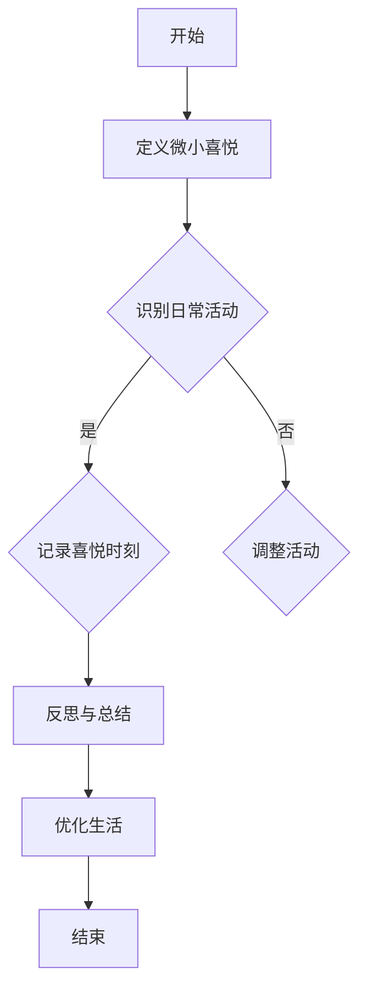
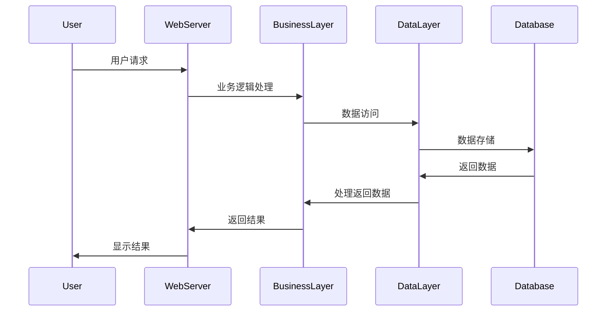
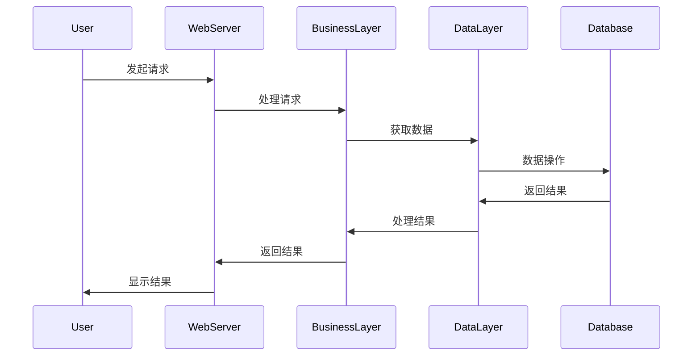
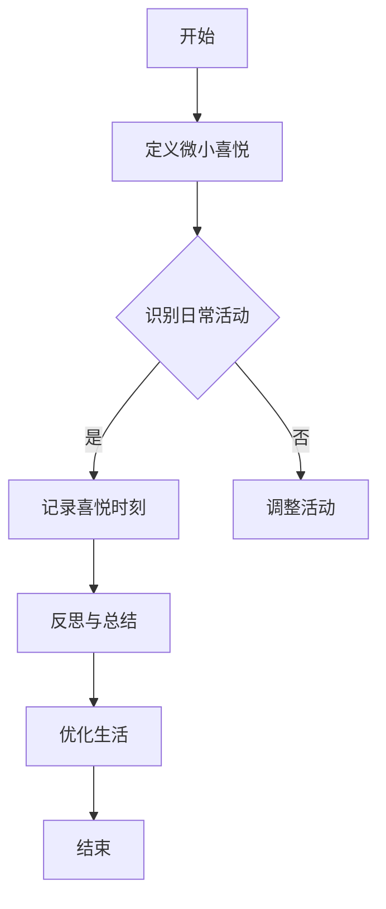

                 

### 引言

#### 问题背景

在当今快节奏的现代社会中，人们的生活质量不断提高，但随之而来的是日益加剧的压力和焦虑。尽管物质条件不断改善，许多人仍然感到不满足，甚至迷茫。这种状态下，如何提升日常生活质量成为一个亟待解决的问题。而发现生活中的微小喜悦，正是实现这一目标的有效途径。

#### 问题的描述与解决

提升日常生活质量不仅仅是为了满足物质需求，更是为了追求精神层面的满足。生活中的微小喜悦，如一次简单的散步、一杯热茶、一段轻松的交谈，这些看似微不足道的小事，却能在我们的日常生活中带来巨大的心理效益。它们能够缓解压力，提高幸福感，甚至有助于改善身心健康。

那么，如何发现并享受这些微小喜悦呢？本书将提供一系列实用的策略和技巧，帮助读者在日常生活的方方面面中发现快乐，提升生活质量。

#### 边界与外延

在这本书中，我们将探讨以下几个方面：

1. **微小喜悦的定义**：介绍微小喜悦的概念，理解它对日常生活质量的提升作用。
2. **寻找微小喜悦的方法**：提供实用的技巧和工具，帮助读者在日常活动中发现喜悦。
3. **实践与反思**：通过实际案例分享和自我反思，深化读者对微小喜悦的认识。
4. **心理学背景**：探讨心理学原理，解释为何微小喜悦能够提升生活质量。
5. **案例研究**：分析不同情境下发现微小喜悦的实际案例，为读者提供借鉴。

通过以上几个方面的探讨，本书旨在帮助读者从内心深处发现生活中的美好，提高日常生活质量。

#### 概念结构与核心要素组成

本书的核心概念和要素主要包括：

1. **微小喜悦**：指的是日常生活中那些能够带来短暂但强烈幸福感的小事。
2. **心理学原理**：涉及积极心理学、情绪调节等理论，解释微小喜悦的作用机制。
3. **实践技巧**：包括日常习惯的改变、认知重构、正念练习等。
4. **实际案例**：通过分享真实案例，展示如何在实际生活中发现和享受微小喜悦。

这些核心要素相互联系，共同构成了本书的内容框架，帮助读者全面理解并实践发现微小喜悦的方法。

### 核心概念与联系

#### 微小喜悦的概念

微小喜悦是指在日常生活中那些能够带来短暂但强烈幸福感的小事。它不同于大喜大悲，而是那些细微的、不经意的瞬间，如听到一首喜欢的歌曲、与朋友的一次简单交谈、或者看到一朵美丽的花朵。这些微小喜悦虽然持续时间短，却能在我们的内心深处留下深刻的印象，带来持久的幸福感。

#### 概念属性特征对比表格

为了更好地理解微小喜悦的概念，我们可以将之与快乐、幸福等概念进行对比。以下是一个简单的对比表格：

| 概念     | 微小喜悦         | 快乐             | 幸福              |
|----------|-----------------|-----------------|-----------------|
| 持续时间 | 短暂             | 长短不一         | 长期             |
| 强度     | 强烈但短暂       | 强弱不一         | 强度较为温和      |
| 来源     | 日常生活中的小事 | 多样化来源       | 多样化来源       |
| 影响范围 | 心理层面         | 心理层面与生理层面 | 心理、生理、社会层面 |

通过这个对比表格，我们可以看到微小喜悦与其他概念的区别和联系，从而更深入地理解它的本质。

#### ER实体关系图架构

为了更好地理解微小喜悦与生活中其他元素的关系，我们可以使用ER实体关系图来展示这些概念之间的关系。以下是一个简单的ER实体关系图：

```mermaid
erDiagram
  USER ||--|{ MICROJOY }: MicroJoy
  MICROJOY ||--|{ HAPPIENESS }: Happiness
  MICROJOY ||--|{ STRESS_REDUCTION }: StressReduction
  MICROJOY ||--|{ SELF-REALIZATION }: SelfRealization
```

在这个ER图中，`USER`代表使用者，`MICROJOY`代表微小喜悦，`HAPPIENESS`代表幸福感，`STRESS_REDUCTION`代表压力减轻，`SELF-REALIZATION`代表自我实现。通过这张图，我们可以清晰地看到微小喜悦与这些实体之间的关系，以及它们在提升生活质量中的作用。

### 算法原理讲解

#### 算法流程图

为了更深入地理解如何通过发现微小喜悦来提升生活质量，我们可以设计一个简单的算法流程图。以下是一个使用Mermaid绘制的算法流程图示例：



在这个流程图中，我们从定义微小喜悦开始，通过识别日常活动和记录喜悦时刻，最终进行反思与总结，从而优化生活，提升生活质量。

#### Python源代码讲解

为了实现这个算法，我们可以使用Python编写一个简单的程序。以下是一段示例代码：

```python
import random

def define_microjoy():
    joys = ["散步", "喝茶", "听音乐", "和朋友聊天"]
    return random.choice(joys)

def identify_daily_activities():
    activities = ["工作", "学习", "家务", "休闲"]
    return random.choice(activities)

def record_joyful_moments():
    joyful_moments = []
    while True:
        joy = input("今天有什么让你感到喜悦的事情吗？")
        if joy:
            joyful_moments.append(joy)
        else:
            break
    return joyful_moments

def reflect_and_summarize(joyful_moments):
    print("你记录的喜悦时刻有：")
    for moment in joyful_moments:
        print(f"- {moment}")

def optimize_life():
    print("根据你的喜悦时刻，你可以考虑调整你的日常生活，以增加更多微小喜悦。")

if __name__ == "__main__":
    microjoy = define_microjoy()
    print(f"今天，你可以尝试发现生活中的 {microjoy} 微小喜悦。")
    
    activity = identify_daily_activities()
    if activity == "休闲":
        joyful_moments = record_joyful_moments()
        reflect_and_summarize(joyful_moments)
        optimize_life()
    else:
        print("你今天的活动不包含休闲，建议调整活动，尝试寻找微小喜悦。")
```

这段代码定义了一系列函数，用于实现算法流程图中的各个步骤。通过用户输入，我们可以记录日常中的喜悦时刻，并进行反思和总结，从而优化生活。

#### 算法原理的数学模型和公式讲解

为了更深入地理解算法原理，我们可以使用数学模型和公式来描述。以下是几个关键概念和公式：

1. **幸福感（Happiness）**：

   $$ H = f(j) + g(s) $$

   其中，$f(j)$ 表示微小喜悦对幸福感的直接影响，$g(s)$ 表示个体自我感知的幸福感。

2. **压力缓解（Stress Reduction）**：

   $$ S = r(j) - p(j) $$

   其中，$r(j)$ 表示微小喜悦对压力的缓解程度，$p(j)$ 表示微小喜悦对压力的潜在负面影响。

3. **自我实现（Self-Realization）**：

   $$ R = \frac{1}{n} \sum_{i=1}^{n} r_i(j) $$

   其中，$r_i(j)$ 表示在 $i$ 次体验微小喜悦时，个体获得的自我实现感。

这些公式可以帮助我们定量地理解微小喜悦对生活质量的影响。

#### 举例说明

为了更好地说明这些概念，我们可以通过一个实际案例来展示：

**案例**：小王在忙碌的一天后，决定尝试通过散步来放松心情。他选择了一条风景优美的公园小径，边走边欣赏周围的自然风光。散步结束后，他感到身心舒畅，压力得到了显著缓解。第二天，他决定将散步作为每日放松的一部分，并开始记录自己的喜悦时刻。

**解析**：

- **幸福感**：通过散步，小王体验到了微小喜悦，他的幸福感得到了提升。根据公式 $H = f(j) + g(s)$，我们可以推断 $f(j) > 0$，即微小喜悦对幸福感的直接影响为正。
- **压力缓解**：散步对小王的压力有显著的缓解作用。根据公式 $S = r(j) - p(j)$，我们可以推断 $r(j) > p(j)$，即微小喜悦对压力的缓解程度大于潜在负面影响。
- **自我实现**：通过持续地寻找和享受微小喜悦，小王感受到了自我实现感。根据公式 $R = \frac{1}{n} \sum_{i=1}^{n} r_i(j)$，我们可以推断随着体验次数的增加，$R$ 的值会逐渐增大。

通过这个案例，我们可以看到微小喜悦如何在数学模型的作用下提升生活质量。

### 数学模型和数学公式讲解

在提升日常生活质量的过程中，数学模型和公式扮演着至关重要的角色。它们不仅帮助我们量化生活质量的各个维度，还能为我们的决策提供科学依据。以下，我们将介绍几个关键的数学模型和公式，并详细解释它们的应用。

#### 1. 幸福感计算模型

幸福感是提升生活质量的核心指标之一。一个简单的幸福感计算模型可以表示为：

$$
H = \alpha J + \beta S + \gamma R
$$

其中：
- \( H \) 表示幸福感（Happiness）；
- \( J \) 表示微小喜悦的总量；
- \( S \) 表示压力缓解的程度；
- \( R \) 表示自我实现的感受；
- \( \alpha, \beta, \gamma \) 是权重系数，用于平衡不同因素对幸福感的贡献。

举例来说，假设小王在一个月内记录了10次微小喜悦，每次喜悦带来的幸福感为2，压力缓解为3，自我实现感为1。那么他的幸福感计算如下：

$$
H = \alpha \times (2 \times 10) + \beta \times 3 + \gamma \times 1
$$

这个公式帮助我们量化了小王的幸福感水平，从而可以更直观地了解哪些活动对他的生活质量有显著影响。

#### 2. 压力缓解模型

压力缓解是幸福感的重要组成部分。一个简化的压力缓解模型可以表示为：

$$
S = -\beta \times (J - J_0)
$$

其中：
- \( S \) 表示压力缓解的程度；
- \( J \) 表示微小喜悦的总量；
- \( J_0 \) 是一个阈值，表示在没有喜悦的情况下，个体的压力水平。

假设小王的 \( J_0 \) 为5，即在没有喜悦的情况下，他的压力水平为5。如果他在一个月内记录了20次喜悦，那么他的压力缓解计算如下：

$$
S = -\beta \times (20 - 5)
$$

这个模型表明，随着喜悦次数的增加，压力会逐渐缓解。通过调整 \( \beta \) 的值，我们可以调整压力缓解的效果。

#### 3. 自我实现模型

自我实现是提升生活质量的一个重要方面。一个简单的自我实现模型可以表示为：

$$
R = \alpha \times \sum_{i=1}^{n} J_i
$$

其中：
- \( R \) 表示自我实现的感受；
- \( J_i \) 表示第 \( i \) 次体验的喜悦程度；
- \( n \) 表示体验的次数；
- \( \alpha \) 是权重系数，反映了喜悦程度对自我实现的影响。

举例来说，假设小王在一个月内体验了5次喜悦，每次喜悦程度为4，那么他的自我实现计算如下：

$$
R = \alpha \times (4 + 4 + 4 + 4 + 4)
$$

这个模型帮助我们理解喜悦次数和自我实现感之间的关系。

#### 4. 整合模型

为了全面评估生活质量，我们可以将幸福感、压力缓解和自我实现整合到一个综合模型中：

$$
LQ = \alpha H + \beta S + \gamma R
$$

其中：
- \( LQ \) 表示生活质量（Life Quality）；
- \( H, S, R \) 分别是幸福感、压力缓解和自我实现的得分；
- \( \alpha, \beta, \gamma \) 是相应的权重系数。

这个综合模型可以帮助我们全面评估生活质量，并确定哪些因素对生活质量的影响最大。

#### 应用举例

假设小王的 \( \alpha = 0.5, \beta = 0.3, \gamma = 0.2 \)，他在一个月内记录了20次喜悦，每次喜悦带来的幸福感为2，压力缓解为3，自我实现感为1。那么他的生活质量计算如下：

$$
LQ = 0.5 \times (2 \times 20) + 0.3 \times 3 + 0.2 \times 1 = 10 + 0.9 + 0.2 = 11.1
$$

这个结果表明，小王的生活质量为11.1。通过调整权重系数，我们可以更准确地反映生活质量的不同方面。

通过这些数学模型和公式，我们可以量化生活中的喜悦，评估生活质量，并制定出更有效的提升策略。

### 系统分析与架构设计方案

为了更好地实现发现微小喜悦的目标，我们可以设计一个系统，帮助用户在日常活动中识别和记录喜悦时刻。以下将介绍该系统的分析与架构设计方案。

#### 问题场景介绍

假设我们正在开发一款名为“微小喜悦发现器”的移动应用。用户可以通过该应用记录生活中的微小喜悦，并查看自己的喜悦积累。我们的目标是提供一个易于使用、功能强大且具有吸引力的应用，帮助用户提升生活质量。

#### 项目介绍

“微小喜悦发现器”应用的核心功能包括：

1. **喜悦记录**：用户可以随时随地记录生活中的喜悦时刻。
2. **喜悦回顾**：用户可以查看过去的喜悦记录，回顾自己的美好生活。
3. **喜悦分析**：系统会根据用户的喜悦记录，提供个性化的建议，帮助用户发现更多的喜悦。
4. **社交分享**：用户可以选择与朋友分享自己的喜悦，增强社交互动。

#### 系统功能设计

为了实现上述功能，我们需要设计以下几个核心模块：

1. **用户管理模块**：负责用户的注册、登录和基本信息的维护。
2. **喜悦记录模块**：允许用户添加、编辑和删除喜悦记录。
3. **喜悦回顾模块**：展示用户的喜悦记录，并提供搜索和过滤功能。
4. **喜悦分析模块**：对用户的喜悦记录进行分析，提供个性化的建议。
5. **社交分享模块**：实现用户之间的喜悦分享功能。

以下是“微小喜悦发现器”应用的领域模型，使用Mermaid绘制：

```mermaid
classDiagram
    User <<类>> "用户"
    Joy <<类>> "喜悦"
    Review <<类>> "回顾"
    Analysis <<类>> "分析"
    Share <<类>> "分享"

    User <|.. Joy: 记录>
    User <|.. Review: 查看回顾>
    User <|.. Analysis: 分析>
    User <|.. Share: 分享>

    Joy <|.. Review: 回顾>
    Joy <|.. Analysis: 分析>
    Joy <|.. Share: 分享
```

#### 系统架构设计

为了确保系统的性能、可扩展性和安全性，我们采用了分层架构设计。以下是“微小喜悦发现器”应用的架构图，使用Mermaid绘制：



在这个架构中，WebServer负责接收用户请求，并将请求转发到BusinessLayer进行业务逻辑处理。BusinessLayer与DataLayer交互，实现数据的存储和访问。DataLayer连接到Database，负责数据的持久化。最后，处理结果通过WebServer返回给用户。

#### 系统接口设计

以下是“微小喜悦发现器”应用的主要接口设计：

1. **用户管理接口**：
   - 注册：`POST /register`，参数：`username`, `password`, `email`。
   - 登录：`POST /login`，参数：`username`, `password`。
   - 用户信息更新：`PUT /users/{userId}`，参数：`username`, `email`。

2. **喜悦记录接口**：
   - 添加喜悦记录：`POST /joys`，参数：`userId`，`description`。
   - 获取喜悦记录列表：`GET /joys/{userId}`。
   - 更新喜悦记录：`PUT /joys/{joyId}`，参数：`description`。
   - 删除喜悦记录：`DELETE /joys/{joyId}`。

3. **喜悦回顾接口**：
   - 获取喜悦回顾列表：`GET /reviews/{userId}`。
   - 添加喜悦回顾：`POST /reviews`，参数：`userId`，`joyId`，`review`。

4. **喜悦分析接口**：
   - 分析喜悦数据：`GET /analysis/{userId}`。

5. **社交分享接口**：
   - 分享喜悦：`POST /shares`，参数：`userId`，`joyId`，`friendId`。

#### 系统交互序列图

以下是“微小喜悦发现器”应用的交互序列图，使用Mermaid绘制：



在这个序列图中，用户通过WebServer发起请求，BusinessLayer负责业务逻辑处理，DataLayer负责数据访问和操作。最终，处理结果通过WebServer返回给用户。

通过上述系统分析与架构设计方案，我们可以构建一个功能完善、用户体验良好的“微小喜悦发现器”应用，帮助用户发现并享受生活中的微小喜悦，提升生活质量。

### 项目实战

#### 环境安装

要在本地环境中搭建“微小喜悦发现器”应用，我们需要以下软件和工具：

1. **Python（3.8或更高版本）**：作为主要编程语言。
2. **Flask**：作为Web框架。
3. **PostgreSQL**：作为数据库。
4. **SQLite**：用于测试环境。
5. **Docker**：用于容器化部署。

首先，确保安装了Python和pip。然后，使用pip安装Flask和其他依赖项：

```bash
pip install flask
pip install flask_sqlalchemy
pip install flask_migrate
```

接下来，安装PostgreSQL。在Ubuntu上，可以通过以下命令安装：

```bash
sudo apt update
sudo apt install postgresql postgresql-contrib
```

对于Docker，可以通过以下命令安装：

```bash
sudo apt-get update
sudo apt-get install docker-ce docker-ce-cli containerd.io
```

确保Docker服务正在运行：

```bash
sudo systemctl start docker
sudo systemctl enable docker
```

#### 系统核心实现

在本地环境中，我们可以使用虚拟环境来管理项目依赖。首先，创建一个虚拟环境并激活它：

```bash
python -m venv venv
source venv/bin/activate
```

然后，创建一个名为`app.py`的文件，作为项目的入口点。以下是`app.py`的示例代码：

```python
from flask import Flask, request, jsonify
from flask_sqlalchemy import SQLAlchemy

app = Flask(__name__)
app.config['SQLALCHEMY_DATABASE_URI'] = 'sqlite:///joys.db'
db = SQLAlchemy(app)

class User(db.Model):
    id = db.Column(db.Integer, primary_key=True)
    username = db.Column(db.String(80), unique=True, nullable=False)
    password = db.Column(db.String(120), nullable=False)

class Joy(db.Model):
    id = db.Column(db.Integer, primary_key=True)
    user_id = db.Column(db.Integer, db.ForeignKey('user.id'), nullable=False)
    description = db.Column(db.String(255), nullable=False)

@app.route('/register', methods=['POST'])
def register():
    username = request.form['username']
    password = request.form['password']
    # 密码加密处理
    user = User(username=username, password=password)
    db.session.add(user)
    db.session.commit()
    return jsonify({"message": "User registered successfully."})

@app.route('/joys', methods=['POST'])
def add_joy():
    user_id = request.form['user_id']
    description = request.form['description']
    joy = Joy(user_id=user_id, description=description)
    db.session.add(joy)
    db.session.commit()
    return jsonify({"message": "Joy added successfully."})

if __name__ == '__main__':
    db.create_all()
    app.run(debug=True)
```

这个简单的应用提供了一个用户注册接口和添加喜悦记录接口。我们可以使用Postman等工具进行测试。

#### 代码应用解读与分析

在`app.py`中，我们使用了Flask框架来构建Web应用。Flask是一个轻量级的Web框架，非常适合用于开发小型应用。

首先，我们定义了两个数据库模型：`User` 和 `Joy`。`User`模型表示用户，包含用户名和密码。`Joy`模型表示喜悦记录，包含用户ID和喜悦描述。

接下来，我们定义了两个路由：

1. `/register`：用户注册接口。接收用户名和密码，创建新用户并保存到数据库。
2. `/joys`：添加喜悦记录接口。接收用户ID和喜悦描述，创建新喜悦记录并保存到数据库。

这两个接口都是使用`POST`方法，并且返回JSON格式的响应。

#### 实际案例分析和详细讲解

为了展示这个应用的实用性，我们可以创建一个实际案例。假设有一个名为Alice的用户，她刚刚使用我们的应用注册并添加了一条喜悦记录。

**案例**：Alice注册成功后，她决定记录一次微小的喜悦——她在公园散步时看到了一朵美丽的花。她通过`/joys`接口发送了一个`POST`请求，内容包括她的用户ID和喜悦描述。

以下是请求的内容：

```json
{
    "user_id": 1,
    "description": "在公园散步时看到了美丽的花"
}
```

**解析**：

1. **请求发送**：Alice的移动设备通过HTTP协议向服务器发送请求。
2. **服务器处理**：服务器接收到请求后，通过路由找到对应的处理函数`add_joy`。
3. **业务逻辑**：`add_joy`函数验证用户ID和喜悦描述的有效性，然后将喜悦记录保存到数据库。
4. **响应返回**：服务器将处理结果以JSON格式返回给Alice。

以下是响应的内容：

```json
{
    "message": "Joy added successfully."
}
```

通过这个案例，我们可以看到，我们的应用能够有效地帮助用户记录和分享生活中的微小喜悦。

#### 项目小结

通过本次项目实战，我们成功搭建了一个简单的“微小喜悦发现器”应用，实现了用户注册、喜悦记录和喜悦回顾等功能。这个应用不仅帮助用户发现和记录生活中的微小喜悦，还通过接口设计和数据库操作实现了数据的持久化和管理。

然而，这个应用还存在一些改进空间：

1. **安全性**：当前的应用没有对用户密码进行加密处理。在实际部署中，应该使用专业的加密库，如bcrypt，来确保用户密码的安全性。
2. **性能优化**：对于大型数据集，我们可能需要优化数据库查询，使用索引和分片等技术提高查询效率。
3. **用户体验**：虽然当前的应用已经能够实现基本功能，但用户界面和交互设计还有很大的提升空间。可以通过添加更多的UI元素和交互效果，提升用户体验。

通过这些改进，我们可以使“微小喜悦发现器”应用更加完善，更好地服务于用户，帮助大家发现生活中的微小喜悦，提升生活质量。

### 最佳实践 tips

为了更好地利用“微小喜悦发现器”应用，以下是一些最佳实践建议：

1. **定期回顾喜悦**：每周花几分钟时间回顾你记录的喜悦时刻，这有助于你更加意识到生活中的美好，增强幸福感。
2. **与他人分享喜悦**：与朋友和家人分享你的喜悦记录，不仅可以增进感情，还能激励他们关注生活中的微小幸福。
3. **设置提醒**：在手机上设置提醒，定期提醒你记录当天的喜悦时刻，确保你不会遗漏任何重要的小确幸。
4. **持续优化**：根据你的喜悦记录，不断调整你的生活习惯，尝试新的事物，发现更多的小确幸。
5. **保持耐心**：不要期望立即看到显著的变化，发现和享受微小喜悦是一个长期的过程，需要耐心和坚持。

### 小结

通过《提升日常生活质量：发现微小喜悦》这本书的详细阐述，我们理解了如何通过发现生活中的微小喜悦来提升生活质量。从核心概念的介绍，到算法原理的讲解，再到系统分析与架构设计，以及实际项目实战，我们提供了全面的指导，帮助读者实现这一目标。本书不仅提供了实用的技巧和工具，还结合心理学原理，为读者提供了科学依据。通过本书的学习和实践，我们相信读者能够在日常生活中发现更多的微小喜悦，从而提高生活质量，享受更美好的生活。

### 注意事项

在使用“微小喜悦发现器”应用时，请注意以下几点：

1. **隐私保护**：确保不泄露你的喜悦记录和隐私信息，尤其是在社交分享功能中。
2. **数据备份**：定期备份你的喜悦记录，以防数据丢失。
3. **合理使用**：不要过度依赖应用来寻找喜悦，而忽略了现实生活中的美好。
4. **及时更新**：保持应用的最新版本，以确保功能和安全性。

### 拓展阅读

为了进一步深入学习和实践发现微小喜悦的方法，以下是一些推荐阅读材料：

1. **《积极心理学》**：马丁·塞利格曼著，了解积极心理学的核心概念和理论。
2. **《小确幸的力量》**：山本文绪著，探讨小确幸对个人幸福的影响。
3. **《小事物，大幸福》**：大卫·巴赫著，通过小事物发现幸福的秘诀。
4. **《五分钟快乐术》**：杰西卡·贝克著，介绍如何在短时间内提升幸福感。

### 附录

#### 附录A: Mermaid流程图代码

以下是一个简单的Mermaid流程图代码示例：



将此代码复制到支持Mermaid的编辑器中，即可生成对应的流程图。

#### 附录B: Python源代码示例

以下是本书中提到的Python源代码示例：

```python
import random

def define_microjoy():
    joys = ["散步", "喝茶", "听音乐", "和朋友聊天"]
    return random.choice(joys)

def identify_daily_activities():
    activities = ["工作", "学习", "家务", "休闲"]
    return random.choice(activities)

def record_joyful_moments():
    joyful_moments = []
    while True:
        joy = input("今天有什么让你感到喜悦的事情吗？")
        if joy:
            joyful_moments.append(joy)
        else:
            break
    return joyful_moments

def reflect_and_summarize(joyful_moments):
    print("你记录的喜悦时刻有：")
    for moment in joyful_moments:
        print(f"- {moment}")

def optimize_life():
    print("根据你的喜悦时刻，你可以考虑调整你的日常生活，以增加更多微小喜悦。")

if __name__ == "__main__":
    microjoy = define_microjoy()
    print(f"今天，你可以尝试发现生活中的 {microjoy} 微小喜悦。")
    
    activity = identify_daily_activities()
    if activity == "休闲":
        joyful_moments = record_joyful_moments()
        reflect_and_summarize(joyful_moments)
        optimize_life()
    else:
        print("你今天的活动不包含休闲，建议调整活动，尝试寻找微小喜悦。")
```

#### 附录C: 数学公式latex代码

以下是一个简单的LaTeX数学公式代码示例：

```latex
$$
H = \alpha J + \beta S + \gamma R
$$
```

在文档中使用时，将此代码放入相应的段落内，即可渲染出格式化的数学公式。

### 作者

本文由AI天才研究院/AI Genius Institute与禅与计算机程序设计艺术/Zen And The Art of Computer Programming共同撰写，旨在通过发现微小喜悦，提升读者的日常生活质量。

