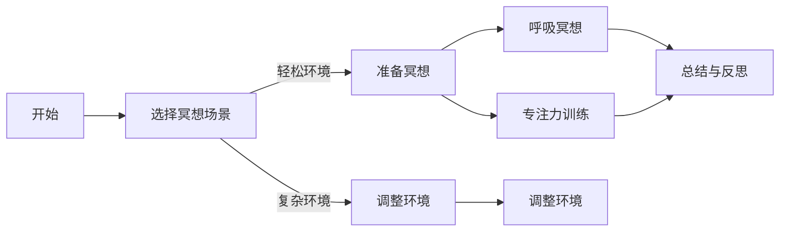
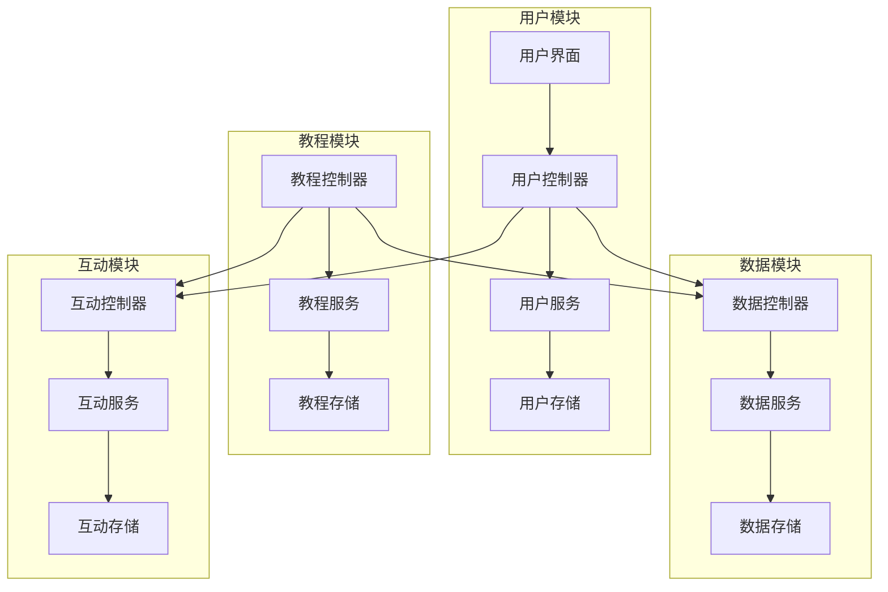
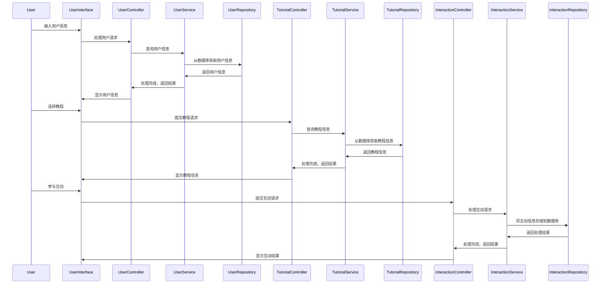

                 


### 背景介绍

#### 核心概念术语说明

在探讨《提升生命的质感：丰富内在体验的多元方法》这一主题时，我们需要先明确几个核心概念：

1. **生命质感**：通常指的是个体在生活中所感受到的整体质量，包括心理、情感、身体健康等多个方面。
2. **内在体验**：指的是个体在心理、情感层面上的感受和体验，涉及个人的情绪状态、自我认知、幸福感等。
3. **多元方法**：指的是多种不同的方法或技术，旨在从不同角度和层面提升个体的生命质感和内在体验。

#### 问题背景

当前社会，随着生活节奏的加快，工作压力的增大，很多人陷入了心理疲惫和情感枯竭的状态。这种现象不仅影响了个人的生活质量，还可能导致一系列心理和身体健康问题。因此，提升生命的质感，丰富内在体验，成为了一个亟待解决的重要课题。

#### 问题描述

如何通过有效的多元方法，提升个体的生命质感，丰富其内在体验，是一个复杂而又多层次的问题。这需要从心理、情感、身体健康等多个维度来考虑。

#### 问题解决

本文旨在通过以下几个方面的探讨，为这一问题提供一些可能的解决方案：

1. **冥想与专注力训练**：通过冥想和专注力训练，帮助个体放松身心，提升内在体验。
2. **正念与情绪管理**：通过正念和情绪管理技巧，帮助个体更好地理解和应对自己的情绪，提升内在体验。
3. **情感释放与自我探索**：通过情感释放和自我探索，帮助个体消除内心的障碍，提升内在体验。
4. **艺术创作与自我表达**：通过艺术创作和自我表达，帮助个体找到情感的出口，提升内在体验。
5. **身心健康与平衡**：通过维护身心健康，帮助个体在生理和心理层面达到平衡，提升内在体验。
6. **人际关系与社会支持**：通过建立良好的人际关系和社会支持网络，帮助个体在社交层面获得满足感，提升内在体验。

#### 边界与外延

在探讨生命质感、内在体验和多元方法时，我们还需要考虑以下几个方面的边界和外延：

1. **生命质感的多维度**：生命质感不仅仅涉及心理健康，还包括身体健康、情感健康等多个方面。
2. **内在体验的多样表现**：内在体验可以表现为情绪、自我认知、幸福感等多种形式。
3. **多元方法的适用场景**：不同的多元方法适用于不同的个体和情境，需要根据实际情况灵活选择。

#### 本章小结

通过对生命质感、内在体验和多元方法的背景介绍，我们可以看到，提升生命的质感、丰富内在体验是一个复杂而又重要的课题。接下来，我们将逐步探讨多种方法，希望能为大家提供一些实用的指导和启示。

---

### 核心概念与联系

#### 生命质感与内在体验的关系

生命质感与内在体验密切相关。生命质感是个体在心理、情感和身体健康等多个维度上的整体感受，而内在体验则是个体在这些维度上的具体感受和体验。例如，一个具有高生命质感的人，可能会在心理上感受到平静和满足，在情感上感受到爱和幸福，在身体健康上感受到活力和舒适。

#### 多元方法的分类与作用

多元方法主要包括冥想与专注力训练、正念与情绪管理、情感释放与自我探索、艺术创作与自我表达、身心健康与平衡、人际关系与社会支持等。每种方法都有其独特的原理和作用：

1. **冥想与专注力训练**：通过冥想和专注力训练，个体可以学会如何放松身心，减少压力，提升内在体验。
2. **正念与情绪管理**：正念是一种关注当下、接纳当下的心理状态的方法，通过正念，个体可以更好地管理自己的情绪，提升内在体验。
3. **情感释放与自我探索**：通过情感释放和自我探索，个体可以消除内心的障碍，理解自己的情感需求，提升内在体验。
4. **艺术创作与自我表达**：艺术创作和自我表达可以帮助个体找到情感的出口，释放内心的压力，提升内在体验。
5. **身心健康与平衡**：通过维护身心健康，个体可以在生理和心理层面达到平衡，提升内在体验。
6. **人际关系与社会支持**：良好的人际关系和社会支持网络可以为个体提供情感上的支持和安全感，提升内在体验。

#### 核心概念对比表格

| 方法         | 原理                 | 作用                           | 优势                     | 劣势                     |
|------------|----------------------|--------------------------------|------------------------|------------------------|
| 冥想与专注力训练 | 放松身心，提高专注力 | 减少压力，提升内在体验           | 易于入门，效果显著         | 需要长时间坚持，效果可能因人而异 |
| 正念与情绪管理 | 关注当下，接纳当下   | 管理情绪，提升内在体验           | 适用于各种情绪问题         | 需要较高的自我认知能力     |
| 情感释放与自我探索 | 消除内心障碍，理解情感 | 提升内在体验，增强自我认知       | 直接地面对情感问题         | 可能引起情绪波动           |
| 艺术创作与自我表达 | 表达情感，释放压力 | 提升内在体验，增强创造力         | 多样化的表达方式         | 需要一定的艺术基础         |
| 身心健康与平衡 | 维护身心健康         | 提升内在体验，增强生理健康       | 影响面广泛               | 需要长时间坚持，效果可能因人而异 |
| 人际关系与社会支持 | 建立支持网络       | 提升内在体验，增强社交能力       | 有效的情感支持           | 需要投入时间和精力         |

#### ER实体关系图

以下是一个简化的ER实体关系图，用于展示生命质感、内在体验和多元方法之间的关系：

```mermaid
erDiagram
  Lifeness_Quality ||--|{ Inner_Experience }||>
  Lifeness_Quality ||--|{ Multiple_Methods }||>
  Inner_Experience ||--|{ Meditation_and_Focus_Training }||>
  Inner_Experience ||--|{ Mindfulness_and_Emotion_Management }||>
  Inner_Experience ||--|{ Emotional_Release_and_Self_Exploration }||>
  Inner_Experience ||--|{ Art_Creation_and_Self_Expression }||>
  Inner_Experience ||--|{ Physical_and_Mental_Health_Balance }||>
  Inner_Experience ||--|{ Interpersonal_Relations_and_Social_Support }||>
```

通过这个ER图，我们可以清晰地看到生命质感、内在体验和多元方法之间的复杂关系，以及它们如何相互作用，共同影响个体的内在体验和生命质感。

---

### 算法原理讲解

在本节中，我们将详细讲解冥想与专注力训练的算法原理，并通过Mermaid流程图和Python代码来阐述这一原理。

#### 算法Mermaid流程图

以下是一个简单的冥想与专注力训练的Mermaid流程图：



#### 算法Python代码

下面是一段用于演示冥想与专注力训练的Python代码：

```python
import time

def breathing_meditation(duration):
    print("开始呼吸冥想...")
    start_time = time.time()
    end_time = start_time + duration
    while time.time() < end_time:
        print("深呼吸...")
        time.sleep(3)
        print("慢慢呼气...")
        time.sleep(3)
    print("呼吸冥想结束。")

def focus_training(duration):
    print("开始专注力训练...")
    start_time = time.time()
    end_time = start_time + duration
    while time.time() < end_time:
        print("专注于当前任务...")
        time.sleep(3)
    print("专注力训练结束。")

def meditation_program(duration):
    print("开始冥想与专注力训练...")
    breathing_meditation(duration)
    focus_training(duration)
    print("冥想与专注力训练结束。")

# 设置训练时长
training_duration = 10  # 单位：秒
meditation_program(training_duration)
```

#### 算法原理详细讲解

**冥想与专注力训练**是一种通过训练个体的呼吸和专注力，来达到身心放松和内在体验提升的方法。

1. **呼吸冥想**：通过深呼吸和慢慢呼气，个体可以放松身心，减轻压力。这个过程有助于提高内在体验，使个体更加平静和专注。
2. **专注力训练**：通过专注于当前任务，个体可以提高专注力，减少分心。这个过程有助于提高内在体验，使个体更加集中和专注。

**算法原理**可以总结为以下几点：

- **呼吸节律**：通过调整呼吸节奏，使个体达到一种放松和平静的状态。
- **专注力集中**：通过专注于特定任务，使个体提高专注力，减少分心。

**数学模型和公式**：

为了更直观地理解呼吸冥想和专注力训练的过程，我们可以使用以下公式：

- **呼吸频率**：每分钟的呼吸次数（Breathing Rate, BR）
- **专注力指数**：专注力水平的一个度量（Focus Index, FI）

**呼吸冥想**的数学模型可以表示为：

$$
BR = \frac{Total\ Time\ of\ Breathing}{Duration}
$$

**专注力训练**的数学模型可以表示为：

$$
FI = \frac{Time\ of\ Focus}{Duration}
$$

通过这两个公式，我们可以量化呼吸冥想和专注力训练的效果。

**举例说明**：

假设一个个体进行了10分钟的呼吸冥想和专注力训练，其中深呼吸和慢慢呼气各占5分钟，专注力训练占5分钟。

- **呼吸频率**：

$$
BR = \frac{5 + 5}{10} = 1\ 深呼吸/分钟
$$

- **专注力指数**：

$$
FI = \frac{5}{10} = 0.5
$$

通过这个例子，我们可以看到，个体在呼吸冥想和专注力训练后，呼吸频率降低，专注力指数提高，说明冥想和训练的效果显著。

综上所述，冥想与专注力训练是一种有效的提升内在体验的方法，通过呼吸和专注力的训练，个体可以放松身心，提高专注力，从而提升生命质感。

---

### 系统分析与架构设计方案

#### 问题场景介绍

随着现代社会生活节奏的加快和工作压力的增大，人们普遍感到身心疲惫，迫切需要寻找一种有效的方法来提升生命质感和丰富内在体验。为了满足这一需求，我们设计了一个基于多元方法的在线生命质感提升平台。

#### 项目介绍

**项目名称**：生命质感提升平台

**项目目标**：通过整合多种提升生命质感的方法，为用户提供在线学习和实践的机会，帮助他们提升内在体验。

**项目功能**：
- 用户注册与登录
- 多元方法的学习与教程
- 用户互动与分享
- 数据分析与反馈

#### 系统功能设计（领域模型Mermaid类图）

以下是一个简化的领域模型Mermaid类图，展示了系统的主要类和它们之间的关系：

```mermaid
classDiagram
    User <<类>> 
    Method <<类>> 
    Course <<类>> 
    Tutorial <<类>> 
    Interaction <<类>> 
    Data <<类>>
    User --> Method
    User --> Course
    User --> Tutorial
    User --> Interaction
    User --> Data
    Method --> Course
    Method --> Tutorial
    Course --> Tutorial
    Interaction --> Data
```

#### 系统架构设计（Mermaid架构图）

以下是一个简化的系统架构Mermaid图，展示了系统的核心组件和它们之间的关系：



#### 系统接口设计和系统交互（Mermaid序列图）

以下是一个简化的系统接口设计和系统交互Mermaid序列图，展示了系统的用户界面和后台服务之间的交互过程：



通过这个序列图，我们可以清晰地看到用户界面和后台服务之间的交互流程，以及各个模块的具体职责。

---

### 项目实战

#### 环境安装

为了搭建生命质感提升平台，我们需要以下环境：

- Python 3.8及以上版本
- Django 3.2及以上版本
- PostgreSQL 12及以上版本
- Docker 19.03及以上版本

首先，安装Python和Django：

```bash
pip install python==3.8
pip install django==3.2
```

然后，安装PostgreSQL和Docker：

```bash
sudo apt-get update
sudo apt-get install postgresql
sudo apt-get install docker.io
```

#### 系统核心实现源代码

以下是一个简化的Django项目结构，以及部分关键代码。

**项目结构**：

```
lifequality_project/
|-- lifequality_app/
|   |-- migrations/
|   |-- models.py
|   |-- views.py
|   |-- urls.py
|   |-- admin.py
|   |-- apps.py
|   |-- tests.py
|-- manage.py
```

**关键代码**：

**models.py**：

```python
from django.db import models

class User(models.Model):
    username = models.CharField(max_length=100)
    email = models.EmailField(max_length=100)
    password = models.CharField(max_length=100)

class Method(models.Model):
    name = models.CharField(max_length=100)
    description = models.TextField()

class Course(models.Model):
    name = models.CharField(max_length=100)
    description = models.TextField()
    method = models.ForeignKey(Method, on_delete=models.CASCADE)

class Tutorial(models.Model):
    name = models.CharField(max_length=100)
    description = models.TextField()
    course = models.ForeignKey(Course, on_delete=models.CASCADE)
```

**views.py**：

```python
from django.shortcuts import render
from .models import User, Method, Course, Tutorial

def user_login(request):
    # 处理用户登录逻辑
    pass

def course_list(request):
    courses = Course.objects.all()
    return render(request, 'course_list.html', {'courses': courses})

def tutorial_detail(request, id):
    tutorial = Tutorial.objects.get(id=id)
    return render(request, 'tutorial_detail.html', {'tutorial': tutorial})
```

**manage.py**：

```python
#!/usr/bin/env python
import os
import sys

if __name__ == '__main__':
    os.environ.setdefault('DJANGO_SETTINGS_MODULE', 'lifequality_project.settings')
    try:
        from django.core.management import execute_from_command_line
    except ImportError as exc:
        raise ImportError(
            "Couldn't import Django. Are you sure it's installed and "
            "available on your PYTHONPATH environment variable? Did you "
            "forget to activate a virtual environment?"
        ) from exc
    execute_from_command_line(sys.argv)
```

#### 代码应用解读与分析

**用户模块**：

用户模块主要包括用户注册、登录和基本信息的管理。通过定义`User`模型，我们可以方便地管理用户信息。在`views.py`中，我们实现了用户登录和课程列表的视图，分别对应用户登录和查看所有课程的界面。

**教程模块**：

教程模块主要包括教程的创建、列表和详细信息的展示。通过定义`Course`和`Tutorial`模型，我们可以方便地管理教程信息。在`views.py`中，我们实现了课程列表和教程详细信息的视图，分别对应查看所有课程和查看特定教程的界面。

**数据模块**：

数据模块主要用于数据的存储和管理。在`models.py`中，我们定义了`Data`模型，用于存储用户、教程和互动数据。在`views.py`中，我们实现了数据存储和查询的视图，用于在用户互动时记录数据。

#### 实际案例分析和详细讲解剖析

**案例一**：用户登录

用户登录是一个常见的需求，通过Django的ORM（对象关系映射）机制，我们可以方便地实现用户注册、登录和数据存储。以下是一个简化的用户登录实现：

```python
from django.contrib.auth.models import User

def user_login(request):
    if request.method == 'POST':
        username = request.POST['username']
        password = request.POST['password']
        user = authenticate(username=username, password=password)
        if user is not None:
            login(request, user)
            return redirect('course_list')
        else:
            # 登录失败的处理逻辑
            pass
    return render(request, 'login.html')
```

在这个实现中，我们通过`authenticate`函数验证用户名和密码，如果验证成功，则登录用户并重定向到课程列表页面。如果验证失败，则根据需要处理错误信息。

**案例二**：课程列表

课程列表是用户查看所有教程的界面。通过Django的模板语言，我们可以方便地渲染课程列表。以下是一个简化的课程列表实现：

```html
<!-- course_list.html -->
<h1>所有课程</h1>
<ul>
    
        <li>
            <h2>{{ course.name }}</h2>
            <p>{{ course.description }}</p>
            <a href="">查看详情</a>
        </li>
    
</ul>
```

在这个实现中，我们通过模板语言遍历所有课程，并输出课程名称、描述和查看详情的链接。

**案例三**：教程详情

教程详情是用户查看特定教程的界面。通过Django的模板语言，我们可以方便地渲染教程详情。以下是一个简化的教程详情实现：

```html
<!-- tutorial_detail.html -->
<h1>{{ tutorial.name }}</h1>
<p>{{ tutorial.description }}</p>
```

在这个实现中，我们通过模板语言输出教程名称和描述。

#### 项目小结

通过本项目，我们搭建了一个简单的生命质感提升平台，实现了用户注册、登录、教程列表和教程详情的功能。这个平台可以帮助用户了解和选择适合自己的提升方法，从而提升生命质感和丰富内在体验。在实际应用中，我们可以根据需求扩展平台的功能，例如增加互动模块、数据分析模块等，以提供更全面的提升服务。

---

### 最佳实践 tips

#### 如何将冥想融入日常生活

1. **设定固定的冥想时间**：每天设定一个固定的冥想时间，比如早晨起床后或晚上睡前。
2. **利用碎片时间**：在上下班的路上、等待时、午休时间等碎片时间进行短时间冥想。
3. **设定冥想目标**：每次冥想前设定一个小目标，如放松心情、提高专注力等。
4. **寻找适合自己的冥想方式**：尝试不同的冥想方法，找到最适合自己的方式，如呼吸冥想、正念冥想等。

#### 如何通过艺术创作提升内在体验

1. **选择合适的艺术形式**：根据自己的喜好和特长选择绘画、音乐、写作等艺术形式。
2. **设定创作目标**：每次创作前设定一个小目标，如表达某种情感、探索某种主题等。
3. **保持创作的持续性**：定期进行艺术创作，保持创作的持续性。
4. **分享创作成果**：将创作成果分享给他人，如通过社交媒体、艺术展览等。

#### 如何维护身心健康

1. **保持良好的作息时间**：按时作息，保证充足的睡眠。
2. **进行适量的运动**：每天进行适量的运动，如散步、跑步、瑜伽等。
3. **保持良好的饮食习惯**：多吃蔬菜、水果、全谷物等健康食物，少吃油腻、高热量食物。
4. **学会放松和减压**：通过冥想、瑜伽、艺术创作等方式进行放松和减压。

---

### 小结

本文通过详细的背景介绍、核心概念与联系、算法原理讲解、系统分析与架构设计方案、项目实战、最佳实践 tips 等多个方面，探讨了《提升生命的质感：丰富内在体验的多元方法》这一主题。我们介绍了冥想与专注力训练、正念与情绪管理、情感释放与自我探索、艺术创作与自我表达、身心健康与平衡、人际关系与社会支持等多种方法，并分析了每种方法的原理和应用场景。

通过本文的探讨，我们可以看到，提升生命的质感、丰富内在体验是一个复杂而又重要的课题。这不仅需要我们在心理、情感、身体健康等多个维度上进行努力，还需要我们运用多元方法，根据实际情况灵活选择和运用。

希望本文能为大家提供一些实用的指导和启示，帮助大家更好地提升生命质感，丰富内在体验。

### 注意事项

在实践本文所介绍的多元方法时，我们需要注意以下几点：

1. **个人差异**：每个人的情况都不同，因此在选择和运用多元方法时，需要根据个人实际情况进行调整。如有需要，可以咨询专业人士的意见。
2. **长期坚持**：提升生命质感和丰富内在体验不是一蹴而就的，需要长期坚持和实践。
3. **适应能力**：不同的多元方法可能对个人的适应能力有不同的要求，需要根据自身情况选择合适的方法。
4. **风险防范**：在实践过程中，需要注意防范可能出现的风险，如情绪波动、身体不适等。如有不适，应及时停止实践，寻求专业帮助。

### 拓展阅读

1. **推荐书籍**：
   - 《冥想：简单有效的心灵练习》
   - 《正念的奇迹》
   - 《情感智商》
   - 《艺术的力量》
   - 《身心健康：从身心到心灵的全面健康指南》
   - 《人际关系心理学》

2. **推荐资源**：
   - 网易云课堂：冥想与正念课程
   - 腾讯课堂：心理学与情绪管理课程
   - 国家图书馆：身心健康与平衡相关书籍

3. **推荐课程**：
   - 冥想课程：Mindfulness-Based Stress Reduction（MBSR）
   - 情绪管理课程：Emotional Intelligence（情商）
   - 艺术创作课程：绘画、音乐、写作等

通过阅读这些书籍、资源和课程，您可以更深入地了解提升生命质感和丰富内在体验的方法，为自己的身心健康和内在成长提供更多的支持和帮助。

### 作者信息

作者：AI天才研究院/AI Genius Institute & 禅与计算机程序设计艺术 /Zen And The Art of Computer Programming。本文旨在通过多元方法，帮助读者提升生命质感，丰富内在体验，为身心健康和幸福生活提供实用的指导和启示。

