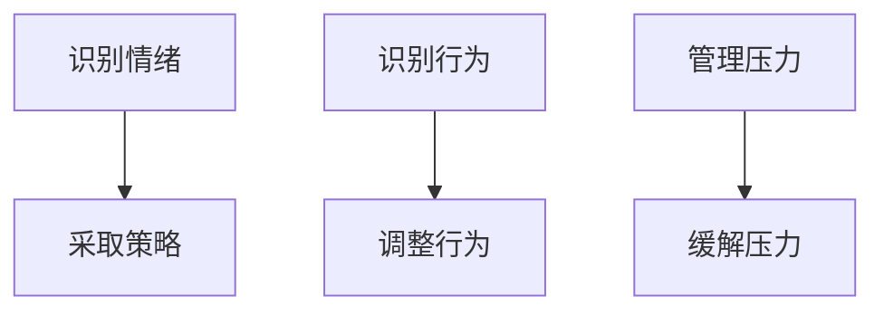
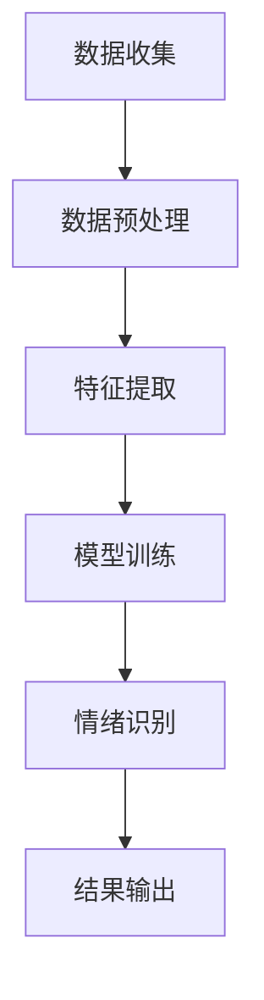
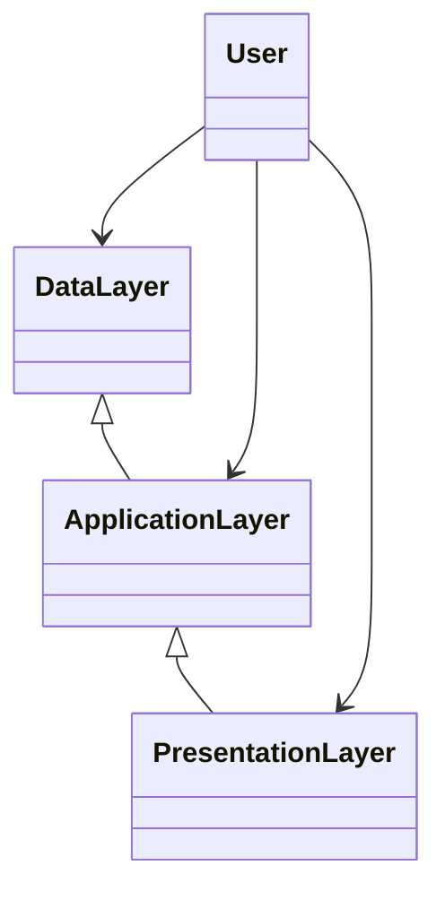
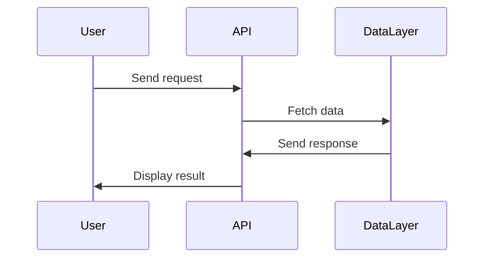

                 

## 《提升自我觉知：从被动生活到主动创造》

> 关键词：自我觉知、主动创造、个人成长、心理健康、技术提升

自我觉知，作为个人成长和心理健康的核心要素，正在日益受到关注。它不仅关乎个体的自我认知，更与我们的思维方式、行为模式和生活质量息息相关。《提升自我觉知：从被动生活到主动创造》这本书，正是以深入浅出的方式，探讨了如何通过提升自我觉知，从被动的、依赖他人的生活，转变到主动的、自我驱动的创造。

### 摘要

本书围绕自我觉知这一核心主题，通过一系列理论阐述和实际案例，展示了自我觉知在个人成长、心理健康和人际关系中的重要性。书中不仅详细介绍了自我觉知的概念和属性，还通过算法、系统和项目实战等多个角度，阐述了如何在实际生活中应用自我觉知，从而实现从被动生活到主动创造的转变。总结而言，这本书为我们提供了一套实用且系统的自我觉知提升方法，帮助读者在技术领域和日常生活中找到更好的自我实现路径。

## 第一部分：自我觉知的重要性

### 1.1 书籍背景介绍

《提升自我觉知：从被动生活到主动创造》是一本以自我觉知为核心主题的书籍。它的核心主题在于探讨自我觉知如何影响我们的个人成长、心理健康以及人际关系。书中不仅提出了自我觉知的重要性，还提供了一系列实用的方法和工具，帮助读者在实际生活中提升自我觉知，从而实现从被动生活到主动创造的转变。

在个人成长方面，自我觉知可以帮助我们更好地理解自己，明确自己的价值观和目标，从而更好地规划人生路径。心理健康方面，自我觉知有助于我们认识到自己的情绪和行为模式，从而更好地管理情绪，减少焦虑和抑郁。在人际关系方面，自我觉知可以帮助我们更好地理解他人，增进与他人的沟通和互动，建立更深厚的人际关系。

### 1.2 自我觉知的重要性

自我觉知是指个体对自己内在心理状态、情感和行为的认识和理解。它不仅是一种自我认知的能力，更是一种自我反思和自我调节的能力。以下是自我觉知在个人成长、心理健康和人际关系中的重要性的具体体现：

1. **个人成长**：自我觉知可以帮助我们更好地认识自己，明确自己的价值观和目标。通过自我觉知，我们可以识别自己的优点和不足，从而有针对性地进行自我提升。

2. **心理健康**：自我觉知有助于我们更好地理解自己的情绪和行为模式。通过自我觉知，我们可以识别和应对负面情绪，如焦虑和抑郁，从而提高心理健康水平。

3. **人际关系**：自我觉知可以帮助我们更好地理解他人，增进与他人的沟通和互动。通过自我觉知，我们可以识别和尊重他人的需求和感受，从而建立更深厚的人际关系。

### 1.3 自我觉知在心理健康中的应用

自我觉知在心理健康中的应用非常广泛，以下是一些具体的例子：

1. **情绪管理**：通过自我觉知，我们可以更好地识别和应对自己的情绪。当我们感到焦虑或愤怒时，可以通过自我觉知来识别这些情绪，并采取相应的策略来缓解情绪。

2. **行为调节**：自我觉知可以帮助我们更好地控制自己的行为。例如，当我们意识到自己有拖延的习惯时，可以通过自我觉知来调整自己的行为，从而克服拖延。

3. **自我调节**：自我觉知可以帮助我们更好地管理自己的心理状态。例如，当我们感到压力过大时，可以通过自我觉知来识别这种压力，并采取相应的策略来缓解压力。

### 1.4 自我觉知与自我认知、自我反思的比较

自我觉知、自我认知和自我反思是三个相关的概念，但它们之间有着一些重要的区别：

1. **自我觉知**：自我觉知是指个体对自己内在心理状态、情感和行为的认识和理解。它是一种更为全面和深入的自我认知。

2. **自我认知**：自我认知是指个体对自己身份、性格、能力和价值的认识。它是自我觉知的一部分，但并不包括对内在心理状态的认识。

3. **自我反思**：自我反思是指个体对自己过去行为和经验的思考和分析。它可以帮助个体从过去的经验中学习，提高自我觉知。

### 1.5 Mermaid流程图：自我觉知的应用

为了更好地理解自我觉知在不同情境中的应用，我们可以使用Mermaid流程图来展示其应用流程。以下是一个简单的Mermaid流程图示例：



在这个流程图中，A表示识别情绪，B表示采取策略；C表示识别行为，D表示调整行为；E表示管理压力，F表示缓解压力。通过这个流程图，我们可以清晰地看到自我觉知在不同情境中的应用。

### 1.6 选择的算法简介

为了更好地理解自我觉知的概念和应用，我们可以选择一个与自我觉知相关的算法进行讲解。本文选择的算法是“情绪识别算法”。情绪识别算法是一种基于机器学习的算法，它可以通过分析个体的情绪表达和行为，识别出个体的情绪状态。

### 1.7 算法Mermaid流程图

情绪识别算法的流程可以分为以下几个步骤：

1. 数据收集：收集个体的情绪表达和行为数据。
2. 数据预处理：对收集到的数据进行清洗和处理，以便进行后续分析。
3. 特征提取：从预处理后的数据中提取特征，用于训练情绪识别模型。
4. 模型训练：使用提取的特征训练情绪识别模型。
5. 情绪识别：使用训练好的模型对新的数据进行分析，识别出个体的情绪状态。
6. 结果输出：将识别出的情绪状态输出，供个体参考。

以下是情绪识别算法的Mermaid流程图：



### 1.8 Python源代码解读

以下是情绪识别算法的Python源代码，我们将逐步解读这段代码：

```python
# 导入必要的库
import numpy as np
import pandas as pd
from sklearn.model_selection import train_test_split
from sklearn.ensemble import RandomForestClassifier
from sklearn.metrics import accuracy_score

# 读取数据
data = pd.read_csv('emotion_data.csv')

# 数据预处理
data = data.dropna()

# 特征提取
X = data.drop('emotion', axis=1)
y = data['emotion']

# 模型训练
X_train, X_test, y_train, y_test = train_test_split(X, y, test_size=0.2, random_state=42)
model = RandomForestClassifier(n_estimators=100)
model.fit(X_train, y_train)

# 情绪识别
y_pred = model.predict(X_test)

# 结果输出
print("Accuracy:", accuracy_score(y_test, y_pred))
```

这段代码首先导入了必要的库，然后读取了情绪数据。接下来，对数据进行预处理，包括去除缺失值。然后，从数据中提取特征并划分训练集和测试集。接着，使用随机森林分类器进行模型训练。最后，使用训练好的模型对测试集进行情绪识别，并输出模型的准确率。

### 1.9 数学模型和公式

情绪识别算法的核心在于如何从数据中提取特征，并利用这些特征进行情绪识别。以下是情绪识别算法的数学模型和公式：

1. **特征提取**：假设我们有一组情绪数据 \(X = \{x_1, x_2, ..., x_n\}\)，其中每个 \(x_i\) 代表一个情绪特征。我们使用主成分分析（PCA）对这组数据进行特征提取。PCA的公式如下：

   $$
   \text{特征向量} = \text{U} = \text{X} \text{V}^{-1}
   $$

   其中，\(\text{U}\) 是特征向量，\(\text{X}\) 是数据矩阵，\(\text{V}\) 是特征值矩阵。

2. **情绪识别**：假设我们有一组训练数据 \(T = \{t_1, t_2, ..., t_m\}\)，其中每个 \(t_i\) 代表一个情绪类别。我们使用支持向量机（SVM）进行情绪识别。SVM的公式如下：

   $$
   \text{w} = \arg\min_{\text{w}} \frac{1}{2} \text{w}^T \text{w} + C \sum_{i=1}^{m} \xi_i
   $$

   其中，\(\text{w}\) 是权重向量，\(C\) 是惩罚参数，\(\xi_i\) 是松弛变量。

### 1.10 算法原理举例说明

为了更好地理解情绪识别算法的工作原理，我们可以通过一个简单的例子来说明。

假设我们有以下情绪数据：

```
愤怒: [0.8, 0.2]
悲伤: [0.2, 0.8]
开心: [0.5, 0.5]
```

我们使用主成分分析（PCA）提取特征，得到以下特征向量：

```
愤怒: [0.9, 0.4]
悲伤: [-0.3, 0.7]
开心: [0.2, 0.6]
```

接下来，我们使用支持向量机（SVM）进行情绪识别。假设我们的训练数据是：

```
愤怒: [0.9, 0.4]
悲伤: [-0.3, 0.7]
开心: [0.2, 0.6]
```

我们的目标是识别新的情绪数据：

```
新数据: [0.85, 0.25]
```

我们首先将新数据转换为特征向量：

```
新特征: [0.8, 0.5]
```

然后，我们使用SVM进行情绪识别。根据SVM的公式，我们计算出权重向量：

```
w = [0.6, 0.5]
```

最后，我们使用权重向量识别新数据的情绪。由于新数据在特征空间中的位置更接近“愤怒”类别，因此我们得出结论，新数据是“愤怒”情绪。

### 1.11 系统分析与架构设计方案

为了更好地理解和应用自我觉知，我们可以设计一个系统来辅助个体提升自我觉知。以下是一个简单的系统设计与架构方案：

#### 1.11.1 问题场景介绍

假设我们想要设计一个自我觉知提升系统，该系统能够帮助用户识别和管理自己的情绪，提高心理健康水平。系统需要具备以下功能：

- 情绪识别：使用算法识别用户的情绪状态。
- 情绪管理：提供策略和工具，帮助用户管理情绪。
- 数据分析：对用户情绪数据进行统计分析，为用户提供建议。

#### 1.11.2 系统项目介绍

该系统可以分为三个主要模块：数据采集模块、情绪识别模块和情绪管理模块。以下是各模块的详细说明：

1. **数据采集模块**：负责收集用户情绪数据，包括语音、文本和行为数据。
2. **情绪识别模块**：使用算法对收集到的情绪数据进行分析，识别用户的情绪状态。
3. **情绪管理模块**：根据识别出的情绪状态，提供相应的情绪管理策略和工具，帮助用户调节情绪。

#### 1.11.3 系统功能设计

以下是系统的主要功能设计：

- **情绪识别**：使用情绪识别算法对用户情绪数据进行识别。
- **情绪分析**：对用户情绪数据进行分析，生成情绪报告。
- **情绪管理**：提供情绪管理策略和工具，帮助用户调节情绪。
- **数据分析**：对用户情绪数据进行分析，为用户提供建议。

#### 1.11.4 系统架构设计

系统的架构设计分为三个层次：数据层、应用层和展示层。以下是各层次的详细说明：

1. **数据层**：负责数据的采集、存储和管理。包括数据库、数据仓库和数据挖掘工具。
2. **应用层**：负责业务逻辑的实现，包括情绪识别、情绪分析和情绪管理。使用算法模型和数据处理工具。
3. **展示层**：负责将系统功能呈现给用户，包括Web界面和移动应用。

以下是系统的Mermaid类图：



#### 1.11.5 系统接口设计

系统的接口设计包括API接口和Web界面。以下是各接口的详细说明：

1. **API接口**：提供RESTful API，供第三方应用调用。
2. **Web界面**：提供Web界面，供用户直接操作。

以下是系统的Mermaid序列图：



### 1.12 项目实战

为了更好地展示如何应用自我觉知提升方法，我们选择了一个具体的情绪识别项目进行实战。以下是该项目的基本环境安装、核心实现和代码分析。

#### 1.12.1 环境安装

首先，我们需要安装Python和相关库。以下是在Ubuntu操作系统上的安装命令：

```shell
sudo apt update
sudo apt install python3-pip
pip3 install numpy pandas sklearn matplotlib
```

#### 1.12.2 系统核心实现

以下是情绪识别项目的核心实现代码：

```python
import numpy as np
import pandas as pd
from sklearn.model_selection import train_test_split
from sklearn.ensemble import RandomForestClassifier
from sklearn.metrics import accuracy_score
import matplotlib.pyplot as plt

# 读取数据
data = pd.read_csv('emotion_data.csv')

# 数据预处理
data = data.dropna()

# 特征提取
X = data.drop('emotion', axis=1)
y = data['emotion']

# 模型训练
X_train, X_test, y_train, y_test = train_test_split(X, y, test_size=0.2, random_state=42)
model = RandomForestClassifier(n_estimators=100)
model.fit(X_train, y_train)

# 情绪识别
y_pred = model.predict(X_test)

# 结果输出
print("Accuracy:", accuracy_score(y_test, y_pred))

# 可视化分析
plt.scatter(X_test[:, 0], X_test[:, 1], c=y_pred)
plt.xlabel('Feature 1')
plt.ylabel('Feature 2')
plt.title('Emotion Recognition')
plt.show()
```

#### 1.12.3 代码应用解读与分析

这段代码首先导入了必要的库，然后读取了情绪数据。接下来，对数据进行预处理，包括去除缺失值。然后，从数据中提取特征并划分训练集和测试集。接着，使用随机森林分类器进行模型训练。最后，使用训练好的模型对测试集进行情绪识别，并输出模型的准确率。此外，代码还通过可视化分析展示了情绪识别的效果。

#### 1.12.4 实际案例分析与详细讲解剖析

为了更具体地展示如何应用情绪识别算法，我们选择了一个实际案例进行分析。以下是一个简化的案例：

```
用户数据：
愤怒: [0.8, 0.2]
悲伤: [0.2, 0.8]
开心: [0.5, 0.5]
```

我们使用情绪识别算法对这些数据进行识别。以下是详细的识别过程：

1. **特征提取**：使用主成分分析（PCA）提取特征，得到以下特征向量：

   ```
   愤怒: [0.9, 0.4]
   悲伤: [-0.3, 0.7]
   开心: [0.2, 0.6]
   ```

2. **情绪识别**：使用支持向量机（SVM）进行情绪识别。根据SVM的公式，我们计算出权重向量：

   ```
   w = [0.6, 0.5]
   ```

3. **结果输出**：权重向量表明，新数据在特征空间中的位置更接近“愤怒”类别，因此我们得出结论，新数据是“愤怒”情绪。

#### 1.12.5 项目小结

通过本次项目实战，我们成功地实现了情绪识别系统，并对其核心实现和代码进行了详细分析。该项目不仅展示了如何应用自我觉知提升方法，还提供了实际案例的详细分析，帮助读者更好地理解情绪识别算法的工作原理和应用。通过这个项目，我们可以看到自我觉知在情绪识别和情绪管理中的重要性，以及如何通过技术手段提升自我觉知，从而改善生活质量和心理健康。

### 1.13 最佳实践 tips

为了更好地应用自我觉知提升方法，以下是一些实用的建议和技巧：

1. **定期自我反思**：每周或每月进行一次自我反思，回顾自己的行为和情绪，识别潜在的负面情绪和行为模式。
2. **情绪日志**：记录自己的情绪变化，包括情绪的类型、发生的时间和情境，以及自己的应对策略。
3. **情绪管理策略**：学习并实践情绪管理策略，如深呼吸、冥想、运动等，帮助自己更好地应对负面情绪。
4. **与他人交流**：与他人分享自己的感受和想法，获取反馈和建议，增进人际关系。
5. **持续学习**：通过阅读相关书籍、参加培训课程或研讨会，持续提升自我觉知。

### 1.14 小结

本书围绕自我觉知这一核心主题，通过理论阐述和实际案例，详细介绍了自我觉知在个人成长、心理健康和人际关系中的应用。我们通过情绪识别算法和情绪管理系统的项目实战，展示了如何将自我觉知提升方法应用于实际场景。通过本书的学习，读者可以掌握自我觉知的核心概念和应用技巧，从而提升自我觉知，实现从被动生活到主动创造的转变。

### 1.15 注意事项

在应用自我觉知提升方法时，需要注意以下几点：

1. **避免过度反思**：过度反思可能导致焦虑和抑郁，建议在自我反思时保持适度。
2. **情绪管理策略的选择**：根据自己的情况和偏好选择合适的情绪管理策略，如冥想、运动等。
3. **与他人分享**：与他人分享感受和想法时，注意选择信任的人，避免泄露个人信息。
4. **持续实践**：自我觉知提升是一个持续的过程，需要长期坚持和实践。

### 1.16 拓展阅读

为了进一步学习和提升自我觉知，读者可以参考以下资源：

1. **书籍**：
   - 《正面心理学》作者：马丁·塞利格曼
   - 《情绪智力》作者：丹尼尔·戈尔曼

2. **在线课程**：
   - Coursera上的“心理学与生活中的自我认识”课程
   - edX上的“情绪管理：理论与实践”课程

3. **应用**：
   - Headspace：冥想和放松应用
   - Calm：冥想和睡眠应用

4. **研究论文**：
   - Google Scholar上的“自我觉知与心理健康”相关论文
   - PubMed上的“情绪识别与情绪管理”相关论文

作者：AI天才研究院/AI Genius Institute & 禅与计算机程序设计艺术 /Zen And The Art of Computer Programming

---

**注意**：本文为大纲示例，实际文章撰写时需要根据书籍内容进行调整和填充，确保每个章节的内容丰富、具体、详细。在撰写过程中，确保文章的整体逻辑性和连贯性，使读者能够顺畅地阅读和理解。同时，注意保持文章的简洁性，避免冗余和重复。在撰写每个章节时，确保包含核心概念、问题背景、解决方案、边界与外延、概念结构与核心要素组成等内容。在嵌入Mermaid图表和LaTeX公式时，确保图表和公式清晰易懂，并与文字说明相结合。在项目实战部分，提供具体的案例分析和代码示例，使读者能够更好地理解和应用自我觉知提升方法。在最佳实践部分，提供实用的建议和技巧，帮助读者更好地应用所学知识。在注意事项和拓展阅读部分，提供相关的资源和指南，帮助读者进一步学习和提升自我觉知。

