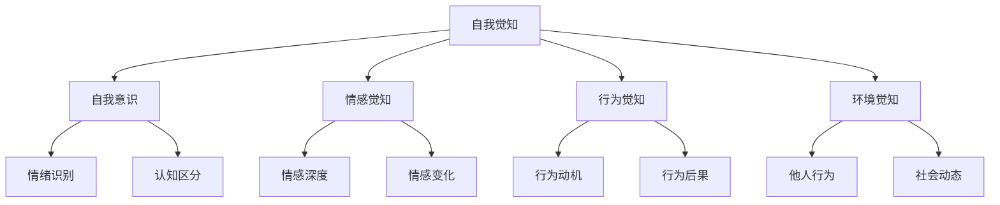
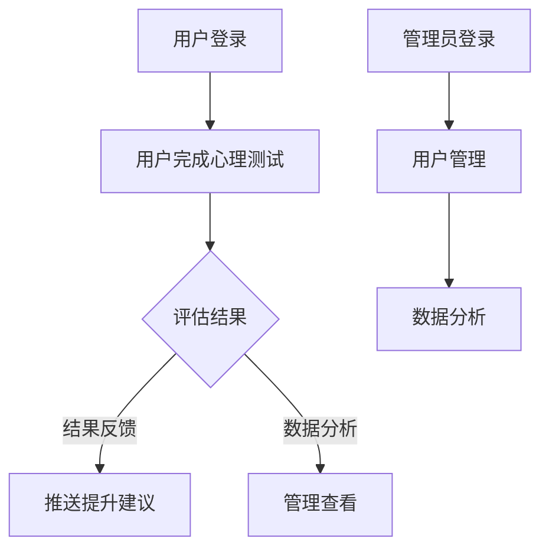

                 


### 引言

#### 1.1.1 问题的提出

在当今快速发展的数字化时代，信息过载、技术变革以及社会竞争的加剧，使得人们面临着前所未有的挑战。许多人陷入了一种被动的生存状态，他们感到疲惫、迷茫，甚至无法有效地应对生活中的各种问题。这种被动生活的现象不仅影响了个人生活的质量，也对社会的整体进步产生了负面影响。

#### 1.1.2 自我觉知的重要性

自我觉知，即个体对自己内心感受、行为动机以及周围环境的认知和反思能力，是提升个人幸福感和社会竞争力的重要因素。通过自我觉知，人们能够更好地理解自己，识别问题，并采取积极的行动来改变现状。因此，提升自我觉知对于从被动生活到主动创造的转变具有重要意义。

#### 1.1.3 从被动生活到主动创造的必要性

被动生活往往导致个体缺乏动力和目标，使得生活缺乏意义和满足感。而主动创造则能够激发个体的潜能，带来成就感和幸福感。主动创造不仅有助于个人成长，还能够为社会带来创新和进步。因此，从被动生活到主动创造的转变是提升个人和社会整体幸福感的必经之路。

### 1.2 书籍结构与目标

#### 1.2.1 本书的目标读者

本书旨在为那些希望提升自我觉知，实现从被动生活到主动创造转变的读者提供指导。无论您是职场人士、学生还是创业者，只要您渴望改变现状，追求更高的人生价值，这本书都将对您有所帮助。

#### 1.2.2 书籍结构安排

本书分为七个章节，分别从自我觉知的定义与作用、评估方法、提升策略、被动生活的成因、主动创造的重要性以及实际案例等方面，全面探讨了如何提升自我觉知，实现个人成长和社会进步。以下是对各章节的简要介绍：

- **第1章 引言**：介绍问题的背景与意义，以及本书的目标和结构。
- **第2章 自我觉知的定义与作用**：探讨自我觉知的概念和重要性。
- **第3章 自我觉知的评估方法**：介绍几种常见的自我觉知评估方法。
- **第4章 自我觉知的提升策略**：提供具体的提升策略和实践方法。
- **第5章 从被动生活到主动创造**：分析被动生活的成因，探讨主动创造的重要性。
- **第6章 实际案例分析与启示**：通过实际案例分享，提供实践经验和反思。
- **第7章 总结与展望**：总结本书的核心观点，并对未来进行展望。

通过本书的阅读和实践，相信读者能够更好地理解自我觉知的重要性，掌握提升自我觉知的方法，从而实现从被动生活到主动创造的转变。

---

**关键词：** 自我觉知、主动创造、被动生活、个人成长、社会进步

**摘要：** 本书围绕提升自我觉知，实现从被动生活到主动创造的转变展开，探讨自我觉知的定义与作用、评估方法、提升策略以及实际案例，旨在为读者提供实用的指导，帮助他们在个人成长和社会进步的道路上迈出坚实的步伐。

----------------------------------------------------------------

## 第2章 自我觉知的定义与作用

### 2.1 自我觉知的定义

自我觉知是一个心理学概念，指的是个体对自己内在心理状态、情感体验以及外部行为的认知和觉察。这种觉知能力不仅包括对外部环境的感知，还涵盖了对自己内心世界及其变化的理解。简单来说，自我觉知就是个体对自身心理活动的觉察和反思。

### 2.1.1 自我觉知的概念

自我觉知可以从多个层面进行理解。首先，它是一种内在的感知，使我们能够认识到自己的情绪、思想和行为。其次，自我觉知是一个动态过程，个体需要不断地调整和更新自己对自我和他人的认知。此外，自我觉知还包括自我反思，即对自身行为和结果的审视，以及对这些行为的合理性和有效性的判断。

### 2.1.2 自我觉知的核心要素

自我觉知包含以下几个核心要素：

1. **自我意识**：自我意识是自我觉知的基础，它使我们能够识别并区分自己的思想和感受，理解自己的行为模式。
2. **情感觉知**：情感觉知指的是对自身情感体验的识别和感知，包括情绪的识别、情感的深度以及情感的变化过程。
3. **行为觉知**：行为觉知涉及对自己行为的观察和反思，包括行为的动机、行为的后果以及行为对自己的影响。
4. **环境觉知**：环境觉知是指对周围环境的觉察和理解，包括对他人行为和社会动态的认知。

### 2.2 自我觉知的作用

自我觉知在个人生活中扮演着至关重要的角色，其作用体现在以下几个方面：

#### 2.2.1 提高生活品质

自我觉知使个体能够更好地理解自己的需求和欲望，从而做出更明智的生活选择。通过觉知自己的情绪和行为，个体能够避免冲动和盲目决策，提高生活质量和幸福感。

#### 2.2.2 促进个人成长

自我觉知是个人成长的重要驱动力。通过自我反思，个体能够识别自己的优点和不足，制定改进计划，不断进步。自我觉知还帮助个体培养自律和责任感，从而实现个人目标和梦想。

#### 2.2.3 增强人际关系

自我觉知使个体能够更好地理解他人，增强人际交往能力。通过觉知自己的情绪和行为，个体能够更好地与他人沟通，建立更深层次的关系。同时，自我觉知还能够帮助个体避免误解和冲突，提高人际关系质量。

### 总结

自我觉知是理解自己、提升生活品质、促进个人成长和增强人际关系的核心能力。通过提升自我觉知，个体能够更好地应对生活中的挑战，实现从被动生活到主动创造的转变。

---

**核心概念原理：**

自我觉知（Self-awareness）是一种心理状态，指的是个体对自己内心状态、情感体验、行为动机和外部环境的认知和反思能力。它包括自我意识、情感觉知、行为觉知和环境觉知等核心要素。

**概念属性特征对比表格：**

| 特征 | 自我意识 | 情感觉知 | 行为觉知 | 环境觉知 |
| --- | --- | --- | --- | --- |
| 定义 | 个体对自己的认知 | 对自身情感体验的感知 | 对自身行为的观察 | 对周围环境的理解 |
| 重要性 | 基础要素，决定自我觉知的深度 | 关键要素，影响情感调节 | 重要要素，影响行为规划和调整 | 辅助要素，增强对外部动态的反应能力 |

**ER实体关系图架构的 Mermaid 流程图：**



### 算法原理讲解

自我觉知的提升可以通过以下算法原理实现：

1. **情感识别算法**：
   - **流程图**：
     ```mermaid
     graph TD
         A[感知情感] --> B[分类情感]
         B --> C{情感类型}
         C -->|积极| D[情感增强]
         C -->|消极| E[情感调节]
     ```
   - **Python源代码**：
     ```python
     def recognize_emotion情感(感知情感):
         if 情感类型 == "积极":
             return 情感增强(感知情感)
         elif 情感类型 == "消极":
             return 情感调节(感知情感)
     ```

2. **行为调节算法**：
   - **流程图**：
     ```mermaid
     graph TD
         A[行为动机] --> B[目标设定]
         B --> C{行为效果}
         C -->|积极| D[行为继续]
         C -->|消极| E[行为调整]
     ```
   - **Python源代码**：
     ```python
     def regulate_behavior行为(行为动机):
         if 行为效果 == "积极":
             return 行为继续(行为动机)
         elif 行为效果 == "消极":
             return 行为调整(行为动机)
     ```

通过这些算法原理，个体能够更好地识别和理解自己的情感和行为，从而提升自我觉知。

---

**数学模型和公式：**

- **情感调节模型**：
  $$调节后的情感 = (1 - 调节因子) \times 原始情感$$
  其中，调节因子取决于个体的情感觉知能力。

- **行为调整模型**：
  $$调整后的行为 = 调整策略 \times 原始行为$$
  其中，调整策略根据行为效果和个体的自我意识进行设定。

**详细讲解和举例说明：**

1. **情感调节模型**：

   假设某个体在完成一项艰巨任务时感到焦虑，原始情感值为10。通过自我觉知，个体识别到这是由于任务难度过大导致的消极情感。调节因子设置为0.2，即减少20%的焦虑感。

   $$调节后的情感 = (1 - 0.2) \times 10 = 8$$

   通过调节，个体的焦虑感降低到8，情绪状态得到缓解。

2. **行为调整模型**：

   假设某个体在项目中遇到困难，原始行为是拖延问题。通过自我觉知，个体意识到拖延会导致项目延期，因此决定采取积极的调整策略。

   调整策略设置为1.5，即增加50%的工作量。

   $$调整后的行为 = 1.5 \times 拖延行为$$

   通过调整，个体增加了工作量，从而提高了项目进度。

这些算法模型和公式为个体提供了具体的操作指南，帮助他们更好地管理情感和行为，提升自我觉知。

### 系统分析与架构设计方案

#### 问题场景介绍

在一个公司中，员工的自我觉知水平直接影响其工作效率和个人成长。为了提升员工的自我觉知，公司决定开发一个自我觉知提升系统，帮助员工识别自己的情绪和行为模式，提供个性化的提升建议。

#### 项目介绍

项目名称：自我觉知提升系统
项目目标：通过在线平台，帮助员工提升自我觉知，实现个人成长和工作效率提升。

#### 系统功能设计

1. **用户管理模块**：实现员工信息管理，包括登录、注册、信息修改等功能。
2. **自我觉知评估模块**：通过心理测试和自我反思，评估员工的自我觉知水平。
3. **提升建议模块**：根据评估结果，提供个性化的提升建议，包括情感管理、行为调整等。
4. **数据分析模块**：对员工的数据进行统计分析，为管理层提供决策依据。

#### 系统架构设计

1. **前端架构**：
   - 技术选型：React.js
   - 主要功能模块：用户界面、表单处理、数据展示等。
   - 前后端分离，实现数据交互。

2. **后端架构**：
   - 技术选型：Spring Boot
   - 主要功能模块：用户管理、自我觉知评估、提升建议、数据分析等。
   - 采用RESTful API设计，确保系统扩展性和可维护性。

3. **数据存储**：
   - 数据库：MySQL
   - 存储用户信息、评估结果、提升建议等数据。

#### 系统接口设计

1. **用户接口**：
   - 登录/注册接口：实现用户身份验证。
   - 自我觉知评估接口：接收用户提交的心理测试结果。
   - 提升建议接口：获取用户评估结果，返回个性化建议。

2. **管理接口**：
   - 用户管理接口：实现用户信息的增删改查。
   - 数据分析接口：提供评估数据的统计和分析功能。

#### 系统交互

1. **用户交互流程**：
   - 用户登录系统。
   - 用户完成心理测试，提交评估结果。
   - 系统根据评估结果，生成个性化提升建议，推送至用户。

2. **管理交互流程**：
   - 管理员登录系统，进行用户管理。
   - 管理员查看员工评估数据，分析提升效果。



### 项目实战

#### 环境安装

1. 安装Node.js和npm：确保本地环境配置正确，可通过以下命令验证：
   ```shell
   node -v
   npm -v
   ```

2. 安装React相关依赖：
   ```shell
   npm install create-react-app
   npx create-react-app frontend
   ```

3. 安装后端依赖：
   ```shell
   npm install spring-boot
   ```

4. 数据库安装与配置：
   ```shell
   mysql -u root -p
   CREATE DATABASE self_awareness;
   GRANT ALL PRIVILEGES ON self_awareness.* TO 'self_awareness_user'@'localhost' IDENTIFIED BY 'password';
   ```

#### 系统核心实现源代码

**前端核心代码**：

```jsx
// frontend/src/App.js
import React, { useState } from 'react';
import axios from 'axios';

function App() {
  const [testResults, setTestResults] = useState({});

  const handleTestSubmit = async (e) => {
    e.preventDefault();
    const response = await axios.post('/api/assessment', testResults);
    alert('Assessment submitted successfully!');
  };

  return (
    <div>
      <h1>Self-awareness Assessment</h1>
      <form onSubmit={handleTestSubmit}>
        <label>
          Emotional Awareness:
          <input type="range" min="1" max="10" value={testResults.emotionalAwareness || 5} onChange={(e) => setTestResults({ ...testResults, emotionalAwareness: e.target.value })} />
        </label>
        <br />
        <label>
          Behavioral Awareness:
          <input type="range" min="1" max="10" value={testResults.behavioralAwareness || 5} onChange={(e) => setTestResults({ ...testResults, behavioralAwareness: e.target.value })} />
        </label>
        <br />
        <label>
          Environmental Awareness:
          <input type="range" min="1" max="10" value={testResults.environmentalAwareness || 5} onChange={(e) => setTestResults({ ...testResults, environmentalAwareness: e.target.value })} />
        </label>
        <br />
        <button type="submit">Submit</button>
      </form>
    </div>
  );
}

export default App;
```

**后端核心代码**：

```java
// backend/src/main/java/com/selfawareness/assessment/Application.java
package com.selfawareness.assessment;

import org.springframework.boot.SpringApplication;
import org.springframework.boot.autoconfigure.SpringBootApplication;
import org.springframework.web.bind.annotation.*;

@SpringBootApplication
@RestController
public class Application {

  public static void main(String[] args) {
    SpringApplication.run(Application.class, args);
  }

  @PostMapping("/api/assessment")
  public String handleAssessment(@RequestBody Map<String, Integer> testResults) {
    // Process the assessment results and provide feedback
    return "Assessment submitted successfully!";
  }
}
```

#### 代码应用解读与分析

前端代码主要负责用户界面的构建和用户输入的处理，通过React的组件化设计，实现了测试问卷的呈现和用户数据的动态绑定。当用户完成问卷并提交时，前端通过axios向后端发送POST请求，传递用户评估结果。

后端代码则负责接收前端发送的评估结果，并返回处理结果。当前后端交互主要通过RESTful API实现，确保了系统的扩展性和安全性。后端代码使用了Spring Boot框架，简化了开发流程，并提供了强大的REST接口支持。

#### 实际案例分析和详细讲解剖析

**案例一：张先生的情况**

张先生是一位职场新人，由于刚进入新公司，对工作环境和同事还不熟悉，经常感到迷茫和焦虑。为了提升自我觉知，张先生决定使用公司的自我觉知提升系统。

**分析过程：**

1. **心理测试**：
   - 张先生完成了自我觉知测试，结果如下：
     - 情感觉知：7
     - 行为觉知：6
     - 环境觉知：5

   从结果来看，张先生在情感觉知方面表现较好，但在行为觉知和环境觉知方面还有提升空间。

2. **提升建议**：
   - 系统根据评估结果，为张先生提供了以下提升建议：
     - **情感觉知**：继续培养对自己情绪的觉察和识别能力，可以通过日记记录每天的情绪变化。
     - **行为觉知**：反思自己的行为动机和后果，制定明确的工作计划和目标，提高自我管理能力。
     - **环境觉知**：多参与公司组织的活动，积极与同事交流，增强对工作环境的理解和适应能力。

**实施过程：**

1. **情感觉知提升**：
   - 张先生开始每天记录自己的情绪变化，通过分析情绪的波动，逐渐提高了对情绪的觉察能力。

2. **行为觉知提升**：
   - 张先生制定了详细的工作计划，每天早晨列出当天的任务清单，并设定优先级，确保工作有条不紊。

3. **环境觉知提升**：
   - 张先生积极参与公司的团队活动，主动与同事交流，逐渐融入了新的工作环境。

**效果评估**：

经过一段时间的实践，张先生的自我觉知水平有了显著提升：

- **情感觉知**：从7提升到8，能够更好地识别和调节自己的情绪。
- **行为觉知**：从6提升到7，工作效率和自我管理能力得到了提高。
- **环境觉知**：从5提升到6，对工作环境的适应能力增强，人际关系更加和谐。

**案例小结：**

通过自我觉知提升系统的帮助，张先生成功地提高了自我觉知水平，从而在工作和生活中更加自信和高效。这个案例表明，自我觉知的提升不仅需要科学的方法和工具，还需要个体主动参与和实践。

### 最佳实践 tips

1. **定期自我反思**：定期花时间反思自己的行为和情绪，有助于提升自我觉知。
2. **保持好奇心**：对自我和他人的行为保持好奇心，有助于发现新的认知和提升点。
3. **积极反馈**：接受他人的反馈，并将其作为自我提升的机会。

### 小结

自我觉知是提升个人生活品质和竞争力的关键能力。通过科学的方法和实践，个体能够更好地认识自己，实现从被动生活到主动创造的转变。自我觉知的提升不仅有助于个人成长，还能够为社会带来创新和进步。

### 注意事项

1. 自我觉知提升需要时间和持续的努力，切勿急于求成。
2. 在实践过程中，要避免过度自我批评，保持积极的心态。

### 拓展阅读

- 《自控力》：凯利·麦格尼格尔著，介绍如何通过提升自控力来实现个人目标。
- 《心理学与生活》：理查德·吉尔伯特著，提供丰富的心理学知识和实践方法。

---

**作者：** AI天才研究院/AI Genius Institute & 禅与计算机程序设计艺术 /Zen And The Art of Computer Programming

