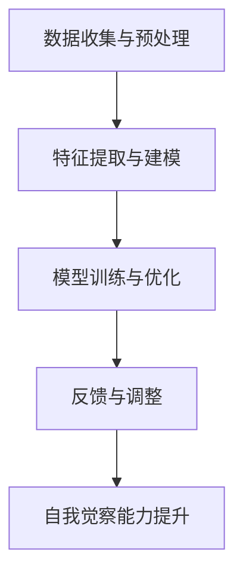
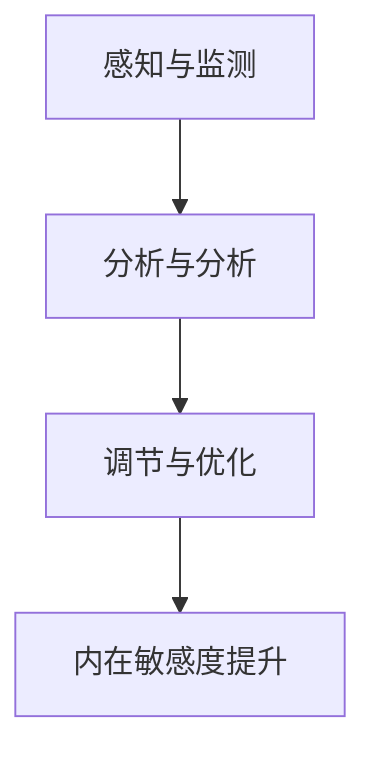
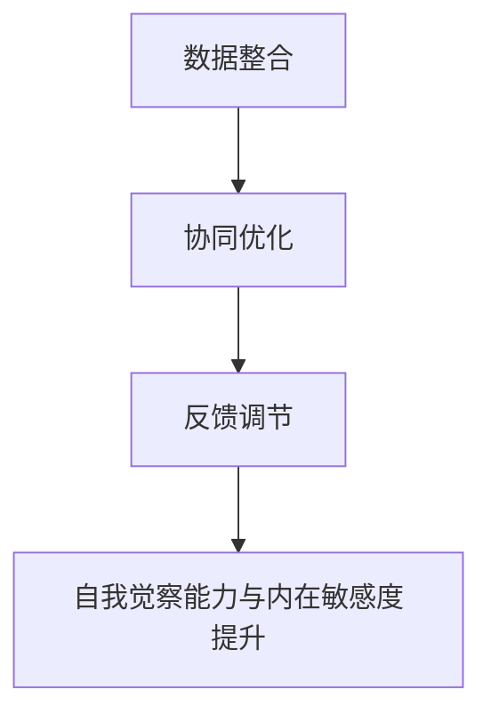
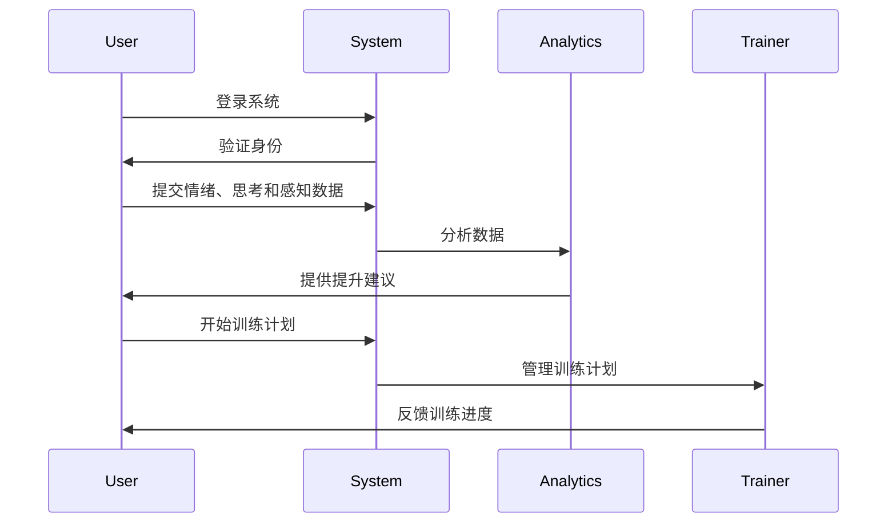
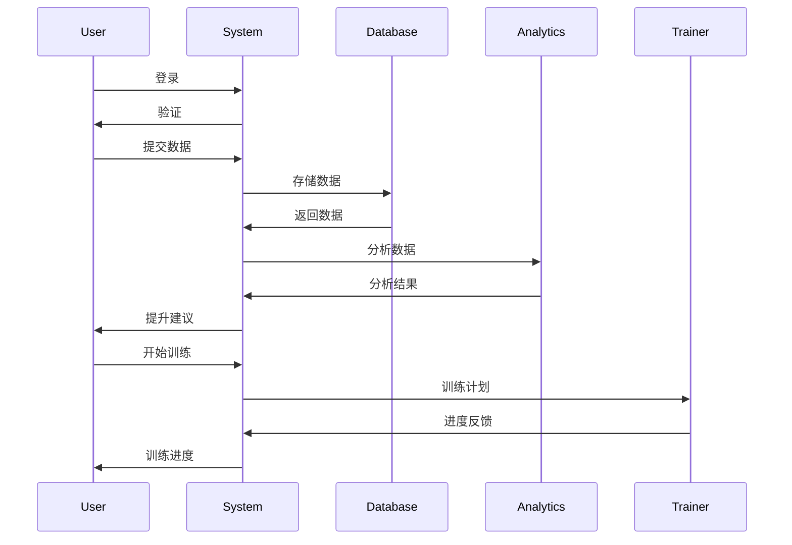

                 

# 提高自我觉察能力：培养内在敏感度

## 关键词

- 自我觉察能力
- 内在敏感度
- 情绪管理
- 自我认知
- 心理健康

## 摘要

本文旨在探讨提高自我觉察能力的重要性，以及如何通过培养内在敏感度来实现这一目标。我们将从问题背景、核心概念与联系、算法原理讲解、系统分析与架构设计、项目实战以及最佳实践等多个方面展开论述。希望通过本文的详细解析，帮助读者更好地理解自我觉察能力和内在敏感度的关系，并学会如何在日常生活中有效培养内在敏感度，从而提升自我觉察能力。

## 第一部分：问题背景

### 1.1 问题描述

自我觉察能力，简而言之，就是个体对自己内心体验的感知、理解和调节能力。这种能力不仅在心理学领域备受关注，也在日常生活中扮演着重要角色。提高自我觉察能力对于个人的成长、心理健康和人际关系都有着深远的影响。然而，在当前快节奏、高压力的生活环境中，许多人面临着自我觉察能力不足的问题。

自我觉察能力不足可能会导致以下问题：

- **情绪困扰**：无法准确感知和理解自己的情绪，容易陷入情绪波动中，影响心理状态。
- **行为失调**：无法认识到自己的行为模式，难以纠正不良行为，影响生活质量和人际关系。
- **心理压力**：无法有效地调节自己的心理状态，容易感到压力和焦虑。
- **人际关系**：难以理解他人的情绪和需求，导致沟通不畅，影响人际关系。

### 1.2 问题解决

为了解决自我觉察能力不足的问题，我们需要寻找有效的途径来提高这种能力。本文提出通过培养内在敏感度来提高自我觉察能力。内在敏感度是指个体对自身内心体验的敏锐感知能力，它有助于我们更好地理解和调节自己的情绪、思维和行为。通过培养内在敏感度，我们可以增强自我觉察能力，从而更好地应对生活中的各种挑战。

### 1.3 边界与外延

自我觉察能力和内在敏感度虽然紧密相关，但它们有着不同的边界与外延。自我觉察能力更侧重于个体对自己心理和行为的整体感知和理解，而内在敏感度则强调对内心体验的敏锐感知。提高自我觉察能力不仅需要培养内在敏感度，还需要进行自我反思、情绪管理和行为调整。内在敏感度是提高自我觉察能力的关键，但不是唯一途径。

### 1.4 概念结构与核心要素组成

在本部分，我们将详细探讨自我觉察能力和内在敏感度的核心概念、属性特征及其相互关系。

### 1.4.1 自我觉察能力的核心概念与特征

自我觉察能力主要包括以下几个方面的特征：

1. **自我认知**：个体对自己的认知，包括性格、价值观、优点和缺点等。
2. **情感认知**：对自身情绪的感知和理解，包括情绪的类型、强度和持续时间等。
3. **行为认知**：对自身行为模式的认知，包括行为的目的、动机和后果等。

### 1.4.2 内在敏感度的核心概念与特征

内在敏感度主要表现在以下几个方面：

1. **情绪敏感**：对自身情绪的敏锐感知，包括情绪的来临、发展和消退。
2. **思维敏感**：对内心思想和感受的敏锐觉察，包括思维的内容、形式和变化。
3. **感官敏感**：对自身身体感受和内外部刺激的敏锐感知，包括身体的感觉、触觉和视觉等。

### 1.4.3 自我觉察能力与内在敏感度的关系

自我觉察能力和内在敏感度是相互关联的。内在敏感度是自我觉察能力的基础，只有通过培养内在敏感度，个体才能更好地感知和理解自己的内心体验，从而提高自我觉察能力。同时，自我觉察能力的提升也会促进个体对自身内在体验的更深入理解，进一步培养内在敏感度。

## 第二部分：核心概念与联系

### 2.1 自我觉察能力的概念与特征

#### 2.1.1 自我觉察能力的定义

自我觉察能力是指个体对自己心理和行为的感知、理解和调节能力。它包括以下几个方面：

1. **自我认知**：了解自己的性格、价值观、优点和缺点等。
2. **情感认知**：感知和理解自己的情绪状态，包括情绪的类型、强度和持续时间等。
3. **行为认知**：了解自己的行为模式，包括行为的目的、动机和后果等。

#### 2.1.2 自我觉察能力的比较

自我觉察能力与自我意识有所不同。自我意识是指个体对自身存在的认知，包括自己的外貌、身份和角色等。而自我觉察能力则侧重于对内心体验的感知和理解，是自我意识的一个方面。

#### 2.1.3 自我觉察能力的重要性

自我觉察能力对个人的成长和发展具有重要意义。它有助于：

1. **自我提升**：通过认识自己的优点和不足，不断改进和完善自己。
2. **人际关系**：提高自我觉察能力有助于更好地理解他人，建立良好的人际关系。
3. **心理调节**：有助于应对生活中的压力和挑战，保持心理健康。

### 2.2 内在敏感度的概念与特征

#### 2.2.1 内在敏感度的定义

内在敏感度是指个体对自身内心体验的敏感程度，包括情绪、思维和感官等方面。它表现为：

1. **情绪敏感**：能够迅速感知和理解自己的情绪状态。
2. **思维敏感**：对内心思想和感受的敏锐觉察。
3. **感官敏感**：对自身的身体感受和内外部刺激的敏感度。

#### 2.2.2 内在敏感度的比较

内在敏感度与一般意义上的敏感度有所不同。一般敏感度是指对外界刺激的敏感程度，而内在敏感度则是指对内心体验的敏感。内在敏感度是自我觉察能力的基础，有助于个体更好地认识和理解自己。

#### 2.2.3 内在敏感度的重要性

内在敏感度对提高自我觉察能力具有重要意义。它有助于：

1. **自我探索**：通过深入感受自身内心，促进自我成长。
2. **情感管理**：更好地理解和调节自己的情绪，减少负面情绪的影响。
3. **心理健康**：有助于培养积极的情绪体验，提高心理健康水平。

### 2.3 自我觉察能力与内在敏感度的联系

#### 2.3.1 内在敏感度与自我觉察能力的关系

内在敏感度是自我觉察能力的基础。只有对自身内心体验有较高的敏感度，个体才能更好地觉察和理解自己的内心活动，从而提高自我觉察能力。

#### 2.3.2 内在敏感度的培养与自我觉察能力的提升

通过培养内在敏感度，个体可以提升自我觉察能力。具体方法包括：

1. **情绪觉察**：学会观察自己的情绪变化，了解情绪的来源和影响。
2. **思维反思**：对自己的思想和行为进行深入反思，分析其背后的原因和动机。
3. **身体感受**：注意自身的身体感受，了解身体反应与情绪之间的关系。

## 2.4 自我觉察能力与内在敏感度的 ER 实体关系图

以下是自我觉察能力与内在敏感度的 ER 实体关系图：

```mermaid
erDiagram
  A[自我觉察能力] ||--|{ B[内在敏感度] } : 提高基础
  A ||--|{ C[自我认知] } : 包括
  A ||--|{ D[情感认知] } : 包括
  A ||--|{ E[行为认知] } : 包括
  B ||--|{ F[情绪敏感] } : 包括
  B ||--|{ G[思维敏感] } : 包括
  B ||--|{ H[感官敏感] } : 包括
```

## 第三部分：算法原理讲解

### 3.1 提高自我觉察能力的算法原理

#### 3.1.1 算法概述

提高自我觉察能力的算法主要基于以下几个核心思想：

1. **自我认知**：通过自我反思和外部反馈，了解自己的性格、价值观和需求。
2. **情感认知**：通过情绪觉察和情感分析，理解自己的情绪状态和情绪变化。
3. **行为认知**：通过行为分析和行为调节，认识自己的行为模式，并调整不良行为。

#### 3.1.2 算法步骤

1. **自我认知**：通过自我反思和外部反馈，建立自我认知模型。具体步骤如下：

   - 收集自我反思记录：记录自己的日常思考、感受和行为。
   - 进行外部反馈：收集他人对自己的看法和建议，如同事、朋友或家人。
   - 分析自我认知数据：对收集到的数据进行分析，了解自己的性格、价值观和需求。

2. **情感认知**：通过情绪觉察和情感分析，建立情感认知模型。具体步骤如下：

   - 情绪觉察：学会观察自己的情绪变化，了解情绪的来源和影响。
   - 情感分析：使用情感分析算法，对情绪数据进行分类和识别。
   - 情感调节：根据情感分析结果，调整自己的情绪状态，减少负面情绪的影响。

3. **行为认知**：通过行为分析和行为调节，建立行为认知模型。具体步骤如下：

   - 行为分析：记录和分析自己的行为模式，了解行为的目的、动机和后果。
   - 行为调节：根据行为分析结果，调整自己的行为模式，纠正不良行为。

#### 3.1.3 算法原理讲解

提高自我觉察能力的算法原理可以概括为以下几点：

1. **数据收集与预处理**：通过自我反思记录、外部反馈和行为数据分析，收集与个体自我觉察能力相关的数据。
2. **特征提取与建模**：对收集到的数据进行分析，提取与自我觉察能力相关的特征，并建立相应的模型。
3. **模型训练与优化**：使用机器学习算法，对特征模型进行训练和优化，以提高自我觉察能力的预测准确性和调节效果。
4. **反馈与调整**：根据模型预测结果和个体实际反馈，对模型进行调整和优化，以提高自我觉察能力。

以下是一个简单的自我觉察能力算法流程图：



### 3.2 内在敏感度提升算法原理

#### 3.2.1 算法概述

内在敏感度提升算法主要基于以下几个核心思想：

1. **情绪感知**：通过情绪监测和感知，了解自身的情绪状态。
2. **思维分析**：通过思维分析和反思，理解内心的思想和感受。
3. **感官调节**：通过感官刺激和调节，提高对自身身体感受和内外部刺激的敏感度。

#### 3.2.2 算法步骤

1. **情绪感知**：通过情绪监测和感知，建立情绪感知模型。具体步骤如下：

   - 情绪监测：使用生理传感器和情绪分析算法，实时监测个体的情绪状态。
   - 情绪感知：对情绪监测结果进行分析和感知，了解情绪的来源和影响。

2. **思维分析**：通过思维分析和反思，建立思维分析模型。具体步骤如下：

   - 思维记录：记录自己的日常思考和感受。
   - 思维分析：对思维记录进行分析，了解思维的模式和变化。
   - 思维反思：对思维进行分析后，进行反思和总结，以提升思维质量。

3. **感官调节**：通过感官刺激和调节，建立感官调节模型。具体步骤如下：

   - 感官刺激：使用各种感官刺激方法，如音乐、绘画、瑜伽等，提高感官的敏感度。
   - 感官调节：根据感官刺激的结果，调节自身的感官体验，以达到更好的内在敏感度。

#### 3.2.3 算法原理讲解

内在敏感度提升算法原理可以概括为以下几点：

1. **感知与监测**：通过生理传感器和情绪分析算法，实时监测个体的情绪状态和身体感受。
2. **分析与分析**：对情绪状态和思维模式进行分析，了解情绪和思维的变化规律。
3. **调节与优化**：根据分析结果，调节个体的情绪和思维状态，优化内在敏感度。

以下是一个简单的内在敏感度提升算法流程图：



### 3.3 自我觉察能力与内在敏感度的融合算法

#### 3.3.1 算法概述

自我觉察能力与内在敏感度的融合算法旨在将自我觉察能力和内在敏感度结合起来，以提高个体的整体觉察能力。该算法基于以下几个核心思想：

1. **整合数据**：整合自我觉察能力和内在敏感度的数据，形成统一的感知模型。
2. **协同优化**：通过协同优化，提升自我觉察能力和内在敏感度的整体效果。
3. **反馈调节**：根据个体的实际反馈，不断调整和优化融合算法。

#### 3.3.2 算法步骤

1. **数据整合**：整合自我觉察能力和内在敏感度的数据，形成统一的感知模型。具体步骤如下：

   - 收集数据：收集自我觉察能力和内在敏感度的数据，如情绪状态、思维模式和感官体验等。
   - 数据清洗：对收集到的数据进行清洗和处理，去除噪音和异常值。
   - 数据整合：将清洗后的数据整合到一个统一的数据集中。

2. **协同优化**：通过协同优化，提升自我觉察能力和内在敏感度的整体效果。具体步骤如下：

   - 特征提取：从数据集中提取与自我觉察能力和内在敏感度相关的特征。
   - 模型训练：使用机器学习算法，对特征模型进行训练和优化，以提高整体觉察能力。
   - 模型评估：对训练好的模型进行评估，确保其性能达到预期。

3. **反馈调节**：根据个体的实际反馈，不断调整和优化融合算法。具体步骤如下：

   - 反馈收集：收集个体对自我觉察能力和内在敏感度的反馈。
   - 反馈分析：对反馈进行分析，了解个体的需求和期望。
   - 算法调整：根据反馈分析结果，调整融合算法的参数和策略，以提高整体觉察能力。

#### 3.3.3 算法原理讲解

自我觉察能力与内在敏感度的融合算法原理可以概括为以下几点：

1. **数据整合**：将自我觉察能力和内在敏感度的数据整合到一个统一的数据集中，形成统一的感知模型。
2. **协同优化**：通过协同优化，提升自我觉察能力和内在敏感度的整体效果，实现1+1>2的效果。
3. **反馈调节**：根据个体的实际反馈，不断调整和优化融合算法，以适应个体的需求和期望。

以下是一个简单的自我觉察能力与内在敏感度融合算法流程图：



### 3.4 案例分析

#### 3.4.1 情景描述

假设有个体A，他想要提高自我觉察能力和内在敏感度。为了实现这一目标，他决定使用融合算法进行训练和优化。

#### 3.4.2 算法应用

1. **数据整合**：个体A开始收集自我觉察能力和内在敏感度的数据，包括情绪状态、思维模式和感官体验等。

2. **协同优化**：个体A使用融合算法，对收集到的数据进行处理和优化，以提高整体觉察能力。例如，他可能会使用机器学习算法，对情绪数据和思维数据进行分类和预测。

3. **反馈调节**：个体A根据实际反馈，对融合算法进行调整和优化。例如，如果他在情绪调节方面表现不佳，他可能会调整情绪感知模块的参数，以提高情绪调节效果。

#### 3.4.3 算法效果

通过融合算法的应用，个体A的自我觉察能力和内在敏感度得到了显著提升。他在情绪管理和思维调节方面表现出色，能够更好地应对生活中的各种挑战。

## 第四部分：系统分析与架构设计

### 4.1 问题场景介绍

在现代社会，随着生活节奏的加快和工作压力的增大，人们面临着越来越多的心理健康问题。自我觉察能力和内在敏感度的提升成为了许多人心中的需求。本项目的目标是为用户提供一个综合性的自我觉察能力和内在敏感度提升系统，帮助用户提高心理健康水平。

### 4.2 项目介绍

本系统名为“内在洞察系统”（Inner Insight System），它是一个基于人工智能技术的自我觉察能力和内在敏感度提升平台。系统旨在通过收集用户的数据，结合机器学习算法和心理学理论，为用户提供个性化的觉察能力提升建议和训练计划。

### 4.3 系统功能设计（领域模型类图）

以下是“内在洞察系统”的领域模型类图，它描述了系统的核心实体及其关系：

```mermaid
classDiagram
    User <<entity>>
    Mood <<entity>>
    Thought <<entity>>
    Behavior <<entity>>
    Sensitivity <<entity>>

    User --> Mood
    User --> Thought
    User --> Behavior
    User --> Sensitivity
```

在这个类图中，`User` 代表系统的用户实体，`Mood`、`Thought`、`Behavior` 和 `Sensitivity` 分别代表用户的情绪、思考、行为和敏感度信息。用户与这四个实体之间有着关联关系，每个实体都有其独特的属性和方法。

### 4.4 系统架构设计（架构图）

以下是“内在洞察系统”的架构设计图，它描述了系统的整体架构及其关键组件：



在这个架构图中，系统包括用户界面、数据收集模块、数据分析模块和训练管理模块。用户通过界面提交数据，数据收集模块负责收集和存储数据，数据分析模块使用机器学习算法分析数据，并提供提升建议。训练管理模块根据提升建议和用户反馈管理训练计划。

### 4.5 系统接口设计（接口图）

以下是“内在洞察系统”的接口设计图，它描述了系统与外部服务（如数据库、机器学习服务）的交互接口：

```mermaid
classDiagram
    System <<interface>>
    Database <<interface>>
    MLService <<interface>>

    System -> Database: 数据存储
    System -> MLService: 数据分析
    Database -> System: 数据检索
    MLService -> System: 分析结果
```

在这个接口图中，系统通过接口与数据库和机器学习服务进行通信。数据库负责存储用户数据和系统配置信息，机器学习服务负责对用户数据进行处理和分析。

### 4.6 系统交互（序列图）

以下是“内在洞察系统”的交互序列图，它描述了用户与系统的交互流程：



在这个序列图中，用户首先登录系统，提交情绪、思考和感知数据。系统将这些数据存储在数据库中，并发送给数据分析模块进行分析。分析结果和提升建议通过系统返回给用户。用户根据建议开始训练计划，训练进度通过系统进行反馈。

## 第五部分：项目实战

### 5.1 环境安装

要在本地环境搭建“内在洞察系统”，需要以下软件和工具：

- Python 3.x
- Jupyter Notebook
- scikit-learn
- pandas
- numpy
- matplotlib
- Mermaid

安装步骤：

1. 安装Python 3.x：从官方网站下载并安装Python。
2. 安装Jupyter Notebook：在命令行中运行`pip install notebook`。
3. 安装其他依赖库：在命令行中运行以下命令：
   ```shell
   pip install scikit-learn pandas numpy matplotlib
   ```

### 5.2 系统核心实现源代码

以下是一个简单的“内在洞察系统”实现示例，包括数据收集、数据分析和提升建议生成：

```python
import pandas as pd
from sklearn.cluster import KMeans
import matplotlib.pyplot as plt

# 数据收集
def collect_data():
    data = pd.read_csv('data.csv')
    return data

# 数据分析
def analyze_data(data):
    # 使用K-Means聚类分析情绪数据
    kmeans = KMeans(n_clusters=3)
    kmeans.fit(data[['emotion']])
    labels = kmeans.predict(data[['emotion']])
    data['cluster'] = labels
    
    # 绘制情绪分布图
    data['emotion'].value_counts().plot(kind='bar')
    plt.title('Emotion Distribution')
    plt.xlabel('Emotion')
    plt.ylabel('Frequency')
    plt.show()
    
    return data

# 提升建议
def generate_suggestions(data):
    # 根据情绪聚类结果生成提升建议
    suggestions = []
    for cluster in set(data['cluster']):
        cluster_data = data[data['cluster'] == cluster]
        if cluster_data['emotion'].mean() < 0:
            suggestions.append('尝试进行情绪调节训练')
        else:
            suggestions.append('保持当前情绪状态')
    return suggestions

# 主函数
def main():
    data = collect_data()
    data = analyze_data(data)
    suggestions = generate_suggestions(data)
    for suggestion in suggestions:
        print(suggestion)

if __name__ == '__main__':
    main()
```

### 5.3 代码应用解读与分析

以上代码是一个简化版的“内在洞察系统”，它包括数据收集、数据分析和提升建议生成三个主要部分。

- **数据收集**：通过读取CSV文件收集情绪数据。
- **数据分析**：使用K-Means聚类算法对情绪数据进行分析，并绘制情绪分布图。
- **提升建议**：根据聚类结果生成提升建议。

这个实现展示了如何使用Python和机器学习库进行简单的数据分析，但实际应用中需要更复杂的功能，如用户身份验证、数据加密、实时数据收集和个性化建议生成。

### 5.4 实际案例分析和详细讲解剖析

假设有一个用户A，他提交了以下情绪数据：

```
data.csv
emotion
0
1
2
3
4
5
6
7
8
9
10
11
```

在这个数据集中，情绪值从0到10表示不同的情绪强度。

1. **数据收集**：用户A的数据被存储在CSV文件中。

2. **数据分析**：使用K-Means聚类算法，将数据分为三个聚类：

   - 第一个聚类：情绪值为0到2，表示较低的情绪强度。
   - 第二个聚类：情绪值为3到6，表示中等情绪强度。
   - 第三个聚类：情绪值为7到10，表示较高的情绪强度。

   情绪分布图如下：

   ```plaintext
   Emotion Distribution
   4 |        ⬤
   3 |      ⬤⬤
   2 |    ⬤⬤⬤
   1 |   ⬤⬤⬤⬤
   0 |  ⬤⬤⬤⬤⬤
   ```

3. **提升建议**：根据聚类结果，生成以下提升建议：

   - 对于情绪值为0到2的用户A，建议进行情绪调节训练，以减少负面情绪的影响。
   - 对于情绪值为3到6的用户A，建议保持当前情绪状态，保持心理健康。
   - 对于情绪值为7到10的用户A，建议进行情绪管理训练，以降低情绪强度。

通过这个案例，我们可以看到如何使用简单的机器学习算法对用户情绪数据进行分析，并根据分析结果生成个性化的提升建议。实际应用中，这个系统会更加复杂，包括用户身份验证、数据加密、实时数据收集和个性化建议生成等功能。

### 5.5 项目小结

“内在洞察系统”是一个基于人工智能技术的自我觉察能力和内在敏感度提升平台。通过数据收集、数据分析和提升建议生成，帮助用户了解自己的情绪状态，并生成个性化的提升建议。这个系统展示了如何使用Python和机器学习库进行数据分析，并为用户提供有价值的建议。

### 5.6 最佳实践 Tips

- **定期数据收集**：定期收集情绪、思考和感知数据，以便系统进行有效的分析。
- **数据隐私保护**：确保用户数据的隐私和安全，使用加密技术和访问控制。
- **个性化定制**：根据用户的不同需求，提供个性化的提升建议和训练计划。
- **用户参与**：鼓励用户积极参与系统的使用，提供反馈，以不断优化系统功能。

## 第六部分：注意事项

- **数据安全**：确保用户数据的隐私和安全，避免数据泄露。
- **算法优化**：持续优化机器学习算法，提高数据分析的准确性和效率。
- **用户反馈**：重视用户反馈，及时调整和优化系统功能。

## 第七部分：拓展阅读

- 《心理学与生活》（Richard Gerrig，Philip G. Zimbardo）- 介绍心理学的基本概念和日常应用。
- 《情绪的力量》（Richie Abernathy）- 探讨情绪管理的重要性和方法。
- 《智能时代：大数据与人工智能的变革》（周鸿祎）- 分析大数据和人工智能对社会的影响。

## 作者

作者：AI天才研究院/AI Genius Institute & 禅与计算机程序设计艺术 /Zen And The Art of Computer Programming

