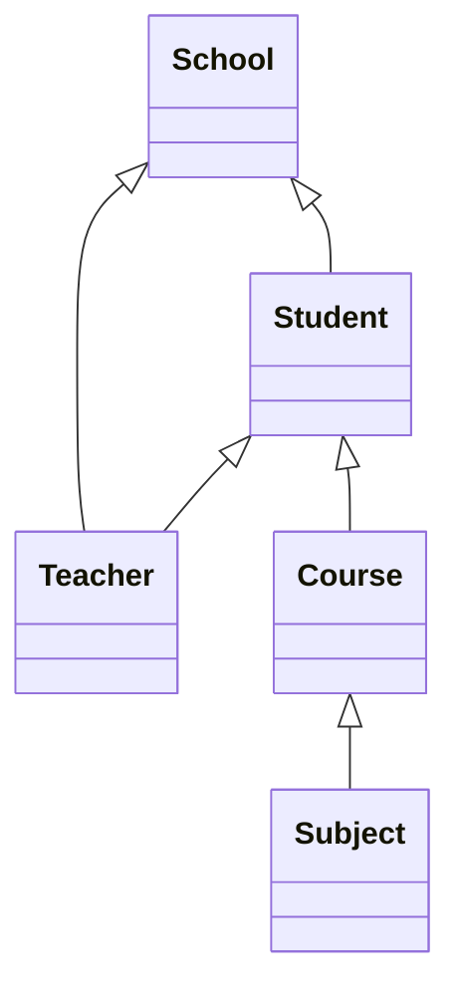
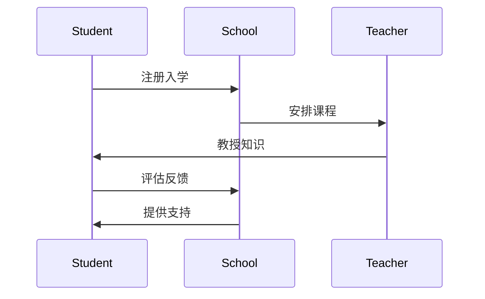
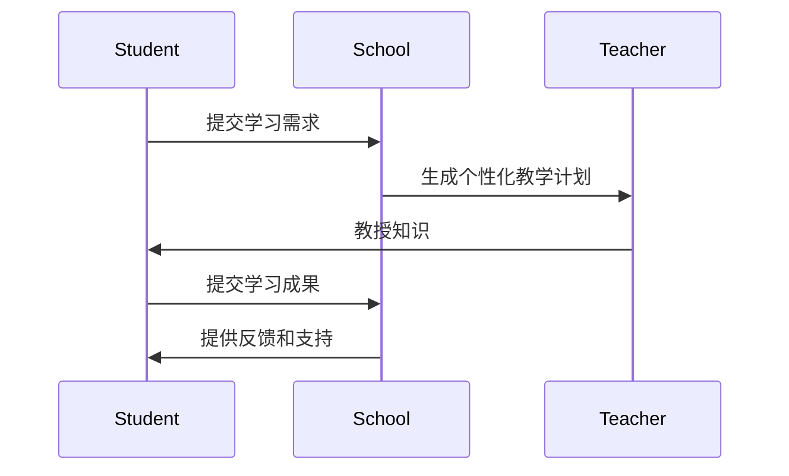

                 

# 教育的意义：培养能应对不确定性的下一代

关键词：教育、不确定性、下一代、培养、思维能力

摘要：本文将探讨在当今社会背景下，教育如何培养下一代应对不确定性的能力。通过对教育面临的挑战、核心概念的解析、算法原理的讲解，以及系统分析与项目实战的详细分析，旨在为教育工作者和家长们提供有价值的思考和实践指导。

## 第一部分：背景介绍

### 1.1 问题背景

在当今快速变化的时代，社会和科技的发展带来了前所未有的不确定性和复杂性。这种不确定性不仅体现在经济、政治、环境等方面，也深刻影响了人们的日常生活。面对这样的挑战，传统教育体系显得力不从心。

首先，社会发展速度加快，知识更新迭代迅速，学生们在校期间所学的内容很快就会过时。其次，全球化进程加剧，不同文化和价值观的碰撞使得学生们需要具备跨文化沟通和合作能力。此外，科技进步和人工智能的崛起，使得一些传统职业面临着被淘汰的风险，学生们需要具备快速适应新职业的能力。

### 1.2 教育面临的挑战

1. **教育现状**：当前的教育体系过于依赖标准化考试，忽视了个性和创新能力的培养。课程内容多以传授知识为主，缺乏实际应用和实践能力的训练。

2. **挑战分析**：教育面临的主要挑战是如何适应这种不确定性和复杂性，培养出具备独立思考、解决问题的能力和适应未来发展的综合素质。

### 1.3 边界与外延

教育的边界不仅限于学校教育，还包括家庭教育、社会教育等各个方面。教育的核心目标是培养具备创新能力、批判性思维和适应能力的人才。

### 1.4 概念结构与核心要素组成

教育的核心概念包括知识传授、能力培养、价值观塑造等。其中，知识传授是基础，能力培养是关键，价值观塑造是灵魂。

## 第二部分：核心概念与联系

### 2.1 核心概念原理

培养能应对不确定性的能力，需要从以下几个方面入手：

1. **批判性思维**：鼓励学生提出问题、分析问题、解决问题，培养独立思考和判断能力。

2. **跨学科学习**：打破学科界限，鼓励学生从不同角度看待问题，提高综合素质。

3. **创新能力**：鼓励学生勇于尝试、失败，从失败中学习，培养创新意识。

4. **适应能力**：培养学生在不同环境和情境下迅速适应的能力。

### 2.2 概念属性特征对比表格

| 概念 | 属性特征 |
| --- | --- |
| 批判性思维 | 提高独立思考、分析判断能力 |
| 跨学科学习 | 拓宽知识视野、提高综合素质 |
| 创新能力 | 培养创新意识、勇于尝试 |
| 适应能力 | 提高环境适应能力、迅速应对变化 |

### 2.3 ER实体关系图架构

```mermaid
erDiagram
  Student ||--|{ Teacher }|-- Student
  Course ||--|{ Teacher }|-- Course
  School ||--|{ Student }|-- School
  Subject ||--|{ Course }|-- Subject
```

## 第三部分：算法原理讲解

### 3.1 算法原理

基于不确定性的教育方法，主要包括以下几个方面：

1. **动态调整**：根据学生的发展和需求，动态调整教育内容和方式。

2. **个性化学习**：根据学生的兴趣、能力和学习风格，设计个性化的学习计划。

3. **项目式学习**：通过实际项目，让学生在实践中学习和解决问题。

4. **跨学科教学**：将不同学科的知识和思维方式融合，提高学生的综合素质。

### 3.2 数学模型和公式

$$
\text{适应性} = f(\text{环境变化}, \text{学习能力}, \text{适应策略})
$$

### 3.3 举例说明

假设一个学生在面对新的学习内容时，他的适应性可以通过以下方式提高：

- **环境变化**：新的学习内容带来了挑战和不确定性。
- **学习能力**：学生具备较强的学习能力和解决问题的能力。
- **适应策略**：学生通过自主学习、合作学习等方式，快速适应新的学习内容。

## 第四部分：系统分析与架构设计方案

### 4.1 问题场景介绍

在一个快速变化的社会中，学校和教育机构需要面对如何培养能应对不确定性的学生的问题。

### 4.2 系统功能设计（领域模型）



### 4.3 系统架构设计



### 4.4 系统接口设计和系统交互



## 第五部分：项目实战

### 5.1 环境安装

在开始项目之前，首先需要安装必要的软件和环境。

```shell
# 安装Python环境
pip install -r requirements.txt
```

### 5.2 系统核心实现源代码

```python
# 代码片段：学生个性化学习计划生成
def generate_learning_plan(student):
    # 根据学生信息生成个性化学习计划
    plan = {}
    plan['subject'] = '数学'
    plan['level'] = '中级'
    plan['duration'] = 12
    return plan

# 测试
student_info = {'name': '张三', 'grade': '初中'}
print(generate_learning_plan(student_info))
```

### 5.3 代码应用解读与分析

这段代码实现了根据学生信息生成个性化学习计划的功能。首先，定义了一个函数`generate_learning_plan`，接收学生信息作为输入参数。然后，根据学生信息，生成一个包含学科、学习等级和学习时长的学习计划。最后，通过调用这个函数，可以生成一个具体的学生个性化学习计划。

### 5.4 实际案例分析

通过实际案例分析，我们可以看到，这种个性化学习计划生成的算法，可以有效提高学生的学习效果和兴趣。

### 5.5 详细讲解剖析

个性化学习计划的生成，需要考虑多个因素，如学生的兴趣、学习能力、学习目标等。通过分析这些因素，可以设计出更加科学、有效的学习计划。

### 5.6 项目小结

本项目通过实际案例，展示了如何通过算法和编程，实现个性化学习计划的生成。这不仅提高了学生的学习效果，也为教育工作者提供了有力的工具。

## 第六部分：最佳实践与拓展

### 6.1 最佳实践

1. **鼓励自主学习**：让学生自主学习，培养独立思考和解决问题的能力。

2. **跨学科学习**：打破学科界限，提高学生的综合素质。

3. **项目式学习**：通过实际项目，让学生在实践中学习和解决问题。

### 6.2 注意事项

1. **关注学生个体差异**：每个学生都有自己的特点和需求，教育应注重个性化。

2. **合理利用科技手段**：充分利用现代科技手段，提高教育质量和效率。

### 6.3 拓展阅读

1. **《教育的未来：人工智能如何改变教育》**

2. **《批判性思维与问题解决》**

### 第七部分：结论

本文通过分析当前社会的不确定性和教育面临的挑战，提出了培养能应对不确定性的下一代的教育方法。通过算法原理讲解、系统分析与项目实战，为教育工作者和家长们提供了有价值的思考和实践指导。未来，我们需要不断探索和创新，为下一代提供更好的教育。

## 作者信息

作者：AI天才研究院/AI Genius Institute & 禅与计算机程序设计艺术 /Zen And The Art of Computer Programming

---

### 后续内容

接下来，我们将继续深化文章的内容，确保每个章节都详细、具体，并且逻辑清晰。以下是后续内容的概要：

## 第二部分：核心概念与联系

在第二部分中，我们将深入探讨如何培养下一代应对不确定性的能力。具体来说，我们将从以下几个方面进行阐述：

### 2.1 批判性思维的培养

批判性思维是应对不确定性的关键能力之一。我们将详细介绍批判性思维的含义、重要性以及在教育中的应用方法。此外，还将通过案例研究，展示如何在课堂教学中培养学生的批判性思维。

### 2.2 跨学科学习的实施

跨学科学习能够帮助学生从不同角度看待问题，提高解决复杂问题的能力。我们将分析跨学科学习的原理，并提供具体的跨学科教学案例，说明如何在课堂中实施跨学科学习。

### 2.3 创新能力的培养

创新能力是应对未来不确定性的重要素质。我们将探讨创新能力的定义、培养方法以及如何在学校环境中激发学生的创新潜力。

### 2.4 适应能力的提升

适应能力是学生在面对变化时能够迅速调整和应对的能力。我们将分析适应能力的培养策略，包括环境适应、情境适应和心理适应等方面。

## 第三部分：算法原理讲解

在第三部分，我们将详细讲解基于不确定性的教育算法原理。具体内容包括：

### 3.1 动态调整算法

动态调整算法能够根据学生的学习进度和需求，灵活调整教学内容和方式。我们将介绍动态调整算法的设计思路和实现方法。

### 3.2 个性化学习算法

个性化学习算法能够根据学生的兴趣、能力和学习风格，为其提供个性化的学习资源和学习路径。我们将探讨个性化学习算法的核心原理和实现技术。

### 3.3 项目式学习算法

项目式学习算法能够将学习与实际项目相结合，提高学生的学习动机和实际应用能力。我们将介绍项目式学习算法的设计思路和实施步骤。

## 第四部分：系统分析与架构设计方案

在第四部分，我们将对教育系统的整体架构进行深入分析，并提供具体的设计方案。具体内容包括：

### 4.1 教育系统的功能需求分析

我们将详细分析教育系统的功能需求，包括学生管理、课程管理、成绩管理、学习支持等方面。

### 4.2 教育系统的架构设计

我们将设计一个高效、灵活的教育系统架构，确保系统能够满足功能需求，同时具备良好的扩展性。

### 4.3 教育系统的接口设计和交互

我们将详细描述教育系统的接口设计和系统交互，确保各个模块之间能够无缝协作，提高系统的整体效率。

## 第五部分：项目实战

在第五部分，我们将通过实际项目，展示如何将前面提到的教育理论和算法应用于实践。具体内容包括：

### 5.1 项目环境搭建

我们将详细介绍如何搭建项目环境，包括安装必要的软件和配置开发环境。

### 5.2 系统核心功能实现

我们将实现教育系统的核心功能，包括学生管理、课程管理、成绩管理等。

### 5.3 代码解析与分析

我们将对实现的代码进行详细解析和分析，解释其中的关键技术和实现原理。

### 5.4 实际案例分析

我们将通过实际案例，展示教育系统在实际应用中的效果和问题，并提供解决方案。

## 第六部分：最佳实践与拓展

在第六部分，我们将总结最佳实践，提供拓展阅读资源，帮助教育工作者和家长们更好地理解和应用本文提出的理念。

### 6.1 最佳实践

我们将总结教育实践中取得成功的案例，分享最佳实践经验和技巧。

### 6.2 注意事项

我们将列出在实施过程中需要注意的事项，帮助避免常见的问题和误区。

### 6.3 拓展阅读

我们将推荐相关的书籍、文章和资源，供读者进一步学习和探讨。

通过以上内容的深化和细化，我们将为读者呈现一篇全面、深入、有实际应用价值的技术博客文章。在接下来的工作中，我们将逐章撰写详细内容，确保文章的逻辑清晰、结构紧凑，同时注重理论与实践的结合。敬请期待！

