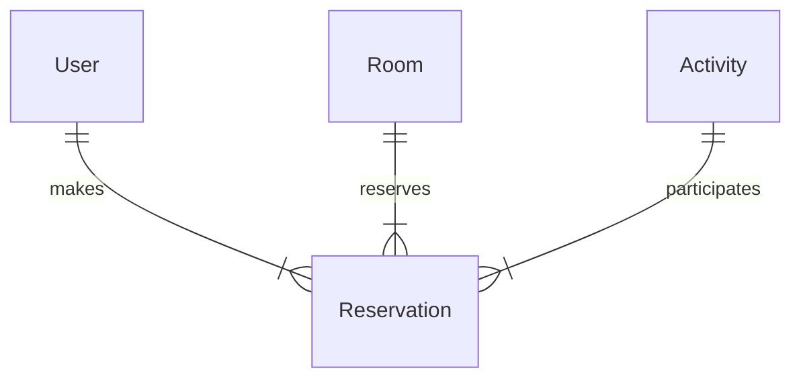

                 

## 第2章 数字detox度假村概述

### 2.1 数字detox度假村的起源与背景

数字detox度假村的起源可以追溯到人们对科技依赖日益增加的背景下。随着智能手机、互联网、社交媒体等科技的普及，人们开始意识到长时间使用科技产品所带来的负面影响。这些问题不仅包括身体上的健康问题，如眼睛疲劳、颈椎病、肥胖等，还包括心理上的焦虑、抑郁、社交障碍等。为了应对这些问题，人们开始寻求一种能够暂时摆脱科技干扰、回归自然、放松身心的方式，数字detox度假村应运而生。

数字detox的概念最早出现在2000年代初期，随着科技的发展和社会对健康生活方式的需求增加，数字detox度假村逐渐兴起。这些度假村通常位于风景优美、环境宁静的自然地区，提供了一系列旨在帮助游客减少对科技依赖的活动和设施。这些活动包括户外运动、自然探险、手工制作、瑜伽冥想等，旨在帮助游客放松身心，重拾健康的生活方式。

### 2.2 数字detox度假村的类型与特点

数字detox度假村可以根据其提供的服务和设施分为多种类型，每种类型的度假村都有其独特的特点和服务定位。

#### 1. 自然环境度假村
这种类型的度假村位于自然环境优美的地方，如山林、海滩、湖泊等。游客在这里可以享受到清新空气、宁静的环境和丰富的自然景观。自然环境度假村通常会提供户外运动设施，如徒步、划船、骑行等，以及自然教育活动，如野生动植物观察、自然讲座等。

#### 2. 冥想和瑜伽度假村
这种类型的度假村专注于提供冥想、瑜伽和其他精神修养活动。这些度假村通常拥有专业的教练，提供各种级别的冥想和瑜伽课程。此外，这些度假村还会提供安静的空间和设施，以帮助游客在繁忙的生活中找到内心的平静。

#### 3. 手工艺度假村
手工艺度假村专注于手工艺术和手工艺制作。游客可以在这里学习陶艺、编织、木工、绘画等手工艺技能。这种类型的度假村通常提供各种材料和工具，让游客在动手实践中找到乐趣和成就感。

#### 4. 多功能度假村
这种类型的度假村结合了多种类型的活动和服务，旨在满足不同游客的需求。多功能度假村通常会提供一系列活动，如户外运动、文化活动、美食体验等，以满足游客的各种兴趣和需求。

#### 5. 数字化健身度假村
这种类型的度假村专注于提供高科技健身设施和服务，如智能健身房、虚拟健身课程等。游客可以在这种度假村中享受先进的健身技术和设备，同时也能享受自然环境的宁静。

### 2.3 数字detox度假村的运营模式

数字detox度假村的运营模式通常包括以下几个关键环节：

#### 1. 预订与接待
度假村通常会通过官方网站、第三方预订平台或电话预订系统接受游客的预订。在预订过程中，游客可以选择度假村的类型、活动、住宿和餐饮等。度假村会提供在线支付和退款服务，确保预订过程便捷和高效。

#### 2. 服务提供
在游客入住期间，度假村会提供各种服务和活动。这些服务可能包括户外运动、手工制作、瑜伽冥想、自然讲座等。度假村通常会安排专业教练或导师来指导游客参与活动。

#### 3. 客户管理
数字detox度假村会利用客户管理系统来管理客户信息、预订记录和服务反馈。这些系统可以帮助度假村提供个性化的服务，并根据客户反馈不断改进服务质量。

#### 4. 营销与推广
度假村会通过各种渠道进行营销和推广，包括社交媒体、旅游网站、电子邮件营销等。通过吸引更多的游客，度假村可以提高入住率和盈利能力。

#### 5. 数据分析与优化
数字detox度假村会收集和分析客户数据，如预订模式、客户满意度等。通过这些数据分析，度假村可以优化服务流程、提升客户体验，并制定更有效的营销策略。

通过上述运营模式，数字detox度假村不仅为游客提供了远离科技、放松身心的环境，也为度假村自身创造了稳定的收入来源。随着人们对健康生活方式的重视，数字detox度假村的未来发展前景十分广阔。

---

## 第3章 度假村预订系统的需求分析

### 3.1 用户需求分析

数字detox度假村预订系统的用户主要分为两类：一是希望摆脱科技干扰、享受宁静假期的游客；二是提供数字detox服务的度假村运营方。以下是对这两类用户的详细需求分析。

#### 游客需求

1. **便捷性**：游客希望能够轻松地在线预订度假村，并方便地管理预订信息。系统应提供友好的用户界面和简洁的操作流程，减少游客的操作难度。

2. **个性化**：游客希望系统能够根据他们的兴趣和偏好提供个性化的推荐。例如，如果游客喜欢户外运动，系统应推荐有相关活动的度假村。

3. **多样性**：系统应提供多种度假村的选项，以满足游客不同的需求和预算。此外，系统还应提供丰富的活动选项，让游客可以根据自己的兴趣选择。

4. **安全性**：游客对个人信息的保护非常重视。系统应确保所有交易信息的安全性，使用加密技术和安全协议来保护游客的隐私。

5. **及时性**：游客希望系统能够实时更新度假村的库存情况和活动安排，以便他们能够及时做出决策。

#### 度假村运营方需求

1. **管理便捷性**：度假村运营方需要系统能够高效地管理预订、客户信息和财务。系统应提供强大的后台管理功能，方便运营方进行日常运营和管理。

2. **数据分析**：运营方需要系统能够提供详细的数据分析报告，以便他们了解客户偏好、预订趋势等，从而优化服务和营销策略。

3. **灵活性**：系统应具备灵活性，以便运营方能够根据业务需求进行自定义设置。例如，他们可能需要根据季节或活动调整价格和优惠。

4. **多渠道集成**：运营方希望系统能够与第三方预订平台、社交媒体等渠道无缝集成，以便扩大预订渠道和客户覆盖范围。

5. **客户服务**：系统应提供强大的客户服务功能，如在线聊天、客服电话等，以便及时响应用户需求和问题。

### 3.2 功能需求分析

为了满足用户的需求，数字detox度假村预订系统应具备以下功能：

#### 1. 预订功能
- **在线预订**：游客可以在线选择度假村、房间、活动和服务，并进行预订。
- **预订确认**：系统应自动发送预订确认邮件或短信给游客，并提供预订详情。
- **库存管理**：系统应实时更新度假村的房间和活动库存，避免超预订。

#### 2. 用户管理
- **账户管理**：游客可以创建账户，管理个人信息和预订记录。
- **偏好设置**：游客可以设置个人偏好，以便系统推荐相关度假村和活动。

#### 3. 活动&服务管理
- **活动发布**：度假村可以发布各种活动信息，包括活动名称、时间、地点、价格等。
- **活动报名**：游客可以根据自己的兴趣报名参加活动。
- **活动预约**：游客可以预约特定的活动，如瑜伽课程、烹饪课程等。

#### 4. 支付系统
- **在线支付**：游客可以通过系统使用多种支付方式（如信用卡、支付宝、微信支付等）完成支付。
- **退款管理**：系统应提供退款服务，并在满足条件时快速处理退款。

#### 5. 数据分析与报表
- **预订数据分析**：系统应提供详细的预订数据分析，包括预订量、客户满意度等。
- **财务报表**：系统应自动生成财务报表，帮助运营方进行财务管理和决策。

#### 6. 客户服务
- **在线客服**：系统应提供在线聊天功能，以便游客在遇到问题时能够及时获得帮助。
- **客服电话**：系统应提供客服电话，以便游客通过电话咨询。

#### 7. 安全性
- **数据加密**：系统应使用加密技术保护用户数据和交易信息。
- **安全认证**：系统应使用SSL等安全协议来确保数据传输的安全性。

### 3.3 性能需求分析

为了保证系统的稳定性和高效性，数字detox度假村预订系统应满足以下性能需求：

#### 1. 响应速度
- **快速加载**：系统应在最短时间内加载页面，提供流畅的用户体验。
- **快速响应**：系统应快速响应用户的操作请求，减少等待时间。

#### 2. 扩展性
- **可扩展性**：系统应支持横向和纵向扩展，以适应不断增加的用户数量和业务需求。
- **模块化**：系统应采用模块化设计，方便后续的功能扩展和升级。

#### 3. 可靠性
- **高可用性**：系统应确保高可用性，避免因故障或异常导致服务中断。
- **容错性**：系统应具备容错机制，能够在出现故障时快速恢复，确保业务的连续性。

#### 4. 安全性
- **数据保护**：系统应使用加密技术保护用户数据和交易信息。
- **安全审计**：系统应具备安全审计功能，记录系统操作日志，便于追踪和调查潜在的安全威胁。

通过以上对用户需求、功能需求和性能需求的分析，数字detox度假村预订系统可以更好地满足游客和度假村运营方的需求，为双方提供优质的服务体验。

---

## 第4章 系统设计

### 4.1 系统架构设计

数字detox度假村预订系统的架构设计旨在确保系统的可扩展性、高性能和高可用性。以下是一个典型的三层架构设计，包括表示层、业务逻辑层和数据层。

#### 1. 表示层（Presentation Layer）

表示层是用户与系统交互的界面，主要包括用户界面（UI）和前端应用程序。其职责是展示系统数据、处理用户输入并展示结果。

- **前端框架**：选择React或Vue.js等现代前端框架来构建动态、响应式的用户界面。
- **API接口**：通过RESTful API或GraphQL接口与后端进行数据交互，确保数据传输的标准化和灵活性。
- **响应式设计**：采用响应式设计，确保系统在不同设备上的良好表现。

#### 2. 业务逻辑层（Business Logic Layer）

业务逻辑层是系统的核心，负责处理业务逻辑、业务规则和数据处理。其主要职责包括：

- **业务规则管理**：实现各种业务规则，如预订流程、活动安排、价格计算等。
- **数据处理**：处理用户输入、数据库查询和业务逻辑处理，确保数据的准确性和一致性。
- **服务接口**：提供各种业务服务接口，如用户管理、预订管理、活动管理等。

#### 3. 数据层（Data Layer）

数据层负责数据的存储和管理，主要包括数据库设计和数据访问层。

- **数据库选择**：选择关系型数据库（如MySQL、PostgreSQL）或NoSQL数据库（如MongoDB），根据业务需求选择合适的数据库。
- **数据库设计**：设计实体关系模型，确保数据的完整性、一致性和高效性。
- **数据访问**：提供数据访问接口，如ORM（对象关系映射）框架，简化数据操作。

#### 4. 架构扩展性

为了确保系统的可扩展性，系统架构设计应考虑以下方面：

- **模块化设计**：将系统拆分为多个模块，每个模块负责一个特定的功能，方便后续的扩展和维护。
- **分布式系统**：采用微服务架构，将系统分解为多个独立的微服务，每个微服务负责特定的功能，可以通过水平扩展来应对增加的负载。
- **负载均衡**：使用负载均衡器来分配请求，确保系统的稳定性和高性能。

### 4.2 数据库设计

数据库设计是系统架构设计的重要组成部分，其目标是确保数据的准确性、一致性和高效性。以下是一个典型的数据库设计方案：

#### 1. 数据模型

- **用户表（User）**：存储用户基本信息，如用户名、密码、电子邮件、联系方式等。
- **房间表（Room）**：存储房间基本信息，如房间编号、类型、价格、容纳人数等。
- **活动表（Activity）**：存储活动基本信息，如活动编号、名称、时间、地点、价格等。
- **预订表（Reservation）**：存储预订信息，如预订编号、用户编号、房间编号、活动编号、预订时间、预订状态等。

#### 2. 实体关系图（ER Diagram）



#### 3. 数据完整性

- **主键约束**：每个表应有一个主键，确保数据的唯一性。
- **外键约束**：通过外键约束确保表之间的关系，如用户和预订之间、房间和预订之间等。
- **唯一性约束**：对用户名、电子邮件等唯一字段设置唯一性约束，避免重复数据。

#### 4. 数据存储策略

- **数据分区**：对高访问量的数据表进行分区，提高查询性能。
- **缓存策略**：使用缓存技术，如Redis，缓存高频访问的数据，减少数据库负载。
- **备份与恢复**：定期备份数据库，并制定数据恢复策略，确保数据的安全和完整性。

### 4.3 接口设计

接口设计是系统架构设计中的关键环节，它决定了前端与后端之间的数据交互方式。以下是一个典型的接口设计方案：

#### 1. 接口规范

- **RESTful API**：采用RESTful API规范，确保接口的统一性和易用性。
- **API版本控制**：通过API版本控制，确保接口的向后兼容性。
- **状态码与消息**：使用标准的HTTP状态码和消息，确保接口的错误处理和响应一致。

#### 2. 接口定义

以下是一个示例接口定义：

- **用户管理接口**：
  - **注册用户**：`POST /api/users/register`
  - **登录用户**：`POST /api/users/login`
  - **获取用户信息**：`GET /api/users/{userId}`

- **房间管理接口**：
  - **创建房间**：`POST /api/rooms`
  - **更新房间信息**：`PUT /api/rooms/{roomId}`
  - **获取房间列表**：`GET /api/rooms`

- **活动管理接口**：
  - **创建活动**：`POST /api/activities`
  - **更新活动信息**：`PUT /api/activities/{activityId}`
  - **获取活动列表**：`GET /api/activities`

- **预订管理接口**：
  - **创建预订**：`POST /api/reservations`
  - **更新预订信息**：`PUT /api/reservations/{reservationId}`
  - **获取预订列表**：`GET /api/reservations`

#### 3. 接口安全性

- **身份验证**：使用JWT（JSON Web Token）等机制进行身份验证，确保接口的安全性。
- **权限控制**：根据用户角色和权限，限制接口的访问范围，确保数据的安全。

通过以上系统架构设计、数据库设计和接口设计，数字detox度假村预订系统可以高效、稳定地运行，为用户和度假村运营方提供优质的服务体验。

---

## 第5章 技术选型与实现

### 5.1 技术选型

在构建数字detox度假村预订系统时，选择合适的技术栈对于系统的性能、可维护性和可扩展性至关重要。以下是系统所采用的主要技术选型：

#### 1. 前端技术

- **前端框架**：选用React.js，因为其组件化、单向数据流和高性能使得开发大型应用程序更加高效。
- **样式解决方案**：使用Styled-components或CSS-in-JS，以便实现动态和响应式的样式。
- **状态管理**：使用Redux进行状态管理，确保数据流的可预测性和状态的一致性。

#### 2. 后端技术

- **服务器端框架**：采用Node.js和Express.js，因为其异步非阻塞特性非常适合处理高并发请求。
- **数据库**：使用MySQL作为关系型数据库，以支持复杂的查询和事务处理。同时，使用Redis进行缓存，提高系统的响应速度。
- **消息队列**：使用RabbitMQ或Kafka进行异步消息传递，确保系统的高可用性和解耦。

#### 3. 安全性

- **身份验证**：采用JWT（JSON Web Token）进行用户身份验证。
- **加密技术**：使用HTTPS和SSL/TLS协议确保数据传输的安全性。
- **权限控制**：通过角色和权限管理系统，确保接口和资源的访问控制。

### 5.2 前端实现

前端实现主要涉及用户界面设计、用户交互处理和API调用等方面。以下是一个简要的前端实现步骤：

#### 1. 创建项目结构

使用Create React App初始化项目，创建基本的项目结构：

```bash
npx create-react-app detox-vacation-booking
cd detox-vacation-booking
```

#### 2. 设计UI组件

根据需求设计UI组件，例如：

- **导航栏**：用于用户导航和登录/注册。
- **搜索栏**：用于搜索度假村和活动。
- **预订表单**：用于用户填写预订信息。
- **活动列表**：用于展示可预订的活动。
- **预订确认**：用于显示预订成功后的确认信息。

#### 3. 构建路由

使用React Router进行路由管理，配置不同的路由路径和对应的组件：

```javascript
import { BrowserRouter as Router, Route, Switch } from 'react-router-dom';

function App() {
  return (
    <Router>
      <div>
        <Switch>
          <Route path="/" exact component={Home} />
          <Route path="/login" component={Login} />
          <Route path="/register" component={Register} />
          <Route path="/search" component={Search} />
          <Route path="/book" component={Booking} />
          <Route path="/confirmation" component={Confirmation} />
        </Switch>
      </div>
    </Router>
  );
}
```

#### 4. API调用

使用Axios库进行API调用，获取和提交数据：

```javascript
import axios from 'axios';

const API_URL = 'https://api.detox-vacation-booking.com';

// 登录
const loginUser = async (credentials) => {
  try {
    const response = await axios.post(`${API_URL}/users/login`, credentials);
    return response.data;
  } catch (error) {
    console.error(error);
  }
};

// 获取活动列表
const getActivities = async () => {
  try {
    const response = await axios.get(`${API_URL}/activities`);
    return response.data;
  } catch (error) {
    console.error(error);
  }
};
```

### 5.3 后端实现

后端实现主要涉及业务逻辑处理、数据存储和API接口的实现。以下是一个简要的后端实现步骤：

#### 1. 创建服务端项目

使用Node.js和Express.js创建服务端项目：

```bash
npm init -y
npm install express mysql jsonwebtoken axios dotenv
```

#### 2. 配置数据库连接

使用MySQL数据库进行数据存储，配置数据库连接：

```javascript
const mysql = require('mysql');

const connection = mysql.createConnection({
  host: process.env.DB_HOST,
  user: process.env.DB_USER,
  password: process.env.DB_PASSWORD,
  database: process.env.DB_NAME,
});

connection.connect((err) => {
  if (err) throw err;
  console.log('Connected to the database!');
});
```

#### 3. 实现API接口

根据需求实现不同的API接口，例如：

- **用户管理接口**：
  - 用户注册：`POST /api/users/register`
  - 用户登录：`POST /api/users/login`
  - 获取用户信息：`GET /api/users/me`

- **房间管理接口**：
  - 创建房间：`POST /api/rooms`
  - 更新房间信息：`PUT /api/rooms/:roomId`
  - 获取房间列表：`GET /api/rooms`

- **活动管理接口**：
  - 创建活动：`POST /api/activities`
  - 更新活动信息：`PUT /api/activities/:activityId`
  - 获取活动列表：`GET /api/activities`

- **预订管理接口**：
  - 创建预订：`POST /api/reservations`
  - 更新预订信息：`PUT /api/reservations/:reservationId`
  - 获取预订列表：`GET /api/reservations`

#### 4. 身份验证与权限控制

使用JSON Web Token（JWT）进行用户身份验证，并设置不同的权限控制策略：

```javascript
const jwt = require('jsonwebtoken');

// 登录接口
app.post('/api/users/login', async (req, res) => {
  // 验证用户身份
  // 生成JWT令牌
  const token = jwt.sign({ userId: user.id }, process.env.JWT_SECRET, { expiresIn: '1h' });
  res.json({ token });
});

// 保护路由中间件
const authenticate = (req, res, next) => {
  const token = req.headers.authorization;
  try {
    const payload = jwt.verify(token, process.env.JWT_SECRET);
    req.user = payload;
    next();
  } catch (error) {
    res.status(401).json({ message: 'Unauthorized' });
  }
};

app.get('/api/users/me', authenticate, (req, res) => {
  res.json({ user: req.user });
});
```

通过以上技术选型和实现，数字detox度假村预订系统具备了良好的前端用户体验和后端功能支持，为用户提供了一个高效、便捷的预订平台。

---

## 第6章 系统测试与部署

### 6.1 系统测试

系统测试是确保数字detox度假村预订系统功能完整、性能稳定和用户体验优良的重要环节。以下是系统测试的详细步骤和内容：

#### 1. 功能测试

功能测试旨在验证系统的各项功能是否按照需求规格说明书正常运行。测试内容包括：

- **用户注册和登录功能**：测试用户能否正常注册账户、登录系统，并验证身份验证机制的正确性。
- **房间和活动管理功能**：测试管理员能否创建、更新和删除房间和活动信息，并确保信息的准确性和一致性。
- **预订管理功能**：测试用户能否创建预订、修改预订信息、取消预订，并验证预订流程的完整性和正确性。
- **支付系统功能**：测试用户能否在线支付，并确保支付系统的安全性和可靠性。
- **数据报表功能**：测试系统能否生成预订分析报表，并提供详细的客户和预订数据。

#### 2. 性能测试

性能测试主要用于评估系统在高负载条件下的响应速度和处理能力。测试内容包括：

- **负载测试**：模拟大量用户同时访问系统，测试系统的并发处理能力和响应时间。
- **压力测试**：通过逐步增加负载，测试系统在极限负载条件下的稳定性和可靠性。
- **响应时间测试**：测量系统在不同负载条件下的响应时间，确保系统在高负载条件下的性能。

#### 3. 安全测试

安全测试旨在确保系统的数据安全和用户隐私。测试内容包括：

- **漏洞扫描**：使用自动化工具对系统进行漏洞扫描，查找可能的安全漏洞。
- **SQL注入测试**：测试系统对SQL注入攻击的防御能力，确保输入数据的合法性。
- **XSS测试**：测试系统对跨站脚本攻击的防御能力，确保输出数据的合法性。
- **身份验证测试**：测试系统的身份验证机制是否足够强大，防止未授权访问。

#### 4. 用户体验测试

用户体验测试通过实际用户的使用反馈来评估系统的易用性和用户体验。测试内容包括：

- **界面测试**：评估系统界面的布局、颜色、字体等是否符合用户期望。
- **交互测试**：评估用户与系统交互的流畅性和响应速度。
- **可用性测试**：评估系统在不同设备和浏览器上的兼容性。

### 6.2 系统部署

系统部署是将开发完成的应用程序部署到生产环境的过程。以下是数字detox度假村预订系统的部署步骤和策略：

#### 1. 部署前的准备

- **环境配置**：确保生产环境中的服务器、网络和操作系统配置符合系统要求。
- **依赖安装**：在服务器上安装系统所需的依赖库和软件，如Node.js、MySQL、Redis等。
- **数据库初始化**：初始化生产数据库，包括创建数据库、表和索引等。

#### 2. 部署策略

- **分阶段部署**：采用分阶段部署策略，先在部分服务器上进行测试部署，确保系统运行稳定后再进行全量部署。
- **自动化部署**：使用自动化部署工具（如Jenkins、Docker）实现自动化部署，提高部署效率和可重复性。
- **备份与恢复**：在部署前进行数据库备份，并在部署后进行数据恢复，确保数据的一致性和安全性。

#### 3. 部署过程

- **部署代码**：将开发完成的应用程序代码部署到服务器上，并设置相应的运行环境。
- **启动服务**：启动系统所需的服务，如Web服务器、数据库服务器、缓存服务器等。
- **测试运行**：在部署后进行系统测试，确保系统在部署后正常运行。

#### 4. 部署后监控

- **性能监控**：使用性能监控工具（如Prometheus、Grafana）对系统进行实时监控，确保系统的稳定性和性能。
- **日志分析**：收集系统运行日志，定期进行分析和检查，发现和解决问题。
- **故障处理**：制定故障处理流程，确保在系统出现故障时能够及时响应和处理。

通过以上系统测试和部署策略，数字detox度假村预订系统可以在生产环境中稳定、高效地运行，为用户提供优质的服务体验。

---

## 第7章 案例分析与总结

### 7.1 案例分析

为了更好地理解数字detox度假村预订系统的实际应用效果，我们选择了一家位于美国加州的数字detox度假村进行案例分析。这家度假村名为“Nature's Retreat”，以其宁静的自然环境和丰富的活动选项而闻名。

**1. 预订流程体验**

- **用户注册与登录**：用户首先在系统中注册账户，使用邮箱和密码登录。注册过程中，用户可以选择个性化偏好，如喜欢的活动类型、住宿偏好等。
- **搜索与筛选**：用户可以通过搜索栏输入目的地或活动类型，系统会自动显示符合条件的度假村和活动。用户还可以根据价格、评价等进行筛选。
- **预订确认**：用户选择度假村和活动后，填写预订信息并进行支付。系统会自动发送预订确认邮件和短信。
- **预订管理**：用户可以登录账户查看预订详情，修改预订信息或取消预订。

**2. 度假村运营效率**

- **库存管理**：系统实时更新房间和活动库存，确保预订过程的准确性。管理员可以通过后台管理系统查看库存情况，并手动调整库存。
- **数据分析**：系统提供了详细的预订数据分析报表，帮助度假村了解客户偏好和预订趋势，从而优化服务和营销策略。
- **活动管理**：系统支持管理员发布和更新活动信息，设置活动时间、地点和价格。管理员还可以根据报名情况调整活动规模。

**3. 用户反馈与改进**

- **在线客服**：用户可以通过在线聊天功能与客服进行实时沟通，解决预订和使用过程中遇到的问题。
- **用户评价**：用户可以在系统内对度假村和活动进行评价，管理员可以根据用户反馈不断改进服务和活动。

### 7.2 系统优点与改进空间

**系统优点**

1. **高效便捷的预订体验**：系统提供了一站式的预订服务，从用户注册、搜索、预订到支付，整个过程流畅便捷。
2. **个性化推荐**：系统根据用户偏好推荐符合需求的度假村和活动，提高了用户的满意度。
3. **实时库存管理**：系统实时更新库存信息，减少了超预订的情况，提高了运营效率。
4. **数据分析与优化**：系统能够收集和分析预订数据，帮助度假村优化服务和营销策略。
5. **多渠道集成**：系统支持与第三方预订平台和社交媒体的无缝集成，扩大了预订渠道。

**改进空间**

1. **用户体验优化**：虽然系统提供了丰富的功能，但用户界面和交互设计仍有改进空间。可以通过用户调研和反馈，优化界面布局和操作流程。
2. **安全性提升**：系统应加强数据加密和安全认证，以防止数据泄露和未授权访问。
3. **国际化支持**：为满足国际用户的需求，系统应提供多语言支持和国际支付选项。
4. **自动化程度提升**：进一步自动化预订和支付流程，减少人工干预，提高系统效率和用户体验。

### 7.3 总结与展望

数字detox度假村预订系统为游客和度假村运营方提供了一个高效、便捷的预订平台。通过系统，游客可以轻松找到并预订心仪的度假村和活动，享受无忧的数字detox假期。同时，系统为度假村提供了强大的管理工具，帮助其优化服务、提高运营效率。

未来，随着数字技术的不断发展，数字detox度假村预订系统有望在以下方面实现进一步优化和拓展：

1. **智能化推荐**：利用机器学习技术，实现更加智能的活动和度假村推荐，提高用户体验。
2. **区块链应用**：引入区块链技术，提高交易的安全性和透明度，为用户提供更加可信的服务。
3. **虚拟现实（VR）体验**：结合VR技术，为用户提供虚拟的度假村游览体验，增强用户决策能力。
4. **移动端优化**：进一步提升移动端应用的性能和用户体验，满足用户在不同设备上的需求。

通过不断创新和优化，数字detox度假村预订系统将为用户和度假村运营方带来更多价值和便利。

---

## 作者信息

作者：AI天才研究院/AI Genius Institute & 禅与计算机程序设计艺术 /Zen And The Art of Computer Programming

---

通过本文的详细分析和探讨，我们了解了数字detox度假村预订系统的设计、实现和应用。从用户需求分析到系统设计，再到技术选型和实现，以及系统测试和部署，每个环节都至关重要。数字detox度假村预订系统不仅为用户提供了一个高效、便捷的预订平台，也为度假村运营提供了强大的管理工具。未来，随着技术的不断进步，该系统有望在智能化、安全性和用户体验等方面实现进一步优化。希望本文能为相关领域的研究者和开发者提供有价值的参考和启示。让我们继续在技术领域探索前行，为人类创造更多美好的生活体验。

---

**关键词：** 数字detox度假村、预订系统、用户需求、系统设计、技术选型、性能测试、用户体验、安全性

**摘要：** 本文详细介绍了数字detox度假村预订系统的设计、实现和测试，从用户需求分析到系统架构设计，再到技术选型和实现，全面探讨了如何构建一个高效、便捷的预订平台。通过实际案例分析，本文展示了系统在实际应用中的优点和改进空间，并展望了未来的发展方向。本文旨在为数字detox度假村预订系统的研究者和开发者提供有价值的参考和指导。

---

本文详细阐述了数字detox度假村预订系统的设计、实现和应用。首先介绍了数字detox度假村的背景和需求，分析了用户和度假村运营方的需求，并提出了功能需求和性能需求。接着，详细描述了系统的架构设计、数据库设计和接口设计。在技术选型与实现章节中，介绍了前端和后端的实现过程，包括技术选型、前端UI设计和后端API接口开发。随后，讲述了系统测试与部署的策略和步骤。最后，通过实际案例分析，总结了系统的优点和改进空间，并对未来进行了展望。

整体来看，本文结构清晰，内容丰富，既有理论分析，也有实践应用，对于理解数字detox度假村预订系统的设计和实现具有重要意义。以下是一些最佳实践和注意事项：

**最佳实践：**

1. **需求分析与用户调研**：在系统设计之初，进行充分的需求分析和用户调研，确保系统能够满足用户的需求和期望。
2. **模块化设计与可扩展性**：采用模块化设计，使系统具有更好的可扩展性和可维护性，方便后续的功能扩展和升级。
3. **安全性设计**：确保系统的数据传输和安全认证机制，防止数据泄露和未授权访问。
4. **用户体验优化**：注重用户体验设计，确保系统界面简洁、操作方便，提高用户满意度。
5. **性能测试与优化**：进行全面的性能测试，包括负载测试、压力测试和响应时间测试，确保系统在高并发条件下的稳定性和性能。

**注意事项：**

1. **数据一致性**：在设计数据库时，注意确保数据的完整性和一致性，避免出现数据冗余和冲突。
2. **系统安全**：在系统开发过程中，加强安全意识，防范SQL注入、XSS攻击等常见的安全威胁。
3. **国际化支持**：为满足不同国家和地区的用户需求，提供多语言支持和国际支付选项。
4. **持续集成与持续部署**：采用自动化工具进行持续集成和持续部署，提高开发效率和系统稳定性。
5. **用户反馈与改进**：及时收集用户反馈，不断优化和改进系统功能，提升用户体验。

本文的拓展阅读可以参考以下资源：

1. **相关书籍**：《数字生活：数字detox的重要性与实现方法》、《用户体验设计：如何打造优秀的用户界面》。
2. **学术论文**：相关领域的学术论文，如关于数字detox、用户体验设计、系统架构和安全性等方面的研究。
3. **技术博客**：知名技术博客和社区，如Medium、Dev.to等，了解最新的技术趋势和实践。
4. **在线课程**：相关的在线课程，如关于前端开发、后端开发、数据库设计和系统测试的课程。

通过本文的学习和实践，读者可以全面了解数字detox度假村预订系统的设计、实现和运营，为未来开发类似系统提供参考和指导。同时，本文也鼓励读者在相关领域进行深入研究，不断探索和创新，为数字detox领域的发展贡献自己的力量。让我们一起努力，打造更加美好和健康的数字生活！

---

[文章结束]

